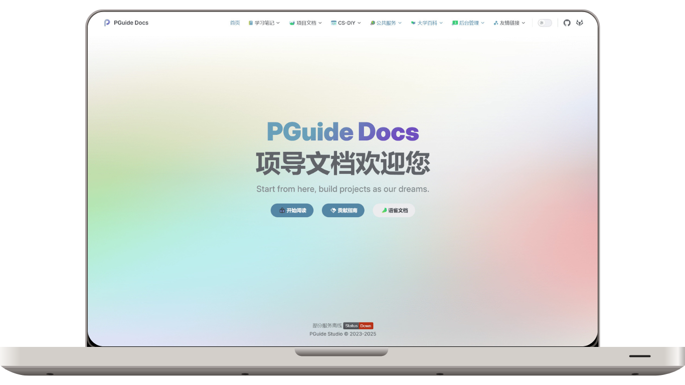

# 🌱 Project Guide Documentation - Building Project-Centric Documentation

[Simplified Chinese](https://github.com/PGuideDev/PGuide-Docs/blob/master/README.md) | English

_We share ideas, build projects as our dreams._

# User Guide

The Project Guide Documentation is centered around project development. The `Learning Notes` aim to address basic issues before development, such as environment setup, technology selection, and design patterns. The `Project Documentation` establishes various project development standards, including the application of intellectual property, and showcases the self-innovated projects of Project Guide Studio. Everyone is welcome to join the development; the `CS-DIY` section is inspired by the computer self-learning guide, which includes learning routes, quality resources, and computer knowledge from various fields of computing.

### Project Guide Documentation Comment System Registration: https://comment.pguide.studio/ui

## Learning Notes

> Currently being organized

As the old saying goes, "The previous generations plant trees, and the next generations enjoy the shade." Here, we have organized our learning notes in various computer fields, helping future learners avoid detours, from installing an operating system to building a compiler from scratch, from HTML to cross-platform development, from virtual simulation to real-world projection, etc. Every document contains the writer's hard work, and perhaps one day, it will help you too.

## Project Documentation

> Currently being organized

There is an ancient saying: “In learning, there are those who start early, and in skills, there are experts.” Experts from different fields of computer science gather here. Modern computer learning emphasizes interdisciplinary knowledge, so we break traditional thinking, share ideas, and invite talented individuals from across the internet to contribute.

Each document will list the technology stack used in the project, the significance and background of the project, the contact information of the person in charge or group chat, and more. Everyone is welcome to join the development. These projects are self-innovated by our studio and have fully independent intellectual property. However, please note that some projects involve unsanitized or commercialized data, so the code for these projects cannot be made public, and we ask for your understanding. What? You ask how intellectual property works? Well, no need to worry about that—since we’re all friends, that’s not important. The key is for everyone to work together, iterate, and improve the product.

## CS-DIY

> Currently being organized

The beginner version of the computer self-learning guide. Most of us don’t have a strong programming foundation, and even Wu Yanzu (famous actor) knows that what university professors teach is limited, so we rely mainly on self-learning. This section gathers excellent online courses, learning routes, and high-quality resources to help new students quickly get started and create personalized learning plans.

## Public Services

This section can be seen as a “side project” of ours. As we are students from Chongqing Medical University, we want to attract other students from our school to join us by providing public services like Overleaf, mirror stations, GitLab, etc. After all, building these services requires some computer knowledge. For these school-level services, the administrators have written detailed deployment and maintenance documents, hoping they can be helpful to you.

On the other hand, GitLab, Overleaf, and other platforms are naturally connected with the Learning Notes, Project Documentation, CS-DIY, and more, facilitating integrated documentation and the establishment of an open-source ecosystem (yes, another area we need to work on). For example, the code in Project Documentation is hosted on the school’s GitLab platform, so students don’t have to go searching for how to use Git or GitLab, improving learning efficiency.

## University Encyclopedia

> Currently being organized

Some miscellaneous topics related to university life, such as the use of student email, tips for competitions, which certifications programmers should consider, and other general knowledge to help students make the most of their time.

# How to Participate

Document writing is inevitably imperfect, so if you notice any deficiencies or have better suggestions for any document, feel free to [issue](https://github.com/PGuideDev/PGuide-Docs/issues) a discussion; if you are an expert and want to share your self-learning experience and resources in other areas, you can [fork](https://github.com/PGuideDev/PGuide-Docs/fork) the project and directly submit a Pull Request. You can also contact us via email (contact@pguide.studio).

# Acknowledgements

## Individuals and Organizations

- [Contributors who wish to disclose their identities](https://docs.pguide.cloud/friends/persons/)
- [Collaborating organizations](https://docs.pguide.cloud/friends/organizations/)

## Referenced Excellent Works

> ILGM: It looks good to me! We also welcome you to recommend other excellent works and PRs :)

- Ac Wiki: [Open Source Construction of Basic Knowledge for Higher Education Community](https://ac-wiki.org/)
- Linux Do Wiki: [LINUX DO Community Wiki](https://wiki.linux.do/)
- Linux 101: [Online Course by the University of Science and Technology of China Linux User Association](https://101.lug.ustc.edu.cn/)
- Linux 201: [Advanced Linux Tutorial](https://201.ustclug.org/)
- Missing Computer Course: [A Computer Course for Beginners](https://www.criwits.top/missing/)
- CSDIY: [Computer Self-Learning Guide](https://csdiy.wiki/)
- Programming Navigation: [Programming Navigation by Programmer Fish Skin](https://www.codefather.cn/course/1789189862986850306)
- Code RoadMap: [Developer Learning Roadmap for Internet Campus Recruitment Technical Positions](https://github.com/forthespada/developer-roadmap-zh-CN)
- OI Wiki: [Algorithm Wiki](https://oi.wiki/)
- CTF Wiki: [CTF Wiki](https://ctf-wiki.org/)
- Hello CTF: [Free and Open-Source CTF Beginner Tutorial](https://hello-ctf.com/)
- Computer Exploration Network: [Find Tools without Getting Lost](https://www.cyhaoka.vip/)
- CTF Archive: [CTF Resource Archive](https://github.com/CTF-Archives)
- CS Books: [Classic Computer Textbooks](https://github.com/forthespada/CS-Books)
- Awesome Courses: [Programming Resources and Course Recommendations](https://github.com/forthespada/Awsome-Courses)
- Java Guide: [Java Learning + Interview Guide](https://javaguide.cn/)
- University Life Guide: [The Path to University Life](https://colleges.chat/)
