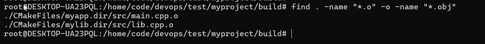

## 一、项目文件创建

### 1. CMakeLists.txt

```cmake
cmake_minimum_required(VERSION 3.20)
project(MyProject VERSION 1.0.0)

# 设置 C++ 标准
set(CMAKE_CXX_STANDARD 17)
set(CMAKE_CXX_STANDARD_REQUIRED ON)

# 打印项目信息
message(STATUS "Configuring ${PROJECT_NAME} version ${PROJECT_VERSION}")
message(STATUS "Build type: ${CMAKE_BUILD_TYPE}")

# 配置库
add_library(mylib STATIC src/lib.cpp src/lib.h)
target_include_directories(mylib PUBLIC ${CMAKE_CURRENT_SOURCE_DIR}/src)

# 配置可执行文件
add_executable(myapp src/main.cpp)
target_link_libraries(myapp PRIVATE mylib)

# 设置输出目录
set_target_properties(myapp mylib PROPERTIES
    RUNTIME_OUTPUT_DIRECTORY ${CMAKE_BINARY_DIR}/bin
    ARCHIVE_OUTPUT_DIRECTORY ${CMAKE_BINARY_DIR}/lib
    LIBRARY_OUTPUT_DIRECTORY ${CMAKE_BINARY_DIR}/lib
)

# 安装配置
install(TARGETS myapp mylib
    RUNTIME DESTINATION bin
    LIBRARY DESTINATION lib
    ARCHIVE DESTINATION lib)

# 安装头文件
install(FILES src/lib.h DESTINATION include)

# 打包配置
include(CPack)

# 打印配置完成信息
message(STATUS "Configuration complete")
```

### 2. src/lib.h

```cpp
#ifndef LIB_H
#define LIB_H

#include <string>
#include <vector>

class Calculator {
public:
    // 基本数学运算
    static int add(int a, int b);
    static int subtract(int a, int b);
    static int multiply(int a, int b);
    static double divide(double a, double b);
    
    // 高级功能
    static std::vector<int> fibonacci(int n);
    static bool isPrime(int n);
    static std::string getVersion();
    
    // 调试信息
    static void printInfo();
};

#endif // LIB_H
```

### 3. src/lib.cpp

```cpp
#include "lib.h"
#include <iostream>
#include <cmath>
#include <vector>
#include <algorithm>

int Calculator::add(int a, int b) {
    return a + b;
}

int Calculator::subtract(int a, int b) {
    return a - b;
}

int Calculator::multiply(int a, int b) {
    return a * b;
}

double Calculator::divide(double a, double b) {
    if (b == 0) {
        std::cerr << "Error: Division by zero!" << std::endl;
        return 0;
    }
    return a / b;
}

std::vector<int> Calculator::fibonacci(int n) {
    std::vector<int> result;
    if (n <= 0) return result;
    
    result.push_back(0);
    if (n == 1) return result;
    
    result.push_back(1);
    for (int i = 2; i < n; i++) {
        result.push_back(result[i-1] + result[i-2]);
    }
    return result;
}

bool Calculator::isPrime(int n) {
    if (n <= 1) return false;
    if (n <= 3) return true;
    if (n % 2 == 0 || n % 3 == 0) return false;
    
    for (int i = 5; i * i <= n; i += 6) {
        if (n % i == 0 || n % (i + 2) == 0) return false;
    }
    return true;
}

std::string Calculator::getVersion() {
    return "1.0.0";
}

void Calculator::printInfo() {
    std::cout << "Calculator Library v" << getVersion() << std::endl;
    std::cout << "Features:" << std::endl;
    std::cout << "  - Basic arithmetic operations" << std::endl;
    std::cout << "  - Fibonacci sequence generator" << std::endl;
    std::cout << "  - Prime number checking" << std::endl;
}
```

### 4. src/main.cpp

```cpp
#include "lib.h"
#include <iostream>
#include <iomanip>

int main() {
    std::cout << "=== Calculator Application ===" << std::endl;
    std::cout << std::endl;
    
    // 显示库信息
    Calculator::printInfo();
    std::cout << std::endl;
    
    // 测试基本运算
    std::cout << "Basic Operations:" << std::endl;
    std::cout << "10 + 5 = " << Calculator::add(10, 5) << std::endl;
    std::cout << "10 - 5 = " << Calculator::subtract(10, 5) << std::endl;
    std::cout << "10 * 5 = " << Calculator::multiply(10, 5) << std::endl;
    std::cout << "10 / 3 = " << std::fixed << std::setprecision(2) 
              << Calculator::divide(10.0, 3.0) << std::endl;
    std::cout << std::endl;
    
    // 测试斐波那契数列
    std::cout << "Fibonacci Sequence (first 10 numbers):" << std::endl;
    auto fib = Calculator::fibonacci(10);
    for (size_t i = 0; i < fib.size(); i++) {
        std::cout << fib[i];
        if (i < fib.size() - 1) std::cout << ", ";
    }
    std::cout << std::endl << std::endl;
    
    // 测试质数
    std::cout << "Prime Numbers between 1 and 30:" << std::endl;
    for (int i = 1; i <= 30; i++) {
        if (Calculator::isPrime(i)) {
            std::cout << i << " ";
        }
    }
    std::cout << std::endl;
    
    return 0;
}
```

## 二、完整构建流程演示

### 步骤1：创建项目结构

```bash
# 创建项目目录
mkdir -p ~/myproject/src
cd ~/myproject

# 创建所有文件（使用上面的内容）
# 创建 CMakeLists.txt
cat > CMakeLists.txt << 'EOF'
[上面的 CMakeLists.txt 内容]
EOF

# 创建源文件
cat > src/lib.h << 'EOF'
[上面的 lib.h 内容]
EOF

cat > src/lib.cpp << 'EOF'
[上面的 lib.cpp 内容]
EOF

cat > src/main.cpp << 'EOF'
[上面的 main.cpp 内容]
EOF

# 查看项目结构
tree
```

### 步骤2：配置阶段 (Configure)

```bash
# 创建并进入构建目录
mkdir -p build
cd build

# 运行 CMake 配置
cmake ..

# 查看生成的文件
ls -la
```

**生成的文件分析：**

```bash
# 查看生成的配置文件
cat CMakeCache.txt | head -20          # 缓存文件
ls -la CMakeFiles/                      # 内部文件目录
cat cmake_install.cmake | head -10      # 安装脚本
```

### 步骤3：编译阶段 (Build)

```bash
# 编译项目（显示详细信息）
make VERBOSE=1

# 或者使用 cmake 构建
cmake --build . --verbose
```

**编译过程中查看生成的文件：**

```bash
# 查看编译生成的目标文件
find . -name "*.o" -o -name "*.obj"
# 输出: ./CMakeFiles/mylib.dir/src/lib.cpp.o
#      ./CMakeFiles/myapp.dir/src/main.cpp.o

# 查看依赖文件
find . -name "*.d"
# 输出: ./CMakeFiles/mylib.dir/src/lib.cpp.o.d
#      ./CMakeFiles/myapp.dir/src/main.cpp.o.d

# 查看依赖文件内容
cat ./CMakeFiles/mylib.dir/src/lib.cpp.o.d
```

编译生成的目标文件:



### 步骤4：链接阶段 (Link)

```bash
# 查看链接生成的文件
ls -la lib/ bin/
# 输出: 
# lib/libmylib.a     - 静态库
# bin/myapp          - 可执行文件

# 查看静态库内容
ar -t lib/libmylib.a
# 输出: lib.cpp.o

# 查看可执行文件信息
file bin/myapp
# 输出: bin/myapp: ELF 64-bit LSB executable, x86-64, version 1 (SYSV)

# 查看依赖库
ldd bin/myapp
# 输出: linux-vdso.so.1 (0x00007ffd5e7e7000)
#      libstdc++.so.6 => /usr/lib/x86_64-linux-gnu/libstdc++.so.6
#      libc.so.6 => /lib/x86_64-linux-gnu/libc.so.6

# 运行程序测试
./bin/myapp
```

### 步骤5：安装阶段 (Install)

```bash
# 查看安装脚本
cat cmake_install.cmake

# 安装到本地目录
make install DESTDIR=../install

# 或者安装到系统目录（需要权限）
# sudo make install

# 查看安装后的文件结构
tree ../install
# 输出:
# ../install/
# ├── bin/
# │   └── myapp
# ├── include/
# │   └── lib.h
# └── lib/
#     └── libmylib.a
```

### 步骤6：打包阶段 (Package)

```bash
# 生成安装包
make package

# 查看生成的包文件
ls -la *.tar.gz
# 输出: MyProject-1.0.0-Linux.tar.gz
#      MyProject-1.0.0-Source.tar.gz

# 查看包内容
tar -tzf MyProject-1.0.0-Linux.tar.gz | head -20
```

## 三、详细流程记录脚本

创建一个完整的测试脚本 `test_build.sh`：

```bash
#!/bin/bash

echo "=== CMake Build Process Demo ==="
echo ""

# 清理之前的构建
echo "1. Cleaning previous builds..."
rm -rf build install
echo ""

# 创建构建目录
echo "2. Creating build directory..."
mkdir -p build
cd build
echo ""

# 配置阶段
echo "=== Phase 1: Configuration ==="
echo "Running cmake configuration..."
cmake .. 2>&1 | tee config.log
echo ""
echo "Generated configuration files:"
ls -la | grep -E "(CMakeCache|cmake_install|Makefile|CMakeFiles)"
echo ""

# 编译阶段
echo "=== Phase 2: Compilation ==="
echo "Running make (compile stage)..."
make -j4 2>&1 | tee compile.log
echo ""
echo "Generated object files:"
find . -name "*.o" -type f
echo ""

# 链接阶段
echo "=== Phase 3: Linking ==="
echo "Generated libraries and executables:"
find . -name "*.a" -o -name "myapp" -type f
echo ""
echo "Library information:"
ar -t lib/libmylib.a 2>/dev/null || echo "  libmylib.a not found"
echo ""
echo "Executable information:"
file bin/myapp 2>/dev/null || echo "  myapp not found"
echo ""

# 运行测试
echo "=== Phase 4: Testing ==="
echo "Running the application:"
echo "----------------------------------------"
./bin/myapp
echo "----------------------------------------"
echo ""

# 安装阶段
echo "=== Phase 5: Installation ==="
echo "Installing to ../install..."
make install DESTDIR=../install 2>&1 | tee install.log
echo ""
echo "Installed files:"
tree ../install 2>/dev/null || find ../install -type f
echo ""

# 打包阶段
echo "=== Phase 6: Packaging ==="
echo "Creating packages..."
make package 2>&1 | tee package.log
echo ""
echo "Generated packages:"
ls -la *.tar.gz 2>/dev/null
echo ""

cd ..
echo "=== Build Process Complete ==="
echo ""
echo "Generated files summary:"
echo "Configuration: build/CMakeCache.txt, build/CMakeFiles/"
echo "Object files: build/CMakeFiles/*.dir/*/*.o"
echo "Library: build/lib/libmylib.a"
echo "Executable: build/bin/myapp"
echo "Installation: install/"
echo "Packages: build/*.tar.gz"
```

## 四、执行测试

```bash
# 给脚本执行权限
chmod +x test_build.sh

# 运行测试
./test_build.sh
```

## 五、预期输出示例

### 配置阶段输出：

```
-- Configuring MyProject version 1.0.0
-- Build type: 
-- Configuration complete
-- Configuring done
-- Generating done
-- Build files have been written to: /home/user/myproject/build
```

### 编译阶段输出：

```
[ 33%] Building CXX object CMakeFiles/mylib.dir/src/lib.cpp.o
[ 66%] Building CXX object CMakeFiles/myapp.dir/src/main.cpp.o
[100%] Linking CXX static library lib/libmylib.a
[100%] Linking CXX executable bin/myapp
[100%] Built target mylib
[100%] Built target myapp
```

### 程序运行输出：

```
=== Calculator Application ===

Calculator Library v1.0.0
Features:
  - Basic arithmetic operations
  - Fibonacci sequence generator
  - Prime number checking

Basic Operations:
10 + 5 = 15
10 - 5 = 5
10 * 5 = 50
10 / 3 = 3.33

Fibonacci Sequence (first 10 numbers):
0, 1, 1, 2, 3, 5, 8, 13, 21, 34

Prime Numbers between 1 and 30:
2 3 5 7 11 13 17 19 23 29
```

## 六、CMake 缓存查看

```bash
# 查看所有 CMake 变量
cd build
cmake -LAH

# 查看特定变量
cmake -LA | grep CMAKE_BUILD_TYPE
cmake -LA | grep CMAKE_CXX_COMPILER
```

这个完整的演示展示了 CMake 从配置到打包的完整流程，每个阶段生成的文件都有明确的用途，帮助理解 CMake 构建系统的内部工作原理。