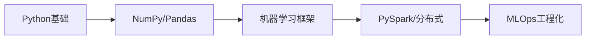
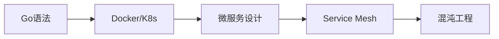
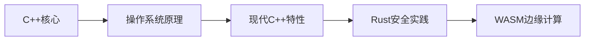

::: note 这部分介绍

- 每门语言的开发场景是什么
- 这种语言的特性是什么
- 学这种语言的前景/市场如何

:::

每一门编程语言都有其独特的语法规则和特点，就像学语文一样，第一步先学音调和音标来掌握基础语法，编程也是如此

我们听过很多课程，这些都是值得推荐的，希望对你有所帮助。

:::warning 由 DeepSeek R1 生成，请仔细甄别。

:::

以下是Python、C++、Go、Java、Rust五种编程语言的终极对比总结（2025年最新数据）：

---

###  📊 核心维度对比表
| 维度            | Python       | C++          | Go           | Java         | Rust         |
|-----------------|--------------|--------------|--------------|--------------|--------------|
| **开发场景**     | AI/数据科学  | 系统/游戏    | 云原生       | 企业级应用   | 安全关键系统 |
|                 | Web开发      | 嵌入式       | 微服务       | Android开发  | 基础设施     |
|                 | 自动化脚本   | 高频交易     | 区块链       | 大数据       | WebAssembly  |
| **核心特性**     | 动态类型     | 零成本抽象   | 协程并发     | JVM跨平台    | 所有权模型   |
|                 | 丰富库生态   | 手动内存管理 | 编译即部署   | Spring生态   | 无GC安全     |
|                 | 简洁语法     | 多范式       | 极简语法     | 强类型       | 无畏并发     |
| **学习曲线**     |  ⭐☆ (最易)   | ⭐⭐⭐⭐ (最难) | ⭐⭐          |  ⭐⭐⭐         | ⭐⭐⭐⭐        |
| **性能**         | △ (解释型)   | ●●●●● (极致) | ●●●●         | ●●●          | ●●●●●        |
| **2025前景**     | AI持续领跑  | 嵌入式爆发   | 云原生首选   | 存量市场稳   | 安全领域新贵 |
| **应届起薪**     | 18-25K       | 22-30K       | 20-28K       | 16-22K       | 25-35K       |
| **资深薪资**     | 70万+        | 100万+       | 90万+        | 60万+        | 120万+       |
| **企业采用率**   | 92%          | 78%          | 83%↑         | 93%↓         | 42%↑↑        |

---

###  🔍 五大语言定位分析
1. **Python - AI时代的瑞士军刀**
    - ✅ **优势**：最快上手速度 + AI生态垄断
    -  ⚠️ **风险**：初级岗位饱和，需向全栈/算法进阶
    - 💡 **建议**：搭配SQL/统计学构建数据科学竞争力

2. **C++ - 性能领域的统治者**
    - ✅ **优势**：硬件级控制 + 不可替代性
    -  ⚠️ **风险**：学习成本高，需配套掌握硬件知识
    - 💡 **建议**：深耕游戏引擎/自动驾驶赛道

3. **Go - 云原生时代的黑马**
    - ✅ **优势**：并发处理 + 开发效率平衡
    -  ⚠️ **风险**：生态广度不及Java/Python
    - 💡 **建议**：专注K8s/Service Mesh生态建设

4. **Java - 企业级应用的磐石**
    - ✅ **优势**：庞大存量市场 + 工程化成熟
    -  ⚠️ **风险**：创新不足，云原生转型缓慢
    -  💡 **建议**：向Quarkus/微服务架构升级

5. **Rust - 安全系统的未来**
    - ✅ **优势**：内存安全 + 高性能兼得
    - ️ **风险**：陡峭学习曲线，岗位集中在头部企业
    -  💡 **建议**：瞄准区块链/操作系统开发

---

###   新生学习策略指南
#### 方向一：AI/数据科学赛道

#### 方向二：云原生架构赛道

#### 方向三：系统级开发赛道

> 💡 **黄金组合推荐**：
> - **AI全栈**：Python + SQL + JavaScript
> - **云原生专家**：Go + Terraform + Prometheus
> - **系统架构师**：Rust + C++ + eBPF

---

###  📈 2026趋势预警
1. **Python**：面临Mojo语言在AI性能领域的挑战
2. **Java**：可能被Kotlin进一步侵蚀Android份额
3. **Rust**：将在Linux内核中替代C的比例突破15%
4. **WebAssembly**：成为Go/Rust的新战场

需要任何语言的详细学习路线图或资源包，欢迎随时告知！  🚀