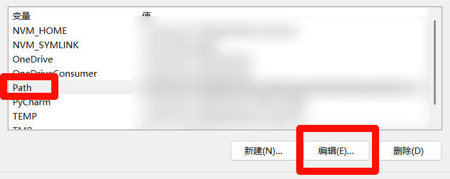

编写者：[::noto:red-heart::Lily](/friends/persons/) [::noto:red-heart::rand777](/friends/persons/) [::noto:red-heart::李徵](/friends/persons/)

:::note 本文已完成，等待校对

:::


[//]: #

[PYPI(The Python Package Index)](https://pypi.org/) 索引着全世界的 Python 包，Python 官方使用 pip 来管理这些包，不过因为性能、包与包之间的依赖管理等问题让社区有理由发展更好的工具。现在出现了许许多多新型的包管理器 (Package Manager) ，目前最推荐 uv。当然，其他的包管理器 (如 pip, Poetry, Conda) 也有其独特的优势和使用场景。


## Astral-UV

<RepoCard repo="astral-sh/uv"></RepoCard>

[官方文档](https://docs.astral.sh/uv/getting-started/installation/)


### Windows

#### 通过pip安装

如果你根据 Python 官方教程安装了特定版本的 Python，可以使用 pip 直接进行安装

:::steps

1. 打开命令提示符，输入以下命令
    
    ```shell
    pip install uv
    ```
    安装成功后，将uv添加到环境变量，这样即使切换到虚拟环境也可以使用:
    
2. 打开命令提示符窗口，输入
    
    ```shell
    where uv
    ```
    找到uv的存储位置并复制到文件资源管理器的搜索栏，
    
    
    
3. 直接在电脑搜索栏中，搜索"控制面板"，打开"控制面板"
    
4. 点击"系统与安全"
    
    
    
5. 点击"系统"
    
    
    
6. 点击"高级系统"
    
    
    
7. 点击"环境变量"
    
    

8. 点击"Path",点击"编辑"
    
    
    
9. 点击"新建",粘贴复制的Scripts文件地址，然后一路点确定
    
    

:::

#### 通过Powershell安装

```shell
powershell -ExecutionPolicy ByPass -c "irm https://astral.sh/uv/install.ps1 | iex"
```

最后打开一个新的命令提示符窗口，输入以下命令，验证更改

```shell
uv
```


出现这样的信息则表示添加成功

* PowerShell脚本安装

1.打开 PowerShell ,执行以下代码:

```shell
irm https://astral.sh/uv/install.ps1 | iex
```
2.输入以下代码查看是否安装成功:

```shell
uv --version
```

这样就可以查看安装的UV版本

* 使用pipx:

```shell
pipx install uv
```

安装完成后打开新的终端窗口，运行uv --version来验证是否安装成功

### Linux 

:::steps 

1. 打开终端，输入以下命令:

    ```shell
    sudo apt install curl
    curl -LsSf https://astral.sh/uv/install.sh | sh
    ```
    
    

2. 验证

    输入以下命令验证是否安装成功:
    
    ```shell
    uv --version
    ```
    
    
    若显示uv的版本信息，则表示安装成功
:::
### UV的基础用法

:::steps

1. 创建虚拟环境

    打开命令提示符，输入以下命令,创建虚拟环境:
    
    ```shell
    uv venv .venv
    ```
    
    激活环境:
    ```shell
    .venv\Scripts\activate
    ```
    

2. 兼容pip常用命令

    ```shell
    #安装一个包
    uv pip install <package>
    ```
    
    ```shell
    #卸载包
    uv pip uninstall <package>
    ```
    
    

3. 依赖编译和锁定

    ```shell
    #使用uv pip freeze >命令生成requirements.txt文件，这个命令会列出当前虚拟环境中所有已安装的包以及版本号，并将它们写入到文件中
    uv pip freeze >requirements.txt
    ```
    ```shell
    #uv pip compile会读取requirements.txt文件中的依赖
    uv pip compile requirments.txt -o require
    ```
    

4. 本地项目包管理

    如果你需要管理本地项目依赖，可以使用 uv add 命令
    
    ```shell
    uv add numpy
    ```
    

:::

### 小结

UV是是一个用 Rust 编写的现代 Python 打包工具，它的核心目标是极速替代 pip、pip-tools 和 venv 等工具的功能。

如果你厌倦了等待 pip 解析和安装依赖，那么 uv 绝对值得你尝试。开始使用 uv venv 和 uv pip install ,体验一下“瞬间”完成依赖安装的快感吧！

## 配置镜像


参考[ PYPI 镜像配置](/public-service/cqmu-mirror/wiki/#pypi)

### 其他参考资料

- [ rand777 的博客](https://blog.rand777.space/article/20250717/)