编写者：[::noto:red-heart::rand777](/friends/persons/)

:::tip 本文已完成并校对

:::

感谢您的无私奉献，项导文档基于 Vuepress 的 [plume 主题构建](https://theme-plume.vuejs.press/)，由多名成员共同维护，内容完全开源。

<RepoCard repo="PGuideDev/PGuide-Docs"></RepoCard>

## 我是文档的编写者

项导文档使用 ::catppuccin:markdown::Markdown 语法进行编写，在您完成 Markdown 类型文档编写后可以：

- [fork 仓库]()，并通过 GitHub 创建 [ 拉取请求合并您的分支](https://github.com/PGuideDev/PGuide-Docs/pulls)
- Email 到我们的 [邮箱](mailto:contact@pguide.studio)
- QQ 发送给 [rand777](https://qm.qq.com/cgi-bin/qm/qr?k=9s5V15fEzwzHuawmc-QQZ615NPTp9oEZ)

### 我想直接写一篇文档

将文档或资料发送给 [rand777](https://qm.qq.com/q/2iLBaNcsnO)，我们会将您的文档转换为 markdown 格式并发布到项导文档站，生成预览链接并按照您的要求对其进行署名。

或者，非常轻松地，在每篇文档的最下方有 ` 编辑此页 ` 功能，使用即可进行编辑。


### 其他注意事项

请参考 [文档编写规范](/contribute/#文档编写规范)

## 我是文档站的开发者

在参与合作开发之前，您需要了解的一些基础知识:

:::info 基础知识

[::material-icon-theme:git:: git 的使用](/csdiy/tools-must/git/)

[::octicon:markdown-16:: Markdown 基础语法](/csdiy/tools-must/markdown/)

[::https://theme-plume.vuejs.press/plume.png:: VuePress Plume 主题](https://theme-plume.vuejs.press/guide/intro/)

:::


### 项目结构

先大致了解下项目的结构

::: file-tree title="项目结构"
- .github
  - ISSUE_TEMPLATE #issue 模板
    - 文档完善.yml
    - 新特性请求.yml
    - 问题报告.yml
  - workflows
    - ++ upstream-sync.yml # fork 分支同步上游仓库
    - docs-deploy.yml # github-action 自动部署
    - lint.yml # ES Lint 语法检查
- docs
    - .vuepress
        - public #静态资源文件夹
            - avatar #头像文件夹
                - …
            - icon #矢量图标文件夹
                - …
            - src #图片文件夹（请遵守静态资源命名规范）
                - …              
        - theme #主题设置文件夹
            - style #主题自定义文件夹
                - custom.css #自定义主题
            - shim.d.ts #自定义 vue 组件导入
        - client.ts #客户端配置
        - config.ts #全局功能配置
        - navbar.ts #导航栏配置
        - notes.ts #笔记配置
        - plume.config.ts #主题选项配置
    - notes
        - CS-DIY #计算机自学指南
            - …
        - 公共服务 #项导公开的服务
            - …
        - 大学百科 #大学百科全书
            - …
        - 学习笔记 #学习笔记荟萃
            - …
        - 项目文档 #包含项目的介绍、人员等
            - …
        - begin.md #“开始阅读”页
        - contribute.md #“贡献”页
        - friends-organizations.md #友情链接 - 组织页
        - friends-persons.md #友情链接 - 个人页
        - friends-quotes.md #友情链接 - 常见问题页
        - Templates.md # Vuepress Plume 模板页
        - update-note.md #更新日志页
    - README.md #首页
- .gitattributes #git 属性设置
- .gitignore #不进行 git 的文件 (夹)
- .npmrc #npm 包管理设置
- package.json #所有 npm 包依赖
- LICENSE #开源项目许可证
- ++ CODE_OF_CONDUCT.md #社区行为规范
- pnpm-lock.yaml #所有 pnpm 包依赖
- README.md #中文项导文档介绍
- README-en.md #英文项导文档介绍
- vercel.json #Vercel 部署配置
- …
:::

---

### 配置开发环境

:::info 开发环境

支持跨平台开发：::logos:microsoft-windows-icon size=1.5em:: ::wpf:macos size=1.5em:: ::flat-color-icons:linux size=1.5em::

---
推荐配置：

- ::file-icons:intel size=1.5em::Intel i5-12400 ::file-icons:amd size=1.5em::AMD Ryzen 5 3600X ::wpf:macos size=1.5em:: Apple M1 及以上
- ::bi:memory size=1.5em::16GB DDR4 或 LPDDR4X 内存及以上
- ::material-symbols:hard-disk-sharp::500G SSD 或 NVMe 固态硬盘

---
软件需求：
- ::devicon:webstorm size=1.5em::WebStorm 或::vscode-icons:file-type-vscode size=1.5em::VS Code
- ::vscode-icons:file-type-node size=1.5em::Node.js LTS 22.18.0(2025 年 8 月 8 日)
- ::material-icon-theme:git size=1.5em::git
:::

:::steps

1. 下载 WebStorm

    这个软件是咱们主要写代码的地方，软件本身用于前端开发，您可以 [在这里](/campus-wiki/common-softwares/IDE/WebStorm/) 详细了解。其他同类型的开发软件，如 [::vscode-icons:file-type-vscode size=1.5em::VS Code](/campus-wiki/common-software/IDE/VSCode/)，也可以。
    
    如果同学们对上面的软件不太清楚，请先完成 [学生邮箱申请](/campus-wiki/apply-student-email/) 并申请 JetBrains 教育版。下载 WebStorm 可以到 [WebStorm 官方网站](https://www.jetbrains.com/zh-cn/webstorm/)
    ；在校内也可以使用 [Alist 动态开源软件镜像站](http://192.168.183.171:5244/softwares/JetBrainsIDEs/WebStorm-2024.3.4.exe) 下载。

2. 下载 NVM

    进行前端开发时，需要服务端 (server) 来支撑 web 应用的运行，::vscode-icons:file-type-node::Node.js 是目前非常流行的开源 web 服务器运行时环境。在运行不同的前端项目时，往往需要的 Node.js 版本要求是不一样的，而
    NVM（全名：Node.js Version Manager）可以帮助我们更高效地管理不同的 Node.js 版本和依赖环境。

    软件安装及应用教程参考 [开发工具](/csdiy/study-path/front-dev/NVM/)，不要忘记安装长期支持版的 Node.js 哦！
    
    :::note 为什么没有 nvm 命令
    安装完成后记得重启 IDE 和终端以重载环境变量
    :::
3. 导入项目
    :::note 从哪儿导入
    在学校优先使用校内 ::devicon:gitlab::GitLab ，国内 ::simple-icons:gitee::gitee ，不过最好是 ::mdi:github::GitHub （可以减轻 Code Reviewer 的负担）
    :::

    作为开源项目，最好是使用 [::fluent:branch-fork-32-filled::fork](https://github.com/PGuideDev/PGuide-Docs/fork) 的方式将项目导入到您的个人 GitHub 账号下，通过 Pull Request 合并到主分支 master（下文会提到）；
 
    关于 GitHub 上的 Pull Request ，可以阅读 [Mr.Hope 的文章](https://mister-hope.com/code/github/pr.html) 或 [GitHub 官方文档](https://docs.github.com/zh/pull-requests/collaborating-with-pull-requests/proposing-changes-to-your-work-with-pull-requests/about-pull-requests)

    如果您所在的网络环境无法访问 GitHub ，也可以使用国内 Gitee 仓库或重庆医科大学 GitLab ，不过推送代码时需要注意将远程仓库地址改为 GitHub 地址，参考 [Mr.Hope 的文章](https://mister-hope.com/code/github/speedup.html#%E8%BF%9C%E7%A8%8B%E5%BA%93%E5%9C%B0%E5%9D%80%E4%BF%AE%E6%94%B9)。

    :::tabs
    
    @tab GitHub
    
    [fork from GitHub](https://github.com/PGuideDev/PGuide-Docs/fork)
    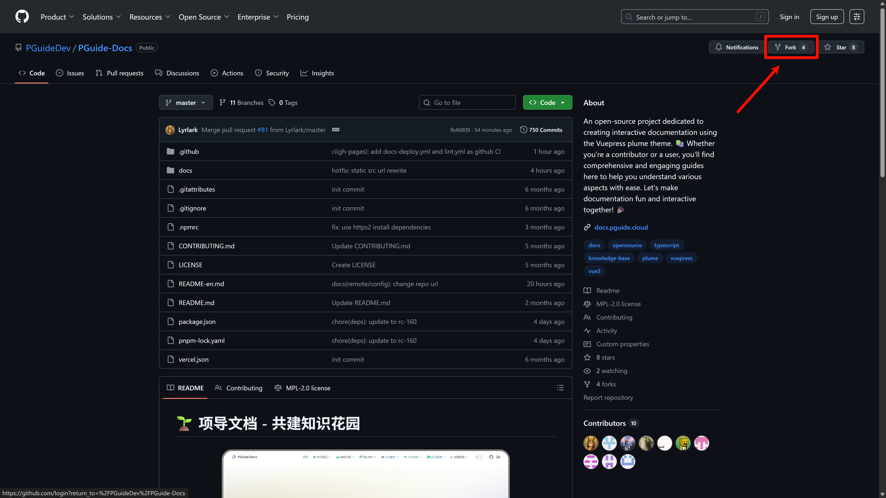

    @tab Gitee
    [fork from Gitee](https://gitee.com/rand777/PGuide-Docs)
    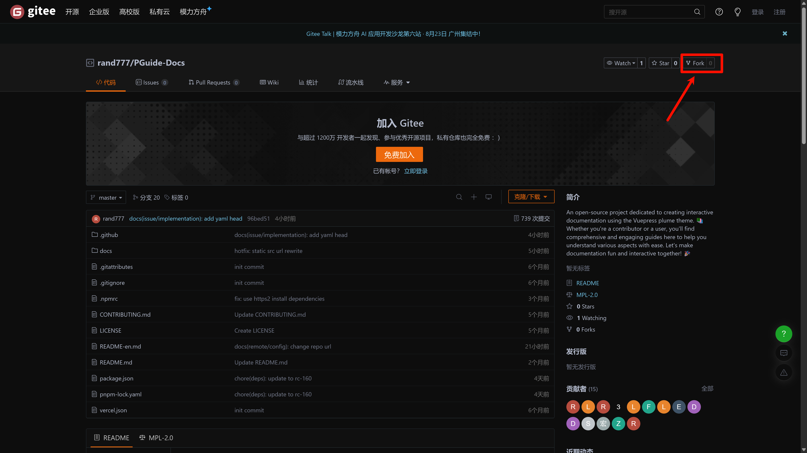
    
    :::

    或者直接 git 克隆到本地，使用 HTTPS 协议：
    > 导入失败请参考“[常见问题及解决方案](#git 推送 -ssl-error)”
    
    :::tabs
    
    @tab 从 Github 克隆（推荐）
    
       ```shell
       git clone https://github.com/PGuideDev/PGuide-Docs.git
       ```

    @tab 从 GitLab CQMU 克隆

       ```shell
       git clone https://git.cqmu.edu.cn/PGuideDev/pguide-docs.git
       ```
    
    @tab 从 Gitee 克隆
    
       ```shell
       git clone https://gitee.com/rand777/PGuide-Docs.git
       ```

    

    
    :::

    git 也可以使用 SSH 协议导入，需要 [配置 SSH](/csdiy/tools-must/git/#设置ssh密钥) 和 [设置 GitHub](/csdiy/tools-must/git/#github设置)

    :::tabs
    @tab 从 GitHub 克隆（推荐）
    
       ```shell
       git clone git@github.com/PGuideDev/PGuide-Docs.git
       ```
    
    @tab 从 Gitee 克隆
    
       ```shell
       git clone git@gitee.com:rand777/PGuide-Docs.git
       ```
    

    
    @tab 从 GitLab CQMU 克隆
    
       ```shell
       git clone git@git.cqmu.edu.cn/PGuideDev/pguide-docs.git
       ```
    
    :::

    如果您已在开发者行列中，打开 WebStorm 后，直接在 WebStorm 上点击“克隆仓库（Clone Repository ）”，登录 GitHub 账号进行导入
    
    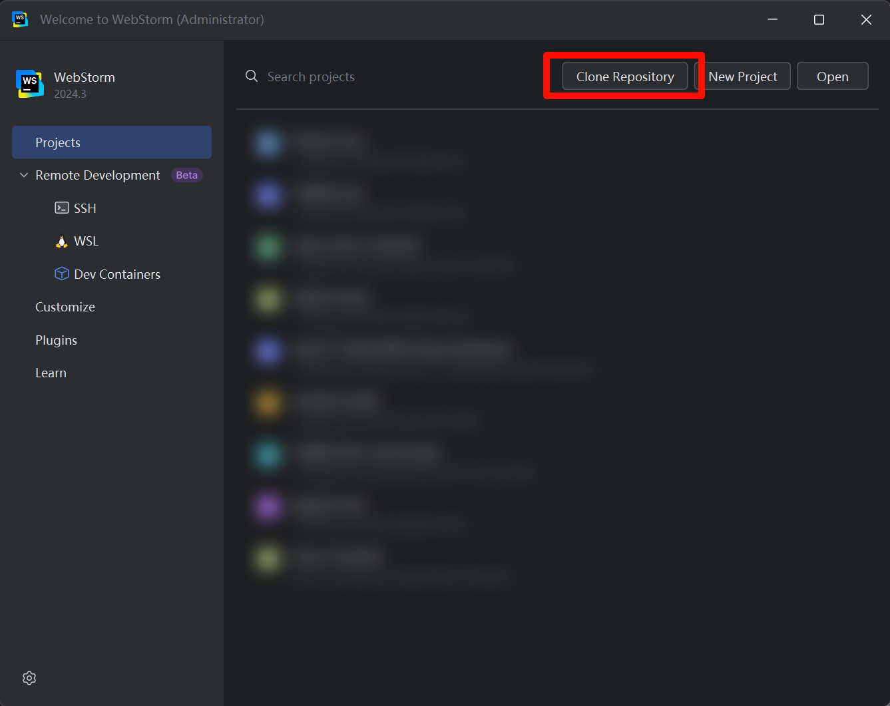
    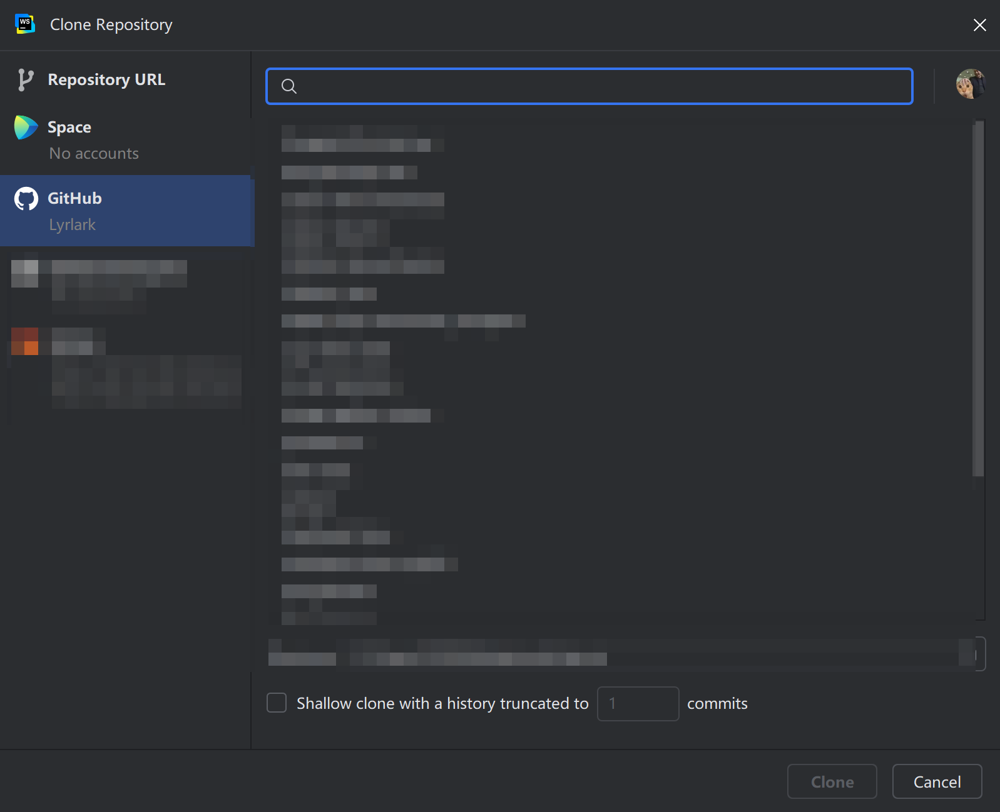


4. 安装项目依赖
    
    为节省磁盘空间和优化安装效率，请安装 pnpm
    
    在 WebStorm 终端中输入
    
    ```shell
    npm install -g pnpm
    ```
    
    安装好后，再输入
    
    ```shell
    pnpm install
    ```
    
    这样就完成了项目依赖的安装
    
5. 启动本地开发环境
    
    终端中输入
    
    ```shell
    pnpm run docs:dev
    ```
    
    打开 [http://localhost:8080](http://localhost:8080) 即可访问本地开发环境。代码修改时，内容也会一起跟着改。
    
6. 项目设置
    
    将 `.cache` `.temp` `.public` 文件夹设置为排除（路径：docs/.vuepress/)
    
    > 避免 IDE 错误识别缓存 TODO、svg 命名空间错误
    
    @[artPlayer](https://cos.pguide.cloud/docs/2025-03-10_03-56-14.mp4)
    
7. 阅读开发规范章
    
    你真棒！经过上面的折腾，你就完成项导文档的开发环境配置了😀。为了让文档更加规范，协作更加得心应手，接下来请依次阅读 [`Git 规范 `](/contribute/#git规范)、
    [` 静态资源管理规范 `](/contribute/#静态资源管理规范)、[` 文档编写规范 `](/contribute/#文档编写规范)、
    [` 常见问题及解决方案 `](#常见问题及解决方案)

:::

## Git 规范

:::info [::logos:git-icon::Git 是什么](/csdiy/tools-must/git/)
:::

项导文档开发 Git 规范采用 [::logos:angular-icon:: Angular 规范](https://zj-git-guide.readthedocs.io/zh-cn/latest/message/Angular%E6%8F%90%E4%BA%A4%E4%BF%A1%E6%81%AF%E8%A7%84%E8%8C%83/)

### 提交规范

采用 **[Conventional Commits](https://zj-git-guide.readthedocs.io/zh-cn/latest/message/Conventional%E6%8F%90%E4%BA%A4%E8%A7%84%E8%8C%83/)** 标准：

| 类型         | 说明                     | 示例                                                      |
|------------|------------------------|---------------------------------------------------------|
| `feat`     | 新功能，比如引入了 PDF 导入         | feat: add @vuepress-plume-theme/pdf function            |
| `fix`      | Bug 修复，比如不显示图标了        | fix(chore): fixed the version caused icon display error |
| `docs`     | 文档更新                   | docs(update-note.md): update the doc                    |
| `style`    | 代码格式（空格、分号等）           | style: PEP8 formatted                                   |
| `refactor` | 代码重构，比如把图片 A 换为图片 B    | refactor: change picture A to B                         |
| `perf`     | 性能优化，比如删除了大图片          | perf(src/*.img): upload2oss                             |
| `test`     | 测试相关，比如测试跨域访问          | test(CORS): add 3rd party auth                          |
| `chore`    | 构建 / 工具变更，比如 ESlint 配置修改 | chore(eslint): update es@1.0.0 to es@1.0.1              |

示例：

:::tabs

@tab WebStorm 中提交
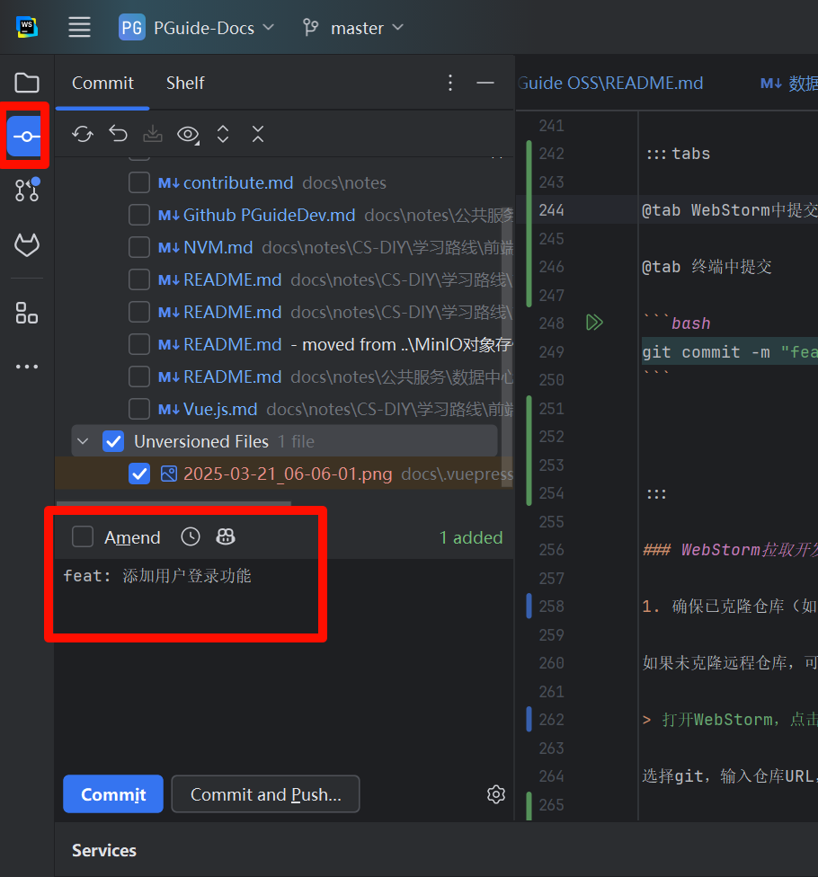

@tab 终端中提交

```bash
git add .
git commit -m "feat: 添加用户登录功能"
```
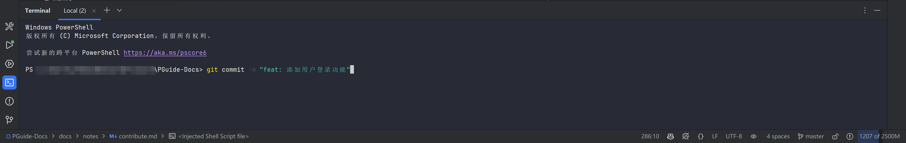
:::

### 开发与提交代码流程

:::steps

1. 确保已克隆仓库（如果您已经有仓库，直接进入下一步）


2. 牵出开发分支

    每个人单独一条开发分支，以 `dev/ 你的名字某字母 ` 定义，例如彭于晏的开发分支为 `dev/pyy`
    
    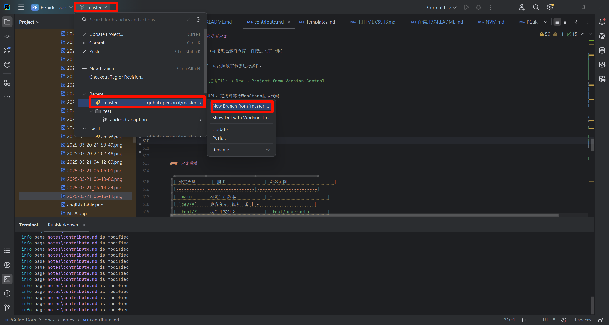
    
    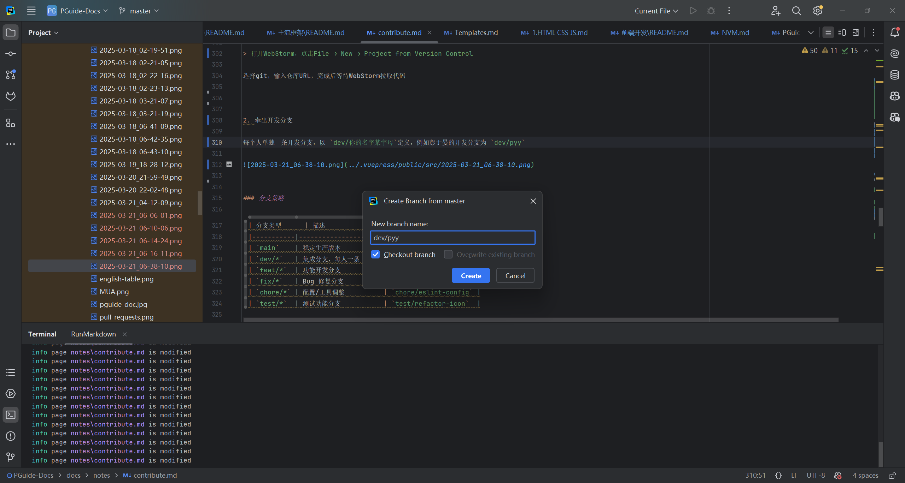

3. 提交分支到远程仓库

    :::important 远程仓库
    编写完文档后按照 git 提交规范编写提交信息, 统一提交到 GitHub ，新开发者有一个 ` 新 ` 的标签；如果您是 fork 的方式导入仓库，则不需要设置此处。
    :::
    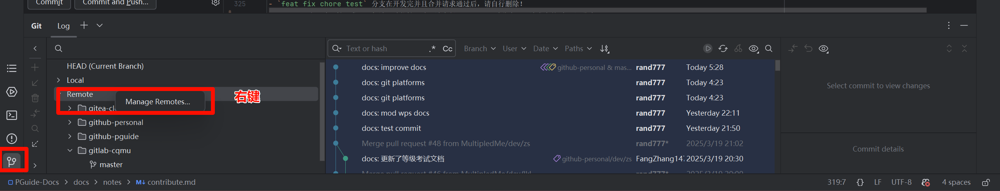
    
    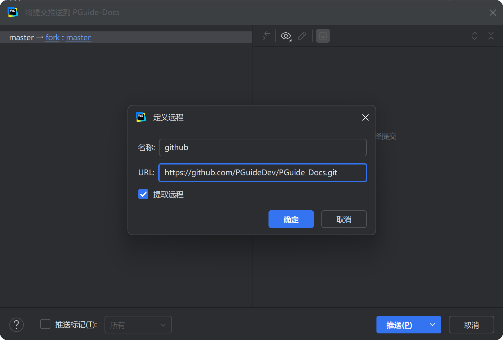
    ::: warning 其他注意事项

    - 开发分支在 `master` 分支签出，不要在其他人的 `dev` 分支拉取!!!
    - `feat fix chore test` 分支在开发完并且合并请求通过后，请自行删除！见 [分支策略](/contribute/#分支策略)
    - 成员完成阶段性开发后，如涉及功能性更改，请自行迁出 `test` 测试分支，再请求合并到 `master` 分支
    - 请定期从 `master` 分支拉取更新 (git fetch) 以更新文档内容。
    :::

    合并要求：

    > 代码审查

    - [x] 通过 Pull Request 合并到 `master`
    - [x] 至少一个团队成员 Code Review

    > 自动测试，代码风格见 [内容规范](/contribute/#内容规范)，部署测试看有没有语法错误。

    - [x] ES Lint 代码风格检查
    - [x] GitHub 部署产物分支
    - [x] Vercel 持续集成测试部署项

4. 创建拉取请求 Pull Request

    哇，你真棒！只剩最后一步我们就能看到你的伟大贡献了。

    在完成所在分支任务后，需要创建合并请求才能将更改应用到生产环境，下面是两种创建 PR 的方式
    
    :::tabs
    
    @tab ::devicon:webstorm:: WebStorm 创建
    
    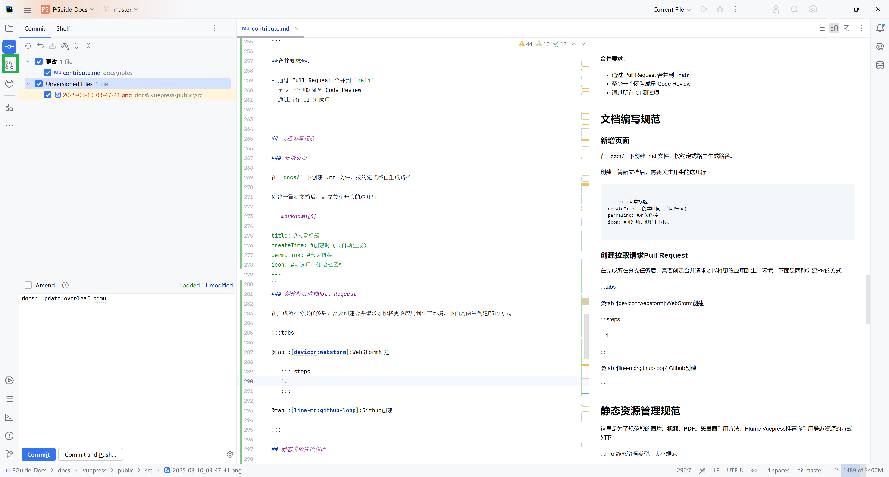
    
    @tab ::line-md:github-loop:: GitHub 创建
    
    <LinkCard icon="line-md:github-loop" href="https://github.com/PGuideDev/PGuide-Docs/pulls" title="Create Pull Request" >
    PGuide Docs GitHub Page</LinkCard>
    
    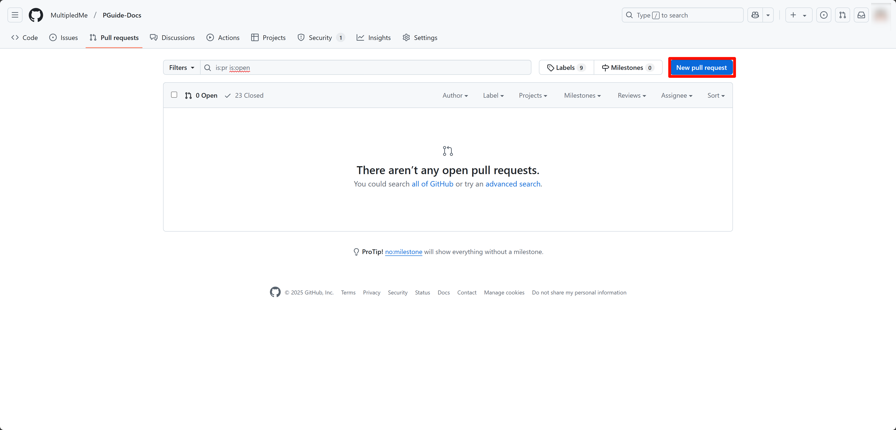
    
    :::
    
    创建 PR 后请选择 Code Reviewer 哦，这样才会收到要合并的审核消息，在群内说一声即可。
:::


### 分支策略
::: table align="left"
| 分支类型      | 描述          | 命名示例                  |
|-----------|-------------|-----------------------|
| `main`    | 稳定生产版本      | -                     |
| `dev/*`   | 集成开发分支，每人一条 | 彭于晏的开发分支是 `dev/pyy`    |
| `feat/*`  | 功能开发分支      | `feat/user-auth`      |
| `fix/*`   | Bug 修复分支    | `fix/mobile-layout`   |
| `chore/*` | 配置 / 工具调整     | `chore/eslint-config` |
| `test/*`  | 测试功能分支      | `test/refactor-icon`  |
:::


## 文档编写规范

### 编写内容规范

- 作者信息：请在每篇文档的最上方使用 ::noto:red-heart:: 谁谁谁 以便展示编者信息，方便文档订正和互相交流，可在 `docs/templates.md` 中添加您的作者信息；
- 编写格式：文档统一使用 Markdown 格式，创建在 `docs\notes` 对应文件夹下，请注意修改永久链接 [permalink](/contribute/#permalink)；
- 标题级别：VuePress Plume 主题默认从二级标题开始，文档配置支持到六级标题，但建议控制在四级内；
- 排版布局：每行 Markdown 请空一行以换行；中英文、链接间应空一个空格，增加排版美观度，[可以使用插件实现](https://github.com/sparanoid/chinese-copywriting-guidelines)；英文括号包英文，中文括号包中文；特别注意专业名词的大小写，如 GitHub 不是 github；
- AI 工具：允许使用 AI 减少编写量，不过现在的 AI 还请谨慎使用，使用其生成文档后还请审查内容可靠性。

### 文档状态规范

- 未完成请使用下面的语法标注在文档最上方：

:::danger 这是一篇未完成的文档

:::

- 如果是已经完成但未校对的

:::note 本文已完成，等待校对

:::

- 如果是已经完成且已校对的

:::tip 本文已完成并校对

:::

- 文档中存在需要修改、不足之处

:::warning 修改原因、不足之处描述

:::

- 如果您对已经完成且已校对的有更好建议的

到 GitHub [提出完善文档的议题 (issue)]()，选择文档修改类，将该 issue 和文档链接起来，指派 (Assign) 文档编写者为 Assignee ；或者简单地 [加入我们的开发群](https://qm.qq.com/q/Ur5Q6kyTsG)，在线交流一下？

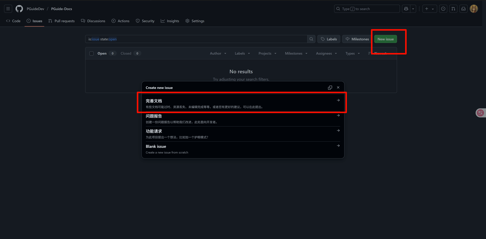

### 新增页面

在 `docs/` 下创建 .md 文件，文档会按约定式路由自动生成路径。

创建一篇新文档后，需要关注开头的这几行

```yaml
---
title: #文章标题
createTime: #创建时间（自动生成）
permalink: #永久链接 [!code focus]
icon: #可选项，侧边栏图标
---
```

:::note 我暂时没写完，又不想显示出来
请在开头中添加 `draft: true`
:::

```yaml
title: #文章标题
createTime: #创建时间（自动生成）
permalink: #永久链接 
icon: #可选项，侧边栏图标
draft: #true [!code focus]
```


### permalink

注意更新 permalink，要和同级目录相同的前缀；

例如：

/campus-wiki/prefixA/pageA/

/campus-wiki/prefixA/pageB/

---


### 徽章 badge 使用规范（可选）

> 在 `navbar.ts` 中进行配置

1. 整理中的文档、服务使用 `badge: {type: 'warning', text: '整理中'}`；
2. 维护中的文档、服务使用 `badge: {type: 'danger', text: '维护中'}`
3. 已完成的文档、服务可使用 `badge: {type: 'success', text: '概要'}`；
4. 即将上线的文档、服务使用 `badge: {type: 'info', text: '即将上线'}`；


## 静态资源管理规范

这里是为了规范您的 **图片、视频、PDF、矢量图** 引用方法，Vuepress Plume 推荐你引用静态资源的方式如下（非必要）：

```markdown
#使用相对 public 的路径
[image](/src/yyyy-mm-dd_hh-min-sec.png)
```

:::info 静态资源类型、大小规范

- 图片文件：70% 分辨率 jpg 或 png 图片，放入 `PGuide-Docs/.docs/.vuepress/public/src`
  中，图片命名方式参考 [截图工具设置](/contribute/# 截图工具设置)
- 矢量图：.svg .eps 文件，放入 `PGuide-Docs/.docs/.vuepress/public/src` 中，命名为英文即可

---

- 视频文件：.mp4 文件，帧率 16/24FPS ，放入项导腾讯云对象存储，参考 [对象存储](/contribute/# 对象存储)
- PDF 文件：请尽量精简，不需要的页面不上传，放入项导腾讯云对象存储，参考 [对象存储](/contribute/# 对象存储)

:::

### 截图工具设置

::: steps

1. 下载 PixPin

前往 [Pixpin 官网](https://pixpin.cn/) 下载并安装该软件


2. 配置 PixPin

    右键任务栏中的 PixPin 图标（没有的话看看上拉键），点击配置
    
    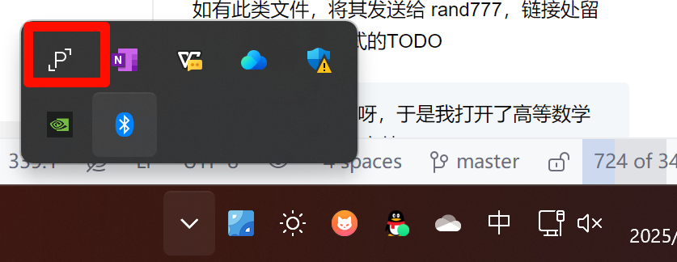
    
    点击开机后自动启动
    
    转到 WebStorm，找到 src 文件夹，右键 open in -> explorer
    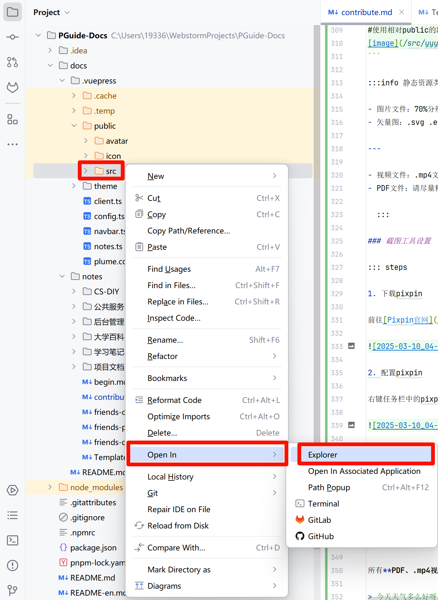
    
    进入 src 文件夹，找到上方地址栏，复制绝对地址
    
    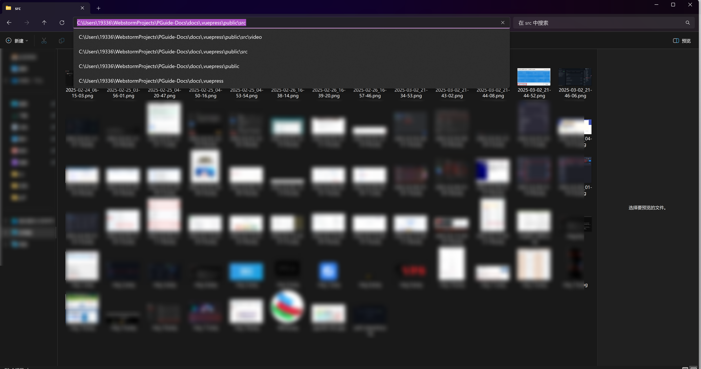
    
    回到 PixPin，转到保存
    
    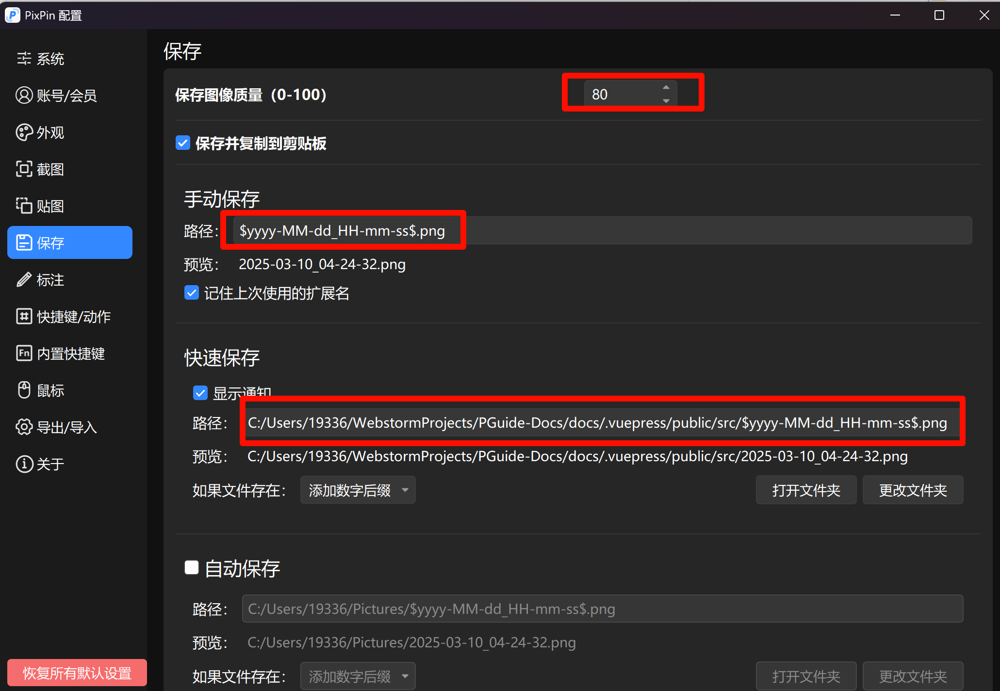
    
    - 设置保存图像质量 70
      - 手动、快速保存路径删除 `Pixpin_` 前缀
      - 更改文件夹，粘贴刚才复制的绝对地址
    
    转到快捷键 / 动作
    
    删除所有快捷键，添加新动作
    
    截图设置为 F1，删除其他的
    
    添加新动作，动作名称选截图并快速保存，设置为 F2
    
:::

### 对象存储

所有 **PDF、.mp4 视频** 放在项导腾讯云对象存储上，如有此类文件，将其发送给 rand777，链接处留空，并留下以下格式的 TODO

> 今天天气多么好呀，于是我打开了高等数学
> 这里 == 需要 PDF 文件 ==

然后写上 TODO: 需要 {文件名.pdf}，并 `ctrl` + `/` 注释，在代码里看起来是这样的：

```text
今天天气多么好呀，于是我打开了高等数学
[//]: # (TODO: 需要高等数学.pdf)
```

## 常见问题及解决方案

### git 推送 SSL ERROR

> [参考 magic 配置三方代理](/csdiy/tools-must/magic/clash-core/)
> 
> [参考 host 配置本机正向代理](/csdiy/tools-must/magic/host/)

git 配置本地代理，此处默认您的代理端口在本地且 http/https 端口号为 7890

```shell
# 设置全局 HTTP 代理
git config --global http.proxy http://127.0.0.1:7890

# 设置全局 HTTPS 代理
git config --global https.proxy http://127.0.0.1:7890
```

### 依赖版本错误

每个 rc 版本的依赖包可能会有不同的版本要求，您可以尝试以下步骤：

:::steps

1. 找到冲突的依赖包
   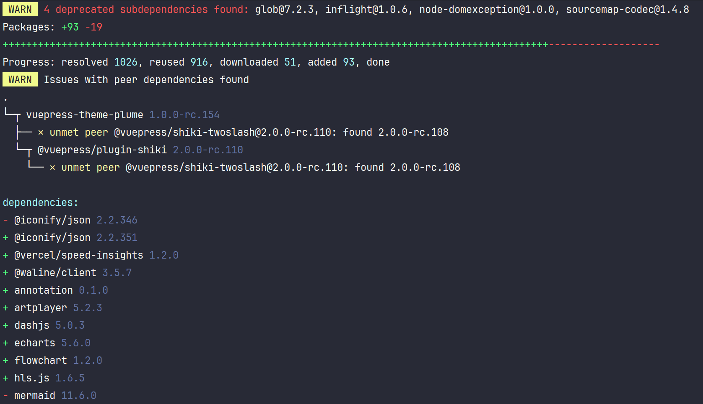
2. 在终端中输入以下命令，强制安装指定版本的依赖包

```bash
pnpm add @<package-name/subpackage>@<version>
```

例如

```shell
pnpm add @vuepress/shiki-twoslash@2.0.0-rc.110
```

:::

3. 再次启动应用

```shell
pnpm run docs:dev
```

### 长期未更新安装不了包

可以尝试去缓存启动 web 应用

```shell
vuepress dev docs --clean-cache --clean-temp
```

先删除 `docs/.vuepress/.temp`,`docs/.vuepress/.cache` 和 `node_modules` 文件夹，然后重新安装依赖

```shell
pnpm i
```


## 附录

### 参考链接

- [Plume 主题配置指南](https://theme-plume.vuejs.press/)
- [pnpm 使用手册](https://pnpm.io/zh/motivation)
- [VuePress 官方文档](https://vuepress.vuejs.org/)