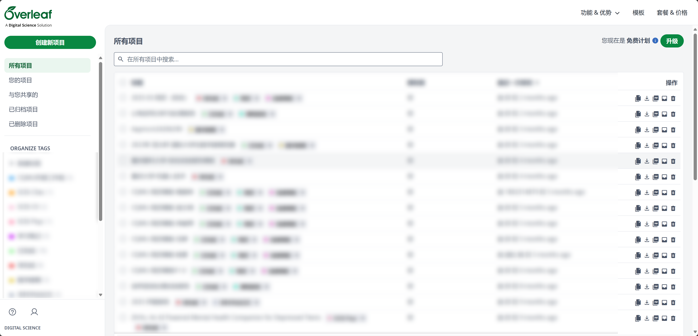
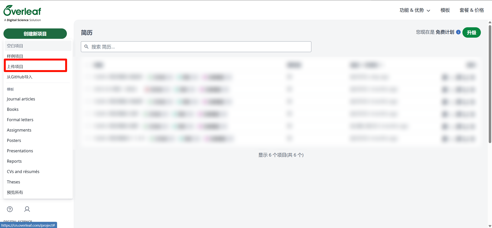
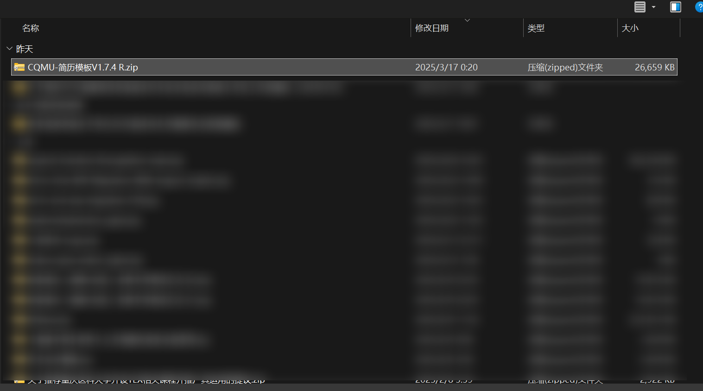
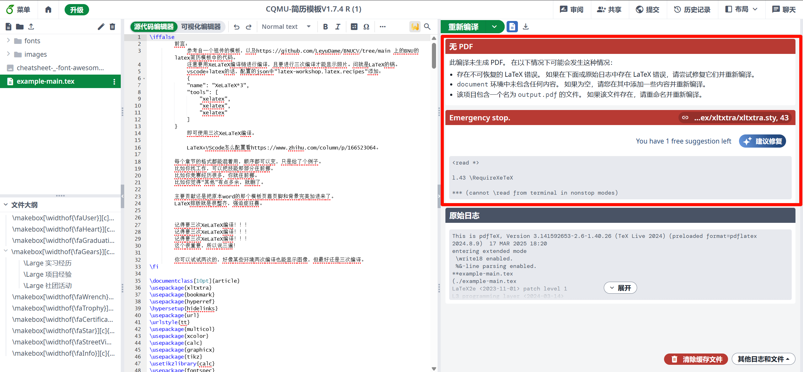
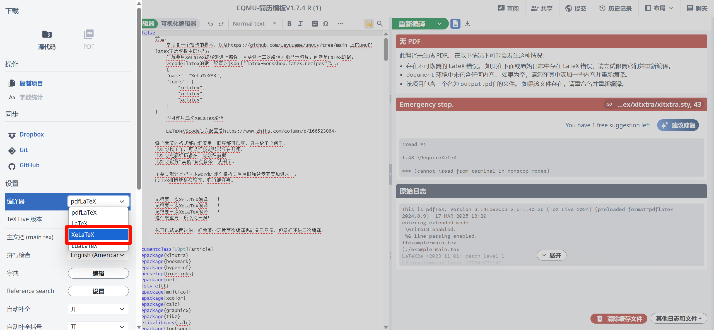
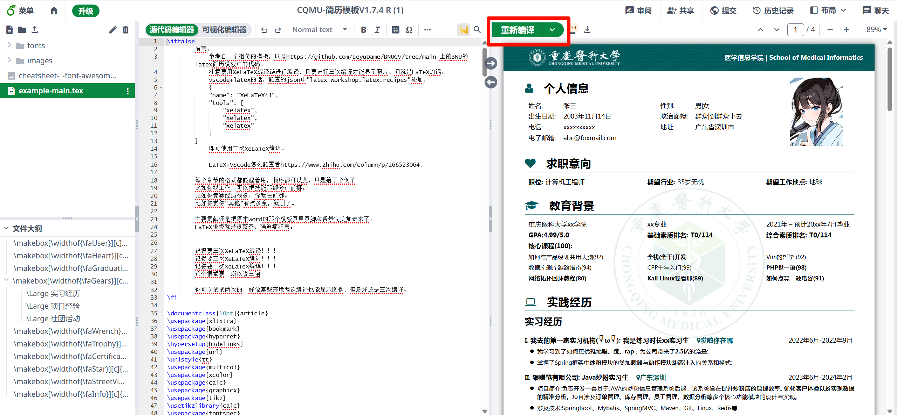
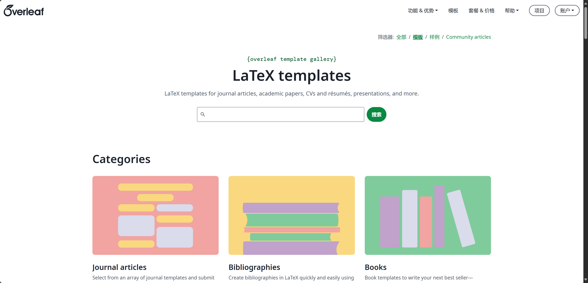

编写者：[::noto:red-heart::李徵](/friends/persons/) [::noto:red-heart::rand777](/friends/persons/) [::noto:red-heart::QingYe](/friends/persons/) [::noto:red-heart::Lily](/friends/persons/)

:::note 本文已完成，等待校对

:::

:::info [查看更新日志](/public-service/overleaf/releases/)
:::

<CardGrid>
<LinkCard icon="/icon/overleaf.svg" href="http://192.168.183.171" title="重医校园网内网地址" description="校园网可访问"></LinkCard>
<LinkCard icon="/icon/overleaf.svg" href="https://latex.cqmu.edu.cn" title="重医校园网外网访问地址" description="暂未开通"></LinkCard>
<LinkCard icon="/icon/overleaf.svg" href="https://cn.overleaf.com/" title="Overleaf 中文官网">https://cn.overleaf.com/</LinkCard>
<LinkCard icon="/icon/overleaf.svg" href="https://sharelatex.cstcloud.cn/" title="中国科技云开放通行证">https://sharelatex.cstcloud.cn/login</LinkCard>
<LinkCard icon="/icon/overleaf.svg" href="https://latex.sjtu.edu.cn/login" title="上海交通大学企业版">https://latex.sjtu.edu.cn/login</LinkCard>
</CardGrid>

---

::: collapse

- 有任何建议或遇到使用问题，欢迎[加入交流群](https://qm.qq.com/q/bt3h76SF1e)噢！

  <CardGrid>
    <ImageCard
      image="/src/2025-04-25_16-46-40.png"
      title="Overleaf CQMU交流群"
      description="群号:1046824912"
      href="https://qm.qq.com/q/bt3h76SF1e"
    />
  </CardGrid>

:::
## 简介

**Overleaf LaTeX协作编辑器**是一款支持多人在线同步编辑、审议的LaTeX编辑器，支持Zotero、Github等现代应用集成，极大便利了广大科研工作者。
LaTeX最初设计用作学术论文的编写，后面逐渐发展成一款全能的文字排版软件系统，现在，全球已有**5900**多所机构和组织在使用它。

## Overleaf使用

### 注册账户

联系 [::noto:red-heart::rand777](/friends/persons/)
或[邮件联系](mailto:contact@pguide.studio) 注册账号，注册后请使用校内 _.cqmu.edu.cn_ 邮箱登录。

:::info 联系格式
你好！我的学/工号是xxxxxxxx，是在校学生/教职工/科研机构人员，想申请Overleaf账号，谢谢！
:::

### 尝鲜体验

<LinkCard icon="/icon/overleaf.svg" title="Overleaf在线官网" href="https://cn.overleaf.com/">中文官网</LinkCard>

Overleaf的用户界面超级简单，即使是新手也能轻松上手，现在就开始阅读[Overleaf官方文档](https://cn.overleaf.com/learn/how-to/Creating_a_document_in_Overleaf#Introduction)
开始LaTeX之旅吧，相信我，你会惊叹它的奇妙设计！

### 如何使用模板

以[重医简历参考模板V1.7.4R](/campus-wiki/internship/resume/#latex-参考模板)
为例，点击[此处](https://cos.pguide.cloud/docs/CQMU-%E7%AE%80%E5%8E%86%E6%A8%A1%E6%9D%BFV1.7.4%20R.zip)
下载，建议使用[::/icon/orcid.svg::ORCID账号](https://info.orcid.org/zh-CN/%E4%BB%80%E4%B9%88%E6%98%AF-orcid/)
登录，登录后你应该看到这个界面：

上传简历模板压缩包文件夹

报错了，我们要选择合适的编译器

:::info 编译器选择
中文一般选择XeLaTeX，英文选择pdfLaTeX
:::

点击左上角菜单，选择`XeLaTeX`编译器

回到主界面，点击重新编译

编辑内容，只需要在右侧PDF区双击，左侧源代码区则会直接跳转到对应位置。

### 模板！

在 [Overleaf的模板网](https://cn.overleaf.com/latex/templates)中，你可以看到很多类型的模板，这些和文字相关的工作LaTeX都能应付！

所有模板都已收录至 [::twemoji:newspaper::LaTeX Template Collections](/public-service/overleaf/latex-template-collections/)

### Overleaf CQMU

:::tip 需要连接校园网：电脑连接有线网络或MCQMU无线网络
[http://192.168.183.171](http://192.168.183.171)

校园网内网已经可以访问，在做最终准备，为同学们开通外网访问，如您需要注册，请联系 [::noto:red-heart::rand777](/friends/persons/)。

:::

## CQMU tug

重庆医科大学 TeX用户组(Chongqing Medical University TeX User Group)，开发CQMU的相关LaTeX模板。

### 目前开发完成的模板

::: details 重庆医科大学简历参考模板
[大学百科-实习篇-简历制作与修改](/campus-wiki/internship/resume/)

@[pdf height="600px"](https://cos.pguide.cloud/docs/CQMU_%E7%AE%80%E5%8E%86%E6%A8%A1%E6%9D%BFV1_7_4_R.pdf)
:::

::: details 重庆医科大学本科生毕业论文（设计）示例模板
@[pdf height="600px"](https://cos.pguide.cloud/docs/cqmu-bs-thesis.pdf)
:::

::: details 推荐信模板
@[pdf height="600px"](https://cos.pguide.cloud/docs/recommand-cqmu.pdf)
:::

::: details 平时作业和小论文模板
到[::simple-icons:overleaf::Overleaf](https://cn.overleaf.com/latex/templates/cqmu-researchreport/qghkqhhtzfkp)
查看

:::

### 计划中的模板

1. [x] 信息服务课程模板
2. [x] Java开发课程报告模板
3. [x] 重庆医科大学本科生开题报告模板
4. [x] Linux课程模板
5. [ ] 重庆医科大学研究生毕业论文模板

## LaTeX

### LaTeX 简介

**LaTeX**（发音为 "LAY-tek" 或 "LAH-tek"）是一种用于排版专业级文档的工具。然而，LaTeX
的运作模式与您可能使用过的许多其他文档生成应用程序（如 Microsoft Word 或 LibreOffice Writer）有很大不同：

### Why LaTeX?

- **"所见即所得"（WYSIWYG）工具**：提供交互式页面直接输入文本并即时应用样式
- **LaTeX 工作流程**:
    1. 创建纯文本文件（`.tex` 后缀）
    2. 在文本中使用 **LaTeX 命令** 描述排版需求
    3. 通过 **TeX 引擎** 处理文件
    4. 生成专业排版的 PDF 文档

> 在写毕业论文的时候，我时常因为==word或wps的排版问题==而苦恼，有了LaTeX和Overleaf后，顿感神清气爽。现在，我只需要关注编写的内容，而无需担心任何格式的问题。

### 核心运作原理

- **关注点分离**：
    - **用户责任**: 专注内容及结构（章节组织、数学公式等）
    - **系统责任**: 由 LaTeX 命令和 TeX 引擎自动处理版式设计（字体选择、间距调整、分页优化等）

- **优势体现**：
    - 确保复杂文档格式的统一性（如论文/书籍排版）
    - 轻松处理科技文档中的数学公式
    - 实现交叉引用/目录/参考文献的自动化管理
    - 版本控制系统友好（纯文本特性）

### 学习LaTeX

请参考计算机必学工具 [::simple-icons:latex::LaTeX](/csdiy/tools-must/latex/)

