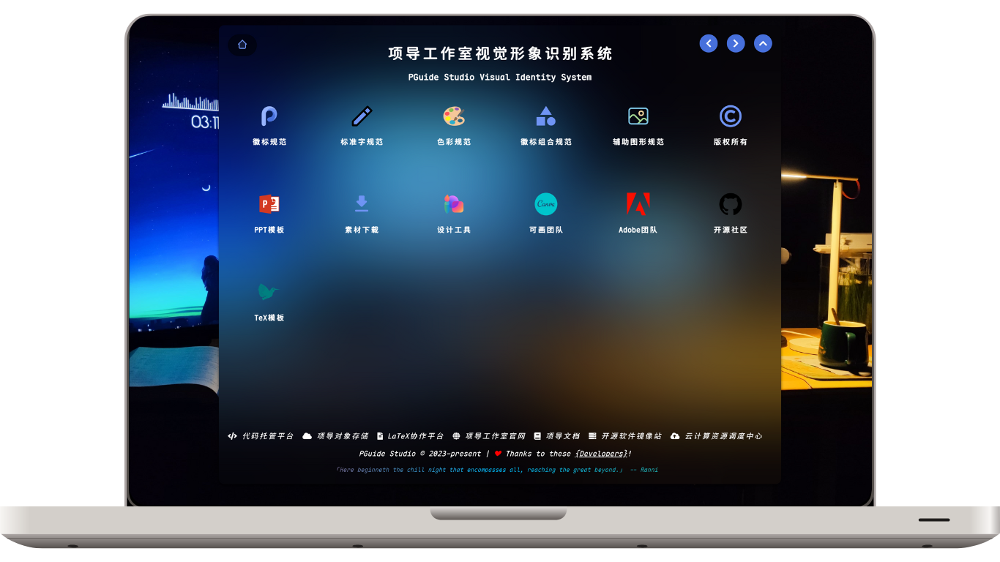

:::danger 这是一篇未完成的文档

:::

项导工作室开发组 GitHub 代码存储仓库，用于存储开发中的项目源代码。

联系 [::noto:red-heart::DKwms](/friends/persons/) 或 [::noto:red-heart::rand777](/friends/persons/) 加入开发组。

## 开源项目

<RepoCard repo="PGuideDev/PGuide-Docs"></RepoCard>
<RepoCard repo="PGuideDev/when2eat"></RepoCard>

## 形象视觉识别系统

工作室的视觉形象识别系统由 [::noto:red-heart::rand777](/friends/persons/) [::noto:red-heart::qiqishiyi](/friends/persons/)  负责维护，包括基础的文字、图形、色彩等元素的设计，主要用于工作室的宣传和推广。除此之外，也有面向同学们的PPT模板、TeX简历模板等设计。

> **::fluent-mdl2:branch-merge::template** 分支模板使用[::icons8:copyright::MIT](https://mit-license.org/)协议，欢迎大家使用。
>
> **::fluent-mdl2:branch-merge::main**分支使用[::icons8:copyright::CC BY-NC-SA 4.0](https://creativecommons.org/licenses/by-nc-sa/4.0/deed.en)协议，禁止商业使用。

<LinkCard icon="/icon/logo.svg" href="https://vi.pguide.studio/" title="项导工作室视觉形象识别系统" >PGuide Studio Visual Identity System</LinkCard>
