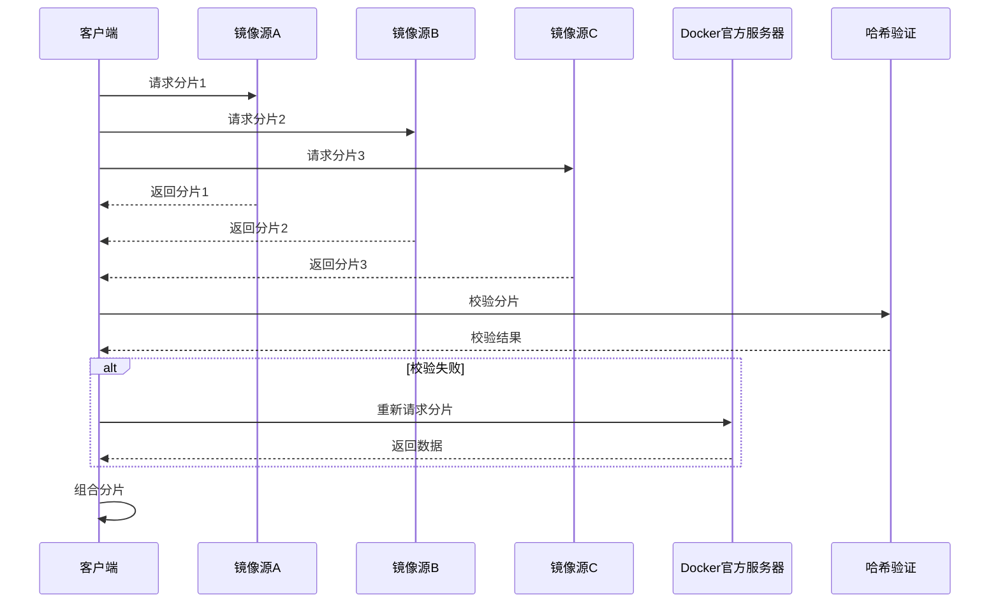

编写者：[::noto:red-heart::rand777](/friends/persons/)

:::tip 本文已完成并校对

:::

:::important 面向对象
仅面向工作室成员使用，使用工作室统一认证账户登录。
:::

## Gitlab

:::note Gitlab Registry
Gitlab 提供了私有的容器镜像仓库，使用 Gitlab 的 OAuth 认证方式登录。
:::

## Docker Registry

工作室内网已搭建私有的 Docker Registry，使用 PGuide OAuth 认证方式登录。

:::info 
- 支持 Docker Registry 的所有功能
- 多镜像并发下载
- 动态负载均衡
- 断点续传支持
- Docker镜像代理服务
- 哈希验证安全性
:::

