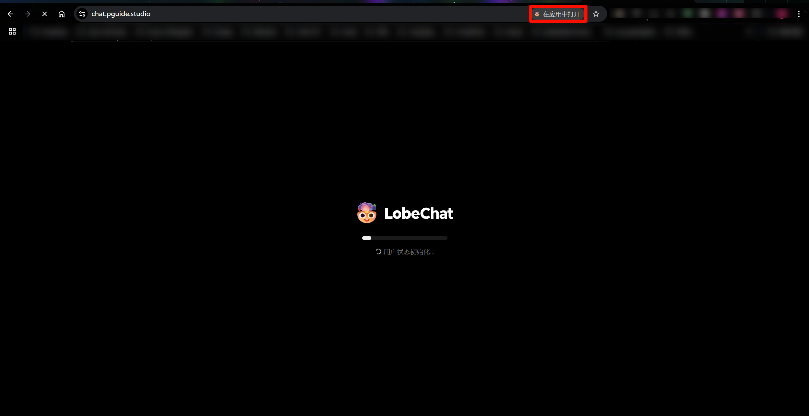

编写者：[::noto:red-heart::rand777](/friends/persons/)

:::tip 本文已完成并校对

:::

<LinkCard icon="https://lobechat.com/icons/icon-192x192.png" title="PGuide LobeChat" href="https://chat.pguide.studio/">

LobeChat OpenSource LLM chat platform.

</LinkCard>

## 官方使用指南
<LinkCard icon="https://lobechat.com/icons/icon-192x192.png" href="https://lobehub.com/zh/docs/usage/start?utm_source=chat_preview" title="LobeChat功能"></LinkCard>

用户界面
::: demo-wrapper no-padding

:::

## 开始对话

进入界面后，随便输入一段文字，此时会弹出密码提示框，输入密码<Plot>联系rand777获取</Plot>解锁即可，教程如下：

### 输入密码
随便点击一个，弹出输入密码提示框，输入密码后重新生成了即为成功

@[artPlayer](https://cos.pguide.cloud/docs/video/2025-03-04_02-39-00.mp4)

### 三方接口
OpenAI下调用了 OpenAI 的香港代理，支持多种对话模型，以 DeepSeek 为例，相较之下，价格为 DeepSeek 官方的八折，且更加流畅，切换方式：

@[artPlayer](https://cos.pguide.cloud/docs/video/2025-03-04_03-25-52.mp4)

### 

### PWA支持

支持 PWA ，可以添加到桌面，方便使用：

## 后续计划

:::info
此项由[Oh My API](/project-docs/oh-my-api/)接管
:::

