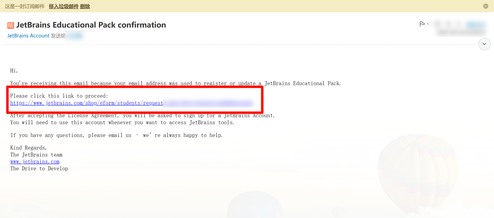
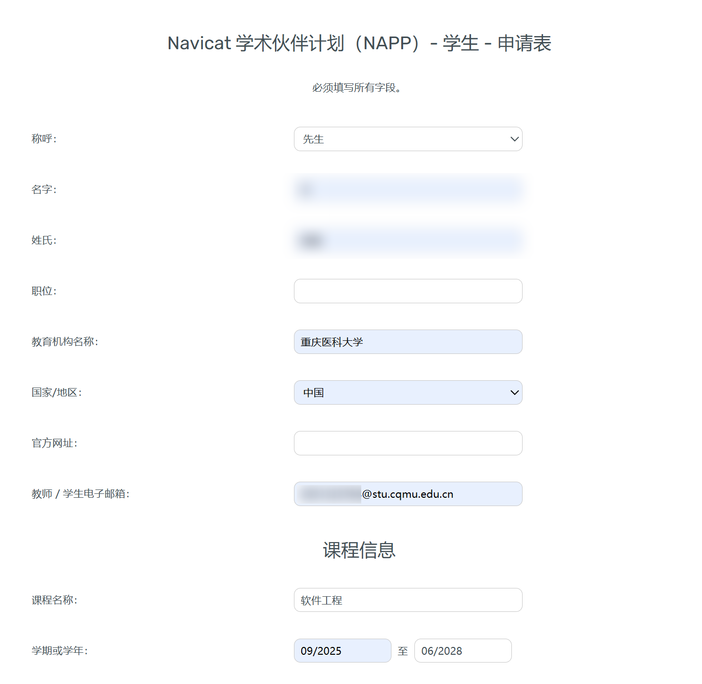
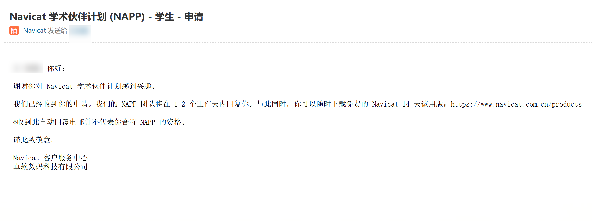
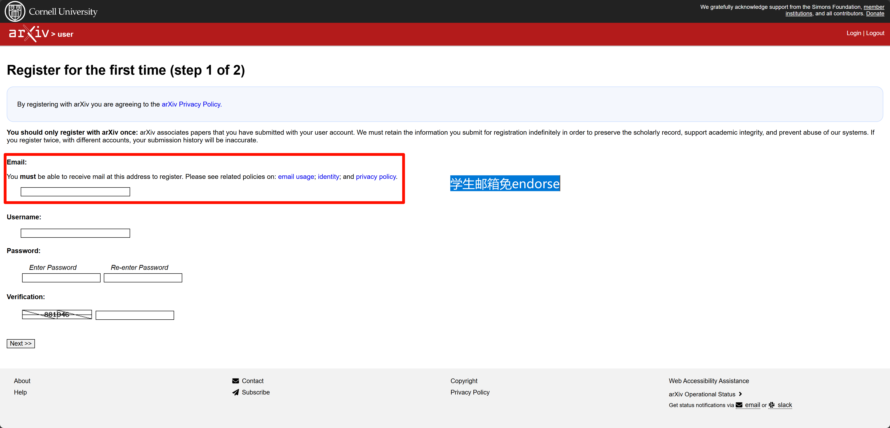
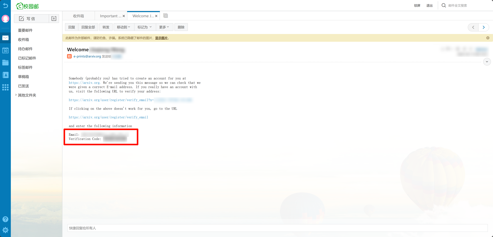

## 申请学生邮箱

进入信息门户并登录：[https://portal.paas.cqmu.edu.cn/main.html](https://portal.paas.cqmu.edu.cn/main.html)

点击电子邮箱申请即可

## 学生邮箱的作用

::: tabs
@tab ::logos:jetbrains-icon::申请JetBrains专业版

由 [::logos:jetbrains-icon::JetBrains](https://www.jetbrains.com/zh-cn/) 开发的集成开发环境([IDE](/campus-wiki/common-software/IDE/))是目前主流的编程工具，学生邮箱可免费申请一年的专业版，到期后再次申请即可。

1. 进入申请页面

前往 [https://www.jetbrains.com/shop/eform/students](https://www.jetbrains.com/shop/eform/students)

邮箱请填写`学生邮箱`: [学号]@stu.cqmu.edu.cn

2. 填写好字段后前往学生邮箱，点击激活链接

3. 下载IDE

查看[你需要的IDE](/campus-wiki/common-software/#ide-篇)，可前往[常用软件推荐及介绍页下载](/public-service/data-center/common-softwares-recommand-and-download/)

> 项导文档开发推荐使用 [::devicon:webstorm::WebStorm](/campus-wiki/common-softwares/IDE/WebStorm/)或[::vscode-icons:file-type-vscode::VS Code](/campus-wiki/common-software/IDE/VSCode/)，参考[贡献指南](/contribute/#我是文档站的开发者)

4. 使用绑定的JetBrains账号登录IDE

建议绑定::cib:github::github或::logos:gitlab::gitlab账号，使用其登录即可激活IDE

@tab ::token-branded:popcat::申请Navicat Premiere

[::/icon/navicat.svg::Navicat](https://www.navicat.com.cn/)是一个数据库管理工具，集成了多种数据库连接、自动化测试等功能。

1. 进入[申请页面](https://www.navicat.com.cn/sponsorship/education/student)

填写表单

[//]: # (![2025-03-12_23-25-22.png]&#40;/src/2025-03-12_23-25-22.png&#41;)

完成后在学生邮箱确认，等待审核

2. 下载Navicat

[https://www.navicat.com.cn/products](https://www.navicat.com.cn/products)

3. 获取登录账号和密码

一个工作日后[前往学生邮箱](https://portal.paas.cqmu.edu.cn/main.html)，收到两份邮件：

支持的产品订阅

1. [x] Navicat Premium - Non-Commercial Edition (1 Year Subscription)
2. [x] Navicat Data Modeler - Non-Commercial Edition (1 Year Subscription)
3. [x] Navicat BI - Non-Commercial Edition (1 Year Subscription)
4. [x] Navicat On-Prem Server - Non-Commercial Edition (1 token) (1 Year Subscription)
5. [x] Navicat Monitor - Non-Commercial Edition (1 token) (1 Year Subscription)
6. [x] Navicat Cloud Pro Plan (1 year)

Navicat ID是你的账号

Password 即为密码

4. 激活

[//]: # (![2025-03-15_06-47-05.png]&#40;../../.vuepress/public/src/2025-03-15_06-47-05.png&#41;)

@tab ::devicon:canva::可画半价优惠

类似于PhotoShop的在线设计软件，提供了丰富的模板和素材，适合快速制作海报、简历等。

<LinkCard icon="::devicon:canva::" href="https://www.canva.cn/" title="可画" >Canvas</LinkCard>

高级版订阅84元/年，学生邮箱申请后可享受半价优惠

@tab ::material-symbols-light:computer-rounded:: 注册CCF会员

CCF会员是中国计算机学会的会员，享受CCF的各项服务和权益。

查看 [https://www.ccf.org.cn/Membership/Individual_member/Benefits/Benefits_student/](https://www.ccf.org.cn/Membership/Individual_member/Benefits/Benefits_student/)

@tab ::cib:acm::成为ACM会员

如果你要发表论文，ACM会员可以享受ACM的各项服务和权益。

查看 [https://www.acm.org/membership](https://www.acm.org/membership)

@tab ::simple-icons:arxiv::注册arxiv

关于[arxiv](/project-docs/academic-conversion/#arxiv)

1. 前往[注册界面](https://arxiv.org/user/register?submit=Register+for+the+first+time)

使用学生邮箱[学号]@stu.cqmu.edu.cn注册即可，Username填用户名。

2. 填写验证码

学生邮箱收到验证码，填Verification Code即可

@tab ::line-md:github-loop::注册Github教育版

前往[申请页面](https://education.github.com/pack)

Github教育版是Github为学生提供的免费服务，包含了Github的所有功能和一些额外的服务，非常建议申请。

