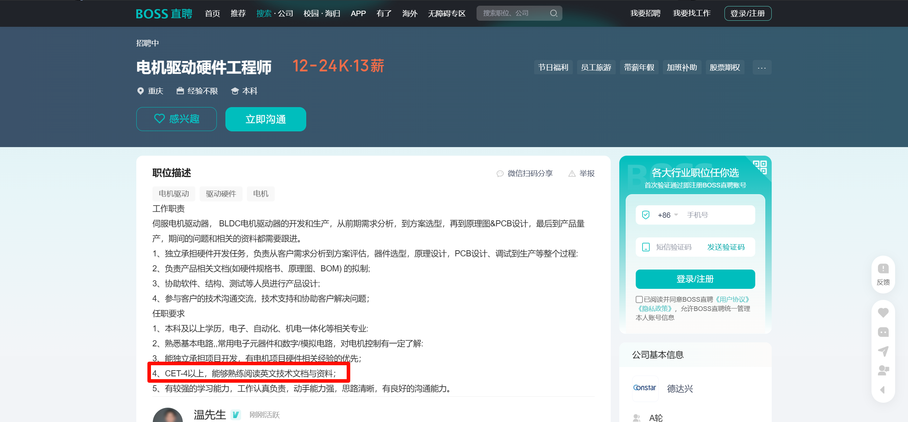
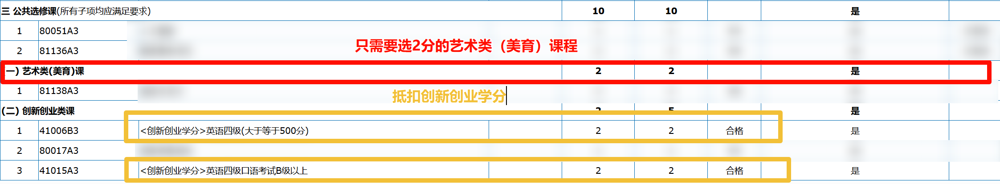
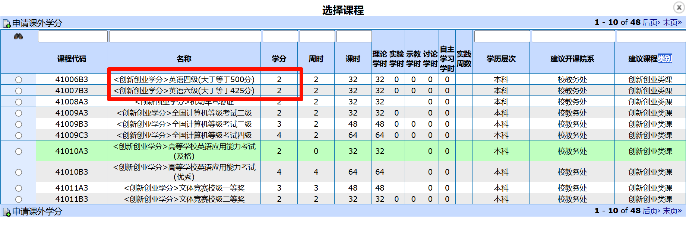
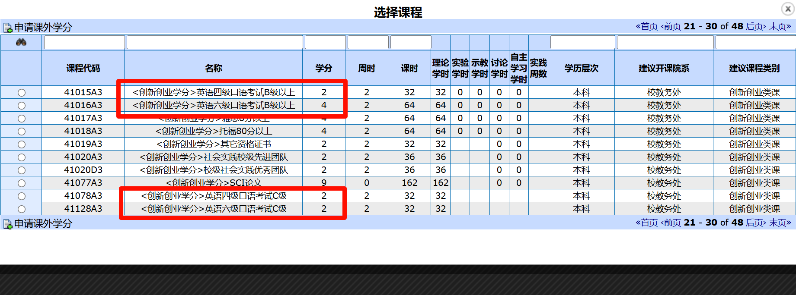
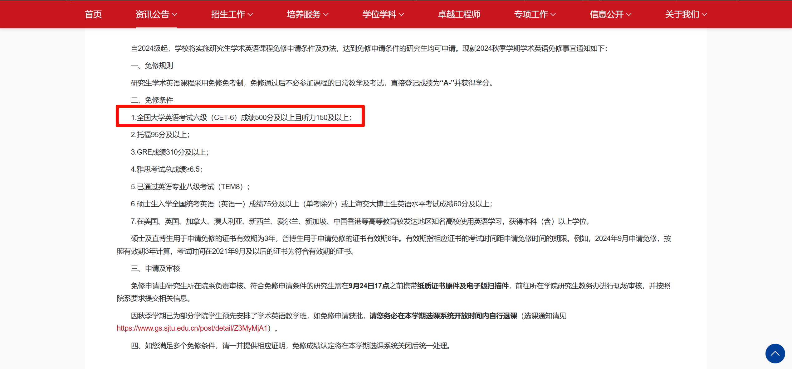

## 四、六级是什么

<LinkCard icon="icon-park-twotone:six-key" href="https://cet.neea.edu.cn/html1/folder/1608/1178-1.htm" title="College English Test" >
全国大学英语四、六级考试</LinkCard>

### 考试内容

<CardGrid>
<LinkCard icon="" href="https://cet.neea.edu.cn/html1/report/16123/196-1.htm" title="CET4" >全国大学英语四级笔试</LinkCard>
<LinkCard icon="" href="https://cet.neea.edu.cn/html1/report/16123/199-1.htm" title="CET-SET4" >全国大学英语四级口试</LinkCard>
<LinkCard icon="" href="https://cet.neea.edu.cn/html1/report/16123/201-1.htm" title="CET6" >全国大学英语六级笔试</LinkCard>
<LinkCard icon="" href="https://cet.neea.edu.cn/html1/report/16123/200-1.htm" title="CET-SET6" >全国大学英语六级口试</LinkCard>
</CardGrid>

### 每年报名、考试、成绩查询时间

集中在6月和12月，2020-2025年的考试时间表如下，一般四级、六级连着的，2022因为疫情特殊：

| 上半年报名      | 上半年口试         | 上半年笔试      | 上半年成绩查询时间  | 下半年报名      | 下半年口试         | 下半年笔试      | 下半年成绩查询时间  |
|------------|---------------|------------|------------|------------|---------------|------------|------------|
| 2025.03.07 | 2025.05.24-25 | 2025.06.14 | -          | -          | -             | -          | -          |
| 2024.03.08 | 2024.05.18-19 | 2024.06.15 | 2024.08.23 | 2024.09.05 | 2024.11.23-24 | 2024.12.24 | 2025.02.26 |
| 2023.03.27 | 2023.05.20-21 | 2023.06.17 | 2023.08.24 | 2023.09.01 | 2023.11.18-19 | 2023.12.16 | 2024.02.22 |
| 2022.03.15 | 2022.05.21-22 | 2022.06.11 | 2022.08.25 | 2022.09.13 | 2022.11.19-20 | 2022.12.10 | 2023.02.17 |
| 2021.03.08 | 2021.05.22-23 | 2021.06.12 | 2021.08.24 | 2021.09.10 | 2021.11.20-21 | 2022.12.18 | 2022.02.24 |

### 考试做题顺序

四、六级**先写一篇作文，再来听力**，听力一结束，你只有1分钟填涂机读卡，很多第一次考四、六级的同学都会被这个顺序搞慌张，所以提前了解一下。在进行听力的时候，如果拿不准答案，也要将答案填到机读卡上，以免错过后面的题目。

随后，笔者的建议是先写翻译，反正词汇量摆在那儿，能写多少写多少，字体不要太大，写工整即可。

再来是阅读，阅读的题目一般是按照难度递增的，所以可以先看看题目，然后再看文章，不需要通读全文，四、六级的题目分布与段落有极强相关性，这样可以更快的找到答案。七选五去答案选项挑个最有辨识度的那个单词，然后根据这个单词找到原文，这样可以更快的找到合适的答案。

最后是完形填空，看语法和词性、短语的掌握情况，多积累就行。

### 其他注意事项

重医四、六级考试没有耳机，也不提供无线电频段收听四、六级听力，不用买耳机！

:::details 记得带上这些东西
- 准考证
- 身份证
- 橡皮擦
- 2B铅笔
- 签字笔
- 🧠(开个玩笑哈哈，你是最棒的)
:::

## 分数计算方法

<LinkCard icon="ph:exam-fill" href="https://cet.neea.edu.cn/html1/folder/19081/5124-1.htm" title="分数解释" >
大学英语四、六级考试的分数报道采用常模参照方式，不设及格线。</LinkCard>

## 学习四、六级的一些建议

### 老师们说

参考::noto:red-heart::[kunkun](/friends/persons/)给出的[英语学习建议](/campus-wiki/english/)

### 英语真题在线高级版

<LinkCard icon="https://zhenti-res.youshaohua.com/images/read/zhenti/zhenti_online.svg" href="https://zhenti.burningvocabulary.cn/" title="英语真题在线官方网站" >
考研英语、四、六级等专业的在线训练平台，按试卷排版设计</LinkCard>

半年9.9的高级账户，可以联系rand777获取。

## 大学生英语四、六级的一些作用

:::info 笔者的见解

未来不太需要过高的英语成绩，虽然会让你在众人中看似突出，实际作用没那么大，**只需要达到一定的基准线即可**
，多花些时间在专业技能的学习上更好，英语本质上是用来交流的，现在的AI和翻译已足够强大，不需要过高的英语考试能力。

:::

### 工作岗位需求

由于国内工作环境内卷，现在的用人单位大多对应届生有四、六级的要求，即使这些岗位本身不怎么需要英语能力。

:::tip 为什么呢?
更多的是一种筛选机制。
:::

### 申请创新创业学分

重医教务系统允许英语过了四、六级考生的同学申请创新创业学分，倘若你又选择了口语考试，最多可以抵扣8分，只需要选2分的艺术类公选课即可，==就不需要花时间去上公选课了==。

我的教学-创新创业课外学分申请-创新创业学分申请

### 申请重医免修

上学期绩点4.0以上的同学可以申请免修英语课程，但需要参加最终的考试，最后按考试记录最终成绩。

详情请自行查阅2023年9月学生手册，第四章，第十九条申请免修

### 申请硕士研究生推荐免试

重庆医科大学[保研](/campus-wiki/postgraduate-recommendation/)基本条件之一，2025届以前鼓励人才计划还不要求过六级，但现在需要了，所以同学们还是要努力学习英语。详细信息请自行查阅推免资料。

### 申请部分高校奖学金

以复旦大学为例，荣昶学者可以凭借四、六级成绩申请奖学金，最低要求是四级550分，六级500分。小部分院校针对四、六级过基准线单独设置了奖学金，这里不再一一列举。

### 申请科研夏令营

以[南京大学NLP科研夏令营](https://mp.weixin.qq.com/s/jWJiq2E2gHha_K9ryWg2sA)为例，部分高校在寒暑假期间会开放实验室，促进各高校间的交流，也设置了一定基准线。大二的同学们可以大胆尝试投递，简历制作可以[参照这里](/campus-wiki/internship/resume/)，增加自己的科研经历。

### 申请推免夏令营

部分高校在申请研究生推免夏令营时有英语四、六级基准线，以清华大学计算机科学技术系为例，保守需要达到480分（未明确要求，文件写的达到良好）。

@[pdf height="600"](https://www.cs.tsinghua.edu.cn/__local/7/06/23/DBA494F960130A64C7268CAC205_2414F314_3C705.pdf)

### 申请研究生免试英语考试

部分高校在研究生阶段会设置英语课，英语六级成绩可以申请研究生英语课程免修。以[上海交通大学为例](https://www.gs.sjtu.edu.cn/post/detail/Z3MyNTIw)
，六级500分及以上且听力150及以上可以申请免修，且最终课程成绩按A-计算。

