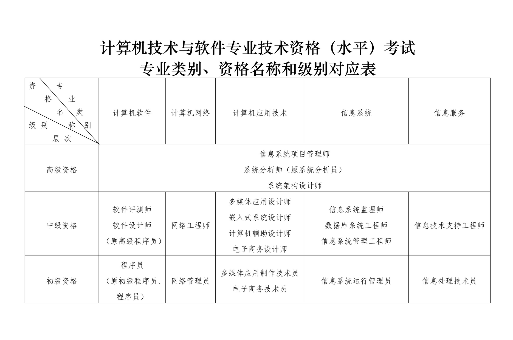

编写者：[::noto:red-heart::fangzhang](/friends/persons/)

## 概述
一个极具含金量，却常被低估的宝藏——软考（全国计算机与软件专业技术资格（水平）考试）。
<linkCard href="https://www.ruankao.org.cn/introduction/main.html" title="Introduce">考试介绍</linkCard>

## 资格设置

[](https://www.mohrss.gov.cn/xxgk2020/fdzdgknr/zcfg/gfxwj/rcrs/201407/t20140717_136367.html)

## 岗位设置与描述

- 初级

  |                                  资格名称                                   |                                                   考核内容                                                   |                                 岗位描述                                  |
  |:-----------------------------------------------------------------------:|:--------------------------------------------------------------------------------------------------------:|:---------------------------------------------------------------------:|
  |    [程序员](https://www.ruankao.org.cn/article/content/bkzn/01_18.html)    |                          计算机相关基础知识；基本数据结构和常程序员用算法；C程序设计语言以及C++、Java中的一种程序设计语言。                           |                          从事软件开发和调试工作的初级技术人员。                          |
  |   [网络管理员](https://www.ruankao.org.cn/article/content/bkzn/01_28.html)   |  计算机系统、网络操作系统、数据通信的基础知识；计算机网络的相关知识；以太网的性能、特点、组网方法及简单管理；主流操作系统的安装、设置和管理方法；Web网站的建立、管理与维护方法；交换机和路由器的基本配置。  |       从事小型网络系统的设计、构建、安装和调试，中小型局域网的运行维护和日常管理，构建和维护Web网站的初级技术人员：        |
  |  [信息处理技术员](https://www.ruankao.org.cn/article/content/bkzn/01_58.html)  | 信息技术的基本概念；计算机的组成、各主要部件的功能和性能指标；操作系统和文件管理的基本概念和基本操作；文字处理、电子表格、演示文稿和数据库应用的基本知识和基本操作；Initermet及其常用软件的基本操作。  |             从事信息收集、存储、加工、分析、展示等工作，并对计算机办公系统进行日常维护的初级技术人员。             |
  | [信息系统运行管理员](https://www.ruankao.org.cn/article/content/bkzn/01_48.html) |        计算机系统的组成及主要设备的基本性能指标；操作系统、数据库系统、计算机网络的基础知识；多媒体设备、电子办公设备的安装、配置和使用；信息处理基本操作；信息化及信息系统开发的基本知识。        | 从事信息系统的运行管理，安装和配置相关设备，熟练地进行信息处理操作，记录信息系统运行文档，处理信息系统运行中出现的常见问题的初级技术人员。 |
  |                                  网页制作员                                  | Intermet、网页、网站的基本知识；HTML语言及其应用；CSS及其应用；网站设计的步骤、原则、布局等知识；使用Photoshop进行平面设计的基本方法和技巧；使用Flash进行动画设计的基本方法和技巧。 |          从事网站结构与内容的策划与组织，网站的页面设计及美观优化，网站栏自内容的采编与日常维护的初级技术人员。          |
  |  [电子商务技术员](https://www.ruankao.org.cn/article/content/bkzn/01_39.html)  |           现代电子商务的定义、作用、特点；电子商务模式；网络营销的定义和内容；现代电子商务的相关技术基础；电子商务网站的维护和管理；电子商务安全的概念和技术基础；电子支付技术。            |                   从事电子商务网站的维护和管理，网络产品的营销策划的初级技术人员。                    |
  |                               多媒体应用制作技术源                                |                          计算机相关基础知识；多媒体数据获取、处理及输出技术；数字音频编辑；动画和视频的制作；多媒体制作工具的使用。                           |                           从事多媒体系统制作的初级技术人员。                           |


- 中级

  | 资格名称                                                                      | 考核内容                                                                                                                          | 岗位描述                                                        |
  |---------------------------------------------------------------------------|-------------------------------------------------------------------------------------------------------------------------------|-------------------------------------------------------------|
  | [软件测评师](https://www.ruankao.org.cn/article/content/bkzn/02_14.html)       | 操作系统、数据库、中间件、程序设计语言、计算机网络基础知识；软件工程知识；软件质量及软件质量管理基础知识；软件测试标准、测试技术及方法；软件测试项目管理知识。                                               | 从事软件测试工作的中级技术人员。                                            |
  | [软件设计师](https://www.ruankao.org.cn/article/content/bkzn/02_15.html)       | 计算机相关基础知识；常用数据结构和常用算法；C程序设计语言，以及C++、Java中的一种程序设计语言；软件工程、软件过程改进和软件开发项目管理的基础知识；软件设计的方法和技术。                                      | 从事软件设计与开发工作的中级技术人员。                                         |
  | [网络工程师](https://www.ruankao.org.cn/article/content/bkzn/02_24.html)       | 计算机系统、网络操作系统、数据通信的基础知识；计算机网络的相关知识，包括计算机网络体系结构和网络协议、计算机网络互联技术、网络管理的基本原理和操作方法、网络安全机制和安全协议；网络系统的性能测试和优化技术，以及可靠性设计技术；网络新技术及其发展趋势。 | 从事计算机网络系统的规划、设计，网络设备的软硬件安装调试，网络系统的运行、维护和管理的中级技术人员。          |
  | [多媒体应用设计师](https://www.ruankao.org.cn/article/content/bkzn/02_34.html)    | 多媒体计算机的系统结构；多媒体数据获取、处理及输出技术；多媒体数据压缩编码及其适用的国际标准；多媒体应用系统的创作过程，包括数字音频编辑、图形的绘制、动画和视频的制作、多媒体制作工具的使用等。                              | 从事多媒体系统的设计、制作和集成的中级技术人员。                                    |
  | [嵌入式系统设计师](https://www.ruankao.org.cn/article/content/bkzn/02_35.html)    | 嵌入式系统的硬软件基础知识；嵌入式系统需求分析方法；嵌入式系统设计与开发的方法及步骤；嵌入式系统实施、运行、维护知识；软件过程改进和软件开发项目管理等软件工程基础知识；系统的安全性、可靠性、信息技术标准以及有关法律法规的基本知识。           | 从事嵌入式系统的设计、开发和调试的中级技术人员。                                    |
  | [电子商务设计师](https://www.ruankao.org.cn/article/content/bkzn/02_37.html)     | 电子商务基本模式、模式创新及发展趋势；电子商务交易的一般流程；电子支付概念；现代物流技术和供应链技术；电子商务网站的运行、维护和管理；电子商务相关的经济学和管理学基本原理、法律法规等。                                  | 从事电子商务网站的建立、维护、管理和营销的中级技术人员。                                |
  | [系统集成项目管理工程师](https://www.ruankao.org.cn/article/content/bkzn/02_43.html) | 信息系统集成项目管理知识、方法和工具；系统集成项目管理工程师职业道德要求；信息化知识；信息安全知识与安全管理体系。                                                                     | 从事信息系统项目管理的中级管理人员、中级项目经理等。                                  |
  | [信息系统监理师](https://www.ruankao.org.cn/article/content/bkzn/02_44.html)     | 信息系统工程监理知识、方法和工具；信息系统工程监理师的职业道德要求；信息系统工程监理的有关政策、法律、法规、标准和规范。                                                                  | 从事信息系统监理的中级技术人员。                                            |
  | [数据库系统工程师](https://www.ruankao.org.cn/article/content/bkzn/02_45.html)    | 数据库系统基本概念及关系理论；常用的大型数据库管理系统的应用技术；数据库应用系统的设计方法和开发过程；数据库系统的管理和维护方法。                                                             | 从事数据库系统设计、建立、运行、维护的中级技术人员。                                  |
  | [信息系统管理工程师](https://www.ruankao.org.cn/article/content/bkzn/02_46.html)   | 信息化和信息系统基础知识；信息系统开发的基本过程与方法；信息系统管理维护的知识、工具与方法。                                                                                | 从事对信息系统的功能与性能、日常应用、相关资源、运营成本、安全等进行监控、管理、评估、提出系统改进建议的中级技术人员。 |
  | 信息安全工程师                                                                   | 信息安全的基本知识；密码学的基本知识与应用技术；计算机安全防护与检测技术；网络安全防护与处理技术；数字水印在版权保护中的应用技术；信息安全相关的法律法规和管理规定。                                            | 从事信息系统安全设施的运行维护和配置管理，处理信息系统一般安全风险问题的中级技术人员。                 |
  | 计算机辅助设计师                                                                  | 计算机相关基础知识；计算机辅助设计的基本知识；相关计算机辅助设计软件的使用；属性、图块与外部参照在图形绘制中的应用；图形的着色与渲染。                                                           | 运用相关计算机辅助设计软件从事机械设计、数字制图等的中级技术人员。                           |
  | 信息技术支持工程师                                                                 | 信息技术知识；计算机硬件和软件知识；计算机日常系统安全与维护知识；文字处理、电子表格、演示文稿和数据库软件的操作；多媒体、信息检索与管理的基础知识；常用办公设备的使用方法。                                        | 从事计算机系统安全与维护，多媒体、信息检索与管理，熟练使用常用办公软件的中级技术人员。                 |
  | 计算机硬件技术工程师                                                                | 计算机硬件基础知识；数字电路基础；计算机原理；PCB设计；C语言和汇编语言编程技术；计算机常见故障现象和判断方法。                                                                     | 从事计算机相关硬件设计、开发和维护的中级技术人员。                                   |
  | 软件过程能力评估师                                                                 | 软件工程基础知识；软件过程能力评估模型；软件能力成熟度模型；软件过程及能力成熟度评估方法；相关认证认可基本规范。                                                                      | 从事软件过程能力及成熟度评估活动的中级技术人员。                                    |

- 高级

  |                                  资格名称                                   |                                            考核内容                                             |                                          岗位描述                                          |
  |:-----------------------------------------------------------------------:|:-------------------------------------------------------------------------------------------:|:--------------------------------------------------------------------------------------:|
  | [信息系统项目管理师](https://www.ruankao.org.cn/article/content/bkzn/03_01.html) |                    信息系统项目管理知识和方法；项目整体绩效评估方法；常用项目管理工具；信息系统相关法律法规、技术标准与规范。                    |                               从事信息系统项目管理的高级管理人员、高级项目经理等。                               |
  |   [系统分析师](https://www.ruankao.org.cn/article/content/bkzn/03_02.html)   |             信息系统开发所需的综合技术知识，包括硬件、软件、网络、数据库等；信息系统开发过程和方法；信息系统开发标准；信息安全的相关知识与技术。              | 在信息系统项目开发过程中负责制定信息系统需求规格说明书和项目开发计划、指导和协调信息系统开发与运行、编写系统分析设计文档、对开发过程进行质量控制与进度控制等的高级技术人员。 |
  |  [系统架构设计师](https://www.ruankao.org.cn/article/content/bkzn/03_03.html)  |        计算机硬软件知识；信息系统开发过程和开发标准；主流的中间件和应用服务器平台；软件系统建模和系统架构设计基本技术；计算机安全技术、安全策略、安全管理知识。         |                                 从事系统架构分析、设计与评估的高级技术人员。                                 |
  |  [网络规划设计师](https://www.ruankao.org.cn/article/content/bkzn/03_04.html)  | 数据通信、计算机网络、计算机系统的基本原理；网络计算环境与网络应用；各类网络产品及其应用规范；网络安全和信息安全技术、安全产品及其应用规范；应用项目管理的方法和工具实施网络工程项目。 |     从事计算机网络领域的需求分析、规划设计、部署实施、评测、运行维护等工作，能指导制订用户的数据和网络战略规划，能指导网络工程师进行系统建设实施的高级技术人员。     |
  |                                系统规划与管理师                                 |         IT战略规划知识；信息技术服务知识；IT服务规划设计、部署实施、运营管理、持续改进、监督管理、服务营销；团队建设与管理的方法和技术；标准化相关知识。          |                从事信息技术服务规划和信息系统运行维护管理，制定组织的IT服务标准和相关制度、管理IT服务团队的高级技术人员。                 |
  
## 考试用书
<linkCard href="https://www.ruankao.org.cn/book/main.html" title="考试用书">包含大纲、教程和辅导用书</linkCard>

## 报考流程
1. ```考试报名```
2. ```考前一周查询考场（打印准考证）```
3. ```参加考试```
4. ```查询成绩（成绩发布后）```
5. ```领取证书```

## 考试安排

### 报名时间（各地区略有差异）

- 上半年：一般是每年3月至4月
- 下半年：一般是每年8月至9月
- <linkCard href="https://bm.ruankao.org.cn/sign/welcome" title="网上报名平台">具体报名时间请查看网上报名平台</linkCard>

### 考试时间

- 上半年：一般是每年5月最后一个周末
- 下半年：一般是每年11月第一个周末（具体考试时间以准考证为准）

### 考试工作安排

- <linkCard href="https://www.ruankao.org.cn/exam/plan.html" title="Plan">每次考试的科目可能会有所不同，请注意查看官网科目安排</linkCard>

## 软考证书作用

考试合格者将颁发由中华人民共和国人力资源和社会保障部、工业和信息化部用印的计算机与软件专业技术资格（水平）证书。该证书在全国范围内有效。

### 职称评定
计算机软件资格考试全国同意实施后，不再进行计算机技术与软件相应专业和级别的专业技术职务任职资格评审工作。因此，计算机软件资格考试既是职业资格考试，又是职称资格考试。简单理解就是```以考代评```。

- 初级证书：获得助理工程师职称
- 中级证书：对应工程师职称（如软件设计师、网络工程师）
- 高级证书：直接评定副高级或正高级职称（如系统架构师、信息系统项目管理师） 

适用场景：国企、事业单位晋升，部分企业将证书与薪酬挂钩，高级证书持有者薪资涨幅可达10%-30%。

### 政策福利与生活保障

1. 积分落户与城市扎根
   - 中级证书：深圳等城市可直接申请落户
   - 高级证书：地方落户加积分或“零门槛”落户等
2. 个税抵扣与政府补贴
   - 年度个税定额扣除
   - 地方人才补贴等（不同地区略有差异）

### 企业认可与商业价值

1. 企业资质升级必备
企业参与政府/大型项目投标时，需员工持有特定数量软考证书（如ITSS、CMMI认证资质）。
2. 岗位招聘硬性条件
部分国企、事业单位及大厂将软考证书列为招聘或晋升的加分项，尤其是中高级岗位。

### 系统性技能构建

- 中级考试侧重技术（如编程、数据库、网络安全）
- 高级考试强化架构设计、项目管理等复合能力

### 国际互认优势
计算机软件资格考试部分专业岗位的考试标准与日本、韩国相关考试标准实现了互认，中国信息技术人员在这些国家还可以享受相应的待遇。


