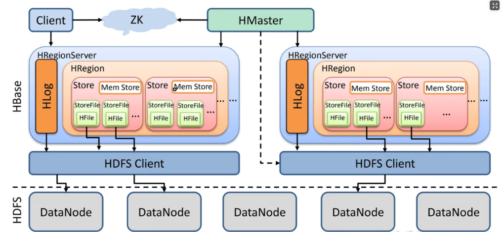
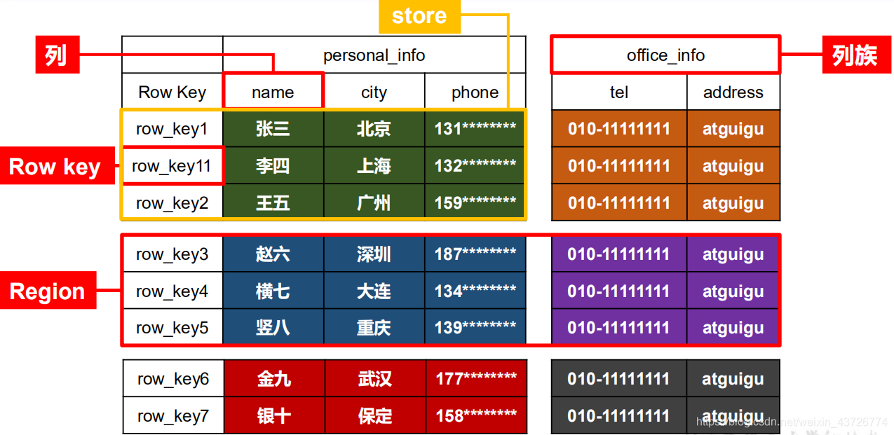
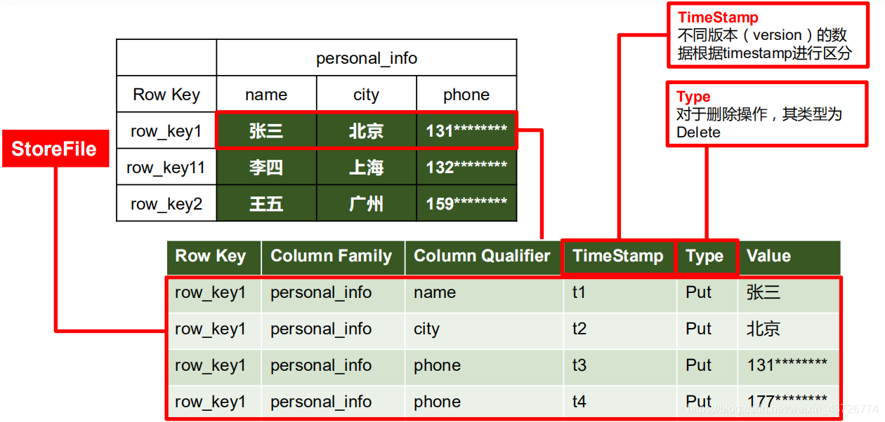

# Hbase技术手册

# 第1章 HBase简介

##  HBase特点

**1）海量存储**

Hbase适合存储PB级别的海量数据,在PB级别的数据以及采用廉价PC存储的情况下,能在几十到百毫秒内返回数据。这与Hbase的极易扩展性息息相关。正式因为Hbase良好的扩展性,才为海量数据的存储提供了便利。

**2）列式存储**

这里的列式存储其实说的是**列族存储**,Hbase是根据**列族**来存储数据的。**列族下面可以有非常多的列,列族在创建表的时候就必须指定**。

**3）极易扩展**

Hbase的扩展性主要体现在两个方面,**一个是基于上层处理能力（RegionServer）的扩展,一个是基于存储的扩展（HDFS）**。

通过横向添加RegionSever的机器,进行水平扩展,提升Hbase上层的处理能力,提升Hbsae服务更多Region的能力。

> 备注:RegionServer的作用是管理region、承接业务的访问,这个后面会详细的介绍通过横向添加Datanode的机器,进行存储层扩容,提升Hbase的数据存储能力和提升后端存储的读写能力。

**4）高并发**

由于目前大部分使用Hbase的架构,都是采用的廉价PC,因此单个IO的延迟其实并不小,一般在几十到上百ms之间。这里说的高并发,主要是在并发的情况下,Hbase的单个IO延迟下降并不多。能获得高并发、低延迟的服务。

**5）稀疏**

稀疏主要是针对Hbase列的灵活性,在列族中,你可以指定任意多的列,在列数据为空的情况下,是不会占用存储空间的。

##  HBase架构

Hbase架构如图所示:



从图中可以看出Hbase是由**Client、Zookeeper、HMaster、HRegionServer、HDFS**等几个组件组成,下面来介绍一下几个组件的相关功能:

**1）Client**

Client包含了访问Hbase的接口,另外Client还维护了对应的**cache**来加速Hbase的访问,比如cache的.META.元数据的信息。

**2）Zookeeper**

HBase通过Zookeeper来做master的高可用、RegionServer的监控、元数据的入口以及集群配置的维护等工作。具体工作如下:

- 高可用:通过Zoopkeeper来保证集群中只有1个master在运行,如果master异常,会通过竞争机制产生新的master提供服务
- 节点上下线:通过Zoopkeeper来监控RegionServer的状态,当RegionSevrer有异常的时候,通过回调的形式通知Master RegionServer上下线的信息
- 通过Zoopkeeper存储元数据的统一入口地址

**3）Hmaster**

Master 是所有 Region Server 的管理者,其实现类为 HMaster,主要作用如下:

- 为RegionServer分配Region
- 维护整个集群的负载均衡
- 维护集群的元数据信息,对于表的操作:create, delete, alter,也就是对所有表的元数据进行管理。
- 发现失效的Region,并将失效的Region分配到正常的RegionServer上,对于 RegionServer的操作:分配 regions到每个RegionServer,监控每个 RegionServer的状态,负载均衡和故障转移。如果master某一个时间挂掉的话,那么做数据级别的增删改查是可以的,但是不可以做表级别的修改。
- 当RegionSever失效的时候,协调对应Hlog的拆分
- 主要管理DDL的操作,对表进行操作。
- master自带HA高可用机制。

**4）HregionServer**

Region Server 为 Region 的管理者,其实现类为 HRegionServer,HregionServer直接对接用户的读写请求,是真正的“干活”的节点。它的功能概括如下:

- 管理master为其分配的Region
- 处理来自客户端的读写请求,对于数据的操作:get, put, delete;
- 负责和底层HDFS的交互,存储数据到HDFS
- 负责Region变大以后的拆分,对于 Region 的操作:splitRegion、compactRegion。
- 负责Storefile的合并工作
- 主要管理DML操作,也就是主要对数据进行操作。

**5）HDFS**

HDFS为Hbase提供最终的底层数据存储服务,同时为HBase提供高可用（**Hlog存储在HDFS**）的支持,具体功能概括如下:

- 提供元数据和表数据的底层分布式存储服务
- 数据多副本,保证的高可靠和高可用性

##  HBase中的角色

###  HMaster

**功能**

1．监控RegionServer

2．处理RegionServer故障转移

3．处理元数据的变更

4．处理region的分配或转移

5．在空闲时间进行数据的负载均衡

6．通过Zookeeper发布自己的位置给客户端

###  RegionServer

**功能**

1．负责存储HBase的实际数据

2．处理分配给它的Region

3．刷新缓存到HDFS

4．维护Hlog

5．执行压缩

6．负责处理Region分片

###  其他组件

1．Write-Ahead logs(WLA)

HBase的修改记录,当对HBase读写数据的时候,数据不是直接写进磁盘,它会在内存中保留一段时间（时间以及数据量阈值可以设定）。但把数据保存在内存中可能有更高的概率引起数据丢失,为了解决这个问题,数据会先写在一个叫做Write-Ahead logfile的文件中,然后再写入内存中。所以在系统出现故障的时候,数据可以通过这个日志文件重建。

> 1. 由于数据要经MemStore排序后才能刷写到HFile,但把数据保存在内存中会有很高的概率导致数据丢失,为了解决这个问题,数据会先写在一个叫做Write-Ahead logfile的文件中,然后再写入MemStore中。所以在系统出现故障的时候,数据可以通过这个日志文件重建。
>
> 2. WAL 本质：一种预写式日志（Write-Ahead Logging）,核心原则：**先写日志，后写数据**;
> 
> 3. Hbase中的流程:Client Put/Delete → 写入WAL → 写入MemStore → 定期刷写到StoreFile.
> 

**WLA架构的位置**

```shell
HBase 数据写入流程:
Client Write Request
    ↓
RegionServer (接收请求)
    ↓
Region (目标Region)
    ↓
WAL (先写日志) ←───────┐
    ↓                   │
MemStore (内存存储)      │
    ↓                   │
定期Flush              │
    ↓                   │
StoreFile (HDFS)      │
    └──────────────→ 故障时用于恢复
```

WLA的核心就是保证数据的持久化可靠性，当服务宕机的时候，可以从WLA中恢复数据;

**故障恢复机制**

```shell
# WAL 恢复流程（Log Splitting 和 Replay）
RegionServer 宕机 → HMaster 检测到
    ↓
分配故障 Region 到其他 RegionServer
    ↓
新 RegionServer 读取 WAL 文件
    ↓
解析 WAL，找到属于该 Region 的 edits
    ↓
重新执行这些 edits 到 MemStore
    ↓
Region 恢复完成，继续服务
```

**WLA和HFile文件对比**

```shell
# WAL 和 HFile 存储格式对比：
WAL（顺序追加）：
- 按时间顺序存储所有修改
- 包含多个Region的修改
- 未排序，按写入顺序存储
- 临时性，数据刷写后可以删除

HFile（有序存储）：
- 按RowKey排序存储
- 只包含一个Region的一个Column Family
- 永久存储，不会删除
- 支持快速查找
```


2. Region

**Hbase表的分片,HBase表会根据RowKey值被切分成不同的region存储在RegionServer中,在一个RegionServer中可以有多个不同的region。**

3. **Store**

HFile存储在Store中,一个Store对应HBase表中的一个**列族**。

4. StoreFile(HFile)

这是在磁盘上保存原始数据的实际的物理文件,是实际的存储文件。StoreFile是以Hfile的形式存储在HDFS的。每个Store会有一个或多个StoreFile（HFile）,数据在每个StoreFile中都是有序的。

5. **MemStore**

写缓存,由于HFile中的数据要求是有序的,所以数据是先存储在MemStore中,排好序后,等到达刷写时机才会刷写到HFile,每次刷写都会形成一个新的HFile。

6. **BlockCache**

读缓存,每次查询出的数据会缓存在BlockCache中,方便下次查询。

## Hbase数据模型

逻辑上,HBase 的数据模型同关系型数据库很类似,数据存储在一张表中,有行有列。
但从 HBase 的底层物理存储结构（K-V）来看,HBase 更像是一个 multi-dimensional map。

- namespace—→数据库

- region—→表

- row—→行

- column—→列

### **NameSpace**

命名空间,类似于关系型数据库的 **DatabBase** 概念,每个命名空间下有多个表。HBase有两个自带的命名空间,分别是 hbase 和 default,hbase 中存放的是 HBase 内置的表,default 表是用户默认使用的命名空间。

> 可以简单的把命名空间理解为mysql中的数据库。

### **Region**

类似于关系型数据库的**表**概念。不同的是,HBase 定义表时只需要声明**列族**即可,不需要声明具体的列。这意味着,往 HBase 写入数据时,字段可以动态、按需指定。因此,和关系型数据库相比,HBase 能够轻松应对字段变更的场景。

### **Row**

HBase 表中的每行数据都由一个 RowKey 和多个 Column（列）组成,数据是按照 RowKey的**字典顺序**存储的,并且查询数据时只能根据 RowKey 进行检索,所以 RowKey 的设计十分重要。

### **Column**

HBase 表中的每行数据都由一个 RowKey 和多个 Column（列）组成,数据是按照 RowKey的字典顺序存储的,并且查询数据时只能根据 RowKey 进行检索,所以 RowKey 的设计十分重要。

### **TimeStamp**

用于标识数据的不同版本（version）,每条数据写入时,如果不指定时间戳,系统会自动为其加上该字段,其值为写入 HBase 的时间。除了版本和值不同以外,其他的部分必须相同

### **Cell**

由{rowkey, column Family:column Qualifier, time Stamp} 唯一确定的单元。cell 中的数据是没有类型的,全部是字节码形式存贮。

## Hbase逻辑结构



> 一个大表可以切分为多个Region,Region在表中叫做切片,接下来是列族,列族下面是列,接下来是值,但是值可能是覆盖其他数据的值,所以在HBase要想确定一个数据,需要根据列族,列row_key和时间戳可以唯一确定一条数据记录。根据这些条件唯一确定的数据记录又叫做一个cell。单元格中所有的数据都没有数据类型,在底层全部是字节数组存储。表和Region有对应关系,因为一张表可以进行横向和纵向的切分操作,形成切片,最小可以切分为cell。

## Hbase物理存储结构



HBase在屋里上就是种种k-v存储的，实现在HDFS上随机写操作，就是通过timeStamp来进行版本控制实现的。这种存储方式很好地解决了稀疏性问题，因为空值不会占据存储空间，不像MySQL那样NULL值也要值一定的存储空间。


## HBase Shell操作

### 基本操作

1．进入HBase客户端命令行

```java
[root@hadoop102 hbase]$ bin/hbase shell
```

2．查看帮助命令

```java
hbase(main):001:0> help
```

3．查看当前数据库中有哪些表

```java
//默认看不到系统表
hbase(main):002:0> list
```

### 表的操作

1．创建表

```java
//创建一个student表并且查看,create 后面直接添加表名,表名后面紧跟着的是列族
hbase(main):002:0> create 'student','info'

//创建具有两个列族的表
hbase(main):009:0> create 'stu','info1','info2'
```

2．插入数据到表

```java
hbase(main):003:0> put 'student','1001','info:sex','male'

hbase(main):004:0> put 'student','1001','info:age','18'

hbase(main):005:0> put 'student','1002','info:name','Janna'

hbase(main):006:0> put 'student','1002','info:sex','female'

hbase(main):007:0> put 'student','1002','info:age','20'
```

3．扫描查看表数据

```java
hbase(main):008:0> scan 'student'

hbase(main):009:0> scan 'student',{STARTROW => '1001', STOPROW  => '1001'}

hbase(main):010:0> scan 'student',{STARTROW => '1001'}
```

4．查看表结构

```java
hbase(main):011:0> describe ‘student’
```

5．更新指定字段的数据

```java
列族是最小的修改单元
hbase(main):012:0> put 'student','1001','info:name','Nick'

hbase(main):013:0> put 'student','1001','info:age','100'
```

6．查看“指定行”或“指定列族:列”的数据

```java
hbase(main):014:0> get 'student','1001'

hbase(main):015:0> get 'student','1001','info:name'
```

7．统计表数据行数

```java
hbase(main):021:0> count 'student'
```

8．删除数据

删除某rowkey的全部数据:

```java
hbase(main):016:0> deleteall 'student','1001'
```

删除某rowkey的某一列数据:

```java
hbase(main):017:0> delete 'student','1002','info:sex'
```

9．清空表数据

```java
hbase(main):018:0> truncate 'student'
```

提示:清空表的操作顺序为先disable,然后再truncate。

10．删除表

首先需要先让该表为disable状态:

```java
hbase(main):019:0> disable 'student'
```

然后才能drop这个表:

```java
hbase(main):020:0> drop 'student'
```

提示:如果直接drop表,会报错:ERROR: Table student is enabled. Disable it first.

11．变更表信息

将info列族中的数据存放3个版本:

```java
hbase(main):022:0> alter 'student',{NAME=>'info',VERSIONS=>3}

hbase(main):022:0> get 'student','1001',{COLUMN=>'info:name',VERSIONS=>3}
```

1. 查看命名空间,相当于数据库

```java
hbase(main):008:0> list_namespace
NAMESPACE                                                                                                                           
default                                                                                                                             
hbase   

//创建命名空间
hbase(main):009:0> create_namespace 'bigTable'
0 row(s) in 0.9330 seconds

hbase(main):010:0> list_namespace
NAMESPACE                                                                                                                           
bigTable                                                                                                                            
default                                                                                                                             
hbase                                                                                                                               
3 row(s) in 0.0450 seconds
```

1. 在命名空间下创建一张表

```java
hbase(main):011:0> create "bigTable:stu","info"
0 row(s) in 2.3340 seconds

=> Hbase::Table - bigTable:stu

//查看
hbase(main):012:0> list
TABLE                                                                                                                               
bigTable:stu                                                                                                                        
stu                                                                                                                                 
2 row(s) in 0.0170 seconds

=> ["bigTable:stu", "stu"]
```

如果表的前面没有命名空间名字,那么就是说表在default命名空间下

1. 删除命名空间

不能删除非空的命名空间,要想删除,必须先把命名空间中的表全部下线,然后在删除命名空间

```java
//先让命名空间下的表全部下线
 hbase(main):013:0> disable "bigTable:stu"
0 row(s) in 2.3380 seconds
//然后在删除命名空间下的表
hbase(main):014:0> drop "bigTable:stu"
0 row(s) in 1.3060 seconds

hbase(main):015:0> list
TABLE                                                                                                                               
stu                                                                                                                                 
1 row(s) in 0.0190 seconds

=> ["stu"]

//最后在删除命名空间
hbase(main):016:0> drop_namespace "bigTable"
0 row(s) in 0.9300 seconds

hbase(main):017:0> list_namespace
NAMESPACE                                                                                                                           
default                                                                                                                             
hbase
```

### **DML操作**

1. 向表中put数据

```sql
 //需要四个参数信息
 hbase> put 'ns1:t1', 'r1', 'c1', 'value'
 'ns1:t1':命名空间下的表名
 r1:表示row_KEY
 c1:表示列信息,需要指出列族,列族:列名
 value:插入的数据
 
 //向stu表的info1列族下的name列插入名字张三
 hbase(main):021:0> put "default:stu",'1001','info1:name',"张三"

 //插入一些数据
   hbase(main):034:0> scan 'stu'
 ROW                                COLUMN+CELL
  1001                              column=info1:name, timestamp=1616821229741, value=\xE5\xBC\xA0\xE4\xB8\x89
  1001                              column=info1:sex, timestamp=1616821744141, value=male
  1001                              column=info2:addr1, timestamp=1616821799187, value=shanghai
  1002                              column=info1:name, timestamp=1616821926859, value=lisi
  1002                              column=info1:phone1, timestamp=1616821930949, value=123456
  1003                              column=info2:addr, timestamp=1616821970138, value=beijing

  //有多少个row_key就有多少条数据
  3 row(s) in 0.0580 second
```

1. 查询数据

- 第一种查询,直接扫描全表

```sql
 hbase(main):022:0> scan 'stu'
 ROW                                COLUMN+CELL
  1001                              column=info1:name, timestamp=1616821229741, value=\xE5\xBC\xA0\xE4\xB8\x89  //发生中文乱码

  //scan也可以进行范围扫描,区间是左闭右开
  hbase(main):040:0> scan 'stu',{STARTROW=>'1001',STOPROW=>'1003'}
 ROW                                COLUMN+CELL
  1001                              column=info1:name, timestamp=1616821229741, value=\xE5\xBC\xA0\xE4\xB8\x89
  1001                              column=info1:sex, timestamp=1616821744141, value=male
  1001                              column=info2:addr1, timestamp=1616821799187, value=shanghai
  1002                              column=info1:name, timestamp=1616821926859, value=lisi
  1002                              column=info1:phone1, timestamp=1616821930949, value=123456

 //重新插入数据 10010
    hbase(main):041:0> put 'stu','10010','info1:name','banzhang'
 0 row(s) in 0.0280 seconds
 
 hbase(main):042:0> scan 'stu'
 ROW                                COLUMN+CELL
  1001                              column=info1:name, timestamp=1616821229741, value=\xE5\xBC\xA0\xE4\xB8\x89
  1001                              column=info1:sex, timestamp=1616821744141, value=male
  1001                              column=info2:addr1, timestamp=1616821799187, value=shanghai
  10010                             column=info1:name, timestamp=1616822799179, value=banzhang
  1002                              column=info1:name, timestamp=1616821926859, value=lisi
  1002                              column=info1:phone1, timestamp=1616821930949, value=123456
  1003                              column=info2:addr, timestamp=1616821970138, value=beijing
  //插入是按照row_key的字典顺序进行插入
```

- 第二种查询,使用get

```sql
 hbase(main):024:0> get 'stu','1001'
 COLUMN                             CELL
  info1:name                        timestamp=1616821229741, value=\xE5\xBC\xA0\xE4\xB8\x89

  //get案例
  hbase> t.get 'r1'
   hbase> t.get 'r1', {TIMERANGE => [ts1, ts2]}
   hbase> t.get 'r1', {COLUMN => 'c1'}
   hbase> t.get 'r1', {COLUMN => ['c1', 'c2', 'c3']}
   hbase> t.get 'r1', {COLUMN => 'c1', TIMESTAMP => ts1}
   hbase> t.get 'r1', {COLUMN => 'c1', TIMERANGE => [ts1, ts2], VERSIONS => 4}
   hbase> t.get 'r1', {COLUMN => 'c1', TIMESTAMP => ts1, VERSIONS => 4}
   hbase> t.get 'r1', {FILTER => "ValueFilter(=, 'binary:abc')"}
   hbase> t.get 'r1', 'c1'
   hbase> t.get 'r1', 'c1', 'c2'
   hbase> t.get 'r1', ['c1', 'c2']
   hbase> t.get 'r1', {CONSISTENCY => 'TIMELINE'}
   hbase> t.get 'r1', {CONSISTENCY => 'TIMELINE', REGION_REPLICA_ID => 1}
 
 //查询row_key=1001的数据,显示的是三个列,每一个列都对应有自己的时间戳
 hbase(main):035:0> get 'stu','1001'
 COLUMN                             CELL
  info1:name                        timestamp=1616821229741, value=\xE5\xBC\xA0\xE4\xB8\x89
  info1:sex                         timestamp=1616821744141, value=male
  info2:addr1                       timestamp=1616821799187, value=shanghai

 //也可以指定查看某一个列族下的列
 hbase(main):037:0> get 'stu','1001','info1:name'
 COLUMN                             CELL
  info1:name                        timestamp=1616821229741, value=\xE5\xBC\xA0\xE4\xB8\x89

 //查看指定列族下的所有列和其值
 hbase(main):038:0> get 'stu','1001','info1'
 COLUMN                             CELL
  info1:name                        timestamp=1616821229741, value=\xE5\xBC\xA0\xE4\xB8\x89
  info1:sex                         timestamp=1616821744141, value=male
```

> get可以根据row_key查看某一条数据的全部信息,可以指定:列族:列查看某列的信息,也可以只指定:列族查看列族下的某条数据全部信息

1. 修改数据

hbase里面没有直接的alter更改数据操作,但是可以通过put对数据记性更新操作

```sql
 //通过put更新操作修改数据
 hbase(main):043:0> put 'stu','1001','info1:name','zhangsansan'
 0 row(s) in 0.0280 seconds
 
 hbase(main):044:0> scan 'stu'
 ROW                                COLUMN+CELL
  1001                              column=info1:name, timestamp=1616823351586, value=zhangsansan
  1001                              column=info1:sex, timestamp=1616821744141, value=male
  1001                              column=info2:addr1, timestamp=1616821799187, value=shanghai
  10010                             column=info1:name, timestamp=1616822799179, value=banzhang
  1002                              column=info1:name, timestamp=1616821926859, value=lisi
  1002                              column=info1:phone1, timestamp=1616821930949, value=123456
  1003                              column=info2:addr, timestamp=1616821970138, value=beijing        //但是此时数据并没有被真正的删除,VERSIONS => 10表示查看10个版本内的数据
    hbase(main):046:0> scan 'stu', {RAW => true, VERSIONS => 10}
 ROW                                COLUMN+CELL
  1001                              column=info1:name, timestamp=1616823351586, value=zhangsansan
  1001                              column=info1:name, timestamp=1616821229741, value=\xE5\xBC\xA0\xE4\xB8\x89
  1001                              column=info1:sex, timestamp=1616821744141, value=male
  1001                              column=info2:addr1, timestamp=1616821799187, value=shanghai
  10010                             column=info1:name, timestamp=1616822799179, value=banzhang
  1002                              column=info1:name, timestamp=1616821926859, value=lisi
  1002                              column=info1:name, timestamp=1616821919699, value=lisi
  1002                              column=info1:phone1, timestamp=1616821930949, value=123456
  1002                              column=info1:phone1, timestamp=1616821919738, value=123456
  1003                              column=info2:addr, timestamp=1616821970138, value=beijing
 4 row(s) in 0.0320 seconds
 //但是使用get查询的话只能查到最新的数据
 
 //修改时间戳插入一条数据
 hbase(main):048:0> put 'stu','1001','info1:name','lisansan' ,1616823351587
 0 row(s) in 0.0330 seconds
 //查询数据
 hbase(main):050:0> get 'stu','1001'
 COLUMN                             CELL
  info1:name                        timestamp=1616823351587, value=lisansan
  info1:sex                         timestamp=1616821744141, value=male
  info2:addr1                       timestamp=1616821799187, value=shanghai
  //可以看到,返回的是最新时间戳的数据,也就是我们修改数据的时候,时间戳一定要比之前的时间戳新,因为get每一次返回的是最新时间戳的数据
```

1. 删除数据

```sql
 delete 'ns1:t1', 'r1', 'c1', ts1
 ns1:t1:某一个命名空间下的一张表
 r1:表示row_key信息
 c1:表示列名
 ts1:表示时间戳,可以没有
 
 //删除row_key为1001的sex信息
 hbase(main):052:0> delete 'stu','1001','info1:sex'
 0 row(s) in 0.0600 seconds
 
 hbase(main):053:0> scan 'stu'
 ROW                                COLUMN+CELL
  1001                              column=info1:name, timestamp=1616823351587, value=lisansan
  1001                              column=info2:addr1, timestamp=1616821799187, value=shanghai
  10010                             column=info1:name, timestamp=1616822799179, value=banzhang
  1002                              column=info1:name, timestamp=1616821926859, value=lisi
  1002                              column=info1:phone1, timestamp=1616821930949, value=123456
  1003                              column=info2:addr, timestamp=1616821970138, value=beijing

  //现在name属性有三个版本,删除name后发现三个版本全部删除,因为插入的时候是覆盖操作,所以如果删除那么前面的版本数据也会全部删除
  hbase(main):054:0> delete 'stu','1001','info1:name'
 0 row(s) in 0.0190 seconds
 
 hbase(main):055:0> scan 'stu'
 ROW                                COLUMN+CELL
  1001                              column=info2:addr1, timestamp=1616821799187, value=shanghai
  10010                             column=info1:name, timestamp=1616822799179, value=banzhang
  1002                              column=info1:name, timestamp=1616821926859, value=lisi
  1002                              column=info1:phone1, timestamp=1616821930949, value=123456
  1003                              column=info2:addr, timestamp=1616821970138, value=beijing
```

在查询name列的时候,发现已经打上Delete标记,所以就不会返回结果信息

deleteall可以根据指定的row_key删除全部记录信息

```sql
hbase> deleteall 'ns1:t1', 'r1'
  ns1:t1:表示某一个命名空间下的表
  r1:表示row_key
  
 hbase(main):069:0> deleteall 'stu','1001'
0 row(s) in 0.0160 seconds

hbase(main):070:0> scan 'stu'
ROW                                COLUMN+CELL                                                                                      
 1002                              column=info1:name, timestamp=1616821926859, value=lisi                                           
 1002                              column=info1:phone1, timestamp=1616821930949, value=123456                                       
 1003                              column=info2:addr, timestamp=1616821970138, value=beijing
```

> 所有的增删改查都是根据时间戳进行的

1. 查询多个版本数据信息

```sql
//创建表
hbase(main):071:0> create 'stu2','info'
//插入数据
hbase(main):073:0> put 'stu2','1005','info:name','zhangsan'
//修改表的信息,版本修改为2
hbase(main):076:0> alter 'stu2',{NAME=>'info',version=>2}
//重新插入数据,只不过是两个版本
hbase(main):077:0> put 'stu2','1001','info:name','zhangsan'
0 row(s) in 0.0430 seconds

hbase(main):078:0> put 'stu2','1001','info:name','lisi'
0 row(s) in 0.0200 seconds

//指定查询多少个版本的数据
hbase(main):084:0> get 'stu2','1001',{COLUMN=>'info:name',VERSIONS=>3}
```

> 版本说明:修改后列族的版本后,就是表示将来hbase为我们存储几个版本,查询时候指定的版本数量要和设定的版本数量一致,否则无法查询,比如设置的是5个版本,那么将来hbase就为我们存储5个版本的数据,如果我们put进去的数据版本数大于5的话,其他的版本hbase认为是将来会删除的,不会为我们存储,我们设定多少个版本,hbase为我们存储多少个版本。
>
>
> 一句话说明:就是如果你put了10个版本的数据,但是设定的版本数是5,那么hbase只为我们保存5个版本的数据,其他5个版本最终会删除,保存的版本一定是时间戳最新的。

## HBase数据结构

### RowKey

与nosql数据库们一样,RowKey是用来**检索记录的主键**。访问HBASE table中的行,只有三种方式:

1.通过单个RowKey访问

2.通过RowKey的range（正则）

3.全表扫描

RowKey行键 (RowKey)可以是任意字符串(最大长度是64KB,实际应用中长度一般为 10-100bytes),在HBASE内部,RowKey保存为**字节数组**。存储时,数据按照RowKey的字典序(byte order)排序存储。设计RowKey时,要充分排序存储这个特性,**将经常一起读取的行存储放到一起。(位置相关性)**

### Column Family

**列族:HBASE表中的每个列,都归属于某个列族。列族是表的schema的一部分(而列不是),必须在使用表之前定义。列名都以列族作为前缀。例如 courses:history,courses:math都属于courses 这个列族**。

### Cell

由{rowkey, column Family:columu, version} 唯一确定的单元。cell中的数据是没有类型的,全部是字节码形式存贮。

> 关键字:无类型、字节码

### TimeStamp

HBASE 中通过rowkey和columns确定的为一个存贮单元称为cell。每个 cell都保存着同一份数据的多个版本。版本通过时间戳来索引。时间戳的类型是64位整型。时间戳可以由HBASE(在数据写入时自动 )赋值,此时时间戳是精确到毫秒的当前系统时间。时间戳也可以由客户显式赋值。如果应用程序要避免数据版 本冲突,就必须自己生成具有唯一性的时间戳。每个 cell中,不同版本的数据按照时间倒序排序,即最新的数据排在最前面。

为了避免数据存在过多版本造成的的管理 (包括存贮和索引)负担,HBASE提供 了两种数据版本回收方式。

- 一是保存数据的最后n个版本
- 二是保存最近一段时间内的版本（比如最近七天）。

用户可以针对每个列族进行设置。

### 命名空间

命名空间的结构:

1) Table:表,所有的表都是命名空间的成员,即表必属于某个命名空间,如果没有指定,则在default默认的命名空间中。

2) RegionServer group:一个命名空间包含了默认的RegionServer Group。

3) Permission:权限,命名空间能够让我们来定义访问控制列表ACL（Access Control List）。例如,创建表,读取表,删除,更新等等操作。

4) Quota:限额,可以强制一个命名空间可包含的region的数量。

## HBase原理

### Hbase架构


1. HBase两个核心的组件,HMaster,HRegionServer两个进程,HBase依赖于zookeeper和hdfs。
2. Hmaster管理ddl操作,master决定region给哪一个RegionServer进行维护。
3. RegionServer管理DML操作。
4. HLogs（write ahead log）相当于hdfs中的Edits文件,叫做**预写入文件**,目的是防止内存挂掉,所以专门用来记录操作,进行数据的恢复,他会记录每一步操作,写入hdfs中。
5. 一个RegionServer中可以有很多Regions
6. HRegion和表有对应关系,一张表有一个或者多个Regions,按照行进行切分出来的
7. Store就相当于表中的列族,Store在hdfs上对应的是**文件夹**,可以类比hive中**分区**的划分,可以加速查询,查询数据可以扫描对应的文件夹即可,不需要全表扫描,一个Region下面可以有多个列族,也就是Store,存储结构是以文件夹的形式存在.
8. 列族下面存储的是数据,对于HBase来说,列族下面的列就相当于数据,因为列是在插入数据时候进行指定的。
9. 存储数据在内存或者磁盘,从内存到磁盘的过程叫做Flush操作,刷写一次会形成一个文件,所以会产生很多小文件,小文件会自动进行合并操作,如果文件过大,还会进行再一次的切分操作。
10. 最后存储到磁盘,文件会以HFile格式进行存储,是以键值对形式存储,HFile是一种文件格式。
11. 刷写过程中会调用hdfs的客户端把数据存储在hdfs上面,这一些列的操作都是由RegionServer进行完成的,HLog会一直进行落盘操作.
12. 如果做的是DML操作,那么即使master挂掉也没问题,因为DML操作是和zookeeper进行交互的,这就是zookeeper帮助master分担的工作。但是DDL操作的话,master挂掉之后就无法操作。
13. 所有的操作会首先连接zookeeper,

- StoreFile
  保存实际数据的物理文件,StoreFile 以 HFile 的形式存储在 HDFS 上。每个 Store 会有一个或多个 StoreFile（HFile）,数据在每个 StoreFile 中都是有序的。
- MemStore
  写缓存,由于 HFile 中的数据要求是有序的,所以数据是先存储在 MemStore 中,排好序后,等到达刷写时机才会刷写到 HFile,每次刷写都会形成一个新的 HFile。
- WAL
  由于数据要经 MemStore 排序后才能刷写到 HFile,但把数据保存在内存中会有很高的概率导致数据丢失,为了解决这个问题,数据会先写在一个叫做 Write-Ahead logfile(Hlog) 的文件中,然后再写入 MemStore 中。所以在系统出现故障的时候,数据可以通过这个日志文件重建。

---
WAL：数据安全的"保险单" - 先写日志，保证不丢数据

MemStore：写入的"高速公路" - 内存缓冲，快速写入

StoreFile：数据的"档案馆" - 持久化存储，有序排列

BlockCache：读取的"高速缓存" - 热点数据，快速访问

BloomFilter：查询的"预检员" - 快速判断是否存在

### Hbase三层架构

```shell
Client Layer (客户端层) ← 读写入口
    ↓
RegionServer Layer (服务层) ← 实际处理读写
    ↓
HDFS Layer (存储层) ← 持久化数据

关键组件：
1. Zookeeper：协调服务，存储元数据位置
2. HMaster：管理节点，负责负载均衡、故障恢复
3. RegionServer：数据服务节点，处理客户端请求
4. Region：数据分片，Table的水平分区
5. Store：对应一个Column Family
6. MemStore：内存写入缓冲区
7. StoreFile (HFile)：磁盘存储文件
```

### Hbase数据映射模型

```shell
# 逻辑视图 vs 物理存储
Table (逻辑) → Region (物理分区)
    ↓
Row (行) → KeyValue (键值对)
    ↓
Column Family (列族) → Store (存储单元)
    ↓
Column Qualifier (列) → Key的一部分
    ↓
Timestamp (时间戳) → Key的一部分
    ↓
Value (值) → Value部分

# 物理存储格式：KeyValue
+----------------------------------------------------------------+
| KeyLength | ValueLength | RowKey | CF | Column | Timestamp | Type | Value |
| (4 bytes) |  (4 bytes)  |        |    |        | (8 bytes) |(1 byte)|      |
+----------------------------------------------------------------+
```

###  读流程

```shell
Client Get/Scan Request
    ↓
1. 定位 Region (同写入流程)
    ↓
2. 发送到 RegionServer
    ↓
3. RegionServer 处理
    ├── 3.1 合并多版本数据源
    │   ├── MemStore (最新数据)
    │   ├── BlockCache (热点数据)
    │   └── StoreFiles (HFile，历史数据)
    │
    ├── 3.2 构建 Scanner 链
    │   ├── 按时间戳逆序扫描
    │   ├── 应用过滤器
    │   └── 按列族分别读取
    │
    └── 3.3 返回结果
    ↓
4. 数据合并与版本控制
    ├── 合并同一Cell的多版本
    ├── 应用MaxVersions和TTL
    └── 返回最新或指定版本
```

- Client 先访问 zookeeper,获取 hbase:meta 表位于哪个 Region Server。也就是先获取命名空间找到元数据表的存储位置,所有表的元数据信息都存储在meta表中。
- 访问对应的 Region Server,获取 hbase:meta 表,根据读请求的 namespace:table/rowkey,查询出目标数据位于哪个 Region Server 中的哪个 Region 中。并将该 table 的 region 信息以及 meta 表的位置信息缓存在客户端的 meta cache,方便下次访问。
- 与目标 Region Server 进行通讯;
- 分别在 Block Cache（读缓存）,MemStore 和 Store File（HFile）中查询目标数据,并将查到的所有数据进行合并。此处所有数据是指同一条数据的不同版本（time stamp）或者不同的（Put/Delete）。
- 将从文件中查询到的数据块（Block,HFile 数据存储单元,默认大小为 64KB）缓存到Block Cache。
- 将合并后的最终结果返回给客户端。

**读取关键路径**

1. BlockCache → 热点缓存
2. BloomFilter → 快速过滤
3. MemStore优先 → 最新数据
4. StoreFile合并 → 多版本合并
5. 数据本地性 → 网络优化

> 注意:读取的数据的时候是根据时间戳来的,不管是读取内存,还是读取磁盘,永远读取的是最新的数据,也就是时间戳最大的数据,会把内存中的数据和磁盘中的数据拿出来进行比较操作,返回时间戳最大的数据,也就是最新的数据。每一次都进行磁盘的扫描,时间很慢,所以就添加block cache缓存空间。block cache仅仅对磁盘中的文件有效,新写入的数据一定会写入洗盘,然后下一次读取数据的时候,会首先看block cache中是否有数据,如果有的话直接就返回,否则就从磁盘中读取,然后再把从磁盘中读取的数据添加到block cache文件中,供下次读取使用。
>
>
> 读比写慢的原因是无论如何都要进行读磁盘操作。

### 写流程

> HBase是一个读比写入慢的框架

```shell
Client Put Request
    ↓
1. 定位 Region
    ├── 缓存中查找 (Meta Cache)
    ├── 未命中 → 查询 ZooKeeper → META表
    └── 更新缓存
    ↓
2. 发送到 RegionServer
    ↓
3. RegionServer 处理
    ├── 3.1 写入 WAL (Write-Ahead Log)
    │   ├── 确保数据持久化
    │   └── 支持故障恢复
    │
    ├── 3.2 写入 MemStore
    │   ├── 按RowKey排序的内存缓冲区
    │   └── Column Family对应独立的MemStore
    │
    └── 3.3 返回客户端成功
    ↓
4. 异步刷写 (Flush)
    ├── MemStore 达到阈值
    ├── 创建新的 MemStore
    ├── 将旧 MemStore 转换为 StoreFile (HFile)
    └── 写入 HDFS
    ↓
5. 异步合并 (Compaction)
    ├── Minor Compaction：合并小文件
    └── Major Compaction：合并所有文件，删除标记数据
```

- Client 先访问 zookeeper,获取 hbase:meta 表位于哪个 Region Server。客户端访问数据首先和zookeeper进行交互操作。
- 访问对应的 Region Server,获取 hbase:meta 表,也就是获取命名空间的位置,根据读请求的 namespace:table/rowkey,查询出目标数据位于哪个 Region Server 中的哪个 Region 中。并将该 table 的 region 信息以及 meta 表的位置信息缓存在客户端的 meta cache,方便下次访问。
- 与目标 Region Server 进行通讯;也就是访问目标RegionServer
- 将数据顺序写入（追加）到 WAL;首先写入日志文件中,然后在预写到内存中。但是实际上写入复杂的多
- 将数据写入对应的 MemStore,数据会在 MemStore 进行排序;
- 向客户端发送 ack;
- 等达到 MemStore 的刷写时机后,将数据刷写到 HFile。

**写入关键路径**
1. 客户端批量缓冲 → 减少RPC
2. WAL同步写入 → 保证持久化
3. MemStore排序存储 → 内存加速
4. 异步刷写 → 批量落盘
5. 定期合并 → 优化读取

### META表和ROOT表（HBase 1.x之前）

```shell
# HBase 2.0+ 只有META表，但了解历史有助于理解

# 旧版三级寻址：
1. ZK: 定位ROOT表位置
2. ROOT表: 定位META表Region
3. META表: 定位用户表Region

# 新版二级寻址：
1. ZK: 定位META表位置（hbase:meta）
2. META表: 定位用户表Region

# META表结构示例：
RowKey: tableName,startKey,timestamp (e.g., "user_table,,123456")
Columns: 
  info:regioninfo → Region序列化信息
  info:server → RegionServer地址
  info:serverstartcode → RegionServer启动时间
```
### RegionServer故障恢复

```shell
 恢复流程：
 1. HMaster检测到RegionServer宕机（心跳超时）
 2. 将故障RS上的Region标记为"恢复中"
 3. 分配这些Region到其他健康RS
 4. 新RS读取WAL日志进行恢复
 5. 重放WAL中的编辑记录到MemStore
 6. Region上线，恢复服务

 WAL分割（Log Splitting）过程：
 1. 读取故障RS的WAL文件
 2. 按Region分割WAL记录
 3. 每个Region的edits写入临时文件
 4. 新RS读取临时文件重放数据

 恢复时间影响因素：
 1. WAL文件大小和数量
 2. Region数量
 3. HDFS性能
 4. 网络带宽
```

### 常见问题

**问题1：写入变慢**

检查点：
1. MemStore是否频繁刷写
2. WAL同步延迟
3. HDFS写入性能
4. Region热点
        
解决：
1. 增加MemStore大小
2. 调整WAL同步策略
3. 检查HDFS健康状况
4. 重新设计RowKey
    
**问题2：读取变慢**

检查点：
1. BlockCache命中率
2. StoreFile数量
3. BloomFilter效果
4. 是否需要Compaction

解决：
1. 增加BlockCache大小
2. 触发Compaction
3. 优化扫描参数
4. 添加合适的索引

    
**问题3：RegionServer宕机**

检查点：
1. JVM OOM
2. Full GC时间过长
3. HDFS连接问题
4. 硬件故障

解决：
1. 调整JVM参数
2. 增加堆内存
3. 检查网络和磁盘
4. 查看WAL恢复状态

## 数据Flush过程(**MemStore Flush)**

### 为什么要flush

1. 内存有限，不能无限存储数据
2. 保证数据持久化，避免数据丢失
3. 提高读取效率，数据从磁盘文件读取更快
4. 支持数据恢复，基于持久化的文件

> Flush vs Compaction
> 
> Flush：内存 → 磁盘（MemStore → StoreFile）
> 
> Compaction：磁盘 → 磁盘（多个StoreFile → 更少StoreFile）


### Flush 在 HBase 架构中的位置

```shell
数据流向：
Client Write → WAL → MemStore → [Flush触发点] → StoreFile (HFile) → HDFS

MemStore 特性：
1. 按Column Family组织，每个CF有独立的MemStore
2. 在内存中按RowKey排序存储（跳表实现）
3. 写入时先追加到WAL，再写入MemStore
4. 达到阈值时触发Flush

StoreFile (HFile) 特性：
1. 存储在HDFS上的不可变文件
2. 按RowKey排序，支持快速查找
3. 支持BlockCache、BloomFilter等优化
```

### Flush触发条件

1）当MemStore数据达到阈值（默认是128M,老版本是64M）,将数据刷到硬盘,将内存中的数据删除,同时删除HLog中的历史数据;若Region中有多个Store,只要有其中一个达到默认值128M）值,就会触发flush。

a、刷写阈值

```sql
hbase.hregion.memstore.flush.size（默认值128M）
```

当memstore的大小超过以下条件,会阻止继续往该memstore写数据。

```sql
hbase.hregion.memstore.flush.size（默认值128M）

hbase.hregion.memstore.block.multiplier（默认值4）
```

b、**当region server中memstore的总大小达到下面配置时,会阻止继续往所有的memstore写数据。**

```sql
hbase.regionserver.global.memstore.size（默认值0.4）
```

当region server中memstore的总大小低于数值时候,才取消阻塞（允许写入数据）。

```sql
hbase.regionserver.global.memstore.size（默认值0.4）
hbase.regionserver.global.memstore.size.lower.limit（默认值0.95）
```

如果 HBase 堆内存总共是 5G,按照默认的比例,那么触发 RegionServer级别的flush ,是 RegionServer 中所有的 MemStore 占用内存为:5 * 0.4 * 0.95 = 1.9G时触发flush,此时是允许写入操作的,若写入操作大于flush的速度,当占用内存达到 5 * 0.4 = 2G 时,阻止所有写入操作,直到占用内存低于 1.9G ,才取消阻塞,允许写入。

c、**如果自动刷写的时间,也会触发memstore flush。自动刷新的时间间隔由该属性进行配置。**

```sql
hbase.regionserver.optionalcacheflushinterval（默认1小时）
```

c、**当WAL文件的数量超过hbase.regionserver.max.logs（最大值为32）,region会按照时间顺序依次进行刷写。**

d、**手动刷写**

2）并将数据存储到HDFS中;

3）在HLog中做标记点。

每一次进行刷写操作都会形成一个文件,同一个Region写的不同store是不同的列族,不同的列族刷写到hdfs上面是不同的文件夹。最后合并文件的时候只会在相同的列族下面合并文件。

**MemStore 刷写时机:**

1. 当某个 memstroe 的大小达到了 hbase.hregion.memstore.flush.size（默认值 128M）,其所在 region 的所有 memstore 都会刷写。
2. 当 memstore 的大小达到了hbase.hregion.memstore.flush.size（默认值 128M）hbase.hregion.memstore.block.multiplier（默认值 4）时,会阻止继续往该 memstore 写数据。这个时候往往是因为写入的速度太快,所以要阻止写入操作。
3. 当 region server 中 memstore 的总大小达到java_heapsize,hbase.regionserver.global.memstore.size（默认值 0.4）hbase.regionserver.global.memstore.size.lower.limit（默认值 0.95）,region 会按照其所有memstore 的大小顺序（由大到小）依次进行刷写。直到 region server中所有 memstore 的总大小减小到上述值以下。
4. 当 region server 中 memstore 的总大小达java_heapsize*hbase.regionserver.global.memstore.size（默认值 0.4）时,会阻止继续往所有的 memstore 写数据。
5. 到达自动刷写的时间,也会触发 memstore flush。自动刷新的时间间隔由该属性进行
   配置 hbase.regionserver.optionalcacheflushinterval（默认 1 小时）。
6. 当 WAL 文件的数量超过 hbase.regionserver.max.logs,region 会按照时间顺序依次进行刷写,直到 WAL 文件数量减小到 hbase.regionserver.max.log 以下（该属性名已经废弃,现无需手动设置,最大值为 32）。

从内存将数据刷写到htfs:

```sql
flush 'stu'
```

### Flush流程

```shell
开始Flush
    ↓
1. 准备阶段（Prepare）
   ├── 获取Region写锁（防止并发修改）
   ├── 检查是否正在刷写
   ├── 创建刷写上下文（FlushContext）
   └── 标记Region为刷写中状态
    ↓
2. 创建快照（Snapshot）
   ├── 复制当前MemStore数据
   ├── 创建新的空MemStore接收新写入
   ├── 快照数据变为只读
   └── 释放Region写锁（新写入到新MemStore）
    ↓
3. 写入磁盘（Write to Disk）
   ├── 对快照数据排序（如果未完全排序）
   ├── 创建临时HFile
   ├── 将数据写入HFile
   ├── 构建索引和元数据
   └── 移动临时文件到正式位置
    ↓
4. 提交阶段（Commit）
   ├── 原子性更新Store文件列表
   ├── 将新HFile加入StoreFile集合
   ├── 更新Region的Sequence ID
   └── 清理快照内存
    ↓
5. 清理阶段（Cleanup）
   ├── 删除旧的WAL文件（如果可能）
   ├── 触发后续的Compaction检查
   ├── 更新监控指标
   └── 通知HMaster刷写完成
    ↓
结束Flush
```
> "将内存中的 MemStore 数据通过快照机制，以排序的方式写入 HDFS 上的 HFile，同时维护数据一致性和性能平衡的异步持久化过程。"
### Flush优化

```shell
1. 写放大最小化：
   - 适当增大MemStore，减少刷写频率
   - 但避免单次刷写数据量过大

2. 读写平衡：
   - 大量小StoreFile影响读取性能
   - 需要定期Compaction合并

3. 资源隔离：
   - 刷写不应影响正常写入
   - 合理配置线程和队列
```

## WAL 与 MemStore对比分析

| 维度         | WAL (Write-Ahead Log)    | MemStore                 |
| :----------- | :----------------------- | :----------------------- |
| **目的**     | 数据安全，故障恢复       | 内存存储，提高写入性能   |
| **内容**     | **操作日志**（编辑记录） | **实际数据**（KeyValue） |
| **顺序**     | **严格时序顺序**（FIFO） | **按RowKey排序**         |
| **格式**     | WALEdit（操作指令）      | Cell（KeyValue数据）     |
| **持久性**   | 持久化到HDFS             | 内存中，易失             |
| **生命周期** | 临时，刷写后可删除       | 临时，刷写后重置         |


**区别总结**

```shell
WAL（写前日志）：
├── 内容：操作日志（编辑指令）
├── 顺序：严格时序顺序（FIFO）
├── 目的：故障恢复，数据安全
└── 关键：sequenceId保证全局顺序

MemStore（内存存储）：
├── 内容：实际数据（KeyValue）
├── 顺序：RowKey字典序（跳表）
├── 目的：提高写入性能，支持快速查询
└── 关键：自动排序，优化读取
```

**顺序处理流程**

```shell
写入时：
1. Client → WAL（分配sequenceId，保持时序）
2. WAL → MemStore（重新按RowKey排序）
3. MemStore自动维护有序结构

读取时：
1. 从MemStore（有序）读取最新数据
2. 从BlockCache和StoreFile读取
3. 合并结果，保证RowKey顺序

恢复时：
1. 读取WAL（按sequenceId排序）
2. 重放操作到MemStore（重新排序）
3. 重建有序的MemStore
```

## Hbase数据合并

### 什么是 Compaction

> Compaction：合并多个StoreFile为更少、更大的StoreFile

- 由于memstore每次刷写都会生成一个新的HFile,且同一个字段的不同版本（timestamp）和不同类型（Put/Delete）有可能会分布在不同的 HFile 中,因此查询时需要遍历所有的 HFile。为了减少 HFile 的个数,以及清理掉过期和删除的数据,会进行 StoreFile Compaction。
- Compaction 分为两种,分别是 Minor Compaction 和 Major Compaction。
  - Minor Compaction会将临近的若干个较小的 HFile 合并成一个较大的 HFile,但不会清理过期和删除的数据。
  - Major Compaction 会将一个 Store 下的所有的 HFile 合并成一个大 HFile,并且会清理掉过期和删除的数据。但是不会立即清理掉所有合并过的文件,因为需要保证数据的一致性问题,所以还会等待一会,然后才会删除合并过的文件。

**合并后的好处**

1. 减少StoreFile数量，提高读取性能
2. 清理过期数据和删除标记
3. 减少文件句柄和元数据开销
4. 优化数据本地性和存储效率

> 数据流视角: 多次Flush → 多个小StoreFile → [Compaction] → 更少的大StoreFile

### Compaction 在 HBase 架构中的位置

```yaml
HBase 存储层次：
Row (逻辑) → KeyValue (物理)
    ↓
MemStore (内存缓冲区)
    ↓
StoreFile / HFile (磁盘文件，由Flush产生)
    ↓
[Compaction发生在这里] ←─────────────────┐
    ↓                                      │
更少、更大的StoreFile                      │
    ↓                                      │
Region (数据分片)                          │
    ↓                                      │
RegionServer                               │
    └──────────────────────────────────────┘
       合并文件，优化存储，清理数据
```

### Compaction 类型对比

| 类型                                  | 触发条件              | 合并范围           | 清理操作               | 性能影响 |
| :------------------------------------ | :-------------------- | :----------------- | :--------------------- | :------- |
| **Minor Compaction**                  | StoreFile数量达到阈值 | 选择部分小文件合并 | 不清理删除标记         | 较小     |
| **Major Compaction**                  | 手动或定期触发        | 合并所有StoreFile  | 清理删除标记、过期数据 | 较大     |
| **Exploring Compaction** (HBase 1.x+) | 智能选择最优文件组合  | 选择最佳文件集合   | 同Minor/Major          | 优化     |

删除数据:

在大合并的时候,会删除数据,小合并不会删除数据

Flush或者major大合并的时候会删除数据

- flush删除数据只有数据在内存中的话才会删除,不能删除跨越多个文件的数据,flush仅仅会操作内存,不会操作磁盘。
- 合并操作会把所有的数据加载到内存当中,然后重写的时候,会把过时的数据删除,也就是删除时间戳小的数据。
- 删除标记是在大合并的时候删除

### Compaction 决策流程图

```yaml
开始条件检查
    ↓
1. 检查手动触发条件
   ├── 有手动命令？ → 立即触发
   └── 无 → 继续自动检查
    ↓
2. 检查Major Compaction条件
   ├── 时间周期到达？ → 触发Major
   ├── 文件数过多？ → 触发Major  
   ├── 删除数据过多？ → 触发Major
   └── 其他特殊条件？ → 触发Major
    ↓
3. 检查Minor Compaction条件
   ├── 文件数 >= compactionThreshold？ → 检查文件选择
   ├── Exploring算法推荐？ → 检查文件选择
   └── 写入阻塞风险？ → 检查文件选择
    ↓
4. 文件选择与验证
   ├── 选择候选文件
   ├── 验证文件可用性
   ├── 检查资源限制
   └── 计算预期收益
    ↓
5. 最终决策
   ├── 收益 > 成本？ → 触发Compaction
   └── 否 → 等待下次检查
    ↓
结束条件检查
```

### 场景调优

#### 高写入场景

```yaml
问题：频繁Flush产生大量小文件，Compaction跟不上
解决方案：
  1. 调整Flush大小：
     - hbase.hregion.memstore.flush.size: 128MB → 256MB
     
  2. 调整Compaction阈值：
     - hbase.hstore.compactionThreshold: 3 → 8
     - 减少频繁的小规模Compaction
     
  3. 增加Compaction资源：
     - hbase.regionserver.thread.compaction.small: 1 → 3
     - hbase.hstore.compaction.throughput.higher.bound: 100MB/s → 200MB/s
     
  4. 使用批量导入：Bulk Load代替普通写入
```

#### 读取性能优先

```yaml
问题：StoreFile数量多，读取延迟高
解决方案：
  1. 降低Compaction阈值：
     - hbase.hstore.compactionThreshold: 3 → 4
     - 更积极地合并文件
     
  2. 启用智能策略：
     - hbase.hstore.defaultengine.compactionpolicy.class: ExploringCompactionPolicy
     
  3. 调整文件选择：
     - hbase.hstore.compaction.max: 10 → 15
     - 允许一次合并更多文件
     
  4. 定期手动Major Compaction
```

#### 存储空间优化

```yaml
问题：磁盘空间不足，需要清理过期数据
解决方案：
  1. 启用TTL和版本控制：
     - 建表时设置合理的TTL和maxVersions
     
  2. 配置删除触发：
     - hbase.hstore.compaction.delete.ratio: 0.1 → 0.05
     - 更敏感地触发清理
     
  3. 定期Major Compaction：
     - 设置定时任务在低峰期执行
     
  4. 启用压缩：
     - hbase.hstore.compression.type: SNAPPY或LZ4
```

#### 条件优先级总结

```yaml
最高优先级：手动触发（立即执行）
    ↓
高优先级：Major Compaction条件
    ├── 时间周期到达
    ├── 删除/过期数据过多
    ├── 引用文件存在
    └── 文件数特别多
    ↓
正常优先级：Minor Compaction条件
    ├── 文件数 >= compactionThreshold（主要）
    ├── Exploring算法推荐（优化）
    └── 写入阻塞风险（保护）
    ↓
低优先级：特殊优化条件
    └── 系统空闲时的预防性Compaction
```

#### 关键配置

| 配置项                             | 默认值 | 作用                     | 调优建议              |
| :--------------------------------- | :----- | :----------------------- | :-------------------- |
| `hbase.hstore.compactionThreshold` | 3      | Minor Compaction触发阈值 | 5-10，根据负载调整    |
| `hbase.hstore.compaction.max`      | 10     | 单次Compaction最大文件数 | 10-20，平衡效果和资源 |
| `hbase.hregion.majorcompaction`    | 7天    | Major Compaction周期     | 生产设为0，手动控制   |
| `hbase.hstore.blockingStoreFiles`  | 10     | 写入阻塞阈值             | 15-25，避免频繁阻塞   |
| `hbase.hstore.compaction.ratio`    | 1.2    | 文件大小比率因子         | 1.1-1.5，影响文件选择 |
| `hbase.hstore.compaction.min.size` | 128MB  | 小文件阈值               | 根据数据特征调整      |


### 文件合并和regin的关系

Region 与 Compaction 的相互作用。

```yaml
# 双向影响关系：
Compaction → Region Size:
    ↓ 合并文件 → 文件变大 → Region数据更紧凑 → 可能触发Split

Region Size → Compaction:
    ↓ Region大 → 数据多 → 更多StoreFile → 更频繁Compaction
```
1. 正向关系：
   Region大小 ↗ → StoreFile数量 ↗ → Compaction频率 ↗ → 系统负载 ↗

2. 逆向影响：
   Compaction优化 → 文件合并 → 可能加速Region分裂 → Region大小重新分布

### 关键影响维度

```yaml
Region大小对Compaction的影响：
├── 数据量影响
│   ├── 大Region → 更多StoreFile → 更频繁Compaction
│   └── 小Region → 较少StoreFile → 较少Compaction
│
├── 性能影响
│   ├── 大Region → Compaction耗时更长
│   └── 小Region → Compaction更快完成
│
└── 资源影响
    ├── 大Region → 更多IO和CPU消耗
    └── 小Region → 资源消耗较少

Compaction对Region大小的影响：
├── 直接影响
│   ├── 合并减少文件数，但不减少数据量
│   └── 可能略微增加文件大小（去重后）
│
└── 间接影响
    ├── Major Compaction清理数据，可能减小Region大小
    └── 频繁Compaction可能加速Region Split
```
### 优化原则

| Region大小  | Compaction策略         | 预分区策略 | 监控重点               |
| :---------- | :--------------------- | :--------- | :--------------------- |
| **< 5GB**   | 减少频率，增大单次规模 | 减少分区数 | Region数量，内存使用   |
| **5-20GB**  | 平衡策略，智能选择     | 适中分区   | Compaction耗时，IO使用 |
| **20-50GB** | 频繁小规模，严格限流   | 增加分区   | 系统负载，分裂时机     |
| **> 50GB**  | 避免Major，手动控制    | 必须预分区 | 故障恢复，性能瓶颈     |

## Region Split

### 什么是 Region Split

默认情况下,每个 Table 起初只有一个 Region,随着数据的不断写入,Region 会自动进行拆分。刚拆分时,两个子 Region 都位于当前的 Region Server,但处于负载均衡的考虑,HMaster 有可能会将某个 Region 转移给其他的 Region Server。

> Region Split：将一个大Region分裂为两个小Region


### 为什么需要Split

1. 负载均衡：避免单个Region成为热点
2. 并行处理：多个Region可以并行服务请求
3. 故障隔离：小Region故障影响范围小
4. 管理优化：控制Region大小，提高管理效率

**Split vs Compaction**：
- Split：水平分割（按RowKey范围）
- Compaction：垂直优化（合并文件，清理数据）

### Region Split 在架构中的位置

```yaml
数据增长过程：
数据写入 → MemStore → Flush → StoreFile → [Region变大] → Split触发
                                                              ↓
                                                 新Region A + 新Region B
                                                              ↓
                                                   重新分配负载，继续服务

关键组件角色：
1. RegionServer：执行Split操作
2. HMaster：协调Split，更新元数据
3. ZooKeeper：存储Split状态
4. HDFS：存储Split后的数据文件
```


### Region Split 时机:

- 当1个region中的某个Store下所有StoreFile的总大小超过hbase.hregion.max.filesize,该 Region 就会进行拆分（0.94 版本之前）。
- 当 1 个 region 中 的 某 个 Store 下所有 StoreFile 的 总 大 小 超 过 Min(R^2"hbase.hregion.memstore.flush.size",hbase.hregion.max.filesize"),该 Region 就会进行拆分,其中 R 为当前 Region Server 中属于该 Table 的个数（0.94 版本之后）。

```sql
Min(initialSize*R^3 ,hbase.hregion.max.filesize")

其中initialSize的默认值为2*hbase.hregion.memstore.flush.size

R为当前Region Server中属于该Table的Region个数）
具体的切分策略为:

第一次split:1^3 * 256 = 256MB

第二次split:2^3 * 256 = 2048MB

第三次split:3^3 * 256 = 6912MB

第四次split:4^3 * 256 = 16384MB > 10GB,因此取较小的值10GB

后面每次split的size都是10GB了。
```

### Region 分裂条件

- 条件1：Region大小达到阈值（最常用）
- 条件2：StoreFile数量过多
- 条件3：手动触发
- 条件4：热点Region检测
- 条件5：Compaction后触发

### Split 策略演进

```yaml
1. ConstantSizeRegionSplitPolicy（早期默认）
   简单大小阈值：Region > hbase.hregion.max.filesize 就分裂
   问题：小表也可能分裂，产生过多小Region

2. IncreasingToUpperBoundRegionSplitPolicy（HBase 0.94-0.98）
   动态阈值：基于当前Region数量计算
   公式：splitSize = min(初始大小 * Region数³, 最大大小)
   优点：避免初期过多分裂

3. KeyPrefixRegionSplitPolicy（自定义前缀）
   按RowKey前缀分裂，保证相同前缀在一个Region

4. DelimitedKeyPrefixRegionSplitPolicy
   按分隔符分裂，如按时间前缀

5. DisabledRegionSplitPolicy
   禁用自动分裂，完全手动控制

6. SteppingSplitPolicy（HBase 2.0+ 默认）
   智能策略：考虑表大小和Region数量
```

### SteppingSplitPolicy 详解
```java
public class SteppingSplitPolicy {
    
    // HBase 2.0+ 默认策略，最智能
    public long getSplitSize(RegionInfo regionInfo) {
        // 第一阶段：表还小时，使用固定小阈值
        // 避免小表过早分裂
        
        // 第二阶段：表变大后，使用动态阈值
        // 基于Region数量动态调整
        
        // 第三阶段：Region数量足够后，使用配置的最大值
        
        long tableSize = getTableSize(regionInfo.getTable());
        int regionCount = getRegionCount(regionInfo.getTable());
        
        if (tableSize < getInitialSizeThreshold()) {
            // 小表阶段：使用初始阈值
            return getInitialSplitSize();
        } else if (regionCount < getMaxRegionCount()) {
            // 增长阶段：动态计算
            return calculateDynamicSplitSize(tableSize, regionCount);
        } else {
            // 稳定阶段：使用配置的最大值
            return getMaxSplitSize();
        }
    }
    
    private long calculateDynamicSplitSize(long tableSize, int regionCount) {
        // 目标：每个Region大小趋于理想值
        long idealRegionSize = getIdealRegionSize();  // 默认10GB
        
        // 动态调整，使新Region接近理想大小
        long currentAvgSize = tableSize / regionCount;
        
        if (currentAvgSize < idealRegionSize * 0.5) {
            // 当前Region偏小，提高分裂阈值
            return idealRegionSize * 2;
        } else if (currentAvgSize > idealRegionSize * 1.5) {
            // 当前Region偏大，降低分裂阈值
            return idealRegionSize;
        } else {
            // 适中，使用配置值
            return getConfiguredSplitSize();
        }
    }
}
```
### Split主流程

```yaml
开始Split
    ↓
1. 准备阶段（Prepare）
   ├── RegionServer检查Split条件
   ├── 选择Split Key（关键步骤）
   ├── 创建Split事务记录
   └── 获取Region写锁
    ↓
2. 执行阶段（Execute）
   ├── 在内存中创建两个子Region
   ├── 修改父Region为SPLITTING状态
   ├── 在HDFS创建.split目录
   └── 创建引用文件（Reference Files）
    ↓
3. 数据准备阶段
   ├── 关闭父Region的写入
   ├── 强制Flush MemStore
   ├── 为每个StoreFile创建引用文件
   └── 写入Split元数据
    ↓
4. 提交阶段（Commit）
   ├── 在META表注册子Region
   ├── 打开子Region（可服务）
   ├── 修改父Region为SPLIT状态
   └── 异步清理父Region
    ↓
5. 清理阶段（Cleanup）
   ├── 异步删除父Region数据
   ├── 更新负载均衡信息
   ├── 触发子Region的Compaction
   └── 记录Split完成日志
    ↓
结束Split
```

### Split 过程中客户端的影响
```java
public class ClientImpactDuringSplit {
    
    // Split期间客户端的处理
    public void handleClientRequests(Region parent, Region daughterA, Region daughterB) {
        // Split时间线：
        // T0: Split开始，父Region标记为SPLITTING
        // T1: 创建引用文件，更新META
        // T2: 子Region打开，开始服务
        // T3: 父Region关闭
        // T4: 清理父Region数据
        
        // 客户端可能遇到：
        // 1. 短暂NotServingRegionException
        // 2. Region移动，需要重新定位
        // 3. 重试机制会自动处理
        
        // 客户端重试策略：
        while (retryCount < maxRetries) {
            try {
                // 发送请求
                return sendRequest(rowKey);
            } catch (NotServingRegionException e) {
                // 清除缓存，重新定位Region
                clearRegionCache(rowKey);
                Thread.sleep(backoffTime);
                retryCount++;
            }
        }
    }
    
    // Split期间写入的特殊处理
    public void handleWritesDuringSplit(Region parent, Put put) {
        // Split过程中的写入：
        // 1. 父Region关闭写入前：写入父Region
        // 2. 子Region打开后：根据RowKey路由到对应子Region
        // 3. 短暂重叠期：部分写入可能到父Region，部分到子Region
        
        // HBase保证：
        // 1. 不会丢失数据
        // 2. 最终一致性
        // 3. 客户端重试保证成功
    }
}
```

### Split问题诊断

#### Split 卡住
```java
public class SplitStallDiagnosis {
    
    // 症状：Split长时间不完成
    void diagnoseSplitStall() {
        // 可能原因：
        // 1. HDFS问题：引用文件创建失败
        // 2. META更新阻塞：网络或锁问题
        // 3. 资源不足：内存或线程不足
        // 4. 大Region：Split过程本身耗时
        
        // 诊断步骤：
        // 1. 检查RegionServer日志
        grep -i "split.*stuck\|split.*timeout" hbase-regionserver.log
        
        // 2. 检查META表状态
        hbase shell> scan 'hbase:meta', {FILTER=>"PrefixFilter('table_name')"}
        
        // 3. 检查HDFS文件
        hdfs dfs -ls /hbase/data/default/table_name/region_id/.split/
        
        // 4. 检查Region状态
        hbase shell> status 'detailed'
    }
    
    // 解决方案：
    void fixSplitStall() {
        // 1. 重启RegionServer（强制）
        //   注意：可能造成短暂服务中断
        
        // 2. 手动干预Split流程
        hbase shell> 
          # 查看Split状态
          list_procedures | grep Split
          
          # 中止卡住的Split
          abort_procedure <procedure_id>
        
        // 3. 优化配置
        //   增加超时时间
        //   增加资源分配
    }
}
```
#### Split 后性能下降
```java
public class PostSplitPerformanceIssue {
    
    // 症状：Split后读取/写入变慢
    void diagnosePostSplitPerformance() {
        // 可能原因：
        // 1. 引用文件过多：Split后产生引用文件，影响读取
        // 2. 热点转移：分裂可能创建新的热点
        // 3. 缓存失效：客户端缓存需要重建
        // 4. 负载不均衡：分裂后Region分布不均
        
        // 诊断：
        // 1. 检查StoreFile类型
        hbase hfile -m -f /path/to/storefile | grep "Reference"
        
        // 2. 监控Region请求分布
        //    通过RegionServer Web UI
        
        // 3. 检查Compaction状态
        //    引用文件需要Compaction清理
    }
    
    // 解决方案：
    void fixPostSplitPerformance() {
        // 1. 触发子Region的Compaction
        hbase shell> compact 'region_name'
        
        // 2. 手动负载均衡
        hbase shell> balancer
        
        // 3. 调整Split策略
        //    避免在热点处分裂
        
        // 4. 客户端优化
        //    实现更智能的缓存策略
    }
}
```
#### 过多小 Region
```java
public class TooManySmallRegions {
    
    // 症状：Region数量过多，每个都很小
    void diagnoseManySmallRegions() {
        // 可能原因：
        // 1. Split阈值设置过小
        // 2. 频繁手动分裂
        // 3. 数据写入模式问题
        // 4. Split策略不合理
        
        // 影响：
        // 1. HMaster负载重
        // 2. RegionServer内存消耗大
        // 3. 管理开销增加
        // 4. 可能影响性能
        
        // 诊断：
        // 1. 统计Region数量和大小
        hbase shell> count 'table_name'  # 查看Region数
        
        // 2. 分析Region大小分布
        //    自定义脚本或使用监控工具
    }
    
    // 解决方案：
    void fixManySmallRegions() {
        // 1. 调整Split阈值
        //    hbase.hregion.max.filesize: 10GB → 20GB
        
        // 2. 使用SteppingSplitPolicy
        //    避免小表过早分裂
        
        // 3. Region合并（谨慎！）
        hbase shell> merge_region 'region1','region2'
        
        // 4. 重建表，重新预分区
    }
}
```
### Region大小规划

```yaml
生产环境Region大小建议：

通用原则：
- 目标大小：10-20GB/Region
- 最小大小：> 1GB
- 最大大小：< 50GB

考虑因素：
1. 数据访问模式：
   - 热数据：5-10GB（更频繁分裂，提高并发）
   - 温数据：10-20GB（平衡点）
   - 冷数据：20-30GB（减少管理开销）

2. 集群规模：
   - 小集群（< 10节点）：5-15GB
   - 中集群（10-50节点）：10-20GB  
   - 大集群（> 50节点）：15-30GB

3. 硬件配置：
   - SSD存储：可支持较大Region
   - HDD存储：建议较小Region
   - 大内存：可支持更多Region
```

Region Split 是 HBase 的横向扩展机制：
1. 数据驱动：Region变大 → 触发分裂
2. 负载均衡：一个变两个，提高并发
3. 自动管理：系统自动检测和执行
4. 数据安全：原子操作，保证一致性

### Split 策略选择指南
| 策略                              | 适用场景                  | 优点               | 缺点         |
| :-------------------------------- | :------------------------ | :----------------- | :----------- |
| **SteppingSplitPolicy**           | 通用场景，HBase 2.0+ 默认 | 智能，适应不同阶段 | 相对复杂     |
| **ConstantSizeRegionSplitPolicy** | 简单场景，手动控制        | 简单可预测         | 不够灵活     |
| **IncreasingToUpperBound**        | 表从空开始增长            | 避免早期过多分裂   | 公式固定     |
| **KeyPrefixRegionSplitPolicy**    | RowKey有明显前缀          | 保证前缀完整性     | 需要业务配合 |
| **BusyRegionSplitPolicy**         | 有明显热点                | 提前分裂热点       | 需要监控支持 |


## 与Hive的集成

### HBase与Hive的对比

1．Hive

(1) 数据仓库

Hive的本质其实就相当于将HDFS中已经存储的文件在Mysql中做了一个双射关系,以方便使用HQL去管理查询。

(2) 用于数据分析、清洗

Hive适用于离线的数据分析和清洗,延迟较高。

(3) 基于HDFS、MapReduce

Hive存储的数据依旧在DataNode上,编写的HQL语句终将是转换为MapReduce代码执行。

2．HBase

(1) 数据库

是一种面向列存储的非关系型数据库。

(2) 用于存储结构化和非结构化的数据

适用于单表非关系型数据的存储,不适合做关联查询,类似JOIN等操作。

(3) 基于HDFS

数据持久化存储的体现形式是Hfile,存放于DataNode中,被ResionServer以region的形式进行管理。

(4) 延迟较低,接入在线业务使用

面对大量的企业数据,HBase可以直线单表大量数据的存储,同时提供了高效的数据访问速度。

### HBase与Hive集成使用

尖叫提示:HBase与Hive的集成在最新的两个版本中无法兼容。所以,我们只能含着泪勇敢的重新编译:hive-hbase-handler-1.2.2.jar

**环境准备**

因为我们后续可能会在操作Hive的同时对HBase也会产生影响,所以Hive需要持有操作HBase的Jar,那么接下来拷贝Hive所依赖的Jar包（或者使用软连接的形式）。

```java
export HBASE_HOME=/opt/module/hbase

ln -s $HBASE_HOME/lib/hbase-server-1.3.1.jar $HIVE_HOME/lib/hbase-server-1.3.1.jar

ln -s $HBASE_HOME/lib/hbase-protocol-1.3.1.jar $HIVE_HOME/lib/hbase-protocol-1.3.1.jar

ln -s $HBASE_HOME/lib/htrace-core-3.1.0-incubating.jar $HIVE_HOME/lib/htrace-core-3.1.0-incubating.jar

ln -s $HBASE_HOME/lib/hbase-hadoop-compat-1.3.1.jar $HIVE_HOME/lib/hbase-hadoop-compat-1.3.1.jar
```

---

同时在hive-site.xml中修改zookeeper的属性,如下:

```java
<property>

<value>hadoop102,hadoop103,hadoop104</value>

</property>

<name>hive.zookeeper.client.port</name>

<description>The port of ZooKeeper servers to talk to. This is only needed for read/write locks.</description>
```

---

1．案例一

目标:建立Hive表,关联HBase表,插入数据到Hive表的同时能够影响HBase表。

**分步实现:**

(1) 在Hive中创建表同时关联HBase

```java
CREATE TABLE hive_hbase_emp_table(

ename string,

mgr int,

sal double,

deptno int)

WITH SERDEPROPERTIES ("hbase.columns.mapping" = ":key,info:ename,info:job,info:mgr,info:hiredate,info:sal,info:comm,info:deptno")
```

---

提示:完成之后,可以分别进入Hive和HBase查看,都生成了对应的表

(2) 在Hive中创建临时中间表,用于load文件中的数据

提示:不能将数据直接load进Hive所关联HBase的那张表中

```java
CREATE TABLE emp(

ename string,

mgr int,

sal double,

deptno int)
```

---

(3) 向Hive中间表中load数据

hive> load data local inpath '/home/admin/softwares/data/emp.txt' into table emp;

---

(4) 通过insert命令将中间表中的数据导入到Hive关联HBase的那张表中

```java
hive> insert into table hive_hbase_emp_table select * from emp;
```

---

(5) 查看Hive以及关联的HBase表中是否已经成功的同步插入了数据

```java
Hive:

hive> select * from hive_hbase_emp_table;
HBase:

hbase> scan ‘hbase_emp_table’
```

2．案例二

目标:在HBase中已经存储了某一张表hbase_emp_table,然后在Hive中创建一个外部表来关联HBase中的hbase_emp_table这张表,使之可以借助Hive来分析HBase这张表中的数据。

注:该案例2紧跟案例1的脚步,所以完成此案例前,请先完成案例1。

**分步实现:**

(1) 在Hive中创建外部表

```java
CREATE EXTERNAL TABLE relevance_hbase_emp(

ename string,

mgr int,

sal double,

deptno int)

'org.apache.hadoop.hive.hbase.HBaseStorageHandler'

":key,info:ename,info:job,info:mgr,info:hiredate,info:sal,info:comm,info:deptno")
```

(2) 关联后就可以使用Hive函数进行一些分析操作了

```java
hive (default)> select * from relevance_hbase_emp;
```

## HBase优化

### 高可用

在HBase中Hmaster负责监控RegionServer的生命周期,均衡RegionServer的负载,如果Hmaster挂掉了,那么整个HBase集群将陷入不健康的状态,并且此时的工作状态并不会维持太久。所以HBase支持对Hmaster的高可用配置。

1．关闭HBase集群（如果没有开启则跳过此步）

```sql
[rzf@hadoop102 hbase]$ bin/stop-hbase.sh
```

2．在conf目录下创建backup-masters文件

```sql
[rzf@hadoop102 hbase]$ touch conf/backup-masters
```

3．在backup-masters文件中配置高可用HMaster节点

```sql
[rzf@hadoop102 hbase]$ echo hadoop103 > conf/backup-masters
```

4．将整个conf目录scp到其他节点

```sql
[rzf@hadoop102 hbase]$ scp -r conf/ hadoop103:/opt/module/hbase/

[rzf@hadoop102 hbase]$ scp -r conf/ hadoop104:/opt/module/hbase/
```

5．打开页面测试查看

[http://hadooo102:16010](http://linux01:16010/)

### 预分区

每一个region维护着startRow与endRowKey,如果加入的数据符合某个region维护的rowKey范围,则该数据交给这个region维护。那么依照这个原则,我们可以将数据所要投放的分区提前大致的规划好,以提高HBase性能。

1．手动设定预分区

```sql
hbase> create 'staff1','info','partition1',SPLITS => ['1000','2000','3000','4000']
```

2．生成16进制序列预分区

```sql
create 'staff2','info','partition2',{NUMREGIONS => 15, SPLITALGO => 'HexStringSplit'}
```

3．按照文件中设置的规则预分区

创建splits.txt文件内容如下:

```sql
aaaa

cccc
```

然后执行:

```sql
create 'staff3','partition3',SPLITS_FILE => 'splits.txt'
```

4．使用JavaAPI创建预分区

- 自定义算法,产生一系列Hash散列值存储在二维数组中
- 创建HBaseAdmin实例
- 创建HTableDescriptor实例
- 通过HTableDescriptor实例和散列值二维数组创建带有预分区的HBase表

### RowKey设计

#### 设计原则

**（1）rowkey长度原则**

Rowkey是一个二进制数据流,Rowkey的长度建议设计在10-100个字节,不过建议是越短越好,不要超过16个字节。如果设置过长,会极大影响Hfile的存储效率。

MemStore将缓存部分数据到内存,如果Rowkey字段过长内存的有效利用率降低,系统将无法缓存更多的数据,这会降低检索效率。

**（2）rowkey散列原则**

如果Rowkey是按时间戳的方式递增,不要将时间放在二进制码的前面,建议将Rowkey的高位作为散列字段,由程序循环生成,低位放时间字段,这样将提高数据均衡分布在每个Regionserver实现负载均衡的几率。如果没有散列字段,首字段直接是时间信息将产生所有新数据都在一个 RegionServer上堆积的热点现象,这样在做数据检索的时候负载将会集中在个别RegionServer,降低查询效率。

**（3）rowkey唯一原则**

#### 如何设计

一条数据的唯一标识就是rowkey,那么这条数据存储于哪个分区,取决于rowkey处于哪个一个预分区的区间内,设计rowkey的主要目的 ,就是让数据均匀的分布于所有的region中,在一定程度上防止数据倾斜。接下来我们就谈一谈rowkey常用的设计方案。

1．生成随机数、hash、散列值,比如:

原本rowKey为3001的,SHA1后变成:49042c54de64a1e9bf0b33e00245660ef92dc7bd

在做此操作之前,一般我们会选择从数据集中抽取样本,来决定什么样的rowKey来Hash后作为每个分区的临界值。

2．字符串反转

```sql
20170524000001转成10000042507102
```

这样也可以在一定程度上散列逐步put进来的数据。

3．字符串拼接

```sql
20170524000001_a12e
```

### 内存优化

HBase操作过程中需要大量的内存开销,毕竟Table是可以缓存在内存中的,一般会分配整个可用内存的70%给HBase的Java堆。但是不建议分配非常大的堆内存,因为GC过程持续太久会导致RegionServer处于长期不可用状态,一般16~48G内存就可以了,如果因为框架占用内存过高导致系统内存不足,框架一样会被系统服务拖死。

### 基础优化

1．**开启HDFS追加同步,可以优秀的配合HBase的数据同步和持久化。默认值为true。**

```sql
hdfs-site.xml、hbase-site.xml

属性:dfs.support.append
```

2．HBase一般都会同一时间操作大量的文件,根据集群的数量和规模以及数据动作,设置为4096或者更高。默认值:4096。优化DataNode允许的最大文件打开数

```sql
hdfs-site.xml

属性:dfs.datanode.max.transfer.threads
```

3．优化延迟高的数据操作的等待时间

如果对于某一次数据操作来讲,延迟非常高,socket需要等待更长的时间,建议把该值设置为更大的值（默认60000毫秒）,以确保socket不会被timeout掉。

```sql
hdfs-site.xml

属性:dfs.image.transfer.timeout
```

4．优化数据的写入效率

开启这两个数据可以大大提高文件的写入效率,减少写入时间。第一个属性值修改为true,第二个属性值修改为:org.apache.bigdata.io.compress.GzipCodec或者其他压缩方式。

```sql
mapred-site.xml

属性:

mapreduce.map.output.compress.codec
mapreduce.map.output.compress
```

5．设置RPC监听数量

```sql
hbase-site.xml

属性:hbase.regionserver.handler.count
```

6．优化HStore文件大小

默认值10GB,如果需要运行HBase的MR任务,可以减小此值,因为一个region对应一个map任务,如果单个region过大,会导致map任务执行时间过长。该值的意思就是,如果HFile的大小达到这个数值,则这个region会被切分为两个Hfile。

```sql
hbase-site.xml

属性:hbase.hregion.max.filesize
```

7．优化hbase客户端缓存

用于指定HBase客户端缓存,增大该值可以减少RPC调用次数,但是会消耗更多内存,反之则反之。一般我们需要设定一定的缓存大小,以达到减少RPC次数的目的。

```sql
hbase-site.xml

属性:hbase.client.write.buffer
```

8．指定scan.next扫描HBase所获取的行数

用于指定scan.next方法获取的默认行数,值越大,消耗内存越大。

```sql
hbase-site.xml

属性:hbase.client.scanner.caching
```

9．flush、compact、split机制

当MemStore达到阈值,将Memstore中的数据Flush进Storefile;compact机制则是把flush出来的小文件合并成大的Storefile文件。split则是当Region达到阈值,会把过大的Region一分为二。

```sql
**涉及属性:**

即:128M就是Memstore的默认阈值

hbase.hregion.memstore.flush.size:134217728
```

即:这个参数的作用是当单个HRegion内所有的Memstore大小总和超过指定值时,flush该HRegion的所有memstore。RegionServer的flush是通过将请求添加一个队列,模拟生产消费模型来异步处理的。那这里就有一个问题,当队列来不及消费,产生大量积压请求时,可能会导致内存陡增,最坏的情况是触发OOM。

```sql
hbase.regionserver.global.memstore.upperLimit:0.4
```

即:当MemStore使用内存总量达到hbase.regionserver.global.memstore.upperLimit指定值时,将会有多个MemStores flush到文件中,MemStore flush 顺序是按照大小降序执行的,直到刷新到MemStore使用内存略小于lowerLimit

## Phoenix二级索引

在Hbase中,按字典顺序排序的rowkey是一级索引。不通过rowkey来查询数据时需要过滤器来扫描整张表。通过二级索引,这样的场景也可以轻松定位到数据。

二级索引的原理通常是在写入时针对某个字段和rowkey进行绑定,查询时先根据这个字段查询到rowkey,然后根据rowkey查询数据,二级索引也可以理解为查询数据时多次使用索引的情况。

## 索引

### 全局索引

全局索引适用于多读少写的场景,在写操作上会给性能带来极大的开销,因为所有的更新和写操作（DELETE,UPSERT VALUES和UPSERT SELECT）都会引起索引的更新,在读数据时,Phoenix将通过索引表来达到快速查询的目的。

### 本地索引

本地索引适用于写多读少的场景,当使用本地索引的时候即使查询的所有字段都不在索引字段中时也会用到索引进行查询,Phoneix在查询时会自动选择是否使用本地索引。

### 覆盖索引

只需要通过索引就能返回所要查询的数据,所以索引的列必须包含所需查询的列。

### 函数索引

索引不局限于列,可以合适任意的表达式来创建索引,当在查询时用到了这些表达式时就直接返回表达式结果

### 索引优化

**（1）根据主表的更新来确定更新索引表的线程数**

```xml
index.builder.threads.max:（默认值:10）
```

**（2）builder线程池中线程的存活时间**

```xml
index.builder.threads.keepalivetime:（默认值:60）
```

**（3）更新索引表时所能使用的线程数(即同时能更新多少张索引表),其数量最好与索引表的数量一致**

```
index.write.threads.max:（默认值:10）
```

**(4) 更新索引表的线程所能存活的时间**

```
index.write.threads.keepalivetime（默认值:60）
```

**(5) 每张索引表所能使用的线程(即在一张索引表中同时可以有多少线程对其进行写入更新),增加此值可以提高更新索引的并发量**

```
hbase.htable.threads.max（默认值:2147483647）
```

**(6) 索引表上更新索引的线程的存活时间**

```
hbase.htable.threads.keepalivetime（默认值:60）
```

**(7) 允许缓存的索引表的数量 增加此值,可以在更新索引表时不用每次都去重复的创建htable,由于是缓存在内存中,所以其值越大,其需要的内存越多**

```sql
index.tablefactoy.cache.size（默认值:10）
```


## HBase2.0新特性

2017年8月22日凌晨2点左右,HBase发布了2.0.0 alpha-2,相比于上一个版本,修复了500个补丁,我们来了解一下2.0版本的HBase新特性。

最新文档:

[http://hbase.apache.org/book.html#ttl](http://hbase.apache.org/book.html#ttl)

官方发布主页:

[http://mail-archives.apache.org/mod_mbox/www-announce/201708.mbox/<CADcMMgFzmX0xYYso-UAYbU7V8z-Obk1J4pxzbGkRzbP5Hps+iA@mail.gmail.com](http://mail-archives.apache.org/mod_mbox/www-announce/201708.mbox/%3cCADcMMgFzmX0xYYso-UAYbU7V8z-Obk1J4pxzbGkRzbP5Hps+iA@mail.gmail.com)

**举例:**

**1) region进行了多份冗余**

主region负责读写,从region维护在其他HregionServer中,负责读以及同步主region中的信息,如果同步不及时,是有可能出现client在从region中读到了脏数据（主region还没来得及把memstore中的变动的内容flush）。

**2) 更多变动**

[https://issues.apache.org/jira/secure/ReleaseNote.jspa?version=12340859&styleName=&projectId=12310753&Create=Create&atl_token=A5KQ-2QAV-T4JA-FDED%7Ce6f233490acdf4785b697d4b457f7adb0a72b69f%7Clout](https://issues.apache.org/jira/secure/ReleaseNote.jspa?version=12340859&styleName=&projectId=12310753&Create=Create&atl_token=A5KQ-2QAV-T4JA-FDED%7Ce6f233490acdf4785b697d4b457f7adb0a72b69f%7Clout)

```xml
mapreduce.map.output.compress
mapreduce.map.output.compress.codec

mapreduce.map.output.compress
mapreduce.map.output.compress.codec
```