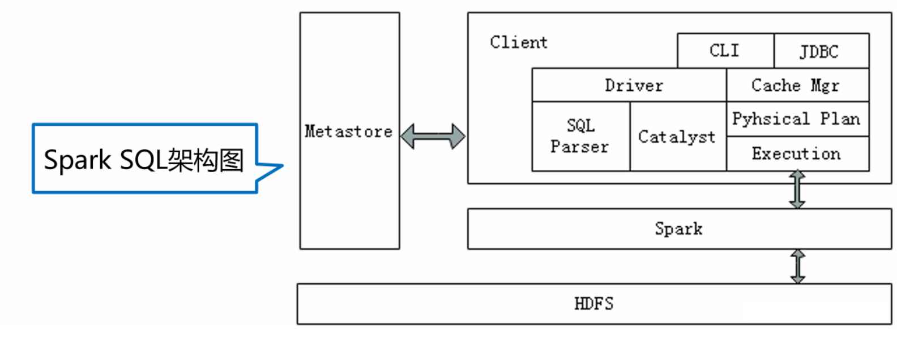
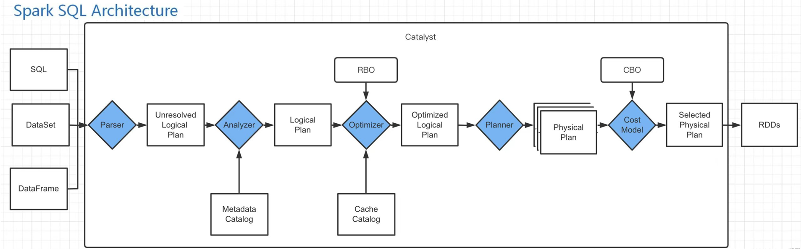

## Spark Sql架构

Spark SQL兼容Hive，这是因为Spark SQL架构与Hive底层结构相似，Spark SQL复用了Hive提供的元数据仓库（Metastore）、HiveQL、用户自定义函数（UDF）以及序列化和反序列工具（SerDes），下面通过下图深入了解Spark SQL底层架构。



从上图中可以看出，Spark SQL架构与Hive架构相比，**除了把底层的MapReduce执行引擎更改为Spark，还修改了Catalyst优化器**，Spark SQL快速的计算效率得益于Catalyst优化器。从HiveQL被解析成语法抽象树起，**执行计划生成和优化的工作全部交给Spark SQL的Catalyst优化器进行负责和管理**。

Catalyst优化器是一个新的可扩展的查询优化器，它是基于Scala函数式编程结构，Spark SQL开发工程师设计可扩展架构主要是为了在今后的版本迭代时，能够轻松地添加新的优化技术和功能，尤其是为了解决大数据生产环境中遇到的问题（例如，针对半结构化数据和高级数据分析），另外，Spark作为开源项目，外部开发人员可以针对项目需求自行扩展Catalyst优化器的功能。下面通过下图描述Spark SQL的工作原理。



```yaml
【用户代码/查询】
↓
【1. 解析阶段 (Parsing)】        → SQL/DataFrame → AST
↓
【2. AST 生成】                 → 抽象语法树
↓
【3. 未解析逻辑计划】             → Unresolved Logical Plan
↓
【4. 分析阶段 (Analyzer)】       → 语义分析、绑定元数据
↓
【5. 已解析逻辑计划】             → Resolved Logical Plan
↓
【6. 优化阶段 (Optimizer)】       → 逻辑优化 (Catalyst)
↓
【7. 优化后逻辑计划】             → Optimized Logical Plan
↓
【8. 物理计划生成 (Planner)】      → 策略选择、SparkPlan生成
↓
【9. 准备执行阶段 (Preparations)】 → 物理计划优化、代码生成
↓
【10. 可执行物理计划】            → Executed SparkPlan
↓
【11. 执行阶段】                 → RDD执行、结果收集
```

## Spark Sql执行过程

Spark要想很好地支持SQL，就需要完成

- 解析（Parser）
- 优化（Optimizer）
- 执行（Execution）
  
三大过程。Catalyst优化器在执行计划生成和优化的工作时候，它离不开自己内部的五大组件，具体介绍如下所示。

**Parse组件**：该组件根据一定的语义规则（即第三方类库ANTLR）将SparkSql字符串解析为一个抽象语法树/AST。【最终的结果是未解析的逻辑计划】

**Analyze组件**：该组件会遍历整个AST，并对AST上的每个节点进行数据类型的绑定以及函数绑定，然后根据元数据信息Catalog对数据表中的字段进行解析,绑定字段类型.【最终的结果是解析的逻辑计划】

**Optimizer组件**：该组件是Catalyst的核心，主要分为RBO和CBO两种优化策略，其中RBO是基于规则优化，CBO是基于代价优化。【最终的结果是优化后的逻辑计划】

**SparkPlanner组件**：优化后的逻辑执行计划OptimizedLogicalPlan依然是逻辑的，并不能被Spark系统理解，此时需要将OptimizedLogicalPlan转换成physical plan（物理计划）。【最终的结果是物理计划】

**CostModel组件**：主要根据过去的性能统计数据，选择最佳的物理执行计划。【输出选择的最佳物理执行计划】

**小结**

- Parse组件：解析字符串为抽象语法树
- Analyze组件：堆数据类型以及函数类型进行绑定，根据元数据信息堆表中的字段进行解析。
- Optimizer组件：对解析好的语法树进行优化。
- SparkPlanner组件：将优化好的逻辑执行计划转换为物理执行计划
- CostModel组件：选择最佳物理执行计划进行执行。


## Spark Sql工作流程


在了解了上述组件的作用后，下面分步骤讲解Spark SQL工作流程。

1. 在解析SQL语句之前，会创建SparkSession，涉及到表名、字段名称和字段类型的元数据都将保存在Catalog中；

2. 当调用SparkSession的sql()方法时就会使用SparkSqlParser进行解析SQL语句，解析过程中使用的ANTLR进行词法解析和语法解析；

3. 接着使用Analyzer分析器绑定逻辑计划，在该阶段，Analyzer会使用Analyzer Rules，并结合Catalog，对未绑定的逻辑计划进行解析，生成已绑定的逻辑计划,这一步主要绑定变量的类型。

4. 然后Optimizer根据预先定义好的规则（RBO）对 Resolved Logical Plan 进行优化并生成 Optimized Logical Plan（最优逻辑计划）；

5. 接着使用SparkPlanner对优化后的逻辑计划进行转换，生成多个可以执行的物理计划Physical Plan；

6. 接着CBO优化策略会根据Cost Model算出每个Physical Plan的代价，并选取代价最小的 Physical Plan作为最终的Physical Plan；

7. 最终使用QueryExecution执行物理计划，此时则调用SparkPlan的execute()方法，返回RDD。

## 具体工作流程


以上是SparkSQL的总体执行逻辑，与传统的SQL语句执行过程类似，大致分为**SQL语句、逻辑计划、物理计划以及物理操作**几个阶段，每个阶段又会做一些具体的事情，我们来具体看下各个阶段具体做了些什么。

### 用户编写的代码
```scala
val df = spark.read.json("data.json")
val result = df.filter($"age" > 18)
               .groupBy("department")
               .agg(avg("salary").as("avg_salary"))
               .orderBy("avg_salary")
```

### 创建 DataFrame（逻辑计划构建）

```scala
// 内部创建 Unresolved Logical Plan
val df = spark.read.json("data.json")
// 等价于：
// LogicalRelation(
//   relation = JSONRelation("data.json"),
//   output = [UnresolvedAttribute("*")]
// )
```

### Catalyst 优化器的详细处理流程

#### Parser阶段

这个阶段是将 SQL 语句转化为UnResolved Logical Plan(包 含 UnresolvedRelation、 UnresolvedFunction、 UnresolvedAttribute)的过程，期间要经过词法分析和语法分析。效果如下：

```scala
用户代码 (DataFrame API)
       ↓
【Scala 编译器】→ 生成 Scala AST
       ↓
【Spark SQL 隐式转换】→ 转换为 Expression 对象
       ↓  
【Dataset/DataFrame 操作】→ 构建 LogicalPlan
       ↓
【QueryExecution】→ 完整的逻辑计划树
       ↓
最终 AST (TreeNode 体系)
```

**最终生成的AST语法树**

````scala
Sort [avg_salary ASC]
+- Aggregate [department]
   +- avg(salary) as avg_salary
   +- Filter (age > 18)
      +- LogicalRelation [JSON: data.json]
         +- age: string (nullable = true)
         +- department: string (nullable = true) 
         +- salary: double (nullable = true)
````

该阶段式是将字符串解析为抽象的AST语法树,这一步的结果是未解析的逻辑执行计划。

#### 分析阶段（Analysis）

```scala
// 原始逻辑计划（Unresolved Logical Plan）
== Unresolved Logical Plan ==
'Filter ('age > 18)
+- 'UnresolvedRelation [data.json]

// 分析过程：
// 1. 解析列名和表名
// 2. 查询 Catalog（元数据存储）
// 3. 绑定 Schema 信息
// 4. 验证语义正确性

// 分析后的逻辑计划（Analyzed Logical Plan）
== Analyzed Logical Plan ==
Filter (age#0 > 18)
+- Relation[age#0, name#1, department#2, salary#3] json

// 具体分析步骤：
val analyzer = new Analyzer(catalog, conf) {
  override val fixedPoint = FixedPoint(100)  // 最大迭代次数
  
  val batches: Seq[Batch] = Seq(
    Batch("Resolution", fixedPoint, Seq(
      ResolveRelations,      // 解析数据源
      ResolveReferences,     // 解析列引用
      ResolveFunctions,      // 解析函数
      ResolveAliases,        // 解析别名
      ResolveSubquery,       // 解析子查询
      ResolveSortReferences, // 解析排序引用
      ResolveAggregateFunctions // 解析聚合函数
    )),
    Batch("Check Analysis", Once, Seq(
      CheckResolution,        // 检查解析结果
      CheckAggregation,       // 检查聚合
      CheckConstraints        // 检查约束
    ))
  )
}
```


这个阶段是将Unresolved Logical Plan 进一步转化为Analyzed Logical Plan的过程。

经过Analyzer之后，查询中涉及到的表及字段信息都会被解析赋值，该阶段对抽象语法树进行数据类型和函数进行绑定，对表中的列属性进行解析。


#### 逻辑优化（Logical Optimization）


这个阶段是将Analyzed Logical Plan 转换成Optimized Logical  Plan 。

Optimizer 的主要职责是将 Analyzed Logical Plan 根据不同的优化策略来对语法树进行优化，优化逻辑计划节点(Logical Plan)以及表达式(Expression)。它的工作原理和 Analyzer 一致，也是通过其下的 Batch 里面的 Rule[LogicalPlan]来进行处理的

```scala
// 优化器应用规则
val optimizer = new Optimizer(catalog) {
  def batches: Seq[Batch] = Seq(
    // 规则批次1：常量折叠和谓词下推
    Batch("Finish Analysis", Once, Seq(
      EliminateSubqueryAliases,
      EliminateView,
      ReplaceExpressions,
      ComputeCurrentTime,
      GetCurrentDatabase,
      RewriteDistinctAggregates  // 重写 DISTINCT 聚合
    )),
    
    // 规则批次2：基于成本的优化（CBO）
    Batch("Operator Optimizations", fixedPoint, Seq(
      // 谓词下推
      PushPredicateThroughJoin,
      PushPredicateThroughProject,
      PushPredicateThroughAggregate,
      
      // 列裁剪
      ColumnPruning,
      
      // 常量折叠
      ConstantFolding,
      NullPropagation,
      
      // 布尔表达式简化
      BooleanSimplification,
      SimplifyConditionals,
      
      // 过滤/投影合并
      CollapseProject,
      CombineFilters,
      CombineLimits,
      
      // 其他优化
      EliminateLimits,
      RewriteExceptAll,
      RewriteIntersectAll,
      ReplaceIntersectWithSemiJoin,
      ReplaceExceptWithFilter,
      SimplifyCasts,
      TransposeWindow
    )),
    
    // 规则批次3：Join 优化
    Batch("Join Optimizations", fixedPoint, Seq(
      ReorderJoin,           // Join 重排序
      EliminateOuterJoin,    // 消除外连接
      PushPredicateThroughNonJoin,  // 谓词下推
      InferFiltersFromConstraints  // 从约束推断过滤
    )),
    
    // 规则批次4：聚合优化
    Batch("Aggregate", fixedPoint, Seq(
      RemoveLiteralFromGroupExpressions,
      RemoveRepetitionFromGroupExpressions
    )),
    
    // 规则批次5：去重优化
    Batch("Typed Filter Optimization", fixedPoint, Seq(
      CombineTypedFilters
    )),
    
    // 规则批次6：本地关系优化
    Batch("LocalRelation", fixedPoint, Seq(
      ConvertToLocalRelation,
      PropagateEmptyRelation
    )),
    
    // 规则批次7：Decimal 优化
    Batch("Decimal Optimizations", fixedPoint, Seq(
      DecimalAggregates
    )),
    
    // 规则批次8：统计相关优化
    Batch("Statistics Propagation", fixedPoint, Seq(
      PropagateEmptyRelation,
      UpdateAttributeNullability
    )),
    
    // 规则批次9：Python 相关优化
    Batch("Python Evaluation Optimization", Once, Seq(
      ExtractPythonUDFFromAggregate,
      ExtractPythonUDFFromJoinCondition
    )),
    
    // 规则批次10：子查询优化
    Batch("Subquery", Once, Seq(
      OptimizeSubqueries
    ))
  )
}

// 优化后的逻辑计划
== Optimized Logical Plan ==
Aggregate [department#2], [department#2, avg(salary#3) AS avg_salary#10]
+- Project [department#2, salary#3]
   +- Filter (age#0 > 18)
      +- Relation[age#0, name#1, department#2, salary#3] json
```

#### 物理计划生成（Physical Planning）

```scala
// 物理计划策略
val planner = SparkStrategies
    
// 选择物理执行策略
def strategies: Seq[Strategy] = Seq(
  FileSourceStrategy,        // 文件数据源策略
  DataSourceStrategy,        // 数据源策略
  HiveTableScans,            // Hive表扫描策略
  InMemoryScans,             // 内存扫描策略
  DDLStrategy,               // DDL策略
  CommandStrategy,           // 命令策略
  BasicOperators,            // 基本操作符策略
  JoinSelection,             // Join选择策略
  StreamingStrategy,         // 流处理策略
  PythonEvals,               // Python评估策略
  SpecialLimits,             // 特殊Limit策略
  Aggregation,               // 聚合策略
  Window,                    // 窗口策略
  ExtraStrategies            // 额外策略
)

// Join 选择策略示例
object JoinSelection extends Strategy {
  def apply(plan: LogicalPlan): Seq[SparkPlan] = plan match {
    case Join(left, right, joinType, condition, hint) =>
      // 根据数据大小、分区等信息选择 Join 算法
      val builds = estimateSize(right)
      if (canBroadcast(right) && builds < broadcastThreshold) {
        // 广播Hash Join
        Seq(BroadcastHashJoinExec(
          leftKeys, rightKeys, joinType, 
          BuildRight, condition, planLater(left), planLater(right)
        ))
      } else if (canShuffleHashJoin(left, right)) {
        // Shuffle Hash Join
        Seq(ShuffledHashJoinExec(
          leftKeys, rightKeys, joinType,
          BuildRight, condition, planLater(left), planLater(right)
        ))
      } else {
        // Sort Merge Join
        Seq(SortMergeJoinExec(
          leftKeys, rightKeys, joinType, 
          condition, planLater(left), planLater(right)
        ))
      }
  }
}

// 生成的物理计划
== Physical Plan ==
*(3) Sort [avg_salary#10 ASC NULLS FIRST], true, 0
+- *(2) HashAggregate(keys=[department#2], 
     functions=[avg(salary#3)], 
     output=[department#2, avg_salary#10])
   +- Exchange hashpartitioning(department#2, 200)
      +- *(1) HashAggregate(keys=[department#2], 
           functions=[partial_avg(salary#3)], 
           output=[department#2, sum#15, count#16L])
         +- *(1) Project [department#2, salary#3]
            +- *(1) Filter (age#0 > 18)
               +- *(1) FileScan json [...]
```

这个阶段是将Optimized Logical Plan 转换为Spark  Plan

前面讲述的主要是逻辑计划，即 SQL 如何被解析成Logical Plan，以及 Logical Plan 如何被 Analyzer 以及 Optimzer，接下来就是逻辑计划被翻译成物理计划，即 SparkPlan。


#### PrepareForExecution阶段

该阶段主要是将Spark Plan 转换为Executed Plan

在 SparkPlan 中插入 Shuffle 的操作，如果前后 2 个 SparkPlan 的 outputPartitioning 不一样的话，则中间需要插入 Shuffle 的动作，比分说聚合函数，先局部聚合，然后全局聚合，局部聚合和全局聚合的分区规则是不一样的，中间需要进行一次 Shuffle。

```scala
// 物理计划的准备和优化
class QueryExecutionPreparations extends RuleExecutor[SparkPlan] {
  
  override protected val batches: Seq[Batch] = Seq(
    // 批次1：Plan变化后可能需要添加的规则
    Batch("Add exchange", Once, AddExchange),
    
    // 批次2：确保分区正确性
    Batch("Ensure partitioning and ordering", Once, 
      EnsureRequirements,
      RemoveRedundantSorts,
      EnsureDistributionAndOrdering),
    
    // 批次3：应用物理优化规则
    Batch("Apply physical optimization rules", fixedPoint,
      CollapseCodegenStages,      // 合并代码生成阶段
      ReuseExchange,              // 重用Exchange
      ReuseSubquery,              // 重用于查询
      OptimizeMetadataOnlyQuery), // 元数据优化
    
    // 批次4：插入输入适配器
    Batch("Insert input adapter", Once, InsertInputAdapter),
    
    // 批次5：插入全阶段代码生成
    Batch("Insert whole-stage codegen", Once,
      CollapseCodegenStages,      // 确保支持代码生成
      CodegenSupportCheck),       // 检查代码生成支持
    
    // 批次6：子查询重用
    Batch("Subquery", Once, 
      PlanSubqueries),            // 规划子查询
    
    // 批次7：移除冗余投影
    Batch("Remove Redundant Projects", fixedPoint,
      RemoveRedundantProjects),   // 移除不必要的Project
      
    // 批次8：Python评估
    Batch("PythonEval", Once, 
      ExtractPythonUDFs)          // 提取Python UDF
  )
}

// 关键准备规则详解

// 1. EnsureRequirements - 确保数据分区满足要求
object EnsureRequirements extends Rule[SparkPlan] {
  def apply(plan: SparkPlan): SparkPlan = plan.transformUp {
    case operator: SparkPlan =>
      // 检查子节点的输出分区是否满足操作符的要求
      val requiredChildDistributions = operator.requiredChildDistribution
      val requiredChildOrderings = operator.requiredChildOrdering
      
      // 添加必要的Exchange操作
      val childrenWithDist = operator.children.zip(requiredChildDistributions).map {
        case (child, distribution) =>
          if (child.outputPartitioning.satisfies(distribution)) {
            child  // 分区已满足要求
          } else {
            // 添加ShuffleExchange以满足分区要求
            ShuffleExchangeExec(distribution.createPartitioning(
              child.outputPartitioning.numPartitions), child)
          }
      }
      
      // 替换子节点
      operator.withNewChildren(childrenWithDist)
  }
}

// 2. CollapseCodegenStages - 合并代码生成阶段
object CollapseCodegenStages extends Rule[SparkPlan] {
  def apply(plan: SparkPlan): SparkPlan = {
    // 查找支持代码生成的操作符链
    plan.transformUp {
      case plan: CodegenSupport if plan.supportCodegen =>
        // 尝试合并子节点
        val children = plan.children.map {
          case child: CodegenSupport if child.supportCodegen =>
            // 如果子节点也支持代码生成，尝试合并
            insertWholeStageCodegen(child)
          case child => child
        }
        plan.withNewChildren(children)
    }
  }
  
  def insertWholeStageCodegen(plan: SparkPlan): SparkPlan = {
    plan match {
      case plan: CodegenSupport if plan.supportCodegen =>
        // 创建全阶段代码生成包装
        WholeStageCodegenExec(insertInputAdapter(plan))
      case other => other
    }
  }
}

// 3. ReuseExchange - 重用ShuffleExchange
object ReuseExchange extends Rule[SparkPlan] {
  def apply(plan: SparkPlan): SparkPlan = {
    // 构建Exchange的签名（基于子节点和分区方式）
    val exchanges = mutable.HashMap[Exchange, Exchange]()
    
    plan.transformUp {
      case exchange: Exchange =>
        // 查找是否有相同的Exchange可以重用
        val canonical = exchanges.getOrElseUpdate(exchange.canonicalized, exchange)
        if (canonical.eq(exchange)) {
          exchange
        } else {
          // 重用已有的Exchange
          ReusedExchangeExec(exchange.output, canonical)
        }
    }
  }
}
```

#### Execute阶段

该阶段是将Executed Plan 进行执行获取RDD[Row]

```scala
// 经过准备阶段后的可执行计划
class QueryExecution(sparkSession: SparkSession, val logical: LogicalPlan) {
  
  // ... 之前的阶段省略 ...
  
  // 9. 准备执行阶段
  lazy val preparedPlan: SparkPlan = {
    // 应用所有准备规则
    val preparations = sparkSession.sessionState.prepareForExecution
    preparations.execute(sparkPlan)
  }
  
  // 10. 最终的可执行物理计划
  lazy val executedPlan: SparkPlan = {
    // 准备阶段的结果就是可执行计划
    preparedPlan
  }
  
  // 示例：最终的可执行计划结构
  // == Executed Physical Plan ==
  // *(6) Sort [avg_salary#10 ASC NULLS FIRST], true, 0
  // +- WholeStageCodegen
  //    +- *(5) HashAggregate(keys=[department#2], functions=[avg(salary#3)])
  //       +- Exchange hashpartitioning(department#2, 200)
  //          +- WholeStageCodegen
  //             +- *(4) HashAggregate(keys=[department#2], functions=[partial_avg(salary#3)])
  //                +- *(3) Project [department#2, salary#3]
  //                   +- *(2) Filter (age#0 > 18)
  //                      +- *(1) FileScan json [age#0,department#2,salary#3]
}

// 可执行计划的关键组件
abstract class SparkPlan extends QueryPlan[SparkPlan] {
  
  // 执行方法 - 生成RDD
  def execute(): RDD[InternalRow]
  
  // 执行并收集结果
  def executeCollect(): Array[InternalRow] = {
    execute().map(_.copy()).collect()
  }
  
  // 执行并广播
  def executeBroadcast(): broadcast.Broadcast[Any] = {
    // 序列化并广播结果
  }
}

// 具体执行节点示例
case class FilterExec(condition: Expression, child: SparkPlan) 
  extends UnaryExecNode with CodegenSupport {
  
  override def doExecute(): RDD[InternalRow] = {
    child.execute().mapPartitionsInternal { iter =>
      // 应用过滤条件
      iter.filter(row => condition.eval(row).asInstanceOf[Boolean])
    }
  }
  
  // 代码生成支持
  protected def doProduce(ctx: CodegenContext): String = {
    // 生成过滤逻辑的Java代码
    s"""
      while (!shouldStop() && input.hasNext()) {
        InternalRow row = (InternalRow) input.next();
        if (${condition.genCode(ctx)}) {
          ${consume(ctx, null, row)}
        }
      }
    """
  }
}
```


### 总流程分析

```scala
// 用户代码示例
val df = spark.read.parquet("/data/employees")
val result = df.filter($"age" > 25)
               .groupBy($"dept")
               .agg(
                 count($"id").as("count"),
                 avg($"salary").as("avg_salary")
               )
               .orderBy($"avg_salary".desc)

// 执行跟踪
println("=== 执行流程跟踪 ===")

// 1. 解析和逻辑计划
println("\n1. 原始逻辑计划:")
println(result.queryExecution.logical.treeString)

// 2. 分析后
println("\n2. 分析后的逻辑计划:")
println(result.queryExecution.analyzed.treeString)

// 3. 优化后
println("\n3. 优化后的逻辑计划:")
println(result.queryExecution.optimizedPlan.treeString)

// 4. 初始物理计划
println("\n4. 初始物理计划:")
println(result.queryExecution.sparkPlan.treeString)

// 5. 准备阶段后的物理计划
println("\n5. 准备后的物理计划:")
println(result.queryExecution.preparedPlan.treeString)

// 6. 可执行计划
println("\n6. 可执行物理计划:")
println(result.queryExecution.executedPlan.treeString)

// 7. RDD血缘
println("\n7. RDD执行计划:")
val rdd = result.queryExecution.toRdd
println(rdd.toDebugString)

// 8. 触发执行
println("\n8. 触发执行...")
val startTime = System.currentTimeMillis()
result.collect()
val endTime = System.currentTimeMillis()
println(s"执行时间: ${endTime - startTime}ms")
```


### 执行计划查看和分析

```scala
// 查看执行计划的不同级别
result.explain(mode = "simple")    // 物理计划
result.explain(mode = "extended")  // 逻辑+物理计划
result.explain(mode = "codegen")   // 代码生成信息
result.explain(mode = "cost")      // 成本信息（如果有统计）

// 查看解析后的逻辑计划
val logicalPlan = result.queryExecution.logical
println(logicalPlan.treeString)

// 查看优化后的逻辑计划
val optimizedPlan = result.queryExecution.optimizedPlan
println(optimizedPlan.treeString)

// 查看物理计划
val physicalPlan = result.queryExecution.sparkPlan
println(physicalPlan.treeString)

// 查看 RDD 血缘
val rdd = result.queryExecution.toRdd
println(rdd.toDebugString)
```