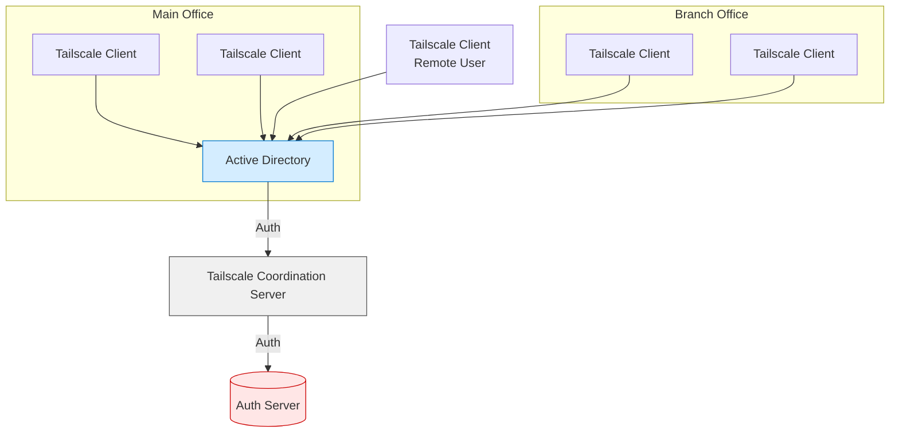
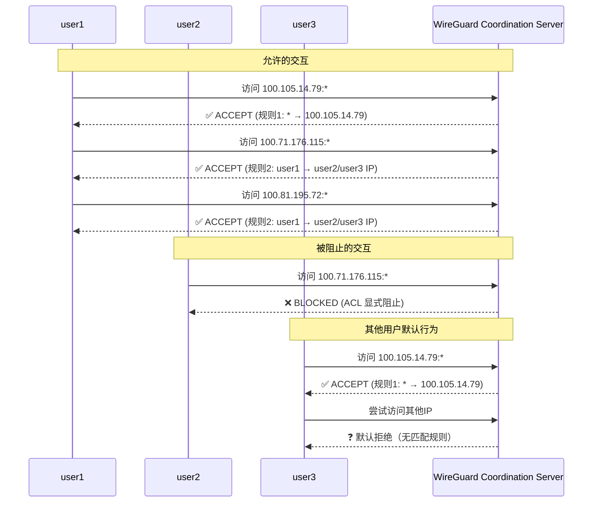

编写者：[::noto:red-heart::rand777](/friends/persons/)
:::note 本文已完成，等待校对

:::

## WireGuard

WireGuard 是一个开源的 VPN 协议，旨在提供更快、更安全的连接。它比传统的 VPN 协议（如 OpenVPN 和 IPSec）更轻量级，易于配置和使用。

### Tailscale

<LinkCard icon="simple-icons:tailscale" href="https://tailscale.com/" title="tailscale" description="Tailscale makes creating software-defined networks easy: securely connecting users, services, and devices."></LinkCard>

OpenVPN 是虚拟专用网络 (VPN) 的热门选择，但与 Tailscale 相比，OpenVPN 需要更多的设置、管理和维护。Tailscale 是基于 WireGuard® 协议构建的网状 VPN 服务。您可以获得 WireGuard 的性能和安全优势，而无需使用 OpenVPN 协议进行基本的 SSL/TLS 加密。

有多种方法来进行身份验证决策。一种明显的方法是建立用户名+密码系统，也称为 PSK（预共享密钥）。要设置您的节点，请连接到服务器，输入您的用户名和密码，然后上传您的公钥并下载您账户或其他域账户发布的其他公钥。如果您想搞得复杂一点，可以添加双因素认证（2FA，也称为 MFA），例如短信、Google 身份验证器、Microsoft 身份验证器等。

#### 认证流程

