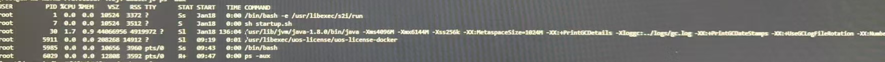
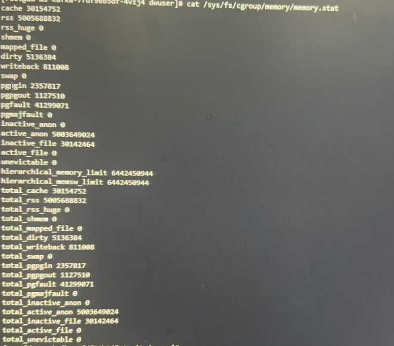
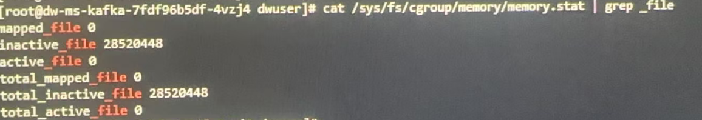
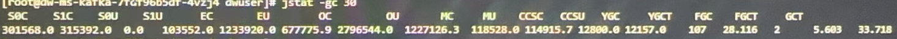
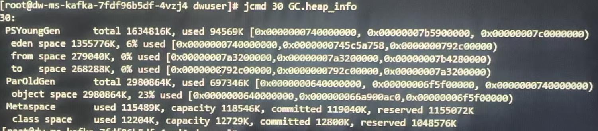
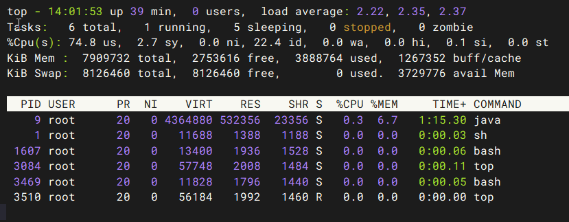

## 容器内cgroup统计内存方式

在容器内统计Java进程内存使用情况时，cgroup和JVM看到的视角完全不同，因此，容器内存超限预警，要从多方面分析，不一定是java进程占用内存过高。

### cgroup内存统计的关键文件

容器内存统计方式是使用操作系统的cgroup统计，cgroup统计容器占用的内存包括几个部分。
```shell
Pod内存统计层级:
├── Pod Total Memory (kubectl top pod 显示的)
│   ├── Container 1 Memory
│   │   ├── 容器内所有进程RSS 
│   │   ├── Page Cache (文件缓存)
│   │   ├── tmpfs/shm 挂载
│   │   └── 内核数据结构 (slab等)
│   ├── Container 2 Memory
│   └── ...
└── Pod Infra Container (pause容器，约2-5MB)
```
下面对每一部分内存占用情况进行说明。

#### 进程RSS (Resident Set Size) - 核心部分

其中进程RSS内存包括：
1. Java/应用堆内存 (Xmx设置的部分)
2. Java非堆内存 (Metaspace、Code Cache、Thread Stacks等)
3. glibc分配器保留内存 
4. Native libraries/JNI代码 
5. 线程栈空间 
6. mmap映射的内存区域

**查看进程的RSS内存**
```shell
ps aux --sort=-rss | awk ' #查看进程的rss物理占用内存
```


RSS列即为进程实际占用的物理内存量。

#### Page Cache (页缓存) - 最大的"隐藏"部分

查看页缓存占用内存的大小:
一般在`/sys/fs/cgroup/memory/memory.stat | grep -E "cache|file"`查看。



page cache包括以下几个类型:
1. active_file:活跃的文件缓存页（经常访问） 
2. inactive_file:非活跃的文件缓存页（可能被回收） 
3. dirty:已修改但未写回磁盘的缓存页 
4. writeback:正在写回磁盘的缓存页

查看页缓存的详细组成部分:
```shell
cat /sys/fs/cgroup/memory/memory.stat | grep "_file"
```



####  `tmpfs/shm` 挂载内存

```shell
# 查看tmpfs使用情况
df -h /dev/shm /tmp

# 或者通过/proc/mounts查看
grep -E "tmpfs|shm" /proc/mounts

# 查看具体占用
du -sh /dev/shm/* /tmp/* 2>/dev/null
```
常见tmpfs挂载：
- `/dev/shm - POSIX`共享内存 
- `/tmp - `临时文件（如果配置为tmpfs） 
- `/run - `运行时文件 
- 用户自定义的`emptyDir with memory`介质

#### 内核数据结构 (Slab, Kernel Stack等)
```shell
# 查看Slab缓存
cat /sys/fs/cgroup/memory/memory.stat | grep -E "slab|kernel_stack"

# 详细Slab分析
cat /proc/slabinfo | awk '
$3*$4 > 1024*1024 {  # 只显示大于1MB的
    printf "%-30s %8.2f MB\n", $1, $3*$4/1024/1024
}' | sort -k2 -rn | head -10
```
主要内核内存占用：
```shell
slab:             内核对象缓存（dentry, inode等）
kernel_stack:     内核栈空间
sock:             网络套接字缓存
tcp:              TCP连接缓存
ext4_inode_cache: Ext4文件系统inode缓存
dentry:           目录项缓存
```

#### 其他特殊内存

```shell
# 查看其他内存类型
cat /sys/fs/cgroup/memory/memory.stat | grep -v "total" | sort -k2 -rn
```
包括： 
- unevictable: 不可回收内存（mlock等） 
- hierarchical_memory_limit: 层级内存限制 
- mapped_file: 内存映射文件 
- pgfault, pgmajfault: 页面错误统计


#### CGroup统计计算公式

```shell
# 内存使用总量
memory.usage_in_bytes = 
    rss +               # 进程常驻内存
    cache +             # 页缓存
    swap +              # 交换内存
    kernel_stack +      # 内核栈
    slab +              # 内核Slab缓存
    sock +              # 套接字缓存
    shmem +             # 共享内存
    file_mapped +       # 映射文件
    file_dirty +        # 脏页
    writeback +         # 回写中页面
    pgtable +           # 页表
    ...其他内核数据结构
```

> k8s中，kubectl top pod 的数据来源查看pod占用内存的总和，实际上是各个容器CGroup memory.usage_in_bytes的总和;

#### 一个典型的pod内存分配

```shell
# 一个典型Pod的内存组成
Pod: myapp-pod (显示2.5GB)
├── 应用容器: app (2.3GB)
│   ├── Java堆: 1.2GB
│   ├── 堆外内存: 0.3GB
│   ├── Page Cache: 0.7GB
│   └── 其他: 0.1GB
├── Sidecar容器: istio-proxy (0.15GB)
│   ├── 进程RSS: 0.1GB
│   └── Page Cache: 0.05GB
└── Infra容器: pause (0.002GB)
```

#### Metrics Server收集的指标

```shell
# Metrics Server通过cAdvisor收集
# 主要收集以下指标：
# 1. container_memory_working_set_bytes (最重要)
# 2. container_memory_rss
# 3. container_memory_cache
# 4. container_memory_swap

# working_set_bytes的计算
# working_set = memory.usage_in_bytes - total_inactive_file
# 这是Kubernetes用于判断OOM和调度的主要指标
```

#### 内存类型详解

##### Working Set vs RSS vs Usage
```shell
# 三种内存统计的区别
container_memory_working_set_bytes = memory.usage_in_bytes - total_inactive_file
container_memory_rss = RSS部分
container_memory_usage_bytes = memory.usage_in_bytes

```

内存监控指标: 
- 重点关注内存:
  - container_memory_working_set_bytes : 工作集内存,调度和OOM依据
  - container_memory_rss : RSS内存,实际进程内存
- 非重点关注内存:
  - container_memory_cache : 缓存内存,缓存，可回收
  - container_memory_swap : 交换内存
  - total_inactive_file : 非活跃文件缓存

内存Limit设置策略:
```shell
# 合理设置内存Limit
内存Limit = 
  (应用峰值RSS * 1.2) +      # 给RSS留20%buffer
  (预期PageCache大小) +      # 根据业务特点设定
  (其他开销)                 # Slab、内核等

# 示例：
# RSS峰值: 2GB
# 预期缓存: 1GB
# 其他: 0.5GB
# Limit = 2*1.2 + 1 + 0.5 = 3.9GB ≈ 4GB
```

##### 活跃 vs 非活跃内存
```shell
# 活跃内存 (Active)
active_anon + active_file = 正在使用的内存

# 非活跃内存 (Inactive)
inactive_anon + inactive_file = 可回收内存

# 查看活跃状态
cat /sys/fs/cgroup/memory/memory.stat | grep -E "active|inactive"
```

##### 不可回收内存

```shell
# Unevictable内存（特殊用途）
grep unevictable /sys/fs/cgroup/memory/memory.stat

# 常见场景：
# 1. mlock()锁定的内存
# 2. ramfs/tmpfs的某些页面
# 3. 透明大页(THP)
# 4. 某些驱动保留的内存
```

#### Swap使用（如果启用）
```shell
# 查看Swap使用
cat /sys/fs/cgroup/memory/memory.stat | grep "swap"

# 或查看详细
grep -E "swapcached|swap" /proc/meminfo
```
### memory.stat文件分析

容器内部，实际查看每一个部分占用的内存:

```shell
# 在容器内查看cgroup内存统计
$ cat /sys/fs/cgroup/memory/memory.stat

# 主要指标解释：
memory.usage_in_bytes: 总使用量 (RSS + Cache)
memory.stat内容:
- rss:         进程物理内存 (Resident Set Size)
- cache:       页缓存 (Page Cache)
- swap:        交换内存
- kmem:        内核内存
- slab:        内核数据结构
```


关键指标:
```shell
cache 1126400      # 页面缓存（可回收）
rss 3145728        # 常驻内存（重要！）
rss_huge 2097152   # 大页内存
shmem 0           # 共享内存
mapped_file 0     # 内存映射文件
dirty 0           # 脏页
writeback 0       # 正在回写的页
swap 0            # 交换内存（如果开启）
pgpgin 123456     # 页面换入次数
pgpgout 123455    # 页面换出次数
```

### 重要的指标文件

```shell
# 当前总内存使用量（字节）
$ cat /sys/fs/cgroup/memory/memory.usage_in_bytes
5039583232  # 4.7GB左右

# 内存+交换空间使用量
$ cat /sys/fs/cgroup/memory/memory.memsw.usage_in_bytes
5039595520  # 4.7GB左右

# 峰值内存使用量
$ cat /sys/fs/cgroup/memory/memory.max_usage_in_bytes
5227069440 # 4.9G 做鱼

# 内存限制
$ cat /sys/fs/cgroup/memory/memory.limit_in_bytes
6442450944  # 6GB

# 如果启用swap
$ cat /sys/fs/cgroup/memory/memory.swappiness
0
```

### cgroup vs JVM视角的内存差异

```shell
从cgroup视角看到的Java进程内存：
┌─────────────────────────────────────────────────┐
│           cgroup看到的"总内存"                   │
│  memory.usage_in_bytes =                        │
│  ┌───────────────────────────────────────────┐  │
│  │ JVM堆内存（Heap）                     3GB │  │
│  │   - Young Eden/Survivor                   │  │
│  │   - Old Generation                        │  │
│  ├───────────────────────────────────────────┤  │
│  │ 元空间（Metaspace）                   256M│  │
│  ├───────────────────────────────────────────┤  │
│  │ 线程栈（每线程1M × 线程数）          500M│  │
│  ├───────────────────────────────────────────┤  │
│  │ JIT代码缓存（Code Cache）             128M│  │
│  ├───────────────────────────────────────────┤  │
│  │ GC数据结构（如Card Table）             50M│  │
│  ├───────────────────────────────────────────┤  │
│  │ Direct Buffer（堆外内存）             256M│  │
│  ├───────────────────────────────────────────┤  │
│  │ JVM自身Native内存                      50M│  │
│  ├───────────────────────────────────────────┤  │
│  │ 第三方Native库（JNI）                  50M│  │
│  ├───────────────────────────────────────────┤  │
│  │ 堆外文件映射（如mmap的jar文件）       100M│  │
│  ├───────────────────────────────────────────┤  │
│  │ glibc内存分配器缓存                    200M│  │
│  └───────────────────────────────────────────┘  │
└─────────────────────────────────────────────────┘
总计可能超过6GB！
```
cgroup看到的jvm内存，包括了java进程启动时候的堆内存和堆外内存。

常见的堆外缓存:
常见堆外内存占用：
1. Direct ByteBuffer:
    - 网络通信(NIO)
    - 文件读写
    - 数据库连接

2. MappedByteBuffer (文件映射):
    - 使用FileChannel.map()
    - Lucene/Elasticsearch索引
    - 大数据处理

3. Native Libraries:
    - JNI调用
    - 图像处理库
    - 加密库

4. Thread Stacks:
    - 每个线程~1MB
    - 500线程 ≈ 500MB

5. Metaspace:
    - 加载的类信息
    - 方法区
    - 字符串常量池

### 为什么JVM统计与cgroup统计不一致？

JVM的工具（jstat，VisualVM等）:

1. 只报告堆内存使用,即java堆内存使用情况。 
2. 部分报告非堆内存（Metaspace, Code Cache等） 
3. 完全不报告Native内存分配（通过malloc分配的内存）

cgroup统计：

1. 统计进程的所有虚拟内存分配 
2. 包括glibc的内存池缓存（arena） 
3. 包括所有通过mmap映射的文件

### 关键诊断命令对比

#### 方式1：使用ps命令（不准确）


RSS：常驻内存（部分在交换区）
- 4919972:4.7G左右

VSZ：虚拟内存大小
- 44066956:42G左右

问题：ps显示的是整个物理机的视角，不是容器的cgroup限制

#### 方式2：使用jstat（仅JVM视角）



- S0C:301568:0.28G
- S1C:315392:0.3G
- S0U:0
- S1U:103552:0.098G
- EC:1233920:1.17G
- EU：677775：0.64G
- OC:2796544:2.66G
- OU:1227126:1.17G
- 

只显示堆和部分非堆内存，缺少Native内存。


#### 方式3：使用Native Memory Tracking（NMT）

```shell
# 启动时开启
-XX:NativeMemoryTracking=detail

# 运行时查看
$ jcmd <pid> VM.native_memory summary
$ jcmd <pid> VM.native_memory baseline
$ jcmd <pid> VM.native_memory summary.diff
```

### CGroup统计内存与memory.stat文件的关系

memory.usage_in_bytes 是 CGroup 的总内存统计，而 memory.stat 是这个总统计的详细分解。

```shell
关系：memory.usage_in_bytes ≈ Σ(memory.stat中的大部分条目)
但：memory.usage_in_bytes ≠ 简单的 memory.stat[rss] + memory.stat[cache]
```

#### CGroup主要文件和作用

```shell
# CGroup内存相关的主要文件
/sys/fs/cgroup/memory/
├── memory.usage_in_bytes       # 总内存使用（最重要的指标）
├── memory.stat                 # 详细分类统计
├── memory.limit_in_bytes       # 内存限制
├── memory.max_usage_in_bytes   # 历史最大使用
├── memory.failcnt              # 超限次数
└── memory.oom_control          # OOM控制
```

#### memory.usage_in_bytes 到底是什么？
```shell
# 直接查看
cat /sys/fs/cgroup/memory/memory.usage_in_bytes
# 输出：4000000000（字节数）

# 这个值的含义：
# 当前CGroup中所有进程使用的总内存
# 包括用户空间和内核空间
# 是Kubernetes调度和OOM判断的主要依据
```

#### memory.stat 的详细内容
```shell
# 查看完整统计
cat /sys/fs/cgroup/memory/memory.stat

# 典型输出：
cache 1074790400     # 页缓存
rss 2149580800       # 进程RSS
rss_huge 0           # 大页RSS
shmem 0              # 共享内存
mapped_file 524288000 # 映射文件
dirty 4096           # 脏页
writeback 0          # 回写中
swap 0               # Swap使用
pgpgin 123456        # 页换入
pgpgout 123400       # 页换出
pgfault 789012       # 页错误
pgmajfault 123       # 主要页错误
inactive_anon 0      # 非活跃匿名页
active_anon 2149580800 # 活跃匿名页
inactive_file 536870912 # 非活跃文件页
active_file 536870912  # 活跃文件页
unevictable 0        # 不可回收内存
hierarchical_memory_limit 9223372036854771712
total_cache 1074790400
total_rss 2149580800
total_rss_huge 0
total_shmem 0
total_mapped_file 524288000
total_dirty 4096
total_writeback 0
total_swap 0
total_pgpgin 123456
total_pgpgout 123400
total_pgfault 789012
total_pgmajfault 123
total_inactive_anon 0
total_active_anon 2149580800
total_inactive_file 536870912
total_active_file 536870912
total_unevictable 0
```

**近似计算**
```shell
# memory.usage_in_bytes的近似计算
memory.usage_in_bytes ≈ 
    memory.stat[rss] +           # 进程RSS
    memory.stat[cache] +         # 页缓存
    memory.stat[kernel_stack] +  # 内核栈
    memory.stat[slab] +          # Slab缓存
    memory.stat[pagetables] +    # 页表
    ...其他内核数据结构

# 注意：这不是精确相等！
```

#### 结论

1. memory.usage_in_bytes 是CGroup的总内存使用 
2. memory.stat 是总内存的详细分解 
3. 两者不完全相等，但强相关 
4. working_set = usage - inactive_file 是最有用的指标

**两者关系**

```shell
# 关键公式
working_set = memory.usage_in_bytes - inactive_file

# Kubernetes主要关注
container_memory_working_set_bytes ≈ memory.usage_in_bytes - total_inactive_file

# 对于应用开发者
关注点优先级：
1. working_set (调度和OOM依据)
2. RSS (实际进程内存)
3. Cache (可回收内存)
```

## Java进程内存使用情况

### 查看生产环境java进程堆内存使用情况

```shell
# 查看堆内存摘要
jcmd <pid> GC.heap_info
jcmd 30 GC.heap_info
```




```shell
PSYoungGen total 1634816K, used 94569k 总容量为1634816K  使用了94569k
  eden space: 1355776k 6% 使用 eden区域容量
  from space: 279040k 0%使用 from其余容量
  to space: 268288k 0%使用 to区域容量
ParOldGen: total:298086k 老年代总容量 使用697346k
MataSpace used:115489k capacity:118546k
```
以上为java堆内存总得划分情况,PSYoungGen总空间 通常不等于 Eden + From + To 区域内存的总和,通常由于以下原因导致:
1. 内存对齐与空间浪费
2. Survivor区实际只有1个活跃,运行时只有一个Survivor区是"活跃"的,另一个用于复制算法，但同样占用容量,因此新生代总容量 = Eden + 最大(Survivor)。在本案例中，eden+from内存总和刚好等于新生代分配内存大小。
3. jvm内部保留区域
```shell
Young Generation Layout:
+------------------+  ← YoungGen Start
|     Eden         |
|  (主要分配区)     |
+------------------+
|  From Survivor   |  ← 只有一个被计入"有效"容量
|  (或 To Survivor) |
+------------------+
|   Reserved       |  ← JVM内部保留（对齐、管理）
+------------------+  ← YoungGen End
```

### jstat统计内存精确容量

**查看各个内存区域精确容量**


#### 年轻代（Young Generation）相关

| 列名      | 全称                            | 说明             | 示例值   | 单位 |
| :-------- | :------------------------------ | :--------------- | :------- | :--- |
| **NGCMN** | New Generation Capacity Minimum | 年轻代最小容量   | 4198400  | KB   |
| **NGCMX** | New Generation Capacity Maximum | 年轻代最大容量   | 67174400 | KB   |
| **NGC**   | New Generation Current Capacity | 年轻代当前容量   | 4198400  | KB   |
| **S0C**   | Survivor 0 Capacity             | Survivor 0区容量 | 279040   | KB   |
| **S1C**   | Survivor 1 Capacity             | Survivor 1区容量 | 279040   | KB   |
| **EC**    | Eden Capacity                   | Eden区容量       | 3358720  | KB   |

#### 老年代（Old Generation）相关

| 列名      | 全称                            | 说明                      | 示例值    | 单位 |
| :-------- | :------------------------------ | :------------------------ | :-------- | :--- |
| **OGCMN** | Old Generation Capacity Minimum | 老年代最小容量            | 8388608   | KB   |
| **OGCMX** | Old Generation Capacity Maximum | 老年代最大容量            | 134217728 | KB   |
| **OGC**   | Old Generation Current Capacity | 老年代当前容量            | 8388608   | KB   |
| **OC**    | Old Capacity                    | 老年代容量（通常等于OGC） | 8388608   | KB   |


#### 元空间（Metaspace）相关（Java 8+）

| 列名     | 全称                       | 说明           | 示例值   | 单位 |
| :------- | :------------------------- | :------------- | :------- | :--- |
| **MCMN** | Metaspace Capacity Minimum | 元空间最小容量 | 0.0      | KB   |
| **MCMX** | Metaspace Capacity Maximum | 元空间最大容量 | 11010048 | KB   |
| **MC**   | Metaspace Capacity         | 元空间当前容量 | 4866048  | KB   |


#### 压缩类空间（Compressed Class Space）

| 列名     | 全称                       | 说明           | 示例值   | 单位 |
| :------- | :------------------------- | :------------- | :------- | :--- |
| **MCMN** | Metaspace Capacity Minimum | 元空间最小容量 | 0.0      | KB   |
| **MCMX** | Metaspace Capacity Maximum | 元空间最大容量 | 11010048 | KB   |
| **MC**   | Metaspace Capacity         | 元空间当前容量 | 4866048  | KB   |

#### GC统计

| 列名    | 全称           | 说明         | 示例值 |
| :------ | :------------- | :----------- | :----- |
| **YGC** | Young GC Count | 年轻代GC次数 | 15     |
| **FGC** | Full GC Count  | Full GC次数  | 2      |

年轻代总容量应约等于 :NGC ≈ S0C + S1C + EC

总堆容量 :Total Heap ≈ NGC + OGC

元空间总容量（Java 8+）:Metaspace Total ≈ MC + CCSC

#### 调优及内存排查

##### 判断是否需要调优

- 如果 NGC 经常接近 NGCMX，考虑增大 -Xmn,年轻代当前容量接近年轻代最大分配量; 
- 如果 MC 经常接近 MCMX，考虑增大 -XX:MaxMetaspaceSize,原空间内存持续增大;
- 如果 OGC 经常接近 OGCMX，考虑增大 -Xmx，老年代内存持续增大;

##### 内存持续增长

- 关注 OGC 和 MC 的增长 
  - 如果 OGC 持续增长，可能存在内存泄漏 ，如果老年代内存持续增长，说明越来越多的对象没有被垃圾回收，全部跃迁到老年代，可能存在内存泄露。
  - 如果 MC 持续增长，检查类加载器，原空间内存持续增长，可能在一直加载类。

##### 频繁GC

- 结合 YGC/FGC 列 
  - 如果 YGC 增长快但 NGC 小，考虑增大年轻代 ，年轻代一直在做垃圾回收，但是年轻代分配堆内存很小，因此考虑增大年轻代内存。
  - 如果 FGC 频繁但 OGC 不大，可能是元空间问题；

##### Survivor区异常

- 正常情况下 S0C ≈ S1C 
- 如果差异很大，可能 -XX:SurvivorRatio 设置不当 
- 或使用了 -XX:+UseAdaptiveSizePolicy


> 堆总大小 = Eden容量 + Survivor容量 + 老年代容量
>
> 堆使用量 = Eden使用量 + Survivor使用量 + 老年代使用量
>
>使用率 = (堆使用量 / 堆总大小) × 100%

### 生产现象

生产环境k8s pod内启动java计算进程，主要业务为跑批计算，容器最大可使用内存为4g,Java进程最小和最大堆内存为3G，生产环境pod内存超过90%会触发告警，线上环境pod内存占用内存突然超过90%，经排查当天业务没有激增情况，数据量也没有激增情况。


### 排查过程

在排查问题之前，首先要了解前面章节容器内存的统计方式，其中包括1、java进程所占的堆内内存，2、page cache页缓存，3、非堆内存等几个部分。

1. 因为生产环境容器内部都是单进程，因此进入容器，jps查看java进程的pid。
2. 通过jstat -gccapacity pid 命令，查看堆内存各个区域的使用情况，当天排查计算发现堆内存并没有明显增大情况。，包括非堆内存，比如原空间也没有明显增大。
3. 因此排查焦点也就到了cgroup统计内存的方式，通过查看memory.stat文件，发现cache数据特别大。
4. 通过free -m 命令查看内存使用情况 ，发现buffer/cache占用很高，而free较少，基本可以定位到，是缓存占用内存较多。
5. 结合当前的业务分析，发现并没有很多文件操作，因此只可能是业务数据的缓存，通过日志排查，发现用户当天通过接口请求数据时间周期魏一年左右，导致应用从数据库中一下子查询一年时间左右数据计算，jvm内存极具增加，缓存页占用内存页增，但是随着gc，堆内存占用下降，但是已经分配给java堆的内存，实际上是不会立即归还给操作系统的，这就导致了，在查看的时候java 堆内存并没有很高，但是cgroup统计应用占用内存很高进而触发告警。


### 小结

**分析过程**
1. 从上产看，堆内存没有明显的增加，有过一个高峰，但是随后立即下降。
2. memory.state文件中，cache占用很大的内存。
3. 通过业务分析，发现用户请求一年的数据计算。

**结果**
1. 用户请求一年数据做计算，导致堆内存，缓存迅速增加，java进程因此会向操作系统申请更多的内存【堆内存和非堆内存】，随后gc后堆内存占用量下降，但是cache并没有下降。
2. cgroup统计规则是堆+非堆+cache三部分内存总和，因此三者相加导致触发内存告警。


下面补充一下 top命令输出的结果内存分析:

## top命令内存分析

### 关键字段解释



| 字段     | 全称                 | 说明         | 示例值    | 单位     |
| :------- | :------------------- | :----------- |:-------| :------- |
| **VIRT** | Virtual Memory Size  | 虚拟内存总量 | 4.16g  | KB/MB/GB |
| **RES**  | Resident Memory Size | 常驻物理内存 | 0.5g   | KB/MB/GB |
| **SHR**  | Shared Memory        | 共享内存     | 0.022g | KB/MB/GB |
| **%MEM** | Memory Percentage    | 物理内存占比 | 6.7%   | 百分比   |


### VIRT（虚拟内存）

- **包含内容**：
  - VIRT = 堆内存 + 栈内存 + 共享库 + mmap文件 + 交换区预留

- 特点:
  - 包含进程"有权访问"的所有内存 
  - 不一定实际占用物理内存 
  - 可能远大于物理内存大小 
  - 包括磁盘上的交换空间

### RES（常驻内存）

- 实际物理内存占用：
  - RES = 堆内存实际占用 + 栈内存 + 共享库已加载部分 + mmap文件缓存部分

- 最重要指标： 
  - 反映进程实际消耗的物理内存 
  - 直接影响系统内存压力 
  - OOM Killer根据此值判断

**对比java内存区域**

```shell
RES (0.5g) ≈ 
  ├── 堆内存 (0.35g)           # -Xmx设置的最大堆
  ├── 元空间 (256m)           # -XX:MaxMetaspaceSize
  ├── 线程栈 (200m)           # -Xss × 线程数
  ├── 直接内存 (512m)          # ByteBuffer.allocateDirect
  ├── JVM自身 (200m)          # JIT编译缓存等
  └── 共享库 (100m)           # libjvm.so等(SHR部分)
```

### SHR（共享内存）

- 包含内容:
  - SHR = 共享库内存 + SysV共享内存 + POSIX共享内存 + mmap共享文件

- 特殊说明： 
  - 可能被多个进程共享 
  - 真实独占内存 = RES - SHR 
  - 但共享内存也可能被重复计算

- %MEM（内存占比）
  - %MEM = (RES / 总物理内存) × 100%

### top与jstat/jcmd对比分析

```shell
# 使用jstat查看Java堆内存
jstat -gc 8888

# 输出示例：
 S0C    S1C    S0U    S1U      EC       EU        OC         OU
 2.0g   2.0g   0.0g   0.0g    4.0g     3.5g      8.0g       7.5g

# 计算Java堆使用：
堆使用 = EU + OU = 3.5g + 7.5g = 11g

# 对比top的RES：
top RES = 12g
非堆内存 = RES - 堆使用 = 12g - 11g = 1g
```

### 内存统计小结

| 统计源              | 统计内容         | 特点                      |
| :------------------ | :--------------- | :------------------------ |
| **top VIRT**        | 虚拟地址空间总量 | 包含所有可能访问的内存    |
| **top RES**         | 实际物理内存     | 最重要的监控指标          |
| **top SHR**         | 共享内存部分     | 可能被多个进程共享        |
| **/proc/PID/smaps** | 详细内存映射     | 最准确的私有/共享内存统计 |
| **jstat**           | Java堆内存       | 仅限Java堆，不包含其他    |

1. 监控RES最重要：反映真实物理内存消耗
2. 分析内存泄漏：关注RES的持续增长
3. Java进程：RES ≈ 堆内存 + 非堆内存 + 共享库
4. 容器环境：注意cgroup限制，top显示可能不准确

## free命令

### 查看内存使用情况

```shell
free -h

[root@95bcfa93d5c2 warpexchange-account]# free -h
              total        used        free      shared  buff/cache   available
Mem:           7.5G        3.8G        2.3G         34M        1.4G        3.4G
Swap:          7.7G          0B        7.7G

```
**关键字段解释**

| 字段          | 英文       | 说明            | 重要性             |
| :------------ | :--------- | :-------------- | :----------------- |
| **总计**      | total      | 物理内存总量    | 系统总内存         |
| **已用**      | used       | 已使用内存      | **包含buff/cache** |
| **空闲**      | free       | 完全空闲内存    | 未被使用的内存     |
| **共享**      | shared     | 共享内存        | 多个进程共享的内存 |
| **缓冲/缓存** | buff/cache | 缓冲区+页面缓存 | **关键理解点**     |
| **可用**      | available  | 可用内存        | **最重要的指标**   |

> 总内存 = 已用(used) + 空闲(free) + 缓冲/缓存(buff/cache)

但实际上：
- buff/cache是"可回收"内存 
- 真正"已用"内存 = used - buff/cache 
- 可用内存 ≈ free + buff/cache（可回收部分）

### 各部分内存解释

#### buffers（缓冲区）

- 作用：磁盘块设备读写缓存 
- 内容：文件系统元数据、目录结构 
- 特点：异步写入，提升磁盘性能 
- 查看：cat /proc/meminfo | grep Buffers

#### cached（页面缓存）
- 作用：文件内容缓存 
- 内容：读取过的文件内容 
- 特点： 
  - 读取文件时缓存到内存 
  - 内存不足时自动释放 
  - 再次读取时极快 
  - 查看：cat /proc/meminfo | grep Cached

#### shared（共享内存）

- 类型： 
- IPC共享内存 
- tmpfs文件系统 
- 共享库内存

查看详情:
```shell
ipcs -m          # 查看System V共享内存
df -h | grep shm # 查看/dev/shm使用
```

#### available（可用内存）

计算方式: available = free + 可回收的buffers/cache
- 意义：应用程序真正可用的内存 
- 关键：即使free很小，只要available足够，系统就健康

### 分析java内存使用情况

#### 系统整体内存分析

```shell
# 查看系统内存概况
free -h

# 查看内存详细信息
cat /proc/meminfo

# 按内存排序进程
ps aux --sort=-rss | head -20
```

#### 定位java进程

```shell
# 查找Java进程
ps aux | grep java
jps -l  # Java专用命令

# 获取PID
JAVA_PID=$(jps | grep MyApp | awk '{print $1}')
```

#### 分析java程序内存

通过jcmd或者jstat查看java进程堆内存使用情况。

#### 实战分析

**1、正常的java进程**

```shell
[root@95bcfa93d5c2 warpexchange-account]# free -h
              total        used        free      shared  buff/cache   available
Mem:           7.5G        3.9G        2.2G         34M        1.4G        3.3G
Swap:          7.7G          0B        7.7G


$ top -p $(pgrep java)
                                                             
Tasks:   1 total,   0 running,   1 sleeping,   0 stopped,   0 zombie
%Cpu(s): 64.2 us,  2.6 sy,  0.0 ni, 33.1 id,  0.0 wa,  0.0 hi,  0.1 si,  0.0 st
KiB Mem :  7909732 total,  2371728 free,  4030784 used,  1507220 buff/cache
KiB Swap:  8126460 total,  8126460 free,        0 used.  3538840 avail Mem 

PID USER      PR  NI    VIRT    RES    SHR S  %CPU %MEM     TIME+ COMMAND                                                            
  9 root      20   0 4364880 533372  23360 S   0.7  6.7   1:23.02 java     

# 分析：
# 1. 系统available有3.3G，健康
# 2. Java进程RES为0.5G，其中约0.2G是共享库
# 3. 实际独占内存约0.3G
```

**2、内存泄露分析**

```shell
# 监控内存增长
watch -n1 'free -h; echo "---"; ps -p $(pgrep java) -o rss='

# 如果RSS持续增长，但available持续减少
# 可能发生内存泄漏
```

**3、缓存占用过多**
```shell
$ free -h
Mem:   16G total
       used: 15.5G  # 看起来很高
       buff/cache: 10G  # 但大部分是缓存
       available: 8G    # 实际可用很多

# 这是Linux正常优化，无需担心
# 如果需要释放缓存：
echo 3 > /proc/sys/vm/drop_caches
```

**4、快速诊断**

```shell
# 1. 系统整体
free -h
# 关注available是否 > 总内存的20%

# 2. 进程级别
top -o %MEM

# 3. Java特定
jcmd <PID> VM.native_memory summary
jstat -gc <PID>

# 4. 详细分析
cat /proc/<PID>/smaps | grep -E "(Pss|Swap)"
```

**小结**

1. 不要只看free值：free小不代表内存不足 
2. 关注available：这是真正可用的内存 
3. buff/cache是好事：提升系统性能 
4. swap使用要警惕：少量使用正常，大量使用可能有问题 
5. Java进程：RES包含堆和非堆，需要结合jstat分析