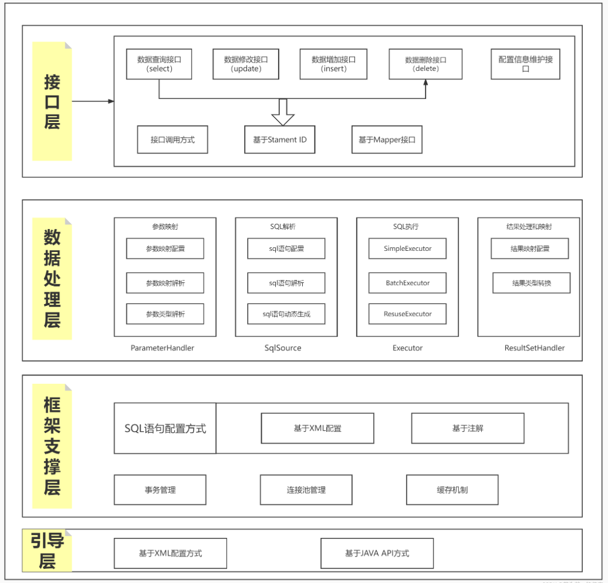
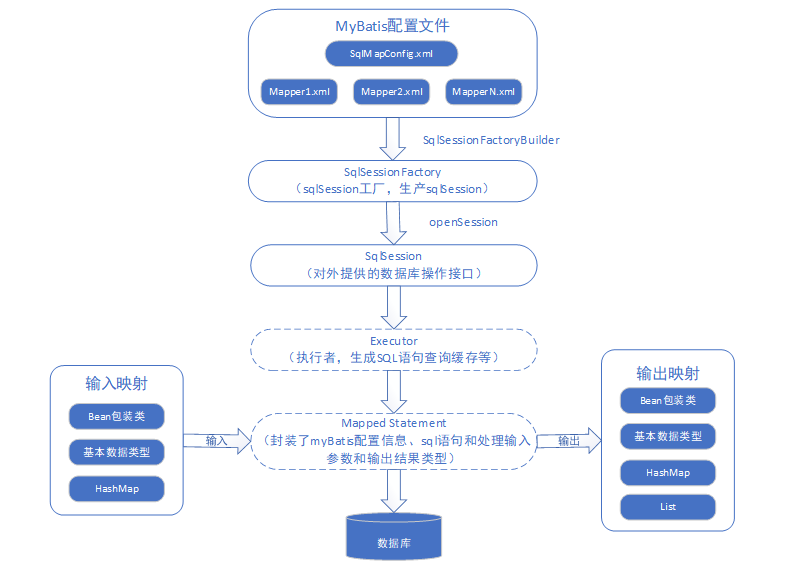
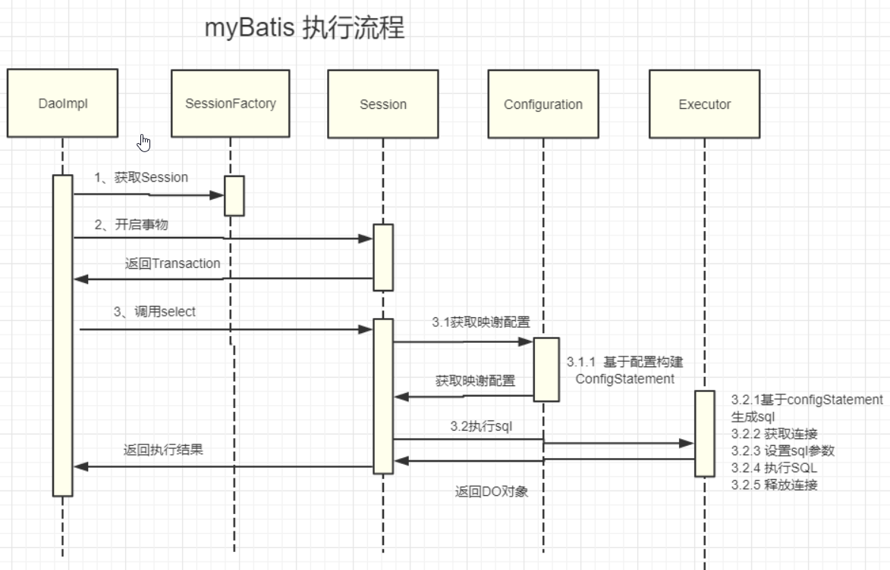

### 1、Mybatis的一级、二级缓存

（1）一级缓存

MyBatis的一级缓存是SqlSession级别的缓存，也就是说当我们执行查询之后，会将查询的结果放在SqlSession的缓存中。

对于同一个SqlSession，当执行相同的查询时，MyBatis会先查看一级缓存中是否有相同的查询结果，如果有，则直接返回缓存的结果，而不再去数据库中查询。

一级缓存是MyBatis默认开启的，它可以减少对数据库的访问，提高查询性能。
一级缓存: 基于 PerpetualCache 的 HashMap 本地缓存，其存储作用域为 Session，当 Session flush 或 close 之后，该 Session 中的所有 Cache 就将清空，默认打开一级缓存。

（2）二级缓存

MyBatis的二级缓存是Mapper级别的缓存，它可以跨SqlSession共享缓存数据。

二级缓存是在Mapper的映射文件配置开启的，我们可以在Mapper的映射文件中配置元素来开启二级缓存。

使用二级缓存时，要确保查询的 SQL 语句和参数是完全相同的，否则 MyBatis 会认为它们是不同的查询，从而不会从二级缓存中获取数据。

对于频繁更新的数据，不建议使用二级缓存，因为频繁的更新会导致缓存失效，反而降低性能。

二级缓存与一级缓存其机制相同，默认也是采用 PerpetualCache，HashMap 存储，不同在于其存储作用域为 Mapper(Namespace)，并且可自定义存储源，如 Ehcache。默认不打开二级缓存，要开启二级缓存，使用二级缓存属性类需要实现Serializable序列化接口(可用来保存对象的状态),可在它的映射文件中配置；

> 对于缓存数据更新机制，当某一个作用域(一级缓存 Session/二级缓存Namespaces)的进行了C/U/D 操作后，默认该作用域下所有 select 中的缓存将被 clear;

### 2、Mybatis 的一级缓存原理（sqlsession 级别）

Mybatis的一级缓存是指在SqlSession级别的缓存，即同一个SqlSession中执行的多次相同SQL语句，只会查询一次数据库并缓存结果，后续的查询操作会直接从缓存中获取数据，而不会再次查询数据库。一级缓存默认是开启的，可以通过SqlSession的clearCache()方法来清空缓存。

**一级缓存的实现原理如下**：

当SqlSession执行查询操作时，Mybatis会通过MappedStatement获取到SQL语句、参数映射关系以及结果映射关系等信息，然后通过Executor去执行SQL语句，并将查询结果缓存到一级缓存中。一级缓存是一个Map对象，其中键值对的键是由SQL语句、参数和环境等因素组成的一个唯一标识符，值是查询结果对象。

当执行相同的SQL语句时，Mybatis会先从一级缓存中查找是否存在缓存结果，如果存在，则直接返回缓存结果。如果不存在，则通过Executor去查询数据库，并将查询结果缓存到一级缓存中。

需要注意的是，一级缓存是基于SqlSession的，不同的SqlSession之间的一级缓存是互不干扰的。同时，一级缓存的生命周期也是和SqlSession相同的，即当SqlSession关闭时，一级缓存也会被清空。

总体来说，Mybatis的一级缓存是通过Map对象实现的，通过在SqlSession级别缓存查询结果来提高系统的性能和响应速度。但是需要注意的是，一级缓存的使用是有局限性的，例如当执行更新或删除操作时，Mybatis会清空一级缓存，因此在这种情况下，一级缓存并不能提高系统的性能。

### 3、二级缓存原理（Mapper 级别）

Mybatis的二级缓存是指在**Mapper**级别的缓存，即多个SqlSession共享同一个Mapper的缓存。二级缓存默认是关闭的，可以在Mapper.xml文件中通过标签进行配置和开启。

**二级缓存的实现原理如下**：

当SqlSession执行查询操作时，如果开启了二级缓存，则Mybatis会先从二级缓存中查找是否存在缓存结果，如果存在，则直接返回缓存结果。如果不存在，则通过Executor去查询数据库，并将查询结果缓存到二级缓存中。

二级缓存是基于Mapper的，Mybatis会为每个Mapper创建一个对应的Cache对象，用于缓存该Mapper的查询结果。Cache对象是一个接口，提供了缓存的基本操作方法，例如putObject、getObject、removeObject等。

在Mybatis中，Cache对象的实现方式是可插拔的，用户可以自定义Cache的实现方式，例如使用Ehcache、Redis等第三方缓存框架来实现二级缓存。

需要注意的是，二级缓存的使用需要谨慎，因为多个SqlSession共享同一个Mapper的缓存，可能会导致数据的脏读、数据一致性等问题。因此，**建议只在查询频率较高、数据更新频率较低的情况下使用二级缓存，并且需要注意在更新或删除操作后及时清空缓存，以保证数据的一致性**。

总体来说，Mybatis的二级缓存是通过**Cache对象**实现的，通过在Mapper级别缓存查询结果来提高系统的性能和响应速度。但是需要注意的是，二级缓存的使用需要谨慎，并且需要根据具体的业务需求进行配置和使用。

### 4、resultType和resultMap的区别？

resultType和resultMap都是Mybatis中用于映射查询结果的配置属性，但是它们的使用方式和作用有所不同。

1. resultType：resultType是指查询结果的类型，通常是一个JavaBean或者基本数据类型。当resultType被配置时，Mybatis会自动将查询结果映射成对应的JavaBean或者基本数据类型，并返回结果集。

例如：

```xml
<select id="selectUserById" resultType="com.example.User">
  select * from user where id = #{id}
</select>
```

上面的配置中，resultType被设置为com.example.User，表示查询结果将会被映射成User类型的对象。

1. resultMap：resultMap是指查询结果的映射规则，用于将查询结果映射成JavaBean或者其他复杂类型。通常需要手动配置resultMap，定义查询结果与JavaBean之间的映射关系。

例如：

```xml
<resultMap id="userMap" type="com.example.User">
  <id property="id" column="id"/>
  <result property="username" column="username"/>
  <result property="password" column="password"/>
  <result property="age" column="age"/>
</resultMap>

<select id="selectUserById" resultMap="userMap">
  select * from user where id = #{id}
</select>
```

上面的配置中，定义了一个名为userMap的映射规则，用于将查询结果映射成User类型的对象。在select语句中使用resultMap属性引用了userMap，表示查询结果需要按照userMap的规则进行映射。

总体来说，resultType和resultMap都用于映射查询结果，但是resultType适用于简单的查询场景，而resultMap适用于复杂的映射场景。需要根据具体的业务需求选择合适的配置属性。

### 5、为什么说Mybatis是半自动 ORM 映射工具？它与全自动的区别在哪里？

Mybatis在查询关联对象或关联集合对象时，需要手动编写sql来完成，所以称之为半自动ORM映射工具。

### 6、MyBatis 动态sql有什么用？执行原理？有哪些动态sql？

**MyBatis动态sql可以在Xml映射文件内，以标签的形式编写动态sql**。执行原理是根据表达式的值完成逻辑判断并动态拼接 sql 的功能。MyBatis提供了9种动态sql标签：trim、where、set、foreach、if、choose、when、otherwise、bind。

### 7、MyBatis如何获取自动生成的(主)键值?

在insert标签中使用useGeneratedKeys和keyProperty两个属性来获取自动生成的主键值。

```xml
<insert id="insertUser" useGeneratedKeys="true" keyProperty="userId" >
  insert into user( 
  user_name, user_password, create_time) 
  values(#{userName}, #{userPassword} , #{createTime, jdbcType= TIMESTAMP})
</insert>
```

### 8、传统JDBC开发存在的问题

1. 频繁创建数据库连接对象、释放，容易造成系统资源浪费，影响系统性能。可以使用连接池解决这个问题。但是使用jdbc需要自己实现连接池。
2. sql语句定义、参数设置、结果集处理存在硬编码。实际项目中sql语句变化的可能性较大，一旦发生变化，需要修改java代码，系统需要重新编译，重新发布,不好维护。
3. 使用preparedStatement向占有位符号传参数存在硬编码，因为sql语句的where条件不一定，可能多也可能少，修改sql还要修改代码，系统不易维护。

结果集处理存在重复代码，处理麻烦。如果可以映射成Java对象会比较方便。

### 9、`#{}和${}`的区别

1、预处理方式不同

#{} - 预编译处理（推荐）
```sql
SELECT * FROM users WHERE id = #{userId}
```
- MyBatis 会将其转换为 ? 占位符，使用 PreparedStatement 的 set 方法安全赋值 
- 最终执行的 SQL：SELECT * FROM users WHERE id = ?
- 防止 SQL 注入

${} - 字符串替换

```sql
SELECT * FROM ${tableName} WHERE id = ${userId}
```

- 直接替换为字符串值，原样拼接到 SQL 中 
- 最终执行的 SQL：SELECT * FROM users WHERE id = 1 
- 有 SQL 注入风险


| 特性         | `#{}`                    | `${}`            |
| :----------- | :----------------------- | :--------------- |
| **SQL注入**  | 安全，自动转义           | 不安全，直接拼接 |
| **预编译**   | 支持                     | 不支持           |
| **数据类型** | 自动转换类型             | 纯字符串替换     |
| **性能**     | 可预编译，可缓存执行计划 | 每次都要重新编译 |

使用 #{} 的场景（参数值）
```sql
<!-- 动态表名、列名（注意：确保值可信） -->
SELECT * FROM ${tableName}
ORDER BY ${orderColumn}
GROUP BY ${groupField}
```

使用 ${} 的场景（动态部分）
```sql
<!-- 动态表名、列名（注意：确保值可信） -->
SELECT * FROM ${tableName}
ORDER BY ${orderColumn}
GROUP BY ${groupField}
```

**小结**

1. 绝大部分情况使用 #{}，特别是用户输入的值 
2. 谨慎使用 ${}，仅用于动态 SQL 部分（表名、列名等），且确保值来源可信 
3. 永远不要用 ${} 接收用户输入，否则会存在 SQL 注入漏洞 
4. 使用 ${} 时，最好在业务层进行白名单验证


### 10、MyBatis实现一对一，一对多有几种方式，怎么操作的？

有联合查询和嵌套查询。联合查询是几个表联合查询，只查询一次，通过在resultMap里面的association，collection节点配置一对一，一对多的类就可以完成。

嵌套查询是先查一个表，根据这个表里面的结果的外键id，去再另外一个表里面查询数据，也是通过配置association，collection，但另外一个表的查询通过select节点配置。

### 11、Mybatis是否可以映射Enum枚举类？

Mybatis可以映射枚举类，不单可以映射枚举类，Mybatis可以映射任何对象到表的一列上。映射方式为自定义一个TypeHandler，实现TypeHandler的setParameter()和getResult()接口方法。

TypeHandler有两个作用，一是完成从javaType至jdbcType的转换，二是完成jdbcType至javaType的转换，体现为setParameter()和getResult()两个方法，分别代表设置sql问号占位符参数和获取列查询结果。

### 12、在mapper中如何传递多个参数

#### 1、顺序传参法

```xml
public User selectUser(String name, int deptId);

<select id="selectUser" resultMap="UserResultMap">
  select * from user
  where user_name = #{0} and dept_id = #{1}
</select>
```

`#{}`里面的数字代表传入参数的顺序。

这种方法不建议使用，sql层表达不直观，且一旦顺序调整容易出错。

#### 2、@Param注解传参法

```xml
public User selectUser(@Param("userName") String name, int @Param("deptId") deptId);

<select id="selectUser" resultMap="UserResultMap">
  select * from user
  where user_name = #{userName} and dept_id = #{deptId}
</select>
```

`#{}`里面的名称对应的是注解@Param括号里面修饰的名称。

这种方法在参数不多的情况还是比较直观的，推荐使用。

#### 3、Map传参法

```xml
public User selectUser(Map<String, Object> params);

  <select id="selectUser" parameterType="java.util.Map" resultMap="UserResultMap">
    select * from user
    where user_name = #{userName} and dept_id = #{deptId}
  </select>
```

`#{}`里面的名称对应的是Map里面的key名称。

这种方法适合传递多个参数，且参数易变能灵活传递的情况。

#### 4、Java Bean传参法

```xml
public User selectUser(User user);

<select id="selectUser" parameterType="com.jourwon.pojo.User" resultMap="UserResultMap">
  select * from user
  where user_name = #{userName} and dept_id = #{deptId}
</select>
```

`#{}`里面的名称对应的是User类里面的成员属性。

这种方法直观，需要建一个实体类，扩展不容易，需要加属性，但代码可读性强，业务逻辑处理方便，推荐使用。

### 13、Mybatis中如何指定使用哪一种Executor执行器？

在Mybatis配置文件中，在设置（settings）可以指定默认的ExecutorType执行器类型，也可以手动给DefaultSqlSessionFactory的创建SqlSession的方法传递ExecutorType类型参数，如SqlSession openSession(ExecutorType execType)。

配置默认的执行器。SIMPLE 就是普通的执行器；REUSE 执行器会重用预处理语句（prepared statements）；BATCH 执行器将重用语句并执行批量更新。

### 14、Mybatis是否支持延迟加载？如果支持，它的实现原理是什么？

Mybatis仅支持association关联对象和collection关联集合对象的延迟加载，association指的就是一对一，collection指的就是一对多查询。在Mybatis配置文件中，可以配置是否启用延迟加载lazyLoadingEnabled=true|false。

它的原理是，使用CGLIB创建目标对象的代理对象，当调用目标方法时，进入拦截器方法，比如调用a.getB().getName()，拦截器invoke()方法发现a.getB()是null值，那么就会单独发送事先保存好的查询关联B对象的sql，把B查询上来，然后调用a.setB(b)，于是a的对象b属性就有值了，接着完成a.getB().getName()方法的调用。这就是延迟加载的基本原理。

### 15、为什么需要预编译

定义：SQL 预编译指的是数据库驱动在发送 SQL 语句和参数给 DBMS 之前对 SQL 语句进行编译，这样 DBMS 执行 SQL 时，就不需要重新编译。

为什么需要预编译 JDBC 中使用对象 PreparedStatement 来抽象预编译语句，使用预编译。预编译阶段可以优化 SQL 的执行。预编译之后的 SQL 多数情况下可以直接执行，DBMS 不需要再次编译，越复杂的SQL，编译的复杂度将越大，预编译阶段可以合并多次操作为一个操作。同时预编译语句对象可以重复利用。把一个 SQL 预编译后产生的 PreparedStatement 对象缓存下来，下次对于同一个SQL，可以直接使用这个缓存的 PreparedState 对象。Mybatis默认情况下，将对所有的 SQL 进行预编译。

### 16、Mybatis都有哪些Executor执行器？它们之间的区别是什么？

Mybatis有三种基本的Executor执行器，SimpleExecutor、ReuseExecutor、BatchExecutor。

- **SimpleExecutor**：每执行一次update或select，就开启一个Statement对象，用完立刻关闭Statement对象。

- **ReuseExecutor**：执行update或select，以sql作为key查找Statement对象，存在就使用，不存在就创建，用完后，不关闭Statement对象，而是放置于`Map<String, Statement>`内，供下一次使用。简言之，就是重复使用Statement对象。

- **BatchExecutor**：执行update（没有select，JDBC批处理不支持select），将所有sql都添加到批处理中（addBatch()），等待统一执行（executeBatch()），它缓存了多个Statement对象，每个Statement对象都是addBatch()完毕后，等待逐一执行executeBatch()批处理。与JDBC批处理相同。

作用范围：Executor的这些特点，都严格限制在SqlSession生命周期范围内。

### 17、Mybatis中如何指定使用哪一种Executor执行器？

在Mybatis配置文件中，在设置（settings）可以指定默认的ExecutorType执行器类型，也可以手动给DefaultSqlSessionFactory的创建SqlSession的方法传递ExecutorType类型参数，如SqlSession openSession(ExecutorType execType)。

配置默认的执行器。SIMPLE 就是普通的执行器；REUSE 执行器会重用预处理语句（prepared statements）；BATCH 执行器将重用语句并执行批量更新。

### 18、MyBatis的框架架构设计是怎么样的



这张图从上往下看。MyBatis的初始化，会从mybatis-config.xml配置文件，解析构造成Configuration这个类，就是图中的红框。

(1)加载配置：配置来源于两个地方，一处是配置文件，一处是Java代码的注解，将SQL的配置信息加载成为一个个MappedStatement对象（包括了传入参数映射配置、执行的SQL语句、结果映射配置），存储在内存中。

(2)SQL解析：当API接口层接收到调用请求时，会接收到传入SQL的ID和传入对象（可以是Map、JavaBean或者基本数据类型），Mybatis会根据SQL的ID找到对应的MappedStatement，然后根据传入参数对象对MappedStatement进行解析，解析后可以得到最终要执行的SQL语句和参数。

(3)SQL执行：将最终得到的SQL和参数拿到数据库进行执行，得到操作数据库的结果。

(4)结果映射：将操作数据库的结果按照映射的配置进行转换，可以转换成HashMap、JavaBean或者基本数据类型，并将最终结果返回。

**mybatis执行架构**



**mybatis执行流程:**



### 19、模糊查询like语句该怎么写

（1）`’%${question}%’ `可能引起SQL注入，不推荐

（2）`"%"#{question}"%" `注意：因为`#{…}`解析成sql语句时候，会在变量外侧自动加单引号’ '，所以这里 % 需要使用双引号" "，不能使用单引号 ’ '，不然会查不到任何结果。

（3）`CONCAT(’%’,#{question},’%’) `使用CONCAT()函数，推荐

（4）使用bind标签

```xml
<select id="listUserLikeUsername" resultType="com.jourwon.pojo.User">
  <bind name="pattern" value="'%' + username + '%'" />
  select id,sex,age,username,password from person where username LIKE #{pattern}
</select>
```

### 20、Mybatis 是如何进行分页的？分页插件的原理是什么？

1. Mybatis 使用 RowBounds 对象进行分页，也可以直接编写 sql 实现分页，也可以使用Mybatis 的分页插件。
2. 分页插件的原理：实现 Mybatis 提供的接口，实现自定义插件，在插件的拦截方法内拦截待执行的 sql，然后重写 sql。

```sql
select * from student，拦截 sql 后重写为：select t.* from （select * from student）t limit 0，10
```

### **21、使用${}时，如何防止SQL注入？**

（1）白名单校验

在将参数传递给SQL语句之前，对参数值进行验证，确保它们符合预期的格式或范围。这可以通过正则表达式、字符串比较或其他逻辑来实现。

避免敏感操作，比如DROP、TRUNCATE 等。

（2）转义特殊字符

对于可能引起注入的特殊字符，需要进行合适的转义处理，比如对单引号、双引号、分号等特殊字符进行转义，防止它们被误解为SQL命令的一部分。

（3）使用数据库权限控制

确保数据库用户只有执行必要操作的权限，避免给予过多的权限。这样即使发生了 SQL 注入攻击，攻击者也只能执行有限的操作。

（4）日志记录和监控

记录所有执行的 SQL 语句，并监控任何异常或可疑行为。这有助于及时发现并应对潜在的 SQL 注入攻击。

### **22、mybatis 是否支持延迟加载？延迟加载的原理是什么？**

MyBatis支持延迟加载，它允许在需要时动态地加载与某个对象关联的数据。延迟加载可以帮助减少不必要的数据库查询，提高性能，并且提供了一种方便的方式来管理复杂对象之间的关联关系。

延迟加载的原理是，在查询主对象时，并不会立即加载关联对象的信息，而是在真正需要使用这些关联对象的时候再去发起对关联对象的查询。具体来说，延迟加载通常使用代理对象（Proxy）来实现。当主对象被查询并加载到内存中时，关联对象并没有被加载，而是创建一个代理对象来代替关联对象的位置。当应用程序实际使用关联对象的属性或方法时，代理对象会拦截这些调用，并触发对关联对象数据的实际加载查询，然后返回结果给应用程序。

在MyBatis中，延迟加载通常与二级缓存（二级缓存是一种全局性的缓存机制，可以跨多个会话对查询进行缓存）结合使用，可以延迟加载对象的时候首先尝试从二级缓存中获取数据，如果缓存中不存在再去查询数据库。

延迟加载可以提高查询性能，特别是在处理大量数据或者复杂关联查询的时候。但是，它也会增加一些额外的内存开销，因为需要创建代理对象，并且在访问数据时需要进行额外的数据库查询操作。因此，在使用延迟加载时需要根据具体的业务需求和性能要求进行权衡。

### **23、mybatis 有哪些执行器（Executor）？**

（1）简单执行器SimpleExecutor

SimpleExecutor是MyBatis默认的执行器，它对每个SQL语句的执行进行了封装，每次都会生成一个新的Statement对象，并执行SQL语句，SimpleExecutor适用于短时、简单的操作。

（2）重用执行器ReuseExecutor

ReuseExecutor是一种复用的执行器，它会在多次执行相同SQL语句时重用Statement对象，从而减少了Statement对象的创建和销毁，提升了性能。

（3）批处理执行器BatchExecutor

BatchExecutor是一种执行器，用于批量操作。当我们需要执行批量的SQL语句时，可以使用BatchExecutor来提高性能。BatchExecutor通过快速执行批量的SQL语句，来减少与数据库的交互次数，提高操作的效率。

### **24、mybatis中如何设置执行器？**

（1）全局设置

Spring集成MyBatis时，执行器的设置通常是在Spring的配置文件中进行的。你可以通过配置SqlSessionFactoryBean的executorType属性来指定执行器类型。例如：

```xml
<bean id="sqlSessionFactory" class="org.mybatis.spring.SqlSessionFactoryBean">  
    <property name="dataSource" ref="dataSource" />  
    <property name="configLocation" value="classpath:mybatis-config.xml" />  
    <property name="executorType" value="REUSE"/> 
</bean>
```

这个设置会影响所有的SqlSession，但不建议全局修改执行器类型，因为这可能会对性能产生不必要的影响。

（2）局部配置

当获取SqlSession对象时，可以指定所需的执行器类型。这种方式更加灵活，允许根据不同的操作需求选择不同的执行器。

SqlSession是MyBatis中用于执行数据库操作的核心接口，它提供了多种方法来执行SQL语句和映射操作。

通过SqlSessionFactory获取SqlSession对象时，可以配置执行器的类型。

使用SqlSessionFactory的openSession(ExecutorType)方法来获取指定类型的SqlSession。ExecutorType是一个枚举类型，包含了MyBatis支持的三种执行器：SIMPLE、REUSE和BATCH。

```java
import org.apache.ibatis.session.ExecutorType;  
import org.apache.ibatis.session.SqlSession;  
import org.apache.ibatis.session.SqlSessionFactory;  
import org.apache.ibatis.session.SqlSessionFactoryBuilder;  
  
import java.io.Reader;  
   
Reader reader = Resources.getResourceAsReader("mybatis-config.xml");  
  
// 创建SqlSessionFactory  
SqlSessionFactory sqlSessionFactory = new SqlSessionFactoryBuilder().build(reader);  
  
// 获取指定执行器类型的SqlSession  
// 使用SIMPLE执行器  
SqlSession sqlSession = sqlSessionFactory.openSession(ExecutorType.SIMPLE);  
// 或者使用REUSE执行器  
// SqlSession sqlSession = sqlSessionFactory.openSession(ExecutorType.REUSE);  
// 或者使用BATCH执行器  
// SqlSession sqlSession = sqlSessionFactory.openSession(ExecutorType.BATCH);  
  
try {  
    // 使用sqlSession执行数据库操作...  
    // ...  
} finally {  
    // 关闭SqlSession  
    sqlSession.close();  
}
```

（3）xml中标签内设置

可以通过在映射文件中配置、和标签来定义相应的执行器，在这些标签中可以针对具体的SQL语句配置执行器类型。
```shell
<select id="selectBlog" parameterType="int" resultType="Blog"  statementType="PREPARED" useCache="true" flushCache="true"> 
SELECT * FROM BLOG WHERE ID = #{id}
</select> 
```
在上面的示例中，可以看到标签指定了该查询的执行器类型为“PREPARED”，也就是预处理执行器。 

### 25、BatchExecutor 如何提高性能？

BatchExecutor 通过批处理的方式提高性能。它允许在 JDBC 客户端缓存多条 SQL 语句，然后在缓存满或手动刷新时，将这些语句打包一起发送到数据库执行。这种方式可以有效减少网络通信次数和数据库交互的开销，从而提高系统性能。 

1. 网络通信次数：通过一次发送多条 SQL 语句，减少了与数据库服务器之间的往返次数，从而减少了网络延迟的影响。 
2. 数据库交互开销：数据库在处理批量请求时，可以优化执行计划，减少编译和准备时间，进一步提高执行效率。 

### 26、mybatis如何防止sql注入 

（1）使用参数化的SQL语句 在编写SQL语句时，应使用参数化的方式来构建SQL，而不是将用户输入的值直接拼接到SQL字符串中。这样可以确保用户输入的内容不会被解释为SQL命令。#{}占位符会自动对输入值进行转义，可以有效防止SQL注入攻击。

```sql
<select id="getUser" parameterType="string" resultType="User">
 SELECT * FROM users WHERE username = #{username}
</select>
```
（2）使用MyBatis的动态SQL MyBatis的动态SQL允许根据条件动态拼接SQL语句，可以在拼接SQL的过程中对用户输入的内容进行转义或其他处理，从而防止SQL注入攻击。 

```sql
<select id="getUsers" parameterType="map" resultType="User"> 
 SELECT * FROM users 
     <where>  <if test="username != null">   AND username = #{username}  
              </if> 
    </where>
</select>
```

#### 27、mybatis xml映射文件中，有哪些常用标签？

：定义一个映射器，用于将 SQL 语句与 Java 方法关联起来。
：定义一个结果映射，用于描述如何将查询结果集映射到 Java 对象。
：定义一个可重用的 SQL 片段
。：定义一个查询语句，用于从数据库中检索数据。
：定义一个插入语句，用于向数据库中插入数据。
：定义一个更新语句，用于修改数据库中的数据。
：定义一个删除语句，用于从数据库中删除数据
。：定义一个参数映射，用于描述如何将 Java 方法的参数传递给 SQL 语句。
：定义一个刷新语句，用于清空或重置数据库中的缓存。
：定义一个数据库配置，用于指定数据库连接信息。
：定义一个缓存配置，用于设置查询结果的缓存策略。
：定义一个关联映射，用于描述两个实体类之间的关联关系。
：定义一个集合映射，用于描述一对多或多对多的关联关系。
：定义一个鉴别器映射，用于处理继承关系中的类型判断。
：定义一个子查询映射，用于在查询语句中使用子查询。
：定义一个构造函数映射，用于在查询结果中使用构造函数创建对象。
：定义一个修剪表达式，用于在动态 SQL 中控制 SQL 语句的生成。
：定义一个条件表达式，用于在动态 SQL 中生成 WHERE 子句。
：定义一个更新表达式，用于在动态 SQL 中生成 SET 子句。
：定义一个循环表达式，用于在动态 SQL 中处理集合类型的参数。

#### SQL 操作标签

| 标签名         | 属性                                                         | 说明         | 示例                                                         |
| :------------- | :----------------------------------------------------------- | :----------- | :----------------------------------------------------------- |
| **`<select>`** | `id`：唯一标识 `parameterType`：参数类型 `resultType`：结果类型 `resultMap`：结果映射ID `flushCache`：是否清空缓存 `useCache`：是否使用缓存 `timeout`：超时时间 `fetchSize`：获取记录数 `statementType`：语句类型 `resultSetType`：结果集类型 | 查询语句标签 | `<select id="getUser" resultType="User">SELECT * FROM users</select>` |
| **`<insert>`** | `id`：唯一标识 `parameterType`：参数类型 `flushCache`：是否清空缓存 `useGeneratedKeys`：使用自增主键 `keyProperty`：主键属性名 `keyColumn`：主键列名 `timeout`：超时时间 | 插入语句标签 | `<insert id="insertUser" useGeneratedKeys="true" keyProperty="id">INSERT INTO users...</insert>` |
| **`<update>`** | `id`：唯一标识 `parameterType`：参数类型 `flushCache`：是否清空缓存 `timeout`：超时时间 | 更新语句标签 | `<update id="updateUser">UPDATE users SET...</update>`       |
| **`<delete>`** | `id`：唯一标识 `parameterType`：参数类型 `flushCache`：是否清空缓存 `timeout`：超时时间 | 删除语句标签 | `<delete id="deleteUser">DELETE FROM users...</delete>`      |

#### 结果映射标签

| 标签名                | 属性                                                         | 说明                 | 示例                                                         |
| :-------------------- | :----------------------------------------------------------- | :------------------- | :----------------------------------------------------------- |
| **`<resultMap>`**     | `id`：唯一标识 `type`：映射的Java类型 `extends`：继承的resultMap `autoMapping`：是否自动映射 | 定义结果映射         | `<resultMap id="userMap" type="User">...</resultMap>`        |
| **`<id>`**            | `property`：Java属性名 `column`：数据库列名 `javaType`：Java类型 `jdbcType`：JDBC类型 | 主键字段映射         | `<id property="id" column="user_id"/>`                       |
| **`<result>`**        | `property`：Java属性名 `column`：数据库列名 `javaType`：Java类型 `jdbcType`：JDBC类型 | 普通字段映射         | `<result property="name" column="user_name"/>`               |
| **`<constructor>`**   | 无属性，容器标签                                             | 构造函数映射         | `<constructor><idArg column="id" javaType="int"/></constructor>` |
| **`<idArg>`**         | `column`：列名 `javaType`：Java类型 `jdbcType`：JDBC类型 `name`：参数名 | 构造函数主键参数     | `<idArg column="id" javaType="int"/>`                        |
| **`<arg>`**           | `column`：列名 `javaType`：Java类型 `jdbcType`：JDBC类型 `name`：参数名 | 构造函数普通参数     | `<arg column="name" javaType="String"/>`                     |
| **`<association>`**   | `property`：Java属性名 `javaType`：Java类型 `resultMap`：引用resultMap `columnPrefix`：列名前缀 | 一对一关联映射       | `<association property="dept" javaType="Department">...</association>` |
| **`<collection>`**    | `property`：Java属性名 `ofType`：集合元素类型 `resultMap`：引用resultMap `columnPrefix`：列名前缀 | 一对多关联映射       | `<collection property="list" ofType="Order">...</collection>` |
| **`<discriminator>`** | `javaType`：列值类型 `column`：鉴别列名                      | 鉴别器（继承映射）   | `<discriminator javaType="int" column="type">...</discriminator>` |
| **`<case>`**          | `value`：列值 `resultMap`：映射的resultMap                   | 鉴别器分支           | `<case value="1" resultMap="adminMap"/>`                     |
| **`<parameterMap>`**  | `id`：唯一标识 `type`：参数类型                              | **已废弃**：参数映射 | `<parameterMap id="paramMap" type="User">...</parameterMap>` |
| **`<parameter>`**     | `property`：属性名 `jdbcType`：JDBC类型                      | **已废弃**：参数定义 | `<parameter property="id" jdbcType="INTEGER"/>`              |

#### 动态 SQL 标签

| 标签名            | 属性                                                         | 说明                          | 示例                                                         |
| :---------------- | :----------------------------------------------------------- | :---------------------------- | :----------------------------------------------------------- |
| **`<if>`**        | `test`：OGNL表达式                                           | 条件判断                      | `<if test="name != null">AND name = #{name}</if>`            |
| **`<choose>`**    | 无属性，容器标签                                             | 多条件选择（类似switch）      | `<choose><when>...</when><otherwise>...</otherwise></choose>` |
| **`<when>`**      | `test`：OGNL表达式                                           | choose的分支条件              | `<when test="name != null">AND name = #{name}</when>`        |
| **`<otherwise>`** | 无属性                                                       | choose的默认分支              | `<otherwise>AND status=1</otherwise>`                        |
| **`<where>`**     | 无属性                                                       | 智能WHERE子句，自动处理AND/OR | `<where><if>...</if></where>`                                |
| **`<set>`**       | 无属性                                                       | 智能SET子句，自动处理逗号     | `<set><if>...</if></set>`                                    |
| **`<trim>`**      | `prefix`：添加前缀 `suffix`：添加后缀 `prefixOverrides`：去除前缀 `suffixOverrides`：去除后缀 | 自定义修剪标签                | `<trim prefix="WHERE" prefixOverrides="AND">...</trim>`      |
| **`<foreach>`**   | `collection`：集合属性名 `item`：迭代项名 `index`：迭代索引名 `open`：开始字符串 `close`：结束字符串 `separator`：分隔符 | 循环遍历                      | `<foreach collection="list" item="item">#{item}</foreach>`   |
| **`<bind>`**      | `name`：变量名 `value`：OGNL表达式值                         | 创建变量                      | `<bind name="pattern" value="'%'+name+'%'"/>`                |

#### SQL 片段标签

| 标签名          | 属性                  | 说明              | 示例                                  |
| :-------------- | :-------------------- | :---------------- | :------------------------------------ |
| **`<sql>`**     | `id`：唯一标识        | 定义可重用SQL片段 | `<sql id="baseColumns">id,name</sql>` |
| **`<include>`** | `refid`：引用的sql ID | 引用SQL片段       | `<include refid="baseColumns"/>`      |

#### 缓存标签

| 标签名            | 属性                                                         | 说明                 | 示例                                              |
| :---------------- | :----------------------------------------------------------- | :------------------- | :------------------------------------------------ |
| **`<cache>`**     | `eviction`：淘汰策略（LRU|FIFO|SOFT|WEAK） `flushInterval`：刷新间隔(ms) `size`：缓存对象数 `readOnly`：是否只读 `blocking`：是否阻塞 `type`：自定义缓存类 | 配置二级缓存         | `<cache eviction="LRU" size="1024"/>`             |
| **`<cache-ref>`** | `namespace`：命名空间                                        | 引用其他Mapper的缓存 | `<cache-ref namespace="com.example.UserMapper"/>` |

**按照功能对标签分类:**

| 类别             | 包含标签                                                     | 主要用途                       |
| :--------------- | :----------------------------------------------------------- | :----------------------------- |
| **SQL执行标签**  | `<select>`, `<insert>`, `<update>`, `<delete>`               | 定义CRUD操作                   |
| **结果映射标签** | `<resultMap>`, `<id>`, `<result>`, `<association>`, `<collection>`, `<constructor>`, `<discriminator>`, `<case>` | 定义Java对象与数据库的映射关系 |
| **动态SQL标签**  | `<if>`, `<choose>`, `<when>`, `<otherwise>`, `<where>`, `<set>`, `<trim>`, `<foreach>`, `<bind>` | 构建动态SQL语句                |
| **片段重用标签** | `<sql>`, `<include>`                                         | SQL代码复用                    |
| **缓存配置标签** | `<cache>`, `<cache-ref>`                                     | 二级缓存配置                   |
| **参数映射标签** | `<parameterMap>`, `<parameter>`                              | **已废弃**：参数映射定义       |


#### **小结**

1. **标签嵌套规则**：
    - `<resultMap>` 内可包含 `<id>`, `<result>`, `<association>`, `<collection>`, `<constructor>`, `<discriminator>`
    - `<constructor>` 内可包含 `<idArg>`, `<arg>`
    - `<discriminator>` 内可包含 `<case>`
    - `<choose>` 内必须包含至少一个 `<when>`，可包含一个 `<otherwise>`
2. **属性优先级**：
    - `resultMap` 优先级高于 `resultType`
    - 显式映射优先级高于自动映射
3. **缓存相关**：
    - 一级缓存默认开启（SqlSession级别）
    - 二级缓存需要显式配置 `<cache>` 标签
4. **废弃标签**：
    - `<parameterMap>` 和 `<parameter>` 已废弃，建议使用 `@Param` 注解
5. **动态SQL最佳实践**：
    - 优先使用 `<where>` 和 `<set>`，而非手动拼接
    - `<foreach>` 遍历时注意参数类型
    - `<bind>` 可用于解决数据库兼容性问题


### **28、Mybatis 动态 sql 有什么用？执行原理？有哪些动态 sql？**

动态 SQL 的主要作用在于，根据运行时不同的条件，动态地生成不同的 SQL 语句，从而实现更灵活、更高效的数据库操作。

常见的动态 SQL 标签：

- choose:只会在至少有一个子元素的条件返回 SQL 子句的情况下才去插入“WHERE”子句。而且，若子句的开头是“AND”或“OR”，元素也会将它们去除。
- if:用于判断条件，如果满足条件，则包含其中的 SQL 片段。
- when:类似于 Java 中的 switch-case-default 结构，用于多条件判断。
- trim:可以自定义前缀和后缀的去除规则。
- set:用于处理 SQL 语句中的 SET 子句，智能地处理逗号。
- foreach:用于遍历集合，根据集合元素生成相应的 SQL 片段。

这些动态 SQL 标签大大增强了 MyBatis 的灵活性，使得开发者能够根据不同的业务逻辑，动态地构建 SQL 语句，从而提高了开发效率和代码的可维护性。

### **29、Mybatis 的 Xml 映射文件中，不同的 Xml 映射文件，id 是否可以重复？**

在 MyBatis 的 XML 映射文件中，不同的 XML 映射文件之间的 ID 是可以重复的。因为每个 XML 映射文件都是独立的，它们之间不会相互影响。但是在同一张 XML 映射文件中，每个元素中的 ID 必须是唯一的，不能重复。

### **30、MyBatis的接口绑定是如何工作的？**

当 MyBatis 接收到 Java 接口方法的调用时，它会首先查找是否有与该方法相关的 SQL 映射语句。如果有，MyBatis 会解析该 SQL 语句，并根据传入的参数值动态地生成最终的 SQL 语句。然后，MyBatis 会执行这个 SQL 语句，并将查询结果映射回 Java 对象，最后返回给调用者。

在接口绑定中，MyBatis 提供了两种实现方式：

（1）使用元素

在 MyBatis 的全局配置文件（如 mybatis-config.xml）中，通过元素引入 SQL 映射文件，将映射文件与 Java 接口关联起来。

（2）使用注解

在 Java 接口方法上添加 @Select、@Insert、@Update、@Delete 等注解，直接编写 SQL 语句。

```java
public interface UserMapper {
    @Select("SELECT * FROM user WHERE id = #{id}")
    User getUserById(int id);
}
```

### **31、MyBatis如何处理参数映射？**

（1）单个参数

当 SQL 语句中只有一个参数时，MyBatis 无需指定参数的类型或名称，直接使用 #{} 来引用参数。MyBatis 会自动将这个参数绑定到 SQL 语句中。

（2）多个参数

 1)使用顺序：MyBatis 会按照参数的顺序进行绑定，可以使用 #{param1}、#{param2} 等来引用参数。

```sql
<select id="selectUserByUsernameAndPassword" resultType="User">  
  SELECT * FROM user WHERE username = #{param1} AND password = #{param2}  
</select>
```

 2)使用 @Param 注解：在 Mapper 接口的方法参数上添加 @Param 注解，为参数指定一个名称，然后在 XML 中使用这个名称来引用参数。

```java
User selectUserByUsernameAndPassword(@Param("username") String username, @Param("password") String password);
<select id="selectUserByCriteria" resultType="User">  
  SELECT * FROM user WHERE username = #{username} AND age = #{age}  
</select>
```

 3)使用 Map 或 JavaBean：将多个参数封装到一个 Map 或 JavaBean 中，然后在 XML 中引用 Map 的 key 或 JavaBean 的属性。

```sql
User selectUserByCriteria(Map<String, Object> criteria);
<select id="selectUserByCriteria" resultType="User">  
  SELECT * FROM user WHERE username = #{username} AND age = #{age}  
</select>
```

（3）复杂类型

对于复杂类型（如 JavaBean 或自定义类型），MyBatis 会自动映射这些类型的属性到 SQL 语句中。只需要在 XML 中使用 #{} 引用这些属性的名称即可。

```java
public class UserCriteria {  
  private String username;  
  private int age;  
  // getters and setters  
}
<select id="selectUserByCriteria" resultType="User">  
  SELECT * FROM user WHERE username = #{username} AND age = #{age}  
</select>
```

（4）使用 @Results 和 @Result 注解

对于结果集的映射，MyBatis 提供了 @Results 和 @Result 注解，用于在接口方法上直接定义结果集的映射关系，而无需编写 XML 映射文件。这些注解可以指定如何将数据库中的列映射到 Java 对象的属性上。

### **32、项目中是如何实现权限验证的，权限验证需要几张表？**

Spring Security 是实现权限验证的常用框架，通常需要三张表来实现基本的权限验证。

Spring Security提供了一套全面的安全服务，包括身份认证、权限授权等功能。在实现权限验证时，通常会使用到该框架提供的多种机制和扩展点。例如，通过实现UserDetailsService接口并覆写里面的用户认证方法，可以自定义用户的认证逻辑。此外，权限管理过程包括鉴权管理和授权管理，即判断用户是否有权访问某个资源以及如何将权限分配给用户。

对于权限验证所需的表结构，RBAC（Role-Based Access Control，基于角色的访问控制）模型是一个常见的设计模式。在这个模型中，通常至少需要三张表：用户表、角色表、权限表。用户表存储用户信息，角色表定义了不同的角色，而权限表则规定了不同角色可以执行的操作。除此之外，还需要两张关系表来维护用户和角色之间、角色和权限之间的关系。这些表共同构成了权限验证的基础数据结构。

在设计和实施权限验证系统时，开发者需要根据实际业务需求和技术选型来决定具体的实现方式和所需表结构。

### **33、说说你对RBAC的理解？**

RBAC 的核心思想是将权限赋予角色，然后将角色赋予用户。这种分离让系统管理员能够更容易地管理和控制资源的访问权限。通过 RBAC，可以对用户的权限进行集中管理，确保授权的一致性。 RBAC 主要包括三种基本权利：用户、角色和权限。当用户和角色是多对多的关系，当用户角色变更时只需要对关系进行更改即可，简化了权限管理工作。RBAC 通过模块化的方式进行权限管理，可以减少权限管理的复杂性，提高系统的安全性。

这是RBAC的基础模型。在RBAC0中，角色是权限的集合，用户则被分配到这些角色中。用户通过其角色获得访问资源的权限。RBAC0模型主要关注用户、角色和权限之间的基本关系。

RBAC1在RBAC0的基础上增加了角色继承的概念。在RBAC1中，角色可以继承其他角色的权限，形成一个角色层次结构。这种继承关系使得权限的管理更加灵活和方便，可以满足更复杂的权限控制需求。

RBAC2是RBAC的扩展模型，引入了约束的概念。这些约束可以是静态的，也可以是动态的，用于限制角色、权限和用户之间的关联关系。例如，可以设置约束来防止某个角色被赋予过多的权限，或者限制某个用户只能被分配到特定的角色中。

RBAC3结合了RBAC1和RBAC2的特性，既支持角色继承，又允许定义约束来限制权限的分配和使用。这使得RBAC3成为一个功能全面且高度可配置的权限管理模型。

### **34、rbac的实现理论分析**

在实现RBAC（基于角色的访问控制）时，需要考虑以下因素：

1. **角色定义**：定义系统中所有角色和这些角色可以执行的权限或操作。
2. **权限管理**：对系统中需要进行控制的所有资源和操作进行明确定义，并分配相应的权限。
3. **用户-角色分配**：确定系统中的用户与角色之间的关联关系，即哪些用户属于哪些角色。
4. **角色-权限分配**：明确每个角色所具有的权限。这个关系是角色拥有哪些权限的映射。
5. **角色层级关系**（如果需要）：在某些情况下，需要为角色定义父子关系以实现角色的继承和权限的继承。
6. **安全策略实施**：制定并实施适当的安全策略，包括访问控制列表、访问策略、密码策略等。
7. **审计和监控**：监控系统对权限的使用情况，进行审计和日志记录，以及定期的安全审查和漏洞分析。
8. **用户界面及管理工具**：提供用户管理界面和权限管理界面，以便管理员和用户能够方便地管理和使用RBAC系统。
9. **用户认证和会话管理**：RBAC系统通常需要与用户认证和会话管理系统集成，以确保合法用户可以正常访问系统资源。
10. **数据库设计**：RBAC系统的实现通常涉及数据库设计，包括用户、角色、权限信息的存储和管理。
11. **系统优化和性能**：为支持RBAC系统的高效运行，可能需要对系统进行特定的优化，确保系统可以快速、安全地进行权限验证和验证。
