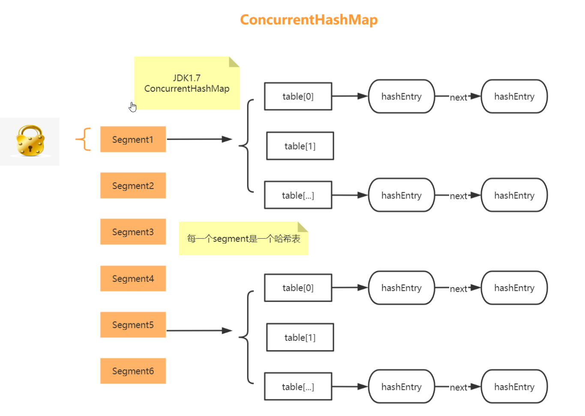
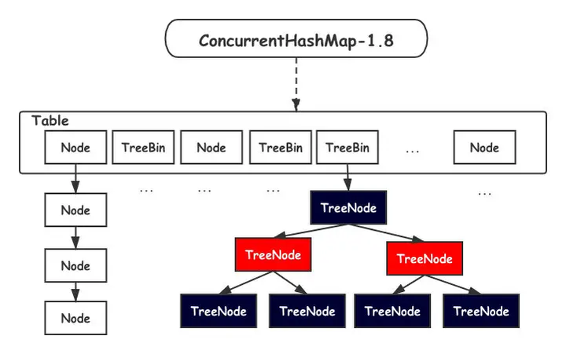

## 什么是进程？是什么线程？

**线程是处理器任务调度和执行的基本单位，进程是操作系统资源分配的基本单位。** 进程是程序的一次执行过程，是系统运行的基本单位。线程是一个比进程更小的执行单位，一个进程可以包含多个线程。

## 进程和线程的关系？（区别）

**定义：**

- **线程是CPU独立运行和独立调度的基本单位，没有单独地址空间，有独立的栈，局部变量，寄存器器， 程序计数器等。**
- **进程是操作系统资源分配的基本单位，有独立的内存地址空间。**
- **创建进程的开销大，包括创建虚拟地址空间等需要大量系统资源**
- 创建线程开销⼩小，基本上只有⼀一个内核对象和一个堆栈
- 一个进程无法直接访问另一个进程的资源；同一进程内的多个线程共享进程的资源。
- 进程切换开销大，线程切换开销小；进程间通信开销大，线程间通信开销小。
- 线程属于进程，不能独立执行。每个进程至少要有一个线程，成为主线程


**讲解线程和进程的时候可以从jvm角度回答**

- Java虚拟机的角度来理解：Java虚拟机的运行时数据区包含堆、方法区、虚拟机栈、本地方法栈、程 序计数器。各个进程之间是相互独立的，每个进程会包含多个线程，每个进程所包含的多个线程并不是 相互独立的，这个线程会共享进程的堆和方法区，但这些线程不会共享虚拟机栈、本地方法栈、程序计 数器。即每个进程所包含的多个线程共享进程的堆和方法区，并且具备私有的虚拟机栈、本地方法栈、 程序计数器，如图所示，假设某个进程包含三个线程。


由上面可知以下进程和线程在以下几个方面的区别：

- 内存分配：进程之间的地址空间和资源是相互独立的，同一个进程之间的线程会共享线程的地址空间和 资源（堆和方法区）。
- 资源开销：每个进程具备各自的数据空间，进程之间的切换会有较大的开销。属于同一进程的线程会共 享堆和方法区，同时具备私有的虚拟机栈、本地方法栈、程序计数器，线程之间的切换资源开销较小。

## 并行和并发的区别？

- 并行：单位时间多个处理器同时处理多个任务。
- 并发：一个处理器处理多个任务，按时间片轮流处理多个任务。

## 什么是线程安全和线程不安全？

**线程安全**

- 线程安全: 就是多线程访问时，采用了加锁机制，当一个线程访问该类的某个数据时，进行保护，其他线程不能进行 访问，直到该线程读取完，其他线程才可使用。不会出现数据不一致或者数据污染。
- Vector 是⽤用同步方法来实现线程安全的, ⽽和它相似的ArrayList不是线程安全的。

**线程不安全**

- 线程不不安全：就是不提供数据访问保护，有可能出现多个线程先后更改数据造成所得到的数据是脏数据，线程安全问题都是由全局变量及静态变量引起的。
- 若每个线程中对全局变量、静态变量只有读操作，⽽⽆写操作，⼀般来说，这个全局变量是线程安全的；若有多个 线程同时执行写操作，⼀般都需要考虑线程同步，否则的话就可能影响线程安全。

## 多线程的优缺点（为什么使用多线程、多线程会引发什么问题）

优点：当一个线程进入等待状态或者阻塞时，CPU可以先去执行其他线程，提高CPU的利用率

缺点：

- 上下文切换：频繁的上下文切换会影响多线程的执行速度。
- 多个线程抢占某一个资源会引起死锁
- 资源限制：在进行并发编程时，程序的执行速度受限于计算机的硬件或软件资源。在并发编程中， 程序执行变快的原因是将程序中串行执行的部分变成并发执行，如果因为资源限制，并发执行的部 分仍在串行执行，程序执行将会变得更慢，因为程序并发需要上下文切换和资源调度。

## 什么是多线程的上下文切换？

多线程：是指从软件或者硬件上实现多个线程的并发技术。 **多线程的好处：**

1. 使用多线程可以把程序中占据时间长的任务放到后台去处理，如图片、视屏的下载
2. 发挥多核处理器的优势，并发执行让系统运行的更快、更流畅，⽤户体验更好

**多线程的缺点：**

1. ⼤量的线程降低代码的可读性；
2. 更多的线程需要更多的内存空间
3. 当多个线程对同一个资源出现争夺时候要注意线程安全的问题。

**多线程的上下文切换：**

- 即便是单核的处理器也会支持多线程，处理器会给每个线程分配CPU时间片来实现这个机制。时间片是 CPU分配给每个线程的执行时间，一般来说时间片非常的短，所以处理器会不停地切换线程。
- CPU会通过时间片分配算法来循环执行任务，当前任务执行完一个时间片后会切换到下一个任务，但切 换前会保存上一个任务的状态，因为下次切换回这个任务时还要加载这个任务的状态继续执行，从任务 保存到在加载的过程就是一次上下文切换。

## Java中守护线程和用户线程的区别？

任何线程都可以设置为守护线程和用户线程，通过方法 Thread.setDaemon(bool on) 设置， true 则 是将该线程设置为守护线程， false 则是将该线程设置为用户线程。同时， Thread.setDaemon() 必须 在 Thread.start() 之前调用，否则运行时会抛出异常。

- 用户线程：平时使用到的线程均为用户线程。
- 守护线程：用来服务用户线程的线程，例如垃圾回收线程。
- 守护线程和用户线程的区别主要在于Java虚拟机是否存活
- 用户线程：当任何一个用户线程未结束，Java虚拟机是不会结束的。
- 守护线程：如果只剩守护线程未结束，Java虚拟机结束

## 线程死锁是如何产生的，如何避免

**产生死锁的原因**

死锁：由于两个或两个以上的线程相互竞争对方的资源，而同时不释放自己的资源，导致所有线程同时 被阻塞

**死锁产生的条件：**

- 互斥条件：一个资源在同一时刻只由一个线程占用。
- 请求与保持条件：一个线程在请求被占资源时发生阻塞，并对已获得的资源保持不放。
- 循环等待条件：发生死锁时，所有的线程会形成一个死循环，一直阻塞。
- 不剥夺条件：线程已获得的资源在未使用完不能被其他线程剥夺，只能由自己使用完释放资源。

**避免死锁的方法主要是破坏死锁产生的条件。**

- 破坏互斥条件：这个条件无法进行破坏，锁的作用就是使他们互斥。
- 破坏请求与保持条件：一次性申请所有的资源。
- 破坏循环等待条件：按顺序来申请资源。
- 破坏不剥夺条件：线程在申请不到所需资源时，主动放弃所持有的资源。

## 用Java实现死锁，并给出避免死锁的解决方案

**代码演示**

```java
class DeadLockDemo {
    private static Object resource1 = new Object();
    private static Object resource2 = new Object();
    public static void main(String[] args) {
        new Thread(() -> {
            synchronized (resource1) {
                System.out.println(Thread.currentThread() + "get resource1");
                try {
                    ead.sleep(1000); //线程休眠，保证线程2先获得资源2
                } catch (InterruptedException e) {
                    e.printStackTrace();
                }
                System.out.println(Thread.currentThread() + "waiting getresource2");
                synchronized (resource2) {
                    System.out.println(Thread.currentThread() + "getresource2");
                }
            }
        }, "线程 1").start();
        
        new Thread(() -> {
            synchronized (resource2) {
                System.out.println(Thread.currentThread() + "get resource2");
                try {
                    Thread.sleep(1000); //线程休眠，保证线程1先获得资源1
                } catch (InterruptedException e) {
                    e.printStackTrace();
                }
                System.out.println(Thread.currentThread() + "waiting getresource1");
                synchronized (resource1) {
                    System.out.println(Thread.currentThread() + "getresource1");
                }
            }
        }, "线程 2").start();
    }
}
//结果
Thread[线程 1,5,main]get resource1
Thread[线程 2,5,main]waiting get resource1
Thread[线程 1,5,main]waiting get resource2
```

上面代码产生死锁的原因主要是线程1获取到了资源1，线程2获取到了资源2，线程1继续获取资源2而产 生阻塞，线程2继续获取资源1而产生阻塞。解决该问题最简单的方式就是两个线程按顺序获取资源，线 程1和线程2都先获取资源1再获取资源2，无论哪个线程先获取到资源1，另一个线程都会因无法获取线 程1产生阻塞，等到先获取到资源1的线程释放资源1，另一个线程获取资源1，这样两个线程可以轮流获 取资源1和资源2。代码如下：

```java
private static Object resource1 = new Object();
private static Object resource2 = new Object();
public static void main(String[] args) {
    new Thread(() -> {
        synchronized (resource1) {
            System.out.println(Thread.currentThread() + "get resource1");
            try {
                Thread.sleep(1000);
            } catch (InterruptedException e) {
                e.printStackTrace();
            }
            System.out.println(Thread.currentThread() + "waiting getresource2");
            synchronized (resource2) {
                System.out.println(Thread.currentThread() + "getresource2");
            }
        }
    }, "线程 1").start();
    new Thread(() -> {
        synchronized (resource1) {
            System.out.println(Thread.currentThread() + "get resource1");
            try {
                Thread.sleep(1000);
            } catch (InterruptedException e) {
            e.printStackTrace();
            }
            System.out.println(Thread.currentThread() + "waiting getresource2");
            synchronized (resource2) {
                System.out.println(Thread.currentThread() + "getresource2");
            }
        }
    }, "线程 2").start();
    }
}
```

## Java中的死锁、活锁、饥饿有什么区别？

活锁：任务或者执行者没有被阻塞，由于某些条件没有被满足，导致线程一直重复尝试、失败、尝试、 失败。例如，线程1和线程2都需要获取一个资源，但他们同时让其他线程先获取该资源，两个线程一直 谦让，最后都无法获取

活锁和死锁的区别：

- 活锁是在不断地尝试、死锁是在一直等待。
- 活锁有可能自行解开、死锁无法自行解开。

饥饿：一个或者多个线程因为种种原因无法获得所需要的资源， 导致一直无法执行的状态。以打印机打 印文件为例，当有多个线程需要打印文件，系统按照短文件优先的策略进行打印，但当短文件的打印任 务一直不间断地出现，那长文件的打印任务会被一直推迟，导致饥饿。活锁就是在忙式等待条件下发生 的饥饿，忙式等待就是不进入等待状态的等待。 **产生饥饿的原因：**

- 高优先级的线程占用了低优先级线程的CPU时间
- 线程被永久堵塞在一个等待进入同步块的状态，因为其他线程总是能在它之前持续地对该同步块进 行访问。
- 线程在等待一个本身也处于永久等待完成的对象(比如调用这个对象的 wait() 方法)，因为其他线程 总是被持续地获得唤醒。

> 死锁、饥饿的区别：饥饿可自行解开，死锁不行。

## 线程的生命周期和状态

线程状态的划分并不唯一，但是都大同小异，这里参考《Java并发编程的艺术》，主要有以下几种状态：

1. 新建( new )：新创建了一个线程对象。
2. 可运行( runnable )：线程对象创建后，其他线程(比如 main 线程）调用了该对象 的 start () 方法。该状态的线程位于可运行线程池中，等待被线程调度选中，获 取 cpu 的使用权 。
3. 运行( running )：可运行状态( runnable )的线程获得了 cpu 时间片（ timeslice ） ，执行 程序代码。
4. 阻塞( block )：阻塞状态是指线程因为某种原因放弃了 cpu 使用权，也即让出了 cpu timeslice ，暂时停止运行。直到线程进入可运行( runnable )状态，才有 机会再次获得 cpu timeslice 转到运行( running )状态。阻塞的情况分三种：
    1. 等待阻塞：运行( running )的线程执行 o . wait ()方法， JVM 会把该线程放 入等待队列( waitting queue )中。
    2. 同步阻塞：运行( running )的线程在获取对象的同步锁时，若该同步锁 被别的线程占 用，则 JVM 会把该线程放入锁池( lock pool )中。
    3. 其他阻塞: 运行( running )的线程执行 Thread . sleep ( long ms )或 t . join ()方法，或者发出了 I / O 请求时， JVM 会把该线程置为阻塞状态。 当 sleep ()状态超时、 join () 等待线程终止或者超时、或者 I / O 处理完毕时，线程重新转入可运行( runnable )状态。
5. 死亡( dead )：线程 run ()、 main () 方法执行结束，或者因异常退出了 run ()方法，则该 线程结束生命周期。死亡的线程不可再次复生。

**线程不同状态解释:**


线程转化过程如下：


## 创建线程一共有哪几种方法？

- 继承 Thread 类创建线程
- 实现 Runnable 接口创建线程
- 使用 Callable 和 Future 创建线程
- 使用线程池例如用 Executor 框架

> 实现Runnable接口这种方式更受欢迎，因为这不需要继承Thread类。在应用设计中已经继承了别的对象的情况下，这需要多继承（而Java不支持多继承），只能实现接口。同时， 线程池也是非常高效的，很容易实现和使用。

1. 继承Thread类创建线程，首先继承Thread类，重写 run() 方法，在 main() 函数中调用子类实实例的start() 方法。

```java
public class ThreadDemo extends Thread {
    @Override
    public void run() {
        System.out.println(Thread.currentThread().getName() + " run()方法正在执行");
    }
}
public class TheadTest {
    public static void main(String[] args) {
        ThreadDemo threadDemo = new ThreadDemo();
        threadDemo.start();
        System.out.println(Thread.currentThread().getName() + " main()方法执行结束");
    }
}
//结果
main main()方法执行结束
Thread-0 run()方法正在执行
```

2. 实现Runnable接口创建线程：首先创建实现 Runnable 接口的类 RunnableDemo ，重写 run() 方法； 创建类 RunnableDemo 的实例对象 runnableDemo ，以 runnableDemo 作为参数创建 Thread 对象，调用 Thread 对象的 start() 方法。

```java
public class RunnableDemo implements Runnable {
    @Override
    public void run() {
        System.out.println(Thread.currentThread().getName() + " run()方法执行中");
    }
}
public class RunnableTest {
    public static void main(String[] args) {
        RunnableDemo runnableDemo = new RunnableDemo ();
        Thread thread = new Thread(runnableDemo);
        thread.start();
        System.out.println(Thread.currentThread().getName() + " main()方法执行完成");
    }
}
//结果
main main()方法执行完成
Thread-0 run()方法执行中
```

3. 使用Callable和Future创建线程：
    1. 创建Callable接口的实现类 CallableDemo ，重写 call() 方法。
    2. 以类 CallableDemo 的实例化对象作为参数创建 FutureTask 对象。
    3. 以 FutureTask 对象作为参数创建 Thread 对象。
    4. 调用 Thread 对象的 start() 方法。

```java
class CallableDemo implements Callable<Integer> {
    @Override
    public Integer call() {
        System.out.println(Thread.currentThread().getName() + " call()方法执行中");
    return 0;
    }
}
class CallableTest {
    public static void main(String[] args) throws ExecutionException,InterruptedException {
        FutureTask<Integer> futureTask = new FutureTask<Integer>(newCallableDemo());
        Thread thread = new Thread(futureTask);
        thread.start();
        System.out.println("返回结果 " + futureTask.get());
        System.out.println(Thread.currentThread().getName() + " main()方法执行完成");
    }
}
```

4. 使用线程池例如用Executor框架： Executors 可提供四种线程池，分别为：
    1. newCachedThreadPool 创建一个可缓存线程池，如果线程池长度超过处理需要，可灵活回收空闲线程，若无可回收，则新建线程
    2. newFixedThreadPool 创建一个定长线程池，可控制线程最大并发数，超出的线程会在队列中等待。
    3. newScheduledThreadPool 创建一个定长线程池，支持定时及周期性任务执行。
    4. newSingleThreadExecutor 创建一个单线程化的线程池，它只会用唯一的工作线程来执行任务，保证所有任务按照指定顺序执行。

下面以创建一个定长线程池为例进行说明:

```java
class ThreadDemo extends Thread {
    @Override
    public void run() {
        System.out.println(Thread.currentThread().getName() + "正在执行");
    }
}
class TestFixedThreadPool {
    public static void main(String[] args) {
    //创建一个可重用固定线程数的线程池
    ExecutorService pool = Executors.newFixedThreadPool(2);
    //创建实现了Runnable接口对象，Thread对象当然也实现了Runnable接口
    Thread t1 = new ThreadDemo();
    Thread t2 = new ThreadDemo();
    Thread t3 = new ThreadDemo();
    Thread t4 = new ThreadDemo();
    Thread t5 = new ThreadDemo();
    //将线程放入池中进行执行
    pool.execute(t1);
    pool.execute(t2);
    pool.execute(t3);
    pool.execute(t4);
    pool.execute(t5);
    //关闭线程池
    pool.shutdown();
    }
}
//结果
pool-1-thread-2正在执行
pool-1-thread-1正在执行
pool-1-thread-1正在执行
pool-1-thread-2正在执行
pool-1-thread-1正在执行
```

## runnable 和 callable 有什么区别？

**相同点：**

- 两者都是接口
- 两者都需要调用 Thread.start 启动线程

**不同点：**

- callable的核心是 call() 方法，允许返回值， runnable 的核心是 run() 方法，没有返回值
- call() 方法可以抛出异常，但是 run() 方法不行
- callable 和 runnable 都可以应用于 executors ， thread 类只支持 runnable

## 线程的run()和start()有什么区别？

- 线程是通过 Thread 对象所对应的方法 run() 来完成其操作的，而线程的启动是通过 start() 方法执行的。
- run() 方法可以重复调用， start() 方法只能调用一次

## 为什么调用start()方法时会执行run()方法，而不直接执行run()方法？

1. start() 方法来启动线程，真正实现了多线程运行，这时无需等待 run() 方法体代码执行完毕而直接继续执行下面的代码。通过调用Thread类的 start() 方法来启动一个线程，这时此线程处于就绪（可运行）状态，并没有运行，一旦得到cpu时间片，就开始执行 run() 方法，这里方法 run() 称为线程体，它包含了要执行的这个线程的内容， run() 方法运行结束，此线程随即终止。
2. run() 方法只是类的一个普通方法而已，如果直接调用 run 方法，程序中依然只有主线程这一个线程，其程序执行路径还是只有一条，还是要顺序执行，还是要等待 run() 方法体执行完毕后才可继续执行下面的代码，这样就没有达到写线程的目的。
3. 调用 start() 方法可以开启一个线程，而 run() 方法只是thread类中的一个普通方法，直接调用run() 方法还是在主线程中执行的。

## 什么是自旋锁？

1. 当线程A想要获取一把自旋锁而该锁又被其它线程锁持有时，线程A会在⼀个循环中自旋以检测锁是不是已经可用了。
2. 自选锁需要注意：
    1. 由于自旋时不不释放CPU，因而持有⾃旋锁的线程应该尽快释放⾃旋锁，否则等待该自旋锁的线程会⼀直在那里自 旋，这就会浪费CPU时间。
    2. 持有自旋锁的线程在sleep之前应该释放⾃旋锁以便其它线程可以获得自旋锁。
3. ⽬前的JVM实现自旋会消耗CPU，如果长时间不不调用doNotify⽅方法，doWait⽅法会⼀直自旋，CPU会消耗太大。
4. ⾃旋锁比较适用于锁使用者保持锁时间比较短的情况，这种情况自旋锁的效率比较高。
5. ⾃旋锁是一种对多处理器相当有效的机制，而在单处理器非抢占式的系统中基本上没有作用。

## 什么是CAS？

1. CAS（compare and swap）的缩写，中文翻译成比较并交换。
2. CAS 不通过JVM,直接利用java本地方 法JNI（Java Native Interface为JAVA本地调⽤）,直接调用CPU 的cmpxchg（是 汇编指令）指令。
3. 利⽤CPU的CAS指令，同时借助JNI来完成Java的非阻塞算法,实现原子操作。其它原⼦操作都是利用类似的特性完成 的。
4. 整个java.util.concurrent都是建立在CAS之上的，因此对于synchronized阻塞算法，J.U.C在性能上有了了很大的提升。
5. CAS是乐观锁技术，当多个线程尝试使用CAS同时更新同⼀个变量时，只有其中⼀个线程能更新变量的值，而其它线程都失败，失败的线程并不会被挂起，而是被告知这次竞争中失败，并可以再次尝试。

> 1. 使⽤CAS在线程冲突严重时，会⼤幅降低程序性能；CAS只适合于线程冲突较少的情况使⽤。
> 2. synchronized在jdk1.6之后，已经改进优化。synchronized的底层实现主要依靠Lock-Free的队列，基本思路是⾃旋后阻塞，竞争切换后继续竞争锁，稍微牺牲了公平性，但获得了⾼吞吐量。在线程冲突较少的情况下，可以获得和CAS类似的性能；⽽线程冲突严重的情况下，性能远⾼于CAS。

## 什么是乐观锁和悲观锁？

**悲观锁**

- Java在JDK1.5之前都是靠synchronized关键字保证同步的，这种通过使⽤一致的锁定协议来协调对共享状态的访问，可以确保⽆论哪个线程持有共享变量的锁，都采用独占的方式来访问这些变量。独占锁其实就是⼀一种悲观锁，所以可以说synchronized是悲观锁。

**乐观锁**

- 乐观锁（ Optimistic Locking）其实是一种思想。相对悲观锁而言，乐观锁假设认为数据一般情况下不会造成冲突，所以在数据进⾏行提交更新的时候，才会正式对数据的冲突与否进⾏行检测，如果发现冲突了，则让返回用户错误的信息，让用户决定如何去做。

## 什么是AQS

1. AbstractQueuedSynchronizer简称AQS，是一个用于构建锁和同步容器的框架。事实上concurrent包内许多类都是基于AQS构建，例如ReentrantLock，Semaphore，CountDownLatch，ReentrantReadWriteLock，FutureTask等。AQS解决了在实现同步容器时设计的大量细节问题。
2. AQS使用⼀个FIFO的队列表示排队等待锁的线程，队列头节点称作“哨兵节点”或者“哑节点”，它不与任何线程关联。其他的节点与等待线程关联，每个节点维护一个等待状态waitStatus。

## 什么是阻塞队列

JDK7提供了了7个阻塞队列列。（也属于并发容器）

1. ArrayBlockingQueue ：⼀个由数组结构组成的有界阻塞队列。
2. LinkedBlockingQueue ：一个由链表结构组成的有界阻塞队列。
3. PriorityBlockingQueue ：一个⽀持优先级排序的无界阻塞队列。
4. DelayQueue：一个使用优先级队列实现的无界阻塞队列。
5. SynchronousQueue：⼀个不存储元素的阻塞队列。
6. LinkedTransferQueue：⼀个由链表结构组成的无界阻塞队列。
7. LinkedBlockingDeque：⼀个由链表结构组成的双向阻塞队列。

> 阻塞队列是⼀个在队列基础上又支持了了两个附加操作的队列。
>
> - ⽀持阻塞的插入⽅法：队列满时，队列会阻塞插入元素的线程，直到队列不满。
> - 支持阻塞的移除方法：队列空时，获取元素的线程会等待队列变为非空。

## 什么是Callable和Future?

1. Callable 和 Future 是比较有趣的一对组合。当我们需要获取线程的执行结果时，就需要⽤到它们。Callable用于产生结果，Future⽤于获取结果。
2. Callable接口使用泛型去定义它的返回类型。Executors类提供了⼀些有用的方法在线程池中执行Callable内的任务。由于Callable任务是并行的，必须等待它返回的结果。java.util.concurrent.Future对象解决了了这个问题。
3. 在线程池提交Callable任务后返回了一个Future对象，使用它可以知道Callable任务的状态和得到Callable返回的执行结果。Future提供了了get()⽅法，等待Callable结束并获取它的执行结果。

## 什么是FutureTask?

1. FutureTask可⽤于异步获取执行结果或取消执行任务的场景。通过传⼊Runnable或者Callable的任务给FutureTask，直接调⽤用其run⽅法或者放入线程池执行，之后可以在外部通过FutureTask的get⽅法异步获取执行结果，因此，FutureTask⾮常适合用于耗时的计算，主线程可以在完成自⼰的任务后，再去获取结果。另外，FutureTask还可以确保即使调⽤了多次run⽅方法，它都只会执行⼀次Runnable或者Callable任务，或者通过cancel取消FutureTask的执行等。
2. futuretask可用于执行多任务、以及避免高并发情况下多次创建数据死锁的出现。

## 什么是同步容器和并发容器的实现？

**同步容器**

1. 主要代表有Vector和Hashtable，以及Collections.synchronizedXxx等。
2. 锁的粒度为当前对象整体。
3. 迭代器是快速失败的，即在迭代的过程中发现被修改，就会抛出ConcurrentModificationException。

**并发容器**

1. 主要代表有ConcurrentHashMap、CopyOnWriteArrayList、ConcurrentSkipListMap、ConcurrentSkipListSet。
2. 锁的粒度是分散的、细粒度的，即读和写是使⽤不同的锁。
3. 迭代器具有弱一致性，即可以容忍并发修改，不会抛出ConcurrentModificationException。

> ConcurrentHashMap采⽤分段锁技术，同步容器中，是⼀个容器⼀个锁，但在ConcurrentHashMap中，会将hash表的数组部分成若⼲段，每段维护⼀个锁，以达到⾼效的并发访问；

## synchronized和ReentrantLock的区别？

**锁的特点**

1. 可重入锁：可重入锁是指同一个线程可以多次获取同⼀把锁。ReentrantLock和synchronized都是可重入锁。
2. 可中断锁。可中断锁是指线程尝试获取锁的过程中，是否可以响应中断。synchronized是不可中断锁，而ReentrantLock则提供了中断功能。
3. 公平锁与非公平锁。公平锁是指多个线程同时尝试获取同⼀把锁时，获取锁的顺序按照线程达到的顺序，⽽非公平锁则允许线程“插队”。synchronized是非公平锁，而ReentrantLock的默认实现是非公平锁，但是也可以设置为公平锁。
4. CAS操作(CompareAndSwap)：CAS操作简单的说就是⽐较并交换。CAS 操作包含三个操作数 —— 内存位置（V）、预期原值（A）和新值(B)。如果内存位置的值与预期原值相匹配，那么处理器会自动将该位置值更新为新值。否则，处理器不做任何操作。无论哪种情况，它都会在 CAS 指令之前返回该位置的值。CAS 有效地说明了“我认为位置 V 应该包含值 A；如果包含该值，则将 B 放到这个位置；否则，不要更改该位置，只告诉我这个位置现在的值即可。”

**Synchronized**

synchronized是java内置的关键字，它提供了了一种独占的加锁方式。synchronized的获取和释放锁由JVM实现，用户不需要显示的释放锁，非常方便。然而synchronized也有一定的局限性：

- 当线程尝试获取锁的时候，如果获取不到锁会一直阻塞。
- 如果获取锁的线程进入休眠或者阻塞，除非当前线程异常，否则其他线程尝试获取锁必须一直等待。
- 是非公平锁:
  - 不保证线程获取锁的顺序：先尝试获取锁的线程不一定先得到锁 
  - 允许插队：新来的线程可以直接尝试获取锁，而不用排队 
  - 性能较好：减少了线程切换的开销
  - 竞争时随机获取：多个线程竞争时，没有固定顺序
  - 唤醒时不保证顺序：当锁释放时，等待的线程被唤醒，但JVM不保证按等待时间长短分配锁
  - 自旋优化：JVM会进行锁优化，包括自适应自旋等，进一步影响公平性

**ReentrantLock**

- ReentrantLock它是JDK 1.5之后提供的API层面的互斥锁，需要lock()和unlock()方法配合try/finally语句块来完成。
- 等待可中断避免，出现死锁的情况（如果别的线程正持有锁，会等待参数给定的时间，在等待的过程中，如果获取了锁定，就返回true，如果等待超时，返回false）
- 公平锁与非公平锁多个线程等待同一个锁时，必须按照申请锁的时间顺序获得锁，Synchronized锁非公平锁，ReentrantLock默认的构造函数是创建的非公平锁，可以通过参数true设为公平锁，但公平锁表现的性能不是很好。

> Semaphore就是一个信号量，它的作用是限制某段代码块的并发数

为什么synchronized采用非公平策略？

- 优点：
  - 性能更高：减少了线程上下文切换 
  - 吞吐量更大：避免了线程频繁挂起和唤醒 
  - 实现简单：JVM内部优化更容易

- 缺点：
  - 可能产生线程饥饿：某些线程可能长时间获取不到锁 
  - 不可控：无法像ReentrantLock那样选择公平策略

**对比:**

| 特性     | synchronized | ReentrantLock(公平) | ReentrantLock(非公平) |
| :------- | :----------- | :------------------ | :-------------------- |
| 公平性   | 非公平       | 公平                | 非公平                |
| 可配置性 | 不可配置     | 可配置              | 可配置                |
| 性能     | 较高         | 较低                | 较高                  |
| 实现方式 | JVM内置      | Java代码实现        | Java代码实现          |

## Lock接口(Lock interface)是什么？对比同步它有什么优势？

Lock接口比同步方法和同步块提供了更具扩展性的锁操作。他们允许更灵活的结构，可以具有完全不同的性质，并且可以支持多个相关类的条件对象。

**优势**

- 可以创建公平锁
- 可以使线程在等待锁的时候响应中断
- 可以让线程尝试获取锁，并在无法获取锁的时候立即返回或者等待一段时间,尝试非阻塞获取锁;
- 可以在不同的范围，以不同的顺序获取和释放锁，更加的灵活。

**和synchronized关键字对比**

| 特性           | synchronized         | Lock 接口          |
| :------------- | :------------------- | :----------------- |
| **获取方式**   | 自动获取和释放       | 手动获取和释放     |
| **锁类型**     | 非公平锁（不可配置） | 可配置公平/非公平  |
| **中断支持**   | 不支持等待时中断     | 支持等待时中断     |
| **超时机制**   | 不支持超时           | 支持超时获取       |
| **尝试获取**   | 不支持非阻塞尝试     | 支持 tryLock()     |
| **条件变量**   | 只有一个等待队列     | 支持多个条件队列   |
| **性能**       | JVM优化好            | 高并发场景更好     |
| **灵活性**     | 较低                 | 更高               |
| **锁状态**     | 无法查询             | 可查询锁状态       |
| **使用复杂度** | 简单                 | 复杂，需注意释放锁 |

使用 synchronized 的场景：
1. 简单的同步需求 
2. 不需要高级功能（超时、中断等） 
3. 代码简洁性更重要 
4. 大部分并发控制场景

使用 Lock 接口的场景：
1. 需要公平锁 
2. 需要尝试获取锁或超时 
3. 需要可中断的锁获取 
4. 需要多个条件变量 
5. 读写分离的场景（ReadWriteLock） 
6. 需要更细粒度的控制

## ConcurrentHashMap的并发度是什么？

> ConcurrentHashMap 是 Java 并发包（java.util.concurrent）中提供的线程安全的 HashMap 实现，专门为高并发场景设计。

核心特点：
1. 线程安全：支持完全并发的读取和高并发的写入 
2. 分段锁/桶锁：JDK 1.7 使用分段锁，JDK 1.8+ 使用 CAS + synchronized 
3. 高吞吐量：读操作通常无锁，写操作锁粒度细 
4. 弱一致性：迭代器反映创建时的状态，不抛 ConcurrentModificationException

### JDK 1.7 实现（分段锁）

**数据结构:**

```shell
// 结构：Segment数组 + HashEntry数组（二级结构）
┌─────────────────────┐
│   ConcurrentHashMap │
│  ┌─────┬─────┐      │
│  │ Seg │ Seg │ ...  │  // 16个Segment
│  └─────┴─────┘      │
└─────────────────────┘
     ↓ 每个Segment包含：
    ┌─────────────┐
    │ HashEntry[] │  // 独立的HashEntry数组
    │  链表/红黑树  │
    └─────────────┘
```

**数据结构示意图：**



**在JDK1.7之前：**

工作机制（分片思想）：它引入了一个“分段锁”的概念，具体可以理解为把⼀个大的Map拆分成N个小的segment，根据key.hashCode()来决定把key放到哪个HashTable中。可以提供相同的线程安全，但是效率提升N倍，默认提升16倍。

**应用**

当读>写时使用，适合做缓存，在程序启动时初始化，之后可以被多个线程访问；

**hash冲突**

简介：HashMap中调⽤用hashCode()方法来计算hashCode。由于在Java中两个不同的对象可能有一样的hashCode,所以不同的键可能有一样hashCode，从而导致冲突的产生。

hash冲突解决：使用红黑树来代替链表，当同一hash中的元素数量超过特定的值便会由链表切换到红黑树。

**无锁读**

无锁读：ConcurrentHashMap之所以有较好的并发性是因为ConcurrentHashMap是无锁读和加锁写，并且利用了分段锁（不是在所有的entry上加锁，而是在一部分entry上加锁）；

**并发度**

ConcurrentHashMap的并发度就是segment的大小，默认为16，这意味着最多同时可以有16条线程操作ConcurrentHashMap，这也是ConcurrentHashMap对Hashtable的最大优势。

### JDK 1.8+ 实现（CAS + synchronized）

```shell
// 结构：Node数组 + 链表/红黑树（一级结构）
┌─────────────────────┐
│   ConcurrentHashMap │
│  ┌─────┬─────┬────┐ │
│  │ Node│ Node│ ...│ │  // 一个Node数组
│  │链表/红黑树│    │ │
│  └─────┴─────┴────┘ │
└─────────────────────┘
```



### 小结

使用建议:
1. 适合读多写少的场景，但写并发也表现优秀 
2. size()、isEmpty() 是近似值（弱一致性） 
3. 批量操作（putAll、clear）不是原子的 
4. 迭代期间可以安全地进行修改

小结:

ConcurrentHashMap 是 Java 并发编程中最重要的数据结构之一，通过以下机制实现高并发：

1. CAS + synchronized 的细粒度锁 
2. volatile + Unsafe 保证内存可见性 
3. 分段计数 避免计数器竞争 
4. 多线程协同扩容 提高扩容效率

## ReentrantReadWriteLock读写锁的使用？

> ReentrantReadWriteLock 是 Java 并发包中提供的一种读写分离的锁机制，允许多个线程同时读，但写操作必须独占。

**核心特性:**

核心特性：
1. 读锁共享：多个线程可以同时持有读锁
2. 写锁独占：写锁只能被一个线程持有
3. 读写互斥：读锁和写锁不能同时持有 
4. 写写互斥：多个写锁不能同时持有 
5. 锁降级：写锁可以降级为读锁，但读锁不能升级为写锁

**使用场景:**
- 读写锁：分为读锁和写锁，多个读锁不互斥，读锁与写锁互斥，这是由jvm⾃己控制的，你只要上好相应的锁即可。
- 如果你的代码只读数据，可以很多人同时读，但不能同时写，那就上读锁；
- 如果你的代码修改数据，只能有一个人在写，且不能同时读取，那就上写锁。总之，读的时候上读锁，写的时候上写锁！

### 核心数据结构

```java
public class ReentrantReadWriteLock implements ReadWriteLock {
    private final ReadLock readerLock;     // 读锁
    private final WriteLock writerLock;    // 写锁
    private final Sync sync;               // 同步器

    // 内部类定义
    abstract static class Sync extends AbstractQueuedSynchronizer {
        // 使用一个32位的int同时维护读锁和写锁状态
        // 高16位：读锁计数
        // 低16位：写锁计数
        static final int SHARED_SHIFT   = 16;
        static final int SHARED_UNIT    = (1 << SHARED_SHIFT);
        static final int MAX_COUNT      = (1 << SHARED_SHIFT) - 1;
        static final int EXCLUSIVE_MASK = (1 << SHARED_SHIFT) - 1;

        // 获取读锁计数
        static int sharedCount(int c)    { return c >>> SHARED_SHIFT; }
        // 获取写锁计数
        static int exclusiveCount(int c) { return c & EXCLUSIVE_MASK; }
    }
}
```

**状态位设计:**

```shell
// 使用一个int（32位）同时表示读锁和写锁状态
┌────────────────┬────────────────┐
│    高16位       │    低16位      │
│   读锁计数       │   写锁计数     │
│   (0-65535)    │   (0-65535)   │
└────────────────┴────────────────┘

// 示例：状态值为 0x00030002
// 高16位：0x0003 = 3个读锁
// 低16位：0x0002 = 1个写锁（重入2次）
```

### 获取锁的规则

```shell
// 获取写锁的条件：
1. 没有线程持有读锁（sharedCount == 0）
2. 没有其他线程持有写锁（exclusiveCount == 0）
3. 或者当前线程已经持有写锁（重入）

// 获取读锁的条件：
1. 没有线程持有写锁（exclusiveCount == 0）
2. 或者当前线程持有写锁（锁降级）
3. 读锁不需要关心其他读锁
```

### 基本使用

```java
public class ReadWriteLockDemo {
    private final Map<String, Object> data = new HashMap<>();
    private final ReentrantReadWriteLock lock = new ReentrantReadWriteLock();
    private final ReentrantReadWriteLock.ReadLock readLock = lock.readLock();
    private final ReentrantReadWriteLock.WriteLock writeLock = lock.writeLock();
    
    // 读操作 - 共享锁
    public Object get(String key) {
        readLock.lock();
        try {
            return data.get(key);
        } finally {
            readLock.unlock();
        }
    }
    
    // 写操作 - 独占锁
    public void put(String key, Object value) {
        writeLock.lock();
        try {
            data.put(key, value);
        } finally {
            writeLock.unlock();
        }
    }
    
    // 批量读取
    public Map<String, Object> getAll() {
        readLock.lock();
        try {
            return new HashMap<>(data);  // 返回副本，避免外部修改
        } finally {
            readLock.unlock();
        }
    }
}
```

> 非公平锁（默认） - 性能更好，可能产生饥饿,公平锁 - 按申请顺序获取锁，避免饥饿;


ReentrantReadWriteLock 核心要点：

1. 读写分离：读读不互斥，读写/写写互斥 
2. 锁降级支持：写锁可以降级为读锁，但不能升级 
3. 公平性可选：支持公平和非公平模式 
4. 可重入：读锁和写锁都支持重入 
5. 条件变量：只有写锁支持条件变量

适用场景：

1. 读多写少的并发场景 
2. 需要细粒度锁控制 
3. 需要锁降级功能 
4. 需要条件变量支持

## LockSupport工具？

LockSupport是JDK中比较底层的类，用来创建锁和其他同步工具类的基本线程阻塞。java锁和同步器框架的核心 AQS: AbstractQueuedSynchronizer，就是通过调用 LockSupport .park()和 LockSupport .unpark()实现线程的阻塞和唤醒的。

## wait()和sleep()的区别?

**sleep()**

1. 方法是线程类（Thread）的静态⽅方法，让调用线程进入睡眠状态，让出执行机会给其他线程，等到休眠时间结束后，线程进入就绪状态和其他线程一起竞争cpu的执行时间。
2. 因为sleep() 是static静态的方法，他不能改变对象的锁，当一个synchronized块中调用了了sleep() 方法，线程虽然进入休眠，但是对象的机锁没有被释放，其他线程依然无法访问这个对象。

**wait()**

1. wait()是Object类的方法，当一个线程执行到wait方法时，它就进入到一个和该对象相关的等待池，同时释放对象的锁，使得其他线程能够访问，可以通过notify，notifyAll方法来唤醒等待的线程

## 如何保证多线程下 i++ 结果正确？

1. volatile只能保证你数据的可见性，获取到的是最新的数据，不能保证原子性；
2. 用AtomicInteger保证原⼦子性。
3. synchronized既能保证共享变量可见性，也可以保证锁内操作的原子性。

## 生产者消费者模型的作用是什么?

1. 通过平衡生产者的生产能力和消费者的消费能力来提升整个系统的运行效率，这是生产者消费者模型最重要的作用。
2. 解耦，这是生产者消费者模型附带的作用，解耦意味着生产者和消费者之间的联系少，联系越少越可以独自发展而不需要受到相互的制约。

## 怎么唤醒一个阻塞的线程?

**如果线程是因为调用了wait()、sleep()或者join()方法而导致的阻塞；**

1. suspend与resume Java废弃 suspend() 去挂起线程的原因，是因为 suspend() 在导致线程暂停的同时，并不会去释放任何锁资源。其他线程都无法访问被它占用的锁。直到对应的线程执行 resume() 方法后，被挂起的线程才能继续，从而其它被阻塞在这个锁的线程才可以继续执行。但是，如果 resume() 操作出现在 suspend() 之前执行，那么线程将⼀直处于挂起状态，同时一直占用锁，这就产生了死锁。而且，对于被挂起的线程，它的线程状态居然还是 Runnable。
2. wait与notify wait与notify必须配合synchronized使用，因为调用之前必须持有锁，wait会立即释放锁，notify则是同步块执行完了才释放。
3. await与singal Condition类提供，而Condition对象由new ReentLock().newCondition()获得，与wait和notify相同，因为使用Lock锁后无法使用wait方法。
4. park与unpark LockSupport是一个非常方便实用的线程阻塞工具，它可以在线程任意位置让线程阻塞。和Thread.suspenf()相比，它弥补了由于resume()在前发生，导致线程无法继续执行的情况。和Object.wait()相⽐比，它不需要先获得某个对象的锁，也不会抛出IException异常。可以唤醒指定线程。

**如果线程遇到了IO阻塞，无能为力，因为IO是操作系统实现的，Java代码并没有办法直接触到操作系统。**

## Java中用到的线程调度算法是什么

### 线程调度层次结构

Java 线程调度涉及两个层次：

#### JVM 级别调度（Java 线程调度）

- Java 线程状态管理 
- 等待/通知机制 
- 锁竞争处理

#### 操作系统级别调度（系统线程调度）

- 真正的 CPU 时间分配 
- 优先级映射 
- 线程到 CPU 核心的绑定

```shell
┌─────────────────────────────────────┐
│       应用程序层（Java代码）          │
├─────────────────────────────────────┤
│    Java线程（java.lang.Thread）      │
├─────────────────────────────────────┤
│     JVM线程调度器（绿色线程/映射）      │
├─────────────────────────────────────┤
│  操作系统原生线程（pthread/Windows线程） │
├─────────────────────────────────────┤
│     操作系统线程调度器                 │
├─────────────────────────────────────┤
│            CPU 核心                  │
└─────────────────────────────────────┘
```

### JVM 线程调度模型

#### 平台线程（1:1 模型）

```shell
// 现代JVM（HotSpot）使用1:1模型
// 每个Java线程对应一个操作系统原生线程
Thread thread = new Thread(() -> {
    System.out.println("Running on OS thread: " + 
                       Thread.currentThread().getId());
});
thread.start();
```

#### 线程优先级映射

```shell
// Java有10个优先级（1-10），映射到系统优先级
public class ThreadPriorityDemo {
    public static void main(String[] args) {
        Thread[] threads = new Thread[10];
        
        for (int i = 0; i < threads.length; i++) {
            final int priority = i + 1;
            threads[i] = new Thread(() -> {
                System.out.println(Thread.currentThread().getName() + 
                                 " priority: " + 
                                 Thread.currentThread().getPriority());
            });
            threads[i].setPriority(priority);
            threads[i].start();
        }
    }
}

// 优先级映射关系（因操作系统而异）：
// Java优先级 1 (MIN_PRIORITY)   → 系统最低优先级
// Java优先级 5 (NORM_PRIORITY)  → 系统普通优先级
// Java优先级 10 (MAX_PRIORITY)  → 系统最高优先级
```

### 操作系统调度算法（底层）

Java 线程的实际调度由操作系统决定，不同系统使用不同算法：

```shell
# 查看Linux调度策略
$ chrt -p <pid>
# 或
$ ps -eo pid,comm,cls,pri,rtprio | grep java

# Linux常用调度器：
1. CFS（完全公平调度器） - 默认
2. SCHED_FIFO（实时先进先出）
3. SCHED_RR（实时轮转）
4. SCHED_OTHER（普通调度）
```

CFS（Completely Fair Scheduler）完全公平调度器

```shell
// CFS核心思想：基于虚拟运行时间（vruntime）
// 每个线程的vruntime = 实际运行时间 × 权重因子
// 调度器总是选择vruntime最小的线程运行

// 权重因子由nice值决定（对应Java优先级）
// nice值范围：-20（最高优先级）到19（最低优先级）
```

### 影响调度的关键因素

1、线程优先级（有限作用）：设置线程优先级（仅供参考，操作系统可能忽略），过度依赖优先级可能导致线程饥饿；
2、yield() 方法，提示调度器当前线程愿意让出CPU，但调度器可能忽略此提示；
3、sleep() 方法，让当前线程休眠指定时间，线程进入TIMED_WAITING状态，让出CPU；

抢占式。一个线程用完CPU之后，操作系统会根据线程优先级、线程饥饿情况等数据算出一个总的优先级并分配下一个时间片给某个线程执行。

Java 线程调度要点：

1. 双重调度：JVM管理线程状态，操作系统分配CPU时间 
2. 优先级仅供参考：具体调度由操作系统决定

## 单例模式的线程安全性?

老生常谈的问题了，首先要说的是单例模式的线程安全意味着：某个类的实例在多线程环境下只会被创建一次出来。单 例模式有很多种的写法：

1. 饿汉式单例模式的写法：线程安全
2. 懒汉式单例模式的写法：非线程安全
3. 双检锁单例模式的写法：线程安全

## 同步方法和同步块，哪个是更更好的选择?

- 同步块是更好的选择，因为它不会锁住整个对象（当然也可以让它锁住整个对象）。同步方法会锁住整个对象，哪怕这个类中有多个不相关联的同步块，这通常会导致他们停止执行并需要等待获得这个对象上的锁。
- synchronized(this)以及非static的synchronized方法（至于static synchronized方法请往下看），只能防止多个线程同时执行同一个对象的同步代码段。
- 如果要锁住多个对象方法，可以锁住一个固定的对象，或者锁住这个类的Class对象。
- synchronized锁住的是括号里的对象，而不是代码。对于非static的synchronized方法，锁的就是对象本身也就是this。

## 如何检测死锁？怎么预防死锁？

**什么是死锁**

是指两个或两个以上的进程在执行过程中，因争夺资源而造成的一种互相等待的现象，若无外力作用，它们都将无法推进下去。此时称系统处于死锁；

**死锁的四个必要条件：**

1. 互斥条件：进程对所分配到的资源不允许其他进程进行访问，若其他进程访问该资源，只能等待，直至占有该资源的进程使用完成后释放该资源
2. 请求和保持条件：进程获得一定的资源之后，又对其他资源发出请求，但是该资源可能被其他进程占有，此时请求阻塞，但又对自己获得的资源保持不放。
3. 不可剥夺条件：是指进程已获得的资源，在未完成使用之前，不可被剥夺，只能在使用完后自己释放
4. 环路等待条件：是指进程发生死锁后，若干进程之间形成一种头尾相接的循环等待资源关系

**死锁产生的原因**

1. 因竞争资源发生死锁现象：系统中供多个进程共享的资源的数目不足以满足全部进程的需要时，就会引起对诸资源的竞争而发生死锁现象
2. 进程推进顺序不当发生死锁

**检查死锁**

- 有两个容器，一个用于保存线程正在请求的锁，一个用于保存线程已经持有的锁。每次加锁之前都会做如下检测:
    - 检测当前正在请求的锁是否已经被其它线程持有,如果有，则把那些线程找出来
    - 遍历第一步中返回的线程，检查自己持有的锁是否正被其中任何一个线程请求，如果第二步返回真,表示出现了死锁

**死锁的解除与预防：控制不要让四个必要条件成立。**

## HashMap在多线程环境下使用需要注意什么？

要注意死循环的问题，HashMap的put操作引发扩容，这个动作在多线程并发下会发生线程死循环的问题。

1. HashMap不是线程安全的；Hashtable线程安全，但效率低，因为是Hashtable是使用synchronized的，所有线程竞争同一 把锁；而ConcurrentHashMap不仅线程安全而且效率高，因为它包含一个segment数组，将数据分段存储，给每一段数据配一把锁，也就是所谓的锁分段技术。
2. HashMap为何线程不安全：
    1. put时key相同导致其中一个线程的value被覆盖，也就是不能存储相同的key。
    2. 多个线程同时扩容，造成数据丢失；
    3. 多线程扩容时导致Node链表形成环形结构造成.next()死循环，导致CPU利利用率接近100%；

## 什么是守护线程？有什么用？

守护线程（即daemon thread），是个服务线程，准确地来说就是服务其他的线程，这是它的作用—而其他的线程只有一种，那就是用户线程。所以java里线程分2种，

1. 守护线程，比如垃圾回收线程，就是最典型的守护线程。
2. 用户线程，就是应用程序里的自定义线程。

## 线程池的原理

使用场景：假设一个服务器完成一项任务所需时间为：T1-创建线程时间，T2-在线程中执行任务的时间，T3-销毁线程时间。 如果T1+T3远大于T2，则可以使用线程池，以提高服务器性能；

**组成**

1. 线程池管理器（ThreadPool）：用于创建并管理线程池，包括创建线程池，销毁线程池，添加新任务；
2. 工作线程（PoolWorker）：线程池中线程，在没有任务时处于等待状态，可以循环的执行任务；
3. 任务接口（Task）：每个任务必须实现的接口，以供工作线程调度任务的执行，它主要规定了任务的入口，任务执行完后 的收尾工作，任务的执行状态等；
4. 任务队列（taskQueue）：用于存放没有处理的任务。提供一种缓冲机制。

**原理**

线程池技术正是关注如何缩短或调整T1,T3时间的技术，从而提高服务器程序性能的。它把T1，T3分别安排在服务器程序的启动和结束的时间段或者一些空闲的时间段，这样在服务器程序处理客户请求时，不会有T1，T3的开销了。

**工作流程**

1. 线程池刚创建时，里面没有一个线程(也可以设置参数prestartAllCoreThreads启动预期数量主线程)。任务队列是作为参数传进来的。不过，就算队列里面有任务，线程池也不会马上执行它们。
2. 当调用 execute() 方法添加一个任务时，线程池会做如下判断：
    1. 如果正在运行的线程数量小于 corePoolSize，那么马上创建线程运行这个任务；
    2. 如果正在运行的线程数量大于或等于 corePoolSize，那么将这个任务放入队列；
    3. 如果这时候队列满了，而且正在运行的线程数量小于 maximumPoolSize，那么还是要创建非核心线程立刻运行这个任务；
    4. 如果队列满了了，而且正在运行的线程数量大于或等于 maximumPoolSize，那么线程池会抛出异常 RejectExecutionException。
3. 当一个线程完成任务时，它会从队列中取下一个任务来执行。
4. 当一个线程无事可做，超过一定的时间（keepAliveTime）时，线程池会判断，如果当前运行的线程数大于corePoolSize，那么这个线程就被停掉。所以线程池的所有任务完成后，它最终会收缩到 corePoolSize 的大小。

## stop() 和 suspend() 方法为何不推荐使用？

- 反对使用 stop()，是因为它不安全。它会解除由线程获取的所有锁定，而且如果对象处于一种不连贯状态，那么其他线程能在那种状态下检查和修改它们。结果很难检查出真正的问题所在。
- suspend() 方法容易发生死锁。调用 suspend() 的时候，目标线程会停下来，但却仍然持有在这之前获得的锁定。此时，其他任何线程都不能访问锁定的资源，除非被 "挂起" 的线程恢复运行。对任何线程来说，如果它们想恢复目标线程，同时又试图使用任何一个锁定的资源，就会造成死锁。所以不应该使用 suspend()，而应在自己的 Thread 类中置入一个标志，指出线程应该活动还是挂起。若标志指出线程应该挂起，便用 wait() 命其进入等待状态。若标志指出线程应当恢复，则用一个 notify() 重新启动线程。

## sleep() 和 wait() 有什么区别?

- sleep 就是正在执行的线程主动让出 cpu，cpu 去执行其他线程，在 sleep 指定的时间过后，cpu 才会回到这个线程上继续往下执行，如果当前线程进入了同步锁，sleep 方法并不会释放锁，即使当前线程使用 sleep 方法让出了 cpu，但其他被同步锁挡住了的线程也无法得到执行。
- wait 是指在一个已经进入了同步锁的线程内，让自己暂时让出同步锁，以便其他正在等待此锁的线程可以得到同步锁并运行，只有其他线程调用了 notify 方法（notify 并不释放锁，只是告诉调用过 wait 方法的线程可以去参与获得锁的竞争了，但不是马上得到锁，因为锁还在别人手里，别人还没释放。如果 notify方法后面的代码还有很多，需要这些代码执行完后才会释放锁，可以在 notfiy 方法后增加一个等待和一些代码，看看效果），调用 wait 方法的线程就会解除 wait 状态和程序可以再次得到锁后继续向下运行。

## 当一个线程进入一个对象的一个 synchronized 方法后，其它线程是否可进入此对象的其它方法?

- 其他方法前是否加了 synchronized 关键字，如果没加，则能。
- 如果这个方法内部调用了 wait，则可以进入其他 synchronized 方法。
- 如果其他方法都加了 synchronized 关键字，并且内部没有调用 wait，则不能。
- 如果其他方法是 static，它用的同步锁是当前类的字节码，与非静态的方法不能同步，因为非静态的方法用的是 this。

## 乐观锁和悲观锁

> 乐观锁对应于生活中乐观的人总是想着事情往好的方向发展，悲观锁对应于生活中悲观的人总是想着事情往坏的方向发展。这两种人各有优缺点，不能不以场景而定说一种人好于另外一种人。

**悲观锁**

- 总是假设最坏的情况，每次去拿数据的时候都认为别人会修改，所以每次在拿数据的时候都会上锁，这样别人想拿这个数据就会阻塞直到它拿到锁（共享资源每次只给一个线程使用，其它线程阻塞，用完后再把资源转让给其它线程）。传统的关系型数据库里边就用到了很多这种锁机制，比如行锁，表锁等，读锁，写锁等，都是在做操作之前先上锁。Java中synchronized和ReentrantLock等独占锁就是悲观锁思想的实现。

**乐观锁**

- 总是假设最好的情况，每次去拿数据的时候都认为别人不会修改，所以不会上锁，但是在更新的时候会判断一下在此期间别人有没有去更新这个数据，可以使用版本号机制和CAS算法实现。乐观锁适用于多读的应用类型，这样可以提高吞吐量，像数据库提供的类似于write_condition机制，其实都是提供的乐观锁。在Java中java.util.concurrent.atomic包下面的原子变量类就是使用了乐观锁的一种实现方式CAS实现的。

**两种锁应用场景**

从上面对两种锁的介绍，我们知道两种锁各有优缺点，不可认为一种好于另一种，像乐观锁适用于写比较少的情况下（多读场景），即冲突真的很少发生的时候，这样可以省去了锁的开销，加大了系统的整个吞吐量。但如果是多写的情况，一般会经常产生冲突，这就会导致上层应用会不断的进行retry，这样反倒是降低了性能，所以一般多写的场景下用悲观锁就比较合适。

**乐观锁常见的两种实现方式**

乐观锁一般会使用版本号机制或CAS算法实现。

1. 版本号机制

一般是在数据表中加上一个数据版本号version字段，表示数据被修改的次数，当数据被修改时，version值会加一。当线程A要更新数据值时，在读取数据的同时也会读取version值，在提交更新时，若刚才读取到的version值为当前数据库中的version值相等时才更新，否则重试更新操作，直到更新成功。

1. CAS算法

即compare and swap（比较与交换），是一种有名的无锁算法。无锁编程，即不使用锁的情况下实现多线程之间的变量同步，也就是在没有线程被阻塞的情况下实现变量的同步，所以也叫非阻塞同步（Non-blocking Synchronization）。CAS算法涉及到三个操作数

- 需要读写的内存值 V
- 进行比较的值 A
- 拟写入的新值 B

当且仅当 V 的值等于 A时，CAS通过原子方式用新值B来更新V的值，否则不会执行任何操作（比较和替换是一个原子操作）。一般情况下是一个自旋操作，即不断的重试。

**乐观锁存在问题**

1. ABA 问题是乐观锁一个常见的问题：

如果一个变量V初次读取的时候是A值，并且在准备赋值的时候检查到它仍然是A值，那我们就能说明它的值没有被其他线程修改过了吗？很明显是不能的，因为在这段时间它的值可能被改为其他值，然后又改回A，那CAS操作就会误认为它从来没有被修改过。这个问题被称为CAS操作的 "ABA"问题。JDK 1.5 以后的 AtomicStampedReference 类就提供了此种能力，其中的 compareAndSet 方法就是首先检查当前引用是否等于预期引用，并且当前标志是否等于预期标志，如果全部相等，则以原子方式将该引用和该标志的值设置为给定的更新值。

1. 循环开销时间开销大

自旋CAS（也就是不成功就一直循环执行直到成功）如果长时间不成功，会给CPU带来非常大的执行开销。 如果JVM能支持处理器提供的pause指令那么效率会有一定的提升，pause指令有两个作用，第一它可以延迟流水线执行指令（de-pipeline）,使CPU不会消耗过多的执行资源，延迟的时间取决于具体实现的版本，在一些处理器上延迟时间是零。第二它可以避免在退出循环的时候因内存顺序冲突（memory order violation）而引起CPU流水线被清空（CPU pipeline flush），从而提高CPU的执行效率。

1. 只能保证一个共享变量的原子操作

CAS 只对单个共享变量有效，当操作涉及跨多个共享变量时 CAS 无效。但是从 JDK 1.5开始，提供了AtomicReference类来保证引用对象之间的原子性，你可以把多个变量放在一个对象里来进行 CAS 操作.所以我们可以使用锁或者利用AtomicReference类把多个共享变量合并成一个共享变量来操作。

**CAS与synchronized的使用情景**

简单的来说CAS适用于写比较少的情况下（多读场景，冲突一般较少），synchronized适用于写比较多的情况下（多写场景，冲突一般较多）

1. 对于资源竞争较少（线程冲突较轻）的情况，使用synchronized同步锁进行线程阻塞和唤醒切换以及用户态内核态间的切换操作额外浪费消耗cpu资源；而CAS基于硬件实现，不需要进入内核，不需要切换线程，操作自旋几率较少，因此可以获得更高的性能。
2. 对于资源竞争严重（线程冲突严重）的情况，CAS自旋的概率会比较大，从而浪费更多的CPU资源，效率低于synchronized。

> 补充： Java并发编程这个领域中synchronized关键字一直都是元老级的角色，很久之前很多人都会称它为 “重量级锁” 。但是，在JavaSE 1.6之后进行了主要包括为了减少获得锁和释放锁带来的性能消耗而引入的 偏向锁 和 轻量级锁 以及其它各种优化之后变得在某些情况下并不是那么重了。synchronized的底层实现主要依靠 Lock-Free 的队列，基本思路是 自旋后阻塞，竞争切换后继续竞争锁，稍微牺牲了公平性，但获得了高吞吐量。在线程冲突较少的情况下，可以获得和CAS类似的性能；而线程冲突严重的情况下，性能远高于CAS。

## 线程同步和线程调度

### 同步方法和同步代码块的区别是什么？

**区别：**

- 同步方法默认用this或者当前类class对象作为锁；
- 同步代码块可以选择以什么来加锁，比同步方法要更细颗粒度，我们可以选择只同步会发生 同步问题的部分代码而不是整个方法；

### 线程同步以及线程调度相关的方法有哪些？

1. wait() ：使一个线程处于等待（阻塞）状态，并且释放所持有的对象的锁；
2. sleep() ：使当前线程进入指定毫秒数的休眠，暂停执行，需要处理 InterruptedException 。
3. notify() ：唤醒一个处于等待状态的线程，当然在调用此方法的时候，并不能确切的唤醒某一个等待状态的线程，而是由 JVM 确定唤醒哪个线程，而且与优先级无关。
4. notifyAll() ：唤醒所有处于等待状态的线程，该方法并不是将对象的锁给所有线程，而是让它们竞争，只有获得锁的线程才能进入就绪状态。
5. join() ：与 sleep() 方法一样，是一个可中断的方法，在一个线程中调用另一个线程的 join()方法，会使得当前的线程挂起，直到执行 join() 方法的线程结束。例如在B线程中调用A线程的join() 方法，B线程进入阻塞状态，直到A线程结束或者到达指定的时间。
6. yield() ：提醒调度器愿意放弃当前的CPU资源，使得当前线程从 RUNNING 状态切换到 RUNABLE状态

### 线程的sleep()方法和yield()方法有什么不同？

1. sleep() 方法会使得当前线程暂停指定的时间，没有消耗CPU时间片。
2. sleep() 使得线程进入到阻塞状态， yield() 只是对CPU进行提示，如果CPU没有忽略这个提示，会使得线程上下文的切换，进入到就绪状态。
3. sleep() 一定会完成给定的休眠时间， yield() 不一定能完成。
4. sleep() 需要抛出InterruptedException，而 yield() 方法无需抛出异常

### sleep()方法和wait()方法的区别？

**相同点：**

- wait() 方法和 sleep() 方法都可以使得线程进入到阻塞状态。
- wait() 和 sleep() 方法都是可中断方法，被中断后都会收到中断异常。

**不同点：**

- wait() 是Object的方法， sleep() 是Thread的方法。
- wait() 必须在同步方法中进行， sleep() 方法不需要。
- 线程在同步方法中执行 sleep() 方法，不会释放monitor的锁，而 wait() 方法会释放monitor的锁。
- sleep() 方法在短暂的休眠之后会主动退出阻塞，而 wait() 方法在没有指定wait时间的情况下需要被其他线程中断才可以退出阻塞。

### wait()方法一般在循环块中使用还是if块中使用？

在JDK官方文档中明确要求了要在循环中使用，否则可能出现虚假唤醒的可能。官方文档中给出的代码示例如下：

```java
synchronized(obj){
  while(<condition does not hold>){
    obj.wait();
  }
//满足while中的条件后执行业务逻辑
}
```

如果讲 while 换成 if

```java
synchronized(obj){
  if(<condition does not hold>){
    obj.wait();
  }
//满足if中的条件后执行业务逻辑
}
```

当线程被唤醒后，可能 if() 中的条件已经不满足了，出现虚假唤醒。

### 线程通信的方法有哪些？

- 锁与同步
- wait() / notify() 或 notifyAll()
- 信号量
- 管道

## 为什么wait()、notify()、notifyAll()被定义在Object类中而不是在Thread类中？

- 因为这些方法在操作同步线程时，都必须要标识他们操作线程的锁，只有同一个锁上的被等待线程，可以被同一个锁上的 notify() 或 notifyAll() 唤醒，不可以对不同锁中的线程进行唤醒，也就是说等待和唤醒必须是同一锁。而锁可以是任意对象，所以可以被任意对象调用的方法是定义在 Object 类中。

- 如果把 wait() 、 notify() 、 notifyAll() 定义在Thread类中，则会出现一些难以解决的问题，例如如何让一个线程可以持有多把锁？如何确定线程等待的是哪把锁？既然是当前线程去等待某个对象的锁，则应通过操作对象来实现而不是操作线程，而Object类是所有对象的父类，所以将这三种方法定义在Object类中最合适。

## 为什么wait()，notify()和notifyAll()必须在同步方法或者同步块中被调用？

因为 wait() 暂停的是持有锁的对象， notify() 或 notifyAll() 唤醒的是等待锁的对象。所以wait() 、 notify() 、 notifyAll() 都需要线程持有锁的对象，进而需要在同步方法或者同步块中被调用 。

## 为什么Thread类的sleep()和yield()方法是静态的？

sleep() 和 yield() 都是需要正在执行的线程调用的，那些本来就阻塞或者等待的线程调用这个方法是无意义的，所以这两个方法是静态的

## 如何停止一个正在运行的线程？

1. 中断： Interrupt 方法中断线程
2. 使用 volatile boolean 标志位停止线程：在线程中设置一个 boolean 标志位，同时用 volatile修饰保证可见性，在线程里不断地读取这个值，其他地方可以修改这个 boolean 值。
3. 使用 stop() 方法停止线程，但该方法已经被废弃。因为这样线程不能在停止前保存数据，会出现数据完整性问题。

## 如何唤醒一个阻塞的线程

如果线程是由于 wait() 、 sleep() 、 join() 、 yield() 等方法进入阻塞状态的，是可以进行唤醒的。如果线程是IO阻塞是无法进行唤醒的，因为IO是操作系统层面的，Java代码无法直接接触操作系统。

- wait() ：可用 notify() 或 notifyAll() 方法唤醒。
- sleep() ：调用该方法使得线程在指定时间内进入阻塞状态，等到指定时间过去，线程再次获取到CPU时间片进而被唤醒。
- join() ：当前线程A调用另一个线程B的 join() 方法，当前线程转A入阻塞状态，直到线程B运行结束，线程A才由阻塞状态转为可执行状态。
- yield() ：使得当前线程放弃CPU时间片，但随时可能再次得到CPU时间片进而激活

## Java如何实现两个线程之间的通信和协作

- syncrhoized 加锁的线程的 Object 类的 wait() / notify() / notifyAll()
- ReentrantLock 类加锁的线程的 Condition 类的 await() / signal() / signalAll()
- 通过管道进行线程间通信：1）字节流；2）字符流 ，就是一个线程发送数据到输出管道，另一个线程从输入管道读数据

## 同步方法和同步方法块哪个效果更好？

**同步方法（Synchronized Method）**:在方法声明中使用 synchronized 关键字，整个方法成为同步方法。

```java
public synchronized void method() {
    // 方法体
}
```

特点
1. 锁对象：对于实例方法，锁是当前对象实例（this） 
2. 锁对象：对于静态方法，锁是当前类的 Class 对象 
3. 作用范围：整个方法体都是同步的 
4. 粒度：较粗，可能影响性能


**同步代码块（Synchronized Block）**: 只同步代码的一部分，而不是整个方法，提供了更细粒度的控制。

```java
synchronized (lockObject) {
        // 需要同步的代码
}
```
特点
1. 锁对象：可以指定任意对象作为锁 
2. 作用范围：只同步指定代码块 
3. 粒度：更细，性能更好 
4. 灵活性：可以使用不同的锁对象实现更复杂的同步逻辑

同步块更好些，因为它锁定的范围更灵活些，只在需要锁住的代码块锁住相应的对象，而同步方法会锁住整个对象

**对比**

| 特性       | 同步方法                           | 同步代码块           |
| :--------- | :--------------------------------- | :------------------- |
| **锁对象** | 实例方法：this 静态方法：Class对象 | 可指定任意对象       |
| **粒度**   | 粗（整个方法）                     | 细（代码块部分）     |
| **性能**   | 较低（锁持有时间长）               | 较高（锁持有时间短） |
| **灵活性** | 较低                               | 较高                 |
| **可读性** | 较好                               | 相对较差             |

## 什么是线程同步？什么是线程互斥？他们是如何实现的？

- 线程的互斥是指某一个资源只能被一个访问者访问，具有唯一性和排他性。但访问者对资源访问的顺序是乱序的。
- 线程的同步是指在互斥的基础上使得访问者对资源进行有序访问，防止多个线程之间抢占而发生死锁。

**线程同步的实现方法：**

- 同步方法
- 同步代码块
- wait() 和 notify()
- 使用volatile实现线程同步
- 使用重入锁实现线程同步
- 使用局部变量实现线程同步
- 使用阻塞队列实现线程同步

## 在Java程序中如何保证线程的运行安全？

线程安全问题 主要体现在原子性、可见性和有序性。

- 原子性：一个或者多个操作在 CPU 执行的过程中不被中断的特性。线程切换带来的原子性问题。
- 可见性：一个线程对共享变量的修改，另外一个线程能够立刻看到。缓存导致的可见性问题。
- 有序性：程序执行的顺序按照代码的先后顺序执行。编译优化带来的有序性问题。

**解决方法：**

- 原子性问题：可用JDK Atomic 开头的原子类、 synchronized 、 LOCK 来解决
- 可见性问题：可用 synchronized 、 volatile 、 LOCK 来解决
- 有序性问题：可用 Happens-Before 规则来解决 ，使用colatile关键字防止指令排序。

## 线程类的构造方法、静态块是被哪个线程调用的？

线程类的构造方法、静态块是被 new 这个线程类所在的线程所调用的，而 run() 方法里面的代码才是被线程自身所调用的。

一个很经典的例子：

- 假设 main() 函数中 new 了一个线程Thread1，那么Thread1的构造方法、静态块都是 main 线程调用的，Thread1中的 run() 方法是自己调用的。 假设在Thread1中 new 了一个线程Thread2，那么Thread2的构造方法、静态块都是Thread1线程调用的，Thread2中的 run() 方法是自己调用的。

## 一个线程运行时异常会发生什么?

Java中的 Throwable 主要分为 Exception 和 Error 。 Exception 分为**运行时异常和非运行时异常**。运行时异常可以不进行处理，代码也能通过编译，但运行时会报错。非运行时异常必须处理，否则代码无法通过编译。出现Error代码会直接报错。

## 线程数量过多会造成什么异常？

- 消耗更多的内存和CPU
- 频繁进行上下文切换

## 三个线程T1、T2、T3，如何让他们按顺序执行？

这是一道面试中常考的并发编程的代码题，与它相似的问题有：

- 三个线程T1、T2、T3轮流打印ABC，打印n次，如ABCABCABCABC.......
- 两个线程交替打印1-100的奇偶数
- N个线程循环打印1-100
- ......

其实这类问题本质上都是线程通信问题，思路基本上都是一个线程执行完毕，阻塞该线程，唤醒其他线程，按顺序执行下一个线程。下面先来看最简单的，如何按顺序执行三个线程。

**方案一：synchronized+wait/notify**

基本思路就是线程A、线程B、线程C三个线程同时启动，因为变量 num 的初始值为 0 ，所以线程B或线程C拿到锁后，进入 while() 循环，然后执行 wait() 方法，线程B线程C阻塞，释放锁。只有线程A拿到锁后，不进入 while() 循环，执行 num++ ，打印字符 A ，最后唤醒线程B和线程C。此时 num 值为 1 ，只有线程B拿到锁后，不被阻塞，执行 num++ ，打印字符 B ，最后唤醒线程A和线程C，后面以此类推。

```java
class Wait_Notify_ACB 
{
    private int num;
    private static final Object LOCK = new Object();
    private void printABC(String name, int targetNum) {
        synchronized (LOCK) {
            while (num % 3 != targetNum) { //想想这里为什么不能用if代替while，
                try {
                LOCK.wait();
                } catch (InterruptedException e) {
                e.printStackTrace();
                }
            }
            num++;
            System.out.print(name);
            LOCK.notifyAll();
        }
    }
    public static void main(String[] args) {
        Wait_Notify_ACB wait_notify_acb = new Wait_Notify_ACB ();
        new Thread(() -> {
        wait_notify_acb.printABC("A", 0);
        }, "A").start();
        new Thread(() -> {
        wait_notify_acb.printABC("B", 1);
        }, "B").start();
        new Thread(() -> {
        wait_notify_acb.printABC("C", 2);
        }, "C").start();
    }
}
//输出结果
ABC
```

接下来看看第一个问题，三个线程T1、T2、T3轮流打印ABC，打印n次。其实只需要将上述代码加一个循环即可，这里假设n=10。

```java
class Wait_Notify_ACB {
    private int num;
    private static final Object LOCK = new Object();
    private void printABC(String name, int targetNum) {
        for (int i = 0; i < 10; i++) {
            synchronized (LOCK) {
            while (num % 3 != targetNum) { //想想这里为什么不能用if代替，想不起来可
                    try {
                        LOCK.wait();
                    } catch (InterruptedException e) {
                        e.printStackTrace();
                    }
                }
                num++;
                System.out.print(name);
                LOCK.notifyAll();
            }
        }
    }
    public static void main(String[] args) {
        Wait_Notify_ACB wait_notify_acb = new Wait_Notify_ACB ();
        new Thread(() -> {
        wait_notify_acb.printABC("A", 0);
        }, "A").start();
        
        new Thread(() -> {
        wait_notify_acb.printABC("B", 1);
        }, "B").start();
        
        new Thread(() -> {
        wait_notify_acb.printABC("C", 2);
        }, "C").start();
    }
}
//输出结果
ABCABCABCABCABCABCABCABCABCABC
```

下面看第二个问题，两个线程交替打印1-100的奇偶数，为了减少输入所占篇幅，这里将100 改成了10。基本思路上面类似，线程odd先拿到锁——打印数字——唤醒线程even——阻塞线程odd，以此循环。

```java
class Wait_Notify_Odd_Even{
    private Object monitor = new Object();
    private volatile int count;
    Wait_Notify_Odd_Even(int initCount) {
        this.count = initCount;
    }
    private void printOddEven() {

        synchronized (monitor) {
            while (count < 10) {
                try {
                    System.out.print( Thread.currentThread().getName() + "：");
                    System.out.println(++count);
                    monitor.notifyAll();
                    monitor.wait();
                } catch (InterruptedException e) {
                    e.printStackTrace();
                }
            }
            //防止count=10后，while()循环不再执行，有子线程被阻塞未被唤醒，导致主线程不能退
            monitor.notifyAll();
        }
    }
    public static void main(String[] args) throws InterruptedException {
        Wait_Notify_Odd_Even waitNotifyOddEven = new Wait_Notify_Odd_Even(0);
        
        new Thread(waitNotifyOddEven::printOddEven, "odd").start();
        
        Thread.sleep(10);
        new Thread(waitNotifyOddEven::printOddEven, "even").start();
    }
}
```

大家都是用的synchronized+wait/notify，你能不能换个方法解决该问题？

> 使用join方法也可以实现

**方案二：join()**

join() 方法：在A线程中调用了B线程的join()方法时，表示只有当B线程执行完毕时，A线程才能继续执行。基于这个原理，我们使得三个线程按顺序执行，然后循环多次即可。无论线程1、线程2、线程3哪个先执行，最后执行的顺序都是线程1——>线程2——>线程3。代码如下：

```java
class Join_ABC {
    public static void main(String[] args) throws InterruptedException {
        for (int i = 0; i < 10; i++) {
            Thread t1 = new Thread(new printABC(null),"A");
            Thread t2 = new Thread(new printABC(t1),"B");
            Thread t3 = new Thread(new printABC(t2),"C");
            t0.start();
            t1.start();
            t2.start();
            Thread.sleep(10); //这里是要保证只有t1、t2、t3为一组，进行执行才能保证t1->t2->t3的执行顺序。
        }
    }
    static class printABC implements Runnable{
        private Thread beforeThread;
        public printABC(Thread beforeThread) {
            this.beforeThread = beforeThread;
        }
        @Override
        public void run() {
            if(beforeThread!=null) {
                try {
                    beforeThread.join();
                    System.out.print(Thread.currentThread().getName());
                }catch(Exception e){
                    e.printStackTrace();
                }
            }else {
                System.out.print(Thread.currentThread().getName());
            }
        }
    }   
}
//结果
ABCABCABCABCABCABCABCABCABCABC
```

**方案三：Lock**

该方法很容易理解，其实现代码和synchronized+wait/notify方法的很像。不管哪个线程拿到锁，只有符合条件的才能打印。代码如下 ：

```java
class Lock_ABC {
    private int num; // 当前状态值：保证三个线程之间交替打印
    private Lock lock = new ReentrantLock();
    private void printABC(String name, int targetNum) {
        for (int i = 0; i < 10; ) {
            lock.lock();
            if (num % 3 == targetNum) {
                num++;
                i++;
                System.out.print(name);
            }
            lock.unlock();
        }
    }
    public static void main(String[] args) {
        Lock_ABC lockABC = new Lock_ABC();
        new Thread(() -> {
        lockABC.printABC("A", 0);
        }, "A").start();
        new Thread(() -> {
        lockABC.printABC("B", 1);
        }, "B").start();
        new Thread(() -> {
        lockABC.printABC("C", 2);
        }, "C").start();
    }
}
//结果
ABCABCABCABCABCABCABCABCABCABC
```

该方法还可以使用Lock+Condition实现对线程的精准唤醒，减少对其他线程无意义地唤醒，浪费资源。

**方案四：Lock+Condition**

该思路和synchronized+wait/notify方法的更像了，synchronized对应lock，await/signal方法对应wait/notify方法。下面的代码为了能精准地唤醒下一个线程，创建了多个Condition对象。

```java
class LockConditionABC {
    private int num;
    private static Lock lock = new ReentrantLock();
    private static Condition c1 = lock.newCondition();
    private static Condition c2 = lock.newCondition();
    private static Condition c3 = lock.newCondition();
    private void printABC(String name, int targetNum, Condition currentThread,Condition nextThread) {

        for (int i = 0; i < 10; ) {
            lock.lock();
            try {
                while (num % 3 != targetNum) {
                    currentThread.await();
                }
                num++;
                i++;
                System.out.print(name);
                nextThread.signal();
            } catch (Exception e) {
                e.printStackTrace();
            } finally {
                lock.unlock();
            }
        }
    }
    public static void main(String[] args) {
        LockConditionABC print = new LockConditionABC();
        new Thread(() -> {
            print.printABC("A", 0, c1, c2);
        }, "A").start();
        new Thread(() -> {
            print.printABC("B", 1, c2, c3);
        }, "B").start();
        new Thread(() -> {
            print.printABC("C", 2, c3, c1);
        }, "C").start();
    }
}
```

**方案五：信号量Semaphore**

- Semaphore：用来控制同时访问某个特定资源的操作数量，或者同时执行某个制定操作的数量。
- Semaphore内部维护了一个计数器，其值为可以访问的共享资源的个数。
- 一个线程要访问共享资源，先使用 acquire() 方法获得信号量，如果信号量的计数器值大于等于1，意味着有共享资源可以访问，则使其计数器值减去1，再访问共享资源。如果计数器值为0,线程进入休眠。当某个线程使用完共享资源后，使用 release() 释放信号量，并将信号量内部的计数器加1，之前进入休眠的线程将被唤醒并再次试图获得信号量。

```java
class SemaphoreABC {
    private static Semaphore s1 = new Semaphore(1); //先打印A，所以设s1中的计数器值为1
    private static Semaphore s2 = new Semaphore(0);
    private static Semaphore s3 = new Semaphore(0);
    private void printABC(String name, Semaphore currentThread, Semaphore nextThread) {
        for (int i = 0; i < 10; i++) {
            try {
                currentThread.acquire(); //阻塞当前线程，即调用当前线程acquire()，计数器减1为0
                System.out.print(name);
                nextThread.release(); //唤醒下一个线程，即调用下一个线程线程
                release()//计数器加1
            } catch (InterruptedException e) {
                e.printStackTrace();
            }
        }
    }
    public static void main(String[] args) throws InterruptedException {
        SemaphoreABC printer = new SemaphoreABC();
        new Thread(() -> {
        printer.printABC("A", s1, s2);
        }, "A").start();
        
        Thread.sleep(10);
        new Thread(() -> {
        printer.printABC("B", s2, s3);
        }, "B").start();
        
        Thread.sleep(10);
        new Thread(() -> {
        printer.printABC("C", s3, s1);
        }, "C").start();
    }
}
```

> 除了上面的方法，还有LockSupport、CountDownLatch、AtomicInteger等等也可以实现。
