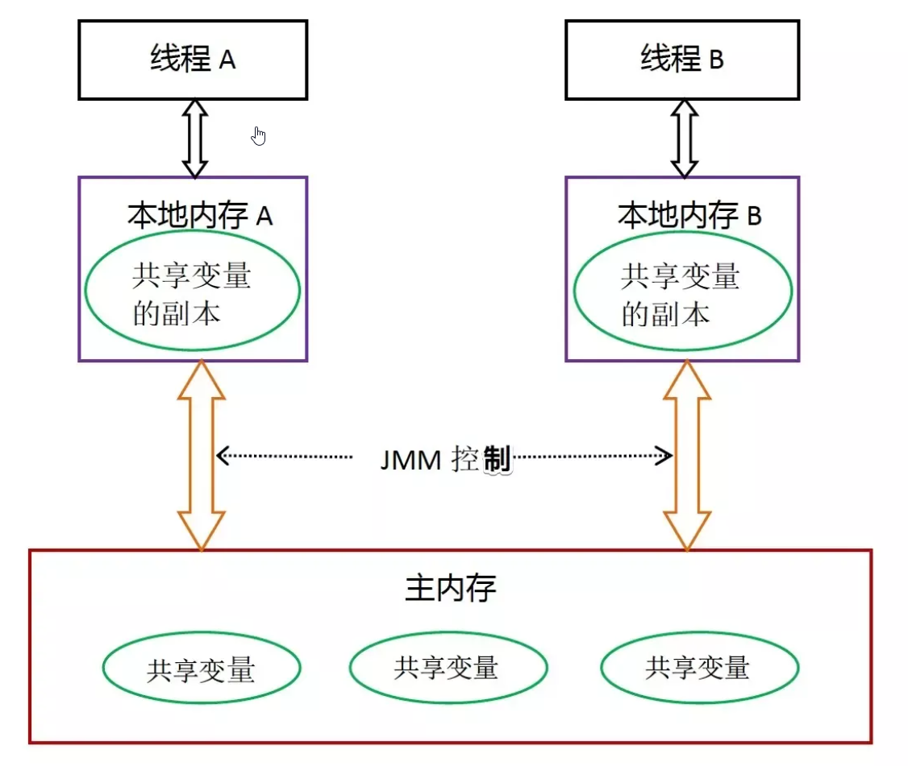
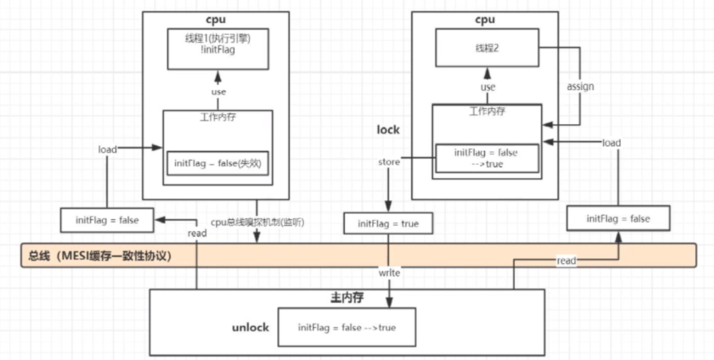

## synchronized关键字

### 什么是synchronized关键字 ？

在多线程的环境下，多个线程同时访问共享资源会出现一些问题，而synchronized关键字则是用来保证线程同步的 。

Synchronized 是由 JVM 实现的一种实现互斥同步的一种方式，如果你查看被 Synchronized 修饰过的程序块编译后的字节码，会发现，被 Synchronized 修饰过的程序块，在编译前后被编译器生成了 monitorenter 和 monitorexit 两个字节码指令。

这两个指令是什么意思呢？

- 在虚拟机执行到 monitorenter 指令时，首先要尝试获取对象的锁：如果这个对象没有锁定，或者当前线程已经拥有了这个对象的锁，把锁的计数器 +1；当执行 monitorexit 指令时将锁计数器 -1；当计数器为 0 时，锁就被释放了。如果获取对象失败了，那当前线程就要阻塞等待，直到对象锁被另外一个线程释放为止。Java 中 Synchronize 通过在对象头设置标记，达到了获取锁和释放锁的目的。

### 这个“锁”到底是什么？如何确定对象的锁？

“锁”的本质其实是 monitorenter 和 monitorexit 字节码指令的一个 Reference 类型的参数，即要锁定和解锁的对象。我们知道，使用Synchronized 可以修饰不同的对象，因此，对应的对象锁可以这么确定。

1. 如果 Synchronized 明确指定了锁对象，比如 Synchronized（变量名）、Synchronized(this) 等，说明加解锁对象为该对象。
2. 如果没有明确指定：
    1. 若 Synchronized 修饰的方法为非静态方法，表示此方法对应的对象为锁对象；
    2. 若 Synchronized 修饰的方法为静态方法，则表示此方法对应的类对象为锁对象。

> 注意，当一个对象被锁住时，对象里面所有用 Synchronized 修饰的方法都将产生堵塞，而对象里非 Synchronized 修饰的方法可正常被调用，不受锁影响。

### 如果同步块内的线程抛出异常会发生什么？

synchronized方法正常返回或者抛异常而终止，JVM会自动释放对象锁

## Java内存的可见性问题

在了解synchronized关键字的底层原理前，需要先简单了解下Java的内存模型，看看synchronized关键字是如何起作用的。

**JMM内存总体结构**



**JMM内存更新操作**



这里的本地内存并不是真实存在的，只是Java内存模型的一个抽象概念，它包含了控制器、运算器、缓存等。同时Java内存模型规定，线程对共享变量的操作必须在自己的本地内存【工作内存】中进行，不能直接在主内存中操作共享变量。这种内存模型会出现什么问题呢？

1. 线程A获取到共享变量X的值，此时本地内存A中没有X的值，所以加载主内存中的X值并缓存到本地内存A中，线程A修改X的值为1，并将X的值刷新到主内存中，这时主内存及本地内存中的X的值都为1。

2. 线程B需要获取共享变量X的值，此时本地内存B中没有X的值，加载主内存中的X值并缓存到本地内存B中，此时X的值为1。线程B修改X的值为2，并刷新到主内存中，此时主内存及本地内存B中的X值为2，本地内存A中的X值为1。

1. 线程A再次获取共享变量X的值，此时本地内存中存在X的值，所以直接从本地内存中A获取到了X为1的值，但此时主内存中X的值为2，到此出现了所谓内存不可见的问题。

该问题Java内存模型是通过synchronized关键字和volatile关键字就可以解决，那么synchronized关键字是如何解决的呢，其实进入synchronized块就是把在synchronized块内使用到的变量从线程的本地内存中擦除，这样在synchronized块中再次使用到该变量就不能从本地内存中获取了，需要从主内存中获取，解决了内存不可见问题 。

## synchronized关键字三大特性是什么？

> 面试时经常拿synchronized关键字和volatile关键字的特性进行对比，synchronized关键字可以保证并发编程的三大特性：原子性、可见性、有序性，而volatile关键字只能保证可见性和有序性，不能保证原子性，也称为是轻量级的synchronized

- 原子性：一个或多个操作要么全部执行成功，要么全部执行失败。synchronized关键字可以保证只有一个线程拿到锁，访问共享资源。
- 可见性：当一个线程对共享变量进行修改后，其他线程可以立刻看到。执行synchronized时，会对应执行 lock 、unlock原子操作，保证可见性。
- 有序性：程序的执行顺序会按照代码的先后顺序执行。

### synchronized关键字可以实现什么类型的锁？

- 悲观锁：synchronized关键字实现的是悲观锁，每次访问共享资源时都会上锁。
- 非公平锁：synchronized关键字实现的是非公平锁，即线程获取锁的顺序并不一定是按照线程阻塞的顺序。
- 可重入锁：synchronized关键字实现的是可重入锁，即已经获取锁的线程可以再次获取锁。
- 独占锁或者排他锁：synchronized关键字实现的是独占锁，即该锁只能被一个线程所持有，其他线程均被阻塞。

### synchronized关键字的使用方式

synchronized主要有三种使用方式：修饰普通同步方法、修饰静态同步方法、修饰同步方法块。

**修饰普通同步方法（实例方法）**

```java
class syncTest implements Runnable {
    private static int i = 0; //共享资源
    private synchronized void add() {
        i++;
    }
    @Override
    public void run() {
        for (int j = 0; j < 10000; j++) {
            add();
        }
    }
    public static void main(String[] args) throws Exception {
        syncTest syncTest = new syncTest();
        Thread t1 = new Thread(syncTest);
        Thread t2 = new Thread(syncTest);
        t1.start();
        t2.start();
        t1.join();
        t2.join();
        System.out.println(i);
    }
}
```

这是一个非常经典的例子，多个线程操作 i++ 会出现线程不安全问题，这段代码的结果很容易得到 ,结果是2000。

大家可以再看看这段代码，猜一猜它的运行结果 ：

```java
class syncTest implements Runnable {
    private static int i = 0; //共享资源
    private synchronized void add() {
        i++;
    }
    @Override
    public void run() {
        for (int j = 0; j < 10000; j++) {
            add();
        }
    }
    public static void main(String[] args) throws Exception {
        // syncTest syncTest = new syncTest();
        Thread t1 = new Thread(new syncTest());
        Thread t2 = new Thread(new syncTest());
        t1.start();
        t2.start();
        t1.join();
        t2.join();
        System.out.println(i);
    }
}
//结果不确定
```

第二个示例中的 add() 方法虽然也使用synchronized关键字修饰了，但是因为两次 new syncTest() 操作建立的是两个不同的对象，也就是说存在两个不同的对象锁，线程t1和t2使用的是不同的对象锁，所以不能保证线程安全。那这种情况应该如何解决呢？因为每次创建的实例对象都是不同的，而类对象却只有一个，如果synchronized关键字作用于类对象，即用synchronized修饰静态方法，问题则迎刃而解。

**修饰静态方法**

只需要在 add() 方法前用static修饰即可，即当synchronized作用于静态方法，锁就是当前的class对象。

```java
class syncTest implements Runnable {
    private static int i = 0; //共享资源
    private static synchronized void add() {//锁住的是类的方法
        i++;
    }
    @Override
    public void run() {
        for (int j = 0; j < 10000; j++) {
            add();
        }
    }
    public static void main(String[] args) throws Exception {
        // syncTest syncTest = new syncTest();
        Thread t1 = new Thread(new syncTest());
        Thread t2 = new Thread(new syncTest());
        t1.start();
        t2.start();
        t1.join();
        t2.join();
        System.out.println(i);
    }
}
//结果是2000
```

**修饰代码块**

如果某些情况下，整个方法体比较大，需要同步的代码只是一小部分，如果直接对整个方法体进行同步，会使得代码性能变差，这时只需要对一小部分代码进行同步即可。代码如下：

```java
class syncTest implements Runnable {
    static int i = 0; //共享资源
    @Override
    public void run() {
        //其他操作.......
        synchronized (this){ //this表示当前对象实例，这里还可以使用syncTest.class，表示class对象锁
            for (int j = 0; j < 10000; j++) {
                i++;
            }
        }
    }
    public static void main(String[] args) throws Exception {
        syncTest syncTest = new syncTest();
        Thread t1 = new Thread(syncTest);
        Thread t2 = new Thread(syncTest);
        t1.start();
        t2.start();
        t1.join();
        t2.join();
        System.out.println(i);
    }
}
//结果
2000
```

### synchronized底层原理

> 这个问题也是面试比较高频的一个问题，也是比较难理解的，理解synchronized需要一定的Java虚拟机的知识

在jdk1.6之前，synchronized被称为重量锁，在jdk1.6中，为了减少获得锁和释放锁带来的性能开销，引入了偏向锁和轻量级锁。下面先介绍jdk1.6之前的synchronized原理。

#### 首先看一下java对象在内存中的布局结构:

```shell
|--------------------------------------------------------------------------------------------------|
|                            Object Header (对象头, 12-16 bytes)                                   |
|-----------------------------------|-------------------------------------------------------------|
|      Mark Word (8 bytes)          |   Klass Pointer (4-8 bytes)    |   Array Length (可选)        |
|-----------------------------------|-------------------------------|-----------------------------|
| 锁状态信息 | GC信息 | 哈希码 | 分代年龄 | 指向类元数据的指针  |  数组长度(仅数组对象)       |
|--------------------------------------------------------------------------------------------------|
|                           Instance Data (实例数据)                                               |
|--------------------------------------------------------------------------------------------------|
|                           Padding (对齐填充, 使对象大小为8字节的倍数)                           |
|--------------------------------------------------------------------------------------------------|
```

#### 对象头

在HotSpot虚拟机中，Java对象在内存中的布局大致可以分为三部分：**对象头、实例数据和填充对齐**。因为synchronized用的锁是存在对象头里的，所以我们需要重点了解对象头。如果对象头是数组类型，则对象头由Mark Word、Class MetadataAddress和Array length组成，如果对象头非数组类型，对象头则由Mark Word和Class MetadataAddress组成。在32位虚拟机中，数组类型的Java对象头的组成如下表：


这里我们需要重点掌握的是Mark Word。

#### Mark Word

在运行期间，Mark Word中存储的数据会随着锁标志位的变化而变化，在32位虚拟机中，不同状态下的组成如下：


**详细结构字段**

```shell
|--------------------------------------------------------------------------------------------------|
|                                   Mark Word (64 bits)                                           |
|--------------------------------------------------------------------------------------------------|
| 锁状态       |  25 bits          |   31 bits       |  1 bit   |  4 bits   |  1 bit   |  2 bits   |
|--------------------------------------------------------------------------------------------------|
| 无锁         | unused            |  hashCode       |  未使用  | 分代年龄  |  偏向锁  |   锁标志  |
|              |                   |                 |          |           |    0     |    01     |
|--------------------------------------------------------------------------------------------------|
| 偏向锁       |  Thread ID (54位) |   epoch         |  未使用  | 分代年龄  |  偏向锁  |   锁标志  |
|              |                   |                 |          |           |    1     |    01     |
|--------------------------------------------------------------------------------------------------|
| 轻量级锁     |           指向栈中锁记录的指针 (62 bits)                                            |
|              |                                                                                  |   00     |
|--------------------------------------------------------------------------------------------------|
| 重量级锁     |           指向互斥量（monitor）的指针 (62 bits)                                      |
|              |                                                                                  |   10     |
|--------------------------------------------------------------------------------------------------|
| GC标记       |                         空 (不需要记录信息)                                                |
|              |                                                                                  |   11     |
|--------------------------------------------------------------------------------------------------|
```

其中线程ID表示持有偏向锁线程的ID，Epoch表示偏向锁的时间戳，偏向锁和轻量级锁是在jdk1.6中引入的

**重量级锁的底部实现原理：Monitor**

在jdk1.6之前，synchronized只能实现重量级锁，Java虚拟机是基于Monitor对象来实现重量级锁的，所以首先来了解下Monitor，在Hotspot虚拟机中，Monitor是由ObjectMonitor实现的，其源码是用C++语言编写的 ,首先我们先下载Hotspot的源码，源码下载链接：http://hg.openjdk.java.net/jdk8/jdk8/hotspot，找到ObjectMonitor.hpp文件，路径是 src/share/vm/runtime/objectMonitor.hpp ，这里只是简单介绍下其数据结构 :


其中 `_owner`、`_WaitSet`和`_EntryList`字段比较重要，它们之间的转换关系如下图


从上图可以总结获取Monitor和释放Monitor的流程如下：

1. 当多个线程同时访问同步代码块时，首先会进入到EntryList中，然后通过CAS的方式尝试将Monitor中的owner字段设置为当前线程，同时count加1，
2. 若发现之前的owner的值就是指向当前线程的，recursions也需要加1。如果CAS尝试获取锁失败，则进入到EntryList中。 
3. 当获取锁的线程调用 wait() 方法，则会将owner设置为null，同时count减1，recursions减1，当前线程加入到WaitSet中，等待被唤醒 。 
4. 当前线程执行完同步代码块时，则会释放锁，count减1，recursions减1。当recursions的值为0时，说明线程已经释放了锁

> 之前提到过一个常见面试题，为什么 wait() 、 notify() 等方法要在同步方法或同步代码块中来执行呢，这里就能找到原因，是因为 wait() 、 notify() 方法需要借助ObjectMonitor对象内部方法来完成。

**synchronized作用于同步代码块的实现原理**

前面已经了解Monitor的实现细节，而Java虚拟机则是通过进入和退出Monitor对象来实现方法同步和代码块同步的。这里为了更方便看程序字节码执行指令，我先在IDEA中安装了一个 jclasslib Bytecodeviewer 插件。我们先来看这个synchronized作用于同步代码块的代码。

```java
public void run() {
    //其他操作.......
    synchronized (this){ //this表示当前对象实例，这里还可以使用syncTest.class，表
        示class对象锁
        for (int j = 0; j < 10000; j++) {
            i++;
        }
    }
}
```

查看字节码如下：

```java
1 dup
2 astore_1
3 monitorenter //进入同步代码块的指令
4 iconst_0
5 istore_2
6 iload_2
7 sipush 10000
10 if_icmpge 27 (+17)
13 getstatic #2 <com/company/syncTest.i>
16 iconst_1
17 iadd
18 putstatic #2 <com/company/syncTest.i>
21 iinc 2 by 1
24 goto 6 (-18)
27 aload_1
28 monitorexit //结束同步代码块的指令
29 goto 37 (+8)
32 astore_3
33 aload_1
34 monitorexit //遇到异常时执行的指令
35 aload_3
36 athrow
37 return
```

从上述字节码中可以看到同步代码块的实现是由monitorenter 和 monitorexit 指令完成的，其中monitorenter指令所在的位置是同步代码块开始的位置，第一个monitorexit 指令是用于正常结束同步代码块的指令，第二个monitorexit 指令是用于异常结束时所执行的释放Monitor指令。

**synchronized作用于同步方法原理**

```java
private synchronized void add() {
    i++;
}
```

查看字节码：

```java
0 getstatic #2 <com/company/syncTest.i>
3 iconst_1
4 iadd
5 putstatic #2 <com/company/syncTest.i>
8 return
```

发现这个没有monitorenter 和 monitorexit 这两个指令了，而在查看该方法的class文件的结构信息时发现了Access flags后边的synchronized标识，该标识表明了该方法是一个同步方法。Java虚拟机通过该标识可以来辨别一个方法是否为同步方法，如果有该标识，线程将持有Monitor，在执行方法，最后释放Monitor。


> 原理大概就是这样，最后总结一下，面试中应该简洁地如何回答synchroized的底层原理这个问题。
>
> 答：Java虚拟机是通过进入和退出Monitor对象来实现代码块同步和方法同步的，代码块同步使用的是monitorenter 和 monitorexit 指令实现的，而方法同步是通过Access flags后面的标识来确定该方法是否为同步方法。

## Jdk1.6为什么要对synchronized进行优化？

因为Java虚拟机是通过进入和退出Monitor对象来实现代码块同步和方法同步的，而Monitor是依靠底层操作系统的Mutex Lock来实现的，操作系统实现线程之间的切换需要从用户态转换到内核态，这个切换成本比较高，对性能影响较大。

### jDK1.6对synchronized做了哪些优化？

在 Java 6 之前，Monitor 的实现完全依赖底层操作系统的互斥锁来实现，也就是我们刚才在问题二中所阐述的获取/释放锁的逻辑。由于 Java 层面的线程与操作系统的原生线程有映射关系，如果要将一个线程进行阻塞或唤起都需要操作系统的协助，这就需要从用户态切换到内核态来执行，这种切换代价十分昂贵，很耗处理器时间，现代 JDK 中做了大量的优化。

**锁的升级**

在JDK1.6中，为了减少获得锁和释放锁带来的性能消耗，引入了偏向锁和轻量级锁，锁的状态变成了四种，无锁状态，偏向锁状态、轻量级锁状态和重量级锁状态。锁的状态会随着竞争激烈逐渐升级，但通常情况下，锁的状态只能升级不能降级。

锁升级过程:

```shell
┌─────────────┐    第一次访问      ┌─────────────┐    有竞争         ┌─────────────┐    竞争加剧
│   无锁状态   │ ────────────────> │   偏向锁     │ ───────────────> │  轻量级锁    │ ──────────────> 
│   (01)      │                   │   (01)      │                  │   (00)      │                  
└─────────────┘                   └─────────────┘                  └─────────────┘                  
                                                                            │                        
                                                                            │ 自旋失败或竞争激烈      
                                                                            ▼                        
                                                                      ┌─────────────┐               
                                                                      │  重量级锁    │               
                                                                      │   (10)      │               
                                                                      └─────────────┘               
```

另一种优化是使用自旋锁，即在把线程进行阻塞操作之前先让线程自旋等待一段时间，可能在等待期间其他线程已经解锁，这时就无需再让线程执行阻塞操作，避免了用户态到内核态的切换。

现代 JDK 中还提供了四种不同的 Monitor 实现，也就是四种不同的锁：

- 无锁状态
- 偏向锁（Biased Locking）
- 轻量级锁
- 重量级锁

这四种锁使得 JDK 得以优化 Synchronized 的运行，当 JVM 检测到不同的竞争状况时，会自动切换到适合的锁实现，这就是锁的升级、降级。

- 当没有竞争出现时，默认会使用偏向锁。JVM 会利用 CAS 操作，在对象头上的 Mark Word 部分设置线程 ID，以表示这个对象偏向于当前线程，所以并不涉及真正的互斥锁，因为在很多应用场景中，大部分对象生命周期中最多会被一个线程锁定，使用偏斜锁可以降低无竞争开销。
- 如果有另一线程试图锁定某个被偏斜过的对象，JVM 就撤销偏斜锁，切换到轻量级锁实现。
- 轻量级锁依赖 CAS 操作 Mark Word 来试图获取锁，如果重试成功，就使用普通的轻量级锁；否则，进一步升级为重量级锁。

下面详细介绍锁升级的每一个过程:

### 偏向锁（Biased Locking）

```java
public class BiasedLockExample {
    private static final Object lock = new Object();
    
    public void biasedLockMethod() {
        // 第一个访问的线程会将对象头中的Thread ID设为自己的ID
        // 以后这个线程访问时，直接检查Thread ID是否匹配
        synchronized(lock) {
            // 同步代码块
        }
    }
}
```

偏向锁的获取流程：

1. 检查对象头中的锁标志位和偏向锁标志 
2. 如果为无锁状态（01），通过CAS将对象头中的Thread ID设为当前线程ID 
3. 如果已经是偏向锁，检查Thread ID是否匹配当前线程 
   - 匹配：直接进入同步代码块 
   - 不匹配：检查原持有线程是否存活 
     - 不存活：撤销偏向锁，重新偏向 
     - 存活：升级为轻量级锁

### 轻量级锁（Lightweight Lock）

```java
public class LightweightLockExample {
    public void lightweightLockMethod() {
        Object obj = new Object();
        synchronized(obj) {
            // 线程在自己的栈帧中创建Lock Record
            // 将对象头的Mark Word复制到Lock Record（Displaced Mark Word）
            // 然后通过CAS将对象头指向Lock Record
            // 如果成功，获得锁；如果失败，自旋尝试
        }
    }
}
```

轻量级锁的获取流程：

```java
线程栈帧
┌─────────────────┐
│   Lock Record   │
│  Displaced MW   │ ← 复制对象头的Mark Word
│  Owner指针      │ ← 指向锁对象
└─────────────────┘
         │
         │ CAS操作
         ▼
对象头(Mark Word)
┌─────────────────┐
│ 指向Lock Record │ ← 替换为指向线程栈中Lock Record的指针
│ 锁标志位: 00    │
└─────────────────┘
```

### 重量级锁（Heavyweight Lock）

```java
public class HeavyweightLockExample {
    private final Object lock = new Object();
    
    public void heavyweightLockMethod() {
        synchronized(lock) {
            // 竞争激烈时，锁升级为重量级锁
            // 线程进入等待队列，进行系统调用
            // 涉及用户态到内核态的切换
        }
    }
}
```

Monitor 对象结构：

```java
typedef struct {
    void* volatile _object;           // 关联的Java对象
    void* volatile _owner;            // 拥有锁的线程
    volatile intptr_t _recursions;    // 重入次数
    ObjectWaiter* volatile _cxq;      // 竞争队列（Contention Queue）
    ObjectWaiter* volatile _EntryList;// 入口队列
    ObjectWaiter* volatile _WaitSet;  // 等待队列（调用wait()的线程）
    volatile int _waiters;            // 等待线程数
    volatile int _count;              // 计数器
} ObjectMonitor;
```

### 锁的优化技术

#### 自旋锁（Spin Lock）

```java
// HotSpot 自旋锁实现伪代码
void ObjectSynchronizer::SpinLock() {
    int max_spin = 10;  // 最大自旋次数（可自适应调整）
    for (int i = 0; i < max_spin; i++) {
        if (尝试获取锁()) {
            return;  // 获取成功
        }
        // 使用CPU暂停指令减少能耗
        __asm__ volatile ("pause" ::: "memory");
    }
    // 自旋失败，升级为重量级锁
    inflate_and_block();
}
```

#### 自适应自旋（Adaptive Spinning）

```shell
// JVM 会根据历史成功率动态调整自旋次数
// 1. 如果最近自旋经常成功，增加自旋次数
// 2. 如果最近自旋经常失败，减少或跳过自旋
```

#### 锁消除（Lock Elimination）

```java
public class LockElimination {
    // JIT 编译器通过逃逸分析发现stringBuffer没有逃逸出方法
    // 会自动消除锁操作
    public String concat(String s1, String s2, String s3) {
        StringBuffer sb = new StringBuffer();
        sb.append(s1);  // 这里的synchronized会被消除
        sb.append(s2);
        sb.append(s3);
        return sb.toString();
    }
}
```
#### 锁粗化（Lock Coarsening）

```java
public class LockCoarsening {
    public void method() {
        // JIT 编译器会将连续的锁操作合并
        synchronized (this) {
            // 操作1
        }
        // 这里本来应该释放锁
        synchronized (this) {
            // 操作2
        }
        // 优化后变为：
        // synchronized (this) {
        //     // 操作1
        //     // 操作2
        // }
    }
}
```

### synchronized 的性能分析


| 锁状态       | 获取/释放开销 | 适用场景         | 备注               |
| :----------- | :------------ | :--------------- | :----------------- |
| **无锁**     | 无            | 单线程访问       | 无同步             |
| **偏向锁**   | ≈20ns         | 只有一个线程访问 | CAS设置Thread ID   |
| **轻量级锁** | ≈50ns         | 多线程交替访问   | 自旋+CAS           |
| **重量级锁** | ≈1-10μs       | 高并发竞争       | 系统调用，线程阻塞 |

### 与 ReentrantLock 的对比

| 特性         | synchronized        | ReentrantLock                     |
| :----------- | :------------------ | :-------------------------------- |
| **实现方式** | JVM 内置            | Java 代码实现                     |
| **锁获取**   | 自动获取释放        | 手动 lock/unlock                  |
| **灵活性**   | 较低                | 较高（可中断、超时、公平锁）      |
| **性能**     | JDK 1.6+ 优化后相当 | 相当                              |
| **条件变量** | 一个（wait/notify） | 多个（Condition）                 |
| **锁降级**   | 不支持              | 支持                              |
| **实现原理** | 对象头Mark Word     | AQS（AbstractQueuedSynchronizer） |

### 重要的JVM参数

```shell
# 偏向锁相关
-XX:+UseBiasedLocking          # 启用偏向锁（JDK 15后默认禁用）
-XX:BiasedLockingStartupDelay=0 # 偏向锁启动延迟（毫秒）
-XX:BiasedLockingBulkRebiasThreshold=20  # 批量重偏向阈值

# 自旋锁相关
-XX:+UseSpinning               # 启用自旋锁
-XX:PreBlockSpin=10            # 自旋次数（JDK 1.7后自适应）
-XX:+UseAdaptiveSpinning       # 启用自适应自旋

# 锁消除
-XX:+EliminateLocks            # 启用锁消除
-XX:+DoEscapeAnalysis          # 启用逃逸分析

# 其他
-XX:-UseHeavyMonitors          # 禁用重量级锁（某些场景）
-XX:LockSpinTime=1000          # 自旋时间（纳秒）
```

synchronized 锁的底层原理是一个复杂的优化体系：

1. 对象头 Mark Word 存储锁状态 
2. 锁升级机制：无锁 → 偏向锁 → 轻量级锁 → 重量级锁 
3. 多种优化技术：自旋锁、锁消除、锁粗化、适应性自旋 
4. JVM 参数调优可以显著影响性能


## 为什么说 Synchronized 是非公平锁？

非公平主要表现在获取锁的行为上，并非是按照申请锁的时间前后给等待线程分配锁的，每当锁被释放后，任何一个线程都有机会竞争到锁，这样做的目的是为了提高执行性能，缺点是可能会产生线程饥饿现象。

## 什么是锁消除和锁粗化？

- 锁消除：指虚拟机即时编译器在运行时，对一些代码上要求同步，但被检测到不可能存在共享数据竞争的锁进行消除。主要根据逃逸分析。程序员怎么会在明知道不存在数据竞争的情况下使用同步呢？很多不是程序员自己加入的。
- 锁粗化：原则上，同步块的作用范围要尽量小。但是如果一系列的连续操作都对同一个对象反复加锁和解锁，甚至加锁操作在循环体内，频繁地进行互斥同步操作也会导致不必要的性能损耗。

> 锁粗化就是增大锁的作用域。

## 为什么说 Synchronized 是一个悲观锁？乐观锁的实现原理又是什么？什么是 CAS，它有什么特性？

Synchronized 显然是一个悲观锁，因为它的并发策略是悲观的：

- 不管是否会产生竞争，任何的数据操作都必须要加锁、用户态核心态转换、维护锁计数器和检查是否有被阻塞的线程需要被唤醒等操作。

随着硬件指令集的发展，我们可以使用基于冲突检测的乐观并发策略。先进行操作，如果没有其他线程征用数据，那操作就成功了；如果共享数据有征用，产生了冲突，那就再进行其他的补偿措施。这种乐观的并发策略的许多实现不需要线程挂起，所以被称为非阻塞同步。

- 乐观锁的核心算法是 CAS（Compareand Swap，比较并交换），它涉及到三个操作数：内存值、预期值、新值。当且仅当预期值和内存值相等时才将内存值修改为新值。
- 这样处理的逻辑是，首先检查某块内存的值是否跟之前我读取时的一样，如不一样则表示期间此内存值已经被别的线程更改过，舍弃本次操作，否则说明期间没有其他线程对此内存值操作，可以把新值设置给此块内存。

CAS 具有原子性，它的原子性由 CPU 硬件指令实现保证，即使用 JNI 调用 Native 方法调用由 C++ 编写的硬件级别指令，JDK 中提供了 Unsafe 类执行这些操作。

## 乐观锁一定就是好的吗？

乐观锁避免了悲观锁独占对象的现象，同时也提高了并发性能，但它也有缺点：

1. 乐观锁只能保证一个共享变量的原子操作。如果多一个或几个变量，乐观锁将变得力不从心，但互斥锁能轻易解决，不管对象数量多少及对象颗粒度大小。
2. 长时间自旋可能导致开销大。假如 CAS 长时间不成功而一直自旋，会给 CPU 带来很大的开销。
3. ABA 问题。CAS 的核心思想是通过比对内存值与预期值是否一样而判断内存值是否被改过，但这个判断逻辑不严谨，假如内存值原来是 A，后来被一条线程改为 B，最后又被改成了 A，则 CAS 认为此内存值并没有发生改变，但实际上是有被其他线程改过的，这种情况对依赖过程值的情景的运算结果影响很大。解决的思路是引入版本号，每次变量更新都把版本号加一。

## Java中都有哪几种锁

- 乐观锁和悲观锁
- 独占锁和共享锁
- 互斥锁和读写锁
- 公平锁和非公平锁
- 可重入锁
- 自旋锁
- 分段锁
- 锁升级（无锁|偏向锁|轻量级锁|重量级锁）
- 锁优化技术（锁粗化、锁消除）

### 乐观锁和悲观锁

**悲观锁**

`悲观锁`对应于生活中悲观的人，悲观的人总是想着事情往坏的方向发展。

举个生活中的例子，假设厕所只有一个坑位了，悲观锁上厕所会第一时间把门反锁上，这样其他人上厕所只能在门外等候，这种状态就是「阻塞」了。

回到代码世界中，一个共享数据加了悲观锁，那线程每次想操作这个数据前都会假设其他线程也可能会操作这个数据，所以每次操作前都会上锁，这样其他线程想操作这个数据拿不到锁只能阻塞了。


在 Java 语言中 `synchronized` 和 `ReentrantLock`等就是典型的悲观锁，还有一些使用了 synchronized 关键字的容器类如 `HashTable` 等也是悲观锁的应用。

**乐观锁**

`乐观锁` 对应于生活中乐观的人，乐观的人总是想着事情往好的方向发展。

举个生活中的例子，假设厕所只有一个坑位了，乐观锁认为：这荒郊野外的，又没有什么人，不会有人抢我坑位的，每次关门上锁多浪费时间，还是不加锁好了。你看乐观锁就是天生乐观！

回到代码世界中，乐观锁操作数据时不会上锁，在更新的时候会判断一下在此期间是否有其他线程去更新这个数据。


乐观锁可以使用`版本号机制`和`CAS算法`实现。在 Java 语言中 `java.util.concurrent.atomic`包下的原子类就是使用CAS 乐观锁实现的。

**两种锁的使用场景**

- 悲观锁和乐观锁没有孰优孰劣，有其各自适应的场景。
- 乐观锁适用于写比较少（冲突比较小）的场景，因为不用上锁、释放锁，省去了锁的开销，从而提升了吞吐量。
- 如果是写多读少的场景，即冲突比较严重，线程间竞争激励，使用乐观锁就是导致线程不断进行重试，这样可能还降低了性能，这种场景下使用悲观锁就比较合适。

### 独占锁和共享锁

**独占锁**

`独占锁`是指锁一次只能被一个线程所持有。如果一个线程对数据加上排他锁后，那么其他线程不能再对该数据加任何类型的锁。获得独占锁的线程即能读数据又能修改数据。


JDK中的`synchronized`和`java.util.concurrent(JUC)`包中Lock的实现类就是独占锁。

**共享锁**

`共享锁`是指锁可被多个线程所持有。如果一个线程对数据加上共享锁后，那么其他线程只能对数据再加共享锁，不能加独占锁。获得共享锁的线程只能读数据，不能修改数据。


在 JDK 中 `ReentrantReadWriteLock` 就是一种共享锁。

### 互斥锁和读写锁

**互斥锁**

`互斥锁`是独占锁的一种常规实现，是指某一资源同时只允许一个访问者对其进行访问，具有唯一性和排它性。


互斥锁一次只能一个线程拥有互斥锁，其他线程只有等待。

**读写锁**

`读写锁`是共享锁的一种具体实现。读写锁管理一组锁，一个是只读的锁，一个是写锁。

读锁可以在没有写锁的时候被多个线程同时持有，而写锁是独占的。写锁的优先级要高于读锁，一个获得了读锁的线程必须能看到前一个释放的写锁所更新的内容。

读写锁相比于互斥锁并发程度更高，每次只有一个写线程，但是同时可以有多个线程并发读。


在 JDK 中定义了一个读写锁的接口：`ReadWriteLock`,`ReentrantReadWriteLock` 实现了`ReadWriteLock`接口

### 公平锁和非公平锁

**公平锁**

`公平锁`是指多个线程按照申请锁的顺序来获取锁，这里类似排队买票，先来的人先买，后来的人在队尾排着，这是公平的。


在 java 中可以通过构造函数初始化公平锁

```
/**
* 创建一个可重入锁，true 表示公平锁，false 表示非公平锁。默认非公平锁
*/
Lock lock = new ReentrantLock(true);
```

**非公平锁**

`非公平锁`是指多个线程获取锁的顺序并不是按照申请锁的顺序，有可能后申请的线程比先申请的线程优先获取锁，在高并发环境下，有可能造成优先级翻转，或者饥饿的状态（某个线程一直得不到锁）。


在 java 中 synchronized 关键字是非公平锁，ReentrantLock默认也是非公平锁。

```
/**
* 创建一个可重入锁，true 表示公平锁，false 表示非公平锁。默认非公平锁
*/
Lock lock = new ReentrantLock(false);
```

### 可重入锁

`可重入锁`又称之为`递归锁`，是指同一个线程在外层方法获取了锁，在进入内层方法会自动获取锁。


对于Java ReentrantLock而言, 他的名字就可以看出是一个可重入锁。对于Synchronized而言，也是一个可重入锁。

可重入锁的一个好处是可一定程度避免死锁。

以 synchronized 为例，看一下下面的代码：

```java
public synchronized void mehtodA() throws Exception{
 // Do some magic tings
 mehtodB();
}

public synchronized void mehtodB() throws Exception{
 // Do some magic tings
}
```

上面的代码中 methodA 调用 methodB，如果一个线程调用methodA 已经获取了锁再去调用 methodB 就不需要再次获取锁了，这就是可重入锁的特性。如果不是可重入锁的话，mehtodB 可能不会被当前线程执行，可能造成死锁。

### 自旋锁

`自旋锁`是指线程在没有获得锁时不是被直接挂起，而是执行一个忙循环，这个忙循环就是所谓的自旋。


自旋锁的目的是为了减少线程被挂起的几率，因为线程的挂起和唤醒也都是耗资源的操作。

如果锁被另一个线程占用的时间比较长，即使自旋了之后当前线程还是会被挂起，忙循环就会变成浪费系统资源的操作，反而降低了整体性能。因此自旋锁是不适应锁占用时间长的并发情况的。

在 Java 中，`AtomicInteger` 类有自旋的操作，我们看一下代码：

```java
public final int getAndAddInt(Object o, long offset, int delta) {
    int v;
    do {
        v = getIntVolatile(o, offset);
    } while (!compareAndSwapInt(o, offset, v, v + delta));
    return v;
}
```

CAS 操作如果失败就会一直循环获取当前 value 值然后重试。

另外自适应自旋锁也需要了解一下。

在JDK1.6又引入了自适应自旋，这个就比较智能了，自旋时间不再固定，由前一次在同一个锁上的自旋时间以及锁的拥有者的状态来决定。如果虚拟机认为这次自旋也很有可能再次成功那就会次序较多的时间，如果自旋很少成功，那以后可能就直接省略掉自旋过程，避免浪费处理器资源。

### 分段锁

`分段锁` 是一种锁的设计，并不是具体的一种锁。分段锁设计目的是将锁的粒度进一步细化，当操作不需要更新整个数组的时候，就仅仅针对数组中的一项进行加锁操作。

在 Java 语言中 CurrentHashMap 底层就用了分段锁，使用Segment，就可以进行并发使用了。

### 锁升级（无锁|偏向锁|轻量级锁|重量级锁）

JDK1.6 为了提升性能减少获得锁和释放锁所带来的消耗，引入了4种锁的状态：`无锁`、`偏向锁`、`轻量级锁`和`重量级锁`，它会随着多线程的竞争情况逐渐升级，但不能降级。

**无锁**

`无锁`状态其实就是上面讲的乐观锁，这里不再赘述。

**偏向锁**

Java偏向锁(Biased Locking)是指它会偏向于第一个访问锁的线程，如果在运行过程中，只有一个线程访问加锁的资源，不存在多线程竞争的情况，那么线程是不需要重复获取锁的，这种情况下，就会给线程加一个偏向锁。

偏向锁的实现是通过控制对象`Mark Word`的标志位来实现的，如果当前是`可偏向状态`，需要进一步判断对象头存储的线程 ID 是否与当前线程 ID 一致，如果一致直接进入。

**轻量级锁**

当线程竞争变得比较激烈时，偏向锁就会升级为`轻量级锁`，轻量级锁认为虽然竞争是存在的，但是理想情况下竞争的程度很低，通过`自旋方式`等待上一个线程释放锁。

**重量级锁**

如果线程并发进一步加剧，线程的自旋超过了一定次数，或者一个线程持有锁，一个线程在自旋，又来了第三个线程访问时（反正就是竞争继续加大了），轻量级锁就会膨胀为`重量级锁`，重量级锁会使除了此时拥有锁的线程以外的线程都阻塞。

升级到重量级锁其实就是互斥锁了，一个线程拿到锁，其余线程都会处于阻塞等待状态。

在 Java 中，synchronized 关键字内部实现原理就是锁升级的过程：无锁 --> 偏向锁 --> 轻量级锁 --> 重量级锁。这一过程在后续讲解 synchronized 关键字的原理时会详细介绍。

### 锁优化技术（锁粗化、锁消除）

**锁粗化**

`锁粗化`就是将多个同步块的数量减少，并将单个同步块的作用范围扩大，本质上就是将多次上锁、解锁的请求合并为一次同步请求。

举个例子，一个循环体中有一个代码同步块，每次循环都会执行加锁解锁操作。

```java
private static final Object LOCK = new Object();

for(int i = 0;i < 100; i++) {
    synchronized(LOCK){
        // do some magic things
    }
}
```

经过`锁粗化`后就变成下面这个样子了：

```java
 synchronized(LOCK){
     for(int i = 0;i < 100; i++) {
        // do some magic things
    }
}
```

**锁消除**

`锁消除`是指虚拟机编译器在运行时检测到了共享数据没有竞争的锁，从而将这些锁进行消除。

举个例子让大家更好理解。

```java
public String test(String s1, String s2){
    StringBuffer stringBuffer = new StringBuffer();
    stringBuffer.append(s1);
    stringBuffer.append(s2);
    return stringBuffer.toString();
}
```

上面代码中有一个 test 方法，主要作用是将字符串 s1 和字符串 s2 串联起来。

test 方法中三个变量s1, s2, stringBuffer， 它们都是局部变量，局部变量是在栈上的，栈是线程私有的，所以就算有多个线程访问 test 方法也是线程安全的。

我们都知道 StringBuffer 是线程安全的类，append 方法是同步方法，但是 test 方法本来就是线程安全的，为了提升效率，虚拟机帮我们消除了这些同步锁，这个过程就被称为`锁消除`。

```java
StringBuffer.class

// append 是同步方法
public synchronized StringBuffer append(String str) {
    toStringCache = null;
    super.append(str);
    return this;
}
```

**总结**


## 重入锁 ReentrantLock 及其他显式锁相关问题

### 跟 Synchronized 相比，可重入锁 ReentrantLock 其实现原理有什么不同？

其实，锁的实现原理基本是为了达到一个目的：**让所有的线程都能看到某种标记。**

- Synchronized 通过在对象头中设置标记实现了这一目的，是一种 JVM 原生的锁实现方式，而 ReentrantLock 以及所有的基于 Lock 接口的实现类，都是通过用一个 volitile 修饰的 int 型变量，并保证每个线程都能拥有对该 int 的可见性和原子修改，其本质是基于所谓的 AQS 框架。

### 那么请谈谈 AQS 框架是怎么回事儿？

> AQS（AbstractQueuedSynchronizer 类）是一个用来构建锁和同步器的框架，各种 Lock 包中的锁（常用的有 ReentrantLock、ReadWriteLock），以及其他如 Semaphore、CountDownLatch，甚至是早期的 FutureTask 等，都是基于 AQS 来构建。

1. AQS 在内部定义了一个 volatile int state 变量，表示同步状态：当线程调用 lock 方法时 ，如果 state=0，说明没有任何线程占有共享资源的锁，可以获得锁并将 state=1；如果 state=1，则说明有线程目前正在使用共享变量，其他线程必须加入同步队列进行等待。
2. AQS 通过 Node 内部类构成的一个双向链表结构的同步队列，来完成线程获取锁的排队工作，当有线程获取锁失败后，就被添加到队列末尾。
    1. Node 类是对要访问同步代码的线程的封装，包含了线程本身及其状态叫 waitStatus（有五种不同 取值，分别表示是否被阻塞，是否等待唤醒，是否已经被取消等），每个 Node 结点关联其 prev 结点和 next 结点，方便线程释放锁后快速唤醒下一个在等待的线程，是一个 FIFO 的过程。
    2. Node 类有两个常量，SHARED 和 EXCLUSIVE，分别代表共享模式和独占模式。所谓共享模式是一个锁允许多条线程同时操作（信号量 Semaphore 就是基于 AQS 的共享模式实现的），独占模式是同一个时间段只能有一个线程对共享资源进行操作，多余的请求线程需要排队等待（如 ReentranLock）。
3. AQS 通过内部类 ConditionObject 构建等待队列（可有多个），当 Condition 调用 wait() 方法后，线程将会加入等待队列中，而当Condition 调用 signal() 方法后，线程将从等待队列转移动同步队列中进行锁竞争。
4. AQS 和 Condition 各自维护了不同的队列，在使用 Lock 和 Condition 的时候，其实就是两个队列的互相移动。


## 请尽可能详尽地对比下 Synchronized 和 ReentrantLock 的异同。

ReentrantLock 是 Lock 的实现类，是一个互斥的同步锁。从功能角度，ReentrantLock 比 Synchronized 的同步操作更精细（因为可以像普通对象一样使用），甚至实现 Synchronized 没有的高级功能，如：

- 等待可中断：当持有锁的线程长期不释放锁的时候，正在等待的线程可以选择放弃等待，对处理执行时间非常长的同步块很有用。
- 带超时的获取锁尝试：在指定的时间范围内获取锁，如果时间到了仍然无法获取则返回。
- 可以判断是否有线程在排队等待获取锁。
- 可以响应中断请求：与 Synchronized 不同，当获取到锁的线程被中断时，能够响应中断，中断异常将会被抛出，同时锁会被释放。
- 可以实现公平锁。从锁释放角度，Synchronized 在 JVM 层面上实现的，不但可以通过一些监控工具监控 Synchronized 的锁定，而且在代码执行出现异常时，JVM 会自动释放锁定；但是使用 Lock 则不行，Lock 是通过代码实现的，要保证锁一定会被释放，就必须将 unLock() 放到 finally{} 中。从性能角度，Synchronized 早期实现比较低效，对比 ReentrantLock，大多数场景性能都相差较大。
- 但是在 Java 6 中对其进行了非常多的改进，在竞争不激烈时，Synchronized 的性能要优于 ReetrantLock；在高竞争情况下，Synchronized 的性能会下降几十倍，但是 ReetrantLock 的性能能维持常态。

## ReentrantLock 是如何实现可重入性的？

ReentrantLock 内部自定义了同步器 Sync（Sync 既实现了 AQS，又实现了 AOS，而 AOS 提供了一种互斥锁持有的方式），其实就是加锁的时候通过 CAS 算法，将线程对象放到一个双向链表中，每次获取锁的时候，看下当前维护的那个线程 ID 和当前请求的线程 ID 是否一样，一样就可重入了。

## 除了 ReetrantLock，你还接触过 JUC 中的哪些并发工具？

通常所说的并发包（JUC）也就是 java.util.concurrent 及其子包，集中了 Java 并发的各种基础工具类，具体主要包括几个方面：

1. 提供了 CountDownLatch、CyclicBarrier、Semaphore 等，比 Synchronized 更加高级，可以实现更加丰富多线程操作的同步结构。
2. 提供了 ConcurrentHashMap、有序的 ConcunrrentSkipListMap，或者通过类似快照机制实现线程安全的动态数组 CopyOnWriteArrayList 等，各种线程安全的容器。
3. 提供了 ArrayBlockingQueue、SynchorousQueue 或针对特定场景的 PriorityBlockingQueue 等，各种并发队列实现。
4. 强大的 Executor 框架，可以创建各种不同类型的线程池，调度任务运行等。

## 请谈谈 ReadWriteLock 和 StampedLock。

虽然 ReentrantLock 和 Synchronized 简单实用，但是行为上有一定局限性，要么不占，要么独占。实际应用场景中，有时候不需要大量竞争的写操作，而是以并发读取为主，为了进一步优化并发操作的粒度，Java 提供了读写锁。

读写锁基于的原理是多个读操作不需要互斥，如果读锁试图锁定时，写锁是被某个线程持有，读锁将无法获得，而只好等待对方操作结束，这样就可以自动保证不会读取到有争议的数据。

读写锁看起来比 Synchronized 的粒度似乎细一些，但在实际应用中，其表现也并不尽如人意，主要还是因为相对比较大的开销。所以，JDK 在后期引入了 StampedLock，在提供类似读写锁的同时，还支持优化读模式。优化读基于假设，大多数情况下读操作并不会和写操作冲突，其逻辑是先试着修改，然后通过 validate 方法确认是否进入了写模式，如果没有进入，就成功避免了开销；如果进入，则尝试获取读锁。

## 如何让 Java 的线程彼此同步？你了解过哪些同步器？请分别介绍下

JUC 中的同步器三个主要的成员：CountDownLatch、CyclicBarrier 和 Semaphore，通过它们可以方便地实现很多线程之间协作的功能。

CountDownLatch 叫倒计数，允许一个或多个线程等待某些操作完成。看几个场景：

- 跑步比赛，裁判需要等到所有的运动员（“其他线程”）都跑到终点（达到目标），才能去算排名和颁奖。
- 模拟并发，我需要启动 100 个线程去同时访问某一个地址，我希望它们能同时并发，而不是一个一个的去执行。

用法：CountDownLatch 构造方法指明计数数量，被等待线程调用 countDown 将计数器减 1，等待线程使用 await 进行线程等待。

CyclicBarrier 叫循环栅栏，它实现让一组线程等待至某个状态之后再全部同时执行，而且当所有等待线程被释放后，CyclicBarrier 可以被重复使用。CyclicBarrier 的典型应用场景是用来等待并发线程结束。

- CyclicBarrier 的主要方法是 await()，await() 每被调用一次，计数便会减少 1，并阻塞住当前线程。当计数减至 0 时，阻塞解除，所有在此 CyclicBarrier 上面阻塞的线程开始运行。
- 在这之后，如果再次调用 await()，计数就又会变成 N-1，新一轮重新开始，这便是 Cyclic 的含义所在。CyclicBarrier.await() 带有返回值，用来表示当前线程是第几个到达这个 Barrier 的线程。

Semaphore，Java 版本的信号量实现，用于控制同时访问的线程个数，来达到限制通用资源访问的目的，其原理是通过 acquire() 获取一个许可，如果没有就等待，而 release() 释放一个许可。

- 如果 Semaphore 的数值被初始化为 1，那么一个线程就可以通过 acquire 进入互斥状态，本质上和互斥锁是非常相似的。但是区别也非常明显，比如互斥锁是有持有者的，而对于 Semaphore 这种计数器结构，虽然有类似功能，但其实不存在真正意义的持有者，除非我们进行扩展包装。

## CyclicBarrier 和 CountDownLatch 看起来很相似，请对比下

它们的行为有一定相似度，区别主要在于：

1. CountDownLatch 是不可以重置的，所以无法重用，CyclicBarrier 没有这种限制，可以重用。
2. CountDownLatch 的基本操作组合是 countDown/await，调用 await 的线程阻塞等待 countDown 足够的次数，不管你是在一个线程还是多个线程里 countDown，只要次数足够即可。 CyclicBarrier 的基本操作组合就是 await，当所有的伙伴都调用了 await，才会继续进行任务，并自动进行重置。
3. CountDownLatch 目的是让一个线程等待其他 N 个线程达到某个条件后，自己再去做某个事（通过 CyclicBarrier 的第二个构造方法 public CyclicBarrier(int parties, Runnable barrierAction)，在新线程里做事可以达到同样的效果）。而 CyclicBarrier 的目的是让 N 多线程互相等待直到所有的都达到某个状态，然后这 N 个线程再继续执行各自后续（通过 CountDownLatch 在某些场合也能完成类似的效果）。


## volatile

### 什么是 Java 的内存模型，Java 中各个线程是怎么彼此看到对方的变量的？

Java 的内存模型定义了程序中各个变量的访问规则，即在虚拟机中将变量存储到内存和从内存中取出这样的底层细节。 此处的变量包括实例字段、静态字段和构成数组对象的元素，但是不包括局部变量和方法参数，因为这些是线程私有的，不会被共享，所以不存在竞争问题。

Java 中各个线程是怎么彼此看到对方的变量的呢？Java 中定义了主内存与工作内存的概念：

- 所有的变量都存储在主内存，每条线程还有自己的工作内存，保存了被该线程使用到的变量的主内存副本拷贝。
- 线程对变量的所有操作（读取、赋值）都必须在工作内存中进行，不能直接读写主内存的变量。不同的线程之间也无法直接访问对方工作内存的变量，线程间变量值的传递需要通过主内存。

### 请谈谈 volatile 有什么特点，为什么它能保证变量对所有线程的可见性？

关键字 volatile 是 Java 虚拟机提供的最轻量级的同步机制。当一个变量被定义成 volatile 之后，具备两种特性：

1. 保证此变量对所有线程的可见性。当一条线程修改了这个变量的值，新值对于其他线程是可以立即得知的。而普通变量做不到这一点。
2. 禁止指令重排序优化。普通变量仅仅能保证在该方法执行过程中，得到正确结果，但是不保证程序代码的执行顺序。

Java 的内存模型定义了 8 种内存间操作：

**lock 和 unlock**

- 把一个变量标识为一条线程独占的状态。
- 把一个处于锁定状态的变量释放出来，释放之后的变量才能被其他线程锁定。

**read 和 write**

- 把一个变量值从主内存传输到线程的工作内存，以便 load。
- 把 store 操作从工作内存得到的变量的值，放入主内存的变量中。

**load 和 store**

- 把 read 操作从主内存得到的变量值放入工作内存的变量副本中。
- 把工作内存的变量值传送到主内存，以便 write。

**use 和 assgin**

- 把工作内存变量值传递给执行引擎。
- 将执行引擎值传递给工作内存变量值。

volatile 的实现基于这 8 种内存间操作，保证了一个线程对某个 volatile 变量的修改，一定会被另一个线程看见，即保证了可见性。

### 既然 volatile 能够保证线程间的变量可见性，是不是就意味着基于 volatile 变量的运算就是并发安全的？

显然不是的。基于 volatile 变量的运算在并发下不一定是安全的。volatile 变量在各个线程的工作内存，不存在一致性问题（各个线程的工作内存中 volatile 变量，每次使用前都要刷新到主内存）。但是 Java 里面的运算并非原子操作，导致 volatile 变量的运算在并发下一样是不安全的。

### 请对比下 volatile 对比 Synchronized 的异同。

- Synchronized 既能保证可见性，又能保证原子性，而 volatile 只能保证可见性，无法保证原子性。
- ThreadLocal 和 Synchonized 都用于解决多线程并发访问，防止任务在共享资源上产生冲突。但是 ThreadLocal 与 Synchronized 有本质的区别。
- Synchronized 用于实现同步机制，是利用锁的机制使变量或代码块在某一时该只能被一个线程访问，是一种 “以时间换空间” 的方式。而 ThreadLocal 为每一个线程都提供了变量的副本，使得每个线程在某一时间访问到的并不是同一个对象，根除了对变量的共享，是一种 “以空间换时间” 的方式。

## 请谈谈 ThreadLocal 是怎么解决并发安全的？

ThreadLocal 这是 Java 提供的一种保存线程私有信息的机制，因为其在整个线程生命周期内有效，所以可以方便地在一个线程关联的不同业务模块之间传递信息，比如事务 ID、Cookie 等上下文相关信息。

ThreadLocal 为每一个线程维护变量的副本，把共享数据的可见范围限制在同一个线程之内，其实现原理是，在 ThreadLocal 类中有一个 Map，用于存储每一个线程的变量的副本。

## 很多人都说要慎用 ThreadLocal，谈谈你的理解，使用 ThreadLocal 需要注意些什么？

使用 ThreadLocal 要注意 remove！

ThreadLocal 的实现是基于一个所谓的 ThreadLocalMap，在 ThreadLocalMap 中，它的 key 是一个弱引用。通常弱引用都会和引用队列配合清理机制使用，但是 ThreadLocal 是个例外，它并没有这么做。这意味着，废弃项目的回收依赖于显式地触发，否则就要等待线程结束，进而回收相应 ThreadLocalMap！这就是很多 OOM 的来源，所以通常都会建议，应用一定要自己负责 remove，并且不要和线程池配合，因为 worker 线程往往是不会退出的。

## volatile的作用是什么？

volatile 是一个轻量级的 synchronized ，一般作用与变量，在多处理器开发的过程中保证了内存的**可见性**。相比于 synchronized 关键字， volatile 关键字的执行成本更低，效率更高 。

## volatile的特性有哪些？

> 并发编程的三大特性为可见性、有序性和原子性。通常来讲 volatile 可以保证可见性和有序性

- 可见性： volatile 可以保证不同线程对共享变量进行操作时的可见性。即当一个线程修改了共享变量时，另一个线程可以读取到共享变量被修改后的值。
- 有序性： volatile 会通过禁止指令重排序进而保证有序性。
- 原子性：对于单个的 volatile 修饰的变量的读写是可以保证原子性的，但对于 i++ 这种复合操作并不能保证原子性。这句话的意思基本上就是说 volatile 不具备原子性了。

## Java内存的可见性问题

Java的内存模型如下图所示。


这里的本地内存并不是真实存在的，只是Java内存模型的一个抽象概念，它包含了控制器、运算器、缓 存等。同时Java内存模型规定，线程对共享变量的操作必须在自己的本地内存中进行，不能直接在主内 存中操作共享变量。这种内存模型会出现什么问题呢？

1. 线程A获取到共享变量X的值，此时本地内存A中没有X的值，所以加载主内存中的X值并缓存到本地内存A中，线程A修改X的值为1，并将X的值刷新到主内存中，这时主内存及本地内存A中的X的值都为1。
2. 线程B需要获取共享变量X的值，此时本地内存B中没有X的值，加载主内存中的X值并缓存到本地内存B中，此时X的值为1。线程B修改X的值为2，并刷新到主内存中，此时主内存及本地内存B中的X值为2，本地内存A中的X值为1。
3. 线程A再次获取共享变量X的值，此时本地内存中存在X的值，所以直接从本地内存中A获取到了X为1的值，但此时主内存中X的值为2，到此出现了所谓内存不可见的问题。该问题Java内存模型是通过 synchronized 关键字和 volatile 关键字就可以解决。

## 为什么代码会重排序？

计算机在执行程序的过程中，编译器和处理器通常会对指令进行重排序，这样做的目的是为了提高性能。具体可以看下面这个例子。

```java
int a = 1;
int b = 2;
int a1 = a;
int b1 = b;
int a2 = a + a;
int b2 = b + b;
```

像这段代码，不断地交替读取a和b，会导致寄存器频繁交替存储a和b，使得代码性能下降，可对其进入如下重排序:

```java
int a = 1;
int b = 2;
int a1 = a;
int a2 = a + a;
int b1 = b;
int b2 = b + b;
```

按照这样地顺序执行代码便可以避免交替读取a和b，这就是重排序地意义。

指令重排序一般分为**编译器优化重排、指令并行重拍和内存系统重排**三种。

- 编译器优化重排：编译器在不改变单线程程序语义的情况下，可以对语句的执行顺序进行重新排序。
- 指令并行重排：现代处理器多采用指令级并行技术来将多条指令重叠执行。对于不存在数据依赖的程序，处理器可以对机器指令的执行顺序进行重新排列。
- 内存系统重排：因为处理器使用缓存和读/写缓冲区，使得加载（load）和存储（store）看上去像是在乱序执行。

注：简单解释下数据依赖性：如果两个操作访问了同一个变量，并且这两个操作有一个是写操作，这两个操作之间就会存在数据依赖性，例如：

```
a = 1;
b = a;
```

如果对这两个操作的执行顺序进行重排序的话，那么结果就会出现问题。

> 其实，这三种指令重排说明了一个问题，就是指令重排在单线程下可以提高代码的性能，但在多线程下可以会出现一些问题  。

## 重排序会引发什么问题？

前面已经说过了，在单线程程序中，重排序并不会影响程序的运行结果，而在多线程场景下就不一定了。可以看下面这个经典的例子，该示例出自《Java并发编程的艺术》

```java
class ReorderExample{
    int a = 0;
    boolean flag = false;
    public void writer(){
        a = 1; // 操作1
        flag = true; // 操作2
    }
    public void reader(){
        if(flag){ // 操作3
            int i = a + a; // 操作4
        }
    }
}
```

假设线程1先执行 writer() 方法，随后线程2执行 reader() 方法，最后程序一定会得到正确的结果吗？

答案是不一定的，如果代码按照下图的执行顺序执行代码则会出现问题。


操作1和操作2进行了重排序，线程1先执行 flag=true ，然后线程2执行操作3和操作4，线程2执行操作4时不能正确读取到 a 的

值，导致最终程序运行结果出问题。这也说明了在多线程代码中，重排序会破坏多线程程序的语义

## as-if-serial规则和happens-before规则的区别

区别：

- as-if-serial定义：无论编译器和处理器如何进行重排序，单线程程序的执行结果不会改变。

- happens-before定义：一个操作happens-before另一个操作，表示第一个的操作结果对第二个操作可见，并且第一个操作的

  执行顺序也在第二个操作之前。但这并不意味着Java虚拟机必须按照这个顺序来执行程序。如果重排序的后的执行结果与按

  happens-before关系执行的结果一致，Java虚拟机也会允许重排序的发生。happens-before关系保证了同步的多线程程序的

  执行结果不被改变，as-if-serial保证了单线程内程序的执行结果不被改变。

相同点：happens-before和as-if-serial的作用都是在不改变程序执行结果的前提下，提高程序执行的并行度。

## voliatile的实现原理？

> 前面已经讲述 volatile 具备可见性和有序性两大特性，所以 volatile 的实现原理也是围绕如何实现可见性和有序性展开的

## volatile实现内存可见性原理

> 导致内存不可见的主要原因就是Java内存模型中的本地内存和主内存之间的值不一致所导致，例如上面所说线程A访问自己本地内存A的X值时，但此时主内存的X值已经被线程B所修改，所以线程A所访问到的值是一个脏数据。那如何解决这种问题呢？

volatile 可以保证内存可见性的关键是 volatile 的读/写实现了缓存一致性，缓存一致性的主要内容为：

- 每个处理器会通过嗅探总线上的数据来查看自己的数据是否过期，一旦处理器发现自己缓存对应的内存地址被修改，就会将当前处理器的缓存设为无效状态。此时，如果处理器需要获取这个数据需重新从主内存将其读取到本地内存。
- 当处理器写数据时，如果发现操作的是共享变量，会通知其他处理器将该变量的缓存设为无效状态。

那缓存一致性是如何实现的呢？可以发现通过 volatile 修饰的变量，生成汇编指令时会比普通的变量多出一个 Lock 指令，这个 Lock 指令就是 volatile 关键字可以保证内存可见性的关键，它主要有两个作用：

- 将当前处理器缓存的数据刷新到主内存。
- 刷新到主内存时会使得其他处理器缓存的该内存地址的数据无效

## volatile实现有序性原理

> 前面提到重排序可以提高代码的执行效率，但在多线程程序中可以导致程序的运行结果不正确，那 volatile 是如何解决这一问题的呢？

- 为了实现 volatile 的内存语义，编译器在生成字节码时会通过插入内存屏障来禁止指令重排序。
- 内存屏障：内存屏障是一种CPU指令，它的作用是对该指令前和指令后的一些操作产生一定的约束，保证一些操作按顺序执行 ,防止发生指令重排列。

## Java虚拟机插入内存屏障的策略

Java内存模型把内存屏障分为4类，如下表所示：

> 注：StoreLoad Barriers同时具备其他三个屏障的作用，它会使得该屏障之前的所有内存访问指令完成之后，才会执行该屏障之后的内存访问命令。

Java内存模型对编译器指定的 volatile 重排序规则为：

- 当第一个操作是 volatile 读时，无论第二个操作是什么都不能进行重排序。
- 当第二个操作是 volatile 写时，无论第一个操作是什么都不能进行重排序。
- 当第一个操作是 volatile 写，第二个操作为 volatile 读时，不能进行重排序。

根据 volatile 重排序规则，Java内存模型采取的是保守的屏障插入策略， volatile 写是在前面和后面分别插入内存屏障， volatile 读是在后面插入两个内存屏障，具体如下：

- volatile 读：在每个 volatile 读后面分别插入LoadLoad屏障及LoadStore屏障（根据volatile 重排序规则第一条），如下图所示 :


LoadLoad屏障的作用：禁止上面的所有普通读操作和上面的 volatile 读操作进行重排序。

LoadStore屏障的作用：禁止下面的普通写和上面的 volatile 读进行重排序。

- volatile 写：在每个 volatile 写前面插入一个StoreStore屏障（为满足 volatile 重排序规则第二条），在每个 volatile 写后面插入一个StoreLoad屏障（为满足 volatile 重排序规则第三条），如下图所示


StoreStore屏障的作用：禁止上面的普通写和下面的 volatile 写重排序

StoreLoad屏障的作用：防止上面的 volatile 写与下面可能出现的 volatile 读/写重排序。

## 编译器对内存屏障插入策略的优化

> 因为Java内存模型所采用的屏障插入策略比较保守，所以在实际的执行过程中，只要不改变volatile 读/写的内存语义，编译器通常会省略一些不必要的内存屏障。

**代码演示**

```java
public class volatileBarrierDemo{
int a;
volatile int b = 1;
volatile int c = 2;
public void test(){
  int i = b; //`volatile`读
  int j = c; //`volatile`读
  a = i + j; //普通写
  }
}
```

指令序列示意图如下：


从上图可以看出，通过指令优化一共省略了两个内存屏障（虚线表示），省略第一个内存屏障LoadStore的原因是最后的普通写

不可能越过第二个 volatile 读，省略第二个内存屏障LoadLoad的原因是下面没有涉及到普通读的操作。

## volatile能使一个非原子操作变成一个原子操作吗？

volatile 只能保证可见性和有序性，但可以保证64位的 long 型和 double 型变量的原子性。

对于32位的虚拟机来说，每次原子读写都是32位的，会将 long 和 double 型变量拆分成两个32位的操作来执行，这样 long 和 double 型变量的读写就不能保证原子性了，而通过 volatile 修饰的long和double型变量则可以保证其原子性。

## volatile、synchronized的区别？

- volatile 主要是保证内存的可见性，即变量在寄存器中的内存是不确定的，需要从主存中读取。
- synchronized 主要是解决多个线程访问资源的同步性。
- volatile 作用于变量， synchronized 作用于代码块或者方法。
- volatile 仅可以保证数据的可见性，不能保证数据的原子性。 synchronized 可以保证数据的可见性和原子性。
- volatile 不会造成线程的阻塞， synchronized 会造成线程的阻塞

## ConcurrentHashMap

### 什么是ConcurrentHashMap？相比于HashMap和HashTable有什么优势

CocurrentHashMap 可以看作线程安全且高效的 HashMap ，相比于 HashMap 具有线程安全的优势，相比于 HashTable 具有效率高的优势。

### java中ConcurrentHashMap是如何实现的？

> 这里经常会将jdk1.7中的 ConcurrentHashMap 和jdk1.8中的 ConcurrentHashMap 的实现方式进行对比。

**JDK1.7**

在JDK1.7版本中， ConcurrentHashMap 的数据结构是由一个 Segment 数组和多个 HashEntry 数组组成， Segment 存储的是链表数组的形式，如图所示。


从上图可以看出， ConcurrentHashMap 定位一个元素的过程需要两次Hash的过程，第一次Hash的目的是定位到Segment，第二次Hash的目的是定位到链表的头部。第二次Hash所使用的时间比一次Hash的时间要长，但这样做可以在写操作时，只对元素所在的segment枷锁，不会影响到其他segment，这样可以大大提高并发能力。

**JDK1.8**

JDK1.8不在采用segment的结构，而是使用Node数组+链表/红黑树的数据结构来实现的（和 HashMap一样，链表节点个数大于8，链表会转换为红黑树） 如下图所示 ：


从上图可以看出，对于 ConcurrentHashMap 的实现，JDK1.8的实现方式可以降低锁的粒度，因为JDLK1.7所实现的 ConcurrentHashMap 的锁的粒度是基于Segment，而一个Segment包含多个HashEntry

### ConcurrentHashMap结构中变量使用volatile和final修饰有什么作用？

final 修饰变量可以保证变量不需要同步就可以被访问和共享， volatile 可以保证内存的可见性，配合CAS操作可以在不加锁的前提支持并发。

### ConcurrentHashMap有什么缺点？

因为 ConcurrentHashMap 在更新数据时只会锁住部分数据，并不会将整个表锁住，读取的时候也并不能保证读取到最近的更新，只能保证读取到已经顺利插入的数据

### ConcurrentHashMap默认初始容量是多少？每次扩容为原来的几倍？

默认的初始容量为16，每次扩容为之前的两倍。

### ConCurrentHashMap 的key，value是否可以为null？为什么？HashMap中的key、value是否可以为null？

ConCurrentHashMap 中的 key 和 value 为 null 会出现空指针异常，而 HashMap 中的 key 和 value 值是可以为 null 的。

原因如下： ConCurrentHashMap 是在多线程场景下使用的，如果 ConcurrentHashMap.get(key) 的值为 null ，那么无法判断到底是 key 对应的 value 的值为 null 还是不存在对应的 key 值。而在单线程场景下的 HashMap 中，可以使用 containsKey(key) 来判断到底是不存在这个 key 还是 key 对应的value 的值为 null 。在多线程的情况下使用 containsKey(key) 来做这个判断是存在问题的，因为在containsKey(key) 和 ConcurrentHashMap.get(key) 两次调用的过程中， key 的值已经发生了改变。

### ConCurrentHashmap在JDK1.8中，什么情况下链表会转化为红黑树？

当链表长度大于8，Node数组数大于64时 。

### ConcurrentHashMap在JDK1.7和JDK1.8版本中的区别？

**实现结构上的不同**，JDK1.7是基于Segment实现的，JDK1.8是基于Node数组+链表/红黑树实现的。

**保证线程安全方面**：JDK1.7采用了分段锁的机制，当一个线程占用锁时，会锁住一个Segment对象，不会影响其他Segment对

象。JDK1.8则是采用了CAS和 synchronize 的方式来保证线程安全。

**在存取数据方面：**

JDK1.7中的 put() 方法：

1. 先计算出 key 的 hash 值，利用 hash 值对segment数组取余找到对应的segment对象。
2. 尝试获取锁，失败则自旋直至成功，获取到锁，通过计算的 hash 值对hashentry数组进行取余，找到对应的entry对象。
3. 遍历链表，查找对应的 key 值，如果找到则将旧的value直接覆盖，如果没有找到，则添加到链表中。（JDK1.7是插入到链表头部，JDK1.8是插入到链表尾部，这里可以思考一下为什么这样）

JDK1.8中的 put() 方法:

1. 计算 key 值的 hash 值，找到对应的 Node ，如果当前位置为空则可以直接写入数据。
2. 利用CAS尝试写入，如果失败则自旋直至成功，如果都不满足，则利用 synchronized 锁写入数据

### ConcurrentHashMap迭代器是强一致性还是弱一致性？

与HashMap不同的是， ConcurrentHashMap 迭代器是弱一致性。

> 这里解释一下弱一致性是什么意思，当 ConcurrentHashMap 的迭代器创建后，会遍历哈希表中的元素，在遍历的过程中，哈希表中的元素可能发生变化，如果这部分变化发生在已经遍历过的地方，迭代器则不会反映出来，如果这部分变化发生在未遍历过的地方，迭代器则会反映出来。换种说法就是put() 方法将一个元素加入到底层数据结构后， get() 可能在某段时间内还看不到这个元素。这样的设计主要是为 ConcurrenthashMap 的性能考虑，如果想做到强一致性，就要到处加锁，性能会下降很多。所以 ConcurrentHashMap 是支持在迭代过程中，向map中添加元素的，而 HashMap 这样操作则会抛出异常

## ThreadLocal

### 什么是ThreadLocal？有哪些应用场景？

ThreadLocal 是 JDK java.lang 包下的一个类， ThreadLocal 为变量在每个线程中都创建了一个副本，那么每个线程可以访问自己内部的副本变量，并且不会和其他线程的局部变量冲突，实现了线程间的数据隔离。

ThreadLocal 的应用场景主要有以下几个方面：

- 保存线程上下文信息，在需要的地方可以获取。
- 线程间数据隔离
- 数据库连接

### ThreadLocal原理和内存泄露？

ThreadLocal 的原理可以概括为下图：


从上图可以看出每个线程都有一个 ThreadLocalMap ， ThreadLocalMap 中保存着所有的ThreadLocal ，而 ThreadLocal 本身只是一个引用本身并不保存值，值都是保存在 ThreadLocalMap中的，其中 ThreadLocal 为 ThreadLocalMap 中的 key 。其中图中的虚线表示弱引用。

这里简单说下Java中的引用类型，Java的引用类型主要分为强引用、软引用、弱引用和虚引用。

- 强引用：发生 gc 的时候不会被回收。
- 软引用：有用但不是必须的对象，在发生内存溢出之前会被回收。
- 弱引用：有用但不是必须的对象，在下一次GC时会被回收。
- 虚引用：无法通过虚引用获得对象，虚引用的用途是在 gc 时返回一个通知。

**为什么ThreadLocal会发生内存泄漏呢？**

- 因为 ThreadLocal 中的 key 是弱引用，而 value 是强引用。当 ThreadLocal 没有被强引用时，在进行垃圾回收时， key 会被清理掉，而 value 不会被清理掉，这时如果不做任何处理， value 将永远不会被回收，产生内存泄漏。

**如何解决ThreadLocal的内存泄漏？**

- 其实在 ThreadLocal 在设计的时候已经考虑到了这种情况，在调用 set() 、 get() 、 remove() 等方法时就会清理掉 key 为 null 的记录，所以在使用完 ThreadLocal 后最好手动调用 remove() 方法。

**为什么要将key设计成ThreadLocal的弱引用？**

- 如果 ThreadLocal 的 key 是强引用，同样会发生内存泄漏的。如果 ThreadLocal 的 key 是强引用，引用的 ThreadLocal 的对象被回收了，但是 ThreadLocalMap 还持有 ThreadLocal 的强引用，如果没有手动删除， ThreadLocal 不会被回收，发生内存泄漏。
- 如果是弱引用的话，引用的 ThreadLocal 的对象被回收了，即使没有手动删除， ThreadLocal 也会被回收。 value 也会在 ThreadLocalMap 调用 set() 、 get() 、 remove() 的时候会被清除。
- 所以两种方案比较下来，还是 ThreadLoacl 的 key 为弱引用好一些

## 线程池

### 什么是线程池？为什么使用线程池

线程池是一种多线程处理形式，处理过程中将任务提交到线程池，任务的执行交给线程池来管理。

**为什么使用线程池？**

- 降低资源消耗，通过重复利用已创建的线程降低线程创建和销毁造成的消耗。
- 提高响应速度，当任务到达时，任务可以不需要等到线程创建就立即执行。
- 提高线程的可管理性，线程是稀缺资源，如果无限制地创建，不仅会消耗系统资源，还会降低系统的稳定性，使用线程池可以统一分配。

### Java 中的线程池是如何实现的？

在 Java中,所谓的线程池中的“线程”，其实是被抽象为了一个静态内部类 Worker，它基于 AQS 实现，存放在线程池的 `HashSet<Worker> workers` 成员变量中；

而需要执行的任务则存放在成员变量 `workQueue（BlockingQueue<Runnable> workQueue）`中。

这样，整个线程池实现的基本思想就是：从 workQueue 中不断取出需要执行的任务，放在 Workers 中进行处理。

### 创建线程池的方式

线程池的常用创建方式主要有两种，通过Executors工厂方法创建和通过new ThreadPoolExecutor方法创建。

**Executors工厂方法创建，在工具类 Executors 提供了一些静态的工厂方法：**

1. newSingleThreadExecutor ：创建一个单线程的线程池。
2. newFixedThreadPool ：创建固定大小的线程池。
3. newCachedThreadPool ：创建一个可缓存的线程池。
4. newScheduledThreadPool ：创建一个大小无限的线程池。

**new ThreadPoolExecutor 方法创建：**

```java
new ThreadPoolExecutor(
  int corePoolSize,
  int maximumPoolSize, 
  long keepAliveTime, 
  TimeUnit unit, 
  BlockingQueue<Runnable> workQueue，
    ThreadFactory threadFactory,
  RejectedExecutionHandler handler) 
```

### ThreadPoolExecutor构造函数的重要参数分析

**三个比较重要的参数：**

- corePoolSize ：核心线程数，定义了最小可以同时运行的线程数量。
- maximumPoolSize ：线程中允许存在的最大工作线程数量
- workQueue ：存放任务的阻塞队列。新来的任务会先判断当前运行的线程数是否到达核心线程数，如果到达的话，任务就会先放到阻塞队列。

**其他参数：**

- keepAliveTime ：当线程池中的数量大于核心线程数时，如果没有新的任务提交，核心线程外的线程不会立即销毁，而是会等到时间超过 keepAliveTime 时才会被销毁。
- unit ： keepAliveTime 参数的时间单位。
- threadFactory ：为线程池提供创建新线程的线程工厂。
- handler ：线程池任务队列超过 maxinumPoolSize 之后的拒绝策略

### 线程池中的线程是怎么创建的？是一开始就随着线程池的启动创建好的吗？

显然不是的。线程池默认初始化后不启动 Worker，等待有请求时才启动。

每当我们调用 execute() 方法添加一个任务时，线程池会做如下判断：

- 如果正在运行的线程数量小于 corePoolSize，那么马上创建线程运行这个任务；
- 如果正在运行的线程数量大于或等于 corePoolSize，那么将这个任务放入队列；
- 如果这时候队列满了，而且正在运行的线程数量小于 maximumPoolSize，那么还是要创建非核心线程立刻运行这个任务；
- 如果队列满了，而且正在运行的线程数量大于或等于 maximumPoolSize，那么线程池会抛出异常 RejectExecutionException。
- 当一个线程完成任务时，它会从队列中取下一个任务来执行。
- 如果当前运行的线程数大于 corePoolSize，那么这个线程就被停掉。所以线程池的所有任务完成后，它最终会收缩到 corePoolSize 的大小。

### ThreadPoolExecutor的饱和策略（拒绝策略 )

当同时运行的线程数量达到最大线程数量并且阻塞队列也已经放满了任务时， ThreadPoolExecutor 会指定一些饱和策略。主要有以下四种类型：

- AbortPolicy 策略：该策略会直接抛出异常拒绝新任务
- CallerRunsPolicy 策略：当线程池无法处理当前任务时，会将该任务交由提交任务的线程来执行。
- DiscardPolicy 策略：直接丢弃新任务。
- DiscardOleddestPolicy 策略：丢弃最早的未处理的任务请求。

### 线程池的执行流程

创建线程池创建后提交任务的流程如下图所示：


### 如何在 Java 线程池中提交线程？

线程池最常用的提交任务的方法有两种：

1. execute()：ExecutorService.execute 方法接收一个 Runable 实例，它用来执行一个任务：


1. submit()：ExecutorService.submit() 方法返回的是 Future 对象。可以用 isDone() 来查询 Future 是否已经完成，当任务完成时，它具有一个结果，可以调用 get() 来获取结果。也可以不用 isDone() 进行检查就直接调用 get()，在这种情况下，get() 将阻塞，直至结果准备就绪。


### 如果你提交任务时，线程池队列已满，这时会发生什么？

1. 如果你使用的LinkedBlockingQueue，也就是无界队列列的话，没关系，继续添加任务到阻塞队列中等待执行，因为 LinkedBlockingQueue可以近乎认为是一个无穷大的队列，可以无限存放任务；
2. 如果你使用的是有界队列比方说ArrayBlockingQueue的话，任务首先会被添加到ArrayBlockingQueue中，ArrayBlockingQueue满了了，则会使用拒绝策略RejectedExecutionHandler处理理满了的任务，默认是AbortPolicy。

### execute()方法和submit()方法的区别

> 这个地方首先要知道Runnable接口和Callable接口的区别，之前有写到过

execute() 和 submit() 的区别主要有两点：

- execute() 方法只能执行 Runnable 类型的任务。 submit() 方法可以执行 Runnable 和Callable 类型的任务。
- submit() 方法可以返回持有计算结果的 Future 对象，同时还可以抛出异常，而 execute() 方法不可以。
- 换句话说就是， execute() 方法用于提交不需要返回值的任务， submit() 方法用于需要提交返回值的 任务。

### 既然提到可以通过配置不同参数创建出不同的线程池，那么 Java 中默认实现好的线程池又有哪些呢？请比较它们的异同。

#### SingleThreadExecutor 线程池

这个线程池只有一个核心线程在工作，也就是相当于单线程串行执行所有任务。如果这个唯一的线程因为异常结束，那么会有一个新的线程来替代它。此线程池保证所有任务的执行顺序按照任务的提交顺序执行。

```text
- `corePoolSize:1`，只有一个核心线程在工作。
- `maximumPoolSize`:1。
- `keepAliveTime`:0L。
- `workQueue：new LinkedBlockingQueue<Runnable>()`,其缓冲队列是无界的。
```

#### FixedThreadPool 线程池

FixedThreadPool 是固定大小的线程池，只有核心线程。每次提交一个任务就创建一个线程，直到线程达到线程池的最大大小。线程池的大小一旦达到最大值就会保持不变，如果某个线程因为执行异常而结束，那么线程池会补充一个新线程。

FixedThreadPool 多数针对一些很稳定很固定的正规并发线程，多用于服务器。

```text
- corePoolSize：nThreads
- maximumPoolSize：nThreads
- keepAliveTime：0L
- workQueue：new LinkedBlockingQueue<Runnable>()，其缓冲队列是无界的。
```

#### CachedThreadPool 线程池

CachedThreadPool 是无界线程池，如果线程池的大小超过了处理任务所需要的线程，那么就会回收部分空闲（60 秒不执行任务）线程，当任务数增加时，此线程池又可以智能的添加新线程来处理任务。

线程池大小完全依赖于操作系统（或者说 JVM）能够创建的最大线程大小。SynchronousQueue 是一个是缓冲区为 1 的阻塞队列。 缓存型池子通常用于执行一些生存期很短的异步型任务，因此在一些面向连接的 daemon 型 SERVER 中用得不多。但对于生存期短的异步任务，它是 Executor 的首选。

```text
- corePoolSize：0
- maximumPoolSize：Integer.MAX_VALUE
- keepAliveTime：60L
- workQueue：new SynchronousQueue<Runnable>()，一个是缓冲区为 1 的阻塞队列。
```

#### ScheduledThreadPool 线程池

ScheduledThreadPool：核心线程池固定，大小无限的线程池。此线程池支持定时以及周期性执行任务的需求。创建一个周期性执行任务的线程池。如果闲置，非核心线程池会在 DEFAULT_KEEPALIVEMILLIS 时间内回收。

- corePoolSize：corePoolSize
- maximumPoolSize：Integer.MAX_VALUE
- keepAliveTime：DEFAULT_KEEPALIVE_MILLIS
- workQueue：new DelayedWorkQueue()