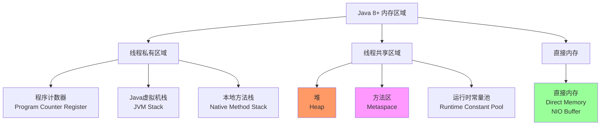
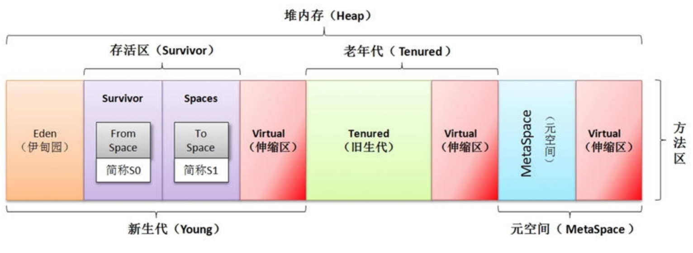
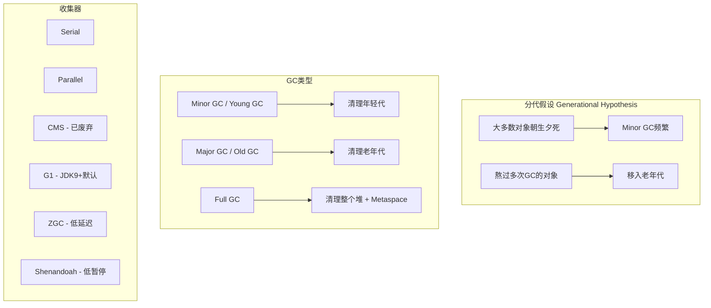
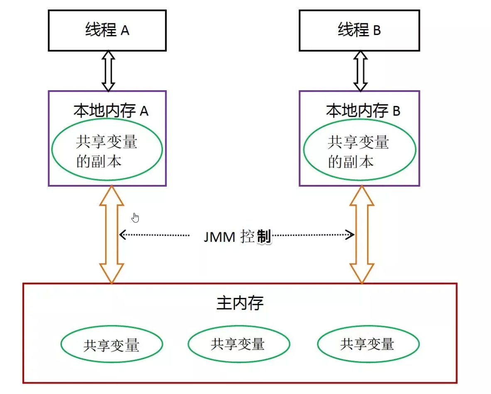

## 描述一下JVM内存模型以及分区，需要详细介绍每隔内存区域存放什么？

运行时数据区在jdk7和jdk8中有些不同

**jdk8之前**


**jdk8**


**线程私有的：**

- 程序计数器
- 虚拟机栈
- 本地方法栈

**线程共享的：**

- 堆
- 方法区，方法区变为元空间，放在直接内存中;
- 直接内存 (非运行时数据区的一部分)

### **内存划分概览**



java内存模型整体上可以划分为三部分：**类加载子系统，运行时数据区和执行引擎子系统**。

### **程序计数器**

程序计数器是一块较小的内存空间，可以看作是当前线程所执行的字节码的行号指示器。**字节码解释器工作时通过改变这个计数器的值来选取下一条需要执行的字节码指令，分支、循环、跳转、异常处理、线程恢复等功能都需要依赖这个计数器来完成。**

另外，**为了线程切换后能恢复到正确的执行位置，每条线程都需要有一个独立的程序计数器，各线程之间计数器互不影响，独立存储，我们称这类内存区域为“线程私有”的内存。**

**从上面的介绍中我们知道程序计数器主要有两个作用：**

1. 字节码解释器通过改变程序计数器来依次读取指令，从而实现代码的流程控制，如：顺序执行、选择、循环、异常处理。
2. 在多线程的情况下，程序计数器用于记录当前线程执行的位置，从而当线程被切换回来的时候能够知道该线程上次运行到哪儿了。

**注意：程序计数器是唯一一个不会出现 OutOfMemoryError 的内存区域，它的生命周期随着线程的创建而创建，随着线程的结束而死亡。程序计数器也不会出现GC**

### **java虚拟机栈**

**与程序计数器一样，Java 虚拟机栈也是线程私有的，它的生命周期和线程相同，描述的是 Java 方法执行的内存模型，每次方法调用的数据都是通过栈传递的。**

**Java 内存可以粗糙的区分为堆内存（Heap）和栈内存 (Stack),其中栈就是现在说的虚拟机栈，或者说是虚拟机栈中局部变量表部分。** （实际上，Java 虚拟机栈是由一个个栈帧组成，而每个栈帧中都拥有：局部变量表、操作数栈、动态链接、方法出口信息。）

局部变量表（Local Variables）
- 基本数据类型（int, long等）
- 对象引用（reference）
- returnAddress类型

操作数栈（Operand Stack）
- 方法执行的工作区
- 类似CPU的寄存器
    
动态链接（Dynamic Linking）
- 指向运行时常量池的方法引用

方法返回地址（Return Address）
- 方法正常/异常退出的地址

**局部变量表主要存放了编译器可知的各种数据类型**（boolean、byte、char、short、int、float、long、double）、**对象引用**（reference 类型，它不同于对象本身，可能是一个指向对象起始地址的引用指针，也可能是指向一个代表对象的句柄或其他与此对象相关的位置）。

**Java 虚拟机栈会出现两种异常：StackOverFlowError 和 OutOfMemoryError。**

- **StackOverFlowError：** 若 Java 虚拟机栈的内存大小不允许动态扩展，那么当线程请求栈的深度超过当前 Java 虚拟机栈的最大深度的时候，就抛出 StackOverFlowError 异常。
- **OutOfMemoryError：** 若 Java 虚拟机栈的内存大小允许动态扩展，且当线程请求栈时内存用完了，无法再动态扩展了，此时抛出 OutOfMemoryError 异常。

Java 虚拟机栈也是线程私有的，每个线程都有各自的 Java 虚拟机栈，而且随着线程的创建而创建，随着线程的死亡而死亡。

**扩展：那么方法/函数如何调用？**

Java 栈可用类比数据结构中栈，Java 栈中保存的主要内容是栈帧，每一次函数调用都会有一个对应的栈帧被压入 Java 栈，每一个函数调用结束后，都会有一个栈帧被弹出。

Java 方法有两种返回方式：

1. return 语句。
2. 抛出异常。

不管哪种返回方式都会导致栈帧被弹出。

**栈空间大小**

```shell
# 设置栈大小
-Xss256k      # 默认1MB（64位Linux）
-Xss512k      # 建议值

# 栈内存 = 栈大小 × 线程数
```

### **本地方法栈**

和虚拟机栈所发挥的作用非常相似，区别是： **虚拟机栈为虚拟机执行 Java 方法 （也就是字节码）服务，而本地方法栈则为虚拟机使用到的 Native 方法服务。** 在 HotSpot 虚拟机中和 Java 虚拟机栈合二为一。

本地方法被执行的时候，在本地方法栈也会创建一个栈帧，用于存放该本地方法的局部变量表、操作数栈、动态链接、出口信息。

方法执行完毕后相应的栈帧也会出栈并释放内存空间，也会出现 StackOverFlowError 和 OutOfMemoryError 两种异常。

### **堆**

Java 虚拟机所管理的内存中最大的一块，Java 堆是所有线程共享的一块内存区域，在虚拟机启动时创建。**此内存区域的唯一目的就是存放对象实例，几乎所有的对象实例以及数组都在这里分配内存。**

Java 堆是垃圾收集器管理的主要区域，因此也被称作**GC 堆（Garbage Collected Heap）**.从垃圾回收的角度，由于现在收集器基本都采用分代垃圾收集算法，所以 Java 堆还可以细分为：新生代和老年代：再细致一点有：Eden 空间、From Survivor、To Survivor 空间等。**进一步划分的目的是更好地回收内存，或者更快地分配内存。**



上图所示的 eden 区、s0 区、s1 区都属于新生代，tentired 区属于老年代。大部分情况，对象都会首先在 Eden 区域分配，在一次新生代垃圾回收后，如果对象还存活，则会进入 s0 或者 s1，并且对象的年龄还会加 1(Eden 区->Survivor 区后对象的初始年龄变为 1)，当它的年龄增加到一定程度（默认为 15 岁），就会被晋升到老年代中。对象晋升到老年代的年龄阈值，可以通过参数 `-XX:MaxTenuringThreshold` 来设置。

**Jvm堆内存参数**

```shell
# 堆大小配置
-Xms512m          # 初始堆大小
-Xmx2g            # 最大堆大小
-Xmn1g            # 年轻代大小
-XX:NewRatio=2    # 老年代:年轻代=2:1
-XX:SurvivorRatio=8 # Eden:Survivor=8:1

# 元空间配置（Java 8+）
-XX:MetaspaceSize=256m    # 初始大小
-XX:MaxMetaspaceSize=512m # 最大大小

# 溢出时生成堆转储
-XX:+HeapDumpOnOutOfMemoryError
-XX:HeapDumpPath=/path/to/dump.hprof
```


### **方法区**

方法区与 Java 堆一样，是各个线程共享的内存区域，它用于存储已被虚拟机加载的类信息、常量、静态变量、即时编译器编译后的代码等数据。虽然 Java 虚拟机规范把方法区描述为堆的一个逻辑部分，但是它却有一个别名叫做 **Non-Heap（非堆）**，目的应该是与 Java 堆区分开来。

> **方法区和永久代的关系很像 Java 中接口和类的关系，类实现了接口，而永久代就是 HotSpot 虚拟机对虚拟机规范中方法区的一种实现方式。** 也就是说，永久代是 HotSpot 的概念，方法区是 Java 虚拟机规范中的定义，是一种规范，而永久代是一种实现，一个是标准一个是实现，其他的虚拟机实现并没有永久代这一说法。

**常用参数**

JDK 1.8 之前永久代还没被彻底移除的时候通常通过下面这些参数来调节方法区大小

```java
java -XX:PermSize=N //方法区 (永久代) 初始大小
-XX:MaxPermSize=N //方法区 (永久代) 最大大小,超过这个值将会抛出 OutOfMemoryError 异常:java.lang.OutOfMemoryError: PermGen 
```

相对而言，垃圾收集行为在这个区域是比较少出现的，但并非数据进入方法区后就“永久存在”了。

JDK 1.8 的时候，方法区（HotSpot 的永久代）被彻底移除了（JDK1.7 就已经开始了），取而代之是元空间，元空间使用的是直接内存。

下面是一些常用参数：

```java
# 元空间参数（Java 8+）
java -XX:MetaspaceSize=N //设置 Metaspace 的初始（和最小大小）
-XX:MaxMetaspaceSize=N //设置 Metaspace 的最大大小 

# 溢出时生成转储
-XX:+HeapDumpOnOutOfMemoryError
-XX:HeapDumpPath=./metaspace_oom.hprof

# 监控元空间使用
jstat -gc <pid> | grep MC    # MC: Metaspace Capacity, MU: Metaspace Used
```

与永久代很大的不同就是，如果不指定大小的话，随着更多类的创建，虚拟机会耗尽所有可用的系统内存。

**为什么要将永久代 (PermGen) 替换为元空间 (MetaSpace) 呢?**

整个永久代有一个 JVM 本身设置固定大小上限，无法进行调整，而元空间使用的是直接内存，受本机可用内存的限制，并且永远不会得到 java.lang.OutOfMemoryError。你可以使用 `-XX：MaxMetaspaceSize` 标志设置最大元空间大小，默认值为 unlimited，这意味着它只受系统内存的限制。`-XX：MetaspaceSize` 调整标志定义元空间的初始大小如果未指定此标志，则 Metaspace 将根据运行时的应用程序需求动态地重新调整大小。

**方法区存储什么内容:**

```shell
1. 类元数据（Class Metadata）
   - 类结构信息
   - 方法字节码
   - 字段信息
   - 常量池

2. 方法信息
3. 字段信息

❌ 不再存储：
- 字符串常量池（移到堆中）
- 静态变量（移到堆中）
```

### **运行时常量池**

运行时常量池是方法区的一部分。Class 文件中除了有类的版本、字段、方法、接口等描述信息外，还有常量池信息（用于存放编译期生成的各种字面量和符号引用）

既然运行时常量池是方法区的一部分，自然受到方法区内存的限制，当常量池无法再申请到内存时会抛出 OutOfMemoryError 异常。

**JDK1.7 及之后版本的 JVM 已经将运行时常量池从方法区中移了出来，在 Java 堆（Heap）中开辟了一块区域存放运行时常量池。**


### **直接内存**

**直接内存并不是虚拟机运行时数据区的一部分，也不是虚拟机规范中定义的内存区域，但是这部分内存也被频繁地使用。而且也可能导致 OutOfMemoryError 异常出现。**

JDK1.4 中新加入的 **NIO(New Input/Output) 类**，引入了一种基于**通道（Channel）** 与**缓存区（Buffer）** 的 I/O 方式，它可以直接使用 Native 函数库直接分配堆外内存，然后通过一个存储在 Java 堆中的 DirectByteBuffer 对象作为这块内存的引用进行操作。这样就能在一些场景中显著提高性能，因为**避免了在 Java 堆和 Native 堆之间来回复制数据**。

本机直接内存的分配不会受到 Java 堆的限制，但是，既然是内存就会受到本机总内存大小以及处理器寻址空间的限制。

执行引擎：分为解释器和jit即使编译器，解释器主要作用是对字节码的解释执行，而jit及时编译器主要是对一些热点代码进行二次编译，直接编译我机器可以理解的机器语言，这样下次执行是效率更高。

### 分代收集理论


### 各区域的GC情况

| 内存区域                | 是否GC | GC频率 |        备注         |
| :---------------------- | :----- | :----- | :-----------------: |
| **程序计数器**          | 否     | -      |        无GC         |
| **虚拟机栈**            | 否     | -      |   栈帧出栈即释放    |
| **本地方法栈**          | 否     | -      |     同虚拟机栈      |
| **堆（年轻代）**        | 是     | 高     |      Minor GC       |
| **堆（老年代）**        | 是     | 低     |    Major/Full GC    |
| **方法区（Metaspace）** | 是     | 低     |     类卸载时GC      |
| **运行时常量池**        | 是     | 低     |     随方法区GC      |
| **直接内存**            | 否     | -      | System.gc()触发清理 |

各个区域调优的关键点

- 堆：根据应用对象生命周期调整新生代/老年代比例 
- 栈：根据方法调用深度调整栈大小，默认1MB通常足够 
- Metaspace：监控类加载数量，动态代理应用需增大 
- 直接内存：NIO应用需合理设置MaxDirectMemorySize


### 小结

Java 8 内存区域关键变化：
1. 永久代移除：PermGen → Metaspace（本地内存） 
2. 字符串常量池迁移：PermGen → 堆（Heap） 
3. 静态变量迁移：PermGen → 堆（Heap）

各区域核心要点：
1. 程序计数器：线程私有，无GC，记录执行位置 
2. 虚拟机栈：线程私有，栈帧结构，FILO 
3. 本地方法栈：Native方法服务 
4. 堆：最大内存区，GC主战场，分代设计 
5. 方法区（Metaspace）：类元数据，常量池 
6. 直接内存：NIO使用，堆外，零拷贝优势


## Java内存模型（JMM）

### 什么是JMM

Java内存模型（Java Memory Model，JMM）是Java虚拟机规范中定义的一组规则，它规定了多线程环境下：

1. 多线程之间如何读写共享变量 
2. 线程间的内存可见性 
3. 指令的执行顺序

JMM的核心目标是解决多线程编程中的三个关键问题：

1. 原子性：操作不可中断 
2. 可见性：一个线程修改共享变量后，其他线程能立即看到 
3. 有序性：程序执行按一定顺序进行

有了上面的概念后，我们在来理解下什么是JMM:


JVM 试图定义一种统一的内存模型，能将各种底层硬件以及操作系统的内存访问差异进行封装，使 Java 程序在不同硬件以及操作系统上都能达到相同的并发效果。它分为工作内存和主内存，线程无法对主存储器**直接**进行操作，如果一个线程要和另外一个线程通信，那么只能通过主存进行交换，如下图所示。

1. 工作内存：寄存器，高速缓存

2. 主内存：硬件的内存

内存间操作：


Java 内存模型描述的是多线程对共享内存修改后彼此之间的可见性。

### JMM内存结构




关键概念：
- 主内存：存储所有共享变量 
- 工作内存：每个线程私有的内存空间，存储该线程使用变量的副本 
- 交互规则：线程不能直接读写主内存变量，必须通过工作内存

### 三大特性解决方案

#### 原子性

```java
private int count = 0;

public void increment() {
    count++;  // 非原子操作，实际分三步：读→改→写
}
```

**解决方案**

1. 使用synchronized关键字 
2. 使用Lock接口的实现类 
3. 使用原子类（AtomicInteger等）

#### 可见性

```java
public class VisibilityProblem {
    private boolean flag = false;
    
    public void writer() {
        flag = true;  // 修改可能不会立即对其他线程可见
    }
    
    public void reader() {
        while (!flag) {  // 可能一直循环，看不到flag的变化
            // do something
        }
    }
}
```
**解决方案**：

1. volatile关键字 
2. synchronized同步块 
3. final关键字（初始化后可见）

#### 有序性

问题： 指令重排序导致程序执行顺序与代码顺序不一致

**解决方案**：

1. volatile（禁止重排序） 
2. synchronized（保证串行执行）

### happens-before原则

JMM通过happens-before规则定义内存操作的可见性顺序：

**八大规则**：
1. 程序顺序规则：线程内按代码顺序执行 
2. 监视器锁规则：unlock先于后续的lock 
3. volatile规则：写先于后续的读 
4. 传递性规则：A先于B，B先于C，则A先于C 
5. 线程启动规则：start()先于线程内所有操作 
6. 线程终止规则：线程内所有操作先于join()
7. 线程中断规则：interrupt()先于检测到中断 
8. 对象终结规则：构造函数先于finalize()

### volatile关键字详解

- 作用： 
  - 保证可见性：写操作立即刷新到主内存 
  - 禁止指令重排序

- 实现原理：
  - 写操作：添加Lock前缀指令，将工作内存数据写回主内存 
  - 读操作：使工作内存中该变量副本无效，从主内存重新读取

**案例代码**

```java
public class VolatileExample {
    private volatile boolean shutdown = false;
    
    public void shutdown() {
        shutdown = true;  // 对所有线程立即可见
    }
    
    public void doWork() {
        while (!shutdown) {
            // 正常工作
        }
    }
}
```

### synchronized的内存语义

- 内存语义： 
  - 进入同步块：清空工作内存 → 从主内存读取最新值 
  - 退出同步块：将工作内存写回主内存

**代码示例**

```java
public class SynchronizedExample {
    private int counter = 0;
    
    public synchronized void increment() {
        counter++;  // 保证原子性、可见性、有序性
    }
    
    public synchronized int getCounter() {
        return counter;  // 读取最新值
    }
}
```

### 原子类实现原理

CAS（Compare And Swap）操作：
```java
public class AtomicExample {
    private AtomicInteger atomicCounter = new AtomicInteger(0);
    
    public void safeIncrement() {
        atomicCounter.incrementAndGet();  // 基于CAS实现
    }
}
```

cas原理:

```jaav
期望值：E（Expect）
实际值：V（Value）
新值：N（New）

if (V == E) {
    V = N;
    return true;
} else {
    return false;
}
```

### 内存屏障（Memory Barrier）

JMM通过内存屏障实现内存可见性和禁止重排序：

四种屏障：
1. LoadLoad屏障：Load1 → LoadLoad → Load2 
2. StoreStore屏障：Store1 → StoreStore → Store2 
3. LoadStore屏障：Load → LoadStore → Store 
4. StoreLoad屏障：Store → StoreLoad → Load

### 小结

最佳实践：

1. 尽量使用不可变对象：减少同步需求 
2. 缩小同步范围：使用更细粒度的锁 
3. 优先使用volatile：满足可见性需求时 
4. 使用线程安全容器：如ConcurrentHashMap 
5. 避免共享变量：使用ThreadLocal

常见面试题:

1. JMM是什么？三大特性是什么？ 
2. volatile和synchronized的区别？ 
3. 什么是happens-before原则？ 
4. 双重检查锁定为什么要加volatile？ 
5. CAS是什么？ABA问题如何解决？

## 为什么要将永久代 (PermGen) 替换为元空间 (MetaSpace) 呢?

整个永久代有一个 JVM 本身设置固定大小上限，无法进行调整，而元空间使用的是直接内存，受本机可用内存的限制，并且永远不会得到 java.lang.OutOfMemoryError。你可以使用 `-XX：MaxMetaspaceSize` 标志设置最大元空间大小，默认值为 unlimited，这意味着它只受系统内存的限制。`-XX：MetaspaceSize` 调整标志定义元空间的初始大小如果未指定此标志，则 Metaspace 将根据运行时的应用程序需求动态地重新调整大小。

## 运行时常量池

运行时常量池是方法区的一部分。Class 文件中除了有类的版本、字段、方法、接口等描述信息外，还有常量池信息（用于存放编译期生成的各种字面量和符号引用）

既然运行时常量池是方法区的一部分，自然受到方法区内存的限制，当常量池无法再申请到内存时会抛出 OutOfMemoryError 异常。

**方法区的一部分，存放编译期生成的各种字面量与符号引用，这部分内容将在类加载后存放到运行时常量池中;字符串常量池1.7以后放在堆中，运行时常量池放在元空间中**

常量池内容：
1. 字面量：文本字符串、final常量值 
2. 符号引用： 
3. 类和接口的全限定名 
4. 字段的名称和描述符 
5. 方法的名称和描述符


> Java 7+：字符串常量池在堆中

## 直接内存

**直接内存并不是虚拟机运行时数据区的一部分，也不是虚拟机规范中定义的内存区域，但是这部分内存也被频繁地使用。而且也可能导致 OutOfMemoryError 异常出现。**

JDK1.4 中新加入的 **NIO(New Input/Output) 类**，引入了一种基于**通道（Channel）** 与**缓存区（Buffer）** 的 I/O 方式，它可以直接使用 Native 函数库直接分配堆外内存，然后通过一个存储在 Java 堆中的 DirectByteBuffer 对象作为这块内存的引用进行操作。这样就能在一些场景中显著提高性能，因为**避免了在 Java 堆和 Native 堆之间来回复制数据**。

本机直接内存的分配不会受到 Java 堆的限制，但是，既然是内存就会受到本机总内存大小以及处理器寻址空间的限制。

## java对象的创建过程

下图便是 Java 对象的创建过程，我建议最好是能默写出来，并且要掌握每一步在做什么。


**Step1:类加载检查**

虚拟机遇到一条 new 指令时，首先将去检查这个指令的参数是否能在常量池中定位到这个类的符号引用，并且检查这个符号引用代表的类是否已被加载过、解析和初始化过。如果没有，那必须先执行相应的类加载过程。

类加载过程（双亲委派模型）: 用户代码 → 应用程序类加载器 → 扩展类加载器 → 启动类加载器

**Step2:分配内存**

在**类加载检查**通过后，接下来虚拟机将为新生对象**分配内存**。对象所需的内存大小在类加载完成后便可确定，为对象分配空间的任务等同于把一块确定大小的内存从 Java 堆中划分出来。**分配方式**有 **“指针碰撞”** 和 **“空闲列表”** 两种，**选择那种分配方式由 Java 堆是否规整决定，而 Java 堆是否规整又由所采用的垃圾收集器是否带有压缩整理功能决定**。

**内存分配的两种方式：（补充内容，需要掌握）**

选择以上两种方式中的哪一种，取决于 Java 堆内存是否规整。而 Java 堆内存是否规整，取决于 GC 收集器的算法是"标记-清除"，还是"标记-整理"（也称作"标记-压缩"），值得注意的是，复制算法内存也是规整的


情况1：指针碰撞（Bump the Pointer）
适用：堆内存规整（Serial、ParNew等收集器）

情况2：空闲列表（Free List）
适用：堆内存不规整（CMS收集器）

情况3：TLAB（Thread Local Allocation Buffer）
目的：避免线程安全问题，提高分配效率

**内存分配并发问题（补充内容，需要掌握）**

在创建对象的时候有一个很重要的问题，就是线程安全，因为在实际开发过程中，创建对象是很频繁的事情，作为虚拟机来说，必须要保证线程是安全的，通常来讲，虚拟机采用两种方式来保证线程安全：

- **CAS+失败重试：** CAS 是乐观锁的一种实现方式。所谓乐观锁就是，每次不加锁而是假设没有冲突而去完成某项操作，如果因为冲突失败就重试，直到成功为止。**虚拟机采用 CAS 配上失败重试的方式保证更新操作的原子性。**
- **TLAB：** 为每一个线程预先在 Eden 区分配一块儿内存，JVM 在给线程中的对象分配内存时，首先在 TLAB 分配，当对象大于 TLAB 中的剩余内存或 TLAB 的内存已用尽时，再采用上述的 CAS 进行内存分配

**TLAB补充**
1. 每个线程在Eden区有一块私有内存区域 
2. 小对象优先在TLAB分配，避免同步 
3. TLAB用完或空间不足时，使用公共区域


**Step3:初始化零值**

内存分配完成后，虚拟机需要将分配到的内存空间都初始化为零值（不包括对象头），这一步操作保证了对象的实例字段在 Java 代码中可以不赋初始值就直接使用，程序能访问到这些字段的数据类型所对应的零值，即基本类型赋值为默认值。

**对象在内存中的布局**

```shell
┌─────────────────────────────────┐
│       对象在堆内存中的布局          │
├─────────────────────────────────┤
│ 对象头（Object Header）          │   ← 步骤4
├─────────────────────────────────┤
│ 实例数据（Instance Data）        │   ← 步骤3（初始为零值）
│   - String name = null          │
│   - int age = 0                 │
│   - boolean active = false      │
│   - ...                         │
├─────────────────────────────────┤
│ 对齐填充（Padding）              │
└─────────────────────────────────┘
```

**Step4:设置对象头**

初始化零值完成之后，**虚拟机要对对象进行必要的设置**，例如这个对象是那个类的实例、如何才能找到类的元数据信息、对象的哈希码、对象的 GC 分代年龄等信息。 **这些信息存放在对象头中。** 另外，根据虚拟机当前运行状态的不同，如是否启用偏向锁等，对象头会有不同的设置方式。

```shell
// 锁状态与Mark Word对应关系
无锁:     hashCode(25位) + age(4位) + 0(是否偏向) + 01
偏向锁:   ThreadID(54位) + epoch(2位) + age(4位) + 1(偏向) + 01
轻量锁:   指向栈中锁记录的指针(62位) + 00
重量锁:   指向重量级锁的指针(62位) + 10
GC标记:   空(不需要记录信息) + 11
```

**Step5:执行 init 方法**

在上面工作都完成之后，从虚拟机的视角来看，一个新的对象已经产生了，但从 Java 程序的视角来看，对象创建才刚开始，``构造方法还没有执行，所有的字段都还为零。所以一般来说，执行 new 指令之后会接着执行 `` 方法，把对象按照程序员的意愿进行初始化，这样一个真正可用的对象才算完全产生出来。

```java
public class User {
    private String name;
    private int age;
    
    // 1. 父类构造函数调用（如果有父类）
    // 2. 实例变量初始化（包括代码块）
    // 3. 构造函数体执行
    
    {  // 实例初始化代码块（第二步执行）
        System.out.println("实例初始化代码块执行");
    }
    
    public User(String name, int age) {
        // 1. 隐式调用Object的构造函数 super();
        // 2. 执行实例变量初始化：name=null, age=0
        // 3. 执行初始化代码块
        // 4. 执行构造函数体
        this.name = name;
        this.age = age;
        System.out.println("构造函数执行");
    }
}
```

输出顺序：
1. 父类静态代码块
2. 子类静态代码块
3. 父类实例代码块
4. 父类构造函数
5. 子类实例代码块
6. 子类构造函数

最后，将对象在堆内存中的地址赋值给栈中的引用变量；

**常见面试题**
1. new一个对象的过程是怎样的？ 
2. 对象在内存中如何布局？ 
3. 什么是对象头？包含哪些信息？ 
4. 什么是TLAB？有什么作用？ 
5. 逃逸分析是什么？如何优化？ 
6. String s = new String("abc")创建了几个对象？ 
7. 对象初始化顺序是怎样的？ 
8. 什么是双亲委派模型？


**小结**

1. 对象创建是原子操作：要么成功创建完整对象，要么失败 
2. 内存分配依赖GC算法：不同收集器使用不同分配策略 
3. 对象头存储元数据：锁信息、GC年龄、哈希码等 
4. 初始化有固定顺序：父类 → 子类，静态 → 实例 
5. 优化手段多样：逃逸分析、TLAB、对象池等

## 对象的创建方法，对象的内存分配，对象的访问定位

**对象创建过程图**


**对象的创建详细过程**


Java对象的创建大致上有以下几个步骤：

1. **类加载检查**：检查这个指令的参数是否能在常量池中定位到一个类的符号引用，并且检查这个符号引用表的类是否已被加载、解析和初始化过。如果没有，那必须先执行相应的类的加载过程
2. **为对象分配内存**：对象所需内存的大小在类加载完成后便完全确定，为对象分配空间的任务等同于把一块确定大小的内存从Java堆中划分出来。由于堆被线程共享，因此此过程需要进行同步处理（分配在TLAB上不需要同步）
3. **内存空间初始化**：虚拟机将分配到的内存空间都初始化为零值（不包括对象头），内存空间初始化保证了对象的实例字段在Java代码中可以不赋初始值就直接使用，程序能访问到这些字段的数据类型所对应的零值。
4. **对象设置**：JVM对对象头进行必要的设置，保存一些对象的信息（指明是哪个类的实例，哈希码，GC年龄等）
5. **init**：执行完上面的4个步骤后，对JVM来说对象已经创建完毕了，但对于Java程序来说，我们还需要对对象进行一些必要的初始化。

> 在这里说明一下TLAB是什么意思：
>
> 因为堆是线程之间共享的，如果在并发场景中，两个线程先后把对象的引用指向了同一个内存区域，怎么办？
>
> 为了解决这个并发问题，对象的内存分配过程就必须进行同步控制，但是，无论使用哪种方案（有可能是CAS），都会影响内存的分配效率。然而对于 Java 来说对象的分配是高频操作。
>
> 由此 HotSpot 虚拟机采用了这个方案：每个线程在 Java 堆中预先分配一小块内存，然后在给对象分配内存的时候，直接在自己的这块”私有“内存中进行分配，当这部分用完之后，再分配新的”私有“内存。
>
> 这种方案被称之为 TLAB 分配。这部分 buffer 是从堆中划分出来的，但是本地线程独享的。
>
> TLAB 是虚拟机在内存的 eden 区划分出来的一块专用空间，是线程专属的。在启用 TLAB 的情况下，当线程被创建时，虚拟机会为每个线程分配一块 TLAB 空间，只给当前线程使用，这样每个线程都单独拥有一个空间，如果需要分配内存，就在自己的空间上分配，这样就不存在竞争的情况，可以大大提高分配效率。
>
> 所以说，因为有了 TLAB 技术，堆内存并不是完完全全的线程共享，其中 eden 区中还是有一部分空间是分配给线程独享的。
>
> 注意：这里 TLAB 的线程独享是针对于分配动作，至于读取、垃圾回收等工作是线程共享的，而且在使用上也没什么区别。
>
> 也就是说，虽然每个线程在初始化时都会去堆内存中申请一块 TLAB，并不是说这个 TLAB 区域的内存其他线程就完全无法访问了，其他线程的读取还是可以的，只不过无法在这个区域中分配内存而已。
>
> 并且，在 TLAB 分配之后，并不影响对象的移动和回收，也就是说，虽然对象刚开始可能通过 TLAB 分配内存，存放在 Eden 区，但是还是会被垃圾回收或者被移到 S 区和老年代等。
>
> 还有一点需要注意的是，我们说 TLAB 是在 eden 区分配的，因为 eden 区域本身就不太大，而且 TLAB 空间的内存也非常小，默认情况下仅占有整个 eden 空间的 1%。所以，必然存在一些大对象是无法在 TLAB 直接分配。遇到 TLAB 中无法分配的大对象，对象还是可能在 eden 区或者老年代等进行分配的，但是这种分配就需要进行同步控制，这也是为什么我们经常说：小的对象比大的对象分配起来更加高效。

**对象的内存分配**
Java对象的内存分配有两种情况，由Java堆是否规整来决定（Java堆是否规整由所采用的垃圾收集器是否带有压缩整理功能决定）：

1. 指针碰撞(Bump the pointer)：如果Java堆中的内存是规整的，所有用过的内存都放在一边，空闲的内存放在另一边，中间放着一个指针作为分界点的指示器，分配内存也就是把指针向空闲空间那边移动一段与内存大小相等的距离
2. 空闲列表(Free List)：如果Java堆中的内存不是规整的，已使用的内存和空闲的内存相互交错，就没有办法简单的进行指针碰撞了。虚拟机必须维护一张列表，记录哪些内存块是可用的，在分配的时候从列表中找到一块足够大的空间划分给对象实例，并更新列表上的记录。

**对象的访问定位**

对象的访问形式取决于虚拟机的实现，目前主流的访问方式有使用**句柄和直接指针**两种：

- 使用句柄：
  如果使用句柄访问，Java堆中将会划分出一块内存来作为句柄池，引用中存储的就是对象的句柄地址，而句柄中包含了对象实例数据与类型数据各自的具体地址信息：


优势：引用中存储的是稳定的句柄地址，在对象被移动(垃圾收集时移动对象是非常普遍的行为)时只会改变句柄中的实例数据指针，而引用本身不需要修改。

- 直接指针：

如果使用直接指针访问对象，那么对象的实例数据中就包含一个指向对象类型数据的指针，引用中存的直接就是对象的地址：


优势：速度更快，节省了一次指针定位的时间开销，积少成多的效应非常可观。

缺点：如果发生GC行为对象的内存地址发生变化，那么需要更新引用的地址。

## 对象访问定位的两种方式

java对象在访问的时候，我们需要通过java虚拟机栈的reference类型的数据去操作具体的对象。由于reference类型在java虚拟机规范中只规定了一个对象的引用，并没有定义这个这个引用应该通过那种方式去定位、访问java堆中的具体对象实例，所以一般的访问方式也是取决与java虚拟机的类型。目前主流的访问方式有通过句柄和直接指针两种方式。

1. 句柄访问

使用句柄访问方式，java堆将会划分出来一部分内存去来作为句柄池，reference中存储的就是对象的句柄地址。而句柄中则包含对象实例数据的地址和对象类型数据（如对象的类型，实现的接口、方法、父类、field等）的具体地址信息。下边我以一个例子来简单的说明一下：

Object obj = new Object();

Object obj表示一个本地引用，存储在java栈的本地便变量表中，表示一个reference类型的数据。

new Object()作为实例对象存放在java堆中，同时java堆中还存储了Object类的信息（对象类型、实现接口、方法等）的具体地址信息，这些地址信息所执行的数据类型存储在方法区中。


2. 直接指针访问

如果使用指针访问，那么java堆对象的布局中就必须考虑如何放置访问类型的相关信息（如对象的类型，实现的接口、方法、父类、field等），而reference中存储的就是对象的地址。

这两种访问方式各有利弊，使用句柄访最大的好处是reference中存储着稳定的句柄地址，当对象移动之后（垃圾收集时移动对象是非常普遍的行为），只需要改变句柄中的对象实例地址即可，reference不用修改。

使用指针访问的好处是访问速度快，它减少了一次指针定位的时间开销，由于java是面向对象的语言，在开发中java对象的访问非常的频繁，因此这类开销积少成多也是非常可观的，反之则提升访问速度。


> java内存的两种分配方式 
> - 指针碰撞 
> - 空闲列表

## 对象在内存中的布局

### 对象内存结构

```shell
┌─────────────────────────────────────────────────────────┐
│                 Java对象内存布局（64位JVM）               │
├─────────────────────────────────────────────────────────┤
│                     对象头（Object Header）               │
│  ┌────────────────┬────────────────┬──────────────────┐ │
│  │   Mark Word    │  Klass Pointer │  数组长度（可选）  │ │
│  │    (8字节)      │    (4/8字节)    │    (4字节)       │ │
│  └────────────────┴────────────────┴──────────────────┘ │
├─────────────────────────────────────────────────────────┤
│               实例数据（Instance Data）                   │
│  ┌────────────────────────────────────────────────────┐ │
│  │   普通字段（包括父类继承的字段）                      │ │
│  │   字段顺序受声明顺序和重排序策略影响                   │ │
│  └────────────────────────────────────────────────────┘ │
├─────────────────────────────────────────────────────────┤
│                对齐填充（Padding）                       │
│  ┌────────────────────────────────────────────────────┐ │
│  │   额外字节，确保对象大小为8字节的整数倍               │ │
│  └────────────────────────────────────────────────────┘ │
└─────────────────────────────────────────────────────────┘
```

### 对象头（Object Header）详解

#### Mark Word（标记字段）

存储对象运行时数据，是对象头中最重要的部分

不同锁状态下的Mark Word布局（64位JVM）：

```shell
┌─────────────────────────────────────────────────────────────────────────┐
│                           Mark Word（64位）                               │
├──────────┬──────────┬─────────┬─────────┬─────────┬────────┬────────────┤
│  锁状态   │   偏向锁  │   锁标志 │ 其他信息 │ GC年龄  │ HashCode │  ThreadID  │
│          │  标志位   │   位     │         │  (4位)  │  (31位)  │   (54位)    │
├──────────┼──────────┼─────────┼─────────┼─────────┼────────┼────────────┤
│   无锁    │    0     │   01    │    -    │   4位   │  31位   │     -      │
├──────────┼──────────┼─────────┼─────────┼─────────┼────────┼────────────┤
│  偏向锁   │    1     │   01    │ epoch(2)│   4位   │    -    │   54位     │
├──────────┼──────────┼─────────┼─────────┼─────────┼────────┼────────────┤
│  轻量锁   │    -     │   00    │        指向栈中锁记录的指针（62位）          │
├──────────┼──────────┼─────────┼─────────┼─────────┼────────┼────────────┤
│  重量锁   │    -     │   10    │        指向重量级锁的指针（62位）            │
├──────────┼──────────┼─────────┼─────────┼─────────┼────────┼────────────┤
│  GC标记   │    -     │   11    │               空（不需要记录信息）             │
└──────────┴──────────┴─────────┴─────────┴─────────┴────────┴────────────┘
```

#### Klass Pointer（类型指针）

指向方法区中类的元数据（Class对象）
- 作用：确定对象的类型，实现动态绑定、instanceof检查等

大小：
- 未开启指针压缩：8字节（64位系统）
- 开启指针压缩（默认）：4字节

#### 数组长度（Array Length，仅数组对象）

数组对象的额外头部信息：
1. 数组长度：4字节（最大长度2^32-1）
2. 对齐填充：确保整个对象头是8字节的整数倍

### 实例数据（Instance Data）

**字段内存分配**

```java
public class InstanceDataExample {
    // 基本类型字段
    private byte b;      // 1字节
    private short s;     // 2字节
    private char c;      // 2字节
    private int i;       // 4字节
    private float f;     // 4字节
    private long l;      // 8字节
    private double d;    // 8字节
    private boolean bool; // 1字节（实际可能对齐）
    
    // 引用类型字段
    private String str;  // 4字节（开启指针压缩）
    private Object obj;  // 4字节（开启指针压缩）
    
    // 静态字段（不属于实例数据，在方法区）
    private static int staticField;
}
```

** 字段重排序（Field Reordering）**

```java
public class FieldReordering {
    // JVM可能重新排列字段顺序以优化内存使用
    private boolean a;    // 1字节
    private long b;       // 8字节
    private boolean c;    // 1字节
    private int d;        // 4字节
    
    // 优化后可能的内存布局：
    // 1. long b (8字节，8字节对齐)
    // 2. int d (4字节)
    // 3. boolean a (1字节)
    // 4. boolean c (1字节)
    // 5. 填充2字节
    // 总大小：8 + 4 + 1 + 1 + 2 = 16字节
}
```

### 对齐填充（Padding）

```java
public class PaddingExample {
    // 规则：对象总大小必须是8字节的整数倍
    // 目的：提高CPU访问内存的效率
    
    // 示例：
    private byte b1;  // 1字节
    private int i1;   // 4字节
    private byte b2;  // 1字节
    
    // 未优化的布局（14字节）：
    // 对象头(12) + b1(1) + i1(4) + b2(1) = 18字节
    // 需要填充6字节达到24字节（8的倍数）
    
    // 优化后的布局：
    // 对象头(12) + i1(4) + b1(1) + b2(1) + 填充2 = 20字节
    // 实际需要填充4字节达到24字节
}
```

常见面试题:

1. Java对象由哪几部分组成？ 
2. 对象头包含哪些信息？ 
3. 什么是Mark Word？不同锁状态下的结构？ 
4. 指针压缩是什么？有什么作用？ 
5. 什么是伪共享？如何解决？ 
6. 字段重排序是什么？为什么需要？ 
7. 如何计算一个对象占用的内存大小？ 
8. 数组对象和普通对象的内存布局有什么区别？

## 类的初始化时机

首先看一下类的生命周期:

```shell
加载（Loading） → 链接（Linking） → 初始化（Initialization） → 使用（Using） → 卸载（Unloading）
    ↓               ↓                ↓
 验证（Verification）←─┐
 准备（Preparation）←─┘
 解析（Resolution）
```

根据Java虚拟机规范，有且仅有以下6种情况会触发类的初始化：

1.  创建类的实例（new、反射、反序列化等）
2. 访问类的静态方法（不包括常量）
3. 访问类的静态字段（非常量）
4. 使用反射调用类的方法
5. 初始化子类时，父类未初始化会先初始化父类
6. 作为程序入口的主类（包含main方法的类）

不会触发初始化的情况
1. 访问编译期常量(final修饰的字段)
2. 通过类名获取Class对象
3. 创建该类的数组，只有创建数组元素时才会触发；
4. 引用父类的静态字段（通过子类）

### 主动引用

1. 当程序创建一个类的实例对象；
2. 程序访问或设置类的静态变量(不是静态常量，会在编译时被加载到运行时常量池)；程序调用类的静态方法
3. 对类进行反射调用的时候
4. 当初始化一个类的时候，如果发现其父类还没有进行过初始化，则需要先触发其父类的初始化
5. 当虚拟机启动时，用户需要指定一个要执行的主类（包含main()方法的那个类），虚拟机会先初始化这个主类

###  被动引用（不会触发）

1. 通过子类引用父类的静态字段，不会导致子类初始化。

2. 通过数组定义来引用类，不会触发初始化（数组由虚拟机直接创建）。

3. 常量在编译阶段会存入调用类的常量池中，本质上并没有直接引用到定义常量的类，因此不会触发定义常量的类的初始化

**常见面试题**

1. 什么时候会触发类的初始化？ 只有6种情况会触发初始化
2. 访问静态常量会触发初始化吗？为什么？ 
3. 创建数组会触发类初始化吗？ 
4. 父类和子类的初始化顺序是怎样的？ 静态→父类→实例→构造函数
5. 接口的初始化时机有什么不同？ 
6. 多线程同时触发初始化会有什么问题？ JVM保证初始化过程是线程安全的
7. 如何实现延迟初始化？有哪些模式？ 利用类加载的惰性特性优化性能
8. Class.forName()和ClassLoader.loadClass()的区别？

## 什么是类加载器，常见的类加载器有哪些？

### 什么是类加载器？

类加载器（ClassLoader）是Java虚拟机（JVM）的核心组件之一，负责动态加载Java类到JVM内存中。


类加载器的核心工作：
1. 定位：查找.class文件
2. 加载：读取.class文件字节码
3. 链接：验证、准备、解析
4. 初始化：执行静态代码块和静态变量赋值

### 类加载器工作原理

```shell
┌─────────────────────────────────────┐
│      .class文件（磁盘/网络）           │
└──────────────┬──────────────────────┘
               │ 查找和读取
               ▼
┌─────────────────────────────────────┐
│       ClassLoader（加载器）            │
├─────────────────────────────────────┤
│ 1. 加载：二进制字节流 → 方法区           │
│ 2. 链接：验证、准备、解析                │
│ 3. 初始化：执行<clinit>()              │
└──────────────┬──────────────────────┘
               │
               ▼
┌─────────────────────────────────────┐
│      Class对象（堆内存中的元数据）      │
│     ┌───────────────────────┐      │
│     │ 方法区中的类信息         │      │
│     │ ・字段信息              │      │
│     │ ・方法信息              │      │
│     │ ・常量池               │      │
│     │ ・类加载器引用          │      │
│     └───────────────────────┘      │
└─────────────────────────────────────┘
```

### 类加载器的层级结构

#### 双亲委派模型（Parent Delegation Model）

```shell
                    ┌─────────────────┐
                    │  启动类加载器    │
                    │  Bootstrap     │
                    │  ClassLoader   │
                    └────────┬────────┘
                             │
                    ┌────────▼────────┐
                    │  扩展类加载器    │
                    │  Extension     │
                    │  ClassLoader   │
                    └────────┬────────┘
                             │
                    ┌────────▼────────┐
                    │  应用类加载器    │
                    │  Application   │
                    │  ClassLoader   │
                    └────────┬────────┘
                             │
                    ┌────────▼────────┐
                    │  自定义类加载器  │
                    │  Custom        │
                    │  ClassLoader   │
                    └─────────────────┘
```

#### 双亲委派流程

```java
public class ClassLoaderDemo {
    // 加载类的流程：
    // 1. 检查类是否已加载（findLoadedClass）
    // 2. 委托父加载器加载（parent.loadClass）
    // 3. 父加载器无法加载时，自己尝试加载（findClass）
    
    public static void main(String[] args) {
        // 示例：加载String类
        ClassLoader loader = ClassLoaderDemo.class.getClassLoader();
        
        try {
            // 实际加载流程：
            // 1. AppClassLoader委托给ExtClassLoader
            // 2. ExtClassLoader委托给BootstrapClassLoader
            // 3. BootstrapClassLoader加载java.lang.String
            Class<?> stringClass = loader.loadClass("java.lang.String");
            System.out.println("String类的加载器: " + stringClass.getClassLoader());
        } catch (ClassNotFoundException e) {
            e.printStackTrace();
        }
    }
}
```

### 常见的类加载器

类加载器是指：通过一个类的全限定性类名获取该类的二进制字节流叫做类加载器；类加载器分为以下四种：

- 启动类加载器（BootStrapClassLoader）：用来加载java核心类库，无法被java程序直接引用;
  - 特点 
    - 由C++实现，Java中无法直接引用 
    - 加载JAVA_HOME/jre/lib目录下的核心类库 
    - 是其他所有类加载器的父加载器

- 扩展类加载器（Extension ClassLoader）：用来加载java的扩展库，java的虚拟机实现会提供一个扩展库目录，该类加载器在扩展库目录里面查找并加载java类；
  - 特点:
    - Java实现，sun.misc.Launcher$ExtClassLoader
    - 加载JAVA_HOME/jre/lib/ext目录下的类
    - 父加载器是Bootstrap ClassLoader

- 系统类加载器（AppClassLoader）：它根据java的类路径来加载类，一般来说，java应用的类都是通过它来加载的；
  - 特点:
    - Java实现，sun.misc.Launcher$AppClassLoader
    - 加载classpath下的类（用户自定义类）
    - 父加载器是Extension ClassLoader

- 自定义类加载器：由java语言实现，继承自ClassLoader；
  - 自定义逻辑：某些类自己加载，其他类委派给父类


### 类加载器的核心方法

```java
public class ClassLoaderMethods {
    // ClassLoader的主要方法：
    
    // 1. loadClass() - 双亲委派的核心
    protected Class<?> loadClass(String name, boolean resolve) {
        // ① 检查是否已加载
        // ② 委托父加载器
        // ③ 调用findClass()
    }
    
    // 2. findClass() - 自定义类加载器需要重写
    protected Class<?> findClass(String name) {
        // 从自定义位置读取.class文件
        // 调用defineClass()生成Class对象
    }
    
    // 3. defineClass() - 将字节数组转换为Class对象
    protected final Class<?> defineClass(String name, byte[] b, int off, int len) {
        // JVM内部方法，native实现
    }
    
    // 4. findLoadedClass() - 查找已加载的类
    protected final Class<?> findLoadedClass(String name) {
        // 检查缓存
    }
    
    // 5. getParent() - 获取父加载器
    public final ClassLoader getParent() {
        return parent;
    }
    
    // 6. getSystemClassLoader() - 获取系统类加载器
    public static ClassLoader getSystemClassLoader() {
        return scl;
    }
}
```

常见面试题:

1. 什么是双亲委派模型？有什么好处？ 
2. Java有哪些内置的类加载器？分别加载哪些类？ 
3. 如何自定义类加载器？需要重写哪些方法？ 
4. 什么情况下需要打破双亲委派？ 
5. Tomcat的类加载器体系是怎样的？ 
6. SPI机制是如何打破双亲委派的？ 
7. 线程上下文类加载器的作用是什么？ 
8. 不同类加载器加载的同一个类，JVM认为是同一个类吗？

## 双亲委派模型，问什么需要双亲委派模型，有什么优点？

### 什么是双亲委派模型

当一个类收到了类加载请求时，自己不会先去加载这个类，而是将其委派给父类去加载，如果父类不能加载，反馈给子类，由子类去完成类的加载；

**工作原理:**

```shell
      ┌─────────────────────────────────────────┐
      │   子类加载器收到加载请求                     │
      └───────────────┬─────────────────────────┘
                      │
      ┌───────────────▼─────────────────────────┐
      │     1. 检查是否已加载？                   │
      │         ↓ 是 → 直接返回                  │
      │         ↓ 否                            │
      └───────────────┬─────────────────────────┘
                      │
      ┌───────────────▼─────────────────────────┐
      │     2. 委托给父类加载器                   │
      │         (递归执行相同流程)                │
      └───────────────┬─────────────────────────┘
                      │
      ┌───────────────▼─────────────────────────┐
      │     3. 父类都无法加载？                   │
      │         ↓ 是 → 自己加载                  │
      │         ↓ 否 → 返回父类加载结果           │
      └─────────────────────────────────────────┘
```

- 启动类加载器（引导类加载器 Bootstrap ClassLoader）:此加载器用来加载java的核心库（JAVA_HOME/jre/lib/rt.jar）下面的内容，用于提供jvm自身需要的类。 
- 扩展类加载器：主要加载%JAVA_HOME%\lib\ext目录下的类库文件或者java.ext.dirs系统变量所指定的类库文件（加载扩展库） 
- 程序应用类加载器：主要加载用户类路径(classpath)所指定的类库。 
- 用户自定义类加载器：加载用户自定义的类库。

### 为什么需要双亲委派模型？

为什么使用双亲委派机制对类进行加载？

#### 保护程序的安全，防止核心的api被篡改。

```java
public class SecurityExample {
    public static void main(String[] args) {
        // 问题场景：没有双亲委派会怎样？
        
        // 假设黑客自定义一个恶意的java.lang.String类：
        /*
        package java.lang;
        
        public class String {
            public String() {
                System.out.println("恶意代码执行！");
                // 执行恶意操作，如删除文件、窃取数据等
            }
        }
        */
        
        // 如果没有双亲委派：
        // 1. 应用类加载器可以直接加载恶意的String类
        // 2. 覆盖JDK核心的String类
        // 3. 整个JVM都会被控制
        
        // 有了双亲委派：
        // 1. 应用类加载器收到加载java.lang.String的请求
        // 2. 委托给扩展类加载器
        // 3. 扩展类加载器委托给启动类加载器
        // 4. 启动类加载器从rt.jar加载真正的String类
        // 5. 恶意String类永远不会被加载
        
        System.out.println("安全的String类: " + new String("Hello"));
    }
}
```

#### 避免类重复加载（唯一性）

避免类的重复加载，这样可以保证一个类只有一个类加载器进行加载。

为了防止内存中出现多个相同的字节码；因为如果没有双亲委派的话，用户就可以自己定义一个java.lang.String类，那么就无法保证类的唯一性。

```java
public class UniquenessExample {
    // 场景：多个类加载器加载同一个类

    static class MyClass {
        static {
            System.out.println("MyClass初始化，加载器: " +
                    MyClass.class.getClassLoader());
        }
    }

    public static void main(String[] args) throws Exception {
        // 问题：如果没有双亲委派
        // 可能出现同一个类被加载多次

        // 模拟没有双亲委派的情况
        ClassLoader loader1 = new ClassLoader() {
            @Override
            public Class<?> loadClass(String name) throws ClassNotFoundException {
                // 直接加载，不委托
                if (name.equals("UniquenessExample$MyClass")) {
                    return findClass(name);
                }
                return super.loadClass(name);
            }

            @Override
            protected Class<?> findClass(String name) throws ClassNotFoundException {
                // 从特定位置加载
                byte[] data = loadClassData(name);
                return defineClass(name, data, 0, data.length);
            }
        };

        ClassLoader loader2 = new ClassLoader() {
            // 类似实现...
        };

        // 加载同一个类
        Class<?> class1 = loader1.loadClass("UniquenessExample$MyClass");
        Class<?> class2 = loader2.loadClass("UniquenessExample$MyClass");

        System.out.println("是否是同一个类？ " + (class1 == class2));  // false!

        // 导致的问题：
        // 1. instanceof检查失败
        // 2. 类型转换异常
        // 3. 静态变量不共享
        // 4. 内存浪费
    }
}
```


#### 保证基础类的一致性

```java
public class ConsistencyExample {
    // 场景：多个模块依赖不同版本的库
    
    /*
    没有双亲委派的问题：
    
    Module A → 加载 commons-lang 2.0
        └── 使用 StringUtils类
        
    Module B → 加载 commons-lang 3.0
        └── 使用不同的StringUtils类
        
    结果：
    1. 内存中有两个StringUtils类
    2. 类型转换异常
    3. 序列化问题
    4. 静态状态不一致
    */
    
    // 有双亲委派时：
    // 1. 父类加载器（如AppClassLoader）加载commons-lang
    // 2. 子模块都使用同一个Class对象
    // 3. 保证类型系统的一致性
}
```

### 双亲委派模型的优点

**1、安全性**

```java
层级保护机制：
    
启动类加载器 (Bootstrap)
    ↓ 保护：JDK核心类（java.lang, java.util等）
扩展类加载器 (Extension)
    ↓ 保护：扩展库（$JAVA_HOME/jre/lib/ext）
应用类加载器 (Application)
    ↓ 加载：用户类
自定义类加载器 (Custom)

优势：
1. 核心API不能被篡改
2. 恶意代码无法冒充核心类
3. 提供沙箱安全机制的基础
```

2、避免重复加载（Avoid Duplication）
3、保证基础类的一致性（Consistency）

4、 明确的类查找路径（Clear Search Path）

```java
双亲委派提供了清晰的类查找顺序：

1. Bootstrap ClassLoader
   ├── $JAVA_HOME/jre/lib/rt.jar
   ├── $JAVA_HOME/jre/lib/resources.jar
   └── 其他核心jar包
   
2. Extension ClassLoader
   └── $JAVA_HOME/jre/lib/ext/*.jar

3. Application ClassLoader
   └── classpath指定的路径

4. Custom ClassLoader
   └── 自定义路径

优点：
1. 查找顺序明确，调试容易
2. 避免类路径冲突
3. 可预测的类加载行为
```

### 补充：**那怎么打破双亲委派模型**？

需要打破的场景：
1. 热部署（如Tomcat、JRebel）
2. 模块化隔离（如OSGi）
3. SPI机制实现（如JDBC）
4. 多版本库共存

自定义类加载器，继承ClassLoader类，重写loadClass方法和findClass方法。

### 小结

1. 双亲委派是Java安全体系的基石：保护核心类不被篡改 
2. 提供了高效的类加载机制：避免重复，节省内存 
3. 保证Java类型系统的一致性：这是Java稳定性的基础 
4. 在现代Java中仍很重要：虽然有时需要打破，但原则依然有效 
5. 理解双亲委派是掌握Java高级特性的关键：类隔离、热部署、模块化等都建立在此基础之上

## 如何打破双亲委派模型？

双亲委派模型都依靠`loadClass()`，重写`loaderClass()`即可；

**打破类加载器的案例**

Tomcat 可以加载自己目录下的 class 文件，并不会传递给父类的加载器；

Tomcat，应用的类加载器优先自行加载应用目录下的 class，并不是先委派给父加载器，加载不了才委派给父加载器。

tomcat之所以造了一堆自己的classloader，大致是出于下面三类目的：

-  对于各个 webapp中的 class和 lib，需要相互隔离，不能出现一个应用中加载的类库会影响另一个应用的情况，而对于许多应用，需要有共享的lib以便不浪费资源。
-  与 jvm一样的安全性问题。使用单独的 classloader去装载 tomcat自身的类库，以免其他恶意或无意的破坏；
-  热部署。
- 资源共享：共享常见的库（如servlet-api）

**案例**

```java
public class BreakParentDelegation {
    /**
     * 双亲委派的核心在ClassLoader.loadClass()方法中
     * 要打破它，需要重写这个方法，改变委托逻辑
     */
    
    // ClassLoader.loadClass()的标准实现（双亲委派）
    protected Class<?> loadClass(String name, boolean resolve)
        throws ClassNotFoundException {
        
        synchronized (getClassLoadingLock(name)) {
            // 1. 检查是否已加载
            Class<?> c = findLoadedClass(name);
            if (c == null) {
                try {
                    // 2. 委托给父加载器（关键步骤）
                    if (parent != null) {
                        c = parent.loadClass(name, false);
                    } else {
                        c = findBootstrapClassOrNull(name);
                    }
                } catch (ClassNotFoundException e) {
                    // 父类加载器找不到
                }
                
                // 3. 父类找不到时，自己加载
                if (c == null) {
                    c = findClass(name);
                }
            }
            if (resolve) {
                resolveClass(c);
            }
            return c;
        }
    }
    
    // 打破双亲委派的关键：不调用parent.loadClass()
    // 而是自己直接加载，或改变委托顺序
}
```

## 对象如何分配内存

完整分配流程: 栈上分配（逃逸分析） → TLAB分配 → Eden区分配 → 大对象直接进入老年代

### 栈上分配（Stack Allocation）

```java
public class StackAllocationExample {
    /**
     * 栈上分配条件：对象没有逃逸出方法
     * 优点：对象随栈帧销毁，无需GC
     */
    
    // 案例1：对象没有逃逸 - 可能栈上分配
    public void noEscape() {
        User user = new User("Tom", 25);  // user对象只在方法内使用
        System.out.println(user.getName());
    }  // 方法结束，user对象随栈帧销毁
    
    // 案例2：对象逃逸到方法外 - 不能栈上分配
    public User escape() {
        User user = new User("Jerry", 30);
        return user;  // 对象逃逸，必须在堆上分配
    }
    
    // 案例3：对象逃逸到成员变量 - 不能栈上分配
    private User escapedUser;
    public void escapeToField() {
        escapedUser = new User("Alice", 28);  // 逃逸到成员变量
    }
    
    // 案例4：对象作为参数传递 - 可能逃逸
    public void passAsParam() {
        User user = new User("Bob", 35);
        processUser(user);  // 传递给其他方法，可能逃逸
    }
    
    private void processUser(User user) {
        // 使用user
    }
    
    // 开启逃逸分析JVM参数：-XX:+DoEscapeAnalysis（默认开启）
    // 开启标量替换：-XX:+EliminateAllocations（默认开启）
}

class User {
    private String name;
    private int age;
    
    public User(String name, int age) {
        this.name = name;
        this.age = age;
    }
    
    public String getName() { return name; }
}
```
逃逸分析优化的三种形式：

1. 栈上分配：对象分配在栈上
2. 标量替换：将对象拆散为基本类型，分配在栈上
3. 锁消除：如果对象没有逃逸，可以消除同步锁


### TLAB分配（Thread Local Allocation Buffer）

```java
public class TLABAllocation {
    /**
     * TLAB：每个线程在Eden区有一块私有内存
     * 目的：避免多线程竞争，提高分配效率
     */
    
    // TLAB工作原理
    public static void tlabWorkflow() {
        // 每个线程的TLAB结构：
        // ┌─────────────┬─────────────┬─────────────┐
        // │   Thread1   │   Thread2   │   Thread3   │ ← TLAB（线程私有）
        // │   TLAB      │   TLAB      │   TLAB      │
        // └─────────────┴─────────────┴─────────────┘
        //         ↓
        // ┌─────────────────────────────────────────┐
        // │             Eden区（共享）               │
        // └─────────────────────────────────────────┘
    }
    
    public void allocateInTLAB() {
        // 小对象优先在TLAB分配
        for (int i = 0; i < 1000; i++) {
            byte[] smallObj = new byte[64];  // 在TLAB分配
        }
        
        // 大对象或TLAB空间不足时，在Eden区公共区域分配
        byte[] largeObj = new byte[1024 * 1024];  // 1MB，可能在公共区域
    }
    
    // JVM参数控制TLAB：
    // -XX:+UseTLAB（默认开启）
    // -XX:TLABSize=512k（设置TLAB大小）
    // -XX:+PrintTLAB（打印TLAB信息）
    // -XX:ResizeTLAB（是否允许动态调整TLAB大小，默认true）
    
    public static void printTLABInfo() {
        // 通过JMX获取TLAB信息
        /*
        java.lang.management.MemoryPoolMXBean edenPool = ...;
        System.out.println("TLAB使用情况:");
        System.out.println("  TLAB大小: " + getTLABSize());
        System.out.println("  TLAB已使用: " + getTLABUsed());
        System.out.println("  TLAB浪费空间: " + getTLABWaste());
        */
    }
}
```

###  Eden区分配（常规对象分配）

对象在新生代中eden区分配。当eden区没有足够空间进行分配时，虚拟机将发起一次Minor GC。先把Eden和Ser[vivo]()rFrom区域中存活的对象复制到ServicorTo区域（如果ServicorTo不够位置了就放到老年区），同时把这些对象的年龄+1；然后，清空Eden和ServicorFrom中的对象；最后，ServicorTo和ServicorFrom互换，原ServicorTo成为下一次GC时的ServicorFrom区 ，也就是先从eden中分配内存。

**分配方式:**

```java
分配方式取决于堆内存是否规整：

1. 指针碰撞（Serial、ParNew等收集器）
   Eden区内存规整，使用指针记录下一个可用地址
   ┌───┬───┬───┬───┬───┬───┐
   │ A │ B │   │   │   │   │ ← 已分配
   └───┴───┴───┴───┴───┴───┘
                 ↑
              指针（下一个可用位置）

2. 空闲列表（CMS收集器）
   内存不规整，维护空闲内存块列表
   ┌───┬───┬─────┬───┬─────┐
   │ A │   │  B  │   │  C  │
   └───┴───┴─────┴───┴─────┘
      空闲    空闲     空闲
       ↓      ↓       ↓
    空闲列表记录所有空闲块
```

### 大对象直接进入老年代（字符串，数组）

> 大对象: 大数组 大字符串

如果进行一次minor gc之后，还是没有足够的内存，那么就讲大对象直接分配到老年代，避免频繁的垃圾回收;

大对象的阈值:

```shell
JVM参数：
-XX:PretenureSizeThreshold=3145728  // 3MB，大于此值直接进入老年代
                                     // 只对Serial和ParNew收集器有效
-XX:+UseG1GC
-XX:G1HeapRegionSize=2m  // G1中每个Region大小

// G1收集器的大对象处理：
// 如果对象超过Region的一半，称为Humongous对象
// Humongous对象分配在专门的Humongous Region
```

**大对象的分配和优化:**

```java
问题：
1. 占用连续内存空间，可能触发Full GC
2. 在年轻代复制开销大
3. 影响GC效率

优化建议：
1. 避免创建过大的对象
2. 使用对象池（如数据库连接池）
3. 分块处理大对象
4. 调整大对象阈值
```

### 长期存活的对象进入老年代

Eden区域对象经过第一次Minor GC后仍然能够存活，并且能被Survivor容纳的话，将被移动到Sur[vivo]()r空间中，并将对象年龄设为1。对象在Sur[vivo]()r中每熬过一次MinorGC,年龄就增加1岁，当它的年龄增加到一定程度（默认为15岁），就会被晋升到老年代中。

### 动态对象年龄判定

动态对象年龄判定：对象在Survivor区中不一定非要达到MaxTenuringThreshold（默认15）才晋升老年代;

规则：如果Survivor区中相同年龄的所有对象大小总和 > Survivor空间的一半,则年龄 >= 该年龄的对象可以直接进入老年代

jvm参数
```java
JVM参数：-XX:MaxTenuringThreshold=15（默认）
-XX:TargetSurvivorRatio=50（默认，Survivor区的目标使用率）
```

工作原理:

```java
 工作原理：

Survivor区（假设大小10MB，TargetSurvivorRatio=50）
┌─────────────────────────────────────┐
│  年龄1对象：1MB                      │
│  年龄2对象：2MB                      │
│  年龄3对象：3MB    ← 年龄3对象总和3MB > 5MB？否│
│  年龄4对象：3MB    ← 年龄4对象总和6MB > 5MB？是│
│                                    │   ↓
│  年龄5对象：1MB                      │ 年龄≥4的对象晋升老年代
│  空闲空间：...                       │
└─────────────────────────────────────┘

计算：年龄4及以上的对象总和 = 3MB + 1MB = 4MB
      但实际是累积计算：年龄1-4总和 = 1+2+3+3=9MB > 5MB
      所以年龄≥4的对象晋升

步骤1：GC时，遍历Survivor区的对象
        统计每个年龄的对象大小总和

步骤2：从年龄1开始累加
        cumulativeSize = Σ(age[1] to age[n])

步骤3：当cumulativeSize > SurvivorSize * TargetSurvivorRatio / 100
则设置tenuringThreshold = 当前年龄
年龄 >= tenuringThreshold的对象晋升老年代
```

### 空间分配担保

空间分配担保：在进行Minor GC之前，JVM会检查老年代最大可用连续空间是否大于新生代所有对象总空间;

目的：确保在极端情况下（所有对象都存活），老年代有足够空间容纳从新生代晋升的对象;

两种情况：
1. 有担保：老年代空间足够 → 进行Minor GC
2. 无担保：老年代空间不足 → 先进行Full GC

担保失败处理：
1. 如果Full GC后空间仍不足 → OOM
2. 如果Full GC后空间足够 → 进行Minor GC

**jvm参数**

```shell
// JVM参数：-XX:+HandlePromotionFailure（JDK 6 Update 24后移除）
// 现代JVM默认开启更智能的担保机制
```

在发生Minor GC之前，虚拟机先检查老年代最大可用的连续空间是否大于新生代所有对象总空间，如果不成立的话虚拟机会查看是否允许担保失败，如果允许那么就会继续检查老年代最大可用的连续空间是否大于历次晋升到老年代对象的平均大小，如果大于，将尝试着进行一次Minor GC；如果小于，或者不允许冒险，那么就要进行一次Full GC。

**担保策略演进**

```java
public class GuaranteeEvolution {
    /**
     * 空间分配担保策略的演进
     */
    
    // JDK 6 Update 24之前的策略
    static class OldStrategy {
        /*
        步骤：
        1. 检查老年代最大连续空间 > 新生代所有对象总大小？
           是 → 进行Minor GC
           否 → 检查HandlePromotionFailure设置？
                开启 → 检查老年代最大连续空间 > 历次晋升平均大小？
                    是 → 冒险进行Minor GC（可能失败）
                    否 → 进行Full GC
                关闭 → 直接进行Full GC
        */
    }
    
    // JDK 6 Update 24及之后的策略
    static class NewStrategy {
        /*
        简化策略（HandlePromotionFailure参数被移除）：
        1. 检查老年代最大连续空间 > 新生代所有对象总大小？
           是 → 进行Minor GC
           否 → 进行Full GC
        
        优化：JVM会记录历次晋升大小，动态调整判断逻辑
        */
    }
    
    // 现代JVM（G1、ZGC等）的策略
    static class ModernStrategy {
        /*
        更智能的策略：
        1. 基于Region的收集器（G1）有更精细的控制
        2. 可以预测晋升需求，提前准备空间
        3. 支持并发标记，减少停顿
        */
    }
}
```

## Full GC的触发条件

### Full GC 与 Minor GC 的区别

```shell
   ┌─────────────────┬─────────────────┬─────────────────┐
   │     项目        │     Minor GC    │     Full GC     │
   ├─────────────────┼─────────────────┼─────────────────┤
   │  作用区域       │   只回收年轻代   │ 回收年轻代+老年代 │
   │                 │                 │ +方法区（元空间） │
   ├─────────────────┼─────────────────┼─────────────────┤
   │  触发频率       │     很高        │     较低        │
   ├─────────────────┼─────────────────┼─────────────────┤
   │  暂停时间       │   较短（毫秒级） │ 较长（秒级或更长） │
   ├─────────────────┼─────────────────┼─────────────────┤
   │  执行线程       │   多线程并行     │ 通常单线程串行   │
   │                 │    （ParNew）   │  （Serial Old）  │
   └─────────────────┴─────────────────┴─────────────────┘
   
   特殊收集器：
   - CMS：老年代并发收集（不算Full GC）
   - G1：Mixed GC（部分老年代回收）
```

Full GC触发条件按照不同的垃圾收集器，有不同的触发条件，下面进行简单介绍：

### Serial/Serial Old 收集器

触发条件（全部）：
1. 老年代空间不足
2. 方法区（元空间）空间不足
3. System.gc() 显式调用（不一定立即执行）
4. CMS并发模式失败（如果CMS开启）
5. 空间分配担保失败

### Parallel Scavenge/Parallel Old 收集器

触发条件：
1. 老年代空间不足（主要）
2. 元空间空间不足
3. System.gc() 调用
4. 空间分配担保失败
5. -XX:+UseParallelOldGC 开启时
6. 晋升失败（promotion failed）:年轻代对象要晋升到老年代，但老年代空间不足

> JVM参数：-XX:+UseParallelGC 或 -XX:+UseParallelOldGC

### CMS（Concurrent Mark Sweep）收集器

CMS收集器的Full GC触发条件（更复杂）;

CMS工作阶段：
1. 初始标记（Initial Mark）      - STW
2. 并发标记（Concurrent Mark）   - 并发
3. 重新标记（Remark）           - STW
4. 并发清除（Concurrent Sweep） - 并发

触发Full GC的条件：
1. 并发模式失败（Concurrent Mode Failure）

```java
   原因：CMS进行并发清理时，应用线程还在分配对象,如果老年代空间被快速填满，CMS来不及回收

   触发条件：
   - 老年代使用率达到CMSInitiatingOccupancyFraction阈值
   - 但CMS并发收集期间，新对象分配速度 > CMS回收速度
   
   示例场景：
   老年代阈值：70%（-XX:CMSInitiatingOccupancyFraction=70）
   当前使用率：75%，CMS开始并发标记
   并发期间：应用又分配了大量对象，使用率达到95%
   结果：并发模式失败，退化为Serial Old进行Full GC
```

2. 晋升失败（Promotion Failed）

```java
原因：年轻代对象要晋升到老年代，但老年代没有足够空间
        
与并发模式失败的区别：
- 晋升失败：Minor GC时发现老年代空间不足
- 并发模式失败：CMS回收太慢，赶不上分配速度
```

3. 元空间不足
4. System.gc() 调用
5. CMS收集器自身问题

```java
a) 碎片化导致大对象分配失败
   CMS使用标记清除算法，会产生内存碎片
   大对象需要连续空间，可能分配失败触发Full GC

b) CMS收集器卡住
   某些情况下CMS可能无法完成收集
```

**cms调优参数:**

```java
"-XX:+UseConcMarkSweepGC",              // 启用CMS
"-XX:CMSInitiatingOccupancyFraction=70", // 触发CMS的堆占用率
"-XX:+UseCMSInitiatingOccupancyOnly",   // 只使用上面参数，不动态调整
"-XX:+CMSScavengeBeforeRemark",         // Remark前先做Young GC
"-XX:+CMSClassUnloadingEnabled",        // 启用类卸载
"-XX:+ExplicitGCInvokesConcurrent",     // System.gc()触发CMS
"-XX:+CMSParallelRemarkEnabled",        // 并行重新标记
"-XX:ConcGCThreads=4",                  // 并发GC线程数
"-XX:ParallelGCThreads=8"               // 并行GC线程数
```

### G1（Garbage First）收集器

G1的特点：
- 将堆分为多个Region（1MB-32MB）
- 优先回收垃圾最多的Region（Garbage First）
- 有Young GC和Mixed GC

触发Full GC的条件：
1. 并发模式失败（类似CMS）

```java
G1的并发标记阶段：
1. 初始标记（Initial Mark）  - STW
2. 根区域扫描（Root Region） - 并发
3. 并发标记（Concurrent Mark）- 并发
4. 最终标记（Final Mark）    - STW
5. 清理（Cleanup）          - 并发/STW

失败场景：并发标记期间，堆占用增长太快
```

2. 晋升失败
3. 巨型对象分配失败

```java
G1中：对象大小 > Region的一半 称为巨型对象,需要连续的多个Region

问题：
- 寻找连续Region可能失败
- 碎片化导致无法分配

示例：
Region大小：2MB（-XX:G1HeapRegionSize=2m）
巨型对象阈值：1MB
分配3MB数组 → 需要2个连续Region
```

4. 元空间不足
5. 主动System.gc()
6. 疏散失败（Evacuation Failure）G1特有

```java
场景：进行Young GC或Mixed GC时
需要将存活对象复制到其他Region
但找不到可用Region
        
原因：
- Region碎片化严重
- 可用空间不足
- 大对象占用过多空间
```

**G1调优参数:**

```java
"-XX:+UseG1GC",                        // 启用G1
"-XX:MaxGCPauseMillis=200",            // 目标暂停时间
"-XX:G1HeapRegionSize=2m",             // Region大小
"-XX:InitiatingHeapOccupancyPercent=45", // 触发并发标记的堆占用率
"-XX:G1ReservePercent=10",             // 保留空间，避免晋升失败
"-XX:ParallelGCThreads=8",             // 并行GC线程数
"-XX:ConcGCThreads=2",                 // 并发GC线程数
"-XX:G1MixedGCLiveThresholdPercent=85", // Mixed GC的存活对象阈值
"-XX:G1HeapWastePercent=5"             // 可接受的堆浪费比例
```

### ZGC 和 Shenandoah

新一代低延迟收集器的Full GC

```java
public class NextGenCollectorTriggers {
    /**
     * 新一代低延迟收集器的Full GC
     */
    
    // ZGC（Z Garbage Collector）
    public static void zgcTriggers() {
        /*
        ZGC特点：
        - 停顿时间不超过10ms
        - 支持TB级堆内存
        - 并发整理
        
        ZGC几乎没有Full GC，但可能触发：
        1. 分配失败（ Allocation Failure）
        2. 元空间不足
        3. 主动System.gc()
        
        JVM参数：-XX:+UseZGC
        */
    }
    
    // Shenandoah
    public static void shenandoahTriggers() {
        /*
        Shenandoah特点：
        - 低停顿时间
        - 并发压缩
        
        可能触发Full GC的情况：
        1. 并发失败（Concurrent Failure）
        2. 分配失败
        3. 元空间不足
        
        JVM参数：-XX:+UseShenandoahGC
        */
    }
}
```


### 通用触发条件

对于Minor GC，其触发条件非常简单，当Eden空间满时，就将触发一次Minor GC。而Full GC则相对复杂，full gc是对整个堆内存空间进行回收，在进行full gc之前还会进行major gc操作，有以下条件：

1.调用System.gc()

只是建议虚拟机执行Full GC，但是虚拟机不一定真正去执行。不建议使用这种方式，而是让虚拟机管理内存。

System.gc()的特点：
1. 只是建议JVM进行GC，不一定立即执行
2. 通常会触发Full GC
3. 影响性能，生产环境应避免

常见调用场景：
1. 框架库中误调用
2. 性能测试前清理内存
3. 某些Native代码调用

2.老年代空间不足

> 老年代空间耗尽触发Full GC

老年代空间不足的常见场景为前文所讲的大对象直接进入老年代、长期存活的对象进入老年代等。为了避免以上原因引起的Full GC，应当尽量不要创建过大的对象以及数组。除此之外，可以通过-Xmn虚拟机参数调大新生代的大小，让对象尽量在新生代被回收掉，不进入老年代。还可以通过-           XX:MaxTenuringThreshold调大对象进入老年代的年龄，让对象在新生代多存活一段时间。

直接原因：无法分配对象到老年代

间接原因：
1. 年轻代对象晋升太快
2. 大对象直接进入老年代
3. 内存泄漏（对象无法回收）
4. 长期存活对象积累

**如何诊断:**
1. 监控老年代使用率：`jstat -gcutil <pid> 1000`
2. 分析对象分布：`jmap -histo:live <pid>`
3. 生成堆转储：`jmap -dump:format=b,file=heap.hprof <pid>`
4. 使用`MAT/Eclipse Memory Analyzer`分析

常见模式：
- 直线上升：内存泄漏
- 阶梯式上升：正常晋升
- 锯齿状：周期性任务


3.空间分配担保失败

> 空间分配担保失败触发Full GC

使用复制算法的Minor GC需要老年代的内存空间作担保，如果担保失败会执行一次Full GC。

概念：进行Minor GC前，检查老年代是否有足够空间，容纳所有可能晋升的对象

判断条件（简化）：
1. 老年代最大连续空间 > 新生代所有对象总大小
   → 安全，进行Minor GC
2. 老年代最大连续空间 < 新生代所有对象总大小
   → 先进行Full GC，腾出空间


4、元空间（Metaspace）不足

> 元空间不足触发Full GC

元空间存储：
- 类元数据
- 方法信息
- 常量池
- 注解
- 类加载器

触发Full GC的条件：
1. 元空间使用达到-XX:MaxMetaspaceSize
2. 类加载器泄漏
3. 动态生成大量类（反射、动态代理、CGLIB）

**元空间调优参数:**

```shell
"-XX:MetaspaceSize=64m",        // 初始大小
"-XX:MaxMetaspaceSize=256m",    // 最大大小（默认无限制）
"-XX:MinMetaspaceFreeRatio=40", // GC后最小空闲比例
"-XX:MaxMetaspaceFreeRatio=70", // GC后最大空闲比例
"-XX:+UseCompressedClassPointers", // 压缩类指针（64位默认）
"-XX:+UseCompressedOops",       // 压缩普通对象指针
"-XX:+CMSClassUnloadingEnabled", // CMS启用类卸载
"-XX:+ExplicitGCInvokesConcurrentAndUnloadsClasses" // 并发类卸载
```

6.JDK 1.7及以前的永久代空间不足

## GC的两种判定方法，以及各有什么特点

### 两种算法对比

```java
┌─────────────────┬─────────────────┬─────────────────┐
│     项目        │   引用计数法     │   可达性分析法   │
├─────────────────┼─────────────────┼─────────────────┤
│  基本原理       │ 统计对象的引用数 │ 从GC Roots出发   │
│                 │                │ 遍历引用链       │
├─────────────────┼─────────────────┼─────────────────┤
│  循环引用       │   无法解决      │   可以解决      │
├─────────────────┼─────────────────┼─────────────────┤
│  实时性         │    实时         │   需要扫描      │
├─────────────────┼─────────────────┼─────────────────┤
│  空间开销       │   每个对象需要   │   额外数据结构   │
│                 │   计数器空间     │   （OopMap等）  │
├─────────────────┼─────────────────┼─────────────────┤
│  主流应用       │ Python、PHP等   │ Java、.NET等    │
│                 │ 脚本语言        │ 编译型语言      │
└─────────────────┴─────────────────┴─────────────────┘
```

### 引用计数法（Reference Counting）

给对象中添加一个引用计数器，每当有一个地方引用它，计数器就加1；当引用失效，计数器就减1；任何时候计数器为0的对象就是不可能再被使用的。

**引用计数算法优点:**

1. 实时性高：对象引用计数变为0时立即回收",
2. 回收及时：不需要等待GC周期",
3. 停顿时间短：回收分散在程序运行过程中",
4. 实现简单：逻辑直观，容易理解和实现",
5. 局部性好：只回收局部对象，对缓存友好"

**缺点:**

缺点：
1. 无法解决循环引用的问题，当A引用B，B也引用A的时候，此时AB对象的引用都不为0，此时也就无法垃圾回收，所以一般主流虚拟机都不采用这个方法；
2. 计数器开销：每个对象需要额外空间存储计数器",
3. 更新开销：每次引用赋值都需要更新计数器",
4. 线程安全问题：多线程环境下计数器需要同步",
5. 效率问题：频繁的计数器更新影响性能"

### 可达性分析算法（Reachability Analysis）

**可达性分析法** 从一个被称为GC Roots的对象向下搜索，如果一个对象到GC Roots没有任何引用链相连接时，说明此对象不可用，在java中可以作为GC Roots的对象有以下几种：

**扩展**：

可作为GC Roots的对象：（当前存活的对象）

1. 虚拟机栈中的引用对象",
   - 局部变量表引用的对象",
   - 参数引用的对象",
   - 临时变量引用的对象",

2. 方法区中静态属性引用的对象",
   - static变量引用的对象",
   - 常量池引用的对象",

3. 方法区中常量引用的对象",
   - 字符串常量池",
   - 基本类型常量",

4. 本地方法栈中JNI引用的对象",
   - Native方法引用的对象",

5. Java虚拟机内部的引用",
   - 基本数据类型对应的Class对象",
   - 常驻的异常对象（NullPointerException等）",
   - 系统类加载器",

6. 所有被同步锁持有的对象",
   - synchronized锁对象",

7. JMXBean、JVMTI等回调对象",
   - 监控和管理相关的对象"

**优点:**

1. 解决循环引用问题：能正确识别并回收循环引用对象",
2. 准确性高：基于图遍历，能精确判断对象可达性",
3. 空间开销相对小：对象不需要维护引用计数器",
4. 适合并发：可与应用程序并发执行（CMS、G1等）",
5. 适合复杂场景：能处理复杂的对象引用关系",
6. 主流JVM采用：经过多年优化，非常成熟"

**缺点:**

1. 需要Stop The World：根节点枚举需要暂停用户线程",
2. 实时性较差：需要等到GC周期才能回收",
3. 实现复杂：需要安全点、OopMap等机制支持",
4. 扫描开销：需要遍历整个对象图",
5. 内存碎片：可能产生内存碎片（取决于收集算法）",
6. 调优复杂：有很多参数需要调优"

> 但一个对象满足上述条件的时候，不会马上被回收，还需要进行两次标记；第一次标记：判断当前对象是否有finalize()方法并且该方法没有被执行过，若不存在则标记为垃圾对象，等待回收；若有的话，则进行第二次标记；第二次标记将当前对象放入F-Queue队列，并生成一个finalize线程去执行该方法，虚拟机不保证该方法一定会被执行，这是因为如果线程执行缓慢或进入了死锁，会导致回收系统的崩溃；如果执行了finalize方法之后仍然没有与GC Roots有直接或者间接的引用，则该对象会被回收；
>
> Java选择可达性分析法，因为它能处理复杂的对象关系，适合大型企业应用


## 强引用、软引用、弱引用、虚引用以及他们之间和gc的关系

- 强引用：new出的对象之类的引用， 只要强引用还在，gc时永远不会被回收

```java
强引用对象的GC过程：
        
1. 可达性分析时，从GC Roots出发
2. 如果对象通过强引用链可达 → 存活
3. 如果对象不可达 → 标记为可回收
4. 在GC周期中被回收

特点：
- 对象存活与否完全由引用链决定
- 没有任何"特殊待遇"
- 是Java中最常见的引用类型
```

- 软引用：有用但非必须的对象，内存溢出异常之前，将会把软引用对象列入第二次回收。内存不足时才会被回收 适合实现内存敏感的缓存

```java
//创建软引用
SoftReference<Object> softRef = new SoftReference<>(strongObj);

软引用的回收策略（HotSpot JVM实现）：

1. 第一次GC时不会回收软引用
2. 当内存不足时（分配失败）：
  a. 清除所有软引用
  b. 如果还不够，进行Full GC
  c. 如果还不够，抛出OOM
        
3. 具体算法：
clock - timestamp <= heap_free * SoftRefLRUPolicyMSPerMB

其中：
- clock: JVM运行的毫秒数
   - timestamp: 软引用最后访问时间
   - heap_free: 堆空闲空间（MB）
- SoftRefLRUPolicyMSPerMB: 每MB空闲内存保留的毫秒数

4. JVM参数控制：
-XX:SoftRefLRUPolicyMSPerMB=N（默认1000，即1秒）

        
"1. 图片缓存（Android中的LruCache使用软引用）",
"2. 计算结果缓存（避免重复计算）",
"3. 临时数据缓存（会话数据等）",
"4. 数据库查询结果缓存",
"5. 大对象池（如数据库连接池的软引用实现）",
"",
"优势：",
"- 自动管理内存：内存不足时自动清理",
"- 避免OOM：比强引用更安全",
"- 提高性能：缓存热点数据",
"",
"注意事项：",
"- 不适合存储关键数据",
"- get()可能返回null，需要null检查",
"- 性能比强引用稍差（需要解引用）"
```

- 弱引用：有用但非必须的对象，对象能生存到下一次垃圾收集发生之前。下次GC时一定会被回收，无论内存是否充足；

```java
//创建弱引用
WeakReference<Object> weakRef = new WeakReference<>(strongObj);
弱引用的回收特点：

1. 确定性回收：只要发生GC，弱引用对象就会被回收
2. 不考虑内存状况：无论内存是否充足
3. 在标记阶段直接清除
4. 回收后，引用被放入引用队列（如果关联了队列）

GC处理弱引用的步骤：
1. 标记阶段：发现弱引用对象
2. 清除阶段：将弱引用对象加入待回收列表
3. 引用处理阶段：将弱引用加入引用队列
4. 最终回收阶段：释放内存


执行顺序：
1. GC发现Resource对象只有弱引用
2. 调用finalize()方法
3. 将弱引用加入引用队列
4. 最终回收内存

"1. 监听器/观察者模式：防止监听器泄漏",
"   - 用弱引用保存监听器",
"   - 当监听器对象不再使用时自动移除",
"",
"2. 缓存辅助：",
"   - 作为二级缓存（一级强引用，二级弱引用）",
"   - 当内存紧张时自动失效",
"",
"3. 对象关联管理：",
"   - 管理对象间的临时关联",
"   - 防止不必要的对象保持存活",
"",
"4. ThreadLocal中的使用：",
"   - ThreadLocalMap使用弱引用保存Entry的key",
"   - 防止线程池中线程的ThreadLocal泄漏",
"",
"5. 元数据管理：",
"   - 存储对象的额外信息",
"   - 当对象被回收时，元数据自动清理"

```


- 虚引用：对生存时间无影响，在垃圾回收时得到通知。最弱的引用，无法通过虚引用获取对象,用于跟踪对象被回收的时机

```java
//虚引用的独特特点和主要用途

"1. 无法获取对象：get()方法总是返回null",
"2. 必须与ReferenceQueue一起使用",
"3. 对象被回收后才加入引用队列",
"4. 用于在对象回收后执行清理操作",
"5. 比finalize()更可靠和灵活",
"",
"与finalize()的对比：",
"- finalize(): 对象回收前调用，可能使对象复活",
"- 虚引用: 对象回收后通知，更安全可靠",
"",
"虚引用的优势：",
"1. 不会阻止对象被回收",
"2. 可以精确控制清理时机",
"3. 支持链式清理操作",
"4. 不会造成对象复活问题"

// 虚引用的实际应用场景
"1. 直接内存（堆外内存）管理：",
"   - DirectByteBuffer的Cleaner机制",
"   - 确保Native内存及时释放",
"",
"2. 大文件资源管理：",
"   - 跟踪大文件对象的回收",
"   - 回收后关闭文件句柄",
"",
"3. 图形资源管理：",
"   - OpenGL/DirectX纹理、缓冲区",
"   - 确保GPU资源释放",
"",
"4. 数据库连接管理：",
"   - 跟踪Connection对象回收",
"   - 回收后关闭底层Socket",
"",
"5. 监控和统计：",
"   - 统计对象生命周期",
"   - 监控内存泄漏",
"",
"6. 自定义资源清理框架：",
"   - 构建资源管理框架",
"   - 实现类似C++的RAII模式"

虚引用的实现细节

JVM中虚引用的处理流程：

1. 标记阶段：
- 发现虚引用对象
   - 标记为待处理

2. 引用处理阶段：
- 将虚引用加入pending列表
   - 不调用finalize()方法

3. 入队阶段：
- 对象内存被回收后
   - 将虚引用加入引用队列

4. 清理阶段：
- 应用程序从队列取出虚引用
   - 执行清理操作

关键点：
- 虚引用对象在finalization之后才被回收
- 确保不会在清理操作中访问到已回收对象

//虚引用的性能考虑

"优点：",
"1. 比finalize()更高效",
"2. 不会造成对象复活",
"3. 清理操作可以异步执行",
"4. 支持批量处理",
"",
"缺点：",
"1. 需要额外线程处理引用队列",
"2. 增加GC的复杂度",
"3. 可能延迟资源释放",
"",
"最佳实践：",
"1. 只在必要时使用虚引用",
"2. 避免在清理操作中执行耗时任务",
"3. 使用单独的线程池处理引用队列",
"4. 监控清理队列的积压情况"
```
- 终结器引用：
    - 它用于实现对象的finalize() 方法，也可以称为终结器引用
    - 无需手动编码，其内部配合引用队列使用
    - 在GC 时，终结器引用入队。由Finalizer 线程通过终结器引用找到被引用对象调用它的finalize() 方法，第二次GC 时才回收被引用的对象

### 引用强度链条

引用强度：强 > 软 > 弱 > 虚

1. 强引用最强，最不容易被GC回收 
2. 虚引用最弱，完全不影响GC

对象存活条件：
1. 只要存在一条强引用路径，对象就存活
2. 只有弱引用/虚引用，对象会被回收

### 如何选择合适的引用

何时使用强引用？
- 对象的生命周期由程序逻辑明确控制",
- 对象必须长期存在（如核心服务）",
- 对象很小或数量很少",
- 需要最高性能访问"

何时使用软引用？
- 需要缓存，但内存有限",
- 缓存数据可重建",
- 希望自动管理缓存大小",
- 避免OOM，提高系统稳定性"

何时使用弱引用？

- 需要临时关联，不阻止对象回收",
- 实现监听器模式，防止泄漏",
- 作为辅助数据结构（如WeakHashMap）",
- 需要对象回收的及时通知"


何时使用虚引用？

- 需要对象回收的确切通知",
- 管理Native资源（堆外内存）",
- 替代finalize()方法",
- 实现资源清理框架"

### 不同引用类型对内存泄漏的影响

```java
"强引用：",
"  - 最容易导致内存泄漏",
"  - 只要引用存在，对象就不会被回收",
"  - 常见泄漏点：静态集合、监听器、ThreadLocal",
"",
"软引用：",
"  - 不易导致永久泄漏",
"  - 内存不足时会被回收",
"  - 但可能延迟回收，暂时占用内存",
"",
"弱引用：",
"  - 基本不会导致泄漏",
"  - GC时自动回收",
"  - 但WeakHashMap的value可能泄漏",
"",
"虚引用：",
"  - 不会导致泄漏",
"  - 不阻止对象回收",
"  - 但清理操作失败可能导致资源泄漏"
```

### GC与引用的交互细节

GC处理引用的完整流程（以G1为例）：

1. 初始标记阶段（Initial Mark） - STW
   - 标记GC Roots直接引用的对象
   - 包括强引用、软引用、弱引用、虚引用对象本身

2. 根区域扫描（Root Region Scanning）
   - 扫描Survivor区引用老年代的对象

3. 并发标记（Concurrent Marking）
   - 遍历对象图，标记所有可达对象
   - 使用三色标记算法

4. 再次标记（Remark） - STW
   - 处理SATB记录
   - 处理引用对象

5. 清理（Cleanup） - STW/并发
   - 统计Region存活对象
   - 回收完全空的Region
   - 处理引用队列

### **四种引用总结:**

```shell
┌─────────────────┬────────────────────────┬────────────────────────┬─────────────────────┐
│  引用类型        │      回收时机          │       常见用途         │      JVM实现        │
├─────────────────┼────────────────────────┼────────────────────────┼─────────────────────┤
│   强引用        │ 永不回收（除非不可达）   │ 日常对象创建           │ 普通对象引用        │
│ (Strong)        │                        │                        │                     │
├─────────────────┼────────────────────────┼────────────────────────┼─────────────────────┤
│   软引用        │ 内存不足时回收          │ 内存敏感缓存           │ SoftReference类     │
│ (Soft)          │                        │                        │                     │
├─────────────────┼────────────────────────┼────────────────────────┼─────────────────────┤
│   弱引用        │ 下次GC时回收            │ 防止内存泄漏           │ WeakReference类     │
│ (Weak)          │                        │ （如WeakHashMap）      │                     │
├─────────────────┼────────────────────────┼────────────────────────┼─────────────────────┤
│   虚引用        │ 随时可能回收            │ 管理直接内存           │ PhantomReference类  │
│ (Phantom)       │ （跟踪对象回收）        │ （如DirectByteBuffer） │                     │
└─────────────────┴────────────────────────┴────────────────────────┴─────────────────────┘
```
- 强引用：默认引用，对象只要有强引用就不会被GC回收
- 
- 软引用：内存不足时回收，适合做缓存，比WeakReference更"强"
- 
- 弱引用：GC时立即回收，适合防止内存泄漏
- 
- 虚引用：最弱引用，用于跟踪对象回收，必须与ReferenceQueue配合使用
- 
- 与GC的关系：引用类型决定了对象在GC中的存活策略和回收时机

> 强引用是造成java内存泄漏的主要原因

## 不可达的对象并非“非死不可”

可达性分析法中不可达的对象先判断是否有必要执行finalize方法。当对象没有覆盖finalize方法，或finalize方法已经被虚拟机调用过时，虚拟机将直接回收。

被判定为需要执行的对象将会被放在一个队列中，除非在finalize方法中重新与引用链建立联系，否则直接回收。

## 能够找到 Reference Chain 的对象，就一定会存活么？

不一定，还要看 Reference 类型，弱引用在 GC 时会被回收，软引用在内存不足的时候会被回收，但如果没有 Reference Chain 对象时，就一定会被回收。

## 请问如何查看 JVM 系统默认值

###  使用 java -XX:+PrintFlagsFinal（最常用）

```java
# 查看所有JVM参数的最终值（包括默认值和修改后的值）
java -XX:+PrintFlagsFinal -version

# 查看特定参数（使用grep过滤）
java -XX:+PrintFlagsFinal -version 2>&1 | grep -i heapsize

# 查看所有与GC相关的参数
java -XX:+PrintFlagsFinal -version 2>&1 | grep -i gc

# 查看所有与内存相关的参数
java -XX:+PrintFlagsFinal -version 2>&1 | grep -i memory

# 查看所有与编译相关的参数
java -XX:+PrintFlagsFinal -version 2>&1 | grep -i compile

# 将结果输出到文件以便分析
java -XX:+PrintFlagsFinal -version 2>&1 > jvm_flags.txt
```

输出内容解释:
```shell
$ java -XX:+PrintFlagsFinal -version 2>&1 | head -20
[Global flags]
     intx ActiveProcessorCount                      = -1            {product}
    uintx AdaptiveSizeDecrementScaleFactor          = 4             {product}
    uintx AdaptiveSizeMajorGCDecayTimeScale         = 10            {product}
    uintx AdaptiveSizePausePolicy                   = 0             {product}
    uintx AdaptiveSizePolicyCollectionCostMargin    = 50            {product}
    uintx AdaptiveSizePolicyInitializingSteps       = 20            {product}
    uintx AdaptiveSizePolicyOutputInterval          = 0             {product}
    uintx AdaptiveSizePolicyWeight                  = 10            {product}
    uintx AdaptiveSizeThroughPutPolicy              = 0             {product}
    uintx AdaptiveTimeWeight                        = 25            {product}
     bool AdjustConcurrency                         = false         {product}
     bool AggressiveHeap                            = false         {product}
     bool AggressiveOpts                            = false         {product}
     intx AliasLevel                                = 3             {product}
     bool AlignVector                               = false         {product}
     intx AllocateInstancePrefetchLines             = 1             {product}
     intx AllocatePrefetchDistance                  = 256           {product}
     intx AllocatePrefetchInstr                     = 3             {product}
     intx AllocatePrefetchLines                     = 4             {product}
     intx AllocatePrefetchStepSize                  = 64            {product}
java version "1.8.0_301"
Java(TM) SE Runtime Environment (build 1.8.0_301-b09)
Java HotSpot(TM) 64-Bit Server VM (build 25.301-b09, mixed mode)
```
输出字段解释：

- 参数名：如 MaxHeapSize 
- 等号：分隔符 
- 值：如 1073741824（字节） 
- 大括号内类型：如 {product}、{manageable}、{C2 diagnostic} 等 
- 冒号前修饰符：如 intx、uintx、bool、double、ccstr 等

### 使用 java -XX:+PrintCommandLineFlags

```java
# 查看JVM启动时实际使用的关键参数
java -XX:+PrintCommandLineFlags -version

# 输出示例：
-XX:InitialHeapSize=268435456 -XX:MaxHeapSize=4294967296 -XX:+PrintCommandLineFlags -XX:+UseCompressedClassPointers -XX:+UseCompressedOops -XX:+UseParallelGC
java version "1.8.0_301"
Java(TM) SE Runtime Environment (build 1.8.0_301-b09)
Java HotSpot(TM) 64-Bit Server VM (build 25.301-b09, mixed mode)
```

### 使用 jinfo 工具（需要Java进程正在运行）

```java
# 1. 先找到Java进程的PID
jps -l

# 输出示例：
1234 com.example.MainApp
5678 sun.tools.jps.Jps

# 2. 查看特定进程的所有JVM参数
jinfo -flags 1234

# 3. 查看特定参数的值
jinfo -flag MaxHeapSize 1234
jinfo -flag UseG1GC 1234

# 4. 查看所有系统属性
jinfo -sysprops 1234

# 5. 查看所有参数（包括默认值）
jinfo 1234

# 6. 动态修改可管理的参数（manageable flags）
jinfo -flag +PrintGCDetails 1234  # 开启GC日志
jinfo -flag -PrintGCDetails 1234  # 关闭GC日志
jinfo -flag HeapDumpOnOutOfMemoryError=true 1234  # 开启OOM时堆转储
```

### 使用 jcmd 工具（JDK 7+）

```java
# 1. 列出所有Java进程
jcmd

# 输出示例：
1234 com.example.MainApp
5678 jdk.jcmd/sun.tools.jcmd.JCmd

# 2. 查看特定进程的JVM参数
jcmd 1234 VM.flags

# 3. 查看所有系统属性
jcmd 1234 VM.system_properties

# 4. 查看JVM版本信息
jcmd 1234 VM.version

# 5. 查看JVM命令行
jcmd 1234 VM.command_line

# 6. 查看JVM正常运行时间
jcmd 1234 VM.uptime

# 7. 获取堆转储（需要时）
jcmd 1234 GC.heap_dump /tmp/heap.hprof
```

### OOM问题排查

```java
# 1. 查看当前堆内存使用
jcmd <pid> GC.heap_info

# 2. 查看各内存池使用情况
jstat -gc <pid> 1000 5  # 每1秒打印一次，共5次

# 3. 生成堆转储（OOM时自动生成）
jmap -dump:live,format=b,file=heap.hprof <pid>

# 4. 分析对象直方图
jmap -histo:live <pid> | head -20

# 5. 查看Finalizer队列
jcmd <pid> GC.finalizer_info

# 6. 检查内存泄漏（使用jhat或MAT分析堆转储）
jhat heap.hprof
# 然后访问 http://localhost:7000
```

### GC问题排查

```java
# 1. 开启详细GC日志
java -Xlog:gc*:file=gc.log:time,uptime,level,tags:filecount=5,filesize=10M -jar app.jar

# 2. 监控GC停顿时间
jstat -gc <pid> 1000

# 3. 查看GC原因
jcmd <pid> GC.heap_info

# 4. 分析GC日志工具
# 使用GCViewer: java -jar gcviewer.jar gc.log
# 或在线工具: gceasy.io
```
### 线程问题排查

```java
# 1. 生成线程转储
jstack <pid> > thread.dump

# 2. 连续生成多次线程转储
for i in {1..5}; do jstack <pid> > thread_$i.dump; sleep 2; done

# 3. 查看线程状态统计
jcmd <pid> Thread.print | grep "java.lang.Thread.State" | sort | uniq -c

# 4. 查看死锁
jcmd <pid> Thread.print -l | grep -A 10 "deadlock"
```

## 谈谈对 OOM 的认识？如何排查 OOM 的问题？

除了程序计数器，其他内存区域都有 OOM 的风险。

-  栈一般经常会发生 StackOverflowError，比如 32 位的 windows 系统单进程限制 2G 内存，无限创建线程就会发生栈的 OOM
-  Java 8 常量池移到堆中，溢出会出 java.lang.OutOfMemoryError: Java heap space，设置最大元空间大小参数无效；
-  堆内存溢出，报错同上，这种比较好理解，GC 之后无法在堆中申请内存创建对象就会报错；
-  方法区 OOM，经常会遇到的是动态生成大量的类、jsp 等；
-  直接内存 OOM，涉及到 -XX:MaxDirectMemorySize 参数和 Unsafe 对象对内存的申请。

排查 OOM 的方法：

-  增加两个参数 -XX:+HeapDumpOnOutOfMemoryError -XX:HeapDumpPath=/tmp/heapdump.hprof，当 OOM 发生时自动 dump 堆内存信息到指定目录；
-  同时 jstat 查看监控 JVM 的内存和 GC 情况，先观察问题大概出在什么区域；
-  使用 MAT 工具载入到 dump 文件，分析大对象的占用情况，比如 HashMap 做缓存未清理，时间长了就会内存溢出，可以把改为弱引用 。

## 那些内存区域会发生OOM以及会进行GC？

会发生OOM的内存区域：本地方法栈，虚拟机栈，堆区域，方法区

会发生GC的区域：堆区，方法区

既没有GC又没有OOM的区域：PC寄存器

## 谈谈 JVM 中的常量池？

JVM常量池主要分为**Class文件常量池、运行时常量池，全局字符串常量池，以及基本类型包装类对象常量池**。

1. 类文件常量池（Constant Pool）
2. 运行时常量池（Runtime Constant Pool）
3. 字符串常量池（String Constant Pool/String Table）

**常量池体系结构:**

```java
┌─────────────────────────────────────────────────────────┐
│                    JVM常量池体系                         │
├─────────────────────────────────────────────────────────┤
│                                                         │
│  ┌─────────────────┐    ┌─────────────────────────┐    │
│  │  类文件常量池     │    │    运行时常量池          │    │
│  │  Class File     │    │  Runtime Constant      │    │
│  │  Constant Pool  │───▶│  Pool                 │    │
│  └─────────────────┘    └─────────────────────────┘    │
│         │                             │                │
│         │                             │                │
│         ▼                             ▼                │
│  ┌─────────────────┐    ┌─────────────────────────┐    │
│  │ .class文件中的    │    │  方法区中的数据结构       │    │
│  │  常量表部分       │    │  (JDK 1.7前在永久代，    │    │
│  │                 │    │   1.7后在堆，1.8后     │    │
│  │                 │    │   在元空间)            │    │
│  └─────────────────┘    └─────────────────────────┘    │
│                                                         │
│                    ┌─────────────────────┐             │
│                    │  字符串常量池         │             │
│                    │  String Constant    │             │
│                    │  Pool / StringTable │             │
│                    └─────────────────────┘             │
│                             │                          │
│                             │ (特殊部分，从运行时常量池) │
│                             ▼                          │
│                    ┌─────────────────────┐             │
│                    │  堆内存中的哈希表     │             │
│                    │  (实现字符串去重)     │             │
│                    └─────────────────────┘             │
└─────────────────────────────────────────────────────────┘
```

### 类文件常量池（Class File Constant Pool）
**Class文件常量池**。class文件是一组以字节为单位的二进制数据流，在java代码的编译期间，我们编写的java文件就被编译为.class文件格式的二进制数据存放在磁盘中，其中就包括class文件常量池。

类文件常量池：存储在.class文件中的常量表,是.class文件的一部分，编译期生成;

```java
内容：包括11种常量类型（Java 8）：
        
1. 字面量常量：
   CONSTANT_Integer        (3)  // int字面量
   CONSTANT_Float          (4)  // float字面量
   CONSTANT_Long           (5)  // long字面量
   CONSTANT_Double         (6)  // double字面量
   CONSTANT_String         (8)  // 字符串字面量索引
   CONSTANT_Class          (7)  // 类或接口符号引用

2. 符号引用：
   CONSTANT_Fieldref       (9)  // 字段符号引用
   CONSTANT_Methodref      (10) // 方法符号引用
   CONSTANT_InterfaceMethodref (11) // 接口方法符号引用
   CONSTANT_NameAndType    (12) // 名称和类型描述符

3. 其他：
   CONSTANT_Utf8           (1)  // UTF-8编码字符串
   CONSTANT_MethodHandle   (15) // 方法句柄
   CONSTANT_MethodType     (16) // 方法类型
   CONSTANT_InvokeDynamic  (18) // invokedynamic指令
```

**类文件常量池的特点:**

1. 存储位置：.class文件中的一部分",
2. 生成时机：编译期由javac生成",
3. 内容：字面量和符号引用",
4. 格式：二进制格式，紧凑存储",
5. 生命周期：与.class文件共存",

**关键特性**：

- 索引从1开始，0索引保留不使用",
- 使用CONSTANT_Utf8存储所有字符串",
- 符号引用需要在运行时解析",
- 相同字面量会复用同一个条目"

常量池与指令的关系:
1. 字节码指令通过常量池索引引用常量： 
2. ldc指令：将常量池中的项压入操作数栈 
3. getstatic：通过常量池索引获取静态字段 
4. invokevirtual：通过常量池索引调用方法

### 运行时常量池（Runtime Constant Pool）

> 运行时常量池：类加载后，类文件常量池在JVM内存中的表现形式

- **运行时常量池**：运行时常量池相对于class常量池一大特征就是具有动态性，java规范并不要求常量只能在运行时才产生，也就是说运行时常量池的内容并不全部来自class常量池，在运行时可以通过代码生成常量并将其放入运行时常量池中，这种特性被用的最多的就是String.intern()。

加载过程：

1. 加载（Loading）：
   - 读取.class文件
   - 解析常量池部分

2. 链接-验证（Linking-Verification）：
   - 验证常量池格式
   - 检查常量池条目的合法性

3. 链接-准备（Linking-Preparation）：
   - 为运行时常量池分配内存

4. 链接-解析（Linking-Resolution）：
   - 将符号引用解析为直接引用（可能延迟到使用时）
   - 这是运行时常量池的关键功能

5. 初始化（Initialization）：
   - 执行`<clinit>`方法
   - 完成常量池的最终初始化

**运行时常量池特点:**

1. 动态性：",
   - 运行期间可以添加新的常量",
   - String.intern()方法可以添加字符串",
   - 反射可以动态生成类",
2. 每个类独立：",
   - 每个加载的类都有自己的运行时常量池",
   - 存储在方法区（元空间）",
   - 类卸载时一起回收",
3. 与字符串池的关系：",
   - 包含字符串字面量的引用",
   - 字符串字面量实际上存储在字符串常量池",
   - 运行时常量池保存对字符串池的引用",
4. 性能优化：",
   - 常量池缓存已解析的引用",
   - 减少重复解析开销",
   - 支持常量折叠优化"

**JDK版本演变**：

JDK 1.6及之前：永久代（PermGen）
  - 运行时常量池在永久代
  - 字符串常量池在永久代
  - 容易PermGen OOM

JDK 1.7：堆内存
  - 字符串常量池移到堆
  - 运行时常量池仍在永久代
  - 符号引用移到native memory

JDK 1.8+：元空间（Metaspace）
  - 运行时常量池在元空间（native memory）
  - 字符串常量池在堆
  - 元空间默认无上限，但可设置

### 字符串常量池（String Constant Pool/StringTable）

> 字符串常量池：JVM中字符串字面量的全局缓存 ;特殊：虽然逻辑上属于运行时常量池，但物理上是独立实现

**全局字符串常量池**：字符串常量池是JVM所维护的一个字符串实例的引用表，在HotSpot VM中，它是一个叫做StringTable的全局表。在字符串常量池中维护的是字符串实例的引用，底层C++实现就是一个Hashtable。这些被维护的引用所指的字符串实例，被称作”被驻留的字符串”或”interned string”或通常所说的”进入了字符串常量池的字符串”。

字符串常量池的实现：

在HotSpot JVM中：
1. 数据结构：HashTable（StringTable）
2. 存储内容：String对象的引用
3. 键：字符串的hashCode + 字符数组
4. 值：String对象的引用

特性：
1. 全局唯一：整个JVM共享一个字符串池
2. 不可变：池中的String对象不可变
3. 去重：相同的字符串只存储一份
4. 缓存：提高性能和节省内存

**intern()方法详解**

JDK 1.6及之前：

- 如果字符串不在常量池，复制一份到永久代
- 返回永久代中的引用

JDK 1.7+：

- 如果字符串不在常量池，将堆中对象的引用存入常量池
- 返回常量池中的引用（即堆中对象的引用）

关键变化：从"复制"变为"记录引用"

**案例演示:**

```shell
public class StringConstantPool {
    
    private static void demonstrateStringPool() {
        System.out.println("\n=== 字符串池示例 ===");
        
        // 1. 字面量直接进入字符串池
        String s1 = "Java";
        String s2 = "Java";
        System.out.println("s1 == s2: " + (s1 == s2));  // true
        
        // 2. new String() 在堆中创建新对象
        String s3 = new String("Java");
        System.out.println("s1 == s3: " + (s1 == s3));  // false
        
        // 3. intern() 方法将字符串加入池中
        String s4 = new String("Python").intern();
        String s5 = "Python";
        System.out.println("s4 == s5: " + (s4 == s5));  // true
        
        // 4. 编译期优化：拼接
        String s6 = "Ja" + "va";  // 编译期优化为"Java"
        System.out.println("s1 == s6: " + (s1 == s6));  // true
        
        // 5. 运行期拼接：新对象
        String s7 = "Ja";
        String s8 = s7 + "va";    // 运行期创建新String对象
        System.out.println("s1 == s8: " + (s1 == s8));  // false
        
        System.out.println("\n字符串池规则总结：");
        System.out.println("1. 字面量直接进入字符串池");
        System.out.println("2. new String() 在堆中创建新对象");
        System.out.println("3. intern() 可以手动加入字符串池");
        System.out.println("4. 编译期常量折叠会优化拼接");
    }
    
    // intern()方法详解
    public static void internMethodDetail() {
        System.out.println("\n=== String.intern() 方法详解 ===");
        
        /*
        intern()方法行为：
        
        JDK 1.6及之前：
        - 如果字符串不在常量池，复制一份到永久代
        - 返回永久代中的引用
        
        JDK 1.7+：
        - 如果字符串不在常量池，将堆中对象的引用存入常量池
        - 返回常量池中的引用（即堆中对象的引用）
        
        关键变化：从"复制"变为"记录引用"
        */
        
        // 演示不同JDK版本的行为
        demonstrateInternBehavior();
    }
    
    private static void demonstrateInternBehavior() {
        System.out.println("intern()方法在不同JDK版本中的行为：");
        
        System.out.println("\nJDK 1.6：");
        System.out.println("String s1 = new String(\"1\");");
        System.out.println("s1.intern();  // 复制字符串到永久代");
        System.out.println("String s2 = \"1\";");
        System.out.println("s1 == s2;     // false");
        
        System.out.println("\nJDK 1.7+：");
        System.out.println("String s1 = new String(\"1\");");
        System.out.println("s1.intern();  // 记录堆中对象的引用到字符串池");
        System.out.println("String s2 = \"1\";");
        System.out.println("s1 == s2;     // true");
        
        System.out.println("\n实际代码验证：");
        String s1 = new String("test");
        s1.intern();
        String s2 = "test";
        System.out.println("s1 == s2: " + (s1 == s2));  // JDK 1.7+ true
        
        System.out.println("\nintern()的使用场景：");
        System.out.println("1. 大量重复字符串的去重");
        System.out.println("2. 节省内存");
        System.out.println("3. 加快字符串比较速度");
    }
}
```

**基本类型包装类对象常量池**：java中基本类型的包装类的大部分都实现了常量池技术，这些类是Byte,Short,Integer,Long,Character,Boolean,另外两种浮点数类型的包装类则没有实现。另外上面这5种整型的包装类也只是在对应值小于等于127时才可使用对象池，也即对象不负责创建和管理大于127的这些类的对象。


### 三种常量池的关系图

```shell
编译期：
.java文件 ──编译──▶ .class文件 ───────────────┐
                              │              │
                              ▼              │
                       类文件常量池           │
                              │              │
运行期：                      ▼              │
类加载器 ──加载──▶ 运行时常量池 ◀──解析引用───┘
                              │
                              │ (包含字符串引用)
                              ▼
                       字符串常量池 ◀──intern()── 堆中的String对象
                              │
                              │ (全局缓存)
                              ▼
                       避免重复String对象
```

**小结:**

1. 类文件常量池：编译期生成，存储在.class文件中，包含字面量和符号引用 
2. 运行时常量池：类加载时创建，在方法区（元空间），动态可扩展，支持符号引用解析 
3. 字符串常量池：全局字符串缓存，在堆内存中，实现字符串去重，通过StringTable实现 
4. 三者关系：类文件常量池 → 运行时常量池 → 字符串常量池（字符串部分） 
5. 优化关键：合理使用intern()、调整StringTableSize、使用CDS、监控常量池使用

## 栈帧都有哪些数据？

### 什么是栈帧

栈帧（Stack Frame）是虚拟机栈的基本单位，每个方法调用创建一个栈帧，方法结束销毁栈帧；

```java
栈帧与虚拟机栈的关系：
        
        ┌─────────────────────────────────────┐
        │           虚拟机栈（线程私有）         │
        ├─────────────────────────────────────┤
        │      栈帧3（当前方法）                │  ← 栈顶
        │  ┌─────────────────────────────┐   │
        │  │  局部变量表                   │   │
        │  │  操作数栈                     │   │
        │  │  动态链接                     │   │
        │  │  方法返回地址                 │   │
        │  │  附加信息                     │   │
        │  └─────────────────────────────┘   │
        ├─────────────────────────────────────┤
        │      栈帧2（调用者方法）             │
        │  ┌─────────────────────────────┐   │
        │  │          ...                │   │
        │  └─────────────────────────────┘   │
        ├─────────────────────────────────────┤
        │      栈帧1（更早的调用者）           │
        │  ┌─────────────────────────────┐   │
        │  │          ...                │   │
        │  └─────────────────────────────┘   │
        ├─────────────────────────────────────┤
        │            ...                     │  ← 栈底
        └─────────────────────────────────────┘
```

特点：
1. 后进先出（LIFO）
2. 线程私有
3. 动态创建和销毁
4. 大小在编译期确定（局部变量表、操作数栈大小）

### 栈帧的组成部分

```java
        ┌─────────────────────────────────────────────┐
        │                栈帧结构                      │
        ├─────────────────────────────────────────────┤
        │                                             │
        │  ┌───────────────────────────────────────┐ │
        │  │       局部变量表（Local Variables）     │ │
        │  │  ┌───┬───┬───┬───┬───┬───┬───┬───┐    │ │
        │  │  │ 0 │ 1 │ 2 │ 3 │ 4 │ 5 │ 6 │...│    │ │
        │  │  └───┴───┴───┴───┴───┴───┴───┴───┘    │ │
        │  └───────────────────────────────────────┘ │
        │                                             │
        │  ┌───────────────────────────────────────┐ │
        │  │       操作数栈（Operand Stack）        │ │
        │  │  ┌───┐                                │ │
        │  │  │   │  ← 栈顶                        │ │
        │  │  ├───┤                                │ │
        │  │  │   │                                │ │
        │  │  ├───┤                                │ │
        │  │  │   │                                │ │
        │  │  └───┘  ← 栈底                        │ │
        │  └───────────────────────────────────────┘ │
        │                                             │
        │  ┌───────────────────────────────────────┐ │
        │  │       动态链接（Dynamic Linking）      │ │
        │  │  - 指向运行时常量池的方法引用           │ │
        │  │  - 用于支持多态和方法调用              │ │
        │  └───────────────────────────────────────┘ │
        │                                             │
        │  ┌───────────────────────────────────────┐ │
        │  │       方法返回地址（Return Address）   │ │
        │  │  - 方法正常/异常退出后的返回位置        │ │
        │  │  - 保存调用者的PC寄存器值              │ │
        │  └───────────────────────────────────────┘ │
        │                                             │
        │  ┌───────────────────────────────────────┐ │
        │  │       附加信息（Additional Info）      │ │
        │  │  - 调试信息                           │ │
        │  │  - 性能监控数据                       │ │
        │  │  - 与具体JVM实现相关                  │ │
        │  └───────────────────────────────────────┘ │
        │                                             │
        └─────────────────────────────────────────────┘
```

栈帧包含：局部变量表、操作数栈、动态连接、返回地址等。

#### 局部变量表结构

> 局部变量表：存储方法参数和局部变量

局部变量表以变量槽（Variable Slot）为单位,每个Slot可以存储一个32位数据（int、float、reference） 64位数据（long、double）占用2个连续Slot;

索引分配规则：
```java
0. this引用（实例方法）
1. 第一个参数
2. 第二个参数
...
n. 第一个局部变量
n+1. 第二个局部变量
```

#### 操作数栈

操作数栈：执行字节码指令的工作区，LIFO结构，最大深度在编译期确定；字节码指令从栈顶取操作数，将结果压栈

#### 动态链接（Dynamic Linking）


1、动态链接概念

动态链接：将符号引用转换为直接引用，支持Java的多态特性;

动态链接包含：
1. 运行时常量池的引用
2. 指向方法区中类、方法、字段的符号引用
3. 支持运行时解析和绑定

与静态链接的区别：
- 静态链接：编译期确定，如C语言的函数调用 
- 动态链接：运行期确定，支持多态

**虚方法表（vtable）与动态链接**

虚方法表（Virtual Method Table）： 每个类一个vtable，存储该类的虚方法的实际入口地址

动态链接通过vtable实现多态：
1. 对象头中包含指向类数据的指针
2. 类数据中包含vtable
3. 方法调用时通过vtable查找实际方法

**2、方法调用与动态链接**

五种方法调用指令：
1. invokestatic：调用静态方法
2. invokespecial：调用构造方法、私有方法、父类方法
3. invokevirtual：调用实例方法（虚方法）
4. invokeinterface：调用接口方法
5. invokedynamic：动态调用（Lambda、方法引用）

**内联优化与动态链接**

JIT编译器的内联优化：将方法调用替换为方法体，避免动态链接开销

内联条件：
1. 方法体较小（热点代码、频繁调用）
2. 静态方法、私有方法、final方法容易内联
3. 虚方法可能通过类型推测内联
4. 接口方法可能通过类型推测内联

#### 方法返回地址（Return Address）

> 方法返回地址：记录方法返回后的执行位置

方法返回地址包含：
1. 正常返回：调用者的程序计数器（PC）值
2. 异常返回：异常处理器表的地址

返回过程：
1. 恢复调用者栈帧为当前栈帧
2. 如果有返回值，压入调用者操作数栈
3. 将PC设置为返回地址，继续执行
