## 什么情况会造成元空间溢出？

元空间默认是没有上限的，不加限制比较危险。当应用中的 Java 类过多时，比如 Spring 等一些使用动态代理的框架生成了很多类，如果占用空间超出了我们的设定值，就会发生元空间溢出。

##  什么时候会造成堆外内存溢出？

堆外内存分类:

1. NIO DirectBuffer：
   - ByteBuffer.allocateDirect()",
   - MappedByteBuffer（内存映射文件）",
   - 用于高性能IO",

2. JNI分配的内存：",
   - Native代码通过malloc/new分配",
   - 通过JNI调用的C/C++库",
   - 如：图像处理库、加密库等",

3. Unsafe分配的内存：",
   - sun.misc.Unsafe.allocateMemory()",
   - 底层内存操作",
   - 框架和库内部使用",

4. 线程栈（Thread Stack）：",
   - 每个线程的调用栈",
   - 通过-Xss设置大小",

5. 代码缓存（Code Cache）：",
   - JIT编译的本地代码",
   - 通过-XX:ReservedCodeCacheSize设置",

6. 其他Native内存：",
   - GC算法使用的内存",
   - JVM内部数据结构",
   - 符号表、字符串表等"

各种内存管理方式:

```shell
{"类型", "管理方式", "释放时机", "溢出风险"},
{"DirectBuffer", "Cleaner机制", "GC时通过Cleaner释放", "高"},
{"MappedByteBuffer", "操作系统", "Full GC或显式释放", "中"},
{"JNI内存", "Native代码", "Native代码释放", "很高"},
{"Unsafe内存", "手动", "手动调用freeMemory", "非常高"},
{"线程栈", "JVM", "线程结束时", "中（StackOverflow）"},
{"代码缓存", "JVM", "JIT卸载代码时", "低"}
```

**最容易发生溢出的区域**

1、MappedByteBuffer内存溢出  

内存映射文件原理:

```java
内存映射文件（Memory-Mapped File）：
        
        操作系统层面：
        ┌─────────────────────────────────────────┐
        │             进程虚拟地址空间              │
        │  ┌─────────────────────────────────┐   │
        │  │     文件映射区域                  │   │
        │  │  ┌───┬───┬───┬───┬───┬───┐     │   │
        │  │  │   │   │   │   │   │   │     │   │
        │  │  └───┴───┴───┴───┴───┴───┘     │   │
        │  └─────────────────────────────────┘   │
        │                  │                      │
        │                  │ 通过页表映射          │
        │                  ▼                      │
        ┌─────────────────────────────────────────┤
        │             物理内存/磁盘                │
        │  ┌─────────────────────────────────┐   │
        │  │      文件数据                     │   │
        │  └─────────────────────────────────┘   │
        └─────────────────────────────────────────┘
        
        Java层面：
        • 通过FileChannel.map()创建
        • 数据在首次访问时通过缺页中断加载
        • 修改的数据通过回写机制同步到磁盘
```

场景1：映射大文件
scenario1();

场景2：大量小文件映射
scenario2();

场景3：虚拟地址空间耗尽


2、JNI内存溢出

```shell
 Java层          JNI层          Native层
        ┌─────┐       ┌─────┐       ┌─────────────┐
        │Java │─────▶│JNI  │─────▶│Native       │
        │对象  │       │引用  │       │内存(malloc)  │
        └─────┘       └─────┘       └─────────────┘
              │                 │
              │ GC管理           │ 手动管理
              ▼                 ▼
           自动回收            可能泄漏

"1. Native内存泄漏：",
   - malloc/new分配的内存忘记free/delete",
   - 文件句柄、网络连接等资源忘记关闭",
   - 全局引用忘记删除",
",
2. 全局引用泄漏：",
   - NewGlobalRef()创建的引用忘记DeleteGlobalRef()",
   - 导致Java对象无法被GC回收",
",
3. 局部引用累积：",
   - 在循环中创建大量局部引用",
   - 超出JNI局部引用表默认容量（通常512）",
   - 导致：FatalError: too many local references",
",
4. 弱全局引用问题：",
   - 弱引用被提前回收导致访问错误",
   - 需要在使用前用NewLocalRef或NewGlobalRef提升"
```

3、使用了 Unsafe 类申请内存，或者使用了 JNI 对内存进行操作，这部分内存是不受 JVM 控制的，不加限制使用的话，会很容易发生内存溢出。

```shell
Unsafe危险操作：
1. allocateMemory: 分配堆外内存
2. freeMemory: 释放内存
3. setMemory: 内存设置
4. copyMemory: 内存拷贝
5. get/putXXX: 直接内存读写

特点：
• 完全手动管理
• 没有边界检查
• 可能破坏内存安全
```


## HashMap 中的 key，可以是普通对象么？有什么需要注意的地方？

1、Map 的 key 和 value 可以是任何类型，但要注意的是，一定要重写它的 equals 和 hashCode 方法，否则容易发生内存泄漏。
- hashCode()：用于计算 bucket 位置 
- equals()：用于在同一个 bucket 内比较 key

如果只重写 equals() 而不重写 hashCode()：

```java
HashMap<Person, String> map = new HashMap<>();
Person p1 = new Person("Alice", 25);
Person p2 = new Person("Alice", 25);

map.put(p1, "value1");
System.out.println(map.get(p2)); // 返回 null！即使两个对象相等
```
2、Key 对象应该是不可变的（强烈建议）

如果 key 被修改，它的 hashCode 会改变，导致：
- 无法通过原来的 key 找到对应的 value 
- 也无法通过新的 hashCode 找到 
- 造成内存泄漏

HashMap中的key可以是null，基本数据类型或引用数据类型。为了HashMap的正常使用，key一般是**不可变对象**，至少该对象中用于计算[hash](https://so.csdn.net/so/search?q=hash&spm=1001.2101.3001.7020)值的属性要不可变，方可保证HashMap的正常使用。


**小结**

1. 必须正确重写 hashCode() 和 equals()
2. 尽量使用不可变对象（final 字段，不提供 setter） 
3. 确保 hashCode 计算的一致性：相等的对象必须有相同的 hashCode 
4. hashCode 分布要均匀：减少哈希冲突 
5. 避免在 HashMap 中使用可变对象作为 key 
6. 如果需要使用可变对象，确保修改后不会影响 equals 和 hashCode 的相关字段 
7. 特殊对象作为 key
   - String、Integer 等：已经是不可变的，可以直接使用 
   - 数组：不适合作为 key，因为数组的 equals() 比较的是引用 
   - 自定义枚举：适合作为 key，枚举是天然不可变的

##  怎么看死锁的线程？

通过 jstack 命令，可以获得线程的栈信息，死锁信息会在非常明显的位置（一般是最后）进行提示。

```java
# 1. 查找 Java 进程 ID
jps
# 或
ps aux | grep java

# 2. 生成线程转储
jstack <pid> > thread_dump.txt

# 3. 或直接查找死锁信息
jstack <pid> | grep -A 10 "deadlock"
```
jstack 会自动检测死锁，输出类似：
```java
Found one Java-level deadlock:
=============================
"Thread-1":
  waiting to lock monitor 0x00007f8c2c0068b8 (object 0x000000076ab45b60, a java.lang.Object),
  which is held by "Thread-0"
"Thread-0":
  waiting to lock monitor 0x00007f8c2c006a58 (object 0x000000076ab45b70, a java.lang.Object),
  which is held by "Thread-1"
```

**在线程转储中手动分析死锁**

识别特征：
1. 查找 "BLOCKED" 状态的线程 
2. 分析锁的持有和等待关系 
3. 画资源分配图

```java
"Thread-1" #12 prio=5 os_prio=0 tid=0x00007f8c2c0e8000 nid=0x6e1f waiting for monitor entry [0x00007f8c1b7e7000]
   java.lang.Thread.State: BLOCKED (on object monitor)
    at com.example.DeadlockExample.lambda$createDeadlock$1(DeadlockExample.java:30)
    - waiting to lock <0x000000076ab45b60> (a java.lang.Object)  ← 等待这个锁
    - locked <0x000000076ab45b70> (a java.lang.Object)           ← 持有这个锁

"Thread-0" #11 prio=5 os_prio=0 tid=0x00007f8c2c0e6800 nid=0x6e1e waiting for monitor entry [0x00007f8c1b8e8000]
   java.lang.Thread.State: BLOCKED (on object monitor)
    at com.example.DeadlockExample.lambda$createDeadlock$0(DeadlockExample.java:20)
    - waiting to lock <0x000000076ab45b70> (a java.lang.Object)  ← 等待这个锁  
    - locked <0x000000076ab45b60> (a java.lang.Object)           ← 持有这个锁
```

**工具推荐:**

| 工具/方法        | 适用场景         | 优点                    | 缺点         |
| :--------------- | :--------------- | :---------------------- | :----------- |
| **jstack**       | 生产环境、命令行 | 轻量、无需GUI、可脚本化 | 需要手动分析 |
| **jconsole**     | 开发测试环境     | 图形化、实时监控        | 需要GUI环境  |
| **ThreadMXBean** | 程序内检测       | 可编程、自动检测        | 需要代码集成 |
| **arthas**       | 生产环境诊断     | 功能强大、热修复        | 需要安装     |


## 什么是方法内联？

为了减少方法调用的开销，可以把一些短小的方法，比如 getter/setter，纳入到目标方法的调用范围之内，这样就少了一次方法调用，速度就能得到提升，这就是方法内联的概念。

## 对象是怎么从年轻代进入老年代的？

在下面 4 种情况下，对象会从年轻代进入到老年代。

-  如果对象够老，则会通过提升（Promotion）的方式进入老年代，一般根据对象的年龄进行判断。

```java
// 查看默认年龄阈值（HotSpot VM）
-XX:MaxTenuringThreshold=<N>  // 默认值：15（CMS下是6）
```

- 动态对象年龄判定，有的垃圾回收[算法]()，比如 G1，并不要求 age 必须达到 15 才能晋升到老年代，它会使用一些动态的计算方法。 
  - 这是 HotSpot VM 的实际实现逻辑，不一定严格按照 MaxTenuringThreshold： 
  - 如果 Survivor 区中相同年龄的所有对象大小总和 > Survivor 空间的一半 
  - 那么 年龄 >= 该年龄的对象 可以直接进入老年代
```java

// 示例：Survivor 区大小为 10MB
-XX:TargetSurvivorRatio=50  // 默认50%，即 5MB

// 假设 Survivor 区中：
// age=1 的对象：2MB
// age=2 的对象：2MB  ← 累计 4MB
// age=3 的对象：2MB  ← 累计 6MB > 5MB (Survivor一半)
// 那么 age>=3 的对象都会直接进入老年代，即使 MaxTenuringThreshold=15
```

- 分配担保，当 Minor GC 发生时，JVM 会检查 老年代最大可用连续空间 是否大于 年轻代所有对象总大小（或历次晋升的平均大小）：

```java
// 开启/关闭分配担保（JDK 6u24 后默认开启）
-XX:+HandlePromotionFailure  // 已废弃，现在总是 true

// 担保失败时的处理
// 1. 如果允许担保失败：进行一次 Full GC
// 2. 如果不允许：直接进行 Full GC

Minor GC 前检查：
        if (老年代连续空间 > 年轻代对象总大小) {
进行 Minor GC
    } else if (老年代连续空间 > 历次晋升平均大小) {
尝试 Minor GC（有风险）
        } else {
进行 Full GC 或直接 Minor GC
    }
```

- 超出某个大小的对象将直接在老年代上分配，不过这个值默认为 0，意思是全部首选 Eden 区进行分配。
  - 只对 Serial 和 ParNew 收集器有效 
  - G1 收集器有自己的大对象区域（Humongous Region）

```java
// 设置大对象阈值（只对 Serial 和 ParNew 收集器有效）
-XX:PretenureSizeThreshold=<bytes>  // 默认0，单位字节

// 示例：设置 1MB 以上的对象直接进入老年代
-XX:PretenureSizeThreshold=1048576
```

- Survivor 区空间不足

如果在 Survivor 区中无法存放所有存活对象，多余的对象会直接进入老年代。

```java
// 相关参数设置
-XX:SurvivorRatio=8        // Eden:Survivor = 8:1:1
        -XX:InitialSurvivorRatio=8 // 初始比例

// 如果 Survivor 区只有 10MB，但 Minor GC 后有 15MB 对象存活
// 那么至少有 5MB 对象会直接进入老年代
```

- 对象年龄在 ToSpace 中存放不下

在 Minor GC 时，如果 To Survivor 区空间不足，存活对象会直接进入老年代，不论年龄大小。

- 显式 Full GC

```java
// 可能触发 Full GC 的情况：
System.gc();                    // 1. 显式调用（不一定立即执行）
-XX:+DisableExplicitGC          // 禁用 System.gc()

// 2. 老年代空间不足
// 3. 方法区（元空间）空间不足
// 4. CMS GC 出现 promotion failed 或 concurrent mode failure
```


## 垃圾回收算法（重点）

> JVM 中的垃圾回收算法主要分为基础算法和现代垃圾收集器使用的组合算法两大类：

### 标记-清除算法（Mark-Sweep）

标记-清除法：标记出没有用的对象，之后一个一个回收掉

**算法过程**

1. 标记： Collector 从引用根节点开始遍历，标记所有被引用的对象。一般是在对象的Header 中记录为可达对象。注意：标记的是被引用的对象，也就是可达对象，并非标记的是即将被清除的垃圾对象,不可达的对象无法标记。

2. 清除： Collector 对堆内存从头到尾进行线性的遍历，如果发现某个对象在其Header 中没有标记为可达对象，则将其回收，此时对整个堆内存执行遍历操作，就可以发现那些不可达的垃圾对象然后清除操作。

```java
// 伪代码示例
void markSweep() {
    // 第一阶段：标记
    markFromRoots();  // 从GC Roots开始标记可达对象
    
    // 第二阶段：清除
    for (Object obj : heap) {
        if (!obj.isMarked()) {
            free(obj);  // 回收未标记的对象
        } else {
            obj.unmark();  // 清除标记位，为下次GC准备
        }
    }
}
```

**内存布局:**

```java
Before GC:       After Mark:       After Sweep:
[使用][空闲][使用]  [标记][空闲][标记]  [使用][碎片][使用]
[使用][空闲][使用]  [标记][空闲][标记]  [使用][碎片][使用]
```

**缺点**

1. 标记清除算法的效率不算高（应为需要对整个堆空间进行遍历，还有遍历可达的对象）效率较低（两次遍历）;
2. 在进行GC 的时候，需要停止整个应用程序，用户体验较差Stop-the-World）;
3. 这种方式清理出来的空闲内存是不连续的，产生内碎片，需要维护一个空闲列表。

**优点**

1. 实现起来比较简单

### 标记-复制算法（Mark-Copy）

**算法过程**

将活着的内存空间分为两块，每次只使用其中一块，在垃圾回收时将正在使用的内存中的存活对象复制到未被使用的内存块中，之后清除正在使用的内存块中的所有对象，交换两个内存的角色，最后完成垃圾回收。

```java
void markCopy() {
    // 将内存分为 From 和 To 空间
    Space from = currentSpace;
    Space to = otherSpace;
    
    // 1. 标记阶段（同标记-清除）
    markFromRoots();
    
    // 2. 复制存活对象到 To 空间
    for (Object obj : from) {
        if (obj.isMarked()) {
            Object copy = copyToNewLocation(obj, to);
            updateReferences(obj, copy);  // 更新引用
        }
    }
    
    // 3. 清空 From 空间
    from.clear();
    
    // 4. 交换空间角色
    swapSpaces();
}
```

大部分新生代使用的垃圾回收算法就是复制算法。

**优点**

1. 没有标记和清除过程，实现简单，运行高效，最明显的特征。
2. 复制过去以后保证空间的连续性，不会出现“碎片”问题。所以这种垃圾清楚后，对象内存的分配可以用指针碰撞的方式进行分配，但是标记-清楚算法回收的内存，只能采用空闲列表的方式分配对象的内存。

**缺点**

1. 此算法的缺点也是很明显的，就是需要两倍的内存空间。
2. 对于G1 这种分拆成为大量region 的GC ，复制而不是移动，意味着GC 需要维护region 之间对象引用关系，不管是内存占用或者时间开销也不小（也就是栈中存储对象的引用（对象的地址）也需要发生变化）。


**内存布局:**

```java
From Space:          To Space:           After GC:
[存活][垃圾][存活]    [空闲][空闲][空闲]    [空闲][空闲][空闲]
[垃圾][存活][垃圾]    [空闲][空闲][空闲]    [复制][复制][复制]
```

### 标记-整理算法（Mark-Compact）

**执行过程**

1. 第一阶段和标记清除算法一样，从根节点开始标记所有被引用对象
2. 第二阶段将所有的存活对象压缩到内存的一边，按照顺序排放，之后清理边界之外的所有内存空间。

```java
void markCompact() {
    // 1. 标记阶段
    markFromRoots();
    
    // 2. 计算新位置（滑动整理）
    int newAddress = 0;
    for (Object obj : heap) {
        if (obj.isMarked()) {
            obj.forwardingAddress = newAddress;
            newAddress += obj.size();
        }
    }
    
    // 3. 更新引用
    updateAllReferences();
    
    // 4. 移动对象到新位置
    for (Object obj : heap) {
        if (obj.isMarked()) {
            moveObject(obj, obj.forwardingAddress);
        }
    }
    
    // 5. 清理剩余空间
    freeRemainingSpace(newAddress);
}
```

**标记-压缩算法与标记-清除算法的比较**

1. 标记-压缩算法的最终效果等同于标记-清除算法执行完成后，再进行一次内存碎片整理，因此，也可以把它称为标记-清除-压缩（ Mark-Sweep-Compact ）算法。
2. 二者的本质差异在于标记-清除算法是一种非移动式的回收算法，标记-压缩是移动式的。是否移动回收后的存活对象是一项优缺点并存的风险决策。
3. 可以看到，标记的存活对象将会被整理，按照内存地址依次排列，而未被标记的内存会被清理掉。如此一来，当我们需要给新对象分配内存时， JVM 只需要持有一个内存的起始地址即可，这比维护一个空闲列表显然少了许多开销。


**内存布局:**

```java
Before GC:         After GC:
[使用][垃圾][使用]  [使用][使用][空闲]
[垃圾][使用][垃圾]  [空闲][空闲][空闲]
```

**优点**

1. 消除了标记-清除算法当中，内存区域分散的缺点，我们需要给新对象分配内存时，JVM只需要持有一个内存的起始地址即可。

2. 消除了复制算法当中，内存减半的高额代价。

**缺点**

1. 从效率上来说，标记-整理算法要低于复制算法。因为清除后还涉及对象内存的整理。
2. 移动对象的同时，如果对象被其他对象引用，则还需要调整引用的地址（因为HotSpot 虚拟机采用的不是句柄池的方式，而是直接指针）
3. 移动过程中，需要全程暂停用户应用程序。即： STW


### 现代垃圾收集器算法

> 分代收集算法（Generational Collection）:基于"弱分代假说"：大多数对象都是朝生夕死的。

**内存布局:**

```java
┌─────────────────────────────────────┐
│         堆（Heap）                  │
├─────────────────────────────────────┤
│           老年代（Old Gen）          │
│         ┌─────────────────┐        │
│         │                 │        │
│         │  大对象直接分配   │        │
│         │                 │        │
│         └─────────────────┘        │
├─────────────────────────────────────┤
│        年轻代（Young Gen）          │
│  ┌────────────┬────────────┐       │
│  │   Eden区   │ Survivor区  │       │
│  │            │   (S0/S1)  │       │
│  └────────────┴────────────┘       │
└─────────────────────────────────────┘
```

**算法流程:**

```java
// 分代GC伪代码
void generationalGC() {
    // 大多数情况下只进行 Minor GC
    if (shouldDoMinorGC()) {
        // 1. 年轻代收集（使用复制算法）
        minorGC();
        
        // 2. 年龄增长和晋升
        for (Object obj in survivorSpace) {
            obj.age++;
            if (obj.age > THRESHOLD || survivorIsFull()) {
                promoteToOldGen(obj);  // 晋升到老年代
            }
        }
    }
    
    // 偶尔进行 Major GC/Full GC
    if (shouldDoMajorGC()) {
        // 老年代收集（使用标记-清除或标记-整理）
        majorGC();
    }
}
```

**垃圾回收算法小结**

1. 效率上来说，复制算法是当之无愧的老大，但是却浪费了太多内存。以空间换取时间效率。
2. 而为了尽量兼顾上面提到的三个指标，标记-整理算法相对来说更平滑一些，但是效率上不尽如人意，它比复制算法多了一个标记的阶段，比标记-清除多了一个整理内存的阶段。


### 各垃圾收集器使用的算法

#### Serial 收集器

```java
-XX:+UseSerialGC
```

- **年轻代**：标记-复制算法
- **老年代**：标记-整理算法
- **特点**：单线程，全程STW

#### Parallel Scavenge（吞吐量优先）

```java
-XX:+UseParallelGC
-XX:+UseParallelOldGC
```

- **年轻代**：并行标记-复制
- **老年代**：并行标记-整理
- **目标**：最大化吞吐量

#### ParNew 收集器

```java
-XX:+UseParNewGC
```

- **年轻代**：并行标记-复制
- **配合CMS使用**

#### CMS（并发标记清除）

```java
-XX:+UseConcMarkSweepGC
```

**工作流程：**

```shell
1. 初始标记（Initial Mark）: STW，标记GC Roots直接关联对象
2. 并发标记（Concurrent Mark）: 与用户线程并发
3. 重新标记（Remark）: STW，修正并发标记期间的变更
4. 并发清除（Concurrent Sweep）: 与用户线程并发
5. 并发重置（Concurrent Reset）: 准备下一次GC
```

**CMS的缺点：**

- 内存碎片问题
- 对CPU资源敏感
- 无法处理浮动垃圾

#### G1（Garbage First）

```java
-XX:+UseG1GC
```

**核心概念：Region**

```java
┌───┬───┬───┬───┬───┬───┬───┬───┐
│ E │ S │ S │ O │ H │ E │ S │ O │  ← Region类型：
└───┴───┴───┴───┴───┴───┴───┴───┘    E=Eden, S=Survivor, 
                                    O=Old, H=Humongous
```

**工作流程：**

```java
void g1GC() {
    // 1. 年轻代收集（并行STW）
    youngCollection();
    
    // 2. 并发标记周期
    concurrentMarkingCycle();
    
    // 3. 混合收集（回收部分老年代Region）
    mixedCollection();
    
    // 4. Full GC（备用方案，使用Serial收集器算法）
    if (needFullGC()) {
        fullGC();
    }
}
```

**SATB（Snapshot-At-The-Beginning）算法：**

```java
// 在并发标记开始时创建快照
void startConcurrentMark() {
    // 创建对象图快照
    snapshot = createHeapSnapshot();
    
    // 使用写屏障记录并发期间被覆盖的引用
    // 确保不会漏标
}
```

#### ZGC（低延迟收集器）

```
-XX:+UseZGC
```

**关键技术：**

1. **染色指针（Colored Pointers）**

   ```java
   64位指针布局：
   ┌─────────┬─────┬─────┬──────────────────────┐
   │  未使用   │M0│M1│Remapped│     地址          │
   └─────────┴─────┴─────┴──────────────────────┘
   42位地址    1位  1位    1位      42位
   
   标记位含义：
   - M0: Marked0（标记阶段0）
   - M1: Marked1（标记阶段1）
   - Remapped: 重映射状态
   ```

2. **读屏障（Load Barrier）**

   ```java
   Object* readBarrier(Object* obj) {
       if (obj->isMarked()) {
           // 处理染色指针
           obj = remapPointer(obj);
       }
       return obj;
   }
   ```

**工作阶段：**

```java
1. 并发标记（Concurrent Mark）
2. 并发重定位准备（Concurrent Relocate Preparation）
3. 并发重定位（Concurrent Relocate）
4. 并发重映射（Concurrent Remap）
```

#### Shenandoah

```java
-XX:+UseShenandoahGC
```

**特点：**

- 类似ZGC的低延迟目标
- 使用 Brooks 指针转发
- 与ZGC竞争关系

### 算法对比总结

| 算法          | 优点                 | 缺点                 | 适用场景              |
| :------------ | :------------------- | :------------------- | :-------------------- |
| **标记-清除** | 简单，不移动对象     | 碎片化，效率低       | 早期JVM，CMS老年代    |
| **标记-复制** | 无碎片，速度快       | 内存浪费50%          | 年轻代（除G1外）      |
| **标记-整理** | 无碎片，内存利用率高 | 需要移动对象，成本高 | Serial/Parallel老年代 |
| **分代收集**  | 针对对象生命周期优化 | 实现复杂             | 所有现代收集器基础    |
| **并发标记**  | 减少停顿时间         | 实现复杂，需要屏障   | CMS、G1、ZGC          |
| **增量收集**  | 减少单次停顿         | 总体吞吐量下降       | 早期增量收集器        |

### 选择合适的GC算法

#### 根据应用特点选择：

**1. 吞吐量优先（批处理、科学计算）**

bash

```
-XX:+UseParallelGC
-XX:+UseParallelOldGC
-XX:ParallelGCThreads=<N>
-XX:MaxGCPauseMillis=<ms>
```


**2. 低延迟优先（Web服务、实时系统）**

bash

```
# JDK 8及之前
-XX:+UseConcMarkSweepGC
-XX:CMSInitiatingOccupancyFraction=75

# JDK 11+
-XX:+UseG1GC
-XX:MaxGCPauseMillis=200

# JDK 11+（大堆）
-XX:+UseZGC
-XX:+UseShenandoahGC
```


**3. 超大堆（>100GB）**

bash

```
# JDK 11
-XX:+UseG1GC
-XX:G1HeapRegionSize=32M

# JDK 13+
-XX:+UseZGC
-Xmx512G
```


## 你知道都有哪些垃圾回收器，各有什么特点

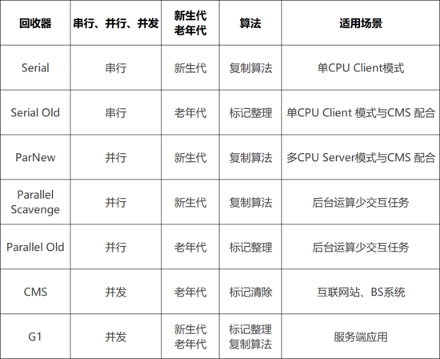

## 对象什么时候会被GC

**引用计数算法**

1. 引用计数算法（ Reference Counting ）比较简单，对每个对象保存一个整数的引用计数器属性，用于记录对象被引用的情况。
2. 对于一个对象A ，只要有任何一个对象引用了A ，则A 的引用计数器就加1；当引用失效时，引用计数器就减1。只要对象A 的引用计数器的值为0，即表示对象A 不可能再被使用，可进行回收。

优点：实现简单，垃圾对象便于辨识；判定效率高，回收没有延迟性。

缺点：

1. 它需要单独的字段存储计数器，这样的做法增加了存储空间的开销。
2. 每次赋值都需要更新计数器，伴随着加法和减法操作，这增加了时间开销。
3. 引用计数器有一个严重的问题，即无法处理循环引用的情况。这是一条致命缺陷，导致在Java 的垃圾回
   收器中没有使用这类算法。

**可达性分析算法**

1. 相对于引用计数算法而言，可达性分析算法不仅同样具备实现简单和执行高效等特点，更重要的是该算法可以有效地解决在引用计数算法中存在的循环引用问题，防止内存泄漏的发生。
2. 相较于引用计数算法，这里的可达性分析就是Java 、C# 选择的。这种类型的垃圾收集通常也叫作追踪性垃圾收集（ Tracing Garbage Collection ）

算法实现思路

1. 可达性分析算法是以根对象集合（ GCRoots ）为起始点，按照从上至下的方式搜索被根对象集合所连接的目标对象是否可达。

2. 使用可达性分析算法后，内存中的存活对象都会被根对象集合直接或间接连接着，搜索所走过的路径称为引用链（ Reference Chain ）
3. 如果目标对象没有任何引用链相连，则是不可达的，就意味着该对象己经死亡，可以标记为垃圾对象。
4. 在可达性分析算法中，只有能够被根对象集合直接或者间接连接的对象才是存活对象。

GC root可以是那些元素？

1. 虚拟机栈中引用的对象
2. 本地方法栈中引用的对象
3. 方法区中常量池中引用的对象
4. 所有被同步锁synchronized持有的对象
5. java虚拟机内部引用的对象
6. 方法区中类静态属性引用的对象

> 小结
>
> 1. 总结一句话就是，除了堆空间的周边，比如：虚拟机栈、本地方法栈、方法区地方对堆空间进行引用的，都可以作为GC Roots 进行可达性分析
> 2. 除了这些固定的GC Roots 集合以外，根据用户所选用的垃圾收集器以及当前回收的内存区域不同，还可以有其他对象“临时性”地加入，共同构成完整GC Roots 集合。比如：分代收集和局部回收（ PartialGC ）
> 3. 可达性分析算法必须在一个能保证一致性快照中进行。

## 说说Java中栈内存和堆内存的区别

1. 从存储数据的角度说：栈内存用来存储基本类型的变量和对象的引用变量，堆内存用来存储Java中的对象；java中基本上所有的对象都存储在堆内存区域。
2. 从是否共享角度说：栈内存线程私有，堆内存线程共享
3. 是否会发生内存的溢出：栈内存不足时，JVM会抛出java.lang.StackOverFlowError（一般发生在递归的时候）；堆内存不足时，JVM会抛出java.lang.OutOfMemoryError
4. 栈的内存远小于堆内存，-Xss选项设置栈的大小。-Xms选项可以设置堆的开始大小;堆一般把最大堆内存和最小堆内存设置为一样。

## java对象创建（5种创建对象的方法）

- 使用new关键字创建对象; 会调用构造方法；
- 使用Class类的newInstance方法(反射机制)；会调用构造方法；
- 使用Constructor类的newInstance方法(反射机制)；会调用构造方法；
- 使用Clone方法创建对象；不会调用构造方法；
- 使用(反)序列化机制创建对象；不会调用构造方法；

## 如果对象的引用被置为 null，垃圾收集器是否会立即回收对象？

不会，在下一个垃圾回收周期中回收对象。

## 你知道哪些JVM调优参数

### 堆内存相关参数

#### 基础堆设置

```java
# 设置初始堆大小（默认物理内存1/64）
-Xms512m  # 或 -XX:InitialHeapSize=536870912

# 设置最大堆大小（默认物理内存1/4）
-Xmx2g    # 或 -XX:MaxHeapSize=2147483648

# 设置年轻代大小（对分代收集器）
-Xmn1g    # 或 -XX:NewSize=1073741824 -XX:MaxNewSize=1073741824

# 设置年轻代中 Eden 和 Survivor 的比例
-XX:SurvivorRatio=8  # Eden:S0:S1 = 8:1:1

# 设置年轻代中 Survivor 区的目标使用率
-XX:TargetSurvivorRatio=50  # 默认50%
```

#### 老年代内存

```java
# 设置年轻代与老年代的比例（1:2）
-XX:NewRatio=2  # 老年代:年轻代 = 2:1

# 设置晋升到老年代的年龄阈值
-XX:MaxTenuringThreshold=15  # 默认15，CMS下默认6

# 大对象直接进入老年代的阈值（仅Serial/ParNew）
-XX:PretenureSizeThreshold=1048576  # 1MB
```

#### 元空间（Metaspace）

```java
# 初始元空间大小（JDK 8+）
-XX:MetaspaceSize=256m

# 最大元空间大小（默认无限制）
-XX:MaxMetaspaceSize=512m

# 设置压缩类空间大小
-XX:CompressedClassSpaceSize=1g

# 禁用元空间自动调整
-XX:MetaspaceSize=256m -XX:MaxMetaspaceSize=256m    
```

- XX:+PrintGC：打印 gc 信息；
- -XX:+PrintGCDetails：打印 gc 详细信息

## 为什么字符串常量池在不同版本的jdk中位置会发生变化

1. 永久代的默认空间大小比较小，但是字符串的使用又比较的频繁，所以进行调整，放入堆内存中，空间比较大。最初是放在永久代中，但是永久代中垃圾回收不频繁。
2. 永久代垃圾回收频率低，大量的字符串无法及时回收，容易进行Full GC 产生STW 或者容易产生OOM：
   PermGen Space
3. 堆中空间足够大，字符串可被及时回收。
4. 在jdk6中是放在永久代中，但是在jdk7/jdk8中，把静态变量和字符串常量池移动到堆内存中，可以频繁的进行垃圾回收操作。

## 概述一下类结构文件

在 Java 中，JVM 可以理解的代码就叫做`字节码`（即扩展名为 `.class` 的文件），它不面向任何特定的处理器，只面向虚拟机。Java 语言通过字节码的方式，在一定程度上解决了传统解释型语言执行效率低的问题，同时又保留了解释型语言可移植的特点。所以 Java 程序运行时比较高效，而且，由于字节码并不针对一种特定的机器，因此，Java 程序无须重新编译便可在多种不同操作系统的计算机上运行。比如scala也可以被编译为.class文件在虚拟机上面运行。

可以说`.class`文件是不同的语言在 Java 虚拟机之间的重要桥梁，同时也是支持 Java 跨平台很重要的一个原因。

## 谈谈你对jvm的理解

Java虚拟机（JVM）是运行 Java 字节码的虚拟机。JVM有针对不同系统的特定实现（Windows，Linux，macOS），目的是使用相同的字节码，它们都会给出相同的结果。

> 什么是字节码文件，采用字节码文件的好处？
>
> 在 Java 中，JVM可以理解的代码就叫做`字节码`（即扩展名为 `.class` 的文件），它不面向任何特定的处理器，只面向虚拟机。Java 语言通过字节码的方式，在一定程度上解决了传统解释型语言执行效率低的问题，同时又保留了解释型语言可移植的特点。所以 Java 程序运行时比较高效，而且，由于字节码并不针对一种特定的机器，因此，Java程序无须重新编译便可在多种不同操作系统的计算机上运行。

java程序从源文件到运行可以经过下面三个步骤：

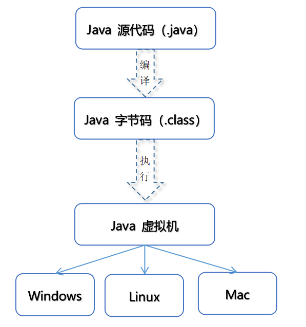


我们需要格外注意的是 .class->机器码 这一步。在这一步 JVM 类加载器首先加载字节码文件，然后通过解释器逐行解释执行，这种方式的执行速度会相对比较慢。而且，有些方法和代码块是经常需要被调用的(也就是所谓的热点代码)，所以后面引进了JIT 编译器，而JIT 属于运行时编译。当 JIT 编译器完成第一次编译后，其会将字节码对应的机器码保存下来，下次可以直接使用。而我们知道，机器码的运行效率肯定是高于 Java 解释器的。这也解释了我们为什么经常会说 Java 是编译与解释共存的语言。

**执行流程:**

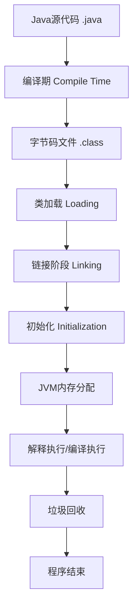


> HotSpot采用了惰性评估(Lazy  Evaluation)的做法，根据二八定律，消耗大部分系统资源的只有那一小部分的代码（热点代码），而这也就是JIT所需要编译的部分。JVM会根据代码每次被执行的情况收集信息并相应地做出一些优化，因此执行的次数越多，它的速度就越快。JDK  9引入了一种新的编译模式AOT(Ahead of Time  Compilation)，它是直接将字节码编译成机器码，这样就避免了JIT预热等各方面的开销。JDK支持分层编译和AOT协作使用。但是 ，AOT  编译器的编译质量是肯定比不上 JIT 编译器的。

**总结：**

Java虚拟机（JVM）是运行 Java  字节码的虚拟机。JVM有针对不同系统的特定实现（Windows，Linux，macOS），目的是使用相同的字节码，它们都会给出相同的结果。字节码和不同系统的  JVM  实现是 Java 语言“一次编译，随处可以运行”的关键所在。

## JVM 配置常用参数有哪些?

**垃圾回收参数**

-Xnoclassgc 是否对类进行回收

-verbose:class -XX:+TraceClassUnloading 查看类加载和卸载信息

-XX:SurvivorRatio Eden和其中一个survivor的比值

-XX:PretenureSizeThreshold 大对象进入老年代的阈值，Serial和ParNew生效

-XX:MaxTenuringThreshold 晋升老年代的对象年龄，默认15, CMS默认是4

-XX:HandlePromotionFailure 老年代担保

-XX:+UseAdaptiveSizePolicy动态调整Java堆中各个区域大小和进入老年代年龄

-XX:ParallelGCThreads 并行回收的线程数

-XX:MaxGCPauseMillis Parallel Scavenge参数，设置GC的最大停顿时间

-XX:GCTimeRatio  Parallel Scavenge参数，GC时间占总时间的比率，默认99%，即1%的GC时间

-XX:CMSInitiatingOccupancyFraction，old区触发cms阈值，默认68%

-XX:+UseCMSCompactAtFullCollection(CMS完成后是否进行一次碎片整理，停顿时间加长)

-XX:CMSFullGCsBeforeCompaction(执行多少次不进行碎片整理的FullGC后进行一次带压缩的)

-XX:+ScavengeBeforeFullGC，在fullgc前触发一次minorGC

**垃圾回收统计信息**

-XX:+PrintGC 输出GC日志

-verbose:gc等同于上面那个

-XX:+PrintGCDetails 输出GC的详细日志

**堆大小设置**

-Xmx:最大堆大小

-Xms:初始堆大小(最小内存值)

-Xmn:年轻代大小

-XX:NewSize和-XX:MaxNewSize 新生代大小

-XX:SurvivorRatio:3 意思是年轻代中Eden区与两个Survivor区的比值。注意Survivor区有两个。如：3，表示Eden：Survivor=3：2，一个Survivor区占整个年轻代的1/5

-XX:NewRatio=4:设置年轻代（包括Eden和两个Survivor区）与年老代的比值（除去持久代）。设置为4，则年轻代与年老代所占比值为1：4，年轻代占整个堆栈的1/5

-Xss栈容量 默认256k

-XX:PermSize永久代初始值

-XX:MaxPermSize 永久代最大值

> 进程是资源分配的基本单位，线程是调度的基本单位

## 虚拟机栈和本地方法栈为什么是线程私有的？

- 虚拟机栈：每个 Java 方法在执行的同时会创建一个栈帧用于存储局部变量表、操作数栈、常量池引用等信息。从方法调用直至执行完成的过程，就对应着一个栈帧在 Java 虚拟机栈中入栈和出栈的过程。
- **本地方法栈：**和虚拟机栈所发挥的作用非常相似，区别是： **虚拟机栈为虚拟机执行 Java 方法 （也就是字节码）服务，而本地方法栈则为虚拟机使用到的 Native 方法服务。** 在 HotSpot 虚拟机中和 Java 虚拟机栈合二为一。所以，为了**保证线程中的局部变量不被别的线程访问到**，虚拟机栈和本地方法栈是线程私有的。

## 说一下 JVM 调优的命令？

jps：JVM Process Status Tool,显示指定系统内所有的HotSpot虚拟机进程。

jstat：jstat(JVM statistics Monitoring)是用于监视虚拟机运行时状态信息的命令，它可以显示出虚拟机进程中的类装载、内存、垃圾收集、JIT编译等运行数据。

jmap：jmap(JVM Memory Map)命令用于生成heap dump文件，如果不使用这个命令，还阔以使用-XX:+HeapDumpOnOutOfMemoryError参数来让虚拟机出现OOM的时候·自动生成dump文件。 jmap不仅能生成dump文件，还阔以查询finalize执行队列、Java堆和永久代的详细信息，如当前使用率、当前使用的是哪种收集器等。

jhat：jhat(JVM Heap Analysis Tool)命令是与jmap搭配使用，用来分析jmap生成的dump，jhat内置了一个微型的HTTP/HTML服务器，生成dump的分析结果后，可以在浏览器中查看。在此要注意，一般不会直接在服务器上进行分析，因为jhat是一个耗时并且耗费硬件资源的过程，一般把服务器生成的dump文件复制到本地或其他机器上进行分析。

jstack：jstack用于生成java虚拟机当前时刻的线程快照。jstack来查看各个线程的调用堆栈，就可以知道没有响应的线程到底在后台做什么事情，或者等待什么资源。 如果java程序崩溃生成core文件，jstack工具可以用来获得core文件的java stack和native stack的信息，从而可以轻松地知道java程序是如何崩溃和在程序何处发生问题。

## 说说类加载的五个过程


类加载是 JVM 加载类文件并在内存中构建 Class 对象的过程，实际上包括三个主要阶段（加载、链接、初始化），其中链接又分为三个子阶段，因此常被称为"五个过程"：

### 完整加载流程图

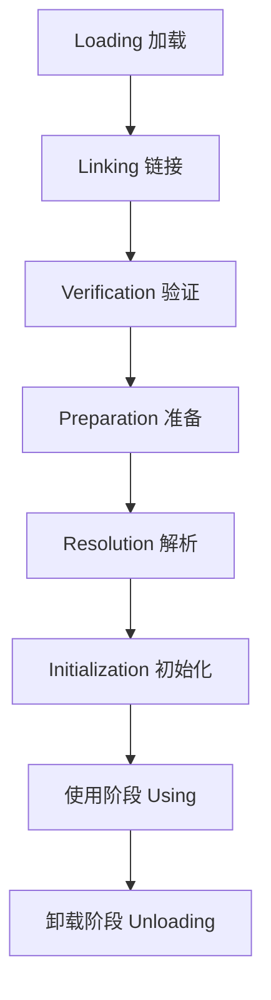

类的加载主要是三个阶段，加载，链接（验证，准备，解析），初始化，其中在链接阶段又分为三个阶段。其中类的加载过程如下：

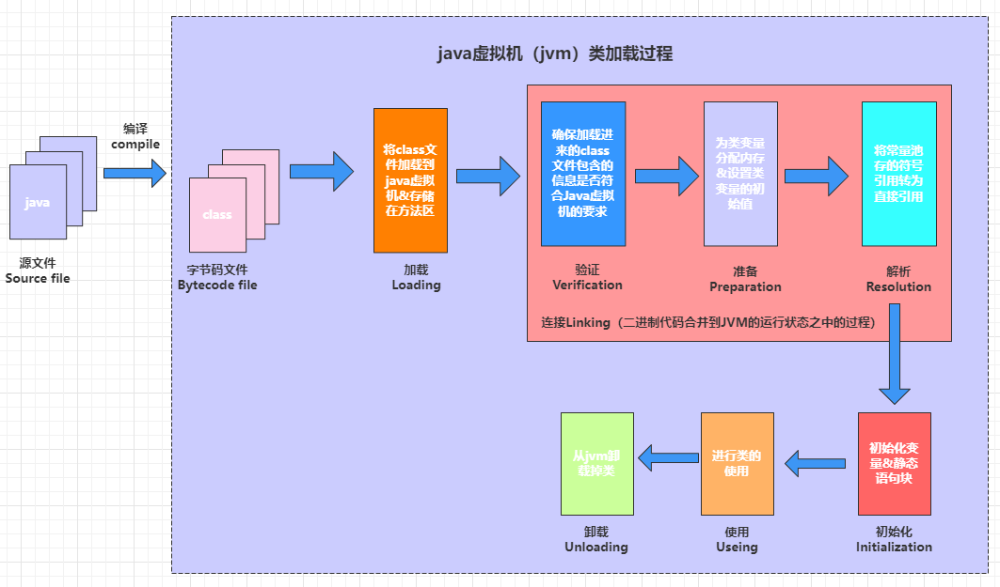

每一个阶段的工作如下：

### **加载阶段**

1. 通过一个类的权限定名，获取定义此类的二进制字节流，注意这个字节流可以是经过编译器编译后产生的字节流，也可以是网络上的字节流文件。
2. 将这个字节流所代表的静态存储结构转化为方法区的运行时数据结构(也就是运行时数据区）。
3. 在堆内存中生成一个代表这个类的java. lang.class对象，作为方法区这个类的各种数据结构的访问入口。
4. 类的加载使用的是双亲委派模型;

> 根据类的全限定名获取类的二进制字节流，并转化成方法区的运行时数据结构，然后生成一个对应的Class对象，作为方法区中该类各种数据的访问入口。（数组由虚拟机创建而不是类加载器）

### **链接阶段**

#### 验证阶段

验证：验证经过第一个阶段后加载进来的字节码文件是否是正确的，防止危害虚拟机的安全。

1、文件格式验证

验证内容：

1. 魔数是否为 0xCAFEBABE
2. 主次版本号是否在 JVM 支持范围内 
3. 常量池中的常量是否有不被支持的类型 
4. CONSTANT_Class_info 的索引是否指向 CONSTANT_Utf8_info

2、元数据验证

验证内容：

1. 类是否有父类（除了 Object） 
2. 是否继承了 final 类 
3. 是否实现了所有抽象方法 
4. 字段、方法是否与父类冲突 
5. 覆盖方法是否合法（不能更严格访问权限等）


3、字节码验证

验证内容：

1. 操作数栈数据类型与指令兼容 
2. 跳转指令指向合理位置 
3. 方法调用传递正确的参数类型和数量 
4. 类型转换安全（子类转父类安全，反之需检查）

4、符号引用验证

验证内容：

1. 符号引用的类、字段、方法是否存在 
2. 访问权限是否允许（private、protected、public） 
3. 方法描述符是否匹配


#### 准备（Preparation）

对类变量以及类分配内存并且初始化，常量在编译的时候已经进行内存分配和初始化操作。准备阶段为类变量分配内存并设置初始值（零值）。

**内存布局:**

```java
// 方法区内存布局（简化版）
public class MethodAreaLayout {
    /*
    准备阶段后的内存布局：
    
    ┌─────────────────────────────────┐
    │       Method Area              │
    ├─────────────────────────────────┤
    │  类型信息 (Type Information)    │
    │  ├─ 全限定名                    │
    │  ├─ 父类信息                    │
    │  ├─ 接口列表                    │
    │  ├─ 字段信息                    │
    │  └─ 方法信息                    │
    ├─────────────────────────────────┤
    │  运行时常量池 (Runtime Constant Pool)│
    │  ├─ 字面量                      │
    │  ├─ 符号引用                    │
    │  └─ 直接引用（解析后）           │
    ├─────────────────────────────────┤
    │  静态变量 (Static Variables)    │
    │  ├─ staticVar = 0               │  ← 准备阶段赋值
    │  ├─ staticLong = 0L             │
    │  ├─ staticObj = null            │
    │  ├─ CONST_INT = 100             │  ← 准备阶段赋值（常量）
    │  └─ NON_CONST_FINAL = 0         │  ← 准备阶段赋零值
    ├─────────────────────────────────┤
    │  方法字节码 (Method Bytecode)   │
    │  即时编译代码 (JIT Code Cache)   │
    └─────────────────────────────────┘
    */
}
```

#### 解析（Resolution）

解析阶段将常量池内的符号引用替换为直接引用。

**符号引用 vs 直接引用**

```shell
public class ReferenceExample {
    public static void main(String[] args) {
        // 符号引用（编译时）
        // CONSTANT_Class_info: "java/lang/Object"
        // CONSTANT_Fieldref_info: "java/lang/System.out"
        // CONSTANT_Methodref_info: "java/io/PrintStream.println"
        
        System.out.println("Hello");  // ← 包含多个符号引用
        
        // 解析后变为直接引用
        // 直接引用可能是：
        // - 指针（对象在堆中的地址）
        // - 偏移量（对象内的字段偏移）
        // - 方法表索引（vtable index）
    }
}
```

**引用类型**

```java
public class ReferenceTypes {
    // 1. 类或接口的解析
    // 符号引用: "java/lang/String" → 直接引用: Class对象地址
    
    // 2. 字段解析
    // 符号引用: "com/Example.staticField" → 直接引用: 字段偏移量
    
    // 3. 方法解析
    // 符号引用: "com/Example.method" → 直接引用: 方法表索引
    
    // 4. 接口方法解析
    // 符号引用: "java/util/List.size" → 直接引用: 方法表索引
}
```

**解析过程:**

```java
// 解析前的字节码
public void demoMethod();
  Code:
     0: getstatic     #2  // Field java/lang/System.out:Ljava/io/PrintStream;
     3: ldc           #3  // String "Hello"
     5: invokevirtual #4  // Method java/io/PrintStream.println:(Ljava/lang/String;)V
     8: return

// 常量池内容
Constant pool:
   #2 = Fieldref       #25.#26  // java/lang/System.out
   #3 = String         #27      // "Hello"
   #4 = Methodref      #28.#29  // java/io/PrintStream.println
   
   // 解析过程：
   // #2 → 找到System类 → 找到out字段 → 计算偏移量
   // #4 → 找到PrintStream类 → 找到println方法 → 获取方法表索引
```

1. 早期解析（Eager Resolution）
- 类加载时解析所有引用
- 优点：一次性完成
- 缺点：加载慢，可能解析无用引用

2. 惰性解析（Lazy Resolution）
- 使用时才解析
- 优点：加载快
- 缺点：运行时可能失败

实际JVM采用混合策略
- 部分引用早期解析（如父类、接口）
- 方法引用惰性解析


### 初始化（Initialization）


初始化阶段就是执行类的构造器方法clinit()的过程。这个方法是jvm把类中的类变量和静态代码块组合起来形成的一个方法

**初始化顺序规则**

规则1：父类先于子类初始化
```java
Parent 静态变量
Parent 静态块
Child 静态变量
Child 静态块
```

使用阶段:使用类

卸载阶段:对类型进行卸载。

## 那些GCroots可以回收

1. 虚拟机栈 本地方法栈引用的对象
2. 方法区中静态属性、常量引用的对象

## 简述 Java 垃圾回收机制。

在 Java 中，程序员是不需要显示的去释放一个对象的内存的，而是由虚拟机自行执行。在 JVM 中，有一个垃圾回收线程，它是低优先级的，在正常情况下是不会执行的，只有在虚拟机空闲或者当前堆内存不足时，才会触发执行，扫面那些没有被任何引用的对象，并将它们添加到要回收的集合中，进行回收。

## 垃圾回收器的基本原理是什么？垃圾回收器可以马上回收内存吗？有什么办法主动通知虚拟机进行垃圾回收？

对于 GC 来说，当程序员创建对象时，GC 就开始监控这个对象的地址、大小以及使用情况。通常，GC 采用有向图的方式记录和管理堆（heap）中的所有对象。通过这种方式确定哪些对象是”可达的”，哪些对象是”不可达的”。当 GC 确定一些对象为“不可达”时，GC 就有责任回收这些内存空间。程序员可以手动执行 System.gc()，通知 GC 运行，但是 Java 语言规范并不保证 GC 一定会执行。

## GC收集器有哪些，CMS收集器和G1收集器的特点

### Java 各版本默认垃圾收集器变化

| Java 版本   | 年轻代默认GC | 老年代默认GC | 备注                        |
| :---------- | :----------- | :----------- | :-------------------------- |
| **JDK 1.0** | Serial       | Serial Old   | 最早的GC                    |
| **JDK 1.2** | Serial       | Serial Old   | 引入 Parallel GC            |
| **JDK 1.3** | Serial       | Serial Old   | 引入 CMS（实验性）          |
| **JDK 1.4** | Parallel     | Serial Old   | Parallel 成为Server模式默认 |
| **JDK 5**   | Parallel     | Parallel Old |                             |
| **JDK 6**   | Parallel     | Parallel Old |                             |
| **JDK 7**   | Parallel     | Parallel Old | 引入 G1（实验性）           |
| **JDK 8**   | Parallel     | Parallel Old | G1 成熟                     |
| **JDK 9**   | **G1**       | **G1**       | G1 成为默认GC               |
| **JDK 10**  | G1           | G1           | 引入 Parallel Full GC       |
| **JDK 11**  | G1           | G1           | 引入 ZGC（实验性）          |
| **JDK 12**  | G1           | G1           | 引入 Shenandoah             |
| **JDK 15**  | G1           | G1           | ZGC/Shenandoah 转正         |
| **JDK 17**  | G1           | G1           | 长期支持版本                |
| **JDK 21**  | G1           | G1           | ZGC 分代模式（实验性）      |


### 已废弃或移除的收集器

| 收集器               | 废弃版本 | 移除版本   | 替代方案 |
| :------------------- | :------- | :--------- | :------- |
| **CMS**              | JDK 9    | **JDK 14** | G1, ZGC  |
| **Parallel+CMS组合** | JDK 9    | JDK 14     | G1       |
| **DefNew+CMS组合**   | JDK 9    | JDK 14     | G1       |

### serial收集器

单线程，串行执行，工作时必须暂停其他工作线程。多用于client机器上，使用**复制算法**。

一个单线程的收集器，在进行垃圾收集时候，必须暂停其他所有的工作线程直到它收集结束，年轻代垃圾收集器。

```java
# 启用参数
-XX:+UseSerialGC
```

工作流程:

```java
年轻代收集（复制算法）：
1. 暂停所有应用线程（STW）
2. 复制Eden和From Survivor的存活对象到To Survivor
3. 年龄达到阈值则晋升到老年代
4. 清空Eden和From Survivor
5. 恢复应用线程

老年代收集（标记-整理算法）：
1. STW暂停
2. 标记所有可达对象
3. 整理内存（清除+压缩）
4. 恢复运行
```

- 特点：CPU利用率最高，停顿时间即用户等待时间比较长。
- 缺点:
  - 长时间STW，不适用服务端
  - 单核CPU性能差
  - 无法充分利用多核CPU
- 适用场景：
  - 小型应用
  - 单核CPU或CPU核心数少的机器
  - 内存小的嵌入式设备
- 通过JVM参数-XX:+UseSerialGC可以使用串行垃圾回收器。

### ParNew收集器（又叫**Parallel收集器**）

> 特点：Parallel Scavenge的并行版本，专为配合CMS设计

serial收集器的多线程版本，server模式下虚拟机首选的新生代收集器，年轻代垃圾收集器。**复制算法**

```java
# 启用参数
-XX:+UseParNewGC
```
与Parallel Scavenge的区别：

```java
public class ParNewVsParallel {
    /*
    ParNew:                        Parallel Scavenge:
    - 配合CMS使用                   - 吞吐量优先
    - 可启用自适应调节               - 默认启用自适应调节
    - 使用-XX:SurvivorRatio等参数   - 关注MaxGCPauseMillis
    - 关注GC停顿时间                - 关注吞吐量
    
    共同点：都使用复制算法，都是并行收集
    */
}
```

采用多线程来通过扫描并压缩堆

- 特点：停顿时间短，回收效率高，对吞吐量要求高。
- 适用场景：大型应用，科学计算，大规模数据采集等。
- 通过JVM参数 XX:+USeParNewGC 打开并发标记扫描垃圾回收器。

**优点**：

- ✅ 多线程并行收集年轻代
- ✅ 与CMS配合良好
- ✅ 减少年轻代GC停顿时间

**缺点**：

- ❌ 不能单独使用，必须配CMS
- ❌ JDK 9+已废弃

### Parallel Scavenge（**并行清除**）收集器

复制算法，可控制吞吐量的收集器。吞吐量即有效运行时间，吞吐量优先，年轻代垃圾收集器。并行垃圾收集器


```java
# 启用参数
-XX:+UseParallelGC           # 年轻代Parallel
-XX:+UseParallelOldGC        # 老年代Parallel Old
# 或简写
-XX:+UseParallelGC           # JDK 8及之前默认

# 核心参数
-XX:ParallelGCThreads=N      # GC线程数（默认CPU核心数）
-XX:MaxGCPauseMillis=N       # 最大GC停顿时间目标（毫秒）
-XX:GCTimeRatio=N            # GC时间与总时间比率（默认99）
-XX:+UseAdaptiveSizePolicy   # 启用自适应调节策略
```

**工作流程:**

```shell
// 自适应调节示例
public class ParallelAdaptive {
    // JVM动态调整以下参数以达目标：
    // - 年轻代大小（-Xmn）
    // - Eden和Survivor比例（-XX:SurvivorRatio）
    // - 晋升年龄阈值（-XX:MaxTenuringThreshold）
    // 目标：在MaxGCPauseMillis和GCTimeRatio间平衡
}
```

**优点**：

- ✅ 吞吐量高（GC时间占比小）
- ✅ 并行收集，多核性能好
- ✅ 自适应调节，减少人工调优
- ✅ JDK 8及之前版本的默认选择

**缺点**：

- ❌ STW时间不可控（虽有目标但不保证）
- ❌ 老年代收集仍有较长暂停
- ❌ 不支持并发收集

**适用场景**：

- 后台计算型应用
- 批处理任务
- 对吞吐量要求高于延迟的场景

### Serial Old收集器

serial的老年代版本，使用整理算法。串行垃圾收集器。

### Parallel Old收集器

Parallel Scavenge收集器的老年代版本，多线程，采用标记压缩算法，基于并行回收。

### CMS（Concurrent Mark Sweep）

> 特点：并发低延迟收集器（已废弃）

```java
# 启用参数（JDK 8及之前）
-XX:+UseConcMarkSweepGC
```

目标是最短回收停顿时间。**标记清除**算法实现，使用多线程的算法去扫描堆，对发现未使用的对象进行回收。分四个阶段：

- 初始标记：GC Roots直连的对象做标记
- 并发标记：多线程方式GC Roots Tracing，这个时候还有可能产生垃圾。
- 重新标记：修正第二阶段标记的记录
- 并发清除。

**工作流程：**

```shell
1. 初始标记（Initial Mark）: STW，标记GC Roots直接关联对象
   - 时间很短
  
2. 并发标记（Concurrent Mark）: 与用户线程并发
   - 遍历整个对象图
   - 时间长但不STW
  
3. 并发预清理（Concurrent Preclean）: 并发
   - 处理并发标记期间的引用变化
  
4. 重新标记（Remark）: STW
   - 修正并发标记期间的变更
   - 使用增量更新或SATB
  
5. 并发清除（Concurrent Sweep）: 并发
   - 清除不可达对象
  
6. 并发重置（Concurrent Reset）: 并发
   - 重置CMS数据结构
```

尽管`CMS`收集器采用的是并发回收（非独占式），**但是在其初始化标记和重新标记这两个阶段中仍然需要执行“Stop-the-World”机制**暂停程序中的工作线程，不过暂停时间并不会太长，因此可以说明目前所有的垃圾收集器都做不到完全不需要“`Stop-the-World`”，只是尽可能地缩短暂停时间。

**关键参数**

```java
-XX:CMSInitiatingOccupancyFraction=75  # 触发CMS的堆使用率
-XX:+UseCMSInitiatingOccupancyOnly    # 仅使用上面阈值
-XX:CMSFullGCsBeforeCompaction=0      # 多少次Full GC后压缩
-XX:+CMSScavengeBeforeRemark          # Remark前做Young GC
-XX:ConcGCThreads=N                   # 并发GC线程数
```

**浮动垃圾问题**

```shell
  // 并发标记期间用户线程继续运行，产生新垃圾
    // CMS无法处理这些"浮动垃圾"，需要预留空间
    
    // 如果预留空间不足，会触发"Concurrent Mode Failure"
    // 此时会退化为Serial Old收集器进行Full GC
    // Full GC时间可能很长（秒级）
```

**内存碎片问题**

```java
public class CMSFragmentation {
    // CMS使用标记-清除算法，不整理内存
    // 长时间运行后产生内存碎片
    
    // 解决方案：
    // 1. -XX:+UseCMSCompactAtFullCollection（Full GC时整理）
    // 2. -XX:CMSFullGCsBeforeCompaction=N（每N次Full GC整理一次）
    // 3. 定期重启应用
}
```
**由于最耗费时间的并发标记与并发清除阶段都不需要暂停工作，所以整体的回收是低停顿的**。

**优点**：

- ✅ 并发收集，大部分工作与用户线程并发
- ✅ 低停顿时间（特别是老年代收集）
- ✅ JDK 8及之前的主流低延迟方案

**缺点**：

- ❌ 内存碎片问题严重
- ❌ 对CPU资源敏感（并发阶段占用CPU）
- ❌ 无法处理浮动垃圾，可能触发Concurrent Mode Failure
- ❌ 配置复杂，调优困难
- ❌ **JDK 9废弃，JDK 14移除**

**适用场景（历史）**：

- Web服务器、响应时间敏感的应用
- JDK 8及以下版本的低延迟需求
- CPU资源充足，内存足够大

以下两款是现代垃圾收集器，下面分别详细介绍:

### G1（Garbage-First）收集器

#### G1特点

> 特点：面向服务端的并发收集器，JDK 9+默认

```java
# 启用参数
-XX:+UseG1GC
```
基本思想是化整为零，将堆分为多个Region，优先收集回收价值最大的Region。

- 并行并发
- 分代收集
- 空间整合（**标记整理**算法）
- 可预测的停顿

**核心概念：Region化内存布局**

```shell
┌───┬───┬───┬───┬───┬───┬───┬───┬───┐
│ E │ S │ S │ O │ H │ E │ S │ O │ F │ ← Region类型：
└───┴───┴───┴───┴───┴───┴───┴───┴───┘    E=Eden, S=Survivor
                                        O=Old, H=Humongous
                                        F=Free
```


在G1中，堆被划分成 许多个连续的区域(region)。采用G1算法进行回收，吸收了CMS收集器特点。
特点：

- 支持很大的堆，高吞吐量
- 支持多CPU和垃圾回收线程
- 在主线程暂停的情况下，使用并行收集
- 在主线程运行的情况下，使用并发收集
- 实时目标：可配置在N毫秒内最多只占用M毫秒的时间进行垃圾回收
- 通过JVM参数 –XX:+UseG1GC 使用G1垃圾回收器

#### G1工作模式

```java
public class G1Modes {
    /*
    1. 年轻代收集（Young GC）
       - STW，并行复制存活对象到Survivor区
       - 类似Parallel收集器但基于Region
    
    2. 并发标记周期（Concurrent Marking Cycle）
       a) 初始标记（Initial Mark）: STW，伴随Young GC
       b) 根区域扫描（Root Region Scanning）
       c) 并发标记（Concurrent Marking）
       d) 重新标记（Remark）: STW
       e) 清理（Cleanup）: STW部分，并发部分
    
    3. 混合收集（Mixed GC）
       - 回收部分老年代Region（Garbage First）
       - 选择回收价值最高的Region
    
    4. Full GC（备用方案）
       - 当回收速度跟不上分配速度时触发
       - 退化为Serial Old算法
    */
}
```

**核心参数:**

```shell
# 基本参数
-XX:MaxGCPauseMillis=200           # 目标暂停时间（默认200ms）
-XX:G1HeapRegionSize=N             # Region大小（1-32M，2的幂）
-XX:InitiatingHeapOccupancyPercent=45 # 触发并发标记的堆使用率

# 并行线程
-XX:ParallelGCThreads=N            # STW阶段并行线程数
-XX:ConcGCThreads=N                # 并发阶段线程数

# 混合收集控制
-XX:G1MixedGCLiveThresholdPercent=85  # Region存活对象阈值
-XX:G1MixedGCCountTarget=8         # 混合GC最大次数
-XX:G1OldCSetRegionThresholdPercent=10 # 一次最多回收的老年代Region比例
```

#### RSet（Remembered Set）机制

```java
public class G1RSet {
    /*
    每个Region都有一个RSet，记录哪些Region引用了本Region的对象
    避免全堆扫描，实现增量回收
    
    RSet精度：
    - 年轻代Region：记录外部引用（Card Table方式）
    - 老年代Region：记录Region间引用（更精确）
    */
}
```

#### SATB（Snapshot-At-The-Beginning）

```java
public class G1SATB {
    // 并发标记开始时创建对象图快照
    // 使用写屏障记录并发期间被覆盖的引用
    // 确保不会漏标
    
    // 写屏障伪代码：
    void writeBarrier(Object* field, Object* newValue) {
        Object* oldValue = *field;
        if (oldValue != null && isMarkingInProgress()) {
            satbBuffer.record(oldValue);  // 记录旧引用
        }
        *field = newValue;
    }
}
```

**优点**：

- ✅ 可预测的停顿时间（软实时）
- ✅ 高吞吐量与低延迟平衡
- ✅ 内存碎片化程度低（局部整理）
- ✅ JDK 9+默认，成熟稳定
- ✅ 适合大内存（4G+）

**缺点**：

- ❌ 内存占用较高（RSet、SATB开销）
- ❌ 小内存场景不如Parallel
- ❌ Full GC时退化为串行
- ❌ 写屏障开销比CMS高

**适用场景**：

- JDK 9+的默认选择
- 内存大于4G的服务端应用
- 需要平衡吞吐量和延迟的场景


### ZGC（Z Garbage Collector）

**特点**：可扩展的低延迟收集器，JDK 15+生产就绪

```shell
# 启用参数
-XX:+UseZGC
# JDK 15+
-XX:+UseZGC -XX:+UseNUMA
# JDK 21+ 实验性分代模式
-XX:+UseZGC -XX:+ZGenerational
```

**核心技术**：

1. **染色指针（Colored Pointers）**

```java
64位指针布局（Linux x86_64）：
┌────┬────┬────┬──────────────────────┐
│ 18 │ 1  │ 1  │ 1  │       42        │
└────┴────┴────┴────┴──────────────────────┘
  ↑    ↑    ↑    ↑           ↑
 保留  M0   M1  Remapped     地址

标志位：
- M0 (Marked0): 标记阶段0的标记位
- M1 (Marked1): 标记阶段1的标记位
- Remapped: 重映射状态位
```


2. **读屏障（Load Barrier）**

```java
// 伪代码：在每次对象访问时插入
Object* zgc_load_barrier(Object** obj_ptr) {
    Object* obj = *obj_ptr;
    if (obj->is_marked()) {
        // 慢速路径：处理染色指针
        obj = remap_pointer(obj);
        *obj_ptr = obj;  // 自愈（Self-Healing）
    }
    return obj;
}
```

**工作阶段**：

```shell
1. 并发标记（Concurrent Mark）
   - 标记可达对象，使用染色指针M0/M1位
   
2. 并发重定位准备（Concurrent Relocate Preparation）
   - 选择要重定位的Region
   
3. 并发重定位（Concurrent Relocate）
   - 移动对象到新位置，更新引用
   
4. 并发重映射（Concurrent Remap）
   - 更新所有指向旧位置的引用
```

**关键参数**：

```shell
# 基础参数
-Xmx<N>g                         # ZGC需要设置堆大小
-XX:ConcGCThreads=N              # 并发GC线程数（默认≈总线程数/8）

# 高级参数
-XX:ZAllocationSpikeTolerance=2.0 # 分配尖峰容忍度因子
-XX:ZCollectionInterval=300      # 强制GC间隔（秒，0=禁用）
-XX:ZFragmentationLimit=25       # 碎片化限制百分比
-XX:ZProactive=N                 # 主动GC（0=禁用，1=启用）

# JDK 17+
-XX:ZUncommitDelay=<seconds>     # 内存归还延迟
```

**优点**：

- ✅ 极低停顿时间（<10ms，甚至<1ms）
- ✅ 停顿时间不随堆大小增长
- ✅ 支持TB级大堆
- ✅ 并发程度高
- ✅ 支持NUMA架构

**缺点**：

- ❌ JDK 15+才生产就绪
- ❌ Windows/macOS支持较晚
- ❌ 吞吐量略低于G1（~15%）
- ❌ 内存占用较大
- ❌ 不支持压缩指针（-XX:+UseCompressedOops）

**适用场景**：

- 超大堆内存（几十GB到TB级）
- 超低延迟要求（游戏、金融交易）
- JDK 15+环境
- NUMA架构服务器


### Shenandoah

**特点**：RedHat开发的低延迟GC，与ZGC竞争

```java
# 启用参数
-XX:+UseShenandoahGC
# JDK 12-15需要解锁实验性功能
-XX:+UnlockExperimentalVMOptions -XX:+UseShenandoahGC
```

**核心技术**：

1. **Brooks指针**

```shell
对象布局：
┌──────────────┬────────────────┐
│ 对象头（含Brooks指针） │   对象数据      │
└──────────────┴────────────────┘

Brooks指针指向对象的转发地址，用于并发移动
```

2. **并发压缩**

```java
public class ShenandoahConcurrentEvac {
    // Shenandoah可以在用户线程运行的同时移动对象
    // 读写屏障处理转发指针
    
    // 读屏障：
    Object readBarrier(Object obj) {
        Object fwd = obj.brooksPointer;
        return fwd != null ? fwd : obj;
    }
    
    // 写屏障：
    void writeBarrier(Object* field, Object newVal) {
        // 记录引用变化
        *field = newVal;
    }
}
```

**工作阶段**：

```shell
1. 初始标记（Init Mark）: STW
2. 并发标记（Concurrent Marking）
3. 最终标记（Final Mark）: STW
4. 并发清理（Concurrent Cleanup）
5. 并发回收（Concurrent Evacuation）← 关键阶段
6. 更新引用（Init Update Refs）: STW
7. 并发更新引用（Concurrent Update Refs）
8. 最终更新引用（Final Update Refs）: STW
```


**关键参数**：

```shell
# 基础参数
-XX:ShenandoahGCMode=generational  # JDK 21+ 分代模式
-XX:ShenandoahGCHeuristics=adaptive # 启发式策略

# 调优参数
-XX:ShenandoahTargetPauseTime=200  # 目标暂停时间
-XX:ShenandoahAllocationThreshold=70 # 触发GC的分配阈值
-XX:ShenandoahUncommitDelay=1000   # 内存归还延迟（毫秒）
```


**与ZGC对比**：

```java
public class ShenandoahVsZGC {
    /*
    Shenandoah:                  ZGC:
    - RedHat开发                 - Oracle开发
    - Brooks指针                 - 染色指针
    - 支持压缩指针                - 不支持压缩指针
    - 吞吐量略高                  - 延迟略低
    - JDK 12引入                 - JDK 11引入
    - 分代模式（JDK 21+）        - 分代模式（JDK 21+实验）
    */
}
```

**优点**：

- ✅ 极低停顿时间（与ZGC相当）
- ✅ 支持压缩指针（内存更省）
- ✅ 吞吐量比ZGC略好
- ✅ 分代模式成熟度更高（JDK 21+）

**缺点**：

- ❌ 社区支持不如ZGC
- ❌ JDK 12+才可用
- ❌ 写屏障开销较大
- ❌ 文档和案例较少

**适用场景**：

- 需要低延迟且使用压缩指针的场景
- RedHat OpenJDK用户
- JDK 12+环境


### 如何选择垃圾收集器

```shell
选择GC的决策流程：
1. JDK版本？ 
   ├─ JDK 8：Parallel（吞吐）或 CMS（延迟，但已废弃）
   ├─ JDK 11：G1（默认）或 ZGC（大堆低延迟）
   ├─ JDK 17+：G1/ZGC/Shenandoah
   
2. 堆大小？
   ├─ < 4GB：Parallel 或 G1
   ├─ 4-100GB：G1
   ├─ > 100GB：ZGC 或 Shenandoah
   
3. 延迟要求？
   ├─ < 200ms：G1
   ├─ < 10ms：ZGC 或 Shenandoah
   
4. 吞吐量优先？
   ├─ 是：Parallel 或 G1
   ├─ 否：ZGC 或 Shenandoah
```

### 不同垃圾收集器对比

| 收集器         | 算法          | 并行 | 并发 | STW时间  | 吞吐量   | 内存开销 | JDK状态           |
| :------------- | :------------ | :--- | :--- | :------- | :------- | :------- | :---------------- |
| **Serial**     | 复制/标记整理 | ❌    | ❌    | 长       | 低       | 最小     | 保留              |
| **Parallel**   | 复制/标记整理 | ✅    | ❌    | 中       | **高**   | 小       | JDK 8默认         |
| **ParNew**     | 复制          | ✅    | ❌    | 中       | 中       | 小       | **废弃**          |
| **CMS**        | 标记清除      | ✅    | ✅    | 短       | 中       | 中       | **移除（JDK14）** |
| **G1**         | 复制/标记整理 | ✅    | ✅    | 可控     | 高       | **大**   | **JDK 9+默认**    |
| **ZGC**        | 染色指针      | ✅    | ✅    | **极短** | 中-高    | 大       | JDK 15+生产       |
| **Shenandoah** | Brooks指针    | ✅    | ✅    | **极短** | 中-高    | 中       | JDK 12+可用       |
| **Epsilon**    | 无操作        | ❌    | ❌    | 无       | **最高** | 最小     | 特殊用途          |

## Minor GC,Major GC 和Full GC分别发生在什么时候，各有什么特点？

**新生代 GC（Minor GC）**:指发生新生代的的垃圾收集动作，Minor GC 非常频繁，回收速度一般也比较快。

**老年代 GC（Major GC/Full GC）**:指发生在老年代的 GC，出现了 Major GC 经常会伴随至少一次的 Minor GC（并非绝对），Major GC 的速度一般会比 Minor GC 的慢 10 倍以上。


## 说说常用的内存调试工具？

- jps:查看虚拟机进程的状况，如进程ID
- jmap:用于生成堆转储快照文件（某一时刻的）
- jstack:用来生成线程快照（某一时刻的）。生成线程快照的主要目的是定位线程长时停顿的原因（如死锁，死循环，等待I/O 等），通过查看各个线程的调用堆栈，就可以知道没有响应的线程在后台做了什么或者等待什么资源。
- jconsole:主要是内存监控和线程监控。内存监控：可以显示内存的使用情况。线程监控：遇到线程停顿时，可以使用这个功能。
- jstat:虚拟机统计信息监视工具。如显示垃圾收集的情况，内存使用的情况。


## 描述一下 JVM 加载 Class 文件的原理机制?

Java 语言是一种具有动态性的解释型语言，类（Class）只有被加载到 JVM 后才能运行。当运行指定程序时，JVM 会将编译生成的 .class 文件按照需求和一定的规则加载到内存中，并组织成为一个完整的 Java 应用程序。这个加载过程是由类加载器完成，具体来说，就是由 ClassLoader 和它的子类来实现的。类加载器本身也是一个类，其实质是把类文件从硬盘读取到内存中。

类的加载方式分为隐式加载和显示加载。隐式加载指的是程序在使用 new 等方式创建对象时，会隐式地调用类的加载器把对应的类加载到 JVM 中。显示加载指的是通过直接调用 class.forName() 方法来把所需的类加载到 JVM 中。

任何一个工程项目都是由许多类组成的，当程序启动时，只把需要的类加载到 JVM 中，其他类只有被使用到的时候才会被加载，采用这种方法一方面可以加快加载速度，另一方面可以节约程序运行时对内存的开销。此外，在 Java 语言中，每个类或接口都对应一个 .class 文件，这些文件可以被看成是一个个可以被动态加载的单元，因此当只有部分类被修改时，只需要重新编译变化的类即可，而不需要重新编译所有文件，因此加快了编译速度。

在 Java 语言中，类的加载是动态的，它并不会一次性将所有类全部加载后再运行，而是保证程序运行的基础类（例如基类）完全加载到 JVM 中，至于其他类，则在需要的时候才加载。

类加载的主要步骤：

- 装载。根据查找路径找到相应的 class 文件，然后导入。
- 链接。链接又可分为 3 个小步：
  - 检查，检查待加载的 class 文件的正确性。
  - 准备，给类中的静态变量分配存储空间。
  - 解析，将符号引用转换为直接引用（这一步可选）
- 初始化。对静态变量和静态代码块执行初始化工作。

## 双亲委派模型，问什么需要双亲委派模型，有什么优点？


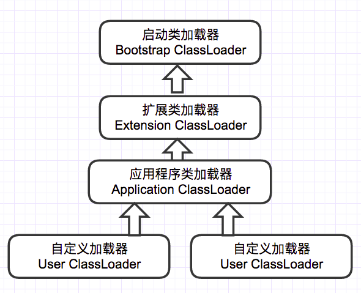

1. 启动类加载器（引导类加载器 Bootstrap ClassLoader）:此加载器用来加载java的核心库（JAVA_HOME/jre/lib/rt.jar）下面的内容，用于提供jvm自身需要的类。 
2. 扩展类加载器：主要加载%JAVA_HOME%\lib\ext目录下的类库文件或者java.ext.dirs系统变量所指定的类库文件（加载扩展库） 
3. 程序应用类加载器：主要加载用户类路径(classpath)所指定的类库。 
4. 用户自定义类加载器：加载用户自定义的类库。

为什么使用双亲委派机制对类进行加载？

- 避免类的重复加载，这样可以保证一个类只有一个类加载器进行加载。
- 保护程序的安全，防止核心的api被篡改。

## Java内存分配

- 寄存器：我们无法控制。
- 静态域：static定义的静态成员。
- 常量池：编译时被确定并保存在 .class 文件中的（final）常量值和一些文本修饰的符号引用（类和接口的全限定名，字段的名称和描述符，方法和名称和描述符）。
- 非 RAM 存储：硬盘等永久存储空间。
- 堆内存：new 创建的对象和数组，由 Java 虚拟机自动垃圾回收器管理,存取速度慢。
- 栈内存：基本类型的变量和对象的引用变量（堆内存空间的访问地址），速度快，可以共享，但是大小与生存期必须确定，缺乏灵活性。

Java 堆的结构是什么样子的？什么是堆中的永久代（Perm Gen space）?

- JVM 的堆是运行时数据区，所有类的实例和数组都是在堆上分配内存。它在 JVM 启动的时候被创建。对象所占的堆内存是由自动内存管理系统也就是垃圾收集器回收。
- 堆内存是由存活和死亡的对象组成的。存活的对象是应用可以访问的，不会被垃圾回收。死亡的对象是应用不可访问尚且还没有被垃圾收集器回收掉的对象。一直到垃圾收集器把这些 对象回收掉之前，他们会一直占据堆内存空间。

## 分派：静态分派和动态分派

**解析**

**类加载时进行**，将部分方法的符号引用转化为直接引用。这种解析能够成立的前提是：方法在程序真正运行之前就有一个可确定的调用版本，并且这个方法的调用版本在运行期是不可改变的。换句话说，调用目标在程序代码写好、编译器进行编译那一刻就已经确定下来。这类方法的调用被称为解析（Resolution）。这里边有两个重要的点：**编译期可知，运行期不可变**只要能被invokestatic和invokespecial指令调用的方法，都可以在解析阶段中确定唯一的调用版本，Java语言里符合这个条件的方法共有**静态方法、私有方法、实例构造器、父类方法4种，再加上被final修饰的方法**（尽管它使用invokevirtual指令调用），这5种方法调用会在类加载的时候就可以把符号引用解析为该方法的直接引用。这些方法统称为“非虚方法”（Non-VirtualMethod），与之相反，其他方法就被称为“虚方法”（Virtual Method）。

**分派**

这里所谓的分派指的是在Java中对方法的调用。Java中有三大特性：封装、继承和多态。分派是多态性的体现，Java虚拟机底层提供了我们开发中“重写”和“重载”的底层实现。**其中重载属于静态分派，而重写则是动态分派的过程**。除了使用分派的方式对方法进行调用之外，还可以使用解析调用，解析调用是在编译期间就已经确定了，在类装载的解析阶段就会把符号引用转化为直接引用，不会延迟到运行期间再去完成。而分派调用则既可以是静态的也可以是动态（就是这里的静态分派和动态分派）的。

**方法解析**

对于方法的调用，虚拟机提供了五条方法调用的字节码指令，分别是：

| 指令              | 用途         | 特点                       | 分派类型 |
| :---------------- | :----------- | :------------------------- | :------- |
| `invokestatic`    | 调用静态方法 | 类级别，不依赖对象         | 静态分派 |
| `invokespecial`   | 调用特殊方法 | 构造器、私有方法、父类方法 | 静态分派 |
| `invokevirtual`   | 调用虚方法   | 普通实例方法，支持多态     | 动态分派 |
| `invokeinterface` | 调用接口方法 | 接口方法调用               | 动态分派 |
| `invokedynamic`   | 动态调用     | 动态语言支持、Lambda       | 动态绑定 |

其中，invokestatic和invokespecial都可以在类加载阶段确定方法的唯一版本，因此，在类加载阶段就可以把符号引用解析为直接引用，在调用时刻直接找到方法代码块的内存地址进行执行（编译时已经找到了，并且存在方法调用的入口）；后三个指令则是在运行期间动态绑定方法的直接引用。

`invokestatic`指令和`invokespecial`指令调用的方法称为非虚方法，注意，`final`修饰的方法也属于虚方法。

**静态分派**

静态分派只会涉及重载，而重载是在编译期间确定的，那么静态分派自然是一个静态的过程（因为还没有涉及到Java虚拟机）。静态分派的最直接的解释是在重载的时候是通过参数的静态类型而不是实际类型作为判断依据的。

**动态分派**

动态分派发生在运行阶段，根据变量的**实际类型**（运行时类型）来确定调用的方法。方法重写（Override）是动态分派的典型应用：

## 那些内存区域会发生OOM以及会进行GC？

会发生OOM的内存区域：本地方法栈，虚拟机栈，堆区域，方法区

会发生GC的区域：堆区，方法区

既没有GC又没有OOM的区域：PC寄存器


## 新生代中区分Eden和Survivor的作用是什么

新生代分为 3 个分区：Eden（伊甸园）、Survivor0、Survivor1；其中Survivor0、 Survivor1 合起来成为Survivor（幸存区）; 如果没有Survivor，Eden区每进行一次`Minor GC`，存活的对象都会被送到老年代。老年代将很快被填满，老年代每发生一次`Full GC` 的速度比 `Minor GC`慢10倍；所以产生了Survivor区，每产生一次minor GC操作，都会把当前存活下来的对象放入Survivor区域中，等到对象存活到一定的年龄，然后在放到老年代，等老年代块满的时候，在进行一次major gc释放内存空间。对象年龄默认是16岁。

> 1. Survivor 的作用就是减少老年代`Full GC` 的次数,相当于缓冲带；
> 
> 2. Eden和Survivor的比例分配8:1:1
>
> 3. 默认情况下新生代和老年代的比例是1:2的比例。

## 简述分代垃圾回收器工作流程

1. new 的对象先放eden 区。此区有大小限制。
2. 当伊甸园的空间填满时，程序又需要创建对象， JVM 的垃圾回收器将对伊甸园区进行垃圾回收（ Minor GC ),将伊甸园区中的不再被其他对象所引用的对象进行销毁。再加载新的对象放到伊甸园区，没有被销毁的对象放入survivor0 区域。
3. 如果eden区域满，再次触发垃圾回收，此时上次幸存下来的放到幸存者survivor0 区的，如果没有回收，就会放到幸存者survivor1 区，然后把这一次eden中存活的对象也放到survivor1 区。
4. ……..
5. 如果再次经历垃圾回收，此时会重新放回幸存者survivor0 区，接着再去幸存者survivor1 区。
6. 啥时候能去养老区呢？可以设置次数。默认是15次。·可以设置参数： -XX:MaxTenuringThreshold =进行设置,也就是设置对象的生存年龄。
7. 在养老区，对象相对悠闲。当老年区内存不足时，再次触发GC：Major GC ，进行养老区的内存清理。
8. 若养老区执行了Major GC 之后发现依然无法进行对象的保存，就会触发FULL GC操作，如果内存空间还是不够，就会产生OOM 异常。

> 关于垃圾回收，频繁发生在新生代，很少发生在老年代，几乎不会再永久代或者元空间发生，

对象内存空间分配的特殊情况

1. 如果来了一个新对象，先看看 Eden 是否放的下？
    1. 如果Eden 放得下，则直接放到 Eden 区
    2. 如果 Eden 放不下，则触发YGC ，执行垃圾回收，看看还能不能放下？
2. 将对象放到老年区又有两种情况：
   1. 如果 Eden 执行了 YGC 还是无法放不下该对象，那没得办法，只能说明是超大对象，只能直接放到老年代 
   2. 那万一老年代都放不下，则先触发FullGC ，再看看能不能放下，放得下最好，但如果还是放不下，那只能报OOM
3. 如果 Eden 区满了，将对象往幸存区拷贝时，发现幸存区放不下啦，那只能便宜了某些新对象，让他们直接晋升至老年区

**图示过程：**


> Minor GC和Full GC触发条件:
> 
> 答默认情况下发生15次Minor GC之后就会触发一次Full GC。
>
> 触发Major GC是eden区域的行为，不是幸存者区域的行为，eden是主动的，幸存者区是被动行为。


## 简述CMS收集器

CMS（Concurrent Mark Sweep）收集器基于`标记—清除算法`实现的收集器，是一种以获取最短回收停顿时间为目标的收集器。主要优点是并发收集，低停顿，在cpu多核的情况下性能较好。在启动 JVM 的参数加上

“-XX:+UseConcMarkSweepGC”来指定使用 CMS 垃圾回收器；**其使用在老年代 可以配合新生代的Serial和ParNew收集器一起使用；由于 CMS 使用 标记—清除算法 GC时会产生大量碎片，有可能提前触发Full GC；如果在老年代充满之前无法回收不可达对象，或者没有足够的空间满足分配就会导致Concurrent Mode Failure（并发模式故障）**;

## 介绍一下G1垃圾收集器(Garbage-First Collector)

G1（Garbage-First）从整体来看是基于`标记—整理`算法实现的收集器，能够实现并发并行，对cpu利用率较高，减少停顿时间。目标是取代jdk1.5发布的CMS收集器。**G1收集器收集范围是老年代和新生代，不需要结合其他收集器使用,G1收集器可预测垃圾回收的停顿时间,对空间进行整合；由于G1是基于复制算法实现，当没有足够的空间（region）分配存活的对象就会导致Allocation (Evacuation) Failure（分配失败）**；


G1（Garbage-First）是一款面向服务端应用的垃圾收集器，JDK 9+ 的默认垃圾收集器。它的核心设计思想是可预测的停顿时间模型，将堆内存划分为多个固定大小的区域（Region），通过跟踪每个区域的垃圾价值（回收可获得的空间大小和回收所需时间），优先回收垃圾最多的区域，实现高吞吐量和可控停顿时间的平衡。
核心特点：
1. 面向服务端应用：针对多核处理器、大内存的机器设计 
2. 可预测的停顿时间：通过设置目标停顿时间（如200ms）来控制GC行为 
3. 并发与并行结合：充分利用多核优势 
4. 分代收集：仍然遵循分代理论 
5. 空间整合：基于Region的内存布局，避免碎片问题


### 内存布局与分区策略


```java

堆内存布局：
        ┌─────────────────────────────────────────┐
        │         年轻代 (Young Generation)        │
        │  ┌──────────┬──────────┬──────────┐     │
        │  │ Eden区   │ Survivor │ Survivor │     │
        │  │ (Region) │ (Region) │ (Region) │     │
        │  └──────────┴──────────┴──────────┘     │
        │                                           │
        │          老年代 (Old Generation)          │
        │  ┌──────────┬──────────┬──────────┐     │
        │  │   Old    │   Old    │   Humong │     │
        │  │ (Region) │ (Region) │ (Region) │     │
        │  └──────────┴──────────┴──────────┘     │
        │                                           │
        │          大对象区 (Humongous Region)      │
        └─────────────────────────────────────────┘
```

Region大小：1MB~32MB，堆内存总大小/2048

角色类型： 
- Eden Region：新对象分配区 
- Survivor Region：存活对象过渡区 
- Old Region：长期存活对象区 
- Humongous Region：大对象区（>50% Region大小） 
- Available Region：空闲区


**G1l垃圾回收总体流程:**

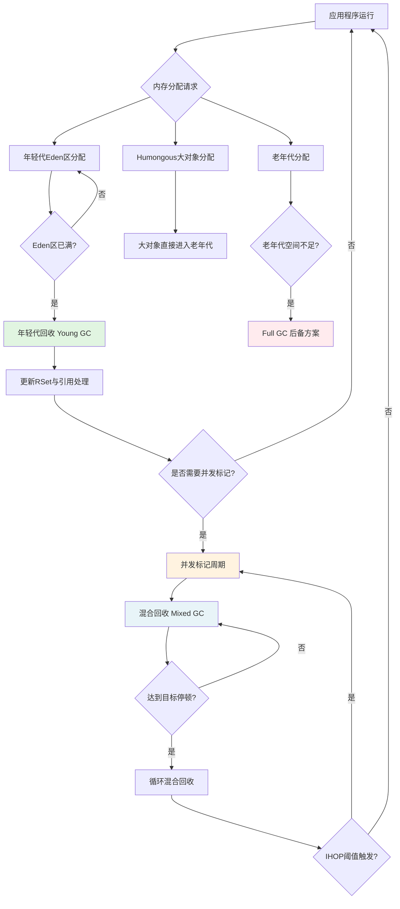

### G1的垃圾回收过程

垃圾回收流程:

```java
启动 → 并发标记周期 → 混合回收 → 年轻代回收（循环）
```

#### 年轻代GC（Young GC）

触发条件：
1. Eden区填满时触发
2. 当分配请求无法满足时

```java
// 伪代码表示年轻代回收过程
void YoungGC::collect() {
    // 1. 根扫描（STW）
    scan_roots();

    // 2. 更新和处理RSet
    update_remset();

    // 3. 对象复制（STW）
    // 从Eden/Survivor复制到Survivor/Old
    copy_live_objects();

    // 4. 处理引用
    process_references();

    // 5. 清理
    cleanup();
}
```

年轻代回收的四个阶段:

##### 阶段1：根扫描（Root Scanning）- STW

```java
操作步骤：
1. 扫描GC Roots：栈、寄存器、全局变量、JNI引用等
2. 处理系统字典、JVMTI等特殊Roots
3. 标记初始存活对象集合

时间：通常5-50ms，取决于Root数量
```

##### 阶段2：更新和处理RSet（Remembered Set）- 部分并行

```shell
操作步骤：
1. 更新RSet：处理并发期间记录的跨Region引用
2. 筛选待扫描的卡表条目
3. 并行处理脏卡（Dirty Cards）

时间：通常10-100ms，与修改频率相关
```

##### 阶段3：对象复制（Evacuation）- STW核心阶段

```shell
操作步骤：
1. 从Eden和Survivor Region复制存活对象,每个工作线程处理分配到的Region
2. 对象晋升：年龄达到阈值进入老年代,咩有达到阈值的对象，留在年轻代，分配到Survivor
3. 更新对象引用地址
4. 释放原Region空间

时间：通常20-200ms，与存活对象数量成正比
```

##### 阶段4：引用处理与清理（Reference Processing）- 部分并行

```shell
操作步骤：
1. 处理软引用、弱引用、虚引用、FinalReference
2. 执行Finalizer
3. 清理卡表
4. 释放Region元数据

时间：通常5-50ms，取决于引用数量
```

年轻代回收后的状态变化:

```java
回收前：
Eden Regions:  [已满] [已满] [已满]
Survivor:      [部分对象]
Old:           [空闲空间]

回收后：
Eden Regions:  [全部空闲]
Survivor:      [新生对象 + 晋升失败对象]
Old:           [新增晋升对象]
```

回收步骤总结：

1. 根枚举：扫描GC Roots（栈、全局变量、JNI等） 
2. 标记存活对象：使用SATB（Snapshot-At-The-Beginning）算法 
3. 对象复制：存活对象从Eden/Survivor复制到新的Survivor区 
4. 年龄计数：对象年龄增加，达到阈值（默认15）则晋升老年代


#### 并发标记周期（Concurrent Marking Cycle）

触发条件：IHOP机制：

```java
// Initiating Heap Occupancy Percentage 触发逻辑
boolean should_start_concurrent_mark() {
    // 计算老年代使用率
    double old_gen_occupancy = old_gen_used() / old_gen_capacity();
    
    // IHOP动态调整（JDK 9+）
    double ihop_threshold = calculate_adaptive_ihop();
    
    // 检查是否达到阈值
    if (old_gen_occupancy >= ihop_threshold) {
        // 并且距离上次标记周期足够久
        if (time_since_last_mark() > min_interval) {
            return true;
        }
    }
    
    return false;
}
```

并发标记的五个阶段:

```shell
初始标记（STW） → 根区域扫描 → 并发标记 → 重新标记（STW） → 清理（STW）
```

##### 阶段1：初始标记（Initial Mark）- STW

```shell
目的：标记GC Roots直接可达的对象，作为并发标记的起点

操作步骤：
1. 暂停所有应用线程（STW）
2. 扫描并标记Roots直接引用的对象
3. 记录Top指针（TAMS：Top at Mark Start）
4. 设置并发标记所需的初始状态

时间：通常很短，5-20ms
```

##### 阶段2：根区域扫描（Root Region Scanning）

```java
目的：扫描Survivor Region中的对象引用，因为它们在初始标记后可能变化

操作步骤：
1. 扫描所有Survivor Region
2. 标记从Survivor可达的对象
3. 必须在Young GC前完成（否则需要中止）

时间：与应用线程并发执行，可能被Young GC中断
```

##### 阶段3：并发标记（Concurrent Marking）

```shell
目的：标记整个堆中的存活对象，与应用程序并发执行

操作步骤：
1. 从标记栈开始深度优先遍历对象图
2. 使用三色标记算法（白-灰-黑）
3. 处理SATB（Snapshot-At-The-Beginning）记录
4. 处理引用对象

时间：与堆大小和对象图复杂度相关，通常100ms-几秒
```
SATB（Snapshot-At-The-Beginning）机制：

```java
// 在并发标记期间，应用程序修改对象引用时
void write_barrier(oop* field, oop new_val) {
    // 1. 记录原来的值（创建快照）
    oop old_val = *field;

    if (old_val != NULL && !is_marked(old_val)) {
        // 2. 将旧引用加入SATB缓冲区
        satb_buffer->record(old_val);
    }

    // 3. 执行实际写操作
    *field = new_val;
}
```


##### 阶段4：重新标记（Remark）- STW

```shell
目的：修正并发标记期间遗漏的标记，完成最终标记

操作步骤：
1. 暂停所有应用线程（STW）
2. 处理SATB缓冲区中的记录
3. 遍历线程栈和系统Roots
4. 处理引用对象（弱/软/虚引用）
5. 完成存活对象标记

时间：通常50-200ms
```

##### 阶段5：清理（Cleanup）- STW

```shell
目的：统计Region存活数据，为混合回收做准备

操作步骤：
1. 统计每个Region的存活对象比例
2. 回收完全空闲的Region
3. 更新RSet
4. 排序Region（按回收效率）
5. 重置标记状态

时间：通常20-100ms
```

**回收小结**

- 初始标记：标记GC Roots直接关联的对象 
- 并发标记：与应用程序并发执行，标记整个堆中的存活对象 
- 重新标记：修正并发标记期间的变化 
- 清理：统计Region中的存活对象，回收完全空白的Region

####  混合GC（Mixed GC）

触发条件：老年代占用率达到阈值（-XX:InitiatingHeapOccupancyPercent，默认45%）

```java
bool G1Policy::should_start_mixed_gc() {
    // 1. 并发标记周期必须完成
    if (!concurrent_mark_cycle_completed()) {
        return false;
    }

    // 2. 有足够的可回收老年代Region
    if (old_gen_garbage_regions() < min_old_regions_for_mixed_gc) {
        return false;
    }

    // 3. 距离上次Young GC足够近
    if (time_since_last_gc() < min_interval_between_gc) {
        return false;
    }

    // 4. 检查停顿时间目标
    double estimated_time = estimate_mixed_gc_time();
    if (estimated_time > max_gc_pause_time) {
        return false; // 预计时间太长，等待更多垃圾累积
    }

    return true;
}
```

回收目标：年轻代 + 部分高收益的老年代Region

```java
// 混合GC回收选择策略
class MixedGC {
    // 回收优先级队列：按回收价值排序
    PriorityQueue<HeapRegion*> _collection_set;

    void collect() {
        // 1. 选择回收集（Collection Set） 根据停顿时间目标选择Region
        // 包含所有年轻代Region + 部分老年代Region
        select_collection_set();

        // 2. 并发标记确定活跃度
        concurrent_marking();

        // 3. 复制/清除阶段
        evacuate_regions();  // 复制存活对象
    }
};
```

混合回收的三个阶段：

##### 阶段1：回收集选择（Collection Set Selection）

```shell
目的：选择要回收的Region集合，包括年轻代和部分老年代

选择策略：
1. 所有Eden Region（必须回收）
2. 所有Survivor Region（必须回收）
3. 计算可用停顿时间
4. 按回收效率排序的老年代Region 按GC效率排序老年代Region
5. 考虑停顿时间预算 选择Region直到达到时间预算

算法：基于历史数据预测每个Region的回收时间
```

**回收效率计算公式：**

```shell
GC Efficiency = (可回收空间) / (回收成本)
             = (Region大小 - 存活对象大小) / (复制时间)
```

##### 阶段2：对象复制（Evacuation）- STW

```shell
操作步骤：
1. 复制年轻代Region的存活对象（同Young GC）
2. 复制选中的老年代Region的存活对象
3. 处理跨代引用
4. 更新RSet和卡表

特点：老年代对象复制成本较高，需要精心选择Region
```

##### 阶段3：后处理（Post-Processing）

```java
操作步骤：
1. 更新代大小统计
2. 调整IHOP阈值（自适应）
3. 清理RSet
4. 为下次混合回收做准备

目标：维持系统的稳定性和可预测性
```

##### 混合回收多次执行

```java
典型的混合回收序列：
第1次Mixed GC：回收 10%老年代Region + 全部年轻代
第2次Mixed GC：回收 10%老年代Region + 全部年轻代
...
第N次Mixed GC：直到老年代垃圾减少到阈值以下

控制参数：
-XX:G1MixedGCCountTarget=8       # 目标混合回收次数
-XX:G1OldCSetRegionThresholdPercent=10 # 每次回收的老年代最大比例
```

#### 完整GC（Full GC - 备用方案）

触发条件：
1. 晋升失败（老年代空间不足） 
2. 大对象分配失败 
3. 并发标记失败
4. 元空间耗尽


**执行过程:**

```java
Full GC流程（单线程或少量线程）：
1. 标记阶段：标记整个堆的存活对象
2. 计算阶段：计算对象的新位置
3. 更新引用：更新所有对象引用
4. 移动阶段：移动所有存活对象
5. 清理阶段：释放所有垃圾空间

时间：通常很长，与堆大小成正比（秒级）
```

特点：
1. 单线程执行（JDK 10+优化） 
2. 应尽量避免（设计目标：<1%的Full GC）


#### 并发执行案例

```shell
时间线示例（简化为时间单位）：

t0-t10: 应用程序运行，分配对象
t11:    Eden满，触发Young GC (STW: 50ms)
t12-t30: 应用程序继续运行
t31:    老年代占用45% > IHOP(40%)，开始并发标记
t31:    初始标记 (STW: 20ms)
t32-t50: 并发标记（与应用并发）
t51:    Young GC (STW: 50ms) - 并发标记暂停
t52-t70: 并发标记继续
t71:    重新标记 (STW: 80ms)
t72:    清理 (STW: 30ms)
t73:    开始混合回收 (STW: 120ms)
t74-t90: 应用程序运行
t91:    第二次混合回收 (STW: 110ms)
...
```

### 关键技术机制

####  SATB（Snapshot-At-The-Beginning）

```java
// SATB缓冲区工作原理
class SATBBuffer {
    // 在并发标记开始时创建堆的快照
    void startConcurrentMarking() {
        // 设置TAMS（Top-At-Mark-Start）指针
        setTAMS();

        // 启用写屏障
        enableWriteBarrier();
    }

    // 写屏障记录变更
    void writeBarrier(Reference field, Object newValue) {
        if (isMarkingInProgress() && isOldToOldReference(field)) {
            // 将旧值记录到SATB缓冲区
            addToSATBBuffer(field.getOldValue());
        }
    }
}
```

##### 什么是SATB？

SATB（Snapshot-At-The-Beginning） 是G1垃圾收集器在并发标记阶段使用的一种增量更新算法。它的核心理念是：

- "在并发标记开始时，对堆中的对象关系拍一个快照，然后标记这个快照中所有可达的对象"

换句话说，SATB算法确保标记的是标记开始时的对象图状态，而不是标记过程中不断变化的状态。

##### 为什么需要SATB？

考虑并发标记的经典问题——"对象消失问题"（Object Loss Problem）：

```java
// 并发标记期间的"对象消失"场景
class ObjectDisappearExample {
    Object A, B, C;
    
    void concurrentProblem() {
        // 初始状态：A → B, A → C
        // 并发标记期间：
        // 1. 标记线程标记A为灰色（已扫描但引用未处理）
        // 2. 应用线程执行：B.next = null;  // 断开B
        //                     C.next = B;    // C指向B
        //                     A.next = C;    // A指向C
        // 3. 标记线程继续扫描A，只看到指向C的引用
        
        // 结果：B对象从对象图中"消失"，尽管仍然可达（通过C）
    }
}
```

没有SATB时的问题：

1. B对象在并发标记期间被"漏掉"
2. 导致存活对象被错误回收 
3. 引发严重的内存访问错误

##### SATB的技术实现机制

1、SATB的三层架构

```shell
SATB实现架构：
┌─────────────────────────────────────────┐
│        应用层：写屏障（Write Barrier）      │ ← 拦截对象引用更新
├─────────────────────────────────────────┤
│        缓冲区层：线程本地SATB缓冲区         │ ← 临时存储旧引用
├─────────────────────────────────────────┤
│        全局层：SATB队列集                  │ ← 全局缓冲区集合
└─────────────────────────────────────────┘
```

##### SATB在G1垃圾回收各阶段的作用

1、并发标记周期中的SATB流程

```java
SATB在并发标记中的完整生命周期：
┌─────────────────────────────────────────────────────┐
│ 阶段             │ SATB的作用                          │
├─────────────────────────────────────────────────────┤
│ 1. 初始标记之前   │ 启用SATB写屏障，开始记录对象变化        │
│ 2. 初始标记       │ 标记初始快照中的GC Roots              │
│ 3. 并发标记       │ 持续处理SATB缓冲区中的"消失"对象       │
│ 4. 重新标记       │ 排空所有SATB缓冲区，确保标记完整性     │
│ 5. 清理之后       │ 禁用SATB写屏障（直到下次并发标记）      │
└─────────────────────────────────────────────────────┘
```

##### SATB vs 增量更新算法

1、两种并发标记算法的对比

```shell
/**
 * SATB（快照）与增量更新算法的本质区别：
 * 
 * SATB（G1使用）：
 * - 关注"对象消失"问题
 * - 记录被覆盖的旧引用
 * - 标记开始时对象图的快照
 * - 需要处理更多的浮动垃圾
 * 
 * 增量更新（CMS使用）：
 * - 关注"新引用"问题  
 * - 记录新创建的引用
 * - 标记过程中新创建的对象关系
 * - 需要更多的重新标记工作
 */
```

2、性能特征对比

| 特性               | SATB（G1）       | 增量更新（CMS）  |
| :----------------- | :--------------- | :--------------- |
| **浮动垃圾**       | 较多             | 较少             |
| **重新标记工作量** | 较少             | 较多             |
| **写屏障开销**     | 中等             | 较高             |
| **内存屏障要求**   | 相对简单         | 较复杂           |
| **适用场景**       | 大堆、对象图复杂 | 中等堆、更新频繁 |


##### SATB相关调优参数

```shell
# SATB相关调优参数

# 1. 缓冲区大小和阈值
-XX:G1SATBBufferEnqueueingThresholdPercent=60  # 缓冲区填充到60%时入队
-XX:G1SATBBufferSize=1024                      # 每个缓冲区大小（条目数）

# 2. 并行处理参数
-XX:G1ConcRefinementThreads=8                  # 并发refinement线程数
-XX:G1SATBThreads=4                            # 专门处理SATB的线程数

# 3. 性能监控参数
-XX:+G1TraceSATBProcessing                     # 跟踪SATB处理（调试）
-XX:G1SATBLoggingRate=1000                     # 每1000次记录日志

# 4. 溢出处理策略
-XX:G1SATBOverflowThreshold=100                # 溢出阈值
-XX:+G1UseAdaptiveSATB                         # 启用自适应SATB调整
```

##### 常见问题处理

| 症状                 | 可能原因                 | 解决方案                                    |
| :------------------- | :----------------------- | :------------------------------------------ |
| **SATB处理时间过长** | 缓冲区溢出频繁           | 增大缓冲区大小：`-XX:G1SATBBufferSize=2048` |
| **高写屏障开销**     | 写操作过于频繁           | 优化应用代码，减少不必要的写操作            |
| **并发标记失败**     | SATB处理跟不上分配速率   | 增加并发线程：`-XX:ConcGCThreads`           |
| **浮动垃圾过多**     | 并发标记期间产生大量垃圾 | 提前启动并发标记：降低IHOP阈值              |


##### 与ZGC、Shenandoah的对比

| 收集器         | 并发标记算法        | 特点                     | 适用场景         |
| :------------- | :------------------ | :----------------------- | :--------------- |
| **G1**         | SATB                | 中等开销，浮动垃圾较多   | 大堆、可预测停顿 |
| **ZGC**        | 染色指针            | 几乎零暂停，但吞吐量损失 | 超大堆、低延迟   |
| **Shenandoah** | Brooks指针+SATB变体 | 低暂停，高吞吐量损失     | 中等堆、平衡需求 |


SATB是G1垃圾收集器中确保并发标记正确性的关键技术，它的核心价值体现在：

1. 正确性保障：通过记录标记开始时的对象图快照，防止"对象消失"问题 
2. 性能平衡：在标记正确性和性能开销之间取得平衡 
3. 可扩展性：支持大堆内存下的并发标记 
4. 可调优性：提供多种参数和策略进行性能优化

SATB的设计体现了G1的核心哲学：通过适度的运行时开销，换取可预测的停顿时间和大规模堆的管理能力。虽然它会产生一定的浮动垃圾和写屏障开销，但在现代多核处理器和大内存环境中，这种权衡通常是值得的。

####  RSet（记忆集 - Remembered Set）

##### 什么是RSet？

RSet（Remembered Set，记忆集） 是G1垃圾收集器中用于精确记录跨Region引用的数据结构。每个HeapRegion都有一个自己的RSet，用于记录其他Region中的对象对本Region中对象的引用。

```java
Region 1 (老年代)           Region 2 (年轻代)
┌─────────────┐            ┌─────────────┐
│ 对象A       │            │ 对象B       │
│ 对象B.field─┼────────────┤→对象C       │
└─────────────┘            └─────────────┘
       ↑
       │ RSet[Region1] = {Card 2-15}
      记录跨Region引用
```

RSet更新机制：

```java
class RememberedSet {
    // 写屏障更新RSet
    void postWriteBarrier(Object src, Reference field, Object oldVal, Object newVal) {
        if (crossRegionReference(src, newVal)) {
            // 获取目标Region的RSet
            Region destRegion = getRegion(newVal);
            // 记录来源Region的卡片索引
            destRegion.rset.add(getCardIndex(src));
        }
    }
}
```

##### 核心设计理念

传统收集器的跨代引用问题：
- 年轻代回收时，需要扫描整个老年代来找到对年轻代的引用？
- 耗时太长，违背了G1的停顿时间目标

G1的解决方案：
- 每个Region维护一个RSet，记录"谁引用了我的对象"
- 当回收Region X时，只需检查X的RSet，就知道哪些Region可能引用X中的对象


##### RSet的数据结构设计

1、三层数据结构

G1的RSet采用三级数据结构，根据引用密度自适应选择：

```java
// HotSpot源码中的RSet数据结构
class HeapRegionRemSet : public CHeapObj<mtGC> {
private:
    // 1. 稀疏表（PerRegionTable） - 少量引用时使用
    PerRegionTable* _sparse_table;
    
    // 2. 细粒度位图（FineGrain Bitmap） - 中等引用密度
    BitMap* _fine_grain_bitmap;
    
    // 3. 粗粒度位图（CoarseGrain Bitmap） - 高引用密度
    BitMap* _coarse_grain_bitmap;
    
    // 当前使用的数据结构类型
    enum Representation {
        Sparse,     // 稀疏表 适用场景：引用Region数量很少（典型<10个）
        FineGrain,  // 细粒度 适用场景：引用来自少量Region，但引用点较多
        CoarseGrain // 粗粒度 适用场景：引用来自很多Region（>Region数的10%）
    } _representation;
};
```

##### RSet的维护机制

1、写屏障与卡表机制

```shell
跨Region引用检测流程：
┌─────────────────────────────────────────────┐
│ 应用线程写对象字段：obj.field = new_value     │
├─────────────────────────────────────────────┤
│ 执行写屏障（Write Barrier）                   │
│ 1. 检查是否跨Region引用                        │
│ 2. 如果是，将对应的卡页标记为"脏"               │
├─────────────────────────────────────────────┤
│ 并发 refinement 线程：                        │
│ 1. 扫描脏卡队列                               │
│ 2. 找到跨Region引用                           │
│ 3. 更新目标Region的RSet                       │
└─────────────────────────────────────────────┘
```

RSet调优:

```shell
# RSet相关的调优参数

# 1. RSet数据结构阈值
-XX:G1RSetSparseRegionEntries=10      # 稀疏表最大条目数
-XX:G1RSetRegionEntries=256           # 细粒度位图Region阈值
-XX:G1RSetCoarseRegionPercentage=10   # 触发粗粒度的百分比

# 2. 并发Refinement设置
-XX:G1ConcRefinementThreads=8         # 并发refinement线程数
-XX:G1ConcRefinementGreenZone=100     # 绿色区阈值
-XX:G1ConcRefinementYellowZone=300    # 黄色区阈值
-XX:G1ConcRefinementRedZone=600       # 红色区阈值

# 3. 扫描优化
-XX:G1RSetScanBlockSize=64            # 扫描块大小（卡页数）
-XX:G1RSetUpdatingPauseTimePercent=10 # RSet更新时间占停顿百分比

# 4. 内存优化
-XX:G1RSetPrunePeriod=100             # RSet修剪周期（毫秒）
-XX:+G1EnableRSetOptimization         # 启用RSet优化
-XX:G1RSetMaxMemory=200               # RSet最大内存（MB）

# 5. 监控和调试
-XX:+G1TraceRSetScanning              # 跟踪RSet扫描
-XX:+G1TraceRSetUpdating              # 跟踪RSet更新
-XX:G1RSetLoggingRate=1000            # 日志记录频率
```

##### 常见问题

| 症状                 | 可能原因                 | 解决方案                       |
| :------------------- | :----------------------- | :----------------------------- |
| **RSet扫描时间过长** | RSet过大或结构不合理     | 调整数据结构阈值，启用RSet修剪 |
| **RSet内存占用过高** | 跨Region引用过多         | 优化对象布局，减少跨Region引用 |
| **写屏障开销大**     | 写操作频繁且跨Region     | 批处理写屏障，优化应用代码     |
| **并发标记失败**     | RSet更新跟不上分配       | 增加ConcRefinementThreads      |
| **晋升失败**         | RSet扫描耗时导致停顿过长 | 减少每次回收的Region数量       |


##### 与ZGC、Shenandoah的对比

| 特性                 | G1 RSet       | ZGC 染色指针 | Shenandoah Brooks指针 |
| :------------------- | :------------ | :----------- | :-------------------- |
| **跨Region引用跟踪** | 显式RSet记录  | 染色指针隐含 | 转发指针隐含          |
| **内存开销**         | 中等（5-10%） | 很低         | 低                    |
| **扫描开销**         | 中等          | 很低         | 低                    |
| **写屏障开销**       | 中等          | 高           | 高                    |
| **适用场景**         | 通用大堆      | 超大堆低延迟 | 中等堆平衡            |


##### 小结

RSet是G1垃圾收集器的核心技术之一，它的核心价值在于：

1. 精确的跨Region引用跟踪：避免扫描整个堆，实现精确回收 
2. 停顿时间控制：通过RSet的精确记录，控制每次回收的扫描范围 
3. 空间换时间：用额外的内存开销换取更短的停顿时间 不同的数据结构 
4. 自适应优化：根据引用模式自动选择最优的数据结构

RSet的设计体现了G1的核心设计理念：将大问题分解为小问题，通过精细化的数据结构管理实现可预测的性能。虽然RSet带来了一定的内存和CPU开销，但在大内存、多核处理器的现代硬件环境下，这种权衡通常是值得的。

#### 收集集（Collection Set，CSet）

每次GC时选择的Region集合，包含：
1. 所有年轻代Region 
2. 根据停顿时间目标选择的老年代Region

#### 并发标记周期

```shell
并发标记周期时间轴：
┌───┬─────┬──────┬──────┬──────┬──────┐
│初始│根区 │并发   │最终   │清理   │重置  │
│标记│扫描 │标记   │标记   │       │RSet  │
└───┴─────┴──────┴──────┴──────┴──────┘
     STW   并发     STW
```
详细阶段：

1. 初始标记（STW）：标记GC Roots直接可达对象 
2. 并发标记：标记所有可达对象 
3. 最终标记（STW）：处理SATB缓冲区 
4. 清理阶段（STW）：统计回收价值，部分Region回收


### 核心参数配置

```java
# 基本配置
-XX:+UseG1GC                          # 启用G1
-XX:MaxGCPauseMillis=200              # 目标停顿时间（默认200ms）
-XX:G1HeapRegionSize=16m              # Region大小

# 年轻代配置
-XX:G1NewSizePercent=5                # 最小年轻代比例
-XX:G1MaxNewSizePercent=60            # 最大年轻代比例
-XX:G1ReservePercent=10               # 保留空间比例

# 混合GC配置
-XX:InitiatingHeapOccupancyPercent=45 # 混合GC触发阈值
-XX:G1MixedGCLiveThresholdPercent=85  # 存活对象比例阈值
-XX:G1MixedGCCountTarget=8            # 混合GC最大次数
-XX:G1HeapWastePercent=5              # 可容忍堆浪费比例

# 并发配置
-XX:ConcGCThreads=n                   # 并发GC线程数
-XX:ParallelGCThreads=n               # 并行GC线程数
```

**调优参数:**

```java
# 基础配置
-XX:+UseG1GC                    # 启用G1
-XX:MaxGCPauseMillis=200        # 目标停顿时间（默认200ms）
-XX:G1HeapRegionSize=16m        # Region大小（1-32MB）

# 内存配置
-XX:G1ReservePercent=10         # 保留空间百分比（防止晋升失败）
-XX:InitiatingHeapOccupancyPercent=45  # 触发并发标记的堆使用率

# 并行度设置
-XX:ParallelGCThreads=n         # STW阶段的并行线程数
-XX:ConcGCThreads=n             # 并发标记线程数

# RSet优化
-XX:G1RSetUpdatingPauseTimePercent=10   # RSet更新时间占比
-XX:G1ConcRefinementThreads=8           # RSet并发 refinement线程
```


| 问题现象           | 可能原因                     | 优化措施                                       |
| :----------------- | :--------------------------- | :--------------------------------------------- |
| **长时间Full GC**  | 并发标记跟不上分配速度       | 降低 `-XX:InitiatingHeapOccupancyPercent`      |
| **晋升失败**       | Survivor区不足或保留空间不够 | 增加 `-XX:G1ReservePercent` 或增大堆           |
| **Mixed GC不充分** | 回收效率阈值过高             | 降低 `-XX:G1HeapWastePercent`（默认5%）        |
| **年轻代回收频繁** | Eden区太小                   | 增大 `-XX:G1NewSizePercent`（默认5%）          |
| **大对象问题**     | 大对象分配频繁               | 使用 `-XX:G1HeapRegionSize` 避免大对象跨Region |


### 阶段优化策略

| 阶段     | 优化目标     | 调优参数                                        | 监控指标            |
| :------- | :----------- | :---------------------------------------------- | :------------------ |
| Young GC | <100ms       | -XX:G1NewSizePercent -XX:G1MaxNewSizePercent    | Eden大小、晋升率    |
| 初始标记 | <20ms        | -XX:ConcGCThreads                               | Root数量、堆大小    |
| 并发标记 | 减少应用影响 | -XX:ConcGCThreads -XX:G1ConcRefinementThreads   | CPU使用率、标记进度 |
| 重新标记 | <200ms       | -XX:G1ConcRefinementThreads                     | SATB缓冲区大小      |
| 混合回收 | 控制停顿     | -XX:G1MixedGCCountTarget -XX:G1HeapWastePercent | 老年代回收效率      |

### 常见问题排查

```java
# 1. 频繁Young GC
# 可能原因：Eden区过小
# 解决：增加-XX:G1MaxNewSizePercent

# 2. Mixed GC回收不足
# 可能原因：IHOP设置不当
# 解决：调整-XX:InitiatingHeapOccupancyPercent

# 3. 长时间Full GC
# 可能原因：内存碎片或晋升失败
# 解决：增加-XX:G1ReservePercent
```

### G1核心技术架构全景图

```java
G1核心技术体系：
┌─────────────────────────────────────────────────────┐
│                 应用层优化技术                        │
│  • 可预测停顿时间模型                                │
│  • 自适应代大小调整                                  │
│  • 大对象特殊处理                                    │
├─────────────────────────────────────────────────────┤
│                 算法与数据结构层                      │
│  • Region分区机制                                   │
│  • SATB并发标记算法                                 │
│  • RSet跨Region引用跟踪                             │
│  • 卡表与写屏障机制                                  │
├─────────────────────────────────────────────────────┤
│                 并发与并行层                          │
│  • 并发标记线程模型                                  │
│  • 并行复制与扫描                                    │
│  • Refinement线程池                                 │
│  • 工作窃取与负载均衡                                │
├─────────────────────────────────────────────────────┤
│                 内存管理层                            │
│  • 增量式区域复制                                    │
│  • 空间整理与防碎片                                  │
│  • 内存分配策略优化                                  │
└─────────────────────────────────────────────────────┘
```

### 应用场景选择

✅ 适用场景：堆内存6GB以上、停顿时间敏感的应用

✅ 优势：大内存、可预测停顿、低碎片化

❌ 不适用：堆内存过小（<4G）、极高吞吐量需求

避免Full GC的策略
1. 预留足够空间：-XX:G1ReservePercent=15 
2. 控制晋升速率：调整tenuring threshold 
3. 及时启动并发标记：降低-XX:InitiatingHeapOccupancyPercent 
4. 监控大对象：使用-XX:G1EagerReclaimHumongousObjects

G1垃圾收集器的阶段设计体现了几个核心思想：

1. 分而治之：将大问题分解为小阶段处理 
2. 时间可预测：每个阶段都有可控的时间上限 
3. 并发优化：尽可能将工作与应用程序并发执行 
4. 自适应调整：根据运行时数据动态调整策略 
5. 渐进式回收：通过多次混合回收分散开销


## 为什么G1垃圾收集器将内存分区

在G1之前的主流收集器（如Parallel GC、CMS）都采用连续的内存布局：

```shell
传统分代布局：
+---------------------------------------+
|   Eden  | Survivor |   Old Generation  |
+---------------------------------------+
```

传统设计的缺陷：

1. 固定分代边界：各代大小固定或按比例划分，不够灵活 
2. 全堆扫描：老年代回收需要扫描整个老年代 
3. 碎片化问题：连续分配导致内存碎片 
4. 停顿不可控：回收时间与堆大小成正比

### Region设计的革命性思想

G1将整个Java堆划分为多个大小相等的Region（典型大小为1MB-32MB）：

```shell
G1的Region化布局：
+---+---+---+---+---+---+---+---+---+---+---+---+
| E | S | O | H | E | O | H | E | S | O | E | O |
+---+---+---+---+---+---+---+---+---+---+---+---+
```

设计目标：

1. 将整个堆划分为多个可独立管理的小块 
2. 每次回收只关注"垃圾最多"的Region（Garbage-First名称由来） 
3. 实现可预测的停顿时间

采用内存分区设计后，有哪些优势？

### 优势一：可预测的停顿时间（核心优势）

```java
// G1收集集的筛选算法（简化版）
void G1CollectedHeap::select_collection_set() {
    // 1. 计算可用的停顿时间预算
    double time_budget = MaxGCPauseMillis * 0.9;  // 留10%余量
    
    // 2. 按回收效率排序（存活率低->高）
    vector<HeapRegion*> candidates = get_candidate_regions();
    sort(candidates.begin(), candidates.end(), 
         [](HeapRegion* a, HeapRegion* b) {
             return a->gc_efficiency() > b->gc_efficiency();
         });
    
    // 3. 选择Region直到达到时间预算
    double estimated_time = 0;
    for (HeapRegion* hr : candidates) {
        double region_time = estimate_evacuation_time(hr);
        if (estimated_time + region_time > time_budget) {
            break;
        }
        _collection_set->add(hr);
        estimated_time += region_time;
    }
}
```
停顿时间控制公式：

```shell
实际停顿时间 ≈ ∑(每个Region的回收时间)
          ≈ ∑(Region中存活对象数量 × 复制成本)
```
通过控制每次回收的Region数量，就能控制总停顿时间。

### 优势二：避免内存碎片化

传统收集器的碎片问题：

```java
传统标记-清除算法后的内存：
+---+---+---+---+---+---+---+---+
|███|   |███|███|   |   |███|   |
+---+---+---+---+---+---+---+---+
█ = 存活对象  空格 = 碎片空间
```

G1的解决方案：

```java
Region复制整理过程：
回收前：                      回收后：
Region A: [███   █]          Region A: [空闲]
Region B: [█  ███]    →     Region C: [███████]
Region C: [空闲]              （存活对象被整理到Region C）
```

复制算法的优势：

1. 空间连续性：存活对象被复制到新的Region，保持连续 
2. 就地整理：不需要单独的碎片整理阶段 
3. 渐进式整理：每次GC都进行部分整理，分散开销

### 优势三：灵活的代际管理

传统固定分代的局限性：

```shell
# 传统收集器需要预设代大小
-XX:NewRatio=3          # 新生代:老年代=1:3
-XX:SurvivorRatio=8     # Eden:Survivor=8:1:1
```

G1的动态代际管理：
```java
G1代际的动态调整：
时间线：     t0      t1      t2      t3
Eden Region: 10个    15个    8个     12个
Old Region:  20个    15个    22个    18个
Survivor:    2个     2个     2个     2个
```

**实现原理**

```java
// 动态调整代大小的策略
void G1Policy::adjust_young_list_size() {
    // 基于历史数据和目标停顿时间计算
    double desired_young_length = 
        _young_gen_sizer->calculate_desired_eden_length(
            _gc_pause_time_estimator->get_predicted_pause_time(),
            _allocation_rate,
            _survivor_surv_rate);
    
    // 应用新的Eden Region数量
    resize_eden_regions(desired_young_length);
}
```

### 优势四：高效的并行与并发处理

Region级别的并行化：

```java
// 并行复制任务分发
class G1ParTask : public AbstractGangTask {
    void work(uint worker_id) {
        // 每个工作线程处理分配到的Region
        while (true) {
            HeapRegion* region = get_next_region();
            if (region == NULL) break;
            
            // 并行复制该Region的存活对象
            evacuate_region(region);
        }
    }
};
```
优势体现：

1. 负载均衡：Region是自然的任务划分单元 
2. 无锁竞争：每个Region独立处理，减少锁竞争 
3. 更好的可扩展性：Region数通常远大于CPU核心数

### 优势五：大对象的特殊处理

Humongous Region机制：

```java
// 大对象分配逻辑
HeapWord* G1CollectedHeap::humongous_obj_allocate(size_t word_size) {
    // 1. 计算需要的Region数量
    size_t num_regions = calculate_humongous_regions(word_size);
    
    // 2. 寻找连续的Region序列
    HeapRegion* first_region = find_contiguous_humongous_regions(num_regions);
    
    if (first_region != NULL) {
        // 3. 标记为大对象Region
        first_region->set_starts_humongous();
        for (int i = 1; i < num_regions; i++) {
            first_region->next()->set_continues_humongous();
        }
        
        // 4. 直接从老年代分配（跳过新生代）
        return first_region->allocate(word_size);
    }
    
    return NULL;  // 分配失败
}
```
大对象回收优化：
1. 立即回收：大对象Region如果没有任何引用，可在并发标记阶段立即回收 
2. 避免复制：大对象不会被复制，减少复制开销 
3. 特殊标记：单独跟踪和管理

### Region分区带来的挑战与解决方案

#### 挑战一：跨Region引用跟踪（RSet开销）

问题：Region间引用需要高效跟踪，否则每次回收都要扫描全堆。

解决方案：三层卡表结构

```java
class HeapRegionRemSet : public CHeapObj<mtGC> {
private:
    // 1. 稀疏哈希表（用于少量引用）
    SparsePRT* _sparse_table;
    
    // 2. 细粒度位图（用于中等数量引用）
    BitMap* _fine_grain_bitmap;
    
    // 3. 粗粒度位图（用于大量引用）
    BitMap* _coarse_grain_bitmap;
    
public:
    // 根据引用密度自动选择数据结构
    void add_reference(HeapRegion* from_region, CardIdx_t card_index) {
        size_t ref_count = get_reference_count();
        
        if (ref_count < SPARSE_THRESHOLD) {
            _sparse_table->add_entry(card_index);
        } else if (ref_count < FINE_THRESHOLD) {
            _fine_grain_bitmap->set_bit(card_index);
        } else {
            _coarse_grain_bitmap->set_bit(card_index);
        }
    }
};
```

#### 挑战二：回收效率计算

GC效率公式：

```java
GC Efficiency = (回收空间 - 复制成本) / 回收时间
             = (Region大小 - 存活对象大小) × 对象密度因子 / 复制时间
```

#### 挑战三：Region间对象复制

对象复制策略：

```java
void G1ParEvacuateFollowersClosure::evacuate_region(HeapRegion* region) {
    // 1. 筛选存活对象
    MarkBitMap* mark_bitmap = _g1h->concurrent_mark()->next_mark_bitmap();
    
    // 2. 确定目标Region（根据对象年龄）
    HeapRegion* dest_region = NULL;
    for (ObjectIterator it(region); it.has_next(); it.next()) {
        oop obj = it.next();
        
        if (mark_bitmap->is_marked(obj)) {
            // 存活对象
            size_t obj_age = obj->age();
            
            if (obj_age < tenuring_threshold()) {
                // 年轻代内晋升
                dest_region = get_young_region();
            } else if (should_promote_to_old(obj_age, region->type())) {
                // 晋升到老年代
                dest_region = get_old_region();
            } else {
                // 保持在Survivor
                dest_region = get_survivor_region();
            }
            
            // 3. 复制对象并更新引用
            oop new_obj = copy_object(obj, dest_region);
            forward_object(obj, new_obj);
        }
    }
}
```

### Region分区在特殊场景下的表现

#### 小堆内存场景（<4GB）

潜在问题：
1. Region数量过少，影响并行效率 
2. 元数据开销相对较大

优化建议：

```java
# 减小Region大小，增加Region数量
-XX:G1HeapRegionSize=1m  # 最小Region大小
-XX:ParallelGCThreads=2   # 减少并行线程数
```

#### 大堆内存场景（>32GB）

优势体现：
1. Region数量充足，并行度好 
2. 停顿时间控制更精确

配置优化：

```java
# 增大Region大小，减少元数据开销
-XX:G1HeapRegionSize=16m  # 或32m
-XX:ConcGCThreads=8       # 增加并发线程
-XX:G1ReservePercent=15   # 增加预留空间
```

#### 实时性要求高的场景
优势：
1. 可配置的停顿时间上限 
2. 增量式回收，避免长时间停顿

配置优化:

```java
# 金融交易系统配置
-XX:MaxGCPauseMillis=50   # 严格限制停顿时间
-XX:G1NewSizePercent=10   # 减小年轻代，减少单次回收量
-XX:G1MaxNewSizePercent=30
-XX:G1HeapWastePercent=2  # 更积极地回收
```

### 与ZGC、Shenandoah的Region设计对比


ZGC的Region设计特点：

1. 多种大小的Region（小型2MB，中型32MB，大型N×2MB）
2. 页面级并发压缩
3. 使用染色指针，减少内存屏障

Shenandoah的Region设计特点：

1. 固定大小Region（类似G1）
2. 并发复制，不需要STW的整理阶段
3. Brooks指针实现并发移动


| 特性       | G1         | ZGC            | Shenandoah     |
| :--------- | :--------- | :------------- | :------------- |
| Region大小 | 统一大小   | 多种大小       | 统一大小       |
| 最大堆     | ~64GB      | 4TB+           | ~64GB          |
| 停顿时间   | 10-200ms   | <10ms          | <10ms          |
| 吞吐量损失 | 低（<10%） | 中等（15-20%） | 中等（15-20%） |
| JDK版本    | 7u4+       | 11+            | 12+            |


### 小结

G1的Region分区设计是垃圾收集器发展史上的重要创新，它通过将堆划分为可独立管理的小块，实现了：

1. 停顿时间可控：通过控制每次回收的Region数量 
2. 内存零碎片：基于复制的整理算法 
3. 高度并行化：Region作为任务划分单位 
4. 动态适应性：代大小可动态调整 
5. 特殊场景优化：对大对象有专门处理

## 简述G1和CMS的对比


### 核心设计理念

| 维度         | G1 (Garbage-First)              | CMS (Concurrent Mark-Sweep)           |
| :----------- | :------------------------------ | :------------------------------------ |
| **设计目标** | **可预测的停顿时间** + 高吞吐量 | **最小化停顿时间**，特别是老年代停顿  |
| **设计哲学** | 分而治之，Region化内存管理      | 并发标记-清除，尽量避免STW            |
| **适用场景** | 大内存（>6GB），对停顿时间敏感  | 中等内存（2-8GB），对延迟极度敏感     |
| **JDK版本**  | JDK 7u4引入，JDK 9+默认         | JDK 1.4.2引入，JDK 14弃用，JDK 17移除 |


### 内存布局对比

```shell
// CMS内存布局：连续分代式
class CMSHeapLayout {
    // 传统的连续内存布局
    +-----------------------+
    |   Young Generation    |  // 新生代
    |  Eden | S0 | S1       |
    +-----------------------+
    |   Old Generation      |  // 老年代（连续空间）
    |                       |
    +-----------------------+
    |   Permanent Gen       |  // JDK 8前
    +-----------------------+
    
    // 特点：代边界固定，内存连续
    // 问题：碎片化严重，Full GC耗时长
};

// G1内存布局：Region化
class G1HeapLayout {
    // Region化布局（每个Region 1-32MB）
    +---+---+---+---+---+---+---+---+
    | E | S | O | H | E | O | E | S |  // E: Eden, S: Survivor
    +---+---+---+---+---+---+---+---+  // O: Old, H: Humongous
    | O | E | S | O | H | E | O | S |
    +---+---+---+---+---+---+---+---+
    
    // 特点：Region大小相等，代是逻辑概念
    // 优势：避免碎片，停顿可控
};
```

### 垃圾回收算法对比

#### 年轻代回收对比

| 方面             | G1 Young GC             | CMS Young GC (ParNew) |
| :--------------- | :---------------------- | :-------------------- |
| **算法**         | 复制算法（Region级别）  | 复制算法（STW）       |
| **并行性**       | 多线程并行复制          | 多线程并行复制        |
| **停顿时间**     | 可控，基于Region数量    | 与Eden大小成正比      |
| **晋升策略**     | 年龄阈值+Region回收价值 | 年龄阈值              |
| **与老年代交互** | 通过RSet精确记录        | 通过卡表粗略记录      |

```java
// G1年轻代回收核心逻辑
void G1YoungGC::collect() {
    // 1. 选择回收集（Collection Set）
    //    包含所有Eden Region + 部分Survivor Region
    select_collection_set();
    
    // 2. 并行复制存活对象
    //    每个Region独立处理，负载均衡
    parallel_evacuate();
    
    // 3. 更新RSet和卡表
    //    维护跨Region引用信息
    update_remsets_and_cardtable();
    
    // 关键优势：停顿时间可预测
    // 通过控制回收的Region数量来控制停顿
}

// CMS年轻代回收（ParNew）
void ParNewGeneration::collect() {
    // 1. STW：停止所有应用线程
    stop_world();
    
    // 2. 扫描GC Roots
    //    需要扫描整个老年代的卡表
    scan_roots_and_card_table();
    
    // 3. 复制存活对象
    //    Eden -> Survivor 或 晋升到老年代
    copy_live_objects();
    
    // 问题：老年代越大，卡表扫描越长
}
```

#### 老年代回收对比
| 方面         | G1 Mixed GC               | CMS Concurrent GC      |
| :----------- | :------------------------ | :--------------------- |
| **回收算法** | 标记-复制混合             | 并发标记-清除          |
| **停顿阶段** | 初始标记、最终标记、复制  | 初始标记、重新标记     |
| **并发性**   | 并发标记 + STW复制        | 大部分并发             |
| **碎片处理** | 复制整理，无碎片          | 标记清除，碎片严重     |
| **Full GC**  | Serial GC后备（尽量避免） | Serial Old后备（常见） |


```java
// G1混合回收（Mixed GC）
void G1MixedGC::collect() {
    // 1. 基于并发标记结果
    //    知道每个Region的存活对象比例
    
    // 2. 选择回收集
    //    年轻代Region + 部分老年代Region
    //    按回收价值排序：回收空间/复制成本
    
    // 3. 复制式回收
    //    避免碎片，但需要复制成本
    
    // 优势：停顿可控，无碎片
}

// CMS并发回收
void ConcurrentMarkSweepGeneration::collect() {
    // 1. 初始标记（STW，短暂）
    initial_mark();
    
    // 2. 并发标记（与应用并发）
    concurrent_mark();
    
    // 3. 重新标记（STW，修正并发期间变化）
    remark();
    
    // 4. 并发清除（与应用并发）
    concurrent_sweep();
    
    // 问题：产生碎片，可能触发Full GC
}
```

### 关键参数对比

```java
# G1核心配置参数
-XX:+UseG1GC                          # 启用G1
-XX:MaxGCPauseMillis=200              # 目标停顿时间（核心！）
-XX:G1HeapRegionSize=16m              # Region大小
-XX:InitiatingHeapOccupancyPercent=45 # 并发标记触发阈值
-XX:G1ReservePercent=10               # 预留空间比例

# CMS核心配置参数（JDK 8示例）
-XX:+UseConcMarkSweepGC               # 启用CMS
-XX:+UseParNewGC                      # 年轻代并行收集
-XX:CMSInitiatingOccupancyFraction=68 # CMS触发阈值
-XX:+UseCMSInitiatingOccupancyOnly    # 固定阈值
-XX:+ExplicitGCInvokesConcurrent      # System.gc()触发CMS
-XX:+CMSScavengeBeforeRemark          # 重新标记前Young GC
```

### 优化策略

| 调优目标        | G1调优策略             | CMS调优策略                              |
| :-------------- | :--------------------- | :--------------------------------------- |
| **减少停顿**    | 调整`MaxGCPauseMillis` | 降低CMS触发阈值                          |
| **提高吞吐**    | 增大堆，调整IHOP       | 增大年轻代，提高并行度                   |
| **避免Full GC** | 增加`G1ReservePercent` | 增加`CMSInitiatingOccupancyFraction`余量 |
| **内存优化**    | 调整`RegionSize`       | 减少碎片：定期重启或压缩                 |
| **监控重点**    | Mixed GC频率，RSet大小 | 并发模式失败率，碎片程度                 |

### 常见问题解决

```java
// G1常见问题及解决
class G1CommonIssues {
    // 问题1：频繁Mixed GC但回收不充分
    // 原因：IHOP阈值设置过低
    // 解决：-XX:InitiatingHeapOccupancyPercent=50（增加）
    
    // 问题2：晋升失败导致Full GC
    // 原因：预留空间不足
    // 解决：-XX:G1ReservePercent=20（增加）
    
    // 问题3：年轻代回收停顿过长
    // 原因：RegionSize太大或Eden太大
    // 解决：减小RegionSize或调整年轻代比例
};

// CMS常见问题及解决  
class CMSCommonIssues {
    // 问题1：并发模式失败（Concurrent Mode Failure）
    // 原因：老年代填满太快
    // 解决：降低触发阈值，增加年轻代大小
    
    // 问题2：碎片导致晋升失败
    // 原因：长时间运行后碎片积累
    // 解决：定期重启，或使用-XX:CMSFullGCsBeforeCompaction
    
    // 问题3：重新标记阶段过长
    // 原因：并发标记期间修改过多
    // 解决：启用-XX:+CMSScavengeBeforeRemark
};
```

### 使用场景推荐

```javaG1推荐场景：
✅ 堆内存 > 6GB
✅ 要求可预测的停顿时间（< 200ms）
✅ 应用有周期性或实时性要求
✅ 避免长时间Full GC
✅ 运行在JDK 8u40+或JDK 11+

CMS推荐场景（历史）：
✅ 堆内存 2-8GB  
✅ 对延迟极度敏感，能容忍偶尔长暂停
✅ 应用对象分配速率适中
✅ 有定期重启策略处理碎片
✅ 运行在JDK 8及之前版本
```

### 小结

| 特性     | G1                 | CMS              |
| :------- | :----------------- | :--------------- |
| 算法     | 标记-整理（整体）  | 标记-清除        |
| 内存布局 | Region分区         | 连续分代         |
| 停顿目标 | 可预测停顿时间     | 低停顿           |
| 碎片处理 | 整理压缩           | 不整理（有碎片） |
| 适用场景 | 大堆、实时性要求高 | 中小堆、响应优先 |


| 特性维度         | G1                  | CMS                | 胜出方 |
| :--------------- | :------------------ | :----------------- | :----- |
| **停顿可预测性** | ✅ 优秀（可配置）    | ❌ 差（不可控）     | G1     |
| **最大堆支持**   | ✅ TB级别            | ⚠️ 数十GB           | G1     |
| **碎片问题**     | ✅ 无（复制整理）    | ❌ 严重（标记清除） | G1     |
| **吞吐量**       | ⚠️ 良好              | ✅ 优秀             | CMS    |
| **延迟一致性**   | ✅ 优秀              | ⚠️ 不稳定           | G1     |
| **调优复杂度**   | ⚠️ 中等              | ✅ 简单             | CMS    |
| **内存开销**     | ⚠️ 较高（RSet）      | ✅ 较低             | CMS    |
| **Full GC频率**  | ✅ 很少              | ❌ 常见             | G1     |
| **大对象处理**   | ✅ 优秀（Humongous） | ⚠️ 一般             | G1     |
| **现代性支持**   | ✅ JDK 9+默认        | ❌ JDK 14弃用       | G1     |


> JDK 8 的默认GC：Parallel GC（吞吐量优先）

## 垃圾回收算法（重点）


### 标记清除算法

标记-清除法：标记出没有用的对象，之后一个一个回收掉;

**算法过程**

1. 标记： Collector 从引用根节点开始遍历，标记所有被引用的对象。一般是在对象的Header 中记录为可达对象。注意：标记的是被引用的对象，也就是可达对象，并非标记的是即将被清除的垃圾对象,不可达的对象无法标记。
2. 清除： Collector 对堆内存从头到尾进行线性的遍历，如果发现某个对象在其Header 中没有标记为可达对象，则将其回收，此时对整个堆内存执行遍历操作，就可以发现那些不可达的垃圾对象然后清除操作。

**缺点**

1. 标记清除算法的效率不算高（应为需要对整个堆空间进行遍历，还有遍历可达的对象）。
2. 在进行GC 的时候，需要停止整个应用程序，用户体验较差
3. 这种方式清理出来的空闲内存是不连续的，产生内碎片，需要维护一个空闲列表。

**优点**

1. 实现起来比较简单

### 复制算法

**算法过程**

将活着的内存空间分为两块，每次只使用其中一块，在垃圾回收时将正在使用的内存中的存活对象复制到未被使用的内存块中，之后清除正在使用的内存块中的所有对象，交换两个内存的角色，最后完成垃圾回收，但是这种方式，内存的代价太高，每次基本上都要浪费一般的内存。

于是将该算法进行了改进，内存区域不再是按照 1:1 去划分，而是将内存划分为 8:1:1 三部分，较大那份内存交 Eden 区，其余是两块较小的内存区叫 Survior 区。每次都会优先使用 Eden 区，若 Eden 区满，就将对象复制到第二块内存区上，然后清除 Eden 区，如果此时存活的对象太多，以至于 Survivor 不够时，会将这些对象通过分配担保机制复制到老年代中。（java 堆又分为新生代和老年代）

大部分新生代使用的垃圾回收算法就是复制算法。

**优点**

1. 没有标记和清除过程，实现简单，运行高效，最明显的特征。
2. 复制过去以后保证空间的连续性，不会出现“碎片”问题。所以这种垃圾清楚后，对象内存的分配可以用指针碰撞的方式进行分配，但是标记-清楚算法回收的内存，只能采用空闲列表的方式分配对象的内存。

**缺点**

1. 此算法的缺点也是很明显的，就是需要两倍的内存空间。
2. 对于G1 这种分拆成为大量region 的GC ，复制而不是移动，意味着GC 需要维护region 之间对象引用关系，不管是内存占用或者时间开销也不小（也就是栈中存储对象的引用（对象的地址）也需要发生变化）。

### 标记压缩算法

**执行过程**

1. 第一阶段和标记清除算法一样，从根节点开始标记所有被引用对象
2. 第二阶段将所有的存活对象压缩到内存的一边，按照顺序排放，之后清理边界之外的所有内存空间。

**标记-压缩算法与标记-清除算法的比较**

1. 标记-压缩算法的最终效果等同于标记-清除算法执行完成后，再进行一次内存碎片整理，因此，也可以把它称为标记-清除-压缩（ Mark-Sweep-Compact ）算法。
2. 二者的本质差异在于标记-清除算法是一种非移动式的回收算法，标记-压缩是移动式的。是否移动回收后的存活对象是一项优缺点并存的风险决策。
3. 可以看到，标记的存活对象将会被整理，按照内存地址依次排列，而未被标记的内存会被清理掉。如此一来，当我们需要给新对象分配内存时， JVM 只需要持有一个内存的起始地址即可，这比维护一个空闲列表显然少了许多开销。

**优点**

1. 消除了标记-清除算法当中，内存区域分散的缺点，我们需要给新对象分配内存时，JVM只需要持有一个内存的起始地址即可。
2. 消除了复制算法当中，内存减半的高额代价。

**缺点**

1. 从效率上来说，标记-整理算法要低于复制算法。因为清除后还涉及对象内存的整理。
2. 移动对象的同时，如果对象被其他对象引用，则还需要调整引用的地址（因为HotSpot 虚拟机采用的不是句柄池的方式，而是直接指针）
3. 移动过程中，需要全程暂停用户应用程序。即： STW

### 分代收集算法

现在的虚拟机垃圾收集大多采用这种方式，它根据对象的生存周期，将堆分为新生代和老年代。在新生代中，由于对象生存期

短，每次回收都会有大量对象死去，那么这时就采用复制算法。老年代里的对象存活率较高，没有额外的空间进行分配担保。

**垃圾回收算法小结**

1. 效率上来说，复制算法是当之无愧的老大，但是却浪费了太多内存。以空间换取时间效率。
2. 而为了尽量兼顾上面提到的三个指标，标记-整理算法相对来说更平滑一些，但是效率上不尽如人意，它比复制算法多了一个标记的阶段，比标记-清除多了一个整理内存的阶段。


## 什么是分代回收算法，为什么要进行分代回收

**分代垃圾回收是基于这样一个事实：不同的对象的生存周期是不一样的。因此，不同生命周期的对象可以采取不同的收集方式，以便提高回收效率。**

**分代收集算法**

当前商业虚拟机的垃圾收集都采用“分代收集”算法，这种算法并没有什么新的思想，只是根据对象存活周期的不同将内存划分为几块。一般是把Java堆分为**新生代和老年代**，这样就可以根据各个年代的特点采用最适当的收集算法。在新生代中，每次垃圾收集时都发现有大批对象死去，只有少量存活，那就选用复制算法，只需要付出少量存活对象的复制成本就可以完成收集。而老年代中因为对象存活率高、没有额外空间对它进行分配担保，就必须使用“标记-清理”或者“标记-整理”算法来进行回收。

**年轻代（Young Generation）的回收算法 (主要以 复制算法为主)**

所有新生成的对象首先都是放在年轻代的。年轻代的目标就是尽可能快速的收集掉那些生命周期短的对象。

**分代收集下的年轻代和老年代应该采用什么样的垃圾回收算法？**

- 年轻代（Young Generation）的回收算法 (主要以 复制算法为主)
    - 所有新生成的对象首先都是放在年轻代的。年轻代的目标就是尽可能快速的收集掉那些生命周期短的对象。
    - 新生代内存按照 8:1:1 的比例分为一个 eden 区和两个 survivor（survivor0、 survivor1）区。大部分对象在 Eden 区中生成。回收时先将 Eden 区存活对象复制到一个 survivor0 区，然后清空 eden 区，当这个 survivor0 区也存放满了时，则将 eden 区和 survivor0 区存活对象复制到另一个 survivor1 区，然后清空 eden 区 和这个 survivor0 区，此时 survivor0 区是空的，然后将survivor0 区和 survivor1 区交换，即保持 survivor1 区为空， 如此往复。
    - 当 survivor1 区不足以存放 Eden 区 和 survivor0区 的存活对象时，就将存活对象直接存放到老年代。若是老年代也满了就会触发一次Full GC（Major GC），也就是新生代、老年代都进行回收。
    - 新生代发生的 GC 也叫做 Minor GC，MinorGC 发生频率比较高（不一定等 Eden 区满了才触发）。新生代触发GC一定是eden区域的行为，幸存者区域一般是被动的行为。
- 年老代（Old Generation）的回收算法（主要以 标记压缩 为主）
    - 在年轻代中经历了 N 次垃圾回收后仍然存活的对象，就会被放到年老代中。因此，可以认为年老代中存放的都是一些生命周期较长的对象。
    - 内存比新生代也大很多（大概比例是1 : 2），当老年代内存满时触发 Major GC 即 Full GC，Full GC 发生频率比较低，老年代对象存活时间比较长，存活率标记高。
    - 如果有大对象，eden区域放不下，也会考虑直接存放在老年代中。

## 你知道都有哪些垃圾回收器，各有什么特点


**不同垃圾收集器作用范围示意图:**

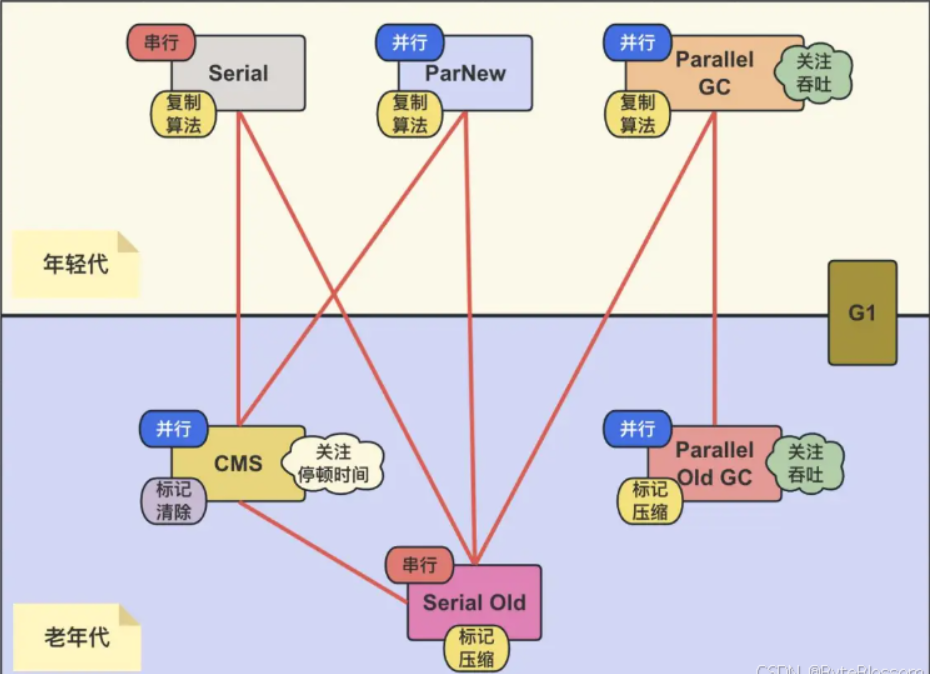

## 对象什么时候会被GC

**引用计数算法**

1. 引用计数算法（ Reference Counting ）比较简单，对每个对象保存一个整数的引用计数器属性，用于记录对象被引用的情况。
2. 对于一个对象A ，只要有任何一个对象引用了A ，则A 的引用计数器就加1；当引用失效时，引用计数器就减1。只要对象A 的引用计数器的值为0，即表示对象A 不可能再被使用，可进行回收。

优点：实现简单，垃圾对象便于辨识；判定效率高，回收没有延迟性。

缺点：

1. 它需要单独的字段存储计数器，这样的做法增加了存储空间的开销。
2. 每次赋值都需要更新计数器，伴随着加法和减法操作，这增加了时间开销。
3. 引用计数器有一个严重的问题，即无法处理循环引用的情况。这是一条致命缺陷，导致在Java 的垃圾回
   收器中没有使用这类算法。

**可达性分析算法**

1. 相对于引用计数算法而言，可达性分析算法不仅同样具备实现简单和执行高效等特点，更重要的是该算法可以有效地解决在引用计数算法中存在的循环引用问题，防止内存泄漏的发生。
2. 相较于引用计数算法，这里的可达性分析就是Java 、C# 选择的。这种类型的垃圾收集通常也叫作追踪性垃圾收集（ Tracing Garbage Collection ）

算法实现思路

1. 可达性分析算法是以根对象集合（ GCRoots ）为起始点，按照从上至下的方式搜索被根对象集合所连接的目标对象是否可达。
2. 使用可达性分析算法后，内存中的存活对象都会被根对象集合直接或间接连接着，搜索所走过的路径称为引用链（ Reference Chain ）
3. 如果目标对象没有任何引用链相连，则是不可达的，就意味着该对象己经死亡，可以标记为垃圾对象。
4. 在可达性分析算法中，只有能够被根对象集合直接或者间接连接的对象才是存活对象。

GC root可以是那些元素？

1. 虚拟机栈中引用的对象
2. 本地方法栈中引用的对象
3. 方法区中常量池中引用的对象
4. 所有被同步锁synchronized持有的对象
5. java虚拟机内部引用的对象
6. 方法区中类静态属性引用的对象

> 小结
>
> 1. 总结一句话就是，除了堆空间的周边，比如：虚拟机栈、本地方法栈、方法区地方对堆空间进行引用的，都可以作为GC Roots 进行可达性分析
> 2. 除了这些固定的GC Roots 集合以外，根据用户所选用的垃圾收集器以及当前回收的内存区域不同，还可以有其他对象“临时性”地加入，共同构成完整GC Roots 集合。比如：分代收集和局部回收（ PartialGC ）
> 3. 可达性分析算法必须在一个能保证一致性快照中进行。


## 说说Java中栈内存和堆内存的区别

1. 从存储数据的角度说：栈内存用来存储基本类型的变量和对象的引用变量，堆内存用来存储Java中的对象；java中基本上所有的对象都存储在堆内存区域。
2. 从是否共享角度说：栈内存线程私有，堆内存线程共享
3. 是否会发生内存的溢出：栈内存不足时，JVM会抛出java.lang.StackOverFlowError（一般发生在递归的时候）；堆内存不足时，JVM会抛出java.lang.OutOfMemoryError
4. 栈的内存远小于堆内存，-Xss选项设置栈的大小。-Xms选项可以设置堆的开始大小;堆一般把最大堆内存和最小堆内存设置为一样。

## 强引用、软引用、弱引用、虚引用以及他们之间和gc的关系

- 强引用：new出的对象之类的引用， 只要强引用还在，gc时永远不会被回收
- 软引用：有用但非必须的对象，内存溢出异常之前，将会把软引用对象列入第二次回收。
- 弱引用：有用但非必须的对象，对象能生存到下一次垃圾收集发生之前。
- 虚引用：对生存时间无影响，在垃圾回收时得到通知。
- 终结器引用：
    - 它用于实现对象的finalize() 方法，也可以称为终结器引用
    - 无需手动编码，其内部配合引用队列使用
    - 在GC 时，终结器引用入队。由Finalizer 线程通过终结器引用找到被引用对象调用它的finalize() 方法，第二次GC 时才回收被引用的对象

> 强引用是造成java内存泄漏的主要原因

## java对象创建（5种创建对象的方法）

- 使用new关键字创建对象; 会调用构造方法；
- 使用Class类的newInstance方法(反射机制)；会调用构造方法；
- 使用Constructor类的newInstance方法(反射机制)；会调用构造方法；
- 使用Clone方法创建对象；不会调用构造方法；
- 使用(反)序列化机制创建对象；不会调用构造方法；


## jvm调优工具又哪些？各自的作用又是什么（重点）

- jps: 查看进程的参数信息;
- jstat: 查看某个Java进程内的线程堆栈信息;
- jinfo: 查看虚拟机参数；
- jmap:查看堆内存使用状况，生成快照存储(dump文件);
- jhat: 分析jmap dump生成的快照文件；
- jconsole: 基于JMX的可视化工具，监控 cpu, 内存，线程等使用情况；
- jvisualvm: JDK 自带分析工具,功能齐全，如查看进行信息，快照转存，监控cpu,线程，方法区，堆等；

## 你知道哪些JVM调优参数

- -Xms128m JVM初始分配的堆内存
- -Xmx512m JVM最大允许分配的堆内存，按需分配；
- -XX:MetaspaceSize：分配给类元数据空间（以字节计）的初始大小;
- -XX:MaxMetaspaceSize：分配给类元数据空间的最大值，超过此值就会触发Full GC
- -XX:NewRatio：新生代和老年代的占比；
- -XX:NewSize：新生代空间；
- -XX:SurvivorRatio：伊甸园空间和幸存者空间的占比；
- -XX:MaxTenuringThreshold：对象进入老年代的年龄阈值；
- XX:+PrintGC：打印 gc 信息；
- -XX:+PrintGCDetails：打印 gc 详细信息


## 为什么字符串常量池在不同版本的jdk中位置会发生变化

1. 永久代的默认空间大小比较小，但是字符串的使用又比较的频繁，所以进行调整，放入堆内存中，空间比较大。最初是放在永久代中，但是永久代中垃圾回收不频繁。
2. 永久代垃圾回收频率低，大量的字符串无法及时回收，容易进行Full GC 产生STW 或者容易产生OOM：
   PermGen Space
3. 堆中空间足够大，字符串可被及时回收。
4. 在jdk6中是放在永久代中，但是在jdk7/jdk8中，把静态变量和字符串常量池移动到堆内存中，可以频繁的进行垃圾回收操作。

## 概述一下类结构文件

在 Java 中，JVM 可以理解的代码就叫做`字节码`（即扩展名为 `.class` 的文件），它不面向任何特定的处理器，只面向虚拟机。Java 语言通过字节码的方式，在一定程度上解决了传统解释型语言执行效率低的问题，同时又保留了解释型语言可移植的特点。所以 Java 程序运行时比较高效，而且，由于字节码并不针对一种特定的机器，因此，Java 程序无须重新编译便可在多种不同操作系统的计算机上运行。比如scala也可以被编译为.class文件在虚拟机上面运行。

可以说`.class`文件是不同的语言在 Java 虚拟机之间的重要桥梁，同时也是支持 Java 跨平台很重要的一个原因。

## jvm工具

- java – 运行工具，运行.class字节码的工具、
- javac -编译器，将后缀名为.java的文件编译为后缀名为.class的文件。
- javap - 反编译程序
- javadoc - 文档生成器，从源码的注释中提取文档。
- jar - 打包工具，将相关的类文件打成一个jar包。
- jdb -debugger 调试工具
- jps - 显示当前java程序的运行状态。
- extcheck -一个检测jar包冲突的工具

## JVM 配置常用参数有哪些?

**垃圾回收参数**

-Xnoclassgc 是否对类进行回收

-verbose:class -XX:+TraceClassUnloading 查看类加载和卸载信息

-XX:SurvivorRatio Eden和其中一个survivor的比值

-XX:PretenureSizeThreshold 大对象进入老年代的阈值，Serial和ParNew生效

-XX:MaxTenuringThreshold 晋升老年代的对象年龄，默认15, CMS默认是4

-XX:HandlePromotionFailure 老年代担保

-XX:+UseAdaptiveSizePolicy动态调整Java堆中各个区域大小和进入老年代年龄

-XX:ParallelGCThreads 并行回收的线程数

-XX:MaxGCPauseMillis Parallel Scavenge参数，设置GC的最大停顿时间

-XX:GCTimeRatio  Parallel Scavenge参数，GC时间占总时间的比率，默认99%，即1%的GC时间

-XX:CMSInitiatingOccupancyFraction，old区触发cms阈值，默认68%

-XX:+UseCMSCompactAtFullCollection(CMS完成后是否进行一次碎片整理，停顿时间加长)

-XX:CMSFullGCsBeforeCompaction(执行多少次不进行碎片整理的FullGC后进行一次带压缩的)

-XX:+ScavengeBeforeFullGC，在fullgc前触发一次minorGC

**垃圾回收统计信息**

-XX:+PrintGC 输出GC日志

-verbose:gc等同于上面那个

-XX:+PrintGCDetails 输出GC的详细日志

**堆大小设置**

-Xmx:最大堆大小

-Xms:初始堆大小(最小内存值)

-Xmn:年轻代大小

-XX:NewSize和-XX:MaxNewSize 新生代大小

-XX:SurvivorRatio:3 意思是年轻代中Eden区与两个Survivor区的比值。注意Survivor区有两个。如：3，表示Eden：Survivor=3：2，一个Survivor区占整个年轻代的1/5

-XX:NewRatio=4:设置年轻代（包括Eden和两个Survivor区）与年老代的比值（除去持久代）。设置为4，则年轻代与年老代所占比值为1：4，年轻代占整个堆栈的1/5

-Xss栈容量 默认256k

-XX:PermSize永久代初始值

-XX:MaxPermSize 永久代最大值

> 进程是资源分配的基本单位，线程是调度的基本单位


## java对象的创建过程

下图便是 Java 对象的创建过程，我建议最好是能默写出来，并且要掌握每一步在做什么。

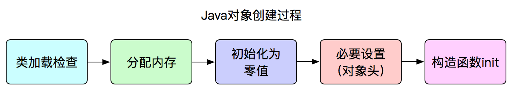

**Step1:类加载检查**

虚拟机遇到一条 new 指令时，首先将去检查这个指令的参数是否能在常量池中定位到这个类的符号引用，并且检查这个符号引用代表的类是否已被加载过、解析和初始化过。如果没有，那必须先执行相应的类加载过程。

**Step2:分配内存**

在**类加载检查**通过后，接下来虚拟机将为新生对象**分配内存**。对象所需的内存大小在类加载完成后便可确定，为对象分配空间的任务等同于把一块确定大小的内存从 Java 堆中划分出来。**分配方式**有 **“指针碰撞”** 和 **“空闲列表”** 两种，**选择那种分配方式由 Java 堆是否规整决定，而 Java 堆是否规整又由所采用的垃圾收集器是否带有压缩整理功能决定**。

**内存分配的两种方式：（补充内容，需要掌握）**

选择以上两种方式中的哪一种，取决于 Java 堆内存是否规整。而 Java 堆内存是否规整，取决于 GC 收集器的算法是"标记-清除"，还是"标记-整理"（也称作"标记-压缩"），值得注意的是，复制算法内存也是规整的


**内存分配并发问题（补充内容，需要掌握）**

在创建对象的时候有一个很重要的问题，就是线程安全，因为在实际开发过程中，创建对象是很频繁的事情，作为虚拟机来说，必须要保证线程是安全的，通常来讲，虚拟机采用两种方式来保证线程安全：

- **CAS+失败重试：** CAS 是乐观锁的一种实现方式。所谓乐观锁就是，每次不加锁而是假设没有冲突而去完成某项操作，如果因为冲突失败就重试，直到成功为止。**虚拟机采用 CAS 配上失败重试的方式保证更新操作的原子性。**
- **TLAB：** 为每一个线程预先在 Eden 区分配一块儿内存，JVM 在给线程中的对象分配内存时，首先在 TLAB 分配，当对象大于 TLAB 中的剩余内存或 TLAB 的内存已用尽时，再采用上述的 CAS 进行内存分配

**Step3:初始化零值**

内存分配完成后，虚拟机需要将分配到的内存空间都初始化为零值（不包括对象头），这一步操作保证了对象的实例字段在 Java 代码中可以不赋初始值就直接使用，程序能访问到这些字段的数据类型所对应的零值。

**Step4:设置对象头**

初始化零值完成之后，**虚拟机要对对象进行必要的设置**，例如这个对象是那个类的实例、如何才能找到类的元数据信息、对象的哈希码、对象的 GC 分代年龄等信息。 **这些信息存放在对象头中。** 另外，根据虚拟机当前运行状态的不同，如是否启用偏向锁等，对象头会有不同的设置方式。

**Step5:执行 init 方法**

在上面工作都完成之后，从虚拟机的视角来看，一个新的对象已经产生了，但从 Java 程序的视角来看，对象创建才刚开始，`` 方法还没有执行，所有的字段都还为零。所以一般来说，执行 new 指令之后会接着执行 `` 方法，把对象按照程序员的意愿进行初始化，这样一个真正可用的对象才算完全产生出来。

## 对象访问定位的两种方式

java对象在访问的时候，我们需要通过java虚拟机栈的reference类型的数据去操作具体的对象。由于reference类型在java虚拟机规范中只规定了一个对象的引用，并没有定义这个这个引用应该通过那种方式去定位、访问java堆中的具体对象实例，所以一般的访问方式也是取决与java虚拟机的类型。目前主流的访问方式有通过句柄和直接指针两种方式。

1. 句柄访问

**句柄访问示意图**

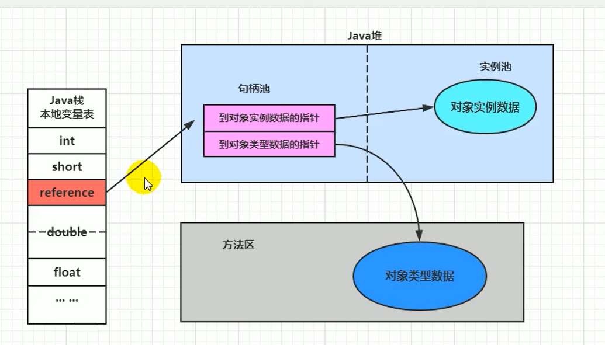

使用句柄访问方式，java堆将会划分出来一部分内存去来作为句柄池，reference中存储的就是对象的句柄地址。而句柄中则包含对象实例数据的地址和对象类型数据（如对象的类型，实现的接口、方法、父类、field等）的具体地址信息。下边我以一个例子来简单的说明一下：

Object obj = new Object();

Object obj表示一个本地引用，存储在java栈的本地便变量表中，表示一个reference类型的数据。

new Object()作为实例对象存放在java堆中，同时java堆中还存储了Object类的信息（对象类型、实现接口、方法等）的具体地址信息，这些地址信息所执行的数据类型存储在方法区中。

2. 直接指针访问

**直接指针示意图**

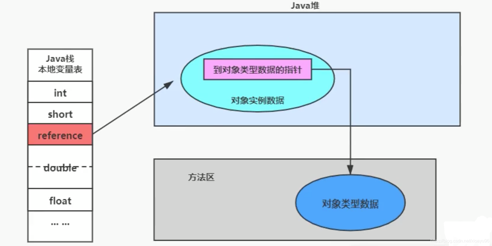

如果使用指针访问，那么java堆对象的布局中就必须考虑如何放置访问类型的相关信息（如对象的类型，实现的接口、方法、父类、field等），而reference中存储的就是对象的地址。

这两种访问方式各有利弊，使用句柄访最大的好处是reference中存储着稳定的句柄地址，当对象移动之后（垃圾收集时移动对象是非常普遍的行为），只需要改变句柄中的对象实例地址即可，reference不用修改。

使用指针访问的好处是访问速度快，它减少了一次指针定位的时间开销，由于java是面向对象的语言，在开发中java对象的访问非常的频繁，因此这类开销积少成多也是非常可观的，反之则提升访问速度。


## finalize() 方法什么时候被调用？析构函数 (finalization) 的目的是什么？

垃圾回收器（garbage colector）决定回收某对象时，就会运行该对象的 finalize() 方法 但是在 Java 中很不幸，如果内存总是充足的，那么垃圾回收可能永远不会进行，也就是说 filalize() 可能永远不被执行，显然指望它做收尾工作是靠不住的。 那么 finalize() 究竟是做什么的呢？ 

它最主要的用途是回收特殊渠道申请的内存。Java 程序有垃圾回收器，所以一般情况下内存问题不用程序员操心。但有一种 JNI（Java Native Interface）调用non-Java 程序（C 或 C++）， finalize() 的工作就是回收这部 分的内存。

## 简述 Java 内存分配与回收策率以及 Minor GC 和 Major GC

• 对象优先在堆的 Eden 区分配

• 大对象直接进入老年代

• 长期存活的对象将直接进入老年代

当 Eden 区没有足够的空间进行分配时，虚拟机会执行一次 Minor GC。Minor GC 通常发生在新生代的 Eden 区，在这个区的对象生存期短，往往发生 Gc 的频率较高，回收速度比较快；

Full GC/Major GC 发生在老年代，一般情况下，触发老年代 GC的时候不会触发 Minor GC，但是通过配置，可以在 Full GC 之前进行一次 Minor GC 这样可以加快老年代的回收速度。

## 思维导图

### java四种引用状态


### Java中内存的划分


### Java对象在内存中的状态


### 判断对象死亡的方法


### 垃圾回收算法


### Java垃圾收集器


### Java堆内存的划分


### 类加载过程


### 类加载器


