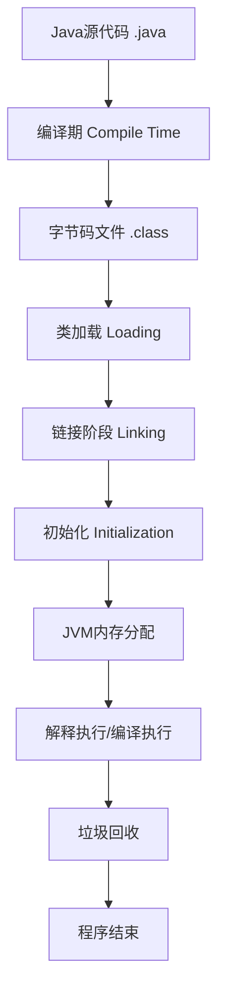

Java 代码从编写到最终执行经历了多个复杂的阶段，下面详细分析每个步骤：

## 一、整体流程图




## 二、详细执行流程

### 阶段1：编写与编译（开发环境）

#### 1.1 源代码编写

```java
// HelloWorld.java
public class HelloWorld {
    private static final String MESSAGE = "Hello, World!";
    
    public static void main(String[] args) {
        int result = calculate(10, 20);
        System.out.println(MESSAGE + " Result: " + result);
    }
    
    private static int calculate(int a, int b) {
        return a + b;
    }
}
```

#### 1.2 编译过程

```java
# 使用javac编译
javac HelloWorld.java
```

**编译步骤：**

```java
1. 词法分析 → 2. 语法分析 → 3. 语义分析 → 4. 字节码生成
```

**具体过程：**

```java
// 1. 词法分析（Tokenization）
源代码 → Token流
"public" "class" "HelloWorld" "{" ...

// 2. 语法分析（Parsing）生成AST
CompilationUnit
├── ClassDeclaration
│   ├── Modifiers: "public"
│   ├── Identifier: "HelloWorld"
│   └── ClassBody
│       ├── FieldDeclaration
│       └── MethodDeclarations...

// 3. 语义分析（Semantic Analysis）
// - 类型检查
// - 符号解析
// - 常量折叠优化（如：10+20 → 30）

// 4. 字节码生成
// 生成HelloWorld.class文件
```

**生成的字节码：**

```java
// 使用javap查看字节码
javap -c HelloWorld.class

// 输出示例：
public static void main(java.lang.String[]);
  Code:
     0: bipush        10      // 压入常量10
     2: bipush        20      // 压入常量20
     4: invokestatic  #2      // 调用calculate方法
     7: istore_1              // 存储结果到局部变量1
     8: getstatic     #3      // 获取System.out
    11: new           #4      // 创建StringBuilder
    // ... 更多字节码
```

### 阶段2：类加载机制（JVM内部）

#### 2.1 类加载器层次结构

```java
启动类加载器(Bootstrap ClassLoader)
      ↓
扩展类加载器(Extension ClassLoader) 
      ↓
应用程序类加载器(Application ClassLoader)
      ↓
自定义类加载器(Custom ClassLoader)
```

#### 2.2 类加载的三个阶段

**阶段A：加载（Loading）**

```java
// JVM查找并加载类的字节码
1. 通过全限定名获取二进制字节流
2. 将字节流转换为方法区的运行时数据结构
3. 在堆中创建java.lang.Class对象

// 类加载器委派模型（双亲委派）
protected Class<?> loadClass(String name, boolean resolve) {
    synchronized (getClassLoadingLock(name)) {
        // 1. 检查是否已加载
        Class<?> c = findLoadedClass(name);
        if (c == null) {
            try {
                // 2. 委派给父加载器
                if (parent != null) {
                    c = parent.loadClass(name, false);
                } else {
                    c = findBootstrapClassOrNull(name);
                }
            } catch (ClassNotFoundException e) {
                // 父加载器找不到
            }
            
            // 3. 自己尝试加载
            if (c == null) {
                c = findClass(name);
            }
        }
        
        // 4. 链接（如果需要）
        if (resolve) {
            resolveClass(c);
        }
        return c;
    }
}
```

**阶段B：链接（Linking）**

**B1. 验证（Verification）**

```java
1. 文件格式验证（魔数0xCAFEBABE）
2. 元数据验证（语义验证）
3. 字节码验证（数据流和控制流）
4. 符号引用验证
```

**B2. 准备（Preparation）**

```java
// 为类变量分配内存并设置初始值（零值）
public class Example {
    private static int count = 100;    // 准备阶段：count = 0
    private static final int MAX = 50; // 准备阶段：MAX = 50（常量）
}
```

**B3. 解析（Resolution）**

```java
// 将符号引用转换为直接引用
// 符号引用：java/lang/Object
// 直接引用：内存地址0x7f123456
```

**阶段C：初始化（Initialization）**

```java
// 执行类构造器<clinit>()方法
public class Example {
    static {
        System.out.println("静态初始化块执行");
        count = 100;  // 真正赋值
    }
    private static int count;
}
```

**初始化时机（主动引用触发）：**

1. 创建类的实例（new）
2. 访问类的静态变量（除final常量）
3. 调用类的静态方法
4. 反射调用（Class.forName()）
5. 初始化子类时父类先初始化
6. JVM启动时指定的主类

### 阶段3：运行时数据区域

#### 3.1 JVM内存模型

```java
┌─────────────────────────────────────────────────────┐
│                  JVM Memory                         │
├─────────────────────────────────────────────────────┤
│              Method Area (方法区)                    │
│   ┌─────────────────────────────────────────────┐   │
│   │ Class信息, 常量池, 静态变量, JIT代码缓存等     │   │
│   └─────────────────────────────────────────────┘   │
├─────────────────────────────────────────────────────┤
│              Heap (堆)                              │
│   ┌────────────┬─────────────────┬──────────────┐   │
│   │  Young Gen │                 │  Old Gen     │   │
│   │ ┌────────┐ │                 │              │   │
│   │ │ Eden   │ │                 │              │   │
│   │ │ S0  S1 │ │                 │              │   │
│   │ └────────┘ │                 │              │   │
│   └────────────┴─────────────────┴──────────────┘   │
├─────────────────────────────────────────────────────┤
│              JVM Stacks (虚拟机栈)                   │
│   ┌─────────────────────────────────────────────┐   │
│   │ 每个线程私有: 栈帧(局部变量表, 操作数栈等)    │   │
│   └─────────────────────────────────────────────┘   │
├─────────────────────────────────────────────────────┤
│           Program Counter (程序计数器)               │
│   ┌─────────────────────────────────────────────┐   │
│   │       当前线程执行的字节码指令地址            │   │
│   └─────────────────────────────────────────────┘   │
├─────────────────────────────────────────────────────┤
│              Native Method Stacks (本地方法栈)      │
│   ┌─────────────────────────────────────────────┐   │
│   │            Native方法调用                    │   │
│   └─────────────────────────────────────────────┘   │
└─────────────────────────────────────────────────────┘
```

#### 3.2 栈帧结构

```java
┌─────────────────────┐
│      Stack Frame    │
├─────────────────────┤
│  Local Variables    │ ← 局部变量表（this, args, 局部变量）
│                     │
├─────────────────────┤
│  Operand Stack      │ ← 操作数栈（计算中间结果）
│                     │
├─────────────────────┤
│ Dynamic Linking     │ ← 动态链接（指向方法区的方法引用）
│                     │
├─────────────────────┤
│ Return Address      │ ← 返回地址（方法返回后继续执行的位置）
└─────────────────────┘
```

**示例：方法调用时的栈帧**

```v
public class StackFrameDemo {
    public static void main(String[] args) {
        int x = 10;
        int y = 20;
        int result = add(x, y);  // 创建add方法的栈帧
        System.out.println(result);
    }
    
    public static int add(int a, int b) {
        int sum = a + b;        // 在当前栈帧中计算
        return sum;             // 销毁当前栈帧，返回main方法的栈帧
    }
}
```

### 阶段4：字节码执行引擎

#### 4.1 解释执行模式

```java
// JVM字节码解释器工作原理
while (!finished) {
    // 1. 获取当前指令地址（PC寄存器）
    byte opcode = fetchOpcode();
    
    // 2. 解码指令
    Instruction instr = decode(opcode);
    
    // 3. 执行指令
    switch (instr.type) {
        case LOAD_CONST:
            operandStack.push(instr.value);
            break;
        case ADD:
            int b = operandStack.pop();
            int a = operandStack.pop();
            operandStack.push(a + b);
            break;
        case INVOKE_METHOD:
            // 方法调用，创建新栈帧
            createNewFrame(instr.method);
            break;
        // ... 其他指令
    }
    
    // 4. 更新PC
    pc += instr.length;
}
```

#### 4.2 常见字节码指令示例

```java
// 源码
public int calculate(int a, int b) {
    return (a + b) * 2;
}

// 对应字节码
public int calculate(int, int);
  Code:
     0: iload_1        // 加载第一个参数a到操作数栈
     1: iload_2        // 加载第二个参数b到操作数栈
     2: iadd           // 栈顶两个int相加，结果入栈
     3: iconst_2       // 常量2入栈
     4: imul           // 相乘
     5: ireturn        // 返回结果
```

### 阶段5：即时编译（JIT）优化

#### 5.1 分层编译（Tiered Compilation）

```java
# JDK HotSpot VM的分层编译
- 第0层：解释执行，收集性能数据
- 第1层：C1编译（简单优化）
- 第2层：C1编译（完全优化）
- 第3层：C1编译（完全优化 + Profiling）
- 第4层：C2编译（激进优化，长时间运行）
```

**编译阈值：**

```java
-XX:CompileThreshold=10000          # C1编译阈值
-XX:Tier3CompileThreshold=2000      # 分层编译第3层阈值
-XX:Tier4CompileThreshold=15000     # C2编译阈值
```

#### 5.2 热点代码检测

```java
// 基于计数器的热点探测
public class HotSpotDetection {
    // 方法调用计数器
    private int invocationCounter;
    
    // 回边计数器（循环）
    private int backEdgeCounter;
    
    public void hotMethod() {
        invocationCounter++;
        if (invocationCounter > COMPILE_THRESHOLD) {
            // 触发JIT编译
            compileMethod();
        }
        
        // 循环体
        for (int i = 0; i < 1000; i++) {
            backEdgeCounter++;
            if (backEdgeCounter > LOOP_COMPILE_THRESHOLD) {
                // 触发OSR（栈上替换）
                compileAndReplace();
            }
        }
    }
}
```

#### 5.3 JIT优化技术

**A. 方法内联（Inlining）**

```java
// 优化前
public int calculate(int a, int b) {
    return add(a, b) * 2;
}

private int add(int x, int y) {
    return x + y;
}

// JIT优化后（内联）
public int calculate(int a, int b) {
    return (a + b) * 2;  // add方法被内联
}
```

**B. 逃逸分析（Escape Analysis）**

```java
// 优化前：在堆上分配Point对象
public void process() {
    Point p = new Point(10, 20);  // 对象可能逃逸
    System.out.println(p.x + p.y);
}

// 优化后：标量替换（Scalar Replacement）
public void process() {
    int p_x = 10;  // 直接在栈上分配
    int p_y = 20;
    System.out.println(p_x + p_y);
}
```

**C. 循环优化**

```java
// 循环展开（Loop Unrolling）
// 优化前
for (int i = 0; i < 100; i++) {
    sum += array[i];
}

// 优化后（展开4次）
for (int i = 0; i < 100; i += 4) {
    sum += array[i];
    sum += array[i + 1];
    sum += array[i + 2];
    sum += array[i + 3];
}
```

**D. 锁消除（Lock Elimination）**

```java
// 优化前：不必要的锁
public String concat(String s1, String s2) {
    StringBuffer sb = new StringBuffer();  // 局部变量，不逃逸
    sb.append(s1);  // StringBuffer.append是同步方法
    sb.append(s2);
    return sb.toString();
}

// 优化后：JIT消除锁操作
public String concat(String s1, String s2) {
    // 直接使用非同步的StringBuilder
    // 因为JIT能证明sb不会逃逸
}
```

### 阶段6：垃圾回收执行

```java
// GC执行流程示例
public class GCDemo {
    public static void main(String[] args) {
        // 1. 对象在Eden区分配
        Object obj1 = new Object();  // Eden区
        Object obj2 = new Object();  // Eden区
        
        // 触发Minor GC
        for (int i = 0; i < 10000; i++) {
            byte[] data = new byte[1024];  // 分配内存
        }
        
        // 2. 存活对象进入Survivor区
        // 3. 年龄增长，最终进入老年代
        // 4. 触发Full GC（如果需要）
    }
}
```

**GC执行时机：**

```java
// 手动触发（不推荐在生产环境使用）
System.gc();  // 提示JVM进行垃圾回收

// JVM自动触发条件：
// 1. Eden区空间不足 → Minor GC
// 2. 老年代空间不足 → Full GC
// 3. 方法区空间不足 → Full GC
// 4. System.gc()调用 → Full GC（可能）
```

### 阶段7：程序结束

#### 7.1 正常结束

java

```java
public class ShutdownDemo {
    public static void main(String[] args) {
        try {
            // 程序逻辑
            System.out.println("程序执行中...");
        } finally {
            // finally块总会执行
            System.out.println("清理资源...");
        }
        
        // main方法结束 → 程序正常终止
        
        // 注册关闭钩子
        Runtime.getRuntime().addShutdownHook(new Thread(() -> {
            System.out.println("JVM关闭，执行清理工作");
        }));
    }
}
```

#### 7.2 异常结束

```java
public class AbnormalExit {
    public static void main(String[] args) {
        // 1. 未捕获异常
        throw new RuntimeException("程序崩溃");
        
        // 2. System.exit()
        // System.exit(1); // 强制终止
        
        // 3. 死锁
        // 4. OutOfMemoryError
    }
}
```

## 三、完整执行示例

### 示例代码：

```java
public class ExecutionFlow {
    private static final String CLASS_NAME = "ExecutionFlow";
    private static int counter = 0;
    
    static {
        System.out.println("静态初始化块执行");
        counter = 100;
    }
    
    public static void main(String[] args) {
        System.out.println("main方法开始");
        
        // 热点方法，会被JIT编译
        for (int i = 0; i < 100000; i++) {
            calculate(i, i * 2);
        }
        
        // 触发GC
        System.gc();
        
        System.out.println("程序结束，counter=" + counter);
    }
    
    public static int calculate(int a, int b) {
        // 逃逸分析优化
        Point p = new Point(a, b);
        return p.x + p.y;
    }
    
    static class Point {
        int x, y;
        Point(int x, int y) {
            this.x = x;
            this.y = y;
        }
    }
}
```

### 执行流程时间线：

```java
时间      | 阶段                     | 事件
----------|-------------------------|--------------------------------
T0       | 编译期                   | javac编译生成.class文件
T1       | 类加载-加载              | 加载ExecutionFlow.class
T2       | 类加载-链接              | 验证、准备、解析
T3       | 类加载-初始化            | 执行静态块，counter=100
T4       | 解释执行                 | main方法开始执行
T5       | JIT编译准备              | calculate方法被频繁调用
T6       | JIT热点编译              | calculate方法被编译成本地代码
T7       | 逃逸分析优化             | Point对象被标量替换
T8       | GC触发                   | System.gc()建议垃圾回收
T9       | 程序结束                 | main方法返回，JVM关闭
```

## 总结

Java代码到最终执行经历了：

1. **编译期**：源码 → 字节码
2. **加载期**：类加载 → 链接 → 初始化
3. **运行期**：解释执行 → JIT编译优化 → 本地代码执行
4. **内存管理**：对象分配 → 垃圾回收
5. **程序结束**：正常终止或异常退出

这个流程体现了Java"一次编译，到处运行"的核心思想，同时通过JIT优化实现了接近原生代码的性能。理解这个完整流程对于性能调优、故障排查和深入学习JVM都至关重要。


