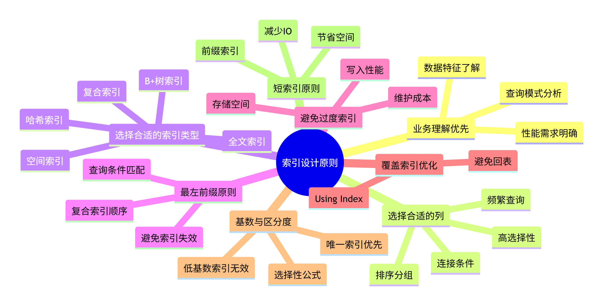
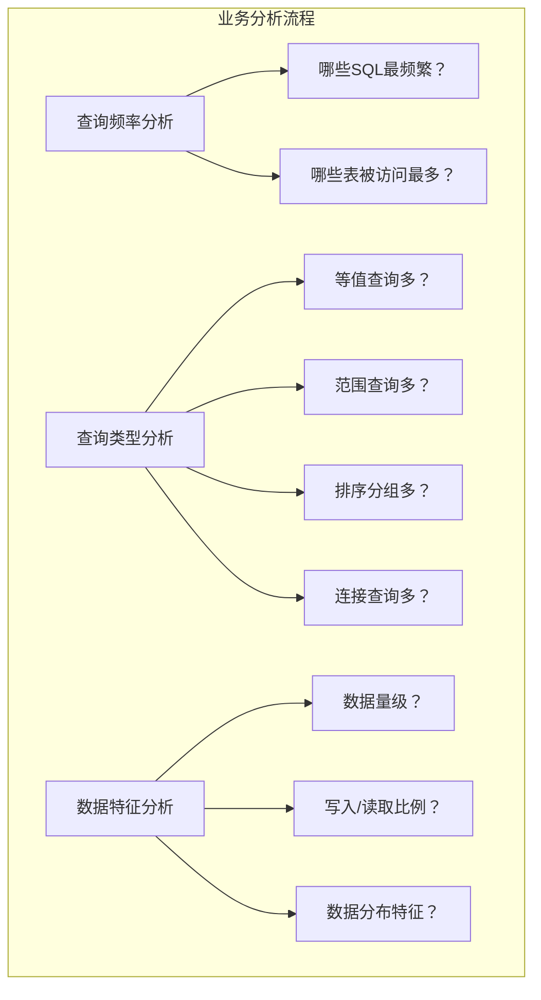
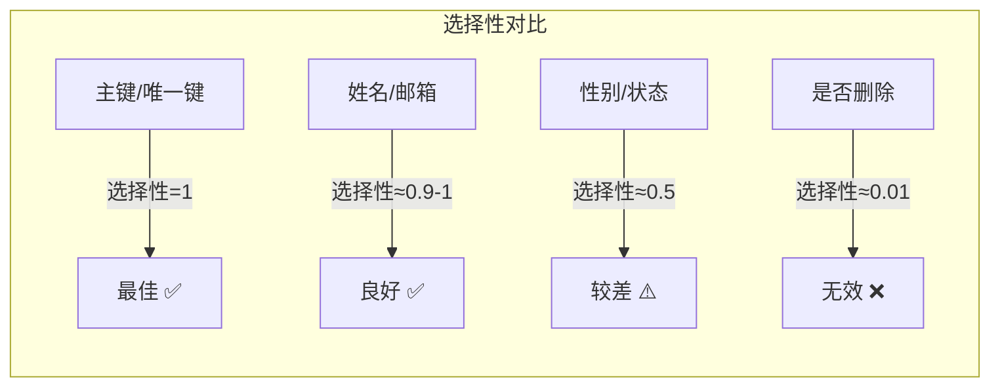
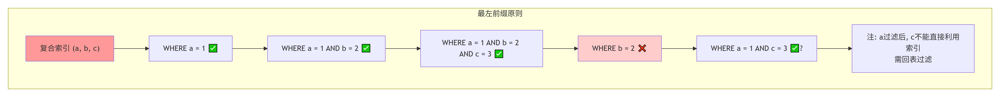
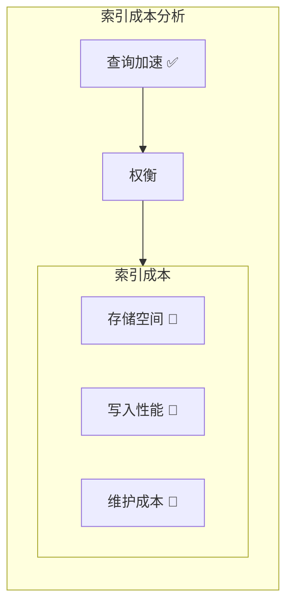
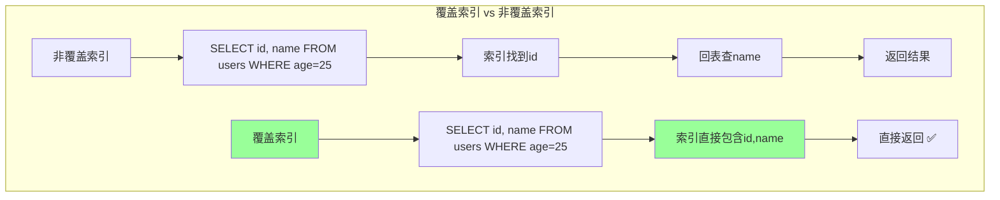
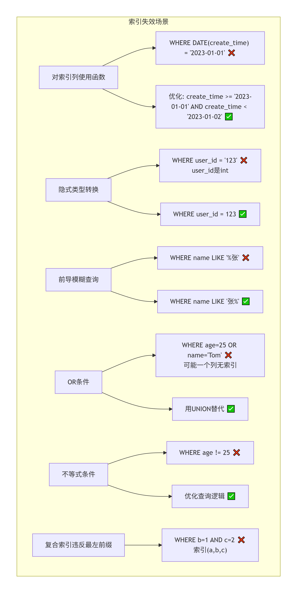
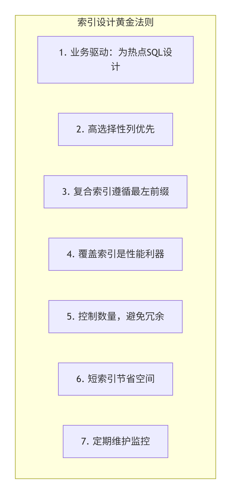

## 数据库索引设计原则详解

## 一、索引设计核心思维导图



## 二、索引设计基本原则详解

### 1. **业务理解优先原则**



**设计原则：**

- ✅ 80%的索引设计来自对业务查询的理解
- ✅ 先分析慢查询日志，找出热点SQL
- ✅ 针对核心业务场景设计，非面面俱到

**示例：**

```sql
-- 分析慢查询日志
SELECT * FROM mysql.slow_log WHERE query_time > 2;

-- 找出高频查询模式
-- 如果发现频繁：SELECT * FROM orders WHERE user_id = ? AND status = ?
-- 则考虑复合索引 (user_id, status)
```

---

### 2. **高选择性列优先**

**选择性公式：**

```
选择性 = COUNT(DISTINCT column) / COUNT(*)
选择性越高，索引效果越好
```

选择性越高，说明数据越分散，添加索引效果越好;



**示例对比：**

```sql
-- ✅ 高选择性列（适合索引）
CREATE INDEX idx_user_email ON users(email);  -- 几乎唯一
CREATE INDEX idx_order_no ON orders(order_no); -- 唯一

-- ❌ 低选择性列（不适合独立索引）
CREATE INDEX idx_user_gender ON users(gender); -- 只有男女，过滤掉50%数据，仍需扫描大量数据
CREATE INDEX idx_order_status ON orders(status); -- 状态值有限，过滤效果差
```

---

## 三、复合索引设计原则

### 1. **最左前缀原则**



**索引生效规则：**

```sql
-- 创建复合索引
CREATE INDEX idx_a_b_c ON table_name (a, b, c);

-- ✅ 完全使用索引
SELECT * FROM table WHERE a = 1;                    -- 使用索引(a)
SELECT * FROM table WHERE a = 1 AND b = 2;          -- 使用索引(a,b)
SELECT * FROM table WHERE a = 1 AND b = 2 AND c = 3; -- 使用索引(a,b,c)

-- ⚠️ 部分使用索引
SELECT * FROM table WHERE a = 1 AND c = 3;          
-- 使用索引(a)过滤a=1，但c=3需要回表过滤，不能直接利用索引的c部分

-- ❌ 无法使用索引
SELECT * FROM table WHERE b = 2;                    -- 不能使用索引
SELECT * FROM table WHERE c = 3;                    -- 不能使用索引
```

### 2. **区分度高的列放前面**

```sql
-- 假设数据特征
-- user_id: 100万不同值（高区分度）
-- status: 10种状态（低区分度）

-- ✅ 正确顺序：高区分度在前
CREATE INDEX idx_user_status ON orders(user_id, status);
-- WHERE user_id = ? AND status = ? 能快速定位

-- ❌ 错误顺序：低区分度在前
CREATE INDEX idx_status_user ON orders(status, user_id);
-- WHERE status = 'PAID' 可能返回50万行，然后再过滤user_id，效率低
```

### 3. **经常查询的列放前面**

```sql
-- 分析查询模式
-- 查询1: WHERE user_id = ?  (每天10万次)
-- 查询2: WHERE user_id = ? AND create_time > ? (每天1万次)

-- ✅ 优先满足高频查询
CREATE INDEX idx_user_time ON orders(user_id, create_time);
-- 查询1可以用到user_id部分
-- 查询2可以完全使用索引

-- 如果反过来
CREATE INDEX idx_time_user ON orders(create_time, user_id);
-- 查询1无法使用索引！
```


## 四、索引数量控制原则

### 1. **避免过度索引**



**成本量化：**

```sql
-- 一个表的索引数量建议：3-5个为宜，不超过8个

-- 索引存储空间计算
-- 假设表1亿行，每个索引平均50字节
-- 5个索引占用空间 = 1亿 × 50 × 5 ≈ 25GB

-- 写入性能影响
INSERT INTO users VALUES (...);  
-- 需要更新：数据文件 + 每个索引文件（5次写入）
-- 索引越多，写入越慢
```

### 2. **冗余索引识别**

```sql
-- ❌ 冗余索引示例
CREATE INDEX idx_user_id ON orders(user_id);
CREATE INDEX idx_user_status ON orders(user_id, status);
-- idx_user_id 是冗余的，因为 idx_user_status 已经包含(user_id)

-- ✅ 应删除冗余索引
DROP INDEX idx_user_id ON orders;
```

---

## 五、覆盖索引设计原则

### 1. **尽量使用覆盖索引**



**示例：**

```sql
-- 频繁查询：根据user_id查询user_name
SELECT user_name FROM users WHERE user_id = 123;

-- ✅ 覆盖索引设计
CREATE INDEX idx_user_id_name ON users(user_id, user_name);
-- 索引直接包含user_name，无需回表，Extra显示"Using index"

-- 查询分析
EXPLAIN SELECT user_name FROM users WHERE user_id = 123;
-- Extra: Using index  （表示使用了覆盖索引）
```

---

## 六、短索引原则

### 1. **前缀索引**

```sql
-- 长字符串列，如：varchar(255)

-- ❌ 全列索引（占用大）
CREATE INDEX idx_content ON articles(content);  -- 可能很大

-- ✅ 前缀索引（节省空间）
CREATE INDEX idx_content_prefix ON articles(content(20));  
-- 只索引前20个字符，大大减少索引大小
```

### 2. **选择合适的前缀长度**

```sql
-- 计算前缀选择性
SELECT 
    COUNT(DISTINCT LEFT(email, 5)) / COUNT(*) AS sel5,
    COUNT(DISTINCT LEFT(email, 10)) / COUNT(*) AS sel10,
    COUNT(DISTINCT LEFT(email, 15)) / COUNT(*) AS sel15,
    COUNT(DISTINCT email) / COUNT(*) AS total_sel
FROM users;

-- 选择接近总选择性的最短前缀长度
-- 假设结果：sel5=0.8, sel10=0.95, sel15=0.99, total=0.99
-- 选择15作为前缀长度
```

---

## 七、索引失效场景与避免



## 八、不同类型列的索引策略

### 1. **数字类型**

```sql
-- 直接建索引，效率最高
CREATE INDEX idx_age ON users(age);
```

### 2. **字符串类型**

```sql
-- 等值查询：普通索引
CREATE INDEX idx_name ON users(name);

-- 前缀查询：普通索引（支持like 'abc%'）
-- 全文检索：全文索引
CREATE FULLTEXT INDEX idx_content ON articles(content);
```

### 3. **日期时间**

```sql
-- 范围查询常用
CREATE INDEX idx_create_time ON orders(create_time);

-- 注意：避免函数转换
-- ❌ WHERE DATE(create_time) = '2023-01-01'
-- ✅ WHERE create_time >= '2023-01-01' AND create_time < '2023-01-02'
```

### 4. **枚举/状态**

```sql
-- 低基数列不建议单独索引
-- 可考虑与其他列组合
CREATE INDEX idx_status_user ON orders(status, user_id);
-- 或使用索引下推（MySQL 5.6+）
```

---

## 九、索引设计检查清单

```markdown
## 索引设计自检清单

### ✅ 必要性检查
- [ ] 是否为高频查询设计索引？
- [ ] 是否已分析慢查询日志？
- [ ] 索引带来的收益大于维护成本？

### ✅ 正确性检查
- [ ] 是否遵循最左前缀原则？
- [ ] 复合索引顺序是否合理？
- [ ] 是否有冗余索引？
- [ ] 是否考虑覆盖索引优化？

### ✅ 性能检查
- [ ] 索引列选择性是否足够高？
- [ ] 索引数量是否控制在合理范围（3-5个）？
- [ ] 长字符串是否使用前缀索引？
- [ ] 是否能避免索引失效场景？

### ✅ 监控检查
- [ ] 是否定期分析索引使用情况？
- [ ] 是否有未使用的索引需要清理？
- [ ] 索引碎片是否需要重建？
```

---

## 十、实战案例

### 场景：电商订单系统

```sql
-- 订单表结构
CREATE TABLE orders (
    id BIGINT PRIMARY KEY AUTO_INCREMENT,
    order_no VARCHAR(32) NOT NULL,      -- 订单号
    user_id BIGINT NOT NULL,             -- 用户ID
    status TINYINT NOT NULL,             -- 订单状态
    amount DECIMAL(10,2),                 -- 金额
    create_time DATETIME NOT NULL,        -- 创建时间
    pay_time DATETIME,                    -- 支付时间
    INDEX idx_user_id (user_id)           -- 单列索引
);
```

### 分析查询模式：

```sql
-- 查询1: 用户查看自己的订单列表（高频）
SELECT * FROM orders 
WHERE user_id = ? 
ORDER BY create_time DESC 
LIMIT 20;

-- 查询2: 后台按状态查询订单（中频）
SELECT * FROM orders 
WHERE status = ? AND create_time BETWEEN ? AND ?;

-- 查询3: 订单号精确查询（高频）
SELECT * FROM orders WHERE order_no = ?;

-- 查询4: 统计分析（低频）
SELECT DATE(create_time), COUNT(*) 
FROM orders 
WHERE create_time BETWEEN ? AND ? 
GROUP BY DATE(create_time);
```

### 索引设计方案：

```sql
-- 1. 复合索引：满足查询1（最左前缀 + 覆盖排序）
CREATE INDEX idx_user_create ON orders(user_id, create_time);
-- 说明：user_id过滤，create_time已在索引中，避免filesort

-- 2. 复合索引：满足查询2（范围查询优化）
CREATE INDEX idx_status_create ON orders(status, create_time);
-- 说明：status过滤大部分数据，create_time范围查询

-- 3. 唯一索引：满足查询3（精确查询）
CREATE UNIQUE INDEX idx_order_no ON orders(order_no);
-- 说明：订单号唯一，查询效率最高

-- 4. 覆盖索引：满足查询4（避免回表）
CREATE INDEX idx_create_amount ON orders(create_time, amount);
-- 说明：统计分析常用，索引覆盖create_time和amount

-- 5. 删除冗余索引
DROP INDEX idx_user_id ON orders;  -- 已被idx_user_create覆盖
```

### 索引使用分析：

```sql
-- 检查索引使用情况
EXPLAIN 
SELECT * FROM orders 
WHERE user_id = 123 
ORDER BY create_time DESC 
LIMIT 20;
-- 预期：使用idx_user_create，Extra无filesort

-- 查看索引使用频率
SELECT * FROM sys.schema_index_statistics 
WHERE table_name = 'orders';
```

---

## 十一、总结：索引设计黄金法则



**一句话总结：**

> **索引设计不是越多越好，而是为关键的查询路径提供高效的"导航"，在查询性能、写入性能和存储成本之间找到最佳平衡点。**