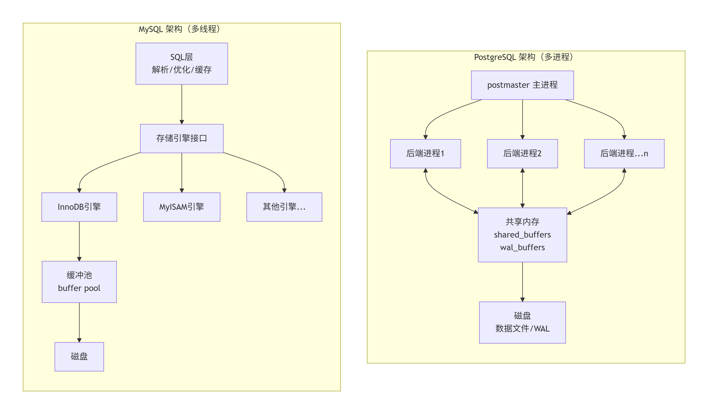
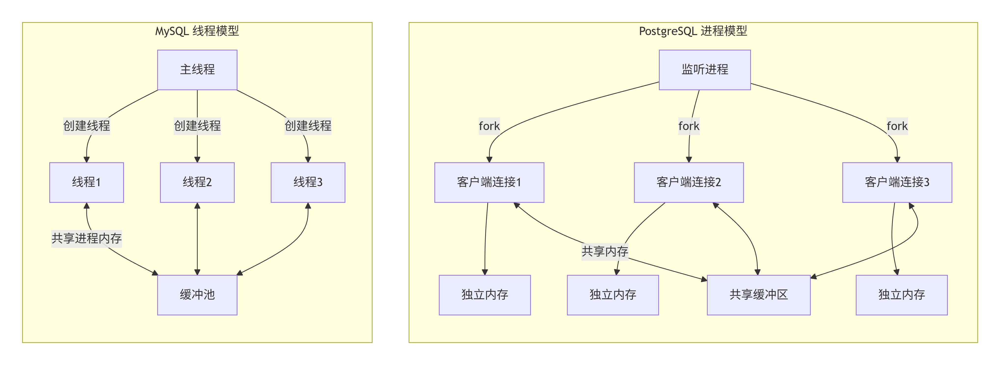
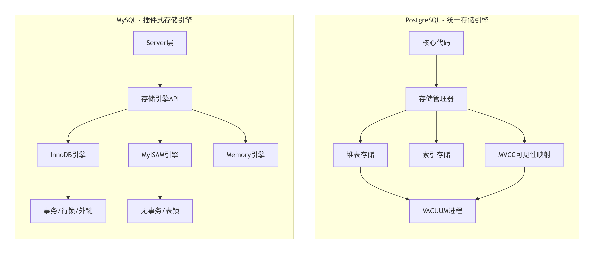
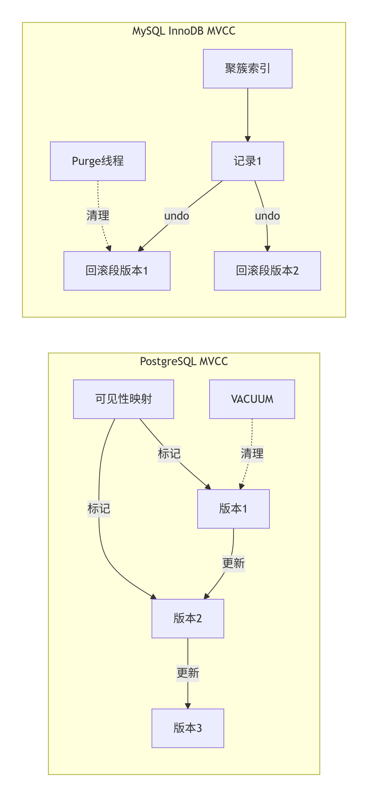
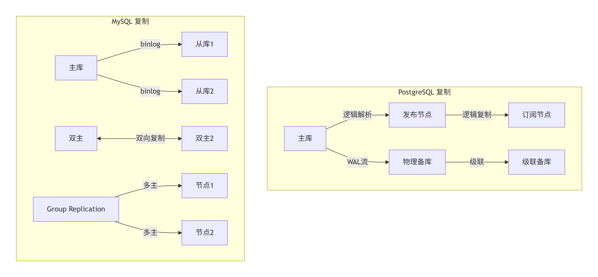

PostgreSQL 和 MySQL 虽然都是主流的关系型数据库，但在架构设计上有本质区别。MySQL 更倾向于模块化、多引擎，PostgreSQL 则是一体化、进程模型。以下是核心维度的对比：

## 1、整体架构对比

下面用架构对比图来直观展示 PostgreSQL 和 MySQL 的核心架构差异：

架构本质差异：postgresql是多进程模型，每个连接独立进程；Mysql是多线程+插件引擎模型，引擎可插拔;

## 2、进程/线程模型对比

连接处理差异：PostgreSQL每个连接是独立进程，MySQL是共享内存的线程;

PostgreSQL（多进程）：

1. 采用 "一个连接一个进程" 的架构（fork 子进程）
2. 主进程 postmaster 负责监听，每个客户端连接对应一个后端进程
3. 进程间通过共享内存和信号通信
4. 优势：单个连接崩溃不会影响整个数据库，稳定性高
5. 劣势：连接数高时内存开销大

MySQL（多线程）：

1. 采用 "一个连接一个线程" 架构
2. 主线程处理连接，分配工作线程
3. 所有线程共享内存空间
4. 优势：轻量级连接，高并发下内存占用更优
5. 劣势：个别线程问题可能影响全局

> postgre数据库，对每一个session会话连接，都会创建一个进程做查询操作,开销比较大;

## 3、存储引擎架构差异

存储引擎差异：PostgreSQL是内置一体化，MySQL是插件式可替换

PostgreSQL：

1. 统一存储引擎（内置，不可插拔） 
2. 堆表存储，支持 MVCC（通过可见性映射实现） 
3. 内置支持 ACID，无历史遗留的非事务引擎 
4. 存储逻辑高度集成在核心代码中

MySQL：

1. 插件式存储引擎（核心架构特征） 
2. InnoDB（默认）、MyISAM、Memory 等可选 
3. InnoDB 支持事务、行锁、外键；MyISAM 仅表锁、无事务 
4. 不同引擎在同一数据库可以混用 
5. 引擎层与 Server 层分离（解析、优化、缓存等在上层）

## 4、MVCC实现对比

MVCC实现差异：PostgreSQL多版本在堆表，MySQL在undo表空间

PostgreSQL：

1. 通过 堆表 + 可见性映射 实现 
2. 更新时：新版本直接插入，旧版本保留在堆中 
3. 无回滚段概念，死元组通过 VACUUM 清理 
4. 读从不阻塞写，写从不阻塞读（完全实现）

MySQL（InnoDB）：

1. 通过 聚簇索引 + 回滚段（undo log） 实现 
2. 更新时：在索引页内标记删除，插入新记录 
3. 旧版本数据存于 undo 表空间 
4. 读从不阻塞写，写不阻塞读（依赖 undo）

## 5、复制架构差异

复制差异：PostgreSQL物理WAL+逻辑发布订阅，MySQL binlog+多种拓扑

PostgreSQL：

1. 物理复制：WAL 日志流复制，主从物理一致 
2. 逻辑复制：发布/订阅模式，可按表复制 
3. 支持同步/异步、级联复制 
4. 无原生主主复制，需第三方工具

MySQL：

1. 二进制日志（binlog） 复制 
2. 异步复制为主，支持半同步 
3. 原生支持主主复制（双主架构） 
4. Group Replication / InnoDB Cluster 实现多主

## 6、查询执行与优化器

PostgreSQL：

1. 成本优化器极其强大 
2. 支持多表连接方式丰富（嵌套循环、哈希连接、归并连接） 
3. 支持并行查询、分区裁剪、JIT 编译 
4. 统计信息更精确（可自定义统计目标）

MySQL：

1. 优化器相对简单，复杂查询能力较弱 
2. 8.0 后大幅改进，仍逊于 PostgreSQL 
3. 执行计划控制手段较少

## 7、内存架构

PostgreSQL：

1. 共享缓冲区（shared_buffers） 
2. 每个进程独立的工作内存（work_mem） 
3. 预写日志缓冲区（wal_buffers） 
4. 无独立查询缓存（8.4 后移除）

MySQL：

1. InnoDB 缓冲池（buffer pool）——核心 
2. 日志缓冲区、排序缓冲区、连接缓冲区等 
3. 8.0 前有查询缓存，现已移除

## 8、总结

| 维度       | PostgreSQL               | MySQL                |
| :--------- | :----------------------- | :------------------- |
| 进程/线程  | 多进程                   | 多线程               |
| 存储引擎   | 单一，深度集成           | 插件式，多引擎       |
| MVCC       | 堆表 + 可见性映射        | 聚簇索引 + undo      |
| 优化器     | 极其强大                 | 较简单               |
| 高并发连接 | 内存开销大               | 线程模型更省         |
| 复制       | WAL 物理 + 逻辑          | binlog 逻辑          |
| 扩展       | 原生单机强，分布式需扩展 | 生态丰富，分片方案多 |