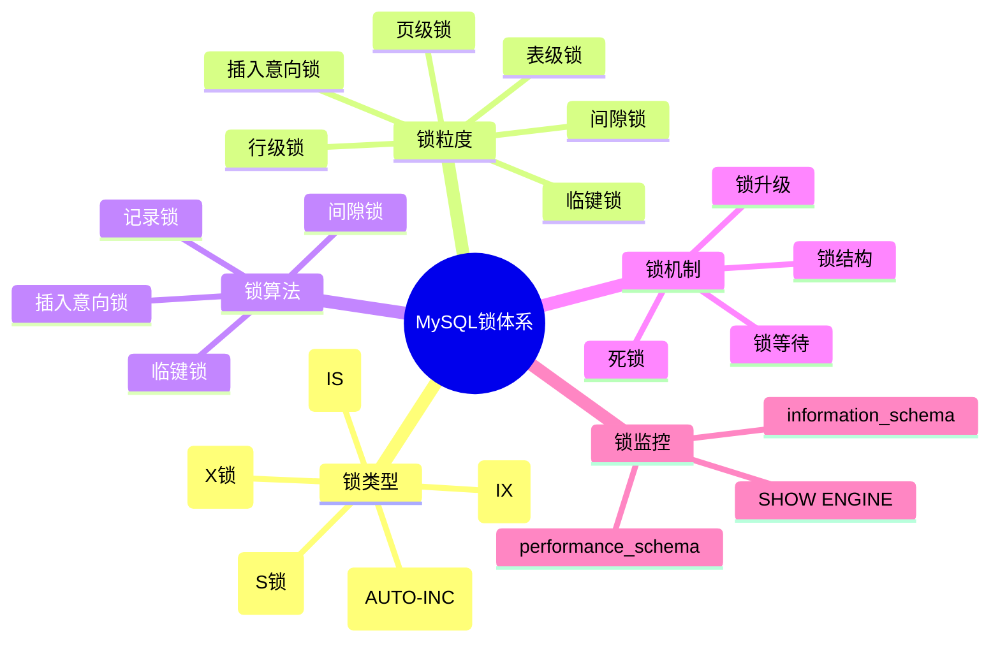
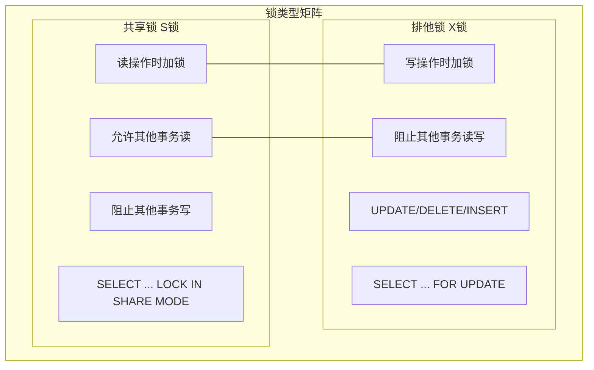
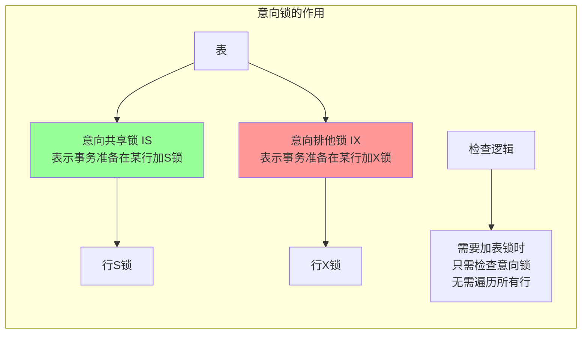
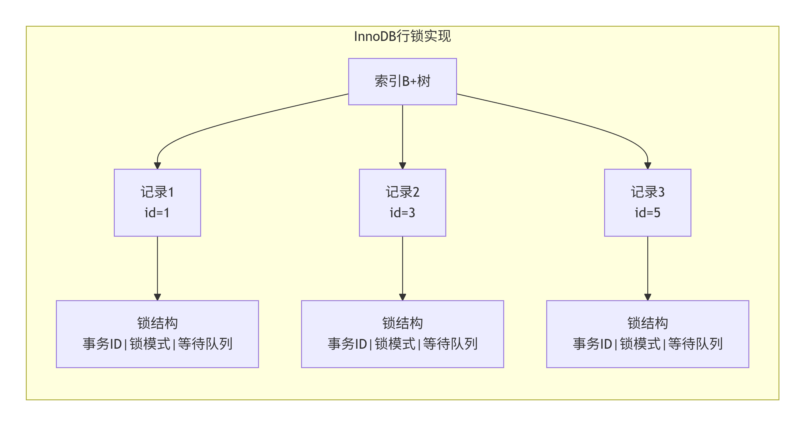
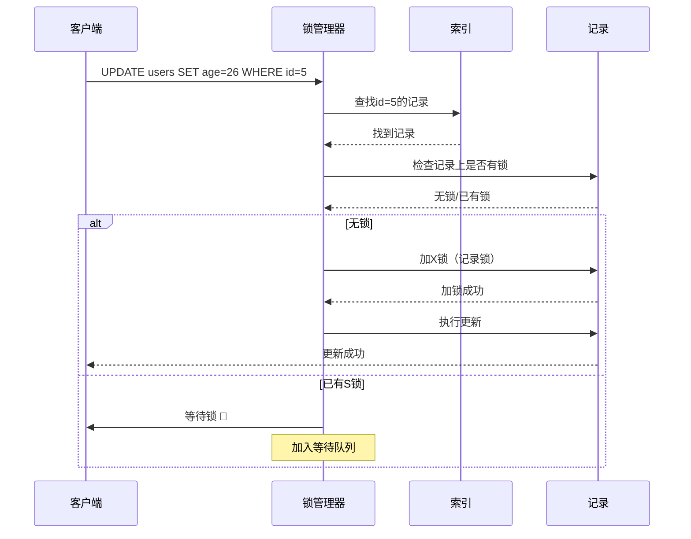
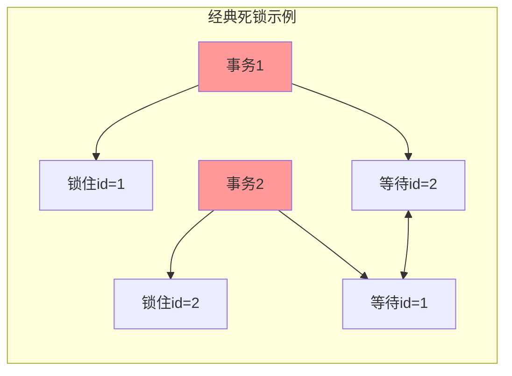
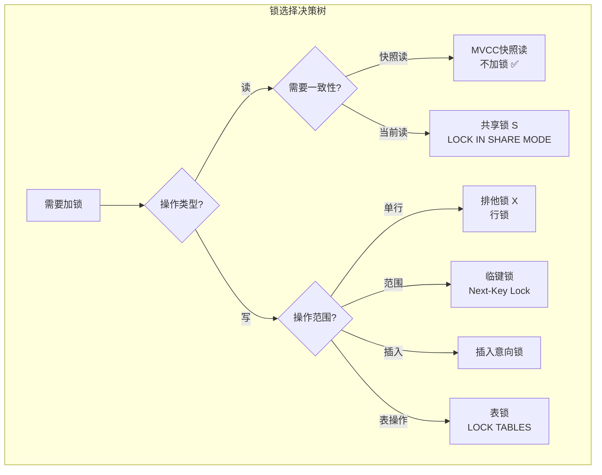

## 一、MySQL锁体系全景图



---

## 二、锁的基本类型

### 2.1 共享锁和排他锁



**锁兼容性矩阵**：

| 当前锁   | 请求S锁 | 请求X锁 |
| :------- | :------ | :------ |
| **S锁**  | ✅ 兼容  | ❌ 冲突  |
| **X锁**  | ❌ 冲突  | ❌ 冲突  |
| **无锁** | ✅ 兼容  | ✅ 兼容  |

### 2.2 意向锁



**意向锁兼容性**：

| 当前锁 | IS | IX | S | X |
|--------|----|----|---|---|
| **IS** | ✅ | ✅ | ✅ | ❌ |
| **IX** | ✅ | ✅ | ❌ | ❌ |
| **S** | ✅ | ❌ | ✅ | ❌ |
| **X** | ❌ | ❌ | ❌ | ❌ |

---

## 三、不同粒度的锁

### 3.1 表级锁

```sql
-- 显式表锁
LOCK TABLES users READ;   -- 表级共享锁
LOCK TABLES users WRITE;  -- 表级排他锁

-- 元数据锁（MDL，自动加）
ALTER TABLE users ADD COLUMN age INT;  -- 加MDL排他锁
SELECT * FROM users;  -- 加MDL共享锁

-- 意向锁（自动加）
BEGIN;
SELECT * FROM users WHERE id = 1 FOR UPDATE;  -- 自动加IX锁
```

### 3.2 行级锁



**行锁的三种算法**：

```sql
-- 1. 记录锁（Record Lock）
SELECT * FROM users WHERE id = 1 FOR UPDATE;
-- 只锁id=1这一行

-- 2. 间隙锁（Gap Lock）
SELECT * FROM users WHERE id BETWEEN 3 AND 7 FOR UPDATE;
-- 锁(3,7)之间的间隙，不包括记录本身

-- 3. 临键锁（Next-Key Lock）
SELECT * FROM users WHERE id > 3 FOR UPDATE;
-- 锁(3, +∞)，包括记录和间隙
```

---

## 四、锁算法详解

### 4.1 记录锁（Record Lock）

```sql
-- 数据: id: 1,3,5,7,9

-- 事务1
BEGIN;
SELECT * FROM users WHERE id = 5 FOR UPDATE;
-- 锁: 仅在id=5的记录上加X锁

-- 事务2
UPDATE users SET name = 'Tom' WHERE id = 5;  -- 阻塞 ❌
INSERT INTO users VALUES (6, 'Jerry');       -- 成功 ✅（不在锁定范围）
DELETE FROM users WHERE id = 3;               -- 成功 ✅
```

**记录锁特性**：
- ✅ 锁定具体的索引记录
- ✅ 必须通过索引条件（非索引条件升级为表锁）
- ✅ 精准锁定，并发度高

### 4.2 间隙锁（Gap Lock）

```sql
-- 数据: id: 1,3,5,7,9
-- RR隔离级别下

-- 事务1
BEGIN;
SELECT * FROM users WHERE id BETWEEN 3 AND 7 FOR UPDATE;
-- 锁定的间隙: (3,5), (5,7)
-- 锁定的记录: 5,7

-- 事务2
INSERT INTO users VALUES (4, 'Tom');  -- 阻塞 ⏳ (3,5)间隙被锁
INSERT INTO users VALUES (6, 'Jerry'); -- 阻塞 ⏳ (5,7)间隙被锁
INSERT INTO users VALUES (2, 'Alice'); -- 成功 ✅ (1,3)未锁
INSERT INTO users VALUES (8, 'Bob');   -- 成功 ✅ (7,9)未锁
```

**间隙锁特性**：
- ✅ 仅在RR隔离级别生效
- ✅ 锁定索引记录之间的空隙
- ✅ 防止幻读
- ✅ 不同事务的间隙锁可以共存

### 4.3 临键锁（Next-Key Lock）

```mermaid
graph LR
    subgraph NextKey [临键锁区间]
        direction TB
        
        Data[数据: 1,3,5,7,9] --> Ranges[临键锁区间]
        
        Ranges --> Range1[(-∞,1] 🔒]
        Range1 --> R1[记录1]
        
        Ranges --> Range2[(1,3] 🔒]
        Range2 --> R3[记录3]
        
        Ranges --> Range3[(3,5] 🔒]
        Range3 --> R5[记录5]
        
        Ranges --> Range4[(5,7] 🔒]
        Range4 --> R7[记录7]
        
        Ranges --> Range5[(7,9] 🔒]
        Range5 --> R9[记录9]
        
        Ranges --> Range6[(9,+∞] 🔒]
    end
```

**临键锁公式**：
```
临键锁 = 记录锁 + 间隙锁
锁定区间 = (前一条记录, 当前记录]
```

### 4.4 插入意向锁（Insert Intention Lock）

```sql
-- 事务1: 持有间隙锁
BEGIN;
SELECT * FROM users WHERE id BETWEEN 3 AND 7 FOR UPDATE;

-- 事务2: 尝试插入
BEGIN;
INSERT INTO users VALUES (4, 'Tom');  
-- 请求插入意向锁，被事务1的间隙锁阻塞

-- 查看锁等待
SELECT * FROM sys.innodb_lock_waits;
```

**插入意向锁特性**：
- ✅ 插入操作前必须获取
- ✅ 多个插入意向锁可以共存
- ✅ 与间隙锁互斥
- ✅ 用于协调插入操作

---

## 五、锁的加锁流程

### 5.1 UPDATE加锁过程



### 5.2 范围查询加锁过程

```sql
-- 数据: id: 1,3,5,7,9
BEGIN;
SELECT * FROM users WHERE id > 3 AND id < 9 FOR UPDATE;

-- 加锁过程:
-- 1. 扫描索引，找到第一个 >3 的记录: id=5
-- 2. 加临键锁 (3,5]
-- 3. 继续扫描，找到 id=7
-- 4. 加临键锁 (5,7]
-- 5. 继续扫描，找到 id=9 (条件 id<9, 9不包含)
-- 6. 加间隙锁 (7,9) 保护边界

-- 最终锁定: (3,5], (5,7], (7,9)
```

---

## 六、死锁

### 6.1 死锁的产生



```sql
-- 事务1
BEGIN;
UPDATE users SET age = 26 WHERE id = 1;  -- 锁id=1
UPDATE users SET age = 27 WHERE id = 2;  -- 等待id=2（被事务2锁住）

-- 事务2（并发执行）
BEGIN;
UPDATE users SET age = 28 WHERE id = 2;  -- 锁id=2
UPDATE users SET age = 29 WHERE id = 1;  -- 等待id=1（被事务1锁住）

-- 死锁发生，InnoDB选择回滚其中一个事务
```

### 6.2 死锁检测与处理

```sql
-- 查看最近死锁
SHOW ENGINE INNODB STATUS\G

-- 死锁信息示例
------------------------
LATEST DETECTED DEADLOCK
------------------------
*** (1) TRANSACTION:
TRANSACTION 3100, ACTIVE 12 sec
mysql tables in use 1, locked 1
LOCK WAIT 2 lock struct(s)
*** (1) WAITING FOR THIS LOCK TO BE GRANTED:
RECORD LOCKS space id 28 page no 3 n bits 72 index PRIMARY
*** (2) TRANSACTION:
TRANSACTION 3101, ACTIVE 8 sec
mysql tables in use 1, locked 1
*** (2) HOLDS THE LOCK:
RECORD LOCKS space id 28 page no 3 n bits 72 index PRIMARY
*** (2) WAITING FOR THIS LOCK TO BE GRANTED:
RECORD LOCKS space id 28 page no 3 n bits 72 index PRIMARY
*** WE ROLL BACK TRANSACTION (2)
```

### 6.3 避免死锁的策略

```sql
-- 1. 固定访问顺序
-- ❌ 容易死锁
事务1: 更新id=1 → 更新id=2
事务2: 更新id=2 → 更新id=1

-- ✅ 固定顺序
事务1: 更新id=1 → 更新id=2
事务2: 更新id=1 → 更新id=2

-- 2. 减少锁范围
-- ❌ 大范围锁
SELECT * FROM orders WHERE status = 'NEW' FOR UPDATE;

-- ✅ 分批处理
SELECT id FROM orders WHERE status = 'NEW' LIMIT 100;

-- 3. 使用较低的隔离级别
SET SESSION TRANSACTION ISOLATION LEVEL READ COMMITTED;
-- 减少间隙锁，降低死锁概率

-- 4. 缩短事务时间
BEGIN;
-- 快速操作
COMMIT;  -- 尽快提交
```

---

## 七、锁监控与分析

### 7.1 查看当前锁信息

```sql
-- 1. 查看当前事务
SELECT * FROM information_schema.INNODB_TRX\G

-- 2. 查看锁等待
SELECT * FROM sys.innodb_lock_waits;

-- 3. 查看所有锁
SELECT * FROM performance_schema.data_locks;

-- 4. 查看锁等待统计
SELECT * FROM performance_schema.data_lock_waits;
```

### 7.2 锁监控实战

```sql
-- 找出阻塞的事务
SELECT 
    waiting_trx_id,
    waiting_thread,
    waiting_query,
    blocking_trx_id,
    blocking_thread,
    blocking_query
FROM sys.innodb_lock_waits;

-- 杀掉阻塞的事务
KILL [CONNECTION] thread_id;

-- 查看锁超时设置
SHOW VARIABLES LIKE 'innodb_lock_wait_timeout';
-- 默认50秒

-- 设置锁超时
SET GLOBAL innodb_lock_wait_timeout = 30;
```

### 7.3 锁分析工具

```sql
-- 启用锁监控
SET GLOBAL innodb_status_output = ON;
SET GLOBAL innodb_status_output_locks = ON;

-- 查看InnoDB状态
SHOW ENGINE INNODB STATUS\G

-- 查看锁等待统计
SELECT 
    event_name,
    count_star,
    sum_timer_wait
FROM performance_schema.events_waits_summary_global_by_event_name
WHERE event_name LIKE '%lock%';
```

---

## 八、锁优化实践

### 8.1 索引优化减少锁范围

```sql
-- ❌ 无索引导致表锁
BEGIN;
UPDATE users SET age = 26 WHERE name = 'Tom';  -- name无索引，锁全表

-- ✅ 有索引使用行锁
CREATE INDEX idx_name ON users(name);
BEGIN;
UPDATE users SET age = 26 WHERE name = 'Tom';  -- 使用索引，只锁相关行
```

### 8.2 合理设计索引减少锁冲突

```sql
-- 创建表
CREATE TABLE orders (
    id INT PRIMARY KEY,
    user_id INT,
    status TINYINT,
    create_time DATETIME,
    INDEX idx_user_status (user_id, status)
);

-- 不同用户操作不同记录，减少锁冲突
-- 用户1
BEGIN;
UPDATE orders SET status = 2 WHERE user_id = 1 AND status = 1;

-- 用户2
BEGIN;
UPDATE orders SET status = 2 WHERE user_id = 2 AND status = 1;
-- 互不影响 ✅
```

### 8.3 避免长事务

```sql
-- ❌ 长事务持有锁时间长
BEGIN;
SELECT * FROM users WHERE id = 1 FOR UPDATE;
-- 业务逻辑处理... 耗时10秒
UPDATE users SET balance = balance - 100 WHERE id = 1;
COMMIT;

-- ✅ 拆分事务，减少锁持有时间
BEGIN;
SELECT balance FROM users WHERE id = 1;  -- 快照读，不加锁
-- 业务逻辑处理
UPDATE users SET balance = balance - 100 WHERE id = 1 AND balance >= 100;
COMMIT;
```

---

## 九、不同引擎锁机制对比

| 引擎 | 锁粒度 | 特点 | 适用场景 |
|------|--------|------|---------|
| **InnoDB** | 行锁、间隙锁、表锁 | 支持事务、MVCC，行锁高效 | 高并发OLTP |
| **MyISAM** | 表锁 | 读锁共享，写锁排他 | 读多写少，不需要事务 |
| **Memory** | 表锁 | 内存表，速度快 | 临时表、缓存 |
| **NDB** | 行锁 | 分布式，行锁 | 集群环境 |

---

## 十、总结：锁的选择矩阵



**锁设计黄金法则**：

1. **能用MVCC就不用锁**：优先使用快照读
2. **锁粒度越小越好**：行锁优于表锁
3. **锁时间越短越好**：事务要短小精悍
4. **索引要精准**：避免锁升级
5. **顺序要一致**：防止死锁

**一句话总结**：
> **MySQL的锁机制是保证数据一致性的基石，通过多粒度锁、多种锁算法和MVCC的配合，在高并发下实现了读写互不阻塞的优雅并发控制，正确理解和使用锁是数据库优化的核心能力。**