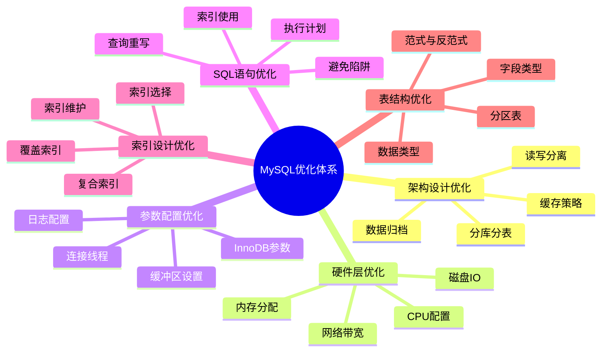
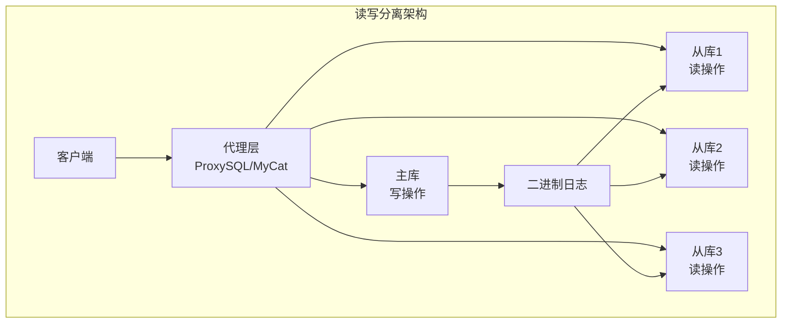
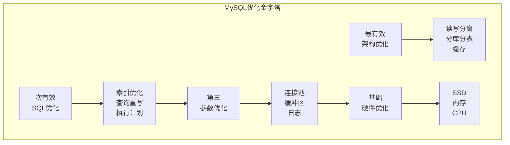

## 一、MySQL优化体系全景图



---

## 二、架构设计优化

### 2.1 读写分离



**实现方案**：
```sql
-- 应用层实现
// 代码中区分读写
public List<User> getUsers() {
    // 读操作走从库
    return slaveJdbcTemplate.query("SELECT * FROM users");
}

public void updateUser(User user) {
    // 写操作走主库
    masterJdbcTemplate.update("UPDATE users SET name = ?", user.getName());
}

-- 中间件实现（ProxySQL）
-- 配置读写分离规则
INSERT INTO mysql_query_rules 
(rule_id, active, match_pattern, destination_hostgroup) 
VALUES 
(1, 1, '^SELECT.*FOR UPDATE$', 0),  -- 写操作去主库
(2, 1, '^SELECT', 1);                -- 读操作去从库
```

### 2.2 分库分表

```sql
-- 垂直分库：按业务拆分
-- 原单库
CREATE DATABASE ecommerce;

-- 拆分为业务库
CREATE DATABASE user_db;      -- 用户相关表
CREATE DATABASE order_db;     -- 订单相关表
CREATE DATABASE product_db;   -- 商品相关表

-- 水平分表：按ID范围或哈希
-- 用户表按ID取模分8表
CREATE TABLE user_0 LIKE user;
CREATE TABLE user_1 LIKE user;
...
CREATE TABLE user_7 LIKE user;

-- 路由规则
-- 分片键：user_id
-- 路由算法：user_id % 8
SELECT * FROM user_${user_id % 8} WHERE user_id = 10086;
```

### 2.3 缓存策略

```sql
-- Redis缓存热点数据
// 查询流程
User getUser(Long id) {
    // 1. 查缓存
    User user = redis.get("user:" + id);
    if (user != null) {
        return user;
    }
    
    // 2. 缓存未命中，查数据库
    user = mysql.query("SELECT * FROM users WHERE id = ?", id);
    
    // 3. 写入缓存
    redis.set("user:" + id, user, 3600); // 过期时间1小时
    
    return user;
}

-- MySQL查询缓存（8.0前）
-- 注意：MySQL 8.0已移除查询缓存
SET GLOBAL query_cache_size = 64M;
SET GLOBAL query_cache_type = ON;
```

---

## 三、硬件层优化

### 3.1 CPU配置

| 配置项 | 推荐值 | 说明 |
|--------|--------|------|
| **CPU核数** | 16核以上 | 高并发场景需要多核 |
| **CPU主频** | 3.0GHz以上 | 复杂计算依赖高频 |
| **超线程** | 开启 | 提升并发处理能力 |

### 3.2 内存配置

```sql
-- 内存分配原则
-- 总内存的70-80%分配给MySQL

-- InnoDB缓冲池（最重要）
innodb_buffer_pool_size = 总内存 * 70%

-- 其他内存分配
innodb_log_buffer_size = 64M     -- 日志缓冲区
key_buffer_size = 256M            -- MyISAM键缓存
tmp_table_size = 64M              -- 临时表大小
max_connections = 1000            -- 最大连接数
sort_buffer_size = 4M             -- 排序缓冲区
join_buffer_size = 4M             -- 连接缓冲区
```

### 3.3 磁盘IO优化

```ini
# 磁盘配置
# 1. 使用SSD固态硬盘
# 2. RAID 10配置
# 3. 独立磁盘存储日志和数据

# my.cnf配置
# InnoDB文件设置
innodb_data_file_path = ibdata1:1G:autoextend
innodb_file_per_table = 1  # 每个表独立表空间

# 日志文件设置
innodb_log_file_size = 2G     # 日志文件大小
innodb_log_files_in_group = 4  # 日志文件数量
innodb_flush_log_at_trx_commit = 2  # 日志刷新策略
```

---

## 四、参数配置优化

### 4.1 连接线程优化

```ini
# 连接相关
max_connections = 2000               # 最大连接数
max_connect_errors = 100000          # 最大错误连接数
connect_timeout = 10                  # 连接超时
wait_timeout = 28800                  # 非交互式连接超时
interactive_timeout = 28800           # 交互式连接超时

# 线程缓存
thread_cache_size = 64                # 线程缓存大小
thread_handling = pool-of-threads     # 线程池模式（企业版）
```

### 4.2 InnoDB核心参数

```ini
# InnoDB缓冲池
innodb_buffer_pool_size = 32G         # 总内存的70%
innodb_buffer_pool_instances = 8      # 缓冲池实例数
innodb_old_blocks_time = 1000         # 老生代停留时间

# IO相关
innodb_io_capacity = 2000              # IO能力上限
innodb_io_capacity_max = 3000          # 最大IO能力
innodb_flush_method = O_DIRECT         # 直接IO

# 刷盘策略
innodb_flush_log_at_trx_commit = 2     # 性能优先
innodb_log_buffer_size = 64M           # 日志缓冲区
innodb_log_file_size = 2G              # 日志文件大小

# 并发控制
innodb_thread_concurrency = 0          # 0表示不限制
innodb_read_io_threads = 64            # 读线程数
innodb_write_io_threads = 64           # 写线程数

# 事务隔离级别
transaction_isolation = READ-COMMITTED  # 减少锁竞争
```

### 4.3 其他关键参数

```ini
# 临时表
tmp_table_size = 64M
max_heap_table_size = 64M

# 排序和分组
sort_buffer_size = 4M
join_buffer_size = 4M

# 查询缓存（8.0前）
query_cache_type = 0                    # 建议关闭
query_cache_size = 0

# 慢查询日志
slow_query_log = 1
slow_query_log_file = /var/log/mysql/slow.log
long_query_time = 1                      # 超过1秒记录
log_queries_not_using_indexes = 1        # 记录未使用索引的查询
```

---

## 五、SQL语句优化

### 5.1 索引使用优化

```sql
-- ❌ 糟糕的SQL
SELECT * FROM orders WHERE YEAR(create_time) = 2023;
-- 无法使用索引，函数导致索引失效

-- ✅ 优化后
SELECT * FROM orders 
WHERE create_time >= '2023-01-01' 
AND create_time < '2024-01-01';

-- ❌ 隐式类型转换
SELECT * FROM users WHERE phone = 13800138000;  -- phone是varchar

-- ✅ 正确写法
SELECT * FROM users WHERE phone = '13800138000';

-- ❌ 前导模糊查询
SELECT * FROM users WHERE name LIKE '%张%';

-- ✅ 改为（如果能满足业务）
SELECT * FROM users WHERE name LIKE '张%';
```

### 5.2 查询重写优化

```sql
-- ❌ 使用子查询（性能差）
SELECT * FROM orders 
WHERE user_id IN (
    SELECT id FROM users WHERE age > 25
);

-- ✅ 改为JOIN
SELECT o.* FROM orders o
INNER JOIN users u ON o.user_id = u.id
WHERE u.age > 25;

-- ❌ OR条件
SELECT * FROM users 
WHERE age = 25 OR name = 'Tom';

-- ✅ 改为UNION
SELECT * FROM users WHERE age = 25
UNION
SELECT * FROM users WHERE name = 'Tom';

-- ❌ 大偏移量分页
SELECT * FROM orders ORDER BY id LIMIT 100000, 20;

-- ✅ 优化分页
SELECT * FROM orders 
WHERE id > 100000 
ORDER BY id 
LIMIT 20;

-- 或者使用子查询
SELECT * FROM orders 
WHERE id >= (
    SELECT id FROM orders ORDER BY id LIMIT 100000, 1
) 
LIMIT 20;
```

### 5.3 执行计划分析

```sql
-- 分析SQL执行计划
EXPLAIN SELECT * FROM users u 
INNER JOIN orders o ON u.id = o.user_id 
WHERE u.age > 25 AND o.amount > 1000;

-- 关键字段解读
-- type: ALL(全表扫描) -> index(索引扫描) -> range(范围) -> ref(等值) -> const(常量)
-- possible_keys: 可能使用的索引
-- key: 实际使用的索引
-- rows: 扫描行数
-- Extra: Using index(覆盖索引), Using where, Using temporary(临时表), Using filesort(文件排序)

-- 优化目标
-- 1. type尽量达到ref或range
-- 2. rows尽量小
-- 3. 避免Using temporary和Using filesort
-- 4. 尽量出现Using index
```

### 5.4 批量操作优化

```sql
-- ❌ 循环单条插入（1000次网络交互）
for (User user : userList) {
    INSERT INTO users VALUES (...);
}

-- ✅ 批量插入（1次网络交互）
INSERT INTO users (name, age) VALUES 
('Tom', 25),
('Jerry', 28),
('Alice', 22),
...  -- 一次插入500-1000条

-- ❌ 逐条更新
for (Order order : orderList) {
    UPDATE orders SET status = 2 WHERE id = ?;
}

-- ✅ 批量更新（使用CASE WHEN）
UPDATE orders SET status = CASE id
    WHEN 1 THEN 2
    WHEN 2 THEN 3
    WHEN 3 THEN 2
END
WHERE id IN (1, 2, 3);
```

---

## 六、索引设计优化

### 6.1 索引选择原则

```sql
-- 1. 高选择性列优先
-- 选择性 = COUNT(DISTINCT col) / COUNT(*)
-- 选择性越接近1越好

-- 2. 经常查询的列
-- WHERE条件中的列

-- 3. 排序分组列
-- ORDER BY, GROUP BY

-- 4. 连接条件列
-- JOIN ON 后面的列

-- 示例：电商订单表
CREATE TABLE orders (
    id BIGINT PRIMARY KEY,
    order_no VARCHAR(32) UNIQUE,        -- 唯一索引
    user_id INT,                         -- 外键索引
    status TINYINT,
    create_time DATETIME,
    amount DECIMAL(10,2),
    INDEX idx_user (user_id),            -- 高频查询
    INDEX idx_create_time (create_time)   -- 范围查询
);
```

### 6.2 复合索引设计

```sql
-- 分析查询模式
-- 查询1: WHERE user_id = ? AND status = ?
-- 查询2: WHERE user_id = ? ORDER BY create_time DESC
-- 查询3: WHERE status = ? AND create_time > ?

-- ✅ 复合索引设计
CREATE INDEX idx_user_status ON orders(user_id, status);  -- 满足查询1
CREATE INDEX idx_user_create ON orders(user_id, create_time);  -- 满足查询2
CREATE INDEX idx_status_create ON orders(status, create_time);  -- 满足查询3

-- 最左前缀原则
-- idx_user_status 能匹配:
WHERE user_id = ?                      -- ✅
WHERE user_id = ? AND status = ?        -- ✅
WHERE status = ?                        -- ❌ 不能使用

-- 区分度高的列放前面
-- 假设user_id区分度高，status区分度低
-- ✅ 正确: (user_id, status)
-- ❌ 错误: (status, user_id)
```

### 6.3 覆盖索引

```sql
-- 频繁查询：根据user_id查询订单金额
SELECT user_id, amount FROM orders WHERE user_id = 123;

-- ✅ 创建覆盖索引
CREATE INDEX idx_user_amount ON orders(user_id, amount);

-- 执行计划会显示: Using index
EXPLAIN SELECT user_id, amount FROM orders WHERE user_id = 123;
-- Extra: Using index  ✅ 无需回表

-- 覆盖索引可以包含多个字段
CREATE INDEX idx_order_info ON orders(user_id, status, amount, create_time);
```

### 6.4 索引维护

```sql
-- 查看索引使用情况
SELECT * FROM sys.schema_index_statistics 
WHERE table_schema = 'mydb' AND table_name = 'orders';

-- 查看未使用的索引
SELECT * FROM sys.schema_unused_indexes
WHERE object_schema = 'mydb';

-- 重建索引（减少碎片）
ALTER TABLE orders ENGINE=InnoDB;
-- 或
OPTIMIZE TABLE orders;

-- 删除冗余索引
-- 如果有了(a,b)，(a)就是冗余的
DROP INDEX idx_user ON orders;  -- 如果已经有了idx_user_status
```

---

## 七、表结构优化

### 7.1 字段类型优化

```sql
-- ❌ 错误示范
CREATE TABLE users_bad (
    id INT PRIMARY KEY,
    name VARCHAR(255),        -- 过长
    age VARCHAR(10),          -- 应该用数字
    status VARCHAR(20),       -- 固定值用ENUM/TINYINT
    create_time VARCHAR(20),  -- 应该用DATETIME
    content TEXT,             -- 过大字段放在主表
    deleted TINYINT DEFAULT 0  -- 区分度低
);

-- ✅ 优化后
CREATE TABLE users_good (
    id INT PRIMARY KEY AUTO_INCREMENT,
    name VARCHAR(50) NOT NULL,           -- 合适的长度
    age TINYINT UNSIGNED,                 -- 使用数字类型
    status TINYINT DEFAULT 1,              -- TINYINT代替字符串
    create_time DATETIME DEFAULT CURRENT_TIMESTAMP,
    deleted TINYINT DEFAULT 0,
    INDEX idx_deleted (deleted) WHERE deleted = 0  -- 部分索引
);

-- 大字段拆分
CREATE TABLE articles (
    id INT PRIMARY KEY,
    title VARCHAR(200),
    summary VARCHAR(500),
    content_id INT,  -- 关联大字段表
    create_time DATETIME
);

CREATE TABLE article_contents (
    id INT PRIMARY KEY,
    content LONGTEXT
);
```

### 7.2 范式与反范式

```sql
-- 第三范式（减少冗余）
CREATE TABLE orders_3nf (
    id INT PRIMARY KEY,
    user_id INT,
    product_id INT,
    quantity INT,
    price DECIMAL(10,2),
    FOREIGN KEY (user_id) REFERENCES users(id),
    FOREIGN KEY (product_id) REFERENCES products(id)
);
-- 查询时需要JOIN users和products获取用户名和产品名

-- 反范式（冗余字段，提升查询性能）
CREATE TABLE orders_denormalized (
    id INT PRIMARY KEY,
    user_id INT,
    user_name VARCHAR(50),      -- 冗余用户名字段
    product_id INT,
    product_name VARCHAR(100),   -- 冗余产品名字段
    quantity INT,
    price DECIMAL(10,2),
    total_amount DECIMAL(10,2),  -- 冗余计算字段
    create_time DATETIME
);
-- 查询无需JOIN，性能提升，但更新需要维护冗余
```

### 7.3 分区表

```sql
-- 按范围分区（适合时间序列数据）
CREATE TABLE orders_partitioned (
    id INT,
    order_no VARCHAR(32),
    amount DECIMAL(10,2),
    create_time DATETIME
)
PARTITION BY RANGE (YEAR(create_time)) (
    PARTITION p2021 VALUES LESS THAN (2022),
    PARTITION p2022 VALUES LESS THAN (2023),
    PARTITION p2023 VALUES LESS THAN (2024),
    PARTITION p2024 VALUES LESS THAN (2025),
    PARTITION p_future VALUES LESS THAN MAXVALUE
);

-- 按列表分区（适合地区、状态）
CREATE TABLE users_partitioned (
    id INT,
    name VARCHAR(50),
    region VARCHAR(20),
    create_time DATETIME
)
PARTITION BY LIST COLUMNS(region) (
    PARTITION p_north VALUES IN ('北京', '天津', '河北'),
    PARTITION p_south VALUES IN ('广东', '广西', '海南'),
    PARTITION p_east VALUES IN ('上海', '江苏', '浙江'),
    PARTITION p_west VALUES IN ('四川', '重庆', '云南')
);

-- 分区查询优势
EXPLAIN PARTITIONS 
SELECT * FROM orders_partitioned 
WHERE create_time BETWEEN '2023-01-01' AND '2023-12-31';
-- 只扫描p2023分区，其他分区自动跳过
```

---

## 八、监控与分析工具

### 8.1 慢查询日志分析

```sql
-- 开启慢查询日志
SET GLOBAL slow_query_log = ON;
SET GLOBAL long_query_time = 1;
SET GLOBAL log_queries_not_using_indexes = ON;

-- 使用pt-query-digest分析
pt-query-digest /var/log/mysql/slow.log

-- 输出示例
# Profile
# Rank Query ID           Response time  Calls R/Call  V/M
# ==== ================== ============== ===== ======= ====
#    1 0x123456789ABCDEF   120.5678 35.2%   120 1.0047  0.25 SELECT orders
#    2 0x23456789ABCDEF1    89.1234 26.1%    89 1.0014  0.15 SELECT users
```

### 8.2 性能监控工具

```sql
-- 1. 查看数据库状态
SHOW GLOBAL STATUS;
SHOW ENGINE INNODB STATUS\G

-- 2. 查看进程列表
SHOW FULL PROCESSLIST;

-- 3. 查看正在运行的查询
SELECT * FROM information_schema.PROCESSLIST 
WHERE COMMAND != 'Sleep';

-- 4. 查看表状态
SHOW TABLE STATUS FROM mydb;

-- 5. 查看索引使用情况
SELECT * FROM sys.schema_index_statistics;

-- 6. 查看冗余索引
SELECT * FROM sys.schema_redundant_indexes;

-- 7. 查看表IO
SELECT * FROM sys.io_global_by_file_by_bytes;
```

### 8.3 性能监控脚本

```sql
-- 创建性能监控表
CREATE TABLE perf_monitor (
    id INT AUTO_INCREMENT PRIMARY KEY,
    collect_time DATETIME,
    threads_connected INT,
    threads_running INT,
    qps INT,
    tps INT,
    innodb_rows_read BIGINT,
    innodb_rows_inserted BIGINT,
    innodb_rows_updated BIGINT,
    innodb_rows_deleted BIGINT,
    slow_queries INT
);

-- 定期采集数据
INSERT INTO perf_monitor (
    collect_time,
    threads_connected,
    threads_running,
    qps,
    innodb_rows_read,
    slow_queries
)
SELECT 
    NOW(),
    VARIABLE_VALUE,
    (SELECT VARIABLE_VALUE FROM performance_schema.global_status 
     WHERE VARIABLE_NAME = 'Threads_running'),
    (SELECT VARIABLE_VALUE FROM performance_schema.global_status 
     WHERE VARIABLE_NAME = 'Questions') / 60,
    (SELECT VARIABLE_VALUE FROM performance_schema.global_status 
     WHERE VARIABLE_NAME = 'Innodb_rows_read'),
    (SELECT VARIABLE_VALUE FROM performance_schema.global_status 
     WHERE VARIABLE_NAME = 'Slow_queries')
FROM performance_schema.global_status 
WHERE VARIABLE_NAME = 'Threads_connected';
```

---

## 九、优化案例实战

### 9.1 案例1：订单查询优化

```sql
-- 原始慢查询
SELECT * FROM orders o
LEFT JOIN users u ON o.user_id = u.id
LEFT JOIN products p ON o.product_id = p.id
WHERE o.status = 1 
  AND o.create_time > DATE_SUB(NOW(), INTERVAL 30 DAY)
ORDER BY o.create_time DESC
LIMIT 20;

-- 问题分析
-- 1. 查询所有列，包括大字段
-- 2. LEFT JOIN可能不必要
-- 3. 没有合适的索引

-- 优化方案
-- 1. 创建复合索引
CREATE INDEX idx_status_create ON orders(status, create_time);

-- 2. 只查询需要的字段
SELECT o.id, o.order_no, o.amount, o.create_time,
       u.name as user_name, p.name as product_name
FROM orders o
INNER JOIN users u ON o.user_id = u.id  -- 改为INNER JOIN
INNER JOIN products p ON o.product_id = p.id
WHERE o.status = 1 
  AND o.create_time > DATE_SUB(NOW(), INTERVAL 30 DAY)
ORDER BY o.create_time DESC
LIMIT 20;

-- 3. 使用覆盖索引（如果可能）
CREATE INDEX idx_covering ON orders(status, create_time, id, order_no, amount);
```

### 9.2 案例2：统计报表优化

```sql
-- 原始查询（每月统计，扫描全表）
SELECT 
    DATE_FORMAT(create_time, '%Y-%m') as month,
    COUNT(*) as order_count,
    SUM(amount) as total_amount,
    AVG(amount) as avg_amount
FROM orders
WHERE create_time >= '2023-01-01'
GROUP BY DATE_FORMAT(create_time, '%Y-%m');

-- 优化方案1：使用汇总表
CREATE TABLE order_summary (
    year_month VARCHAR(7) PRIMARY KEY,
    order_count INT,
    total_amount DECIMAL(15,2),
    avg_amount DECIMAL(10,2),
    update_time DATETIME
);

-- 定期更新汇总表
INSERT INTO order_summary (year_month, order_count, total_amount, avg_amount)
SELECT 
    DATE_FORMAT(create_time, '%Y-%m'),
    COUNT(*),
    SUM(amount),
    AVG(amount)
FROM orders
WHERE create_time >= LAST_DAY(NOW()) - INTERVAL 1 MONTH + INTERVAL 1 DAY
  AND create_time < LAST_DAY(NOW()) + INTERVAL 1 DAY
GROUP BY DATE_FORMAT(create_time, '%Y-%m')
ON DUPLICATE KEY UPDATE
    order_count = VALUES(order_count),
    total_amount = VALUES(total_amount),
    avg_amount = VALUES(avg_amount),
    update_time = NOW();

-- 查询时直接使用汇总表
SELECT * FROM order_summary 
WHERE year_month >= '2023-01';

-- 优化方案2：使用分区表
-- 已创建分区表，按月分区
SELECT 
    YEAR(create_time) as year,
    MONTH(create_time) as month,
    COUNT(*) as order_count,
    SUM(amount) as total_amount
FROM orders_partitioned
WHERE create_time >= '2023-01-01'
GROUP BY YEAR(create_time), MONTH(create_time);
```

### 9.3 案例3：分页查询优化

```sql
-- 原始分页（深分页问题）
SELECT * FROM orders 
WHERE user_id = 123 
ORDER BY id 
LIMIT 100000, 20;

-- 优化方案1：记录上次位置
-- 第一次查询
SELECT * FROM orders 
WHERE user_id = 123 
ORDER BY id 
LIMIT 20;
-- 记录最后一条的id=10086

-- 下一页
SELECT * FROM orders 
WHERE user_id = 123 
  AND id > 10086
ORDER BY id 
LIMIT 20;

-- 优化方案2：子查询优化
SELECT * FROM orders 
WHERE id >= (
    SELECT id FROM orders 
    WHERE user_id = 123 
    ORDER BY id 
    LIMIT 100000, 1
) AND user_id = 123
ORDER BY id 
LIMIT 20;

-- 优化方案3：延迟关联
SELECT o.* FROM orders o
INNER JOIN (
    SELECT id FROM orders 
    WHERE user_id = 123 
    ORDER BY id 
    LIMIT 100000, 20
) tmp ON o.id = tmp.id
ORDER BY o.id;
```

---

## 十、优化检查清单

```markdown
## MySQL优化每日检查清单

### 🔍 基础检查
- [ ] 数据库连接数是否正常？(`SHOW STATUS LIKE 'Threads_connected'`)
- [ ] 是否有慢查询？(`SHOW PROCESSLIST`)
- [ ] 磁盘空间是否充足？(`df -h`)

### 📊 性能指标
- [ ] QPS/TPS是否在正常范围？
- [ ] 缓冲池命中率 > 99%？(`SHOW STATUS LIKE 'Innodb_buffer_pool_read%'`)
- [ ] 临时表使用是否过多？(`SHOW STATUS LIKE 'Created_tmp%'`)

### 🔧 索引检查
- [ ] 是否有未使用的索引？(`sys.schema_unused_indexes`)
- [ ] 是否有冗余索引？(`sys.schema_redundant_indexes`)
- [ ] 是否有索引碎片需要重建？(`SHOW TABLE STATUS`)

### ⚠️ 告警检查
- [ ] 是否有死锁？(`SHOW ENGINE INNODB STATUS`)
- [ ] 是否有锁等待超时？(`innodb_lock_wait_timeout`)
- [ ] 是否有复制延迟？(`SHOW SLAVE STATUS`)

### 📈 容量规划
- [ ] 表空间增长趋势？
- [ ] 是否需要归档历史数据？
- [ ] 是否需要扩容？
```

---

## 十一、总结：MySQL优化金字塔



**优化黄金法则**：

1. **架构先行**：读写分离、分库分表解决根本问题
2. **索引为王**：90%的性能问题通过索引解决
3. **SQL要精**：避免常见陷阱，让优化器发挥最佳
4. **参数调优**：根据硬件和工作负载合理配置
5. **监控驱动**：用数据说话，持续优化

**一句话总结**：
> **MySQL优化是一个系统工程，从架构设计到硬件配置，从索引优化到SQL重写，需要全方位考虑。但记住：最好的优化是不需要优化，通过良好的设计从源头避免性能问题。**