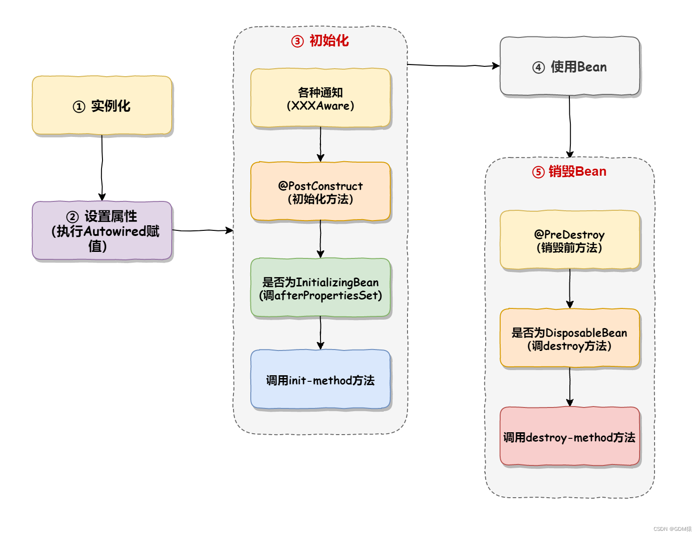
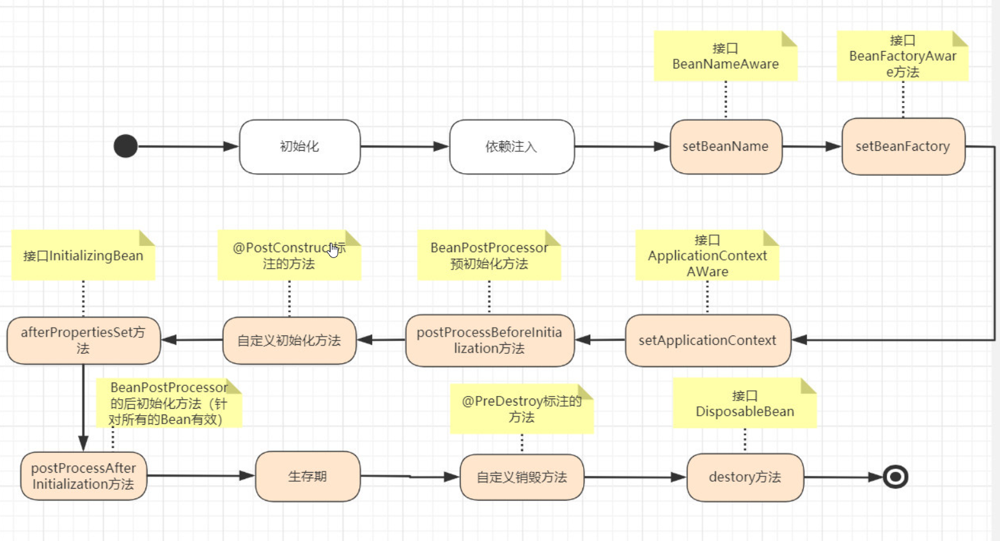

## 什么是spring?

- Spring是**一个轻量级Java开发框架**，最早有**Rod Johnson**创建，目的是为了解决企业级应用开发的业务逻辑层和其他各层的耦合问题。它是一个分层的JavaSE/JavaEE full-stack(一站式)轻量级开源框架，为开发Java应用程序提供全面的基础架构支持。Spring负责基础架构，因此Java开发者可以专注于应用程序的开发。
- Spring最根本的使命是**解决企业级应用开发的复杂性，即简化Java开发**。
- Spring可以做很多事情，它为企业级开发提供给了丰富的功能，但是这些功能的底层都依赖于它的两个核心特性，也就是**依赖注入(dependency injection，DI)****和****面向切面编程(aspect-oriented programming，AOP)**。

**为了降低Java开发的复杂性，Spring采取了以下4种关键策略**

- 基于POJO的轻量级和最小侵入性编程;
- 通过**依赖注入和面向接口**实现松耦合;
- 基于切面和惯例进行声明式编程;
- 通过切面和模板减少样板式代码。

## Spring两大核心特性

### IOC 控制反转

> Ioc—Inversion of Control，即“控制反转”，不是什么技术，而是一种设计思想。在Java开发中，Ioc意味着将你设计好的对象交给容器控制，而不是传统的在你的对象内部直接控制。

IoC 不是一种技术，只是一种思想，一个重要的面向对象编程的法则，它能指导我们如何设计出松耦合、更优良的程序。传统应用程序都是由我们在类内部主动创建依赖对象，从而导致类与类之间高耦合(聚合关系)，难于测试;有了IoC容器后，把创建和查找依赖对象的控制权交给了容器，由容器进行注入组合对象，所以对象与对象之间是 松散耦合，这样也方便测试，利于功能复用，更重要的是使得程序的整个体系结构变得非常灵活。

其实IoC对编程带来的最大改变不是从代码上，而是从思想上，发生了“主从换位”的变化。应用程序原本是老大，要获取什么资源都是主动出击，但是在IoC/DI思想中，应用程序就变成被动的了，被动的等待IoC容器来创建并注入它所需要的资源了。

IoC很好的体现了面向对象设计法则之一—— 好莱坞法则:“别找我们，我们找你”;即由IoC容器帮对象找相应的依赖对象并注入，而不是由对象主动去找。

控制翻转，也叫依赖注入，他就是不会直接创建对象，只是把对象声明出来，在代码 中不直接与对象和服务进行连接，但是在配置文件中描述了哪一项组件需要哪一项服 务，容器将他们组件起来。在一般的IOC场景中容器创建了所有的对象，并设置了必 要的属性将他们联系在一起，等到需要使用的时候才把他们声明出来，使用注解就跟 方便了，容器会自动根据注解把对象组合起来

### 依赖注入

DI—Dependency Injection，即“依赖注入”:组件之间依赖关系由容器在运行期决定，形象的说，即由容器动态的将某个依赖关系注入到组件之中。依赖注入的目的并非为软件系统带来更多功能，而是为了提升组件重用的频率，并为系统搭建一个灵活、可扩展的平台。通过依赖注入机制，我们只需要通过简单的配置，而无需任何代码就可指定目标需要的资源，完成自身的业务逻辑，而不需要关心具体的资源来自何处，由谁实现。

理解DI的关键是:“谁依赖谁，为什么需要依赖，谁注入谁，注入了什么”，那我们来深入分析一下:

- 谁依赖于谁:当然是应用程序依赖于IoC容器;
- 为什么需要依赖:应用程序需要IoC容器来提供对象需要的外部资源;
- 谁注入谁:很明显是IoC容器注入应用程序某个对象，应用程序依赖的对象;
- 注入了什么:就是注入某个对象所需要的外部资源(包括对象、资源、常量数据)。

IoC和DI由什么关系呢？其实它们是同一个概念的不同角度描述，由于控制反转概念比较含糊(可能只是理解为容器控制对象这一个层面，很难让人想到谁来维护对象关系)，所以2004年大师级人物Martin Fowler又给出了一个新的名字:“依赖注入”，相对IoC 而言，“依赖注入”明确描述了“被注入对象依赖IoC容器配置依赖对象”。

- 类型匹配(Type Matching):虽然我们通过接口(或者抽象类)来进行服务调用，但是服务本身还是实现在某个具体的服务类型中，这就需要某个类型注册机制来解决服务接口和服务类型之间的匹配关系;

- 构造器注入(Constructor Injection):IoC容器会智能地选择选择和调用适合的构造函数以创建依赖的对象。如果被选择的构造函数具有相应的参数，IoC容器在调用构造函数之前解析注册的依赖关系并自行获得相应参数对象;

- 属性注入(Property Injection):如果需要使用到被依赖对象的某个属性，在被依赖对象被创建之后，IoC容器会自动初始化该属性;

- 方法注入(Method Injection):如果被依赖对象需要调用某个方法进行相应的初始化，在该对象创建之后，IoC容器会自动调用该方法

### AOP(面对切面编程)

- 面对切面编程，这是一种编程模式，他允许程序员通过自定义的横切点进行模块 化，将那些影响多个类的行为封装到课重用的模块中。 例子:比如日志输出，不使用AOP的话就需要把日志的输出语句放在所有类中，方法 中，但是有了AOP就可以把日志输出语句封装一个可重用模块，在以声明的方式将他 们放在类中，每次使用类就自动完成了日志输出。

## Spring框架的核心目标和优势。

Spring框架的核心目标是简化企业级Java应用程序的开发和集成，通过提供全面的基础设施和支持来实现这一目标。以下是Spring框架的核心目标和优势:

### 核心目标

1. **简化开发:** 提供了一种轻量级的开发方式，通过IoC和依赖注入，减少了大量样板代码，使开发更加简洁。
2. **提高可测试性:** 通过将业务逻辑与底层框架解耦，使代码更容易进行单元测试和集成测试。
3. **促进松耦合:** 通过控制反转(IoC)和面向切面编程(AOP)等特性，帮助实现系统组件之间的松耦合，提高系统的可维护性和可扩展性。
4. **提供一致性:** 提供一致的事务管理、异常处理和数据访问方式，使开发者能够更容易理解和应用这些关键领域。
5. **支持各种数据访问:** 集成了不同的数据访问技术，包括JDBC、ORM框架(如Hibernate)、JPA等，使得数据访问更加便捷。
6. **提供全面的功能:** Spring框架提供了广泛的功能，包括事务管理、安全性、缓存、邮件、调度等，使得开发者能够快速构建出健壮、全功能的应用。
7. **支持面向切面编程:** 通过AOP的支持，能够将横切关注点(如日志、事务、安全性)与核心业务逻辑分离，提高代码的可维护性。
8. **支持响应式编程:** 引入了Reactive编程模型，提供了对响应式流的支持，使得构建高性能、异步、非阻塞的应用更为容易。

### 优势

1. **模块化:** Spring框架是模块化的，开发者可以根据项目需要选择使用特定的模块，提高了灵活性和可维护性。
2. **松耦合:** 通过IoC和AOP的支持，实现了组件之间的松耦合，降低了组件之间的依赖性，提高了系统的灵活性。
3. **可扩展性:** 框架的设计允许开发者通过自定义扩展点来扩展功能，使得应用程序更容易适应变化。
4. **广泛的社区支持:** Spring框架拥有庞大而活跃的社区，提供了大量的文档、教程和社区支持，使得开发者可以更轻松地学习和使用框架。
5. **良好的设计理念:** Spring框架遵循了良好的设计原则，如开闭原则、单一职责原则，使得框架的代码清晰、可读性强。
6. **与其他技术的整合:** Spring框架可以与许多其他流行的技术和框架无缝整合，如Hibernate、MyBatis、Spring Boot等。
7. **强大的事务管理:** 提供了灵活、强大的事务管理机制，支持声明式事务和编程式事务，确保了数据的一致性和可靠性。
8. **广泛的应用领域:** Spring框架在企业级应用、Web应用、移动应用、云计算等领域都有广泛的应用，是一个通用的解决方案。

### 缺点

- Spring明明一个很轻量级的框架，却给人感觉大而全
- Spring依赖反射，反射影响性能
- 使用门槛升高，入门Spring需要较长时间

## Spring框架的设计目标，设计理念，和核心是什么

- **Spring设计目标**:Spring为开发者提供一个一站式轻量级应用开发平台;
- **Spring设计理念**:在JavaEE开发中，支持POJO和JavaBean开发方式，使应用面向接口开发，充分支持OOP(面向对象)设计方法;Spring通过IOC容器实现对象耦合关系的管理，并实现依赖反转，将对象之间的依赖关系交给IOC容器，实现解耦;
- **Spring框架的核心**:IOC容器和AOP模块。通过IOC容器管理POJO对象以及他们之间的耦合关系;通过AOP以动态非侵入的方式增强服务。
- IOC让相互协作的组件保持松散的耦合，而AOP编程允许你把遍布于应用各层的功能分离出来形成可重用的功能组件。

## Spring由哪些模块组成？

Spring 总共大约有 20 个模块， 由 1300 多个不同的文件构成。 而这些组件被分别整合在核心容器(Core Container) 、 AOP(Aspect Oriented Programming)和设备支持(Instrmentation) 、数据访问与集成(Data Access/Integeration) 、 Web、 消息(Messaging) 、 Test等 6 个模块中。 以下是 Spring 5 的模块结构图: 


- spring core:提供了框架的基本组成部分，包括控制反转(Inversion of Control，IOC)和依赖注入(Dependency Injection，DI)功能。
- spring beans:提供了BeanFactory，是工厂模式的一个经典实现，Spring将管理对象称为Bean。
- spring context:构建于 core 封装包基础上的 context 封装包，提供了一种框架式的对象访问方法。
- spring jdbc:提供了一个JDBC的抽象层，消除了烦琐的JDBC编码和数据库厂商特有的错误代码解析， 用于简化JDBC。
- spring aop:提供了面向切面的编程实现，让你可以自定义拦截器、切点等。
- spring Web:提供了针对 Web 开发的集成特性，例如文件上传，利用 servlet listeners 进行 ioc 容器初始化和针对 Web 的 ApplicationContext。
- spring test:主要为测试提供支持的，支持使用JUnit或TestNG对Spring组件进行单元测试和集成测试。

## Spring生态系统的其他项目，如Spring Boot、Spring Cloud等。

Spring生态系统是一个庞大的生态系统，包含许多项目，其中一些是核心框架的扩展或补充。以下是Spring生态系统的一些重要项目:

**Spring Boot:**

- - **简介:** Spring Boot是用于简化和加速Spring应用程序开发的项目。它提供了开箱即用的默认配置，并支持自动配置，使得开发者可以更专注于业务逻辑。
  - **关键特性:** 自动配置、嵌入式Web服务器(如Tomcat、Jetty)、约定大于配置、快速开发、生产就绪的特性。

**Spring Cloud:**

- - **简介:** Spring Cloud是用于构建分布式系统的一组工具。它提供了微服务架构的解决方案，包括服务发现、配置管理、负载均衡等。
  - **关键特性:** 服务发现、负载均衡、分布式配置、断路器、消息总线等。

**Spring Data:**

- - **简介:** Spring Data是一组用于简化数据访问的项目。它提供了对各种数据存储的抽象和简化的数据访问模型。
  - **关键特性:** 统一的Repository模型、查询方法、对关系型数据库和NoSQL数据库的支持。

**Spring Security:**

- - **简介:** Spring Security是用于在Spring应用程序中提供身份验证和授权的框架。它支持多种身份验证机制和授权模型。
  - **关键特性:** 身份验证、授权、基于角色的访问控制、OAuth支持等。

**Spring Batch:**

- - **简介:** Spring Batch是一个用于批处理应用程序的框架。它提供了大量的工具和功能，用于处理大规模数据的批量处理。
  - **关键特性:** 事务性批处理、可伸缩的并行处理、失败重试、任务监控等。

**Spring Integration:**

- - **简介:** Spring Integration是一个用于构建企业集成模式(EIP)的框架。它提供了消息传递和消息驱动的方式，用于构建分布式系统。
  - **关键特性:** 通道和适配器模式、消息路由、事务性消息、集成流程等。

**Spring WebSocket:**

- - **简介:** Spring WebSocket是用于实现WebSocket通信的模块。它使得在Spring应用程序中可以轻松实现实时的双向通信。
  - **关键特性:** 支持WebSocket协议、STOMP协议、广播和点对点通信等。

**Spring Boot Admin:**

- - **简介:** Spring Boot Admin是用于监控和管理Spring Boot应用程序的一套工具。它提供了Web界面，显示了注册的Spring Boot应用程序的运行状况和详细信息。
  - **关键特性:** 应用程序监控、日志查看、环境配置等。

## Spring 框架中都用到了哪些设计模式？

1. 工厂模式:BeanFactory就是简单工厂模式的体现，用来创建对象的实例;
2. 单例模式:Bean默认为单例模式。
3. 代理模式:Spring的AOP功能用到了JDK的动态代理和CGLIB字节码生成技术;
4. 模板方法:用来解决代码重复的问题。比如. RestTemplate, JmsTemplate, JpaTemplate。
5. 观察者模式:定义对象间一种一对多的依赖关系，当一个对象的状态发生改变时，所有依赖于它的对象都会得到通知被制动更新，如Spring中listener的实现–ApplicationListener。

## 详细讲解一下核心容器(spring context应用上下文) 模块

- 这是基本的Spring模块，提供spring 框架的基础功能，BeanFactory 是 任何以spring为基础的应用的核心。Spring 框架建立在此模块之上，它使Spring成为一个容器。
- Bean 工厂是工厂模式的一个实现，提供了控制反转功能，用来把应用的配置和依赖从真正的应用代码中分离。最常用的就是org.springframework.beans.factory.xml.XmlBeanFactory ，它根据XML文件中的定义加载beans。该容器从XML 文件读取配置元数据并用它去创建一个完全配置的系统或应用。

## Spring 应用程序有哪些不同组件？

**Spring 应用一般有以下组件:**

- 接口 - 定义功能。
- Bean 类 - 它包含属性，setter 和 getter 方法，函数等。
- Bean 配置文件 - 包含类的信息以及如何配置它们。
- Spring 面向切面编程(AOP) - 提供面向切面编程的功能。
- 用户程序 - 它使用接口。

## Spring Beans

### 什么是Spring beans？

- Spring beans 是那些形成Spring应用的主干的java对象。它们被Spring IOC容器初始化，装配，和管理。这些beans通过容器中配置的元数据创建。比如，以XML文件中 的形式定义。

### 一个 Spring Bean 定义 包含什么？

- 一个Spring Bean 的定义包含容器必知的所有配置元数据，包括如何创建一个bean，它的生命周期详情及它的依赖。

### 如何给Spring 容器提供配置元数据？Spring有几种配置方式

这里有三种重要的方法给Spring 容器提供配置元数据。 

- XML配置文件。
- 基于注解的配置。
- 基于java的配置。

### Spring配置文件包含了哪些信息

Spring配置文件是个XML 文件，这个文件包含了类信息，描述了如何配置它们，以及如何相互调用。

### Spring基于xml注入bean的几种方式

1. Set方法注入;
2. 构造器注入: 
   1. 通过index设置参数的位置;
   2. 通过type设置参数类型;
1. 静态工厂注入;
2. 实例工厂;

### 你怎样定义类的作用域？

当定义一个bean在Spring里，我们还能给这个bean声明一个作用域。它可以通过bean 定义中的scope属性来定义。如，当Spring要在需要的时候每次生产一个新的bean实例，bean的scope属性被指定为prototype。另一方面，一个bean每次使用的时候必须返回同一个实例，这个bean的scope 属性 必须设为 singleton。

### 解释Spring支持的几种bean的作用域

**Spring框架支持以下五种bean的作用域:**

- **singleton :** bean在每个Spring ioc 容器中只有一个实例。
- **prototype**:一个bean的定义可以有多个实例。
- **request**:每次http请求都会创建一个bean，该作用域仅在基于web的Spring ApplicationContext情形下有效。
- **session**:在一个HTTP Session中，一个bean定义对应一个实例。该作用域仅在基于web的Spring ApplicationContext情形下有效。
- **global-session**:在一个全局的HTTP Session中，一个bean定义对应一个实例。该作用域仅在基于web的Spring ApplicationContext情形下有效。

**注意:** 缺省的Spring bean 的作用域是Singleton。使用 prototype 作用域需要慎重的思考，因为频繁创建和销毁 bean 会带来很大的性能开销。

### Spring框架中的单例bean是线程安全的吗？

- 不是，Spring框架中的单例bean不是线程安全的。
- spring 中的 bean 默认是单例模式，spring 框架并没有对单例 bean 进行多线程的封装处理。
- 实际上大部分时候 spring bean 无状态的(比如 dao 类)，所有某种程度上来说 bean 也是安全的，但如果 bean 有状态的话(比如 view model 对象)，那就要开发者自己去保证线程安全了，最简单的就是改变 bean 的作用域，把“singleton”变更为“prototype”，这样请求 bean 相当于 new Bean()了，所以就可以保证线程安全了。

> 有状态就是有数据存储功能,无状态就是不会保存数据。

### Spring如何处理线程并发问题？

- 在一般情况下，只有无状态的Bean才可以在多线程环境下共享，在Spring中，绝大部分Bean都可以声明为singleton作用域，因为Spring对一些Bean中非线程安全状态采用ThreadLocal进行处理，解决线程安全问题。
- ThreadLocal和线程同步机制都是为了解决多线程中相同变量的访问冲突问题。同步机制采用了“时间换空间”的方式，仅提供一份变量，不同的线程在访问前需要获取锁，没获得锁的线程则需要排队。而ThreadLocal采用了“空间换时间”的方式。
- ThreadLocal会为每一个线程提供一个独立的变量副本，从而隔离了多个线程对数据的访问冲突。因为每一个线程都拥有自己的变量副本，从而也就没有必要对该变量进行同步了。ThreadLocal提供了线程安全的共享对象，在编写多线程代码时，可以把不安全的变量封装进ThreadLocal。

### 解释Spring框架中bean的生命周期

在传统的Java应用中，bean的生命周期很简单。使用Java关键字new进行bean实例化，然后该bean就可以使用了。一旦该bean不再被使用，则由Java自动进行垃圾回收。

相比之下，Spring容器中的bean的生命周期就显得相对复杂多了。正确理解Spring bean的生命周期非常重要，因为你或许要利用Spring提供的扩展点来自定义bean的创建过程。下图展示了bean装载到Spring应用上下文中的一个典型的生命周期过程。



bean在Spring容器中从创建到销毁经历了若干阶段，每一阶段都可以针对Spring如何管理bean进行个性化定制。

正如你所见，在bean准备就绪之前，bean工厂执行了若干启动步骤，下面我们看下每一个阶段调用的方法:



**我们对上图进行详细描述:**

- Spring对bean进行实例化;
- Spring将值和bean的引用注入到bean对应的属性中;
- 如果bean实现了BeanNameAware接口，Spring将bean的ID传递给setBean-Name()方法;
- 如果bean实现了BeanFactoryAware接口，Spring将调用setBeanFactory()方法，将BeanFactory容器实例传入;
- 如果bean实现了ApplicationContextAware接口，Spring将调用setApplicationContext()方法，将bean所在的应用上下文的引用传入进来;
- 如果bean实现了BeanPostProcessor接口，Spring将调用它们的post-ProcessBeforeInitialization()方法;
- 如果bean实现了InitializingBean接口，Spring将调用它们的after-PropertiesSet()方法。类似地，如果bean使用initmethod声明了初始化方法，该方法也会被调用;
- 如果bean实现了BeanPostProcessor接口，Spring将调用它们的post-ProcessAfterInitialization()方法;
- 此时，bean已经准备就绪，可以被应用程序使用了，它们将一直驻留在应用上下文中，直到该应用上下文被销毁;
- 如果bean实现了DisposableBean接口，Spring将调用它的destroy()接口方法。同样，如果bean使用destroy-method声明了销毁方法，该方法也会被调用。

现在你已经了解了如何创建和加载一个Spring容器。但是一个空的容器并没有太大的价值，在你把东西放进去之前，它里面什么都没有。为了从Spring的DI(依赖注入)中受益，我们必须将应用对象装配进Spring容器中。

### 哪些是重要的bean生命周期方法？ 你能重载它们吗？

- 有两个重要的bean 生命周期方法，第一个是setup ， 它是在容器加载bean的时候被调用。第二个方法是 teardown 它是在容器卸载类的时候被调用。
- bean 标签有两个重要的属性(init-method和destroy-method)。用它们你可以自己定制初始化和注销方法。它们也有相应的注解(@PostConstruct和@PreDestroy)。

### 什么是Spring的内部bean？什么是Spring inner beans？

在Spring框架中，当一个bean仅被用作另一个bean的属性时，它能被声明为一个内部bean。内部bean可以用setter注入“属性”和构造方法注入“构造参数”的方式来实现，内部bean通常是匿名的，它们的Scope一般是prototype。


### 什么是bean装配？

装配，或bean 装配是指在Spring 容器中把bean组装到一起，前提是容器需要知道bean的依赖关系，如何通过依赖注入来把它们装配到一起。

### 什么是bean的自动装配？

在Spring框架中，在配置文件中设定bean的依赖关系是一个很好的机制，Spring 容器能够自动装配相互合作的bean，这意味着容器不需要和配置，能通过Bean工厂自动处理bean之间的协作。这意味着 Spring可以通过向Bean Factory中注入的方式自动搞定bean之间的依赖关系。自动装配可以设置在每个bean上，也可以设定在特定的bean上。

### 解释不同方式的自动装配，spring 自动装配 bean 有哪些方式？

- 在spring中，对象无需自己查找或创建与其关联的其他对象，由容器负责把需要相互协作的对象引用赋予各个对象，使用autowire来配置自动装载模式。
- 在Spring框架xml配置中共有5种自动装配:

  - no:默认的方式是不进行自动装配的，通过手工设置ref属性来进行装配bean。
  - byName:通过bean的名称进行自动装配，如果一个bean的 property 与另一bean 的name 相同，就进行自动装配。
  - byType:通过参数的数据类型进行自动装配。
  - constructor:利用构造函数进行装配，并且构造函数的参数通过byType进行装配。
  - autodetect:自动探测，如果有构造方法，通过 construct的方式自动装配，否则使用 byType的方式自动装配。

### 使用@Autowired注解自动装配的过程是怎样的？

- 使用@Autowired注解来自动装配指定的bean。在使用@Autowired注解之前需要在Spring配置文件进行配置，`<context:annotation-config />`。
- 在启动spring IOC时，容器自动装载了一个AutowiredAnnotationBeanPostProcessor后置处理器，当容器扫描到@Autowied、@Resource或@Inject时，就会在IOC容器自动查找需要的bean，并装配给该对象的属性。在使用@Autowired时，首先在容器中查询对应类型的bean:
  - 如果查询结果刚好为一个，就将该bean装配给@Autowired指定的数据;
  - 如果查询的结果不止一个，那么@Autowired会根据名称来查找;
  - 如果上述查找的结果为空，那么会抛出异常。解决方法时，使用required=false。

### 自动装配有哪些局限性？

- 自动装配的局限性是:
  - **重写**:你仍需用 和 配置来定义依赖，意味着总要重写自动装配。
  - **基本数据类型**:你不能自动装配简单的属性，如基本数据类型，String字符串，和类。
  - **模糊特性**:自动装配不如显式装配精确，如果有可能，建议使用显式装配。

### 你可以在Spring中注入一个null 和一个空字符串吗？

- 可以。

## Spring控制反转(IOC)

### 什么是Spring IOC 容器？

- 控制反转即IOC (Inversion of Control)，它把传统上由程序代码直接操控的对象的调用权交给容器，通过容器来实现对象组件的装配和管理。所谓的“控制反转”概念就是对组件对象控制权的转移，从程序代码本身转移到了外部容器。
- Spring IOC 负责**创建对象，管理对象(通过依赖注入(DI)，装配对象，配置对象**，并且管理这些对象的整个生命周期。

### 控制反转(IOC)有什么作用

- 管理对象的创建和依赖关系的维护。对象的创建并不是一件简单的事，在对象关系比较复杂时，如果依赖关系需要程序猿来维护的话，那是相当头疼的
- 解耦，由容器去维护具体的对象
- 托管了类的产生过程，比如我们需要在类的产生过程中做一些处理，最直接的例子就是代理，如果有容器程序可以把这部分处理交给容器，应用程序则无需去关心类是如何完成代理的

### IOC的优点是什么？

- IOC 或 依赖注入把应用的代码量降到最低。
- 它使应用容易测试，单元测试不再需要单例和JNDI查找机制。
- 最小的代价和最小的侵入性使松散耦合得以实现。
- IOC容器支持加载服务时的饿汉式初始化和懒加载。

### IoC的概念和原理

IoC(Inversion of Control)是一种软件设计思想，它反转了传统的程序设计流程中对象的控制权。在传统的程序设计中，程序员通过**直接调用对象的方法来控制对象的行为**。而在IoC中，控制权被反转，对象不再由程序员直接控制，而是由容器(ioc容器)来控制。

**概念:**

IoC的核心思想是将对象的**创建、组装和管理**交给框架或容器，而不是由程序员手动进行控制。在IoC中，对象的生命周期和依赖关系由容器来管理，程序员只需要关注业务逻辑的编写。**IoC通过依赖注入(Dependency Injection)来实现，即将一个对象所需的依赖关系注入到对象中**。


Spring IoC 容器的主要实现：
1. BeanFactory - 基础容器，提供基本功能 
2. ApplicationContext - 高级容器，扩展了 BeanFactory 
   1. ClassPathXmlApplicationContext - 从类路径加载 XML 配置 
   2. AnnotationConfigApplicationContext - 基于注解配置 
   3. WebApplicationContext - 为 Web 应用设计

**ioc容器工作流程**

```shell
┌─────────────────────────────────────────────────────────┐
│                    Spring IoC 容器工作流                 │
├─────────────────────────────────────────────────────────┤
│ 1. 加载配置元数据                                        │
│    ├─ XML 配置文件                                       │
│    ├─ Java 注解                                         │
│    └─ Java Config 类                                    │
│                                                        │
│ 2. 创建 Bean 定义                                       │
│    ├─ Bean 的类信息                                     │
│    ├─ 作用域 (singleton, prototype)                    │
│    ├─ 初始化/销毁方法                                  │
│    └─ 依赖关系                                         │
│                                                        │
│ 3. Bean 生命周期管理                                   │
│    ┌──────────────┐     ┌──────────────┐     ┌──────────────┐
│    │  实例化 Bean  │────▶│  属性注入     │────▶│  初始化 Bean  │
│    │ (Constructor)│     │ (Dependency  │     │ (@PostConstruct)│
│    └──────────────┘     │   Injection) │     └──────────────┘
│                                                        │
│ 4. 将 Bean 放入容器                                    │
│                                                        │
│ 5. 应用程序从容器获取 Bean 使用                        │
└─────────────────────────────────────────────────────────┘
```

**原理:**

IoC的原理主要包括以下几个方面:

1. **控制反转:** 在IoC中，控制权被反转，对象的创建和管理由容器来负责。这种反转是通过将对象的创建和依赖关系的管理从应用程序代码中移出，交给容器来完成。
2. **依赖注入:** IoC通过依赖注入来实现对象之间的解耦。依赖注入是指将一个对象所需的依赖关系注入到对象中，而不是由对象自己创建或查找依赖对象。这可以通过**构造函数注入、方法注入、属性注入**等方式实现。
3. **容器:** IoC容器是负责管理和组装对象的框架。**容器负责创建对象、注入依赖关系、管理对象的生命周期等任务**。常见的IoC容器包括Spring容器、Guice等。
4. **配置:** IoC容器通过配置文件或注解等方式来配置对象的创建和依赖关系。配置文件中描述了对象的类型、依赖关系、生命周期等信息，容器根据配置来完成对象的创建和管理。
5. **生命周期管理:** **IoC容器负责管理对象的生命周期，包括对象的创建、初始化、使用和销毁等阶段**。容器根据配置信息来决定对象的创建和销毁时机。

代码案例:

```java
// 服务接口
public interface Service {
    void execute();
}

// 具体的服务实现类
public class MyService implements Service {
    @Override
    public void execute() {
        System.out.println("Executing MyService");
    }
}

// 客户端类
public class Client {
    private Service service;

    // 通过构造函数注入依赖关系
    public Client(Service service) {
        this.service = service;
    }

    public void performAction() {
        // 客户端使用服务
        service.execute();
    }
}

// 应用程序入口
public class Application {
    public static void main(String[] args) {
        // 创建IoC容器
        // 在Spring框架中，可以使用ApplicationContext来作为IoC容器
        ApplicationContext context = new ApplicationContext();

        // 从容器中获取服务对象
        Service myService = context.getBean(MyService.class);

        // 客户端通过构造函数注入依赖关系
        Client client = new Client(myService);

        // 客户端执行操作
        client.performAction();
    }
}
```

在上述示例中，Client类依赖于Service接口，通过构造函数注入了具体的MyService实现。IoC容器负责管理MyService的创建和注入到Client中，实现了对象之间的解耦。这是一个简化的示例，实际中Spring等IoC框架会提供更丰富的功能和配置方式。


**IOC容器和依赖注入区别**

| 特性       | IoC 容器                        | 依赖注入                 |
| :--------- | :------------------------------ | :----------------------- |
| **定义**   | 负责创建、配置、管理对象的容器  | 实现控制反转的具体技术   |
| **关系**   | 容器是框架，DI 是容器的核心功能 | DI 是 IoC 的一种实现方式 |
| **目的**   | 解耦组件创建和依赖管理          | 解耦对象间的依赖关系     |
| **实现**   | BeanFactory, ApplicationContext | @Autowired, 构造器注入等 |
| **控制权** | 从应用程序转移到容器            | 从类内部转移到外部       |

### 什么是Spring的依赖注入？
> 依赖注入是 IoC 的一种具体实现方式，用于解决对象间的依赖关系。

控制反转IOC是一个很大的概念，可以用不同的方式来实现。其主要实现方式有两种:**依赖注入和依赖查找依赖注入**:相对于IOC而言，依赖注入(DI)更加准确地描述了IOC的设计理念。所谓依赖注入(Dependency Injection)，即组件之间的依赖关系由容器在应用系统运行期来决定，也就是由容器动态地将某种依赖关系的目标对象实例注入到应用系统中的各个关联的组件之中。组件不做定位查询，只提供普通的Java方法让容器去决定依赖关系。

### 依赖注入的基本原则

依赖注入的基本原则是:应用组件不应该负责查找资源或者其他依赖的协作对象。配置对象的工作应该由IOC容器负责，“查找资源”的逻辑应该从应用组件的代码中抽取出来，交给IOC容器负责。容器全权负责组件的装配，它会把符合依赖关系的对象通过属性(JavaBean中的setter)或者是构造器传递给需要的对象。

### 依赖注入有什么优势

- 依赖注入之所以更流行是因为它是一种更可取的方式:让容器全权负责依赖查询，受管组件只需要暴露JavaBean的setter方法或者带参数的构造器或者接口，使容器可以在初始化时组装对象的依赖关系。
- 其与依赖查找方式相比，主要优势为:查找定位操作与应用代码完全无关。
- 不依赖于容器的API，可以很容易地在任何容器以外使用应用对象。
- 不需要特殊的接口，绝大多数对象可以做到完全不必依赖容器。

### 有哪些不同类型的依赖注入实现方式？

- 依赖注入是时下最流行的IOC实现方式，依赖注入分为接口注入(Interface Injection)，Setter方法注入(Setter Injection)和构造器注入(Constructor Injection)三种方式。其中接口注入由于在灵活性和易用性比较差，现在从Spring4开始已被废弃。
- **构造器依赖注入**:构造器依赖注入通过容器触发一个类的构造器来实现的，该类有一系列参数，每个参数代表一个对其他类的依赖。
- **Setter方法注入**:Setter方法注入是容器通过调用无参构造器或无参static工厂 方法实例化bean之后，调用该bean的setter方法，即实现了基于setter的依赖注入。

### 构造器依赖注入和 Setter方法注入的区别

| **构造函数注入**           | setter注入                 |
| -------------------------- | -------------------------- |
| 没有部分注入               | 有部分注入                 |
| 不会覆盖 setter 属性       | 会覆盖 setter 属性         |
| 任意修改都会创建一个新实例 | 任意修改不会创建一个新实例 |
| 适用于设置很多属性         | 适用于设置少量属性         |

两种依赖方式都可以使用，构造器注入和Setter方法注入。最好的解决方案是用构造器参数实现强制依赖，setter方法实现可选依赖。


### Spring IOC 的实现机制

- Spring 中的 IOC 的实现原理就是**工厂模式加反射机制**。

示例:

```java
interface Fruit {
    public abstract void eat();
}

class Apple implements Fruit {
    public void eat(){
        System.out.println("Apple");
    }
}

class Orange implements Fruit {
    public void eat(){
        System.out.println("Orange");
    }
}
//简单工厂创建对象
class Factory {
    public static Fruit getInstance(String ClassName) {
        Fruit f=null;
        try {
            f=(Fruit)Class.forName(ClassName).newInstance();
        } catch (Exception e) {
            e.printStackTrace();
        }
        return f;
    }
}

class Client {
    public static void main(String[] a) {
        Fruit f=Factory.getInstance("io.github.dunwu.spring.Apple");
        if(f!=null){
            f.eat();
        }
    }
}
```

### BeanFactory 和 ApplicationContext有什么区别？

BeanFactory和ApplicationContext是Spring的两大核心接口,**都可以当做Spring的容器**。其中ApplicationContext是BeanFactory的子接口。

**依赖关系**

- BeanFactory:是Spring里面最底层的接口，包含了各种Bean的定义，读取bean配置文档，管理bean的加载、实例化，控制bean的生命周期，维护bean之间的依赖关系。

- ApplicationContext接口作为BeanFactory的派生，除了提供BeanFactory所具有的功能外，还提供了更完整的框架功能:
  - 继承MessageSource，因此支持国际化。
  - 统一的资源文件访问方式。
  - 提供在监听器中注册bean的事件。
  - 同时加载多个配置文件。
  - 载入多个(有继承关系)上下文 ，使得每一个上下文都专注于一个特定的层次，比如应用的web层。

**加载方式**

- BeanFactroy采用的是**延迟加载**形式来注入Bean的，即只有在使用到某个Bean时(调用getBean())，才对该Bean进行加载实例化。这样，我们就不能发现一些存在的Spring的配置问题。如果Bean的某一个属性没有注入，BeanFacotry加载后，直至第一次使用调用getBean方法才会抛出异常。
- ApplicationContext，**它是在容器启动时，一次性创建了所有的Bean**。这样，在容器启动时，我们就可以发现Spring中存在的配置错误，这样有利于检查所依赖属性是否注入。 ApplicationContext启动后预载入所有的单实例Bean，通过预载入单实例bean ,确保当你需要的时候，你就不用等待，因为它们已经创建好了。

相对于基本的BeanFactory，ApplicationContext 唯一的不足是占用内存空间。当应用程序配置Bean较多时，程序启动较慢。

**创建方式**

- BeanFactory通常以编程的方式被创建，ApplicationContext还能以声明的方式创建，如使用ContextLoader。

**注册方式**

- BeanFactory和ApplicationContext都支持BeanPostProcessor、BeanFactoryPostProcessor的使用，但两者之间的区别是:BeanFactory需要手动注册，而ApplicationContext则是自动注册。

### Spring 如何设计容器的，BeanFactory和ApplicationContext的关系详解

Spring 作者 Rod Johnson 设计了两个接口用以表示容器。

- BeanFactory
- ApplicationContext

BeanFactory 简单粗暴，可以理解为就是个 HashMap，Key 是 BeanName，Value 是 Bean 实例。通常只提供注册(put)，获取(get)这两个功能。我们可以称之为 **“低级容器”**。

ApplicationContext 可以称之为 **“高级容器”**。因为他比 BeanFactory 多了更多的功能。他继承了多个接口。因此具备了更多的功能。例如资源的获取，支持多种消息(例如 JSP tag 的支持)，对 BeanFactory 多了工具级别的支持等待。所以你看他的名字，已经不是 BeanFactory 之类的工厂了，而是 “应用上下文”， 代表着整个大容器的所有功能。该接口定义了一个 refresh 方法，此方法是所有阅读 Spring 源码的人的最熟悉的方法，用于刷新整个容器，即重新加载/刷新所有的 bean。

当然，除了这两个大接口，还有其他的辅助接口，这里就不介绍他们了。

**BeanFactory和ApplicationContext的关系**

- 为了更直观的展示 “低级容器” 和 “高级容器” 的关系，这里通过常用的 ClassPathXmlApplicationContext 类来展示整个容器的层级 UML 关系。


有点复杂？ 先不要慌，我来解释一下。
- 最上面的是 BeanFactory，下面的 3 个绿色的，都是**功能扩展接口**，这里就不展开讲。
- 看下面的隶属 ApplicationContext 粉红色的 “高级容器”，依赖着 “低级容器”，这里说的是依赖，不是继承哦。他依赖着 “低级容器” 的 getBean 功能。而高级容器有更多的功能:支持不同的信息源头，可以访问文件资源，支持应用事件(Observer 模式)。
- 通常用户看到的就是 “高级容器”。 但 BeanFactory 也非常够用啦！
- 左边灰色区域的是 “低级容器”， 只负载加载 Bean，获取 Bean。容器其他的高级功能是没有的。例如上图画的 refresh 刷新 Bean 工厂所有配置，生命周期事件回调等。

**小结**

说了这么多，不知道你有没有理解Spring IOC？ 这里小结一下:IOC 在 Spring 里，只需要低级容器就可以实现，2 个步骤:

1. 加载配置文件，解析成 BeanDefinition 放在 Map 里。
2. 调用 getBean 的时候，从 BeanDefinition 所属的 Map 里，拿出 Class 对象进行实例化，同时，如果有依赖关系，将递归调用 getBean 方法 —— 完成依赖注入。

上面就是 Spring 低级容器(BeanFactory)的 IOC。

至于高级容器 ApplicationContext，他包含了低级容器的功能，当他执行 refresh 模板方法的时候，将刷新整个容器的 Bean。同时其作为高级容器，包含了太多的功能。一句话，他不仅仅是 IOC。他支持不同信息源头，支持 BeanFactory 工具类，支持层级容器，支持访问文件资源，支持事件发布通知，支持接口回调等等。

### ApplicationContext通常的实现是什么？

- **FileSystemXmlApplicationContext** :此容器从一个XML文件中加载beans的定义，XML Bean 配置文件的全路径名必须提供给它的构造函数。
- **ClassPathXmlApplicationContext**:此容器也从一个XML文件中加载beans的定义，这里，你需要正确设置classpath因为这个容器将在classpath里找bean配置。
- **WebXmlApplicationContext**:此容器加载一个XML文件，此文件定义了一个WEB应用的所有bean。
