## spring 中都用到了哪些设计模式?

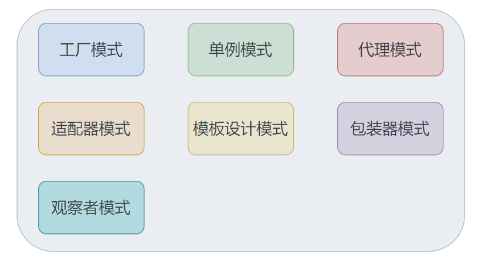

- 「1.工厂设计模式」: 比如通过 BeanFactory 和 ApplicationContext 来生产 Bean 对象
- 「2.代理设计模式」:  AOP 的实现方式就是通过代理来实现，Spring主要是使用 JDK 动态代理和 CGLIB 代理
- 「3.单例设计模式」: Spring 中的 Bean 默认都是单例的
- 「4.模板方法模式」: Spring 中 jdbcTemplate 等以 Template 结尾的对数据库操作的类，都会使用到模板方法设计模式，一些通用的功能
- 「5.包装器设计模式」: 我们的项目需要连接多个数据库，而且不同的客户在每次访问中根据需要会去访问不同的数据库。这种模式让我们可以根据客户的需求能够动态切换不同的数据源
- 「6.观察者模式」: Spring 事件驱动模型观察者模式的
- 「7.适配器模式」:Spring AOP 的增强或通知(Advice)使用到了适配器模式

（1）简单工厂模式

简单工厂模式的本质就是一个工厂类根据传入的参数，动态的决定实例化哪个类。

Spring中的BeanFactory就是简单工厂模式的体现，根据传入一个唯一的标识来获得bean对象。

（2）工厂方法模式

应用程序将对象的创建及初始化职责交给工厂对象，工厂Bean。

定义工厂方法，然后通过config.xml配置文件，将其纳入Spring容器来管理，需要通过factory-method指定静态方法名称。

（3）单例模式

Spring用的是双重判断加锁的单例模式，通过getSingleton方法从singletonObjects中获取bean。

（4）代理模式

Spring的AOP中，使用的Advice（通知）来增强被代理类的功能。Spring实现AOP功能的原理就是代理模式（① JDK动态代理，② CGLIB字节码生成技术代理。）对类进行方法级别的切面增强。

（5）装饰器模式

装饰器模式：动态的给一个对象添加一些额外的功能。

Spring的ApplicationContext中配置所有的DataSource。这些DataSource可能是不同的数据库，然后SessionFactory根据用户的每次请求，将DataSource设置成不同的数据源，以达到切换数据源的目的。

在Spring中有两种表现：

一种是类名中含有Wrapper，另一种是类名中含有Decorator。

（6）观察者模式

定义对象间的一对多的关系，当一个对象的状态发生改变时，所有依赖于它的对象都得到通知并自动更新。

Spring中观察者模式一般用在listener的实现。

（7）策略模式

策略模式是行为性模式，调用不同的方法，适应行为的变化 ，强调父类的调用子类的特性 。

getHandler是HandlerMapping接口中的唯一方法，用于根据请求找到匹配的处理器。

（8）模板方法模式

Spring JdbcTemplate的query方法总体结构是一个模板方法+回调函数，query方法中调用的execute()是一个模板方法，而预期的回调doInStatement(Statement state)方法也是一个模板方法。

## spring 中有哪些核心模块?

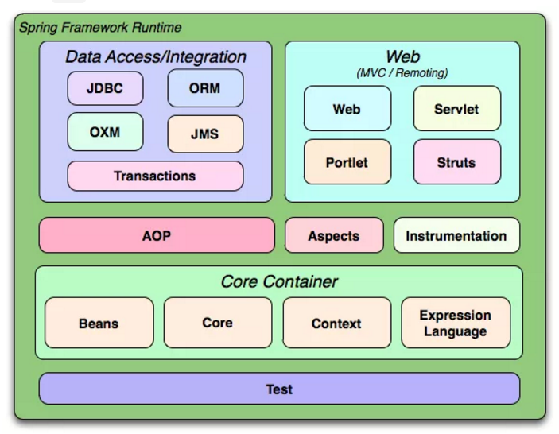

- 1.「Spring Core」：Spring核心，它是框架最基础的部分，提供IOC和依赖注入DI特性，包括BeanFactory和ApplicationContext。它们提供了依赖注入和面向切面编程（AOP）功能，以及对不同应用层（如Web应用或基于数据的应用）的支持。
- 2.「Spring Context」：Spring上下文容器，它是 BeanFactory 功能加强的一个子接口
- 3.「Spring Web」：Spring Web模块包括Spring MVC和其他与Web开发相关的工具和类。Spring MVC是Spring框架的Web应用程序开发框架，用于构建灵活的Web应用程序。
- 4.「Spring MVC」：它针对Web应用中MVC思想的实现
- 5.「Spring DAO」：提供对JDBC抽象层，简化了JDBC编码，同时，编码更具有健壮性
- 6.「Spring ORM」：它支持用于流行的ORM框架的整合，比如：Spring + Hibernate、Spring + iBatis、Spring + JDO的整合等
- 7.「Spring AOP」：Spring的面向切面编程（AOP）模块，提供了将横切关注点（如日志、性能监控、事务管理等）从业务逻辑中分离出来的功能。
- 8. 数据访问与集成：提供与数据库交互的工具和库，包括JDBC、ORM、OXM、JMS等。
- 9. Transaction Management事务管理：提供了事务管理的解决方案，可以方便地实现声明式事务管理。
- 10. Security安全: 提供了一套完整的安全框架，包括认证、授权、攻击防护等。

## 说一下你理解的 IOC 是什么?

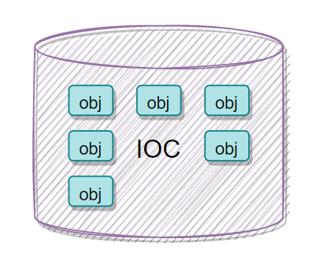

首先 IOC 是一个「容器，是用来装载对象的，它的核心思想就是「控制反转」

那么究竟「什么是控制反转」?

控制反转就是说，「把对象的控制权交给了 spring，由 spring 容器进行管理」，我们不进行任何操作

那么为「什么需要控制反转」?

我们想象一下，没有控制反转的时候，我们需要「自己去创建对象，配置对象」，还要「人工去处理对象与对象之间的各种复杂的依赖关系」，当一个工程的量起来之后，这种关系的维护是非常令人头痛的，所以就有了控制反转这个概念，将对象的创建、配置等一系列操作交给 spring 去管理，我们在使用的时候只要去取就好了

### 简述一下Spring IOC的工作流程

1. **加载配置文件**：Spring容器启动时，会加载xml配置文件，并解析其中的bean定义；
2. **实例化bean**：根据bean定义，spring会创建bean的实例；
3. **依赖注入**：Spring容器会根据bean定义中的依赖关系，将依赖的bean注入到当前bean中。
4. **调用初始化方法**：如果bean实现了InitializingBean接口或者在bean定义中配置了init-method属性，Spring容器会调用相应的初始化方法。
5. **发布事件**：如果bean实现了ApplicationListener接口或者在bean定义中配置了监听的事件，Spring容器会发布相应的事件。
6. **调用销毁方法**：如果bean实现了DisposableBean接口或者在bean定义中配置了destroy-method属性，Spring容器会在容器关闭时调用相应的销毁方法。

## spring 中的 IOC 容器有哪些?有什么区别?

spring 主要提供了「两种 IOC 容器」，一种是 「BeanFactory」，还有一种是 「ApplicationContext」

它们的区别就在于，BeanFactory 「只提供了最基本的实例化对象和拿对象的功能」，而 ApplicationContext 是继承了 BeanFactory 所派生出来的产物，是其子类，它的作用更加的强大，比如支持注解注入、国际化等功能

### **BeanFactory 和 ApplicationContext 有什么区别？**

ApplicationContext则是BeanFactory的子接口，它提供了比BeanFactory更完整的功能。除了继承BeanFactory的所有功能外，ApplicationContext还提供了国际化、资源文件访问、监听器注册等功能。

（1）初始化方式

BeanFactory 是延迟初始化，即在真正需要使用到某个 Bean 时才会创建该 Bean。ApplicationContext 则是在容器启动时就会预先加载所有的 Bean，所以它是预初始化。

（2）注册方式

BeanFactory 的注册必须要在配置文件中指定，而 ApplicationContext 可以通过注解的方式自动扫描并注册 Bean。

（3）生命周期管理

ApplicationContext 会管理 Bean 的完整生命周期，包括创建、初始化、销毁等过程。而 BeanFactory 则只负责创建和管理 Bean 实例，不会对 Bean 进行生命周期管理。

## 那 BeanFactory 和 FactoryBean 又有什么区别?

这两个是「不同的产物」
1. BeanFactory是Spring框架中的一个核心接口，它主要用于管理和提供应用程序中的Bean实例。BeanFactory接口定义了Spring容器的基本规范和行为，它提供了一种机制来将配置文件中定义的Bean实例化、配置和管理起来。它负责实例化、定位、配置应用程序中的对象及建立这些对象间的依赖。BeanFactory的主要作用是提供Bean的创建、配置、初始化和销毁等基本操作，它可以根据配置文件或注解来创建并管理Bean实例，并提供了各种方法来获取和操作Bean实例。

2. FactoryBean接口定义了一种创建Bean的方式，它允许开发人员在Bean的创建过程中进行更多的自定义操作。通过实现FactoryBean接口，开发人员可以创建复杂的Bean实例，或者在Bean实例化之前进行一些额外的逻辑处理。

## @Repository、@Service、@Compent、@Controller它们有什么区别?

这四个注解的「本质都是一样的，都是将被该注解标识的对象放入 spring　容器当中，只是为了在使用上区分不同的应用分层」

- @Repository:dao层
- @Service:service层
- @Controller:controller层
- @Compent:其他不属于以上三层的统一使用该注解

## 那么 DI 又是什么?

DI 就是依赖注入，其实和 IOC 大致相同，只不过是「同一个概念使用了不同的角度去阐述」

DI 所描述的「重点是在于依赖」，我们说了 「IOC 的核心功能就是在于在程序运行时动态的向某个对象提供其他的依赖对象」，而这个功能就是依靠 DI 去完成的，比如我们需要注入一个对象 A，而这个对象 A 依赖一个对象 B，那么我们就需要把这个对象 B 注入到对象 A 中，这就是依赖注入;

spring 中有三种注入方式

- 接口注入
- 构造器注入
- set注入

### Spring依赖注入是如何实现的？

Spring的依赖注入（Dependency Injection，简称DI）是通过Java的反射机制实现的。在Spring中，你可以使用XML配置文件或注解的方式，定义Bean之间的依赖关系，然后由Spring容器在运行时将这些依赖关系注入到相应的Bean中。

1. **构造器注入**：通过在类的构造函数中传入依赖对象，实现依赖注入。
2. **Setter 方法注入**：通过调用类的 Setter 方法设置依赖对象，实现依赖注入。
3. **注解注入**：Spring 3.0以后引入了注解（Annotation），通过@Autowired，@Resource等注解可以实现自动装配，Spring可以智能地自动装配可以匹配的Bean。

在所有这些方式中，Spring都使用了Java的反射机制来动态地创建Bean的实例，并设置其属性或调用其构造函数。反射机制允许Spring在运行时获取类的信息，包括类的构造函数、方法、属性等，然后根据配置信息动态地创建和配置Bean。

## 说说 AOP 是什么?

AOP 意为：「面向切面编程，通过预编译方式和运行期间动态代理实现程序功能的统一维护的一种技术」。

AOP 是 「OOP(面向对象编程) 的延续」，是 Spring 框架中的一个重要内容，是函数式编程的一种衍生范型。利用 AOP 可以对业务逻辑的各个部分进行隔离，从而使得业务逻辑各部分之间的耦合度降低，提高程序的可重用性，同时提高了开发的效率。

「AOP 实现主要分为两类:」

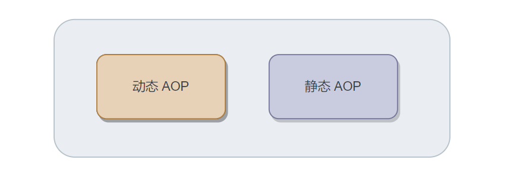

- 「静态 AOP 实现」， AOP 框架「在编译阶段」对程序源代码进行修改，生成了静态的 AOP 代理类（生成的 .class 文件已经被改掉了，需要使用特定的编译器），比如 AspectJ
- 「动态 AOP 实现」， AOP 框架「在运行阶段」对动态生成代理对象（在内存中以 JDK 动态代理，或 CGlib 动态地生成 AOP 代理类），如 SpringAOP;

spring 中 AOP 的实现是「通过动态代理实现的」，如果是实现了接口就会使用 JDK 动态代理，否则就使用 CGLIB 代理。

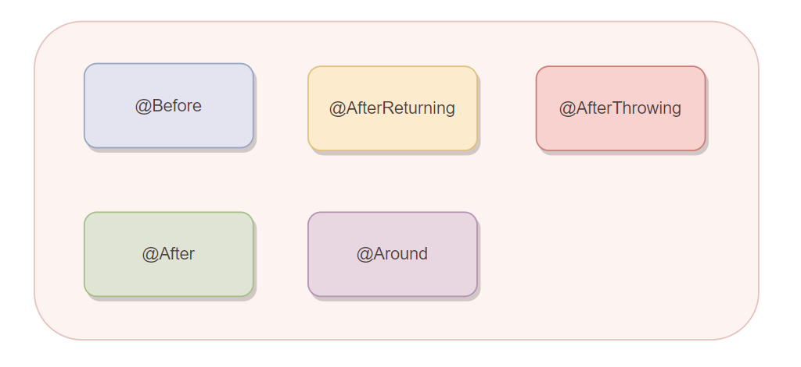

「有 5 种通知类型:」

- 「@Before」:在目标方法调用前去通知
- 「@AfterReturning」:在目标方法返回或异常后调用
- 「@AfterThrowing」:在目标方法返回后调用
- 「@After」:在目标方法异常后调用
- 「@Around」:将目标方法封装起来，自己确定调用时机


### 简述一下Spring AOP的工作流程？

Spring AOP（Aspect Oriented Programming）的工作流程主要涉及到面向切面编程的核心概念，如切面、连接点和通知等。以下是Spring AOP的基本工作流程：

1. **定义切面**：切面是织入到目标类中的功能代码，通常包括前置通知、后置通知、环绕通知、异常通知和最终通知等。这些通知可以根据业务需求进行自定义实现。
2. **确定连接点**：连接点表示切面将会被织入到目标对象的哪个位置。在Java中，这通常是某个方法的执行点或者某个构造器的创建点。
3. **配置切入点**：切入点是连接点的子集，用于更精确地定义哪些连接点需要被织入切面代码。
4. **读取切面配置**：在Spring容器启动时，会读取所有的切面配置，包括切入点的配置。
5. **初始化bean**：在bean初始化过程中，Spring会检查bean对应的类中的方法是否匹配到任意切入点。如果匹配成功，则会在该方法上织入相应的切面代码。
6. **代理对象创建**：Spring AOP通过动态代理技术（如JDK动态代理或CGLIB代理）为目标对象创建代理对象。代理对象会拦截对目标方法的调用，并根据需要执行相应的通知代码。
7. **方法调用**：当应用程序调用代理对象的方法时，实际上会触发AOP框架的执行流程。首先，会执行前置通知（如果有的话），然后调用目标方法，接着执行后置通知（如果有的话）。在方法执行过程中，如果出现异常，会执行异常通知。最后，执行最终通知（如果有的话）。
8. 通过这个工作流程，Spring AOP能够在不修改原有业务代码的前提下，对多个目标对象进行统一管理，并增加额外的功能，如日志记录、事务管理、权限验证等。这使得代码更加模块化、可维护，并提高了系统的灵活性和可扩展性。


### Spring AOP有哪些应用场景？

1. **日志记录**：可以使用AOP在方法执行前、执行后或者抛出异常时记录方法的执行日志，包括方法的入参、返回值、执行时间等信息。

2. **事务管理**：通过AOP实现声明式事务管理，对事务的开启、提交、回滚等进行统一管理，提高事务控制的简洁性和可维护性。

3. **安全检查**：AOP可以用于在方法调用前进行安全性检查，例如对用户权限的验证或者身份认证。

4. **性能监控**：利用AOP可以在方法执行前后统计方法的执行时间、调用频率等信息，用于性能监控和分析。

5. **异常处理**：AOP可以用于捕获方法执行过程中抛出的异常，并进行统一的处理、记录或通知。

6. **缓存控制**：通过AOP可以实现对方法的返回值进行缓存，从而提高系统的性能。

7. **参数校验和转换**：Spring AOP可以在方法调用前对方法的参数进行校验和转换，以确保参数的有效性和符合业务要求。这有助于减少因参数错误导致的异常和错误。

8. **事件驱动编程**：AOP可以用于实现事件发布和订阅机制，实现事件驱动编程。

### Spring AOP的两种代理方式

Spring AOP 提供了两种代理方式：JDK 动态代理和 CGLIB 动态代理。

（1）JDK 动态代理

基于接口的代理，要求目标类实现一个接口，通过接口生成代理对象。这种方式的优点是性能较好，但缺点是只能代理接口，不能代理类。

（2）CGLIB 动态代理

基于类的代理，不要求目标类实现接口，直接对类进行代理。这种方式的优点是可以代理类和接口，但缺点是性能相对较差。

### JDK动态代理有什么优点和缺点？

（1）优点：

相对于 CGLIB 动态代理，JDK 动态代理的性能较好，因为它是基于接口的代理，生成的代理类较少，使用起来比较简单，运行时开销较小。

（2）缺点：

1. 只能代理接口：JDK 动态代理要求目标类必须实现一个接口，不能直接代理类。这限制了它的使用范围，对于没有实现接口的类，无法使用 JDK 动态代理。
2. 代理类有限：JDK 动态代理生成的代理类数量有限，当目标类实现多个接口时，会为每个接口生成一个代理类，可能导致生成大量的代理类。
3. 不支持类成员代理：JDK 动态代理无法对类的成员变量进行代理，只能在方法调用时进行拦截处理。

### CGLIB 动态代理是如何工作的？

1. **创建子类**：CGLIB 动态代理通过创建目标类的子类来实现代理。当目标类没有实现接口或者无法使用 JDK 动态代理时，CGLIB 会创建一个目标类的子类，并覆写其中的方法。
2. **覆写方法**：在子类中覆写目标类的方法，这使得在目标方法被调用时，可以先执行相应的增强逻辑。
3. **代理对象的创建**：CGLIB 动态代理通过创建目标类的子类对象来实现代理。这个生成的子类对象就是代理对象，当调用代理对象的方法时，代理对象会委派给增强逻辑。

与 JDK 动态代理相比，CGLIB 动态代理不要求目标类必须实现接口，因此更加灵活，但代理对象的创建过程相对更为耗时。

## 动态代理和静态代理有什么区别?

「静态代理」

- 由程序员创建或由特定工具自动生成源代码，再对其编译。在程序运行前，代理类的.class文件就已经存在了
- 静态代理通常只代理一个类
- 静态代理事先知道要代理的是什么

「动态代理」

- 在程序运行时，运用反射机制动态创建而成
- 动态代理是代理一个接口下的多个实现类
- 动态代理不知道要代理什么东西，只有在运行时才知道

## JDK 动态代理和 CGLIB 代理有什么区别？

JDK 动态代理时业务类「必须要实现某个接口」，它是「基于反射的机制实现的」，生成一个实现同样接口的一个代理类，然后通过重写方法的方式，实现对代码的增强。

CGLIB 动态代理是使用字节码处理框架 ASM，其原理是通过字节码技术为一个类「创建子类，然后重写父类的方法」，实现对代码的增强。

## Spring AOP 和 AspectJ AOP 有什么区别？

Spring AOP 是 Spring Framework 提供的一种 AOP 实现方式，是基于动态代理实现的。它允许在方法调用前、方法调用后、抛出异常时等切点进行切入通知，并通过动态代理技术织入切面。Spring AOP 只能在方法级别上生效。

AspectJ AOP 是一个独立的 AOP 框架， 是基于字节码操作实现的。它提供了比 Spring AOP 更为强大和灵活的 AOP 功能。AspectJ 可以在方法调用前、方法调用后、抛出异常时等切点进行切入通知，并且还支持构造器、字段、对象初始化和异常处理等更多切点。AspectJ 可以通过编译器织入（AspectJ编译器），也可以使用代理织入（在运行时为目标对象创建代理，称为 Spring AOP 的 AspectJ 代理模式）。

AspectJ AOP 是编译时增强，需要特殊的编译器才可以完成，是通过「修改代码来实现」的，支持「三种织入方式」

- 「编译时织入」:就是在编译字节码的时候织入相关代理类
- 「编译后织入」:编译完初始类后发现需要 AOP 增强，然后织入相关代码
- 「类加载时织入」:指在加载器加载类的时候织入

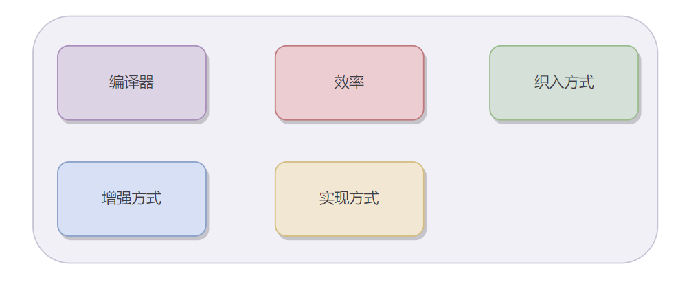

| 主要区别 |        Spring AOP        |             AspecjtJ AOP |
| :------- | :----------------------: | -----------------------: |
| 增强方式 |        运行时增强        |               编译时增强 |
| 实现方式 |         动态代理         |                 修改代码 |
| 编译器   |          javac           |         特殊的编译器 ajc |
| 效率     | 较低(运行时反射损耗性能) |                     较高 |
| 织入方式 |          运行时          | 编译时、编译后、类加载时 |

## spring 中 Bean 的生命周期是怎样的?

SpringBean 生命周期大致分为4个阶段：

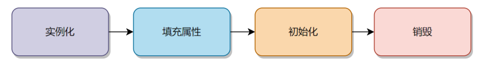

**详细生命周期:**

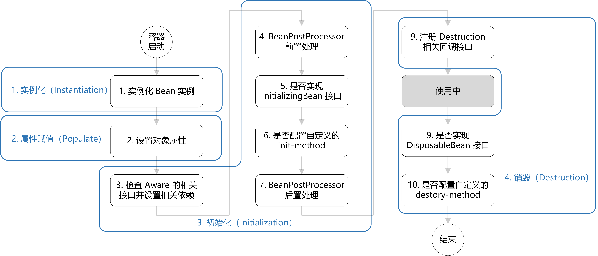

1. **加载配置文件**：Spring容器加载配置文件，解析配置信息。

2. **实例化Bean**：根据配置文件中定义的Bean，Spring容器实例化Bean。

3. **设置Bean属性**：Spring容器为实例化的Bean注入属性值。

BeanPostProcessor的前置处理（postProcessBeforeInitialization）：如果Bean实现了BeanPostProcessor接口，Spring容器将在初始化方法调用之前调用postProcessBeforeInitialization方法。

4. **初始化Bean**：如果Bean实现了InitializingBean接口，Spring容器将调用其afterPropertiesSet()方法进行初始化。如果在配置文件中通过init-method指定了初始化方法，Spring容器将调用指定的初始化方法。

BeanPostProcessor的后置处理（postProcessAfterInitialization）：如果Bean实现了BeanPostProcessor接口，Spring容器将在初始化方法调用之后调用postProcessAfterInitialization方法。

5. **使用Bean**：Bean可以被容器管理组件使用。

6. **销毁Bean**：如果Bean实现了DisposableBean接口，Spring容器将调用其destroy()方法进行销毁。如果在配置文件中通过destroy-method指定了销毁方法，Spring容器将调用指定的销毁方法。


### @Autowired和Spring的生命周期有什么关系？

1. **实例化Bean**：当 Spring 容器创建 Bean 的实例时，会检查该 Bean 是否使用了 @Autowired 注解。如果使用了该注解，Spring 会自动解析并注入所依赖的 Bean 到该 Bean 中。

2. **设置Bean属性**：在 Bean 实例化之后，Spring 会根据配置文件或者注解信息，将依赖的属性值注入到 Bean 中。如果使用了 @Autowired 注解，Spring 会自动解析并注入所依赖的 Bean 到该 Bean 中。

3. **初始化Bean**：在属性注入完成后，Spring 会调用 Bean 的初始化方法。这包括实现 InitializingBean 接口的 afterPropertiesSet 方法或者配置的 init-method 方法。

4. **销毁Bean**：当容器关闭或者 Bean 不再需要时，Spring 会调用 Bean 的销毁方法。这包括实现 DisposableBean 接口的 destroy 方法或者配置的 destroy-method 方法。在这个阶段，可以进行资源的释放等清理工作。

## spring 是怎么解决循环依赖的?

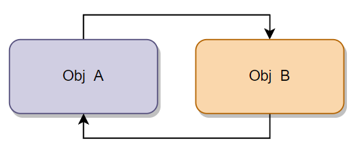

循环依赖就是说两个对象相互依赖，形成了一个环形的调用链路

spring 使用三级缓存去解决循环依赖的，其「核心逻辑就是把实例化和初始化的步骤分开，然后放入缓存中」，供另一个对象调用

- 「第一级缓存」：用来保存实例化、初始化都完成的对象
- 「第二级缓存」：用来保存实例化完成，但是未初始化完成的对象
- 「第三级缓存」：用来保存一个对象工厂，提供一个匿名内部类，用于创建二级缓存中的对象

------

当 A、B 两个类发生循环引用时 大致流程

1.A 完成实例化后，去「创建一个对象工厂，并放入三级缓存」当中；
- 如果 A 被 AOP 代理，那么通过这个工厂获取到的就是 A 代理后的对象
- 如果 A 没有被 AOP 代理，那么这个工厂获取到的就是 A 实例化的对象

2.A 进行属性注入时，去「创建 B」

3.B 进行属性注入，需要 A ，则「从三级缓存中去取 A 工厂代理对象」并注入，然后删除三级缓存中的 A 工厂，将 A 对象放入二级缓存；

4.B 完成后续属性注入，直到初始化结束，将 B 放入一级缓存

5.「A 从一级缓存中取到 B 并且注入 B」, 直到完成后续操作，将 A 从二级缓存删除并且放入一级缓存，循环依赖结束；

------

spring 解决循环依赖有两个前提条件：

1. 「不全是构造器方式」的循环依赖(否则无法分离初始化和实例化的操作)
2. 「必须是单例」(否则无法保证是同一对象)


## Spring有几级缓存，都有什么特点？

Spring框架中有三级缓存。

（1）一级缓存

Spring中最基本的缓存，用于存放完全初始化并确定类型的Bean实例。当一个Bean被创建并完成所有的初始化过程后，它会被转移到这个缓存中。这个缓存是对外提供服务的主要缓存，当我们通过Spring获取一个Bean时，首先会从这个缓存中查找是否有现成的对象。

（2）二级缓存

存放的是已经实例化但未初始化的bean。

保证了在多次循环依赖时，同一个类只会被构建一次，从而确保了单例性质。

（3）三级缓存

用于存储用于创建单例bean的ObjectFactory。

当依赖的bean实例创建完成后，Spring会使用这个ObjectFactory来创建bean实例，并从三级缓存中移除。

三级缓存的主要作用是解决循环依赖问题，特别是当涉及到AOP代理时。通过将代理的bean或普通bean提前暴露，使得依赖注入成为可能。

### 为什么要使用三级缓存，二级缓存不能解决吗?


先了解一下什么是循环依赖？

当两个或多个bean相互依赖，形成一个闭环时，就发生了循环依赖。

二级缓存存储了尚未完成初始化的bean实例。当Spring检测到循环依赖时，它可以将正在创建的bean放入二级缓存中，以便其他bean可以引用它。然而，二级缓存并不能解决所有循环依赖问题，特别是当涉及到AOP代理时。

AOP（面向切面编程）是Spring框架的一个重要特性，它允许开发者在不修改现有代码的情况下，为应用程序添加新的行为。Spring AOP通常通过创建代理对象来实现这一点，这些代理对象在运行时增强目标对象的功能。

在循环依赖的场景中，如果涉及的bean需要被AOP代理，那么仅仅使用二级缓存是不够的。因为二级缓存中的bean可能还没有被AOP框架处理过，也就是说，它们可能还不是最终的代理对象。如果其他bean引用了这些未处理的bean，就会导致错误。

三级缓存就是为了解决这个问题而引入的。它存储的不是实际的bean实例，而是创建这些bean的工厂对象（ObjectFactory）。当Spring检测到循环依赖时，它会将ObjectFactory放入三级缓存中。这个工厂对象知道如何创建和（如果需要的话）代理目标bean。一旦循环依赖被解决，Spring就可以使用这个工厂对象来创建和返回最终的bean实例。

通过这种方式，三级缓存不仅解决了普通的循环依赖问题，还解决了涉及AOP代理的复杂循环依赖问题。它允许Spring在bean完全初始化（包括AOP代理）之前暴露引用，从而打破了循环依赖的限制。

因此，虽然二级缓存可以解决一些循环依赖问题，但三级缓存提供了更强大和灵活的解决方案，特别是当涉及到AOP代理时。


## @Autowired 和 @Resource 有什么区别?

- 「@Resource 是 Java 自己的注解」，@Resource 有两个属性是比较重要的，分是 name 和 type；Spring 将 @Resource 注解的 name 属性解析为 bean 的名字，而 type 属性则解析为 bean 的类型。所以如果使用 name 属性，则使用 byName 的自动注入策略，而使用 type 属性时则使用 byType 自动注入策略。如果既不指定 name 也不指定 type 属性，这时将通过反射机制使用 byName 自动注入策略。
- 「@Autowired 是spring 的注解」，是 spring2.5 版本引入的，Autowired 只根据 type 进行注入，「不会去匹配 name」。如果涉及到 type 无法辨别注入对象时，那需要依赖 @Qualifier 或 @Primary 注解一起来修饰。

### @Autowired和@Resource在实际项目中如何选择使用？

1. 如果需要精确注入某个特定名称的bean，那么可以选择@Resource，因为它会根据名称进行匹配。 
2. 如果需要在多个相同类型的bean中选择一个进行注入，那么可以选择@Autowired，并结合@Qualifier注解来指定具体的bean。

## spring 事务隔离级别有哪些?

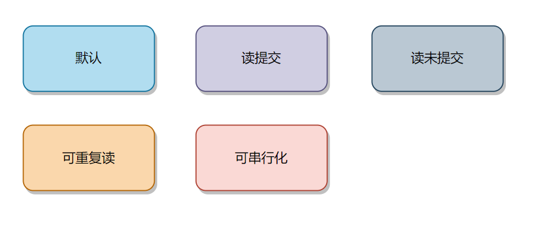

- DEFAULT：采用 DB 默认的事务隔离级别
- READ_UNCOMMITTED：读未提交
- READ_COMMITTED：读已提交
- REPEATABLE_READ：可重复读
- SERIALIZABLE：串行化

## spring 事务的传播机制有哪些?

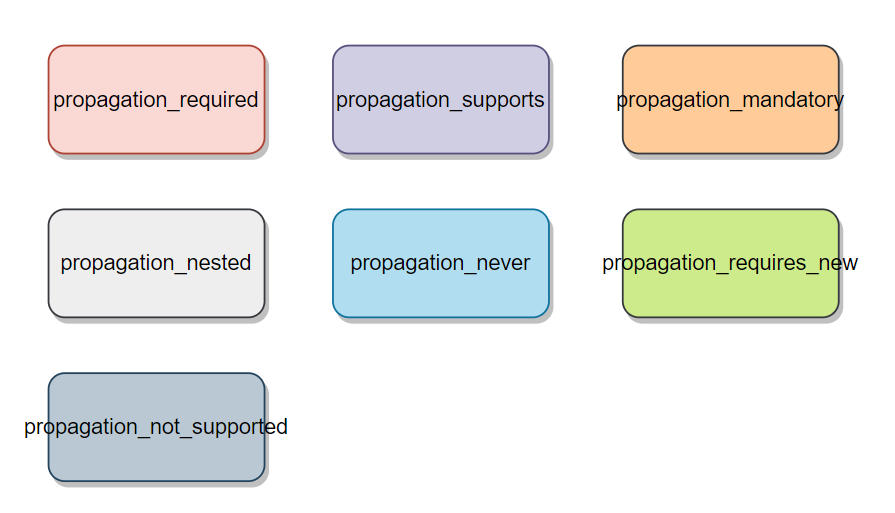

- propagation_required 
  - 当前方法「必须在一个具有事务的上下文中运行」，如有客户端有事务在进行，那么被调用端将在该事务中运行，否则的话重新开启一个事务。（如果被调用端发生异常，那么调用端和被调用端事务都将回滚）
  - **PROPAGATION_REQUIRED**：如果当前存在事务，则加入该事务；如果当前没有事务，则创建一个新的事务。这是最常见的选择。

- propagation_supports 
  - 当前方法不必需要具有一个事务上下文，但是如果有一个事务的话，它也可以在这个事务中运行;
  - **PROPAGATION_SUPPORTS**：支持当前事务，如果当前存在事务，则加入该事务；如果当前没有事务，则以非事务方式执行操作。

- propagation_mandatory 
  - 表示当前方法「必须在一个事务中运行」，如果没有事务，将抛出异常;
  - **PROPAGATION_MANDATORY**：支持当前事务，如果当前存在事务，则加入该事务；如果当前没有事务，则抛出异常。

- propagation_nested 
  - 如果当前方法正有一个事务在运行中，则该方法应该「运行在一个嵌套事务」中，被嵌套的事务可以独立于被封装的事务中进行提交或者回滚。如果封装事务存在，并且外层事务抛出异常回滚，那么内层事务必须回滚，反之，内层事务并不影响外层事务。如果封装事务不存在，则同propagation_required的一样
  - **PROPAGATION_NESTED**：如果当前存在事务，则在嵌套事务内执行。如果当前没有事务，则与PROPAGATION_REQUIRED类似。

- propagation_never 
  - 当方法务不应该在一个事务中运行，如果「存在一个事务，则抛出异常」;
  - **PROPAGATION_NEVER**：以非事务方式执行，如果当前存在事务，则抛出异常。


- propagation_requires_new 
  - 当前方法「必须运行在它自己的事务中」。一个新的事务将启动，而且如果有一个现有的事务在运行的话，则这个方法将在运行期被挂起，直到新的事务提交或者回滚才恢复执行。
  - **PROPAGATION_REQUIRES_NEW**：创建一个新的事务，如果当前存在事务，则把当前事务挂起。

- propagation_not_supported 
  - 方法不应该在一个事务中运行。「如果有一个事务正在运行，他将在运行期被挂起，直到这个事务提交或者回滚才恢复执行」
  - **PROPAGATION_NOT_SUPPORTED**：以非事务方式执行操作，如果当前存在事务，就把当前事务挂起。

这些传播行为可以通过@Transactional注解的propagation属性来设置，用于控制业务方法的事务行为。

### **导致Spring事务失效的原因有哪些？**

（1）对@Transactional理解不深入或使用不当

开发者如果对@Transactional注解的工作原理和使用方式理解不深入，或者在使用时存在误解，也可能导致事务失效。

（2）方法没有被public修饰

在Spring中，如果@Transactional注解添加在不是public修饰的方法上，事务就会失效。因为Spring的事务是通过AOP代理实现的，而AOP代理需要目标方法能够被外部访问，所以只有public方法才能被代理。

（3）类没有被Spring托管

如果事务方法所在的类没有被加载到Spring IoC容器中，即该类没有被Spring管理，那么Spring就无法实现代理，从而导致事务失效。

（4）不正确的异常捕获

如果事务方法抛出的异常被catch处理，那么@Transactional注解无法感知到异常，因此无法回滚事务，导致事务失效。

（5）传播行为配置错误

如果内部方法的事务传播类型被配置为不支持事务的传播类型，那么该方法的事务在Spring中就会失效。

（6）异步

如果在事务方法中调用了异步方法，那么异步方法中的事务可能会失效。

## springBoot 自动装配原理?

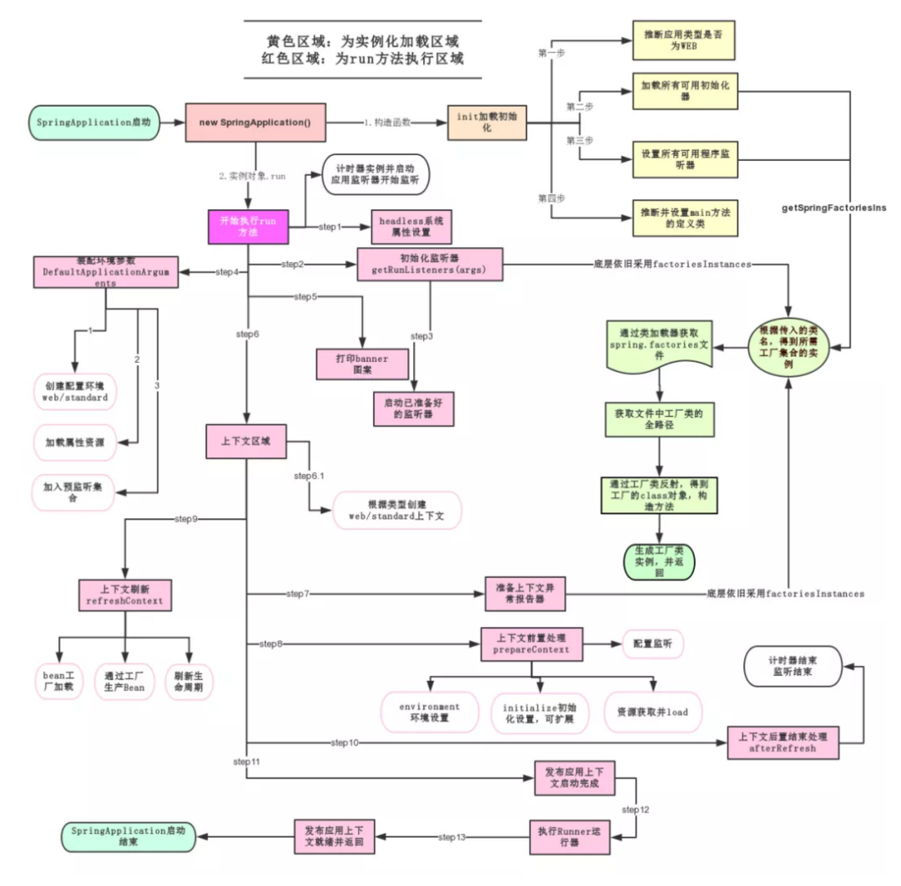

- 1.容器在启动的时候会调用 EnableAutoConfigurationImportSelector.class 的 selectImports方法「获取一个全面的常用 BeanConfiguration 列表」
- 2.之后会读取 spring-boot-autoconfigure.jar 下面的spring.factories，「获取到所有的 Spring 相关的 Bean 的全限定名 ClassName」
- 3.之后继续「调用 filter 来一一筛选」，过滤掉一些我们不需要不符合条件的 Bean
- 4.最后把符合条件的 BeanConfiguration 注入默认的 EnableConfigurationPropertie 类里面的属性值，并且「注入到 IOC 环境当中」

## Spring 有几种配置方式？

（1）XML配置

通过编写 XML 文件来配置 Spring 应用程序的组件、依赖项和行为。

（2）注解配置

使用注解（如 @Component, @Autowired, @Configuration 等）来配置应用程序的部分或全部组件，以及它们之间的依赖关系

（3）Java 配置

使用纯 Java 代码配置 Spring 应用程序的组件、依赖项和行为，不需要 XML 文件。通常使用 @Configuration 和 @Bean 注解来实现。


## 什么是FileSystemXmlApplicationContext，它是如何工作的，以及在什么情况下我们会使用它？

FileSystemXmlApplicationContext是Spring框架中的一个类，它用于从文件系统加载XML配置文件并创建应用程序上下文。它是AbstractApplicationContext的一个具体实现，专门用于处理XML配置文件。

**工作原理：**

1. **初始化**：当创建一个FileSystemXmlApplicationContext实例时，你需要提供一个XML配置文件的路径。这个路径可以是相对于当前工作目录的相对路径，也可以是绝对路径。
2. **解析XML**：FileSystemXmlApplicationContext会读取和解析指定的XML配置文件，从中提取bean定义和其他配置信息。
3. **创建Bean**：根据XML中的bean定义，FileSystemXmlApplicationContext会创建和管理这些bean的生命周期，包括依赖注入、作用域等。
4. **提供服务**：一旦所有的bean都被创建和管理，你就可以通过getBean()方法来获取和使用这些bean。

**使用场景：**

当你有一个XML配置文件，并且希望在启动应用程序时立即加载它时，可以使用FileSystemXmlApplicationContext。

如果你的应用程序需要从文件系统中加载多个XML配置文件，你可以使用FileSystemXmlApplicationContext来加载它们。

### FileSystemXmlApplicationContext是如何从文件系统中加载XML配置文件的？

1. **实例化**：通过传入一个或多个XML配置文件的路径来创建一个FileSystemXmlApplicationContext实例。
2. **刷新容器**：调用refresh()方法来启动Spring容器。

3. **解析XML**：FileSystemXmlApplicationContext使用内部的XML解析器来读取和解析XML文件。

4. **注册BeanDefinitions**：解析完成后，FileSystemXmlApplicationContext会将解析出的bean定义注册到内部的数据结构中，这样Spring容器就能够管理这些bean的生命周期。

5. **处理其他配置**：除了bean定义之外，FileSystemXmlApplicationContext还会处理XML中的其他配置，如AOP设置、事务管理等。

### `FileSystemXmlApplicationContext`与`ClassPathXmlApplicationContext`有何区别？

FileSystemXmlApplicationContext和ClassPathXmlApplicationContext都是Spring容器在加载XML配置文件时使用的接口实现类，它们之间的主要区别在于加载配置文件的方式和路径。

FileSystemXmlApplicationContext是通过文件系统加载XML配置文件的方式来初始化Spring容器。

ClassPathXmlApplicationContext是通过类路径（class path）加载XML配置文件的方式来初始化Spring容器。

### FileSystemResource 和 ClassPathResource 有何区别？

（1）加载方式不同

FileSystemResource 是从文件系统路径加载文件，而 ClassPathResource 是从类路径（classpath）中加载文件。

（2）适用场景不同

FileSystemResource 适用于加载本地文件系统中的文件，而 ClassPathResource 适用于加载应用程序内部的资源文件，如配置文件、模板等。

（3）使用方式不同

FileSystemResource 需要提供文件的绝对路径或相对路径，而 ClassPathResource 只需要提供资源文件的相对路径即可。

## 什么是ApplicationContextAware接口，它的功能和用途是什么？

ApplicationContextAware 是 Spring 框架中的一个接口，它允许实现该接口的类能够访问到当前的 ApplicationContext。换句话说，任何实现了 ApplicationContextAware 接口的类都可以获得Spring容器中的bean引用。

```java
 public class MyService implements ApplicationContextAware {
            private ApplicationContext applicationContext;

    @Override
    public void setApplicationContext(ApplicationContext applicationContext) throws BeansException {
                this.applicationContext = applicationContext;
    }
        }
```

## Spring Bean 的作用域之间有什么区别？

在Spring框架中，Bean的作用域定义了Bean实例的生命周期和可见范围。Spring框架提供了以下五种主要的Bean作用域：

1. **Singleton（单例）**：在整个应用程序中，只有一个Bean实例被创建并被共享。每次请求该Bean时，都会返回相同的实例。
2. **Prototype（原型）**：每次请求该Bean时，Spring容器都会创建一个新的Bean实例。因此，每次获取Bean时都会得到不同的实例。
3. **Request（请求）**：每个HTTP请求都会创建一个新的Bean实例，该Bean实例仅在该HTTP请求范围内可见。
4. **Session（会话）**：每个HTTP会话期间只存在一个Bean实例，该Bean实例仅在该HTTP会话期间可见。
5. **Global Session（全局会话）**：在基于Portlet的Web应用中，全局会话作用域类似于HTTP会话作用域，但仅适用于Portlet上下文。

这些作用域之间的主要区别在于Bean实例的生命周期、创建方式以及可见范围。选择合适的Bean作用域取决于应用程序的需求和设计。


### 为什么Spring中每个bean都要有作用域？

作用域规定了bean实例的生命周期和在容器中的存储方式。作用域确定了bean实例的创建、初始化和销毁方式，以及在应用程序中使用这些bean的方式。

1. 通过定义作用域，可以控制bean实例的生命周期；
2. 作用域也决定了bean实例之间的状态共享方式；
3. 通过定义作用域，可以更好地管理内存和其他资源。

### **Spring 框架中的单例 Beans 是线程安全的么？**

Spring 框架本身并不保证单例Beans的线程安全性，因为线程安全性通常取决于Bean的实现方式，而不是容器本身。因此，开发者需要自行确保他们的单例Beans是线程安全的。

有几种常见的策略可以帮助确保单例Beans的线程安全性：

1. **无状态Bean**：如果Bean本身是无状态的，即它不包含任何可变的实例变量，那么它自然就是线程安全的。这种Bean只包含方法，这些方法通常只依赖于传入的参数，并且不修改任何内部状态。
2. **同步方法**：如果Bean的某些方法需要访问和修改共享资源，可以使用synchronized关键字来同步这些方法。这样可以确保在任意时刻只有一个线程能够执行这些方法。
3. **使用并发集合**：如果Bean包含集合类型的属性，并且这些集合需要在多个线程之间共享，那么应该使用Java提供的并发集合类（如ConcurrentHashMap、CopyOnWriteArrayList等），而不是普通的集合类。
4. **使用ThreadLocal**：对于某些需要在多个线程之间保持独立状态的场景，可以使用ThreadLocal来存储线程特定的数据。这样，每个线程都会有自己独立的数据副本，从而避免了线程间的数据竞争。
5. **依赖注入**：避免在Bean中直接创建和共享其他Bean的实例。相反，应该使用Spring的依赖注入功能来注入所需的依赖项。这样，Spring可以管理这些依赖项的生命周期和线程安全性。

总之，虽然Spring框架本身不保证单例Beans的线程安全性，但开发者可以通过上述策略来确保他们的Bean在多线程环境中能够正常工作。


## **请解释 Spring Bean 的自动装配？**

Spring Bean的自动装配是指Spring容器根据预先定义的规则，自动在Spring应用程序上下文中将Bean与其他Bean进行关联。这样可以避免手动配置Bean之间的依赖关系，从而简化了应用程序的配置。

Spring提供了以下几种自动装配的模式：

- no：默认模式，不自动装配，需要手动指定依赖注入。
- byName：根据Bean的名称自动装配，Spring容器会自动将与属性名相同的Bean注入到属性中。
- byType：根据Bean的类型自动装配，Spring容器会自动将与属性类型相同的Bean注入到属性中。如果存在多个匹配的Bean，则会抛出异常。
- constructor：类似byType，但适用于构造函数参数的自动装配。

使用自动装配可以减少配置工作，并且更易于维护。然而，过度依赖自动装配也可能导致代码不够清晰，因此需要根据具体情况进行合理的选择。

### **如何开启基于注解的自动装配？**

1. **导入context依赖**：确保您的项目中包含了Spring的context依赖，这是使用注解进行自动装配的基础。
2. **启用注解驱动**：在Spring的配置文件中，需要开启注解的支持。这通常是通过在XML配置文件中添加context:annotation-config/标签来实现的。
3. **使用注解标识**：使用注解@Autowired 来自动装配Bean，@Component 用于标识自动扫描的Spring组件（如Bean），@Service、@Repository、@Controller等用于分别标识服务、存储库、控制器等特定类型的组件。
4. **配置组件扫描**：为了让Spring能够扫描到使用了注解的类，需要在配置文件中开启组件扫描，可以通过`<context:component-scan base-package="your.package"/>`来指定扫描的包路径。
5. **使用@SpringBootApplication注解**：如果您使用的是Spring Boot，那么可以使用@SpringBootApplication注解，它是一个组合注解，包含了@Configuration、@EnableAutoConfiguration和@ComponentScan三个注解，分别用于声明配置类、开启自动装配和开启组件扫描。


## **Spring中实现异步的方式有哪些？**

1. **使用@Async注解**：通过在方法上添加@Async注解，可以将该方法声明为异步方法。Spring会自动创建一个代理对象，当调用该方法时，会在一个单独的线程中执行。
2. **使用CompletableFuture**：CompletableFuture是Java 8引入的一个类，用于表示异步计算的结果。在Spring中，可以通过CompletableFuture来创建异步任务。
3. **使用ThreadPoolTaskExecutor**：ThreadPoolTaskExecutor是Spring提供的一个线程池任务执行器，可以用来执行异步任务。
4. **使用@Scheduled注解**：@Scheduled注解可以用于定时任务，通过设置固定的时间间隔或者使用Cron表达式，可以实现定时执行异步任务。
5. **使用WebAsyncTask**：在Spring Web应用中，可以使用WebAsyncTask来实现异步处理。WebAsyncTask会在一个新的线程中执行，并且支持回调函数。
6. **使用消息队列**，消息队列是实现异步操作的一种常见方式。你可以将任务发布到消息队列，然后由后台消费者异步处理这些任务。
7. **使用Spring WebFlux**，Spring WebFlux基于Reactive Streams规范，允许你以非阻塞的方式处理请求和响应。虽然这主要用于Web应用程序，但它也可以用于其他需要异步处理的场景。


## **说说@Required注解的作用？**

@Required注解是Spring框架中的注解之一，用于标记Bean的属性在配置时必须进行注入的。当在Bean配置中使用了@Required注解标记的属性时，Spring在初始化Bean时会检查这些属性是否被正确注入，如果未被注入，则会抛出BeanInitializationException异常。

在Spring 5.x及更高版本中，@Required注解已经被废弃，因为它依赖于一些不推荐使用的特性。

推荐使用Java配置或XML配置中的required="true"属性来指定必需的属性。

推荐使用JSR-330中的@Inject或者Spring的@Autowired注解来代替@Required。这些注解在实现依赖注入时更加灵活，并且更容易用于各种场合。


## **Spring常用注解有哪些？应用场景都有什么？**

以下是Spring框架中常用的一些注解及其应用场景：
```java

@Component：用于声明一个通用的组件，是其他注解的基础。

@Controller：用于标记API层，即Web控制器。

@Service：用于标记业务逻辑层。

@Repository：用于标记数据访问层，通常用于DAO实现类。

@Autowired：用于自动装配Bean，可以按类型自动注入依赖。

@Resource：按照名称自动装配，与JNDI查找相关。

@Bean：标注在方法上，表示该方法返回的对象应该被注册为Spring容器中的Bean。

@Configuration：表明该类是一个配置类，可以包含@Bean注解的方法。

@ComponentScan：用于指定Spring容器启动时扫描的包路径，以便发现并注册带有特定注解的类。

@Value：用于将外部属性值注入到Bean中。

@Qualifier：与@Autowired一起使用，用于指定需要装配的Bean的名称。

@Scope：用于指定Bean的作用域，如singleton（单例）或prototype（原型）。

@Primary：用于指定当有多个相同类型的Bean时，优先选择哪个Bean进行装配。

@Transactional：用于声明事务管理，可以标注在类或方法上。

@RequestMapping：用于映射Web请求到特定的处理方法。

@GetMapping、@PostMapping、@PutMapping、@DeleteMapping、@PatchMapping：分别用于处理HTTP的GET、POST、PUT、DELETE和PATCH请求。

@RequestBody：用于将请求体中的JSON数据绑定到方法参数。

@ResponseBody：用于将方法返回值写入响应体。

@PathVariable：用于从URL模板变量中提取参数。

@RequestParam：用于将请求参数绑定到方法参数。

@RequestHeader：用于将请求头信息绑定到方法参数。

@CookieValue：用于将Cookie信息绑定到方法参数。

@SessionAttribute：用于从会话中获取属性值。

@RequestAttribute：用于从请求中获取属性值。

@ModelAttribute：用于在控制器方法执行前添加模型属性。

@ExceptionHandler：用于处理方法中抛出的异常。

@ControllerAdvice：用于定义全局的异常处理类。

@RestController：是@Controller和@ResponseBody的组合注解，用于RESTful Web服务。

@CrossOrigin：用于支持跨域请求。 @MatrixVariable：用于处理矩阵变量。
```

## **REST风格的请求是什么？**

在REST风格的请求中，核心概念包括资源（Resource）和RESTful API（Application Programming Interface）。资源可以简单理解为URI，表示一个网络实体，具有唯一标识符。客户端通过访问这些标识符来对资源进行操作。RESTful API则是使用HTTP协议的不同方法来实现与资源的交互。

客户端与服务器之间的交互通过HTTP协议进行，客户端不需要知道服务器的实现细节，只需要遵循HTTP协议。

1. 无状态，服务器不会保存客户端的任何状态信息，每次请求都需要携带完整的请求信息，这降低了服务器的负担，也使得API更加可扩展。
2. 统一接口，REST使用统一的接口，包括HTTP方法、URI、MIME类型等，使API的设计更加简单、清晰、易于理解。
3. 分层系统，REST的架构是分层的，每个层有自己的责任和职能，这使得系统更加灵活、可扩展、易于维护。

## **如何防止表单重复提交？**

（1）Token验证

在会话中生成一个唯一的Token，并将其嵌入到表单中。当表单被提交时，服务器检查该Token是否有效，并确保其只被使用一次。 一旦处理完请求，服务器应废弃该Token。

（2）按钮禁用（不推荐）

用户点击提交按钮后，立即将其禁用，以防止用户多次点击。

（3）页面重定向

提交成功后，将用户重定向到一个新的页面或消息提示页，这样用户就无法再次点击提交按钮了。

（4）时间限制

对表单提交设置时间间隔限制，例如不允许在一分钟内连续提交。

（5）验证码

对于敏感操作，要求用户输入验证码，这可以有效防止机器人或恶意软件的自动提交。

（6）数据库唯一性约束（简单粗暴）

如果重复提交会导致数据库中的数据冲突，可以在数据库字段上设置唯一性约束。


## **@Scheduled注解在Spring框架中的执行原理，包括它是如何工作的，以及它的主要组件和功能**

（1）@Scheduled注解执行原理

Spring使用一个内部的任务调度器（TaskScheduler）来管理所有被 @Scheduled 注解的方法。

当Spring容器启动时，它会自动扫描所有的Bean，找到被 @Scheduled 注解的方法，并将它们注册到TaskScheduler中。

TaskScheduler会按照注解中指定的时间间隔或表达式来自动调用这些方法。

@Scheduled注解可以根据配置使用多线程执行，发生异常时，根据配置决定是重试还是直接跳过。

**深入一点：**

1. **Bean初始化**：当Spring容器启动并初始化bean时，它会在bean的生命周期方法执行完成后，通过postProcessAfterInitialization钩子函数拦截所有使用了@Scheduled注解的方法。
2. **解析注解参数**：Spring会解析这些方法上的@Scheduled注解，包括cron表达式、fixedDelay、fixedRate等参数，以确定任务的执行时间和频率。
3. **任务注册**：解析后的任务会被注册到Spring的调度器中，这个调度器负责管理所有的定时任务。
4. **定时任务执行**：根据注解参数指定的规则，调度器会在适当的时间触发任务的执行。

（2）@Scheduled注解主要组件和功能

- **cron**: 使用Cron表达式来指定任务的执行时间。
- **fixedDelay**: 表示从上一次任务执行完毕到下一次任务开始的时间间隔（以毫秒为单位）。
- **fixedRate**: 表示两次任务开始之间的时间间隔（以毫秒为单位），不考虑上一次任务是否已经执行完毕。
- **initialDelay**: 表示首次执行任务前的延迟时间（以毫秒为单位）。

（3）常见用途和实际应用场景

1. **定时任务调度**: 执行定时任务，如每隔一段时间执行一次某个操作。
2. **报表生成**: 每天或每周定期生成报表。
3. **数据备份**: 定时将数据库中的数据备份到其他地方。
4. **系统维护**: 如清理临时文件、检查系统健康状况等。
5. **定时提醒**: 如发送定期通知、定时执行某项操作等。