### 请说明什么是Apache Kafka？

Kafka 是由 `Linkedin` 公司开发的,**它是一个分布式的,支持多分区、多副本,基于 Zookeeper 的分布式消息流平台**,它同时也是一款开源的**基于发布订阅模式的消息引擎系统**。

### Kafka的基本术语

**消息**:Kafka 中的数据单元被称为`消息`,也被称为记录,**可以把它看作数据库表中某一行的记录**。

**批次**:为了提高效率, 消息会`分批次`写入 Kafka,批次就代指的是一组消息。

**主题**:消息的种类称为 `主题`(Topic),可以说一个主题代表了一类消息。相当于是对消息进行分类。**主题就像是数据库中的表。**

**分区**:为了实现扩展性,一个非常大的topic可以分布到多个broker(即服务器)上,一个topic可以分为多个partition,每个partition是一个有序的队列。partition中的每条消息都会被分配一个有序的id(offset)。kafka只保证按一个partition中的顺序将消息发给consumer,不保证一个topic的整体(多个partition间)的顺序


**offset**:偏移量,kafka的存储文件都是按照offset.kafka来命名,用offset做名字的好处是方便查找。例如你想找位于2049的位置,只要找到2048.kafka的文件即可。当然the first offset就是00000000000.kafkaOffset

**Broker**:一台kafka服务器就是一个broker。一个集群由多个broker组成。一个broker可以容纳多个topic

**Producer**:消息生产者,向kafka broker发消息的客户端

**Consumer**:消息消费者,向kafka broker取消息的客户端

**Group消费者组**:这是kafka用来实现一个topic消息的广播(发给所有的consumer)和单播(发给任意一个consumer)的手段。一个topic可以有多个CG。topic的消息会复制(不是真的复制,是概念上的)到所有的CG,但每个partion只会把消息发给该CG中的一个consumer。如果需要实现广播,只要每个consumer有一个独立的CG就可以了。要实现单播只要所有的consumer在同一个CG。用CG还可以将consumer进行自由的分组而不需要多次发送消息到不同的topic


**生产者**: 向主题发布消息的客户端应用程序称为`生产者`(Producer),生产者用于持续不断的向某个主题发送消息。

**消费者**:订阅主题消息的客户端程序称为`消费者`(Consumer),消费者用于处理生产者产生的消息。

**消费者群组**:生产者与消费者的关系就如同餐厅中的厨师和顾客之间的关系一样,一个厨师对应多个顾客,也就是一个生产者对应多个消费者,`消费者群组`(Consumer Group)指的就是由一个或多个消费者组成的群体。


**偏移量**:`偏移量`(Consumer Offset)是一种元数据,它是一个不断**递增的整数值**,用来记录消费者发生重平衡时的位置,以便用来恢复数据。

**broker**: 一个独立的 Kafka 服务器就被称为 `broker`,broker 接收来自生产者的消息,为消息设置偏移量,并提交消息到磁盘保存。

**broker 集群**:broker 是`集群` 的组成部分,broker 集群由一个或多个 broker 组成,每个集群都有一个 broker 同时充当了`集群控制器`的角色(自动从集群的活跃成员中选举出来)。

**副本**:Kafka 中消息的备份又叫做 `副本`(Replica),副本的数量是可以配置的,Kafka 定义了两类副本:**领导者副本(Leader Replica) 和 追随者副本(Follower Replica)**,前者对外提供服务,后者只是被动跟随。

**重平衡**:Rebalance。消费者组内某个消费者实例挂掉后,其他消费者实例自动重新分配订阅主题分区的过程。或者说某一个消费者加入一个消费者组,那么就需要重新平衡消息的发送,Rebalance 是 Kafka 消费者端实现高可用的重要手段。

### 请说明什么是传统的消息传递方法？

传统的消息传递方法包括两种:

- 队列:在队列中,一组用户可以从服务器中读取消息,每条消息都发送给其中一个人,某个消费者消费数据之后,消息会随机删除。
- 发布-订阅:在这个模型中,消息被广播给所有的用户,可以有多个生产者和多个消费者。

### 数据传输的事务有几种？

数据传输的事务定义通常有以下三种级别:

1. 最多一次: 消息不会被重复发送,最多被传输一次,但也有可能一次不传输,这种情况会发生数据的丢失。
2. 最少一次: 消息不会被漏发送,最少被传输一次,但也有可能被重复传输.
3. 精确的一次(Exactly once): 不会漏传输也不会重复传输,每个消息都传输被一次而且仅仅被传输一次,这是大家所期望的,端到端的精确一次性最难保证。

### 使用消息队列的好处

- 解耦
    - 允许你独立的扩展或修改两边的处理过程,只要确保它们遵守同样的接口约束。
- 可恢复性
    - 系统的一部分组件失效时,不会影响到整个系统。消息队列降低了进程间的耦合度,所以即使一个处理消息的进程挂掉,加入队列中的消息仍然可以在系统恢复后被处理。
- 缓冲
    - 有助于控制和优化数据流经过系统的速度,解决生产消息和消费消息的处理速度不一致的情况。
- 灵活性  &峰值处理能力
    - 在访问量剧增的情况下,应用仍然需要继续发挥作用,但是这样的突发流量并不常见。如果为以能处理这类峰值访问为标准来投入资源随时待命无疑是巨大的浪费。使用消息队列能够使关键组件顶住突发的访问压力,而不会因为突发的超负荷的请求而完全崩溃。
- 异步通信
    - 很多时候,用户不想也不需要立即处理消息。消息队列提供了异步处理机制,允许用户把一个消息放入队列,但并不立即处理它。想向队列中放入多少消息就放多少,然后在需要的时候再去处理它们。

### 为什么选择kafka

#### kafka可以有多个生产者

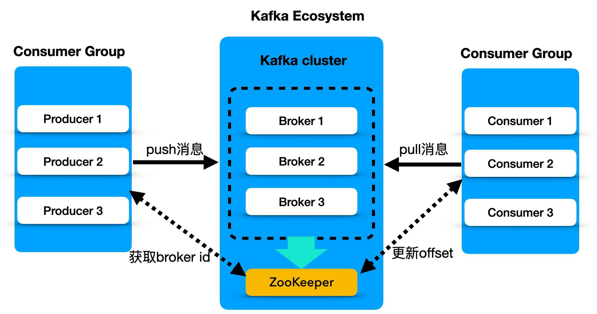

KafKa 可以无缝地支持多个生产者,不管客户端使用一个主题,还是多个主题。**Kafka 适合从多个前端系统收集数据**,并以统一的格式对外提供数据。

#### kafka可以有多个消费者


Kafka 支持多个消费者从一个单独的消息流中读取数据,并且消费者之间互不影响。这与其他队列系统不同,其他队列系统一旦被客户端读取,其他客户端就不能 再读取它。并且**多个消费者可以组成一个消费者组,他们共享一个消息流,并保证消费者组对每个给定的消息只消费一次**。

> 多个生产者多个消费者，天然支持的并发量大，消息的吞吐量自然也就大;

#### 基于磁盘的消息存储

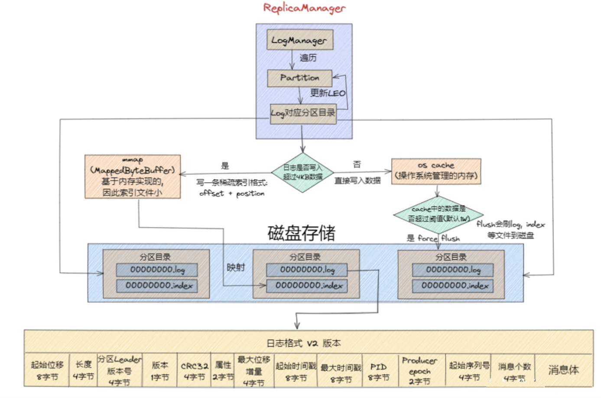

Kafka 允许消费者非实时地读取消息,原因在于 Kafka 将消息提交到磁盘上,设置了保留规则进行保存,无需担心消息丢失等问题。

#### 伸缩性

可扩展多台 broker。用户可以先使用单个 broker,到后面可以扩展到多个 broker。

#### 高性能

Kafka 可以轻松处理百万千万级消息流,同时还能保证 **亚秒级** 的消息延迟。

### Kafka生产者分区策略

**分区器决定因素**
```java
ProducerRecord<String, String> record = 
    new ProducerRecord<>(topic, partition, key, value);
// 优先级：指定partition > key > 默认策略
```

#### 显示指定分区

```java
// 直接指定分区号（最高优先级）
ProducerRecord<String, String> record = 
    new ProducerRecord<>("topic", 2, "key", "value"); // 固定发往分区2
```
适用场景： 
1. 明确知道消息应该去哪个分区 
2. 特殊路由需求

#### Key-Based 分区（最常用）
```java
// 使用Key决定分区（默认策略）
ProducerRecord<String, String> record = 
    new ProducerRecord<>("topic", "user123", "message");
// 分区 = hash(key) % partition_count
```
Kafka使用murmur2哈希算法:int partition = Math.abs(Utils.murmur2(keyBytes)) % numPartitions;

- 优势： 
  - 相同Key的消息进入相同分区 
  - 保证分区内顺序 
  - 天然负载均衡（Key分布均匀时）

- 适用场景： 
  - 用户行为追踪（用户ID作Key） 
  - 订单处理（订单ID作Key） 
  - 设备数据采集（设备ID作Key）

#### 无Key时的默认策略

> Kafka 2.4+ 默认：粘性分区策略

```java
public class UniformStickyPartitioner {
    // 同一批次内消息发往同一分区
    // 批次满或超时后切换分区
}
```

- 特点： 
  - 提高批处理效率 
  - 减少网络请求 
  - 批次内消息去同一分区

**Kafka 2.4之前：轮询策略**
```java
public class RoundRobinPartitioner {
    // 严格轮询每个分区
    // 消息1→分区0，消息2→分区1，消息3→分区2...
}
```
#### 自定义分区策略

```java
// 实现Partitioner接口
public class CustomPartitioner implements Partitioner {
    @Override
    public int partition(String topic, Object key, byte[] keyBytes,
                         Object value, byte[] valueBytes, Cluster cluster) {
        // 自定义逻辑
        List<PartitionInfo> partitions = cluster.partitionsForTopic(topic);
        int numPartitions = partitions.size();
        
        if (key == null) {
            // 无Key时的策略
            return ThreadLocalRandom.current().nextInt(numPartitions);
        }
        
        // 自定义规则
        String keyStr = (String) key;
        if (keyStr.startsWith("VIP_")) {
            return 0; // VIP用户发往分区0
        }
        
        // 默认哈希
        return Math.abs(keyStr.hashCode()) % numPartitions;
    }
}
```

#### 常见问题及解决方案

##### 问题1：热点分区

> 现象：某个分区消息量远大于其他分区

**解决方法**

```java
// 方案1：Key添加随机后缀
String balancedKey = userId + "_" + ThreadLocalRandom.current().nextInt(10);

// 方案2：使用复合Key
String compositeKey = businessKey + "|" + timestampSuffix;

// 方案3：自定义分区器动态调整
public class DynamicPartitioner implements Partitioner {
    private Map<Integer, Long> partitionLoad = new ConcurrentHashMap<>();
    
    @Override
    public int partition(...) {
        // 选择负载最小的分区
        return partitionLoad.entrySet().stream()
            .min(Map.Entry.comparingByValue())
            .map(Map.Entry::getKey)
            .orElse(0);
    }
}
```

##### 问题2：顺序性要求

> 场景：相同用户的订单需要按顺序处理

**解决方法**

```java
// 1. 用户ID作Key
ProducerRecord<String, String> record = 
    new ProducerRecord<>("orders", userId, orderData);

// 2. 确保发送顺序
props.put("max.in.flight.requests.per.connection", "1");
props.put("acks", "all");
props.put("enable.idempotence", "true");

// 3. 消费者按分区顺序消费
```

##### 问题3：分区扩容后Key分布变化

> 现象：增加分区后，原有Key可能映射到不同分区

```java
// 使用一致性哈希
public class ConsistentHashPartitioner implements Partitioner {
    private ConsistentHash<String> hashRing;
    
    @Override
    public int partition(...) {
        if (key == null) return randomPartition();
        
        // 一致性哈希，扩容时影响最小
        return hashRing.getPartition((String) key);
    }
}
```
**什么是一致性hash**

一致性hash解决了分布式系统中节点动态扩缩容时，大量数据需要重新映射的问题。传统哈希取模在节点数变化时，几乎所有数据都需要迁移，而一致性哈希只影响部分数据。

一致性hash和传统hash的对比:

| 特性           | 传统哈希取模 | 一致性哈希     |
| :------------- | :----------- | :------------- |
| **扩容影响**   | 影响所有数据 | 只影响部分数据 |
| **数据迁移**   | 大量迁移     | 少量迁移       |
| **负载均衡**   | 天然均衡     | 需要虚拟节点   |
| **实现复杂度** | 简单         | 复杂           |
| **伸缩性**     | 差           | 优秀           |
| **适用场景**   | 节点固定     | 动态扩缩容     |

#### 分区选择策略

```shell
开始
  │
  ├─ 需要严格顺序？
  │   ├─ 是 → 使用Key-Based分区（相同业务ID）
  │   └─ 否 → 进入下一判断
  │
  ├─ 数据有自然Key？
  │   ├─ 是 → 使用Key-Based分区
  │   └─ 否 → 进入下一判断
  │
  ├─ 吞吐量优先？
  │   ├─ 是 → 使用粘性分区（Kafka 2.4+）
  │   └─ 否 → 使用轮询分区
  │
  └─ 有特殊路由需求？
      ├─ 是 → 自定义分区器
      └─ 否 → 使用默认策略
```

#### 小结

| 策略           | 顺序保证    | 负载均衡        | 性能     | 使用复杂度 |
| :------------- | :---------- | :-------------- | :------- | :--------- |
| **指定分区**   | 分区内有序  | 差（可能不均）  | 高       | 简单       |
| **Key哈希**    | 相同Key有序 | 好（Key均匀时） | 高       | 简单       |
| **粘性分区**   | 批次内有序  | 较好            | **最高** | 简单       |
| **轮询分区**   | 全局有序    | 最好            | 高       | 简单       |
| **自定义策略** | 取决于实现  | 取决于实现      | 中-低    | 复杂       |

1. 指明 partition 的情况下,直接将指明的值直接作为partiton值。
2. 没有指明partition值但有key的情况下,将key的hash值与topic的partition数进行取余得到partition值。
3. 既没有partition值又没有key值的情况下,第一次调用时随机生成一个整数(后面每次调用在这个整数上自增),将这个值与topic可用的partition总数取余得到partition值,也就是常说的round-robin算法。 
4. 优先级：指定分区 > Key哈希 > 默认策略 
5. 默认策略：Kafka 2.4+使用粘性分区，之前使用轮询; 
6. 顺序保证：相同Key的消息保证分区内顺序 
7. 负载均衡：Key设计要均匀，避免热点分区 
8. 性能优化：粘性分区提高吞吐，轮询保证均匀 
9. 灵活扩展：可通过自定义分区器实现特殊需求 
10. 监控必要：定期检查分区分布，确保均衡

### Kafka 缺点？

1. 由于是批量发送,数据并非真正的实时。
2. 对于mqtt协议不支持。
3. 不支持物联网传感数据直接接入。
4. **仅支持统一分区内消息有序,无法实现全局消息有序**。
5. 监控不完善,需要安装插件。
6. 依赖zookeeper进行元数据管理。

### Kafka消息队列有哪些模式

Kafka 的消息队列一般分为两种模式:**点对点模式和发布订阅模式**

#### 点对点模式

Kafka 是支持消费者群组的,也就是说 Kafka 中会有一个或者多个消费者,**如果一个生产者生产的消息由一个消费者进行消费的话,那么这种模式就是点对点模式**.

点对点模型通常是一个**基于拉取或者轮询的消息传送模型**,这种模型从队列中请求信息,而不是将消息推送到客户端。**这个模型的特点是发送到队列的消息被一个且只有一个接收者接收处理,即使有多个消息监听者也是如此。**


- 消费者去队列中拉去消息,即使有多个消费者,那生产者也会把消息发送到队列中,多个消费者轮询到队列中拉去消息，一条消息只能被一个消费者消费。

#### 发布订阅模式

发布订阅模式有两种形式,**一种是消费者主动拉取数据的形式,另一种是生产者推送消息的形式**,kafka是基于发布订阅模式中**消费者拉取**的方式。消费者的消费速度可以由消费者自己决定。但是这种方式也有缺点,当没有消息的时候,kafka的消费者还需要不停的访问kafka生产者拉取消息,浪费资源。


- 这种方式中,消费者和生产者都可以有多个。

### 请简述下你在哪些场景下会选择 Kafka？

1. **日志收集**:一个公司可以用Kafka收集各种服务的log,通过kafka以统一接口服务的方式开放给各种consumer,例如hadoop、HBase、Solr等。

2. **消息系统**:解耦和生产者和消费者、缓存消息等，作为进程之间通讯的中间件。

3. **用户活动跟踪**:Kafka经常被用来记录web用户或者app用户的各种活动,如浏览网页、搜索、点击等活动,这些活动信息被各个服务器发布到kafka的topic中,然后订阅者通过订阅这些topic来做实时的监控分析,或者装载到hadoop、数据仓库中做离线分析和挖掘。

4. **流式处理**:比如spark streaming和 Flink对接kafka消费消息或者发送消息。

### 如何保证每个应用程序都可以获取到 Kafka 主题中的所有消息,而不是部分消息？

**先思考下，为什么会出现消费不到全部消息？**
1. 分区分配不均
2. 消费者组重平衡
3. 消费偏移量问题
4. 消息过滤或条件消费
5. 消费者失败或崩溃

**解决方案**
- 单消费者模式
  - 消费者组中只有一个消费者，订阅所有分区，那上有所有的分区数据全部发送给这一个消费者。
  - 优点：
    - 实现简单，保证消费所有分区；
    - 天然顺序消费；
  - 缺点：
    - 单点性能瓶颈
    - 无法水平扩展
    - 消费者故障导致整个应用不可用
- 保证分区覆盖: 为每个应用程序创建一个消费者组,然后往组中添加消费者来伸缩读取能力和处理能力,每个群组消费主题中的消息时,互不干扰。
  - 方案A：消费者数 = 分区数
  - 方案B：消费者数 > 分区数（多余消费者空闲）
  - 方案C：消费者数 < 分区数（某些消费者处理多个分区） 
- 独立消费者（Assign模式）
  - 手动分配所有分区
  - 获取主题所有分区,手动分配所有分区给这个消费者,设置从最早开始消费,异步提交，提高性能;

> 本质上是实现广播的功能。

#### 不同场景推荐方案

| 场景                     | 推荐方案                    | 理由                   |
| :----------------------- | :-------------------------- | :--------------------- |
| **小型应用，数据量小**   | 单消费者模式                | 简单可靠，无需复杂协调 |
| **中型应用，需要扩展**   | 消费者组（消费者数=分区数） | 平衡性能和完整性       |
| **大型应用，高可用要求** | 独立消费者+外部协调         | 完全控制，故障恢复快   |
| **流处理应用**           | Kafka Streams               | 框架自动处理分区和故障 |
| **批处理应用**           | 独立消费者+检查点           | 精确控制消费范围       |
| **关键业务，零丢失**     | 消费者组+外部偏移量存储     | 双重保障，可审计       |


#### 常见问题排查

##### 消费者组重平衡导致重复消费
```java
// 解决方案：实现幂等消费
props.put("enable.auto.commit", "false");
// 在处理完成后提交偏移量
// 或在外部存储记录已处理的消息ID
```

手动控制偏移量的提交;

##### 分区分配不均

```java
// 解决方案：自定义分配策略或调整消费者数量
// 确保消费者数能被分区数整除
int partitions = 12;
int consumers = 4; // 每个消费者处理3个分区
// 或使用 RoundRobinAssignor
```

#### 消费者滞后（Lag）增长

解决方案：
1. 增加消费者数量
2. 优化处理逻辑，减少处理时间
3. 调整max.poll.records减少批次大小
4. 增加max.poll.interval.ms

#### 消息被跳过

- 原因：auto.offset.reset=latest + 消费者重启 
- 解决方案：始终设置为earliest，或使用外部偏移量存储
- props.put("auto.offset.reset", "earliest");重启后从最早消息开始消费，这样的话系统内要保证幂等性;

### partition的数据如何保存到硬盘

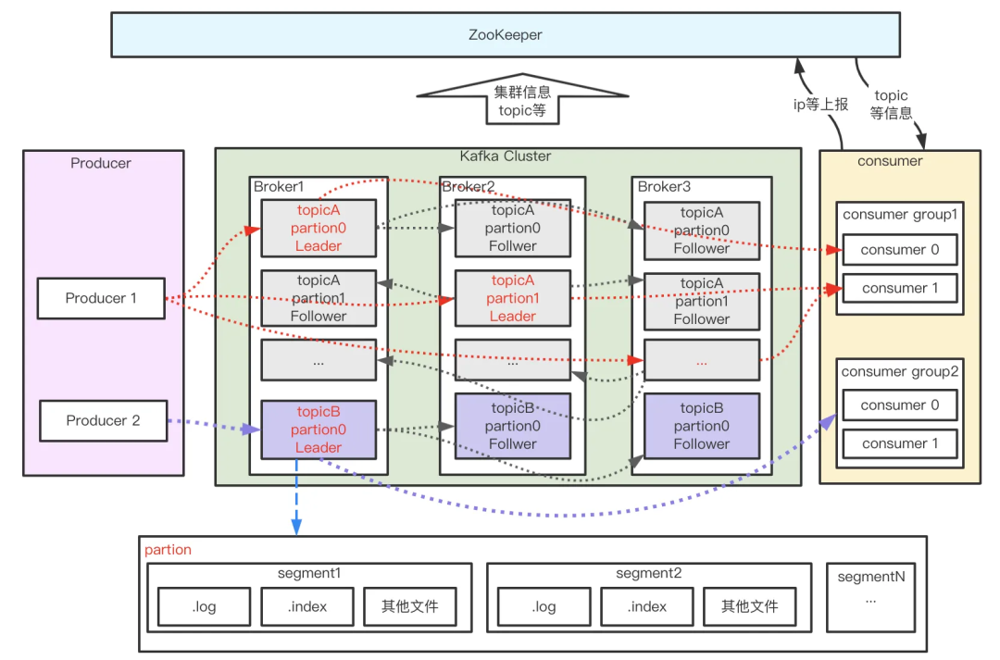

1. topic中的多个partition以文件夹的形式保存到broker(也就是每一个kafka的服务器上),每个分区序号从0递增,且消息有序; 
2. Partition文件下有多个segment(xxx.index,xxx.log),segment 文件里的大小和配置文件大小一致可以根据要求修改 默认为1g,如果大小大于1g时,会滚动一个新的segment并且以上一个segment最后一条消息的偏移量命名。

### Kafka的消费者如何消费数据

#### 消费者组（Consumer Group）
1. 消费者组是Kafka实现负载均衡和容错的机制.
2. 同组消费者共同消费一个主题，每个分区只能被组内一个消费者消费.


#### 消费者消费整体流程

##### 消费者主流程

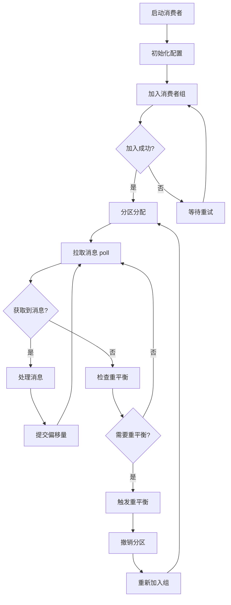
```mermaid
graph TD
    A[启动消费者] --> B[初始化配置];
    B --> C[加入消费者组];
    C --> D{加入成功?};
    D -->|是| E[分区分配];
    D -->|否| F[等待重试];
    F --> C;
    E --> G[拉取消息 poll];
    G --> H{获取到消息?};
    H -->|是| I[处理消息];
    H -->|否| J[检查重平衡];
    I --> K[提交偏移量];
    K --> G;
    J --> L{需要重平衡?};
    L -->|是| M[触发重平衡];
    L -->|否| G;
    M --> N[撤销分区];
    N --> O[重新加入组];
    O --> E;
```
消费者每次消费数据的时候,消费者都会记录消费的物理偏移量(offset)的位置,会提交到kafka集群，kafka集群专门有一个topic来保存offset,等到下次消费时,他会接着上次位置继续消费。

##### 阶段1：消费者启动与初始化

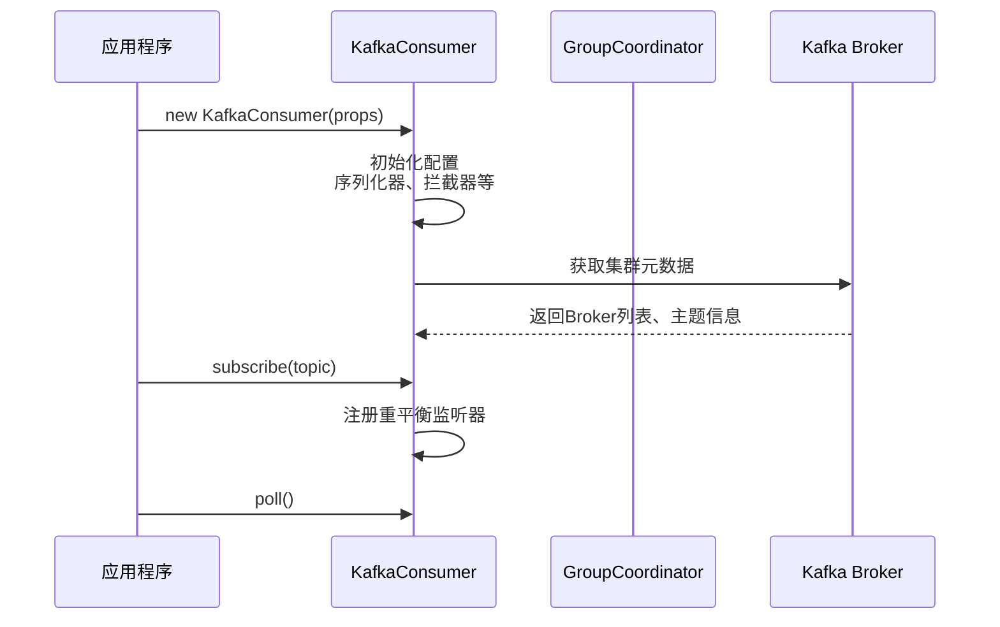
```mermaid
sequenceDiagram
    participant App as 应用程序
    participant Consumer as KafkaConsumer
    participant Coordinator as GroupCoordinator
    participant Broker as Kafka Broker
    
    App->>Consumer: new KafkaConsumer(props)
    Consumer->>Consumer: 初始化配置<br/>序列化器、拦截器等
    Consumer->>Broker: 获取集群元数据
    Broker-->>Consumer: 返回Broker列表、主题信息
    App->>Consumer: subscribe(topic)
    Consumer->>Consumer: 注册重平衡监听器
    App->>Consumer: poll()
```

##### 阶段2：加入消费者组

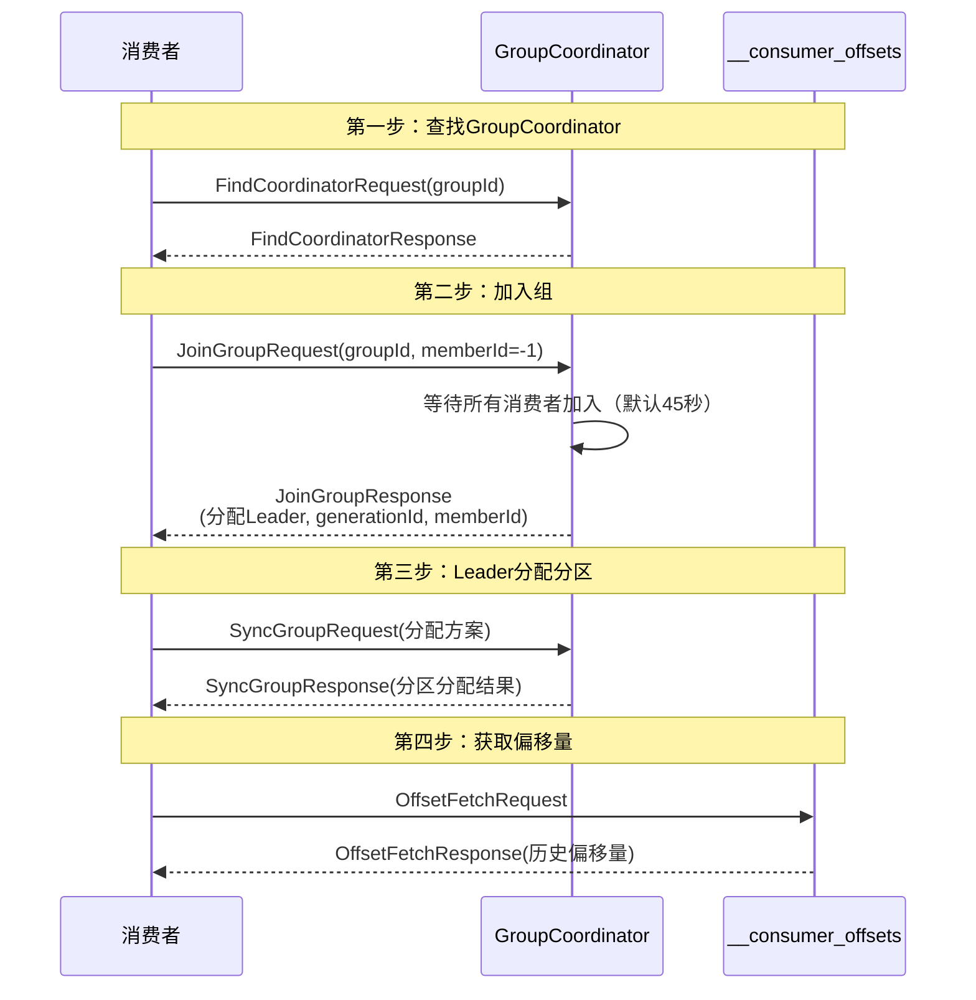
```mermaid
sequenceDiagram
    participant Consumer as 消费者
    participant Coordinator as GroupCoordinator
    participant __offsets as __consumer_offsets
    
    Note over Consumer,__offsets: 第一步：查找GroupCoordinator
    Consumer->>Coordinator: FindCoordinatorRequest(groupId)
    Coordinator-->>Consumer: FindCoordinatorResponse
    
    Note over Consumer,__offsets: 第二步：加入组
    Consumer->>Coordinator: JoinGroupRequest(groupId, memberId=-1)
    Coordinator->>Coordinator: 等待所有消费者加入（默认45秒）
    Coordinator-->>Consumer: JoinGroupResponse<br/>(分配Leader, generationId, memberId)
    
    Note over Consumer,__offsets: 第三步：Leader分配分区
    Consumer->>Coordinator: SyncGroupRequest(分配方案)
    Coordinator-->>Consumer: SyncGroupResponse(分区分配结果)
    
    Note over Consumer,__offsets: 第四步：获取偏移量
    Consumer->>__offsets: OffsetFetchRequest
    __offsets-->>Consumer: OffsetFetchResponse(历史偏移量)
```
##### 阶段3：消息消费处理


##### 阶段4：偏移量提交流程

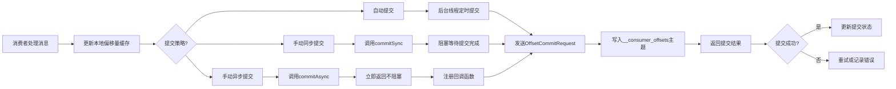
```mermaid
graph LR
    A[消费者处理消息] --> B[更新本地偏移量缓存];
    B --> C{提交策略?};
    
    C --> D[自动提交];
    D --> E[后台线程定时提交];
    E --> F[发送OffsetCommitRequest];
    
    C --> G[手动同步提交];
    G --> H[调用commitSync];
    H --> I[阻塞等待提交完成];
    I --> F;
    
    C --> J[手动异步提交];
    J --> K[调用commitAsync];
    K --> L[立即返回不阻塞];
    L --> M[注册回调函数];
    M --> F;
    
    F --> N[写入__consumer_offsets主题];
    N --> O[返回提交结果];
    O --> P{提交成功?};
    P -->|是| Q[更新提交状态];
    P -->|否| R[重试或记录错误];
```

##### 阶段5：重平衡流程

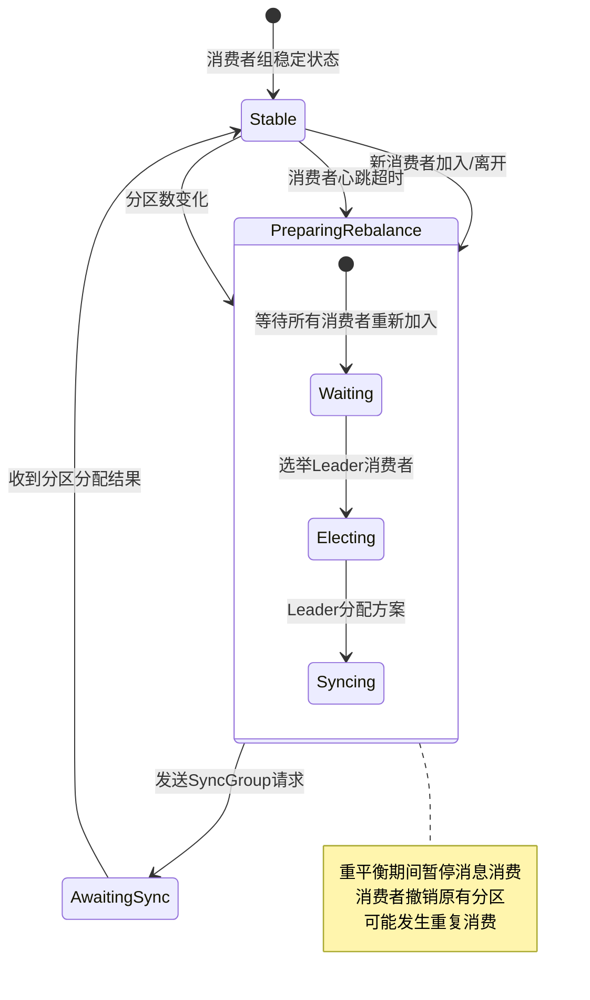
```mermaid
stateDiagram-v2
    [*] --> Stable: 消费者组稳定状态
    
    Stable --> PreparingRebalance: 新消费者加入/离开
    Stable --> PreparingRebalance: 消费者心跳超时
    Stable --> PreparingRebalance: 分区数变化
    
    state PreparingRebalance {
        [*] --> Waiting: 等待所有消费者重新加入
        Waiting --> Electing: 选举Leader消费者
        Electing --> Syncing: Leader分配方案
    }
    
    PreparingRebalance --> AwaitingSync: 发送SyncGroup请求
    AwaitingSync --> Stable: 收到分区分配结果
    
    note right of PreparingRebalance
        重平衡期间暂停消息消费
        消费者撤销原有分区
        可能发生重复消费
    end note
```
##### 完整消费时序图

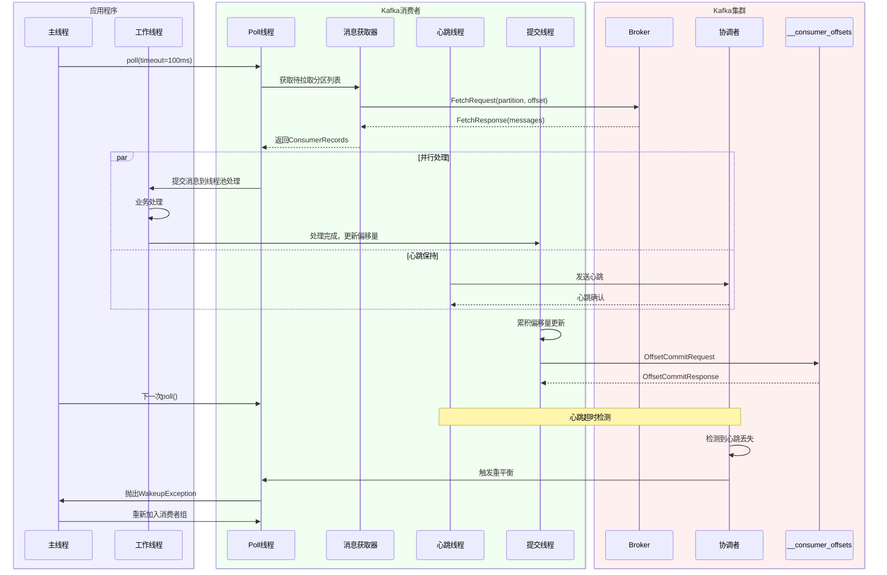
```mermaid
sequenceDiagram
    box rgb(240,240,255) 应用程序
    participant Main as 主线程
    participant Worker as 工作线程
    end
    
    box rgb(240,255,240) Kafka消费者
    participant Poller as Poll线程
    participant Fetcher as 消息获取器
    participant Heartbeat as 心跳线程
    participant Committer as 提交线程
    end
    
    box rgb(255,240,240) Kafka集群
    participant Broker as Broker
    participant Coordinator as 协调者
    participant Offsets as __consumer_offsets
    end
    
    Main->>Poller: poll(timeout=100ms)
    Poller->>Fetcher: 获取待拉取分区列表
    Fetcher->>Broker: FetchRequest(partition, offset)
    Broker-->>Fetcher: FetchResponse(messages)
    Fetcher-->>Poller: 返回ConsumerRecords
    
    par 并行处理
        Poller->>Worker: 提交消息到线程池处理
        Worker->>Worker: 业务处理
        Worker->>Committer: 处理完成，更新偏移量
    and 心跳保持
        Heartbeat->>Coordinator: 发送心跳
        Coordinator-->>Heartbeat: 心跳确认
    end
    
    Committer->>Committer: 累积偏移量更新
    Committer->>Offsets: OffsetCommitRequest
    Offsets-->>Committer: OffsetCommitResponse
    
    Main->>Poller: 下一次poll()
    
    Note over Heartbeat,Coordinator: 心跳超时检测
    Coordinator->>Coordinator: 检测到心跳丢失
    Coordinator->>Poller: 触发重平衡
    Poller->>Main: 抛出WakeupException
    Main->>Poller: 重新加入消费者组
```
##### kafka消费者消费消息流程总结

Kafka消费者消费数据的完整流程可以概括为以下关键阶段：

1. **初始化阶段**
    - 创建消费者，配置序列化器、拦截器
    - 订阅主题或手动分配分区
2. **加入消费者组阶段**
    - 查找GroupCoordinator
    - 发送JoinGroup请求加入组
    - Leader消费者分配分区方案
    - 获取历史消费偏移量
3. **消息消费循环**
    - poll()拉取消息（核心操作）
    - 反序列化和拦截器处理
    - 业务逻辑处理
    - 提交偏移量（自动/手动）
4. **健康维护**
    - 定期发送心跳保持会话
    - 监控处理超时（[max.poll.interval.ms](https://max.poll.interval.ms/)）
5. **重平衡处理**
    - 消费者变化触发重平衡
    - 撤销旧分区，分配新分区
    - 从提交的偏移量恢复消费

#### 分区分配策略

**内置分配策略**：
1. RangeAssignor（默认）：按分区范围分配
2. RoundRobinAssignor：轮询分配
3. StickyAssignor：粘性分配，减少重平衡时的分区移动
4. CooperativeStickyAssignor：协同粘性分配（Kafka 2.4+）


#### 重平衡触发条件

触发重平衡的场景：
1. 新消费者加入组
2. 消费者离开组（主动关闭或崩溃）
3. 消费者超过session.timeout.ms未发送心跳,此时判定为消费者挂掉。
4. 消费者超过max.poll.interval.ms未调用poll()
5. 订阅的主题分区数发生变化

避免频繁重平衡的配置：
```java
props.put("session.timeout.ms", "30000");     // 适当增加超时时间
props.put("heartbeat.interval.ms", "3000");   // 保持心跳活跃
props.put("max.poll.interval.ms", "300000");  // 延长poll间隔
props.put("max.poll.records", "100");         // 减少单次处理量
```

**重平衡流程**


```mermaid
stateDiagram-v2
    [*] --> Stable: 消费者组稳定状态
    
    Stable --> PreparingRebalance: 新消费者加入/离开
    Stable --> PreparingRebalance: 消费者心跳超时
    Stable --> PreparingRebalance: 分区数变化
    
    state PreparingRebalance {
        [*] --> Waiting: 等待所有消费者重新加入
        Waiting --> Electing: 选举Leader消费者
        Electing --> Syncing: Leader分配方案
    }
    
    PreparingRebalance --> AwaitingSync: 发送SyncGroup请求
    AwaitingSync --> Stable: 收到分区分配结果
    
    note right of PreparingRebalance
        重平衡期间暂停消息消费
        消费者撤销原有分区
        可能发生重复消费
    end note
```

#### 常见问题及解决方案

##### 消费者滞后（Lag）过大

原因：处理速度跟不上生产速度

**解决**

1. 增加消费者数量（不超过分区数）
2. 优化处理逻辑，提高处理速度
3. 增加fetch.min.bytes和fetch.max.wait.ms减少请求次数
4. 调整max.poll.records大小
5. 使用异步处理或批量处理

##### 频繁重平衡

原因：消费者心跳超时或处理时间过长

**解决**

```java
// 1. 增加session.timeout.ms和max.poll.interval.ms
props.put("session.timeout.ms", "45000");
props.put("max.poll.interval.ms", "300000");

// 2. 确保及时发送心跳
// 3. 减少max.poll.records，缩短处理时间
// 4. 使用多线程处理，主线程及时poll()
```
##### 重复消费

原因：提交偏移量失败或重平衡

**解决**

1. 实现幂等消费
2. 使用手动提交，在处理完成后提交
3. 在重平衡监听器中及时提交偏移量
4. 使用事务或外部存储记录已处理消息

##### 消费不均匀

原因：分区分配不均或某些分区消息更多

**解决**
1. 使用RoundRobinAssignor或StickyAssignor
2. 调整分区数，使其能被消费者数整除
3. 自定义分区策略
4. 监控各分区消费速率，动态调整

#### ConsumerCoordinator

ConsumerCoordinator 是 Kafka 消费者的核心协调组件，管理消费者组协调相关的所有操作；

##### 在消费者架构中的位置

```shell
KafkaConsumer
├── ConsumerCoordinator (协调器)   ← 本篇重点
│   ├── Heartbeat (心跳管理)
│   ├── GroupMetadata (组元数据)
│   └── PartitionAssignor (分区分配器)
├── Fetcher (消息获取器)
├── SubscriptionState (订阅状态)
└── ConsumerNetworkClient (网络客户端)
```
##### ConsumerCoordinator 的核心职责

1. 消费者组成员管理
2. 分区分配协调
3. 偏移量提交管理
4. 心跳维护
5. 重平衡处理
6. 主题订阅管理

##### 消费者组管理

**消费者组生命周期管理**

```java
class ConsumerCoordinator {
    // 组状态管理
    private enum GroupState {
        UNJOINED,          // 未加入组
        PREPARING_REBALANCE, // 准备重平衡
        AWAITING_SYNC,     // 等待同步
        STABLE,           // 稳定状态
        DEAD              // 组死亡
    }
}
```

**成员元数据管理**

```java
class ConsumerCoordinator {
    // 管理组成员信息
    private class GroupMetadata {
        private String groupId;              // 组ID
        private String generationId;         // 代次ID（每次重平衡递增）
        private String memberId;            // 成员ID
        private String leaderId;            // Leader成员ID
        private String protocol;            // 分配协议
        private Map<String, byte[]> members; // 所有成员元数据
        
        // 成员元数据包含：
        // - 订阅的主题列表
        // - 用户自定义数据
        // - 分配策略偏好
    }
}
```

##### 分区分配协调

**分配流程控制**
```java
class ConsumerCoordinator {
    // 分区分配过程
    private void performAssignment(String leaderId, 
                                   String assignmentStrategy,
                                   Map<String, byte[]> allSubscriptions) {
        // 1. Leader消费者执行分配
        if (isLeader()) {
            PartitionAssignor assignor = getAssignor(assignmentStrategy);
            
            // 2. 运行分配算法
            Map<String, Assignment> assignments = 
                assignor.assign(metadata.cluster(), allSubscriptions);
            
            // 3. 封装分配结果
            this.assignmentSnapshot = assignments;
        }
    }
}
```
**支持的分区分配策略**
```java
// ConsumerCoordinator 支持的分配策略
public interface PartitionAssignor {
    // 内置策略：
    // 1. RangeAssignor（默认）：按范围分配
    //    partitions: [0,1,2,3,4,5,6,7,8,9]
    //    消费者A: [0,1,2,3]
    //    消费者B: [4,5,6,7,8,9]
    
    // 2. RoundRobinAssignor：轮询分配
    //    partitions: [0,1,2,3,4,5]
    //    消费者A: [0,2,4]
    //    消费者B: [1,3,5]
    
    // 3. StickyAssignor：粘性分配（减少分区移动）
    //    重平衡时尽量保持原有分配
    
    // 4. CooperativeStickyAssignor（Kafka 2.4+）
    //    协同粘性分配，支持增量重平衡
}
```
##### 偏移量提交管理

**偏移量提交机制**

```java
class ConsumerCoordinator {
    // 偏移量提交管理器
    private class OffsetCommitManager {
        // 待提交的偏移量缓存
        private final Map<TopicPartition, OffsetAndMetadata> pendingCommits;
        
        // 已提交的偏移量缓存（用于快速查找）
        private final Map<TopicPartition, OffsetAndMetadata> committedOffsets;
        
        // 提交偏移量
        public void commitOffsetsAsync(Map<TopicPartition, OffsetAndMetadata> offsets,
                                       OffsetCommitCallback callback) {
            // 1. 添加到待提交队列
            pendingCommits.putAll(offsets);
            
            // 2. 发送OffsetCommitRequest
            sendOffsetCommitRequest(offsets, callback);
            
            // 3. 更新本地缓存
            updateLocalCommitCache(offsets);
        }
    }
}
```
**自动提交实现**

```java
class ConsumerCoordinator {
    // 自动提交定时器
    private long lastAutoCommitTimer = 0;
    
    private void maybeAutoCommitOffsetsAsync(long now) {
        // 检查是否启用自动提交
        if (autoCommitEnabled && !subscriptions.hasAutoCommitDisabled()) {
            
            // 检查是否达到提交间隔
            if (now - lastAutoCommitTimer >= autoCommitIntervalMs) {
                
                // 获取所有已消费的分区偏移量
                Map<TopicPartition, OffsetAndMetadata> allConsumed = 
                    subscriptions.allConsumed();
                
                if (!allConsumed.isEmpty()) {
                    // 执行异步提交
                    doCommitOffsetsAsync(allConsumed, 
                        new OffsetCommitCallback() {
                            @Override
                            public void onComplete(Map<TopicPartition, OffsetAndMetadata> offsets,
                                                   Exception exception) {
                                if (exception != null) {
                                    log.warn("Auto commit failed", exception);
                                }
                            }
                        });
                }
                
                // 更新计时器
                lastAutoCommitTimer = now;
            }
        }
    }
}
```

##### 心跳维护机制
**心跳线程管理**

```java
class ConsumerCoordinator {
    // 心跳管理
    private class Heartbeat {
        private long lastHeartbeatSend = 0;    // 上次发送心跳时间
        private long lastHeartbeatReceive = 0; // 上次收到心跳响应时间
        
        // 心跳配置
        private final int sessionTimeoutMs;    // 会话超时（默认45秒）
        private final int heartbeatIntervalMs; // 心跳间隔（默认3秒）
        private final int maxPollIntervalMs;   // 最大poll间隔（默认5分钟）
        
        // 检查是否需要发送心跳
        boolean shouldHeartbeat(long now) {
            return now - lastHeartbeatSend > heartbeatIntervalMs;
        }
        
        // 检查会话是否超时
        boolean sessionTimeoutExpired(long now) {
            return now - lastHeartbeatReceive > sessionTimeoutMs;
        }
    }
}
```

**心跳发送流程**
```java
class ConsumerCoordinator {
    // poll() 方法中的心跳处理
    public void poll(long now) {
        // 1. 检查并发送心跳
        if (heartbeat.shouldHeartbeat(now)) {
            heartbeat.sentHeartbeat(now);
            sendHeartbeatRequest();  // 发送心跳请求
        }
        
        // 2. 检查会话超时
        if (heartbeat.sessionTimeoutExpired(now)) {
            // 触发重平衡
            markCoordinatorUnknown("session timed out");
            needRejoin = true;
        }
        
        // 3. 检查poll间隔超时
        if (pollTimeoutExpired(now)) {
            // 离开消费者组
            leaveGroup();
            needRejoin = true;
        }
    }
}
```
#####  完整加入组流程

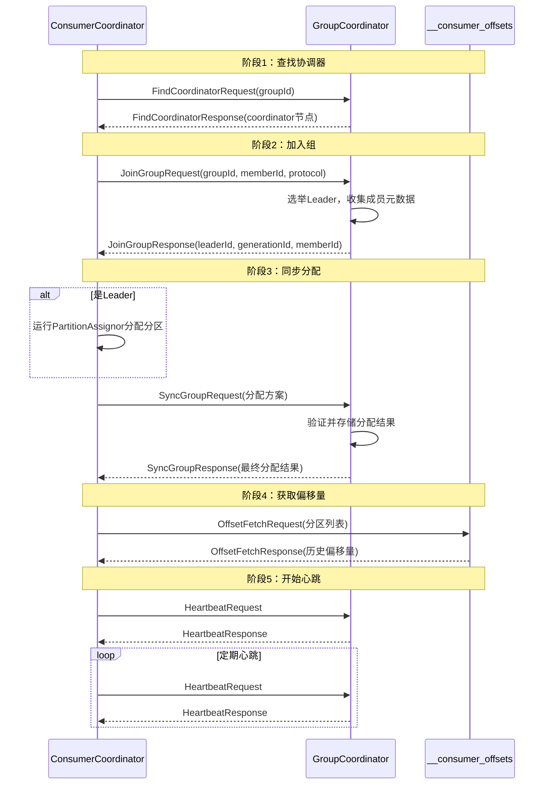
```mermaid
sequenceDiagram
    participant C as ConsumerCoordinator
    participant GC as GroupCoordinator
    participant Offsets as __consumer_offsets
    
    Note over C,Offsets: 阶段1：查找协调器
    C->>GC: FindCoordinatorRequest(groupId)
    GC-->>C: FindCoordinatorResponse(coordinator节点)
    
    Note over C,Offsets: 阶段2：加入组
    C->>GC: JoinGroupRequest(groupId, memberId, protocol)
    GC->>GC: 选举Leader，收集成员元数据
    GC-->>C: JoinGroupResponse(leaderId, generationId, memberId)
    
    Note over C,Offsets: 阶段3：同步分配
    alt 是Leader
        C->>C: 运行PartitionAssignor分配分区
    end
    C->>GC: SyncGroupRequest(分配方案)
    GC->>GC: 验证并存储分配结果
    GC-->>C: SyncGroupResponse(最终分配结果)
    
    Note over C,Offsets: 阶段4：获取偏移量
    C->>Offsets: OffsetFetchRequest(分区列表)
    Offsets-->>C: OffsetFetchResponse(历史偏移量)
    
    Note over C,Offsets: 阶段5：开始心跳
    C->>GC: HeartbeatRequest
    GC-->>C: HeartbeatResponse
    loop 定期心跳
        C->>GC: HeartbeatRequest
        GC-->>C: HeartbeatResponse
    end
```
##### 重平衡触发与处理
```java
class ConsumerCoordinator {
    // 重平衡触发条件
    private void checkRebalanceConditions(long now) {
        // 条件1：新成员加入
        if (newMemberJoined) {
            triggerRebalance("new member joined");
        }
        
        // 条件2：成员离开（心跳超时）
        if (heartbeat.sessionTimeoutExpired(now)) {
            triggerRebalance("member timed out");
        }
        
        // 条件3：poll间隔超时
        if (now - lastPollTime > maxPollIntervalMs) {
            triggerRebalance("poll timeout");
        }
        
        // 条件4：元数据变化（分区数变化）
        if (metadataChanged) {
            triggerRebalance("metadata changed");
        }
        
        // 条件5：订阅变化
        if (subscriptionChanged) {
            triggerRebalance("subscription changed");
        }
    }
    
    private void triggerRebalance(String reason) {
        log.info("Triggering rebalance: {}", reason);
        needRejoin = true;
        
        // 调用重平衡监听器
        if (rebalanceListener != null) {
            rebalanceListener.onPartitionsRevoked(assignedPartitions);
        }
        
        // 发送LeaveGroup请求
        sendLeaveGroupRequest();
    }
}
```
##### 与 GroupCoordinator 的关系
```java
// ConsumerCoordinator vs GroupCoordinator
class RoleComparison {
    /*
    ConsumerCoordinator（客户端）          GroupCoordinator（服务端）
    ----------------------------          -------------------------
    位置：消费者JVM内                       位置：Kafka Broker上
    职责：消费者组管理的客户端逻辑           职责：消费者组管理的服务端逻辑
    功能：                               功能：
      - 发送加入组请求                      - 接收并处理加入组请求
      - 执行分区分配（Leader角色）          - 协调所有消费者加入
      - 管理心跳发送                        - 维护组成员列表
      - 处理重平衡逻辑                      - 触发重平衡
      - 提交偏移量                          - 存储分配结果
                                             - 存储偏移量
    */
}
```

##### 关键配置项

```java
class ConsumerCoordinatorConfig {

    Properties getCoordinatorConfig() {
        Properties props = new Properties();

        // 组管理相关
        props.put("group.id", "required");                    // 消费者组ID（必须）
        props.put("session.timeout.ms", "45000");             // 会话超时（默认45秒）
        props.put("heartbeat.interval.ms", "3000");           // 心跳间隔（默认3秒）
        props.put("max.poll.interval.ms", "300000");          // 最大poll间隔（默认5分钟）

        // 分区分配
        props.put("partition.assignment.strategy",
                "org.apache.kafka.clients.consumer.RangeAssignor"); // 分配策略

        // 偏移量提交
        props.put("enable.auto.commit", "true");              // 启用自动提交
        props.put("auto.commit.interval.ms", "5000");         // 自动提交间隔（默认5秒）

        // 重平衡配置
        props.put("rebalance.timeout.ms", "60000");           // 重平衡超时
        props.put("rebalance.backoff.ms", "2000");            // 重平衡退避时间

        // 元数据
        props.put("metadata.max.age.ms", "300000");           // 元数据最大年龄（5分钟）

        return props;
    }
}
```
- session.timeout.ms 的影响： 
  - 值小：快速检测故障，但容易误判（网络抖动） 
  - 值大：减少误判，但故障恢复慢

- heartbeat.interval.ms 的影响： 
  - 值小：更频繁心跳，更快检测，但网络开销大 
  - 值大：减少网络开销，但检测延迟增加

- max.poll.interval.ms 的影响： 
  - 值小：快速检测处理卡住，但容易误判长处理 
  - 值大：允许长时间处理，但故障检测慢

- auto.commit.interval.ms 的影响： 
  - 值小：提交频繁，减少重复消费，但增加负载 
  - 值大：减少负载，但增加重复消费风险

#### 启动kafka消费者完整流程
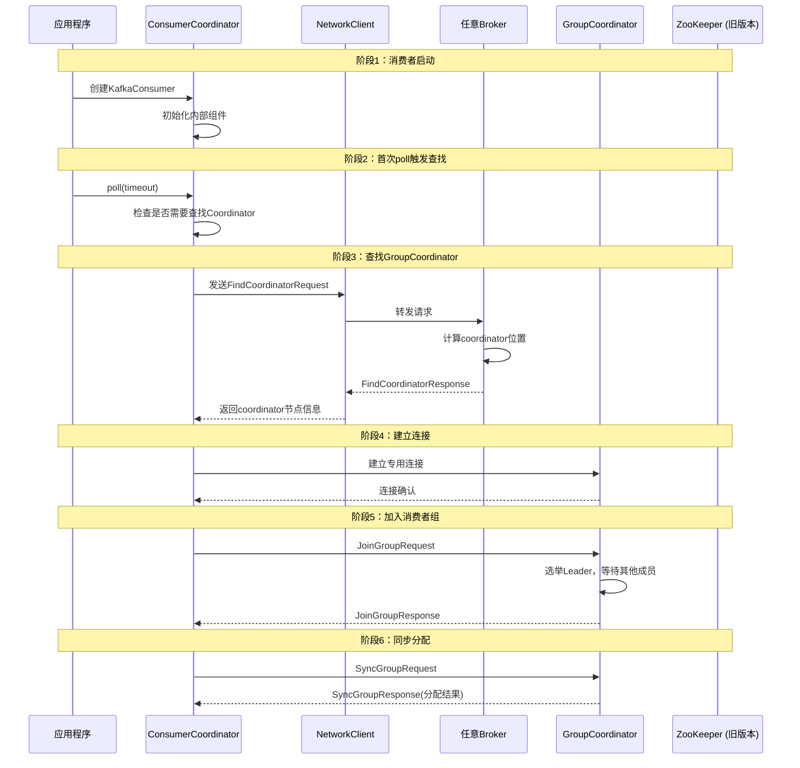
```mermaid
sequenceDiagram
    participant App as 应用程序
    participant CC as ConsumerCoordinator
    participant NC as NetworkClient
    participant Broker as 任意Broker
    participant GC as GroupCoordinator
    participant ZK as ZooKeeper (旧版本)

    Note over App,ZK: 阶段1：消费者启动
    App->>CC: 创建KafkaConsumer
    CC->>CC: 初始化内部组件
    
    Note over App,ZK: 阶段2：首次poll触发查找
    App->>CC: poll(timeout)
    CC->>CC: 检查是否需要查找Coordinator
    
    Note over App,ZK: 阶段3：查找GroupCoordinator
    CC->>NC: 发送FindCoordinatorRequest
    NC->>Broker: 转发请求
    Broker->>Broker: 计算coordinator位置
    Broker-->>NC: FindCoordinatorResponse
    NC-->>CC: 返回coordinator节点信息
    
    Note over App,ZK: 阶段4：建立连接
    CC->>GC: 建立专用连接
    GC-->>CC: 连接确认
    
    Note over App,ZK: 阶段5：加入消费者组
    CC->>GC: JoinGroupRequest
    GC->>GC: 选举Leader，等待其他成员
    GC-->>CC: JoinGroupResponse
    
    Note over App,ZK: 阶段6：同步分配
    CC->>GC: SyncGroupRequest
    GC-->>CC: SyncGroupResponse(分配结果)
```
#### 查找GroupCoordinator的核心过程

```java
// GroupCoordinator位置计算算法
class CoordinatorLocator {
    
    // 关键算法：coordinator节点计算
    public int findCoordinatorPartition(String groupId) {
        // 1. 计算hash值
        int hashCode = groupId.hashCode();
        
        // 2. 取绝对值
        int absHash = Math.abs(hashCode);
        
        // 3. 取模（基于__consumer_offsets主题的分区数）
        // 默认分区数：50 (由offsets.topic.num.partitions配置)
        int partition = absHash % 50;
        
        return partition;
    }
    
    // 说明：
    // - __consumer_offsets是Kafka内部主题，存储消费者偏移量
    // - GroupCoordinator就是该分区所在的Broker的Leader
    // - 每个Broker都可能成为某些消费者组的coordinator
}
```

### GroupCoordinator

#### GroupCoordinator 是什么

GroupCoordinator 是 Kafka Broker 内部的服务组件，负责管理消费者组的协调工作；
核心职责：
1. 管理消费者组成员资格
2. 协调分区分配
3. 存储消费偏移量
4. 处理消费者组状态

#### 在 Kafka 架构中的位置

```shell
Kafka Broker
├── SocketServer (网络服务)
├── LogManager (日志管理)
├── ReplicaManager (副本管理)
├── GroupCoordinator (组协调器) ← 本篇重点
├── TransactionCoordinator (事务协调器)
└── Controller (集群控制器)
```
#### GroupCoordinator 的作用

##### GroupCoordinator 的作用
```java
class GroupCoordinator {
    // 管理消费者组的状态机
    private enum GroupState {
        Empty,          // 空组，无成员
        Stable,         // 稳定状态，有活跃成员
        PreparingRebalance, // 准备重平衡
        Dead           // 死亡状态，无成员且元数据被清理
    }
}
```

##### 成员管理
```java
class GroupMetadata {
    // 组元数据结构
    private String groupId;
    private String protocolType = "consumer"; // 固定为"consumer"
    private int generationId = 0;             // 代次，每次重平衡递增
    private String leaderId;                  // Leader消费者ID
    private Map<String, MemberMetadata> members; // 所有成员
    
    class MemberMetadata {
        private String memberId;              // 成员ID
        private String clientId;              // 客户端ID
        private String clientHost;            // 客户端主机
        private List<String> subscription;    // 订阅的主题
        private long lastHeartbeat;           // 上次心跳时间
        private MemberAssignment assignment;  // 分配的分区
    }
}
```

##### 分区分配协调

```java
// GroupCoordinator 协调分区分配的过程
class GroupCoordinator {
    
    def handleJoinGroup(request: JoinGroupRequest): JoinGroupResponse = {
        // 1. 获取或创建组元数据
        val group = getOrCreateGroup(request.groupId)
        
        // 2. 添加新成员或更新已有成员
        group.add(request.memberId, request.metadata)
        
        // 3. 等待所有成员加入（或超时）
        if (group.hasAllMembersJoined || rebalanceTimeoutExpired) {
            // 4. 选举Leader消费者
            val leaderId = electLeader(group)
            
            // 5. 告诉Leader消费者执行分配
            //    （实际分配由Leader消费者计算）
            
            // 6. 递增generationId
            group.transitionTo(Stable)
            group.generationId += 1
            
            return new JoinGroupResponse(
                error = Errors.NONE,
                generationId = group.generationId,
                leaderId = leaderId,
                memberId = request.memberId
            )
        }
    }
}
```
##### 偏移量管理
```java
// GroupCoordinator 管理消费偏移量
class GroupCoordinator {
    
    // 偏移量存储结构
    private class OffsetMetadata {
        long offset;           // 消费偏移量
        String metadata;       // 用户自定义元数据
        long timestamp;        // 提交时间戳
    }
    
    // 偏移量存储
    private final Map<TopicPartition, Map<String, OffsetMetadata>> offsets =
        new ConcurrentHashMap<>();
    
    def handleOffsetCommit(request: OffsetCommitRequest): OffsetCommitResponse = {
        // 1. 验证消费者组状态
        val group = groups.get(request.groupId)
        if (!group.isStable) {
            return Errors.REBALANCE_IN_PROGRESS
        }
        
        // 2. 验证成员资格
        if (!group.hasMember(request.memberId)) {
            return Errors.UNKNOWN_MEMBER_ID
        }
        
        // 3. 验证代次
        if (request.generationId != group.generationId) {
            return Errors.ILLEGAL_GENERATION
        }
        
        // 4. 存储偏移量
        offsets.computeIfAbsent(request.topicPartition, 
            k -> new ConcurrentHashMap<>())
            .put(request.groupId, new OffsetMetadata(
                request.offset,
                request.metadata,
                System.currentTimeMillis()
            ));
        
        // 5. 响应成功
        return Errors.NONE;
    }
}
```
#### 工作流程

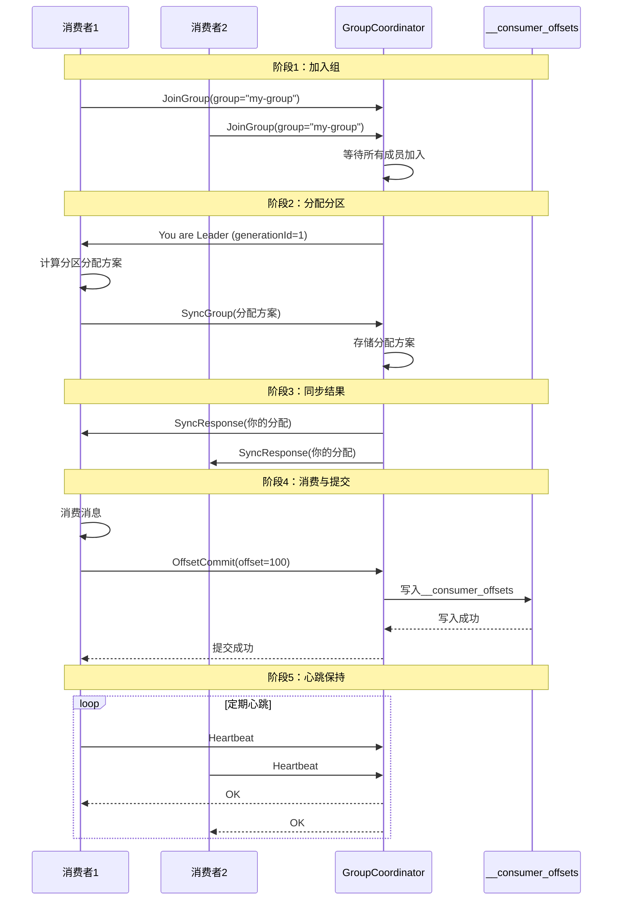
```mermaid
sequenceDiagram
    participant C1 as 消费者1
    participant C2 as 消费者2
    participant GC as GroupCoordinator
    participant OS as __consumer_offsets

    Note over C1,OS: 阶段1：加入组
    C1->>GC: JoinGroup(group="my-group")
    C2->>GC: JoinGroup(group="my-group")
    GC->>GC: 等待所有成员加入
    
    Note over C1,OS: 阶段2：分配分区
    GC->>C1: You are Leader (generationId=1)
    C1->>C1: 计算分区分配方案
    C1->>GC: SyncGroup(分配方案)
    GC->>GC: 存储分配方案
    
    Note over C1,OS: 阶段3：同步结果
    GC->>C1: SyncResponse(你的分配)
    GC->>C2: SyncResponse(你的分配)
    
    Note over C1,OS: 阶段4：消费与提交
    C1->>C1: 消费消息
    C1->>GC: OffsetCommit(offset=100)
    GC->>OS: 写入__consumer_offsets
    OS-->>GC: 写入成功
    GC-->>C1: 提交成功
    
    Note over C1,OS: 阶段5：心跳保持
    loop 定期心跳
        C1->>GC: Heartbeat
        C2->>GC: Heartbeat
        GC-->>C1: OK
        GC-->>C2: OK
    end
```
#### GroupCoordinator 的分布原理

> 每个消费者组有一个 GroupCoordinator。

```java
// GroupCoordinator 分布算法
class CoordinatorDistribution {
    
    // 关键概念：
    // 1. __consumer_offsets 是 Kafka 内部主题
    // 2. 每个消费者组映射到该主题的一个分区
    // 3. 该分区的 Leader 副本所在的 Broker 就是该组的 GroupCoordinator
    
    public Node findCoordinatorForGroup(String groupId) {
        // 步骤1：计算分区号
        int partition = partitionFor(groupId);
        
        // 步骤2：获取该分区的 Leader 副本
        PartitionInfo partitionInfo = metadataCache.getPartitionInfo(
            "__consumer_offsets", 
            partition
        );
        
        // 步骤3：返回 Leader 所在的 Broker
        return partitionInfo.leader();
    }
    
    private int partitionFor(String groupId) {
        // 使用 murmur2 哈希算法
        int hash = murmur2(groupId.getBytes(StandardCharsets.UTF_8));
        
        // 取模（默认50个分区）
        int numPartitions = 50; // offsets.topic.num.partitions
        return Math.abs(hash) % numPartitions;
    }
}
```
#### 参数配置影响

```java
class CoordinatorDistributionConfig {
    
    Properties getDistributionConfig() {
        Properties props = new Properties();
        
        // 控制 GroupCoordinator 分布的关键配置：
        
        // 1. offsets.topic.num.partitions (默认50)
        // 决定 __consumer_offsets 主题的分区数
        // 影响：每个分区承载的消费者组数量
        // 建议：根据消费者组数量调整
        props.put("offsets.topic.num.partitions", "50");
        
        // 2. offsets.topic.replication.factor (默认3)
        // 决定 __consumer_offsets 的副本数
        // 影响：GroupCoordinator 的高可用性
        props.put("offsets.topic.replication.factor", "3");
        
        // 3. offsets.retention.minutes (默认10080=7天)
        // 偏移量保留时间
        // 消费者组超过此时间不活动会被清理
        props.put("offsets.retention.minutes", "10080");
        
        // 4. group.min.session.timeout.ms (默认6000=6秒)
        // 最小会话超时时间
        props.put("group.min.session.timeout.ms", "6000");
        
        // 5. group.max.session.timeout.ms (默认300000=5分钟)
        // 最大会话超时时间
        props.put("group.max.session.timeout.ms", "300000");
        
        return props;
    }
}
```

#### GroupCoordinator 的高可用性

##### Leader 选举与故障转移
```java
// GroupCoordinator 故障转移机制
class CoordinatorFailover {
    
    void handleBrokerFailure(int brokerId) {
        // 当 Broker 宕机时：
        
        // 1. 该 Broker 上的所有 __consumer_offsets 分区 Leader 转移
        for (PartitionInfo partition : getAllPartitionsOnBroker(brokerId)) {
            if (partition.leader().id() == brokerId) {
                // 2. 触发 Leader 选举
                electNewLeader(partition);
                
                // 3. 新 Leader 接管 GroupCoordinator 职责
                Node newCoordinator = partition.newLeader();
                migrateGroupsToNewCoordinator(partition, newCoordinator);
            }
        }
    }
    
    // 消费者端的处理
    void handleCoordinatorFailure() {
        // 消费者发现 Coordinator 不可用时：
        
        // 1. 标记 Coordinator 为未知
        coordinatorUnknown = true;
        
        // 2. 重新查找 Coordinator
        //    由于分区 Leader 已切换，会找到新的 Broker
        findCoordinator();
        
        // 3. 重新加入消费者组
        rejoinGroup();
        
        // 整个过程对应用透明（除了短暂延迟）
    }
}
```
##### 数据持久化保证
```java
// GroupCoordinator 数据持久化
class CoordinatorPersistence {

    // GroupCoordinator 将数据存储在：
    // 1. __consumer_offsets 主题（持久化存储）
    // 2. 内存缓存（加速访问）

    void persistGroupMetadata(GroupMetadata group) {
        // 1. 序列化组元数据
        byte[] key = serializeGroupKey(group.groupId);
        byte[] value = serializeGroupValue(group);

        // 2. 写入 __consumer_offsets
        ProducerRecord<byte[], byte[]> record = new ProducerRecord<>(
                "__consumer_offsets",
                partitionFor(group.groupId),
                key,
                value
        );

        // 3. 使用事务保证原子性
        kafkaProducer.send(record);

        // 4. 更新内存缓存
        groups.put(group.groupId, group);
    }

    void loadGroupMetadata() {
        // 启动时从 __consumer_offsets 加载数据
        for (ConsumerRecord<byte[], byte[]> record :
                consumeFromOffsetsTopic()) {

            String groupId = deserializeGroupKey(record.key());
            GroupMetadata group = deserializeGroupValue(record.value());

            groups.put(groupId, group);
        }
    }
}
```
#### 与 ConsumerCoordinator 的关系
##### 角色对比
```java
// GroupCoordinator vs ConsumerCoordinator 对比
class CoordinatorComparison {
    /*
    GroupCoordinator (服务端)            ConsumerCoordinator (客户端)
    ------------------------            ---------------------------
    位置：Kafka Broker 内部                位置：消费者 JVM 内
    数量：每个 Broker 都有                 数量：每个消费者实例一个
    
    职责：                               职责：
    - 管理消费者组状态                    - 发送加入组请求
    - 存储偏移量                          - 计算分区分配（Leader角色）
    - 协调所有消费者                      - 管理心跳发送
    - 处理重平衡                          - 处理服务端响应
    - 持久化组元数据                      - 维护本地状态
    
    数据：                               数据：
    - 全局组状态                          - 本地消费者状态
    - 持久化偏移量                        - 临时偏移量缓存
    - 所有成员信息                        - 自己的分配信息
    
    通信：                               通信：
    - 被动接收请求                        - 主动发起请求
    - 响应客户端                          - 处理响应
    */
}
```

##### 协作流程
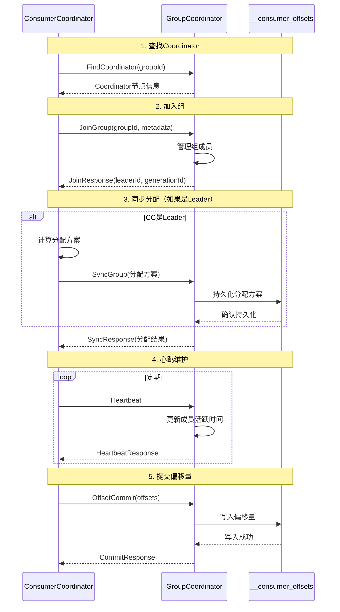
```mermaid
sequenceDiagram
    participant CC as ConsumerCoordinator
    participant GC as GroupCoordinator
    participant OS as __consumer_offsets
    
    Note over CC,OS: 1. 查找Coordinator
    CC->>GC: FindCoordinator(groupId)
    GC-->>CC: Coordinator节点信息
    
    Note over CC,OS: 2. 加入组
    CC->>GC: JoinGroup(groupId, metadata)
    GC->>GC: 管理组成员
    GC-->>CC: JoinResponse(leaderId, generationId)
    
    Note over CC,OS: 3. 同步分配（如果是Leader）
    alt CC是Leader
        CC->>CC: 计算分配方案
        CC->>GC: SyncGroup(分配方案)
        GC->>OS: 持久化分配方案
        OS-->>GC: 确认持久化
    end
    GC-->>CC: SyncResponse(分配结果)
    
    Note over CC,OS: 4. 心跳维护
    loop 定期
        CC->>GC: Heartbeat
        GC->>GC: 更新成员活跃时间
        GC-->>CC: HeartbeatResponse
    end
    
    Note over CC,OS: 5. 提交偏移量
    CC->>GC: OffsetCommit(offsets)
    GC->>OS: 写入偏移量
    OS-->>GC: 写入成功
    GC-->>CC: CommitResponse
```

#### 性能与可扩展性

##### 负载均衡设计
```java
class CoordinatorLoadBalancing {
    
    // GroupCoordinator 的负载分布策略
    
    void analyzeLoadDistribution() {
        // 1. 基于哈希的分布
        // 消费者组均匀分布在各个分区
        // 每个 Broker 承载大致相同数量的 GroupCoordinator
        
        // 2. 动态调整
        // 如果某个 Broker 负载过高：
        // - 可以增加 __consumer_offsets 分区数
        // - 可以迁移部分分区到其他 Broker
        
        // 3. 热点问题处理
        // 如果某个消费者组特别活跃（高频提交）：
        // - 该组的 GroupCoordinator 可能成为热点
        // - 解决方案：优化消费者提交频率
    }
    
    // 监控负载指标
    class CoordinatorMetrics {
        // 关键监控指标：
        double groupsPerCoordinator;     // 每个Coordinator管理的组数
        double requestsPerSecond;        // 每秒请求数
        double heartbeatsPerSecond;      // 心跳频率
        double commitRate;               // 提交频率
        double rebalanceRate;            // 重平衡频率
    }
}
```

##### 水平扩展能力
```java
class CoordinatorScalability {
    
    // GroupCoordinator 的扩展方式
    
    void scaleOut() {
        // 方式1：增加 Broker 数量
        // 效果：自动增加 GroupCoordinator 数量
        // 新的消费者组会自动分配到新的 Broker
        
        // 方式2：增加 __consumer_offsets 分区数
        // 需要重启 Broker 或使用分区增加工具
        // 新分区会自动分布到不同 Broker
        
        // 方式3：调整副本分布
        // 将热点分区的 Leader 迁移到负载较低的 Broker
        
        // 限制因素：
        // 1. 每个 GroupCoordinator 需要的内存
        // 2. 网络带宽
        // 3. 持久化存储性能
    }
    
    // 容量规划建议
    class CapacityPlanning {
        // 经验值：
        // - 每个 GroupCoordinator 可管理约 10,000 个消费者组
        // - 每个消费者组平均内存占用：约 1KB
        // - 峰值请求处理能力：约 10,000 QPS
        
        // 计算公式：
        long requiredMemory = numGroups * 1024; // bytes
        long requiredCpu = numRequestsPerSecond / 10000;
    }
}
```

#### 常见故障及恢复
```java
class CoordinatorFailureRecovery {
    
    // 场景1：GroupCoordinator 所在 Broker 宕机
    void handleBrokerFailure() {
        // 恢复过程：
        // 1. Controller 检测到 Broker 宕机
        // 2. 触发 Leader 选举，选择新的 Leader 副本
        // 3. 新的 Broker 成为 GroupCoordinator
        // 4. 从副本加载组元数据
        // 5. 消费者重新查找并连接到新的 Coordinator
        // 6. 恢复消费（可能发生重平衡）
        
        // 影响：
        // - 短暂的服务中断（秒级）
        // - 可能触发消费者重平衡
        // - 无数据丢失（偏移量已持久化）
    }
    
    // 场景2：网络分区
    void handleNetworkPartition() {
        // 现象：
        // - 消费者无法连接到 Coordinator
        // - 心跳失败，消费者离开组
        // - 触发重平衡
        
        // 恢复：
        // 1. 网络恢复后，消费者重新连接
        // 2. 重新加入消费者组
        // 3. 从持久化的偏移量恢复消费
        
        // 注意：可能出现脑裂问题
        // Kafka 使用 generationId 防止脑裂
    }
    
    // 场景3：__consumer_offsets 主题损坏
    void handleTopicCorruption() {
        // 处理方式：
        // 1. 从副本恢复数据
        // 2. 如果所有副本都损坏：
        //    - 消费者组需要重新创建
        //    - 偏移量丢失，需要重置消费位置
        //    - 可能造成重复消费或消息丢失
        
        // 预防措施：
        // - 设置足够的副本数（至少3）
        // - 定期备份偏移量
        // - 监控主题健康状态
    }
}
```

#### 配置优化

##### 服务端优化
```java
class CoordinatorBestPractices {
    
    Properties getOptimizedConfig() {
        Properties props = new Properties();
        
        // Broker 端配置（影响 GroupCoordinator）
        
        // 1. 根据消费者组数量调整分区数
        // 经验值：每个分区承载约 1000-5000 个消费者组
        int estimatedGroups = 10000;
        int partitions = Math.max(50, estimatedGroups / 2000);
        props.put("offsets.topic.num.partitions", String.valueOf(partitions));
        
        // 2. 确保高可用
        props.put("offsets.topic.replication.factor", "3");
        
        // 3. 调整偏移量保留时间
        // 根据业务需要设置，避免过早清理
        props.put("offsets.retention.minutes", "10080"); // 7天
        
        // 4. 调整会话超时范围
        props.put("group.min.session.timeout.ms", "6000");   // 6秒
        props.put("group.max.session.timeout.ms", "300000"); // 5分钟
        
        // 5. 调整重平衡超时
        props.put("group.initial.rebalance.delay.ms", "3000"); // 初始延迟
        
        return props;
    }
}
```

##### 消费者端优化

```java
class ConsumerSideOptimization {
    
    void optimizeConsumerForCoordinator() {
        // 1. 合理设置心跳间隔
        // 避免过频繁的心跳增加 Coordinator 负担
        props.put("heartbeat.interval.ms", "3000");
        
        // 2. 合理设置会话超时
        // 平衡故障检测速度和误判概率
        props.put("session.timeout.ms", "10000");
        
        // 3. 批量提交偏移量
        // 减少提交频率，降低 Coordinator 压力
        props.put("enable.auto.commit", "false");
        // 在代码中实现批量提交
        
        // 4. 避免频繁重平衡
        // 确保处理逻辑不会超过 max.poll.interval.ms
        props.put("max.poll.interval.ms", "300000");
        props.put("max.poll.records", "500");
        
        // 5. 使用增量重平衡（Kafka 2.4+）
        props.put("partition.assignment.strategy",
                 "org.apache.kafka.clients.consumer.CooperativeStickyAssignor");
    }
}
```
#### **核心要点总结**

1. **GroupCoordinator 是什么**：
    - Kafka Broker 内部的服务组件
    - 负责管理消费者组的所有协调工作
    - 每个活跃的消费者组都有一个对应的 GroupCoordinator
2. **分布机制**：
    - **不是每个分区都有** GroupCoordinator
    - 每个消费者组通过哈希映射到 `__consumer_offsets` 的一个分区
    - 该分区 Leader 副本所在的 Broker 就是该组的 GroupCoordinator
3. **主要职责**：
    - ✅ 管理消费者组成员资格和状态
    - ✅ 协调分区分配过程
    - ✅ 存储和提供消费偏移量
    - ✅ 处理心跳和维护会话
    - ✅ 触发和管理重平衡
4. **高可用性**：
    - 通过 `__consumer_offsets` 主题的副本机制实现
    - Leader 故障时自动切换到其他副本
    - 数据持久化保证不丢失

### JoinGroupRequest后为什么要选举leader,选举的leader是什么

#### 为什么需要选举Leader

##### 设计目的：分布式共识问题

```java
// 消费者组面临的分布式共识挑战
class DistributedConsensusChallenge {
    /*
    问题：当多个消费者同时加入组时，如何协调分配方案？
    
    解决方案对比：
    方案1：所有消费者各自计算 → 结果可能不一致
    方案2：GroupCoordinator计算 → 负担过重，不灵活
    方案3：选举一个Leader计算 → ✅ 最优方案
    
    为什么选择方案3（Leader选举）：
    1. 降低GroupCoordinator负载：计算工作分摊到消费者
    2. 灵活性：消费者可以根据业务逻辑自定义分配
    3. 一致性：确保所有消费者获得相同的分配结果
    4. 可扩展性：支持不同的分配策略
    */
}
```

##### Leader选举的核心价值

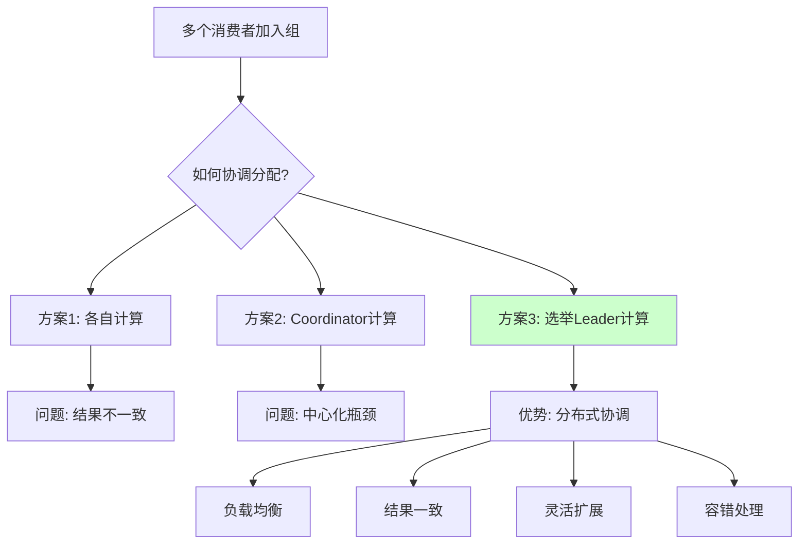
```mermaid
graph TD
    A[多个消费者加入组] --> B{如何协调分配?}
    B --> C[方案1: 各自计算]
    B --> D[方案2: Coordinator计算]
    B --> E[方案3: 选举Leader计算]
    
    C --> F[问题: 结果不一致]
    D --> G[问题: 中心化瓶颈]
    E --> H[优势: 分布式协调]
    
    H --> I1[负载均衡]
    H --> I2[结果一致]
    H --> I3[灵活扩展]
    H --> I4[容错处理]
    
    style E fill:#ccffcc
```
#### Leader选举的具体过程

##### 选举算法实现
```java
// GroupCoordinator中的Leader选举逻辑
class GroupCoordinator {
    
    def electLeader(group: GroupMetadata): String = {
        // 选举原则：确定性算法，确保所有成员结果一致
        
        // 1. 收集所有成员信息
        val members = group.allMembers
        
        // 2. 排序规则（确保确定性）：
        //    a. 首先按 memberId 的字典序排序
        //    b. 如果有相同 memberId，按加入时间排序
        
        val sortedMembers = members.toList
            .sortBy(member => (member.memberId, member.joinTime))
        
        // 3. 选择第一个成员作为Leader
        val leaderId = sortedMembers.head.memberId
        
        // 4. 记录选举信息
        log.info(s"Elected leader $leaderId for group ${group.groupId}")
        
        return leaderId
    }
    
    // 选举的确定性保证：
    // - 输入相同（成员列表）→ 输出相同（Leader）
    // - 所有消费者都会得到相同的Leader结果
    // - 避免脑裂（Split-brain）问题
}
```
##### JoinGroupResponse中的选举结果
```java
// JoinGroupResponse 协议结构
class JoinGroupProtocol {
    // Response Body (v5):
    //   error_code: Int16                      // 错误码
    //   generation_id: Int32                   // 代次ID
    //   protocol_name: String                  // 选择的协议
    //   leader: String                         // Leader的memberId ← 关键字段
    //   member_id: String                      // 当前消费者的memberId
    //   members: Array<JoinGroupResponseMember> // 所有成员信息（仅Leader可见）
    
    class JoinGroupResponseMember {
        member_id: String      // 成员ID
        group_instance_id: String? // 成员实例ID（静态成员）
        metadata: Bytes         // 成员元数据（订阅信息）
    }
}
```
##### 选举过程示例

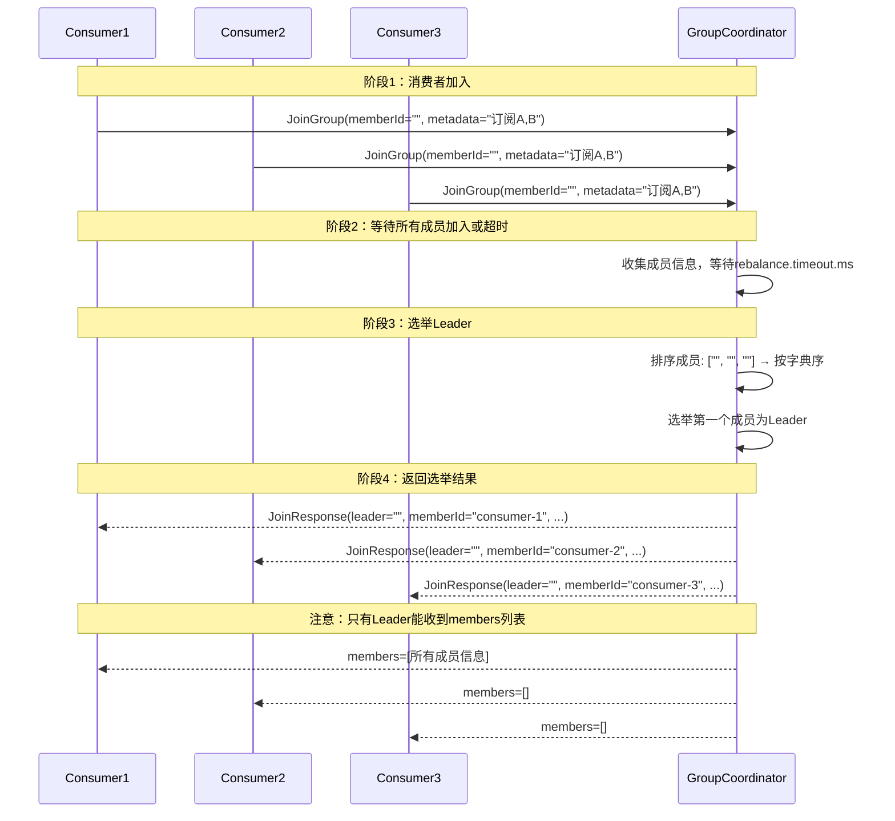
```mermaid
sequenceDiagram
    participant C1 as Consumer1
    participant C2 as Consumer2  
    participant C3 as Consumer3
    participant GC as GroupCoordinator

    Note over C1,GC: 阶段1：消费者加入
    C1->>GC: JoinGroup(memberId="", metadata="订阅A,B")
    C2->>GC: JoinGroup(memberId="", metadata="订阅A,B")
    C3->>GC: JoinGroup(memberId="", metadata="订阅A,B")
    
    Note over C1,GC: 阶段2：等待所有成员加入或超时
    GC->>GC: 收集成员信息，等待rebalance.timeout.ms
    
    Note over C1,GC: 阶段3：选举Leader
    GC->>GC: 排序成员: ["", "", ""] → 按字典序
    GC->>GC: 选举第一个成员为Leader
    
    Note over C1,GC: 阶段4：返回选举结果
    GC-->>C1: JoinResponse(leader="", memberId="consumer-1", ...)
    GC-->>C2: JoinResponse(leader="", memberId="consumer-2", ...)  
    GC-->>C3: JoinResponse(leader="", memberId="consumer-3", ...)
    
    Note over C1,GC: 注意：只有Leader能收到members列表
    GC-->>C1: members=[所有成员信息]
    GC-->>C2: members=[]
    GC-->>C3: members=[]
```
#### 被选举的Leader是什么

##### Leader的身份定义

```java
// Leader消费者的角色定义
class LeaderConsumer {
    /*
    Leader是什么：
    1. 身份：消费者组中的一个普通消费者实例
    2. 角色：临时被选举为协调者
    3. 任期：当前generation有效期内
    4. 职责：执行分区分配计算
    
    Leader不是什么：
    - 不是GroupCoordinator（服务端组件）
    - 不是永久角色（每次重平衡可能变化）
    - 不是特权消费者（消费权利与其他成员相同）
    */
    
    // Leader的关键属性
    private String memberId;          // 消费者成员ID
    private String clientId;          // 客户端ID
    private List<String> subscription; // 订阅的主题
    private PartitionAssignor assignor; // 分配策略实现
}
```
##### 新旧Leader对比
| 特性         | GroupCoordinator (服务端) | Leader消费者 (客户端)    |
| :----------- | :------------------------ | :----------------------- |
| **位置**     | Kafka Broker内部          | 消费者应用JVM内          |
| **数量**     | 每个组一个                | 每个组一个（临时）       |
| **持久性**   | 永久存在                  | 临时角色，重平衡可能变化 |
| **主要职责** | 协调管理                  | 计算分配                 |
| **选举方式** | 分区Leader决定            | 成员排序选举             |
| **故障影响** | 整个组不可用              | 触发重平衡，选举新Leader |

##### Leader的识别特征

```java
// 消费者如何知道自己是Leader
class ConsumerCoordinator {
    
    private boolean isLeader = false;
    
    void onJoinComplete(int generation, String memberId, 
                       String leaderId, String protocol) {
        // 检查自己是否被选为Leader
        this.isLeader = memberId.equals(leaderId);
        
        if (isLeader) {
            log.info("I am elected as leader for generation {}", generation);
            // Leader特有的初始化
            initializeAsLeader();
        } else {
            log.info("Member {} is leader for generation {}", leaderId, generation);
        }
    }
    
    // Leader特有的任务
    private void initializeAsLeader() {
        // 1. 准备执行分区分配
        // 2. 可能需要加载额外数据
        // 3. 设置回调处理
    }
}
```

#### Leader的核心职责

##### 主要任务：分区分配计算
```java
// Leader执行分区分配的完整流程
class LeaderAssignmentProcess {
    
    Map<String, Assignment> performAssignment(
        Cluster cluster,
        Map<String, Subscription> allSubscriptions) {
        
        // 步骤1：收集所有成员信息（只有Leader能收到）
        Map<String, Subscription> members = allSubscriptions;
        
        // 步骤2：运行分配算法
        PartitionAssignor assignor = getAssignor();
        Map<String, Assignment> assignments = 
            assignor.assign(cluster, members);
        
        // 步骤3：验证分配结果
        validateAssignment(assignments, cluster);
        
        // 步骤4：准备返回给GroupCoordinator
        return assignments;
    }
    
    // 分配结果的结构
    class Assignment {
        private List<TopicPartition> partitions; // 分配的分区
        private byte[] userData;                 // 用户自定义数据
        
        // 示例：消费者A分配到 [topic-0, topic-1]
        //       消费者B分配到 [topic-2, topic-3]
    }
}
```

##### 分配策略执行

```java
// Leader支持的各种分配策略
class PartitionAssignmentStrategies {
    
    // 1. RangeAssignor（默认策略）
    class RangeAssignor implements PartitionAssignor {
        public Map<String, Assignment> assign(Cluster cluster, 
                                             Map<String, Subscription> subscriptions) {
            // 按主题范围分配
            // 例如：分区[0-9]，3个消费者
            // C1: [0-2], C2: [3-5], C3: [6-9]
        }
    }
    
    // 2. RoundRobinAssignor
    class RoundRobinAssignor implements PartitionAssignor {
        public Map<String, Assignment> assign(Cluster cluster,
                                             Map<String, Subscription> subscriptions) {
            // 轮询分配
            // 例如：分区[0-9]，3个消费者  
            // C1: [0,3,6,9], C2: [1,4,7], C3: [2,5,8]
        }
    }
    
    // 3. StickyAssignor
    class StickyAssignor implements PartitionAssignor {
        public Map<String, Assignment> assign(Cluster cluster,
                                             Map<String, Subscription> subscriptions) {
            // 粘性分配，尽量减少分区移动
            // 重平衡时尽量保持原有分配
        }
    }
}
```
##### SyncGroup请求中的Leader角色

```java
// Leader通过SyncGroup发送分配结果
class LeaderSyncGroupProcess {
    
    void sendSyncGroupAsLeader(Map<String, Assignment> assignments) {
        // 1. 序列化分配结果
        Map<String, byte[]> assignmentBytes = new HashMap<>();
        for (Map.Entry<String, Assignment> entry : assignments.entrySet()) {
            byte[] data = entry.getValue().serialize();
            assignmentBytes.put(entry.getKey(), data);
        }
        
        // 2. 构建SyncGroupRequest
        SyncGroupRequest.Builder requestBuilder = new SyncGroupRequest.Builder(
            groupId,
            generationId,
            memberId,
            assignmentBytes  // 关键：只有Leader需要提供
        );
        
        // 3. 发送到GroupCoordinator
        client.send(coordinator, requestBuilder);
        
        // 4. GroupCoordinator将分配结果分发给所有成员
    }
}
```

**过程**

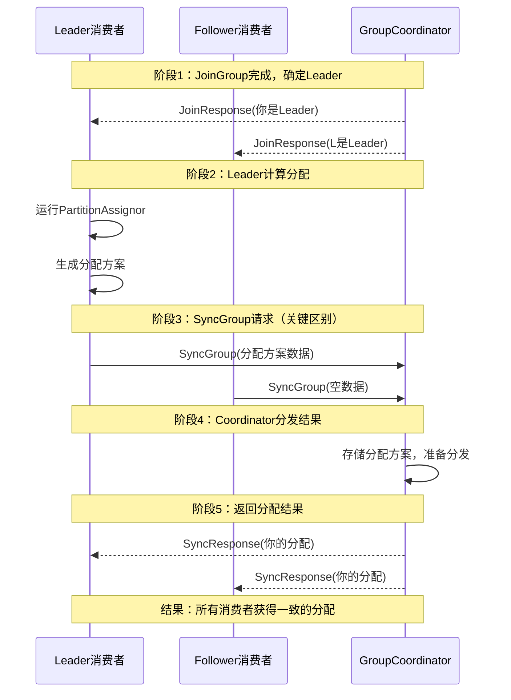
```mermaid
sequenceDiagram
    participant L as Leader消费者
    participant F as Follower消费者
    participant GC as GroupCoordinator

    Note over L,GC: 阶段1：JoinGroup完成，确定Leader
    GC-->>L: JoinResponse(你是Leader)
    GC-->>F: JoinResponse(L是Leader)
    
    Note over L,GC: 阶段2：Leader计算分配
    L->>L: 运行PartitionAssignor
    L->>L: 生成分配方案
    
    Note over L,GC: 阶段3：SyncGroup请求（关键区别）
    L->>GC: SyncGroup(分配方案数据)
    F->>GC: SyncGroup(空数据)
    
    Note over L,GC: 阶段4：Coordinator分发结果
    GC->>GC: 存储分配方案，准备分发
    
    Note over L,GC: 阶段5：返回分配结果
    GC-->>L: SyncResponse(你的分配)
    GC-->>F: SyncResponse(你的分配)
    
    Note over L,GC: 结果：所有消费者获得一致的分配
```
#### 选举算法的详细分析
##### 选举的确定性保证

```java
// 确保选举结果一致的算法细节
class DeterministicElection {
    
    void ensureDeterministicElection() {
        // 关键：输入相同 → 输出相同
        
        // 1. 成员收集阶段
        List<MemberMetadata> members = collectAllMembers();
        
        // 2. 排序规则（必须严格一致）：
        //    a. 首先按 memberId 排序（字典序）
        //    b. 如果 memberId 相同（罕见情况），按加入时间戳排序
        
        Collections.sort(members, new Comparator<MemberMetadata>() {
            @Override
            public int compare(MemberMetadata m1, MemberMetadata m2) {
                int idCompare = m1.memberId.compareTo(m2.memberId);
                if (idCompare != 0) {
                    return idCompare;
                }
                // memberId相同的情况（如重连）
                return Long.compare(m1.joinTime, m2.joinTime);
            }
        });
        
        // 3. 选择第一个作为Leader
        MemberMetadata leader = members.get(0);
        
        // 为什么这样能保证一致性？
        // - 所有消费者看到的成员列表相同（来自Coordinator）
        // - 排序算法确定且一致
        // - 因此选举结果必然一致
    }
}
```

##### 成员ID的生成规则

```java
// 成员ID的生成算法
class MemberIdGeneration {
    
    String generateMemberId(String clientId) {
        // Kafka 中的成员ID生成规则：
        
        // 1. 首次加入组时：memberId = ""
        //    GroupCoordinator会分配新ID
        
        // 2. 重新加入时：使用上次分配的memberId
        
        // 成员ID格式：
        // "${clientId}-${uuid}"
        // 例如："consumer-app-1-a3b4c5d6-e7f8-9a0b-c1d2-e3f4a5b6c7d8"
        
        // 为什么需要唯一ID？
        // - 标识消费者实例
        // - 支持静态成员（避免重平衡）
        // - 故障恢复时识别
    }
}
```

##### 静态成员（Static Membership）
```java
// Kafka 2.3+ 引入的静态成员特性
class StaticMembership {
    /*
    问题：传统模式下，消费者重启会获得新memberId
          导致不必要的重平衡
    
    解决方案：静态成员
    - 消费者配置 group.instance.id
    - 重启时使用相同的成员ID
    - 避免不必要的重平衡
    */
    
    void configureStaticMember() {
        Properties props = new Properties();
        props.put("group.instance.id", "consumer-1"); // 静态ID
        
        // 优势：
        // 1. 减少不必要的重平衡
        // 2. Leader更稳定
        // 3. 会话超时不影响成员资格
        
        // 注意：需要Kafka 2.3+ 和 GroupCoordinator支持
    }
}
```
#### Leader的故障处理
##### Leader失败场景

```java
// Leader消费者故障的处理
class LeaderFailureHandling {
    
    void handleLeaderFailure() {
        // 场景：Leader消费者崩溃或网络断开
        
        // 检测机制：
        // 1. 心跳超时（session.timeout.ms）
        // 2. poll间隔超时（max.poll.interval.ms）
        
        // 处理流程：
        // 1. GroupCoordinator检测到Leader心跳失败
        // 2. 标记该成员为失效
        // 3. 触发重平衡（重新加入组）
        // 4. 选举新的Leader
        // 5. 新Leader重新计算分配
        
        // 关键点：分配信息已持久化，不会丢失
    }
    
    // 快速恢复优化（Kafka 2.4+ 增量重平衡）
    void incrementalRebalance() {
        // 传统重平衡：所有消费者停止消费
        // 增量重平衡：只有受影响的分区重新分配
        
        // 配置：
        props.put("partition.assignment.strategy",
                 "org.apache.kafka.clients.consumer.CooperativeStickyAssignor");
    }
}
```

##### 脑裂（Split-brain）防护
```java
// 防止脑裂的机制
class SplitBrainPrevention {
    
    void preventSplitBrain() {
        // 脑裂场景：网络分区导致多个"Leader"
        
        // Kafka的防护机制：
        // 1. Generation ID（代次ID）
        //    - 每次重平衡递增
        //    - 旧的generation请求会被拒绝
        
        // 2. 唯一Coordinator
        //    - 只有一个GroupCoordinator管理组
        //    - 通过__consumer_offsets分区保证
        
        // 3. 成员ID唯一性
        //    - 每个成员有唯一ID
        //    - 冲突时拒绝请求
        
        // 4. 同步屏障
        //    - SyncGroup阶段需要所有成员参与
        //    - 确保分配结果一致传播
    }
}
```
#### **核心结论**

**1. 为什么需要选举Leader？**

- 分布式协调需求：需要确定一个消费者来执行分区分配计算
- 降低Coordinator负载：计算工作分摊到消费者端
- 灵活性：支持多种分配策略，业务可定制
- 一致性保证：确保所有消费者获得相同的分配结果

**2. 选举的Leader是什么？**

- 身份：消费者组中的一个普通消费者实例
- 角色：临时协调者，负责执行分区分配计算
- 任期：当前generation有效期内
- 特权：只有Leader能收到完整成员列表并计算分配

#### **关键机制**

1. **确定性选举**：基于成员ID排序，确保结果一致
2. **角色分离**：GroupCoordinator协调，Leader计算
3. **结果传播**：通过SyncGroup协议确保分配一致
4. **故障恢复**：Leader失效自动触发重平衡和新选举
5. **性能优化**：增量重平衡、静态成员等机制

### kafka应用场景

对于一些常规的消息系统,kafka是个不错的选择;**partitons/replication和容错**,可以使kafka具有良好的扩展性和性能优势,

kafka只能使用作为"常规"的消息系统,在一定程度上,尚未确保消息的发送与接收绝对可靠(⽐如,消息重发,消息发送丢失等)

kafka的特性决定它非常适合作为"日志收集中心";

application可以将操作日志"批量""异步"的发送到kafka集群中,而不是保存在本地或者DB中;

kafka可以批量提交消息/压缩消息等,这对producer端而言,几乎感觉不到性能的开支.
