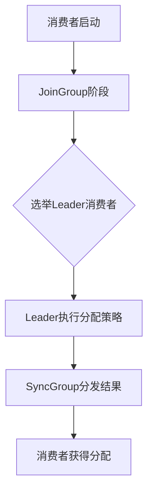
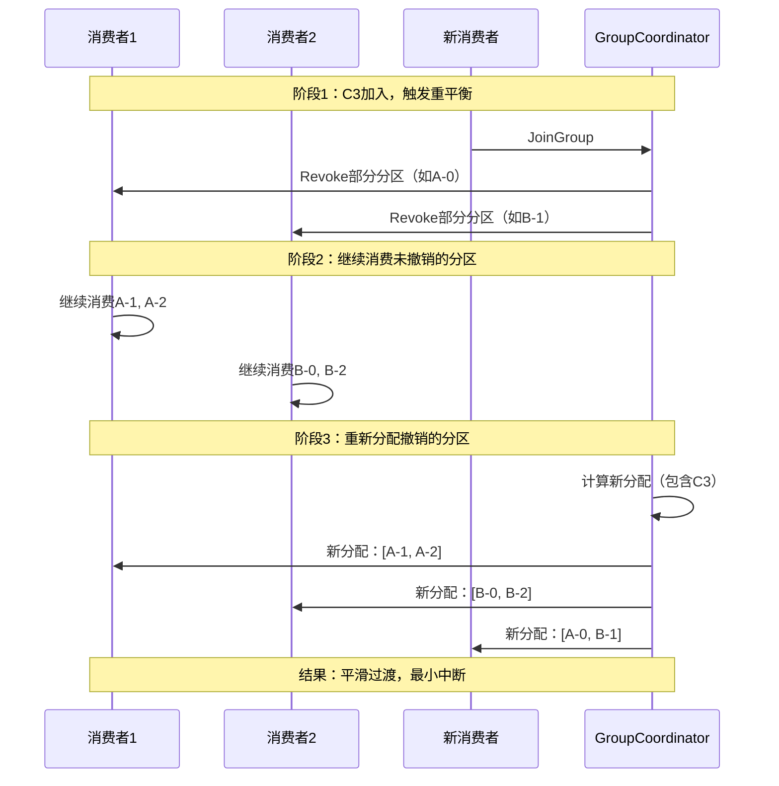
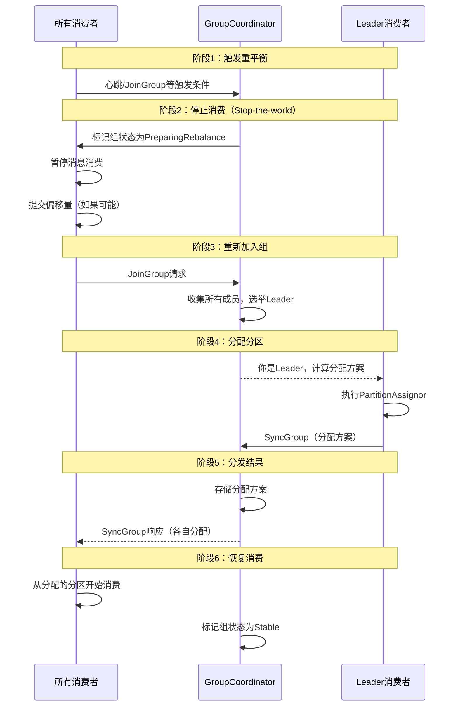
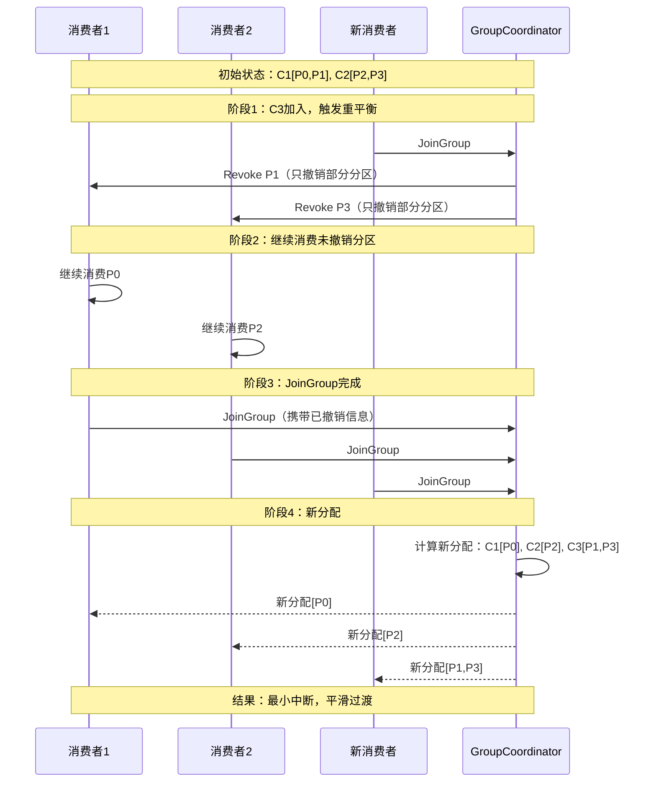
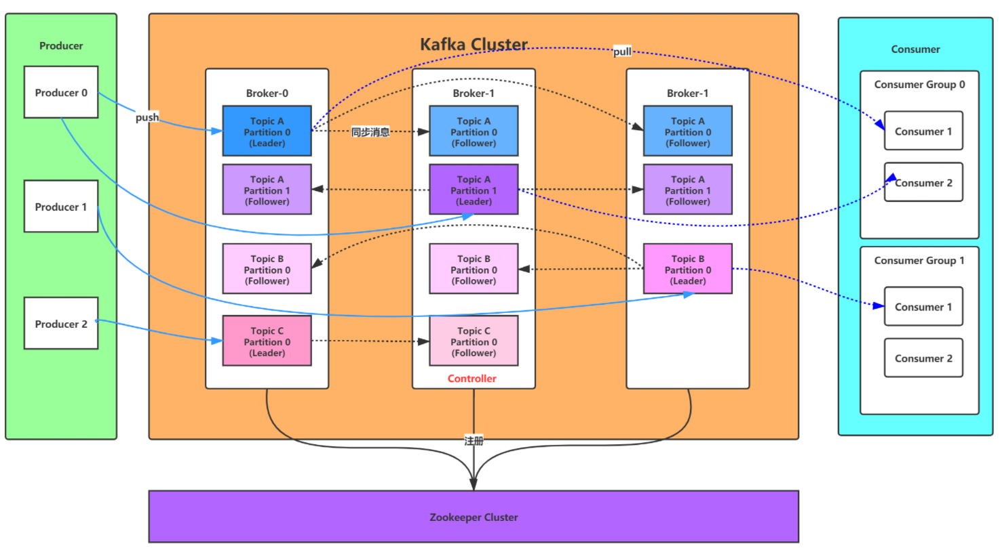
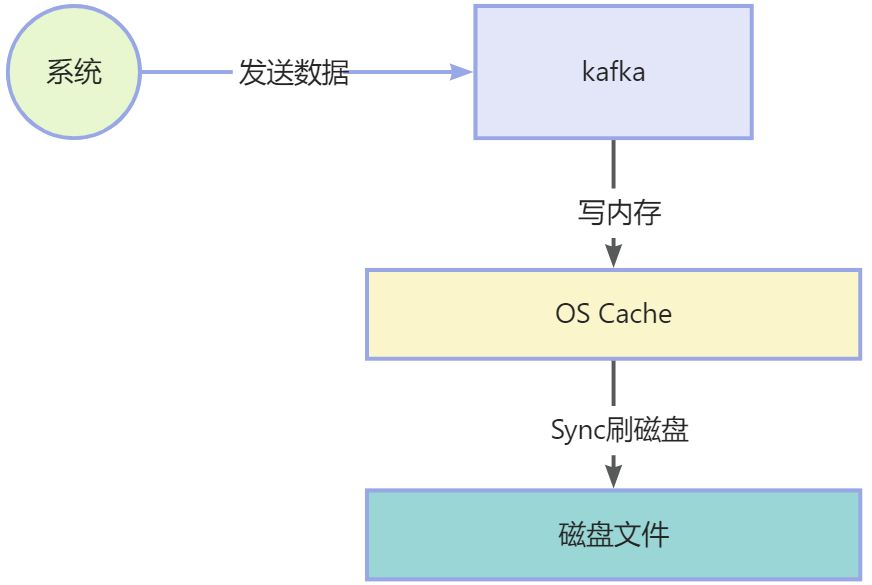
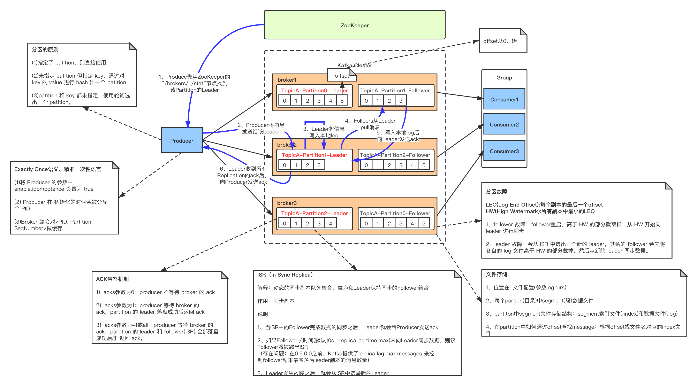
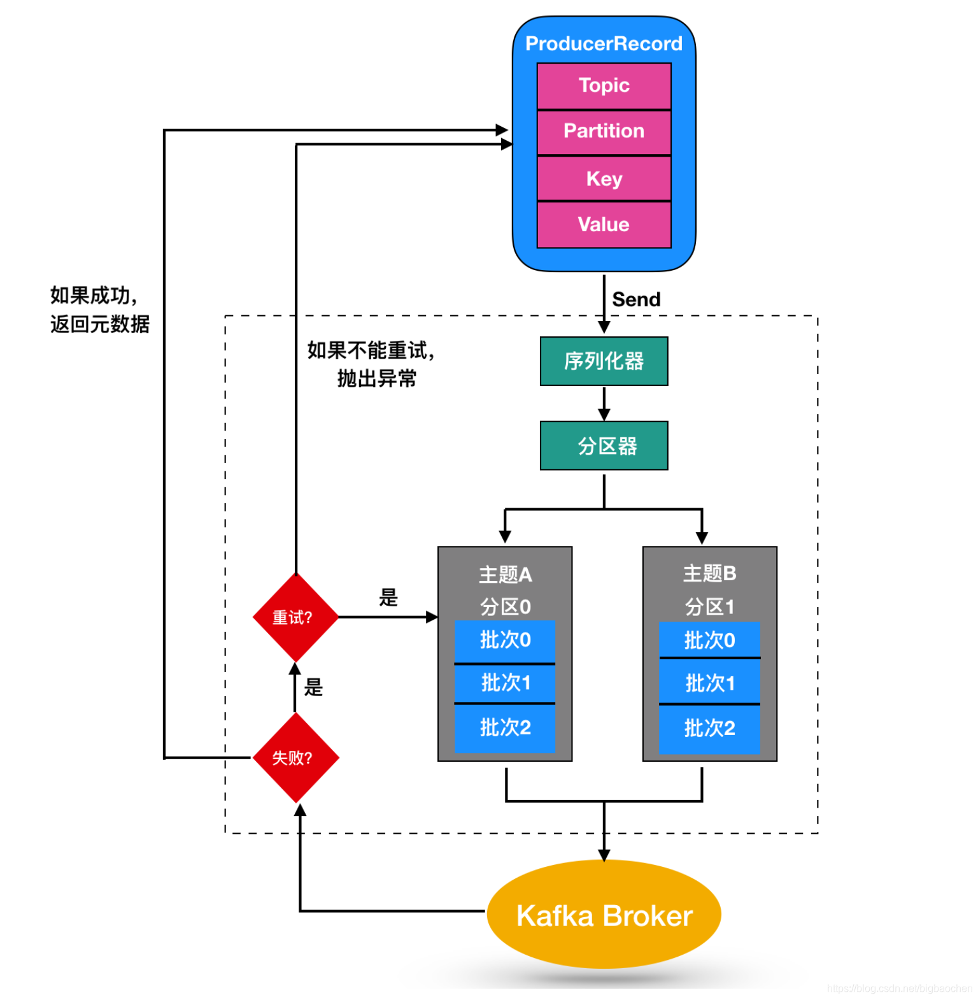

### kafka消费者分区策略

#### kafka分区策略接口定义

```java
// 分区分配策略的接口定义
public interface PartitionAssignor {
    String name();  // 策略名称
    Subscription subscription(Set<String> topics); // 消费者订阅信息
    Map<String, Assignment> assign(Cluster metadata, 
                                   Map<String, Subscription> subscriptions);
}
```
在消费者组中选择一个身份魏leader的主消费者，负责分区的分配策略计算;


#### kafka分区策略工作流程



#### RangeAssignor（范围分配器）- 默认策略

##### 算法原理

```java
public class RangeAssignor extends AbstractPartitionAssignor {
    
    @Override
    public Map<String, List<TopicPartition>> assign(
            Map<String, Integer> partitionsPerTopic,
            Map<String, Subscription> subscriptions) {
        
        Map<String, List<TopicPartition>> assignment = new HashMap<>();
        
        // 对每个主题独立分配
        for (Map.Entry<String, Integer> entry : partitionsPerTopic.entrySet()) {
            String topic = entry.getKey();
            int numPartitions = entry.getValue();
            
            // 获取订阅该主题的消费者
            List<String> subscribers = getSubscribersForTopic(topic, subscriptions);
            Collections.sort(subscribers); // 按consumerId排序
            
            int numSubscribers = subscribers.size();
            int partitionsPerConsumer = numPartitions / numSubscribers;
            int consumersWithExtraPartition = numPartitions % numSubscribers;
            
            // 分配逻辑
            List<TopicPartition> partitions = partitions(topic, numPartitions);
            for (int i = 0; i < numSubscribers; i++) {
                int start = partitionsPerConsumer * i + 
                           Math.min(i, consumersWithExtraPartition);
                int length = partitionsPerConsumer + 
                           (i + 1 > consumersWithExtraPartition ? 0 : 1);
                
                assignment.get(subscribers.get(i))
                    .addAll(partitions.subList(start, start + length));
            }
        }
        
        return assignment;
    }
}
```

##### 分配实现
```java
// 示例：主题A有7个分区，3个消费者
// 分配结果：
Consumer1: [A-0, A-1, A-2]  // 7/3=2余1，前1个消费者多1个分区
Consumer2: [A-3, A-4]
Consumer3: [A-5, A-6]

// 计算公式：
// partitionsPerConsumer = 7 / 3 = 2
// consumersWithExtraPartition = 7 % 3 = 1
// Consumer1: start=0, length=2+1=3 → [0,1,2]
// Consumer2: start=3, length=2 → [3,4]  
// Consumer3: start=5, length=2 → [5,6]
```

##### 优缺点分析

**优点**： 
1. 实现简单，计算效率高
2. 同一主题的分区连续，适合顺序处理

**缺点**：
1. 容易产生分配不均（"头部重尾轻"问题）
2. 主题数量多时，消费者间负载差异明显
3. 消费者数量变化时，分配变动大

**适用场景**：
- 主题数量少
- 分区数能被消费者数整除
- 需要分区连续性的场景

#### RoundRobinAssignor（轮询分配器）

##### 算法实现原理

```java
public class RoundRobinAssignor extends AbstractPartitionAssignor {
    
    @Override
    public Map<String, List<TopicPartition>> assign(
            Map<String, Integer> partitionsPerTopic,
            Map<String, Subscription> subscriptions) {
        
        // 1. 将所有主题的分区合并排序
        List<TopicPartition> allPartitions = new ArrayList<>();
        for (Map.Entry<String, Integer> entry : partitionsPerTopic.entrySet()) {
            String topic = entry.getKey();
            for (int i = 0; i < entry.getValue(); i++) {
                allPartitions.add(new TopicPartition(topic, i));
            }
        }
        
        // 2. 消费者按ID排序
        List<String> consumers = new ArrayList<>(subscriptions.keySet());
        Collections.sort(consumers);
        
        // 3. 轮询分配
        Map<String, List<TopicPartition>> assignment = new HashMap<>();
        for (int i = 0; i < allPartitions.size(); i++) {
            String consumer = consumers.get(i % consumers.size());
            assignment.computeIfAbsent(consumer, k -> new ArrayList<>())
                .add(allPartitions.get(i));
        }
        
        return assignment;
    }
}
```

##### 分配案例

```java
// 示例：2个主题，共6个分区，3个消费者
// 主题A: [A-0, A-1, A-2]
// 主题B: [B-0, B-1, B-2]

// 所有分区排序：A-0, A-1, A-2, B-0, B-1, B-2
// 轮询分配：
Consumer1: [A-0, B-0]
Consumer2: [A-1, B-1]  
Consumer3: [A-2, B-2]

// 完美均衡！
```

##### 关键限制与问题

```java
class RoundRobinLimitations {
    /*
    重要前提：所有消费者订阅相同的主题列表！
    
    问题场景：消费者订阅不同主题
    消费者1订阅: [A, B]
    消费者2订阅: [A]  // 只订阅A
    
    分配结果可能不均衡，因为轮询基于所有主题的分区
    */
    
    // 改进版本：考虑订阅差异
    @Override
    protected boolean isSupportedProtocol(Subscription subscription) {
        // 需要检查所有消费者是否订阅相同主题
        return true;
    }
}
```

#### 优缺点分析
**优点**：
1. 分配绝对均衡（订阅相同时）
2. 实现简单
3. 跨主题负载均衡

**缺点**：
1. 要求所有消费者订阅相同主题（严格限制）
2. 消费者订阅不同时，分配不均
3. 重平衡时分区移动可能较多

**适用场景**：
- 所有消费者订阅相同的主题集合
- 需要严格负载均衡
- 主题数量多但分区数少

#### StickyAssignor（粘性分配器）

##### 设计目标

设计目标（按优先级）：
1. 分配尽可能均衡
2. 重平衡时最小化分区移动（粘性）
3. 支持消费者订阅差异

解决的问题：
1. RangeAssignor的头部重尾轻问题
2. RoundRobinAssignor的订阅限制问题  
3. 频繁重平衡导致的分区抖动问题

##### 算法实现原理

```java
public class StickyAssignor extends AbstractPartitionAssignor {
    
    // 核心算法：两步分配
    @Override
    public Map<String, List<TopicPartition>> assign(
            Map<String, Integer> partitionsPerTopic,
            Map<String, Subscription> subscriptions) {
        
        // 步骤1：执行初始分配（使用RoundRobin）
        Map<String, List<TopicPartition>> initialAssignment = 
            performInitialAssignment(partitionsPerTopic, subscriptions);
        
        // 步骤2：优化分配，减少移动
        Map<String, List<TopicPartition>> optimizedAssignment = 
            optimizeAssignment(initialAssignment, 
                             getPreviousAssignment(subscriptions));
        
        return optimizedAssignment;
    }
    
    // 优化算法：最小化分区移动
    private Map<String, List<TopicPartition>> optimizeAssignment(
            Map<String, List<TopicPartition>> current,
            Map<String, List<TopicPartition>> previous) {
        
        // 1. 计算每个消费者的目标分区数（均衡）
        int totalPartitions = current.values().stream()
            .mapToInt(List::size).sum();
        int targetPerConsumer = totalPartitions / current.size();
        
        // 2. 对于超额消费者，尝试将分区转移给不足的消费者
        // 优先转移那些在previous中不属于当前消费者的分区
        
        // 3. 使用启发式算法，最小化移动成本
        return applyMinimalMovement(current, previous, targetPerConsumer);
    }
}
```

##### 粘性分配示例
```java
// 场景：重平衡前后对比
// 初始状态（消费者C3故障）：
Consumer1: [A-0, A-1, B-0]
Consumer2: [A-2, B-1, B-2]

// C3恢复后，传统RoundRobin可能分配：
Consumer1: [A-0, B-1]
Consumer2: [A-1, B-2]  
Consumer3: [A-2, B-0]
// 所有分区都移动了！

// StickyAssignor分配（保持粘性）：
Consumer1: [A-0, B-0]      // 保留A-0, B-0
Consumer2: [A-2, B-2]      // 保留A-2, B-2  
Consumer3: [A-1, B-1]      // 只移动A-1, B-1
// 最小化移动，保留原有分配
```

##### 优缺点分析
**优点**：
1. 分配均衡性好
2. 重平衡时分区移动最小（粘性特性）
3. 支持消费者订阅差异
4. 减少重平衡开销

**缺点**：
1. 算法复杂，计算成本较高
2. 可能不是最优解（启发式算法）
3. 需要维护历史分配状态

**适用场景**：
- 频繁重平衡的环境
- 消费者订阅主题不同的情况
- 需要最小化分区移动的敏感应用
- 消费者动态变化的场景

#### CooperativeStickyAssignor（协同粘性分配器）
> Kafka 2.4+ 新特性

##### 设计目标
关键改进：增量重平衡（Incremental Rebalance）

**传统重平衡问题**：
1. Stop-the-world：所有消费者停止消费
2. 重新分配所有分区
3. 高延迟，影响可用性

**增量重平衡优势**：
1. 只有受影响的分区重新分配
2. 其他分区继续消费
3. 多阶段完成，减少暂停时间

##### 增量重平衡流程



##### 配置与使用

```java
// 启用协同粘性分配器
Properties props = new Properties();
props.put("partition.assignment.strategy", 
         "org.apache.kafka.clients.consumer.CooperativeStickyAssignor");

// 必须配置（消费者端）
props.put("max.poll.interval.ms", "300000");  // 适当延长
props.put("heartbeat.interval.ms", "3000");
props.put("session.timeout.ms", "45000");

// Broker端需要Kafka 2.4+
// 检查版本兼容性
```

#### 使用场景指南

```java
class StrategySelectionGuide {
    
    String selectStrategy(ConsumerScenario scenario) {
        switch (scenario) {
            case SIMPLE_SAME_TOPICS:
                // 所有消费者订阅相同主题
                // 要求严格均衡
                return "RoundRobinAssignor";
                
            case MIXED_SUBSCRIPTIONS:
                // 消费者订阅不同主题
                return "StickyAssignor";
                
            case FREQUENT_REBALANCE:
                // 频繁重平衡环境（如云环境）
                // 需要最小化分区移动
                return "CooperativeStickyAssignor";
                
            case LEGACY_SYSTEM:
                // 旧系统，Kafka版本低
                // 需要简单稳定
                return "RangeAssignor";
                
            case ORDER_PROCESSING:
                // 需要分区顺序处理
                // 例如：按用户ID分区，相同用户消息顺序处理
                return "RangeAssignor";
                
            case HIGH_AVAILABILITY:
                // 高可用要求，最小化重平衡影响
                // Kafka 2.4+
                return "CooperativeStickyAssignor";
                
            default:
                return "CooperativeStickyAssignor"; // 现代默认选择
        }
    }
}
```
#### 自定义分区策略
业务场景需求：
1. 基于地理位置分配（就近消费）
2. 基于硬件能力分配（高性能机器多消费）
3. 基于业务优先级分配（重要业务专用消费者）
4. 基于数据热点分配（热点数据分散）
5. 混合分配策略（结合多种算法）
```java
public class WeightedAssignor implements PartitionAssignor {
    
    @Override
    public String name() {
        return "weighted";
    }
    
    @Override
    public Subscription subscription(Set<String> topics) {
        // 在订阅信息中包含权重
        ByteBuffer userData = ByteBuffer.allocate(4);
        userData.putInt(getConsumerWeight()); // 权重值
        userData.flip();
        
        return new Subscription(new ArrayList<>(topics), userData);
    }
    
    @Override
    public Map<String, Assignment> assign(Cluster cluster,
                                         Map<String, Subscription> subscriptions) {
        
        // 1. 解析消费者权重
        Map<String, Integer> weights = new HashMap<>();
        int totalWeight = 0;
        
        for (Map.Entry<String, Subscription> entry : subscriptions.entrySet()) {
            int weight = parseWeight(entry.getValue().userData());
            weights.put(entry.getKey(), weight);
            totalWeight += weight;
        }
        
        // 2. 按权重分配分区
        Map<String, List<TopicPartition>> assignment = new HashMap<>();
        
        for (TopicPartition partition : allPartitions(cluster)) {
            // 选择权重比例合适的消费者
            String selectedConsumer = selectConsumerByWeight(partition, weights, totalWeight);
            assignment.computeIfAbsent(selectedConsumer, k -> new ArrayList<>())
                .add(partition);
        }
        
        return toAssignmentMap(assignment);
    }
    
    private int getConsumerWeight() {
        // 根据硬件配置决定权重
        int cores = Runtime.getRuntime().availableProcessors();
        long memory = Runtime.getRuntime().maxMemory() / 1024 / 1024; // MB
        
        // 简单权重计算：CPU核心数 + 内存(GB)
        return cores + (int)(memory / 1024);
    }
}
```

##### 配置自定义策略
```java
// 使用自定义分配策略
Properties props = new Properties();
props.put("partition.assignment.strategy", 
         "com.company.WeightedAssignor,org.apache.kafka.clients.consumer.WeightedAssignor");
// 可以配置多个，按优先级回退

// 配置消费者权重信息
props.put("consumer.weight", "10"); // 自定义配置

// 确保所有消费者使用相同的策略列表！
// 否则会导致分配失败
```
#### 故障排查指南

##### 常见问题1：分配不均衡

症状：
- 某些消费者负载高，某些空闲
- 消费延迟不均

可能原因：
1. RangeAssignor的头部重问题
2. 消费者订阅主题不同（RoundRobin）
3. 分区数不能被消费者数整除

解决方案：
1. 切换到StickyAssignor
2. 调整分区数（如设为消费者数的倍数）
3. 使用自定义权重策略

##### 常见问题2：频繁重平衡

症状：
- 频繁的stop-the-world
- 消费暂停频繁

可能原因：
1. 会话超时设置过短
2. 处理时间超过max.poll.interval.ms
3. 网络不稳定

解决方案：
1. 使用CooperativeStickyAssignor（增量重平衡）
2. 增加session.timeout.ms和max.poll.interval.ms
3. 优化处理逻辑，减少单次处理时间
4. 使用静态成员（group.instance.id）

##### 常见问题3：分配策略冲突

症状：
- 消费者无法加入组
- 分配失败错误

可能原因：
1. 消费者使用不同的分配策略
2. 自定义策略版本不一致
3. 策略配置错误

解决方案：
1. 确保所有消费者配置相同的策略列表
2. 检查策略类的类路径一致性
3. 使用标准策略作为回退
4. 验证策略实现的正确性

#### 总和分析对比

| 特性           | RangeAssignor  | RoundRobinAssignor | StickyAssignor | CooperativeStickyAssignor |
| :------------- | :------------- | :----------------- | :------------- | :------------------------ |
| **默认策略**   | ✅ Kafka ≤ 2.3  | ❌                  | ❌              | ✅ Kafka 2.4+              |
| **分配均衡性** | 一般（头部重） | 优秀（订阅相同时） | 优秀           | 优秀                      |
| **分区连续性** | ✅ 保持连续     | ❌ 打散分布         | ❌ 可能打散     | ❌ 可能打散                |
| **订阅灵活性** | ✅ 支持不同订阅 | ❌ 要求相同订阅     | ✅ 支持不同订阅 | ✅ 支持不同订阅            |
| **重平衡开销** | 大（全部移动） | 大（全部移动）     | 小（最小移动） | 最小（增量）              |
| **计算复杂度** | 低             | 低                 | 高             | 高                        |
| **Kafka版本**  | 所有版本       | 所有版本           | 0.11+          | 2.4+                      |


**如何选择合适的分区策略**

| 决策因素               | 推荐策略                  | 理由                     |
| :--------------------- | :------------------------ | :----------------------- |
| **追求最小重平衡影响** | CooperativeStickyAssignor | 增量重平衡，暂停时间最短 |
| **消费者订阅不同主题** | StickyAssignor            | 支持混合订阅，保持均衡   |
| **Kafka版本 < 2.4**    | StickyAssignor            | 功能丰富，兼容性好       |
| **需要严格顺序处理**   | RangeAssignor             | 保持分区连续性           |
| **所有消费者订阅相同** | RoundRobinAssignor        | 分配最均衡               |
| **特殊业务需求**       | 自定义策略                | 灵活满足特定需求         |

### Kafka重平衡（Rebalance）原理
#### 什么是Kafka重平衡（Rebalance）

重平衡是Kafka消费者组的核心机制;

定义：**当消费者组成员发生变化时，Kafka重新分配分区给各个消费者的过程**;

本质：分布式系统中的动态负载均衡机制;

目的：确保每个分区有且只有一个消费者在消费

触发：消费者组的成员变化

#### 为什么要做重平衡（Rebalance）
根本原因：保证Kafka消费语义的核心约束"每个分区在任何时刻只能被同一个消费者组中的一个消费者消费";

具体原因分析：
1. 避免重复消费（正确性）
   没有重平衡 → 多个消费者可能消费同一分区 → 消息重复

2. 避免消息丢失（完整性）
   消费者故障时，其分区无人消费 → 消息积压

3. 负载均衡（公平性）
   消费者能力不同或分区负载不均 → 需要重新分配

4. 动态伸缩（弹性）
   业务变化需要增减消费者 → 系统需要自适应

5. 故障恢复（可用性）
   消费者故障 → 需要将分区重新分配给健康消费者

#### 触发重平衡的场景
1. 消费者加入或离开 
   - 加入：新消费者启动，扩容
   - 离开：消费者关闭，缩容，故障
2. 消费者配置变化
   - 订阅主题变化
   - 分配策略变化
   - 会话超时配置变化
3. 主题分区变化
   - 分区数增加或减少
   - 主题被删除或创建
4. 心跳超时
   - session.timeout.ms内未收到心跳
   - 可能：消费者卡住、GC停顿、网络问题,消费者Full GC导致心跳超时;
5. Poll间隔超时
   - max.poll.interval.ms内未调用poll()
   - 可能：消息处理时间过长,单条消息处理耗时超过5分钟;

> 如果没有重平衡，可能会发生某一个分区消息没有消费者消费导致消息丢失;

#### 重平衡的完整流程
##### 传统重平衡流程（Eager Rebalance）


**步骤1：检测与触发**

```java
class RebalanceDetection {
    
    // GroupCoordinator检测重平衡条件
    class GroupCoordinator {
        void checkRebalanceConditions() {
            // 检测逻辑
            if (newConsumerJoined()) {
                triggerRebalance("新消费者加入");
            }
            
            if (consumerTimedOut(memberId)) {
                triggerRebalance("消费者心跳超时");
            }
            
            if (subscriptionChanged()) {
                triggerRebalance("订阅变化");
            }
            
            if (metadataChanged()) {
                triggerRebalance("元数据变化");
            }
        }
        
        void triggerRebalance(String reason) {
            log.info("触发重平衡，原因: {}", reason);
            
            // 1. 增加generationId（防止脑裂）
            group.generationId++;
            
            // 2. 标记组状态
            group.transitionTo(GroupState.PREPARING_REBALANCE);
            
            // 3. 通知所有消费者
            notifyConsumersForRebalance();
        }
    }
}
```
**步骤2：消费者暂停与准备**
```java
class ConsumerPreparation {
    
    // 消费者收到重平衡通知后的处理
    class ConsumerCoordinator {
        void onRebalanceTriggered() {
            // 1. 调用重平衡监听器的onPartitionsRevoked
            if (rebalanceListener != null) {
                rebalanceListener.onPartitionsRevoked(assignedPartitions);
            }
            
            // 2. 提交偏移量（如果启用）
            if (autoCommitEnabled) {
                commitOffsetsSync();
            }
            
            // 3. 停止消费当前分区
            fetcher.pause(); // 暂停拉取
            clearBufferedRecords(); // 清空缓冲
            
            // 4. 重置分配状态
            subscriptions.unsubscribe();
            
            // 5. 重新加入组
            needRejoin = true;
        }
    }
}
```
**步骤3：JoinGroup阶段**

```java
class JoinGroupPhase {
    
    // JoinGroup协议的详细处理
    class GroupCoordinator {
        def handleJoinGroup(request: JoinGroupRequest): JoinGroupResponse = {
            val group = getOrCreateGroup(request.groupId);
            
            // 1. 收集成员信息
            group.addMember(request.memberId, request.metadata);
            
            // 2. 等待所有成员加入（或超时）
            val timeout = group.rebalanceTimeoutMs;
            val deadline = System.currentTimeMillis() + timeout;
            
            while (!group.hasReceivedJoinFromAllMembers && 
                   System.currentTimeMillis() < deadline) {
                Thread.sleep(100);
            }
            
            // 3. 选举Leader
            val leaderId = electLeader(group);
            
            // 4. 构建响应
            return JoinGroupResponse(
                error = Errors.NONE,
                generationId = group.generationId,
                leaderId = leaderId,
                memberId = request.memberId,
                members = if (request.memberId == leaderId) 
                          group.allMembers else List.empty
            );
        }
        
        // 确定性Leader选举算法
        def electLeader(group: GroupMetadata): String = {
            // 按memberId字典序排序，选择第一个
            val sortedMembers = group.allMembers
                .sortBy(member => member.memberId);
            
            return sortedMembers.head.memberId;
        }
    }
}
```
**步骤4：SyncGroup阶段**
```java
class SyncGroupPhase {
    
    // Leader消费者的分配计算
    class LeaderConsumer {
        void performAssignment() {
            // 1. 收集所有成员订阅信息（只有Leader能收到）
            Map<String, Subscription> allSubscriptions = 
                joinResponse.members;
            
            // 2. 运行分配策略
            PartitionAssignor assignor = getAssignor();
            Map<String, Assignment> assignments = 
                assignor.assign(clusterMetadata, allSubscriptions);
            
            // 3. 序列化分配结果
            Map<String, byte[]> assignmentBytes = new HashMap<>();
            for (Map.Entry<String, Assignment> entry : assignments.entrySet()) {
                assignmentBytes.put(entry.getKey(), 
                    entry.getValue().serialize());
            }
            
            // 4. 发送给GroupCoordinator
            sendSyncGroupRequest(assignmentBytes);
        }
    }
    
    // GroupCoordinator分发分配结果
    class GroupCoordinator {
        def handleSyncGroup(request: SyncGroupRequest): SyncGroupResponse = {
            // 如果是Leader，保存分配方案
            if (request.memberId == group.leaderId) {
                group.assignment = request.groupAssignment;
            }
            
            // 返回给每个消费者其分配结果
            val memberAssignment = group.assignment
                .getOrDefault(request.memberId, Array.emptyByteArray);
            
            return SyncGroupResponse(
                error = Errors.NONE,
                assignment = memberAssignment
            );
        }
    }
}
```
**步骤5：恢复消费**
```java
class ResumeConsumption {
    
    class ConsumerCoordinator {
        void onSyncGroupComplete(byte[] assignmentData) {
            // 1. 解析分配结果
            Assignment assignment = deserializeAssignment(assignmentData);
            
            // 2. 更新订阅状态
            subscriptions.assignFromSubscribed(assignment.partitions());
            
            // 3. 查找偏移量
            for (TopicPartition partition : assignment.partitions()) {
                long offset = fetchCommittedOffset(partition);
                if (offset >= 0) {
                    consumer.seek(partition, offset);
                } else {
                    // 使用auto.offset.reset策略
                    resetToDefaultOffset(partition);
                }
            }
            
            // 4. 调用重平衡监听器的onPartitionsAssigned
            if (rebalanceListener != null) {
                rebalanceListener.onPartitionsAssigned(assignment.partitions());
            }
            
            // 5. 恢复拉取消息
            fetcher.resume();
            
            // 6. 开始心跳
            heartbeatThread.enable();
        }
    }
}
```
##### 增量重平衡流程（Cooperative Rebalance）
```java
// Kafka 2.4+ 引入的增量重平衡
class IncrementalRebalance {
    /*
    传统重平衡问题：
    1. Stop-the-world：所有消费者都停止消费
    2. 所有分区重新分配，即使大多数没变化
    3. 高延迟，影响业务连续性
    
    增量重平衡改进：
    1. 分阶段进行，减少停顿时间
    2. 只重新分配必要的分区
    3. 支持平滑过渡
    */
}
```
**增量虫平衡过程**

#### 重平衡的成本分析
```java
class RebalanceCostAnalysis {
    /*
    重平衡的代价：
    
    1. 消费停顿（Stop-the-world）
       - 所有消费者停止处理消息
       - 持续时间：从几秒到几分钟
       - 影响：业务延迟增加，吞吐量下降
    
    2. 重复消费风险
       - 如果偏移量提交在重平衡后
       - 可能重新消费已处理的消息
       - 需要幂等消费处理
    
    3. 状态重建开销
       - 消费者需要重新初始化状态
       - 连接重建，缓存预热
       - 对于有状态处理（如聚合）代价高
    
    4. 网络和CPU开销
       - JoinGroup/SyncGroup请求
       - 分配计算开销
       - 心跳同步
    */
    
    // 示例：电商订单处理系统
    void ecommerceExample() {
        // 重平衡前：处理1000订单/秒
        // 重平衡期间：暂停10秒 → 少处理10000订单
        // 恢复后：需要几分钟回到峰值
        // 大促期间可能造成订单积压
    }
}
```

#### 配置优化

```java
class RebalanceConfigOptimization {
    
    Properties getOptimizedConfig() {
        Properties props = new Properties();
        
        // 1. 合理设置会话超时（平衡检测速度和误判）
        // 太小：网络抖动导致误重平衡
        // 太大：故障检测慢
        props.put("session.timeout.ms", "30000");      // 30秒
        props.put("heartbeat.interval.ms", "3000");    // 3秒
        
        // 2. 合理设置poll间隔
        props.put("max.poll.interval.ms", "300000");   // 5分钟
        props.put("max.poll.records", "500");          // 控制处理时间
        
        // 3. 使用增量重平衡（Kafka 2.4+）
        props.put("partition.assignment.strategy",
                 "org.apache.kafka.clients.consumer.CooperativeStickyAssignor");
        
        // 4. 启用静态成员（避免不必要的重平衡）
        props.put("group.instance.id", "consumer-" + getInstanceId());
        
        // 5. 调整重平衡超时
        props.put("rebalance.timeout.ms", "60000");    // 60秒
        
        return props;
    }
}
```
#### 架构优化设计
```java
class ArchitectureOptimization {

   // 1. 消费者组设计
   void designConsumerGroups() {
      // 原则：按业务功能分组，减少相互影响
      // 订单组、日志组、监控组分开

      // 避免大消费者组（>100消费者）
      // 可考虑拆分为多个小组
   }

   // 2. 分区数设计
   void designPartitionCount() {
      // 分区数 = 消费者数 × N（N=2-3）
      // 预留扩容空间，避免频繁增加分区

      // 示例：10个消费者 → 20-30个分区
      // 这样增加消费者时不需要增加分区
   }

   // 3. 主题设计
   void designTopics() {
      // 热点主题单独分组
      // 低频主题合并分组

      // 使用正则订阅时注意范围
      // 避免订阅.*导致不必要的重平衡
   }
}
```
#### 去我呢提排查即优化
```java
class TypicalProblems {

   // 案例1：消费者处理消息时间过长
   void case1_longProcessingTime() {
        /*
        现象：
        - 频繁出现"poll timeout"重平衡
        - 消费者日志显示消息处理耗时
        
        原因：
        - max.poll.records设置过大
        - 单条消息处理逻辑复杂
        - 同步调用外部服务
        
        解决方案：
        1. 减少max.poll.records
        2. 异步处理耗时操作
        3. 增加max.poll.interval.ms
        4. 优化处理逻辑
        */
   }

   // 案例2：网络不稳定导致心跳超时
   void case2_networkInstability() {
        /*
        现象：
        - 随机的心跳失败
        - 消费者频繁重新加入
        - 网络监控显示丢包
        
        原因：
        - 网络抖动或分区
        - 防火墙规则问题
        - 负载均衡器配置
        
        解决方案：
        1. 增加session.timeout.ms
        2. 优化网络配置
        3. 使用静态成员减少影响
        4. 监控网络质量
        */
   }

   // 案例3：Coordinator负载过高
   void case3_coordinatorOverload() {
        /*
        现象：
        - 多个消费者组同时重平衡
        - Coordinator节点CPU高
        - 重平衡响应慢
        
        原因：
        - 消费者组过多集中在一个Coordinator
        - Coordinator资源不足
        - 大消费者组计算复杂
        
        解决方案：
        1. 调整__consumer_offsets分区分布
        2. 升级Coordinator节点配置
        3. 优化分配策略复杂度
        4. 分散消费者组
        */
   }
}
```

#### **核心要点回顾**

1. **重平衡是什么**：
   - Kafka消费者组的动态负载均衡机制
   - 确保每个分区有且只有一个消费者消费
   - 消费者组成员变化时的必要调整过程
2. **为什么需要重平衡**：
   - 保证消息消费的正确性（避免重复/丢失）
   - 实现负载均衡和故障恢复
   - 支持系统的弹性伸缩
3. **重平衡流程**：
   - 传统重平衡：Stop-the-world，所有分区重新分配
   - 增量重平衡（Kafka 2.4+）：平滑过渡，最小中断
   - 关键阶段：检测→暂停→加入→分配→恢复


### Kafka 的设计架构？

**简单的设计架构**



Kafak 总体架构图中包含多个概念:

**(1)ZooKeeper**:`Zookeeper` 负责保存 `broker` 集群元数据,并对控制器进行选举等操作。

**(2)Producer**:生产者负责创建消息,将消息发送到 Broker。

**(3)Broker**: 一个独立的 `Kafka` 服务器被称作 `broker`,broker 负责接收来自生产者的消息,**为消息设置偏移量**,并将消息存储在磁盘。broker 为消费者提供服务,对读取分区的请求作出响应,返回已经提交到磁盘上的消息。

**(4)Consumer**:消费者负责从 `Broker` 订阅并消费消息。

**(5)Consumer Group**:`Consumer Group` 为消费者组,一个消费者组可以包含一个或多个 `Consumer` 。

> 使用 **多分区 + 多消费者** 方式可以极大 **提高数据下游的处理速度**,`同一消费者组中的消费者不会重复消费消息`,同样的,不同消费组中的消费者消费消息时互不影响。Kafka 就是通过消费者组的方式来实现消息 P2P 模式和广播模式。

**(6)Topic**:Kafka 中的消息 **以 Topic 为单位进行划分**,生产者将消息发送到特定的 Topic,而消费者负责订阅 Topic 的消息并进行消费。

**(7)Partition**:一个 Topic 可以细分为多个分区,**每个分区只属于单个主题**。同一个主题下不同分区包含的消息是不同的,分区在存储层面可以看作一个可追加的 **日志(Log)文件**,消息在被追加到分区日志文件的时候都会分配一个特定的 **偏移量(offset)**。

**(8)Offset**:offset 是消息在分区中的唯一标识,**Kafka 通过它来保证消息在分区内的顺序性**,不过 offset 并不跨越分区,也就是说,**Kafka保证的是分区有序性而不是主题有序性**。

**(9)Replication**:**副本**,是 Kafka 保证数据高可用的方式,Kafka **同一 Partition 的数据可以在多 Broker 上存在多个副本**,通常只有**主副本对外提供读写服务**,当主副本所在 broker 崩溃或发生网络异常,Kafka 会在 Controller 的管理下会重新选择新的 Leader 副本对外提供读写服务。

**(10)Record**:实际写入 Kafka 中并可以被读取的消息记录。每个 record 包含了`key`、`value` 和 `timestamp`。

**(11)Leader**: 每个分区多个副本的 "主" leader,生产者发送数据的对象,以及消费者消费数据的对象都是 leader。

**(12)follower**: 每个分区多个副本中的"从" follower,实时从 Leader 中同步数据,保持和 leader 数据的同步。Leader 发生故障时,某个 follow 会成为新的 leader。

### 介绍一下零拷贝技术

#### 写数据到磁盘
从 Kafka 里经常要消费数据,那么消费的时候实际上就是要从 kafka 的**磁盘文件**里**读取某条数据**然后发送给下游的消费者,如下图所示。


#### 应用程序读取数据
那么这里如果频繁的从磁盘读数据然后发给消费者,会增加两次没必要的拷贝,如下图:


一次是从操作**系统的 cache** 里拷贝到**应用进程的缓存**里,接着又从应用程序缓存里拷贝回**操作系统的 Socket 缓存**里。

而且为了进行这两次拷贝,中间还发生了好几次上下文切换,一会儿是应用程序在执行,一会儿上下文切换到操作系统来执行。所以这种方式来读取数据是比较消耗性能的。

**Kafka 为了解决这个问题,在读数据的时候是引入零拷贝技术**。

#### 零拷贝技术介绍

也就是说,直接让操作系统的 cache 中的数据发送到**网卡**后传输给下游的消费者,**中间跳过了两次拷贝数据的步骤**,Socket 缓存中仅仅会拷贝一个描述符过去,不会拷贝数据到 Socket 缓存,如下图所示:


通过 **零拷贝技术**,就不需要把 os cache 里的数据拷贝到应用缓存,再从应用缓存拷贝到 Socket 缓存了,两次拷贝都省略了,所以叫做零拷贝。

对 Socket 缓存仅仅就是拷贝数据的描述符过去,然后数据就直接从 os cache 中发送到网卡上去了,**这个过程大大的提升了数据消费时读取文件数据的性能**。

Kafka 从磁盘读数据的时候,会先看看 os cache 内存中是否有,如果有的话,其实读数据都是直接读内存的。

kafka 集群经过良好的调优,数据直接写入 os cache 中,然后读数据的时候也是从 os cache 中读。相当于 Kafka 完全基于内存提供数据的写和读了,所以这个整体性能会极其的高。

> 传统IO流程:
>
> 第一次:将磁盘文件,读取到操作系统内核缓冲区。
>
> 第二次:将内核缓冲区的数据,copy到application应用程序的buffer。
>
> 第三步:将application应用程序buffer中的数据,copy到socket网络发送缓冲区(属于操作系统内核的缓冲区)
>
> 第四次:将socket buffer的数据,copy到网卡,由网卡进行网络传输。
>
> 传统方式,读取磁盘文件并进行网络发送,经过的四次数据copy是非常繁琐的。实际IO读写,需要进行IO中断,需要CPU响应中断(带来上下文切换),尽管后来引入DMA来接管CPU的中断请求,但四次copy是存在“不必要的拷贝”的。
>
> 重新思考传统IO方式,会注意到实际上并不需要第二个和第三个数据副本。应用程序除了缓存数据并将其传输回套接字缓冲区之外什么都不做。相反,数据可以直接从读缓冲区传输到套接字缓冲区。
>
> 显然,第二次和第三次数据copy 其实在这种场景下没有什么帮助反而带来开销,这也正是零拷贝出现的意义。
>
> 所以零拷贝是指读取磁盘文件后,不需要做其他处理,直接用网络发送出去。

**流程说明**

传统方式：读取文件并发送到网络;
数据流向（4次拷贝 + 4次上下文切换）;

磁盘文件 → 内核缓冲区 → 用户缓冲区 → Socket缓冲区 → 网卡;

详细步骤：
1. read() 系统调用：
   - 用户态 → 内核态（上下文切换1）
   - DMA从磁盘拷贝到内核缓冲区（拷贝1）
   - 内核缓冲区拷贝到用户缓冲区（拷贝2）
   - 内核态 → 用户态（上下文切换2）

2. write() 系统调用：
   - 用户态 → 内核态（上下文切换3）
   - 用户缓冲区拷贝到Socket缓冲区（拷贝3）
   - 内核态 → 用户态（上下文切换4）

3. 网络传输：
   - DMA从Socket缓冲区拷贝到网卡（拷贝4）

总开销：4次拷贝 + 4次上下文切换
问题：多次不必要的数据复制和上下文切换


#### 零拷贝技术实现

零拷贝（Zero-Copy）：
1. 核心思想：减少数据在内存中的拷贝次数
2. 目标：数据直接从内核缓冲区传输到目标缓冲区，跳过用户空间
3. 实现：利用操作系统提供的特殊系统调用

技术本质：不是真的"零次拷贝"，而是：
- 减少不必要的拷贝次数（从4次到2次）
- 消除用户空间和内核空间之间的数据拷贝
- 减少CPU参与的数据复制操作

关键技术：
1. mmap（内存映射）
2. sendfile（Linux系统调用）
3. DMA（直接内存访问）

**实现过程:**

简单的来说,比如用户读取一个文件,那么首先文件会读取到内存的缓冲区,然后在从缓冲区通过网络将数据发送给用户。可以抽象为下面两部:

```java
read(file, tmp_buf, len); 
write(socket, tmp_buf, len);
```

但是实际上,中间经历了四个过程,因为读取文件需要在用户态和和心态之间相互转换:

1. 程序调用 **read 产生一次用户态到内核态的上下文切换**。DMA 模块从磁盘读取文件内容,将其拷贝到内核空间的缓冲区,完成第 1 次拷贝。
2. 数据从内核缓冲区拷贝到用户空间缓冲区,之后系统调用 read 返回,这回导致从内核空间到用户空间的上下文切换。这个时候数据存储在用户空间的 tmp_buf 缓冲区内,可以后续的操作了。
3. 程序调用 write 产生一次用户态到内核态的上下文切换。数据从用户空间缓冲区被拷贝到内核空间缓冲区,完成第 3 次拷贝。但是这次数据存储在一个和 socket 相关的缓冲区中,而不是第一步的缓冲区。
4. write 调用返回,产生第 4 个上下文切换。第 4 次拷贝在 DMA 模块将数据从内核空间缓冲区传递至协议引擎的时候发生,这与我们的代码的执行是独立且异步发生的。你可能会疑惑:“为何要说是独立、异步？难道不是在 write 系统调用返回前数据已经被传送了？write 系统调用的返回,并不意味着传输成功——它甚至无法保证传输的开始。调用的返回,只是表明以太网驱动程序在其传输队列中有空位,并已经接受我们的数据用于传输。可能有众多的数据排在我们的数据之前。除非驱动程序或硬件采用优先级队列的方法,各组数据是依照FIFO的次序被传输的(上图中叉状的 DMA copy 表明这最后一次拷贝可以被延后)。

##### mmap（内存映射文件）
mmap（Memory Map）：
将文件直接映射到进程的地址空间

工作流程：
1. mmap() 系统调用：
   - 建立文件到虚拟内存的映射关系
   - 并不立即加载文件内容

2. 访问数据时（缺页中断）：
   - DMA将磁盘数据直接加载到内核缓冲区
   - 内核缓冲区映射到用户空间虚拟地址

3. 操作数据：
   - 直接通过内存指针访问文件数据
   - 写操作时，数据先到内核缓冲区，异步刷盘

优势：
- 避免用户空间和内核空间的数据拷贝
- 大文件处理效率高
- 多个进程可以共享同一文件映射

限制：
- 32位系统地址空间有限（通常1.5-2GB用户空间）
- 文件过大时可能内存不足
- 频繁的小文件映射开销大

##### sendfile系统调用
sendfile() 系统调用：
专门用于文件到Socket的直接传输

工作流程（Linux 2.4+）：
1. sendfile() 调用：
   - 用户态 → 内核态（上下文切换1）

2. DMA拷贝：
   - DMA将文件数据从磁盘拷贝到内核缓冲区（拷贝1）

3. DMA Gather Copy：
   - DMA直接从内核缓冲区拷贝到网卡（拷贝2）
   - 使用DMA Gather技术，支持不连续缓冲区

4. 完成：
   - 内核态 → 用户态（上下文切换2）

总开销：2次拷贝 + 2次上下文切换
相比传统：减少50%的拷贝和上下文切换

版本演进：
- Linux 2.1: 引入sendfile，但需要CPU参与一次拷贝
- Linux 2.4: 支持DMA Gather，实现真正的零拷贝

#### 拷贝方式对比

```mermaid
graph TD
   subgraph "传统传输（4次拷贝）"
      A1[磁盘] -->|DMA 拷贝1| B1[内核缓冲区]
      B1 -->|CPU 拷贝2| C1[用户缓冲区]
      C1 -->|CPU 拷贝3| D1[Socket缓冲区]
      D1 -->|DMA 拷贝4| E1[网卡]
   end

   subgraph "mmap传输（3次拷贝）"
      A2[磁盘] -->|DMA 拷贝1| B2[内核缓冲区]
      B2 -->|内存映射| C2[用户空间虚拟地址]
      C2 -->|CPU 拷贝2| D2[Socket缓冲区]
      D2 -->|DMA 拷贝3| E2[网卡]
   end

   subgraph "sendfile传输（2次拷贝）"
      A3[磁盘] -->|DMA 拷贝1| B3[内核缓冲区]
      B3 -->|DMA Gather 拷贝2| C3[网卡]
   end

   style A3 fill:#ccffcc
   style B3 fill:#ccffcc
   style C3 fill:#ccffcc
```



| 特性           | 传统read/write   | mmap           | sendfile     |
| :------------- | :--------------- | :------------- | :----------- |
| **拷贝次数**   | 4次              | 3次            | 2次          |
| **上下文切换** | 4次              | 4次            | 2次          |
| **CPU参与**    | 高               | 中             | 低           |
| **内存使用**   | 需要用户缓冲区   | 虚拟地址映射   | 无需额外缓冲 |
| **适用场景**   | 小文件，简单场景 | 随机访问大文件 | 文件网络传输 |
| **系统要求**   | 所有系统         | 需要mmap支持   | Linux 2.4+   |
| **数据修改**   | 容易             | 支持           | 不支持       |

### 零拷贝技术在kafka中的应用

#### Kafka的数据流架构

Kafka完整数据路径：
生产者 → Broker磁盘 → Broker内存 → 消费者

关键优化点：
1. 生产者到Broker：批处理压缩
2. Broker磁盘：顺序写 + PageCache
3. Broker到消费者：零拷贝读取

消费者数据读取路径：
磁盘 → PageCache → Socket → 网络 → 消费者

Kafka的优化组合：
1. 顺序I/O：最大化磁盘吞吐
2. PageCache：利用操作系统缓存
3. 零拷贝：减少CPU开销
4. 批处理：减少网络往返

#### kafka生产端优化

生产者端的优化（虽然不是零拷贝，但相关）：

批处理：
1. 多个消息合并为一个批次
2. 减少网络请求次数

压缩：
1. 在生产者端压缩数据
2. 减少网络传输量
3. 在Broker和消费者端解压

配合零拷贝的效果：
生产者（压缩批处理） → 网络传输减少 → Broker（零拷贝存储）
                → 消费者（零拷贝读取 + 解压）

端到端优化链：
压缩 → 批处理 → 顺序写 → PageCache → 零拷贝读

####  Kafka存储层的优化
Kafka日志存储的零拷贝优化

1. 内存映射文件（mmap）；
2. 顺序写优化
   - Kafka的写入优化： 
     - 只追加写（append-only） 
     - 批量刷盘 
     - 利用PageCache
   - 优势：
     - 机械硬盘顺序写比随机写快100倍
     - 减少磁盘寻道时间
     - 配合零拷贝读取达到最佳性能
3. PageCache利用，Kafka与PageCache的协同：
   - 读取路径：
     1. 消费者请求数据
     2. 检查PageCache是否命中
     3. 命中：直接从内存发送（零拷贝）
     4. 未命中：从磁盘读取到PageCache，然后发送
   
   - 写入路径：
     1. 生产者数据到达
     2. 写入PageCache
     3. 异步刷盘到磁盘
     4. 后续读取直接从PageCache
   - 优势：
     - 热数据在内存中
     - 冷数据在磁盘
     - 自动缓存管理

#### 小结（Kafka零拷贝架构优势）
```java
端到端优化链：
生产者（压缩+批处理） 
    → 网络传输（减少数据量）
        → Broker（顺序写+PageCache） 
            → 消费者拉取（零拷贝）
                → 消费者（批量处理）

关键技术组合：
1. 顺序I/O：最大化磁盘吞吐
2. PageCache：利用操作系统缓存
3. 零拷贝：减少CPU开销
4. 批处理：减少系统调用
5. 压缩：减少网络传输
```

### 高性能高吞吐的技术实现

#### 页缓存技术

`Kafka` 是基于 **操作系统** 的`页缓存`来实现文件写入的。

操作系统本身有一层缓存,叫做 **page cache**,是在 **内存里的缓存**,我们也可以称之为 **os cache**,意思就是操作系统自己管理的缓存。

Kafka 在写入磁盘文件的时候,可以直接写入这个 os cache 里,也就是仅仅写入内存中,接下来由操作系统自己决定什么时候把 os cache 里的数据真的刷入磁盘文件中。通过这一个步骤,就可以将磁盘文件**写性能**提升很多了,因为其实这里相当于是在写内存,不是在写磁盘,原理图如下:



#### 磁盘顺序I/O

另一个主要功能是 kafka 写数据的时候,是以磁盘顺序写的方式来写的。也就是说,**仅仅将数据追加到文件的末尾**,`不是在文件的随机位置来修改数据`。

**kafka底层数据文件的存储结构**
```java
// Kafka的日志结构示意
partition-0/
├── 00000000000000000000.log    // 消息数据文件
├── 00000000000000000000.index   // 稀疏索引文件
├── 00000000000000000000.timeindex
└── 00000000000000001024.log    // 下一个日志段
```
kafka写入磁盘的操作顺序:
1. 顺序追加到当前活跃的日志段. 
2. 只写入操作系统页缓存，异步刷盘
   1. 调用操作系统: write(fd, buffer, size)
   2. 数据先进入Page Cache，由OS决定何时刷到磁盘
3. 更新索引（稀疏索引，不是每条消息都建索引）

普通的机械磁盘如果你要是随机写的话,确实性能极差,也就是随便找到文件的某个位置来写数据。

但是如果你是 **追加文件末尾** 按照顺序的方式来写数据的话,那么这种磁盘顺序写的性能基本上可以跟写内存的性能相差无几。

随机io和数序io的效率对比:
```shell
传统随机写 vs Kafka顺序写：
┌─────────────────┬────────────────────────────┬─────────────────────────┐
│   维度         │ 传统数据库/消息队列         │ Kafka                   │
├─────────────────┼────────────────────────────┼─────────────────────────┤
│ 磁盘寻址       │ 频繁随机寻址(10ms/次)       │ 顺序追加(几乎无寻址)    │
│ 写入模式       │ 覆盖写/更新写               │ 只追加(append-only)     │
│ I/O效率        │ 低(100-200 IOPS)           │ 高(5000+ IOPS)          │
│ 机械硬盘吞吐   │ 2-5 MB/s                   │ 50-100 MB/s             │
│ SSD吞吐        │ 20-50 MB/s                 │ 200-500 MB/s            │
└─────────────────┴────────────────────────────┴─────────────────────────┘
```

**基于上面两点,kafka 就实现了写入数据的超高性能**。

> 为什么可以这样做,因为kafka每一个分区内部的数据是有序的,落盘后也是有序的，因此可以顺序写从盘;
> 
> Kafka利用页缓存的关键：
> 
> 1. 写入时：数据先写入Page Cache（内存）
> 
> 2. 读取时：优先从Page Cache读取
> 
> 3. 刷盘策略：由OS内核线程(pdflush/kworker)异步刷盘
> 
> 4. 预读机制：readahead预读后续数据到缓存
> 
> 内核调用路径：
> 
> 生产者写入：write() → VFS → Page Cache → 标记dirty
> 
> 消费者读取：read() → 检查Page Cache命中 → 返回数据

#### 批量处理(Batching)优化原理

批处理是一种常用的用于**提高I/O性能**的方式. 对Kafka而言, 批处理既减少了网络传输的Overhead, 又提高了写磁盘的效率. Kafka 0.82 之后是将多个消息合并之后再发送, 而并不是send一条就立马发送(之前支持)

**生产者批量发送**
1. 收集批次;
2. 压缩批次（如果配置）
3. 发送批次

**关键配置参数**：
1. batch.size: 批次大小阈值 (默认16KB)
2. linger.ms: 等待时间阈值 (默认0ms)
3. buffer.memory: 总缓冲区大小 (默认32MB)
4. compression.type: 压缩类型


#### 数据压缩

数据压缩的一个基本原理是, 重复数据越多压缩效果越好. 因此将整个Batch的数据一起压缩能更大幅度减小数据量, 从而更大程度提高网络传输效率。

Broker接收消息后,并不直接解压缩,而是直接将消息以压缩后的形式持久化到磁盘, Consumer接受到压缩后的数据再解压缩,

整体来讲: Producer 到 Broker, 副本复制, Broker 到 Consumer 的数据都是压缩后的数据, 保证高效率的传输

**压缩性能对比**
```java
压缩算法选择策略：
┌─────────────┬──────────┬──────────┬──────────┬────────────┐
│ 算法        │ 压缩率   │ 压缩速度 │ 解压速度 │ 适用场景   │
├─────────────┼──────────┼──────────┼──────────┼────────────┤
│ none        │ 1.0x     │ 最快     │ 最快     │ 网络带宽充足│
│ gzip        │ 3-5x     │ 慢       │ 中等     │ 历史数据存储│
│ snappy      │ 1.5-2x   │ 快       │ 很快     │ 实时流处理  │
│ lz4         │ 2-3x     │ 非常快   │ 极快     │ 低延迟场景  │
│ zstd        │ 3-5x     │ 中等     │ 快       │ 平衡型场景  │
└─────────────┴──────────┴──────────┴──────────┴────────────┘

Kafka压缩特点：
1. 端到端压缩：生产者压缩 → Broker存储压缩 → 消费者解压
2. 批次压缩：整个批次压缩，比单条消息压缩率高
3. 零拷贝解压：消费者拉取时不解压，直接传输压缩数据
```
- GZIP：DEFLATE算法，高压缩比 ,适合冷数据，CPU消耗高 
- Snappy：Google开发，速度快,不追求最高压缩比，适合实时数据 
- LZ4：速度极快，压缩比合理,适合追求低延迟的场景 
- ZSTD：Facebook开发，平衡型,支持多压缩级别，可调压缩比/速度


#### 零拷贝技术

**传统文件发送过程**：
1. DMA将磁盘数据拷贝到内核缓冲区(磁盘 → 内核缓冲区，DMA拷贝)
2. CPU将内核缓冲区数据拷贝到用户缓冲区(内核态 → 用户态，CPU拷贝)
3. CPU将用户缓冲区数据拷贝到Socket缓冲区(用户态 → 内核态，CPU拷贝)
4. DMA将Socket缓冲区数据拷贝到网卡(内核缓冲区 → 网卡，DMA拷贝)

总成本：4次拷贝 + 4次上下文切换

**Kafka的零拷贝实现（2次拷贝 + 2次上下文切换）**

底层调用Linux的sendfile系统调用`sendfile(out_fd, in_fd, offset, count)`

流程：
1. DMA将文件数据从磁盘拷贝到内核缓冲区
2. 内核直接将内核缓冲区数据拷贝到网卡缓冲区
3. DMA将数据从网卡缓冲区发送到网络

跳过了用户空间的拷贝！

#### 分区并行架构原理

**分区负载均衡机制**

```shell
Producer分区选择策略：
1. 轮询(Round Robin): 均匀分布到所有分区
   partition = (counter++) % numPartitions

2. 键哈希(Key Hashing): 相同key到同一分区
   partition = murmur2(key) % numPartitions

3. 粘性分区(Sticky Partitioning): Kafka 2.4+
   - 批次内消息尽量发到同一分区
   - 批次满后切换到下一个分区

消费者负载均衡：
┌─────────────────────────────────────────────┐
│ Consumer Group: "my-group"                  │
│ Topic: "orders" Partitions: 0,1,2,3        │
├─────────────────────────────────────────────┤
│ Consumer C1: partitions [0, 1]             │
│ Consumer C2: partitions [2, 3]             │
│                                             │
│ 再均衡触发条件：                            │
│ 1. 消费者加入/离开                          │
│ 2. 分区数变化                               │
│ 3. 心跳超时( session.timeout.ms )          │
│ 4. 拉取超时( max.poll.interval.ms )        │
└─────────────────────────────────────────────┘
```

消费者端触发重平衡后，可以很方便的对下游消费者进行扩容缩容，做到高效消费数据;

#### 稀疏索引机制
```java
索引文件结构：
偏移量 → 物理位置映射（每4KB数据建一个索引）

示例：
┌─────────────────┬─────────────────┐
│ 相对偏移(4字节) │ 物理位置(4字节)  │
├─────────────────┼─────────────────┤
│ 0               │ 0               │  # 第一条消息
│ 103             │ 4096            │  # 第104条消息，位于4KB处
│ 217             │ 8192            │  # 第218条消息，位于8KB处
│ 331             │ 12288           │  # 第332条消息，位于12KB处
└─────────────────┴─────────────────┘

查找算法：
1. 目标偏移：寻找偏移350的消息
2. 二分查找：找到 ≤350的最大索引条目（偏移331）
3. 扫描查找：从位置12288开始顺序扫描，找到偏移350
4. 时间复杂度：O(log N) + O(M)，N=索引条目数，M=扫描条数

索引维护：
- 每个日志段对应一个索引文件
- 索引文件大小固定，避免无限增长
- 索引文件与日志文件一起清理
```

#### 拉取模式(Pull-based)优势

```java
class Fetcher {
    private final ConsumerNetworkClient client;
    
    public FetchResult fetch(FetchRequest request) {
        // 拉取模式优点：
        // 1. 消费者控制消费速率（背压机制）
        // 2. 批量拉取，减少网络往返
        // 3. 支持长轮询，Broker无数据时等待
        
        // 关键配置：
        // fetch.min.bytes: 最小拉取字节数（默认1）
        // fetch.max.wait.ms: 最长等待时间（默认500）
        // max.partition.fetch.bytes: 每个分区最大字节数
        
        // 长轮询实现：
        while (true) {
            FetchResult result = client.send(request);
            if (result.hasData() || timeoutReached()) {
                return result;
            }
            // 无数据，等待一段时间再检查
            wait(pollInterval);
        }
    }
}
```

最关键的一点，基于消费者pull模式，不用考虑消费者控制消费速率（背压机制），控制权在消费者。

#### 偏移量管理优化

```java
偏移量提交策略：
1. 自动提交：
   enable.auto.commit=true
   auto.commit.interval.ms=5000  // 每5秒提交一次
   
2. 手动同步提交：
   consumer.commitSync();  // 阻塞直到提交成功
   
3. 手动异步提交：
   consumer.commitAsync(callback);  // 非阻塞，有回调

偏移量存储演进：
┌─────────────────────────────────────────────┐
│ Kafka 0.8.2之前：ZooKeeper存储偏移量        │
│ 问题：ZK不是为高频率写设计，性能瓶颈        │
├─────────────────────────────────────────────┤
│ Kafka 0.8.2之后：__consumer_offsets Topic   │
│ 优势：                                        │
│ 1. Kafka自身存储，高性能                     │
│ 2. 压缩日志段，节省空间                      │
│ 3. 副本机制，高可用性                        │
└─────────────────────────────────────────────┘

__consumer_offsets内部结构：
键：group+topic+partition的哈希
值：偏移量+元数据
压缩策略：cleanup.policy=compact  // 只保留最新偏移量
```

#### 小结

Kafka的高性能来自多个层次的协同优化：

1. **存储层**：顺序I/O + 页缓存 + 零拷贝
2. **网络层**：Reactor模型 + 批量处理 + 长连接
3. **内存层**：内存池 + 堆外内存 + 压缩传输
4. **架构层**：分区并行 + Leader-Follower + ISR
5. **协议层**：高效消息格式 + 稀疏索引 + 增量编码

### Kafka 分区的目的？能提供什么能力

分区对于Kafka 集群的好处是:实现负载均衡。

分区对于消费者来说,可以提高并发度,提高效率,当然,对于是生产者也可以提高并行度的目的,将数据写入多个分区,提高写入速度,各个分区都是独立的,不会产生并发安全问题。

如果我们假设像标准 MQ 的 Queue, 为了保证一个消息只会被一个消费者消费, 那么我们第一想到的就是**加锁**. 对于发送者, 在多线程并且非顺序写环境下, 保证数据一致性, 我们同样也要加锁. 一旦考虑到加锁, 就会极大的影响性能.

我们再来看Kafka 的 Partition, Kafka 的消费模式和发送模式都是以 Partition 为分界. 也就是说对于一个 Topic 的并发量限制在于有多少个 Partition, 就能支撑多少的并发. 可以参考 Java 1.7 的 ConcurrentHashMap 的桶设计, 原理一样, 有多少桶, 支持多少的并发

kafka分区能提供的能力:

#### 并行处理能力扩展

并行处理能力扩展 ,方便对每一个topic分区进行横向扩展； 
- 每条消息根据分区策略分配到不同分区，分区选择策略 
  - 指定分区：直接发送到指定分区 
  - Key哈希：相同Key到同一分区（保证顺序） 
  - 轮询：均匀分布到所有分区 
  - 粘性：批次内消息尽量发到同一分区

性能优势：多分区并行写入 vs 单分区串行写入

#### 水平扩展与负载均衡

- 可以对单个topic的分区进行水平扩展，并不影响查询效率；
  - 磁盘空间：增加分区可扩展到更多磁盘
  - IOPS能力：多分区分散IO压力
  - 网络带宽：多Broker并行服务

#### 消费者扩展性

可以动态对消费者扩缩容，只要触发重平衡即可;有多种分区策略可以选择L
- RangeAssignor（默认策略）
- RoundRobinAssignor（轮询分配）
- StickyAssignor（粘性分配，Kafka 0.11+）
  - 尽可能均衡分配
  - 再平衡时最小化分区移动
  - 保持消费状态局部性
  
消费者扩展性限制原则：
- 分区数是消费者并行度的上限
- 消费者数 ≤ 分区数
- 多余消费者将处于空闲状态

#### 数据有序性保证

```java
// 分区内的消息顺序性实现
public class PartitionLog {
    private final long[] offsets;  // 严格递增的偏移量
    private final LogSegment[] segments;
    
    public void append(ProducerId producerId, 
                       int producerEpoch,
                       int sequence,
                       byte[] message) {
        
        // 幂等生产者顺序保证
        if (isIdempotentProducer(producerId)) {
            // 检查序列号连续性
            if (sequence != lastSequence + 1) {
                throw new OutOfOrderSequenceException();
            }
            lastSequence = sequence;
        }
        
        // 分配单调递增的偏移量
        long offset = nextOffset.getAndIncrement();
        
        // 顺序写入日志文件
        logSegment.append(offset, message);
        
        // 更新高水位（HW）
        updateHighWatermark(offset);
    }
    
    // 读取时保证顺序
    public List<Message> read(long startOffset, int maxSize) {
        // 从startOffset开始，按偏移量顺序返回消息
        // 偏移量严格递增：0,1,2,3,4,5...
        return fetchOrderedMessages(startOffset, maxSize);
    }
}
```
**顺序保证**
```shell
不同场景的顺序性需求：

1. 完全有序（单分区）：
   Topic: "bank-transactions"
   Partition: 1（所有消息发到同一分区）
   优势：严格保证全局顺序
   代价：无法并行，吞吐量受限

2. 分组有序（Key-based分区）：
   Topic: "user-actions"
   分区策略：hash(userId) % numPartitions
   效果：同一用户的操作有序，不同用户并行处理
   ┌──────────┬─────────────┐
   │ User A   │ Partition 0 │ → 顺序处理A的所有操作
   │ User B   │ Partition 1 │ → 顺序处理B的所有操作
   │ User C   │ Partition 2 │ → 顺序处理C的所有操作
   └──────────┴─────────────┘

3. 无序处理（无Key轮询）：
   Topic: "metrics-data"
   分区策略：RoundRobin
   效果：最大并行度，无顺序保证
```
#### 负载均衡

- 生产者和Broker间的负载均衡
```java
public class ProducerLoadBalancer {
    // 分区Leader分布优化
    public Map<Integer, Node> partitionLeaders(TopicPartition tp) {
        // Kafka控制器确保：
        // 1. 每个Broker的Leader分区数尽量均衡
        // 2. 副本分布在不同的机架（如果配置了机架感知）
        // 3. Leader在ISR中均匀分布
        
        // 机架感知配置（broker.rack）：
        // Broker1: rack1
        // Broker2: rack2  
        // Broker3: rack3
        
        // 副本分配策略：
        // 第一个副本：随机选择
        // 第二个副本：不同机架的Broker
        // 第三个副本：与前两个不同机架
    }
    
    // 生产者负载均衡策略
    public int choosePartition(String topic, Object key, byte[] value) {
        if (key != null) {
            // 哈希分区：相同Key到相同分区
            return hash(key) % numPartitions;
        } else if (stickyPartitioningEnabled) {
            // 粘性分区：批次内消息尽量发到同一分区
            return getStickyPartition(topic);
        } else {
            // 轮询分区：均匀分布
            return roundRobinPartition(topic);
        }
    }
}
```

**读写负载分离**

```java
读写分离架构：
                 ┌─────────────┐
                 │  Producer1  │
                 └──────┬──────┘
                        │
        ┌───────────────┼───────────────┐
        │               ▼               │
┌───────┴──────┐ ┌─────────────┐ ┌─────┴──────┐
│  Broker1     │ │  Broker2    │ │  Broker3   │
│ Partition0-L │ │ Partition1-L│ │ Partition2-L│
│ Partition1-F │ │ Partition2-F│ │ Partition0-F│
│ Partition2-F │ │ Partition0-F│ │ Partition1-F│
└──────────────┘ └─────────────┘ └────────────┘
        │               │               │
        └───────────────┼───────────────┘
                        ▼
                 ┌─────────────┐
                 │  Consumer   │
                 │    Group    │
                 └─────────────┘

Leader-Follower机制：
- Leader处理所有读写请求
- Follower异步复制数据
- 故障时从ISR选举新Leader
- 读写负载集中在Leader，Follower备用
```
#### 故障容错与高可用性
- 分区副本机制
```java
class ReplicaManager {
    // 副本同步状态管理
    private Map<TopicPartition, PartitionState> partitions;
    
    class PartitionState {
        int leaderId;                   // Leader副本所在Broker
        List<Integer> isr;              // 同步副本集合
        long hw = 0L;                   // 高水位
        long leo = 0L;                  // 日志末端偏移
        
        // ISR维护
        public void updateReplicaState(int replicaId, long replicaLeo) {
            // 副本落后检查
            long lag = leo - replicaLeo;
            
            if (lag <= replica.lag.time.max.ms) {
                // 副本同步，保持在ISR中
                if (!isr.contains(replicaId)) {
                    isr.add(replicaId);
                }
            } else {
                // 副本落后，从ISR移除
                isr.remove(replicaId);
            }
        }
        
        // Leader选举
        public void electNewLeader() {
            // 从ISR中选择新的Leader
            // 优先选择leo最高的副本
            // 确保数据不丢失（至少有一个副本有完整数据）
            
            if (isr.isEmpty()) {
                // 无同步副本，可能数据丢失
                if (unclean.leader.election.enable) {
                    // 允许从不同步副本选举（可能丢失数据）
                    electLeaderFromAllReplicas();
                } else {
                    throw new NoLeaderElectedException();
                }
            } else {
                // 从ISR中选举
                electLeaderFromISR();
            }
        }
    }
}
```
腹胀恢复流程

```java
Broker故障处理流程：

1. 故障检测：
   - ZooKeeper会话超时（session.timeout.ms）
   - Controller监控Broker状态变化

2. Leader重新选举：
   for 每个受影响的Partition {
       if (旧Leader在故障Broker上) {
           // 从ISR中选择新Leader
           新Leader = ISR中第一个可用副本
           
           // 更新元数据
           Metadata更新新Leader信息
           
           // 生产者重定向
           生产者连接到新Leader
       }
   }

3. 副本同步：
   - 新Leader开始服务请求
   - 其他Follower从新Leader同步数据
   - 追赶上后重新加入ISR

4. 恢复完成：
   - 所有分区有新Leader
   - ISR重新稳定
   - 继续正常服务
```
#### 数据局部性与性能优化

数据局部性设计
```java
// 消费者从最近副本拉取（机架感知）
public class RackAwareConsumer {
    private String consumerRack;  // 消费者所在机架
    
    public void fetchData(TopicPartition tp) {
        // 获取分区副本列表
        List<Node> replicas = cluster.partitionReplicas(tp);
        
        // 优先选择同机架副本（如果启用机架感知）
        Node preferredReplica = null;
        for (Node replica : replicas) {
            if (replica.rack().equals(consumerRack)) {
                preferredReplica = replica;
                break;
            }
        }
        
        // 如果同机架没有可用副本，选择其他副本
        Node targetReplica = (preferredReplica != null) ? 
                            preferredReplica : replicas.get(0);
        
        // 从该副本拉取数据（可能是Follower）
        fetchFromReplica(tp, targetReplica);
    }
}
```
磁盘I/O优化
```java
分区数据局部性优势：

1. 顺序I/O保持：
   每个分区独立日志文件 → 保证分区内顺序写入
   ┌─────────────────┐
   │ partition-0.log │ ← 顺序写入
   │ partition-1.log │ ← 顺序写入  
   │ partition-2.log │ ← 顺序写入
   └─────────────────┘

2. 热点分散：
   // 没有分区：所有请求集中到一个文件
   // 有分区：请求分散到多个文件/磁盘
   
   热点用户请求分布：
   ┌─────────────────────────────────────┐
   │ 用户A（高频）→ Partition 0 → Disk1  │
   │ 用户B（高频）→ Partition 1 → Disk2  │
   │ 用户C（高频）→ Partition 2 → Disk3  │
   │ 用户D（低频）→ Partition 3 → Disk1  │
   └─────────────────────────────────────┘

3. 索引局部性：
   每个分区有自己的索引文件
   - 索引更小，缓存命中率更高
   - 索引更新不影响其他分区
```


#### 灵活的数据组织与消费模式

**多种消费模式支持**
```java
// 1. 队列模式（竞争消费者）
public class QueueMode {
    // 一个分区只能被一个消费者消费
    // 适合任务分发场景
    public void queueConsumer() {
        Properties props = new Properties();
        props.put("group.id", "task-workers");
        // 多个消费者共享负载
    }
}

// 2. 发布订阅模式
public class PubSubMode {
    // 多个消费者组独立消费所有消息
    public void pubSubConsumer() {
        // 组A：实时报警
        Properties propsA = new Properties();
        propsA.put("group.id", "alerts-group");
        
        // 组B：数据归档
        Properties propsB = new Properties();  
        propsB.put("group.id", "archive-group");
        
        // 组C：实时分析
        Properties propsC = new Properties();
        propsC.put("group.id", "analytics-group");
        
        // 所有组独立消费全部数据
    }
}

// 3. 重播与回溯消费
public class ReplayConsumer {
    public void replayFromOffset(TopicPartition tp, long offset) {
        // 可以指定任意偏移量开始消费
        consumer.seek(tp, offset);
        
        // 使用场景：
        // - 错误恢复：重处理失败的消息
        // - 数据修复：重新计算错误结果
        // - 测试调试：重复特定场景
    }
}

// 4. Exactly-Once处理
public class ExactlyOnceProcessor {
    // 使用事务API保证端到端精确一次
    public void processExactlyOnce() {
        producer.initTransactions();
        
        try {
            producer.beginTransaction();
            
            // 消费消息
            ConsumerRecords records = consumer.poll();
            
            // 处理并生产新消息
            for (ConsumerRecord record : records) {
                Message result = process(record.value());
                producer.send(new ProducerRecord("output", result));
            }
            
            // 提交偏移量作为事务的一部分
            Map<TopicPartition, OffsetAndMetadata> offsets = 
                consumerOffsets(records);
            producer.sendOffsetsToTransaction(offsets, "group-id");
            
            producer.commitTransaction();
        } catch (Exception e) {
            producer.abortTransaction();
        }
    }
}
```
### 说一下什么是副本？

kafka 为了保证数据不丢失,从 `0.8.0` 版本开始引入了分区副本机制。在创建 topic 的时候指定 `replication-factor`,默认副本为 3 。

副本是相对 partition 而言的,一个分区中包含一个或多个副本,其中一个为`leader` 副本,其余为`follower` 副本,各个副本位于不同的 `broker` 节点中。

所有的`读写操作`都是经过 Leader 进行的,同时 follower 会定期地去 leader 上复制数据。当 Leader 挂掉之后,其中一个 follower 会重新成为新的 Leader。**通过分区副本,引入了数据冗余,同时也提供了 Kafka 的数据可靠性**。

Kafka 的分区多副本架构是 Kafka 可靠性保证的核心,把消息写入多个副本可以使 Kafka 在发生崩溃时仍能保证消息的持久性。

#### 副本的类型

```java
副本类型分类：
┌─────────────────────────────────────────────────────┐
│                     Kafka副本体系                    │
├─────────────────────────────────────────────────────┤
│                Leader副本 (1个)                      │
│   ┌─────────────────────────────────────────┐      │
│   │ • 处理所有读写请求                      │      │
│   │ • 维护ISR列表                          │      │
│   │ • 推进高水位(HW)                       │      │
│   └─────────────────────────────────────────┘      │
│                                                     │
│                Follower副本 (N-1个)                 │
│   ┌─────────────────────────────────────────┐      │
│   │ • 从Leader拉取数据                      │      │
│   │ • 不直接服务客户端请求                  │      │
│   │ • 故障时可能成为新Leader               │      │
│   └─────────────────────────────────────────┘      │
│                                                     │
│               ISR (In-Sync Replicas)                │
│   ┌─────────────────────────────────────────┐      │
│   │ • 与Leader保持同步的副本集合            │      │
│   │ • 参与Leader选举                        │      │
│   │ • 决定消息的提交状态                    │      │
│   └─────────────────────────────────────────┘      │
│                                                     │
│               OSR (Out-of-Sync Replicas)            │
│   ┌─────────────────────────────────────────┐      │
│   │ • 落后于Leader的副本                    │      │
│   │ • 不参与Leader选举                      │      │
│   │ • 不保证数据一致性                      │
│   └─────────────────────────────────────────┘      │
└─────────────────────────────────────────────────────┘
```

kafka之所以设计副本机制，需要从以下几个方面考虑:

#### 数据高可用性（核心价值）

在Broker宕机的情况下，保证仍可以对外提供读写能力；

```java
没有副本的情况：
┌─────────────────────────────────────────┐
│ 初始状态：TopicA-Partition0在Broker1    │
├─────────────────────────────────────────┤
│ Producer → 写消息 → Broker1             │
│ Consumer ← 读消息 ← Broker1             │
└─────────────────────────────────────────┘
              ↓ Broker1宕机
┌─────────────────────────────────────────┐
│ 故障状态：数据不可访问                    │
├─────────────────────────────────────────┤
│ Producer → 写失败（NoLeader）            │
│ Consumer ← 读失败（分区不可用）          │
│ 结果：服务中断，数据丢失                  │
└─────────────────────────────────────────┘

有副本的情况（副本因子=3）：
┌─────────────────────────────────────────┐
│ 初始状态：                               │
│ TopicA-Partition0 在 3个Broker上有副本  │
├─────────────────────────────────────────┤
│ Leader: Broker1                         │
│ Followers: Broker2, Broker3             │
│                                         │
│ Producer → 写消息 → Leader(Broker1)     │
│                ↓ 同步复制                │
│            Follower(Broker2)            │
│            Follower(Broker3)            │
└─────────────────────────────────────────┘
              ↓ Broker1宕机
┌─────────────────────────────────────────┐
│ 故障恢复：自动Leader选举                 │
├─────────────────────────────────────────┤
│ 1. Controller检测到Broker1故障          │
│ 2. 从ISR中选择新Leader（如Broker2）     │
│ 3. 更新元数据                            │
│ 4. Producer/Consumer重定向到新Leader    │
│                                         │
│ 结果：服务无感知切换，数据不丢失         │
└─────────────────────────────────────────┘
```

#### 数据持久性保证

**写入确认机制**

```java
// 不同acks配置下的副本行为
public class ProducerDurability {
    
    // acks=0：不等待确认（可能丢失数据）
    public void sendFireAndForget() {
        Properties props = new Properties();
        props.put("acks", "0");  // 不等待任何确认
        // 写入Leader本地缓存即返回成功
        // 数据可能丢失：Leader故障且未同步到Follower
    }
    
    // acks=1：等待Leader确认（默认，平衡方案）
    public void sendLeaderAck() {
        Properties props = new Properties();
        props.put("acks", "1");  // 等待Leader写入成功
        // 流程：
        // 1. Producer发送消息到Leader
        // 2. Leader写入本地日志（页缓存）
        // 3. Leader返回成功确认
        // 4. Leader异步同步给Followers
        
        // 风险：Leader写入成功后故障，新Leader可能没有该数据
    }
    
    // acks=all/-1：等待所有ISR确认（最高持久性）
    public void sendAllReplicasAck() {
        Properties props = new Properties();
        props.put("acks", "all");  // 等待所有ISR副本确认
        props.put("min.insync.replicas", "2");  // 最小ISR数
        
        // 流程：
        // 1. Producer发送消息到Leader
        // 2. Leader写入本地日志
        // 3. Leader等待所有ISR副本写入成功
        //    - 如果ISR数量 ≥ min.insync.replicas
        //    - 等待所有ISR副本确认
        // 4. 所有ISR确认后，返回成功给Producer
        
        // 保证：只要min.insync.replicas个副本存活，数据就不会丢失
    }
}
```

**数据丢失概率对比**

```shell
不同配置下的数据丢失概率：
┌───────────────┬──────────────┬──────────────┬──────────────┐
│ acks配置      │ 副本因子     │ min.insync.  │ 数据丢失概率 │
│               │              │ replicas     │              │
├───────────────┼──────────────┼──────────────┼──────────────┤
│ acks=0        │ 任意         │ -            │ 高           │
│               │              │              │ (写缓存失败)  │
├───────────────┼──────────────┼──────────────┼──────────────┤
│ acks=1        │ 1            │ -            │ 非常高       │
│               │              │              │ (单点故障)    │
├───────────────┼──────────────┼──────────────┼──────────────┤
│ acks=1        │ 3            │ -            │ 中等         │
│               │              │              │ (Leader故障)  │
├───────────────┼──────────────┼──────────────┼──────────────┤
│ acks=all      │ 3            │ 2            │ 非常低       │
│               │              │              │ (需2副本故障) │
├───────────────┼──────────────┼──────────────┼──────────────┤
│ acks=all      │ 3            │ 3            │ 极低         │
│               │              │              │ (需3副本故障) │
└───────────────┴──────────────┴──────────────┴──────────────┘
```

#### 读写负载分离与扩展

**读写分离架构**
```java
// Follower副本的读能力（Kafka 2.4+）
public class FollowerRead {
    // 副本读取配置
    Properties props = new Properties();
    props.put("replica.selector.class", 
              "org.apache.kafka.common.replica.RackAwareReplicaSelector");
    
    // 消费者可以从Follower读取的情况：
    // 1. 启用机架感知（减少跨机房流量）
    // 2. Leader负载过高时
    // 3. 网络分区导致无法访问Leader
    
    // 优势：
    // - 减轻Leader压力
    // - 就近读取（减少延迟）
    // - 提高读取吞吐量
}
```

**负载分布示例**
```java
读写负载分布优化：

场景：3副本，跨机房部署
┌─────────────────────────────────────────────────────┐
│ 机房A (北京)            │ 机房B (上海)              │
├─────────────────────────────────────────────────────┤
│ Broker1                │ Broker2                   │
│   Partition0-Leader    │   Partition0-Follower     │
│   Partition1-Follower  │   Partition1-Leader       │
│   Partition2-Follower  │   Partition2-Leader       │
├─────────────────────────────────────────────────────┤
│ 北京用户：              │ 上海用户：                 │
│ • 写：全部到Leader     │ • 写：全部到Leader         │
│ • 读：优先本地Follower │ • 读：优先本地Follower     │
│   减少跨机房延迟        │   减少跨机房延迟           │
└─────────────────────────────────────────────────────┘

效果：
1. 写负载：集中在Leader，保证一致性
2. 读负载：分散到多个Follower，提高读取能力
3. 网络优化：减少跨机房流量
4. 故障隔离：机房故障不影响另一个机房读取
```

#### 数据一致性保证

**副本同步机制**
```java
// Follower副本同步流程
class ReplicaFetcherThread extends Thread {
    
    public void run() {
        while (running) {
            // 1. 发送Fetch请求到Leader
            FetchRequest request = buildFetchRequest();
            
            // 2. 拉取数据
            FetchResponse response = sendFetchToLeader(request);
            
            // 3. 写入本地日志
            for (FetchResponse.PartitionData partitionData : response) {
                // 验证数据完整性
                validateChecksums(partitionData);
                
                // 写入本地日志文件
                log.append(partitionData.records);
                
                // 更新本地LEO（Log End Offset）
                updateLogEndOffset(partitionData.highWatermark);
                
                // 发送确认给Leader
                sendFetchResponseToLeader(partitionData);
            }
            
            // 4. 更新同步状态
            updateReplicaState(response);
        }
    }
}

// Leader端的副本同步管理
class ReplicaManager {
    
    // ISR维护算法
    public void updateISRState(int replicaId, long replicaLEO) {
        PartitionState partition = getPartitionState();
        
        // 计算副本落后程度
        long lag = partition.leaderLEO - replicaLEO;
        
        // 判断是否同步
        if (lag <= replica.lag.time.max.ms &&  // 时间落后阈值
            lag <= replica.lag.max.messages) {  // 消息数落后阈值
            
            // 同步副本，保持在ISR中
            if (!partition.isr.contains(replicaId)) {
                partition.isr.add(replicaId);
                zkClient.updateISR(partition);  // 更新ZK
            }
        } else {
            // 落后太多，移出ISR
            if (partition.isr.contains(replicaId)) {
                partition.isr.remove(replicaId);
                zkClient.updateISR(partition);
            }
        }
    }
}
```

**数据一致性模型**

```java
Kafka的副本一致性保证：

1. 最终一致性：
   - 正常情况下，所有副本最终会同步
   - 同步延迟取决于网络和负载
   
2. 读写一致性：
   - 写后读：写操作成功后，后续读能看到数据
   - 单调读：同一消费者不会读到旧数据
   
3. 故障时的一致性保证：
   ┌─────────────────────────────────────────┐
   │ 场景：Leader故障，从ISR选举新Leader     │
   ├─────────────────────────────────────────┤
   │ 数据状态：                              │
   │ • 已提交消息（committed）：不会丢失     │
   │   定义：被所有ISR副本持久化的消息       │
   │ • 未提交消息（uncommitted）：可能丢失   │
   │   Leader写入但未同步到所有ISR          │
   └─────────────────────────────────────────┘

4. 高水位（High Watermark）机制：
   - HW：消费者能读取的最新消息边界
   - LEO：Leader最后写入的消息位置
   - 只有HW之前的消息被认为是"已提交"
   
   ┌───┬───┬───┬───┬───┬───┐ 偏移量
   │ 0 │ 1 │ 2 │ 3 │ 4 │ 5 │
   └───┴───┴───┴─┬─┴───┴───┘
                 │
              HW=3 (消费者只能读到0-2)
              LEO=5 (Leader已写入0-4)
   已提交：0,1,2
   未提交：3,4（Leader故障时可能丢失）
```

#### 副本工作机制详解

##### 副本分配策略
```java
class ReplicaAssignment {
    
    // Kafka副本分配算法
    public List<Integer> assignReplicasToBrokers(
            int numReplicas, 
            int numBrokers,
            int brokerStartIndex,  // 起始Broker索引
            int startPartitionId) {
        
        List<Integer> replicaAssignment = new ArrayList<>();
        
        // 核心原则：
        // 1. 第一个副本：按分区号轮询分配
        // 2. 后续副本：与前一个副本在不同Broker
        // 3. 机架感知：尽可能跨机架分布
        
        // 示例：6个分区，3副本，6个Broker
        // 分区0副本：[0, 1, 2]
        // 分区1副本：[1, 2, 3]
        // 分区2副本：[2, 3, 4]
        // 分区3副本：[3, 4, 5]
        // 分区4副本：[4, 5, 0]
        // 分区5副本：[5, 0, 1]
        
        // 机架感知时：
        // 假设机架分布：Broker[0,1]在RackA，[2,3]在RackB，[4,5]在RackC
        // 分区0副本：[0(RackA), 2(RackB), 4(RackC)]  ← 跨机架
        
        return replicaAssignment;
    }
}
```
**分配案例**

```shell
副本分配可视化：
Broker分布：B1(rack1), B2(rack1), B3(rack2), B4(rack2), B5(rack3), B6(rack3)

Topic: orders，4个分区，副本因子3

┌─────────────┬─────────────────────────────┐
│ 分区        │ 副本分配（Broker ID）       │
├─────────────┼─────────────────────────────┤
│ Partition 0 │ [B1(rack1), B3(rack2), B5(rack3)] ← 跨3个机架
│ Partition 1 │ [B2(rack1), B4(rack2), B6(rack3)] ← 跨3个机架  
│ Partition 2 │ [B3(rack2), B5(rack3), B1(rack1)] ← Leader轮换
│ Partition 3 │ [B4(rack2), B6(rack3), B2(rack1)] ← 均衡分布
└─────────────┴─────────────────────────────┘

Leader分布统计：
• B1: Partition0 Leader
• B2: Partition1 Leader  
• B3: Partition2 Leader
• B4: Partition3 Leader
每个Broker都是1个Leader，完全均衡
```

##### Leader选举机制

```java
class PartitionLeaderElection {
    
    // 控制器(Controller)负责的Leader选举
    public void onBrokerFailure(int failedBrokerId) {
        // 1. 找出所有受影响的分区
        List<TopicPartition> affectedPartitions = 
            findPartitionsWithLeader(failedBrokerId);
        
        for (TopicPartition tp : affectedPartitions) {
            // 2. 获取分区状态
            PartitionState state = getPartitionState(tp);
            
            // 3. 从ISR中选择新Leader
            List<Integer> isr = state.isr;
            isr.remove(failedBrokerId);  // 移除故障副本
            
            if (!isr.isEmpty()) {
                // 优先选择：第一个同步副本作为新Leader
                int newLeaderId = isr.get(0);
                
                // 4. 更新元数据
                updateLeaderAndIsr(tp, newLeaderId, isr);
                
                // 5. 发送LeaderAndIsr请求给相关Broker
                sendLeaderAndIsrRequest(tp, newLeaderId, isr);
                
                // 6. 更新所有Broker的元数据缓存
                updateMetadataCache(tp, newLeaderId, isr);
            } else {
                // ISR为空的情况
                if (unclean.leader.election.enable) {
                    // 允许从非同步副本选举（可能丢失数据）
                    int newLeaderId = electFromOutOfSyncReplicas(tp);
                    handleUncleanElection(tp, newLeaderId);
                } else {
                    // 分区不可用
                    markPartitionOffline(tp);
                }
            }
        }
    }
    
    // 优雅关闭时的Leader转移
    public void onBrokerShutdown(int brokerId) {
        // 1. 控制器将broker标记为关闭状态
        // 2. 对该broker上的每个Leader分区：
        //    a. 从ISR中移除该broker
        //    b. 触发Leader选举（优选其他ISR副本）
        // 3. 平滑转移，减少不可用时间
    }
}
```

**选举策略对比**
```shell
Leader选举策略比较：
┌─────────────────┬─────────────────┬─────────────────┬─────────────────┐
│ 选举类型        │ 触发条件        │ 选举范围        │ 数据一致性      │
├─────────────────┼─────────────────┼─────────────────┼─────────────────┤
│ 干净选举        │ ISR非空         │ 仅限ISR内副本   │ 保证不丢失      │
│ (Clean)         │                 │                 │ 已提交数据      │
├─────────────────┼─────────────────┼─────────────────┼─────────────────┤
│ 不干净选举      │ ISR为空         │ 所有存活副本    │ 可能丢失        │
│ (Unclean)       │ 且配置允许      │                 │ 未提交数据      │
├─────────────────┼─────────────────┼─────────────────┼─────────────────┤
│ 首选副本选举    │ 自动均衡        │ 首选副本        │ 无数据丢失      │
│ (Preferred)     │ 或手动触发      │ (第一个副本)    │ 风险           │
├─────────────────┼─────────────────┼─────────────────┼─────────────────┤
│ 控制器切换选举  │ 控制器故障      │ 新控制器决定    │ 取决于新控制    │
│                 │                 │                 │ 器选举策略      │
└─────────────────┴─────────────────┴─────────────────┴─────────────────┘

配置建议：
# 生产环境推荐
unclean.leader.election.enable=false  # 禁止不干净选举
auto.leader.rebalance.enable=true     # 启用自动均衡
leader.imbalance.check.interval.seconds=300
leader.imbalance.per.broker.percentage=10
```

##### 副本同步机制
```java
class ReplicaSyncMechanism {
    
    // Follower同步状态机
    enum ReplicaState {
        ONLINE,           // 正常在线
        OFFLINE,          // 离线
        LOG_DIR_FAILURE,  // 日志目录故障
        SHUTTING_DOWN     // 正在关闭
    }
    
    // 同步延迟监控
    class ReplicaFetcherMetrics {
        // 关键指标
        long replicaLag;           // 副本落后消息数
        long replicaLagTimeMs;     // 副本落后时间(ms)
        double fetchRate;          // 拉取速率
        long fetchLatencyAvg;      // 拉取延迟
        
        // 阈值配置
        long replicaLagMaxMessages = 4000;      // 最大落后消息数
        long replicaLagTimeMaxMs = 30000;       // 最大落后时间
    }
    
    // 限流与背压机制
    class ReplicaQuotaManager {
        // 副本同步限流配置
        long followerReplicationThrottledRate = 10 * 1024 * 1024; // 10MB/s
        long leaderReplicationThrottledRate = 20 * 1024 * 1024;   // 20MB/s
        
        // 限流场景：
        // 1. 新副本加入时全量同步
        // 2. 副本长时间离线后重新同步
        // 3. 避免同步影响正常服务
    }
}
```

**ISR动态维护**

```java
ISR维护流程：

时间线示例：
t0: ISR=[1,2,3], LEO=100
    Leader(B1)收到新消息，LEO=101
    Follower B2拉取到101，LEO=101
    Follower B3网络延迟，LEO=100
    
t1: Leader检查副本状态
    B2 lag = 101-101 = 0 （同步）
    B3 lag = 101-100 = 1 （落后）
    
t2: B3网络恢复，拉取到101
    B3 lag = 101-101 = 0
    
t3: Leader定期检查（每replica.lag.time.max.ms=10s）
    B2: 在ISR中，保持
    B3: 落后时间<10s，重新加入ISR
    
t4: B3再次网络故障，10秒未同步
    Leader将B3移出ISR，ISR=[1,2]
    
t5: B3恢复，开始追赶
    当B3的LEO >= HW时，重新加入ISR

关键参数：
• replica.lag.time.max.ms: 副本最大落后时间（默认30s）
• replica.lag.max.messages: 副本最大落后消息数（已废弃）
• min.insync.replicas: 最小ISR数量（影响可用性）
```

#### 副本机制带来的性能开销

```shell
副本机制带来的性能开销：

1. 网络开销：
   ┌─────────────────────────────────────────┐
   │ 写入放大因子 = 副本数                   │
   │ 示例：写入1MB数据，副本因子=3           │
   │ • 生产者 → Leader: 1MB                 │
   │ • Leader → Follower1: 1MB              │
   │ • Leader → Follower2: 1MB              │
   │ 总网络流量：3MB（放大3倍）              │
   └─────────────────────────────────────────┘

2. 磁盘I/O开销：
   • 每个副本都需要写入磁盘
   • 副本越多，集群总磁盘写入量越大
   • 可能成为磁盘性能瓶颈

3. 内存开销：
   • 每个副本维护独立的页缓存
   • 副本越多，总内存需求越大

4. 选举开销：
   • Leader故障触发重新选举
   • 选举期间分区不可用
   • 元数据更新开销
```

#### 一致性、可用性、延迟的权衡
CAP理论在Kafka中的体现

```java
Kafka的CAP权衡：

C（一致性）：
• 使用ISR和HW机制保证副本间一致性
• acks=all时提供强一致性保证
• 但可能牺牲可用性（ISR不足时拒绝写入）

A（可用性）：
• 副本机制提供高可用性
• Leader故障可自动切换
• 但一致性可能受损（不干净选举时）

P（分区容错性）：
• 天生支持网络分区
• 副本分布在多个Broker
• 脑裂问题通过ZooKeeper/Controller解决

实际设计选择：
┌─────────────────────────────────────────┐
│ Kafka的默认选择：优先CP，兼顾A          │
├─────────────────────────────────────────┤
│ 配置acks=all, min.insync.replicas=2时： │
│ • 保证一致性（C）                      │
│ • 容忍部分节点故障（P）                │
│ • 但可能牺牲可用性（A不足时拒绝写入）   │
└─────────────────────────────────────────┘

用户可根据业务需求调整：
• 支付系统：优先C（acks=all, min.insync.replicas≥2）
• 日志收集：优先A（acks=1, 允许不干净选举）
• 监控数据：优先P（acks=0, 最大吞吐）
```


###  Kafka消息是采用Pull模式,还是Push模式？

Kafka最初考虑的问题是,cusumer应该从brokes拉取消息还是brokers将消息推送到consumer,也就是pull还push。在这方面,Kafka遵循了一种大部分消息系统共同的传统的设计:**producer将消息推送到broker,consumer从broker拉取消息**。

一些消息系统比如Scribe和Apache Flume采用了push模式,将消息推送到下游的consumer。这样做有好处也有坏处:由broker决定消息推送的速率,对于不同消费速率的consumer就不太好处理了。消息系统都致力于让consumer以最大的速率最快速的消费消息,但不幸的是,push模式下,当broker推送的速率远大于consumer消费的速率时,consumer恐怕就要崩溃了。最终Kafka还是选取了传统的pull模式

Pull模式的另外一个好处是consumer可以自主决定是否批量的从broker拉取数据。Push模式必须在不知道下游consumer消费能力和消费策略的情况下决定是立即推送每条消息还是缓存之后批量推送。如果为了避免consumer崩溃而采用较低的推送速率,将可能导致一次只推送较少的消息而造成浪费。Pull模式下,consumer就可以根据自己的消费能力去决定这些策略

Pull有个缺点是,如果broker没有可供消费的消息,将导致consumer不断在循环中轮询,直到新消息到t达。为了避免这点,Kafka有个参数可以让consumer阻塞知道新消息到达(当然也可以阻塞知道消息的数量达到某个特定的量这样就可以批量发。


### 请说明Kafka相对于传统的消息传递方法有什么优势？

1. 高性能:单一的Kafka代理可以处理成千上万的客户端,每秒处理数兆字节的读写操作,Kafka性能远超过传统的ActiveMQ、RabbitMQ等,而且Kafka支持Batch操作
2. 可扩展:Kafka集群可以透明的扩展,增加新的服务器进集群
3. 容错性: Kafka每个Partition数据会复制到几台服务器,当某个Broker失效时,Zookeeper将通知生产
   者和消费者从而使用其他的Broker。
4. 高吞吐、低延迟:kakfa 最大的特点就是收发消息非常快,kafka 每秒可以处理几十万条消息,它的最低延迟只有几毫秒。
5. 高伸缩性: 每个主题(topic) 包含多个分区(partition),主题中的分区可以分布在不同的主机(broker)中。
6. 持久性、可靠性: Kafka 能够允许数据的持久化存储,消息被持久化到磁盘,并支持数据备份防止数据丢失,Kafka 底层的数据存储是基于 Zookeeper 存储的,Zookeeper 我们知道它的数据能够持久存储。

### Kafka与传统消息队列的区别？

在说区别的时候,我们先来看看kafka的应用场景:

kafka是个**日志处理缓冲组件**,在大数据信息处理中使用。和传统的消息队列相比较简化了队列结构和功能,**以流形式处理存储(持久化)消息(主要是日志)**。日志数据量巨大,处理组件一般会处理不过来,所以作为缓冲曾的kafka,支持巨大吞吐量。为了防止信息丢失,其消息被消费后不直接丢弃,要多存储一段时间,等过期时间过了才丢弃。这是mq和redis不能具备的。

主要特点入下:

巨型存储量:

- 支持TB甚至PB级别数据,因为数据是持久化在磁盘，因此可以做到大数据量的存储;

高吞吐,高IO:

- 一般配置的服务器能实现单机每秒100K条以上消息的传输。

消息分区,分布式消费:

- 首先kafka会将接收到的消息分区(partition),每个主题(topic)的消息有不同的分区,这样一方面消息的存储就不会受到单一服务器存储空间大小的限制,另一方面消息的处理也可以在多个服务器上并行。也做到了负载均衡的目的,将数据均衡到堕胎服务器的多个分区中。
- 能保消息顺序传输。 支持离线数据处理和实时数据处理。

Scale out:

- 支持在线水平扩展,以支持更大数据处理量。

高可用机制:

- 其次为了保证高可用,每个分区都会有一定数量的副本(replica)。这样如果有部分服务器不可用,副本所在的服务器就会接替上来,保证应用的持续性。
- 然后保证分区内部消息的消费有序性。

消费者组:

- Kafka还具有consumer group的概念,每个分区只能被同一个group的一个consumer消费,但可以被多个group消费。

而传统的消息队列,比如Rides:

- redis只是提供一个高性能的、原子操作内存键值队,具有高速访问能力,可用做消息队列的存储,但是不具备消息队列的任何功能和逻辑,要作做为消息队列来实现的话,功能和逻辑要通过上层应用自己实现。

- redis 消息推送(基于分布式 pub/sub)多用于实时性较高的消息推送,并不保证可靠。

作为消息队列来说,企业中选择mq的还是多数,因为像Rabbit,Rocket等mq中间件都属于很成熟的产品,性能一般但可靠性较强,而kafka原本设计的初衷是日志统计分析,现在基于大数据的背景下也可以做运营数据的分析统计,而redis的主要场景是内存数据库,作为消息队列来说可靠性太差,而且速度太依赖网络IO,在服务器本机上的速度较快,且容易出现数据堆积的问题,在比较轻量的场合下能够适用


我们还是以RabbitMQ为例介绍。它是用Erlang语言开发的开源的消息队列,支持多种协议,包括AMQP,XMPP, SMTP, STOMP。适合于企业级的开发。

MQ支持Broker构架,消息发送给客户端时需要在中心队列排队。对路由,负载均衡或者数据持久化都有很好的支持。

### Kafka判断一个节点是否还活着有那两个条件？

#### ZooKeeper会话保持（Session Maintenance）

节点必须可以维护和ZooKeeper的连接,Zookeeper通过心跳机制检查每个节点的连接

**会话维护机制**

```shell
ZooKeeper会话心跳机制：
┌─────────────────────────────────────────────────────────┐
│                 ZooKeeper Server Cluster                │
│                                                         │
│  ┌─────────────────────────────────────────────┐      │
│  │             Session Tracking                │      │
│  │  • Session ID: 0x1234567890abcdef          │      │
│  │  • Timeout: 18000ms                        │      │
│  │  • Last Ping Time: t₀                      │      │
│  └─────────────────────────────────────────────┘      │
└───────────────────────────┬───────────────────────────┘
                            │ 心跳检测
                            ▼
┌─────────────────────────────────────────────────────────┐
│                    Kafka Broker                         │
│                                                         │
│  ┌─────────────────────────────────────────────┐      │
│  │          Session Heartbeat Thread           │      │
│  │                                             │      │
│  │  while (running) {                          │      │
│  │    // 定期发送心跳                          │      │
│  │    zkClient.ping();                         │      │
│  │                                             │      │
│  │    // 关键配置参数：                        │      │
│  │    // zookeeper.session.timeout.ms         │      │
│  │    // 默认18000ms（18秒）                   │      │
│  │                                             │      │
│  │    // 心跳间隔：                            │      │
│  │    // timeout / 3 ≈ 6000ms（6秒）          │      │
│  │    Thread.sleep(heartbeatInterval);        │      │
│  │  }                                          │      │
│  └─────────────────────────────────────────────┘      │
└─────────────────────────────────────────────────────────┘

故障检测时间线：
t0: Broker正常，发送心跳 ✓
t1: Broker故障（如JVM崩溃）
t2: ZooKeeper等待下一个心跳（6秒后） ✗ 未收到
t3: ZooKeeper继续等待（12秒后） ✗ 未收到  
t4: ZooKeeper会话过期（18秒后）→ 标记Broker为死亡

实际检测时间 = sessionTimeoutMs = 18000ms
```
**相关配置参数**
```shell
# ZooKeeper会话相关配置

# Broker端配置
zookeeper.session.timeout.ms=18000  # 会话超时时间（默认18秒）
                                 # 生产环境建议：10-20秒
                                 
zookeeper.connection.timeout.ms=15000  # 连接超时时间

zookeeper.max.in.flight.requests=10    # 最大飞行请求数

# Controller端配置
controller.socket.timeout.ms=30000     # Controller与Broker的socket超时

# 计算公式：
实际故障检测时间 ≈ max(
    zookeeper.session.timeout.ms,
    controller.socket.timeout.ms
)
```

#### 副本同步状态检查（Replica Synchronization）

如果节点是个follower,他必须能及时的同步leader的写操作,延时不能太久,注意,这里的同步,同步的是isr中的follower节点。

ISR机制中的健康检查

```shell
副本同步作为健康检查的代理：

正常情况：
┌─────────────────────────────────────────────────────────┐
│                    Controller                           │
│                                                         │
│  定期发送LeaderAndIsr请求到Broker                      │
│  （更新分区元数据、ISR信息）                           │
│                                                         │
│  ↓ 请求成功 → Broker正常                               │
│  ↓ 请求失败 → Broker可能有问题                         │
└──────────────────────────┬──────────────────────────────┘
                           │
          ┌────────────────┼────────────────┐
          │                │                │
          ▼                ▼                ▼
┌─────────────────┐ ┌─────────────────┐ ┌─────────────────┐
│    Broker1      │ │    Broker2      │ │    Broker3      │
│                 │ │                 │ │                 │
│ Partition0: L   │ │ Partition0: F   │ │ Partition0: F   │
│ Partition1: F   │ │ Partition1: L   │ │ Partition1: F   │
│                 │ │                 │ │                 │
│ ISR: [1,2,3]    │ │ ISR: [2,1,3]    │ │ ISR: [3,1,2]    │
└─────────────────┘ └─────────────────┘ └─────────────────┘
         │                   │                   │
         └───────────────────┼───────────────────┘
                             │
                 Follower定期从Leader拉取数据
                 拉取成功 → 副本健康
                 拉取失败 → 副本可能不健康

异常检测场景：
场景1：网络分区导致Broker孤立
Broker1可以连ZooKeeper，但不能连其他Broker
• ZooKeeper会话：正常 ✓
• 副本同步：失败 ✗（无法从Leader拉取数据）
• 结果：被移出ISR，但Broker本身可能还"活着"

场景2：磁盘故障导致写入失败  
Broker2可以通信，但磁盘无法写入
• ZooKeeper会话：正常 ✓
• 副本同步：失败 ✗（无法写入新数据）
• 结果：副本落后，被移出ISR

场景3：CPU死锁或GC停顿
Broker3进程还在，但不响应请求
• ZooKeeper会话：可能过期（心跳线程停止）
• 副本同步：停止 ✗
• 结果：最终被标记为死亡
```

### Kafa consumer是否可以消费指定分区消息？

Kafa consumer消费消息时,向broker发出"fetch"请求去消费**特定分区的消息**,consumer指定消息在日志中的偏移量(offset),就可以消费从这个位置开始的消息,**customer拥有了offset的控制权,可以向后回滚去重新消费之前的消息**,这是很有意义的，但是这样必须使用kafka低级API去做，分区和offset的控制完全交给了应用程序;

#### 手动分配分区（Manual Partition Assignment）

```java
import org.apache.kafka.clients.consumer.KafkaConsumer;
import org.apache.kafka.common.TopicPartition;
import java.util.Arrays;
import java.util.Properties;

public class ManualPartitionConsumer {
    
    public static void main(String[] args) {
        Properties props = new Properties();
        props.put("bootstrap.servers", "localhost:9092");
        props.put("key.deserializer", "org.apache.kafka.common.serialization.StringDeserializer");
        props.put("value.deserializer", "org.apache.kafka.common.serialization.StringDeserializer");
        // 注意：手动分配分区时不需要设置group.id
        
        KafkaConsumer<String, String> consumer = new KafkaConsumer<>(props);
        
        // 手动指定消费的分区
        TopicPartition partition0 = new TopicPartition("my-topic", 0);
        TopicPartition partition2 = new TopicPartition("my-topic", 2);
        
        // 分配指定分区
        consumer.assign(Arrays.asList(partition0, partition2));
        
        // 可以指定起始偏移量
        consumer.seek(partition0, 100);  // 从分区0的偏移量100开始消费
        consumer.seek(partition2, 0);    // 从分区2的起始位置开始消费
        
        try {
            while (true) {
                // 拉取数据
                ConsumerRecords<String, String> records = consumer.poll(100);
                
                for (ConsumerRecord<String, String> record : records) {
                    System.out.printf("Partition=%d, Offset=%d, Key=%s, Value=%s%n",
                        record.partition(),
                        record.offset(),
                        record.key(),
                        record.value());
                }
            }
        } finally {
            consumer.close();
        }
    }
}
```

**注意事项**
1. 没有消费组协调器
   - 手动分配时，Kafka不会使用消费组协调器(GroupCoordinator)
   - 因此不会进行自动的负载均衡和故障转移

2. 偏移量需要自己管理
   - 不会自动提交偏移量，需要手动管理`Map<TopicPartition, OffsetAndMetadata> currentOffsets = new HashMap<>()`;
        
3. 多个消费者可以消费相同分区
   - 不同于消费组模式，这里允许多个消费者消费相同分区
   - 可能造成重复消费，需要业务逻辑处理

4. 分区变化不会自动响应

   - 如果Topic增加了新分区，不会自动分配到新分区
   - 需要手动重新分配

5. 适合场景：
   - 需要精确控制消费哪些分区
   - 状态恢复或重放特定分区数据
   - 消费者数量固定的场景
   - 需要独立处理每个分区的数据


#### 使用消费组但指定分区子集

```java
public class FilteredPartitionConsumer {
    
    // 方法1：使用assign()但仍属于消费组
    public void assignWithGroup() {
        Properties props = new Properties();
        props.put("group.id", "my-consumer-group");  // 仍然设置group.id
        props.put("enable.auto.commit", "false");    // 手动提交偏移量
        
        KafkaConsumer<String, String> consumer = new KafkaConsumer<>(props);
        
        // 手动分配分区
        List<TopicPartition> partitions = Arrays.asList(
            new TopicPartition("my-topic", 0),
            new TopicPartition("my-topic", 2)
        );
        consumer.assign(partitions);
        
        // 注意：即使设置了group.id，也不会自动平衡
        // 其他消费者可以加入同一组，但不会自动重新分配
    }
    
    // 方法2：订阅整个Topic，然后暂停不需要的分区
    public void subscribeThenPause() {
        Properties props = new Properties();
        props.put("group.id", "my-consumer-group");
        props.put("enable.auto.commit", "true");
        
        KafkaConsumer<String, String> consumer = new KafkaConsumer<>(props);
        
        // 订阅整个Topic
        consumer.subscribe(Arrays.asList("my-topic"));
        
        // 等待分配分区
        Set<TopicPartition> assignedPartitions = null;
        while (assignedPartitions == null || assignedPartitions.isEmpty()) {
            consumer.poll(Duration.ofMillis(100));
            assignedPartitions = consumer.assignment();
        }
        
        // 暂停不需要的分区（如分区1）
        for (TopicPartition partition : assignedPartitions) {
            if (partition.partition() == 1) {
                consumer.pause(Arrays.asList(partition));
                System.out.println("Paused partition: " + partition);
            }
        }
        
        // 继续消费其他分区
        while (true) {
            ConsumerRecords<String, String> records = consumer.poll(Duration.ofMillis(100));
            // 这里只会收到未暂停分区的数据
        }
    }
}
```
#### 自定义分区分配策略

```java
// 实现自定义的分区分配策略
public class CustomAssignor implements ConsumerPartitionAssignor {
    
    @Override
    public String name() {
        return "custom-assignor";
    }
    
    @Override
    public GroupAssignment assign(Cluster metadata, GroupSubscription groupSubscription) {
        Map<String, Subscription> subscriptions = groupSubscription.groupSubscription();
        Map<String, List<TopicPartition>> assignment = new HashMap<>();
        
        // 遍历所有消费者
        for (Map.Entry<String, Subscription> entry : subscriptions.entrySet()) {
            String consumerId = entry.getKey();
            Subscription subscription = entry.getValue();
            
            // 获取消费者指定的分区列表（通过用户数据传递）
            ByteBuffer userData = subscription.userData();
            List<TopicPartition> preferredPartitions = deserializePreferredPartitions(userData);
            
            if (preferredPartitions != null && !preferredPartitions.isEmpty()) {
                // 使用消费者指定的分区
                assignment.put(consumerId, preferredPartitions);
            } else {
                // 回退到默认策略
                assignment.put(consumerId, getDefaultAssignment(consumerId, subscription, metadata));
            }
        }
        
        return new GroupAssignment(assignment);
    }
    
    private List<TopicPartition> deserializePreferredPartitions(ByteBuffer userData) {
        // 反序列化消费者指定的分区列表
        if (userData == null || userData.remaining() == 0) {
            return Collections.emptyList();
        }
        // 实现反序列化逻辑
        return new ArrayList<>();
    }
    
    @Override
    public List<RebalanceProtocol> supportedProtocols() {
        return Arrays.asList(RebalanceProtocol.EAGER);
    }
    
    @Override
    public void onAssignment(Assignment assignment, ConsumerGroupMetadata metadata) {
        // 分配完成后的回调
    }
    
    @Override
    public Subscription subscription(Set<String> topics) {
        // 构建订阅信息
        return new Subscription(new ArrayList<>(topics), null);
    }
}

// 使用自定义分配器
public class UseCustomAssignor {
    public static void main(String[] args) {
        Properties props = new Properties();
        props.put("partition.assignment.strategy", CustomAssignor.class.getName());
        // ... 其他配置
        
        KafkaConsumer<String, String> consumer = new KafkaConsumer<>(props);
        consumer.subscribe(Arrays.asList("my-topic"));
    }
}
```
#### 指定起始偏移量消费
精确控制消费位置

```java
public class SpecifyOffsetConsumer {
    
    // 方法1：从指定偏移量开始
    public void consumeFromSpecificOffset() {
        KafkaConsumer<String, String> consumer = createConsumer();
        
        TopicPartition partition = new TopicPartition("my-topic", 0);
        consumer.assign(Arrays.asList(partition));
        
        // 1. 从绝对偏移量开始
        consumer.seek(partition, 1000);  // 从偏移量1000开始
        
        // 2. 从相对位置开始
        consumer.seekToBeginning(Arrays.asList(partition));  // 从最早开始
        consumer.seekToEnd(Arrays.asList(partition));        // 从最新开始
        
        // 3. 从时间戳开始
        Map<TopicPartition, Long> timestampsToSearch = new HashMap<>();
        timestampsToSearch.put(partition, System.currentTimeMillis() - 3600000); // 1小时前
        Map<TopicPartition, OffsetAndTimestamp> offsets = 
            consumer.offsetsForTimes(timestampsToSearch);
        
        if (offsets.get(partition) != null) {
            consumer.seek(partition, offsets.get(partition).offset());
        }
    }
    
    // 方法2：使用seek()进行重放
    public void replaySpecificRange() {
        KafkaConsumer<String, String> consumer = createConsumer();
        TopicPartition partition = new TopicPartition("my-topic", 0);
        consumer.assign(Arrays.asList(partition));
        
        // 获取分区范围
        Map<TopicPartition, Long> beginningOffsets = 
            consumer.beginningOffsets(Arrays.asList(partition));
        Map<TopicPartition, Long> endOffsets = 
            consumer.endOffsets(Arrays.asList(partition));
        
        long start = beginningOffsets.get(partition);
        long end = endOffsets.get(partition);
        
        // 重放特定范围（如最后的1000条消息）
        long replayStart = Math.max(start, end - 1000);
        consumer.seek(partition, replayStart);
        
        // 消费直到指定位置
        while (true) {
            ConsumerRecords<String, String> records = consumer.poll(Duration.ofMillis(100));
            for (ConsumerRecord<String, String> record : records) {
                if (record.offset() >= end) {
                    return;  // 达到结束位置
                }
                processRecord(record);
            }
        }
    }
}
```
#### 消费模式对比

```shell
┌─────────────────┬────────────────────────────────┬────────────────────────────────┐
│ 特性            │ 消费组模式 (subscribe())        │ 手动分配模式 (assign())        │
├─────────────────┼────────────────────────────────┼────────────────────────────────┤
│ 分区分配        │ 自动，由GroupCoordinator分配   │ 手动指定                        │
│                 │ 策略：Range/RoundRobin/Sticky  │                                │
├─────────────────┼────────────────────────────────┼────────────────────────────────┤
│ 负载均衡        │ 自动均衡                        │ 无自动均衡                      │
│                 │ 消费者增减时自动重新分配        │ 需要手动管理                    │
├─────────────────┼────────────────────────────────┼────────────────────────────────┤
│ 故障恢复        │ 自动故障转移                    │ 无自动故障转移                  │
│                 │ 消费者故障时分区重新分配        │ 消费者故障时分区停止消费        │
├─────────────────┼────────────────────────────────┼────────────────────────────────┤
│ 偏移量管理      │ 自动或手动提交到__consumer_     │ 需要完全手动管理                │
│                 │ offsets Topic                   │ 可存储到外部系统                │
├─────────────────┼────────────────────────────────┼────────────────────────────────┤
│ 重复消费控制    │ 通过偏移量保证至少一次          │ 需要业务逻辑保证                │
│                 │ 或精确一次语义                  │                                │
├─────────────────┼────────────────────────────────┼────────────────────────────────┤
│ 适用场景        │ • 常规消费场景                  │ • 需要精确控制分区              │
│                 │ • 动态伸缩需求                  │ • 状态恢复/数据重放            │
│                 │ • 高可用要求                    │ • 固定消费者数量的场景         │
│                 │ • 无状态消费者                  │ • 需要跨消费组共享数据         │
└─────────────────┴────────────────────────────────┴────────────────────────────────┘
```

### producer是否直接将数据发送到broker的leader(主节点)？

> 本质问的是kafkaz生产者发送数据流程;

producer直接将数据发送到topic的leader(主节点),不需要在多个节点进行分发,为了帮助producer做到这点,所有的Kafka节点都可以及时的告知:哪些节点是活动的,目标topic目标分区的leader在哪。这样producer就可以直接将消息发送到目的地了。

Kafka生产者默认直接发送数据到对应分区的Leader副本，这是Kafka高性能设计的核心之一。

#### kafka生产者发送数据主流程

```java
// 生产者发送数据的基本流程
public class ProducerSendFlow {
    
    public void sendMessage() {
        Properties props = new Properties();
        props.put("bootstrap.servers", "localhost:9092");
        props.put("key.serializer", "org.apache.kafka.common.serialization.StringSerializer");
        props.put("value.serializer", "org.apache.kafka.common.serialization.StringSerializer");
        
        Producer<String, String> producer = new KafkaProducer<>(props);
        
        // 当调用send()时：
        // 1. 序列化消息
        // 2. 计算分区（如果未指定）
        // 3. 找到分区Leader所在的Broker
        // 4. 直接发送到Leader
        producer.send(new ProducerRecord<>("my-topic", "key", "value"));
    }
}
```

#### 元数据获取与Leader发现

```java
// 生产者内部元数据管理
public class ProducerMetadataManager {
    
    private final Metadata metadata;  // 元数据缓存
    private final Cluster cluster;    // 集群状态
    
    // 获取分区Leader的完整流程
    public Node getPartitionLeader(String topic, Integer partition) {
        // 1. 检查本地元数据缓存
        Cluster currentCluster = metadata.fetch();
        
        // 2. 如果缓存中没有或已过期，则更新元数据
        if (currentCluster == null || metadata.timeToNextUpdate() <= 0) {
            // 触发元数据更新请求
            metadata.requestUpdate();
            currentCluster = metadata.fetch();
        }
        
        // 3. 获取分区Leader信息
        PartitionInfo partitionInfo = currentCluster.partition(topic, partition);
        
        if (partitionInfo == null) {
            // 分区不存在，需要刷新元数据
            metadata.requestUpdate();
            currentCluster = metadata.fetch();
            partitionInfo = currentCluster.partition(topic, partition);
        }
        
        // 4. 返回Leader节点
        return partitionInfo.leader();
    }
    
    // 元数据内容结构
    class PartitionInfo {
        private final int partition;
        private final Node leader;          // Leader节点
        private final Node[] replicas;      // 所有副本
        private final Node[] inSyncReplicas; // 同步副本
        
        // Leader可能为null（分区无Leader时）
        public Node leader() {
            return leader;
        }
    }
}
```

#### 数据发送详细流程

```shell
生产者发送数据完整流程：

┌─────────────────────────────────────────────────────────┐
│                    Kafka Producer                        │
├─────────────────────────────────────────────────────────┤
│ 1. Producer.send(record)                                │
│    ↓                                                    │
│ 2. 序列化Key/Value                                      │
│    ↓                                                    │
│ 3. 分区选择 (partitioner.partition())                  │
│    ├─ 如果指定了分区：使用指定分区                       │
│    ├─ 如果有Key：hash(Key) % numPartitions             │
│    └─ 无Key：轮询或粘性分区                            │
│    ↓                                                    │
│ 4. 元数据查询 (metadata.fetch())                       │
│    ├─ 缓存命中 → 直接获取Leader                        │
│    └─ 缓存未命中 → 向任意Broker请求元数据              │
│    ↓                                                    │
│ 5. 构建发送批次 (RecordAccumulator)                    │
│    ├─ 按Broker分组批次                                 │
│    ├─ 压缩 (如果配置)                                  │
│    └─ 等待批次满或超时                                 │
│    ↓                                                    │
│ 6. 网络发送 (Sender线程)                               │
│    └─ 直接发送到对应分区的Leader Broker                │
└───────────────────────────┬─────────────────────────────┘
                            │
                            ▼
┌─────────────────────────────────────────────────────────┐
│                    Kafka Broker (Leader)                 │
├─────────────────────────────────────────────────────────┤
│ 1. 接收生产请求                                         │
│ 2. 验证请求权限                                         │
│ 3. 写入本地日志 (Leader副本)                           │
│ 4. 根据acks配置等待Follower同步                        │
│ 5. 发送响应给Producer                                  │
└───────────────────────────┬─────────────────────────────┘
                            │ 异步复制
                            ▼
┌─────────────────────────────────────────────────────────┐
│                 Follower Brokers                        │
├─────────────────────────────────────────────────────────┤
│ 定期从Leader拉取数据并写入本地日志                      │
└─────────────────────────────────────────────────────────┘
```

#### 生产者如何找到分区的Ledaer

元数据缓存机制

```java
// 生产者元数据缓存工作方式
public class MetadataCacheMechanism {
    
    // 元数据更新过程
    public void updateMetadata() {
        // 初始连接：通过bootstrap.servers连接任意Broker
        List<InetSocketAddress> addresses = parseBootstrapServers();
        
        // 选择第一个可用的Broker发送MetadataRequest
        for (InetSocketAddress address : addresses) {
            try {
                NetworkClient client = createNetworkClient(address);
                
                // 请求集群元数据
                MetadataResponse response = client.sendMetadataRequest(
                    Arrays.asList("interested-topics")  // 感兴趣的主题
                );
                
                // 解析响应，更新缓存
                Cluster cluster = parseMetadataResponse(response);
                metadata.update(cluster, time.milliseconds());
                
                break;  // 成功后退出循环
            } catch (Exception e) {
                // 尝试下一个地址
                continue;
            }
        }
    }
    
    // 元数据缓存内容
    class CachedMetadata {
        Map<String, List<PartitionInfo>> topicPartitions;  // 主题分区信息
        Map<Integer, Node> nodes;                          // Broker节点信息
        long lastUpdateTime;                               // 最后更新时间
        long ttl;                                          // 缓存有效期
        
        // 检查是否需要更新
        public boolean needsUpdate() {
            // 触发更新的条件：
            // 1. 缓存过期 (metadata.max.age.ms，默认5分钟)
            // 2. 分区Leader不可用 (NO_LEADER)
            // 3. 收到元数据过期异常
            // 4. 发送失败且需要刷新元数据
            return (time.milliseconds() - lastUpdateTime > ttl) ||
                   hasStalePartitions();
        }
    }
}
```

#### 参数配置信息

```java
# 生产者元数据相关配置

# 元数据刷新配置
metadata.max.age.ms=300000          # 元数据最大缓存时间（5分钟）
                                    # 即使没有错误，5分钟后也会刷新

# 连接和重试配置
reconnect.backoff.ms=50             # 重连基础等待时间
reconnect.backoff.max.ms=1000       # 重连最大等待时间
retries=2147483647                  # 最大重试次数（Integer.MAX_VALUE）
retry.backoff.ms=100                # 重试等待时间

# 请求超时配置
request.timeout.ms=30000            # 请求超时时间
max.block.ms=60000                  # 生产者阻塞最大时间

# 网络配置
connections.max.idle.ms=540000      # 空闲连接超时
send.buffer.bytes=131072            # Socket发送缓冲区大小
receive.buffer.bytes=32768          # Socket接收缓冲区大小
```

#### acks配置与Leader确认机制

##### 不同acks级别的行为差异
```java
// acks配置对发送行为的影响
public class AcksConfiguration {
    
    public void configureAcks() {
        Properties props = new Properties();
        
        // acks=0：生产者不等待任何确认
        // 特点：最快，但可能丢失数据
        props.put("acks", "0");
        // 流程：发送到Leader缓冲区后立即返回成功
        // 风险：Leader故障时数据丢失
        
        // acks=1：等待Leader确认（默认）
        // 特点：平衡性能与可靠性
        props.put("acks", "1");
        // 流程：
        // 1. 发送到Leader
        // 2. Leader写入本地日志（Page Cache）
        // 3. Leader返回确认
        // 4. Leader异步复制到Follower
        // 风险：Leader写入后故障，数据可能丢失
        
        // acks=all 或 acks=-1：等待所有ISR确认
        // 特点：最可靠，但最慢
        props.put("acks", "all");
        props.put("min.insync.replicas", "2");  // 最小同步副本数
        // 流程：
        // 1. 发送到Leader
        // 2. Leader写入本地日志
        // 3. Leader等待所有ISR副本写入
        // 4. 所有ISR确认后返回成功
        // 保证：只要min.insync.replicas个副本存活，数据就不会丢失
    }
}
```

##### acks=all的详细流程

```java
acks=all 的完整确认流程：

时间线示意图：
t0: Producer发送消息到Topic-Partition0的Leader (Broker1)
    Message: "key=user123, value=click"
    
t1: Leader (Broker1) 接收消息
    ├─ 验证消息
    ├─ 分配偏移量 (offset=152)
    ├─ 写入本地日志 (Page Cache)
    ├─ 更新LEO (Log End Offset = 152)
    └─ 等待Follower复制
    
t2: Follower (Broker2) 拉取消息
    ├─ 发送Fetch请求到Leader
    ├─ 接收消息数据
    ├─ 写入本地日志
    ├─ 更新本地LEO
    └─ 响应Leader
    
t3: Follower (Broker3) 拉取消息
    (类似Broker2)
    
t4: Leader确认所有ISR副本已写入
    ├─ 检查ISR列表: [Broker1, Broker2, Broker3]
    ├─ 确认所有副本LEO >= 152
    ├─ 更新HW (High Watermark = 152)
    └─ 发送成功响应给Producer
    
t5: Producer收到确认
    ├─ 回调onCompletion()
    ├─ 更新发送统计
    └─ 可以发送下一条消息

关键点：
1. min.insync.replicas=2 时，至少需要2个副本确认
2. 如果ISR数量 < min.insync.replicas，生产者会抛出异常
3. 实际等待时间取决于最慢的Follower
```
#### 异常场景与故障处理

#####  Leader不可用场景

```java
// 处理Leader不可用的各种情况
public class LeaderUnavailableScenarios {
    
    // 场景1：Leader节点宕机
    public void handleLeaderCrash() {
        // 时间线：
        // t0: Producer发送消息到Leader (Broker1)
        // t1: Broker1崩溃（进程终止）
        // t2: Producer等待响应超时 (request.timeout.ms=30s)
        // t3: Producer触发重试
        // t4: 重试前刷新元数据，发现新Leader (Broker2)
        // t5: 重新发送到新Leader
        
        // 配置影响：
        // retries > 0：允许重试
        // retry.backoff.ms：重试间隔
        // 需要合理配置避免无限重试造成阻塞
    }
    
    // 场景2：网络分区导致Leader不可达
    public void handleNetworkPartition() {
        // 症状：Leader实际存活，但Producer无法连接
        // 处理：
        // 1. 连接超时 (request.timeout.ms)
        // 2. 重试机制
        // 3. 最终刷新元数据，可能发现Leader已变更
        
        // 风险：脑裂场景
        // 如果网络分区导致集群分裂，可能出现多个"Leader"
        // Kafka通过Controller和epoch机制防止脑裂
    }
    
    // 场景3：Leader负载过高响应慢
    public void handleLeaderOverloaded() {
        // 症状：Leader响应延迟高，但未宕机
        // 生产者表现：发送延迟增加，可能超时
        
        // 处理策略：
        // 1. 监控Leader负载指标
        // 2. 调整生产者参数：
        //    - 增加request.timeout.ms
        //    - 调整批次大小 (batch.size)
        //    - 减少max.in.flight.requests.per.connection
        // 3. 考虑增加分区，分散负载
    }
}
```
##### 生产者重试机制

```java
// 生产者的智能重试机制
public class ProducerRetryMechanism {
    
    private final int maxRetries;
    private final long retryBackoffMs;
    private final boolean idempotenceEnabled;
    
    public void sendWithRetry(ProducerRecord record) {
        int attempt = 0;
        long backoff = retryBackoffMs;
        
        while (attempt <= maxRetries) {
            try {
                // 尝试发送
                RecordMetadata metadata = doSend(record);
                
                // 发送成功
                return metadata;
                
            } catch (RetriableException e) {
                // 可重试异常
                attempt++;
                
                if (attempt > maxRetries) {
                    throw new KafkaException("Failed after " + maxRetries + " retries", e);
                }
                
                // 等待后退时间
                Thread.sleep(backoff);
                
                // 指数退避（增加等待时间）
                backoff = Math.min(backoff * 2, 10000);  // 最大10秒
                
                // 某些异常需要刷新元数据
                if (needMetadataRefresh(e)) {
                    refreshMetadata();
                }
                
            } catch (NonRetriableException e) {
                // 不可重试异常，直接抛出
                throw e;
            }
        }
    }
    
    // 幂等生产者的特殊处理
    public void handleIdempotentRetry() {
        // 幂等生产者 (enable.idempotence=true) 的额外保证：
        // 1. 每个消息有唯一序列号 (sequence number)
        // 2. Broker会去重，避免重复消息
        // 3. 重试时不用担心消息重复
        
        // 配置要求：
        // - max.in.flight.requests.per.connection <= 5 (当acks=all)
        // - retries > 0
        // - acks=all
    }
}
```

#### 不同消息系统的发送模式对比

```shell
┌─────────────────┬──────────────────────────┬──────────────────────────┬─────────────────────┐
│ 消息系统        │ 发送目标                 │ 数据复制机制             │ 特点                │
├─────────────────┼──────────────────────────┼──────────────────────────┼─────────────────────┤
│ Kafka           │ 直接发送到分区Leader     │ Leader-Follower异步复制  │ 高性能，强顺序性    │
│                 │ (生产者知道拓扑)         │ (可配置同步级别)         │ 可水平扩展          │
├─────────────────┼──────────────────────────┼──────────────────────────┼─────────────────────┤
│ RabbitMQ        │ 发送到Exchange           │ 镜像队列同步复制         │ 灵活路由，功能丰富  │
│                 │ (由Exchange路由)         │ (同步或异步)            │ 企业级特性          │
├─────────────────┼──────────────────────────┼──────────────────────────┼─────────────────────┤
│ RocketMQ        │ 发送到Broker集群         │ 主从异步/同步复制        │ 事务消息，顺序消息  │
│                 │ (NameServer路由)         │                          │ 中国特色优化        │
├─────────────────┼──────────────────────────┼──────────────────────────┼─────────────────────┤
│ Pulsar          │ 发送到Broker (无状态)    │ BookKeeper Quorum复制    │ 云原生，分层存储    │
│                 │ (由服务发现路由)         │                          │ 多租户支持          │
├─────────────────┼──────────────────────────┼──────────────────────────┼─────────────────────┤
│ Redis Stream    │ 发送到Redis节点          │ Redis主从/集群复制       │ 简单，低延迟        │
│                 │ (客户端直连)             │                          │ 内存存储            │
└─────────────────┴──────────────────────────┴──────────────────────────┴─────────────────────┘
```

#### 常见问题排查

```shell
// 生产者问题排查指南
public class ProducerTroubleshooting {
    
    // 问题1：发送延迟高
    public void diagnoseHighLatency() {
        // 可能原因及解决方案：
        // 1. Leader负载高 → 监控Broker负载，考虑增加分区
        // 2. 网络延迟 → 检查网络状况，调整超时参数
        // 3. 批次配置不当 → 调整linger.ms和batch.size
        // 4. 压缩消耗CPU → 调整压缩类型或关闭压缩
        
        // 诊断步骤：
        // 1. 检查生产者指标：request-latency-avg, record-queue-time-avg
        // 2. 检查Broker指标：网络IO，磁盘IO，CPU使用率
        // 3. 检查网络延迟：ping Broker节点
        // 4. 检查批次统计：batch-size-avg，压缩率
    }
    
    // 问题2：发送失败率高
    public void diagnoseHighFailureRate() {
        // 可能原因：
        // 1. Leader频繁变更 → 检查Broker稳定性
        // 2. 网络不稳定 → 检查网络连接
        // 3. 授权失败 → 检查ACL配置
        // 4. 配额限制 → 检查生产者配额
        
        // 诊断步骤：
        // 1. 查看错误日志，确认错误类型
        // 2. 检查Broker日志，查看Leader选举记录
        // 3. 监控元数据刷新频率
        // 4. 检查生产者和Broker配置是否匹配
    }
    
    // 问题3：吞吐量低
    public void diagnoseLowThroughput() {
        // 优化建议：
        // 1. 增加批次大小：batch.size=65536 (64KB)
        // 2. 增加等待时间：linger.ms=50
        // 3. 启用压缩：compression.type=lz4
        // 4. 增加并行度：多个生产者实例
        // 5. 调整缓冲区：buffer.memory=134217728 (128MB)
        
        // 性能测试配置示例：
        Properties perfProps = new Properties();
        perfProps.put("batch.size", 65536);
        perfProps.put("linger.ms", 50);
        perfProps.put("compression.type", "lz4");
        perfProps.put("buffer.memory", 134217728);
        perfProps.put("max.in.flight.requests.per.connection", 5);
    }
}
```


### Kafka存储在硬盘上的消息格式是什么？

#### 分区日志文件结构

```java
分区在磁盘上的物理存储结构：
topic-partition/
├── 00000000000000000000.log     # 消息数据文件（实际消息内容）
├── 00000000000000000000.index   # 偏移量索引文件（稀疏索引）
├── 00000000000000000000.timeindex  # 时间戳索引文件
├── 00000000000000000000.snapshot  # 事务状态快照
├── leader-epoch-checkpoint      # Leader纪元检查点
└── 00000000000000001024.log     # 下一个日志段（达到阈值后创建）
    ├── 00000000000000001024.index
    └── 00000000000000001024.timeindex

文件命名规则：
- 文件名 = 起始偏移量（20位数字，前面补0）
- 例如：第一个文件从偏移量0开始 → 00000000000000000000.log
- 下一个文件从偏移量1024开始 → 00000000000000001024.log
```
#### 消息格式演进历史

```shell
Kafka消息格式版本：
┌──────────────┬──────────────┬─────────────────────────────┐
│ 版本号       │ Kafka版本    │ 主要改进                    │
├──────────────┼──────────────┼─────────────────────────────┤
│ v0 (Magic=0) │ 0.10.0之前   │ 基础格式，不支持时间戳      │
├──────────────┼──────────────┼─────────────────────────────┤
│ v1 (Magic=1) │ 0.10.0-0.11.0│ 支持消息时间戳              │
├──────────────┼──────────────┼─────────────────────────────┤
│ v2 (Magic=2) │ 0.11.0+      │ 批次级特性：幂等、事务、压缩│
└──────────────┴──────────────┴─────────────────────────────┘

当前生产环境推荐使用 v2 格式（Kafka 0.11.0+）
```

#### 消息批次（Record Batch）结构

消息由一个**固定长度的头部和可变长度的字节数组**组成。头部包含了一个版本号和CRC32校验码。

```shell
消息批次（Record Batch）布局：
┌─────────────────────────────────────────────────────────────┐
│                    Record Batch Header                      │
│  (固定头部，61字节)                                          │
├─────────────────────────────────────────────────────────────┤
│                    Record(s)                                │
│  (一个或多个消息记录，可变长度)                              │
└─────────────────────────────────────────────────────────────┘
```
**批次头部（Batch Header）详细结构**

- 消息长度: 4 bytes (value: 1+4+n)
- 版本号: 1 byte
- CRC校验码: 4 bytes
- 具体的消息: n bytes

**消息记录（Record）结构**

```shell
单个消息记录（Record）结构：
┌─────────────────────────────────────────────────────────────┐
│                    Record Header                            │
│  (可变长度)                                                  │
├─────────────────────────────────────────────────────────────┤
│                    Key (可选)                               │
│  (可变长度)                                                  │
├─────────────────────────────────────────────────────────────┤
│                    Value (可选)                             │
│  (可变长度)                                                  │
├─────────────────────────────────────────────────────────────┤
│                    Headers (可选)                           │
│  (可变长度)                                                  │
└─────────────────────────────────────────────────────────────┘
```

#### 物理存储文件格式详解

##### 日志文件（.log）格式

```java
// 日志文件的物理结构
public class LogFileStructure {
    
    // 实际磁盘上的二进制格式
    class LogFileBinaryFormat {
        // 文件内容 = 多个消息批次连续存储
        // ┌─────────────────────────────────────────────────┐
        // │ Record Batch 1 │ Record Batch 2 │ Record Batch 3 │ ...
        // └─────────────────────────────────────────────────┘
        
        // 每个批次独立存储，可以独立解析
        // 批次之间没有分隔符，完全连续
        
        // 批次边界识别：
        // 1. 读取baseOffset (int64) 确认位置
        // 2. 读取batchLength (int32) 知道批次大小
        // 3. 跳过batchLength字节到下一个批次
    }
}
```

##### 索引文件（.index）格式

稀疏索引原理

```shell
偏移量索引（.index）文件结构：
┌─────────────────┬─────────────────┐
│ 相对偏移量      │ 物理位置         │
│ (4字节)         │ (4字节)         │
├─────────────────┼─────────────────┤
│ 0               │ 0               │ ← 第一条消息
│ 103             │ 4096            │ ← 第104条消息（4KB位置）
│ 217             │ 8192            │ ← 第218条消息（8KB位置）
│ 331             │ 12288           │ ← 第332条消息（12KB位置）
└─────────────────┴─────────────────┘

索引间隔配置：index.interval.bytes = 4096 (默认)
每写入4KB数据，创建一个索引条目

查找算法示例（查找偏移量350的消息）：
1. 二分查找索引文件，找到 ≤350 的最大索引条目：偏移量331
2. 从物理位置12288开始顺序扫描日志文件
3. 扫描直到找到偏移量350的消息

时间复杂度：O(log N) + O(M)
N = 索引条目数，M = 需要扫描的消息数
```

##### 时间索引文件（.timeindex）格式

```java
// 时间戳索引实现
public class TimeIndex {
    
    // 时间索引条目
    static class TimeIndexEntry {
        final long timestamp;   // 时间戳（毫秒）
        final long offset;      // 对应偏移量
        
        // 作用：支持按时间范围查询消息
        // 例如：查找今天9点到10点的所有消息
    }
    
    // 时间索引文件格式
    class TimeIndexFileFormat {
        // 每个条目12字节：
        // - 时间戳: 8字节 (long)
        // - 偏移量: 4字节 (int，相对偏移量)
        
        // 查找算法：与偏移量索引类似，但按时间戳排序
        // 可以快速定位某个时间点附近的消息
    }
    
    // 时间范围查询
    public List<Long> findOffsetsByTimeRange(long startTime, long endTime) {
        // 1. 二分查找找到 startTime 的位置
        // 2. 顺序扫描直到 endTime
        // 3. 返回对应的偏移量列表
        
        // 常用于：
        // - 数据重放：重放某段时间的数据
        // - 故障恢复：恢复到故障前的状态
        // - 数据分析：分析特定时间段的数据
    }
}
```

#### 压缩存储格式

内置多种压缩技术:

- 不压缩
- gzip压缩，压缩率高，CPU消耗大
- snappy压缩，速度快，压缩率中等
- lz4压缩，速度极快，压缩率较好
- zstd压缩，平衡型，较新算法

**压缩工作原理**

```java
// 压缩工作原理
  class CompressionMechanism {
    // 压缩发生在批次级别，而不是单条消息
    // 优势：
    // 1. 更好的压缩率（批次内消息通常相似）
    // 2. 减少网络传输量
    // 3. 消费者端解压，减少Broker CPU压力

    // 磁盘存储格式：
    // ┌─────────────────────────────────────────┐
    // │ 未压缩的批次头部                         │
    // ├─────────────────────────────────────────┤
    // │ 压缩后的消息数据（整个批次一起压缩）     │
    // └─────────────────────────────────────────┘

    // 注意：批次头部（61字节）不压缩
    // 只有消息记录部分被压缩
    // 选择建议：
    // - 追求吞吐量：LZ4 或 Snappy
    // - 追求压缩率：GZIP 或 ZSTD
    // - 网络带宽有限：GZIP 或 ZSTD
    // - CPU资源有限：Snappy 或 LZ4
}
```

#### 存储优化特性

##### 零拷贝与页缓存优化

```java
// Kafka存储性能优化
public class StorageOptimizations {
    
    // 1. 顺序写入
    class SequentialWrite {
        // 日志文件只追加（append-only）写入
        // 避免磁盘随机寻址，提高IOPS 100倍以上
        // 即使使用机械硬盘也能达到高吞吐
        
        // 写入流程：
        // 1. 消息进入内存缓冲区
        // 2. 定期批量写入磁盘（顺序追加）
        // 3. 利用操作系统页缓存，异步刷盘
    }
    
    // 2. 页缓存（Page Cache）利用
    class PageCacheUtilization {
        // Kafka依赖操作系统页缓存，而非JVM堆内存
        // 优势：
        // - 避免GC压力
        // - 利用OS内存管理优化
        // - 重启后缓存不丢失
        
        // 读操作优先从页缓存读取
        // 热数据通常都在内存中
    }
    
    // 3. 零拷贝（Zero-Copy）技术
    class ZeroCopyTransfer {
        // 使用 sendfile() 系统调用
        // 数据从磁盘→网卡，不经过用户空间
        // 减少CPU拷贝和上下文切换
        
        // 传统方式：磁盘→内核缓冲区→用户缓冲区→Socket缓冲区→网卡
        // 零拷贝：磁盘→内核缓冲区→网卡
        
        // 实现：FileChannel.transferTo()
    }
}
```

##### 日志段管理

```java
// 日志段（LogSegment）管理
public class LogSegmentManagement {
    
    class LogSegment {
        private final long baseOffset;     // 起始偏移量
        private final File logFile;        // .log文件
        private final File indexFile;      // .index文件
        private final File timeIndexFile;  // .timeindex文件
        
        // 日志段创建条件：
        // 1. 大小达到 log.segment.bytes（默认1GB）
        // 2. 时间达到 log.roll.ms（默认7天）
        // 3. 索引文件满或时间索引文件满
        // 4. 日志起始偏移量不对齐
        
        // 活跃段（active segment）：当前正在写入的段
        // 非活跃段（inactive segment）：已关闭的段，只读
    }
    
    // 日志清理策略
    class LogCleanupPolicy {
        // 1. 基于时间的清理（log.retention.ms）
        //    删除超过保留时间的旧段
        
        // 2. 基于大小的清理（log.retention.bytes）
        //    删除超过大小限制的旧段
        
        // 3. 基于偏移量的清理（对于__consumer_offsets等compact topic）
        //    只保留每个key的最新值
        
        // 清理触发条件：
        // - 定时任务（log.retention.check.interval.ms）
        // - 日志段滚动时
        // - Broker启动时
    }
    
    // 日志段滚动（Rolling）
    public void rollNewSegment() {
        // 创建新日志段的时机：
        // 1. 当前段大小 >= segment.bytes
        // 2. 当前段创建时间 >= segment.ms
        // 3. 消息偏移量不对齐（如在旧版本Kafka中）
        
        // 滚动过程：
        // 1. 关闭当前活跃段
        // 2. 创建新段，文件名 = 下一条消息的偏移量
        // 3. 更新活跃段引用
        // 4. 异步删除过期的旧段
    }
}
```

### Kafka高效文件存储设计特点:

1. Kafka把topic中一个parition大文件分成多个小文件段,通过多个小文件段,就容易定期清除或删除已经消费完文件,减少磁盘占用,健儿来说就是通过一种分而治之的方法,逐步清除没有用的小文件。
2. 通过索引信息可以快速定位message和确定response的最大大小。
3. 通过index元数据全部映射到memory,可以避免segment file的IO磁盘操作。
4. 通过索引文件稀疏存储,可以大幅降低index文件元数据占用空间大小。

### Kafka工作流程

1. 消息分类按不同类别,分成不同的Topic,Topic⼜又拆分成多个partition,每个partition副本均衡分散到不同的服务器器(**提高并发访问的能力**)
2. 消费者按顺序从partition中读取,不支持随机读取数据,但可通过改变保存到zookeeper中的offset位置实现从任意位置开始读取。
3. 服务器消息定时清除(不管有没有消费)
4. 每个partition还可以设置备份到其他服务器上的个数以保证数据的可⽤性。**通过Leader,Follower方式**。
5. zookeeper保存kafka服务器和客户端的所有状态信息.(确保实际的客户端和服务器轻量级)
6. 在kafka中,一个partition中的消息只会被group中的一个consumer消费;每个group中consumer消息消费互相独立;我们可以认为一个group是一个"订阅"者,⼀个Topic中的每个partions,只会被一个"订阅者"中的一个consumer消费,不过⼀个consumer可以消费多个partitions中的消息。
7. 如果所有的consumer都具有相同的group(也就是所有的消费者再同一个消费者组),这种情况和queue模式很像;消息将会在consumers之间负载均衡.
8. 如果所有的consumer都具有不同的group,那这就是"发布-订阅";消息将会广播给所有的消费者.
9. 持久性,当收到的消息时先buffer起来,等到了一定的阀值再写入磁盘文件,减少磁盘IO.在一定程度上依赖OS的文件系统(对文件系统本身优化几乎不可能),所以在这个过程中,如果断电的话,存在消息的丢失。
10. 除了磁盘IO,还应考虑网络IO,批量对消息发送和接收,并对消息进行压缩。
11. 在JMS实现中,Topic模型基于push方式,即broker将消息推送给consumer端.不过在kafka中,采用了pull方式,即consumer在和broker建立连接之后,主动去pull(或者说fetch)消息;这种模式有些优点,首先consumer端可以根据⾃己的消费能力适时的去fetch消息并处理,且可以控制消息消费的进度(offset);此外,消费者可以良好的控制消息消费的数量,batch fetch.
12. kafka无需记录消息是否接收成功,是否要重新发送等,所以kafka的producer是非常轻量级的,consumer端也只需要将fetch后的offset位置注册到zookeeper,所以也是非常轻量级的.

### 生产者向 Kafka 发送消息的执行流程介绍一下？

**kafka生产者写入数据到kafka集群的流程**



**kafka发送到分区的消息格式**



核心流程:

```shell
生产者发送数据完整流程：
┌─────────────────────────────────────────────────────────┐
│                    Kafka Producer                        │
├─────────────────────────────────────────────────────────┤
│ 1. 创建ProducerRecord                                  │
│ 2. 序列化Key/Value                                     │
│ 3. 分区选择                                            │
│ 4. 元数据获取与缓存                                    │
│ 5. 批次累积与压缩                                      │
│ 6. 发送到对应分区Leader                                │
│ 7. 等待确认与重试                                      │
└───────────────────────────┬─────────────────────────────┘
                            │
                            ▼
┌─────────────────────────────────────────────────────────┐
│                  Kafka Broker (Leader)                   │
├─────────────────────────────────────────────────────────┤
│ 8. 接收并验证请求                                       │
│ 9. 写入本地日志                                         │
│ 10. 根据acks等待副本同步                               │
│ 11. 发送响应给生产者                                    │
└─────────────────────────────────────────────────────────┘
```

1. 生产者要往 Kafka 发送消息时,需要创建 **ProducerRecoder**,代码如下:

~~~ java
ProducerRecord<String,String> record 
      = new ProducerRecoder<>("CostomerCountry","Precision Products","France");
      try{
      producer.send(record);
      }catch(Exception e){
        e.printStackTrace();
      }
~~~

2. **ProducerRecoder** 对象会包含目标 **topic**,**分区内容**,以及指定的 **key** 和 **value**,`在发送 ProducerRecoder 时,生产者会先把键和值对象序列化成字节数组`,然后在网络上传输。
3. 生产者在将`消息`发送到某个 Topic ,需要经过**拦截器**、**序列化器**和**分区器**(Partitioner)。
4. 如果消息 **ProducerRecord** 没有指定 partition 字段,那么**就需要依赖分区器**,根据 key 这个字段来计算 partition 的值。**分区器的作用就是为消息分配分区**。
    1. 若没有指定分区,且消息的 key 不为空,则使用 murmur 的 Hash 算法(非加密型 Hash 函数,具备高运算性能及低碰撞率)来计算分区分配。
    2. 若没有指定分区,且消息的 key 也是空,则用**轮询**的方式选择一个分区。

5. 分区选择好之后,会将消息添加到一个记录批次中,这个批次的所有消息都会被发送到相同的 **Topic** 和 **partition** 上。然后会有一个独立的线程负责把这些记录批次发送到相应的 broker 中。
6. **broker** 接收到 Msg 后,会作出一个响应。如果成功写入 Kafka 中,就返回一个**RecordMetaData** 对象,它包含 `Topic` 和 `Partition` 信息,以及记录在分区的`offset`。
7. 若写入失败,就返回一个错误异常,生产者在收到错误之后尝试重新发送消息,几次之后如果还失败,就返回错误信息。


#### **配置参数优化**

```java
# 生产环境性能优化配置

# 吞吐量优化（追求最大吞吐）
batch.size=65536                # 增加批次大小（64KB）
linger.ms=50                    # 适当增加等待时间
compression.type=lz4            # 使用高性能压缩
buffer.memory=134217728         # 增加缓冲区（128MB）
max.in.flight.requests.per.connection=5  # 增加并行度

# 延迟优化（追求最低延迟）
linger.ms=0                     # 不等待，立即发送
batch.size=16384                # 较小批次
compression.type=none           # 不压缩
max.in.flight.requests.per.connection=1  # 保证顺序

# 可靠性优化（追求最高可靠性）
acks=all                        # 等待所有副本确认
enable.idempotence=true         # 启用幂等性
max.in.flight.requests.per.connection=1  # 保证顺序
retries=Integer.MAX_VALUE       # 无限重试
delivery.timeout.ms=120000      # 延长超时时间

# 网络优化
send.buffer.bytes=131072        # 增加发送缓冲区（128KB）
receive.buffer.bytes=32768      # 接收缓冲区（32KB）
request.timeout.ms=30000        # 请求超时时间
connections.max.idle.ms=540000  # 连接空闲时间（9分钟）
```

#### 常见问题及解决

```java
public class Troubleshooting {
    
    // 问题1：发送超时
    class TimeoutIssues {
        // 原因分析：
        // 1. 网络延迟高
        // 2. Broker负载高
        // 3. 批次配置不合理
        // 4. acks=all且ISR同步慢
        
        // 解决方案：
        // 1. 增加 request.timeout.ms
        // 2. 减少 acks 要求（如从all改为1）
        // 3. 优化批次配置（减少linger.ms）
        // 4. 监控Broker性能
    }
    
    // 问题2：吞吐量低
    class ThroughputIssues {
        // 原因分析：
        // 1. 批次太小
        // 2. 压缩消耗CPU
        // 3. 网络带宽不足
        // 4. 生产者实例数不足
        
        // 解决方案：
        // 1. 增加 batch.size
        // 2. 调整 linger.ms
        // 3. 使用更高效压缩（如lz4）
        // 4. 增加生产者实例
        // 5. 并行发送到多个分区
    }
    
    // 问题3：消息丢失
    class MessageLossIssues {
        // 原因分析：
        // 1. acks=0
        // 2. Leader故障时数据未同步
        // 3. 生产者缓冲区满被丢弃
        // 4. 重试次数不足
        
        // 解决方案：
        // 1. 使用 acks=all
        // 2. 设置 min.insync.replicas=2
        // 3. 增加 buffer.memory
        // 4. 启用幂等生产者
        // 5. 增加重试次数和超时时间
    }
    
    // 问题4：消息重复
    class DuplicateIssues {
        // 原因分析：
        // 1. 生产者重试导致重复
        // 2. 消费者重复消费
        
        // 解决方案：
        // 1. 启用幂等生产者
        // 2. 启用事务
        // 3. 消费者端实现幂等消费
        // 4. 使用唯一消息ID去重
    }
}
```


### kafka 如何实现多线程的消费？

**kafka 允许同组的多个 partition 被一个 consumer 消费**,但不允许一个 partition 被同组的多个 consumer 消费。

Kafka消费的基本约束

```java
Kafka消费的核心限制：
1. 一个分区只能被一个消费者线程消费（保证顺序性）
2. 消费者线程数 ≤ 分区数（否则有空闲线程）
3. 偏移量按分区管理，每个分区独立提交

消费模型选择：
┌─────────────────────────────────────────────────────────┐
│          单消费者单线程（最简单，性能最低）              │
│           │                                              │
│           ▼                                              │
│          单消费者多线程（线程池处理，顺序性难保证）      │
│           │                                              │
│           ▼                                              │
│          多消费者单线程（消费组模式，自动负载均衡）      │
│           │                                              │
│           ▼                                              │
│          多消费者多线程（最高性能，复杂度最高）          │
└─────────────────────────────────────────────────────────┘
```

### 如何保证Kafka的消息有序

Kafka只能保证一个partition中的消息被某个consumer消费时是顺序的,事实上,从Topic角度来说, 当有多个partition时,消息仍然不是全局有序的。

**生产者**:通过分区的 leader 副本负责数据以先进先出的顺序写入,来保证消息顺序性。

在这里也需要说一下,如果是一个消费者组中的多个消费者去消费一个分区的话,就不能保证消费数据时候的消费顺序,并且会产生并发安全问题。

**消费者**:同一个分区内的消息只能被一个 group 里的一个消费者消费,保证分区内消费有序。

kafka 每个 partition 中的消息在写入时都是有序的,消费时, 每个 partition 只能被每一个消费者组中的一个消费者消费,保证了消费时也是有序的。

整个 kafka 不保证有序。**如果为了保证 kafka 全局有序,那么设置一个生产者,一个分区,一个消费者。**

#### kafka顺序性保证机制

```java
Kafka的顺序性保证层次：
┌─────────────────────────────────────────────────────────┐
│          全局顺序（所有消息有序）                        │
│           │                                              │
│           ▼                                              │
│          分区顺序（同一分区内消息有序）← Kafka原生保证    │
│           │                                              │
│           ▼                                              │
│          Key顺序（相同Key的消息有序）                     │
│           │                                              │
│           ▼                                              │
│          消费者顺序（消费时保持顺序）                     │
└─────────────────────────────────────────────────────────┘
```

#### kafka原生支持消息分区内有序

```java
// Kafka分区内顺序性原理
public class PartitionOrdering {

    // 分区是Kafka顺序性的基本单元
    class PartitionOrderMechanism {
        /*
        核心保证：
        1. 生产者写入：同一分区内的消息顺序写入
        2. 存储保证：日志文件顺序追加，偏移量严格递增
        3. 消费者读取：按偏移量顺序读取
        
        示例：分区0的消息顺序
        偏移量: 0 → 1 → 2 → 3 → 4 → 5
        写入顺序: A → B → C → D → E → F
        读取顺序: A → B → C → D → E → F
        
        生产者端保证：
        - 同步发送：send()返回后才发送下一条
        - 单线程发送：自然保证顺序
        - 异步发送：需要配置max.in.flight.requests.per.connection=1
        */
    }
}
```

#### 生产者端顺序保证策略

##### 同步发送保证顺序

```java
public class ProducerOrdering {
    
    // 方法1：同步发送（最严格）
    public void syncSendInOrder() {
        Properties props = new Properties();
        props.put("bootstrap.servers", "localhost:9092");
        props.put("acks", "all");  // 需要所有副本确认
        
        KafkaProducer<String, String> producer = new KafkaProducer<>(props);
        
        try {
            // 同步发送，等待每条消息确认
            RecordMetadata metadata1 = producer.send(
                new ProducerRecord<>("order-topic", "order-001", "created")
            ).get();  // 阻塞直到完成
            
            RecordMetadata metadata2 = producer.send(
                new ProducerRecord<>("order-topic", "order-001", "paid")
            ).get();
            
            RecordMetadata metadata3 = producer.send(
                new ProducerRecord<>("order-topic", "order-001", "shipped")
            ).get();
            
            // 保证顺序：created → paid → shipped
            // 但性能最低，吞吐量受限
            
        } catch (Exception e) {
            handleError(e);
        } finally {
            producer.close();
        }
    }
    
    // 方法2：异步发送 + 回调顺序控制
    public void asyncSendWithOrderControl() {
        Properties props = new Properties();
        props.put("max.in.flight.requests.per.connection", 1);  // 关键配置！
        props.put("acks", "all");
        props.put("retries", Integer.MAX_VALUE);
        props.put("enable.idempotence", "true");  // 启用幂等性
        
        KafkaProducer<String, String> producer = new KafkaProducer<>(props);
        
        List<CompletableFuture<RecordMetadata>> futures = new ArrayList<>();
        
        // 发送消息
        futures.add(sendAsync(producer, "order-topic", "order-001", "created"));
        futures.add(sendAsync(producer, "order-topic", "order-001", "paid"));
        futures.add(sendAsync(producer, "order-topic", "order-001", "shipped"));
        
        // 等待所有发送完成（按发送顺序）
        for (CompletableFuture<RecordMetadata> future : futures) {
            try {
                RecordMetadata metadata = future.get();
                System.out.println("Sent to partition " + metadata.partition() + 
                                 " at offset " + metadata.offset());
            } catch (Exception e) {
                handleError(e);
            }
        }
    }
    
    private CompletableFuture<RecordMetadata> sendAsync(
            KafkaProducer<String, String> producer,
            String topic, String key, String value) {
        
        CompletableFuture<RecordMetadata> future = new CompletableFuture<>();
        
        producer.send(new ProducerRecord<>(topic, key, value), 
            (metadata, exception) -> {
                if (exception != null) {
                    future.completeExceptionally(exception);
                } else {
                    future.complete(metadata);
                }
            });
        
        return future;
    }
    
    // 关键配置解析
    class CriticalConfigs {
        /*
        max.in.flight.requests.per.connection = 1
        作用：同一时间只能有一个未完成的请求
        影响：完全保证顺序，但降低吞吐量
        
        acks = all
        作用：等待所有ISR副本确认
        影响：保证消息不丢失，但增加延迟
        
        enable.idempotence = true
        作用：启用幂等生产者
        影响：避免重试导致的重复和乱序
        
        retries = Integer.MAX_VALUE
        作用：无限重试
        影响：保证最终成功，但可能阻塞
        */
    }
}
```

##### Key-Based分区策略保证相同Key的顺序

```java
public class KeyBasedOrdering {
    
    // 相同Key的消息发送到同一分区，保证顺序
    public void sendWithSameKey() {
        Properties props = new Properties();
        props.put("bootstrap.servers", "localhost:9092");
        props.put("max.in.flight.requests.per.connection", 1);
        props.put("enable.idempotence", "true");
        
        KafkaProducer<String, String> producer = new KafkaProducer<>(props);
        
        // 同一订单的所有事件使用相同Key
        String orderId = "order-12345";
        
        // 这些消息会被发送到同一分区（因为Key相同）
        producer.send(new ProducerRecord<>("order-events", orderId, 
            "{\"event\":\"created\",\"time\":\"2024-01-01T10:00:00\"}"));
        
        producer.send(new ProducerRecord<>("order-events", orderId,
            "{\"event\":\"paid\",\"time\":\"2024-01-01T10:05:00\"}"));
        
        producer.send(new ProducerRecord<>("order-events", orderId,
            "{\"event\":\"shipped\",\"time\":\"2024-01-01T11:00:00\"}"));
        
        // 保证：同一订单的事件有序
        // 不同订单的事件可以并行处理
        
        producer.close();
    }
    
    // 自定义分区器强化顺序保证
    public class OrderAwarePartitioner implements Partitioner {
        
        @Override
        public int partition(String topic, Object key, byte[] keyBytes,
                            Object value, byte[] valueBytes, Cluster cluster) {
            
            List<PartitionInfo> partitions = cluster.partitionsForTopic(topic);
            int numPartitions = partitions.size();
            
            if (key == null) {
                // 没有Key，使用轮询
                return roundRobinPartition(topic, numPartitions);
            }
            
            // 解析Key，提取业务标识符
            String orderKey = extractOrderId(key);
            
            // 确保同一订单的所有消息到同一分区
            int partition = Math.abs(orderKey.hashCode()) % numPartitions;
            
            // 可选：添加时间维度，避免热点
            // 例如：orderKey + "-" + hourOfDay
            // 这样同一订单在一天内的不同小时可能到不同分区
            // 但如果需要严格顺序，不能这样
            
            return partition;
        }
        
        private String extractOrderId(Object key) {
            if (key instanceof String) {
                String keyStr = (String) key;
                // 假设key格式：order-12345-user-67890
                // 提取订单ID部分
                String[] parts = keyStr.split("-");
                if (parts.length >= 2) {
                    return parts[0] + "-" + parts[1];  // order-12345
                }
            }
            return key.toString();
        }
    }
}
```

#### 消费者端顺序保证策略

##### 单分区单线程消费（最基本保证）

方案1：单线程消费单个分区
- 关键：一次只分配一个分区给这个消费者,或者多个分区，但每个分区用单线程处理

方案2：多分区但保证每个分区单线程处理
- 按分区分发到不同的单线程处理器
- 异步收集并提交偏移量

##### 基于Key的顺序处理（会话保证）

- 相同Key的消息保证顺序处理
- 没有Key的消息，使用默认处理器
- 为每个Key分配固定的处理器或者：每个Key有独立队列

####  全局顺序保证方案

```java
public class GlobalOrderingGuarantee {
    
    // 方案1：单分区方案（最简单）
    public class SinglePartitionGlobalOrder {
        /*
        实现方法：
        1. Topic只创建1个分区
        2. 单个生产者线程顺序发送
        3. 单个消费者线程顺序消费
        
        优点：
        - 实现简单
        - 严格全局顺序
        
        缺点：
        - 无法水平扩展
        - 吞吐量受限
        - 单点故障风险
        */
        
        public void setupSinglePartition() {
            // 创建Topic时指定分区数为1
            Properties adminProps = new Properties();
            adminProps.put("bootstrap.servers", "localhost:9092");
            
            try (AdminClient admin = AdminClient.create(adminProps)) {
                NewTopic newTopic = new NewTopic("global-order-topic", 1, (short) 3);
                admin.createTopics(Collections.singleton(newTopic));
            }
        }
    }
    
    // 方案2：使用外部协调实现全局顺序
    public class ExternalCoordinationOrdering {
        
        private final DistributedLock lock;  // 分布式锁（如ZooKeeper、Redis）
        private final KafkaProducer<String, String> producer;
        
        public ExternalCoordinationOrdering() {
            Properties props = new Properties();
            props.put("bootstrap.servers", "localhost:9092");
            this.producer = new KafkaProducer<>(props);
            
            // 初始化分布式锁
            this.lock = new ZooKeeperDistributedLock("/kafka/global-lock");
        }
        
        public void sendWithGlobalOrder(String key, String value) {
            // 获取全局锁
            lock.lock();
            
            try {
                // 发送消息
                producer.send(new ProducerRecord<>("global-topic", key, value)).get();
                
                // 可以在这里记录全局序列号
                long globalSeq = incrementGlobalSequence();
                
            } finally {
                // 释放锁
                lock.unlock();
            }
        }
        
        private long incrementGlobalSequence() {
            // 使用外部存储（如数据库、Redis）维护全局序列
            // 确保即使在多个生产者情况下也能保持顺序
            return 0L;  // 实现略
        }
    }
    
    // 方案3：Leader写入模式
    public class LeaderWriteOrdering {
        /*
        设计思想：
        1. 所有消息先发送到一个"控制分区"
        2. Leader节点为消息分配全局序列号
        3. 根据序列号路由到实际分区
        
        架构：
        ┌─────────────┐    ┌─────────────┐    ┌─────────────┐
        │ Producer 1  │    │ Producer 2  │    │ Producer 3  │
        └──────┬──────┘    └──────┬──────┘    └──────┬──────┘
               │                  │                  │
               └──────────────────┼──────────────────┘
                                  │
                                  ▼
                         ┌─────────────────┐
                         │ Control Partition│ (单分区，保证顺序)
                         │  Leader Broker  │
                         └─────────┬───────┘
                                   │
                    ┌──────────────┼──────────────┐
                    ▼              ▼              ▼
            ┌─────────────┐┌─────────────┐┌─────────────┐
            │   Partition 0││   Partition 1││   Partition 2│
            └─────────────┘└─────────────┘└─────────────┘
        
        优点：
        - 支持多个生产者
        - 支持多分区扩展
        - 保证全局顺序
        
        缺点：
        - 架构复杂
        - 需要额外控制流
        - 单点控制分区可能成为瓶颈
        */
    }
}
```

#### 不同场景顺序性策略选择

```java
public class ScenarioBasedStrategies {
    
    // 场景1：金融交易（强顺序性要求）
    class FinancialTransactionStrategy {
        /*
        要求：
        - 严格全局顺序
        - 高可靠性
        - Exactly-Once语义
        
        策略：
        1. 单分区Topic
        2. 同步发送，acks=all
        3. 单线程消费
        4. 事务支持
        5. 外部状态验证
        
        配置示例：
        */
        Properties getFinancialConfig() {
            Properties props = new Properties();
            props.put("acks", "all");
            props.put("max.in.flight.requests.per.connection", 1);
            props.put("enable.idempotence", "true");
            props.put("transactional.id", "financial-tx");
            props.put("isolation.level", "read_committed");
            return props;
        }
    }
    
    // 场景2：用户行为日志（Key级别顺序）
    class UserBehaviorStrategy {
        /*
        要求：
        - 同一用户的行为有序
        - 高吞吐量
        - 不同用户可以并行
        
        策略：
        1. 使用用户ID作为Key
        2. 多个分区提高吞吐
        3. 异步批量发送
        4. 消费者按Key分组处理
        
        配置示例：
        */
        Properties getUserBehaviorConfig() {
            Properties props = new Properties();
            props.put("acks", "1");  // 平衡性能与可靠性
            props.put("linger.ms", "5");
            props.put("batch.size", "16384");
            props.put("compression.type", "snappy");
            props.put("max.in.flight.requests.per.connection", 5);  // 提高吞吐
            return props;
        }
    }
    
    // 场景3：监控指标（弱顺序性要求）
    class MetricsStrategy {
        /*
        要求：
        - 高吞吐量
        - 低延迟
        - 顺序性不重要
        
        策略：
        1. 多分区，随机分区
        2. acks=1或0
        3. 异步发送，无顺序保证
        4. 消费者多线程并行
        
        配置示例：
        */
        Properties getMetricsConfig() {
            Properties props = new Properties();
            props.put("acks", "0");  // 最高吞吐
            props.put("linger.ms", "0");
            props.put("batch.size", "16384");
            props.put("max.in.flight.requests.per.connection", 10);
            props.put("compression.type", "lz4");  // 低延迟压缩
            return props;
        }
    }
    
    // 场景4：订单处理（混合策略）
    class OrderProcessingStrategy {
        /*
        要求：
        - 同一订单的状态变化有序
        - 高并发处理不同订单
        - 确保不丢失
        
        混合策略：
        1. 订单ID作为分区Key
        2. 分区内顺序保证（max.in.flight=1）
        3. 不同订单并行处理
        4. 幂等生产者避免重复
        
        架构：
        ┌─────────────────────────────────────┐
        │      Order Processing System         │
        ├─────────────────────────────────────┤
        │  Producer Pool (per order type)     │
        │  ├─ Payment Producer (max.in.flight=1)│
        │  ├─ Inventory Producer (max.in.flight=1)│
        │  └─ Shipping Producer (max.in.flight=1)│
        ├─────────────────────────────────────┤
        │  Consumer Groups (by business)      │
        │  ├─ Payment Consumers (单线程/分区)  │
        │  ├─ Inventory Consumers (单线程/分区)│
        │  └─ Shipping Consumers (单线程/分区) │
        └─────────────────────────────────────┘
        */
    }
}
```

#### 性能与顺序性的权衡表

```java
性能 vs 顺序性权衡矩阵：
┌─────────────────┬─────────────────┬─────────────────┬─────────────────┐
│ 配置/策略       │ 顺序性保证      │ 吞吐量          │ 延迟            │
├─────────────────┼─────────────────┼─────────────────┼─────────────────┤
│ 单分区+同步发送 │ 全局顺序        │ 最低            │ 最高            │
│                 │ (最强)          │ (单点瓶颈)      │ (阻塞等待)      │
├─────────────────┼─────────────────┼─────────────────┼─────────────────┤
│ Key分区+异步    │ Key级别顺序     │ 高              │ 低              │
│ (max.in.flight=1)│ (较强)          │ (并行处理不同Key)│ (非阻塞)        │
├─────────────────┼─────────────────┼─────────────────┼─────────────────┤
│ 多分区+批量     │ 分区内顺序      │ 最高            │ 中等            │
│ (max.in.flight=5)│ (中等)          │ (完全并行)      │ (批次延迟)      │
├─────────────────┼─────────────────┼─────────────────┼─────────────────┤
│ 随机分区        │ 无保证          │ 极高            │ 最低            │
│ (acks=0)        │ (最弱)          │ (无限制)        │ (无等待)        │
└─────────────────┴─────────────────┴─────────────────┴─────────────────┘

选择建议：
1. 需要强顺序性 → 接受较低吞吐
2. 需要高吞吐 → 放宽顺序性要求
3. 折中方案 → Key级别顺序保证
4. 根据业务重要性分层设计
```

### kafka 如何保证数据的不重复和不丢失？

- exactly once 模式 精确传递一次。将 offset 作为唯一 id 与消息同时处理,并且保证处理的原子性。消息只会处理一次,不丢失也不会重复。但这种方式很难做到。

- kafka 默认的模式是 at least once ,但这种模式可能会产生重复消费的问题,所以在业务逻辑必须做幂等设计。

- 使用 exactly Once + 幂等操作,可以保证数据不重复,不丢失。exactly Once可以做到重复消费，即消息不丢失，幂等性可以做到下游只使用一次，配合起来就做到了精确一致性；

### kafka如何保证端到端的数据一致性保证

#### 数据丢失与重复的场景分析

**数据丢失风险点**：

生产者端:
- 网络闪断未重试
- 缓冲区满被丢弃
- 发送超时
- 序列化失败

Broker端:
- Leader故障数据未同步
- 磁盘故障
- 副本数不足
- 清理策略误删

消费者端:
- 提交偏移量后崩溃
- 自动提交过早
- 处理失败但偏移量已提交

端到端:
- 生产者成功但消费者未收到
- 事务未完整提交
- 跨系统数据不一致

**数据重复风险点**：

生产者重试:
- 网络超时重发
- Leader切换重试
- 未启用幂等性

消费者重平衡:
- 分区重新分配
- 偏移量重置
- 提交失败重试

#### 生产者端数据可靠性保证

```java
public class ProducerReliability {
    
    // acks配置详解
    class AcksConfiguration {
        /*
        acks=0：不等待确认
        风险：最高，数据可能丢失
        场景：日志收集等非关键数据
        
        acks=1：等待Leader确认（默认）
        风险：中等，Leader故障可能丢失数据
        场景：大多数业务场景
        
        acks=all/-1：等待所有ISR确认
        风险：最低，需要所有副本确认
        场景：金融、交易等关键数据
        */
        
        public Properties getReliableConfig() {
            Properties props = new Properties();
            props.put("acks", "all");  // 最可靠
            props.put("retries", Integer.MAX_VALUE);  // 无限重试
            props.put("max.in.flight.requests.per.connection", 1);  // 保证顺序
            props.put("enable.idempotence", "true");  // 启用幂等性
            props.put("delivery.timeout.ms", 120000);  // 总发送超时
            props.put("request.timeout.ms", 30000);    // 请求超时
            
            // 配合Broker端配置
            // min.insync.replicas=2（至少2个副本确认）
            
            return props;
        }
    }
    
    // 幂等生产者实现
    class IdempotentProducerImpl {
        /*
        幂等生产者原理：
        1. 每个生产者有唯一PID（Producer ID）
        2. 每个分区维护序列号（Sequence Number）
        3. Broker检查序列号连续性，去重
        
        启用条件：
        • enable.idempotence=true
        • acks=all
        • retries > 0
        • max.in.flight.requests.per.connection ≤ 5
        */
        
        public void sendIdempotently() {
            Properties props = new Properties();
            props.put("bootstrap.servers", "localhost:9092");
            props.put("enable.idempotence", "true");
            props.put("acks", "all");
            props.put("max.in.flight.requests.per.connection", 5);
            
            KafkaProducer<String, String> producer = new KafkaProducer<>(props);
            
            // 发送消息（自动去重）
            for (int i = 0; i < 10; i++) {
                // 即使网络问题重试，也不会重复
                producer.send(new ProducerRecord<>("reliable-topic", 
                    "key", "value-" + i));
            }
            
            producer.close();
        }
    }
    
    // 事务生产者（最强保证）
    class TransactionalProducerImpl {
        /*
        事务生产者特性：
        1. 原子性：要么全部成功，要么全部失败
        2. 一致性：跨分区事务一致性
        3. 隔离性：read_committed级别
        */
        
        public void sendWithTransaction() {
            Properties props = new Properties();
            props.put("bootstrap.servers", "localhost:9092");
            props.put("transactional.id", "my-transactional-id");  // 必须
            props.put("enable.idempotence", "true");  // 自动启用
            
            KafkaProducer<String, String> producer = new KafkaProducer<>(props);
            
            // 初始化事务
            producer.initTransactions();
            
            try {
                // 开始事务
                producer.beginTransaction();
                
                // 发送多条消息（原子性）
                producer.send(new ProducerRecord<>("orders", "order1", "created"));
                producer.send(new ProducerRecord<>("payments", "payment1", "processed"));
                producer.send(new ProducerRecord<>("inventory", "item1", "reserved"));
                
                // 提交事务
                producer.commitTransaction();
                
            } catch (Exception e) {
                // 中止事务（所有消息都不会写入）
                producer.abortTransaction();
                throw e;
            } finally {
                producer.close();
            }
        }
    }
}
```

#### Broker端数据可靠性保证

副本机制与ISR：

```java
public class BrokerReliability {
    
    // 副本配置策略
    class ReplicationStrategy {
        /*
        副本因子（replication.factor）：
        • 1：无副本（不推荐生产环境）
        • 2：一个副本（平衡可用性和成本）
        • 3：两个副本（生产环境推荐）
        • 5：四个副本（金融等高要求场景）
        
        min.insync.replicas：
        • 定义最小同步副本数
        • 当ISR数量 < min.insync.replicas时，生产者会失败
        */
        
        public Properties getReliableBrokerConfig() {
            Properties props = new Properties();
            
            // 副本配置
            props.put("default.replication.factor", "3");  // 默认副本数
            props.put("min.insync.replicas", "2");         // 最小同步副本
            
            // 日志刷盘配置
            props.put("flush.messages", "10000");         // 每10000条刷盘
            props.put("flush.ms", "1000");                // 每1秒刷盘
            
            // Leader选举
            props.put("unclean.leader.election.enable", "false");  // 禁止不干净选举
            
            // 数据保留
            props.put("log.retention.hours", "168");      // 保留7天
            props.put("log.retention.bytes", "-1");       // 无限大小
            
            return props;
        }
    }
    
    // ISR（In-Sync Replicas）管理
    class ISRManagement {
        /*
        ISR机制：
        1. 只有ISR中的副本可以成为Leader
        2. 生产者acks=all时，需要所有ISR确认
        3. 副本落后时会被移出ISR
        
        配置参数：
        • replica.lag.time.max.ms：副本最大落后时间（默认30秒）
        • replica.lag.max.messages：副本最大落后消息数（已废弃）
        */
        
        public void monitorISR() {
            // 监控ISR状态
            Map<String, Object> metrics = getBrokerMetrics();
            
            // 关键监控指标
            int underReplicatedPartitions = (int) metrics.get("UnderReplicatedPartitions");
            int offlinePartitions = (int) metrics.get("OfflinePartitionsCount");
            double isrShrinksRate = (double) metrics.get("ISRShrinksPerSec");
            double isrExpandsRate = (double) metrics.get("ISRExpandsPerSec");
            
            // 告警规则
            if (underReplicatedPartitions > 0) {
                alert("有分区副本数不足: " + underReplicatedPartitions);
            }
            
            if (offlinePartitions > 0) {
                alert("有分区离线: " + offlinePartitions);
            }
            
            if (isrShrinksRate > 5) {  // ISR收缩过快
                alert("ISR收缩过快: " + isrShrinksRate + "/s");
            }
        }
    }
    
    // 磁盘与数据安全
    class DiskReliability {
        /*
        磁盘可靠性措施：
        1. RAID配置：RAID 10（性能+可靠性）
        2. 多目录配置：log.dirs=/data1/kafka,/data2/kafka
        3. 监控磁盘使用率
        4. 定期磁盘健康检查
        */
        
        public void setupReliableStorage() {
            Properties props = new Properties();
            
            // 多磁盘目录（提高IO并行度）
            props.put("log.dirs", "/data/kafka1,/data/kafka2,/data/kafka3");
            
            // 每个目录的线程数
            props.put("num.recovery.threads.per.data.dir", "1");
            
            // 文件预分配（避免碎片）
            props.put("log.preallocate", "true");
            
            // 索引文件配置
            props.put("log.index.size.max.bytes", "10485760");  // 10MB
            props.put("log.index.interval.bytes", "4096");      // 每4KB建索引
        }
        
        public void monitorDiskHealth() {
            // 监控磁盘指标
            double diskUsage = getDiskUsage("/data/kafka1");
            double ioWait = getIOWaitTime();
            double readLatency = getDiskReadLatency();
            double writeLatency = getDiskWriteLatency();
            
            // 告警阈值
            if (diskUsage > 0.8) {  // 磁盘使用率超过80%
                alert("磁盘空间不足: " + (diskUsage * 100) + "%");
            }
            
            if (ioWait > 50) {  // IO等待时间超过50ms
                alert("磁盘IO瓶颈: " + ioWait + "ms");
            }
            
            if (writeLatency > 100) {  // 写入延迟超过100ms
                alert("磁盘写入延迟高: " + writeLatency + "ms");
            }
        }
    }
}
```
#### 消费者端精确消费保证

手动提交与消费语义

```java
public class ConsumerReliability {
    
    // 消费语义对比
    class ConsumptionSemantics {
        /*
        at-most-once（最多一次）：
        • 先提交偏移量，后处理消息
        • 可能丢失数据
        
        at-least-once（至少一次）：
        • 先处理消息，后提交偏移量
        • 可能重复消费
        
        exactly-once（精确一次）：
        • 事务消费
        • 幂等处理
        */
    }
    
    // 精确消费实现：手动提交 + 幂等处理
    class ExactlyOnceConsumer {
        
        private final KafkaConsumer<String, String> consumer;
        private final StateStore stateStore;  // 外部状态存储
        private final ExecutorService processingExecutor;
        
        public ExactlyOnceConsumer() {
            Properties props = new Properties();
            props.put("bootstrap.servers", "localhost:9092");
            props.put("group.id", "exactly-once-group");
            props.put("enable.auto.commit", "false");  // 必须手动提交
            props.put("isolation.level", "read_committed");  // 只读已提交消息
            props.put("max.poll.records", "100");      // 控制批处理大小
            
            this.consumer = new KafkaConsumer<>(props);
            consumer.subscribe(Arrays.asList("reliable-topic"));
            
            this.stateStore = new RedisStateStore();
            this.processingExecutor = Executors.newFixedThreadPool(5);
        }
        
        public void consumeExactlyOnce() {
            try {
                while (true) {
                    ConsumerRecords<String, String> records = 
                        consumer.poll(Duration.ofMillis(100));
                    
                    if (!records.isEmpty()) {
                        // 按分区处理，便于提交偏移量
                        for (TopicPartition partition : records.partitions()) {
                            List<ConsumerRecord<String, String>> partitionRecords = 
                                records.records(partition);
                            
                            processPartitionExactlyOnce(partition, partitionRecords);
                        }
                    }
                }
            } finally {
                consumer.close();
                processingExecutor.shutdown();
            }
        }
        
        private void processPartitionExactlyOnce(
                TopicPartition partition, 
                List<ConsumerRecord<String, String>> records) {
            
            // 获取处理状态
            long lastProcessedOffset = stateStore.getLastProcessedOffset(
                partition.topic(), partition.partition());
            
            // 过滤已处理的消息
            List<ConsumerRecord<String, String>> toProcess = records.stream()
                .filter(r -> r.offset() > lastProcessedOffset)
                .collect(Collectors.toList());
            
            if (toProcess.isEmpty()) {
                return;
            }
            
            // 处理消息（幂等处理）
            List<CompletableFuture<Void>> futures = new ArrayList<>();
            
            for (ConsumerRecord<String, String> record : toProcess) {
                CompletableFuture<Void> future = CompletableFuture.runAsync(() -> {
                    try {
                        // 幂等处理检查
                        String messageId = extractMessageId(record);
                        if (stateStore.isProcessed(messageId)) {
                            System.out.println("Message already processed: " + messageId);
                            return;
                        }
                        
                        // 处理消息
                        processRecordIdempotently(record);
                        
                        // 记录处理状态
                        stateStore.recordProcessing(
                            messageId,
                            partition.topic(),
                            partition.partition(),
                            record.offset(),
                            record.value()
                        );
                        
                    } catch (Exception e) {
                        // 记录失败，但不提交偏移量
                        stateStore.recordFailure(
                            partition.topic(),
                            partition.partition(),
                            record.offset(),
                            e.getMessage()
                        );
                        throw new CompletionException(e);
                    }
                }, processingExecutor);
                
                futures.add(future);
            }
            
            // 等待所有消息处理完成
            CompletableFuture.allOf(futures.toArray(new CompletableFuture[0]))
                .thenRun(() -> {
                    // 所有消息处理成功，提交偏移量
                    long lastOffset = toProcess.get(toProcess.size() - 1).offset();
                    Map<TopicPartition, OffsetAndMetadata> offsets = new HashMap<>();
                    offsets.put(partition, new OffsetAndMetadata(lastOffset + 1));
                    
                    consumer.commitSync(offsets);
                    
                    System.out.println("Committed offset " + lastOffset + 
                                     " for partition " + partition);
                })
                .exceptionally(e -> {
                    // 有消息处理失败，不提交偏移量
                    System.err.println("Processing failed, offset not committed: " + e.getMessage());
                    return null;
                });
        }
    }
    
    // 事务消费（最强保证）
    class TransactionalConsumer {
        /*
        事务消费流程：
        1. 消费者加入事务性消费组
        2. 从生产者读取事务状态
        3. 只消费已提交的事务消息
        4. 处理完成后提交消费偏移量
        */
        
        public void consumeTransactionally() {
            Properties props = new Properties();
            props.put("bootstrap.servers", "localhost:9092");
            props.put("group.id", "transactional-consumer-group");
            props.put("enable.auto.commit", "false");
            props.put("isolation.level", "read_committed");  // 关键配置
            
            KafkaConsumer<String, String> consumer = new KafkaConsumer<>(props);
            consumer.subscribe(Arrays.asList("transaction-topic"));
            
            // 生产者也需要配置事务
            KafkaProducer<String, String> producer = createTransactionalProducer();
            
            try {
                while (true) {
                    ConsumerRecords<String, String> records = 
                        consumer.poll(Duration.ofMillis(100));
                    
                    producer.beginTransaction();
                    
                    try {
                        for (ConsumerRecord<String, String> record : records) {
                            // 处理消息
                            String result = process(record.value());
                            
                            // 发送处理结果（作为事务的一部分）
                            producer.send(new ProducerRecord<>("result-topic", 
                                record.key(), result));
                        }
                        
                        // 将消费偏移量作为事务的一部分提交
                        Map<TopicPartition, OffsetAndMetadata> offsets = new HashMap<>();
                        for (TopicPartition tp : records.partitions()) {
                            List<ConsumerRecord<String, String>> partitionRecords = 
                                records.records(tp);
                            long lastOffset = partitionRecords.get(partitionRecords.size() - 1).offset();
                            offsets.put(tp, new OffsetAndMetadata(lastOffset + 1));
                        }
                        
                        producer.sendOffsetsToTransaction(offsets, "transactional-consumer-group");
                        
                        // 提交事务（原子性：要么全成功，要么全失败）
                        producer.commitTransaction();
                        
                        System.out.println("Transaction committed successfully");
                        
                    } catch (Exception e) {
                        // 中止事务（所有操作回滚）
                        producer.abortTransaction();
                        System.err.println("Transaction aborted: " + e.getMessage());
                    }
                }
            } finally {
                consumer.close();
                producer.close();
            }
        }
    }
}
```

#### 端到端精确消费全链路方案

```java
public class EndToEndExactlyOnce {
    
    // 端到端事务架构
    class EndToEndTransactionArch {
        /*
        架构组件：
        1. 事务协调器（Transaction Coordinator）
        2. 事务日志（Transaction Log）
        3. 控制消息（Control Messages）
        4. 事务状态存储
        
        流程：
        生产者 → 开始事务 → 发送消息 → 提交事务
                     ↓
        控制消息 → 事务日志 → 消费者可见
                     ↓
        消费者 → 读取已提交消息 → 处理 → 提交消费偏移量
        */
        
        public void setupEndToEndTransaction() {
            // 1. 生产者配置
            Properties producerProps = new Properties();
            producerProps.put("bootstrap.servers", "localhost:9092");
            producerProps.put("transactional.id", "end-to-end-producer");
            producerProps.put("enable.idempotence", "true");
            producerProps.put("acks", "all");
            
            // 2. 消费者配置
            Properties consumerProps = new Properties();
            consumerProps.put("bootstrap.servers", "localhost:9092");
            consumerProps.put("group.id", "end-to-end-consumer");
            consumerProps.put("isolation.level", "read_committed");
            consumerProps.put("enable.auto.commit", "false");
            
            // 3. 创建事务性Topic
            createTransactionalTopics();
            
            // 4. 启动端到端处理
            startEndToEndProcessing(producerProps, consumerProps);
        }
    }
    
    // 完整的端到端精确一次实现
    public class CompleteExactlyOnceSystem {
        
        private final KafkaProducer<String, String> producer;
        private final KafkaConsumer<String, String> consumer;
        private final StateStore externalStore;
        private final TransactionManager txManager;
        
        public CompleteExactlyOnceSystem() {
            // 初始化组件
            this.producer = createTransactionalProducer();
            this.consumer = createTransactionalConsumer();
            this.externalStore = new DistributedStateStore();
            this.txManager = new TwoPhaseCommitManager();
            
            producer.initTransactions();
            consumer.subscribe(Arrays.asList("input-topic"));
        }
        
        public void processEndToEnd() {
            while (true) {
                // 阶段1：消费消息
                ConsumerRecords<String, String> records = 
                    consumer.poll(Duration.ofMillis(100));
                
                if (records.isEmpty()) {
                    continue;
                }
                
                try {
                    // 开始分布式事务
                    String transactionId = txManager.beginTransaction();
                    
                    // 阶段2：处理消息（幂等处理）
                    Map<String, String> processingResults = 
                        processRecordsIdempotently(records, transactionId);
                    
                    // 阶段3：写入结果到Kafka（作为事务的一部分）
                    producer.beginTransaction();
                    
                    for (Map.Entry<String, String> entry : processingResults.entrySet()) {
                        producer.send(new ProducerRecord<>("output-topic", 
                            entry.getKey(), entry.getValue()));
                    }
                    
                    // 阶段4：提交消费偏移量（作为事务的一部分）
                    Map<TopicPartition, OffsetAndMetadata> offsets = 
                        calculateOffsetsToCommit(records);
                    producer.sendOffsetsToTransaction(offsets, consumer.groupMetadata());
                    
                    // 阶段5：提交外部状态（两阶段提交）
                    txManager.prepareCommit(transactionId);
                    
                    // 阶段6：提交所有更改
                    producer.commitTransaction();
                    txManager.commitTransaction(transactionId);
                    
                    // 阶段7：确认完成
                    txManager.finalizeTransaction(transactionId);
                    
                    System.out.println("End-to-end transaction completed successfully");
                    
                } catch (Exception e) {
                    // 回滚所有操作
                    producer.abortTransaction();
                    txManager.abortTransaction();
                    
                    System.err.println("End-to-end transaction failed: " + e.getMessage());
                    
                    // 记录失败信息，便于人工干预
                    recordFailure(e, records);
                }
            }
        }
        
        private Map<String, String> processRecordsIdempotently(
                ConsumerRecords<String, String> records, 
                String transactionId) {
            
            Map<String, String> results = new HashMap<>();
            
            for (ConsumerRecord<String, String> record : records) {
                // 检查是否已处理（幂等性检查）
                String messageId = generateMessageId(record, transactionId);
                
                if (externalStore.isProcessed(messageId)) {
                    System.out.println("Message already processed: " + messageId);
                    continue;
                }
                
                // 处理消息
                String result = businessLogic.process(record.value());
                results.put(record.key(), result);
                
                // 记录处理状态（预提交）
                externalStore.recordProcessing(messageId, record, result, transactionId);
            }
            
            return results;
        }
    }
    
    // 两阶段提交管理器
    class TwoPhaseCommitManager {
        /*
        两阶段提交流程：
        1. 准备阶段（Prepare）：记录事务状态，但不提交
        2. 提交阶段（Commit）：所有参与者确认后
```
#### 数据可靠性配置矩阵

```java
生产环境推荐配置矩阵：
┌─────────────────┬─────────────────┬─────────────────┬─────────────────┐
│ 场景            │ 生产者配置      │ Broker配置      │ 消费者配置      │
├─────────────────┼─────────────────┼─────────────────┼─────────────────┤
│ 金融交易        │ acks=all        │ min.insync.     │ isolation.level=│
│ (强一致性)      │ enable.idempot. │ replicas=2      │ read_committed  │
│                 │ =true           │ unclean.leader. │ enable.auto.    │
│                 │ transactional.id │ election.enable │ commit=false    │
│                 │ =tx-{id}        │ =false          │                 │
├─────────────────┼─────────────────┼─────────────────┼─────────────────┤
│ 电商订单        │ acks=all        │ min.insync.     │ isolation.level=│
│ (可靠消息)      │ enable.idempot. │ replicas=2      │ read_committed  │
│                 │ =true           │ replica.fetch.  │ enable.auto.    │
│                 │ retries=10      │ min.bytes=1     │ commit=false    │
├─────────────────┼─────────────────┼─────────────────┼─────────────────┤
│ 日志收集        │ acks=1          │ replica.lag.    │ auto.offset.    │
│ (高吞吐)        │ linger.ms=5     │ time.max.ms=    │ reset=latest    │
│                 │ compression.type│ 30000           │ enable.auto.    │
│                 │ =lz4            │                 │ commit=true     │
├─────────────────┼─────────────────┼─────────────────┼─────────────────┤
│ 实时监控        │ acks=0          │ log.flush.      │ auto.offset.    │
│ (低延迟)        │ linger.ms=0     │ interval.       │ reset=latest    │
│                 │ batch.size=     │ messages=1000   │ fetch.min.bytes │
│                 │ 16384           │                 │ =1              │
└─────────────────┴─────────────────┴─────────────────┴─────────────────┘
```

#### **核心原则：**

1. **生产者端**：幂等性 + 事务 + 适当重试
2. **Broker端**：足够副本 + ISR保证 + 合理刷盘
3. **消费者端**：手动提交 + 幂等处理 + 事务消费
4. **端到端**：消息追踪 + 数据审计 + 监控告警

### kafka如何保证对应类型数据写入相同的分区

通过 **消息键** 和 **分区器** 来实现,分区器为`键`生成一个 `offset`,然后使用 offset 对主题分区进行取模,为消息选取分区,这样就可以保证包含同一个键的消息会被写到同一个分区上。

1. 如果 `ProducerRecord` 没有指定分区,且消息的 `key 不为空`,则使用 `Hash 算法`(非加密型 Hash 函数,具备高运算性能及低碰撞率)来计算分区分配。
2. 如果 ProducerRecord 没有指定分区,且消息的 `key 也是空`,则用 **轮询** 的方式选择一个分区。

### Kafka创建Topic时如何将分区放置到不同的Broker中

1. 副本因子不能大于 Broker 的个数;
2. 第一个分区(编号为0)的第一个副本放置位置是随机从 brokerList 选择的;
3. 其他分区的第一个副本放置位置相对于第0个分区依次往后移。也就是如果我们有5个 Broker,5个分区,假设第一个分区放在第四个 Broker 上,那么第二个分区将会放在第五个 Broker 上;第三个分区将会放在第一个 Broker 上;第四个分区将会放在第二个 Broker 上,依次类推;
4. 剩余的副本相对于第一个副本放置位置其实是由 nextReplicaShift 决定的,而这个数也是随机产生的。


### Kafka新建的分区会在哪个目录下创建

在启动 Kafka 集群之前,我们需要配置好 log.dirs 参数,其值是 Kafka 数据的存放目录,这个参数可以配置多个目录,目录之间使用逗号分隔,通常这些目录是分布在不同的磁盘上用于提高读写性能。

当然我们也可以配置 log.dir 参数,含义一样。只需要设置其中一个即可。

如果 log.dirs 参数只配置了一个目录,那么分配到各个 Broker 上的分区肯定只能在这个目录下创建文件夹用于存放数据。

但是如果 log.dirs 参数配置了多个目录,那么 Kafka 会在哪个文件夹中创建分区目录呢？

答案是:Kafka 会在含有分区目录最少的文件夹中创建新的分区目录,分区目录名为 Topic名+分区ID。注意,是分区文件夹总数最少的目录,而不是磁盘使用量最少的目录！也就是说,如果你给 log.dirs 参数新增了一个新的磁盘,新的分区目录肯定是先在这个新的磁盘上创建直到这个新的磁盘目录拥有的分区目录不是最少为止。


