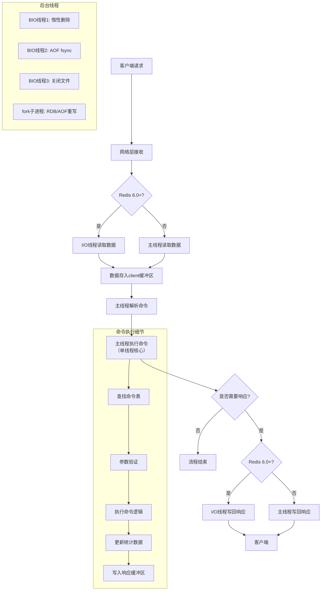

## 什么是redis?

redis是一个高性能的key-value数据库,它是完全开源免费的,而且redis是一个**NOSQL**类型数据库,是为了解决**高并发、高扩展,大数据存储**等一系列的问题而产生的数据库解决方案,是一个非关系型的数据库

## Reids的特点

1. Redis本质上是一个Key-Value类型的**内存数据库**,很像memcached,整个数据库统统加载在内存当中进行操作,**定期通过异步操作把数据库数据flush到硬盘上进行保存**。

2. 因为是纯内存操作,Redis的性能非常出色,每秒可以处理超过 10万次读写操作,是已知性能最快的Key-Value DB。

3. Redis的出色之处不仅仅是性能,Redis最大的魅力是支持保存多种数据结构,此外单个value的最大限制是**1GB**,不像 memcached只能保存1MB的数据,因此Redis可以用来实现很多有用的功能,比方说用他的List来做FIFO双向链表,实现一个轻量级的高性 能消息队列服务,用他的Set可以做高性能的tag系统等等。

4. 另外Redis也可以对存入的Key-Value设置expire时间,因此也可以被当作一 个功能加强版的memcached来用。

Redis的主要缺点是数据库容量受到物理内存的限制,不能用作海量数据的高性能读写,因此Redis适合的场景主要局限在较小数据量的高性能操作和运算上。

> - String类型:一个String类型的value最大可以存储512M
>
> - List类型:list的元素个数最多为2^32-1个,也就是4294967295个。
>
> - Set类型:元素个数最多为2^32-1个,也就是4294967295个。
>
> - Hash类型:键值对个数最多为2^32-1个,也就是4294967295个。
>
> - Sorted set类型:跟Set类型相似。

**面试回答**

- **性能极高** - Redis 读速度 110000次/s,写的速度是 81000次/s。
- **丰富的数据类型** - Redis 支持的类型 String, Hash 、List 、Set 及 Ordered Set 数据类型操作。
- **原子性**  - Redis 的所有操作都是**原子性**的,意思就是要么成功,要么失败。
  - 单个操作时原子性的,多个操作也**支持事务**,**即原子性,通过 MULTI 和 EXEC 指令包起来**。
- **丰富的特性** - Redis 还支持 publis/subscribe,通知,key 过期等等特性。
- **高速读写** ,redis 使用自己实现的分离器,代码量很短,没有使用 lock(MySQL),因此效率非常高

## Rides优缺点

优点:

- **读写性能好**,读的速度可达110000次/s,写的速度可达81000次/s。
- **支持数据持久化**,有AOF和RDB两中持久化方式
- **数据结构丰富**,支持String、List、Set、Hash等结构
- **支持事务**,Redis所有的操作都是原子性的,并且还支持几个操作合并后的原子性执行,原子性指操作要么成功执行,要么失败不执行,不会执行一部分。
- **支持主从复制**,主机可以自动将数据同步到从机,进行读写分离。

缺点:

- 因为Redis是将数据存到内存中的,所以会受到内存大小的限制,不能用作海量数据的读写
- Redis不具备自动容错和恢复功能,主机或从机宕机会导致前端部分读写请求失败,需要重启机器或者手动切换前端的IP才能切换
- 持久化:Redis 直接将数据存储到**内存中**,要将数据保存到磁盘上,Redis 可以使用两种方式实现持久化过程。
  - 定时快照(snapshot):每隔一段时间将整个数据库写到磁盘上,**每次均是写全部数据,代价非常高**。
  - 第二种方式基于语句追加(aof):只追踪变化的数据,但是追加的 log 可能过大,同时所有的操作均重新执行一遍,回复速度慢。
- 耗内存,占用内存过高。

## Redis 的应用场景

**可以作为数据库,缓存热点数据(经常被查询,但是不经常被修改或者删除的数据)和消息中间件等大部分功能。**

Redis 常用的场景示例如下:

**1、缓存**

缓存现在几乎是所有大中型网站都在用的必杀技,合理利用缓存提升网站的访问速度,还能大大降低数据库的访问压力。Redis 提供了**键过期功能,也提供了灵活的键淘汰策略**,所以,现在 Redis 用在缓存的场合非常多。

**2、排行榜**

Redis 提供的`有序集合`数据类结构能够实现复杂的排行榜应用。

**3、计数器**

视频网站的播放量,每次浏览 +1,并发量高时如果每次都请求数据库操作无疑有很大挑战和压力。Redis 提供的 incr 命令来实现计数器功能,内存操作,性能非常好,非常适用于这些技术场景。

**4、分布式会话**

相对复杂的系统中,一般都会搭建 Redis 等内存数据库为中心的 session 服务,session 不再由容器管理,而是由 session 服务及内存数据管理。

**5、分布式锁**

在并发高的场合中,可以利用 Redis 的 setnx 功能来编写分布式的锁,如果设置返回 1,说明获取锁成功,否则获取锁失败。

**6、社交网络**

点赞、踩、关注/被关注,共同好友等是社交网站的基本功能,社交网站的访问量通常来说比较大,而且传统的关系数据库不适合这种类型的数据,Redis 提供的哈希,集合等数据结构能很方便的实现这些功能。

**7、最新列表**

Redis 列表结构,LPUSH 可以在列表头部插入一个内容 ID 作为关键字,LTRIM 可以用来限制列表的数量,这样列表永远为 N ,无需查询最新的列表,直接根据 ID 去到对应的内容也即可。

**8、消息系统**

消息队列是网站经常用的中间件,如 ActiveMQ,RabbitMQ,Kafaka 等流行的消息队列中间件,主要用于业务解耦,流量削峰及异步处理试试性低的业务。Redis 提供了发布/订阅及阻塞队列功能,能实现一个简单的消息队列系统。另外,这个不能和专业的消息中间件相比。

## 使用redis有哪些好处？

速度快,因为数据存在内存中,类似于HashMap,**HashMap的优势就是查找和操作的时间复杂度都是O(1)**

支持丰富数据类型,支持string,list,set,sorted set,hash;

## Redis数据类型

### String 类型

- String 类型是 Redis 最基本的数据类型,**一个键最大能存储 512 MB**。

- String 数据结构是最简单的 key-value 类型,value 既可以是 string,也可以是数字,是包含很多种类型的特殊类型。

- String 类型是二进制安全的。意思是 redis 的 string 可以包含任何数据,比如序列化的对象进行存储,比如一张图片进行二进制存储,比如一个简单的字符串,数值等等。

**String 命令**

```shell
1、设置语法:

SET KEY_NAME VALUE : (说明:多次设置 name 会覆盖)
(Redis SET 命令用于设置给定 key 的值。如果 key 已经存储值,SET 就要写旧值,且无视类型)。
  
2、命令:

SETNX key1 value:(not exist) 如果 key1 不存在,则设置 并返回1。
如果 key1 存在,则不设置并返回 0;

(解决分布式锁方案之一,只有在 key 不存在时设置 key 的值。
setnx (SET if not exits)命令在指定的key不存在时,为key设置指定的值)。

SETEX key1 10 lx :(expired)设置 key1 的值为 lx ,过期时间为 10 秒,10 秒后 key1 清除( key 也清除)

SETRANG STRING range value : 替换字符串

3、取值语法:

GET KEY_NAME : Redis GET 命令用于获取指定 key 的值。
如果 key 不存在,返回 nil。如果key存储的值不是字符串类型,返回一个错误。

GETRANGE  key start end : 用于获取存储在指定key中字符串的子字符串。
字符串的截取范围由 start 和 end 两个偏移量来决定(包括 start 和 end 在内)

GETBIT key offset :对 key 所存储的字符串值,获取指定偏移量上的为(bit);
GETTEST语法 :GETSET KEY_NAME VALUE : GETSET 命令用于设置指定 key 的值,并返回key的旧值。当 key 不存在是,返回 null

STRLEN key :返回 key 所存储的字符串值的长度

4、删除语法:

DEL KEY_NAME : 删除指定的key,如果存在,返回数字类型。

5、批量写:MSET K1 V1 K2 V2 ... (一次性写入多个值)

6、批量读:MGET K1 K2 K3

7、GETSET NAME VALUE : 一次性设置和读取(返回旧值,写上新值)

8、自增/自减:

INCR KEY_Name : Incr 命令将key中存储的数组值增1。
如果 key 不存在,那么key的值会先被初始化为0,然后在执行INCR操作

自增:INCRBY KEY_Name :增量值Incrby 命令将key中存储的数字加上指定的增量值
自减:DECR KEY_Name 或 DECYBY KEY_NAME 减值:DECR 命令将key中存储的数字减少1

:(注意这些key对应的必须是数字类型字符串,否则会出错。)

字符串拼接:APPEND  KEY_NAME VALUE
:Append 命令用于为指定的key追加至末尾,如果不存在,为其赋值

字符串长度 :STRLEN key
    
####    
 setex   (set with expire) #设置过期时间
 setnx   (set if not exist) #不存在设置 在分布式锁中会常常使用！
    
```

**string 应用场景**

- **1、String通常用于保存单个字符串或JSON字符串数据**
- **2、因String是二进制安全的,所以你完全可以把一个图片文件的内容作为字符串来存储**
- **3、计数器(常规 key-value 缓存应用。常规计数:微博数,粉丝数)**

### Hash 类型

Hash 类型是 String 类型的 field 和 value 的映射表,或者说是一个 String 集合。hash 特别适合用于存储对象,相比较而言,将一个对象类型存储在 Hash 类型比存储在 String 类型里占用更少的内存空间,并对整个对象的存取。可以看成具有 KEY 和 VALUE 的 MAP 容器,该类型非常适合于存储值对象的信息。

如:uname,upass,age 等。该类型的数据仅占用很少的磁盘空间(相比于 JSON ).

Redis 中每一个 hash 可以存储 2 的 32 次方 -1 键值对(40 多亿)

**Hash 命令**

常用命令

```text
1、赋值语法:
 1、 HSET KEY FIELD VALUE   : 为指定的 KEY,设定 FILD/VALUE
 2、 HMSET KEY FIELD VALUE [FIELD1,VALUE]... : 同时将多个 field-value(域-值)对设置到哈希表 key 中。

2、取值语法:

    HGET KEY FIELD  :获取存储在HASH中的值,根据 FIELD 得到 VALUE
    HMGET KEY FIELD [FIELD1]   :获取 key 所有给定字段的值
    HGETALL KEY     :返回 HASH 表中所有的字段和值
        
 HKEYS KEY : 获取所有哈希表中的字段
 HLEN  KEY : 获取哈希表中字段的数量

3、删除语法:
     HDEL KEY FIELD[FIELD2]  :删除一个或多个 HASH 表字段
 
4、其它语法:
     HSETNX KEY FIELD VALUE : 只有在字段 field 不存在时,设置哈希表字段的值
     
     HINCRBY KEY FIELD INCREMENT :为哈希 key 中的指定字段的整数值加上增量 increment。
         
     HINCRBYFLOAT KEY FIELD INCREMENT  :为哈希表 key 中的指定字段的浮点数值加上增量 increment
         
     HEXISTS KEY FIELD  : 查看哈希表中 key 中,指定的字段是否存在  
```

**Hash 的应用场景 :(存储一个用户信息对象数据)**

- **常用于存储一个对象**

- **为什么不用 string 存储一个对象**

  hash 值最接近关系数据库结构的数据类型,可以将数据库一条记录或程序中一个对象转换成 hashmap 存放在 redis 中。

  用户 ID 为查找的 key,存储的 value 用户对象包含姓名,年龄,生日等信息,如果用普通的 key/value 结构来存储,主要有以下 2 种方式:

> 第一种方式将用户 ID 作为查找 key,把其他信息封装成为一个对象以序列化的方式存储,这种方式增加了序列化/反序列化的开销,并且在需要修改其中一项信息时,需要把整个对象取回,并且修改操作需要对并发进行保护,引入 CAS 等复杂问题。

> 第二种方法是这个用户信息对象有多少成员就存成多少个 key-value 对,用用户 ID+ 对应属性的名称作为唯一标识来取的对应属性的值,虽然省去了序列化开销和并发问题,但是用户ID 重复存储,如果存在大量这样的数据,内存浪费还是非常可观的。

Redis 提供的 Hash 很好的解决了这个问题,Redis 的 Hash 实际内部存储的 Value 为一个 HashMap。

### List 类型

List 类型是一个链表结构的集合,其主要功能有 push、pop、获取元素等。更详细的说,List 类型是一个**双端链表**的结构,我们可以通过相关的操作进行集合的头部或者尾部添加和删除元素,List 的设计是非常简单精巧,既可以为栈,又可以作为队列,满足绝大多数的需求。

**常用命令**

```text
1、赋值语法: 
 LPUSH KEY VALUE1 [VALUE2] :将一个或多个值插入到列表头部(从左侧添加)
    RPUSH KEY VALUE1 [VALUE2] :在列表中添加一个或多个值(从有侧添加)
 LPUSHX KEY VAKUE :将一个值插入到已存在的列表头部。如果列表不在,操作无效
 RPUSHX KEY VALUE :一个值插入已经在的列表尾部(最右边)。如果列表不在,操作无效
2、取值语法:
 LLEN KEY   :获取列表长度
    LINDEX KEY INDEX :通过索引获取列表中的元素
 LRANGE KEY START STOP :获取列表指定范围内的元素
```

描述:返回列表中指定区间的元素,区间以偏移量 START 和 END 指定。

其中 0 表示列表的第一个元素,1 表示列表的第二个元素,以此类推。。。

也可以使用负数下标,以 -1 表示列表的最后一个元素,-2 表示列表的倒数第二个元素,依次类推

start:页大小(页数-1)

stop:(页大小页数)-1

```text
3、删除语法:
 LPOP KEY 移除并获取列表的第一个元素(从左侧删除)
 RPOP KEY 移除列表的最后一个元素,返回值为移除的元素(从右侧删除)

 BLPOP key1 [key2]timeout 移除并获取列表的第一个元素,如果列表没有元素会阻塞列表知道等待超时或发现可弹出元素为止。
4、修改语法:
 LSET KEY INDEX VALUE :通过索引设置列表元素的值
 LINSERT KEY BEFORE|AFTER WORIL VALUE :在列表的元素前或者后 插入元素 描述:将值 value 插入到列表 key 当中,位于值 world 之前或之后。
```

**高级命令**

```
高级语法:
 RPOPLPUSH source destiation : 移除列表的最后一个元素,并将该元素添加到另外一个列表并返回
 示例描述:
  RPOPLPUSH a1  a2  : a1的最后元素移到a2的左侧
  RPOPLPUSH a1  a1  : 循环列表,将最后元素移到最左侧
   BRPOPLPUSH source destination timeout  :从列表中弹出一个值,将弹出的元素插入到另外一个列表中并返回它;
如果列表没有元素会阻塞列表知道等待超时或发现可弹出的元素为止。
```

**List 的应用场景**

**项目应用于:1、对数据量大的集合数据删除;2、任务队列**

**1、对数据量大的集合数据删减**

列表数据显示,关注列表,粉丝列表,留言评论等.....分页,热点新闻等

利用 LRANG 还可以很方便的实现分页的功能,在博客系统中,每篇博文的评论也可以存入一个单独的 list 中。

**2、任务队列**

(list 通常用来实现一个消息队列,而且可以确认表先后顺序,不必像 MySQL 那样还需要通过 ORDER BY 来进行排序)

```
任务队列介绍(生产者和消费者模式:)

    在处理 web 客户端发送的命令请求时,某些操作的执行时间可能会比我们预期的更长一些,通过将待执行任
  务的相关信息放入队列里面,并在之后队列进行处理,用户可以推迟执行那些需要一段时间才能完成的操作,
  这种将工作交个任务处理器来执行的做法被称为任务队列(task queue)。
    
RPOPLPUSH source destination

 移除列表的最后一个元素,并将该元素添加到另一个列表并返回
```

### Set 类型

Redis 的 Set 是 String 类型的无序集合。集合成员是唯一的,这就意味着集合中不能出现重复的数据。Redis 中集合是通过哈希表实现的,set 是通过 hashtable 实现的

集合中最大的成员数为 2^32 -1,类似于 JAVA 中的 Hashtable 集合。

**命令**

```text
1、赋值语法:
    SADD KEY member1 [member2]:向集合添加一个或多个成员
    
2、取值语法:
    SCARD KEY :获取集合的成员数
    SMEMBERS KEY :返回集合中的所有成员
    SISMEMBER  KEY  MEMBER  :判断 member 元素是否是集合 key 的成员(开发中:验证是否存在判断)
    SRANDMEMBER KEY [COUNT] :返回集合中一个或对个随机数
        
3、删除语法:
      SREM key member1 [member2] : 移除集合中一个或多个成员
      SPOP key [count] : 移除并返回集合中的一个随机元素
      SMOVE source destination member :将member 元素从Source集合移动到destination集合中

4、差集语言:
   SDIFF  key1  [key2]  :返回给定所有集合的差集
   SDIFFSTORE destination key1 [key2]  :返回给定所有集合的茶几并存储在destination中

5、交集语言:          
    SUNION key1 [key2] : 返回所有给定集合的并集
    SUNIONSTORE destination key1 [key2] :所有给定集合的并集存储在 destinatiion集合中                              
```

### ZSet 类型

有序集合(sorted set)

**简介**

1、Redis 有序集合和集合一样也是 string 类型元素的集合,且不允许重复的成员。

2、不同的是每个元素都会关联一个 double 类型的分数。redis 正是通过分数来为集合中的成员进行从小到大的排序。

3、有序集合的成员是唯一的,但分数(score)却可以重复。

4、集合是通过哈希表实现的。集合中最大的成员数为 2^32 -1。Redis 的 ZSet 是有序,且不重复。

(很多时候,我们都将 redis 中的有序结合叫做 zsets,这是因为在 redis 中,有序集合相关的操作指令都是以 z 开头的)

**命令**

```text
1、赋值语法:
 ZADD KEY score1 member1 【score2 member2】  :向有序集合添加一个或多个成员,或者更新已经存在成员的分数

2、取值语法:
 ZCARD key :获取有序结合的成员数
    ZCOUNT key min max :计算在有序结合中指定区间分数的成员数
####
127.0.0.1:6379> ZADD kim 1 tian
(integer) 0
127.0.0.1:6379> zadd kim 2 yuan 3 xing
(integer) 2
127.0.0.1:6379> zcount kim 1 2
(integer) 2
127.0.0.1:6379> 
####
    ZRANK  key member  :返回有序集合中指定成员的所有
    ZRANGE KEY START STOP  [WITHSCORES]:通过索引区间返回有序集合成指定区间内的成员(低到高)
 ZRANGEBYSCORE KEY MIN MAX [WITHSCORES] [LIMIT] :通过分数返回有序集合指定区间内的成员
 ZREVRANGE KEY START STOP [WITHSCORES] :返回有序集中是定区间内的成员,通过索引,分数从高到底
 ZREVERANGEBYSCORE KEY MAX MIN [WITHSCORES] :返回有序集中指定分数区间的成员,分数从高到低排序

删除语法:
 DEL KEY   : 移除集合
 ZREM key member [member...] 移除有序集合中的一个或多个成员
 ZREMRANGEBYSCORE KEY MIN MAX  :移除有序集合中给定的分数区间的所有成员。
 ZREMRANGEBYSCORE KEY MIN MAX  :移除有序集合中给定的分数区间的所有成员。
 
ZINCRBY KEY INCREMENT MEMBER :增加 member 元素的分数 increment,返回值是更改后的分数
```

**HyperLogLog**

**常用命令**

```text
PFADD key element [element ...] : 添加指定元素到 HyperLoglog 中

PFCOUNT KEY [key ...] :返回给定 HyperLogLog的基数估算值

PFMERGE destkey sourcekey [sourcekey ...] :将过个HyperLogLog 合并为一个HyperLoglog
```

**应用场景**

基数不大,数据量不大就用不上,会有点大材小用浪费空间

有局限性,就是指能统计基数数量,而没办法去知道具体的内容是什么

```text
统计注册 IP 数
统计每日访问 IP 数
统计页面实时 UV 数
统计在线用户数
统计用户每天搜索不同词条的个数
统计真实文章阅读数
```

## 缓存有那些类型

缓存是高并发场景下**提高热点数据访问性能**的一个有效手段,在开发项目时会经常使用到。

缓存的类型分为:

- 本地缓存:通常使用HashMap
- 分布式缓存:Rides数据库
- 多级缓存

### 本地缓存

1. **本地缓存**就是在**进程的内存**中进行缓存,比如我们的 **JVM** 堆中,可以用 **LRUMap** 来实现,也可以使用 **Ehcache** 这样的工具来实现。

2. 本地缓存是**内存访问**,没有远程交互开销,性能最好,但是受限于单机容量,一般缓存较小且无法扩展。

### 分布式缓存

**分布式缓存**可以很好得解决这个问题。

1. 分布式缓存一般都具有良好的**水平扩展能力**,对较大数据量的场景也能应付自如。

2. 缺点就是需要进行远程请求,性能不如本地缓存。

### 多级缓存

1. 为了平衡这种情况,实际业务中一般采用**多级缓存**,本地缓存只**保存访问频率最高的部分热点数据**,其他的热点数据放在分布式缓存中。

2. 在目前的一线大厂中,这也是最常用的缓存方案,单考单一的缓存方案往往难以撑住很多高并发的场景。

## 你为什么需要使用Rides

> 这里回答在实时数仓中为什么使用Rides缓存。

因为我们在做实时计算的时候,数据一般是存储在Hbase数据库中,向一些维度表,如果我们实时计算的时候,需要使用维度表,如果这个时候取Hbase数据库中查询数据的时候,他是基于mr计算模型的,延迟很高,而我们实时计算需要低延迟,所以这个时候就不得不考虑使用一个缓存,将一些热点数据存储在缓存中,这样效率更高。

## 为什么redis需要把所有数据放到内存中?

**Redis为了达到最快的读写速度将数据都读到内存中,并通过异步的方式将数据写入磁盘**。所以redis具有**快速和数据持久化**的特征。如果不将数据放在内存中,磁盘I/O速度为严重影响redis的性能。在内存越来越便宜的今天,redis将会越来越受欢迎。

如果设置了最大使用的内存,则数据已有记录数达到内存限值后不能继续插入新值。

**Redis设计取舍:**

**优势**
- "性能": "内存访问比磁盘快1000倍",
- "吞吐量": "单实例10万+ QPS",
- "延迟": "亚毫秒响应时间",
- "数据结构": "支持复杂内存操作",
- "简单性": "单线程模型，避免锁竞争"

**代价:**

- "成本": "内存比磁盘贵100倍",
- "容量": "受限于物理内存大小",
- "持久化": "需要额外机制保证数据安全",
- "数据迁移": "大容量数据迁移困难",
- "故障恢复": "重启需要加载到内存"

**使用场景:**

- "缓存",
- "会话存储",
- "排行榜/计数器",
- "消息队列",
- "实时分析中间结果"

**成本优化策略:**

策略层级:
第一层: 数据压缩
- 使用 ziplist、intset 编码
- 开启 RDB/AOF 压缩

第二层: 数据淘汰
- 设置合理过期时间
- 使用 LRU/LFU 淘汰策略

第三层: 架构优化
- 热数据在 Redis，冷数据在 MySQL
- 使用 Redis Cluster 横向扩展

第四层: 硬件优化
- 使用大内存实例（单位成本更低）
- 选择合适云厂商

## 缓存数据淘汰算法

不管是本地缓存还是分布式缓存,为了保证较高性能,都是使用内存来保存数据,由于成本和内存限制,当存储的数据超过缓存容量时,需要对缓存的数据进行剔除。

### 不可能实现的算法 OPT

OPT(OPTimal Replacement,OPT)算法,其所选择的被淘汰的数据将是以后永不使用的,或是在最长(未来)时间内不再被访问的数据。

未来发生的事情是无法预测的,所以该算法从根本上来说是无法实现的,OPT算法对于内存缓存来说,能够提供最高的cache命中(cache hite)率,通过OPT算法也可以衡量其他缓存淘汰的算法的优劣。

### 无脑算法 FIFO

FIFO(First Input First Output,FIFO)算法算是一种很无脑的淘汰算法,实现起来也很简单,即每次淘汰最先被缓存的数据。

FIFO算法很少会应用在实际项目中,因为该算法并未考虑数据的 “热度”,一般来说,应该是越热的数据越应该晚点淘汰出去,而FIFO算法并未考虑到这一点,所以,该算法的cache命中率一般会比较低。

### 常见算法 LRU

LRU(Least Recently Used,LRU)算法根据数据的历史访问记录来进行淘汰数据,其核心思想是“如果数据最近被访问过,那么将来被访问的几率也更高”。

LRU最友好的数据模型为具有**时间局部性**的请求队列,每访问一个已缓存的节点,就将该节点转移到队列头部,每次淘汰时,以此淘汰队列尾部节点

采用队列实现的话,每转移一个节点,都需要遍历该队列,为了提高查找效率,通常会采用**Hashmap+双向链表**来实现LRU算法。

使用双向链表记录访问的时间,因为链表的插入效率比较高,所以新插入的元素在前面,旧的数据存储在后面,使用哈希表记录缓存(key,value),哈希表的查找效率近似于o(1),发生冲突最坏查询效率也是o(n),同时哈希表中得记录 (key, (value, key_ptr)),key_ptr 是key在链表中的地址,为了能在O(1)时间内找到该节点,并把节点提升到表头。链表中的key,能快速找到hash中的value,并删除。

### LFU算法

为了解决LRU算法未考虑频率因素的问题,人们在此基础上又提出了**LRU-K算法**,其中,K代表最近使用的次数,因此LRU可以认为是LRU-1算法,其核心思想是将 **“最近使用过1次”的判断标准扩展为“最近使用过K次”**。

相比LRU,LRU-K需要多维护一个访问历史队列,用于记录所有缓存数据被访问的历史。只有当数据的访问次数达到K次的时候,才将数据放入缓存。当需要淘汰数据时,LRU-K会淘汰第K次访问时间距当前时间最大的数据。

> LFU算法是LRU算法的改进
>
> LRU对于循环出现的数据,缓存命中不高
> 比如,这样的数据,1,1,1,2,2,2,3,4,1,1,1,2,2,2.....
> 当走到3,4的时候,1,2会被淘汰掉,但是后面还有很多1,2
>
> LFU对于交替出现的数据,缓存命中不高
> 比如,1,1,1,2,2,3,4,3,4,3,4,3,4,3,4,3,4......
> 由于前面被(1(3次),2(2次))
> 3加入把2淘汰,4加入把3淘汰,3加入把4淘汰,然而3,4才是最需要缓存的,1去到了3次,谁也淘汰不了它了。

一般的剔除策略有 **FIFO** 淘汰最早数据、**LRU** 剔除最近最少使用、和 **LFU** 剔除最近使用频率最低的数据几种策略。

### Redis内存淘汰策略

Redis 提供了 8 种数据淘汰策略，分为三大类：

> 引入 LFU 策略（4.0版本）

```shell
Redis 淘汰策略分类
├── 不淘汰策略
│   ├── noeviction (默认)
├── 只淘汰有过期时间的键
│   ├── volatile-lru
│   ├── volatile-lfu
│   ├── volatile-random
│   ├── volatile-ttl
└── 淘汰所有键
    ├── allkeys-lru
    ├── allkeys-lfu
    └── allkeys-random
```

**淘汰算法说明**

#### noeviction (不淘汰) - 默认策略

**noeviction**:返回错误,当内存限制达到并且客户端尝试执行会让更多内存被使用的命令(大部分的写入指令,但DEL和几个例外);

- 适用场景： 
  - 数据绝对不能丢失的场景 
  - 有严格的数据完整性要求 
  - 需要人工干预内存使用

####  allkeys-lru (全局LRU)

**allkeys-lru (全局LRU)**: 尝试回收最近最少使用的键(LRU),使得新添加的数据有空间存放。

与 volatile-lru 对比:

```shell
volatile-lru:
  - 淘汰范围: 仅有过期时间的键
  - 适用场景: 缓存数据为主
  - 风险: 永久数据可能积累导致OOM

allkeys-lru:
  - 淘汰范围: 所有键（包括无过期时间的）
  - 适用场景: 全内存数据库，所有数据都可淘汰
  - 优势: 保证不会OOM
```

使用场景:
- 用户个性化推荐缓存

#### allkeys-random (全局随机)

- **allkeys-random**: 回收随机的键使得新添加的数据有空间存放。

使用场景:
- 短链接缓存 - 任何链接被淘汰都可接受

#### volatile-lru (最近最少使用)

**volatile-lru(最近最少使用)**: 尝试回收最近最少使用的键(LRU),但仅限于在过期集合的键,使得新添加的数据有空间存放。

- 算法特点： 
  - 只淘汰设置了过期时间的键 
  - 使用近似 LRU，采样计算，非精确 
  - 通过 maxmemory-samples 控制精度


- 使用场景:
  - 会话缓存：最近活跃的用户会话保留
  - 验证码缓存：过期的验证码优先淘汰


#### volatile-random (随机淘汰)

- **volatile-random**: 回收随机的键使得新添加的数据有空间存放,但仅限于在过期集合的键。

缺点是可能淘汰掉重要数据；

使用场景:
- 临时验证码存储,任何验证码被淘汰影响都不大,用户可重新获取;

#### volatile-ttl (按过期时间淘汰)

- **volatile-ttl**: 回收在过期集合的键,并且优先回收存活时间(TTL)较短的键,使得新添加的数据有空间存放

如果没有键满足回收的前提条件的话,策略**volatile-lru**, **volatile-random**以及**volatile-ttl**就和noeviction 差不多了。


#### volatile-lfu (最不经常使用)

volatile-lfu:针对设置有过期时间数据，淘汰掉最近最不经常使用的数据；

LFU vs LRU 对比：

```shell
# 访问模式示例
访问序列: A, B, C, A, A, B, D, A, B, C

# LRU视角（最近访问）：
最近最少访问: D (虽然只访问1次，但最近访问过)

# LFU视角（访问频率）：
访问频率: A(4), B(3), C(2), D(1)
最少使用: D (访问次数最少)
```

**使用场景:**

- 热门商品缓存 - 访问频率高的保留

#### allkeys-lfu (全局LFU)

使用场景:
- 全站热搜榜

#### 如何选择合适的淘汰策略

```shell
开始选择淘汰策略
│
├── 数据绝对不能丢失？
│   ├── 是 → 选择 noeviction + 充足内存
│   └── 否 → 
│       ├── 只有缓存数据？
│       │   ├── 是 → 选择 volatile-*
│       │   └── 否 → 选择 allkeys-*
│       └── 
│           ├── 访问模式有明显热点？
│           │   ├── 是 → 选择 *-lru 或 *-lfu
│           │   └── 否 → 选择 *-random
│           └──
│               ├── 需要公平淘汰？ → *-random
│               └── 需要清理过期数据？ → volatile-ttl
```

#### 应用场景选择

| 业务场景         | 推荐策略       | 原因说明                           | 配置示例                        |
| :--------------- | :------------- | :--------------------------------- | :------------------------------ |
| **用户会话缓存** | volatile-lru   | 最近活跃用户保留，过期的会话可淘汰 | `maxmemory-policy volatile-lru` |
| **商品信息缓存** | allkeys-lfu    | 热门商品常驻，冷门商品淘汰         | `maxmemory-samples 10`          |
| **全内存数据库** | allkeys-lru    | 所有数据都可淘汰，保留最近使用的   | `maxmemory 16gb`                |
| **临时数据存储** | volatile-ttl   | 优先清理即将过期的数据             | `+ 监控过期键数量`              |
| **负载均衡场景** | allkeys-random | 公平淘汰，避免热点集中             | `+ 集群分片`                    |
| **消息队列**     | volatile-lru   | 新消息重要，旧消息可淘汰           | `+ stream 持久化`               |
| **排行榜数据**   | noeviction     | 数据重要，不能丢失                 | `+ 定期RDB备份`                 |


#### 内存问题诊断

```shell
内存问题
├── 内存使用率高
│   ├── 检查: redis-cli info memory
│   ├── 可能原因:
│   │   ├── 数据增长过快
│   │   ├── 内存泄漏
│   │   └── 配置不当
│   └── 解决方案:
│       ├── 扩容内存
│       ├── 优化数据结构
│       └── 调整淘汰策略
│
├── 内存碎片率高 (>1.5)
│   ├── 检查: redis-cli info memory | grep fragmentation
│   ├── 可能原因:
│   │   ├── 频繁更新不同大小数据
│   │   ├── 大量键过期删除
│   │   └── 内存分配器问题
│   └── 解决方案:
│       ├── 启用active-defrag
│       ├── 执行memory purge
│       └── 重启实例
│
├── OOM错误
│   ├── 检查: 日志中的OOM信息
│   ├── 可能原因:
│   │   ├── 内存不足
│   │   ├── 淘汰策略为noeviction
│   │   └── 大键占用
│   └── 解决方案:
│       ├── 紧急清理数据
│       ├── 修改淘汰策略
│       └── 临时扩容
│
└── 性能下降
    ├── 检查: redis-cli --latency
    ├── 可能原因:
    │   ├── Swap使用
    │   ├── 内存整理开销
    │   └── 系统内存压力
    └── 解决方案:
        ├── 禁用Swap
        ├── 调整defrag参数
        └── 优化系统配置
```

## Redis内存维护策略

**redis** 作为优秀的中间缓存件,时常会存储大量的数据,即使采取了集群部署来动态扩容,也应该及时的整理内存,维持系统性能。

在 redis 中有两种解决方案

### 为数据设置超时时间

```java
//设置过期时间
expire key time(以秒为单位)--这是最常用的方式
setex(String key, int seconds, String value) --字符串独有的方式

1、除了字符串自己独有设置过期时间的方法外,其他方法都需要依靠 expire 方法来设置时间
2、如果没有设置时间,那缓存就是永不过期
3、如果设置了过期时间,之后又想让缓存永不过期没使用persist key    
```

### 采用 LRU 算法动态将不用的数据删除

内存管理的一种页面置换算法,对于在内存中但又不用的数据块(内存块)叫做 LRU, 操作系统会根据哪些数据属于 LRU 而将其移除内存而腾出空间来加载另外的数据。

1.**volatile-lru**:设定超时时间的数据中,删除最不常使用的数据

2.**allkeys-lru**:查询所有的 key 对最近最不常使用的数据进行删除,这是应用最广泛的策略。

3.**volatile-random**:在已经设定了超时的数据中随机删除。

4.**allkeys-random**:查询所有的 key,之后随机删除。

5.**volatile-ttl**:查询全部设定超时时间的数据,之后排序,将马上要过期的数据进行删除操作。

6.**noeviction**:如果设置为该属性,则不会进行删除操作,如果内存溢出则报错返回。

7.**volatile-lfu**:从所有配置了过期时间的键中驱逐使用频率最少的键

8.**allkeys-lfu**:从所有键中驱逐使用频率最少的键


## Redis内部架构以及单线程模型

### Redis 服务器核心架构：

```shell
// Redis 服务器全局结构体（简化版）
struct redisServer {
    /* 核心数据库 */
    redisDb *db;                     // 数据库数组
    dict *commands;                  // 命令表
    aeEventLoop *el;                 // 事件循环
    
    /* 网络连接 */
    int port;                        // 监听端口
    int ipfd;                        // 监听socket
    list *clients;                   // 客户端链表
    int maxclients;                  // 最大客户端数
    
    /* 内存管理 */
    size_t maxmemory;                // 最大内存限制
    int maxmemory_policy;            // 淘汰策略
    size_t used_memory;              // 已用内存
    
    /* 持久化 */
    sds aof_buf;                     // AOF缓冲区
    rio aof_rio;                     // AOF文件指针
    int aof_fsync;                   // AOF同步策略
    
    /* 多线程（Redis 6.0+） */
    int io_threads_num;              // I/O线程数
    pthread_t *io_threads;           // I/O线程数组
    list **io_threads_list;          // 线程任务列表
    
    /* 统计信息 */
    long long stat_numcommands;      // 命令统计
    long long stat_net_input_bytes;  // 网络输入
    long long stat_net_output_bytes; // 网络输出
};
```

### Redis中单线程如何理解？

```shell
// Redis 主线程执行流程
int main(int argc, char **argv) {
    // 初始化
    initServer();
    
    // 事件循环（单线程核心）
    while (server.running) {
        // 1. 处理定时事件（如键过期检查）
        processTimeEvents();
        
        // 2. 处理文件事件（网络I/O）
        // 在Redis 6.0前：主线程处理所有网络I/O
        // 在Redis 6.0+：主线程只处理连接接受和任务分发
        processFileEvents();
        
        // 3. 执行命令（始终单线程执行）
        processCommandQueue();
    }
}
```

**Redis不同版本的单线程范围:**

#### Redis 5.x及以前

- "网络I/O": "主线程单线程处理",
- "命令执行": "主线程单线程执行",
- "后台任务": "3个独立后台线程（BIO）",
- "持久化": "fork子进程执行",
- "总体描述": "完全单线程事件循环"

#### Redis 6.0+

- "网络I/O": "多线程（可配置2-8个I/O线程）",
- "命令执行": "主线程单线程执行（核心！）",
- "后台任务": "多个后台线程（BIO）",
- "持久化": "fork子进程执行",
- "总体描述": "混合线程模型：I/O多线程 + 命令执行单线程"

> 1. Redis的"单线程"指的是：命令的解析、执行、响应生成,这部分逻辑始终在单个线程中顺序执行;

### 为什么命令执行要保持单线程？

```java
// 命令执行的核心逻辑（单线程）
int processCommand(client *c) {
    // 1. 查找命令实现
    struct redisCommand *cmd = lookupCommand(c->argv[0]->ptr);
    
    // 2. 执行前检查（内存、权限等）
    if (checkConditions(c, cmd) != C_OK) {
        return C_ERR;
    }
    
    // 3. 执行命令（单线程关键点）
    call(c, cmd);
    
    return C_OK;
}

void call(client *c, struct redisCommand *cmd) {
    // 开始执行命令
    c->cmd = cmd;
    
    // 实际调用命令处理函数（单线程执行）
    // 例如：SET命令调用setCommand()，GET命令调用getCommand()
    c->cmd->proc(c);
    
    // 命令执行统计
    server.stat_numcommands++;
}
```
单线程命令执行的优势分析：

1、无锁编程，所有数据结构访问不需要加锁，而多线程访问数据需要加锁，因此有加锁等锁的开销，单线程避免锁竞争和锁等待开销；

```java
"描述": "所有数据结构访问不需要加锁",
"示例": """
// 多线程需要：
pthread_mutex_lock(&hash_table_lock);
dictEntry *de = dictFind(db->dict, key);
pthread_mutex_unlock(&hash_table_lock);

// Redis单线程直接：
dictEntry *de = dictFind(db->dict, key); // 无需锁
""",
"性能影响": "避免锁竞争和锁等待开销"
```

2、缓存友好性
```java
"描述": "单线程可以最大化利用CPU缓存",
"原理": """
CPU缓存层级：
L1 Cache: 64KB (1-4 cycles)
L2 Cache: 256KB (10-20 cycles) 
L3 Cache: 8-32MB (40-60 cycles)
Main Memory: 100+ cycles

单线程的优势：
• 热数据保持在CPU缓存中
• 减少缓存失效（Cache Miss）
• 更好的数据局部性（Locality）
""",
"性能数据": "缓存命中 vs 缓存失效：速度差10-100倍"
```

3、避免上下文切换

```java
"描述": "线程切换的CPU开销巨大",
"开销分析": """
线程上下文切换开销：
1. 保存/恢复寄存器状态
2. 更新线程调度信息
3. 刷新CPU缓存（TLB等）
4. 更新内存管理状态

典型开销：1-10微秒
对于Redis的微秒级操作：开销占比10-100%
""",
"对比": """
单线程Redis：0次线程切换
10线程系统：每秒可能数千次切换
```

4、简化的原子性保证

```java
"描述": "每个命令天然原子执行",
"示例": """
// INCR命令在多线程环境需要：
1. 读取当前值
2. 增加
3. 写入新值
// 需要原子操作或锁保护

// Redis单线程：
// INCR操作自然原子，无需额外同步
""",
"事务支持": "MULTI/EXEC事务基于单线程实现"
```

### Redis请求处理流程



### Redis设计的权衡分析

```shell
engineering_tradeoffs = {
    "单线程设计的优点": {
        "简化性": {
            "描述": "代码复杂度大幅降低",
            "证据": """
            // Redis核心代码行数统计
            总代码行数: ~15万行
            其中并发控制代码: < 1000行 (0.7%)
            对比多线程系统: 通常10-30%代码处理并发
            """,
            "影响": "更少的bug，更容易维护"
        },
        "确定性": {
            "描述": "系统行为更可预测",
            "优势": """
            1. 延迟更稳定，没有锁竞争导致的延迟尖峰
            2. 内存访问模式可预测，优化更容易
            3. 调试和性能分析更简单
            """,
            "适用性": "对延迟敏感的应用（金融、游戏）"
        },
        "资源效率": {
            "描述": "更好的CPU缓存利用率",
            "原理": """
            CPU缓存层级访问时间:
            L1缓存: 1ns (64KB)
            L2缓存: 3ns (256KB) 
            L3缓存: 12ns (8-32MB)
            主内存: 100ns
            
            单线程优势:
            • 热数据保持在缓存中
            • 减少缓存行失效
            • 更好的指令缓存命中率
            """,
            "性能影响": "提升10-30%的吞吐量"
        }
    },
    
    "单线程设计的代价": {
        "CPU核心利用率": {
            "问题": "无法利用多核CPU的全部计算能力",
            "现状": """
            Redis 6.0前的解决方案:
            • 部署多个Redis实例
            • 使用Redis集群
            
            Redis 6.0+的改进:
            • I/O多线程利用多核
            • 命令执行仍单线程，但I/O不是瓶颈
            """,
            "影响": "对纯内存操作，单核性能已接近极限"
        },
        "阻塞操作影响": {
            "问题": "慢查询会阻塞所有客户端",
            "危险操作": """
            1. KEYS * (全表扫描)
            2. 大型集合操作 (SINTER bigset1 bigset2)
            3. 复杂LUA脚本
            4. 同步持久化操作 (SAVE)
            """,
            "缓解措施": """
            1. 使用SCAN替代KEYS
            2. 大集合分片
            3. 设置执行超时
            4. 使用异步持久化
            """
        },
        "内存限制": {
            "问题": "大内存实例的RDB持久化fork耗时",
            "原理": """
            fork()系统调用:
            • 复制父进程内存页表
            • 使用Copy-on-Write机制
            • 内存越大，fork时间越长
            
            64GB内存fork时间: ~1-2秒
            在此期间，主线程完全阻塞
            """,
            "解决方案": """
            1. 使用AOF持久化
            2. 减小RDB保存频率
            3. 使用Redis集群分片
            4. 考虑使用RocksDB等磁盘存储
            """
        }
    }
}
```

### **Redis 单线程小结**：

1. **历史演进**：
  - Redis 5.x及以前：完全单线程（网络I/O + 命令执行）
  - Redis 6.0+：混合线程模型（I/O多线程 + 命令执行单线程）
2. **单线程的核心**：
  - ✅ **命令执行单线程**：解析、处理、响应生成
  - ✅ **数据结构访问单线程**：不需要锁保护
  - ✅ **事务原子性**：天然保证
3. **多线程的部分**：
  - ✅ **网络I/O多线程**：提高并发连接处理能力
  - ✅ **后台任务多线程**：惰性删除、AOF同步等
  - ✅ **持久化fork子进程**：RDB/AOF重写


## 为什么多线程会导致redis CPU缓存层级访问时间性能降低

### 现代 CPU 缓存层级结构

```java
// CPU 缓存架构（以 Intel Xeon 为例）
struct CPU_Cache_Architecture {
    // 每个核心私有缓存
    L1_Cache l1i;   // 32KB 指令缓存（4 cycles）
    L1_Cache l1d;   // 32KB 数据缓存（4 cycles）
    L2_Cache l2;    // 256KB 统一缓存（12 cycles）
    
    // 所有核心共享缓存
    L3_Cache l3;    // 8-64MB 共享缓存（35-70 cycles）
    
    // 主内存
    MainMemory ram; // 100+ cycles
};

// 缓存访问延迟对比
const struct Cache_Latency {
    uint64_t l1_hit = 4;       // 4纳秒
    uint64_t l2_hit = 12;      // 12纳秒  
    uint64_t l3_hit = 35;      // 35纳秒
    uint64_t ram_access = 100; // 100纳秒
    uint64_t cache_miss = 70;  // 缓存失效额外惩罚
};
```

### 单线程 Redis 的缓存友好性

#### 数据局部性（Locality）优势

```java
// Redis 单线程执行时的内存访问模式
void single_thread_access_pattern() {
    // Redis 热数据在缓存中保持"热度"
    while (processing_requests) {
        // 1. 指令缓存局部性
        // Redis 命令处理循环代码始终在 L1i 缓存中
        // 指令缓存命中率 > 99%
        
        // 2. 数据缓存局部性
        robj *key_obj = lookup_key_in_dict(db, key);
        // dict（哈希表）结构保持在 L1d/L2 缓存中
        
        // 3. 时间局部性（Temporal Locality）
        // 频繁访问的键（热点数据）始终在缓存中
        if (is_hot_key(key)) {
            // 热数据在多次访问间保持缓存状态
            // 缓存命中率极高
        }
        
        // 4. 空间局部性（Spatial Locality）
        // Redis 数据结构紧凑，相邻数据很可能一起被访问
        // 例如：ziplist 中的连续元素
        process_ziplist_elements(ziplist_ptr);
    }
}
```
#### Redis 单线程的缓存优化

```java
# Redis 内存访问模式的缓存友好特性
cache_friendly_features = {
    "紧凑数据结构": {
        "ziplist": "连续内存存储，提高缓存行利用率",
        "intset": "整数连续存储，64字节缓存行可存8-16个整数",
        "embstr": "RedisObject和字符串数据连续存储"
    },
    
    "数据访问模式": {
        "顺序访问": "list, ziplist的线性遍历符合空间局部性",
        "哈希表访问": "开放寻址法，冲突元素在相邻内存位置",
        "跳表访问": "多层指针，但热数据在高层聚集"
    },
    
    "内存布局优化": {
        "内存对齐": "数据结构按缓存行对齐（64字节）",
        "预取优化": "CPU硬件预取器可预测Redis访问模式"
    }
}

# 缓存命中率模拟
class CacheHitSimulator:
    def simulate_single_thread(self, access_pattern):
        """模拟单线程缓存命中率"""
        cache_state = {
            'l1_hits': 0,
            'l2_hits': 0,
            'l3_hits': 0,
            'ram_access': 0
        }
        
        # Redis典型工作集：热点数据约10-100MB
        working_set_size = 50 * 1024 * 1024  # 50MB
        
        # 假设缓存容量：
        # L1: 64KB, L2: 256KB, L3: 8MB
        # 50MB工作集无法完全放入缓存
        
        # 但Redis的访问遵循Zipf定律：
        # 少数热键被频繁访问
        # 80%的请求访问20%的数据
        
        hot_data_size = working_set_size * 0.2  # 10MB热数据
        
        # 热数据很可能在L3缓存中（8MB < 热数据10MB < 50MB）
        # 但核心热数据（<8MB）完全在L3中
        
        for access in access_pattern:
            if is_hot_data(access):
                # 热数据：可能命中L1/L2/L3
                cache_state['l1_hits'] += 0.3   # 30% L1命中
                cache_state['l2_hits'] += 0.4   # 40% L2命中
                cache_state['l3_hits'] += 0.25  # 25% L3命中
                cache_state['ram_access'] += 0.05  # 5% 内存访问
            else:
                # 冷数据：主要内存访问
                cache_state['ram_access'] += 0.9
                cache_state['l3_hits'] += 0.1
        
        return cache_state
```

### 多线程如何破坏缓存性能

#### 缓存伪共享（False Sharing）

```java
// 多线程场景下的缓存伪共享问题
struct SharedCounter {
    // 多个线程频繁更新的计数器
    volatile long long counter1;  // 线程1更新
    volatile long long counter2;  // 线程2更新
    // 这两个变量很可能在同一个缓存行（64字节）
};

// CPU缓存行结构（64字节）
struct CacheLine {
    byte data[64];  // 一次加载的最小单位
};

// 伪共享问题示例
void false_sharing_problem() {
    // 假设 counter1 和 counter2 在同一缓存行
    // 线程1更新counter1
    Thread1: atomic_increment(&shared_counter.counter1);
    /*
    内存系统操作：
    1. 线程1读取包含counter1和counter2的缓存行到L1缓存
    2. 修改counter1，标记缓存行为"修改"状态（M状态）
    3. 根据MESI协议，其他CPU核心的该缓存行变为"无效"状态
    */
    
    // 线程2更新counter2
    Thread2: atomic_increment(&shared_counter.counter2);
    /*
    内存系统操作：
    1. 线程2的L1缓存中没有该缓存行（被标记为无效）
    2. 必须从内存或L3缓存重新加载
    3. 加载后修改counter2，再次标记为"修改"
    4. 导致线程1的缓存行变为无效
    */
    
    // 结果：两个线程相互使对方的缓存失效
    // 缓存行在CPU间频繁传输，性能急剧下降
}
```

#### Redis 数据结构中的伪共享风险

```java
// Redis 哈希表结构的多线程访问问题
typedef struct dictEntry {
    void *key;                // 键指针
    union {
        void *val;
        uint64_t u64;
        int64_t s64;
        double d;
    } v;                      // 值
    struct dictEntry *next;   // 链表next指针
} dictEntry;

// 假设多线程同时访问不同哈希桶
void hash_table_false_sharing() {
    // Redis dict使用开放寻址法
    // 相邻哈希桶很可能在同一缓存行
    
    dictEntry *table;  // 哈希表数组
    
    // 线程1访问table[0]
    Thread1: process_entry(&table[0]);
    // 加载table[0]所在缓存行到L1缓存
    
    // 线程2访问table[1]（可能与table[0]在同一缓存行）
    Thread2: process_entry(&table[1]);
    // 如果table[0]和table[1]在同一缓存行：
    // 线程2的访问会使线程1的缓存行失效
    
    // 即使访问完全不相关的键，也可能发生伪共享
}
```

#### 缓存颠簸（Cache Thrashing）

```java
# 多线程导致的缓存颠簸模拟
class CacheThrashingSimulator:
    def __init__(self, cache_size_kb=8192):  # 8MB L3缓存
        self.cache_size = cache_size_kb * 1024
        self.cache_lines = self.cache_size // 64  # 缓存行数
        self.thread_working_sets = []  # 各线程工作集
        
    def simulate_multi_thread_access(self, num_threads, working_set_per_thread_mb):
        """模拟多线程缓存访问"""
        working_set_per_thread = working_set_per_thread_mb * 1024 * 1024
        
        # 每个线程的工作集大小
        for i in range(num_threads):
            self.thread_working_sets.append(working_set_per_thread)
        
        # 总工作集大小
        total_working_set = sum(self.thread_working_sets)
        
        # 如果总工作集 > 共享缓存容量 → 缓存颠簸
        if total_working_set > self.cache_size:
            thrashing_factor = total_working_set / self.cache_size
            print(f"缓存颠簸风险：工作集是缓存容量的{thrashing_factor:.1f}倍")
            
            # 缓存颠簸导致的开销
            # 每次缓存失效需要从内存加载：~100ns
            # 频繁失效导致有效内存访问延迟急剧增加
            
            estimated_penalty = self.calculate_thrashing_penalty(thrashing_factor)
            return estimated_penalty
        
        return 0
    
    def calculate_thrashing_penalty(self, thrashing_factor):
        """计算缓存颠簸的性能惩罚"""
        # 基本假设：
        # 理想情况：90% L3命中，10% 内存访问
        # 平均延迟：0.9*35ns + 0.1*100ns = 41.5ns
        
        # 缓存颠簸情况：
        # 假设命中率降为 50%
        # 平均延迟：0.5*35ns + 0.5*100ns = 67.5ns
        
        # 性能下降：(67.5 - 41.5) / 41.5 ≈ 63%
        
        # 更严重的情况：
        if thrashing_factor > 2:
            # 工作集是缓存2倍以上
            # 命中率可能降至 30% 以下
            return 100  # 性能下降100%以上
        
        return 63  # 性能下降63%

# 示例：4线程Redis，每个线程工作集10MB
simulator = CacheThrashingSimulator(cache_size_kb=8192)  # 8MB L3
penalty = simulator.simulate_multi_thread_access(
    num_threads=4, 
    working_set_per_thread_mb=10
)
# 结果：总工作集40MB > 8MB L3缓存
# 缓存颠簸严重，性能下降可能超过100%
```

#### CPU 核间缓存一致性协议开销

```java
// MESI缓存一致性协议状态转移
enum CacheLineState {
    MODIFIED,     // 已修改（当前CPU独占，与内存不一致）
    EXCLUSIVE,    // 独占（当前CPU独占，与内存一致）
    SHARED,       // 共享（多个CPU共享，与内存一致）
    INVALID       // 无效（数据不可用）
};

// 多线程访问时的MESI协议开销
void mesi_protocol_overhead() {
    // 线程1（CPU核心1）读取数据
    // 初始状态：内存 → SHARED（核心1缓存）
    
    // 线程1写入数据
    // SHARED → MODIFIED（需要广播无效化其他核心的缓存）
    // 性能开销：发送缓存无效化消息，等待响应
    
    // 线程2（CPU核心2）读取相同数据
    // 此时核心2缓存：INVALID状态
    // 必须从核心1缓存或内存重新加载
    // MODIFIED → SHARED（核心1回写到内存？）
    
    // 这个过程中：
    // 1. 缓存行在CPU间传输（缓存间传输比L3访问慢）
    // 2. 需要原子操作保证一致性
    // 3. 内存屏障（memory barrier）进一步增加开销
}
```

### Redis 多线程设计的实际考虑

```java
# Redis 6.0 多线程实现的缓存优化
redis_6_cache_optimizations = {
    "I/O线程数据分离": {
        "设计": "每个I/O线程有独立的客户端列表",
        "缓存优势": """
        1. 减少I/O线程间的数据共享
        2. 每个线程处理的数据结构局部性更好
        3. 减少伪共享和缓存一致性开销
        """,
        "实现": """
        list *io_threads_list[IO_THREADS_MAX_NUM];
        // 主线程分发客户端到不同线程列表
        """
    },
    
    "读写分离": {
        "设计": "可以配置只多线程读或只多线程写",
        "缓存优势": """
        1. 读写操作访问不同内存区域
        2. 减少读写操作间的缓存行共享
        3. 写操作可以批量处理，提高缓存效率
        """,
        "配置": """
        io-threads-do-reads yes/no
        io-threads-do-writes yes/no
        """
    },
    
    "批处理优化": {
        "设计": "批量读取/写入客户端数据",
        "缓存优势": """
        1. 批量处理提高数据局部性
        2. 减少每请求的缓存失效开销
        3. 更好的预取器效果
        """,
        "实现": """
        // 积累多个客户端请求后批量处理
        handleClientsWithPendingReadsUsingThreads()
        """
    }
}

# 为什么Redis 6.0不将命令执行多线程化？
reasons_against_command_multithreading = {
    "缓存复杂性": {
        "问题": "命令执行多线程会导致严重的缓存竞争",
        "示例": """
        两个线程同时执行INCR操作：
        线程1: 读取值→增加→写入 (需要缓存行)
        线程2: 读取值→增加→写入 (竞争相同缓存行)
        
        结果：缓存行在CPU间频繁传输
        性能可能下降而不是提升
        """,
        "数据": "测试显示，对于Redis的微秒级操作，缓存竞争开销可能占50%以上"
    },
    
    "数据结构限制": {
        "问题": "Redis数据结构不是为并发设计",
        "哈希表": "多线程rehash极其复杂且效率低",
        "跳表": "并发插入需要复杂锁机制",
        "列表": "POP/PUSH操作需要原子性"
    },
    
    "收益递减": {
        "分析": """
        Redis性能瓶颈分析：
        1. 网络I/O: 可多线程化，收益显著 ✓
        2. 协议解析: 可多线程化，收益中等 ✓
        3. 命令执行: 内存访问受限，收益有限 ✗
        4. 响应发送: 可多线程化，收益显著 ✓
        
        Amdahl定律：优化瓶颈部分才有意义
        """
    }
}
```

###  **多线程导致缓存性能下降的核心机制**：

1. **伪共享（False Sharing）**
  - 无关数据在同一缓存行
  - 多线程修改导致缓存行在CPU间频繁传输
  - 性能下降可达90%
2. **缓存颠簸（Cache Thrashing）**
  - 总工作集超过共享缓存容量
  - 频繁的缓存失效和重新加载
  - 内存访问延迟增加2-3倍
3. **缓存一致性协议开销**
  - MESI协议的状态维护和消息传递
  - 内存屏障（Memory Barrier）开销
  - 核间缓存传输延迟
4. **数据局部性破坏**
  - 多线程随机访问破坏空间局部性
  - 线程调度破坏时间局部性
  - CPU预取器失效

## Redis是单线程还是多线程？Redis为什么这么快？

Redis6.0之前是单线程的,为什么Redis6.0之前采用单线程而不采用多线程呢？

简单来说,就是Redis官方认为没必要,单线程的Redis的瓶颈通常在**CPU的IO**,而在使用Redis时几乎不存在CPU成为瓶颈的情况。使用Redis主要的瓶颈在内存和网络,并且使用单线程也存在一些优点,比如系统的复杂度较低,可为维护性较高,避免了并发读写所带来的一系列问题。

Redis为什么这么快主要有以下几个原因:

- 运行在内存中
- 数据结构简单
- 使用多路IO复用技术
- 单线程实现,单线程避免了线程切换、锁等造成的性能开销。

### Redis线程模型演进

| 版本           | 线程模型                           | 关键特性                     | 适用场景           |
| :------------- | :--------------------------------- | :--------------------------- | :----------------- |
| Redis 3.x      | 纯单线程                           | 网络I/O + 命令执行都在单线程 | 小到中等负载       |
| Redis 4.x      | 单线程 + 后台线程                  | 引入惰性删除后台线程         | 减少大键删除阻塞   |
| **Redis 6.0+** | **多线程网络I/O + 单线程命令执行** | I/O多线程，命令执行单线程    | **高并发网络场景** |
| Redis 7.0+     | 优化多线程模型                     | 改进I/O线程调度              | 极致性能需求       |


### Redis 6.0+ 多线程架构示意图

```shell
// Redis 6.0+ 多线程架构示意图
+------------------------------------------------------------------+
|                        Redis Server                              |
|  +----------------------------------------------------------+   |
|  |                 Main Thread (单线程)                     |   |
|  |  +--------------+  +--------------+  +--------------+    |   |
|  |  | Accept连接   |  | 读取请求     |  | 命令执行      |    |   |
|  |  +--------------+  +--------------+  +--------------+    |   |
|  |  +--------------+                                       |   |
|  |  | 写回响应     |  +--------------------------------+    |   |
|  |  +--------------+  | 共享数据结构                 |    |   |
|  +--------------------| • Global Hash Tables        |--------------+
|                       | • Shared Memory Pool        |              |
|                       +--------------------------------+            |
|                                                                     |
|  +------------------+  +------------------+  +------------------+  |
|  | I/O Thread 1     |  | I/O Thread 2     |  | I/O Thread N     |  |
|  | • read()         |  | • read()         |  | • read()         |  |
|  | • write()        |  | • write()        |  | • write()        |  |
|  +------------------+  +------------------+  +------------------+  |
|                                                                     |
|  +------------------+  +------------------+                        |
|  | Bio Thread 1     |  | Bio Thread 2     |                        |
|  | • Lazy Free      |  | • AOF fsync      |                        |
|  +------------------+  +------------------+                        |
+------------------------------------------------------------------+
```

### Redis为什么这么快

#### 内存存储：性能的基础

```shell
# 访问延迟对比（纳秒级别）
access_times = {
    "L1 Cache": 1,        # 1 ns
    "L2 Cache": 4,        # 4 ns  
    "L3 Cache": 10,       # 10 ns
    "Main Memory": 100,   # 100 ns (Redis所在位置)
    "NVMe SSD": 100000,   # 100 μs (比内存慢1000倍)
    "SATA SSD": 1000000,  # 1 ms (慢10000倍)
    "HDD": 10000000       # 10 ms (慢100000倍)
}

# Redis 所有数据在内存中，没有磁盘I/O延迟
class RedisMemoryAccess:
    def get(self, key):
        # 直接内存指针访问，O(1)时间复杂度
        pointer = hash_table.lookup(key)
        return dereference(pointer)  # 纳秒级操作
```

####  高效的数据结构设计

```shell
// Redis 核心数据结构实现
typedef struct redisObject {
    unsigned type:4;        // 数据类型（string, hash, list等）
    unsigned encoding:4;    // 编码方式（int, embstr, raw等）
    unsigned lru:LRU_BITS;  // LRU时间或LFU计数
    int refcount;           // 引用计数
    void *ptr;              // 指向实际数据的指针
} robj;

// 字符串的三种编码优化
// 1. 整数编码：直接存储在指针中
if (value fits in long) {
    robj->ptr = (void*)value;  // 直接存储，0额外内存
    robj->encoding = OBJ_ENCODING_INT;
}
// 2. 短字符串编码（embstr）
else if (len <= 44) {  // Redis 7.0改为44字节
    // 对象头和字符串数据连续存储，一次内存分配
    robj + sds 连续内存
}
// 3. 长字符串编码（raw）
else {
    // 单独分配sds内存
}
```

#### 单线程模型的优势

```shell
// Redis 主事件循环（单线程）
int aeMain(aeEventLoop *eventLoop) {
    eventLoop->stop = 0;
    while (!eventLoop->stop) {
        // 1. 处理文件事件（网络I/O）
        aeProcessEvents(eventLoop, AE_FILE_EVENTS);
        
        // 2. 执行命令（单线程顺序执行）
        processCommand(client);
        
        // 3. 处理时间事件
        if (flags & AE_TIME_EVENTS)
            aeProcessEvents(eventLoop, AE_TIME_EVENTS);
    }
}

// 单线程优势：
// 1. 无锁竞争：不需要处理复杂的锁机制
// 2. 无上下文切换开销
// 3. 无同步等待
// 4. 操作原子性天然保证
```

####  I/O 多路复用技术

```java
// Redis 使用 epoll/kqueue/select
#ifdef HAVE_EPOLL
    aeApiCreate(eventLoop) {
        state->epfd = epoll_create(1024);
    }
    
    aeApiPoll(eventLoop, struct timeval *tvp) {
        // 一个系统调用监听所有连接
        retval = epoll_wait(state->epfd, state->events,
                          eventLoop->setsize,
                          tvp ? (tvp->tv_sec*1000 + tvp->tv_usec/1000) : -1);
    }
#endif

// 对比传统阻塞I/O模型
+----------------+     +----------------+
| 传统阻塞I/O    |     | Redis多路复用  |
+----------------+     +----------------+
| 1个线程1个连接 |     | 1个线程10万连接 |
| 1000连接需要   |     | 1000连接只需要  |
| 1000个线程     |     | 1个线程        |
| 大量上下文切换 |     | 极少上下文切换  |
| 高内存开销     |     | 低内存开销      |
+----------------+     +----------------+
```

#### 零拷贝与优化网络传输

```shell
// Redis 响应数据的零拷贝发送
void _addReplyToBuffer(client *c, const char *s, size_t len) {
    // 直接使用客户端缓冲区，避免内存拷贝
    memcpy(c->buf + c->bufpos, s, len);
    c->bufpos += len;
}

// 大对象使用 writev() 系统调用
void _addReplySds(client *c, sds s) {
    // 直接发送sds，无需额外拷贝
    addReplyProto(c, s, sdslen(s));
    sdsfree(s);  // 发送后释放
}

// 使用 sendfile() 系统调用发送AOF文件
if (useSendFile()) {
    // 文件直接从内核空间发送到网络
    sendfile(out_fd, in_fd, NULL, file_size);
}
```

#### Pipeline 批量操作

```shell
# 传统方式 vs Pipeline
import redis
r = redis.Redis()

# 传统：10次网络往返 + 10次命令执行
for i in range(10):
    r.set(f'key{i}', f'value{i}')  
    # 每次：发送 → 等待 → 接收响应
    # 总时间 ≈ 10 * (网络延迟 + 处理时间)

# Pipeline：1次网络往返 + 10次命令执行
pipe = r.pipeline()
for i in range(10):
    pipe.set(f'key{i}', f'value{i}')
pipe.execute()  
# 一次发送所有命令，一次接收所有响应
# 总时间 ≈ 1 * 网络延迟 + 10 * 处理时间
# 性能提升：网络延迟减少90%
```

- "内存访问": "100x faster than disk",
- "数据结构": "Optimized for specific operations",
- "单线程": "No lock contention, no context switch",
- "I/O模型": "Epoll with 1M concurrent connections",
- "网络优化": "Zero-copy, pipelining support",

### Redis 6+中 为什么命令执行还是单线程？

```shell
"1. 无锁编程": 
    "所有数据结构访问不需要加锁，避免锁竞争开销",

"2. 原子性保证":
    "每个命令都是原子执行的，简化事务实现",

"3. 避免上下文切换":
    "单线程避免了线程切换的CPU开销",

"4. 缓存友好":
    "单线程可以更好地利用CPU缓存局部性",

"5. 简化实现":
    "不需要处理复杂的并发控制问题",

"6. 性能验证":
    "实践表明，Redis的瓶颈通常在网络I/O，而不是CPU"
    
    
场景：两个线程同时执行INCR操作
多线程需要：
1. 获取锁
2. 读取当前值
3. 增加
4. 写入
5. 释放锁

单线程只需要：
1. 读取当前值
2. 增加  
3. 写入

```

### Redis 高性能的核心原因总结

1. 内存存储：比磁盘快1000倍以上 
2. 高效数据结构：针对不同场景优化的数据结构 
3. 单线程模型（命令执行）：避免锁竞争和上下文切换 
4. I/O多路复用：单线程处理数万并发连接 
5. 智能编码：根据数据自动选择最优存储格式 
6. 网络优化：Pipeline、零拷贝等减少网络开销


**关于单线程/多线程的正确理解**：

Redis 6.0+：

✅ 网络I/O是多线程的：提高并发连接处理能力

✅ 命令执行是单线程的：保持无锁编程优势

✅ 后台任务是多线程的：惰性删除、AOF同步等

**性能调优建议**：

1. 网络瓶颈：启用I/O多线程，使用Pipeline 
2. CPU瓶颈：优化数据结构，避免复杂命令 
3. 内存瓶颈：合理设置淘汰策略，优化数据结构编码 
4. 持久化影响：调整RDB/AOF策略，使用低峰期备份

## Rides中得高级数据类型

**Bitmap**:位图,是一个以位为单位的数组,数组中只能存储1或0,数组的下标在Bitmap中叫做偏移量。Bitmap实现统计功能,更省空间。

面试中常问的布隆过滤器就有用到这种数据结构,布隆过滤器可以判断出**哪些数据一定不在数据库中**,所以常被用来解决**Redis缓存穿透**问题。

## Memcache和Rides对比

### Memcache

注意后面会把 **Memcache** 简称为 MC。

先来看看 MC 的特点:

- MC 处理请求时使用**多线程异步 IO 的方式**,可以合理利用 CPU 多核的优势,性能非常优秀;
- MC 功能简单,使用内存存储数据;
- MC 的内存结构以及钙化问题我就不细说了,大家可以查看[官网](https://link.zhihu.com/?target=http%3A//www.memcached.org/about)了解下;
- MC 对缓存的数据可以设置失效期,过期后的数据会被清除;
- 失效的策略采用延迟失效,就是当再次使用数据时检查是否失效;
- 当容量存满时,会对缓存中的数据进行剔除,剔除时除了会对过期 key 进行清理,还会按 LRU 策略对数据进行剔除。

另外,使用 MC 有一些限制,这些限制在现在的互联网场景下很致命,成为大家选择**Redis**、**MongoDB**的重要原因:

- key 不能超过 250 个字节;
- value 不能超过 1M 字节;
- key 的最大失效时间是 30 天;
- 只支持 K-V 结构,不提供持久化和主从同步功能。

### Redis

先简单说一下 **Redis** 的特点,方便和 MC 比较。

- 与 MC 不同的是,Redis 采用单线程模式处理请求。这样做的原因有 2 个:
    - 一个是因为采用了非阻塞的异步事件处理机制;
    - 另一个是缓存数据都是内存操作 IO 时间不会太长,单线程可以避免线程上下文切换产生的代价。
- **Redis** 支持持久化,所以 Redis 不仅仅可以用作缓存,也可以用作 NoSQL 数据库。
- 相比 MC,**Redis** 还有一个非常大的优势,就是除了 K-V 之外,还支持多种数据格式,例如 list、set、sorted set、hash 等。
- **Redis** 提供主从同步机制,以及 **Cluster** 集群部署能力,能够提供高可用服务。

### 两者对比

对于 redis 和 memcached 的区别有下面四点。

1.  **redis支持更丰富的数据类型(支持更复杂的应用场景)**:Redis不仅仅支持简单的k/v类型的数据,同时还提供list,set,zset,hash等数据结构的存储。memcache支持简单的数据类型,String。
2.  **Redis支持数据的持久化,可以将内存中的数据保持在磁盘中,重启的时候可以再次加载进行使用,而Memecache把数据全部存在内存之中。**
3.  **集群模式**:memcached没有原生的集群模式,需要依靠客户端来实现往集群中分片写入数据;但是 redis 目前是原生支持 cluster 模式的.
4.  **Memcached是多线程,非阻塞IO复用的网络模型;Redis使用单线程的多路 IO 复用模型。**


相同点:

- 两者的读写性能都比较高
- 都是基于内存的数据库,通常被当作缓存使用
- 都有过期策略
- 都是基于C语言实现

## 为什么要用 redis 而不用 map/guava 做缓存?

缓存分为本地缓存和分布式缓存。以 Java 为例,使用自带的 map 或者 guava 实现的是本地缓存,最主要的特点是轻量以及快速,生命周期随着 jvm 的销毁而结束,**并且在多实例的情况下,每个实例都需要各自保存一份缓存,缓存不具有一致性**。

使用 redis 或 memcached 之类的称为分布式缓存,在多实例的情况下,各实例共用一份缓存数据,缓存具有一致性。**缺点是需要保持 redis 或 memcached服务的高可用,整个程序架构上较为复杂**。

> 这也是在Flink流式处理项目种使用Rides作为缓存的原因,为了保证数据的一致性。

## Rides有那些数据结构

Rides中基础的数据结构有:**String**、**Hash**、**List**、**Set**、**SortedSet**。

但是还有一些高级的数据类型,比如Bitmaps,HyperLogLog,GEO。

通常还会使用**BloomFilter**。

## 如果有大量的key需要设置同一时间过期,一般需要注意什么？

如果大量的key过期时间设置的过于集中,到过期的那个时间点,**Redis**可能会出现短暂的卡顿现象。严重的话会出现缓存雪崩,**我们一般需要在时间上加一个随机值,使得过期时间分散一些**。

**电商首页经常会使用定时任务刷新缓存,可能大量的数据失效时间都十分集中,如果失效时间一样,又刚好在失效的时间点大量用户涌入,就有可能造成缓存雪崩**

## 使用过Redis分布式锁么,它是什么回事？

分布式锁的实现方案有:

- 基于mysql的乐观锁
- 基于Rides的分布式锁
- 基于zookeeper的分布式锁。

首先,为了确保分布式锁可用,我们至少要确保锁的实现同时满足以下四个条件:

1. **互斥性**,在任意时刻,只有一个客户端能持有锁。
2. **不会发生死锁**。即使有一个客户端在持有锁的期间崩溃而没有主动解锁,也能保证后续其他客户端能加锁。
3. **具有容错性**。只要大部分的Redis节点正常运行,客户端就可以加锁和解锁。
4. **解铃还须系铃人**:加锁和解锁必须是同一个客户端,客户端自己不能把别人加的锁给解了。
5. 锁最好还是一把**公平锁**
6. 获取锁和释放锁的性能需要好。

**setnx**将 key 的值设为 value,当且仅当 key 不存在。 若给定的 key 已经存在,则 SETNX 不做任何动作。 SETNX 是SET if Not eXists的简写。

~~~ java
127.0.0.1:6379> expire lock 10
(integer) 1
127.0.0.1:6379> ttl lock
8
127.0.0.1:6379> get lock
(nil)
~~~

**基于Rides的分布式锁**


**redis实现分布式锁问题**

如果出现了这么一个问题:如果`setnx`是成功的,但是`expire`设置失败,那么后面如果出现了释放锁失败的问题,那么这个锁永远也不会被得到,业务将被锁死？

之所以产生这样的情况,是因为这两个命令的执行不是原子操作的,如果是原子操作,就不会发生这样的问题。

解决的办法:使用`set`的命令,同时设置锁和过期时间

`set`参数:

```text
set key value [EX seconds] [PX milliseconds] [NX|XX]
EX seconds:设置失效时长,单位秒
PX milliseconds:设置失效时长,单位毫秒
NX:key不存在时设置value,成功返回OK,失败返回(nil)
XX:key存在时设置value,成功返回OK,失败返回(nil)
```

这个命令相当于把上面获取锁和释放锁的命令组成一个原子操作。

## 假如Redis里面有1亿个key,其中有10w个key是以某个固定的已知的前缀开头的,如何将它们全部找出来？

使用**keys**指令可以扫出指定模式的key列表。

## 如果这个redis正在给线上的业务提供服务,那使用keys指令会有什么问题？

这个时候你要回答Redis关键的一个特性:Redis的**单线程**的。keys指令会导致线程阻塞一段时间,线上服务会停顿,直到指令执行完毕,服务才能恢复。

这个时候可以使用**scan**指令,**scan**指令可以无阻塞的提取出指定模式的key列表,但是会有一定的重复概率,在客户端做一次去重就可以了,但是整体所花费的时间会比直接用keys指令长。

**不过,增量式迭代命令也不是没有缺点的: 举个例子, 使用 SMEMBERS 命令可以返回集合键当前包含的所有元素, 但是对于 SCAN 这类增量式迭代命令来说, 因为在对键进行增量式迭代的过程中, 键可能会被修改, 所以增量式迭代命令只能对被返回的元素提供有限的保证 。**


