## 使用过Redis做异步队列么,你是怎么用的？

一般使用list结构作为队列,**rpush**生产消息,**lpop**消费消息。当lpop没有消息的时候,要适当sleep一会再重试。

可不可以不用sleep呢？

list还有个指令叫**blpop**,在没有消息的时候,它会阻塞住直到消息到来。

能不能生产一次消费多次呢？

使用pub/sub主题订阅者模式,可以实现 1:N 的消息队列。

## Rides为什么那么快

主要有以下几点原因:

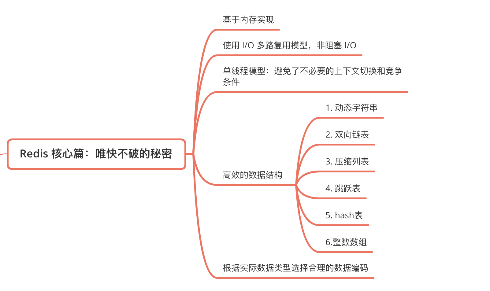

关系型数据库跟Redis本质上的区别:


**Redis**采用的是基于内存,采用的是单进程单线程模型的 KV 数据库,由C语言编写,官方提供的数据是可以达到100000+的**QPS(每秒内查询次数)**。

- 完全基于内存,绝大部分请求是纯粹的**内存操作**,非常快速。它的,数据存在内存中,类似于**HashMap**,**HashMap**的优势就是查找和操作的时间复杂度都是O(1);
- 数据结构简单,对数据操作也简单,**Redis**中的数据结构是专门进行设计的;
- 采用单线程,避免了不必要的**上下文切换和竞争条件**,也不存在多进程或者多线程导致的切换而消耗 **CPU**,不用去考虑各种锁的问题,不存在加锁释放锁操作,没有因为可能出现死锁而导致的性能消耗;
- 使用多路I/O复用模型,非阻塞IO;
- 使用底层模型不同,它们之间底层实现方式以及与客户端之间通信的应用协议不一样,**Redis**直接自己构建了VM 机制 ,因为一般的系统调用系统函数的话,会浪费一定的时间去移动和请求;

Rides既然是单线程的,那么现在服务器都是多核心的,会浪费性能吧

是的他是单线程的,但是,我们可以通过在单机开多个**Redis实例**


## Redis 持久化

### 什么是 Redis 持久化？

持久化就是把内存的数据写到磁盘中去,防止服务宕机内存数据丢失。

Redis 提供了两种持久化方式:**RDB(默认)和 AOF**

redis是内存数据库，数据存放于:

- **内存:高效,断电(关机)内存数据会丢失**

- **硬盘:读写速度慢于内存,断电数据不会丢失**

**Redis 持久化存储支持两种方式:RDB 和 AOF。RDB 一定时间去存储文件,AOF 默认每秒去存储历史命令,**

**Redis 是支持持久化的内存数据库,也就是说 redis 需要经常将内存中的数据同步到硬盘来保证持久化。**

### RDB持久化原理

RDB 是 Redis DataBase 缩写

1. Redis 是内存数据库,如果不将内存中的数据库状态保存到磁盘中,那么一旦服务器进程退出,服务器中的数据库的状态也会消失。造成数据的丢失,所以 redis 提供了持久化的功能。

2. 在指定的时间间隔内将内存中的数据集快照写入磁盘,也就是所说的 snapshot 快照,它恢复是将磁盘中的数据直接读到内存里。

3. Redis 会单独创建(fock)一个子进程来进行持久化,会先将数据写入到一个临时文件中,待持久化过程都结束了,再用这个临时文件替换上次持久化好的文件。整个过程中,主进程是不进行任何 IO 操作的。这就确保了极高的性能。
4. 如果需要进行大规模的数据的恢复,且对于数据恢复的完整性不是非常敏感,那 RDB 方式要比 AOF 方式更加的高效。RDB 的缺点是最后一次持久化的数据可能丢失。

功能核心函数 rdbSave(生成 RDB 文件)和 rdbLoad(从文件加载内存)两个函数

- **rdbSave:生成 RDB 文件到磁盘**
- **rdbLoad:从文件夹恢复数据到内存**

**RDB持久化过程**

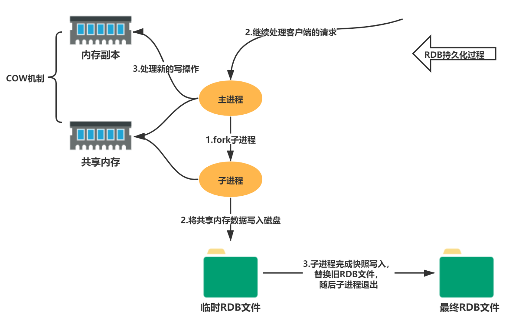

RDB : 是redis默认的持久化机制,快照是默认的持久化方式。这种方式就是将内存中数据以快照的方式写入到二进制文件中,默认的文件名为**dump.rdb**。


**RDB 持久化完整流程图**

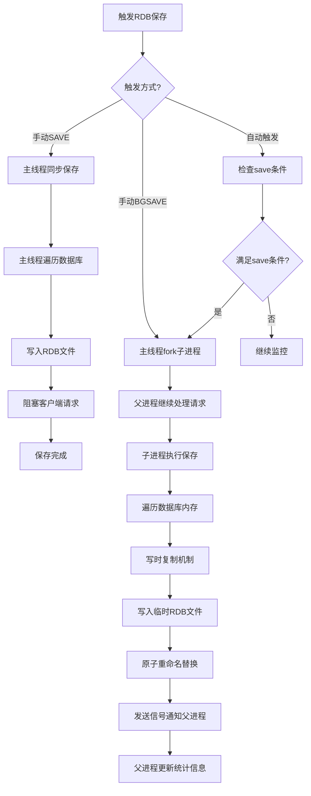

**优点:**

- 快照保存数据极快,还原数据极快
- 适用于灾难备份

**缺点:**

- 小内存机器不适合使用,RDB机制符合要求就会照快照

**快照条件:**

```text
1、服务器正常关闭:./bin/redis-cli shutdown
2、key满足一定条件,会进行快照
 vim redis.config 搜索save
 /save
save   900  1      //每900秒(15分钟)至少1个key发生变化,产生快照
save   300  10     //每300秒  (5分钟)至少10个key发生变化,产生快照
save   60   10000  //每60秒(1分钟)至少10000个key发生变化,产生快照
```

### AOF持久化原理

由于快照方式是在一定间隔时间做一次的,所以如果 redis 意外 down 掉的话,就会丢失最后一个快照后的所有修改。如果应用要求不能丢失任何修改的话,可以采用 aof 持久化方式。

Append-only file:aof 比 rdb 有更好的持久化性,是由于在使用 aof 持久化方式时,redis 会将每一个收到的命令都通过 write 函数追加到文件中(默认是 appendonly.aof)。当 redis 重启是会通过重新执行文件中保存的写命令来在内存中重建整个数据库的内容。

**AOF执行过程**

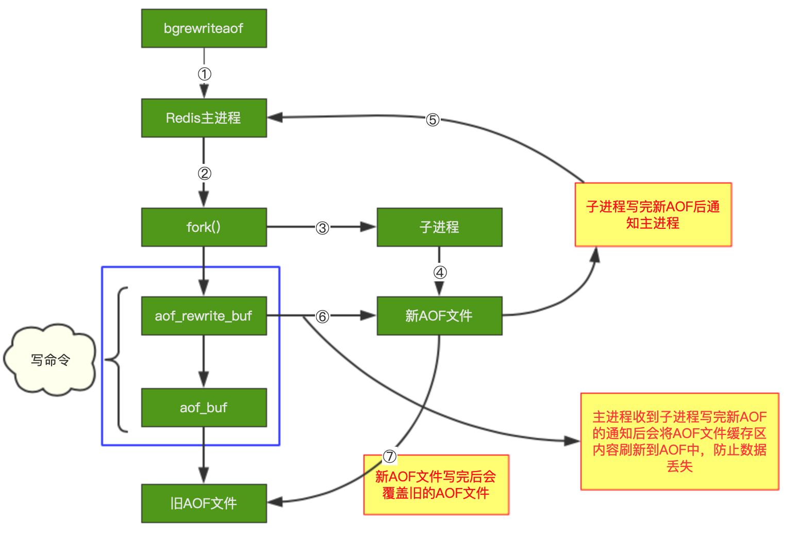

**AOF 持久化完整流程图**

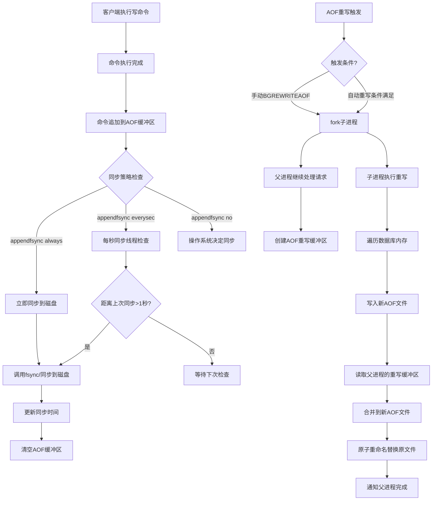

每当执行服务器(定时)任务或者函数时, flushAppendOnlyFile 函数都会被调用,这个函数执行以下两个工作 ,aof 写入保存:

- **WRITE:根据条件,将 aof_buf 中的缓存写入到 AOF 文件。**

- **SAVE:根据条件,调用 fsync 或 fdatasync 函数,将 AOF 文件保存到磁盘中。**

**有三种方式如下(默认是:每秒 fsync 一次)**

- appendonly yes :启用 aof   持久化方式
- appendfsync always :收到写命令就立即写入磁盘,最慢,但是保证完全的持久化
- appendfysnceverysec :每秒钟写入磁盘一次,在性能和持久化方面做了很好的折中
- appendfysnc no :完全依赖 os,性能孔,持久化没保证

**AOF 同步策略对比**

```shell
class AOFSyncStrategies:
    """AOF同步策略对比分析"""
    
    strategies = {
        "appendfsync no": {
            "描述": "由操作系统决定同步时机",
            "同步时机": "依赖操作系统刷新机制（通常30秒）",
            "数据安全": "最低，可能丢失约30秒数据",
            "性能影响": "最佳（无额外磁盘I/O）",
            "适用场景": "可容忍数据丢失的非关键业务"
        },
        
        "appendfsync everysec": {
            "描述": "每秒同步一次",
            "同步时机": "每秒由后台线程执行fsync",
            "数据安全": "中等，最多丢失1秒数据",
            "性能影响": "良好（轻微性能开销）",
            "性能特征": """
            1. 主线程只负责写入AOF缓冲区
            2. 后台线程每秒执行fsync
            3. 如果fsync耗时超过1秒，主线程会阻塞直到完成
            """,
            "适用场景": "生产环境推荐配置"
        },
        
        "appendfsync always": {
            "描述": "每次写入都同步",
            "同步时机": "每个命令执行后立即fsync",
            "数据安全": "最高，理论上零数据丢失",
            "性能影响": "差（频繁磁盘I/O，性能下降50-90%）",
            "性能特征": """
            1. 每个命令后都执行fsync
            2. 磁盘成为性能瓶颈
            3. 吞吐量大幅下降
            """,
            "适用场景": "对数据一致性要求极高的场景"
        }
    }
```

**产生的问题:**

aof 的方式也同时带来了另一个问题。持久化文件会变的越来越大。例如我们调用 incr test 命令 100 次,文件中必须保存全部的100条命令,其实有 99 条都是多余的。

### 持久化方式对比

RDB (快照)

- "原理": "定期生成数据快照",
- "文件格式": "二进制紧凑格式",
- "恢复速度": "快（直接加载内存）",
- "数据安全": "可能丢失最后一次快照后的数据",
- "性能影响": "fork时短暂阻塞",
- "适用场景": "备份、灾难恢复、快速重启"

AOF (追加日志)

- "原理": "记录每个写操作",
- "文件格式": "文本协议格式（RESP）",
- "恢复速度": "慢（重放所有命令）",
- "数据安全": "高（可配置fsync频率）",
- "性能影响": "持续轻微开销",
- "适用场景": "高数据安全要求场景"

混合持久化 (Redis 4.0+)

- "原理": "RDB + AOF 结合",
- "文件格式": "RDB头部 + AOF尾部",
- "恢复速度": "较快（先加载RDB，再重放增量AOF）",
- "数据安全": "最高",
- "性能影响": "RDB和AOF的综合",
- "适用场景": "生产环境推荐配置"

## Redis是怎么持久化的？服务主从数据怎么交互的？

RDB做镜像全量持久化,AOF做增量持久化。因为RDB会耗费较长时间,不够实时,在停机的时候会导致大量丢失数据,所以需要AOF来配合使用。

在redis实例重启时,会使用RDB持久化文件重新构建内存,再使用AOF重放近期的操作指令来实现完整恢复重启之前的状态。

> - 这里很好理解,把RDB理解为一整个表全量的数据,AOF理解为每次操作的日志就好了,服务器重启的时候先把表的数据全部搞进去,但是他可能不完整,你再回放一下日志,数据不就完整了嘛。
> 
> - 不过Redis本身的机制是 AOF持久化开启且存在AOF文件时,优先加载AOF文件;AOF关闭或者AOF文件不存在时,加载RDB文件;加载AOF/RDB文件后,Redis启动成功; AOF/RDB文件存在错误时,Redis启动失败并打印错误信息

## 如果突然机器掉电会怎样？

取决于AOF日志sync属性的配置,如果不要求性能,在每条写指令时都sync一下磁盘,就不会丢失数据。但是在高性能的要求下每次都sync是不现实的,一般都使用定时sync,比如1s1次,这个时候最多就会丢失1s的数据。

在aof这种方式持久化时候,追加写日志的方式有三种:

- always(每次)
  - 每次写入操作均同步到AOF文件中,**数据零误差,性能较低**,不建议使用。
- everysec(每秒)
  - 每秒将缓冲区中的指令同步到AOF文件中,**数据准确性较高,性能较高在系统突然宕机的情况下丢失1秒内的数据**,,建议使用,也是默认配置
- no(系统控制)
  - 由操作系统控制每次同步到AOF文件的周期,整体**过程不可控**

## RDB的原理是什么？

你给出两个词汇就可以了,**fork和cow**。fork是指redis通过创建子进程来进行RDB操作,cow指的是**copy on write**,子进程创建后,父子进程共享数据段,父进程继续提供读写服务,写脏的页面数据会逐渐和子进程分离开来。


## Redis的同步机制了解么？

Redis可以使用**主从同步,从从同步**。第一次同步时,主节点做一次**bgsave**,并同时将后续修改操作记录到内存buffer,待完成后将RDB文件全量同步到复制节点,复制节点接收完成后将RDB镜像加载到内存。加载完成后,再通知主节点将期间修改的操作记录同步到复制节点进行重放就完成了同步过程。

后续的增量数据通过AOF日志同步即可,有点类似数据库的binlog。

Redis 同步体系结构:

```shell
Redis 同步机制
├── 主从复制 (Replication)
│   ├── 全量同步 (Full Resync)
│   ├── 部分重同步 (Partial Resync)
│   └── 无盘复制 (Diskless Replication)
├── 哨兵模式 (Sentinel)
│   ├── 监控 (Monitoring)
│   ├── 通知 (Notification)
│   └── 自动故障转移 (Automatic Failover)
├── 集群模式 (Cluster)
│   ├── 数据分片 (Sharding)
│   ├── 哈希槽 (Hash Slot)
│   └── 故障检测与转移 (Failure Detection)
└── 发布订阅 (Pub/Sub)
    ├── 频道 (Channel)
    └── 模式 (Pattern)
```

**主从复制建立流程:**

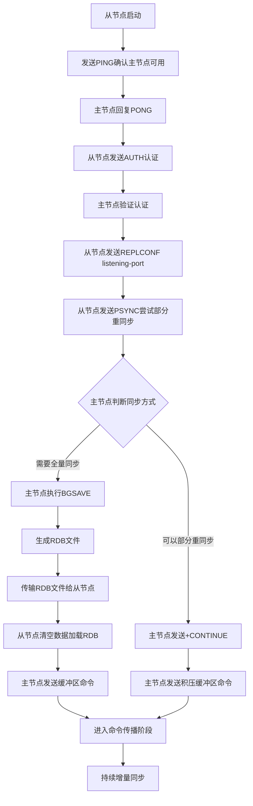

**同步机制对比表**

| 特性           | 主从复制           | 哨兵模式             | Redis集群            |
| :------------- | :----------------- | :------------------- | :------------------- |
| **数据一致性** | 最终一致           | 最终一致             | 最终一致             |
| **高可用性**   | 手动故障转移       | 自动故障转移         | 自动故障转移         |
| **可扩展性**   | 垂直扩展           | 垂直扩展             | 水平扩展             |
| **数据分片**   | 不支持             | 不支持               | 支持（16384槽）      |
| **读写分离**   | 支持               | 支持                 | 支持                 |
| **故障检测**   | 简单检测           | 分布式检测           | 分布式检测           |
| **配置复杂度** | 简单               | 中等                 | 复杂                 |
| **适用场景**   | 数据备份、读写分离 | 高可用、故障自动转移 | 大规模数据、水平扩展 |


**部署模式选择**

```shell
选择同步方案决策树：
开始
├── 需求：仅数据备份
│   └── 选择：主从复制
│
├── 需求：高可用 + 自动故障转移
│   ├── 数据量小 (< 32GB)
│   │   └── 选择：哨兵模式 (1主2从3哨兵)
│   └── 数据量大 (> 32GB)
│       └── 考虑：集群模式
│
├── 需求：水平扩展 + 大数据量
│   └── 选择：Redis集群
│
└── 需求：多数据中心
    ├── 方案1：集群模式 + 跨机房部署
    ├── 方案2：哨兵模式 + 异步复制
    └── 方案3：自定义代理层

关键考虑因素：
1. 数据量大小
2. 读写比例  
3. 可用性要求
4. 运维复杂度
5. 成本预算
```

## Redis集群和Redis哨兵模式区别

### 架构设计对比

#### 哨兵模式 (Sentinel) 架构

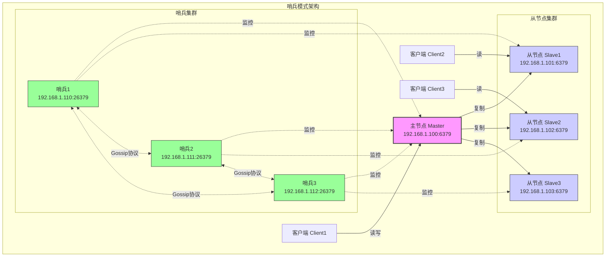


#### Redis 集群 (Cluster) 架构

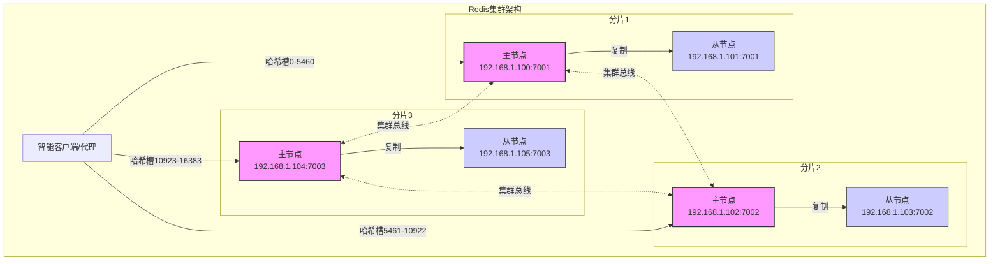

### 哨兵模式故障检测算法流程

```java
class SentinelFailureDetection:
    """哨兵故障检测算法详解"""
    
    def detection_algorithm(self):
        """完整的故障检测算法"""
        
        algorithm = {
            "阶段1：定期健康检查": {
                "频率": "每秒执行10次sentinelTimer函数",
                "操作": [
                    "1. 向所有监控的Redis实例发送PING命令",
                    "2. 检查PONG回复的及时性",
                    "3. 更新实例的最后响应时间"
                ],
            },
            
            "阶段2：主观下线检测": {
                "条件": """
                公式：current_time - last_pong_time > down_after_milliseconds
                
                默认值：
                - down-after-milliseconds: 30000ms (30秒)
                - 可针对不同实例单独配置
                """,
                "判定过程": [
                    "1. 哨兵独立判断，不与其他哨兵协商",
                    "2. 标记实例为S_DOWN状态",
                    "3. 记录主观下线开始时间",
                    "4. 在哨兵内部日志中记录"
                ],
            },
            
            "阶段3：客观下线检测": {
                "仲裁机制": """
                需要满足两个条件：
                1. 足够数量的哨兵报告主观下线
                2. 超过配置的quorum值
                
                公式：reported_sentinels >= quorum
                
                示例：
                - 配置quorum=2
                - 3个哨兵中，哨兵A、B报告主观下线
                - 满足条件，标记为客观下线
                """,
                "投票收集": [
                    "1. 通过__sentinel__:hello频道交换信息",
                    "2. 每个哨兵记录其他哨兵的报告",
                    "3. 统计每个实例的主观下线报告数"
                ],
                "状态转换": """
                S_DOWN -> O_DOWN 的条件：
                1. 当前哨兵已标记实例为S_DOWN
                2. 收到足够多其他哨兵的S_DOWN报告
                3. 超过failover_timeout时间未恢复
            },
            
            "阶段4：领导者选举": {
                "算法": "基于Raft算法的变种实现",
                "选举条件": [
                    "1. 主节点被标记为客观下线",
                    "2. 当前没有进行中的故障转移",
                    "3. 最近一次故障转移已完成或超时"
                ],
                "投票规则": [
                    "1. 每个配置纪元(epoch)只能投一票",
                    "2. 先到先得原则",
                    "3. 需要获得多数票(majority)"
                ],
                "选举过程": [
                    "1. 哨兵向其他哨兵发送投票请求",
                    "2. 收到投票请求的哨兵检查条件",
                    "3. 如果条件满足且未投票，则投票同意",
                    "4. 获得多数票的哨兵成为领导者"
                ],
            },
            
            "阶段5：故障转移执行": {
                "选择新主节点策略": [
                    "1. 过滤掉不健康的从节点",
                    "2. 按优先级排序(slave-priority)",
                    "3. 选择复制偏移量最大的",
                    "4. 选择runid最小的"
                ],
                "转移步骤": [
                    "1. 领导者哨兵向选定的从节点发送SLAVEOF NO ONE",
                    "2. 等待从节点提升为主节点",
                    "3. 向其他从节点发送SLAVEOF新主节点",
                    "4. 更新客户端配置",
                    "5. 监控新主节点状态"
                ],
                "配置更新": [
                    "1. 通过发布订阅频道通知其他哨兵",
                    "2. 更新sentinel配置文件",
                    "3. 客户端重定向到新主节点"
                ]
            }
        }
```

**哨兵模式配置详解**

```shell
# sentinel.conf 完整配置示例

# 1. 监控配置
# 格式：sentinel monitor <master-name> <ip> <port> <quorum>
sentinel monitor mymaster 192.168.1.100 6379 2
# quorum=2 表示需要至少2个哨兵同意才能进行故障转移

# 2. 故障检测配置
sentinel down-after-milliseconds mymaster 30000
# 30秒无响应判定为主观下线

sentinel failover-timeout mymaster 180000
# 故障转移超时时间（3分钟）

# 3. 并行同步配置
sentinel parallel-syncs mymaster 1
# 故障转移时，同时向新主节点同步的从节点数量

# 4. 认证配置
sentinel auth-pass mymaster YourStrongPassword123
# 如果Redis实例需要密码认证

# 5. 通知脚本
sentinel notification-script mymaster /var/redis/notify.sh
# 故障转移时执行的脚本

sentinel client-reconfig-script mymaster /var/redis/reconfig.sh
# 客户端重新配置脚本

# 6. 运行配置
sentinel resolve-hostnames no
# 是否解析主机名（建议no，使用IP）

sentinel announce-ip 192.168.1.110
# 宣告的IP地址（用于NAT环境）

sentinel announce-port 26379
# 宣告的端口

# 7. 倾斜模式配置
sentinel tilt-period 30000
# 倾斜模式持续时间

sentinel tilt-window 120000
# 倾斜检测窗口

# 8. 多个主节点监控
sentinel monitor othermaster 192.168.1.200 6379 3
sentinel down-after-milliseconds othermaster 50000
sentinel failover-timeout othermaster 300000
sentinel parallel-syncs othermaster 2
```

### 集群故障转移机制

```java
class ClusterFailoverMechanism:
    """集群故障转移机制详解"""
    
    def failover_process(self):
        """完整的故障转移过程"""
        
        process = {
            "阶段1：故障检测": {
                "检测机制": "基于Gossip协议的分布式检测",
                "超时配置": "cluster-node-timeout（默认15秒）",
                "检测流程": [
                    "1. 节点定期发送PING消息",
                    "2. 等待PONG回复",
                    "3. 超时后标记为PFAIL（疑似故障）",
                    "4. 通过Gossip传播PFAIL状态"
                ],
                "客观下线判定": """
                需要多数主节点确认：
                公式：confirmations >= (num_masters / 2) + 1
                
                示例：5个主节点需要至少3个确认
                """
            },
            
            "阶段2：故障转移授权": {
                "触发条件": [
                    "1. 主节点被标记为FAIL",
                    "2. 该主节点有至少一个从节点",
                    "3. 从节点复制延迟在合理范围内"
                ],
                "延迟时间计算": """
                delay = cluster_node_timeout * 2 + 
                        cluster_slave_validity_factor * 1000
                
                默认：15000*2 + 10*1000 = 40000ms (40秒)
                
                从节点必须在这个时间内开始故障转移
                """,
                "从节点排名": [
                    "1. 按复制偏移量排序",
                    "2. 偏移量最大的从节点排名最高",
                    "3. 排名最高的从节点优先发起故障转移"
                ]
            },
            
            "阶段3：纪元投票": {
                "纪元概念": "单调递增的配置版本号",
                "投票规则": [
                    "1. 每个主节点每个纪元只能投一票",
                    "2. 投票给第一个请求的从节点",
                    "3. 需要获得多数票（N/2 + 1）"
                ],
                "投票消息": """
                FAILOVER_AUTH_REQUEST消息包含：
                - 当前纪元
                - 配置纪元
                - 故障主节点名称
                - 请求者的复制偏移量
                """
            },
            
            "阶段4：从节点晋升": {
                "晋升步骤": [
                    "1. 停止复制原主节点",
                    "2. 撤销原主节点的槽位分配",
                    "3. 接管原主节点的槽位",
                    "4. 广播配置更新"
                ],
                "数据一致性保证": [
                    "使用复制偏移量确保数据完整性",
                    "故障转移期间拒绝客户端写请求",
                    "等待原主节点所有命令传播完成"
                ]
            },
            
            "阶段5：配置传播": {
                "传播机制": "通过UPDATE消息广播新配置",
                "配置更新": [
                    "1. 更新槽位映射表",
                    "2. 更新节点角色",
                    "3. 递增配置纪元",
                    "4. 持久化到nodes.conf"
                ],
                "客户端重定向": "返回MOVED响应引导客户端到新节点"
            }
        }
        
        return process
```

### 功能特性对比表

| 特性维度       | Redis哨兵模式                 | Redis集群模式            |
| :------------- | :---------------------------- | :----------------------- |
| **数据分布**   | 单一数据集，全量复制          | 数据分片，16384个哈希槽  |
| **扩展性**     | 垂直扩展（读写分离）          | 水平扩展（数据分片）     |
| **最大内存**   | 受限于单节点内存（通常<64GB） | 理论无限制（分片扩展）   |
| **写性能**     | 单点写入，受限于主节点        | 多节点并行写入           |
| **读性能**     | 可从从节点读取，线性扩展      | 可从各分片读取，线性扩展 |
| **高可用性**   | 自动故障转移（秒级）          | 自动故障转移（秒级）     |
| **数据一致性** | 最终一致性（异步复制）        | 最终一致性（异步复制）   |
| **客户端支持** | 需要客户端支持哨兵或使用代理  | 需要集群感知的客户端     |
| **网络分区**   | 可能产生脑裂，依赖quorum配置  | 有副本迁移机制，更健壮   |
| **运维复杂度** | 中等                          | 高                       |
| **成熟度**     | 非常成熟，广泛应用            | 成熟，但比哨兵稍新       |


### 集群模式和哨兵模式如何选择

```shell
开始选择
│
├── 数据量 < 64GB?
│   ├── 是 → 进入分支A
│   └── 否 → 必须选择集群模式 ✓
│
├── 分支A：写入QPS < 10万?
│   ├── 是 → 进入分支B
│   └── 否 → 建议选择集群模式 ✓
│
├── 分支B：需要自动故障转移?
│   ├── 是 → 选择哨兵模式 ✓
│   └── 否 → 主从复制即可 ✓
│
└── 特殊需求考虑：
    ├── 需要多key事务 → 哨兵模式（或使用hash tag的集群）
    ├── 需要水平扩展 → 集群模式
    ├── 运维能力有限 → 哨兵模式
    └── 成本敏感 → 根据数据量决定
```

### 不同业务场景应该选择什么模式

| 业务场景         | 推荐方案  | 理由                   | 配置建议               |
| :--------------- | :-------- | :--------------------- | :--------------------- |
| **小型应用**     | 主从复制  | 简单可靠，成本低       | 1主1从，定期备份       |
| **中型应用**     | 哨兵模式  | 自动故障转移，读写分离 | 1主2从3哨兵            |
| **大型应用**     | Redis集群 | 数据分片，水平扩展     | 3主3从起步             |
| **读写分离场景** | 哨兵模式  | 天然支持读写分离       | 多个从节点分担读负载   |
| **高写入场景**   | Redis集群 | 多主节点并行写入       | 根据写入量确定主节点数 |
| **多租户SaaS**   | Redis集群 | 数据隔离，弹性扩展     | 按租户分片             |
| **缓存场景**     | 哨兵模式  | 数据量不大，高可用重要 | 适当内存，持久化可选   |
| **会话存储**     | 哨兵模式  | 数据重要，需要故障转移 | 启用持久化，快速恢复   |
| **实时排行榜**   | Redis集群 | 数据量大，读写都高     | 合理分片，监控热点     |
| **消息队列**     | 哨兵模式  | 简单可靠，延迟低       | 使用List/Stream结构    |


### **核心差异总结**

1. **架构本质不同**：
  - 哨兵：**高可用解决方案**，解决单点故障问题
  - 集群：**分布式解决方案**，解决数据分片和水平扩展问题
2. **数据分布方式**：
  - 哨兵：全量复制，所有节点有完整数据
  - 集群：数据分片，每个节点只负责部分数据
3. **扩展维度**：
  - 哨兵：垂直扩展（增加从节点提升读能力）
  - 集群：水平扩展（增加分片提升读写能力）
4. **客户端复杂度**：
  - 哨兵：客户端相对简单，支持广泛
  - 集群：需要集群感知的客户端，支持事务有限

```shell
单机Redis → 哨兵模式 → Redis集群
           ↑          ↑
        高可用需求   水平扩展需求
        
迁移时机：
1. 单机→哨兵：需要自动故障转移时
2. 哨兵→集群：数据量>64GB或写入QPS>10万时
```

## 传统主从复制和集群主从复制的区别

Redis集群模式内置了主从复制机制，但它比传统的主从复制更复杂、更强大。Redis集群模式内置主从复制;


### **主从模式架构**

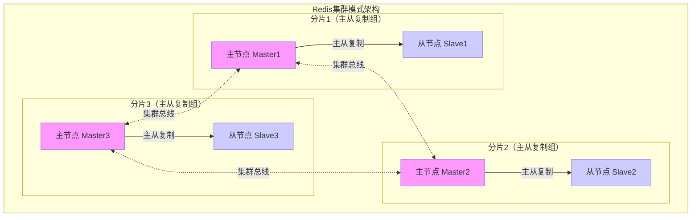

### 相同点对比

```shell
class ReplicationSimilarities:
    """集群模式与主从复制的相同点"""
    
    @staticmethod
    def common_features():
        """共同特性"""
        
        similarities = {
            "复制协议": {
                "两者使用相同": "Redis复制协议（REPL协议）",
                "命令传播": "异步命令传播机制",
                "数据同步": "全量同步（RDB） + 部分重同步"
            },
            
            "数据流向": {
                "方向": "单向复制（主→从）",
                "机制": "基于复制偏移量和积压缓冲区",
                "一致性": "最终一致性（异步复制）"
            },
            
            "同步方式": {
                "全量同步": "使用RDB文件进行初始同步",
                "增量同步": "使用复制积压缓冲区进行命令传播",
                "断线重连": "支持部分重同步（PSYNC）"
            },
            
            "基本命令": {
                "相同命令集": """
                - PSYNC: 部分同步
                - REPLCONF: 复制配置
                - SYNC: 全量同步（旧版）
                - PING/PONG: 心跳检测
                """
            }
        }
        
        return similarities
```

### **核心对比差异**

| 对比维度         | 传统主从复制             | 集群模式主从复制               |
| :--------------- | :----------------------- | :----------------------------- |
| **复制单位**     | 整个数据库复制           | 按哈希槽（slot）分组复制       |
| **复制拓扑**     | 单主多从，星型结构       | 多主多从，网状结构             |
| **故障转移**     | 手动或通过哨兵自动       | 内置自动故障转移               |
| **数据分布**     | 所有从节点有全量数据     | 从节点只有所属主节点的部分数据 |
| **读写分离**     | 天然支持，所有从节点可读 | 需要指定读取副本节点           |
| **复制ID管理**   | 简单的主从ID             | 复杂的复制ID和配置纪元         |
| **客户端重定向** | 不需要                   | 需要处理MOVED/ASK重定向        |


### 与传统主从复制的拓扑结构对比

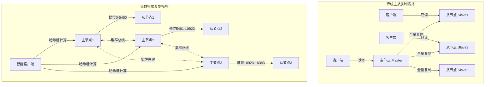

### 数据同步机制对比

```shell
class SyncMechanismComparison:
    """数据同步机制对比"""
    
    @staticmethod
    def sync_comparison():
        """详细对比"""
        
        comparison = {
            "同步触发": {
                "传统主从": [
                    "从节点启动时自动触发",
                    "手动执行SLAVEOF命令",
                    "复制连接断开后重连"
                ],
                "集群模式": [
                    "从节点加入集群时自动建立",
                    "故障转移后新主从关系建立",
                    "槽位迁移过程中的数据同步"
                ]
            },
            
            "同步内容": {
                "传统主从": "整个数据库的所有数据",
                "集群模式": "只同步所属主节点负责的槽位数据",
                "内存影响": {
                    "传统主从": "从节点内存消耗与主节点相同",
                    "集群模式": "从节点只消耗部分内存"
                }
            },
            
            "同步协议": {
                "相同点": "都使用PSYNC协议进行部分重同步",
                "不同点": {
                    "传统主从": "简单的复制偏移量管理",
                    "集群模式": "结合配置纪元的复杂偏移量管理"
                }
            },
            
            "断线重连": {
                "传统主从": {
                    "条件": "主节点积压缓冲区中仍有数据",
                    "过程": "发送PSYNC <replid> <offset>",
                    "恢复": "从断点继续复制"
                },
                "集群模式": {
                    "额外检查": "检查主节点配置纪元是否变化",
                    "特殊情况": "主节点可能已故障转移",
                    "处理": "可能需要重新进行全量同步"
                }
            },
            
            "性能影响": {
                "传统主从": {
                    "全量同步": "对主节点压力大（RDB生成）",
                    "网络传输": "传输整个数据库",
                    "从节点阻塞": "加载RDB时不可用"
                },
                "集群模式": {
                    "优势": "只同步部分数据，压力分散",
                    "并行同步": "多个主从组可同时同步",
                    "影响范围": "只影响部分槽位的访问"
                }
            }
        }
        
        return comparison
```

### 故障转移机制对比

| 故障转移阶段   | 传统主从（哨兵模式）            | 集群模式                             |
| :------------- | :------------------------------ | :----------------------------------- |
| **故障检测**   | 哨兵节点检测，主观下线→客观下线 | 集群节点通过Gossip协议检测           |
| **检测时间**   | 依赖down-after-milliseconds配置 | 依赖cluster-node-timeout配置         |
| **选举机制**   | 哨兵领导者选举（Raft变种）      | 从节点投票选举（需要多数主节点同意） |
| **投票单位**   | 哨兵节点投票                    | 主节点投票（每个主节点一票）         |
| **晋升条件**   | 获得多数哨兵投票                | 获得多数主节点投票且数据较新         |
| **配置更新**   | 哨兵更新配置并通知客户端        | 新主节点广播配置更新                 |
| **客户端处理** | 客户端需要重新发现主节点        | 客户端收到MOVED/ASK重定向            |
| **数据一致性** | 可能丢失故障期间的部分写入      | 基于复制偏移量确保数据完整性         |


### 集群主从复制的优缺点

**优点分析**

```shell
class ClusterReplicationAdvantages:
    """集群模式主从复制的优点"""
    
    @staticmethod
    def list_advantages():
        """优势列表"""
        
        advantages = {
            "水平扩展性": {
                "描述": "支持数据分片，突破单机内存限制",
                "示例": "可以将1TB数据分布到10个主节点",
                "传统限制": "传统主从复制所有节点都有全量数据"
            },
            
            "故障隔离": {
                "描述": "单个主节点故障只影响部分数据",
                "影响范围": "只影响该主节点负责的槽位",
                "传统问题": "传统主节点故障影响整个服务"
            },
            
            "并行复制": {
                "描述": "多个主从组可以并行复制",
                "性能优势": "全量同步时不会阻塞整个集群",
                "网络优化": "复制流量分散到不同网络路径"
            },
            
            "资源高效": {
                "内存": "从节点只存储部分数据，节省内存",
                "网络": "复制流量减少，网络利用率高",
                "磁盘": "RDB文件更小，持久化更快"
            },
            
            "内置高可用": {
                "描述": "无需额外组件（如哨兵）",
                "简化架构": "减少运维复杂性",
                "一致性": "复制和故障转移逻辑集成"
            },
            
            "智能数据分布": {
                "描述": "支持槽位迁移和重新平衡",
                "动态调整": "可以根据负载动态迁移数据",
                "热点处理": "可以将热点数据迁移到更强节点"
            }
        }
        
        return advantages
```

**缺点限制**

```shell
class ClusterReplicationLimitations:
    """集群模式主从复制的限制"""
    
    @staticmethod
    def list_limitations():
        """限制列表"""
        
        limitations = {
            "客户端复杂性": {
                "问题": "客户端需要支持集群协议",
                "影响": "需要处理MOVED/ASK重定向",
                "限制": "某些旧客户端不支持集群模式"
            },
            
            "多key操作限制": {
                "问题": "多key操作必须在同一槽位",
                "限制操作": [
                    "事务（MULTI/EXEC）",
                    "Lua脚本",
                    "集合交并差操作"
                ],
                "解决方案": "使用hash tag确保key在同一槽位"
            },
            
            "迁移复杂性": {
                "问题": "槽位迁移期间客户端需要处理ASK重定向",
                "影响": "迁移过程中可能有性能下降",
                "运维要求": "需要仔细规划迁移过程"
            },
            
            "内存碎片": {
                "问题": "数据分散可能导致内存利用率下降",
                "原因": "每个节点有自己的内存分配",
                "影响": "总内存需求可能比单机略高"
            },
            
            "配置管理": {
                "问题": "配置分散在多个节点",
                "挑战": "需要统一管理和监控",
                "工具": "依赖redis-cli --cluster命令"
            },
            
            "备份恢复": {
                "问题": "需要备份所有节点数据",
                "复杂性": "备份和恢复过程更复杂",
                "一致性": "需要确保所有节点备份时间点一致"
            },
            
            "运维复杂度": {
                "问题": "需要管理更多节点",
                "技能要求": "需要更深入的Redis知识",
                "监控挑战": "需要监控整个集群状态"
            }
        }
        
        return limitations
```

### 适用场景选择

**集群模式的场景**

```shell
以下场景适合选择Redis集群模式：

1. 数据量超过单机内存容量（> 64GB）
   └── 需要数据分片存储

2. 写入吞吐量要求高（> 10万QPS）
   └── 需要多主节点并行写入

3. 需要真正的水平扩展
   └── 可以随时增加节点扩展容量

4. 业务可以接受多key操作限制
   └── 可以使用hash tag设计key

5. 有专业的运维团队
   └── 能够处理集群的复杂性
```

**传统主从复制的场景**

```shell
以下场景适合选择传统主从复制（哨兵模式）：

1. 数据量不大（< 64GB）
   └── 单机可以容纳所有数据

2. 主要是读多写少场景
   └── 可以通过增加从节点扩展读能力

3. 需要简单的事务支持
   └── 传统主从支持完整的多key事务

4. 客户端兼容性要求高
   └── 几乎所有Redis客户端都支持

5. 运维资源有限
   └── 希望保持架构简单
```


### **核心结论**

1. **Redis集群模式确实内置了主从复制机制**，但它是增强版的主从复制
2. **集群模式 = 数据分片 + 主从复制 + 自动故障转移** 的集成解决方案
3. **与传统主从复制的主要区别**：
  - 数据分片：每个主节点只负责部分数据
  - 复制范围：从节点只复制所属主节点的数据
  - 故障转移：内置自动化，无需额外组件
  - 客户端：需要集群感知，处理重定向


## Redis集群分片核心机制


### 什么是分片？

```java
class RedisShardingDefinition:
    """Redis集群分片的精确概念"""
    
    @staticmethod
    def conceptual_definition():
        """概念定义"""
        
        return {
            "技术定义": {
                "分片": "将整个数据空间逻辑划分为16384个槽位（slots）",
                "数据分布": "每个槽位分配给特定的主节点管理",
                "key映射": "通过CRC16算法计算key属于哪个槽位",
                "数学表达": """
                设：K = 所有可能的key
                     S = {0,1,2,...,16383}（槽位集合）
                     N = {n1,n2,...,nm}（节点集合）
                    
                映射函数：f: K → S（CRC16哈希）
                分配函数：g: S → N（槽位分配表）
                
                最终：每个key → 特定槽位 → 特定节点
                """
            },
            
            "可视化比喻": {
                "书架比喻": """
                想象一个巨大的书架（所有数据）
                分片 = 把书架分成16384个小格子（槽位）
                每个格子分配给不同的人管理（节点）
                要找书时：书名字 → 格子编号 → 找对应的人
                """,
            },
            
            "物理实现": {
                "内存级别": "不同节点的物理内存独立",
                "进程级别": "每个节点是独立的Redis进程",
                "网络级别": "节点间通过集群总线通信",
                "数据级别": "数据实际存储在不同的机器/进程"
            }
        }
    
    @staticmethod
    def slot_visualization():
        """槽位分布可视化"""
        
        visualization = """
Redis集群分片空间（16384个槽位）：
┌─────────────────────────────────────────────────────┐
│                  总槽位空间：16384                  │
├─────────┬─────────┬─────────┬─────────┬─────────┤
│ 槽位0   │ 槽位1   │ 槽位2   │  ...    │ 槽位16383│
│   ↓     │   ↓     │   ↓     │         │   ↓     │
├─────────┼─────────┼─────────┼─────────┼─────────┤
│ 节点A   │ 节点A   │ 节点B   │  ...    │ 节点C   │
│ (0-5460)│         │(5461-...│         │(10923-) │
└─────────┴─────────┴─────────┴─────────┴─────────┘

3主节点典型分配：
• 节点A：槽位 0-5460（5461个槽位）
• 节点B：槽位 5461-10922（5462个槽位）  
• 节点C：槽位 10923-16383（5461个槽位）

每个槽位 = 数据子集的管理单元
"""
return visualization
```

### 为什么要分片？

#### 突破单机内存限制

```java
class MemoryLimitationAnalysis:
    """突破单机内存限制的分析"""
    
    @staticmethod
    def single_node_limits():
        """单节点内存限制分析"""
        
        limits = {
            "物理限制": {
                "服务器最大内存": "通常256GB-2TB（高端服务器）",
                "成本因素": "大内存服务器价格昂贵，非线性增长",
                "实际约束": "大多数云服务商单实例≤256GB"
            },
            
            "Redis特定限制": {
                "RDB持久化问题": "fork()时内存翻倍风险",
                "示例计算": """
                单机128GB Redis：
                • 正常使用：128GB
                • RDB fork时：可能达到256GB
                • 需要系统预留：至少384GB物理内存
                """,
                "AOF重写问题": "类似的内存压力"
            },
            
            "性能限制": {
                "GC压力": "大内存GC暂停时间增长",
                "缓存效率": "缓存命中率可能下降",
                "重启时间": "加载数百GB数据耗时过长"
            },
            
            "分片解决方案": {
                "理论无上限": "通过增加节点线性扩展",
                "示例": """
                目标：存储1TB数据
                方案1（单机）：需要1TB内存服务器（极昂贵）
                方案2（分片）：10个节点，每个100GB（成本低）
                """,
                "弹性扩展": "可以根据需要逐步增加节点"
            }
        }
        
        return limits
    
    @staticmethod
    def capacity_scaling_examples():
        """容量扩展示例"""
        
        examples = []
        
        scenarios = [
            {
                "数据量": "100GB",
                "单机方案": "128GB服务器，成本高，风险大",
                "分片方案": "2节点×64GB，成本低，弹性好",
                "优势": "成本降低30-50%，可用性提升"
            },
            {
                "数据量": "1TB", 
                "单机方案": "需要1TB+服务器，极昂贵，几乎不可行",
                "分片方案": "10节点×128GB，可行且经济",
                "优势": "从不可行变为可行，成本可控"
            },
            {
                "数据量": "10TB",
                "单机方案": "不可能",
                "分片方案": "100节点×128GB，标准架构",
                "优势": "实现超大规模存储"
            }
        ]
        
        for scenario in scenarios:
            examples.append(scenario)
        
        return examples
```

#### 提升并发处理能力

```java
class ConcurrencyAnalysis:
    """并发性能分析"""
    
    @staticmethod
    def single_node_bottlenecks():
        """单节点性能瓶颈"""
        
        bottlenecks = {
            "CPU瓶颈": {
                "Redis单线程模型": "单个CPU核心处理所有请求",
                "极限QPS": "约10-15万QPS（依赖CPU频率）",
                "现实瓶颈": """
                即使：
                • 使用最快CPU（如5GHz）
                • 网络无瓶颈
                • 内存访问最快
                理论极限仍受单核限制
                """,
                "监控指标": "CPU使用率接近100%"
            },
            
            "网络瓶颈": {
                "单网卡限制": "通常10Gbps，约1.25GB/s",
                "连接数限制": "单机TCP连接数有限",
                "带宽计算": """
                假设：每个操作平均1KB
                10Gbps网络 → 约125万操作/秒
                但实际受CPU限制达不到
                """,
                "现实情况": "通常CPU先于网络成为瓶颈"
            },
            
            "IO瓶颈": {
                "持久化影响": "RDB/AOF可能阻塞服务",
                "网络IO": "大量客户端连接竞争",
                "内存分配": "频繁内存分配/释放"
            },
            
            "分片并发优势": {
                "原理": "多节点并行处理",
                "线性扩展": """
                理论：N个节点 → N倍性能
                实际：N个节点 → 约0.8N倍性能（有开销）
                """,
                "示例": """
                单节点：100,000 QPS
                10节点分片：约800,000 QPS
                提升8倍
                """
            }
        }
        
        return bottlenecks
    
    @staticmethod
    def qps_scaling_formula():
        """QPS扩展公式"""
        
        formulas = {
            "理论公式": """
            QPS_total = Σ QPS_node_i
            其中：QPS_node_i ≈ QPS_single * efficiency_factor
            
            效率因子通常：0.7-0.9
            """,
            
            "实际计算": """
            假设：
            • 单节点QPS: 100,000
            • 效率因子: 0.8
            • 节点数: N
            
            则：QPS_total ≈ 100,000 * 0.8 * N
            """,
            
            "影响因素": {
                "正面因素": [
                    "读写分离",
                    "数据本地性",
                    "连接池优化"
                ],
                "负面因素": [
                    "跨节点事务",
                    "全局操作",
                    "网络延迟"
                ]
            },
            
            "分片数量建议": {
                "小规模": "1-3个分片（< 50GB，< 10万QPS）",
                "中规模": "3-10个分片（50-500GB，10-50万QPS）", 
                "大规模": "10-100个分片（> 500GB，> 50万QPS）"
            }
        }
        
        return formulas
```

#### 实现真正的水平扩展

```java
class HorizontalScalingAnalysis:
    """水平扩展能力分析"""
    
    @staticmethod
    def scaling_dimensions():
        """扩展维度分析"""
        
        dimensions = {
            "数据容量扩展": {
                "垂直扩展限制": "受单机内存限制，成本指数增长",
                "水平扩展优势": "线性增长，成本可控",
                "扩展公式": """
                总容量 = 节点数 × 单节点容量
                
                示例：
                单节点：64GB
                10节点：640GB
                100节点：6.4TB
                """,
                "弹性": "可以动态增加/减少节点"
            },
            
            "性能扩展": {
                "读写分离": "传统主从只能扩展读，不能扩展写",
                "分片优势": "同时扩展读和写能力",
                "写扩展公式": """
                总写QPS = 节点数 × 单节点写QPS
                
                传统主从：写QPS固定（单主节点）
                分片集群：写QPS随节点数线性增长
                """,
                "读扩展公式": "两者都能线性扩展读QPS"
            },
            
            "地理扩展": {
                "多数据中心": "分片可以跨地域部署",
                "数据本地性": "用户数据靠近用户所在地",
                "容灾能力": "一个数据中心故障不影响全部"
            },
            
            "成本效益": {
                "硬件成本": "多台小机器比单台大机器便宜",
                "示例对比": """
                存储1TB数据：
                • 方案A：1台1TB服务器 → 极高成本
                • 方案B：10台128GB服务器 → 成本低30-50%
                """,
                "利用率": "小节点资源利用率更高"
            }
        }
        
        return dimensions
    
    @staticmethod
    def scaling_scenarios():
        """扩展场景示例"""
        
        scenarios = {
            "场景1：社交应用用户增长": {
                "问题": "用户从100万增长到1亿，数据量从10GB到1TB",
                "单机方案": "需要不断升级服务器，最终不可行",
                "分片方案": "从3分片逐步扩展到30分片",
                "优势": "平滑扩展，无服务中断"
            },
            
            "场景2：电商大促活动": {
                "问题": "平时QPS 5万，大促期间QPS 50万",
                "传统方案": "需要预留10倍资源，平时浪费",
                "分片方案": "弹性伸缩，大促时增加节点",
                "优势": "按需付费，资源高效利用"
            },
            
            "场景3：全球化部署": {
                "问题": "用户分布在全球，需要低延迟访问",
                "单数据中心": "跨洲访问延迟高（100-300ms）",
                "分片方案": "在北美、欧洲、亚洲部署分片",
                "优势": "用户就近访问，延迟<50ms"
            },
            
            "场景4：多租户SaaS": {
                "问题": "需要为不同客户隔离数据",
                "传统方案": "每个客户独立实例，管理复杂",
                "分片方案": "按客户分片，统一管理",
                "优势": "资源隔离，统一运维"
            }
        }
        
        return scenarios
```

### 不同业务场景的分片策略

```java
class ShardingStrategies:
    """分片策略选择"""
    
    @staticmethod
    def strategy_by_data_pattern():
        """根据数据模式选择分片策略"""
        
        strategies = {
            "用户数据分片": {
                "数据特征": "以用户ID为主键，用户数据独立",
                "分片键": "用户ID",
                "分片算法": "user_id % 分片数",
                "优势": "用户数据局部性好，减少跨分片查询",
                "示例": "社交应用、电商用户数据"
            },
            
            "时间序列数据分片": {
                "数据特征": "按时间顺序生成，时间维度重要",
                "分片键": "时间戳",
                "分片算法": "时间范围分片（如按月分片）",
                "优势": "方便按时间范围查询和归档",
                "示例": "日志数据、监控数据、交易记录"
            },
            
            "地理数据分片": {
                "数据特征": "数据有地理位置属性",
                "分片键": "地理位置（如城市、区域）",
                "分片算法": "地理位置编码分片",
                "优势": "数据靠近用户，减少延迟",
                "示例": "地图服务、本地生活服务"
            },
            
            "多租户数据分片": {
                "数据特征": "不同租户数据需要隔离",
                "分片键": "租户ID",
                "分片算法": "租户ID哈希分片",
                "优势": "租户数据隔离，便于管理",
                "示例": "SaaS应用、企业服务"
            },
            
            "热点数据分片": {
                "问题": "某些数据访问频率极高",
                "解决方案": "热点数据单独分片或多副本",
                "分片策略": "基于访问频率的动态分片",
                "优势": "避免单点过热，提高吞吐量",
                "示例": "热门商品、热搜话题"
            }
        }
        
        return strategies
    
    @staticmethod
    def hash_tag_usage():
        """Hash Tag使用示例"""
        
        examples = {
            "原理": "使用{}指定哈希计算的部分",
            "语法": "key中使用{...}部分，只计算{}内内容",
            
            "用户相关数据": {
                "需求": "用户基本信息、订单、收藏夹等需要一起查询",
                "无hash tag": """
                user:1001:profile → 槽位A
                user:1001:orders → 槽位B  
                user:1001:favorites → 槽位C
                （不同槽位，无法原子操作）
                """,
                "有hash tag": """
                user:{1001}:profile → 槽位X
                user:{1001}:orders → 槽位X
                user:{1001}:favorites → 槽位X
                （相同槽位，可以原子操作）
                """
            },
            
            "购物车场景": {
                "需求": "购物车项需要原子操作",
                "设计": "cart:{user_id}:items",
                "优势": "所有购物车操作都在同一分片",
                "操作": "可以安全使用事务、Lua脚本"
            },
            
            "社交关系": {
                "需求": "用户关注关系需要高效查询",
                "设计": """
                followers:{user_id} → 关注者集合
                following:{user_id} → 关注集合
                timeline:{user_id} → 时间线
                都在同一分片
                """,
                "优势": "关系查询无跨分片开销"
            },
            
            "使用注意": {
                "不要过度使用": "可能导致数据倾斜",
                "平衡考虑": "在数据局部性和负载均衡间权衡",
                "监控分布": "定期检查槽位分布是否均衡"
            }
        }
        
        return examples
```

### 如何确定分片数量

```java
class ShardCountCalculation:
    """分片数量计算方法"""
    
    @staticmethod
    def calculation_formulas():
        """计算分片数量的公式"""
        
        formulas = {
            "基于数据容量": {
                "公式": "分片数 = ceil(总数据量 / 单分片建议容量)",
                "建议容量": "通常每个分片8-64GB",
                "考虑因素": [
                    "RDB fork内存需求",
                    "AOF重写内存需求",
                    "系统预留内存"
                ],
                "示例": """
                总数据量：500GB
                单分片建议：32GB
                分片数 = ceil(500 / 32) = 16个分片
                """
            },
            
            "基于写入QPS": {
                "公式": "分片数 = ceil(总写入QPS / 单分片写入能力)",
                "单分片能力": "通常5-15万QPS（依赖硬件）",
                "考虑因素": [
                    "CPU核心频率",
                    "网络带宽",
                    "持久化配置"
                ],
                "示例": """
                总写入QPS：100万
                单分片能力：10万QPS
                分片数 = ceil(100 / 10) = 10个分片
                """
            },
            
            "基于连接数": {
                "公式": "分片数 = ceil(总连接数 / 单分片连接数限制)",
                "单分片限制": "通常1-5万连接（依赖配置）",
                "考虑因素": [
                    "系统文件描述符限制",
                    "Redis maxclients配置",
                    "连接池使用"
                ],
                "示例": """
                总连接数：20万
                单分片连接：2万
                分片数 = ceil(20 / 2) = 10个分片
                """
            },
            
            "综合计算公式": {
                "公式": "分片数 = max(容量分片数, QPS分片数, 连接分片数)",
                "原理": "满足所有约束条件",
                "示例": """
                容量计算：需要8个分片
                QPS计算：需要12个分片
                连接计算：需要10个分片
                最终分片数 = max(8, 12, 10) = 12个分片
                """,
                "建议": "再增加20-30%冗余"
            },
            
            "经验法则": {
                "小型应用": "3-5个分片（数据量<100GB，QPS<20万）",
                "中型应用": "5-15个分片（数据量100-500GB，QPS20-100万）",
                "大型应用": "15-50个分片（数据量>500GB，QPS>100万）",
                "超大型应用": "50-200个分片（数据量>1TB，QPS>500万）"
            }
        }
        
        return formulas
```

### 分片面临问题

```java
class ShardingChallenges:
    """分片面临的挑战与解决方案"""
    
    @staticmethod
    def technical_challenges():
        """技术挑战"""
        
        challenges = {
            "数据倾斜": {
                "问题描述": "某些分片数据或访问量远大于其他分片",
                "原因": [
                    "哈希函数不均匀",
                    "热点数据集中",
                    "key设计不合理"
                ],
                "解决方案": [
                    "使用一致性哈希+虚拟节点",
                    "热点数据单独处理（缓存、多副本）",
                    "优化key设计，使用hash tag"
                ]
            },
            
            "跨分片事务": {
                "问题描述": "涉及多个分片的操作无法保证原子性",
                "限制": [
                    "Redis集群不支持跨分片事务",
                    "MULTI/EXEC只能在同一分片",
                    "Lua脚本只能访问单个分片"
                ],
                "解决方案": [
                    "使用hash tag确保相关key在同一分片",
                    "应用层实现两阶段提交",
                    "使用其他分布式事务方案"
                ]
            },
            
            "全局操作": {
                "问题描述": "需要访问所有数据的操作效率低",
                "受影响操作": [
                    "KEYS、SCAN（需要扫描所有分片）",
                    "全局统计（如总数、去重计数）",
                    "全局排序"
                ],
                "解决方案": [
                    "避免使用KEYS，使用SCAN+分片聚合",
                    "维护全局索引或统计",
                    "使用专门的分析数据库"
                ]
            },
            
            "扩容缩容": {
                "问题描述": "增减节点需要数据迁移，可能影响服务",
                "挑战": [
                    "迁移期间性能下降",
                    "数据一致性保证",
                    "客户端重定向处理"
                ],
                "解决方案": [
                    "低峰期执行迁移",
                    "渐进式迁移，分批进行",
                    "监控迁移进度和性能"
                ]
            },
            
            "运维复杂性": {
                "问题描述": "管理多个节点比单实例复杂",
                "挑战": [
                    "配置管理分散",
                    "监控告警复杂",
                    "故障排查困难"
                ],
                "解决方案": [
                    "使用配置管理工具（Ansible, Puppet）",
                    "集中式监控（Prometheus, Grafana）",
                    "建立标准运维流程"
                ]
            }
        }
        
        return challenges
    
    @staticmethod
    def monitoring_requirements():
        """分片集群监控需求"""
        
        requirements = {
            "基础监控": {
                "节点状态": "每个节点的up/down状态",
                "内存使用": "每个节点的内存使用率和趋势",
                "CPU使用": "每个节点的CPU使用率",
                "网络IO": "每个节点的网络流量"
            },
            
            "分片特定监控": {
                "槽位分布": "检查槽位是否均匀分布",
                "数据倾斜": "监控各分片数据量和访问量",
                "迁移状态": "监控数据迁移进度和性能影响",
                "重定向统计": "统计MOVED/ASK重定向次数"
            },
            
            "性能监控": {
                "分片QPS": "每个分片的请求处理量",
                "延迟分布": "各分片请求延迟情况",
                "连接数分布": "各分片客户端连接数",
                "命中率": "各分片的缓存命中率"
            },
            
            "告警阈值": {
                "数据倾斜": "最大分片数据量/最小分片数据量 > 2",
                "节点故障": "任何节点连续不可用超过阈值",
                "迁移异常": "数据迁移长时间未完成",
                "性能下降": "平均延迟增长超过50%"
            }
        }
        
        return requirements
```

## Redis为什么要有哨兵模式，解决什么问题？

> Redis哨兵模式（Sentinel）主要解决两个核心问题：高可用性和自动故障转移。

### 为什么引入哨兵

#### 1. **主从切换的自动化**

- **问题**：传统主从复制需要人工干预故障转移
- **解决**：哨兵自动检测主节点故障，自动提升从节点为主节点

#### 2. **服务发现**

- **问题**：客户端需要知道当前哪个是主节点
- **解决**：哨兵作为配置中心，客户端通过哨兵获取当前主节点地址

#### 3. **监控告警**

- **问题**：需要实时监控Redis实例健康状态
- **解决**：哨兵持续监控所有节点，可配置告警通知


### Redis哨兵的核心功能

#### 监控（Monitoring）

定期检查主从节点是否正常运行

通过PING命令检测节点健康状态

#### 自动故障转移（Automatic Failover）

```shell
# 故障转移流程
1. 主观下线：单个哨兵认为主节点不可用
2. 客观下线：多个哨兵（quorum数量）确认主节点不可用
3. 选举领导者哨兵：负责执行故障转移
4. 选择新主节点：根据规则从从节点中选择
5. 故障转移：提升从节点为主节点，其他从节点重新配置
```
#### 配置提供者（Configuration Provider）

1. 客户端连接哨兵获取当前主节点地址 
2. 故障转移后自动更新配置信息


**架构:**

```shell
客户端 → Sentinel集群（3个或更多奇数实例）
            ↓
        Redis集群
     ┌─────┬─────┬─────┐
     │Master│Slave1│Slave2│
     └─────┴─────┴─────┘
```

### 哨兵模式的限制

1. 写操作单点：虽然解决了高可用，但主节点仍是写单点 
2. 数据一致性：异步复制可能导致数据丢失 
3. 脑裂问题：网络分区可能导致多个主节点 
4. 性能开销：哨兵本身需要资源，监控有网络开销

### 哨兵模式，集群对外提供读写能力机制

#### 哨兵模式整体架构

```shell
                     ┌─────────────────┐
                     │    Client       │
                     └─────────────────┘
                            │
             ┌──────────────┼──────────────┐
             │              │              │
    ┌────────▼────┐ ┌──────▼──────┐ ┌─────▼──────┐
    │ Sentinel 1  │ │ Sentinel 2  │ │ Sentinel 3 │
    └─────────────┘ └─────────────┘ └────────────┘
             │              │              │
             └──────────────┼──────────────┘
                            │
                    ┌───────▼───────┐
                    │  Redis Master │ (可读写)
                    │   (写入/读取)  │
                    └───────┬───────┘
                            │ (复制)
                ┌───────────┴───────────┐
            ┌───▼───┐             ┌────▼────┐
            │Slave 1│             │ Slave 2 │ (只读)
            └───────┘             └─────────┘
```

#### 写操作流程

**客户端发现主节点地址**

```shell
客户端启动流程：
1. 客户端配置哨兵地址列表
2. 随机选择一个哨兵连接
3. 向哨兵发送命令获取主节点信息：
   SENTINEL get-master-addr-by-name mymaster
4. 收到主节点IP和端口（如：192.168.1.10:6379）
5. 客户端直接连接该主节点进行读写
```

**写数据流程:**

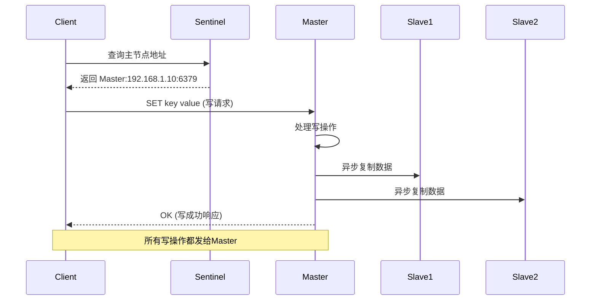

#### 读操作流程

```shell
# 客户端可以配置读策略
# 1. 默认策略：所有读都走主节点（强一致性）
jedis.get("key")  # 直接从主节点读取

# 2. 读写分离：读从主节点，读从从节点（最终一致性）
# Jedis客户端配置示例
JedisPoolConfig config = new JedisPoolConfig();
# 需要自定义实现读写分离逻辑
```

### 哨兵故障检测与故障转移流程

#### 故障检测流程

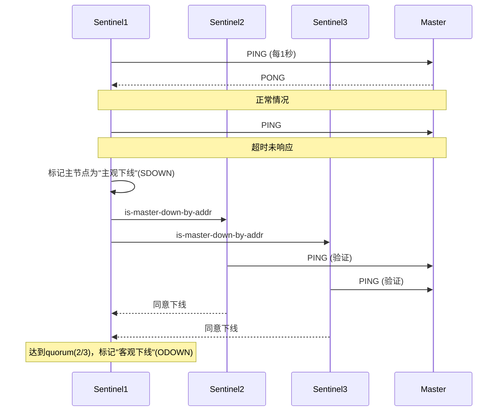

#### 故障转移（Failover）流程

```shell
# 故障转移详细步骤
1. 选举领导者哨兵（Raft算法）
   - Sentinel1收到足够票数成为领导者

2. 选择新主节点（从Slave中选举）
   - 优先级：slave-priority配置
   - 复制偏移量：选择数据最新的
   - 运行ID：选择最小的

3. 执行故障转移
   sentinelLeader.doFailover() {
     // 1. 将选中的Slave提升为Master
     SLAVEOF NO ONE
     
     // 2. 修改其他Slave指向新Master
     for slave in otherSlaves:
         SLAVEOF new_master_ip new_master_port
     
     // 3. 更新哨兵配置
     // 4. 通知客户端（通过发布订阅）
   }
```

### 数据一致性考虑

| 场景     | 读写策略          | 一致性   | 性能 |
| :------- | :---------------- | :------- | :--- |
| 金融交易 | 所有读写走Master  | 强一致   | 较低 |
| 社交应用 | 写Master，读Slave | 最终一致 | 较高 |
| 缓存场景 | 读写分离          | 最终一致 | 最高 |


### 完整读写流程

**正常读写请求**

```shell
客户端 -> Sentinel获取Master地址 -> 连接Master
写请求: Client → Master → 异步复制到Slaves
读请求: Client → Master (或配置为 → Slave)
```

**故障转移期间**

```shell
1. 客户端写请求失败
2. 客户端重新查询Sentinel
3. Sentinel返回新Master地址
4. 客户端连接新Master
5. 恢复服务（通常2-10秒中断）
```

**故障恢复后**

```shell
旧Master恢复后成为Slave
新Master继续服务
哨兵更新拓扑信息
```

**脑裂问题**

```shell
现象：网络分区导致出现两个Master
解决：通过配置min-slaves-to-write和min-slaves-max-lag
```

## Redis主从复制流程

### 整体架构与复制流程

```shell
      ┌─────────────────────────────────────────┐
      │               MASTER 节点                │
      │  ┌─────────┐    ┌──────────┐           │
      │  │ 内存数据库│    │  复制缓冲区  │       │
      │  │ (RDB/AOF)│    │ (Repl Backlog) │    │
      │  └────┬────┘    └─────┬────┘           │
      │       │               │                │
      └───────┼───────────────┼────────────────┘
              │               │
         全量同步│         增量同步│
              │               │
      ┌───────▼───────────────▼────────────────┐
      │               SLAVE 节点                │
      │  ┌─────────┐    ┌──────────┐           │
      │  │ 内存数据库│    │  复制偏移量  │       │
      │  │         │    │ (offset)  │           │
      │  └─────────┘    └──────────┘           │
      └─────────────────────────────────────────┘
```

### 复制初始化：全量同步（RDB同步）

#### 1. 首次连接或数据差异过大时的全量同步流程

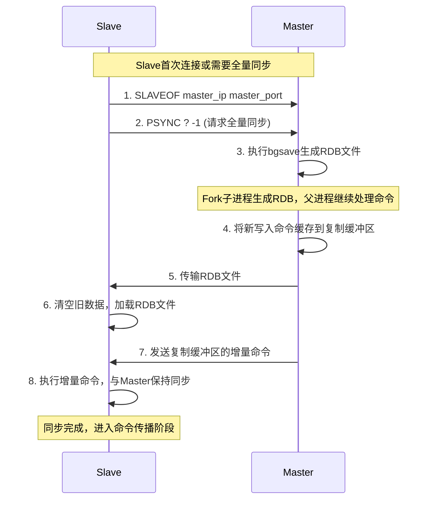

#### 2. RDB文件生成与传输细节

```shell
# Master端生成RDB文件
redis-server --daemonize yes
# 当Slave连接时，Master会：
# 1. Fork子进程生成RDB
# 2. 父进程继续处理请求
# 3. 子进程将内存数据写入RDB文件

# RDB文件包含：
# - Redis数据版本
# - 所有数据库的键值对
# - 过期时间信息
# - 文件校验和
```

### 增量同步：命令传播阶段

#### 1. 命令传播机制

```shell
# 正常同步状态下的命令传播
class Replication:
    def process_write_command(self, command, *args):
        # Master处理写命令
        self.execute_command(command, *args)
        
        # 传播给所有Slave
        for slave in self.slaves:
            # 将命令写入复制缓冲区
            self.repl_backlog.write(command)
            
            # 通过网络发送给Slave
            slave.send_command(command, *args)
            
        # 更新复制偏移量
        self.master_repl_offset += len(serialized_command)
```

#### 2. 复制缓冲区（Replication Backlog）

```shell
┌─────────────────────────────────────────────────┐
│              Replication Backlog                 │
├─────────────────────────────────────────────────┤
│ offset:1000 │ offset:1005 │ offset:1010 │ ...   │
│   SET a 1   │   SET b 2   │   INCR a    │ ...   │
└─────────────────────────────────────────────────┘
     ▲              ▲              ▲
     │              │              │
Slave1:1000    Slave2:1005    Slave3:1008
(需要5个命令)   (需要5个命令)    (需要2个命令)
```

### 关键参数配置

```shell
# redis.conf 主从复制相关配置

# Master配置
repl-backlog-size 1mb            # 复制缓冲区大小
repl-backlog-ttl 3600            # 缓冲区保留时间(秒)
repl-timeout 60                  # 复制超时时间
repl-diskless-sync no            # 是否无盘同步
repl-diskless-sync-delay 5       # 无盘同步延迟
min-slaves-to-write 3            # 最少从节点数
min-slaves-max-lag 10            # 最大延迟秒数

# Slave配置
slave-serve-stale-data yes       # 同步期间是否服务旧数据
slave-read-only yes              # 从节点是否只读
slave-priority 100               # 故障转移优先级
repl-disable-tcp-nodelay no      # 是否禁用Nagle算法
```

### 复制缓冲区大小计算

```shell
def calculate_repl_backlog_size(network_bandwidth, max_disconnect_time):
    """
    计算合理的复制缓冲区大小
    network_bandwidth: 网络带宽(MB/s)
    max_disconnect_time: 最大允许断开时间(s)
    """
    # 每秒写入量估算
    write_per_second = 10 * 1024  # 假设10KB/s
    
    # 缓冲区大小 = 每秒写入量 × 最大断开时间 × 安全系数
    backlog_size = write_per_second * max_disconnect_time * 2
    
    # 转换为MB
    return backlog_size / (1024 * 1024)

# 示例：网络断开最多60秒，需要缓冲区大小
# 10KB/s × 60s × 2 = 1.2MB
```

### 复制延迟与一致性级别

```shell
# 不同场景下的复制策略
class ReplicationConsistency:
    
    def strong_consistency(self):
        """强一致性：所有写操作同步到所有Slave"""
        # 配置 min-slaves-to-write 和 min-slaves-max-lag
        # 确保写操作在指定数量的Slave上确认
        
    def eventual_consistency(self):
        """最终一致性：异步复制，允许短暂不一致"""
        # 默认模式，性能最好
        
    def semi_sync(self):
        """半同步：写操作至少同步到一个Slave"""
        # 通过WAIT命令实现
        # client.set("key", "value")
        # client.wait(1, 1000)  # 等待1个slave，超时1秒
```

### 性能优化和建议

#### 1. **网络优化**

```java
# 1. 使用内网网络，减少延迟
# 2. 调整TCP参数
sysctl -w net.core.somaxconn=65535
sysctl -w net.ipv4.tcp_tw_reuse=1

# 3. 配置适当的复制缓冲区大小
# 根据网络状况和业务峰值调整
repl-backlog-size 32mb  # 高流量场景
```


#### 2. **磁盘优化**

```java
# 1. 使用SSD硬盘加速RDB生成
# 2. 考虑无盘复制（适合网络带宽充足）
repl-diskless-sync yes
repl-diskless-sync-delay 5

# 3. 调整AOF策略
appendonly yes
appendfsync everysec  # 平衡性能和数据安全
```


#### 3. **内存优化**

```java
# 1. 避免大key，减少fork耗时
# 2. 合理设置内存淘汰策略
maxmemory 16gb
maxmemory-policy allkeys-lru

# 3. 监控fork耗时
redis-cli info stats | grep latest_fork_usec
```

### 小结

Redis主从复制的数据同步机制是一个精心设计的系统：
1. 首次同步：使用RDB全量同步，建立基础数据 
2. 增量同步：通过复制缓冲区和命令传播保持同步 
3. 断线重连：使用PSYNC实现部分重同步，避免重复全量 
4. 一致性控制：提供多种一致性级别选择 
5. 性能优化：支持无盘复制、级联复制等高级特性
