## 1、是否使用过Redis集群,集群的高可用怎么保证,集群的原理是什么？

**Redis Sentinal** 着眼于高可用,在master宕机时会自动将slave提升为master,继续提供服务。

**Redis Cluster** 着眼于扩展性,在单个redis内存不足时,使用Cluster进行分片存储。

## 2、缓存雪崩

1. 系统平稳运行过程中,忽然数据库连接量激增
2. 应用服务器无法及时处理请求
3. 大量408,500错误页面出现
4. 客户反复刷新页面获取数据
5. 数据库崩溃
6. 应用服务器崩溃
7. 重启应用服务器无效
8. Redis服务器崩溃
9. Redis集群崩溃
10. 重启数据库后再次被瞬间流量放倒

大量缓存Key在同一时间失效，或者Redis集群宕机，导致所有请求直接访问数据库，造成数据库瞬间压力过大而崩溃。

**举个简单的例子**:
- 如果所有首页的Key失效时间都是12小时,中午12点刷新的,我零点有个秒杀活动大量用户涌入,假设当时每秒 6000 个请求,本来缓存在可以扛住每秒 5000 个请求,但是缓存当时所有的Key都失效了。此时 1 秒 6000 个请求全部落数据库,数据库必然扛不住,它会报一下警,真实情况可能DBA都没反应过来就直接挂了。


### 解决方案

#### 方案1：随机过期时间

处理缓存雪崩简单,在批量往**Redis**存数据的时候,把每个Key的失效时间都加个随机值就好了,这样可以保证数据不会在同一时间大面积失效;

~~~ java
setRedis(Key,value,time + Math.random() * 10000);
~~~

或者设置热点数据永远不过期,有更新操作就更新缓存就好了(比如运维更新了首页商品,那你刷下缓存就完事了,不要设置过期时间),电商首页的数据也可以用这个操作,保险。


#### 方案2：双层缓存策略

```java
public class TwoLevelCache {
    // 本地缓存（如Caffeine） + Redis缓存
    
    private Cache<String, Product> localCache = Caffeine.newBuilder()
        .expireAfterWrite(30, TimeUnit.MINUTES)
        .maximumSize(10000)
        .build();
    
    public Product getProduct(String id) {
        String key = "product:" + id;
        
        // 1. 先查本地缓存
        Product product = localCache.getIfPresent(key);
        if (product != null) {
            return product;
        }
        
        // 2. 查Redis
        product = redis.get(key);
        if (product != null) {
            // 写入本地缓存
            localCache.put(key, product);
            return product;
        }
        
        // 3. 查数据库（需要加锁控制并发）
        product = getFromDatabaseWithLock(key);
        if (product != null) {
            // 写入两级缓存
            redis.setex(key, 3600, product);
            localCache.put(key, product);
        }
        
        return product;
    }
}
```
#### 方案3：服务降级与熔断

```java
@Service
public class ProductServiceWithCircuitBreaker {
    
    @Autowired
    private CircuitBreakerFactory circuitBreakerFactory;
    
    public Product getProduct(String id) {
        CircuitBreaker circuitBreaker = circuitBreakerFactory.create("productService");
        
        return circuitBreaker.run(
            () -> {
                // 正常业务逻辑
                return getProductFromCacheOrDB(id);
            },
            throwable -> {
                // 降级逻辑
                log.warn("触发熔断，返回降级数据", throwable);
                return getFallbackProduct(id);
            }
        );
    }
    
    private Product getFallbackProduct(String id) {
        // 降级策略：
        // 1. 返回静态数据
        // 2. 返回默认值
        // 3. 返回最近一次缓存的数据（如果有）
        // 4. 抛出业务友好的异常
        
        Product fallback = new Product();
        fallback.setId(id);
        fallback.setName("服务暂时不可用");
        fallback.setPrice(0.0);
        
        return fallback;
    }
}
```


#### 方案4：Redis高可用架构

如果**Redis**是集群部署,将热点数据均匀分布在不同的**Redis**库中也能避免全部失效的问题

## 3、缓存穿透

### 什么是缓存穿透

缓存穿透是指缓存和数据库中都没有的数据,而用户不断发起请求,我们数据库的 id 都是1开始自增上去的,如发起为id值为 -1 的数据或 id 为特别大不存在的数据。这时的用户很可能是攻击者,攻击会导致数据库压力过大,严重会击垮数据库。


像这种你如果不对参数做校验,数据库id都是大于0的,我一直用小于0的参数去请求你,每次都能绕开Redis直接打到数据库,数据库也查不到,每次都这样,并发高点就容易崩掉了。

> 查询一个数据库中根本不存在的数据，导致每次请求都绕过缓存直接访问数据库。


### 产生原因
1. 恶意攻击：故意查询不存在的数据 
2. 业务逻辑错误：参数校验不严 
3. 爬虫程序：遍历ID空间

### 解决缓存穿透方案

#### 方案1：缓存空对象（Null Caching）

**缓存穿透**:我会在接口层增加校验,比如用户鉴权校验,参数做校验,不合法的参数直接代码Return,比如:id 做基础校验,id <=0的直接拦截等。

优点：
- 简单有效，实现成本低

缺点：
- 内存浪费（存储大量空值） 
- 数据不一致（如果空值对应的数据被创建了）

#### 方案2：布隆过滤器（Bloom Filter）

**Redis**还有一个高级用法**布隆过滤器(Bloom Filter)**这个也能很好的防止**缓存穿透**的发生,他的原理也很简单就是利用高效的数据结构和算法快速判断出你这个Key是否在数据库中存在,不存在你return就好了,存在你就去查了DB刷新KV再return。

布隆过滤器原理：

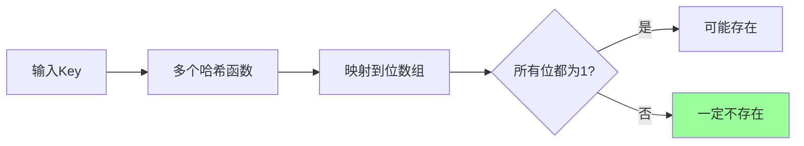

优点：
- 内存占用极小（1亿数据约114MB，误判率1%） 
- 判断速度快（O(1)时间复杂度）

缺点：
- 存在误判率（可能把存在的判断为不存在，但不会反向）
- 删除困难（传统布隆过滤器不支持删除）

## 4、缓存击穿

- 系统平稳运行过程中
- 数据库连接量瞬间激增
- Redis服务器无大量key过期
- Redis内存平稳,无波动
- Redis服务器CPU正常
- 数据库崩溃

缓存雪崩是因为大面积的缓存失效,打崩了DB,而缓存击穿不同的是**缓存击穿**是指一个Key非常热点,在不停的扛着大并发,大并发集中对这一个点进行访问,当这个Key在失效的瞬间,持续的大并发就穿破缓存,直接请求数据库,就像在一个完好无损的桶上凿开了一个洞。

> - 某个热点Key在缓存过期的瞬间，大量并发请求直接访问数据库，导致数据库压力剧增。
> 
> - 缓存穿透类似偷袭,绕过radis,袭击数据库。缓存击穿类似正面硬刚,一直进攻一个地方,直到失效时一起涌入攻击数据库。缓存雪崩类似鬼子进村。

### 解决方案

#### 方案1：热点Key永不过期 + 异步更新

1. 对于热key,设置永不过期，直接返回
2. 如果redis中没有（比如重启），查数据库并设置
3. 缓存中的热key，使用异步线程每5分钟异步更新一次

**缓存击穿**的话,设置热点数据永远不过期。或者加上互斥锁就能搞定了;

#### 方案2：互斥锁（分布式锁）

```java
public class MutexLockSolution {
    
    public Product getProductWithLock(String key) {
        // 1. 先查缓存
        Product product = redis.get(key);
        if (product != null) {
            return product;
        }
        
        // 2. 尝试获取分布式锁
        String lockKey = "lock:" + key;
        boolean locked = false;
        try {
            // 尝试加锁（SETNX实现）
            locked = tryLock(lockKey);
            
            if (locked) {
                // 3. 获取锁成功，再次检查缓存（双重检查）
                product = redis.get(key);
                if (product != null) {
                    return product;
                }
                
                // 4. 查询数据库
                product = db.queryProduct(key);
                if (product != null) {
                    // 5. 写入缓存，设置随机过期时间避免雪崩
                    int expireTime = 3600 + new Random().nextInt(300); // 3600-3900秒
                    redis.setex(key, expireTime, product);
                }
                
                return product;
            } else {
                // 6. 没获取到锁，等待并重试
                Thread.sleep(50);
                return getProductWithLock(key);  // 重试
            }
        } catch (InterruptedException e) {
            Thread.currentThread().interrupt();
            throw new RuntimeException("获取缓存中断", e);
        } finally {
            if (locked) {
                releaseLock(lockKey);
            }
        }
    }
    
    private boolean tryLock(String lockKey) {
        // 使用Redisson或SETNX实现分布式锁
        // SET lockKey clientId NX PX 30000
        return redis.setnx(lockKey, "1", 30, TimeUnit.SECONDS);
    }
}
```

#### 方案3：逻辑过期（Logical Expiration）

```java
public class LogicalExpiration {
    
    static class CacheItem {
        private Product data;
        private long expireTime;  // 逻辑过期时间
        
        // getters and setters
    }
    
    public Product getProductWithLogicalExpire(String key) {
        // 1. 从缓存获取包装对象
        CacheItem item = redis.get(key);
        if (item == null) {
            // 缓存没有，查数据库并设置
            return loadAndCache(key);
        }
        
        // 2. 检查是否逻辑过期
        if (System.currentTimeMillis() > item.getExpireTime()) {
            // 已过期，异步更新
            refreshCacheAsync(key);
        }
        
        // 3. 返回数据（即使过期也返回旧数据）
        return item.getData();
    }
    
    private void refreshCacheAsync(String key) {
        CompletableFuture.runAsync(() -> {
            try {
                // 获取互斥锁
                if (tryLock("refresh:" + key)) {
                    // 查询最新数据
                    Product latest = db.queryProduct(key);
                    if (latest != null) {
                        CacheItem newItem = new CacheItem();
                        newItem.setData(latest);
                        // 设置新的逻辑过期时间（当前时间+1小时）
                        newItem.setExpireTime(System.currentTimeMillis() + 3600000);
                        
                        redis.set(key, newItem);  // 永不过期
                    }
                    releaseLock("refresh:" + key);
                }
            } catch (Exception e) {
                log.error("异步更新缓存失败", e);
            }
        });
    }
}
```

#### 方案4：缓存预热（Cache Warm-up）

```java
@Component
public class CacheWarmUp {
    
    @PostConstruct
    public void warmUpHotKeys() {
        // 1. 识别热点Key（基于历史数据）
        List<String> hotKeys = analyzeHotKeys();
        
        // 2. 预热缓存
        for (String key : hotKeys) {
            Product product = db.queryProduct(key);
            if (product != null) {
                // 设置较长的过期时间，并错开过期
                int baseExpire = 7200; // 2小时
                int randomOffset = new Random().nextInt(600); // 0-10分钟随机
                redis.setex(key, baseExpire + randomOffset, product);
            }
        }
        
        // 3. 定时刷新热点Key
        ScheduledExecutorService scheduler = Executors.newScheduledThreadPool(1);
        scheduler.scheduleAtFixedRate(this::refreshHotKeys, 30, 30, TimeUnit.MINUTES);
    }
    
    private List<String> analyzeHotKeys() {
        // 分析逻辑：基于访问日志、业务特征等
        return Arrays.asList(
            "product:iphone15",
            "product:macbook_pro",
            "promotion:black_friday"
        );
    }
}
```

## 5、Redis 缓存穿透、击穿、雪崩对比

### 缓存穿透、击穿、雪崩对比
| 问题         | **缓存穿透**             | **缓存击穿**             | **缓存雪崩**                   |
| :----------- | :----------------------- | :----------------------- | :----------------------------- |
| **触发条件** | 查询**不存在**的数据     | 查询**热点Key过期**      | **大量Key同时过期**或Redis宕机 |
| **影响范围** | 单个不存在的Key          | 单个热点Key              | 大量Key或整个缓存              |
| **问题本质** | 缓存和DB**都没有**的数据 | 缓存**过期瞬间**的高并发 | 缓存**大规模失效**             |
| **并发量**   | 可能很高（攻击场景）     | **极高**（热点Key）      | 极高（大量请求）               |
| **后果**     | DB压力增大               | DB瞬间压力剧增           | DB崩溃，系统瘫痪               |
| **解决思路** | 拦截不存在请求           | 热点Key永不过期或互斥锁  | 错开过期时间，降级熔断         |


**对比图**

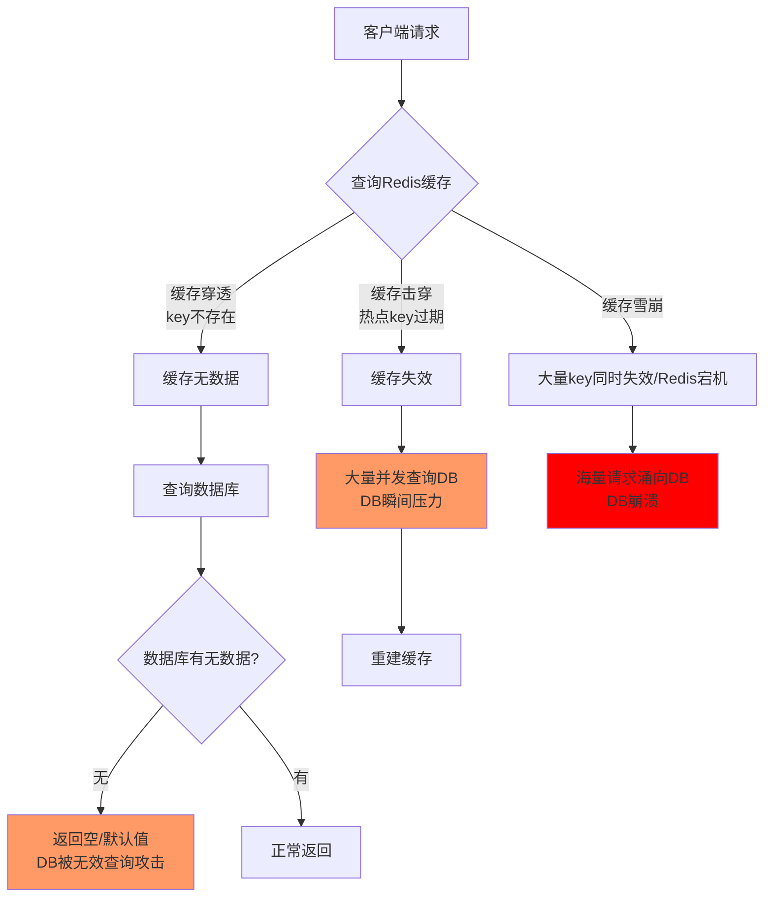

### 解决方案对比

| 问题         | **一级防御** | **二级防御** | **三级防御** | **四级防御** |
| :----------- | :----------- | :----------- | :----------- | :----------- |
| **缓存穿透** | 参数校验     | 布隆过滤器   | 空值缓存     | 限流熔断     |
| **缓存击穿** | 永不过期     | 互斥锁       | 逻辑过期     | 热点预热     |
| **缓存雪崩** | 随机过期     | 双层缓存     | 服务降级     | 集群高可用   |

## 6、既然提到了单机会有瓶颈,那你们是怎么解决这个瓶颈的？

我们用到了集群的部署方式也就是**Redis cluster**,并且是主从同步读写分离,类似**Mysql**的主从同步,**Redis cluster** 支撑 N 个 **Redis master node**,每个**master node**都可以挂载多个 **slave node**。

这样整个 **Redis** 就可以横向扩容了。如果你要支撑更大数据量的缓存,那就横向扩容更多的 **master** 节点,每个 **master** 节点就能存放更多的数据了。

## 7、他们之间是怎么进行数据交互的？以及Redis是怎么进行持久化的？Redis数据都在内存中,一断电或者重启不就没有了嘛？

是的,持久化的话是**Redis**高可用中比较重要的一个环节,因为**Redis**数据在内存的特性,持久化必须得有,我了解到的持久化是有两种方式的。

- **RDB**:RDB持久化机制,是对 **Redis** 中的数据执行**周期性**的持久化。
- **AOF**:AOF机制对每条写入命令作为日志,以 **append-only** 的模式写入一个日志文件中,因为这个模式是只追加的方式,所以没有任何磁盘寻址的开销,所以很快,有点像Mysql中的**binlog**。

两种方式都可以把**Redis**内存中的数据持久化到磁盘上,然后再将这些数据备份到别的地方去,**RDB**更适合做**冷备**,**AOF**更适合做**热备**,比如我杭州的某电商公司有这两个数据,我备份一份到我杭州的节点,再备份一个到上海的,就算发生无法避免的自然灾害,也不会两个地方都一起挂吧,这**灾备**也就是**异地容灾**。

> tip:两种机制全部开启的时候,Redis在重启的时候会默认使用AOF去重新构建数据,因为AOF的数据是比RDB更完整的。

## 8、那这两种机制各自优缺点是啥？

我先说**RDB**吧

### RDB备份优点

他会生成多个数据文件,每个数据文件分别都代表了某一时刻**Redis**里面的数据,这种方式,有没有觉得很适合做**冷备**,完整的数据运维设置定时任务,定时同步到远端的服务器,比如阿里的云服务,这样一旦线上挂了,你想恢复多少分钟之前的数据,就去远端拷贝一份之前的数据就好了。

**RDB**对**Redis**的性能影响非常小,是因为在同步数据的时候他只是**fork**了一个子进程去做持久化的,而且他在数据恢复的时候速度比**AOF**来的快。

### RDB备份缺点

**RDB**都是快照文件,都是默认五分钟甚至更久的时间才会生成一次,这意味着你这次同步到下次同步这中间五分钟的数据都很可能全部丢失掉。**AOF**则最多丢一秒的数据,**数据完整性**上高下立判。

还有就是**RDB**在生成数据快照的时候,如果文件很大,客户端可能会暂停几毫秒甚至几秒,你公司在做秒杀的时候他刚好在这个时候**fork**了一个子进程去生成一个大快照,哦豁,出大问题。

我们再来说说**AOF**

### AOF备份优点

上面提到了,**RDB**五分钟一次生成快照,但是**AOF**是一秒一次去通过一个后台的线程`fsync`操作,那最多丢这一秒的数据。

**AOF**在对日志文件进行操作的时候是以`append-only`的方式去写的,他只是追加的方式写数据,自然就少了很多磁盘寻址的开销了,写入性能惊人,文件也不容易破损。

**AOF**的日志是通过一个叫**非常可读**的方式记录的,这样的特性就适合做**灾难性数据误删除**的紧急恢复了,比如公司的实习生通过**flushall**清空了所有的数据,只要这个时候后台重写还没发生,你马上拷贝一份**AOF**日志文件,把最后一条**flushall**命令删了就完事了。

### AOF备份缺点

一样的数据,**AOF**文件比**RDB**还要大。

**AOF**开启后,**Redis**支持写的**QPS**会比**RDB**支持写的要低,他不是每秒都要去异步刷新一次日志嘛**fsync**,当然即使这样性能还是很高,我记得**ElasticSearch**也是这样的,异步刷新缓存区的数据去持久化,为啥这么做呢,不直接来一条怼一条呢,那我会告诉你这样性能可能低到没办法用的,大家可以思考下为啥哟。

## 9、Redis还有其他保证集群高可用的方式么？

还有哨兵集群**sentinel**。

**哨兵的作用**

- 监控
  - 不断的检查master和slave是否正常运行。
  - master存活检测、master与slave运行情况检测
- 通知(提醒)
  - 当被监控的服务器出现问题时,向其他(哨兵间,客户端)发送通知
- 自动故障转移
  - 断开master与slave连接,选取一个slave作为master,将其他slave连接到新的master,并告知客户端新的服务器地址

哨兵必须用三个实例去保证自己的健壮性的,哨兵+主从并**不能保证数据不丢失**,但是可以保证集群的**高可用**。因为哨兵模式中只有一个master提供写服务，还是存在master单点故障；

为啥必须要三个实例呢？我们先看看两个哨兵会咋样。


master宕机了 s1和s2两个哨兵只要有一个认为你宕机了就切换了,并且会选举出一个哨兵去执行故障,但是这个时候也需要大多数哨兵都是运行的。

那这样有啥问题呢？M1宕机了,S1没挂那其实是OK的,但是整个机器都挂了呢？哨兵就只剩下S2个裸屌了,没有哨兵去允许故障转移了,虽然另外一个机器上还有R1,但是故障转移就是不执行。

经典的哨兵集群是这样的:


M1所在的机器挂了,哨兵还有两个,两个人一看他不是挂了嘛,那我们就选举一个出来执行故障转移不就好了。

总结下哨兵组件的主要功能:

- 集群监控:负责监控 Redis master 和 slave 进程是否正常工作。
- 消息通知:如果某个 **Redis** 实例有故障,那么哨兵负责发送消息作为报警通知给管理员。
- 故障转移:如果 master node 挂掉了,会自动转移到 slave node 上。
- 配置中心:如果故障转移发生了,通知 client 客户端新的 master 地址。

## 10、能说一下主从之间的数据怎么同步的么？

主从同步总的来说分为三步骤:

1. 建立连接阶段:建立socket连接
2. 数据同步阶段:
    1. 第一部分是rdb全量数据复制过程
    2. 第二部是缓冲区的部分复制过程
3. 命令传播阶段:就是master将接收到的命令发送给slave进行执行,保证数据的同步性。

主从同步和前面提到的数据持久化的**RDB**和**AOF**有着比密切的关系了。

我先说下为啥要用主从这样的架构模式,前面提到了单机**QPS**是有上限的,而且**Redis**的特性就是必须支撑读高并发的,那你一台机器又读又写,**这谁顶得住啊**,不当人啊！但是你让这个master机器去写,数据同步给别的slave机器,他们都拿去读,分发掉大量的请求那是不是好很多,而且扩容的时候还可以轻松实现水平扩容。


**他们数据怎么同步的呢？**

你启动一台slave 的时候,他会发送一个**psync**命令给master ,如果是这个slave第一次连接到master,他会触发一个全量复制。master就会启动一个线程,生成**RDB**快照,还会把新的写请求都缓存在内存中,**RDB**文件生成后,master会将这个**RDB**发送给slave的,slave拿到之后做的第一件事情就是写进本地的磁盘,然后加载进内存,然后master会把内存里面缓存的那些新命名都发给slave。

## 11、Redis内存淘汰机制,手写一下LRU代码？

Redis 采用 "惰性删除 + 定期删除" 的组合策略，这是性能与内存效率的最佳平衡。

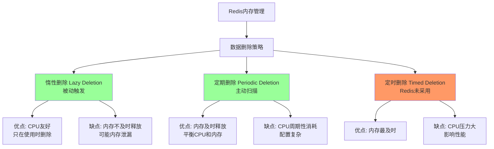

### 定时删除（Timed Deletion）

Redis 实际并未采用此策略，但理解它有助于理解其他策略。

原理: 为每个设置了过期时间的 key 创建一个定时器，当 key 过期时立即删除。

**优缺点分析**

| 维度           | 评价       | 说明               |
| :------------- | :--------- | :----------------- |
| **内存及时性** | ✅ **优秀** | 过期立即释放内存   |
| **CPU性能**    | ❌ **极差** | 大量定时器消耗CPU  |
| **实现复杂度** | ❌ **高**   | 需要维护大量定时器 |
| **适用场景**   | 不适用     | Redis未采用        |

**为什么不采用定时删除？**

```shell
// 假设场景：100万个设置了TTL的key
// 定时删除需要：
1. 100万个定时器对象
2. 100万个回调函数
3. 频繁的上下文切换
4. 大量内存用于维护定时器

// 性能测试模拟结果：
// 创建定时器: O(1) 每个key
// 内存占用: 每个定时器约 64 bytes
// 总内存: 100万 × 64 ≈ 64MB (仅定时器!)
// CPU消耗: 高频率的定时器检查
```

### 惰性删除（Lazy Deletion / Passive Expiration）

Redis 核心策略之一：只有访问时才检查是否过期。

原理:
1. 不主动删除过期 key 
2. 当客户端访问 key 时，先检查是否过期 
3. 如果过期，立即删除并返回空


**实际删除流程**

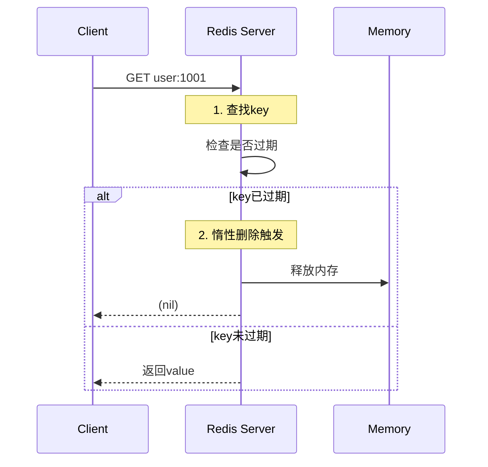

**优缺点分析**

| 维度             | 评价       | 说明                       |
| :--------------- | :--------- | :------------------------- |
| **CPU性能**      | ✅ **优秀** | 只在访问时检查，无额外开销 |
| **内存及时性**   | ❌ **差**   | 不访问的key永远不删除      |
| **实现复杂度**   | ✅ **简单** | 逻辑清晰，容易实现         |
| **内存泄漏风险** | ⚠️ **高**   | 大量过期key占用内存        |


**惰性删除的问题场景**

```shell
# 场景：用户会话数据
# 每个用户登录创建一个session key，TTL为30分钟
# 如果用户不活跃，这些key永远不会被删除

import redis
r = redis.Redis()

# 创建100万个会话
for i in range(1000000):
    r.setex(f"session:{i}", 1800, "session_data")  # 30分钟过期

# 问题：
# 1. 如果用户不再访问，这些key30分钟后过期
# 2. 但Redis不会主动删除它们
# 3. 它们会一直占用内存，直到有人访问触发删除
# 4. 实际已"逻辑删除"，但"物理内存"未释放
```

### 定期删除（Periodic Deletion / Active Expiration）

Redis 主动清理策略：定期抽样检查并删除过期 key。

原理:

Redis 每秒执行 10 次（默认）的定期删除任务，每次：

1. 从每个数据库中随机抽取一定数量的 key [遍历数据库，随机抽样检查]
2. 检查这些 key 是否过期 
3. 删除过期的 key 
4. 控制执行时间，避免影响正常服务

**配置参数详解**

```shell
# redis.conf 中相关配置

# 定期删除的执行频率（Hz = 每秒执行次数）
hz 10  # 默认10，即每秒执行10次定期删除

# 每次定期删除扫描的数据库数量
# 默认16个数据库，每次扫描全部
databases 16

# 每次扫描的key数量（基于采样率）
maxmemory-samples 5  # LRU/LFU采样数，也影响定期删除

# 慢速定期删除的最大执行时间百分比
# 默认25%，即每次最多占用25%的CPU时间
active-expire-effort 1  # 1-10，越大越积极
```

**定期删除业务流程:**

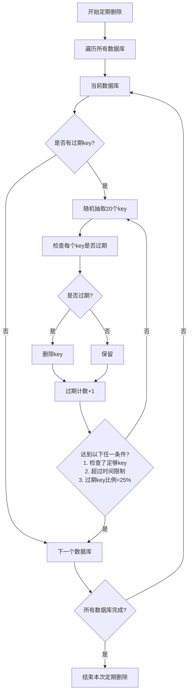

**优缺点分析**

| 维度           | 评价       | 说明                   |
| :------------- | :--------- | :--------------------- |
| **内存及时性** | ✅ **良好** | 定期清理，避免长期堆积 |
| **CPU性能**    | ⚠️ **中等** | 可控的周期性消耗       |
| **配置灵活性** | ✅ **高**   | 可通过参数调节         |
| **内存碎片**   | ✅ **较好** | 定期整理内存           |

**调优建议**

```shell
# 根据业务场景调整配置

# 场景1：内存紧张，需要及时清理
hz 20                      # 提高执行频率
active-expire-effort 5     # 更积极的清理

# 场景2：CPU敏感，允许稍多内存占用
hz 5                       # 降低频率
active-expire-effort 1     # 保守清理

# 场景3：大量过期key场景
# 需要同时调整多个参数
maxmemory-policy volatile-lru  # 配合内存淘汰
hz 15
active-expire-effort 8
```

### 组合策略：惰性删除 + 定期删除

#### 为什么Redis使用组合策略？

```shell
// 内存管理的黄金平衡点
// 惰性删除：       节约CPU，但可能导致内存泄漏
// 定期删除：       主动清理，但有CPU开销
// 组合策略：       取长补短，达到最佳平衡

// 实际效果：
// 1. 访问频繁的key → 通过惰性删除及时清理
// 2. 长期不访问的key → 通过定期删除清理
// 3. CPU开销可控 → 定期删除可配置频率
// 4. 内存可控 → 避免过期key无限堆积
```

#### 组合策略工作流程

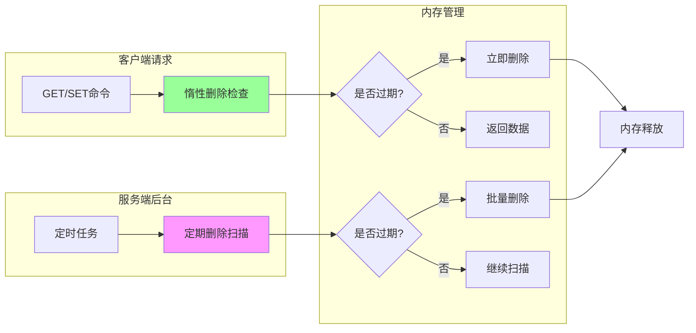

### 与内存淘汰策略的关系

```shell
第一层: 写入控制
  ↓ SET key value EX 60
  ↓ 自动设置过期时间

第二层: 过期删除
  ↓ 惰性删除（访问时检查）
  ↓ 定期删除（后台扫描）

第三层: 内存淘汰
  ↓ 当内存达到maxmemory时
  ↓ 根据策略淘汰key（LRU/LFU/随机等）

第四层: 持久化清理
  ↓ AOF重写
  ↓ RDB生成
```

### 过期删除 vs 内存淘汰

| 对比项       | **过期删除** | **内存淘汰**                  |
| :----------- | :----------- | :---------------------------- |
| **触发条件** | key的TTL到期 | 内存使用达到maxmemory         |
| **删除对象** | 已过期的key  | 根据策略选择key（可能未过期） |
| **目标**     | 清理无效数据 | 释放内存空间                  |
| **策略**     | 惰性+定期    | LRU/LFU/随机/TTL等            |


**配置**

```shell
# redis.conf 完整的内存管理配置

# 过期删除相关
hz 10                          # 定期删除频率
active-expire-effort 1         # 删除积极程度

# 内存淘汰相关
maxmemory 2gb                  # 最大内存
maxmemory-policy volatile-lru  # 淘汰策略
maxmemory-samples 5            # 淘汰采样数

# 持久化相关
save 900 1                     # RDB触发条件
save 300 10
save 60 10000
appendonly yes                 # AOF开关
```

### 实战问题与解决方案

#### 问题：过期key堆积导致内存不足

```shell
# 症状
1. 内存使用率持续高位
2. info stats显示expired_stale_perc很低
3. 大量key实际上已过期但未删除

# 诊断命令
redis-cli info memory | grep used_memory
redis-cli info stats | grep expired_stale_perc
redis-cli dbsize  # 总key数
redis-cli scan 0 count 1000  # 抽样检查过期比例

# 解决方案
# 1. 调整定期删除参数
hz 20
active-expire-effort 8

# 2. 使用主动清理脚本
redis-cli --eval cleanup_expired.lua

# 3. 优化业务代码，避免大量短TTL key
```

#### 问题：定期删除导致CPU尖峰

```shell
# 症状
1. CPU使用率周期性飙升
2. 与定期删除频率(hz)同步
3. 业务响应时间周期性变慢

# 诊断
redis-cli info commandstats | grep -i expire
redis-cli info cpu | grep used_cpu_sys

# 解决方案
# 1. 降低定期删除频率
hz 5

# 2. 减少每次删除的量
# 通过调整active-expire-effort
active-expire-effort 1

# 3. 分片/集群分散压力
```

#### Lua脚本：主动清理过期key

```shell
-- cleanup_expired.lua
-- 主动扫描并删除过期key

local function cleanup_expired_keys()
    local cursor = "0"
    local deleted = 0
    local total_scanned = 0
    local max_iterations = 1000  -- 防止长时间运行
    
    repeat
        -- SCAN命令遍历key
        local result = redis.call("SCAN", cursor, "COUNT", 100)
        cursor = result[1]
        local keys = result[2]
        
        for _, key in ipairs(keys) do
            -- 检查key是否过期
            local ttl = redis.call("TTL", key)
            if ttl == -2 then
                -- key已不存在（可能被并发删除）
            elseif ttl == -1 then
                -- 永不过期，跳过
            elseif ttl < 0 then
                -- 应该不会出现
            elseif ttl == 0 then
                -- 已过期，删除
                redis.call("DEL", key)
                deleted = deleted + 1
            end
            
            total_scanned = total_scanned + 1
            
            -- 每处理100个key检查一次执行时间
            if total_scanned % 100 == 0 then
                -- 可以添加执行时间检查，避免阻塞太久
            end
        end
        
        max_iterations = max_iterations - 1
    until cursor == "0" or max_iterations <= 0
    
    return {deleted=deleted, scanned=total_scanned}
end

return cleanup_expired_keys()
```

### 性能优化检查表

```shell
☑️ 监控expired_stale_perc是否在合理范围（20-50%）
☑️ 检查惰性删除命中率（业务访问模式）
☑️ 调整hz参数平衡CPU和内存
☑️ 使用异步删除减少阻塞（lazyfree-lazy-expire）
☑️ 定期分析大key和热key分布
☑️ 设置合理的maxmemory和淘汰策略
☑️ 考虑分片或集群分散压力
```

### 小结

Redis的删除策略设计体现了经典的系统设计权衡思想：

1. 定时删除：理论完美但实践不可行（CPU成本太高）

2. 惰性删除：CPU最优但内存可能泄漏

3. 定期删除：平衡CPU和内存，但需要调优

4. 组合策略：惰性+定期是工程实践的最佳选择

## 12、为啥不扫描全部设置了过期时间的key呢？

假如Redis里面所有的key都有过期时间,都扫描一遍？那太恐怖了,而且我们线上基本上也都是会设置一定的过期时间的。全扫描跟你去查数据库不带where条件不走索引全表扫描一样,100ms一次,Redis累都累死了。

## 13、如果一直没随机到很多key,里面不就存在大量的无效key了？

**惰性删除**,见名知意,惰性嘛,我不主动删,我懒,我等你来查询了我看看你过期没,过期就删了还不给你返回,没过期该怎么样就怎么样。

## 14、键的过期删除策略

常见的过期删除策略是**惰性删除**、**定期删除**、**定时删除**。

- 惰性删除:只有访问这个键时才会检查它是否过期,如果过期则清除。
  - 优点:最大化地节约CPU资源。
  - 缺点:如果大量过期键没有被访问,会一直占用大量内存。
- 定时删除:为每个设置过期时间的key都创造一个定时器,到了过期时间就清除。
  - 优点:该策略可以立即清除过期的键。
  - 缺点:会占用大量的CPU资源去处理过期的数据。
- 定期删除:每隔一段时间就对一些键进行检查,删除其中过期的键。该策略是惰性删除和定时删除的一个折中,既避免了占用大量CPU资源又避免了出现大量过期键不被清除占用内存的情况。

Redis中同时使用了**惰性删除**和**定期删除**两种。

## 15、如果定期没删,我也没查询,那可咋整？

**内存淘汰机制**！

作为缓存系统都要定期清理无效数据,就需要一个主键失效和淘汰策略.

在Redis当中,有生存期的key被称为volatile。在创建缓存时,要为给定的key设置生存期,当key过期的时候(生存期为0),它可能会被删除。

**1、影响生存时间的一些操作**

生存时间可以通过使用 DEL 命令来删除整个 key 来移除,或者被 SET 和 GETSET 命令覆盖原来的数据,也就是说,修改key对应的value和使用另外相同的key和value来覆盖以后,当前数据的生存时间不同。

比如说,对一个 key 执行INCR命令,对一个列表进行LPUSH命令,或者对一个哈希表执行HSET命令,这类操作都不会修改 key 本身的生存时间。另一方面,如果使用RENAME对一个 key 进行改名,那么改名后的 key的生存时间和改名前一样。

RENAME命令的另一种可能是,尝试将一个带生存时间的 key 改名成另一个带生存时间的 another_key ,这时旧的 another_key (以及它的生存时间)会被删除,然后旧的 key 会改名为 another_key ,因此,新的 another_key 的生存时间也和原本的 key 一样。使用PERSIST命令可以在不删除 key 的情况下,移除 key 的生存时间,让 key 重新成为一个persistent key 。

**2、如何更新生存时间**

可以对一个已经带有生存时间的 key 执行EXPIRE命令,新指定的生存时间会取代旧的生存时间。过期时间的精度已经被控制在1ms之内,主键失效的时间复杂度是O(1),

EXPIRE和TTL命令搭配使用,TTL可以查看key的当前生存时间。设置成功返回 1;当 key 不存在或者不能为 key 设置生存时间时,返回 0 。

最大缓存配置 在 redis 中,允许用户设置最大使用内存大小 server.maxmemory 默认为0,没有指定最大缓存,如果有新的数据添加,超过最大内存,则会使redis崩溃,所以一定要设置。redis 内存数据集大小上升到一定大小的时候,就会实行数据淘汰策略。redis 提供 6种数据淘汰策略:

Redis是基于内存的,所以容量肯定是有限的,有效的内存淘汰机制对Redis是非常重要的。

当存入的数据超过Redis最大允许内存后,会触发Redis的内存淘汰策略。在Redis4.0前一共有6种淘汰策略。

- volatile-lru:当Redis内存不足时,会在设置了过期时间的键中使用LRU算法移除那些最少使用的键。
- volatile-ttl:从设置了过期时间的键中移除将要过期的
- volatile-random:从设置了过期时间的键中随机淘汰一些
- allkeys-lru:当内存空间不足时,根据LRU算法移除一些键
- allkeys-random:当内存空间不足时,随机移除某些键
- noeviction:当内存空间不足时,新的写入操作会报错

前三个是在设置了**过期时间**的键的空间进行移除,后三个是在**全局的空间**进行移除

在Redis4.0后可以增加两个

- volatile-lfu:从设置过期时间的键中移除一些最不经常使用的键(LFU算法:Least Frequently Used))
- allkeys-lfu:当内存不足时,从所有的键中移除一些最不经常使用的键

这两个也是一个是在设置了过期时间的键的空间,一个是在全局空间。

使用策略规则:

**1、** 如果数据呈现幂律分布,也就是一部分数据访问频率高,一部分数据访问频率低,则使用allkeys-lru**2、** 如果数据呈现平等分布,也就是所有的数据访问频率都相同,则使用allkeys-random

三种数据淘汰策略:

ttl和random比较容易理解,实现也会比较简单。主要是Lru最近最少使用淘汰策略,设计上会对key 按失效时间排序,然后取最先失效的key进行淘汰


## 16、Redis 写操作单线程与并发竞争矛盾

Redis是单线程模型，写操作是绝对的单线程串行执行，为什么多个客户端的请求会导致数据不一致或业务逻辑错误？

"Redis单线程 != 没有并发问题"，这是两个不同层面的概念,下面我们分析客户端的多个请求为什么会导致数据的不一致性；

### 核心误区澄清：两个不同的"并发"

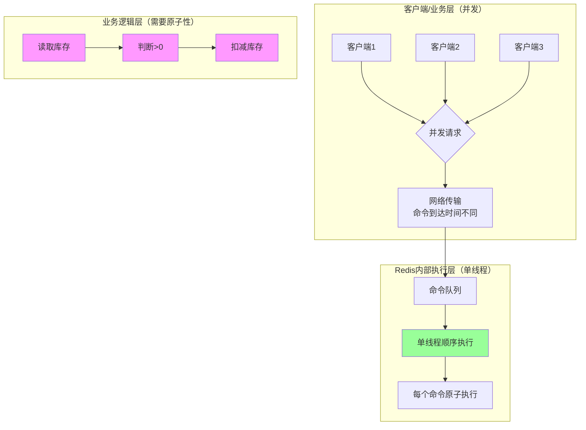
### Redis单线程的真实含义

1、命令执行层面：绝对串行

```java
// Redis源码中的事件循环（简化）
void aeMain(aeEventLoop *eventLoop) {
    eventLoop->stop = 0;
    while (!eventLoop->stop) {
        // 处理文件事件（网络请求）
        aeProcessEvents(eventLoop, AE_ALL_EVENTS);
    }
}

// 处理客户端命令（单线程执行）
void processCommand(client *c) {
    // 1. 解析命令
    // 2. 查找命令实现
    // 3. 执行命令 ← 这里是单线程！
    c->cmd->proc(c);
    // 4. 返回结果
}
```

关键点：Redis 接收到的每个命令 都是原子执行的，不会被其他命令打断。

2、客户端层面：并发仍然存在

虽然Redis内部是单线程执行命令，但：

1. 多个客户端可以同时发送命令 
2. 网络延迟导致命令到达时间交错 
3. Redis按到达顺序执行，但这个顺序不确定

### 为什么还会出现数据不一致？

#### 场景1：非原子性业务操作

```java
// ❌ 错误实现：分三步操作
public boolean deductStock(String productId, int quantity) {
    // 1. 读取库存
    int stock = Integer.parseInt(jedis.get("stock:" + productId));
    
    // 2. 业务判断
    if (stock < quantity) {
        return false;
    }
    
    // 3. 更新库存
    jedis.set("stock:" + productId, String.valueOf(stock - quantity));
    return true;
}
```

并发执行时序分析

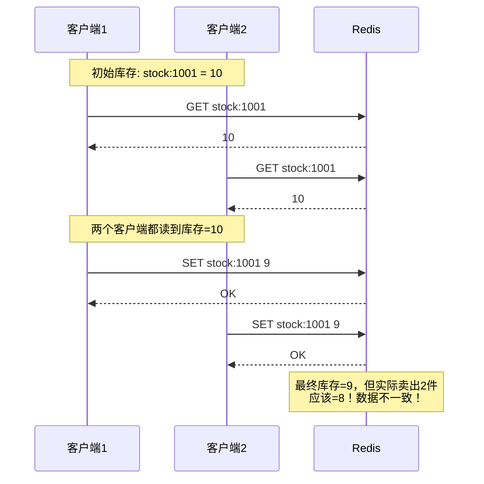

根本原因：虽然每个Redis命令是原子的，但业务逻辑（读→判断→写）不是原子的。

#### 场景2：计数器累加问题

```java
// ❌ 错误：非原子累加
public void incrementCounter(String key) {
    int current = Integer.parseInt(jedis.get(key));
    jedis.set(key, String.valueOf(current + 1));
}

// 假设初始 counter = 0
// 两个客户端同时调用：
// 客户端1: 读到0，设为1
// 客户端2: 读到0，设为1
// 结果应该是2，实际是1
```
Redis单线程执行的实际流程

```shell
# Redis实际执行的命令序列
时间线：
t1: 客户端1发送 GET counter
t2: Redis执行 GET counter → 返回 0
t3: 客户端2发送 GET counter
t4: Redis执行 GET counter → 返回 0  # 客户端2在客户端1设置前读取
t5: 客户端1发送 SET counter 1
t6: Redis执行 SET counter 1
t7: 客户端2发送 SET counter 1       # 应该设为2，但基于旧值0计算
t8: Redis执行 SET counter 1
# 最终：counter = 1（错误！）
```

#### 场景3：先检查后执行（Check-Then-Act）

经典的双重消费问题
```java
// 优惠券领取逻辑
public boolean claimCoupon(String userId, String couponId) {
    // 1. 检查是否已领取
    if (jedis.sismember("claimed:" + couponId, userId)) {
        return false;
    }
    
    // 2. 领取优惠券
    jedis.sadd("claimed:" + couponId, userId);
    jedis.incr("coupon:count:" + couponId);  // 增加领取计数
    return true;
}
```

并发问题:

```shell
客户端A和B同时为用户U领取优惠券C：
1. A检查: U不在已领取集合 → 通过
2. B检查: U不在已领取集合 → 通过  
3. A添加U到集合，计数+1
4. B添加U到集合（集合不允许重复，失败）
5. 但计数又被+1（错误！）

结果：用户领取1次，但计数加了2次！
```

### Redis单线程的"保证"到底是什么？

#### Redis保证的原子性

```java
// Redis保证的是单个命令的原子性
// 例如：
SET key value          // 原子
INCR key               // 原子
HMSET key field value  // 原子
LPUSH key value        // 原子

// 复杂数据结构操作也是原子的
SADD set member        // 向集合添加元素，原子
ZADD zset score member // 向有序集合添加，原子
```

#### Redis不保证的

```java
// 以下业务逻辑不是原子的：
// 1. 多个命令的组合
jedis.get(key);
// ... 业务逻辑处理 ...
jedis.set(key, newValue);

// 2. 事务中的业务判断
jedis.watch(key);
String value = jedis.get(key);
if (value.equals("something")) {  // 业务判断
    Transaction tx = jedis.multi();
    tx.set(key, "new");
    tx.exec();  // 可能失败！
}

// 3. Lua脚本中的业务逻辑错误
String script = """
    local val = redis.call('GET', KEYS[1])
    if val == 'old' then
        -- 这里可能有并发问题
        redis.call('SET', KEYS[1], 'new')
    end
    """;
```

### Redis单线程下的竞争条件详细分析

#### 竞争条件类型1：读写竞争（Read-Modify-Write）

**时序图分析**

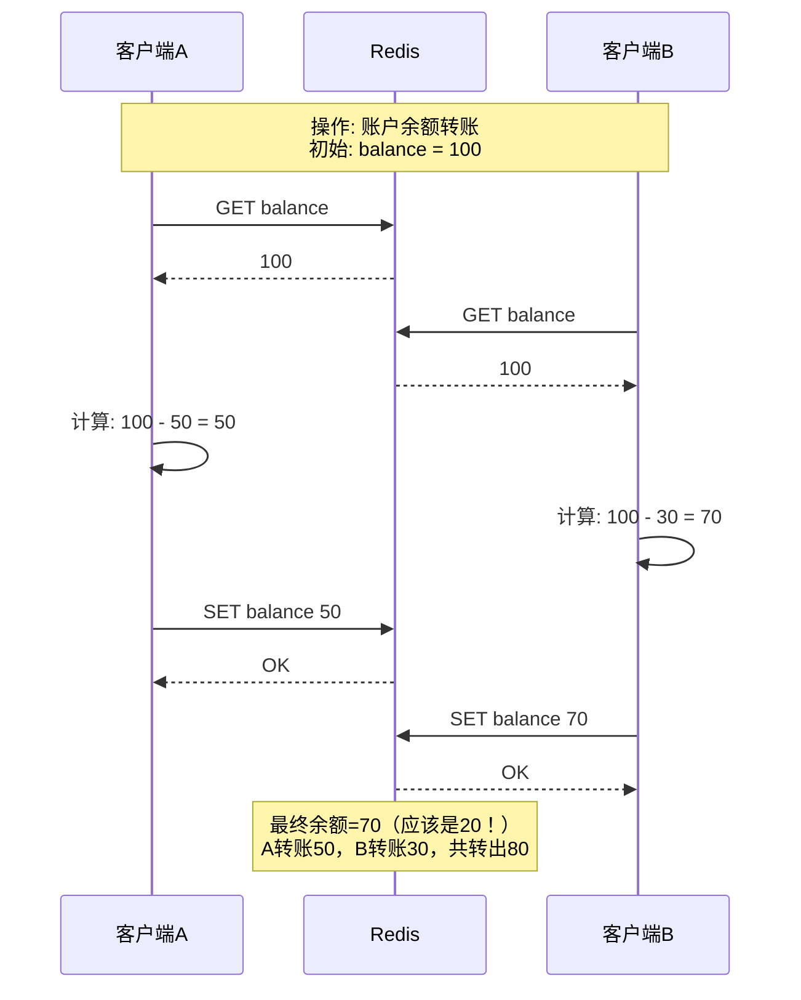
根本原因

虽然Redis执行SET balance 50和SET balance 70是原子的，但：

1. 两个客户端几乎同时读取了旧值(100)
2. 基于相同的旧值做计算 
3. 后执行的SET覆盖了先执行的SET 
4. 最后一次写胜出（Last Write Wins），丢失了前一次更新

#### 竞争条件类型2：检查后执行竞争

库存超卖问题深入

```java
// 电商库存扣减（错误实现）
public boolean purchase(String productId, int quantity) {
    // Step 1: 检查库存
    String key = "stock:" + productId;
    int stock = Integer.parseInt(jedis.get(key));
    
    if (stock < quantity) {
        return false;  // 库存不足
    }
    
    // Step 2: 其他业务逻辑（耗时操作）
    // 例如：检查用户资格、计算价格、验证地址等
    // 假设这里需要100ms
    Thread.sleep(100);
    
    // Step 3: 扣减库存
    jedis.set(key, String.valueOf(stock - quantity));
    
    return true;
}
```
时间窗口导致的问题

```shell
时间轴（假设库存=10，两个用户各买8件）：
t=0ms:   用户A检查库存 → 10 > 8，通过
t=10ms:  用户B检查库存 → 10 > 8，通过  
t=100ms: 用户A扣减库存 → 库存=2
t=110ms: 用户B扣减库存 → 库存=-6（超卖！）

问题：检查时库存充足，但扣减时可能已不足
```

#### 竞争条件类型3：状态依赖竞争

订单状态机问题

```java
// 订单状态更新（错误实现）
public void updateOrderStatus(String orderId, String newStatus) {
    // 1. 读取当前状态
    String currentStatus = jedis.hget("order:" + orderId, "status");
    
    // 2. 状态转换验证
    if (!isValidTransition(currentStatus, newStatus)) {
        throw new IllegalStateException("无效状态转换");
    }
    
    // 3. 更新状态
    jedis.hset("order:" + orderId, "status", newStatus);
}

// 允许的状态转换
private boolean isValidTransition(String from, String to) {
    // 例如：只能 CREATED → PAID → SHIPPED → DELIVERED
    Map<String, Set<String>> rules = Map.of(
        "CREATED", Set.of("PAID", "CANCELLED"),
        "PAID", Set.of("SHIPPED", "REFUNDED"),
        "SHIPPED", Set.of("DELIVERED")
    );
    return rules.getOrDefault(from, Set.of()).contains(to);
}
```

并发问题

```shell
两个操作同时发生：
操作1: 从PAID改为SHIPPED
操作2: 从PAID改为REFUNDED

时间线：
t1: 操作1读取状态 → "PAID"
t2: 操作2读取状态 → "PAID"  
t3: 操作1验证: PAID→SHIPPED ✓
t4: 操作2验证: PAID→REFUNDED ✓
t5: 操作1设置状态为SHIPPED
t6: 操作2设置状态为REFUNDED（覆盖！）

结果：订单既发货又退款，状态混乱！
```

### Redis 并发竞争问题全面解决方案

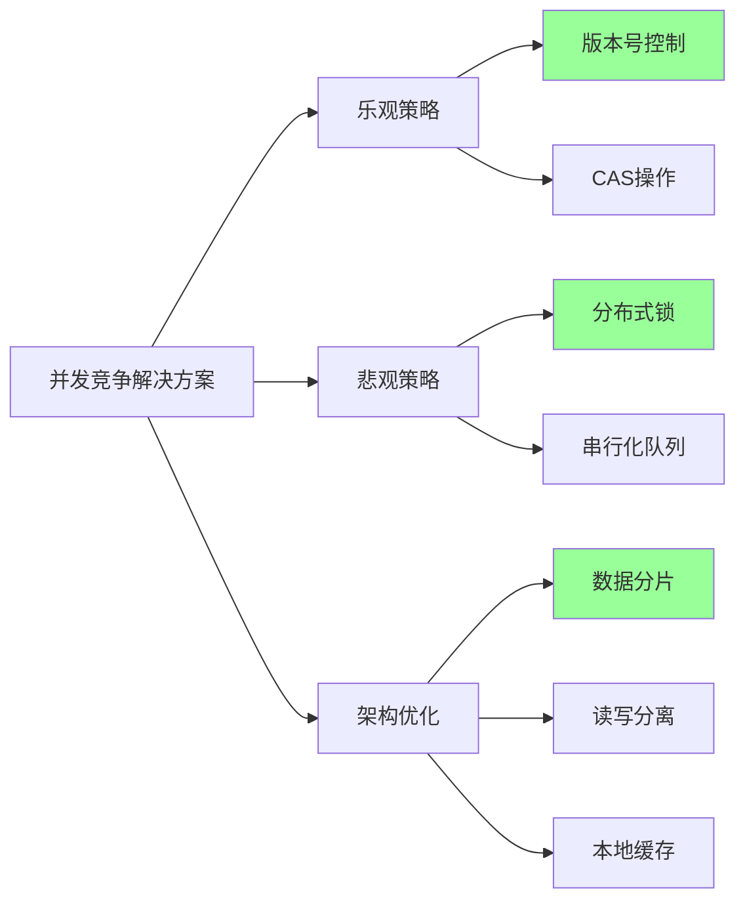

方案一：乐观锁机制

1. 基于版本号（Version）的实现 
2. Redis WATCH/MULTI/EXEC 实现
3. Lua脚本实现原子操作

方案二：分布式锁

1. 基于SETNX的简易锁
2. Redisson分布式锁实现

方案三：队列串行化

1. Redis List 作为队列
2. Redis Stream 作为消息队列

方案四：数据分片与隔离
1. Key分片策略
2. Redis Cluster分片方案

方案五：本地缓存 + 版本控制
1. 多级缓存架构

### 如何选择

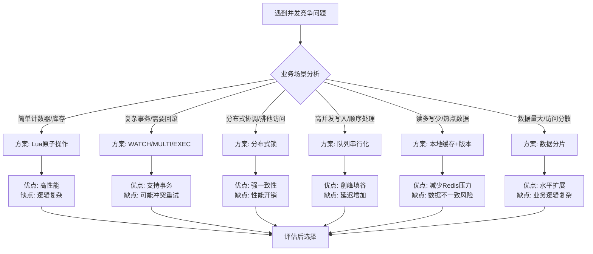
核心解决方案对比表

| 方案            | 适用场景             | 优点                    | 缺点                 | 实现复杂度 |
| :-------------- | :------------------- | :---------------------- | :------------------- | :--------- |
| **Lua原子操作** | 简单计数器、库存扣减 | 性能最高，完全避免竞争  | 业务逻辑需Lua实现    | 中         |
| **WATCH/MULTI** | 需要CAS操作的事务    | 支持复杂条件检查        | 冲突时需要重试       | 中         |
| **分布式锁**    | 排他性资源访问       | 强一致性，逻辑清晰      | 性能开销，死锁风险   | 高         |
| **队列串行化**  | 高并发写入场景       | 彻底消除竞争，削峰填谷  | 增加延迟，需要消费者 | 高         |
| **数据分片**    | 大数据量场景         | 水平扩展，减少单点竞争  | 业务逻辑复杂化       | 很高       |
| **多级缓存**    | 读多写少场景         | 减少Redis压力，提升性能 | 缓存一致性难保证     | 中         |


### Redis单线程的局限性总结

**Redis单线程保证的**：

1. ✅ 单个命令的**原子执行**
2. ✅ 命令执行的**顺序性**（按到达顺序）
3. ✅ **不会**出现命令**执行中途**被其他命令打断
4. ✅ 简单数据结构的线程安全（如INCR、SADD等）

**Redis单线程不保证的**：

1. ❌ **多个命令**的业务原子性
2. ❌ 客户端**并发请求**的顺序
3. ❌ 业务逻辑的**隔离性**
4. ❌ **读-修改-写**模式的原子性


**设计原则**

1. 尽量使用Redis原子命令：INCR、DECR、HSETNX等 
2. 复杂操作用Lua脚本封装 
3. 避免"读-处理-写"模式 
4. 必要时使用分布式锁

Redis单线程只保证了命令执行的原子性，不保证业务逻辑的原子性。 当多个客户端并发操作时，虽然每个命令被Redis串行执行，但：

1. 客户端的请求是并发的 
2. 网络延迟导致命令到达顺序不确定 
3. 业务逻辑涉及多个命令时，中间可能被其他客户端命令插入
4. "读-修改-写" 模式是典型竞争条件场景

解决方案的核心思想：将需要原子执行的多个操作变成一个原子操作。

1. Lua脚本：将多个命令打包成一个 
2. 事务（WATCH/MULTI）：乐观锁机制 
3. 分布式锁：悲观锁，强制串行化 
4. 原子命令：使用Redis内置的原子操作


## 17、Redis的并发竞争问题如何解决?

Redis为单进程单线程模式,采用队列模式将并发访问变为串行访问。Redis本身没有锁的概念,Redis对于多个客户端连接并不存在竞争,但是在Jedis客户端对Redis进行并发访问时会发生连接超时、数据转换错误、阻塞、客户端关闭连接等问题,这些问题均是 由于客户端连接混乱造成。对此有2种解决方法:

- 客户端角度,为保证每个客户端间正常有序与Redis进行通信,对连接进行池化,同时对客户端读写Redis操作采用内部锁synchronized。
- 服务器角度,利用setnx实现锁。注:对于第一种,需要应用程序自己处理资源的同步,可以使用的方法比较通俗,可以使用synchronized也可以使用lock;第二种需要用到Redis的setnx命令,但是需要注意一些问题。

这个也是线上非常常见的一个问题,就是多客户端同时并发写一个key,可能本来应该先到的数据后到了,导致数据版本错了。或者是多客户端同时获取一个key,修改值之后再写回去,只要顺序错了,数据就错了。

而且redis自己就有天然解决这个问题的CAS类的乐观锁方案


## 18、Redis常见性能问题和解决方案

Master写内存快照,save命令调度rdbSave函数,会阻塞主线程的工作,当快照比较大时对性能影响是非常大的,会间断性暂停服务,所以Master最好不要写内存快照。

Master AOF持久化,如果不重写AOF文件,这个持久化方式对性能的影响是最小的,但是AOF文件会不断增大,AOF文件过大会影响Master重启的恢复速度。

Master最好不要做任何持久化工作,包括内存快照和AOF日志文件,特别是不要启用内存快照做持久化,如果数据比较关键,某个Slave开启AOF备份数据,策略为每秒同步一次。

Master调用BGREWRITEAOF重写AOF文件,AOF在重写的时候会占大量的CPU和内存资源,导致服务load过高,出现短暂服务暂停现象。

Redis主从复制的性能问题,为了主从复制的速度和连接的稳定性,Slave和Master最好在同一个局域网内。


## 19、Redis RDB/AOF备份时Master节点的阻塞行为详解

| 备份方式            | **阻塞主线程？**         | **阻塞客户端？**       | **持续时间**        | **影响程度** |
| :------------------ | :----------------------- | :--------------------- | :------------------ | :----------- |
| **RDB（bgsave）**   | **不阻塞**（fork子进程） | **短暂阻塞**（fork时） | fork时间：毫秒~秒级 | ⭐⭐ 中等      |
| **AOF（always）**   | **阻塞**（每次写入）     | **阻塞**（同步等待）   | 每次写：微秒~毫秒   | ⭐⭐⭐ 高       |
| **AOF（everysec）** | **不阻塞**（异步）       | **基本不阻塞**         | 后台每秒同步        | ⭐ 低         |
| **AOF（no）**       | **不阻塞**               | **不阻塞**             | 操作系统控制        | ⭐ 最低       |

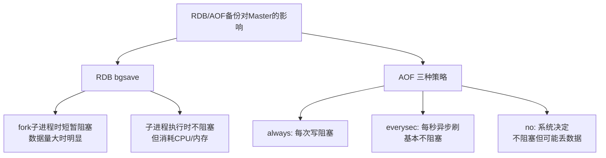

### RDB持久化阻塞分析

#### RDB创建过程

```shell
# RDB创建有两种方式：
1. SAVE命令（同步，已弃用）：阻塞直到完成 ❌
2. BGSAVE命令（后台）：fork子进程执行 ✅

# 执行流程：
redis-cli> BGSAVE
Background saving started
```

#### BGSAVE详细流程

```shell
// Redis源码中的bgsave实现（简化）
void bgsaveCommand(client *c) {
    // 1. 检查是否已有bgsave在运行
    if (server.rdb_child_pid != -1) {
        addReplyError(c,"Background save already in progress");
        return;
    }
    
    // 2. fork()创建子进程 ← 这里会阻塞！
    if ((childpid = fork()) == 0) {
        // 子进程
        closeListeningSockets(0);  // 关闭监听socket
        
        // 3. 子进程生成RDB文件（不阻塞主进程）
        rdbSave("temp.rdb");  // 子进程独立执行
        
        exitFromChild(0);  // 子进程退出
    } else {
        // 父进程（主线程）
        server.rdb_child_pid = childpid;
        server.rdb_save_time_start = time(NULL);
        updateDictResizePolicy();  // 调整策略
        
        // 4. 主进程继续服务客户端
        addReplyStatus(c,"Background saving started");
    }
}
```

#### fork() 阻塞的深度分析

fork() 不是普通的函数调用，它是系统调用：
```yaml
// fork()的工作原理
pid_t fork(void) {
    // 1. 复制父进程的页表（虚拟内存映射）
    //    这需要遍历所有内存页，建立映射关系
    
    // 2. 复制进程描述符、文件描述符表等
    
    // 3. 创建新的进程控制块
}
```

#### Copy-on-Write (COW) 机制

fork()之后，Redis使用写时复制技术：

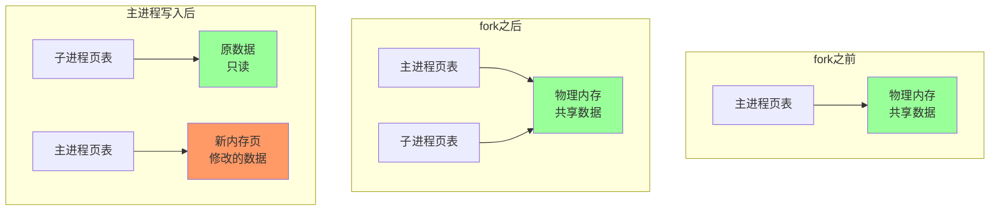

**COW带来的问题：**

```shell
# 当主进程修改数据时，会发生：
1. 操作系统复制被修改的页
2. 主进程写入新副本
3. 物理内存使用量增加

# 极端情况：主进程大量写入时
物理内存可能翻倍：原数据 + 修改的数据副本
可能触发OOM（内存溢出）杀死Redis
```


### AOF持久化阻塞分析

#### **AOF三种策略对比**

```
// Redis AOF配置
appendonly yes  # 开启AOF
appendfsync always|everysec|no  # 同步策略
```


#### **策略1：appendfsync always（最安全，最慢）**

```java
// always策略的实现
void flushAppendOnlyFile(int force) {
    // 1. 写入内核缓冲区
    write(server.aof_fd, server.aof_buf, sdslen(server.aof_buf));
    
    // 2. 调用fsync()刷到磁盘 ← 这里阻塞！
    fsync(server.aof_fd);
    
    // 3. 主线程等待fsync完成
    // 在此期间，所有客户端命令被阻塞
}
```

**阻塞分析**：

```shell
write()到内核缓冲区: 很快，微秒级
fsync()刷盘: 取决于磁盘性能

磁盘类型          fsync耗时
SSD:            0.1-1ms
HDD:            5-20ms  
网络存储:        可能10-100ms
慢磁盘:          可能几百ms

每次写操作都要等待，QPS严重受限！
```

#### **策略2：appendfsync everysec（推荐）**

```java
// everysec策略的实现
void flushAppendOnlyFile(int force) {
    // 1. 写入内核缓冲区（不阻塞）
    write(server.aof_fd, server.aof_buf, sdslen(server.aof_buf));
    
    // 2. 每秒由后台线程执行fsync
    if (server.aof_fsync == AOF_FSYNC_EVERYSEC) {
        // 检查距离上次fsync是否超过1秒
        if (server.unixtime > server.aof_last_fsync) {
            // 创建bio任务，异步执行
            bioCreateBackgroundJob(BIO_AOF_FSYNC, NULL, NULL, NULL);
        }
    }
}

// 后台线程执行fsync（不阻塞主线程）
void *bioProcessBackgroundJobs(void *arg) {
    while(1) {
        // 从任务队列取任务
        job = getJobFromQueue();
        
        if (job->type == BIO_AOF_FSYNC) {
            // 在后台线程执行fsync
            fsync(server.aof_fd);  // 不阻塞主线程！
        }
    }
}
```


**阻塞分析**：


```shell
主要阻塞点：
1. write()到内核缓冲区: 微秒级，基本无感
2. 只有缓冲区满时可能阻塞

优点：平衡了性能和数据安全
缺点：最多丢失1秒数据
```


#### **策略3：appendfsync no（最不安全，最快）**

```java
// no策略：完全由操作系统控制
void flushAppEndOnlyFile(int force) {
    // 只写入内核缓冲区
    write(server.aof_fd, server.aof_buf, sdslen(server.aof_buf));
    
    // 不调用fsync，由操作系统决定何时刷盘
    // Linux默认：30秒刷一次
}
```

**阻塞分析**：


```shell
几乎没有阻塞，性能最好
但可能丢失大量数据（服务器宕机时）
```

#### **AOF重写（BGREWRITEAOF）的阻塞**


```shell
# AOF重写也会fork子进程
redis-cli> BGREWRITEAOF
Background append only file rewriting started
```

**阻塞点**：

1. **fork()阻塞**：与RDB的bgsave相同
2. **AOF重写期间的写入**：
    - 主进程继续接收写入
    - 写入同时写入当前AOF文件**和**AOF重写缓冲区
    - 重写完成后，合并缓冲区到新AOF文件
    - **最后rename时可能短暂阻塞**

### **核心结论**

1. **RDB的bgsave**：主要阻塞在**fork()**，数据量越大阻塞越长
2. **AOF always**：**每次写入都阻塞**，性能影响大
3. **AOF everysec**：**基本不阻塞**，推荐使用
4. **COW机制**：可能导致**内存翻倍**，需要预留空间

### **最佳实践**

1. **生产环境使用AOF everysec + RDB定时**
2. **在Slave节点执行备份**
3. **监控fork时间和内存使用**
4. **为COW预留足够内存**
5. **使用SSD磁盘减少AOF刷盘延迟**


## 20、什么是AOF重写

### 什么是 AOF 重写？

AOF 重写（AOF Rewrite） 是 Redis 的一种压缩和优化 AOF 文件的机制。它通过重建当前数据库的状态，生成一个新的、更小的 AOF 文件，替换旧的、可能臃肿的 AOF 文件。

### 为什么需要 AOF 重写？

```shell
# 问题：AOF 文件会无限增长
# 示例：一个计数器 key
SET counter 1
INCR counter      # counter=2
INCR counter      # counter=3
INCR counter      # counter=4
... 重复1000次

# 原始 AOF 文件：
# 包含 1000+ 条命令，文件很大
# 但最终状态只是：counter=1001

# AOF 重写后：
# 只有一条命令：SET counter 1001
# 文件大小大大减小！
```


### AOF 重写的工作原理

#### 重写过程概览

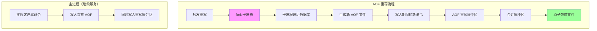

#### 重写流程

步骤 1：触发重写条件
    1. 当前 AOF 文件大小 > base_size * (1 + growth%)
    2. 默认：增长 100% 且大于 64MB

步骤 2：fork 子进程

步骤 3：子进程生成新 AOF 文件

步骤 4：处理重写期间的新写入

步骤 5：合并与替换

### AOF重写触发模式

#### 自动触发（推荐）

```java
# redis.conf 配置
appendonly yes
auto-aof-rewrite-percentage 100   # 增长100%时触发
auto-aof-rewrite-min-size 64mb    # 最小64MB才触发

# 触发逻辑：
# 1. 当前AOF文件大小 > aof_rewrite_min_size
# 2. (当前大小 - 上次重写后大小) / 上次重写后大小 ≥ 百分比
# 例如：上次重写后=100MB，现在=200MB，增长100%，触发重写
增长比例 = (aof_current_size - aof_base_size) / aof_base_size * 100%
```

#### 手动触发

```java
# 1. BGREWRITEAOF 命令（后台执行）
redis-cli> BGREWRITEAOF
Background append only file rewriting started

# 2. 通过配置文件触发
# 修改配置后重启，或发送 CONFIG SET 命令
redis-cli> CONFIG SET auto-aof-rewrite-percentage 200
OK

# 3. 通过监控脚本定时触发
#!/bin/bash
# trigger_aof_rewrite.sh
if [ $(redis-cli info persistence | grep aof_base_size | cut -d: -f2) -gt 100000000 ]; then
    redis-cli BGREWRITEAOF
fi
```

### AOF 重写与 RDB 的对比

| 特性           | **AOF 重写**                | **RDB (bgsave)**            |
| :------------- | :-------------------------- | :-------------------------- |
| **目的**       | 压缩 AOF 文件，去除冗余命令 | 生成数据快照                |
| **触发**       | 基于 AOF 文件增长           | 基于时间或 key 变化         |
| **过程**       | fork + 遍历 DB + 生成命令   | fork + 遍历 DB + 生成二进制 |
| **文件格式**   | 文本命令（AOF 格式）        | 二进制压缩                  |
| **恢复速度**   | 慢（需执行命令）            | 快（直接加载）              |
| **数据安全性** | 更高（最多丢 1 秒数据）     | 较低（可能丢几分钟数据）    |


### AOF 重写的问题与解决方案

#### **问题 1：fork 阻塞**


```shell
# 问题：AOF 重写也需要 fork 子进程
# 大内存实例 fork 时间可能很长（秒级）

# 解决方案：
# 1. 使用较小的 auto-aof-rewrite-min-size
# 2. 在从节点执行重写
# 3. 使用 Redis Cluster 分片

# 监控命令：
redis-cli info stats | grep latest_fork_usec
# 单位：微秒，1000000 微秒 = 1 秒
```


#### **问题 2：磁盘空间不足**


```shell
# 问题：重写需要额外磁盘空间（原文件 + 新文件）
# 临时文件：temp-rewriteaof-bg-{pid}.aof

# 解决方案：
# 1. 确保磁盘有足够空间（至少 2 倍 AOF 文件大小）
# 2. 监控磁盘使用率

# 监控脚本：
df -h /path/to/redis/data
du -sh /path/to/redis/appendonly.aof
```


#### **问题 3：重写期间性能下降**


```shell
# 问题：重写消耗 CPU 和磁盘 IO

# 解决方案：
# 1. 配置 no-appendfsync-on-rewrite yes
# 2. 避免在业务高峰期重写
# 3. 调整重写触发阈值

# 监控性能影响：
# 1. 观察 QPS 下降
redis-cli info stats | grep instantaneous_ops_per_sec

# 2. 观察延迟增加
redis-cli --latency-history

# 3. 监控系统资源
top -p $(pidof redis-server)
iostat -x 1
```


#### **问题 4：重写失败**


```sell
# 常见失败原因：
# 1. 磁盘空间不足
# 2. 权限问题
# 3. 内存不足（fork 失败）
# 4. 文件系统错误

# 排查步骤：
# 1. 查看 Redis 日志
tail -f /var/log/redis/redis-server.log

# 2. 检查错误信息
grep -i "rewrite" /var/log/redis/redis-server.log

# 3. 手动测试
redis-cli BGREWRITEAOF
# 观察输出和日志
```

### 小结

AOF 重写的核心价值
- 压缩文件：去除冗余命令，减小磁盘占用 
- 加速恢复：命令更少，恢复更快 
- 优化性能：减少磁盘 IO，提升写入效率

关键要点
- 触发机制：基于文件增长比例自动触发 
- 执行过程：fork 子进程，不影响主进程服务 
- 数据安全：通过重写缓冲区保证不丢失新写入 
- 性能影响：主要阻塞点在 fork()，大内存实例需要注意


## 21、Redis主从架构中数据丢失吗

Redis主从架构丢失主要有两种情况

- 异步复制同步丢失
- 集群产生脑裂数据丢失

下面分别简单介绍下这两种情况:

**异步复制同步丢失:**

Redis主节点和从节点之间的复制是异步的,当主节点的数据未完全复制到从节点时就发生宕机了,master内存中的数据会丢失。

如果主节点开启持久化是否可以解决这个问题呢？

答案是否定的,在master 发生宕机后,sentinel集群检测到主节点发生故障,重新选举新的主节点,如果旧的主节点在故障恢复后重启,那么此时它需要同步新主节点的数据,此时新的主节点的数据是空的(假设这段时间中没有数据写入)。那么旧主机点中的数据就会被刷新掉,此时数据还是会丢失。

**集群产生脑裂:**

简单来说,集群脑裂是指一个集群中有多个主节点,像一个人有两个大脑,到底听谁的呢？

例如,由于网络原因,集群出现了分区,master与slave节点之间断开了联系,哨兵检测后认为主节点故障,重新选举从节点为主节点,但主节点可能并没有发生故障。此时客户端依然在旧的主节点上写数据,而新的主节点中没有数据,在发现这个问题之后,旧的主节点会被降为slave,并且开始同步新的master数据,那么之前的写入旧的主节点的数据被刷新掉,大量数据丢失。

## 22、如何解决主从架构数据丢失问题？

在Redis的配置文件中,有两个参数如下:

```
min-slaves-to-write 1
min-slaves-max-lag 10
```

其中,min-slaves-to-write默认情况下是0,min-slaves-max-lag默认情况下是10。

上述参数表示至少有1个salve的与master的同步复制延迟不能超过10s,一旦所有的slave复制和同步的延迟达到了10s,那么此时master就不会接受任何请求。

通过降低min-slaves-max-lag参数的值,可以避免在发生故障时大量的数据丢失,一旦发现延迟超过了该值就不会往master中写入数据。

这种解决数据丢失的方法是降低系统的可用性来实现的。

## 23、Redis高可用方案如何实现？

常见的Redis高可用方案有以下几种:

- 数据持久化
- 主从模式
- Redis 哨兵模式

## 什么是Redis的事务

Redis的事务是一个单独的隔离操作,事务中的所有命令都会序列化、按顺序地执行。事务在执行的过程中,不会被其他客户端发送来的命令请求所打断,所以Redis事务是在一个队列中,一次性、顺序性、排他性地执行一系列命令。

Redis 事务的主要作用就是**串联多个命令防止别的命令插队**。

## Redis事务的相关命令

Redis事务相关的命令主要有以下几种:

- DISCARD:命令取消事务,放弃执行事务队列内的所有命令,恢复连接为非 (transaction) 模式,如果正在使用 WATCH 命令监视某个(或某些) key,那么取消所有监视,等同于执行命令 UNWATCH 。
- EXEC:执行事务队列内的所有命令。
- MULTI:用于标记一个事务块的开始。
- UNWATCH:用于取消 WATCH命令对所有 key 的监视。如果已经执行过了EXEC或DISCARD命令,则无需再执行UNWATCH命令,因为执行EXEC命令时,开始执行事务,WATCH命令也会生效,而 DISCARD命令在取消事务的同时也会取消所有对 key 的监视,所以不需要再执行UNWATCH命令了
- WATCH:用于标记要监视的key,以便有条件地执行事务,WATCH命令可以监控一个或多个键,一旦其中有一个键被修改(或删除),之后的事务就不会执行。

## Redis事务执行的三个阶段

1. 开始事务(MULTI)
2. 命令入列
3. 执行事务(EXEC)

## Redis事务的特性

- **Redis事务不保证原子性**,单条的Redis命令是原子性的,但事务不能保证原子性。
- **Redis事务是有隔离性的**,但没有隔离级别,事务中的所有命令都会序列化、按顺序地执行。事务在执行的过程中,不会被其他客户端发送来的命令请求所打断。(顺序性、排他性)
- **Redis事务不支持回滚**,Redis执行过程中的命令执行失败,其他命令仍然可以执行。(一次性)

## Redis事务为什么不支持回滚？

在Redis的事务中,命令允许失败,但是Redis会继续执行其它的命令而不是回滚所有命令,是不支持回滚的。

主要原因有以下两点:

- Redis 命令只在两种情况失败:

- - 语法错误的时候才失败(在命令输入的时候不检查语法)。
- 要执行的key数据类型不匹配:这种错误实际上是编程错误,这应该在开发阶段被测试出来,而不是生产上。

- 因为不需要回滚,所以Redis内部实现简单并高效。(在Redis为什么是单线程而不是多线程也用了这个思想,实现简单并且高效)

## Rides是单线程的还是多线程的

### 为什么在最开始Rides被设计为单线程

Redis作为一个成熟的分布式缓存框架,它由很多个模块组成,如网络请求模块、索引模块、存储模块、高可用集群支撑模块、数据操作模块等。

很多人说Redis是单线程的,就认为Redis中所有模块的操作都是单线程的,其实这是不对的。

我们所说的Redis单线程,指的是"其网络IO和键值对读写是由一个线程完成的",也就是说,**Redis中只有网络请求模块和数据操作模块是单线程的。而其他的如持久化存储模块、集群支撑模块等是多线程的。**

所以说,Redis中并不是没有多线程模型的,早在Redis 4.0的时候就已经针对部分命令做了多线程化。

**那么,为什么网络操作模块和数据存储模块最初并没有使用多线程呢？**

这个问题的答案比较简单！因为:"没必要！"

为什么没必要呢？我们先来说一下,什么情况下要使用多线程？

### 多线程的使用场景

一个计算机程序在执行的过程中,主要需要进行两种操作分别是**读写操作和计算操作**。

**其中读写操作主要是涉及到的就是I/O操作,其中包括网络I/O和磁盘I/O。计算操作主要涉及到CPU**。

**而多线程的目的,就是通过并发的方式来提升I/O的利用率和CPU的利用率。**

那么,Redis需不需要通过多线程的方式来提升提升I/O的利用率和CPU的利用率呢？

首先,我们可以肯定的说,Redis不需要提升CPU利用率,因为**Redis的操作基本都是基于内存的,CPU资源根本就不是Redis的性能瓶颈。**

**所以,通过多线程技术来提升Redis的CPU利用率这一点是完全没必要的。**

那么,使用多线程技术来提升Redis的I/O利用率呢？是不是有必要呢？

Redis确实是一个I/O操作密集的框架,他的数据操作过程中,会有大量的网络I/O和磁盘I/O的发生。要想提升Redis的性能,是一定要提升Redis的I/O利用率的,这一点毋庸置疑。

但是,**提升I/O利用率,并不是只有采用多线程技术这一条路可以走！**、

### 多线程的弊端

Java中的多线程技术,如内存模型、锁、CAS等,这些都是Java中提供的一些在多线程情况下保证线程安全的技术。

线程安全:是编程中的术语,指某个函数、函数库在并发环境中被调用时,能够正确地处理多个线程之间的共享变量,使程序功能正确完成。

和Java类似,所有支持多线程的编程语言或者框架,都不得不面对的一个问题,那就是如何解决多线程编程模式带来的共享资源的并发控制问题。

**虽然,采用多线程可以帮助我们提升CPU和I/O的利用率,但是多线程带来的并发问题也给这些语言和框架带来了更多的复杂性。而且,多线程模型中,多个线程的互相切换也会带来一定的性能开销。**

所以,在提升I/O利用率这个方面上,Redis并没有采用多线程技术,而是选择了**多路复用 I/O**技术。

**小结**

Redis并没有在网络请求模块和数据操作模块中使用多线程模型,主要是基于以下四个原因:

- Redis 操作基于内存,绝大多数操作的性能瓶颈不在 CPU
- 使用单线程模型,可维护性更高,开发,调试和维护的成本更低
- 单线程模型,避免了线程间切换带来的性能开销
- 在单线程中使用多路复用 I/O技术也能提升Redis的I/O利用率

还是要记住:Redis并不是完全单线程的,只是有关键的网络IO和键值对读写是由一个线程完成的。

### Rides多路复用

多路复用这个词,相信很多人都不陌生。我之前的很多文章中也够提到过这个词。

其中在介绍Linux IO模型的时候我们提到过它、在介绍HTTP/2的原理的时候,我们也提到过他。

那么,Redis的多路复用技术和我们之前介绍的又有什么区别呢？

这里先讲讲**Linux多路复用技术,就是多个进程的IO可以注册到同一个管道上,这个管道会统一和内核进行交互。当管道中的某一个请求需要的数据准备好之后,进程再把对应的数据拷贝到用户空间中。**


也就是说,通过一个线程来处理多个IO流。

IO多路复用在Linux下包括了三种,select、poll、epoll,抽象来看,他们功能是类似的,但具体细节各有不同。

其实,Redis的IO多路复用程序的所有功能都是通过包装操作系统的IO多路复用函数库来实现的。每个IO多路复用函数库在Redis源码中都有对应的一个单独的文件。


在Redis 中,每当一个套接字准备好执行连接应答、写入、读取、关闭等操作时,就会产生一个文件事件。因为一个服务器通常会连接多个套接字,所以多个文件事件有可能会并发地出现。


一旦有请求到达,就会交给 Redis 线程处理,这就实现了一个 Redis 线程处理多个 IO 流的效果。

所以,Redis选择使用多路复用IO技术来提升I/O利用率。

而之所以Redis能够有这么高的性能,不仅仅和采用多路复用技术和单线程有关,此外还有以下几个原因:

1、完全基于内存,绝大部分请求是纯粹的内存操作,非常快速。

2、数据结构简单,对数据操作也简单,如哈希表、跳表都有很高的性能。

3、采用单线程,避免了不必要的上下文切换和竞争条件,也不存在多进程或者多线程导致的切换而消耗 CPU

4、使用多路I/O复用模型

### 为什么Redis 6.0 引入多线程

2020年5月份,Redis正式推出了6.0版本,这个版本中有很多重要的新特性,其中多线程特性引起了广泛关注。

但是,需要提醒大家的是,**Redis 6.0中的多线程,也只是针对处理网络请求过程采用了多线程,而数据的读写命令,仍然是单线程处理的。**

但是,不知道会不会有人有这样的疑问:

**Redis不是号称单线程也有很高的性能么？**

**不是说多路复用技术已经大大的提升了IO利用率了么,为啥还需要多线程？**

主要是因为我们对Redis有着更高的要求。

根据测算,Redis 将所有数据放在内存中,内存的响应时长大约为 100 纳秒,对于小数据包,Redis 服务器可以处理 80,000 到 100,000 QPS,这么高的对于 80% 的公司来说,单线程的 Redis 已经足够使用了。

但随着越来越复杂的业务场景,有些公司动不动就上亿的交易量,因此需要更大的 QPS。

为了提升QPS,很多公司的做法是部署Redis集群,并且尽可能提升Redis机器数。但是这种做法的资源消耗是巨大的。

而经过分析,限制Redis的性能的主要瓶颈出现在网络IO的处理上,虽然之前采用了多路复用技术。但是我们前面也提到过,**多路复用的IO模型本质上仍然是同步阻塞型IO模型**。

下面是多路复用IO中select函数的处理过程:


从上图我们可以看到,**在多路复用的IO模型中,在处理网络请求时,调用 select (其他函数同理)的过程是阻塞的,也就是说这个过程会阻塞线程,如果并发量很高,此处可能会成为瓶颈。**

虽然现在很多服务器都是多个CPU核的,但是对于Redis来说,因为使用了单线程,在一次数据操作的过程中,有大量的CPU时间片是耗费在了网络IO的同步处理上的,并没有充分的发挥出多核的优势。

**如果能采用多线程,使得网络处理的请求并发进行,就可以大大的提升性能。多线程除了可以减少由于网络 I/O 等待造成的影响,还可以充分利用 CPU 的多核优势。**

所以,Redis 6.0采用多个IO线程来处理网络请求,网络请求的解析可以由其他线程完成,然后把解析后的请求交由主线程进行实际的内存读写。提升网络请求处理的并行度,进而提升整体性能。

但是,Redis 的多 IO 线程只是用来处理网络请求的,对于读写命令,Redis 仍然使用单线程来处理。

**那么,在引入多线程之后,如何解决并发带来的线程安全问题呢？**

这就是为什么我们前面多次提到的"Redis 6.0的多线程只用来处理网络请求,而数据的读写还是单线程"的原因。

Redis 6.0 只有在网络请求的接收和解析,以及请求后的数据通过网络返回给时,使用了多线程。而数据读写操作还是由单线程来完成的,所以,这样就不会出现并发问题了。

## 如何保证缓存与数据库双写时的数据一致性？

> 这是面试的高频题,需要好好掌握,这个问题是没有最优解的,只能数据一致性和性能之间找到一个最适合业务的平衡点

首先先来了解下一致性,在分布式系统中,一致性是指多副本问题中的数据一致性。一致性可以分为强一致性、弱一致性和最终一致性

- 强一致性:当更新操作完成之后,任何多个后续进程或者线程的访问都会返回最新的更新过的值。强一致性对用户比较友好,但对系统性能影响比较大。
- 弱一致性:系统并不保证后续进程或者线程的访问都会返回最新的更新过的值。
- 最终一致性:也是弱一致性的一种特殊形式,系统保证在没有后续更新的前提下,系统最终返回上一次更新操作的值。

大多数系统都是采用的最终一致性,最终一致性是指系统中所有的副本经过一段时间的异步同步之后,最终能够达到一个一致性的状态,也就是说在数据的一致性上存在一个短暂的延迟。

如果想保证缓存和数据库的数据一致性,最简单的想法就是同时更新数据库和缓存,但是这实现起来并不现实,常见的方案主要有以下几种:

- 先更新数据库,后更新缓存
- 先更新缓存,后更新数据库
- 先更新数据库,后删除缓存
- 先删除缓存,后更新数据库

乍一看,感觉第一种方案就可以实现缓存和数据库一致性,其实不然,更新缓存是个坑,一般不会有更新缓存的操作。因为很多时候缓存中存的值不是直接从数据库直接取出来放到缓存中的,而是经过一系列计算得到的缓存值,如果数据库写操作频繁,缓存也会频繁更改,所以更新缓存代价是比较大的,并且更改后的缓存也不一定会被访问就又要重新更改了,这样做无意义的性能消耗太大了。下面介绍删除缓存的方案

### 先更新数据库,后删除缓存

这种方案也存在一个问题,如果更新数据库成功了,删除缓存时没有成功,那么后面每次读取缓存时都是错误的数据。

解决这个问题的办法是**删除重试机制**,常见的方案有利用消息队列和数据库的日志

利用消息队列实现删除重试机制,如下图


### 先删除缓存,后更新数据库

这种方案也存在一些问题,比如在并发环境下,有两个请求A和B,A是更新操作,B是查询操作

1. 假设A请求先执行,会先删除缓存中的数据,然后去更新数据库
2. B请求查询缓存发现为空,会去查询数据库,并把这个值放到缓存中
3. 在B查询数据库时A还没有完全更新成功,所以B查询并放到缓存中的是旧的值,并且以后每次查询缓存中的值都是错误的旧值

这种情况的解决方法通常是采用延迟双删,就是为保证A操作已经完成,最后再删除一次缓存


逻辑很简单,删除缓存后,休眠一会儿再删除一次缓存,虽然逻辑看起来简单,但实现起来并不容易,问题就出在延迟时间设置多少合适,延迟时间一般大于**B操作读取数据库+写入缓存的时间**,这个只能是估算,一般可以考虑读业务逻辑数据的耗时 + 几百毫秒。

在实际应用中,还是先**更新数据库后删除缓存**这种方案用的多些。

需要注意的是,无论哪种方案,如果数据库采取读写分离+主从复制延迟的话,即使采用先**更新数据库后删除缓存**也会出现类似**先删除缓存后更新数据库**中出现的问题,举个例子

1. A操作更新主库后,删除了缓存
2. B操作查询缓存没有查到数据,查询从库拿到旧值
3. 主库将新值同步到从库
4. B操作将拿到的旧值写入缓存

这就造成了缓存中的是旧值,数据库中的是新值,解决方法还是上面说的延迟双删,延迟时间要大于主从复制的时间。


## Redis 缓存雪崩、缓存击穿、缓存穿透

### 缓存雪崩

通常我们为了保证缓存中的数据与数据库中的数据一致性,会给 Redis 里的数据设置过期时间,当缓存数据过期后,用户访问的数据如果不在缓存里,业务系统需要重新生成缓存,因此就会访问数据库,并将数据更新到 Redis 里,这样后续请求都可以直接命中缓存。

那么,当**大量缓存数据**在同一时间过期(失效)或者 Redis 故障宕机时,如果此时有大量的用户请求,都无法在 Redis 中处理,于是全部请求都直接访问数据库,从而导致数据库的压力骤增,严重的会造成数据库宕机,从而形成一系列连锁反应,造成整个系统崩溃,这就是缓存雪崩的问题。


**解决办法:**

用锁/分布式锁或者队列串行访问

缓存失效时间均匀分布

> 如果缓存集中在一端时间内失效,发生大量的缓存穿透,所有的查询都落在数据库上,造成了缓存雪崩。

> 这个没有完美解决办法,但是可以分析用户的行为,尽量让失效时间点均匀分布。大所属系统设计者考虑用加锁或者队列的方式保证缓存的单线程写,从而避免失效时大量的并发请求落到底层存储系统上。

**1. 加锁排队。限流---限流算法**

(1) 在缓存失效后,通过加锁或者队列来控制读数据库写缓存的线程数量。比如对某个 key 只允许一个线程查询数据和写缓存,其他线程等待。

简单地来说,就是在缓存失效的时候(判断拿出来的值为空),不是立即去 load db,而是先使用缓存工具的某些带成功操作返回值的操作(比如 Redisde SETNX 或者 Memcache 的 ADD)去 set 一个 mutex key,当操作返回成功是,在进行 koad db 的操作应设缓存;否则,就重试整个 get 缓存的方法。

(2) SETNX ,是【SET IF NOT EXISTS]的缩写,也就是只有不存在的时候才设置,可以利用它来实现锁的效果。

**2. 数据预热**

可以通过缓存 reload 机制,预选去更新缓存,再即将发生大并发访问前手动触发加载缓存不同的 key,设置不同的过期时间,让缓存失效的时间点尽量均匀。

### 缓存击穿

我们的业务通常会有几个数据会被频繁地访问,比如秒杀活动,这类被频地访问的数据被称为热点数据。

如果缓存中的某个热点数据过期了,此时大量的请求访问了该热点数据,就无法从缓存中读取,直接访问数据库,数据库很容易就被高并发的请求冲垮,这就是缓存击穿的问题。

缓存击穿跟缓存雪崩很相似,你可以认为缓存击穿是缓存雪崩的一个子集。

**解决方案:**

(1)**互斥锁方案**,保证同一时间只有一个业务线程更新缓存,未能获取互斥锁的请求,要么等待锁释放后重新读取缓存,要么就返回空值或者默认值。

(2)**不给热点数据设置过期时间**,由后台异步更新缓存,或者在热点数据准备要过期前,提前通知后台线程更新缓存以及重新设置过期时间;

### 缓存穿透

当发生缓存雪崩或击穿时,数据库中还是保存了应用要访问的数据,一旦缓存恢复相对应的数据,就可以减轻数据库的压力,而缓存穿透就不一样了。

当用户访问的数据,既不在缓存中,也不在数据库中,导致请求在访问缓存时,发现缓存缺失,再去访问数据库时,发现数据库中也没有要访问的数据,没办法构建缓存数据,来服务后续的请求。那么当有大量这样的请求到来时,数据库的压力骤增,这就是**缓存穿透**的问题。

**解决方案**

**(1)非法请求的限制**

当有大量恶意请求访问不存在的数据的时候,也会发生缓存穿透,因此在 API 入口处我们要判断求请求参数是否合理,请求参数是否含有非法值、请求字段是否存在,如果判断出是恶意请求就直接返回错误,避免进一步访问缓存和数据库。

**(2)缓存空值或者默认值**

当我们线上业务发现缓存穿透的现象时,可以针对查询的数据,在缓存中设置一个空值或者默认值,这样后续请求就可以从缓存中读取到空值或者默认值,返回给应用,而不会继续查询数据库。

**(3)使用布隆过滤器快速判断数据是否存在,避免通过查询数据库来判断数据是否存在**

我们可以在写入数据库数据时,使用布隆过滤器做个标记,然后在用户请求到来时,业务线程确认缓存失效后,可以通过查询布隆过滤器快速判断数据是否存在,如果不存在,就不用通过查询数据库来判断数据是否存在。

即使发生了缓存穿透,大量请求只会查询 Redis 和布隆过滤器,而不会查询数据库,保证了数据库能正常运行,Redis 自身也是支持布隆过滤器的。

布隆过滤器是一种数据结构,对所有可能查询的参数以 hash 形式存储,在控制层先进行校验,不符合则丢弃,从而避免了对底层存储系统的查询压力;


## Redis 事务

Redis 事务可以一次执行多个命令,(按顺序地串行化执行,执行中不会被其他命令插入,不许加塞)

### 事务简介

Redis 事务可以一次指定多个命令(允许在一个单独的步骤中执行一组命令),并且带有以下两个重要的保证:

```text
批量操作在发送 EXEC 命令前被放入队列缓存。

收到 EXEC 命令后进入事务执行,事务中任意命令执行失败,其余命令依然被执行。

在事务执行过程中,其他客户端提交的命令请求不会插入到事务执行命令列中。
```

1. **Redis 会将一个事务中的所有命令序列化,然后按顺序执行**
2. **执行中不会被其它命令插入,不许出现加赛行为**

### 常用命令

```text
DISCARD:
 取消事务,放弃执行事务块内的所有命令。
EXEC :
 执行所有事务块内的命令。
MULTI:
 标记一个事务块的开始。
UNWATCH:
 取消watch命令对所有key的监视。

WATCH KEY [KEY ...]
 :监视一个(或多个)key,如果在事务执行之前这个(或这些)key被其他命令所改动,那么事务将被打断。 
```

一个事务从开始到执行会经历以下三个阶段:

1、开始事务。

2、命令入队。

3、执行事务。

**示例 1 MULTI EXEC**

转账功能,A 向 B 转账 50 元

一个事务的例子,它先以 MULTI 开始一个事务,然后将多个命令入队到事务中,最后由 EXEC 命令触发事务


1. **输入Multi命令开始,输入的命令都会一次进入命令队列中,但不会执行**
2. **知道输入Exce后,Redis会将之前的命令队列中的命令一次执行。**

**示例 2 DISCARD 放弃队列运行**


1. **输入MULTI命令,输入的命令都会依次进入命令队列中,但不会执行。**
2. **直到输入Exec后,Redis会将之前的命令队列中的命令依次执行。**
3. **命令队列的过程中可以使用命令DISCARD来放弃队列运行。**

**示例3 事务的错误处理**

事务的错误处理:

队列中的某个命令出现了 报告错误,执行是整个的所有队列都会被取消。


**由于之前的错误,事务执行失败**

### Redis 事务总结

Redis 事务本质:一组命令的集合！一个事务中的所有命令都会被序列化,在事务执行过程中,会按照顺序执行！一次性,顺序性,排他性！执行一些列的命令！

**Redis 事务没有隔离级别的概念！**

所有的命令在事务中,并没有直接被执行！只有发起执行命令的时候才会执行！Exec

**Redis 单条命令保存原子性,但是事务不保证原子性！**

Redis 事务其实是支持原子性的！即使 Redis 不支持事务回滚机制,但是它会检查每一个事务中的命令是否错误。
