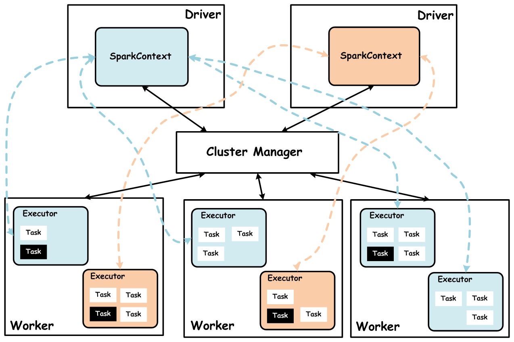
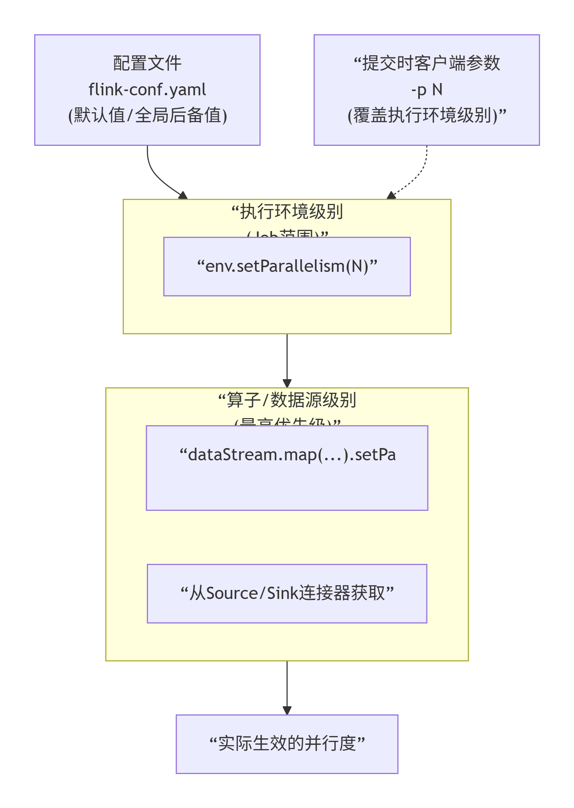
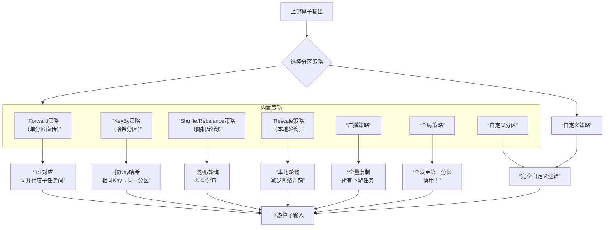
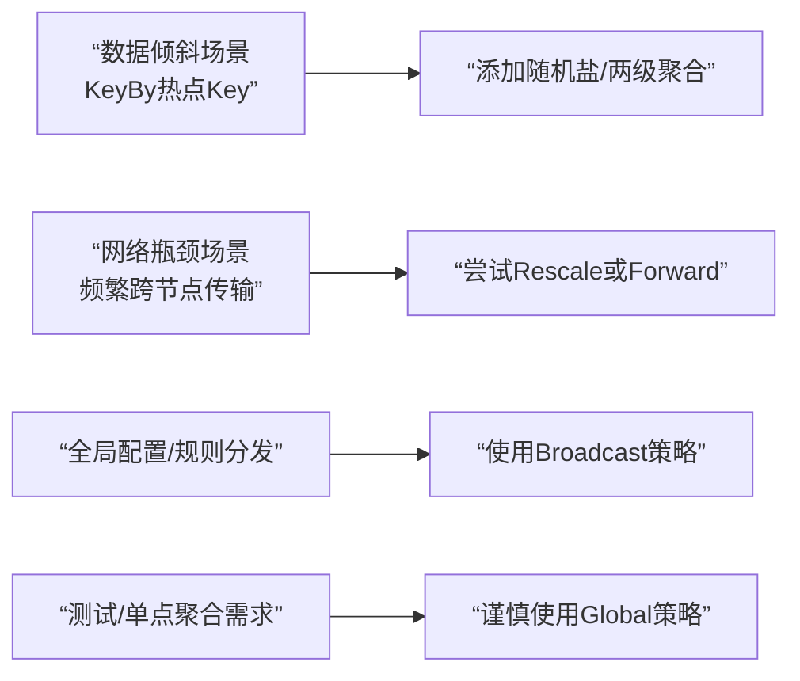

### Flink 基础篇


#### 1、什么是Flink？描述一下


Flink是一个以**流**为核心的**高可用、高性能**的分布式计算引擎。具备 **流批一体，高吞吐、低延迟，容错能力，大规模复杂计算**等特点，在数据流上提供 数据分发、通信等功能。

#### 2、能否详细解释一下其中的数据流、流批一体、容错能力等概念？

**数据流**：

所有产生的数据都天然带有**时间概念**，**把事件按照时间顺序排列起来，就形成了一个事件流**，也被称作数据流。

**流批一体**：

首先必须先明白什么是**有界数据** 和**无界数据**


**有界数据**，就是在一个确定的时间范围内的数据流，有开始，有结束，一旦确定就不会再改变，一般**批处理**用来处理有界数据，如上图的 bounded stream。

**无界数据**，就是持续产生的数据流，数据是无限的，有开始，无结束，一般**流处理**用来处理无界数据。如图 unbounded stream。

Flink的设计思想是以**流**为核心，**批是流的特例**，擅长处理无界和有界数据， Flink 提供精确的**时间控制能力和有状态计算机制**，可以轻松应对无界数据流，同时提供**窗口**处理有界数据流。所以被成为流批一体。

**容错能力**：

在分布式系统中，硬件故障、进程异常、应用异常、网络故障等异常无处不在，Flink引擎必须保证故障发生后 不仅可以 重启应用程序，还要确保其内部状态保持一致，从最后一次正确的时间点重新出发

**Flink提供集群级容错和应用级容错能力**

- **集群级容错:** Flink与集群管理器紧密连接，如YARN、Kubernetes，当进程挂掉后，自动重启新进程接管之前的工作。同时具备**高可用**性,可消除所有**单点故障**。

- **应用级容错**:Flink使用**轻量级分布式快照**，设计检查点（**checkpoint**）实现可靠容错。Flink 利用检查点特性，在框架层面 提供 **Exactly-once** 语义，即**端到端**的一致性，确保数据仅处理一次，不会重复也不会丢失，即使出现故障，也能保证数据只写一次。

> Storm：没有 SQL 和高阶 API 的支持、无法支持 exactly once；
>
> Spark Streaming：对实时计算来说，微批处理天生是有架构上的缺陷；
>
> Flink: 有 Streaming SQL 的支持，支持 exactly once 等等；

#### 3、Flink 和 Spark Streaming的区别？

**Flink**和**Spark Sreaming**最大的区别在于：Flink 是标准的**实时处理引擎**，基于事件驱动，**以流为核心**，而 Spark Streaming 的**RDD 实际是一组小批次的RDD集合**，是**微批**（Micro-Batch）的模型，**以批为核心**。

**下面我们介绍两个框架的主要区别：**

##### **架构模型**

Spark Streaming 在运行时的主要角色包括：

- 服务架构集群和资源管理 Master / Yarn Application Master；

- 工作节点 Work / Node Manager；

- 任务调度器 Driver；任务执行器 Executor

**集群架构**



Flink 在运行时主要包含：

- 客户端 Client

- 作业管理 Jobmanager

- 任务管理Taskmanager

**集群架构**


##### **任务调度**

Spark Streaming 连续不断的生成微小的数据批次，构建有向无环图DAG，Spark Streaming 会依次创建 DStreamGraph、JobScheduler。


Flink 根据用户提交的代码生成 **StreamGraph**，经过优化生成**JobGraph**，然后提交给 JobManager进行处理。

JobManager 会根据 JobGraph 生成 **ExecutionGraph**，ExecutionGraph 是 Flink 调度最核心的数据结构，JobManager 根据 ExecutionGraph 对 Job 进行调度，根据物理执行图部署到Taskmanager上形成具体的Task执行。


> Flink：StreamGraph-->JobGraph-->ExecutionGraph--> 执行图
> 
> Spark：DStreamGraph=spark application--->job-->stage--->Task

##### 时间机制

Spark Streaming 支持的时间机制有限，只支持、**处理时间**。

Flink 支持了流处理程序在时间上的三个定义：**事件时间 EventTime、摄入时间 IngestionTime、处理时间 ProcessingTime**。同时也支持 watermark 机制来处理滞后数据。


##### **容错机制**

对于 Spark Streaming 任务，我们可以设置**checkpoint**，然后假如发生故障并重启，我们可以从上次 checkpoint 之处恢复，**但是这个行为只能使得数据不丢失，可能会重复处理，不能做到恰好一次处理语义**。

Flink 则使用两阶段提交协议来解决这个问题，因为Flink保证的是端到端的精确一致性。

#### 4、Flink的架构包含哪些？

Flink 架构分为**技术架构和运行架构**两部分。

#### 5、简单介绍一下技术架构

如下图为Flink技术架构：


Flink 作为流批一体的分布式计算引擎，必须提供面向开发人员的**API层**，同时还需要跟外部数据存储进行交互，需要**连接器**，作业开发、测试完毕后，需要提交集群执行，需要**部署层**，同时还需要运维人员能够管理和监控，还提供图计算、机器学习、SQL等，需要**应用框架层**。

> - Api层：面向开发人员
>
> - 连接器：和外部数据交互
>
> - 部署层：提交作业
>
> - 应用框架层：监控和管理

#### 6、详细介绍一下Flink的运行架构

如下图为Flink运行架构：


Flink 集群采取 Master - Slave 架构，Master的角色为 **JobManager**，负责集群和作业管理，Slave的角色是 **TaskManager**，负责执行计算任务，同时，Flink 提供客户端 Client 来管理集群和提交任务，**JobManager** 和 **TaskManager**是集群的进程。

**(1)、Client**

Flink 客户端是F1ink 提供的 CLI 命令行工具，用来提交 Flink 作业到 Flink 集群，**在客户端中负责 StreamGraph (流图)和 Job Graph (作业图)的构建**。
- 作业优化：将用户程序（如DataStream代码）优化为JobGraph（逻辑数据流图）。 
- 作业提交：将JobGraph提交给JobManager。提交后，Client可以断开连接。

**(2)、JobManager**

JobManager根据并行度将Flink客户端提交的Flink 应用分解为**子任务**，从资源管理器 ResourceManager 申请所需的计算资源，资源具备之后，开始分发任务到 TaskManager执行Task，**并负责应用容错，跟踪作业的执行状态，发现异常则恢复作业等。**
- 作业调度：将逻辑执行图（JobGraph）转换为物理执行图并调度。
- 资源管理：管理TaskManager上的任务槽（Slots）。
- 检查点协调：触发并协调检查点，实现容错。
- 故障恢复：在TaskManager故障时重新调度任务。


**(3)、TaskManager**

TaskManager 接收 JobManage 分发的子任务，根据自身的资源情况 管理子任务的启动、 停止、销毁、异常恢复等生命周期阶段。Flink程序中必须有一个TaskManager。

- 任务执行：在任务槽（Slot）中执行具体的任务（算子）。
- 数据交换：负责TaskManager之间的数据流（Shuffle）。
- 状态存储：在本地存储算子的状态（如键控状态、算子状态）。


**一个 Flink 集群，主要包含了两个核心组件**：

- JobManager（master）：它会负责整个任务的协调工作，包括：调度 task、触发协调 Tasks 做 Checkpoint、协调容错恢复等等（HA 模式下，一个集群会启动多个 JobManager，但只会有一个处在 leader 状态，其他处在热备状态 —— standby）；

- TaskManager（workers）：负责执行一个 DataFlow Graph 的各个 tasks 以及 data streams 的 buffer 和数据交换。

JobManager/TaskManager 都是进程级别，TaskManager 在启动时，会根据配置将其内部的资源分为多个 slot，每个 slot 只会启动一个 Task，Task 是线程级别，从这里可以看出 Flink 是多线程调度模型，一个 TM 中可能会有来自多个任务的 task，从资源利用的角度看，这样的设计是有一些收益的，但是从资源隔离的角度看，这种设计就不是那么好了，不过好在现在业内的使用方式基本都是 On Yarn 的单集群单作业模式，相当于把资源隔离这个问题避过去了，但不可否认，这种设计是有缺陷的。

#### 7、Flink的并行度介绍一下？

Flink程序在执行的时候，会被映射成一个**Streaming Dataflow**，一个Streaming Dataflow是由一组Stream和Transformation Operator组成的。在启动时从一个或多个Source Operator开始，结束于一个或多个Sink Operator。

**Flink程序本质上是并行的和分布式的**，在执行过程中，**一个流(stream)包含一个或多个流分区**，而每一个operator包含一个或多个operator子任务。操作子任务间彼此独立，在不同的线程中执行，甚至是在不同的机器或不同的容器上。

**operator子任务的数量是这一特定operator的并行度**。相同程序中的不同operator有不同级别的并行度。


**一个Stream可以被分成多个Stream的分区，也就是Stream Partition。一个Operator也可以被分为多个Operator Subtask**。如上图中，Source被分成Source1和Source2，它们分别为Source的Operator Subtask。每一个Operator Subtask都是在不同的线程当中独立执行的。**一个Operator的并行度，就等于Operator Subtask的个数**。

上图Source的并行度为2。而一个Stream的并行度就等于它生成的Operator的并行度。数据在两个operator之间传递的时候有两种模式：

1. **One to One模式**：两个operator用此模式传递的时候，会保持数据的分区数和数据的排序；如上图中的Source1到Map1，它就保留的Source的分区特性，以及分区元素处 理的有序性。

2. **Redistributing （重新分配）模式**：这种模式会改变数据的分区数；每个operator subtask会根据选择transformation把数据发送到不同的目标subtasks，比如keyBy会通过hashcode重新分区，broadcast()和rebalance()方法会随机重新分区；

#### 8、Flink的并行度的怎么设置的？

我们在实际生产环境中可以从四个不同层面设置并行度：

- 操作算子层面(Operator Level)

- 执行环境层面(Execution Environment Level)

- 客户端层面(Client Level)

- 系统层面(System Level)

**并行度设置:**



需要注意的优先级：**算子层面>环境层面>客户端层面>系统层面。**

##### 如何设置合适的并行度

| 考量因素        | 建议与说明                                                   |
| :-------------- | :----------------------------------------------------------- |
| **数据源分区**  | **关键参考**。例如，Kafka消费者的最大有效并行度通常不超过其订阅主题的**分区总数**。 |
| **CPU核心数**   | 起步可设置为 **TaskManager总CPU核心数**。例如，集群有5个TM，每个8核，则最大并行度可设为40。 |
| **状态大小**    | 对有状态算子（如`keyBy`后的窗口），需确保每个键组（Key Group）负载均衡。并行度改变可能触发状态重组。 |
| **网络Shuffle** | 并行度增加会加剧网络传输，需权衡。可通过`rebalance()`等调用显式控制数据分区。 |
| **反压监控**    | 通过Flink Web UI观察是否存在反压。长期反压的算子可能是瓶颈，可考虑**单独增加其并行度**。 |

#### 9、Flink编程模型了解不？

Flink 应用程序主要由三部分组成：

- **Source**

- **transformation**

- **sink**

这些流式 dataflows 形成了有向图，以一个或多个源（source）开始，并以一个或多个目的地（sink）结束。


#### 10、Flink作业中的DataStream，Transformation介绍一下

Flink作业中，包含两个基本的块：**数据流（DataStream)**和**转换（Transformation）**。

DataStream是逻辑概念，为开发者提供API接口，**Transformation**是处理行为的抽象，包含了数据的读取、计算、写出。所以Flink 作业中的DataStream API 调用，实际上构建了多个由 Transformation组成的数据处理流水线（Pipeline）

DataStream关键特性：
- 不可变性：每次转换都会创建新的DataStream 
- 惰性执行：定义转换不会立即执行，只有在调用execute()时才触发 
- 类型安全：Java/Scala API提供编译时类型检查

DataStream API 和 Transformation 的转换如下图：


> DataStream代表数据流本身，而Transformation代表对数据流的操作。

#### 11、Flink的分区策略了解吗？


```java
public interface ChannelSelector<T extends IOReadableWritable> {

    /**
     * 初始化channels数量，channel可以理解为下游
     
     Operator的某个实例(并行算子的某个subtask).
     */
    void setup(int numberOfChannels);

    /**
     *根据当前的record以及Channel总数，
     *决定应将record发送到下游哪个Channel。
     *不同的分区策略会实现不同的该方法。
     */
    int selectChannel(T record);

    /**
    *是否以广播的形式发送到下游所有的算子实例
     */
    boolean isBroadcast();
}
```

**抽象类**：StreamPartitioner

```java
public abstract class StreamPartitioner<T> implements
        ChannelSelector<SerializationDelegate<StreamRecord<T>>>, Serializable {
    private static final long serialVersionUID = 1L;

    protected int numberOfChannels;

    @Override
    public void setup(int numberOfChannels) {
        this.numberOfChannels = numberOfChannels;
    }

    @Override
    public boolean isBroadcast() {
        return false;
    }

    public abstract StreamPartitioner<T> copy();
}
```

目前 Flink 支持**8种分区策略**的实现，数据分区体系如下图：


##### (1) GlobalPartitioner

该分区器会将所有的数据都发送到下游的某个算子实例(subtask id = 0)


##### (2) ForwardPartitioner

在API层面上**ForwardPartitioner**应用在DataStream上，生成一个新的 DataStream。

该Partitioner 比较特殊，用于在同一个 OperatorChain 中上下游算子之间的数据转发，实际上数据是直接传递给下游的，要求上下游并行度一样。

发送到下游对应的第一个task，保证上下游算子并行度一致，即上有算子与下游算子是1:1的关系

```java
/**
 * 发送到下游对应的第一个task
 * @param <T>
 */
@Internal
public class ForwardPartitioner<T> extends StreamPartitioner<T> {
    private static final long serialVersionUID = 1L;

    @Override
    public int selectChannel(SerializationDelegate<StreamRecord<T>> record) {
        return 0;
    }

    public StreamPartitioner<T> copy() {
        return this;
    }

    @Override
    public String toString() {
        return "FORWARD";
    }
}
```

**图示**


> 注意：
>
> 在上下游的算子没有指定分区器的情况下，如果上下游的算子并行度一致，则使用ForwardPartitioner，否则使用RebalancePartitioner，对于ForwardPartitioner，必须保证上下游算子并行度一致，否则会抛出异常

```java
//在上下游的算子没有指定分区器的情况下，如果上下游的算子并行度一致，则使用ForwardPartitioner，否则使用RebalancePartitioner
            if (partitioner == null && upstreamNode.getParallelism() == downstreamNode.getParallelism()) {
                partitioner = new ForwardPartitioner<Object>();
            } else if (partitioner == null) {
                partitioner = new RebalancePartitioner<Object>();
            }

            if (partitioner instanceof ForwardPartitioner) {
                //如果上下游的并行度不一致，会抛出异常
                if (upstreamNode.getParallelism() != downstreamNode.getParallelism()) {
                    throw new UnsupportedOperationException("Forward partitioning does not allow " +
                        "change of parallelism. Upstream operation: " + upstreamNode + " parallelism: " + upstreamNode.getParallelism() +
                        ", downstream operation: " + downstreamNode + " parallelism: " + downstreamNode.getParallelism() +
                        " You must use another partitioning strategy, such as broadcast, rebalance, shuffle or global.");
                }
            }
```

##### (3) ShufflePartitioner

随机的将元素进行分区，可以确保下游的Task能够均匀地获得数据，使用代码如下：

```java
dataStream.shuffle();

/**
 * 随机的选择一个channel进行发送
 * @param <T>
 */
@Internal
public class ShufflePartitioner<T> extends StreamPartitioner<T> {
    private static final long serialVersionUID = 1L;

    private Random random = new Random();

    @Override
    public int selectChannel(SerializationDelegate<StreamRecord<T>> record) {
        //产生[0,numberOfChannels)伪随机数，随机发送到下游的某个task
        return random.nextInt(numberOfChannels);
    }

    @Override
    public StreamPartitioner<T> copy() {
        return new ShufflePartitioner<T>();
    }

    @Override
    public String toString() {
        return "SHUFFLE";
    }
}
```

**图示**


##### (4) RebalancePartitioner

以**Round-robin**的方式为每个元素分配分区，确保下游的 Task可以均匀地获得数据，避免数据倾斜。使用代码如下：

```java
dataStream.rebalance();

/**
 *通过循环的方式依次发送到下游的task
 * @param <T>
 */
@Internal
public class RebalancePartitioner<T> extends StreamPartitioner<T> {
    private static final long serialVersionUID = 1L;

    private int nextChannelToSendTo;

    @Override
    public void setup(int numberOfChannels) {
        super.setup(numberOfChannels);
        //初始化channel的id，返回[0,numberOfChannels)的伪随机数
        nextChannelToSendTo = ThreadLocalRandom.current().nextInt(numberOfChannels);
    }

    @Override
    public int selectChannel(SerializationDelegate<StreamRecord<T>> record) {
        //循环依次发送到下游的task，比如：nextChannelToSendTo初始值为0，numberOfChannels(下游算子的实例个数，并行度)值为2
        //则第一次发送到ID = 1的task，第二次发送到ID = 0的task，第三次发送到ID = 1的task上...依次类推
        nextChannelToSendTo = (nextChannelToSendTo + 1) % numberOfChannels;
        return nextChannelToSendTo;
    }

    public StreamPartitioner<T> copy() {
        return this;
    }

    @Override
    public String toString() {
        return "REBALANCE";
    }
}
```

**图示**


##### (5) RescalePartitioner

根据上下游 Task 的数量进行分区， 使用 **Round-robin**选择下游的一个Task 进行数据分区，如上游有2个 Source.，下游有6个 Map，那么每个 Source 会分配3个固定的下游 Map，不会向未分配给自己的分区写人数据。这一点与 ShufflePartitioner 和 RebalancePartitioner 不同， 后两者会写入下游所有的分区。

基于上下游Operator的并行度，将记录以循环的方式输出到下游Operator的每个实例。
举例: 上游并行度是2，下游是4，则上游一个并行度以循环的方式将记录输出到下游的两个并行度上;上游另一个并行度以循环的方式将记录输出到下游另两个并行度上。 若上游并行度是4，下游并行度是2，则上游两个并行度将记录输出到下游一个并行度上；上游另两个并行度将记录输出到下游另一个并行度上。


运行代码如下：

```java
dataStream.rescale();

@Internal
public class RescalePartitioner<T> extends StreamPartitioner<T> {
    private static final long serialVersionUID = 1L;

    private int nextChannelToSendTo = -1;

    @Override
    public int selectChannel(SerializationDelegate<StreamRecord<T>> record) {
        if (++nextChannelToSendTo >= numberOfChannels) {
            nextChannelToSendTo = 0;
        }
        return nextChannelToSendTo;
    }

    public StreamPartitioner<T> copy() {
        return this;
    }

    @Override
    public String toString() {
        return "RESCALE";
    }
}
```

**图示**


##### (6) BroadcastPartitioner

将该记录广播给所有分区，即有N个分区，就把数据复制N份，每个分区1份，其使用代码如下：

```java
dataStream.broadcast();

/**
 * 发送到所有的channel
 */
@Internal
public class BroadcastPartitioner<T> extends StreamPartitioner<T> {
    private static final long serialVersionUID = 1L;
    /**
     * Broadcast模式是直接发送到下游的所有task，所以不需要通过下面的方法选择发送的通道
     */
    @Override
    public int selectChannel(SerializationDelegate<StreamRecord<T>> record) {
        throw new UnsupportedOperationException("Broadcast partitioner does not support select channels.");
    }

    @Override
    public boolean isBroadcast() {
        return true;
    }

    @Override
    public StreamPartitioner<T> copy() {
        return this;
    }

    @Override
    public String toString() {
        return "BROADCAST";
    }
}
```

**图示**


##### (7) KeyGroupStreamPartitioner

在API层面上，**KeyGroupStreamPartitioner**应用在 **KeyedStream**上，生成一个新的 KeyedStream。

KeyedStream根据keyGroup索引编号进行分区，会将数据按 Key 的 Hash 值输出到下游算子实例中。该分区器不是提供给用户来用的。

KeyedStream在构造**Transformation**的时候默认使用KeyedGroup分区形式，从而在底层上支持作业Rescale功能。

```java
org.apache.flink.streaming.runtime.partitioner.KeyGroupStreamPartitioner

/**
 * 根据key的分组索引选择发送到相对应的下游subtask
 * @param <T>
 * @param <K>
 */
@Internal
public class KeyGroupStreamPartitioner<T, K> extends StreamPartitioner<T> implements ConfigurableStreamPartitioner {
...

    @Override
    public int selectChannel(SerializationDelegate<StreamRecord<T>> record) {
        K key;
        try {
            key = keySelector.getKey(record.getInstance().getValue());
        } catch (Exception e) {
            throw new RuntimeException("Could not extract key from " + record.getInstance().getValue(), e);
        }
        //调用KeyGroupRangeAssignment类的assignKeyToParallelOperator方法,代码如下所示
        return KeyGroupRangeAssignment.assignKeyToParallelOperator(key, maxParallelism, numberOfChannels);
    }
...
}

org.apache.flink.runtime.state.KeyGroupRangeAssignment

public final class KeyGroupRangeAssignment {
...

    /**
     * 根据key分配一个并行算子实例的索引，该索引即为该key要发送的下游算子实例的路由信息，
     * 即该key发送到哪一个task
     */
    public static int assignKeyToParallelOperator(Object key, int maxParallelism, int parallelism) {
        Preconditions.checkNotNull(key, "Assigned key must not be null!");
        return computeOperatorIndexForKeyGroup(maxParallelism, parallelism, assignToKeyGroup(key, maxParallelism));
    }

    /**
     *根据key分配一个分组id(keyGroupId)
     */
    public static int assignToKeyGroup(Object key, int maxParallelism) {
        Preconditions.checkNotNull(key, "Assigned key must not be null!");
        //获取key的hashcode
        return computeKeyGroupForKeyHash(key.hashCode(), maxParallelism);
    }

    /**
     * 根据key分配一个分组id(keyGroupId),
     */
    public static int computeKeyGroupForKeyHash(int keyHash, int maxParallelism) {

        //与maxParallelism取余，获取keyGroupId
        return MathUtils.murmurHash(keyHash) % maxParallelism;
    }

    //计算分区index，即该key group应该发送到下游的哪一个算子实例
    public static int computeOperatorIndexForKeyGroup(int maxParallelism, int parallelism, int keyGroupId) {
        return keyGroupId * parallelism / maxParallelism;
    }
...
```

**图示**


##### (8) CustomPartitionerWrapper

用户自定义分区器。需要用户自己实现Partitioner接口，来定义自己的分区逻辑。

```java
public class CustomPartitionerWrapper<K, T> extends StreamPartitioner<T> {
    private static final long serialVersionUID = 1L;

    Partitioner<K> partitioner;
    KeySelector<T, K> keySelector;

    public CustomPartitionerWrapper(Partitioner<K> partitioner, KeySelector<T, K> keySelector) {
        this.partitioner = partitioner;
        this.keySelector = keySelector;
    }

    @Override
    public int selectChannel(SerializationDelegate<StreamRecord<T>> record) {
        K key;
        try {
            key = keySelector.getKey(record.getInstance().getValue());
        } catch (Exception e) {
            throw new RuntimeException("Could not extract key from " + record.getInstance(), e);
        }
//实现Partitioner接口，重写partition方法
        return partitioner.partition(key, numberOfChannels);
    }

    @Override
    public StreamPartitioner<T> copy() {
        return this;
    }

    @Override
    public String toString() {
        return "CUSTOM";
    }
}

public class CustomPartitioner implements Partitioner<String> {
      // key: 根据key的值来分区
      // numPartitions: 下游算子并行度
      @Override
      public int partition(String key, int numPartitions) {
         return key.length() % numPartitions;//在此处定义分区策略
      }
  }
```

##### 分区策略总结



##### 如何选择分区策略

| 策略          | 网络开销 | 负载均衡       | 适用场景                     | 代码示例                  |
| :------------ | :------- | :------------- | :--------------------------- | :------------------------ |
| **Forward**   | **无**   | 要求并行度相同 | 算子链优化、本地传输         | `dataStream.forward()`    |
| **KeyBy**     | 高       | 依赖Key分布    | **按键聚合**、窗口计算、Join | `dataStream.keyBy("key")` |
| **Shuffle**   | 高       | **优秀**       | 打破数据顺序、均匀分布       | `dataStream.shuffle()`    |
| **Rebalance** | 高       | **优秀**       | **默认均匀分布**、负载均衡   | `dataStream.rebalance()`  |
| **Rescale**   | **中低** | 良好           | 本地化优化、减少网络传输     | `dataStream.rescale()`    |
| **Broadcast** | **极高** | 全复制         | 配置分发、小表广播           | `dataStream.broadcast()`  |
| **Global**    | 低       | **极差**       | 测试、全局聚合到单点         | `dataStream.global()`     |


##### 生产问题排查及解决

1、**处理数据倾斜：KeyBy热点问题**

```java
// 方案1：添加随机后缀打散热点Key
dataStream
    .map(event -> {
        int salt = ThreadLocalRandom.current().nextInt(10);
        return new Tuple2<>(event.getKey() + "_" + salt, event);
    })
    .keyBy(0)  // 按键+随机盐分区
    .window(...)
    .aggregate(...)
    .map(result -> result.removeSalt()); // 最后去除盐值

// 方案2：两级聚合（局部+全局）
DataStream<LocalResult> localAgg = dataStream
    .keyBy(event -> event.getKey() + "_" + (event.hashCode() % 100))
    .window(...)
    .aggregate(new LocalAgg());  // 局部聚合

DataStream<GlobalResult> globalAgg = localAgg
    .keyBy(result -> result.getKey().split("_")[0])  // 去掉随机后缀
    .window(...)
    .aggregate(new GlobalAgg());  // 全局聚合
```

2、**自定义分区策略**

```java
// 实现Partitioner接口
public class CustomPartitioner implements Partitioner<String> {
    @Override
    public int partition(String key, int numPartitions) {
        // 自定义分区逻辑
        if (key.startsWith("A")) return 0;
        else if (key.startsWith("B")) return 1;
        else return key.length() % numPartitions;
    }
}

// 应用自定义分区器
dataStream.partitionCustom(new CustomPartitioner(), value -> value.getKey());
```

3、分区策略和资源优化



#### Flink中图的介绍

> 前两个图主要在客户端生成
>
> 后两个图主要在JobManager端生成

Flink 中的执行图可以分成四层：StreamGraph -> JobGraph -> ExecutionGraph -> 物理执行图。

**StreamGraph**：是根据用户通过 Stream API 编写的代码生成的最初的图。用来表示程序的**拓扑结构**。

**JobGraph**：StreamGraph经过优化后生成了 JobGraph，提交给 JobManager 的数据结构。主要的优化为，将多个符合条件的节点 chain 在一起作为一个节点，这样可以减少数据在节点之间流动所需要的序列化/反序列化/传输消耗。

**ExecutionGraph**：JobManager 根据 JobGraph 生成ExecutionGraph。ExecutionGraph是JobGraph的并行化版本，是调度层最核心的数据结构。

**物理执行图**：JobManager 根据 ExecutionGraph 对 Job 进行调度后，在各个TaskManager 上部署 Task 后形成的“图”，并不是一个具体的数据结构。

而StreamingJobGraphGenerator就是StreamGraph转换为JobGraph。在这个类中，把ForwardPartitioner和RescalePartitioner列为POINTWISE分配模式，其他的为ALL_TO_ALL分配模式。代码如下

```java
if (partitioner instanceof ForwardPartitioner || partitioner instanceof RescalePartitioner) {
            jobEdge = downStreamVertex.connectNewDataSetAsInput(
                headVertex,

               // 上游算子(生产端)的实例(subtask)连接下游算子(消费端)的一个或者多个实例(subtask)
                DistributionPattern.POINTWISE,
                resultPartitionType);
        } else {
            jobEdge = downStreamVertex.connectNewDataSetAsInput(
                headVertex,
                // 上游算子(生产端)的实例(subtask)连接下游算子(消费端)的所有实例(subtask)
                DistributionPattern.ALL_TO_ALL,
                resultPartitionType);
        }
```

#### 12、描述一下Flink wordcount执行包含的步骤有哪些？

主要包含以下几步：

（1）获取运行环境 **StreamExecutionEnvironment**

（2）接入source源

（3）执行转换操作，如map()、flatmap()、keyby()、sum()

（4）输出sink源如print()

（5） 执行 execute

**提供一个示例：**

```java
import org.apache.flink.api.common.functions.FlatMapFunction;

import org.apache.flink.api.java.utils.ParameterTool;

import org.apache.flink.streaming.api.datastream.DataStream;

import org.apache.flink.streaming.api.datastream.DataStreamSource;

import org.apache.flink.streaming.api.environment.StreamExecutionEnvironment;

import org.apache.flink.streaming.api.windowing.time.Time;

import org.apache.flink.util.Collector;

public class **WordCount** {

public static void **main**(String[] args) throws Exception {

*//定义socket的端口号*

int port;

try{

​            ParameterTool parameterTool = ParameterTool.**fromArgs**(args);

​            port = parameterTool.**getInt**("port");

​        }catch (Exception e){

​            System.err.**println**("没有指定port参数，使用默认值9000");

​            port = 9000;

​        }

*//获取运行环境*

​        StreamExecutionEnvironment env = StreamExecutionEnvironment.**getExecutionEnvironment**();

*//连接socket获取输入的数据*

​        DataStreamSource<String> text = env.**socketTextStream**("10.192.12.106", port, "\n");

*//计算数据*

​        DataStream<WordWithCount> windowCount = text.**flatMap**(new FlatMapFunction<String, WordWithCount>() {

public void **flatMap**(String value, Collector<WordWithCount> out) throws Exception {

​                String[] splits = value.**split**("\\s");

for (String word:splits) {

​                    out.**collect**(new **WordWithCount**(word,1L));

​                }

​            }

​        })*//打平操作，把每行的单词转为<word,count>类型的数据*

​                .**keyBy**("word")*//针对相同的word数据进行分组*

​                .**timeWindow**(Time.**seconds**(2),Time.**seconds**(1))*//指定计算数据的窗口大小和滑动窗口大小*

​                .**sum**("count");               

*//把数据打印到控制台*

​        windowCount.**print**()

​                .**setParallelism**(1);*//使用一个并行度*

*//注意：因为flink是懒加载的，所以必须调用execute方法，上面的代码才会执行*

​        env.**execute**("streaming word count");

​    }

*/***

​     ** 主要为了存储单词以及单词出现的次数*

​     **/*

public static class **WordWithCount**{

public String word;

public long count;

public **WordWithCount**(){}

public **WordWithCount**(String word, long count) {

this.word = word;

this.count = count;

​        }

@Override

public String **toString**() {

return "WordWithCount{" +

"word='" + word + '\'' +

", count=" + count +

'}';

​        }

​    }

}
```

#### 13、Flink常用的算子有哪些？

分两部分：

（1）**数据读取**，这是Flink流计算应用的起点，常用算子有：

- 从内存读：fromElements

- 从文件读：readTextFile

- Socket 接入 ：socketTextStream

- 自定义读取：createInput

（2）处理数据的算子，主要用于**转换**过程

常用的算子包括：

- Map（单输入单输出）
- FlatMap（单输入、多输出）
- Filter（过滤）
- KeyBy（分组）
- Reduce（聚合）
- Window（窗口）
- Connect（连接）
- Split（分割）
