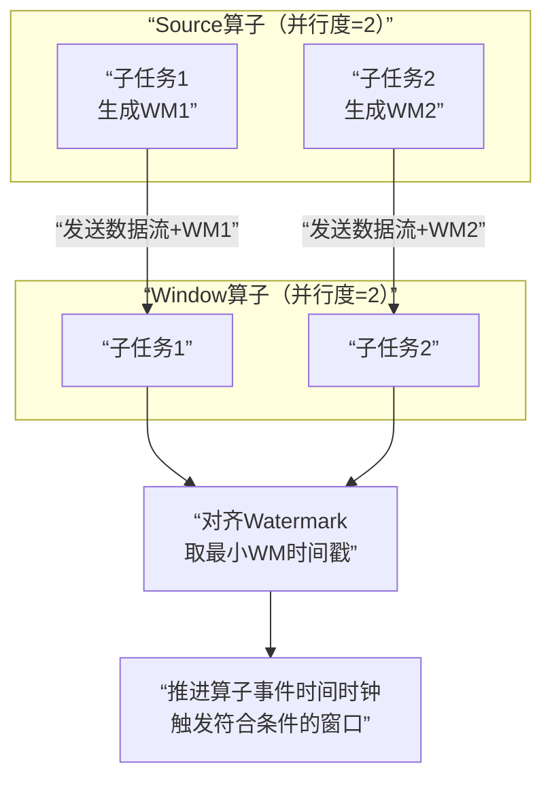

### Flink 核心篇

核心篇内容包含一下几个部分:
- 四大基石
- Flink容错机制
- Flink内存管理
- 反压、序列化、广播
- 资源管理

核心篇主要涉及以上知识点，下面让我们详细了解一下。

#### 1、Flink的四大基石包含哪些？

**Flink四大基石分别是：Checkpoint（检查点）、State（状态）、Time（时间）、Window（窗口）**。

#### 2、说说Flink窗口，以及划分机制

**窗口概念**：将无界流的数据，按时间区间，划分成多份数据，分别进行统计(**聚合**)

Flink支持两种划分窗口的方式(**time和count**)

- 第一种，**按时间驱动进行划分**

- 第二种，**数据驱动进行划分**


1. 按时间驱动Time Window 划分可以分为

    1. 滚动窗口 Tumbling Window

    2. 滑动窗口 Sliding Window。

2. 按数据驱动Count Window也可以划分为

    1. 滚动窗口 Tumbling Window

    2. 滑动窗口 Sliding Window。

3. Flink支持窗口的两个重要属性(**窗口长度size和滑动间隔interval**)，通过窗口长度和滑动间隔来区分滚动窗口和滑动窗口。

如果size=interval，那么就会形成tumbling-window(无重叠数据)--**滚动窗口**。

如果size(1min)>interval（30s）,那么就会形成sliding-window(有重叠数据)--**滑动窗口**。

通过组合可以得出四种基本窗口：

（1）**time-tumbling-window**无重叠数据的时间窗口，设置方式举例：timeWindow(Time.seconds(5))---基于时间的滚动窗口


（2）**time-sliding-window**有重叠数据的时间窗口，设置方式举例：timeWindow(Time.seconds(10), Time.seconds(5))---基于时间的滑动窗口


（3）**count-tumbling-window**无重叠数据的数量窗口，设置方式举例：countWindow(5)---基于数量的滚动窗口


（4）**count-sliding-window**有重叠数据的数量窗口，设置方式举例：countWindow(10,5)---基于数量的滑动窗口


**Flink中还支持一个特殊的窗口:会话窗口SessionWindows**

**session窗口分配器通过session活动来对元素进行分组，session窗口跟滚动窗口和滑动窗口相比，不会有重叠和固定的开始时间和结束时间的情况**。

> 需要注意的是，滑动距离或者时间间隔大于窗口大小的时候，会发生数据的丢失，所以一般不会使用。

session窗口在一个固定的时间周期内不再收到元素，即非活动间隔产生，那个这个窗口就会关闭。

一个session窗口通过一个**session间隔来配置**，**这个session间隔定义了非活跃周期的长度**，当这个非活跃周期产生，那么当前的session将关闭并且后续的元素将被分配到新的session窗口中去,如下图所示：


#### 3、介绍下Flink的窗口机制以及各组件之间是如何相互工作的

**首先说一下窗口机制使用的组件**

- WindowAssigner:分配元素
- WindowTrigger：触发计算
- WindowEvictor：过滤数据

以下为窗口机制的流程图：


**WindowAssigner**

1、窗口算子负责处理窗口，数据流源源不断地进入算子（window operator）时，每一个到达的元素首先会被交给 WindowAssigner(窗口分配器)。**WindowAssigner 会决定元素被放到哪个或哪些窗口（window）**，可能会创建新窗口。因为一个元素可以被放入多个窗口中（个人理解是滑动窗口，滚动窗口不会有此现象），所以同时存在多个窗口是可能的。注意，`Window`**本身只是一个ID标识符**，其内部可能存储了一些元数据，如`TimeWindow`中有开始和结束时间，但是并不会存储窗口中的元素。窗口中的元素实际存储在 Key/Value State 中，key为`Window`，value为元素集合（或聚合值）。为了保证窗口的容错性，该实现依赖了 Flink 的 State 机制。

**WindowTrigger**

2、每一个Window都拥有一个属于自己的 Trigger(触发器)，Trigger上会有定时器，**用来决定一个窗口何时能够被计算或清除**。每当有元素加入到该窗口，或者之前注册的定时器超时了，那么Trigger都会被调用。Trigger的返回结果可以是 ：

（1）continue（继续、不做任何操作），

（2）Fire（触发计算，处理窗口数据），

（3）Purge（触发清理，移除窗口和窗口中的数据），

（4）Fire + purge（触发计算+清理，处理数据并移除窗口和窗口中的数据）。

当数据到来时，调用**Trigger**判断是否需要触发计算，如果调用结果只是Fire的话，那么会计算窗口并保留窗口原样，也就是说窗口中的数据不清理，等待下次Trigger fire的时候再次执行计算。窗口中的数据会被反复计算，直到触发结果清理。在清理之前，窗口和数据不会释放没，所以窗口会一直占用内存。

**Trigger 触发流程：**

3、当Trigger Fire了，窗口中的元素集合就会交给`Evictor`（如果指定了的话）。**Evictor主要用来遍历窗口中的元素列表，并决定最先进入窗口的多少个元素需要被移除**。剩余的元素会交给用户指定的函数进行窗口的计算。如果没有 Evictor 的话，窗口中的所有元素会一起交给函数进行计算。

4、计算函数收到了窗口的元素（可能经过了 Evictor 的过滤），并计算出窗口的结果值，并发送给下游。窗口的结果值可以是一个也可以是多个。DataStream API 上可以接收不同类型的计算函数，包括预定义的`sum()`,`min()`,`max()`，还有 `ReduceFunction`，`FoldFunction`，还有`WindowFunction`。WindowFunction 是最通用的计算函数，其他的预定义的函数基本都是基于该函数实现的。

5、Flink 对于一些聚合类的窗口计算（如sum,min）做了优化，**因为聚合类的计算不需要将窗口中的所有数据都保存下来，只需要保存一个result值就可以了。每个进入窗口的元素都会执行一次聚合函数并修改result值**。这样可以大大降低内存的消耗并提升性能。但是如果用户定义了 Evictor，则不会启用对聚合窗口的优化，因为 Evictor 需要遍历窗口中的所有元素，必须要将窗口中所有元素都存下来。

#### 4、讲一下Flink的Time概念

在Flink的流式处理中，会涉及到时间的不同概念，主要分为三种时间机制，如下图所示：


- **EventTime[事件时间]**

事件发生的时间，例如：点击网站上的某个链接的时间，每一条日志都会记录自己的生成时间。

如果以EventTime为基准来定义时间窗口那将形成EventTimeWindow,要求消息本身就应该携带EventTime

- **IngestionTime[摄入时间]**

数据进入Flink的时间，如某个Flink节点的**sourceoperator**接收到数据的时间，例如：某个source消费到kafka中的数据。

如果以**IngesingtTime**为基准来定义时间窗口那将形成IngestingTimeWindow,以source的systemTime为准。

- **ProcessingTime[处理时间]**

某个Flink节点执行某个operation的时间，例如：timeWindow处理数据时的系统时间，**默认的时间属性就是Processing Time**。

如果以**ProcessingTime**基准来定义时间窗口那将形成ProcessingTimeWindow，以operator的systemTime为准。

在Flink的流式处理中，绝大部分的业务都会使用EventTime，一般只在EventTime无法使用时，才会被迫使用ProcessingTime或者IngestionTime。

如果要使用EventTime，那么需要引入EventTime的时间属性，引入方式如下所示：

> Eventime-->Processing Time-->Ingestion Time

#### 5、那在API调用时，应该怎么使用？

使用方式如下：

```java
final StreamExecutionEnvironment env = 

StreamExecutionEnvironment.
getExecutionEnvironrnent();

// 使用处理时间env.setStreamTimeCharacteristic

(TimeCharacteristic.ProcessingTime) ; // 使用摄入时间

env.setStrearnTimeCharacteristic(TimeCharacteristic.IngestionTime);

// 使用事件时间
env.setStrearnTimeCharacteristic(TimeCharacteri stic Eve~tTime);
```

#### 6、在流数据处理中，有没有遇到过数据延迟等问题，通过什么处理呢？

有遇到过数据延迟问题。举个例子：

**案例1：** 假你正在去往地下停车场的路上，并且打算用手机点一份外卖。

选好了外卖后，你就用在线支付功能付款了，这个时候是11点50分。恰好这时，你走进了地下停车库，而这里并没有手机信号。因此外卖的在线支付并没有立刻成功，而支付系统一直在Retry重试“支付”这个操作。

当你找到自己的车并且开出地下停车场的时候，已经是12点05分了。这个时候手机重新有了信号，手机上的支付数据成功发到了外卖在线支付系统，支付完成。

在上面这个场景中你可以看到，**支付数据的事件时间是11点50分**，而**支付数据的处理时间是12点05分**

**案例2**:某App 会记录用户的所有点击行为，并回传日志（在网络不好的情况下，先保存在本地，延后回传）。

A 用户在11:02 对 App 进行操作，B用户在11:03 操作了 App，

但是A 用户的网络不太稳定，回传日志延迟了，导致我们在服务端先接受到B 用户11:03 的消息，然后再接受到A 用户11:02 的消息，**消息乱序**了。

**一般处理数据延迟、消息乱序等问题，通过WaterMark水印来处理。**

**水印是用来解决数据延迟、数据乱序等问题，总结如下图所示：**


水印就是一个时间戳（timestamp），Flink可以给数据流添加水印

- 水印并不会影响原有Eventtime事件时间。

- 当数据流添加水印后，会按照水印时间来触发窗口计算,也就是说**watermark水印是用来触发窗口计算**的。

- 设置水印时间，会比事件时间小几秒钟,表示最大允许数据延迟达到多久

- 水印时间 = 事件时间 - 允许延迟时间 (例如：10:09:57 =  10:10:00 - 3s )

#### 7、WaterMark原理讲解一下？

##### WaterMark 核心原理

如下图所示：


窗口是10分钟触发一次，现在在12:00 - 12:10 有一个窗口，本来有一条数据是在12:00 - 12:10这个窗口被计算，但因为延迟，12:12到达，这时12:00 - 12:10 这个窗口就会被关闭，只能将数据下发到下一个窗口进行计算，这样就产生了数据延迟，造成计算不准确。

现在添加一个水位线：数据时间戳为2分钟。这时用数据产生的事件时间 12:12 -允许延迟的水印 2分钟 = 12:10 >= 窗口结束时间 。窗口触发计算，该数据就会被计算到这个窗口里。

在DataStream  API 中使用 TimestampAssigner 接口定义时间戳的提取行为，包含两个子接口 **AssignerWithPeriodicWatermarks**接口和 **AssignerWithPunctuatedWaterMarks**接口


##### watermark核心特性

| 特性             | 说明                                    | 影响                 |
| :--------------- | :-------------------------------------- | :------------------- |
| **单调递增**     | Watermark时间戳必须递增，保证时间推进   | 确保时间不会“倒退”   |
| **可传递性**     | 算子接收到上游Watermark会推进自己的时钟 | 保证整个作业时间同步 |
| **基于事件时间** | 与事件时间戳绑定，独立于处理时间        | 正确处理乱序事件     |
| **触发机制**     | Watermark到达窗口结束时间时触发窗口计算 | 决定结果输出时机     |

#####  Watermark生成策略

1、有序事件Watermark

```java
// 最简单情况：事件严格有序
WatermarkStrategy
    .<Event>forMonotonousTimestamps()
    .withTimestampAssigner((event, timestamp) -> event.getCreationTime());
```

特点：直接将当前最大时间戳作为Watermark。

2、乱序事件Watermark（最常用）

```java
// 允许固定延迟
WatermarkStrategy
    .<Event>forBoundedOutOfOrderness(Duration.ofSeconds(5))
    .withTimestampAssigner((event, timestamp) -> event.getCreationTime());
```
含义：Watermark = 当前最大时间戳 - 5秒延迟。时间戳为10:00:00的Watermark表示所有10:00:00之前（含）的数据应该已到达。

3、自定义Watermark生成器

```java
WatermarkStrategy<Event> strategy = WatermarkStrategy
    .forGenerator(ctx -> new CustomWatermarkGenerator())
    .withTimestampAssigner((event, timestamp) -> event.getCreationTime());

// 自定义生成器实现
public class CustomWatermarkGenerator implements WatermarkGenerator<Event> {
    private long maxTimestamp = Long.MIN_VALUE + 1;
    private final long outOfOrdernessMillis = 5000; // 5秒延迟
    
    // 每个事件调用
    @Override
    public void onEvent(Event event, long eventTimestamp, WatermarkOutput output) {
        maxTimestamp = Math.max(maxTimestamp, eventTimestamp);
        // 可以在这里实现更复杂的逻辑，如周期性输出
    }
    
    // 周期性调用（默认200ms）
    @Override
    public void onPeriodicEmit(WatermarkOutput output) {
        output.emitWatermark(new Watermark(maxTimestamp - outOfOrdernessMillis));
    }
}
```

4、标记Watermark（特殊场景）

```java
// 在事件中直接生成Watermark，不推荐常规使用
public class PunctuatedWatermarkGenerator implements WatermarkGenerator<Event> {
    @Override
    public void onEvent(Event event, long eventTimestamp, WatermarkOutput output) {
        if (event.isSpecialMarker()) {
            output.emitWatermark(new Watermark(eventTimestamp));
        }
    }
    
    @Override
    public void onPeriodicEmit(WatermarkOutput output) {
        // 不执行任何操作
    }
}
```

##### Watermark在窗口中的工作原理

1、窗口触发条件

```java
DataStream<Event> stream = env
    .addSource(kafkaSource)
    .assignTimestampsAndWatermarks(
        WatermarkStrategy
            .<Event>forBoundedOutOfOrderness(Duration.ofSeconds(5))
            .withTimestampAssigner((event, timestamp) -> event.getTimestamp())
    );

// 事件时间滚动窗口
stream
    .keyBy(Event::getUserId)
    .window(TumblingEventTimeWindows.of(Time.seconds(30)))
    .process(new WindowProcessFunction());
```

触发规则：当 Watermark时间戳 >= 窗口结束时间 时，窗口触发计算。

2、迟到数据处理

即使窗口已触发，仍可能有数据迟到到达。Flink提供三种处理方式：

```java
.window(TumblingEventTimeWindows.of(Time.seconds(30)))
// 方式1：允许额外延迟
.allowedLateness(Time.seconds(10))
// 方式2：侧输出流收集超迟数据
.sideOutputLateData(lateOutputTag)
.aggregate(new MyAggregateFunction());

// 从侧输出流获取迟到数据
DataStream<Event> lateData = windowedStream.getSideOutput(lateOutputTag);
```

##### Watermark传播机制



关键点：
- 每个Source子任务独立生成Watermark 
- 算子接收多个输入流时，取最小Watermark作为自己的时钟 
- 多流Join时，Watermark对齐机制决定何时输出结果


##### 常见问题及排查

1、Watermark停滞不前

**症状**：窗口长时间不触发。
**原因与解决**：

- **数据源中断**：检查Source是否正常生产数据
- **时间戳异常**：事件时间戳远小于当前时间
- **并行度不均衡**：某个子任务阻塞影响整体Watermark推进


```java
// 诊断：打印Watermark进度
stream.process(new ProcessFunction<Event, Event>() {
    @Override
    public void processElement(Event value, Context ctx, Collector<Event> out) {
        long watermark = ctx.timerService().currentWatermark();
        System.out.println("当前Watermark: " + (watermark == Long.MIN_VALUE ? "未设置" : watermark));
        out.collect(value);
    }
});
```

2、延迟与吞吐量的权衡

```java
// 大延迟：处理更多迟到数据，但结果延迟高
WatermarkStrategy.forBoundedOutOfOrderness(Duration.ofSeconds(30));

// 小延迟：低延迟输出，但可能丢失更多迟到数据
WatermarkStrategy.forBoundedOutOfOrderness(Duration.ofSeconds(1));

// 自适应方案：根据数据特征动态调整
public class AdaptiveWatermarkGenerator implements WatermarkGenerator<Event> {
    private long currentDelay = 5000; // 初始5秒
    private long maxTimestamp = Long.MIN_VALUE + 1;
    private int lateEventCount = 0;
    
    @Override
    public void onEvent(Event event, long eventTimestamp, WatermarkOutput output) {
        maxTimestamp = Math.max(maxTimestamp, eventTimestamp);
        
        // 简单自适应逻辑：迟到事件多则增加延迟
        if (eventTimestamp < maxTimestamp - currentDelay) {
            lateEventCount++;
            if (lateEventCount > 100) {
                currentDelay += 1000; // 增加1秒延迟
                lateEventCount = 0;
            }
        }
    }
}
```

3、多流Join的Watermark对齐

```java
DataStream<Event> stream1 = ...;
DataStream<Event> stream2 = ...;

// 关键：为每个流分配Watermark
stream1.assignTimestampsAndWatermarks(strategy1)
      .join(stream2.assignTimestampsAndWatermarks(strategy2))
      .where(e1 -> e1.getKey())
      .equalTo(e2 -> e2.getKey())
      .window(TumblingEventTimeWindows.of(Time.seconds(10)))
      .apply(new JoinFunction() { ... });
```

Join触发时机：当两个流的Watermark都超过窗口结束时间时，才输出Join结果。

##### 生产优化建议

1、**合理设置乱序延迟**

```java
// 根据业务数据延迟分布设置，通常为P99延迟时间
WatermarkStrategy.forBoundedOutOfOrderness(Duration.ofSeconds(5));
```

2、**监控Watermark进度**

- 通过Flink Web UI观察算子Watermark
- 监控`currentWatermark`与`currentProcessingTime`差距

3、**处理断流场景**

```java
// 配置空闲超时，避免单个分区无数据阻塞整个作业
WatermarkStrategy
    .<Event>forBoundedOutOfOrderness(Duration.ofSeconds(5))
    .withIdleness(Duration.ofMinutes(1));
```

4、**时间戳提取优化**

```java
// 直接从Kafka记录获取时间戳，避免序列化开销
KafkaSource.<Event>builder()
    .setValueOnlyDeserializer(new EventDeserializer())
    .setStartingOffsets(OffsetsInitializer.earliest())
    .build();

WatermarkStrategy
    .<Event>forBoundedOutOfOrderness(Duration.ofSeconds(5))
    .withTimestampAssigner(new KafkaRecordTimestampAssigner<>());
```

5、**调试与测试**

```java
// 测试环境下注入测试Watermark
TestStream<Event> testStream = env.fromElements(events)
    .assignTimestampsAndWatermarks(strategy);

// 手动推进Watermark
testStream.advanceWatermarkTo(10000L);
```

1. **Watermark是时间推进机制**：告诉系统“某个时间点之前的数据应该到齐了”
2. **乱序处理核心**：通过`forBoundedOutOfOrderness`设置合理延迟容忍度
3. **窗口触发条件**：Watermark时间 ≥ 窗口结束时间
4. **迟到数据处理**：通过`allowedLateness`和侧输出流控制
5. **多流对齐**：Join操作需要所有输入流的Watermark都推进

#### 8、如果数据延迟非常严重呢？只使用WaterMark可以处理吗？那应该怎么解决？

使用 **WaterMark+ EventTimeWindow** 机制可以在一定程度上解决数据乱序的问题，但是，WaterMark 水位线也不是万能的，在某些情况下，数据延迟会非常严重，即使通过Watermark + EventTimeWindow也无法等到数据全部进入窗口再进行处理，因为窗口触发计算后，**对于延迟到达的本属于该窗口的数据，Flink默认会将这些延迟严重的数据进行丢弃**

那么如果想要让一定时间范围的延迟数据不会被丢弃，可以使用**Allowed Lateness(允许迟到机制/侧道输出机制)**设定一个允许延迟的时间和侧道输出对象来解决，即使用**WaterMark + EventTimeWindow + Allowed Lateness方案**（包含侧道输出），可以做到数据不丢失。

**API调用**

- allowedLateness(lateness:Time)---设置允许延迟的时间

该方法传入一个Time值，设置允许数据迟到的时间，这个时间和watermark中的时间概念不同。再来回顾一下，

**watermark=数据的事件时间-允许乱序时间值**

> 注意一点，这里的事件时间是最晚到来的数据的事件事件。

重点理解下面这句话：

随着新数据的到来，**watermark的值会更新为最新数据事件时间-允许乱序时间值，但是如果这时候来了一条历史数据，watermark值则不会更新。**

**总的来说，watermark永远不会倒退它是为了能接收到尽可能多的乱序数据。**

那这里的Time值呢？主要是为了等待迟到的数据，如果属于该窗口的数据到来，仍会进行计算，后面会对计算方式仔细说明

注意：该方法只针对于基于event-time的窗口

- sideOutputLateData(outputTag:OutputTag[T])--保存延迟数据

**该方法是将迟来的数据保存至给定的outputTag参数，而OutputTag则是用来标记延迟数据的一个对象**。

- DataStream.getSideOutput(tag:OutputTag[X])--获取延迟数据

通过window等操作返回的DataStream调用该方法，传入标记延迟数据的对象来获取延迟的数据

#### 9、简单说一下什么是State。


在Flink中，状态被称作state，是用来**保存**中间的 计算结果或者**缓存数据**。

根据状态是否需要保存中间结果，分为**无状态计算** 和 **有状态计算。**

对于流计算而言，事件持续产生，如果每次计算**相互独立**，不依赖上下游的事件，则相同输入，可以得到相同输出，**是无状态计算**。

如果计算需要**依赖**于之前或者后续事件，则被称**为有状态计算**。


有状态计算如 sum求和，数据类加等。


#### 10、Flink 状态包括哪些？

(1)按照由 Flink管理 还是 用户管理，状态可以分为 **原始状态(Raw State)**和**托管状态（ManagedState）**

**托管状态（ManagedState）**:由Flink 自行进行管理的State。

**原始状态（Raw State）**：由用户自行进行管理。

**两者区别：**

1. 从状态管理方式的方式来说，**Managed State** 由**Flink Runtime**管理，自动存储，自动恢复，在内存管理上有优化；而**Raw State**需要用户自己管理，需要自己序列化，Flink不知道State中存入的数据是什么结构，只有用户自己知道，需要最终序列化为可存储的数据结构。

2. 从状态数据结构来说，Managed State 支持已知的数据结构，如Value、List、Map等。而 Raw State**只支持**字节数组，所有状态都要转换为二进制字节数组才可以。

3. 从推荐使用场景来说，Managed State 大多数情况下均可使用，而Raw State 是当 Managed State 不够用时，比如需要自定义Operator 时，才会使用 Raw State。**在实际生产过程中，只推荐使用 Managed State 。**

**(2)**State 按照是否有key划分为**KeyedState**和 **OperatorState**两种。

**keyedState特点：**

1. 只能用在keyedStream上的算子中，状态跟特定的key绑定。

2. keyStream流上的每一个key 对应一个state 对象。若一个operator 实例处理多个key，访问相应的多个State，**可对应多个state。**

3. keyedState 保存在StateBackend中

4. 通过RuntimeContext访问，实现Rich Function接口。

5. 支持多种数据结构：ValueState、ListState、ReducingState、AggregatingState、MapState.


Operator State特点：

1. 可以用于所有算子，但整个算子只对应一个state。

2. 并发改变时有多种重新分配的方式可选：均匀分配；

3. 实现CheckpointedFunction或者 ListCheckpointed 接口。

4. 目前只支持 ListState数据结构。


这里的fromElements会调用**FromElementsFunction**的类，其中就使用了类型为Liststate 的 operator state

#### 11、Flink广播状态了解吗？

Flink中，广播状态中叫作 BroadcastState。 在广播状态模式中使用。**所谓广播状态模式， 就是来自一个流的数据需要被广播到所有下游任务**，**在算子本地存储，在处理另一个流的时候依赖于广播的数据**.下面以一个示例来说明广播状态模式。


上图这个示例包含两个流，一个为**kafka模型流**，该模型是通过机器学习或者深度学习训练得到的模型，将该模型通过广播，发送给下游所有规则算子，规则算子将规则缓存到Flink的本地内存中，另一个为**Kafka数据流**，用来接收测试集，该测试集依赖于模型流中的模型，通过模型完成测试集的推理任务。

**广播状态（State）必须是MapState类型，广播状态模式需要使用广播函数进行处理，广播函数提供了处理广播数据流和普通数据流的接口**。

#### 12、Flink 状态接口包括哪些？

在Flink中使用状态，包含两种状态接口：

（1）**状态操作接口**：使用状态对象本身存储，写入、更新数据。

（2）**状态访问接口**:从StateBackend获取状态对象本身。

##### **状态操作接口**

Flink 中的**状态操作接口**面向两类用户，即**应用开发者和Flink框架本身**。 所有Flink设计了两套接口

**1、面向开发者State接口**

面向开发的State接口只提供了对State中数据的增删改基本操作接口，用户无法访问状态的其他运行时所需要的信息。接口体系如下图：


面向开发者的 State 接口体系

**2、面向内部State接口**

内部State 接口 是给 Flink 框架使用，提供更多的State方法，可以根据需要灵活扩展。除了对State中数据的访问之外，还提供内部运行时信息，如State中数据的序列化器，命名空间（namespace）、命名空间的序列化器、命名空间合并的接口。**内部State接口命名方式为InternalxxxState。**

##### **状态访问接口**

**有了状态之后，开发者自定义UDF时，应该如何访问状态？**

状态会被保存在StateBackend中，但StateBackend 又包含不同的类型。所有Flink中抽象了两个状态访问接口：**OperatorStateStore**和 **KeyedStateStore**,用户在编写UDF时，就无须考虑到底是使用哪种 StateBackend类型接口。

OperatorStateStore 接口原理：


OperatorState数据以Map形式保存在内存中，并没有使用RocksDBStateBackend和HeapKeyedStateBackend。

KeyedStateStore 接口原理：


keyedStateStore数据使用RocksDBStateBackend或者HeapKeyedStateBackend来存储，KeyedStateStore中创建、获取状态都交给了具体的StateBackend来处理，KeyedStateStore本身更像是一个代理。

#### 13、Flink状态如何存储

在Flink中， 状态存储被叫做 **StateBackend**, 它具备两种能力：

（1）在计算过程中提供访问State能力，开发者在编写业务逻辑中能够使用StateBackend的接口读写数据。

（2）能够将State持久化到外部存储，提供容错能力。

Flink状态**提供三种存储方式**：

**（1）内存**：MemoryStateBackend,适用于验证、测试、不推荐生产使用。

**（2）文件**：FSStateBackend，适用于长周期大规模的数据。

**（3）RocksDB**：RocksDBStateBackend，适用于长周期大规模的数据。

上面提到的 StateBackend是面向用户的，在Flink内部3种 State 的关系如下图：


在运行时，**MemoryStateBackend** 和 **FSStateBackend**本地的 State 都保存在TaskManager的内存中，所以其底层都依赖于**HeapKeyedStateBackend**。HeapKeyedStateBackend面向Flink 引擎内部，使用者无须感知。

**1、内存型  StateBackend**

MemoryStateBackend，运行时所需的State数据全部保存在 TaskManager JVM堆上内存中，KV类型的State、窗口算子的State 使用HashTable 来保存数据、触发器等。**执行检查点的时候，会把 State 的快照数据保存到**JobManager进程的内存中。

MemoryStateBackend可以使用**异步**的方式进行快照，（也可以同步），**推荐异步**，避免阻塞算子处理数据。

基于内存的 Stateßackend 在生产环境下不建议使用，可以在本地开发调试测试 。

**注意点如下 ：**

1) State 存储在 JobManager 的内存中.受限于 JobManager的内存大小。

2) 每个 State默认5MB,可通过 MemoryStateBackend 构造函数调整

3) 每个 Stale 不能超过 Akka Frame 大小。

**2、文件型 StateBackend**

FSStateBackend，运行时所需的State数据全部保存在 **TaskManager**的内存中，执行检查点的时候，会把 State 的快照数据保存到配置的文件系统中。

可以是分布式或者本地文件系统，路径如：

HDFS路径：`“hdfs://namenode:40010/flink/checkpoints”`

本地路径：`“file:///data/flink/checkpoints”。`

FSStateBackend **适用于处理大状态、长窗口、或者大键值状态的有状态处理任务**。

**注意点如下：**

1) State 数据首先被存在 TaskManager 的内存中。

2) State大小不能超过TM内存。

3) TM异步将State数据写入外部存储。

**MemoryStateBackend 和FSStateBackend 都依赖于HeapKeyedStateBackend，HeapKeyedStateBackend 使用 State存储数据。**

**3、RocksDBStateBackend**

RocksDBStateBackend 跟内存型和文件型都不同 。

RocksDBStateBackend使用嵌入式的本地数据库 RocksDB将流计算数据状态存储在本地磁盘中，不会受限于TaskManager 的内存大小，在执行检查点的时候，再将整个 RocksDB 中保存的State数据全量或者增量持久化到配置的文件系统中，

在 JobManager 内存中会存储少量的检查点元数据。RocksDB克服了State受内存限制的问题，同时又能够持久化到远端文件系统中，比较适合在生产中使用。

**缺点：**

RocksDBStateBackend 相比基于内存的StateBackend，访问State的成本高很多，可能导致数据流的吞吐量剧烈下降，甚至可能降低为原来的 1/10。

**适用场景**

1）最适合用于处理大状态、长窗口，或大键值状态的有状态处理任务。

2）RocksDBStateBackend 非常适合用于高可用方案。

1)  RocksDBStateBackend 是目前唯一支持增量检查点的后端。增量检查点非常适用于超 大状态的场景。

**注意点**

1）总 State 大小仅限于磁盘大小，不受内存限制

2）**RocksDBStateBackend**也需要配置外部文件系统，集中保存State 。

3）RocksDB的 JNI API**基于 byte 数组**，单 key 和单 Value 的大小不能超过 8 字节

4）对于使用具有合并操作状态的应用程序，如ListState ，随着时间可能会累积到超过 2*31次方字节大小，这将会导致在接下来的查询中失败。

#### 14、Flink 状态如何持久化？

首选，Flink的状态最终都要持久化到第三方存储中，确保集群故障或者作业挂掉后能够恢复。

RocksDBStateBackend 持久化策略有两种：

**全量持久化策略**RocksFullSnapshotStrategy

**增量持久化策略** RocksIncementalSnapshotStrategy

**1、全量持久化策略**

每次将全量的State写入到状态存储中（HDFS）。内存型、文件型、RocksDB类型的StataBackend 都支持全量持久化策略。


在执行持久化策略的时候，使用异步机制，每个算子启动1个独立的线程，将自身的状态写入分布式存储可靠存储中。在做持久化的过程中，状态可能会被持续修改。

**基于内存的状态后端**使用 CopyOnWriteStateTable 来保证线程安全，RocksDBStateBackend则使用RocksDB的快照机制，使用快照来保证线程安全。

**2、增量持久化策略**

增量持久化就是每次持久化增量的State，**只有RocksDBStateBackend 支持增量持久化。**

**Flink 增量式的检查点以 RocksDB为基础**， RocksDB是一个基于LSM-Tree的KV存储。新的数据保存在内存中， 称为**memtable**。如果Key相同，后到的数据将覆盖之前的数据，一旦memtable写满了，RocksDB就会将数据压缩并写入磁盘。memtable的数据持久化到磁盘后，就变成了不可变的 sstable。

因为 sstable 是不可变的，Flink对比前一个检查点创建和删除的RocksDB sstable 文件就可以计算出状态有哪些发生改变。

为了确保 sstable 是不可变的，Flink 会在RocksDB 触发刷新操作，强制将 memtable 刷新到磁盘上 。在Flink 执行检查点时，会将新的sstable 持久化到HDFS中，同时保留引用。这个过程中 Flink 并不会持久化本地所有的sstable，因为本地的一部分历史sstable 在之前的检查点中已经持久化到存储中了，只需增加对 sstable文件的引用次数就可以。

RocksDB会在后台合并 sstable 并删除其中重复的数据。然后在RocksDB删除原来的 sstable，替换成新合成的 sstable.。新的 sstable 包含了被删除的 sstable中的信息，通过合并历史的sstable会合并成一个新的 sstable，并删除这些历史sstable. 可以减少检查点的历史文件，避免大量小文件的产生。

#### 15、Flink 状态过期后如何清理？

1、**DataStream中状态过期**

可以对DataStream中的每一个状态设置**清理策略 StateTtlConfig**，可以设置的内容如下：

- 过期时间：超过多长时间未访问，视为State过期，类似于缓存。

- 过期时间更新策略：创建和写时更新、读取和写时更新。

- State可见性：未清理可用，超时则不可用。

2、**Flink SQL中状态过期**

Flink SQL 一般在流Join、聚合类场景使用State，如果State不定时清理，则导致State过多，内存溢出。清理策略配置如下：

```JAVA
StreamQueryConfig qConfig = ...
//设置过期时间为 min = 12小时 ，max = 24小时qConfig.
withIdleStateRetentionTime(Time.hours(12),Time.hours(24));
```


#### 16、Flink 通过什么实现可靠的容错机制

Flink 使用**轻量级分布式快照**，设计检查点（**checkpoint**）实现可靠容错。

#### 17、什么是Checkpoin检查点？

**Checkpoint**被叫做**检查点**，是Flink实现容错机制最核心的功能，是Flink可靠性的基石，它能够根据配置周期性地基于Stream中各个Operator的**状态**来生成Snapshot**快照**，从而将这些状态数据定期持久化存储下来，当Flink程序一旦意外崩溃时，重新运行程序时可以有选择地从这些Snapshot进行恢复，从而修正因为故障带来的程序数据状态中断。

Flink的checkpoint机制原理来自“**Chandy-Lamport algorithm**”算法

**注意:区分State和Checkpoint**

**1. State:**

**一般指一个具体的Task/Operator的状态(operator的状态表示一些算子在运行的过程中会产生的一些中间结果)**

State数据默认保存在Java的堆内存中/TaskManage节点的内存中

State可以被记录，在失败的情况下数据还可以恢复。

**2.Checkpoint:**

表示了一个FlinkJob在一个特定时刻的一份**全局状态快照**，即包含了所有Task/Operator的状态，**可以理解为Checkpoint是把State数据定时持久化存储了**，比如KafkaConsumer算子中维护的Offset状态,当任务重新恢复的时候可以从Checkpoint中获取。

#### 18、什么是Savepoin保存点？

**保存点**在 Flink 中叫作 **Savepoint**. 是基于Flink 检查点机制的应用完整快照备份机制. 用来保存状态 ，可以在另一个集群或者另一个时间点.从保存的状态中将作业恢复回来。适用 于应用升级、集群迁移、 Flink 集群版本更新、A/B测试以及假定场景、暂停和重启、归档等场景。保存点可以视为一个(算子 ID -> State) 的Map，对于每一个有状态的算子，Key是算子ID，Value是算子State。

#### 19、什么是CheckpointCoordinator检查点协调器？

Flink中检查点协调器叫作 **CheckpointCoordinator**，负责协调 Flink 算子的 State 的分布式快照。当触发快照的时候，CheckpointCoordinator向 Source 算子中注入**Barrier**消息 ，然后等待所有的Task通知检查点确认完成，同时持有所有 Task 在确认完成消息中上报的State句柄。

#### 20、Checkpoint中保存的是什么信息？

检查点里面到底保存着什么信息呢？我们以flink消费kafka数据wordcount为例：

1、我们从Kafka读取到一条条的日志，从日志中解析出app_id，然后将统计的结果放到内存中一个Map集合，app_id做为key，对应的pv做为value，每次只需要将相应app_id 的pv值+1后put到Map中即可；

2、kafka topic：test；

3、flink运算流程如下：


kafka topic有且只有一个分区

假设kafka的topic-test只有一个分区，flink的Source task记录了当前消费到kafka test topic的所有partition的offset

```text
例：（0，1000）表示0号partition目前消费到offset为1000的数据
```

**Flink的pv task记录了当前计算的各app的pv值，为了方便讲解，我这里有两个app：app1、app2**

```text
例：（app1，50000）（app2，10000）表示app1当前pv值为50000

表示app2当前pv值为10000每来一条数据，只需要确定相应app_id，将相应的value值+1后put到map中即可；
```

该案例中，CheckPoint保存的其实就是第n次CheckPoint消费的offset信息和各app的pv值信息，记录一下发生CheckPoint当前的状态信息，并将该状态信息保存到相应的状态后端。

图下代码：（注：状态后端是保存状态的地方，决定状态如何保存，如何保障状态高可用，我们只需要知道，我们能从状态后端拿到offset信息和pv信息即可。状态后端必须是高可用的，否则我们的状态后端经常出现故障，会导致无法通过checkpoint来恢复我们的应用程序）。

```text
chk-100offset：（0，1000）pv：（app1，50000）（app2，10000）该状态信息表示第100次CheckPoint的时候， partition 0 offset消费到了1000，pv统计

```

#### 21、当作业失败后，检查点如何恢复作业？

> Flink默认配置的是失败无限重启策略。

Flink提供了 **应用自动恢复机制和手动作业恢复机制**。

**应用自动恢复机制：**

Flink设置有作业失败重启策略，包含三种：

**1、定期恢复策略：fixed-delay**

固定延迟重启策略会尝试一个给定的次数来重启Job，如果超过最大的重启次数，Job最终将失败，在连续两次重启尝试之间，重启策略会等待一个固定时间，默认Integer.MAX_VALUE次

**2、失败比率策略：failure-rate**

失败率重启策略在job失败后重启，但是超过失败率后，Job会最终被认定失败，在两个连续的重启尝试之间，重启策略会等待一个固定的时间。

**3、直接失败策略：None   失败不重启**

**手动作业恢复机制**。

因为Flink检查点目录分别对应的是JobId，每通过flink run 方式/页面提交方式恢复都会重新生成 jobId，Flink 提供了在启动之时通过设置 **-s** .参数指定检查点目录的功能，让新的 jobld 读取该检查点元文件信息和状态信息，从而达到指定时间节点启动作业的目的。

启动方式如下：

```scala
/bin/flink -s /flink/checkpoints/03112312a12398740a87393/chk-50/_metadata
```

#### 22、当作业失败后，从保存点如何恢复作业？

从保存点恢复作业并不简单，尤其是在作业变更(如修改逻辑、修复 bug) 的情况下， 需要考虑如下几点:

**（1）算子的顺序改变**

如果对应的 UID 没变，则可以恢复，如果对应的 UID 变了恢复失败。

**（2）作业中添加了新的算子**

如果是无状态算子，没有影响，可以正常恢复，如果是有状态的算子，跟无状态的算子 一样处理。

**（3）从作业中删除了一个有状态的算子**

默认需要恢复保存点中所记录的所有算子的状态，如果删除了一个有状态的算子，从保存点回复的时候被删除的OperatorID找不到，所以会报错 可以通过在命令中添加

-- allowNonReStoredSlale (short: -n ）跳过无法恢复的算子 。

**（4）添加和删除无状态的算子**

如果手动设置了 UID 则可以恢复，保存点中不记录无状态的算子 如果是自动分配的 UID ，那么有状态算子的可能会变( Flink 一个单调递增的计数器生成 UID，DAG 改版，计数器极有可能会变) 很有可能恢复失败。

#### 23、Flink如何实现轻量级异步分布式快照？

要实现分布式快照，最关键的是能够将数据流切分。**Flink 中使用 Barrier (屏障)来切分数据 流**。Barrierr 会周期性地注入数据流中，作为数据流的一部分，从上游到下游被算子处理。Barrier 会严格保证顺序，不会超过其前边的数据。Barrier 将记录分割成记录集，**两个 Barrier之间的数据流中的数据隶属于同一个检查点。每一个 Barrier 都携带一个其所属快照的 ID 编号**，Barrier 随着数据向下流动，不会打断数据流，因此非常轻量。 在一个数据流中，可能会存在多个隶属于不同快照的 Barrier ，并发异步地执行分布式快照，如下图所示：


Barrier 会在数据流源头被注人并行数据流中。**Barrier n所在的位置就是恢复时数据重新处理的起始位置**。例如，在Kafka中，这个位置就是最后一个记录在分区内的偏移量 ( offset) ，作业恢复时，会根据这个位置从这个偏移量之后向 kafka 请求数据 这个偏移量就是State中保存的内容之一。

Barrier 接着向下游传递。当一个非数据源算子从所有的输入流中收到了快照 n 的Barrier时，该算子就会对自己的 State 保存快照，并向自己的下游**广播发送**快照 n 的 Barrier。一旦Sink 算子接收到 Barrier ，有两种情况：

（1）**如果是引擎内严格一次处理保证**，当 Sink 算子已经收到了所有上游的 Barrie n 时， Sink 算子对自己的 State 进行快照，**然后通知检查点协调器( CheckpointCoordinator)** 。当所有的算子都向检查点协调器汇报成功之后，检查点协调器向所有的算子确认本次快照完成。

（2）**如果是端到端严格一次处理保证**，当 Sink 算子已经收到了所有上游的 Barrie n 时， Sink 算子对自己的 State 进行快照，并预提交事务（两阶段提交的第一阶段），再通知检查点协调器( CheckpointCoordinator) ，检查点协调器向所有的算子确认本次快照完成，Sink 算子提交事务（两阶段提交的第二阶段），本次事务完成。

我们接着33的案例来具体说一下如何执行分布式快照：

对应到pv案例中就是，Source Task接收到JobManager的编号为chk-100（从最近一次恢复）的CheckPoint触发请求后，发现自己恰好接收到kafka offset（0，1000）处的数据，所以会往offset（0，1000）数据之后offset（0，1001）数据之前安插一个barrier，然后自己开始做快照，也就是将offset（0，1000）保存到状态后端chk-100中。然后barrier接着往下游发送，当统计pv的task接收到barrier后，也会暂停处理数据，将自己内存中保存的pv信息（app1，50000）（app2，10000）保存到状态后端chk-100中。OK，flink大概就是通过这个原理来保存快照的;

统计pv的task接收到barrier，就意味着barrier之前的数据都处理了，所以说，不会出现丢数据的情况。

#### 24、什么是Barrier对齐？


**一旦Operator从输入流接收到CheckPoint barrier n，它就不能处理来自该流的任何数据记录（收到的数据只能缓存起来），直到它从其他所有输入接收到barrier n为止。否则，它会混合属于快照n的记录和属于快照n + 1的记录**；

**如上图所示：**

图1，算子收到数字流的Barrier,字母流对应的barrier尚未到达，因为一个算子可能由多条数据流。

图2，算子收到数字流的Barrier,会继续从数字流中接收数据，但这些流只能被搁置，先存放在缓冲区中，记录不能被处理，而是放入缓存中，等待字母流 Barrier到达。在字母流到达前， 1，2，3数据已经被缓存。

图3，字母流到达，算子开始对齐State进行异步快照，并将Barrier向下游广播，并不等待快照执行完毕。

图4，算子做异步快照，首先处理缓存中积压数据，然后再从输入通道中获取数据。

#### 25、什么是Barrier不对齐？

checkpoint 是要等到所有的barrier全部都到才算完成，因为一个算子可能存在多条输入流，所以有多个barrier。

上述图2中，当还有其他输入流的barrier还没有到达时，会把已到达的barrier之后的数据1、2、3搁置在缓冲区，等待其他流的barrier到达后才能处理。

**barrier不对齐**：就是指当还有其他流的barrier还没到达时，为了不影响性能，也不用理会，直接处理barrier之后的数据。等到所有流的barrier的都到达后，就可以对该Operator做CheckPoint了；

#### 26、为什么要进行barrier对齐？不对齐到底行不行？

答：**Exactly Once时必须barrier对齐，如果barrier不对齐就变成了At Least Once**；

CheckPoint的目的就是为了保存快照，如果不对齐，那么在chk-100快照之前，已经处理了一些chk-100 对应的offset之后的数据，当程序从chk-100恢复任务时，chk-100对应的offset之后的数据还会被处理一次，所以就出现了重复消费。

#### 27、Flink支持Exactly-Once语义，那什么是Exactly-Once？

Exactly-Once语义 : 指端到端的一致性，从数据读取、引擎计算、写入外部存储的整个过程中，即使机器或软件出现故障，都确保数据仅处理一次，不会重复、也不会丢失。

#### 28、要实现Exactly-Once,需具备什么条件？

流系统要实现Exactly-Once，需要保证上游 Source 层、中间计算层和下游 Sink 层三部分同时满足**端到端严格一次处理，如下图：**


**Source端**：数据从上游进入Flink，必须保证消息严格一次消费。同时Source 端必须满足可重放（replay）。否则 Flink 计算层收到消息后未计算，却发生 failure 而重启，消息就会丢失。

**Flink计算层**：利用 Checkpoint 机制，把状态数据定期持久化存储下来，Flink程序一旦发生故障的时候，可以选择状态点恢复，避免数据的丢失、重复。

**Sink端**:Flink将处理完的数据发送到Sink端时，通过 **两阶段提交协议 ，**即 TwoPhaseCommitSinkFunction 函数。该 SinkFunction 提取并封装了两阶段提交协议中的公共逻辑，保证Flink 发送Sink端时实现严格一次处理语义。   **同时：**Sink端必须支持**事务机制**，能够进行数据**回滚**或者满足**幂等性。**

**回滚机制**：即当作业失败后，能够将部分写入的结果回滚到之前写入的状态。

**幂等性**：就是一个相同的操作，无论重复多少次，造成的结果和只操作一次相等。即当作业失败后，写入部分结果，但是当重新写入全部结果时，不会带来负面结果，重复写入不会带来错误结果。(可以理解为覆盖操作)

#### 29、什么是两阶段提交协议？

**两阶段提交协议（Two -Phase Commit，2PC）是解决分布式事务问题最常用的方法，它可以保证在分布式事务中，**要么所有参与进程都提交事务，要么都取消**，即实现ACID中的 A（原子性）。**

两阶段提交协议中 有两个重要角色，**协调者(Coordinator)**和**参与者（Participant）**,其中协调者只有一个，起到分布式事务的协调管理作用，参与者有多个。

两阶段提交阶段分为两个阶段：**投票阶段（Voting）**和**提交阶段（Commit）。**

**投票阶段：**

（1）协调者向所有参与者**发送 prepare 请求**和事务内容，询问是否可以准备事务提交，等待参与者的相应。

（2）参与者执行事务中包含的操作，并记录 undo 日志（用于回滚）和 redo 日志（用于重放），但不真正提交。

（3）参与者向协调者返回事务操作的执行结果，执行成功返回yes，失败返回no。

**提交阶段：**

分为成功与失败两种情况。

若所有参与者都返回 yes，说明事务可以提交：

- 协调者向所有参与者发送 **commit** 请求。
- 参与者收到 commit 请求后，将事务真正地提交上去，并释放占用的事务资源，并向协调者返回 ack 。
- 协调者收到所有参与者的 ack 消息，事务成功完成，如下图：


若有参与者返回 no 或者超时未返回，说明事务中断，需要回滚：

- 协调者向所有参与者发送rollback请求。
- 参与者收到rollback请求后，根据undo日志回滚到事务执行前的状态，释放占用的事务资源，并向协调者返回ack。
- 协调者收到所有参与者的ack消息，事务回滚完成。


#### 30、Flink 如何保证 Exactly-Once 语义？

Flink通过两阶段提交协议和检查点来保证Exactly-Once语义。

**对于Source端**：Source端严格一次处理比较简单，因为数据要进入Flink 中，所以Flink 只需要保存消费数据的偏移量 （offset）即可。如果Source端为 kafka，Flink 将 Kafka Consumer 作为 Source，可以将偏移量保存下来，如果后续任务出现了故障，恢复的时候可以由连接器重置偏移量，重新消费数据，保证一致性。

**对于 Sink 端**:Sink 端是最复杂的，**因为数据是落地到其他系统上的，数据一旦离开 Flink 之后，Flink 就监控不到这些数据了**，所以严格一次处理语义必须也要应用于 Flink 写入数据的外部系统，**故这些外部系统必须提供一种手段允许提交或回滚这些写入操作**，同时还要保证与 Flink Checkpoint 能够协调使用（**Kafka 0.11 版本已经实现精确一次处理语义**）。

我们以 **Kafka - Flink -Kafka** 为例 说明如何保证Exactly-Once语义。


如上图所示：Flink作业包含以下算子。

（1）一个Source算子，从Kafka中读取数据（即KafkaConsumer）

（2）一个窗口算子，基于时间窗口化的聚合运算（即window+window函数）

（3）一个Sink算子，将结果写会到Kafka（即kafkaProducer）

Flink使用两阶段提交协议 **预提交(Pre-commit)**阶段和**提交（Commit）阶段保证端到端严格一次。**

**（1）预提交阶段**

**1、当Checkpoint 启动时，进入预提交阶段**，JobManager 向Source Task 注入检查点分界线（CheckpointBarrier）,Source Task 将 CheckpointBarrier 插入数据流，向下游广播开启本次快照，如下图所示：


**2、Source 端**:Flink Data Source 负责保存 KafkaTopic 的 offset偏移量，当 Checkpoint 成功时 Flink 负责提交这些写入，否则就终止取消掉它们，当 Checkpoint 完成位移保存，它会将 checkpoint barrier（检查点分界线） 传给下一个 Operator，然后每个算子会对当前的状态做个快照，保存到**状态后端（State Backend）。**

**对于 Source 任务而言，就会把当前的 offset 作为状态保存起来。下次从 Checkpoint 恢复时，Source 任务可以重新提交偏移量，从上次保存的位置开始重新消费数据，如下图所示：**


预处理阶段：checkpoint barrier传递 及 offset 保存

**3、Slink 端**：从 Source 端开始，每个内部的 transformation 任务遇到 checkpoint barrier（检查点分界线）时，都会把状态存到 Checkpoint 里。数据处理完毕到 Sink 端时，Sink 任务首先把数据写入外部 Kafka，**这些数据都属于预提交的事务（还不能被消费）**，**此时的 Pre-commit 预提交阶段下Data Sink 在保存状态到状态后端的同时还必须预提交它的外部事务**，如下图所示：


预处理阶段：预提交到外部系统

**（2）提交阶段**

**4、当所有算子任务的快照完成**（所有创建的快照都被视为是 Checkpoint 的一部分），**也就是这次的 Checkpoint 完成时**，**JobManager 会向所有任务发通知，确认这次 Checkpoint 完成，此时 Pre-commit 预提交阶段才算完成**。才正式到两阶段提交协议的第二个阶段：**commit 阶段**。该阶段中 JobManager 会为应用中每个 Operator 发起 Checkpoint 已完成的回调逻辑。

本例中的 Data Source 和窗口操作无外部状态，因此在该阶段，这两个 Opeartor 无需执行任何逻辑，**但是 Data Sink 是有外部状态的，此时我们必须提交外部事务**，当 Sink 任务收到确认通知，就会正式提交之前的事务，Kafka 中未确认的数据就改为“已确认”，数据就真正可以被消费了，如下图所示：


提交阶段：数据精准被消费

> 注：Flink 由 JobManager 协调各个 TaskManager 进行 Checkpoint 存储，Checkpoint 保存在 StateBackend（状态后端） 中，默认 StateBackend 是内存级的，也可以改为文件级的进行持久化保存。

当开启一个检查点的时候，也就开启了一个kafka事务，在灭一个算子包括sink端灭有完成检查点之前，所有的操作都是与提交阶段。

#### 31、对Flink 端到端 严格一次Exactly-Once 语义做个总结


#### 32、Flink广播机制了解吗？

如下图所示：


（1）从图中可以理解 **广播** 就是一个**公共的共享变量，**广播变量是发给**TaskManager的内存中，**所以广播变量不应该太大，将一个数据集广播后，不同的**Task**都可以在节点上获取到，每个节点只存一份。 如果不使用广播，每一个Task都会拷贝一份数据集，造成内存资源浪费  。

#### 33、Flink反压了解吗？

反压（backpressure）是实时计算应用开发中，特别是流式计算中，十分常见的问题。**反压**意味着数据管道中某个节点成为瓶颈，**下游处理速率** **跟不上** **上游发送数据的速率**，而需要对上游进行限速。

由于实时计算应用通常使用**消息队列**来进行生产端和消费端的解耦，消费端数据源是 pull-based 的，所以反压通常是从某个节点传导至数据源并降低数据源（比如 Kafka consumer）的摄入速率。

简单来说就是**下游处理速率** **跟不上** **上游发送数据的速率**，下游来不及消费，导致队列被占满后，上游的生产会被阻塞，最终导致数据源的摄入被阻塞。

#### 34、Flink反压的影响有哪些？

反压会影响到两项指标: **checkpoint 时长**和 **state 大小**

（1）前者是因为 checkpoint barrier 是不会越过普通数据的，**数据处理被阻塞**也会**导致** checkpoint barrier 流经**整个数据管道的时长变长**，因而 checkpoint 总体时间（End to End Duration）变长。

（2）后者是因为为保证 EOS（Exactly-Once-Semantics，准确一次），对于有两个以上输入管道的 Operator，checkpoint barrier 需要对齐（Alignment），接受到较快的输入管道的 barrier 后，它后面数据会被缓存起来但不处理，直到较慢的输入管道的 barrier 也到达，这些被缓存的数据会被放到state 里面，导致 checkpoint 变大。

**这两个影响对于生产环境的作业来说是十分危险的**，因为 checkpoint 是保证数据一致性的关键，checkpoint 时间变长有可能导致 checkpoint 超时失败，而 state 大小同样可能拖慢 checkpoint 甚至导致 OOM （使用 Heap-based StateBackend）或者物理内存使用超出容器资源（使用 RocksDBStateBackend）的稳定性问题。

#### 35、Flink反压如何解决？

Flink社区提出了 FLIP-76: Unaligned Checkpoints[4] 来解耦反压和 checkpoint。

（1）定位反压节点

要解决反压首先要做的是定位到造成反压的节点，这主要有两种办法:

1. 通过 Flink Web UI 自带的反压监控面板；
2. 通过 Flink Task Metrics。

**（1）反压监控面板**

Flink Web UI 的反压监控提供了 SubTask 级别的反压监控，原理是通过周期性对 Task 线程的栈信息采样，得到线程被阻塞在请求 Buffer（意味着被下游队列阻塞）的频率来判断该节点是否处于反压状态。默认配置下，这个频率在 0.1 以下则为 OK，0.1 至 0.5 为 LOW，而超过 0.5 则为 HIGH。


**（2）Task Metrics**

Flink 提供的 Task Metrics 是更好的反压监控手段

如果一个 Subtask 的发送端 Buffer 占用率很高，则表明它被下游反压限速了；

如果一个 Subtask 的接受端 Buffer 占用很高，则表明它将反压传导至上游。

#### 36、Flink支持的数据类型有哪些？

Flink支持的数据类型如下图所示：


从图中可以看到 Flink 类型可以分为基础类型（Basic）、数组（Arrays）、复合类型（Composite）、辅助类型（Auxiliary）、泛型和其它类型（Generic）。Flink 支持任意的 Java 或是 Scala 类型。

#### 37、Flink如何进行序列和反序列化的？

所谓序列化和反序列化的含义：

**序列化**:就是将一个内存对象转换成二进制串，形成网络传输或者持久化的数据流。

**反序列化**:将二进制串转换为内存对。

**TypeInformation 是 Flink 类型系统的核心类**

**在Flink中，当数据需要进行序列化时，会使用TypeInformation的**生成序列化器接口调用一个 createSerialize() 方法，创建出TypeSerializer，TypeSerializer提供了序列化和反序列化能力。如下图所示：Flink 的序列化过程:


**对于大多数数据类型,Flink 可以自动生成对应的序列化器**，能非常高效地对数据集进行序列化和反序列化 ，如下图：


**比如，BasicTypeInfo、WritableTypeIno ，但针对 GenericTypeInfo 类型，Flink 会使用 Kyro 进行序列化和反序列化。其中，Tuple、Pojo 和 CaseClass 类型是复合类型，它们可能嵌套一个或者多个数据类型。在这种情况下，它们的序列化器同样是复合的。它们会将内嵌类型的序列化委托给对应类型的序列化器。**

**通过一个案例介绍Flink序列化和反序列化：**


**如上图所示，当创建一个Tuple 3 对象时，包含三个层面，一是 int 类型，一是 double 类型，还有一个是 Person。Person对象包含两个字段，一是 int 型的 ID，另一个是 String 类型的 name，**

**（1）在序列化操作时，会委托相应具体序列化的序列化器进行相应的序列化操作。从图中可以看到 Tuple 3 会把 int 类型通过 IntSerializer 进行序列化操作，此时 int 只需要占用四个字节。**

**（2）Person 类会被当成一个 Pojo 对象来进行处理，PojoSerializer 序列化器会把一些属性信息使用一个字节存储起来。同样，其字段则采取相对应的序列化器进行相应序列化，在序列化完的结果中，可以看到所有的数据都是由 MemorySegment 去支持。**

**MemorySegment 具有什么作用呢？**

**MemorySegment 在 Flink 中会将对象序列化到预分配的内存块上，它代表 1 个固定长度的内存，默认大小为 32 kb。MemorySegment 代表 Flink 中的一个最小的内存分配单元，相当于是 Java 的一个 byte 数组。每条记录都会以序列化的形式存储在一个或多个 MemorySegment 中。**

#### 38、为什么Flink使用自主内存而不用JVM内存管理？

因为在内存中存储大量的数据 （包括缓存和高效处理）时，JVM会面临很多问题，包括如下：

JVM 内存管理的不足：

**1）Java 对象存储密度低**:Java 的对象在内存中存储包含 3 个主要部分：**对象头、实例数据、对齐填充**部分。例如，一个只包含 boolean 属性的对象占 16byte：对象头占 8byte， boolean 属性占 1byte，为了对齐达到 8 的倍数额外占 7byte。而实际上只需要一个 bit（1/8 字节）就够了。

**2）Full GC 会极大地影响性能**:尤其是为了处理更大数据而开了很大内存空间的 JVM 来说，GC 会达到秒级甚至分钟级。

**3）OOM 问题影响稳定性**:OutOfMemoryError 是分布式计算框架经常会遇到的问题， 当JVM中所有对象大小超过分配给JVM的内存大小时，就会发生OutOfMemoryError错误， 导致 JVM 崩溃，分布式框架的健壮性和性能都会受到影响。

**4）缓存未命中问题**:CPU 进行计算的时候，是从 CPU 缓存中获取数据。现代体系的 CPU 会有多级缓存，而加载的时候是以 Cache Line 为单位加载。如果能够将对象连续存储， 这样就会大大降低 Cache Miss。使得 CPU 集中处理业务，而不是空转。

#### 39、那Flink自主内存是如何管理对象的？

Flink 并不是将大量对象存在堆内存上，**而是将对象都序列化到一个预分配的内存块上**， 这个内存块叫做 **MemorySegment**，它代表了一段固定长度的内存（默认大小为 32KB），也 是 **Flink 中最小的内存分配单元**，并且提供了非常高效的读写方法，很多运算可以直接操作 二进制数据，不需要反序列化即可执行。每条记录都会以序列化的形式存储在一个或多个 MemorySegment 中。如果需要处理的数据多于可以保存在内存中的数据，Flink 的运算符会 将部分数据溢出到磁盘.

#### 40、Flink内存模型介绍一下？

Flink总体内存类图如下：


主要包含**JobManager内存模型**和 **TaskManager内存模型**

**JobManager内存模型**


在 1.10 中，Flink 统一了 TM 端的内存管理和配置，相应的在 1.11 中，Flink 进一步 对 JM 端的内存配置进行了修改，使它的选项和配置方式与 TM 端的配置方式保持一致。


**TaskManager内存模型**

**Flink 1.10** 对 TaskManager 的内存模型和 Flink 应用程序的配置选项进行了**重大更改**， 让用户能够更加严格地控制其内存开销。


**JVM Heap：JVM 堆上内存**

**1、Framework Heap Memory**:Flink 框架本身使用的内存，即 TaskManager 本身所 占用的堆上内存，不计入 Slot 的资源中。

配置参数：taskmanager.memory.framework.heap.size=128MB,默认 128MB

**2、Task Heap Memory**:Task 执行用户代码时所使用的堆上内存。

配置参数：taskmanager.memory.task.heap.size

**Off-Heap Mempry：JVM 堆外内存**

**1、DirectMemory：JVM 直接内存**

1）**Framework Off-Heap Memory**：Flink框架本身所使用的内存，即TaskManager 本身所占用的对外内存，不计入 Slot 资源。

配置参数：taskmanager.memory.framework.off-heap.size=128MB，默认 128MB

2）**Task Off-Heap Memory**：Task 执行用户代码所使用的对外内存。

配置参数：taskmanager.memory.task.off-heap.size=0,默认 0

3）**Network Memory**：网络数据交换所使用的堆外内存大小，如网络数据交换 缓冲区

**2、Managed Memory：Flink 管理的堆外内存**，

用于排序、哈希表、缓存中间结果及 RocksDB State Backend 的本地内存。

**JVM specific memory：JVM 本身使用的内存**

**1、JVM metaspace：JVM 元空间**

**2、JVM over-head 执行开销**:JVM 执行时自身所需要的内容，包括线程堆栈、IO、 编译缓存等所使用的内存。

配置参数：taskmanager.memory.jvm-overhead.min=192mb

taskmanager.memory.jvm-overhead.max=1gb

taskmanager.memory.jvm-overhead.fraction=0.1

**总体内存**

**1、总进程内存**:Flink Java 应用程序（包括用户代码）和 JVM 运行整个进程所消耗的总内存。

总进程内存 = Flink 使用内存 + JVM 元空间 + JVM 执行开销

配置项：taskmanager.memory.process.size: 1728m

**2、Flink 总内存**:仅 Flink Java 应用程序消耗的内存，包括用户代码，但不包括 JVM 为其运行而分配的内存。

Flink 使用内存：框架堆内外 + task 堆内外 + network + manage

#### 41、Flink如何进行资源管理的？

Flink在资源管理上可以分为两层：**集群资源**和**自身资源**。集群资源支持主流的资源管理系统，如yarn、mesos、k8s等，也支持独立启动的standalone集群。自身资源涉及到每个子task的资源使用，由Flink自身维护。


#### 42、集群架构剖析

Flink的运行主要由 客户端、一个JobManager（后文简称JM）和 一个以上的TaskManager（简称TM或Worker）组成。


**客户端**

客户端主要用于提交任务到集群，在Session或Per Job模式中，客户端程序还要负责**解析用户代码，生成JobGraph**；在Application模式中，直接提交用户jar和执行参数即可。客户端一般支持两种模式：detached模式，客户端提交后自动退出。attached模式，客户端提交后阻塞等待任务执行完毕再退出。

**JobManager**

JM负责决定应用何时调度task，在task执行结束或失败时如何处理，协调检查点、故障恢复。该进程主要由下面几个部分组成：

1. **ResourceManager**，负责资源的申请和释放、管理slot（Flink集群中最细粒度的资源管理单元）。Flink实现了多种RM的实现方案以适配多种资源管理框架，如yarn、mesos、k8s或standalone。在standalone模式下，RM只能分配slot，而不能启动新的TM。注意：这里所说的RM跟Yarn的RM不是一个东西，这里的RM是JM中的一个独立的服务。

2. **Dispatcher**，提供Flink提交任务的rest接口，为每个提交的任务启动新的JobMaster，为所有的任务提供web ui，查询任务执行状态。

3. **JobMaster**，负责管理执行单个JobGraph，多个任务可以同时在一个集群中启动，每个都有自己的JobMaster。注意这里的JobMaster和JobManager的区别。

**TaskManager**

TM也叫做worker，用于执行数据流图中的任务，缓存并交换数据。集群至少有一个TM，TM中最小的资源管理单元是Slot，每个Slot可以执行一个Task，因此TM中slot的数量就代表同时可以执行任务的数量。

#### 43、Slot与资源管理

每个TM是一个**独立的JVM进程**，内部基于独立的线程执行一个或多个任务。TM为了控制每个任务的执行资源，使用task slot来进行管理。每个task slot代表TM中的一部分固定的资源，比如一个TM有3个slot，每个slot将会得到TM的1/3内存资源。不同任务之间不会进行资源的抢占，注意GPU目前没有进行隔离，目前slot只能划分内存资源。

比如下面的数据流图，在扩展成并行流图后，同一的task可能分拆成多个任务并行在集群中执行。操作链可以把多个不同的任务进行合并，从而支持在一个线程中先后执行多个任务，无需频繁释放申请线程。同时操作链还可以统一缓存数据，增加数据处理吞吐量，降低处理延迟。

在Flink中，想要不同子任务合并需要满足几个条件：下游节点的入边是1（保证不存在数据的shuffle）；子任务的上下游不为空；连接策略总是ALWAYS；分区类型为ForwardPartitioner；并行度一致；当前Flink开启Chain特性。


在集群中的执行图可能如下：


Flink也支持slot的共享，即把不同任务根据任务的依赖关系分配到同一个Slot中。这样带来几个好处：方便统计当前任务所需的最大资源配置（某个子任务的最大并行度）；避免Slot的过多申请与释放，提升Slot的使用效率。


通过Slot共享，就有可能某个Slot中包含完整的任务执行链路。

#### 44、应用执行

一个Flink应用就是用户编写的main函数，其中可能包含一个或多个Flink的任务。这些任务可以在本地执行，也可以在远程集群启动，集群既可以长期运行，也支持独立启动。下面是目前支持的任务提交方案：

**Session集群**

**生命周期**：集群事先创建并长期运行，客户端提交任务时与该集群连接。即使所有任务都执行完毕，集群仍会保持运行，除非手动停止。因此集群的生命周期与任务无关。

**资源隔离**：TM的slot由RM申请，当上面的任务执行完毕会自动进行释放。由于多个任务会共享相同的集群，因此任务间会存在竞争，比如网络带宽等。如果某个TM挂掉，上面的所有任务都会失败。

**其他方面**：拥有提前创建的集群，可以避免每次使用的时候过多考虑集群问题。比较适合那些执行时间很短，对启动时间有比较高的要求的场景，比如交互式查询分析。

**Per Job集群**

**生命周期**：为每个提交的任务单独创建一个集群，客户端在提交任务时，直接与ClusterManager沟通申请创建JM并在内部运行提交的任务。TM则根据任务运行需要的资源延迟申请。一旦任务执行完毕，集群将会被回收。

**资源隔离**：任务如果出现致命问题，仅会影响自己的任务。

**其他方面**：由于RM需要申请和等待资源，因此启动时间会稍长，适合单个比较大、长时间运行、需要保证长期的稳定性、不在乎启动时间的任务。

**Application集群**

**生命周期**：与Per Job类似，只是main()方法运行在集群中。任务的提交程序很简单，不需要启动或连接集群，而是直接把应用程序打包到资源管理系统中并启动对应的EntryPoint，在EntryPoint中调用用户程序的main()方法，解析生成JobGraph，然后启动运行。集群的生命周期与应用相同。

**资源隔离**：RM和Dispatcher是应用级别。