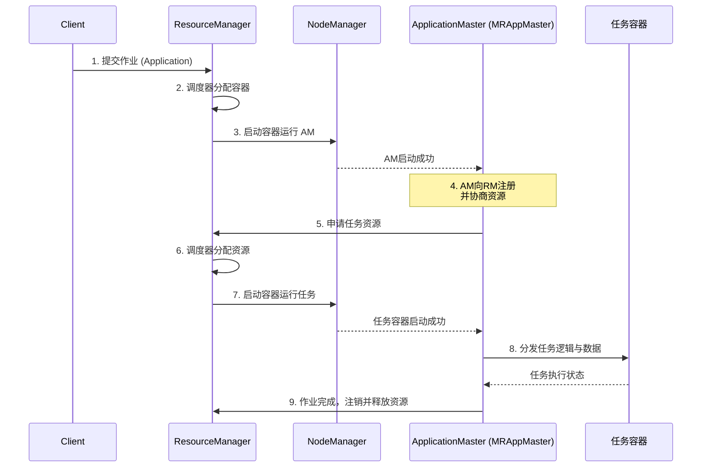
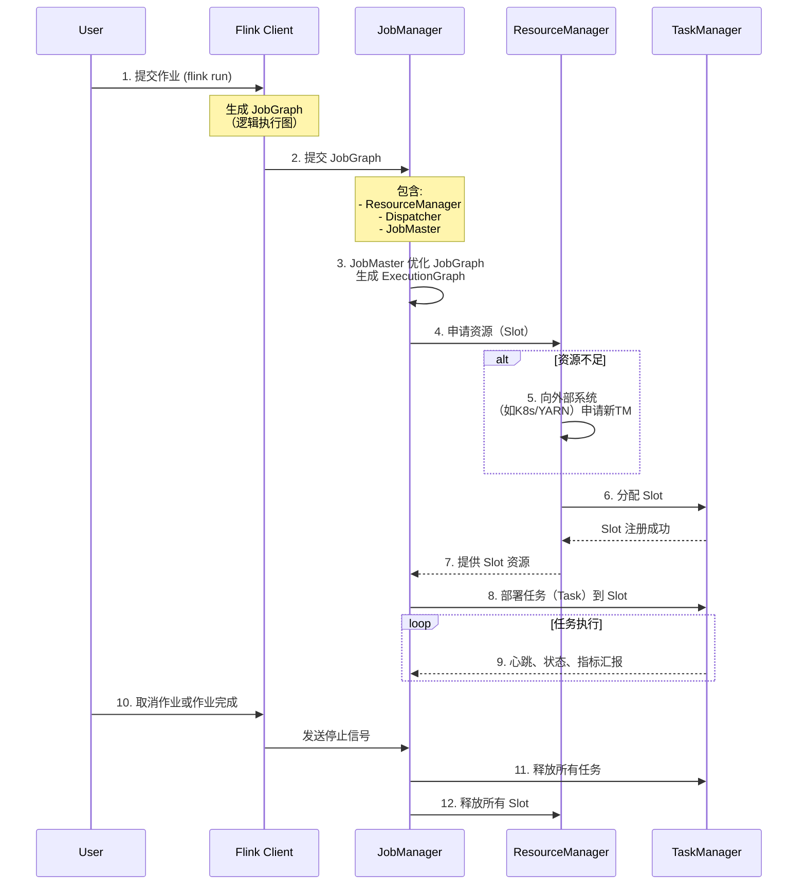
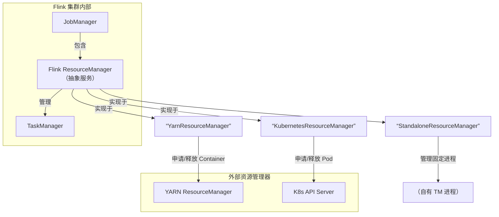

### 03、Flink 源码篇


#### 1、FLink作业提交流程应该了解吧？

**Flink的提交流程：**

1. 在Flink Client中，通过反射启动jar中的main函数，生成Flink StreamGraph和JobGraph，将JobGraph提交给Flink集群

2. Flink集群收到JobGraph（JobManager收到）后，将JobGraph翻译成ExecutionGraph,然后开始调度，启动成功之后开始消费数据。

总结来说：Flink核心执行流程，对用户API的调用可以转为 StreamGraph -->JobGraph -- >  ExecutionGraph。

#### 2、FLink作业提交分为几种方式？

**Flink的作业提交分为两种方式**

1. **Local 方式**：即本地提交模式，直接在IDEA运行代码。

2. **远程提交方式**：分为Standalone方式、yarn方式、K8s方式（这种方式就是提交到我们的集群中运行）

3. **Yarn 方式分为三种提交模式**：Yarn-perJob模式、Yarn-Session模式、Yarn-Application模式

4. K8S方式分为两种，Application 模式和Session 模式（共享集群）

#### 3、FLink JobGraph是在什么时候生成的？

StreamGraph、JobGraph全部是在Flink Client 客户端生成的，即提交集群之前生成，原理图如下：


#### 4、那在jobGraph提交集群之前都经历哪些过程？

（1）用户通过启动Flink集群，使用命令行提交作业，运行 flink run -c  WordCount  xxx.jar

（2）运行命令行后，会通过run脚本调用CliFrontend入口，CliFrontend会触发用户提交的jar文件中的main方法，然后交给PipelineExecuteor # execute方法，最终根据提交的模式选择触发一个具体的PipelineExecutor执行。

（3）根据具体的PipelineExecutor执行，将对用户的代码进行编译生成streamGraph，经过优化后生成Jobgraph。

**具体流程图如下：**


#### 5、看你提到PipeExecutor，它有哪些实现类？

（1）PipeExecutor 在Flink中被叫做 **流水线执行器**，它是一个接口，是Flink Client生成JobGraph 之后，将作业提交给集群的重要环节，前面说过，作业提交到集群有好几种方式，最常用的是yarn方式，yarn方式包含3种提交模式，主要使用 session模式，perjob模式。Application模式 jobbGraph是在集群中生成。

所以PipeExecutor 的实现类如下图所示：（在代码中按CTRL+H就会出来）


除了上述框的两种模式外，在IDEA环境中运行Flink MiniCluster 进行调试时，使用LocalExecutor。

#### 6、Local提交模式有啥特点，怎么实现的？

（1）Local是在本地IDEA环境中运行的提交方式。不上集群。主要用于调试，原理图如下：


1. Flink程序由JobClient进行提交

2. JobClient将作业提交给JobManager

3. JobManager负责协调资源分配和作业执行。资源分配完成后，任务将提交给相应的TaskManager

4. TaskManager启动一个线程开始执行，TaskManager会向JobManager报告状态更改，如开始执 行，正在进行或者已完成。

5. 作业执行完成后，结果将发送回客户端。

**源码分析**：通过Flink1.12.2源码进行分析的

**（1）创建获取对应的StreamExecutionEnvironment对象**：LocalStreamEnvironment

调用StreamExecutionEnvironment对象的execute方法


**（2）获取streamGraph**


**（3）执行具体的PipeLineExecutor - >得到localExecutorFactory**


**(4) 获取JobGraph**

根据localExecutorFactory的实现类LocalExecutor生成JobGraph


上面这部分全部是在Flink Client生成的，由于是使用Local模式提交。所有接下来将创建MiniCluster集群，由miniCluster.submitJob指定要提交的jobGraph

**（5）实例化MiniCluster集群**


**（6）返回JobClient 客户端**

在上面执行miniCluster.submitJob 将JobGraph提交到本地集群后，会返回一个JobClient客户端，该JobClient包含了应用的一些详细信息，包括JobID,应用的状态等等。最后返回到代码执行的上一层，对应类为StreamExecutionEnvironment。


**以上就是Local模式的源码执行过程。**

#### 7、远程提交模式都有哪些？

**远程提交方式**：分为Standalone方式、yarn方式、K8s方式

**Standalone**：包含session模式

**Yarn 方式分为三种提交模**：Yarn-perJob模式、Yarn-Session模式、Yarn-Application模式。

**K8s方式**：包含 session模式和Application 模式；


#### 8、Yarn调度原理

ResourceManager (RM) 和 NodeManager (NM) 是Yarn两大核心组件构成。

Yarn调度作业直流流程:



流程中的核心角色及其职责如下：

| 组件                       | 角色             | 核心职责                                                     |
| :------------------------- | :--------------- | :----------------------------------------------------------- |
| **ResourceManager (RM)**   | **集群资源总管** | 1. **全局资源调度**：接收NM心跳，掌握集群资源全景。 2. **仲裁者**：处理客户端提交，为AM分配初始资源。 3. **调度决策**：根据策略（FIFO/Capacity/Fair）响应AM的资源请求。 |
| **NodeManager (NM)**       | **单节点工头**   | 1. **资源汇报**：定时向RM汇报本节点资源（CPU, 内存）。 2. **容器执行者**：根据RM/AM指令，启动/监控/销毁容器。 |
| **ApplicationMaster (AM)** | **作业管家**     | 1. **作业切分**：将作业拆分为具体任务（Map/Reduce）。 2. **资源协商**：向RM为每个任务申请资源。 3. **任务调度**：指示NM启动任务，并监控其生命周期。 |
| **Container**              | **资源包裹**     | Yarn对**资源（CPU核心数、内存）的抽象封装**，是任务运行的隔离环境。 |

Yarn 内置了三种调度器，适用于不同场景：

| 调度器                 | 核心原理                                       | 优点                   | 缺点                     | 适用场景                              |
| :--------------------- | :--------------------------------------------- | :--------------------- | :----------------------- | :------------------------------------ |
| **FIFO Scheduler**     | 先进先出队列                                   | 简单，无额外开销       | 资源利用率低，小作业排队 | **测试环境**                          |
| **Capacity Scheduler** | 划分资源队列（Queue），每队有保证的最小容量    | 资源隔离性好，灵活性高 | 配置相对复杂             | **企业混合负载**（Apache Hadoop默认） |
| **Fair Scheduler**     | 动态平衡资源，使所有作业随时间推移获得平等份额 | 公平性高，小作业响应快 | 对延迟敏感作业可能不稳定 | **多租户共享集群**（CDH默认）         |

以 MapReduce 为例的详细流程：

结合上图，我们再看一个 MapReduce 作业的详细生命周期：

1. **作业提交**：
    - 客户端调用 `job.waitForCompletion()` 提交作业。
    - RM 返回一个 `Application ID`，客户端将作业资源（JAR包、配置、分片信息）上传至 HDFS。
2. **AM 启动与注册**：
    - RM 调度器找到一个有资源的 NM，指令其启动一个 **Container** 来运行 MRAppMaster（即该作业的 AM）。
    - AM 启动后向 RM **注册**，此后由 AM 全权负责该作业。
3. **任务资源申请与分配**：
    - AM 根据输入数据分片，计算出所需的 Map 和 Reduce 任务数量。
    - AM 向 RM 的调度器 **为每个任务申请 Container 资源**。
    - 调度器根据策略，在资源充足的 NM 上为这些请求分配 Container。
4. **任务执行与监控**：
    - AM 与对应 NM 通信，**启动 Container** 来运行 MapTask 或 ReduceTask。
    - AM **持续监控**所有任务的执行状态，容忍失败（重试）并汇报进度。
5. **作业完成与清理**：
    - 所有任务完成后，AM 向 RM **注销**并报告成功。
    - RM 清理 AM 的 Container，作业完成。客户端收到通知。


#### 9、Standalone模式简单介绍一下？

Standalone 模式为Flink集群的单机版提交方式，只使用一个节点进行提交，常用Session模式。

作业提交原理图如下：


提交命令如下：

```java
bin/flink run org.apache.flink.WordCount xxx.jar
```

1. client客户端提交任务给JobManager
2. JobManager负责申请任务运行所需要的资源并管理任务和资源，
3. JobManager分发任务给TaskManager执行
4. TaskManager定期向JobManager汇报状态


> 注意一下，一个Flink集群包括：
>
> Dispatcher
>
> ResourceManager
>
> JobManager

#### 10、yarn集群提交方式介绍一下？

通过yarn集群提交分为3种提交方式：**分别为session模式、perjob模式、application模式**

#### 11、yarn - session模式特点？

提交命令如下：

```java
./bin/flink run -t yarn-session \-Dyarn.application.id=application_XXXX_YY  xxx.jar
```

**Yarn-Session模式：**所有**作业共享集群资源**，隔离性差，JM负载瓶颈，main方法在客户端执行。适合执行时间短，频繁执行的短任务，集群中的所有作业 **只有一个JobManager**，另外，**Job被随机分配给TaskManager**

**特点：**

**Session-Cluster模式需要先启动集群**，**然后再提交作业**，接着会向yarn申请一块空间后，资源永远保持不变。如果资源满了，下一个作业就无法提交，只能等到 yarn中的其中一个作业执行完成后，释放了资源，下个作业才会正常提交。所有作业共享Dispatcher和ResourceManager；共享资源；**适合规模小执行时间短的作业**。

**原理图如下：**


#### 12、yarn - perJob模式特点？

提交命令：

```java
./bin/flink run -t yarn-per-job --detached  xxx.jar
```

**Yarn-Per-Job模式**：每个作业单独启动集群，隔离性好，JM负载均衡，**main方法在客户端执行**。在per-job模式下，每个Job都有一个JobManager，每个TaskManager只有单个Job。

**特点：**

**一个任务会对应一个Job**，**每提交一个作业**会根据自身的情况，**都会单独向yarn申请资源**，直到作业执行完成，一个作业的失败与否并不会影响下一个作业的正常提交和运行。独享Dispatcher 和 ResourceManager，按需接受资源申请；**适合规模大长时间运行的作业。**

**原理图如下：**


#### 13、yarn - application模式特点？

**提交命令如下：**

```java
./bin/flink run-application -t yarn-application xxx.jar
```

**Yarn-Application模式**：每个作业单独启动集群，隔离性好，JM负载均衡，**main方法在JobManager上执行**。这个要和per-Job的区分开，per-Job的main()方法在客户端执行。

**特点：**

在yarn-per-job 和 yarn-session模式下，客户端都需要执行以下三步，即：

1、获取作业所需的依赖项；

2、通过执行环境分析并取得逻辑计划，即StreamGraph→JobGraph；

3、将依赖项和JobGraph上传到集群中。


只有在这些都完成之后，才会通过env.execute()方法 触发 Flink运行时真正地开始执行作业。**如果所有用户都在同一个客户端上提交作业**，**较大的依赖会消耗更多的带宽**，而较复杂的作业逻辑翻译成JobGraph也需要吃掉更多的CPU和内存，**客户端的资源反而会成为瓶颈**。

为了解决它，社区在传统部署模式的基础上实现了 Application模式。原本需要客户端做的三件事被转移到了JobManager里，也就是说main()方法在集群中执行(入口点位于 ApplicationClusterEntryPoint )，客 户端只需要负责发起部署请求了。

**原理图如下：**


**综上所述，Flink社区比较推荐使用 yarn-perjob  或者 yarn-application模式进行提交应用。**


#### 13、Flink集群架构详解

Apache Flink 的架构是一个经典的主从（Master-Worker）模型，主要包两个组件JobManager和TaskManager；

**Flink内部组件核心交互流程**



**核心组件详解**

| 组件                 | 运行位置           | 核心职责与解释                                               |
| :------------------- | :----------------- | :----------------------------------------------------------- |
| **Flink Client**     | 提交作业的机器     | 作业提交的“入口”。负责接收用户程序（JAR包），将其转换为**JobGraph**（逻辑数据流图），并提交给 JobManager。完成后可断开连接。 |
| **JobManager (JM)**  | Master节点（集群） | Flink 集群的“**大脑**”。一个集群至少有一个 JM，它包含三个核心子组件： 1. **Dispatcher**：作业的“接待员”，为每个提交的作业创建一个 **JobMaster**，并提供 Web UI。 2. **JobMaster**：作业的“项目经理”，**每个作业一个**。负责协调一个具体作业的执行（优化图、申请资源、调度任务、处理故障）。 3. **ResourceManager (RM)**：Flink集群内部的“**资源总监**”。管理所有 TaskManager 的 **Slot**（计算槽位），负责 Slot 的分配与回收，并在 Slot 不足时向外部系统（如K8s）申请新资源。 |
| **TaskManager (TM)** | Worker节点（集群） | Flink 集群的“**四肢**”。负责执行**Task**（算子的具体实例）。每个 TM 提供一定数量的 **Slot**，Slot 是 Flink 进行**资源调度的最小单位**，一个 Slot 可以运行一个 Task 的子任务。TM 之间会进行数据交换（Shuffle）。 |


关键协作流程与设计思想

从流程图中，我们可以提炼出几个关键的协作关系和设计思想：

1. **主从分工，职责清晰**：**JobManager** 负责指挥与协调，**TaskManager** 负责具体执行。这种分离使系统易于扩展和管理。
2. **Slot：资源调度的抽象核心**：Flink 不直接管理 CPU/内存，而是通过 **Slot** 这一抽象来定义资源。一个 Slot 可以运行一个任务子任务（Task Subtask）。**TaskManager 向 ResourceManager 注册 Slot，JobMaster 向 ResourceManager 申请 Slot**，这是资源调度的核心。
3. **一作业一JobMaster**：每个作业都有自己专属的 **JobMaster**。这提供了**作业级别的隔离**，一个作业的失败或停止不会影响集群中其他作业的 JobMaster，是 Flink 稳定性的重要保障。
4. **双层ResourceManager**：Flink 有自己内部的 ResourceManager，用于管理 Slot。当运行在 YARN 或 K8s 上时，它会与外部 ResourceManager 协作，实现资源的动态申请与释放。

与部署模式的关系：

不同的部署模式（Session, Per-Job, Application）主要影响的是 **JobManager 和 ResourceManager 的启动时机和生命周期**，但不会改变上述组件的核心协作逻辑。

- **Session模式**：提前启动一个包含 JobManager（及内部的Dispatcher、ResourceManager）的集群，多个作业共享。
- **Per-Job/Application模式**：每个作业启动一个专属的 JobManager 集群。

如上所述，Flink内部有自己的ResourceManager来管理slot插槽，这与外部的集群调度器并不冲突，下面来详细说一下。

#### 14、Yarn ResourceManager 和Flink ResourceManager

Apache Flink 集群有自己的 ResourceManager 组件，但这与 YARN 或 Kubernetes 的 ResourceManager 是完全不同的概念，且职责有本质区别。

1. 角色与定位不同：Flink 的 ResourceManager 负责 Flink 集群内部的资源管理和 Slot 分配，而 YARN/K8s 的 ResourceManager 负责 物理/虚拟集群的全局资源调度。 
2. 存在多个实现：Flink 的 ResourceManager 是一个抽象服务，针对不同的部署环境（如 Standalone, YARN, Kubernetes）有不同的具体实现。


Flink ResourceManager的实现



**Flink ResourceManager 的核心职责**:

无论以何种实现运行，Flink ResourceManager 的核心任务都是**管理 TaskManager 及其提供的 Slot（计算槽位）**：

1. **Slot 管理**：接收 TaskManager 的注册，跟踪每个 TaskManager 上可用/已用的 Slot 数量。
2. **资源匹配**：当 JobManager 中的作业需要资源执行时，为其分配合适的 Slot。
3. **异常处理**：处理 TaskManager 失联的情况，并重新分配其上的任务。
4. **资源申请（与外部协调）**：在 Slot 不足时，**通过特定实现**向外部系统（如 YARN、K8s）申请启动新的 TaskManager。在 Slot 闲置时，释放多余的 TaskManager。

**不同部署模式下的具体实现**:

| 部署模式       | Flink ResourceManager 的具体实现 | 主要行为特点                                                 |
| :------------- | :------------------------------- | :----------------------------------------------------------- |
| **Standalone** | `StandaloneResourceManager`      | 管理**静态、预启动**的 TaskManager 进程列表。**无法动态申请新资源**，Slot总数固定。 |
| **YARN**       | `YarnResourceManager`            | 与 **YARN ResourceManager** 通信。根据 Slot 需求，动态地**申请或释放 YARN Container** 来启动/停止 TaskManager。 |
| **Kubernetes** | `KubernetesResourceManager`      | 与 **Kubernetes API Server** 通信。根据 Slot 需求，动态地**创建或删除 TaskManager Pod**。 |

正如架构图所示，Flink ResourceManager 会根据部署环境“变身”：

**因此，当 Flink 运行在 YARN 或 K8s 上时，存在两个层级的 ResourceManager，它们协同工作**：

1. **外部级（基础设施）**：YARN/K8s RM 分配物理/虚拟资源（容器/Pod）。
2. **框架级（Flink内部）**：Flink RM 管理框架抽象资源（Slot），并对外部资源提出需求。

#### 15、yarn - session 提交流程详细介绍一下？

**提交流程图如下：**


**1、启动集群**

**（1）Flink Client向Yarn ResourceManager提交任务信息。**

1）Flink Client将应用配置（Flink-conf.yaml、logback.xml、log4j.properties）和相关文件（Flink Jar、配置类文件、用户Jar文件、JobGraph对象等）上传至分布式存储HDFS中。

2）Flink Client向Yarn ResourceManager提交任务信息。

**（2）Yarn 启动 Flink集群，做2步操作：**

1) **通过Yarn Client 向Yarn  ResourceManager提交Flink创建集群的申请**，Yarn ResourceManager 分配Container 资源，并通知对应的NodeManager上启动一个ApplicationMaster(每提交一个flink job 就会启动一个applicationMaster)，ApplicationMaster会包含当前要启动的 JobManager和 Flink自己内部要使用的ResourceManager。

2）在JobManager 进程中运行**YarnSessionClusterEntryPoint** 作为集群启动的入口。初始化Dispatcher，Flink自己内部要使用的ResourceManager，启动相关RPC服务，等待Flink Client 通过Rest接口提交JobGraph。

**2、作业提交**

**（3）Flink Client 通过Rest 向Dispatcher 提交编译好的JobGraph**。Dispatcher 是 Rest 接口，不负责实际的调度、指定工作。

**（4）Dispatcher 收到 JobGraph 后，为作业创建一个JobMaster，将工作交给JobMaster，**JobMaster负责作业调度，管理作业和Task的生命周期**，构建ExecutionGraph（**JobGraph的并行化版本，调度层最核心的数据结构**）**

**以上两步执行完后，作业进入调度执行阶段。**

**3、作业调度执行**

**（5）JobMaster向ResourceManager申请资源，开始调度ExecutionGraph。**

（6）ResourceManager将资源请求加入等待队列，通过心跳向YarnResourceManager申请新的Container来启动TaskManager进程。

（7）YarnResourceManager启动，然后从HDFS加载Jar文件等所需相关资源，在容器中启动TaskManager，TaskManager启动TaskExecutor

（8）TaskManager启动后,向ResourceManager 注册，并把自己的Slot资源情况汇报给ResourceManager。

（9）ResourceManager从等待队列取出Slot请求，向TaskManager确认资源可用情况，并告知TaskManager将Slot分配给哪个JobMaster。

（10）TaskManager向JobMaster回复自己的一个Slot属于你这个任务，JobMaser会将Slot缓存到SlotPool。

（11）JobMaster调度Task到TaskMnager的Slot上执行。

#### 16、yarn - perjob 提交流程详细介绍一下？

**提交命令如下：**

```java
./bin/flink run -t yarn-per-job --detached  xxx.jar
```

**提交流程图如下所示：**


**1、启动集群**

**（1）Flink Client向Yarn ResourceManager提交任务信息。**

​       1）Flink Client将应用配置（Flink-conf.yaml、logback.xml、log4j.properties）和相关文件（Flink Jar、配置类文件、用户Jar文件、JobGraph对象等）上传至分布式存储HDFS中。

​       2）Flink Client向Yarn ResourceManager提交任务信息

**（2）Yarn 启动 Flink集群，做2步操作：**

1) **通过Yarn Client 向Yarn  ResourceManager提交Flink创建集群的申请**，Yarn ResourceManager 分配Container 资源，并通知对应的NodeManager上启动一个ApplicationMaster(每提交一个Flink job 就会启动一个ApplicationMaster)，ApplicationMaster会包含当前要启动的 JobManager和 Flink自己内部要使用的ResourceManager。

2）在JobManager 进程中运行**YarnJobClusterEntryPoint** 作为集群启动的入口。初始化Dispatcher，Flink自己内部要使用的ResourceManager，启动相关RPC服务，等待Flink Client 通过Rest接口提交JobGraph。

**2、作业提交**

**（3）ApplicationMaster启动Dispatcher，Dispatcher启动ResourceManager和JobMaster****(该步和Session不同，Jabmaster是由Dispatcher拉起，而不是Client传过来的)。**JobMaster负责作业调度，管理作业和Task的生命周期**，构建ExecutionGraph（**JobGraph的并行化版本，调度层最核心的数据结构**）**

**以上两步执行完后，作业进入调度执行阶段。**

**3、作业调度执行**

**（4）JobMaster向ResourceManager申请Slot资源，开始调度ExecutionGraph。**

（5）ResourceManager将资源请求加入等待队列，通过心跳向YarnResourceManager申请新的Container来启动TaskManager进程。

（6）YarnResourceManager启动，然后从HDFS加载Jar文件等所需相关资源，在容器中启动TaskManager。

（7）TaskManager在内部启动TaskExecutor。

（8）TaskManager启动后,向ResourceManager 注册，并把自己的Slot资源情况汇报给ResourceManager。

（9）ResourceManager从等待队列取出Slot请求，向TaskManager确认资源可用情况，并告知TaskManager将Slot分配给哪个JobMaster。

（10）TaskManager向JobMaster回复自己的一个Slot属于你这个任务，JobMaser会将Slot缓存到SlotPool。

（11）JobMaster调度Task到TaskMnager的Slot上执行。


#### 17、flink提交作业到yarn，启动集群后核心组件对比

当 Flink on YARN 以 Per-Job 或 Application 模式提交作业时，由 YARN 启动的 ApplicationMaster 进程，其本质就是 Flink 的 JobManager。

| 在 YARN 中的角色           | 在 Flink 中的角色         | 进程/组件说明                                                |
| :------------------------- | :------------------------ | :----------------------------------------------------------- |
| **ApplicationMaster (AM)** | **JobManager (JM)**       | **这是同一个进程，扮演双重角色**。 • 对 YARN 来说，它是负责管理这个特定应用（Flink作业）生命周期的 AM。 • 对 Flink 来说，它是负责作业调度和协调的 JobManager。 |
| **Container**              | **TaskManager (TM)** 进程 | YARN 分配的每个资源容器（Container）中，运行着一个 Flink TaskManager 进程。 |
| **Application**            | **Flink 作业 (Job)**      | 在 YARN 的视角下，一个 Flink 作业就是一个 “Application”。    |


让我们梳理一下当你执行 `flink run -t yarn-per-job` 时，YARN 上到底发生了什么：

1. **客户端提交**：Flink Client 向 YARN ResourceManager 提交一个 **YARN Application**，请求的资源描述是“启动一个 ApplicationMaster”。
2. **启动 AM/JM**：YARN ResourceManager 找到一个有资源的 NodeManager，让它在一个 Container 中启动 **ApplicationMaster**。
    - **关键点**：这时，YARN 启动的 **AM 的启动命令，就是启动 Flink 的 JobManager 进程**。这个 JobManager 进程在启动时，会加载一个特定的 `YarnApplicationMasterRunner` 作为入口类，从而具备了向 YARN 汇报和申请资源的 AM 能力。
3. **双重身份运行**：该进程启动后：
    - **作为 YARN AM**：立即向 YARN ResourceManager **注册**，报告自己已就绪，然后开始为作业所需的 TaskManager 申请 Container 资源。
    - **作为 Flink JM**：内部的 **JobMaster** 组件开始工作，解析客户端上传的 JobGraph，等待 TaskManager 资源就绪。
4. **申请资源并启动TM**：
    - AM/JM 根据作业并行度，计算出需要多少个 TaskManager（每个TM的Slot数在配置中指定）。
    - 它**以 AM 的身份**，向 YARN ResourceManager 申请对应数量的 Container。
    - YARN 分配 Container 后，各个 NodeManager 在这些 Container 中启动的进程就是 **Flink TaskManager**。
    - TaskManager 启动后，会向同一个进程的 **JM 部分注册**，提供自己的 Slot。
5. **执行作业**：当足够的 TaskManager 注册后，JM 就开始将具体的 Task 调度到各个 Slot 中执行。至此，一个标准的 Flink 作业在 YARN 上运行起来。


为什么这样设计？

这种 **“一个进程，双重身份”** 的设计是经典且高效的，其优势在于：

1. **资源管理统一**：Flink 不需要自己实现一套底层资源调度，完全复用 YARN 成熟、稳定的资源管理能力。AM 作为“代理人”，负责与 YARN 通信。
2. **职责清晰**：Flink 的 JobManager 专注于它擅长的作业调度、状态管理和容错协调，而把“向集群要机器”这种基础设施层的任务交给了标准的 YARN AM 接口去完成。
3. **与部署模式强关联**：这种设计天然对应 **Per-Job** 模式（一个作业一个AM/JM）。在 **Session** 模式下，则是另一个故事：预先启动的 Flink 集群（JM+TM）本身就是一个长驻的 YARN Application，其 AM 就是那个常驻的 JobManager，后续提交的作业会共享这个 AM/JM。

与 Spark on YARN 对比

理解这个设计后，可以清晰地对比 Flink 和 Spark 在 YARN 上架构的不同：

| 特性                  | **Flink on YARN (Per-Job)**                                  | **Spark on YARN (Cluster Mode)**                             |
| :-------------------- | :----------------------------------------------------------- | :----------------------------------------------------------- |
| **AM 与 Driver 关系** | **AM 和 Driver (JM) 是同一进程**，高度集成。                 | AM 和 Driver **可以是同一进程**（Cluster模式），**也可以是独立进程**（Client模式下，Driver在客户端，AM仅负责资源）。 |
| **设计倾向**          | 更强调**作业级别的隔离**和稳定性，每个作业拥有完全独立的 JM。 | 提供了更多灵活性，在交互式场景（Client模式）和生产场景（Cluster模式）间选择。 |

#### 18、流图、作业图、执行图三者区别？

**Flink内部Graph总览图，由于现在Flink 实行流批一体代码，Batch API基本废弃，就不过多介绍**

**在Flink DataStramAPI 中，Graph内部转换图如下：**


**以WordCount为例，流图、作业图、执行图、物理执行图之间的Task调度如下：**


对于Flink 流计算应用，运行用户代码时，首先调用DataStream API ，将用户代码转换为 **Transformation**，然后经过：**StreamGraph**->**JobGraph**->**ExecutionGraph** 3层转换（这些都是Flink内置的数据结构），最后经过Flink调度执行，在Flink 集群中启动计算任务，形成一个**物理执行图**。

#### 19、流图介绍一下？

**（1）流图  StreamGraph**


流图StreamGraph 核心对象包括两个：**StreamNode 点 和** **StreamEdge 边**

**1）StreamNode 点**

**StreamNode 点** ，从 Transformation转换而来，可以简单理解为 **StreamNode** 表示一个算子，存在实体和虚拟，可以有多个输入和输出，实体**StreamNode** 最终变成物理算子，虚拟的附着在**StreamEdge 边** 上。

**2）StreamEdge边**

**StreamEdge 是 StreamGraph 的边**，用来连接两个StreamNode 点，一个StreamEdge可以有多个出边、入边等信息。

#### 20、作业图介绍一下？

**（2）作业图  JobGraph**

JobGraph是由StreamGraph优化而来，是通过**OperationChain** 机制将算子合并起来，在执行时，调度在同一个Task线程上，避免数据的跨线程，跨网络传递。


作业图JobGraph 核心对象包括三个：

**JobVertex 点** **、** **JobEdge 边**、IntermediateDataSet 中间数据集

**1）JobVertex 点**

经过算子融合优化后符合条件的多个StreamNode 可能会融合在一起生成一个 JobVertex，**即一个JobVertex 包含一个或多个算子**， **JobVertex 的输入是 JobEdge.** **输出是** **IntermediateDataSet**

**2）JobEdge 边**

**Job**Edge表示 JobGraph 中的一 个数据流转通道， 其上游数据源是 **IntermediateDataSet** ，下游消费者是 **JobVertex** 。

**Job**Edge中的数据分发模式会直接影响执行时 Task 之间的数据连接关系是**点对点连接**还是**全连接**。

**3）IntermediateDataSet 中间数据集**

中间数据集 **IntermediateDataSet**  是一种逻辑结构.用来表示 **JobVertex** 的输出，即该 JobVertex 中包含的算子会产生的数据集。不同的执行模式下，其对应的结果分区类型不同，决 定了在执行时刻数据交换的模式。

#### 21、执行图介绍一下？

**（3）执行图  ExecutionGraph**

**ExecutionGraph**是调度Flink 作业执行的核心数据结构，包含了作业中所有**并行执行的Task信息、Task之间的关联关系、数据流转关系**。

StreamGraph 和JobGraph都在Flink Client生成，然后交给Flink集群。JobGraph到ExecutionGraph在JobMaster中 完成，转换过程中重要变化如下：

**1）加入了并行度的概念，成为真正可调度的图结构。**

**2）生成了6个核心对象。**


**执行图ExecutionGraph 核心对象包括6个：**

ExecutionJobVertex、ExecutionVertex、IntermediateResult、IntermediateResultPartition、ExecutionEdge、Execution。

**1）ExecutionJobVertex**

**该对象和 JobGraph 中的 JobVertex 一 一对应**。该对象还包含一组 ExecutionVertex， 数量 与该 JobVertex 中所包含的StreamNode 的并行度一致，假设 StreamNode 的并行度为5 ，那么**ExecutionJobVertex**中也会包含 5个**ExecutionVertex**。

**ExecutionJobVertex**用来将一个JobVertex 封装成 **ExecutionJobVertex**，并依次创建 ExecutionVertex、Execution、IntermediateResult 和  IntermediateResultPartition，用于丰富**ExecutionGraph。**

**2）ExecutionVertex**

**ExecutionJobVertex**会对作业进行并行化处理，构造可以并行执行的实例，每一个并行执行的实例就是 **ExecutionVertex**。

**3）IntermediateResult**

**IntermediateResult** 又叫作中间结果集，**该对象是个逻辑概念 表示 **ExecutionJobVertex**输出，和 JobGrap 中的IntermediateDalaSet 一 一对应**，同样 一个**ExecutionJobVertex**  可以有多个中间结果，取决于当前 JobVertex 有几个出边(JobEdge)。

**4）IntermediateResultPartition**

**IntermediateResultPartition** 又叫作中间结果分区。表示1个 **ExecutionVertex**输出结果，与 Execution Edge 相关联。

**5）ExecutionEdge**

表示**ExecutionVertex** 的输入，连按到上游产生的**IntermediateResultPartition** 。1个Execution对应唯一的1个**IntermediateResultPartition** 和1个**ExecutionVertex**。1个**ExecutionVertex** 可以有多个**ExecutionEdge。**

**6）Execution**

**ExecutionVertex** 相当于每个 Task 的模板，在真正执行的时候，会将**ExecutionVertex中的信息包装为1个**Execution，执行一个ExecutionVertex的一次尝试。

JobManager 和 TaskManager 之间关于Task 的部署和Task执行状态的更新都是通过ExecutionAttemptID来识别标识的。

**接下来问问作业调度的问题**

#### 22、Flink调度器的概念介绍一下？

**调度器**是Flink作业执行的核心组件，管理作业执行的所有相关过程，包括JobGraph到ExecutionGraph的转换、作业生命周期管理（作业的发布、取消、停止）、作业的Task生命周期管理（Task的发布、取消、停止）、资源申请与释放、作业和Task的Faillover等。

**（1）DefaultScheduler**

Flink 目前默认的调度器。是Flink新的调度设计，使用SchedulerStrategy来实现调度。

**（2）LegacySchedular**

过去的调度器，实现了原来的Execution调度逻辑。

#### 23、Flink调度行为包含几种？

**调度行为包含四种：**

SchedulerStrategy接口定义了调度行为，其中包含4种行为：


（1）startScheduling:调度入口，触发调度器的调度行为

（2）restartTasks:重启执行失败的Task,一般是Task执行异常导致的。

（3）onExecutionStateChange：当Execution状态发生改变时。

（4）onPartitionConsumable：当IntermediateResultPartition中的数据可以消费时。

#### 24、Flink调度模式包含几种？

**调度模式包含3种：Eager模式、分阶段模式（Lazy_From_Source）、分阶段Slot重用模式（Lazy_From_Sources_With_Batch_Slot_Request）。**

**1）Eager 调度**

**适用于流计算**。一次性申请需要的所有资源，如果资源不足，则作业启动失败。

**2）分阶段调度**

LAZY_FROM_SOURCES **适用于批处理**。从 SourceTask 开始分阶段调度，申请资源的时候，一次性申请本阶段所需要的所有资源。上游 Task 执行完毕后开始调度执行下游的 Task，

读取上游的数据，执行本阶段的计算任务，执行完毕之后，调度后一个阶段的 Task，依次进行调度，直到作业完成。

**3）分阶段 Slot 重用调度**

LAZY_FROM_SOURCES_WITH_BATCH_SLOT_REQUEST **适用于批处理**。与分阶段调度基本一样，区别在于该模式下使用批处理资源申请模式，**可以在资源不足的情况下执行作业，但是需要确保在本阶段的作业执行中没有 Shuffle 行为**。

目前视线中的 Eager 模式和 LAZY_FROM_SOURCES 模式的资源申请逻辑一样，LAZY_FROM_SOURCES_WITH_BATCH_SLOT_REQUEST 是单独的资源申请逻辑。

#### 25、Flink调度策略包含几种？

**调度策略包含3种：**


调度策略全部实现于调度器SchedulingStrategy，有三种实现：

**1） EagerSchedulingStrategy**：适用于流计算，同时调度所有的 task

**2） LazyFromSourcesSchedulingStrategy**：适用于批处理，当输入数据准备好时（上游处理完）进行 vertices 调度。

**3） PipelinedRegionSchedulingStrategy**：以流水线的局部为粒度进行调度

PipelinedRegionSchedulingStrategy 是 1.11 加入的，从 1.12 开始，将以 pipelined region为单位进行调度。

pipelined region 是一组流水线连接的任务。这意味着，对于包含多个 region的流作业，在开始部署任务之前，它不再等待所有任务获取 slot。取而代之的是，一旦任何region 获得了足够的任务 slot 就可以部署它。对于批处理作业，将不会为任务分配 slot，也不会单独部署任务。取而代之的是，一旦某个 region 获得了足够的 slot，则该任务将与所有其他任务一起部署在同一区域中。

#### 26、Flink作业生命周期包含哪些状态？

在Flink集群中，**JobMaster** 负责**作业**的生命周期管理，具体的管理行为在调度器和ExecutionGraph中实现。

作业的完整生命周期状态变换如下图所示：


（1）作业首先处于创建状态（created），然后切换到运行状态（running），并且在完成所有工作后，它将切换到完成状态（finished）。

（2）在失败的情况下，作业首先切换到失败状态（failing），取消所有正在运行任务。

如果所有节点都已达到最终状态，并且作业不可重新启动，则状态将转换为失败（failed）。

（3）如果作业可以重新启动，那么它将进入重新启动状态（restarting）。一旦完成重新启动，它将变成创建状态（created）。

（4）在用户取消作业的情况下，将进入取消状态（cancelling），会取消所有当前正在运行的任务。一旦所有运行的任务已经达到最终状态，该作业将转换到已取消状态（canceled）。

**完成状态（finished），取消状态（canceled）和失败状态（failed）表示一个全局的终结状态，并且触发清理工作**，而暂停状态（suspended）仅处于本地终止状态。意味着作业的执行在相应的 JobManager 上终止，但集群的另一个 JobManager 可以从持久的HA存储中恢复这个作业并重新启动。因此，处于暂停状态的作业将不会被完全清理。

#### 27、Task的作业生命周期包含哪些状态？

**TaskManager** 负责**Task** 的生命周期管理，并将状态的变化通知到JobMaster,在ExecutionGraph中跟踪Execution的状态变化，一个Execution对于一个Task。

**Task的生命周期如下：共8种状态。**


**在执行 ExecutionGraph 期间，每个并行任务经过多个阶段，从创建（created）到完成（finished）或失败（failed） ，下图说明了它们之间的状态和可能的转换。任务可以执行多次（例如故障恢复）。每个 Execution 跟踪一个 ExecutionVertex 的执行，每个 ExecutionVertex 都有一个当前 Execution（current execution）和一个前驱 Execution（prior execution）。**

#### 28、Flink的任务调度流程讲解一下？

任务调度流程图如下：


1. 当Flink执行executor会自动根据程序代码生成**DAG数据流图** ，即 **Jobgraph；**

2. **ActorSystem**创建**Actor**将数据流图发送给JobManager中的Actor；

3. **JobManager**会不断接收**TaskManager**的心跳消息，从而可以获取到有效的TaskManager；

4. JobManager通过调度器在TaskManager中调度执行Task（在Flink中，最小的调度单元就是task，对应就是一个线程） ；

5. 在程序运行过程中，task与task之间是可以进行数据传输的 。

**• Job Client**

- 主要职责是提交任务, 提交后可以结束进程, 也可以等待结果返回 ；

- Job Client 不是 Flink 程序执行的内部部分，但它是任务执行的起点；

- Job Client 负责接受用户的程序代码，然后创建数据流，将数据流提交给 JobManager 以便进一步执行。执行完成后，Job Client 将结果返回给用户。

**• JobManager**

- 主要职责是调度工作并协调任务做检查点；
- 集群中至少要有一个 master，master 负责调度 task，协调checkpoints 和 容错；
- 高可用设置的话可以有多个 master，但要保证一个是 leader, 其他是stand by；
- Job Manager 包含 **Actor System、Scheduler、CheckPoint**三个重要的组件 ；
- JobManager从客户端接收到任务以后, 首先生成优化过的执行计划, 再调度到TaskManager中执行。

**• TaskManager**

- 主要职责是从JobManager处接收任务, 并部署和启动任务, 接收上游的数 据并处理
- Task Manager 是在 JVM 中的一个或多个线程中执行任务的工作节点。
- TaskManager在创建之初就设置好了Slot, 每个Slot可以执行一个任务。

#### 29、Flink的任务槽是什么意思？


每个TaskManager是一个JVM的进程, 可以在不同的线程中执行一个或多个子任务。为了控制一个worker能接收多少个task。worker通过task slot来进行控制（一个worker 至少有一个task slot）。

**1、任务槽**

每个task slot表示TaskManager拥有资源的一个固定大小的子集。

一般来说：我们分配槽的个数都是和CPU的核数相等，比如8核，那么就分配8个槽。

Flink将进程的内存划分到多个slot中。

图中有2个TaskManager，每个TaskManager有3个slot，每个slot占有1/3的内存。

内存被划分到不同的slot之后可以获得如下好处：

• **TaskManager**最多能同时并发执行的任务是可以控制的，那就是3个，因为不能超过slot的数量。 **任务槽的作用就是分离任务的托管内存，不会发生cpu隔离。**

• slot有独占的内存空间，这样在一个TaskManager中可以运行多个不同的作业，作业之间不受影响。

**总结：task slot的个数代表TaskManager可以并行执行的task数。**

#### 30、Flink 槽共享又是什么意思？

**2、槽共享**

**默认情况下，Flink允许子任务共享插槽**，即使它们是不同任务的子任务，只要它们来自同一个作业。结果是一个槽可以保存作业的整个管道。允许插槽共享有两个主要好处：

- 只需计算Job中最高并行度（parallelism）的task slot。只要这个满足，其他的job也都能满足。
- 资源分配更加公平。如果有比较空闲的slot可以将更多的任务分配给它。图中若没有任务槽共享，负载不高的Source/Map等subtask将会占据许多资源，而负载较高的窗口subtask则会缺乏资源。
- 有了任务槽共享，可以将基本并行度（base parallelism）从2提升到6。提高了分槽资源的利用率。同时它还可以保障TaskManager给subtask的分配的slot方案更加公平。


