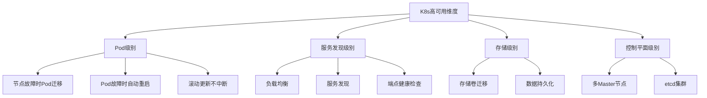
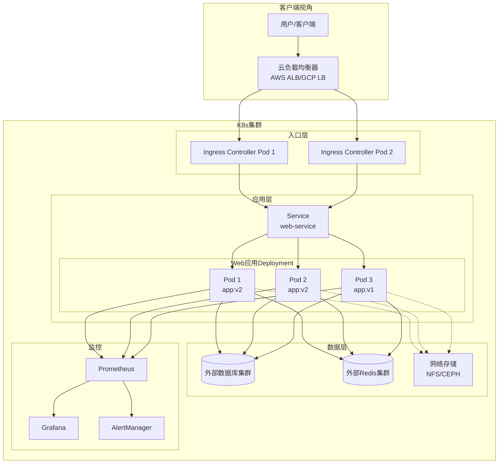
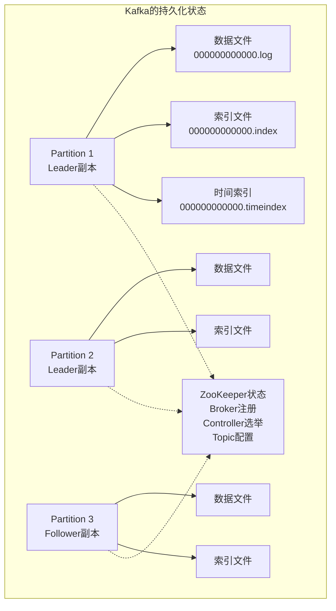
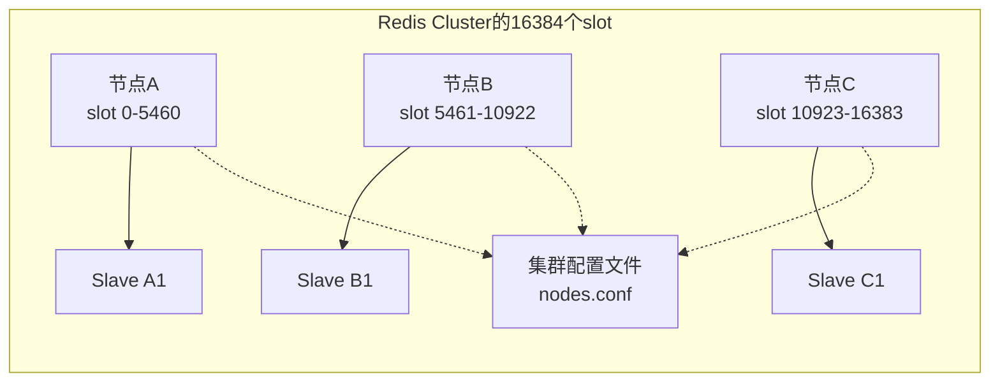
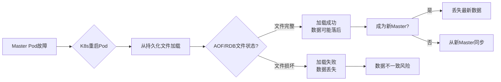
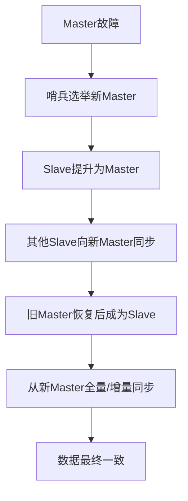
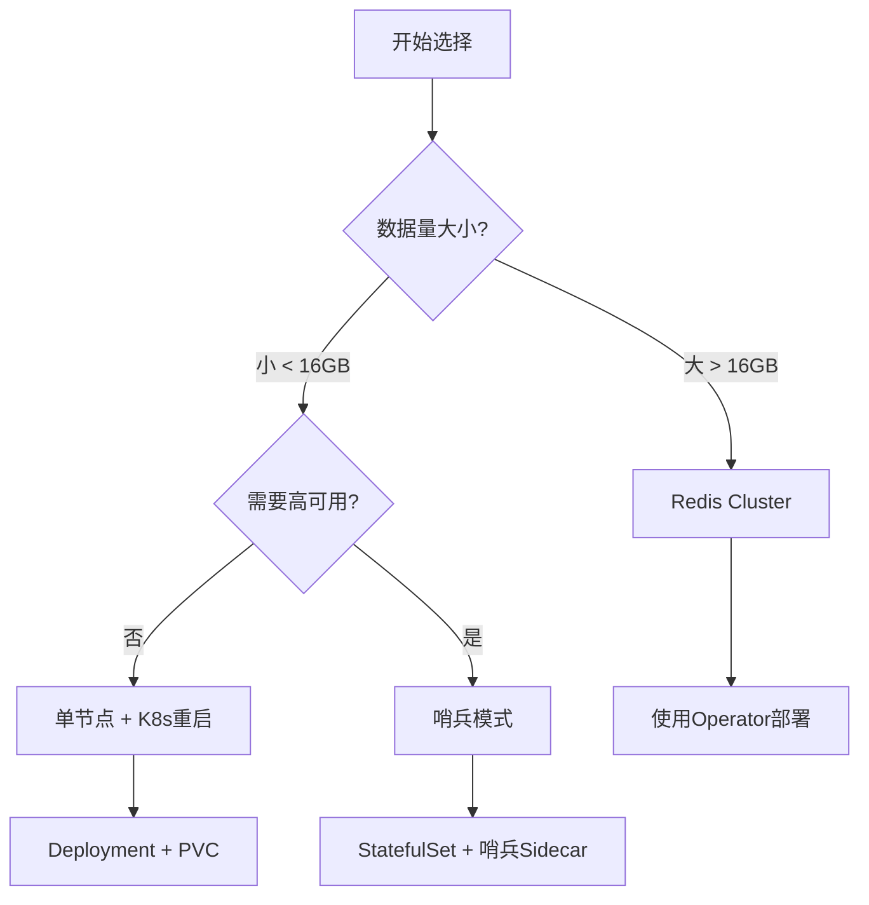

K8s的"高可用"是多层次、多维度的，为什么k8s可以保证无状态应用的高可用，但是对于像kafka,Redis这类中间件应用，不能保证高可用，K8s保证高可用的范围边界在哪里，要理解这个最重要的是理解它保证什么和不保证什么。因此本文我们就来探讨一下k8s保证服务高可用的边界点在哪里；

首先我们来了解下为什么k8s可以保证无状态的web服务高可用，他从哪些方面保证高可用;

## 无状态应用的高可用机制


K8s高可用的核心：服务连续性；简单说就是：K8s保证的是 "你的Web服务始终有可用的Pod在运行，并且客户端能访问到它们"。



如果用一张图说明，那就是上图所示中，k8s主要从四个方面保证应用的服务连续性:
- pod级别
- 服务发现级别
- 存储级别
- 控制平面级别

下面我们一一探讨k8s如何自爱这四个层面保证无状态应用的高可用；

### Pod级别高可用 - 最直接的保障

#### 场景：节点宕机

K8s自动处理流程 : 节点故障 → Controller Manager检测到 → 调度器在其他节点创建新Pod.

保障效果： 
- 用户可能遇到短暂延迟（秒级到分钟级） 
- 但不会出现"Service Unavailable"页面 
- 已建立的TCP连接会中断，需要客户端重连

#### 场景：Pod崩溃

```yaml
# Deployment配置示例
apiVersion: apps/v1
kind: Deployment
metadata:
  name: web-app
spec:
  replicas: 3  # 关键：多个副本
  selector:
    matchLabels:
      app: web
  template:
    spec:
      containers:
      - name: web
        image: nginx:latest
        livenessProbe:          # 健康检查
          httpGet:
            path: /health
            port: 80
          initialDelaySeconds: 5
          periodSeconds: 3
          failureThreshold: 2   # 2次失败后重启
```

现场环境中的效果,我们以时间线来梳理：
- t0: Pod内存泄漏，开始响应变慢 
- t0+5s: 首次健康检查 
- t0+8s: 第二次检查失败 
- t0+11s: 第三次检查失败 → Pod重启 
- t0+16s: 新Pod启动完成，加入服务

因此，从上面两种场景可以看出，不管是硬件故障，还是应用本身故障，k8s自身就可以快速的帮我们重新启动应用对外提供服务，因此pod层面的保证是最基础，也是最重要的保证，如果在虚拟机环境中，我们的应用一般通过热备或者双活部署来保证高可用，但是在k8s环境下，我们的应用单活部署即可，由k8s来保证我们的实例永远运行；


### 服务发现与负载均衡 - 对外的统一入口

#### **Serviec工作原理**

```yaml
apiVersion: v1
kind: Service
metadata:
  name: web-service
spec:
  selector:
    app: web
  ports:
  - port: 80
    targetPort: 8080
  type: ClusterIP  # 或 LoadBalancer/NodePort
```

流量实际的请求路径: 用户请求 → Service VIP (10.96.x.x) → iptables/ipvs规则 → 随机Pod IP

高可用体现：
- 某个Pod不可用时或者重启后，Service自动从端点列表中移除它 
- 请求只会被路由到健康的Pod 
- 客户端无需知道后端Pod的变化

#### Ingress的高可用

```yaml
# Ingress Controller + 多副本
apiVersion: apps/v1
kind: Deployment
metadata:
  name: nginx-ingress-controller
spec:
  replicas: 2  # Ingress控制器本身也高可用
  strategy:
    type: RollingUpdate
    rollingUpdate:
      maxUnavailable: 1  # 保证至少有一个可用
---
apiVersion: v1
kind: Service
metadata:
  name: ingress-nginx
spec:
  type: LoadBalancer
  externalTrafficPolicy: Local
  ports:
  - port: 80
    targetPort: 80
  selector:
    app: nginx-ingress
```


### 存储高可用 - 有状态应用的关键

web应用常见的存储需求:
1. 上传的文件
2. 会话数据（session）
3. 日志文件
4. 配置文件

k8s如何保证用户的数据持久稳定呢？这就不得不说我们的持久化卷。

```yaml
# 使用PersistentVolumeClaim
apiVersion: v1
kind: PersistentVolumeClaim
metadata:
  name: web-data-pvc
spec:
  accessModes:
    - ReadWriteMany  # 关键：多节点可读写
  storageClassName: managed-nfs-storage  # 使用网络存储
  resources:
    requests:
      storage: 10Gi
---
# 在Deployment中挂载
spec:
  template:
    spec:
      containers:
      - name: web
        volumeMounts:
        - name: data
          mountPath: /app/uploads
      volumes:
      - name: data
        persistentVolumeClaim:
          claimName: web-data-pvc
```

存储高可用场景:
- 节点A故障 → Pod被调度到节点B
- 节点B自动挂载相同的网络存储卷
- 应用无需担心数据丢失，继续运行

这样不管我们的应用被调用到哪一个节点上，只要永远挂载这个存储卷，就能保证应用可以读取到里面的数据；


### 滚动更新零停机 - 业务持续性的关键

#### 传统部署和k8s的滚动部署

传统方式：停机更新:

1. 关闭老版本
2. 部署新版本
3. 启动新版本
4. 停机时间 = 部署时间

K8s方式：滚动更新:
1. 启动新Pod（副本1）
2. 新Pod通过健康检查后，加入Service
3. 终止一个老Pod
4. 重复直到所有Pod更新
5. 停机时间 = 0

滚动更新过程中，应用个数的变化:

```shell
时间  Pod状态
t0:  [v1][v1][v1]  (3个旧版本)
t1:  [v1][v1][v1][v2]  (启动第1个v2)
t2:  [v1][v1][v2][v2]  (终止1个v1，启动第2个v2)
t3:  [v1][v2][v2][v2]  (终止1个v1，启动第3个v2)
t4:  [v2][v2][v2]      (终止最后1个v1)
全程保持至少3个可用Pod
```

从以上的讨论可以看出，k8s保证的高可用，保证的是流量经过的路径上，重要节点组件的高可用，他能够保证外部的流量一定会走到后端应用pod。

上面仅仅是针对无状态应用的探讨，那么接下来，我们研究下k8s不能保证什么。


## K8s高可用的边界（不保证什么）

### 不保证应用逻辑正确性

```yaml
# 即使Pod运行，应用也可能有问题
livenessProbe:
  httpGet:
    path: /health  # 如果这个端点实现有问题
    port: 80
# 健康检查通过 ≠ 业务功能正常
```

第一点，k8s能保证应用运行的高可用，但是无法知道应用逻辑的正确性。比如80端口的接口请求，k8s只能够保证用户访问80端口可以畅通无阻，但是无法保证80端口返回的内容的正确性，即无法保证应用里面的业务状态逻辑的正确性；


### 不保证数据库/外部服务高可用

你的Web应用可能依赖：
1. 外部数据库（MySQL/PostgreSQL）
2. 缓存服务（Redis）
3. 消息队列（Kafka/RabbitMQ）
4. 第三方API

K8s只保证Web应用的Pod高可用,外部服务的故障需要额外方案;

### 不保证绝对零停机

真实世界的短暂中断：
1. Pod重启：5-30秒（取决于应用启动速度） 
2. 节点故障：1-5分钟（取决于调度策略） 
3. 网络分区：可能更久

### 不保证数据强一致性【最重要一点】

对于有状态应用：
- Pod A写入 → 本地存储
- Pod A崩溃 → Pod B启动
- Pod B可能读取不到Pod A的数据

非使用共享存储或数据同步机制

因此通过上面的分析，我们发现，第一点，第二点，第四点都是和数据相关的，所以我们可以得出结论: k8s只保证应用以及应用依赖的集群内部的基础设施的高可用，并不保证应用内部逻辑和数据的正确性，换句话说，就是不能保证应用内部的状态的正确性；


## web应用高可用全景图




K8s保证的 ✅：
1. Pod自动恢复：故障时重启或重新调度 
2. 负载均衡：流量只到健康实例 
3. 滚动更新：零停机部署 
4. 跨节点分布：避免单点故障 
5. 资源保障：CPU/内存不被抢占

需要额外工作的 ⚠️：

1. 应用健康检查：正确实现/health端点 
2. 外部依赖高可用：数据库、缓存等 
3. 数据持久化：正确配置存储卷 
4. 监控告警：及时发现问题 
5. 灾难恢复：跨区域备份

无状态应用最佳实践:
```yaml
# 部署Web应用到K8s的高可用检查项
☑️ 副本数 >= 3
☑️ 配置了livenessProbe和readinessProbe
☑️ 使用Service暴露应用
☑️ 配置了Pod反亲和性（跨节点分布）
☑️ 使用PVC持久化重要数据
☑️ 配置了资源请求和限制
☑️ 设置了合理的滚动更新策略
☑️ 实现了应用级优雅关闭
☑️ 配置了完整的监控和告警
☑️ 定期进行故障演练
```

上面我们研讨了k8s如何保证无状态应用的高可用，也探讨了k8s不能保证什么，其中提到最重要的一点就是【状态】，因此，接下来我们再研究下为什么k8s不能保证有状态应用的考克用；


## k8s为什么不能保证有状态应用的高可用

> 一句话: K8s是为无状态应用设计的，而有状态应用（如Kafka、Redis）的"状态"管理超出了K8s的原生能力范围。

在研究为什么之前，我们先研究下Redis,Kafka中，状态到底是什么？

### Kafka和Redis的"状态"到底是什么？

#### kafka状态




Kafka的"状态"包括：
1. 分区数据：消息日志文件（不可丢失） 
2. 副本角色：Leader/Follower关系（需要选举） 
3. 消费偏移量：消费者读到哪儿了 
4. ISR列表：同步副本集合 
5. Controller选举：集群大脑

#### Redis的状态


Redis的"状态"包括：

1. 内存数据：键值对（可能未持久化） 
2. 复制关系：主从同步偏移量 
3. 集群拓扑：slot分布、节点角色 
4. AOF/RDB文件：持久化状态


### K8s的局限性：为什么管不了这些状态？

我们先来探讨，当无状态应用和有状态应用挂掉后重启，对各自有什么影响:

#### K8s的"重启"对有状态应用无效

```shell
# K8s的处理逻辑（对无状态应用完美）
if Pod挂了:
销毁旧Pod
调度新Pod到其他节点
挂载相同配置和存储
启动应用
完成！

# 对有状态应用的问题：
if Kafka Broker挂了:
销毁旧Pod ❌（分区Leader没了）
新Pod启动 ❌（不知道自己是哪个Broker）
挂载相同存储 ✅（但数据可能不一致）
启动Kafka ❌（需要重新加入集群、选举Leader）
```

可以看到，对于kafka broker重启后，丢失了自己的信息，因为kafka broker中，每一个节点都有自己的身份；重启后，又是一个全新的borker，他没有自己的信息；


#### 服务发现和身份问题

```shell
# K8s Service：随机负载均衡
kafka-service → Pod A, Pod B, Pod C (随机路由)

# Kafka需要：固定的Broker ID映射
Broker 1 → 始终是同一个Pod，固定端口，固定存储
Broker 2 → 始终是另一个Pod...

# K8s的Pod重启后：
IP会变 → 客户端需要重新发现
名称可能变 → 除非用StatefulSet，结合service。
存储可能重新挂载 → 但应用状态需要恢复
```

#### 数据一致性和脑裂问题

**场景：网络分区时**

```shell
# K8s看到的：
Zone A: [Pod1, Pod2]   Zone B: [Pod3]
控制平面：都健康 ✅
动作：无

# Redis Cluster看到的：
Zone A: [Master1, Master2]   Zone B: [Master3]
网络分区：两个区域互相不可见
结果：出现两个主集群，数据不一致（脑裂）
```

**有序关闭和启动问题**

```yaml
# K8s终止Pod（默认30秒）
1. 发送SIGTERM
2. 30秒后发送SIGKILL
3. Pod强制终止

# Kafka安全关闭需要：
1. 停止接受新请求
2. 将Leader角色转移给其他副本
3. 刷新所有数据到磁盘
4. 可能需要几分钟
```

下面我们通过Redis分析一下，为什么k8s无法管理有状态应用的高可用;

## Redis在k8s上的高可用

### 场景1：Redis实例假死（进程在，但服务不可用）

```yaml
# Redis内部阻塞（例如执行复杂命令）
127.0.0.1:6379> DEBUG SLEEP 30  # 模拟阻塞30秒

# 此时：
# ✅ 哨兵检测：PING超时 → 标记主观下线 → 客观下线 → 故障转移
# ❌ K8s检测：Pod进程正常，存活探针通过 → 无动作
```

### 场景2：脑裂问题（网络分区）

假设三节点部署在不同可用区：

```yaml
Zone A: Pod1 (Master) ---网络隔离--- Zone B: Pod2 (Slave)
                                 |
                              Zone C: Pod3 (Slave)
```

K8s视角：
- Pod都能与K8s控制平面通信 → 所有Pod健康 
- 无自动修复动作

哨兵视角：

- Zone B、C的哨兵检测到Master失联 
- 达到quorum → 选举新Master 
- 避免数据不一致（原Master被隔离后变为只读）

### 场景3：主节点数据损坏

```yaml
# 主节点数据文件损坏
$ redis-check-aof --fix appendonly.aof  # 需要修复

# 此时：
# ✅ 哨兵：Slave有完整数据副本 → 提升健康Slave为新Master
# ❌ K8s：重启Pod → 加载损坏的AOF/RDB → 启动失败或数据丢失
```

### 场景4：滚动更新期间

```yaml
# K8s Deployment更新策略
strategy:
  type: RollingUpdate
  rollingUpdate:
    maxUnavailable: 1  # 允许1个Pod不可用
```

问题：
- K8s会逐个重启Pod 
- 如果先重启Master Pod，Redis服务会有写中断 
- 客户端需要自己处理连接失败

哨兵解决方案： 
- 哨兵检测到Master下线 → 故障转移 
- 新Master接管 → 服务继续 
- K8s再重启旧Pod（此时它已是Slave）

### 为什么需要哨兵：数据一致性视角

#### Redis重启而的数据状态



从哨兵的视角，redis重启后，他会做数据恢复动作，但是从k8s视角，redis pod重启后，就仅仅是重启而已，因为他不知道redis内部的数据恢复逻辑，而对于redis来说，重启恢复后恰恰最重要的就是数据，因此k8s也就无法保证redis的高可用；


#### 哨兵确保的数据量



下面我们模拟redis内存OOM的场景，看一下有什么变化:

```yaml
# 模拟内存溢出
redis-cli> CONFIG SET maxmemory 1mb
redis-cli> 写入大量数据  # 触发OOM

# K8s的处理流程：
1. Redis内存超限 → 进程崩溃/被kill
2. K8s检测到Pod退出 → 重启Pod
3. 新Pod启动 → 加载持久化数据
4. 问题：如果OOM时数据未持久化，则数据丢失

# 哨兵的处理流程：
1. Sentinel检测到Master无响应
2. 选举数据最新的Slave为新Master
3. 客户端连接到新Master
4. 数据零丢失（假设Slave同步正常）
```


### K8s+哨兵的协同工作模式【生产中】


实际上，在生产环境中，K8s和哨兵是协同工作的：

```yaml
# 部署示例：StatefulSet + 哨兵Sidecar
apiVersion: apps/v1
kind: StatefulSet
metadata:
  name: redis-ha
spec:
  serviceName: redis
  replicas: 3
  template:
    spec:
      containers:
      # 主容器：Redis
      - name: redis
        image: redis:7-alpine
        lifecycle:
          postStart:
            exec:
              # 告知哨兵自己的角色
              command: ["/bin/sh", "-c", "初始化脚本"]
      
      # Sidecar容器：哨兵
      - name: sentinel
        image: redis:7-alpine
        command: ["redis-sentinel", "/etc/sentinel.conf"]
        livenessProbe:
          tcpSocket:
            port: 26379
        # 哨兵监控Redis和自己的Pod
```


**分工明确**：

1. **K8s负责**：
    - Pod调度和资源保障
    - 节点故障时迁移Pod
    - 存储卷管理
    - 网络策略
    - 监控告警基础设施
2. **哨兵负责**：
    - Redis实例健康检测
    - 主从自动切换
    - 客户端服务发现
    - 数据一致性保障

对于大规模生产，更推荐Redis Cluster而非哨兵模式：

### **Redis Cluster vs 哨兵**

| 特性       | Redis哨兵        | Redis Cluster           |
| :--------- | :--------------- | :---------------------- |
| 数据分片   | 无，需客户端实现 | 自动分片（16384 slots） |
| 写扩展     | 单点             | 多点写入                |
| 故障转移   | 主从切换         | 主从切换+slot迁移       |
| 部署复杂度 | 中等             | 较高                    |
| K8s集成    | 需要额外配置     | 有成熟Operator          |




因此，从上面的讨论，我们可以看出,k8s更加偏向于基础设施，他不关心应用内部的逻辑，更像是房子的骨架，但是房子内部的结构，k8s是不关心的，他们侧重点不同；

### 核心区别：应用层级 vs 基础设施层级

| 维度           | **K8s 进程重启高可用** | **Redis 哨兵模式**          |
| :------------- | :--------------------- | :-------------------------- |
| **保障层级**   | 基础设施/容器层级      | 应用/数据层级               |
| **关注重点**   | **容器/Pod的存活**     | **Redis服务与数据的可用性** |
| **故障检测**   | Pod状态（心跳、探针）  | Redis实例健康（PING/PONG）  |
| **恢复动作**   | 重启Pod                | 切换主从角色                |
| **数据视角**   | 不知道数据是否一致     | 明确维护数据一致性          |
| **客户端视角** | IP/端点会变            | 提供稳定的访问端点          |


**小结**

1. K8s的进程高可用 ≠ Redis服务高可用 
2. 哨兵解决的是应用层的数据和服务可用性 ，k8s保证的是基础设置的高可用；
3. 两者是互补关系，不是替代关系 
4. 现代趋势是使用Redis Cluster + Operator替代传统哨兵模式


## 总结：K8s vs 有状态应用高可用

### **K8s能提供的（基础设施层）**：

1. **Pod调度**：把容器放到节点上
2. **存储卷管理**：提供持久化存储
3. **网络配置**：提供网络连通性
4. **资源保障**：CPU/内存隔离

### **K8s不能提供的（应用层）**：

1. **数据一致性保证**：不知道你的数据是什么
2. **应用层选举**：不知道谁是Leader
3. **复制关系管理**：不知道谁同步谁
4. **客户端路由**：不知道哪个Pod提供哪个数据分片
5. **优雅状态迁移**：不知道如何安全转移状态

### **根本原因分析**

**K8s设计哲学是"不可变基础设施"**，它认为：

- Pod应该是可随时替换的
- 状态应该外置到存储服务
- 应用应该是无状态的

**但有状态应用的核心就是"状态必须跟随实例"**：

- 这个Pod就是这个Broker 1
- 这个数据就在这个Redis节点上
- 这个消费者偏移量就在这里

**这就是为什么我们需要Operator**：它是**应用领域的专家系统**，知道如何在这个"不可变基础设施"的约束下，管理好应用的"可变状态"。