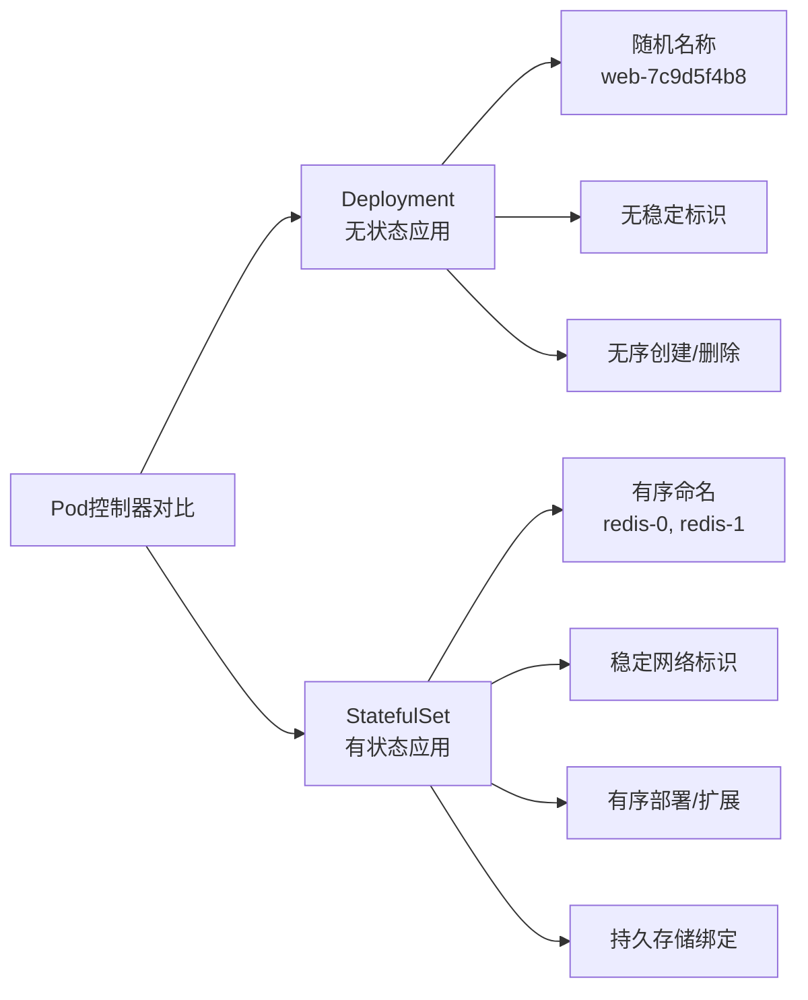
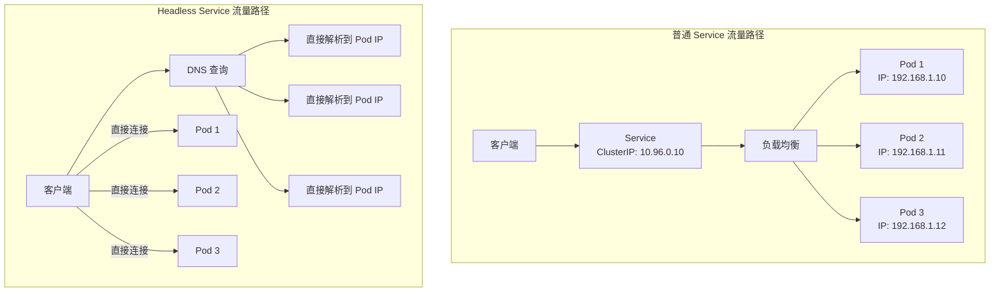

StatefulSet 是 K8s 中专门为有状态应用设计的控制器，首先我们与 Deployment 对比一下这两种资源的特性:



接下来详细介绍一下每一个特性的特点，对比一下和deployment的特性有什么不同点，为什么Stateful资源可以部署有状态应用;

## Stateful资源核心特性讲解

### 稳定的、唯一的网络标识

命名规则特性:

```yaml
# StatefulSet 命名模板
<statefulset-name>-<ordinal-index>
# 比如 kafka-0 kafka-1 kafka-2
# 示例：
apiVersion: apps/v1
kind: StatefulSet
metadata:
  name: redis-cluster # 指定pod名字
spec:
  serviceName: "redis"  # 必须指定
  replicas: 3
```

生成的Pod名称：

- redis-cluster-0 
- redis-cluster-1 
- redis-cluster-2

这些名称在Pod生命周期中保持不变，即使Pod被重新调度。

**DNS解析规则**

```shell
# 每个Pod获得稳定的DNS名称：
<pod-name>.<service-name>.<namespace>.svc.cluster.local

# 示例：
redis-cluster-0.redis.default.svc.cluster.local
redis-cluster-1.redis.default.svc.cluster.local
redis-cluster-2.redis.default.svc.cluster.local

# 还支持无头服务（Headless Service）发现：
# 查询 service-name 会返回所有Pod的DNS记录
```

### 持久化存储卷绑定

对于deployment资源，模板中指定绑定的pvc和路径，所有pod启动后，都会绑定到同一个pvc和指定的路径下；

VolumeClaimTemplate 机制可以控制每一个pod单独动态创建pvc资源，这样不同的pod就会写数据到不同的pvc资源下。

```yaml
apiVersion: apps/v1
kind: StatefulSet
metadata:
  name: mysql
spec:
  serviceName: mysql
  replicas: 3
  volumeClaimTemplates:  # 关键！为每个Pod动态创建PVC
  - metadata:
      name: data  # 卷名称
    spec:
      accessModes: ["ReadWriteOnce"]
      storageClassName: "fast-ssd"
      resources:
        requests:
          storage: 10Gi
  template:
    spec:
      containers:
      - name: mysql
        image: mysql:8.0
        volumeMounts:
        - name: data
          mountPath: /var/lib/mysql
```

存储绑定关系：

```shell
Pod: mysql-0  ←→  PVC: data-mysql-0 ←→  PV: pv-mysql-0
Pod: mysql-1  ←→  PVC: data-mysql-1 ←→  PV: pv-mysql-1  
Pod: mysql-2  ←→  PVC: data-mysql-2 ←→  PV: pv-mysql-2
```

重要特性：

- 一对一绑定：每个Pod有自己专用的PVC 
- 生命周期绑定：删除Pod时，PVC默认保留（可配置保留策略） 
- 重新调度时保持：Pod在新节点重建时，会重新挂载相同的PVC


### 有序的部署、扩展和删除

pod管理策略：

```yaml
# 1. OrderedReady（默认策略）
spec:
  podManagementPolicy: OrderedReady  # 顺序创建/删除

# 执行流程：
创建：0 → 1 → 2 （等待前一个Ready才创建下一个）
删除：2 → 1 → 0 （反向顺序删除）
扩展：按顺序创建新Pod
缩容：按反向顺序删除Pod

# 2. Parallel（并行策略）
spec:
  podManagementPolicy: Parallel  # 并行创建/删除

# 执行流程：
创建：0,1,2 同时创建
删除：0,1,2 同时删除
扩展：新Pod同时创建
缩容：指定Pod同时删除
```

**有序性的重要性场景**

```yaml
# 数据库集群初始化场景：
1. mysql-0 启动，作为主节点初始化
2. mysql-1 启动，从 mysql-0 同步数据
3. mysql-2 启动，从 mysql-0 或 mysql-1 同步数据

# 如果无序启动：
所有节点同时启动 → 可能都尝试成为主节点 → 脑裂
```

### 稳定的更新策略

更新策略类型：

```yaml
spec:
  updateStrategy:
    type: RollingUpdate  # 或 OnDelete
    rollingUpdate:
      partition: 2  # 金丝雀发布的关键配置
```

更新过程示例（假设 replicas=3, partition=1）：

```yaml
初始状态： [v1][v1][v1]
更新开始： [v1][v2][v1]  # 只更新 index >= partition(1) 的Pod
验证v2：   如果v2正常，调partition=0
继续更新： [v2][v2][v1]  # 更新剩余的
最终：     [v2][v2][v2]
```

### 稳定的网络标识（详细扩展）

Headless Service 配合

```yaml
apiVersion: v1
kind: Service
metadata:
  name: kafka
spec:
  clusterIP: None  # Headless Service关键！
  ports:
  - port: 9092
    name: kafka-port
  selector:
    app: kafka
---
apiVersion: apps/v1
kind: StatefulSet
metadata:
  name: kafka-broker
spec:
  serviceName: "kafka"  # 指向Headless Service
  replicas: 3
```

**DNS查询解析结果**

```yaml
$ nslookup kafka.default.svc.cluster.local

# 返回：
kafka-broker-0.kafka.default.svc.cluster.local
kafka-broker-1.kafka.default.svc.cluster.local  
kafka-broker-2.kafka.default.svc.cluster.local

# 每个解析到对应的Pod IP
```

## Kafka StatefulSet 配置

```yaml
apiVersion: v1
kind: Service
metadata:
  name: kafka
  labels:
    app: kafka
spec:
  ports:
  - port: 9092
    name: kafka-port
  clusterIP: None  # Headless Service
  selector:
    app: kafka
---
apiVersion: v1
kind: ConfigMap
metadata:
  name: kafka-config
data:
  server.properties: |
    broker.id=${BROKER_ID}
    listeners=PLAINTEXT://:9092
    advertised.listeners=PLAINTEXT://${POD_NAME}.kafka:9092
    log.dirs=/kafka/data
    # 其他配置...
---
apiVersion: apps/v1
kind: StatefulSet
metadata:
  name: kafka
spec:
  serviceName: "kafka"  # 匹配Service名称
  replicas: 3
  podManagementPolicy: OrderedReady  # 顺序启动
  updateStrategy:
    type: RollingUpdate
    rollingUpdate:
      partition: 0
  selector:
    matchLabels:
      app: kafka
  template:
    metadata:
      labels:
        app: kafka
    spec:
      terminationGracePeriodSeconds: 60  # 延长优雅终止时间
      containers:
      - name: kafka
        image: confluentinc/cp-kafka:7.3.0
        ports:
        - containerPort: 9092
        env:
        - name: BROKER_ID
          valueFrom:
            fieldRef:
              fieldPath: metadata.name  # 获取kafka-0中的"0"
        - name: POD_NAME
          valueFrom:
            fieldRef:
              fieldPath: metadata.name
        - name: KAFKA_CFG_ZOOKEEPER_CONNECT
          value: "zookeeper:2181"
        volumeMounts:
        - name: config
          mountPath: /etc/kafka
        - name: data
          mountPath: /kafka/data
        readinessProbe:
          tcpSocket:
            port: 9092
          initialDelaySeconds: 15
          periodSeconds: 10
        livenessProbe:
          tcpSocket:
            port: 9092
          initialDelaySeconds: 30
          periodSeconds: 10
      volumes:
      - name: config
        configMap:
          name: kafka-config
  volumeClaimTemplates:  # 每个Pod独立的持久化存储
  - metadata:
      name: data
    spec:
      accessModes: [ "ReadWriteOnce" ]
      storageClassName: "fast-ssd"
      resources:
        requests:
          storage: 50Gi
```

## StatefulSet 生命周期管理

### 创建流程

```yaml
# 1. 创建Headless Service（如果不存在）
# 2. 按顺序创建Pod：
#   创建PersistentVolumeClaims（按volumeClaimTemplates）
#   等待PVC绑定PV
#   调度Pod到节点
#   挂载卷，启动容器
#   等待readinessProbe通过
#   重复创建下一个Pod
```

### 扩缩容流程

```yaml
# 扩容（从3到5个副本）
kubectl scale statefulset kafka --replicas=5

# 顺序创建：
1. 创建 PVC: data-kafka-3
2. 创建 Pod: kafka-3
3. 等待 kafka-3 Ready
4. 创建 PVC: data-kafka-4  
5. 创建 Pod: kafka-4
6. 等待 kafka-4 Ready

# 缩容（从5到3个副本）：
1. 删除 Pod: kafka-4
2. 等待完全删除（优雅终止）
3. 删除 Pod: kafka-3
# 注意：PVC默认保留！需要手动删除
```

### 更新流程

```yaml
# 金丝雀发布示例：
1. 设置 partition=2（保留前2个Pod不更新）
2. 更新镜像版本
3. 只有 index>=2 的Pod（kafka-2,3,4...）会被更新
4. 验证新版本
5. 逐步调低partition直到0，更新所有Pod
```

### 删除流程

```yaml
# 删除StatefulSet但保留Pod：
kubectl delete statefulset kafka --cascade=orphan

# 删除StatefulSet和Pod，但保留PVC：
kubectl delete statefulset kafka

# 删除StatefulSet、Pod和PVC：
kubectl delete statefulset kafka --cascade=background
# 然后需要手动删除PVC或使用回收策略
```

## Stateful使用场景

适用场景 ✅：
- 数据库集群：MySQL、PostgreSQL、MongoDB副本集 
- 消息队列：Kafka、RabbitMQ（需要固定节点标识） 
- 缓存集群：Redis Cluster、Elasticsearch 
- 分布式协调：ZooKeeper、etcd

有状态中间件：任何需要稳定网络标识+持久存储的应用

不适用场景 ❌：
- 无状态Web应用：用Deployment更合适 
- 批量处理任务：用Job/CronJob 
- 单实例有状态应用：也可以用Deployment+PersistentVolume 
- 不需要持久存储的有状态应用：考虑使用普通Service

## StatefulSet 限制与注意事项

**当前限制**
- 存储卷不能跨Pod共享：每个Pod有自己的PVC 
- 节点故障处理有限：需要手动干预或配合PDB 
- 备份/恢复复杂：需要应用级备份方案 
- 网络要求高：依赖稳定的DNS和网络

## StatefulSet vs Deployment 对比表

| 特性         | **StatefulSet**        | **Deployment**              |
| :----------- | :--------------------- | :-------------------------- |
| **Pod名称**  | 稳定、有序             | 随机哈希                    |
| **网络标识** | 稳定DNS（pod.service） | 不稳定，通过Service负载均衡 |
| **存储**     | 每个Pod独立PVC         | 可共享或无状态              |
| **启动顺序** | 有序（默认）           | 并行                        |
| **更新策略** | 支持分区更新           | 滚动/重建更新               |
| **适用场景** | 有状态应用             | 无状态应用                  |
| **服务发现** | 通过DNS直接访问Pod     | 通过Service访问             |
| **缩容风险** | 按反向顺序删除         | 随机删除                    |


StatefulSet 的核心价值：

1. 身份稳定性：Pod名称、网络标识、存储绑定在整个生命周期中保持不变 
2. 启动可控性：有序创建和删除，适合需要初始化的集群应用 
3. 存储专有性：每个Pod拥有自己独立的持久化存储

使用建议：

1. 当你的应用需要稳定的网络标识或专用的持久化存储时，选择StatefulSet 
2. 配合Headless Service实现直接Pod访问 
3. 使用volumeClaimTemplates自动化存储管理 
4. 配置合适的就绪探针和优雅终止策略 
5. 考虑使用Operator来管理更复杂的有状态应用

## Headless Service 资源

### 什么是Headless Service

Headless Service 是一种特殊的 K8s Service，它没有 ClusterIP（无集群IP），不提供负载均衡，也不提供代理转发。它唯一的作用是为 Pod 提供稳定的 DNS 记录，让客户端能直接连接到具体的 Pod。

有一个很好的比喻:

```shell
普通 Service（有头服务）：
像"公司前台" → 你打公司总机，前台帮你转接到具体部门

Headless Service（无头服务）：
像"员工通讯录" → 给你每个人的直接分机号，你自己打过去
```

### Headless Service vs 普通 Service

| 特性          | **普通 Service (ClusterIP)** | **Headless Service**       |
| :------------ | :--------------------------- | :------------------------- |
| **ClusterIP** | 有（如 10.96.0.1）           | 无（显式设置为 None）      |
| **负载均衡**  | ✅ 提供（轮询等）             | ❌ 不提供                   |
| **代理转发**  | ✅ 通过 kube-proxy            | ❌ 直接连接 Pod             |
| **DNS 解析**  | 返回单个 A 记录（ClusterIP） | 返回所有 Pod 的 A 记录     |
| **适用场景**  | 无状态应用，希望负载均衡     | 有状态应用，需直连特定 Pod |
| **访问方式**  | Service 名称                 | Pod 名称 + Service 名称    |


### 网络架构对比



### Headless Service 工作原理

**DNS解析行为**

```yaml
# Headless Service 定义
apiVersion: v1
kind: Service
metadata:
  name: cassandra
spec:
  clusterIP: None  # 关键配置！
  ports:
  - port: 9042
    name: cql
  selector:
    app: cassandra
```

**DNS查询结果对比**

```yaml
# 普通 Service 查询：
$ nslookup cassandra.default.svc.cluster.local
Server:    10.96.0.10
Address:   10.96.0.10#53

Name:   cassandra.default.svc.cluster.local
Address: 10.96.128.15  # 返回单个 ClusterIP

# Headless Service 查询：
$ nslookup cassandra.default.svc.cluster.local
Server:    10.96.0.10
Address:   10.96.0.10#53

Name:   cassandra.default.svc.cluster.local
Address: 192.168.1.10  # 返回所有 Pod IP
Name:   cassandra.default.svc.cluster.local
Address: 192.168.1.11
Name:   cassandra.default.svc.cluster.local
Address: 192.168.1.12
```

与 StatefulSet 配合的 DNS 模式

```yaml
# StatefulSet Pod 的稳定 DNS 名称规则：
<pod-name>.<service-name>.<namespace>.svc.cluster.local

# 示例：cassandra-0 的完整 DNS
cassandra-0.cassandra.default.svc.cluster.local
```

实际的DNS记录:

```yaml
# 查询特定 Pod：
$ nslookup cassandra-0.cassandra.default.svc.cluster.local
Address: 192.168.1.10

$ nslookup cassandra-1.cassandra.default.svc.cluster.local  
Address: 192.168.1.11

$ nslookup cassandra-2.cassandra.default.svc.cluster.local
Address: 192.168.1.12

# 查询 Service 返回所有 Pod：
$ nslookup cassandra.default.svc.cluster.local
Address: 192.168.1.10
Address: 192.168.1.11
Address: 192.168.1.12
```

### Headless Service 使用场景

#### 有状态集群应用（主要场景）

```yaml
# 每个应用都需要直接通信
场景：
- 数据库集群：MySQL Group Replication, PostgreSQL, MongoDB
- NoSQL 数据库：Cassandra, CockroachDB
- 消息队列：Kafka, RabbitMQ
- 分布式协调：ZooKeeper, etcd
- 搜索引擎：Elasticsearch
```

#### 点对点通信需求

```yaml
# 客户端代码示例：直接连接特定 Pod
import redis

# 普通 Service 方式（负载均衡）
redis_client = redis.Redis(host='redis-service', port=6379)
# 问题：无法控制连接到哪个实例

# Headless Service 方式（直连特定实例）
pod_dns = "redis-2.redis.default.svc.cluster.local"
redis_client = redis.Redis(host=pod_dns, port=6379)
# 优点：可以精确控制连接到哪个节点
```

#### 自定义负载均衡逻辑

```yaml
// 应用自己实现负载均衡
func getRedisClient() *redis.Client {
    // 1. DNS 查询获取所有 Pod IP
    pods := dns.Lookup("redis.default.svc.cluster.local")
    
    // 2. 应用自定义的选择逻辑
    //    - 基于一致性哈希
    //    - 基于地理位置
    //    - 基于负载情况
    selectedPod := customLoadBalancer(pods)
    
    // 3. 直接连接到选中的 Pod
    return redis.NewClient(&redis.Options{
        Addr: selectedPod + ":6379",
    })
}
```


#### 服务网格（Service Mesh）场景

```yaml
# Istio 中使用 Headless Service
apiVersion: v1
kind: Service
metadata:
  name: mysql
  labels:
    app: mysql
spec:
  clusterIP: None  # Headless
  ports:
  - port: 3306
    name: mysql
  selector:
    app: mysql
---
# Istio 可以为 Headless Service 提供高级功能：
# - mTLS 加密
# - 流量监控
# - 故障注入
# - 但负载均衡由应用或 Sidecar 处理
```

### 小结

Headless Service 核心价值：
1. 直接 Pod 访问：绕过负载均衡，直连特定实例 
2. 稳定 DNS 标识：为 StatefulSet Pod 提供永久 DNS 名称 
3. 集群发现：让分布式应用能自动发现所有节点 
4. 应用层控制：允许应用自己实现负载均衡逻辑