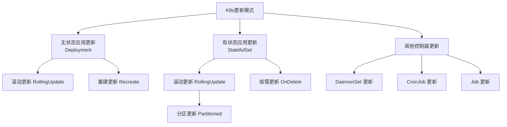
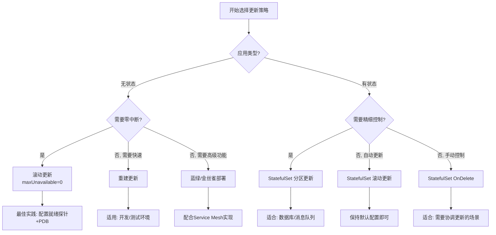

K8s 提供了多种更新策略，适应不同场景需求。更新模式主要分为两大类：无状态应用（Deployment）的更新和有状态应用（StatefulSet）的更新。

## 更新模式概览



## Deployment 更新模式（无状态应用）

### 滚动更新（RollingUpdate）- 默认且最常用

```yaml
apiVersion: apps/v1
kind: Deployment
metadata:
  name: web-app
spec:
  replicas: 5
  strategy:
    type: RollingUpdate  # 滚动更新
    rollingUpdate:
      maxSurge: 1        # 最大激增 Pod 数
      maxUnavailable: 0  # 最大不可用 Pod 数，即更新过程中，不能存在不可用的pod
  selector:
    matchLabels:
      app: web
  template:
    metadata:
      labels:
        app: web
    spec:
      containers:
      - name: web
        image: nginx:1.20  # 更新时修改此镜像标签
```

**滚动更新过程**

```shell
# 初始状态：5个 v1 版本 Pod
[v1][v1][v1][v1][v1]

# 触发更新（镜像改为 nginx:1.21）
kubectl set image deployment/web-app web=nginx:1.21

# 更新过程：
1. 创建1个 v2 Pod（maxSurge=1）
   [v1][v1][v1][v1][v1][v2]

2. 等待 v2 Pod Ready，删除1个 v1 Pod
   [v1][v1][v1][v1][v2]

3. 重复直到全部更新
   [v1][v1][v1][v2][v2]
   [v1][v1][v2][v2][v2]
   [v1][v2][v2][v2][v2]
   [v2][v2][v2][v2][v2]

# 全程保证至少有 5-0=5 个可用 Pod（maxUnavailable=0）
```

**参数配置详解**

| 参数              | 说明                            | 示例值         | 影响                  |
| :---------------- | :------------------------------ | :------------- | :-------------------- |
| `maxSurge`        | 允许超过期望副本数的最大 Pod 数 | `1`（默认25%） | 控制更新速度          |
| `maxUnavailable`  | 更新期间允许不可用的最大 Pod 数 | `0`（默认25%） | 控制可用性            |
| `minReadySeconds` | Pod 就绪后等待时间              | `10`           | 避免过早认为 Pod 就绪 |


### 重建更新（Recreate）- 快速但中断服务

```yaml
apiVersion: apps/v1
kind: Deployment
metadata:
  name: web-app
spec:
  replicas: 3
  strategy:
    type: Recreate  # 重建更新
  selector:
    matchLabels:
      app: web
  template:
    spec:
      containers:
      - name: web
        image: nginx:1.20
```

**更新过程**

```yaml
# 初始状态：3个 v1 Pod
[v1][v1][v1]

# 触发更新：
1. 删除所有 v1 Pod ← 服务中断！
   [][][]

2. 创建所有 v2 Pod
   [v2][v2][v2]

# 特点：
# ✅ 更新速度快
# ❌ 服务完全中断
# ✅ 保证同一时间只有一个版本
```

适用场景：
1. 开发/测试环境 
2. 应用无法多版本并行 
3. 数据迁移需要完全停止 
4. 快速回滚不重要

## StatefulSet 更新模式（有状态应用）

### 滚动更新（RollingUpdate）

```yaml
apiVersion: apps/v1
kind: StatefulSet
metadata:
  name: redis-cluster
spec:
  serviceName: redis
  replicas: 3
  updateStrategy:
    type: RollingUpdate  # 也可以选择 OnDelete
    rollingUpdate:
      partition: 0  # 分区更新控制
  selector:
    matchLabels:
      app: redis
  template:
    spec:
      containers:
      - name: redis
        image: redis:6.2
```

**StatefulSet 滚动更新特点：**

```shell
# 更新顺序：从最高序号开始，向低序号更新
# 对于3副本 StatefulSet：

1. 删除 redis-2，创建新 redis-2
   [redis-0:v1][redis-1:v1][redis-2:v2]

2. 等待 redis-2 Ready
3. 删除 redis-1，创建新 redis-1
   [redis-0:v1][redis-1:v2][redis-2:v2]

4. 等待 redis-1 Ready  
5. 删除 redis-0，创建新 redis-0
   [redis-0:v2][redis-1:v2][redis-2:v2]
```

### 分区更新（Partitioned RollingUpdate）- 高级特性

```yaml
apiVersion: apps/v1
kind: StatefulSet
metadata:
  name: kafka
spec:
  updateStrategy:
    type: RollingUpdate
    rollingUpdate:
      partition: 2  # 关键配置！金丝雀发布
  replicas: 5
```

**分区更新原理**

```shell
# partition=2 意味着：
# - Pod 序号 >=2 的会被更新
# - Pod 序号 <2 的保持原版本

初始：     [v1][v1][v1][v1][v1]
partition=2: [v1][v1][v2][v2][v2]  # 只更新3个Pod
partition=0: [v2][v2][v2][v2][v2]  # 更新全部

# 金丝雀发布流程：
1. 设置 partition=4，只更新最后一个 Pod
2. 验证新版本
3. 设置 partition=2，更新3个 Pod  
4. 再次验证
5. 设置 partition=0，更新全部
```

### 按需更新（OnDelete）- 手动控制

```yaml
apiVersion: apps/v1
kind: StatefulSet
metadata:
  name: mysql
spec:
  updateStrategy:
    type: OnDelete  # 手动触发更新
  replicas: 3
```

**OnDelete 更新过程：**

```shell
# 更新流程：
1. 更新 StatefulSet 模板（如镜像版本）
2. 但 Pod 不会自动更新！
3. 需要手动删除 Pod 才会触发重建

# 手动触发：
kubectl delete pod mysql-0
# 会自动创建新的 mysql-0 使用新镜像

# 特点：
# ✅ 完全手动控制
# ✅ 适合需要协调更新的场景
# ❌ 自动化程度低
```

## DaemonSet 更新

```yaml
apiVersion: apps/v1
kind: DaemonSet
metadata:
  name: node-exporter
spec:
  updateStrategy:
    type: RollingUpdate
    rollingUpdate:
      maxUnavailable: 1  # 每个节点更新策略
  selector:
    matchLabels:
      app: node-exporter
```

DaemonSet 更新特点：
1. 每个节点运行一个 Pod 
2. 更新时按节点逐个更新 
3. 可配置 maxUnavailable 控制并发度


## Job/CronJob 更新

```yaml
# Job：一次性任务，更新即创建新Job
apiVersion: batch/v1
kind: Job
metadata:
  name: data-processor
spec:
  completions: 1
  template:
    spec:
      containers:
      - name: processor
        image: processor:v2  # 更新镜像后需要创建新Job
      restartPolicy: Never

# CronJob：定时任务
apiVersion: batch/v1
kind: CronJob
metadata:
  name: daily-backup
spec:
  schedule: "0 2 * * *"
  jobTemplate:
    spec:
      template:
        spec:
          containers:
          - name: backup
            image: backup:v1.1  # 更新后下次执行生效
```

## 高级更新策略与模式

### 蓝绿部署（Blue-Green Deployment）

```yaml
# 方案1：使用两个不同的 Deployment
apiVersion: apps/v1
kind: Deployment
metadata:
  name: web-app-blue  # 蓝环境
spec:
  replicas: 3
  selector:
    matchLabels:
      app: web
      version: blue
  template:
    metadata:
      labels:
        app: web
        version: blue
---
apiVersion: apps/v1
kind: Deployment
metadata:
  name: web-app-green  # 绿环境
spec:
  replicas: 3
  selector:
    matchLabels:
      app: web
      version: green
```

蓝绿部署切换流程:

```shell
# 1. 部署新版本到绿环境
kubectl apply -f green-deployment.yaml

# 2. 测试绿环境
kubectl port-forward svc/web-green 8080:80

# 3. 切换 Service 流量
apiVersion: v1
kind: Service
metadata:
  name: web-service
spec:
  selector:
    app: web
    version: green  # 从 blue 改为 green

# 4. 蓝环境作为回滚备用
```

### 金丝雀发布（Canary Release）

```yaml
# 方案1：使用单个 Deployment + 不同副本数
apiVersion: apps/v1
kind: Deployment
metadata:
  name: web-app-canary
spec:
  replicas: 10  # 9个v1 + 1个v2
  selector:
    matchLabels:
      app: web
  template:
    metadata:
      labels:
        app: web
        version: v2  # 金丝雀版本
---
# 方案2：使用两个 Deployment 控制流量比例
apiVersion: apps/v1
kind: Deployment
metadata:
  name: web-app-stable
spec:
  replicas: 9  # 90%流量
---
apiVersion: apps/v1
kind: Deployment
metadata:
  name: web-app-canary
spec:
  replicas: 1  # 10%流量
```

**配合 Service Mesh 的金丝雀：**

```yaml
# Istio VirtualService 流量切分
apiVersion: networking.istio.io/v1beta1
kind: VirtualService
metadata:
  name: web-vs
spec:
  hosts:
  - web-service
  http:
  - route:
    - destination:
        host: web-service
        subset: v1
      weight: 90  # 90%流量到v1
    - destination:
        host: web-service
        subset: v2
      weight: 10  # 10%流量到v2
```

### A/B 测试（A/B Testing）

```yaml
# 基于 header 或 cookie 的流量分割
apiVersion: networking.istio.io/v1beta1
kind: VirtualService
metadata:
  name: web-ab-test
spec:
  hosts:
  - web-service
  http:
  - match:
    - headers:
        user-type:
          exact: premium  # 高级用户
    route:
    - destination:
        host: web-service
        subset: v2-new-feature
  - route:  # 其他用户
    - destination:
        host: web-service
        subset: v1-stable
```

## 更新策略选择



**策略对比**

| 模式           | 适用控制器             | 特点                     | 适用场景             |
| :------------- | :--------------------- | :----------------------- | :------------------- |
| **滚动更新**   | Deployment/StatefulSet | 逐步替换，服务不中断     | 生产环境无状态应用   |
| **重建更新**   | Deployment             | 全部删除再创建，服务中断 | 开发测试环境         |
| **分区更新**   | StatefulSet            | 精确控制更新范围         | 有状态应用金丝雀发布 |
| **按需更新**   | StatefulSet            | 手动删除 Pod 触发更新    | 需要协调的更新       |
| **蓝绿部署**   | 多Deployment+Service   | 零风险切换               | 关键业务系统         |
| **金丝雀发布** | Deployment+ServiceMesh | 渐进式流量切换           | 新功能验证           |

小结：

1. 无状态 Web 应用：Deployment 滚动更新 + 就绪探针 
2. 数据库/消息队列：StatefulSet 分区更新 + 优雅关闭 
3. 关键业务系统：蓝绿部署或金丝雀发布 
4. 开发测试环境：重建更新简化流程 
5. 需要完全控制：OnDelete 或手动更新

关键原则：
1. 始终保证可用性：合理配置 maxUnavailable 
2. 监控更新过程：使用 kubectl rollout status 
3. 准备回滚方案：保留足够的历史版本 
4. 测试更新流程：在非生产环境验证 
5. 渐进式更新：从金丝雀开始，逐步扩大


## Kafka滚动分区更新案例

分区更新（Partitioned Rolling Update） 是 StatefulSet 特有的一种精细化、可控的滚动更新策略，特别适合有状态应用如 Kafka、Redis。

**核心原理**
通过设置一个 分区值（partition），将 Pod 分成两组： 
1. 更新组：Pod 序号 ≥ partition 的 Pod 会被更新 
2. 保留组：Pod 序号 < partition 的 Pod 保持原版本不变

通过设置partition值，控制不同分区的更新，直到最终所有应用全部更新完毕；

### StatefulSet滚动分区更新配置

```yaml
apiVersion: apps/v1
kind: StatefulSet
metadata:
  name: kafka
spec:
  updateStrategy:
    type: RollingUpdate  # 必须是 RollingUpdate
    rollingUpdate:
      partition: 2  # 关键！分区值
  replicas: 5
  # ... 其他配置
```

**Pod 序号规则**:

- StatefulSet 的 Pod 有固定序号：`<statefulset-name>-<index>`
- kafka-0, kafka-1, kafka-2, kafka-3, kafka-4

分区值 partition=2 的含义：

```shell
Pod 序号：  0     1     2     3     4
            ↓     ↓     ↓     ↓     ↓
更新状态：  保留   保留   更新   更新   更新
          (老版本) (老版本) (新版本) (新版本) (新版本)
```

### 分区更新实际工作流程

#### 场景：Kafka 集群金丝雀发布

```yaml
# 初始状态：5个副本，版本 v1
apiVersion: apps/v1
kind: StatefulSet
metadata:
  name: kafka
spec:
  updateStrategy:
    type: RollingUpdate
    rollingUpdate:
      partition: 5  # 初始值设为副本数，都不更新
  replicas: 5
  template:
    spec:
      containers:
      - name: kafka
        image: confluentinc/cp-kafka:7.2.0  # v1
```

#### 步骤 1：开始金丝雀发布

```shell
# 1. 设置 partition=4，只更新最后一个 Pod
kubectl patch statefulset kafka \
  -p '{"spec":{"updateStrategy":{"rollingUpdate":{"partition":4}}}}'

# 同时更新镜像版本
kubectl patch statefulset kafka \
  -p '{"spec":{"template":{"spec":{"containers":[{"name":"kafka","image":"confluentinc/cp-kafka:7.3.0"}]}}}}'
```

此时kafka集群的状态:

```yaml
Pod     版本     状态
kafka-0  v1.0    保留（老版本）
kafka-1  v1.0    保留
kafka-2  v1.0    保留  
kafka-3  v1.0    保留
kafka-4  v2.0 ← 更新为新版本（金丝雀）
```

#### 步骤 2：验证金丝雀

```shell
# 监控新版本 Pod 的健康状态
kubectl logs kafka-4 --tail=50
kubectl describe pod kafka-4

# 检查业务指标
# - 消息吞吐量是否正常
# - 消费者延迟是否增加
# - 错误率是否上升

# 如果一切正常，继续扩大更新范围
```

#### 步骤 3：扩大更新范围

```yaml
# 2. 设置 partition=2，更新 2/3/4 三个 Pod
kubectl patch statefulset kafka \
  -p '{"spec":{"updateStrategy":{"rollingUpdate":{"partition":2}}}}'
```

**此时kafka集群工作状态**

```yaml
Pod     版本     状态
kafka-0  v1.0    保留（老版本）
kafka-1  v1.0    保留
kafka-2  v2.0 ← 开始更新
kafka-3  v2.0 ← 开始更新  
kafka-4  v2.0    已更新
```

#### 步骤 4：完成全部更新

```yaml
# 3. 设置 partition=0，更新所有剩余 Pod
kubectl patch statefulset kafka \
  -p '{"spec":{"updateStrategy":{"rollingUpdate":{"partition":0}}}}'
```

**kafka集群最终状态**

```yaml
Pod     版本     状态
kafka-0  v2.0 ← 最后更新
kafka-1  v2.0 ← 更新
kafka-2  v2.0    已更新
kafka-3  v2.0    已更新
kafka-4  v2.0    已更新
```

### 分区更新关键特性

#### 更新顺序保证


实际更新顺序（假设 partition=2, replicas=5）：

```yaml
第1批更新：kafka-4 （序号最大）
第2批更新：kafka-3
第3批更新：kafka-2
停止更新：kafka-1, kafka-0 （因为序号 < partition）
```

#### 更新过程不会中断服务

```yaml
# 因为有状态应用的特殊性：
1. 更新一个 Pod 时，它会：
   - 先被终止（优雅关闭）
   - 用新镜像启动新 Pod
   - 重新加入集群

2. 对于 Kafka：
   - 分区 Leader 会转移到其他副本
   - 新 Broker 启动后重新加入集群
   - 可能重新分配 Leader

3. 对于 Redis Cluster：
   - 如果是 Slave，简单重启同步
   - 如果是 Master，需要故障转移
```

### 分区更新 vs 普通滚动更新

| 特性         | **普通滚动更新**                    | **分区更新**                  |
| :----------- | :---------------------------------- | :---------------------------- |
| **控制粒度** | 粗粒度（全部或按比例）              | 细粒度（精确到每个 Pod）      |
| **更新顺序** | 从最新 Pod 开始，但可能同时更新多个 | 严格从高序号向低序号          |
| **暂停能力** | 有限（通过 maxUnavailable 控制）    | 完全可控（通过 partition 值） |
| **回滚难度** | 困难（需要整体回滚）                | 容易（只需调大 partition）    |
| **适用场景** | 无状态应用                          | 有状态集群、金丝雀发布        |
| **K8s 资源** | Deployment 和 StatefulSet 都支持    | 仅 StatefulSet 支持           |

### 分区更新高级模式

#### 蓝绿部署模式
```yaml
# 利用 partition 实现类似蓝绿部署
# 假设有 10 个副本，分成两组：

# 蓝组（老版本）：pod-0 到 pod-4 (partition=5)
# 绿组（新版本）：pod-5 到 pod-9

# 流量切换：
# 1. 将流量导向绿组（新版本）
# 2. 如果验证通过，设置 partition=0 更新蓝组
# 3. 如果失败，将流量切回蓝组，删除绿组 Pod
```

#### 多版本共存测试

```yaml
# 同时运行多个版本进行兼容性测试
partition: 8  # 只更新 8,9
# 结果：
# Pod 0-7: v1.0
# Pod 8-9: v2.0

# 测试场景：
# 1. v1 客户端与 v2 Broker 的兼容性
# 2. v2 Broker 与 v1 Broker 的集群兼容性
# 3. 逐步升级客户端，观察影响
```

#### 地理分区更新

```yaml
# 结合节点亲和性进行地理分区更新
# Pod 0-2: 部署在区域 A（partition=3，不更新）
# Pod 3-5: 部署在区域 B（更新）

# 先更新区域 B，观察区域间同步是否正常
# 再更新区域 A
```

### 小结

分区更新的核心点在于：
1. 精细化控制：精确控制哪些 Pod 被更新 
2. 金丝雀发布：先更新小部分，验证后再扩大 
3. 零风险回滚：只需调大 partition 值即可回滚 
4. 服务连续性：确保集群始终有足够的老版本节点提供服务

适用场景：

✅ 有状态集群：Kafka、Redis、数据库等

✅ 金丝雀/灰度发布：逐步验证新版本

✅ 多版本共存测试：测试兼容性

✅ 地理分批更新：跨区域逐步更新

❌ 无状态应用：用 Deployment 的普通滚动更新更合适