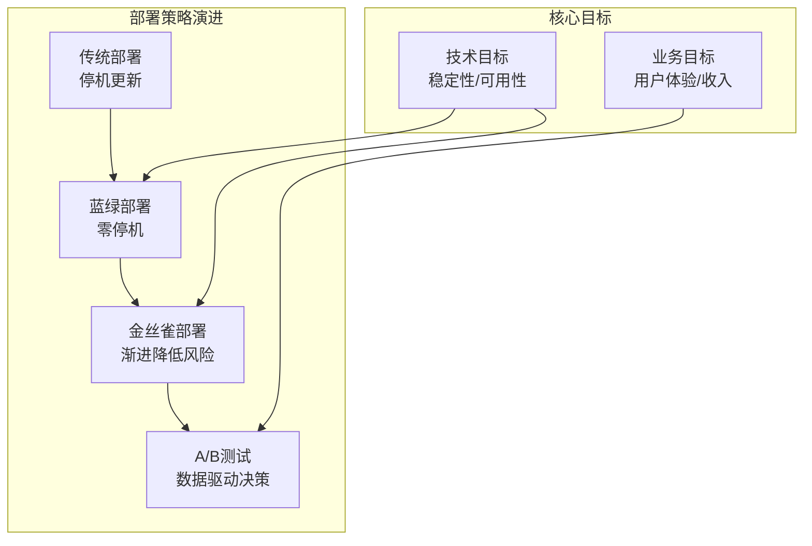
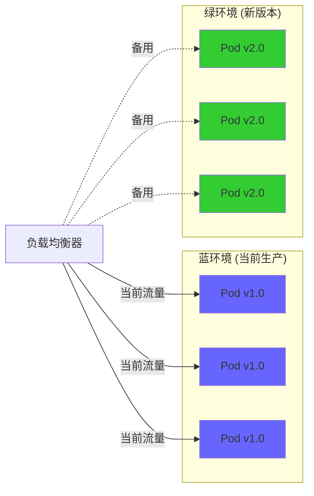
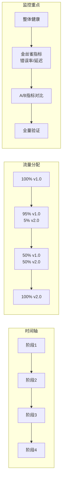
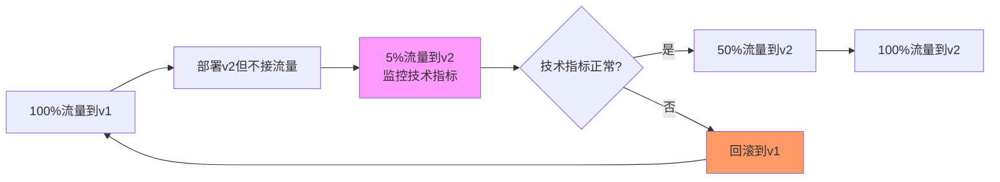
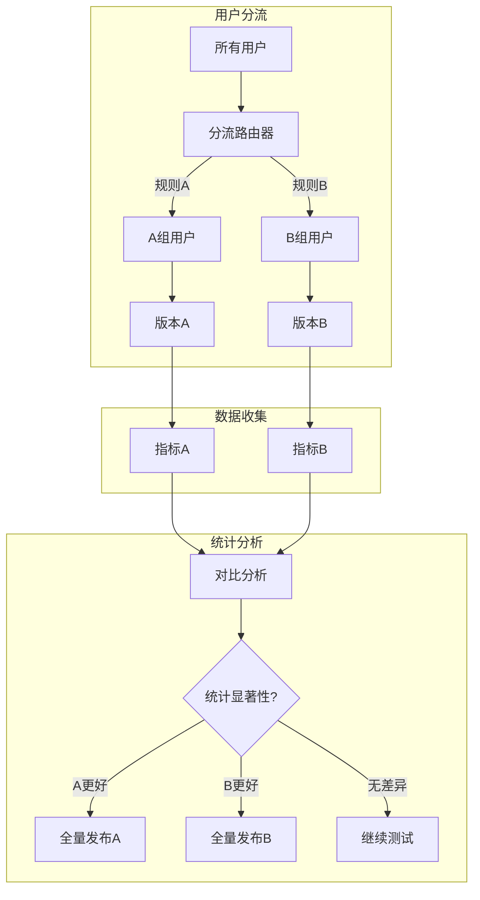
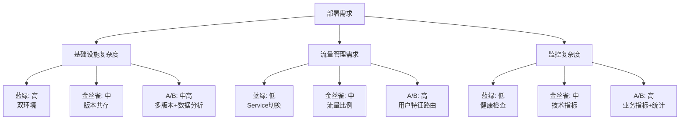
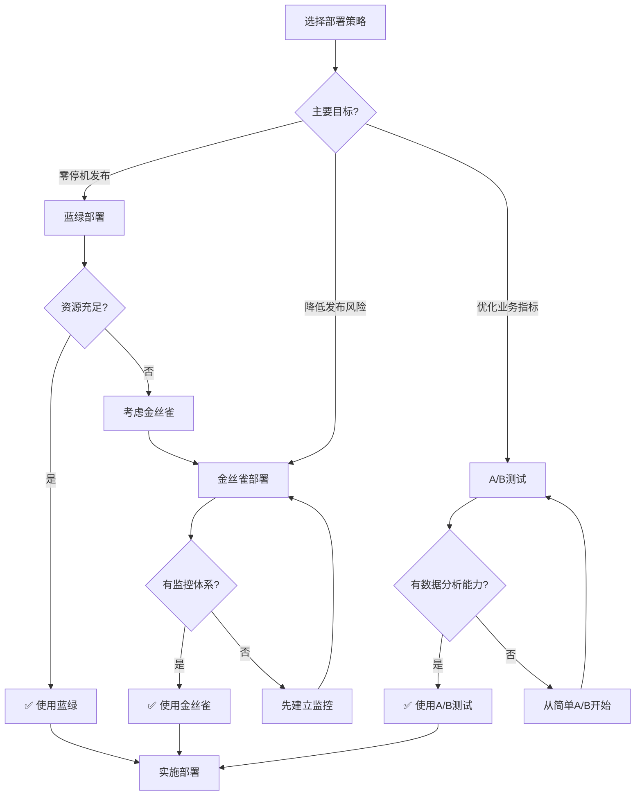
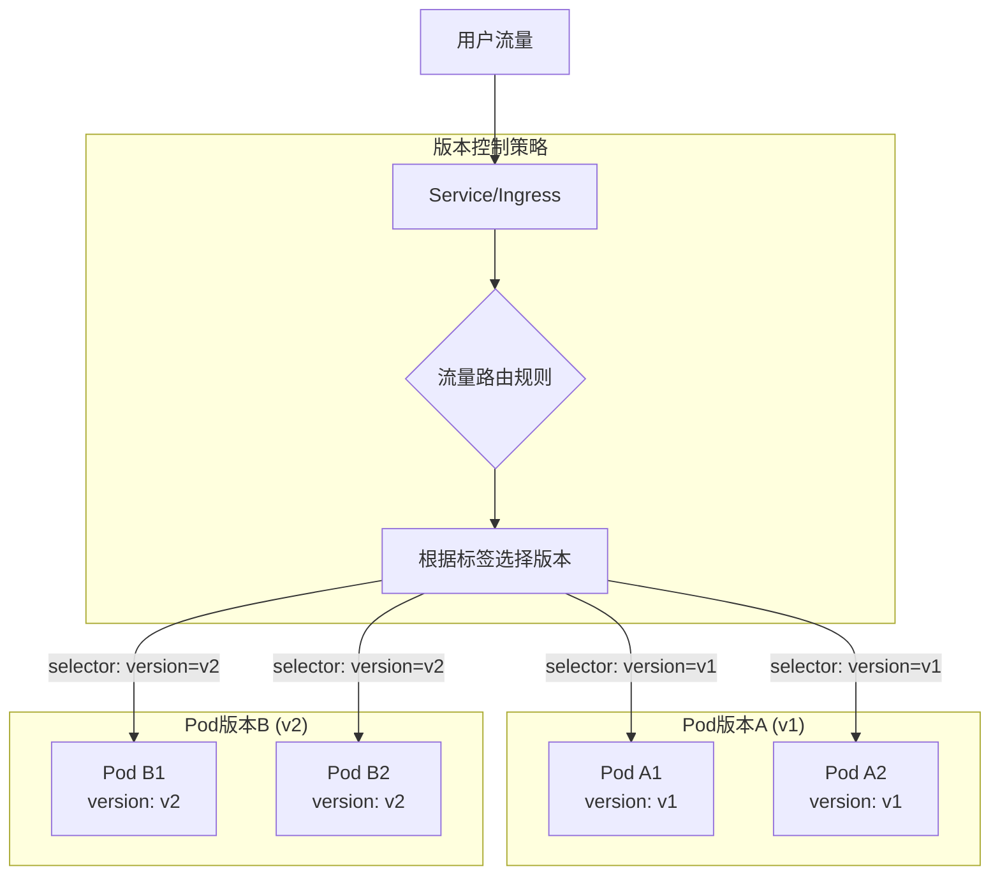

一句话理解不同部署方案到底是什么:
> - 蓝绿部署：全量切换，像电灯开关（开/关）
>
> - 金丝雀部署：渐进式切换，像水龙头调流量
>
> - A/B测试：分群对比，像科学实验对照组

## 不同部署模式对比矩阵

| 维度         | **蓝绿部署**         | **金丝雀部署**          | **A/B测试**             |
| :----------- | :------------------- | :---------------------- | :---------------------- |
| **主要目标** | 零停机发布，快速回滚 | 降低风险，渐进验证      | 业务决策，优化体验      |
| **风险控制** | 中（全量切换风险）   | 低（渐进降低风险）      | 中（分群控制风险）      |
| **流量分配** | 100%切换             | 比例分配（5%→50%→100%） | 基于用户特征分配        |
| **基础设施** | 双倍资源             | 1.x倍资源               | 多版本共存资源          |
| **持续时间** | 分钟级               | 小时到天级              | 天到周级                |
| **监控重点** | 整体健康度           | 技术指标（错误率/延迟） | 业务指标（转化率/收入） |
| **决策依据** | "新版本能工作吗？"   | "新版本稳定吗？"        | "哪个版本更好？"        |


**不同部署模式的演进**



## 蓝绿部署（Blue-Green Deployment）

### 核心原理

"同时运行两套完整环境，瞬间切换流量"



### K8s 实现方案

#### 方案A：双Deployment + Service切换

```yaml
# 蓝环境 (v1.0)
apiVersion: apps/v1
kind: Deployment
metadata:
  name: app-blue
spec:
  replicas: 3
  selector:
    matchLabels:
      app: myapp
      version: v1.0
  template:
    metadata:
      labels:
        app: myapp
        version: v1.0
        color: blue  # 颜色标签
    spec:
      containers:
      - name: app
        image: myapp:v1.0
---
# 绿环境 (v2.0) - 先部署但不接流量
apiVersion: apps/v1
kind: Deployment
metadata:
  name: app-green
spec:
  replicas: 3
  selector:
    matchLabels:
      app: myapp
      version: v2.0
  template:
    metadata:
      labels:
        app: myapp
        version: v2.0
        color: green
    spec:
      containers:
      - name: app
        image: myapp:v2.0
---
# Service - 控制流量方向
apiVersion: v1
kind: Service
metadata:
  name: app-service
spec:
  selector:
    app: myapp
    color: blue  # 当前指向蓝环境
  ports:
  - port: 80
    targetPort: 8080
```

**切换操作**

```yaml
# 1. 部署绿环境（验证但不接流量）
kubectl apply -f green-deployment.yaml

# 2. 验证绿环境
kubectl port-forward service/app-service 8080:80 --address=0.0.0.0
# 或创建临时Service测试

# 3. 切换流量（瞬间完成）
kubectl patch service app-service \
  -p '{"spec":{"selector":{"color":"green"}}}'

# 4. 回滚（如有问题）
kubectl patch service app-service \
  -p '{"spec":{"selector":{"color":"blue"}}}'
```

#### 方案B：使用Ingress控制器

```yaml
# 使用同一个Service，不同Ingress规则
apiVersion: networking.k8s.io/v1
kind: Ingress
metadata:
  name: app-ingress-blue
  annotations:
    nginx.ingress.kubernetes.io/rewrite-target: /
spec:
  rules:
  - host: myapp.example.com
    http:
      paths:
      - path: /
        pathType: Prefix
        backend:
          service:
            name: app-blue  # 指向蓝环境
            port:
              number: 80
---
apiVersion: networking.k8s.io/v1
kind: Ingress
metadata:
  name: app-ingress-green
  annotations:
    nginx.ingress.kubernetes.io/rewrite-target: /
spec:
  rules:
  - host: green.myapp.example.com  # 不同域名
    http:
      paths:
      - path: /
        pathType: Prefix
        backend:
          service:
            name: app-green  # 指向绿环境
            port:
              number: 80
```

### **优缺点分析**

**优点**：

- ✅ **零停机发布**：切换瞬间完成
- ✅ **快速回滚**：秒级切换回旧版本
- ✅ **简单可靠**：逻辑清晰，不易出错
- ✅ **完全隔离**：两套环境互不影响

**缺点**：

- ❌ **资源消耗大**：需要双倍资源
- ❌ **数据库同步复杂**：需要处理数据迁移
- ❌ **无法渐进验证**：全有或全无
- ❌ **成本高**：维护两套完整环境

### **适用场景**

- 金融系统（要求零停机）
- 关键业务系统（回滚必须快）
- 版本差异大的升级
- 数据库Schema变更需要停机的情况

## 金丝雀部署（Canary Deployment）

### 核心原理

"逐步将用户从旧版本迁移到新版本，同时监控关键指标"



**流量导向**



### K8s 实现方案

#### 方案A：单个Deployment + Pod标签

```yaml
# 使用单个Deployment，通过标签控制
apiVersion: apps/v1
kind: Deployment
metadata:
  name: app-canary
spec:
  replicas: 10
  selector:
    matchLabels:
      app: myapp
  template:
    metadata:
      labels:
        app: myapp
        version: v1.0  # 初始版本
    spec:
      containers:
      - name: app
        image: myapp:v1.0
---
# Service选择特定版本
apiVersion: v1
kind: Service
metadata:
  name: app-service
spec:
  selector:
    app: myapp
    version: v1.0  # 只选择v1.0
  ports:
  - port: 80
```

**金丝雀发布流程**

```yaml
#!/bin/bash
# canary-release.sh

# 阶段1：部署金丝雀Pod（但不接流量）
kubectl patch deployment app-canary \
  -p '{"spec":{"template":{"spec":{"containers":[{"name":"app","image":"myapp:v2.0"}]}}}}'

# 减少v1副本，增加v2副本（通过调整副本数）
kubectl scale deployment app-canary --replicas=11  # 10个v1 + 1个v2

# 给v2 Pod打上特殊标签
kubectl label pods -l app=myapp,version=v2.0 canary=true

# 阶段2：分配5%流量
# 使用Istio或Ingress分配部分流量到canary Pod
```

#### 方案B：使用Istio的精细控制

```yaml
apiVersion: networking.istio.io/v1beta1
kind: VirtualService
metadata:
  name: app-vs
spec:
  hosts:
  - app-service
  http:
  - route:
    - destination:
        host: app-service
        subset: stable
      weight: 95  # 95%流量到稳定版
    - destination:
        host: app-service
        subset: canary
      weight: 5   # 5%流量到金丝雀版
---
apiVersion: networking.istio.io/v1beta1
kind: DestinationRule
metadata:
  name: app-dr
spec:
  host: app-service
  subsets:
  - name: stable
    labels:
      version: v1.0
  - name: canary
    labels:
      version: v2.0
```

#### 方案C：Nginx Ingress金丝雀功能

```yaml
# 主Ingress（95%流量）
apiVersion: networking.k8s.io/v1
kind: Ingress
metadata:
  name: app-main
spec:
  rules:
    - host: myapp.example.com
      http:
        paths:
          - path: /
            pathType: Prefix
            backend:
              service:
                name: app-stable-service  # v1.0
                port:
                  number: 80
---
# 金丝雀Ingress（5%流量）
apiVersion: networking.k8s.io/v1
kind: Ingress
metadata:
  name: app-canary
  annotations:
    nginx.ingress.kubernetes.io/canary: "true"
    nginx.ingress.kubernetes.io/canary-weight: "5"
spec:
  rules:
    - host: myapp.example.com
      http:
        paths:
          - path: /
            pathType: Prefix
            backend:
              service:
                name: app-canary-service  # v2.0
                port:
                  number: 80
```

### **优缺点分析**

**优点**：

- ✅ **风险极低**：问题只影响小部分用户
- ✅ **实时监控**：可在影响扩散前发现问题
- ✅ **渐进式**：可随时调整流量比例
- ✅ **无需双倍资源**：只需额外部分资源

**缺点**：

- ❌ **部署复杂**：需要流量管理工具
- ❌ **会话问题**：用户可能在不同版本间跳转
- ❌ **监控要求高**：需要完善监控体系
- ❌ **时间较长**：需要多阶段验证

### **适用场景**

- 核心业务系统（不能承受大范围故障）
- 用户基数大的应用
- 需要验证性能影响
- 对稳定性要求极高的服务


## A/B测试部署（A/B Testing）

### 核心原理

"同时向不同用户群体展示不同版本，基于数据做决策"



### K8s实现方案

#### 方案A：基于用户特征的流量路由

```yaml
# 使用Istio的基于Header路由
apiVersion: networking.istio.io/v1beta1
kind: VirtualService
metadata:
  name: app-ab-test
spec:
  hosts:
  - app-service
  http:
  - match:
    - headers:
        x-user-group:
          exact: "experiment-a"  # A组用户
    route:
    - destination:
        host: app-service
        subset: version-a
  
  - match:
    - headers:
        x-user-group:
          exact: "experiment-b"  # B组用户
    route:
    - destination:
        host: app-service
        subset: version-b
  
  - route:  # 默认用户（对照组）
    - destination:
        host: app-service
        subset: version-a
---
apiVersion: networking.istio.io/v1beta1
kind: DestinationRule
metadata:
  name: app-ab-dr
spec:
  host: app-service
  subsets:
  - name: version-a
    labels:
      version: v1.0
      feature: "old-design"
  - name: version-b
    labels:
      version: v1.1
      feature: "new-design"
```

#### 方案B：基于百分比的随机分配

```yaml
# 简单A/B测试 - 50/50分配
apiVersion: networking.istio.io/v1beta1
kind: VirtualService
metadata:
  name: app-simple-ab
spec:
  hosts:
  - app-service
  http:
  - route:
    - destination:
        host: app-service
        subset: version-a
      weight: 50
    - destination:
        host: app-service
        subset: version-b
      weight: 50
```
#### 方案C：多版本特性标志（Feature Flags）

```yaml
# 前端应用通过配置决定显示哪个版本
apiVersion: v1
kind: ConfigMap
metadata:
  name: app-feature-flags
data:
  feature-flags.json: |
    {
      "new_checkout_design": {
        "enabled": true,
        "strategy": "percentage",
        "percentage": 50,
        "userGroups": ["beta-testers", "premium-users"]
      },
      "new_ui_layout": {
        "enabled": false,
        "strategy": "user_ids",
        "userIds": ["user123", "user456"]
      }
    }
```

### 优缺点分析

优点：

✅ 数据驱动决策：基于真实用户数据
✅ 降低主观偏见：客观比较版本效果
✅ 优化用户体验：找到最佳方案
✅ 降低风险：只在部分用户测试

缺点：

❌ 实现复杂：需要完整的数据管道
❌ 时间周期长：需要足够样本量
❌ 技术成本高：需要统计分析能力
❌ 可能影响用户体验：用户看到不一致的界面

### 适用场景

- UI/UX设计优化 
- 价格策略测试 
- 营销活动效果验证 
- 新功能接受度测试 
- 转化率优化（CRO）


## 三种策略详细对比

### 技术实现对比



### 业务影响对比

| 维度             | 蓝绿部署             | 金丝雀部署        | A/B测试              |
| :--------------- | :------------------- | :---------------- | :------------------- |
| **用户影响范围** | 所有用户（一次性）   | 渐进影响（小→大） | 特定用户群体         |
| **问题发现时机** | 切换后（可能大规模） | 早期（影响小）    | 数据收集后           |
| **决策速度**     | 快（切换即决策）     | 中（多阶段验证）  | 慢（需统计分析）     |
| **回滚成本**     | 低（秒级）           | 中（调整流量）    | 高（已影响业务决策） |
| **资源利用率**   | 低（50%闲置）        | 中（部分闲置）    | 高（都提供服务）     |


### 如何选择部署模式



### 混合使用场景

```yaml
# 实际生产中常混合使用
流程示例：
1. 先使用蓝绿部署发布基础版本
2. 对关键功能使用金丝雀部署验证稳定性
3. 对UI改动使用A/B测试优化用户体验
4. 对价格策略进行A/B测试

# 周级发布流程：
周一: 蓝绿部署基础设施更新
周二: 金丝雀部署后端API更新
周三-周四: A/B测试新UI设计
周五: 分析数据，准备下周发布
```

### 使用工具选择

| 工具              | 主要功能       | 支持策略              | 特点                  |
| :---------------- | :------------- | :-------------------- | :-------------------- |
| **Flagger**       | 金丝雀发布专家 | 金丝雀、A/B测试       | K8s原生，自动化程度高 |
| **Argo Rollouts** | 高级部署策略   | 蓝绿、金丝雀、A/B     | 功能全面，集成ArgoCD  |
| **Istio**         | 服务网格       | 流量管理、金丝雀、A/B | 微服务架构首选        |
| **Spinnaker**     | 多云部署       | 蓝绿、金丝雀          | Netflix开源，企业级   |
| **Jenkins X**     | CI/CD流水线    | 蓝绿、金丝雀          | 集成GitOps            |


## 小结

蓝绿、金丝雀、A/B测试不是互斥的选择，而是工具箱中的不同工具：

- 蓝绿部署是你的安全网，确保在最坏情况下能快速恢复 
- 金丝雀部署是你的预警系统，在问题扩大前发现并解决 
- A/B测试是你的优化引擎，用数据驱动产品改进
- 金丝雀部署：测试新版本稳定性（技术导向） 
- A/B测试部署：测试新功能效果（业务导向）


## K8S中流量切换步骤

k8s中分区滚动更新实现流量切换是蓝绿部署、金丝雀发布的核心实现方式；

### 一、核心思想：版本标签控制流量

基本原理：通过 Pod 的标签（Labels） 区分不同版本，然后让 Service 或 Ingress 通过选择器（selector）控制流量流向哪个版本。



### 二、方案一：单个 StatefulSet + 版本标签切换

这是**最常用**的方案，通过分区更新改变 Pod 的版本标签，然后更新 Service 的选择器。

#### **1. 初始部署配置**

```
# 初始：全部 v1 版本
apiVersion: apps/v1
kind: StatefulSet
metadata:
  name: web-app
spec:
  serviceName: web
  replicas: 5
  updateStrategy:
    type: RollingUpdate
    rollingUpdate:
      partition: 5  # 初始：不更新任何 Pod
  selector:
    matchLabels:
      app: web
  template:
    metadata:
      labels:
        app: web
        version: v1  # 初始版本标签
    spec:
      containers:
      - name: web
        image: nginx:1.20
---
# Service 选择 v1 版本
apiVersion: v1
kind: Service
metadata:
  name: web-service
spec:
  selector:
    app: web
    version: v1  # 关键：流量只到 v1
  ports:
  - port: 80
    targetPort: 80
  type: ClusterIP
```


#### **2. 金丝雀发布流程**

##### **步骤 1：更新部分 Pod 到 v2**

```
# 1. 修改 StatefulSet，准备 v2 镜像
kubectl patch statefulset web-app \
  -p '{"spec":{"template":{"spec":{"containers":[{"name":"web","image":"nginx:1.21"}]}}}}'

# 2. 设置 partition=4，只更新最后一个 Pod
kubectl patch statefulset web-app \
  -p '{"spec":{"updateStrategy":{"rollingUpdate":{"partition":4}}}}'

# 3. 等待更新完成
kubectl rollout status statefulset web-app

# 此时状态：
# Pod: [v1][v1][v1][v1][v2]
# 但 Service 仍然选择 version=v1，所以流量只到前4个 Pod
```


##### **步骤 2：切换部分流量到 v2**

```
# 方案A：创建新 Service 分流浪量
apiVersion: v1
kind: Service
metadata:
  name: web-service-v2
spec:
  selector:
    app: web
    version: v2  # 选择 v2 版本
  ports:
  - port: 80
    targetPort: 80
---
# 通过 Ingress 控制流量比例
apiVersion: networking.k8s.io/v1
kind: Ingress
metadata:
  name: web-ingress
  annotations:
    nginx.ingress.kubernetes.io/canary: "true"
    nginx.ingress.kubernetes.io/canary-weight: "10"  # 10%流量到v2
spec:
  rules:
  - host: example.com
    http:
      paths:
      - path: /
        pathType: Prefix
        backend:
          service:
            name: web-service-v2  # v2 Service
            port:
              number: 80
      - path: /
        pathType: Prefix
        backend:
          service:
            name: web-service  # v1 Service
            port:
              number: 80
```


##### **步骤 3：扩大 v2 范围并切换更多流量**

```
# 1. 设置 partition=2，更新3个 Pod 到 v2
kubectl patch statefulset web-app \
  -p '{"spec":{"updateStrategy":{"rollingUpdate":{"partition":2}}}}'

# 此时： [v1][v1][v2][v2][v2]

# 2. 调整 Ingress 流量比例到 60%
kubectl annotate ingress web-ingress \
  nginx.ingress.kubernetes.io/canary-weight="60" --overwrite

# 3. 监控 v2 版本表现
# - 错误率
# - 响应时间
# - 业务指标
```


##### **步骤 4：完全切换到 v2**

```
# 1. 设置 partition=0，更新所有 Pod 到 v2
kubectl patch statefulset web-app \
  -p '{"spec":{"updateStrategy":{"rollingUpdate":{"partition":0}}}}'

# 2. 更新主 Service 选择器到 v2
kubectl patch service web-service \
  -p '{"spec":{"selector":{"version":"v2"}}}'

# 3. 删除金丝雀 Ingress 规则
kubectl delete ingress web-ingress-canary

# 4. 清理临时资源
kubectl delete service web-service-v2
```


------

### 三、方案二：双 StatefulSet 实现蓝绿部署

更清晰的分离，但管理更复杂。

#### **1. 初始状态：蓝环境（v1）**

yaml

```
# 蓝环境 StatefulSet
apiVersion: apps/v1
kind: StatefulSet
metadata:
  name: web-app-blue
spec:
  serviceName: web-blue
  replicas: 3
  selector:
    matchLabels:
      app: web
      color: blue  # 颜色标签区分
  template:
    metadata:
      labels:
        app: web
        color: blue
        version: v1
    spec:
      containers:
      - name: web
        image: nginx:1.20
---
# 绿环境 StatefulSet（未部署）
# apiVersion: apps/v1
# kind: StatefulSet
# metadata:
#   name: web-app-green
---
# Service 指向蓝环境
apiVersion: v1
kind: Service
metadata:
  name: web-service
spec:
  selector:
    app: web
    color: blue  # 流量到蓝环境
  ports:
  - port: 80
```


#### **2. 部署绿环境（v2）**

yaml

```
# 部署绿环境但不接收流量
apiVersion: apps/v1
kind: StatefulSet
metadata:
  name: web-app-green
spec:
  serviceName: web-green
  replicas: 3
  selector:
    matchLabels:
      app: web
      color: green
  template:
    metadata:
      labels:
        app: web
        color: green
        version: v2
    spec:
      containers:
      - name: web
        image: nginx:1.21
```


#### **3. 测试绿环境**

bash

```
# 1. 创建临时 Service 访问绿环境
kubectl create service clusterip web-green-test \
  --tcp=80:80 \
  --dry-run=client -o yaml > green-test.yaml

# 修改选择器指向绿环境
# selector:
#   app: web
#   color: green

kubectl apply -f green-test.yaml

# 2. 端口转发测试
kubectl port-forward svc/web-green-test 8080:80

# 3. 验证功能
curl http://localhost:8080
```


#### **4. 流量切换（蓝→绿）**

bash

```
# 关键操作：更新 Service 选择器
kubectl patch service web-service \
  -p '{"spec":{"selector":{"color":"green"}}}'

# 瞬间切换所有流量到绿环境（v2）
```


#### **5. 回滚（绿→蓝）**

bash

```
# 如果发现问题，立即切回
kubectl patch service web-service \
  -p '{"spec":{"selector":{"color":"blue"}}}'

# 流量瞬间切回蓝环境（v1）
```


------

### 四、方案三：配合 Service Mesh 的精细流量控制

#### **1. Istio 虚拟服务配置**

yaml

```
apiVersion: networking.istio.io/v1beta1
kind: VirtualService
metadata:
  name: web-vs
spec:
  hosts:
  - web-service.default.svc.cluster.local
  http:
  - route:
    - destination:
        host: web-service.default.svc.cluster.local
        subset: v1
      weight: 100  # 初始100%到v1
    - destination:
        host: web-service.default.svc.cluster.local
        subset: v2
      weight: 0    # 0%到v2
---
apiVersion: networking.istio.io/v1beta1
kind: DestinationRule
metadata:
  name: web-dr
spec:
  host: web-service.default.svc.cluster.local
  subsets:
  - name: v1
    labels:
      version: v1
  - name: v2
    labels:
      version: v2
```


#### **2. 分区更新 + 流量权重调整**

bash

```
# 阶段1：更新1个Pod到v2，分配10%流量
# 1. 分区更新
kubectl patch statefulset web-app \
  -p '{"spec":{"updateStrategy":{"rollingUpdate":{"partition":4}}}}'

# 2. 调整流量权重
kubectl patch virtualservice web-vs \
  -p '{"spec":{"http":[{"route":[{"destination":{"host":"web-service.default.svc.cluster.local","subset":"v1"},"weight":90},{"destination":{"host":"web-service.default.svc.cluster.local","subset":"v2"},"weight":10}]}]}}'

# 阶段2：更新3个Pod到v2，分配50%流量
# 1. 分区更新
kubectl patch statefulset web-app \
  -p '{"spec":{"updateStrategy":{"rollingUpdate":{"partition":2}}}}'

# 2. 调整流量权重
kubectl patch virtualservice web-vs \
  -p '{"spec":{"http":[{"route":[{"destination":{"host":"web-service.default.svc.cluster.local","subset":"v1"},"weight":50},{"destination":{"host":"web-service.default.svc.cluster.local","subset":"v2"},"weight":50}]}]}}'

# 阶段3：全部更新，100%流量到v2
# 1. 分区更新
kubectl patch statefulset web-app \
  -p '{"spec":{"updateStrategy":{"rollingUpdate":{"partition":0}}}}'

# 2. 调整流量权重
kubectl patch virtualservice web-vs \
  -p '{"spec":{"http":[{"route":[{"destination":{"host":"web-service.default.svc.cluster.local","subset":"v2"},"weight":100}]}]}}'
```


#### **3. 基于规则的流量切分**

yaml

```
# 根据 Header、Cookie、用户等规则分流
apiVersion: networking.istio.io/v1beta1
kind: VirtualService
metadata:
  name: web-vs-advanced
spec:
  hosts:
  - web-service
  http:
  - match:
    - headers:
        user-type:
          exact: premium  # 高级用户
    route:
    - destination:
        host: web-service
        subset: v2  # 高级用户用v2
  - match:
    - headers:
        x-test-group:
          exact: alpha  # 测试组
    route:
    - destination:
        host: web-service
        subset: v2  # 测试组用v2
  - route:  # 其他用户
    - destination:
        host: web-service
        subset: v1
```


------

### 五、Nginx Ingress 金丝雀功能

#### **1. 基于权重的流量切分**

yaml

```
apiVersion: networking.k8s.io/v1
kind: Ingress
metadata:
  name: web-ingress
  annotations:
    kubernetes.io/ingress.class: nginx
    nginx.ingress.kubernetes.io/canary: "true"
    nginx.ingress.kubernetes.io/canary-weight: "20"  # 20%到v2
spec:
  rules:
  - host: example.com
    http:
      paths:
      - path: /
        pathType: Prefix
        backend:
          service:
            name: web-service-v2  # v2 Service
            port:
              number: 80
---
# 主 Ingress（80%流量到v1）
apiVersion: networking.k8s.io/v1
kind: Ingress
metadata:
  name: web-ingress-main
spec:
  rules:
  - host: example.com
    http:
      paths:
      - path: /
        pathType: Prefix
        backend:
          service:
            name: web-service  # v1 Service
            port:
              number: 80
```


#### **2. 基于请求头的流量切分**

yaml

```
apiVersion: networking.k8s.io/v1
kind: Ingress
metadata:
  name: web-ingress-canary
  annotations:
    kubernetes.io/ingress.class: nginx
    nginx.ingress.kubernetes.io/canary: "true"
    nginx.ingress.kubernetes.io/canary-by-header: "X-Canary"
    nginx.ingress.kubernetes.io/canary-by-header-value: "true"
spec:
  rules:
  - host: example.com
    http:
      paths:
      - path: /
        pathType: Prefix
        backend:
          service:
            name: web-service-v2  # 带特定header的请求到v2
            port:
              number: 80
```


#### **3. 基于 Cookie 的流量切分**

yaml

```
apiVersion: networking.k8s.io/v1
kind: Ingress
metadata:
  name: web-ingress-canary
  annotations:
    kubernetes.io/ingress.class: nginx
    nginx.ingress.kubernetes.io/canary: "true"
    nginx.ingress.kubernetes.io/canary-by-cookie: "canary"
spec:
  rules:
  - host: example.com
    http:
      paths:
      - path: /
        pathType: Prefix
        backend:
          service:
            name: web-service-v2  # 带特定cookie的请求到v2
            port:
              number: 80
```


### 六、流量切换策略对比

| 策略                     | 实现方式                         | 优点                   | 缺点                       | 适用场景                    |
| :----------------------- | :------------------------------- | :--------------------- | :------------------------- | :-------------------------- |
| **Service Selector**     | 更新 Service 选择器              | 简单直接，瞬间切换     | 无法逐步迁移，风险高       | 蓝绿部署，小规模应用        |
| **多 Service + Ingress** | 多个 Service + Ingress 权重      | 灵活控制流量比例       | 配置复杂，需要理解 Ingress | 金丝雀发布，无 Service Mesh |
| **Istio VirtualService** | DestinationRule + VirtualService | 功能强大，支持复杂规则 | 需要部署和维护 Istio       | 企业级，需要精细控制        |
| **Nginx Ingress 金丝雀** | Ingress 注解                     | 无需额外组件，配置简单 | 功能相对有限               | 中小规模，快速实现          |


### 七、小结

分区滚动更新 + 流量切换是 K8s 生产部署的核心技能。关键是：

1. 理解原理：通过 Pod 标签控制流量流向 
2. 选择合适策略：根据业务需求选择 Service Selector、Ingress 或 Service Mesh 
3. 渐进式切换：从少量流量开始，逐步验证扩大 
4. 全面监控：监控应用性能和业务指标 
5. 快速回滚：准备并测试回滚方案

记住黄金法则：先切换流量，再扩大更新范围。先让少量用户使用新版本，验证没问题后再让更多用户使用，最后才完全替换旧版本。