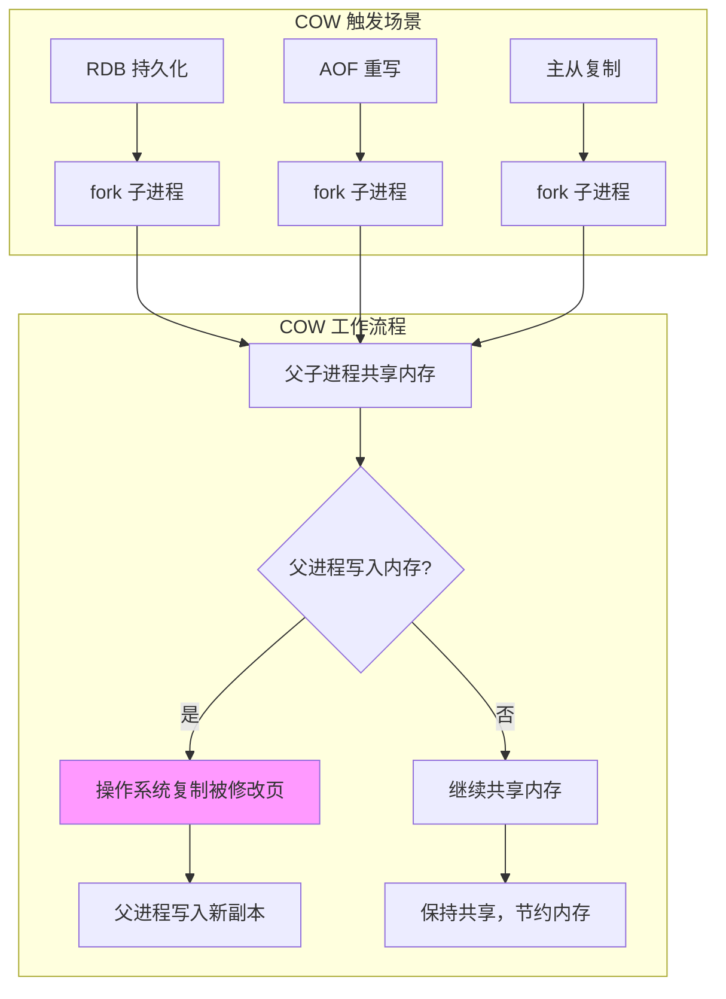
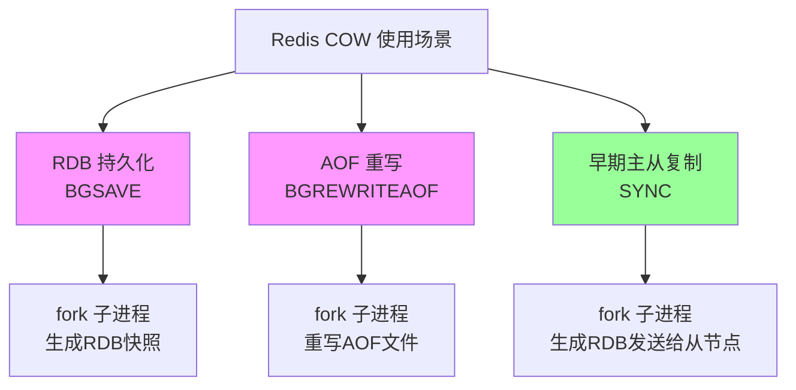
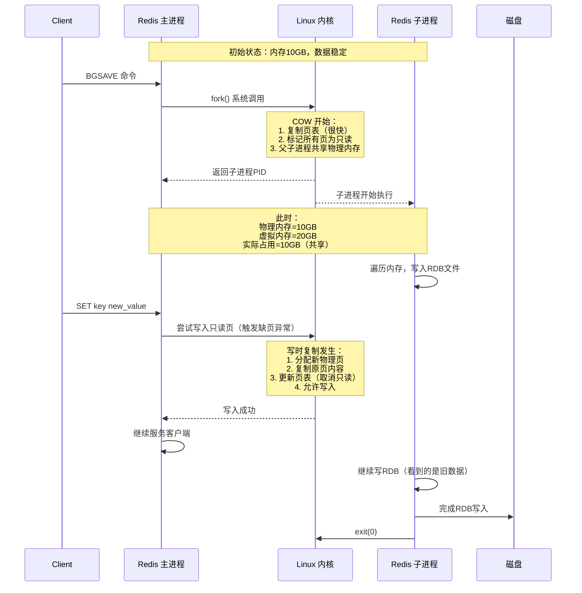

## COW 核心概念

### 什么是 Copy-on-Write？

写时复制（Copy-on-Write，COW） 是一种延迟复制的优化技术：只有在真正需要写入时，才复制被修改的数据。

### Redis 中的 COW 应用场景

```shell
# Redis 在以下场景使用 COW：
1. RDB 持久化（BGSAVE）     # 最典型场景
2. AOF 重写（BGREWRITEAOF）
3. 主从复制（SYNC/PSYNC）   # 早期版本
4. 模块持久化
```



### COW 工作原理详解

#### 传统复制 vs COW 复制

**传统复制: 立即复制**

```shell
// 传统方式:fork 时立即复制所有内存
pid_t fork_with_copy() {
    // 1. 分配新内存空间
    void *child_mem = malloc(parent_mem_size);
    
    // 2. 复制父进程所有内存 ← 耗时操作！
    memcpy(child_mem, parent_mem, parent_mem_size);
    
    // 3. 创建新进程
    return create_process(child_mem);
}
```

问题：复制 10GB 内存需要数秒，Redis 完全阻塞！

**COW 复制（延迟复制）**

```shell
// COW 方式：fork 时只复制页表
pid_t fork_with_cow() {
    // 1. 只复制页表（内存映射关系）
    //    页表很小，复制很快（毫秒级）
    PageTable *child_pt = copy_page_table(parent_pt);
    
    // 2. 父子进程指向相同的物理内存
    child_pt.entries = parent_pt.entries;  // 共享！
    
    // 3. 标记所有页为只读
    mark_all_pages_readonly(child_pt);
    mark_all_pages_readonly(parent_pt);
    
    return create_process_with_pt(child_pt);
}
```

####  Linux 内存管理基础

虚拟内存与物理内存:
```shell
// Linux 内存管理简化模型
进程视角（虚拟内存）：
+----------------+
| 代码段         |  → 物理内存地址 X
| 数据段         |  → 物理内存地址 Y
| 堆            |  → 物理内存地址 Z
| 栈            |  → 物理内存地址 W
+----------------+

实际物理内存：
+----------------+
| 进程A数据      | ← 地址 Y
| 进程B代码      |
| 共享库         |
| 内核空间       |
+----------------+

// 页表：虚拟地址 → 物理地址的映射
typedef struct PageTableEntry {
    uint64_t physical_addr;  // 物理地址
    bool present;            // 是否在内存中
    bool readonly;           // 是否只读
    bool dirty;              // 是否被修改
    // ... 其他标志位
} PTE;
```

#### fork() 系统调用的 COW 实现

```c++
// Linux 内核中的 fork 实现（简化）
pid_t sys_fork(void) {
    // 1. 创建子进程的进程描述符
    struct task_struct *child = copy_process();
    
    // 2. 复制内存描述符（mm_struct）
    child->mm = copy_mm(current->mm);
    
    // 3. 关键：复制页表，但共享物理页
    for (每个虚拟内存区域 vma) {
        // 复制页表条目
        copy_page_range(child->mm, current->mm, vma);
        
        // 设置 COW 标志
        for (每个页表条目 pte) {
            if (pte 是用户可写页) {
                // 标记为只读
                pte = pte_wrprotect(pte);
                // 设置 COW 标志
                pte = pte_mkCOW(pte);
            }
        }
    }
    
    // 4. 刷新 TLB（转换检测缓冲区）
    flush_tlb_all();
    
    return child->pid;
}
```

在这里可以看到，调用fork真正复制的是页表，并没有完全复制数据，而是父进程和子进程共享数据;


### 内存使用峰值问题

最坏情况内存使用：

```shell
# 假设 Redis 使用 10GB 内存
# 执行 BGSAVE 时：

1. fork 瞬间：内存使用 ≈ 10GB（共享）
2. 主进程写入 50% 数据：内存使用 ≈ 15GB
3. 主进程写入 100% 数据：内存使用 ≈ 20GB（翻倍！）

# 公式：
最大内存使用 = 原始内存 + 修改的内存
```
内存溢出（OOM）风险:

```shell
# 监控命令
redis-cli info memory
# 关键指标：
used_memory:10000000000      # 10GB，Redis 视角
used_memory_rss:15000000000  # 15GB，系统视角（包含COW副本）

# OOM 触发条件：
if (used_memory_rss > system_available_memory) {
    // Linux OOM Killer 可能杀死 Redis！
}
```
### COW 在不同场景下的表现

#### 场景 1：只读工作负载

```shell
# 最佳情况：BGSAVE 期间只有读操作
# 内存使用：几乎不变
# 性能影响：最小

# 监控示例：
redis-cli> INFO memory
used_memory:10737418240      # 10GB
used_memory_rss:10747904000  # 几乎相同
```

#### 场景 2：均匀写入工作负载

```shell
# 典型情况：均匀写入所有数据
# 内存增长：线性增长，最多翻倍
# 性能影响：中等，有 page fault 开销

# 写入 25% 数据后的内存：
used_memory_rss ≈ 12.5GB  # 增长 25%
```

#### 场景 3：热点写入工作负载

```shell
# 最坏情况：频繁写入少数热点 key
# 内存增长：可能很快达到峰值
# 性能影响：大量 page fault，延迟增加

# 示例：频繁更新计数器
while true; do
    redis-cli INCR counter
    sleep 0.001
done
# 同一页被反复复制，性能下降明显
```

导致Redis进程发生OOM被杀掉；

### **COW 的核心要点**

1. **延迟复制**：只有在写入时才复制数据，节约内存和 CPU
2. **页级粒度**：以内存页（通常 4KB）为单位复制
3. **透明性**：对应用程序完全透明，无需修改代码

### **Redis COW 的影响**

- **优点**：使得 BGSAVE/AOF 重写几乎不影响服务
- **缺点**：可能引起内存翻倍、fork 延迟、性能抖动

### **生产建议**

1. **预留内存**：为 COW 预留 50-100% 额外内存
2. **监控 fork 时间**：超过 1 秒需要告警
3. **避免高峰期持久化**：在业务低峰期执行备份
4. **考虑分片**：大内存实例使用 Redis Cluster
5. **优化写入模式**：避免持久化期间大量写入

## Redis 使用 COW 的三个核心场景




### RDB 持久化中的 COW

RDB + COW 完整流程:



这里注意，redis主进程收到bgsave命令后，调用fork然后生成一个子进程，这个子进程就是要做生成rdb文件的操作，但是这里子进程并没有立刻复制一份父进程的数据，而是只复制页表数据，然后父子进程共享物理数据块，此时父子进程如果读数据没问题，但是如果父进程写数据，那父进程就会立刻复制一份数据，然后再复制的数据上进行写操作，此时写操作是在新的数据块，对子进程是不可见的；


要素1：什么时候会"写"？

哪些关键规则会导致复制数据：

- ✅ 会触发COW：父进程的写操作（SET、INCR、DEL等）

- ❌ 不会触发COW：父进程的读操作（GET、LRANGE等）

- ❌ 不会触发COW：子进程的任何操作（子进程只读不写）

要素2：什么时候会"复制"？

复制时机：

1. 不是fork时复制：fork时只复制页表，很快（毫秒级） 
2. 不是子进程工作时复制：子进程只是读，不触发复制 
3. 是父进程写入时立即复制：写的那一刻，实时复制被修改的页

要素3：如何复制？

以内存页为单位，复制整个页（通常是4KB）

```shell
# 内存布局示例（简化）
# 假设一页=4KB，Redis数据分布在多个页

内存页布局:
页1: [counter:100] [user:1:Alice] [空位...]  ← 4KB
页2: [product:101:iPhone] [空位...]          ← 4KB
页3: [list:items...]                         ← 4KB
...

# 场景：修改counter从100到101
# counter在页1，页1还有user:1数据

# COW复制过程：
1. 父进程写counter：*0x1234 = 101
2. 内核发现页1是COW页
3. 复制整个页1（4KB！）
4. 新页1'：[counter:101] [user:1:Alice] [空位...]
5. 父进程页表指向页1'
6. 子进程页表仍然指向页1（旧数据）
```

复制单位是页，不是key！

✅ 修改一个key，可能复制整个4KB页

✅ 页内其他key也被复制（浪费空间）

✅ 但这是操作系统的设计，Redis控制不了


### AOF 重写

**BGREWRITEAOF 完整流程**

```java
// aof.c - AOF 重写入口
int rewriteAppendOnlyFileBackground(void) {
    pid_t childpid;
    long long start;
    
    // 1. 检查条件
    if (server.aof_child_pid != -1 || server.rdb_child_pid != -1)
        return C_ERR;
    
    // 2. 创建管道用于父子进程通信
    if (aofCreatePipes() != C_OK) return C_ERR;
    
    // 3. 记录开始时间
    start = ustime();
    
    // 4. ⚡ 关键：fork 子进程
    if ((childpid = fork()) == 0) {
        // 🌟 子进程
        char tmpfile[256];
        
        // 4.1 关闭监听 socket
        closeListeningSockets(0);
        
        // 4.2 设置进程标题
        redisSetProcTitle("redis-aof-rewrite");
        
        // 4.3 生成临时文件名
        snprintf(tmpfile, 256, "temp-rewriteaof-bg-%d.aof", (int)getpid());
        
        // 4.4 ⭐ 执行 AOF 重写（读取共享内存）
        if (rewriteAppendOnlyFile(tmpfile) == C_OK) {
            // 4.5 通过管道发送完成信号
            sendChildCowInfo(CHILD_INFO_TYPE_AOF, "OK");
            exitFromChild(0);
        } else {
            exitFromChild(1);
        }
        
    } else if (childpid > 0) {
        // 🌟 父进程
        server.aof_child_pid = childpid;
        server.aof_rewrite_time_start = time(NULL);
        
        // 4.6 更新统计
        server.stat_fork_time = ustime() - start;
        
        // 4.7 ⚡ 关键：设置 AOF 重写缓冲区
        server.aof_rewrite_buf_blocks = listCreate();
        server.aof_rewrite_buf_len = 0;
        
        // 4.8 调整内存策略
        updateDictResizePolicy();
        
        return C_OK;
    } else {
        // fork 失败
        return C_ERR;
    }
}
```

**AOF 重写的 COW 特殊性**

```java
// 与 RDB 不同，AOF 重写期间父进程的写入需要特殊处理

void feedAppendOnlyFile(robj **argv, int argc) {
    // 1. 正常写入当前 AOF 文件
    if (server.aof_state == AOF_ON) {
        // 将命令转换为 AOF 格式并写入
        writeCommandsToAof(argv, argc);
    }
    
    // 2. ⭐ 关键：如果正在 AOF 重写，同时写入重写缓冲区
    if (server.aof_child_pid != -1) {
        // 这个缓冲区用于收集重写期间的新命令
        aofRewriteBufferAppend(argv, argc);
    }
}

// 重写缓冲区结构
typedef struct aofRewriteBufferItem {
    unsigned char *buf;      // 缓冲区数据
    size_t len;              // 数据长度
    listNode *ln;            // 链表节点
} aofRewriteBufferItem;

// 当子进程完成重写后...
void backgroundRewriteDoneHandler(int exitcode, int bysignal) {
    // 1. 子进程完成新 AOF 文件
    // 2. 父进程将重写缓冲区的内容追加到新文件
    // 3. 原子替换旧 AOF 文件
    
    // ⚡ 这里的关键：重写期间的新命令不会丢失！
    // 因为它们被记录在缓冲区，最后追加
}
```
AOF 重写 vs RDB 的 COW 差异:

| 特性           | **RDB BGSAVE**           | **AOF BGREWRITEAOF**      |
| :------------- | :----------------------- | :------------------------ |
| **子进程读取** | 读取内存生成二进制 RDB   | 读取内存生成 AOF 命令     |
| **父进程写入** | 直接修改，触发 COW       | 写入当前 AOF + 重写缓冲区 |
| **数据一致性** | 子进程看到 fork 瞬间快照 | 子进程看到 fork 瞬间快照  |
| **额外内存**   | 重写缓冲区（用于新命令） | 重写缓冲区（用于新命令）  |
| **最终文件**   | 独立的 RDB 文件          | 替换旧的 AOF 文件         |


### 早期主从复制（Redis 2.8 之前）

SYNC 命令的 COW 使用:

```java
// replication.c - 旧版全量同步
void syncCommand(client *c) {
    // 1. 检查是否可以同步
    if (server.rdb_child_pid != -1) {
        // 已经有 RDB 子进程在运行
        addReplyError(c, "Already syncing with another slave");
        return;
    }
    
    // 2. ⚡ fork 子进程生成 RDB
    if (rdbSaveBackground(server.rdb_filename) != C_OK) {
        addReplyError(c, "Unable to perform background save");
        return;
    }
    
    // 3. 记录从节点信息
    server.slaveseldb = -1;
    
    // 4. 将 RDB 文件发送给从节点
    // ... 后续处理
}
```

为什么现在少用？
Redis 2.8 引入 PSYNC（部分重同步）：

```java
// 新版 PSYNC 机制
void syncCommand(client *c) {
    // 1. 尝试部分重同步
    if (!strcasecmp(c->argv[0]->ptr, "psync")) {
        if (masterTryPartialResynchronization(c) == C_OK) {
            // 部分同步成功，不需要全量 RDB
            return;
        }
    }
    
    // 2. 回退到全量同步（仍然需要 COW）
    server.repl_state = REPL_STATE_TRANSFER;
    
    // 3. fork 子进程生成 RDB（使用 COW）
    if (rdbSaveBackground(server.rdb_filename) == C_OK) {
        // 等待 RDB 完成，然后发送
        // ...
    }
}
```

PSYNC 的优势：

1. 避免全量 RDB 传输 
2. 减少 COW 内存压力 
3. 网络传输量更小 
4. 恢复更快

## 总结：Redis COW 的关键要点

### **Redis 使用 COW 的三个地方**：

1. **RDB 持久化（BGSAVE）**：最典型，fork 子进程生成快照
2. **AOF 重写（BGREWRITEAOF）**：类似 RDB，但生成 AOF 格式
3. **早期主从复制（SYNC）**：已逐步被 PSYNC 替代

### **COW 的核心细节**：

1. **fork 时**：只复制页表，共享物理内存（很快）
2. **写入时**：触发缺页异常，复制被修改的页（4KB 单位）
3. **子进程**：始终看到 fork 瞬间的数据（一致性）
4. **父进程**：修改后使用自己的副本，不影响子进程

### **生产注意事项**：

1. **预留内存**：COW 可能导致内存翻倍
2. **监控 fork 时间**：大内存实例 fork 可能很慢
3. **避免 THP**：透明大页会让 fork 更慢
4. **减少持久化期间的写入**：减少 COW 次数和内存增长
5. **考虑在从节点持久化**：减轻主节点压力