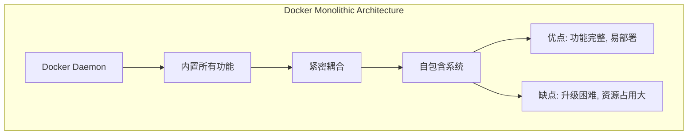
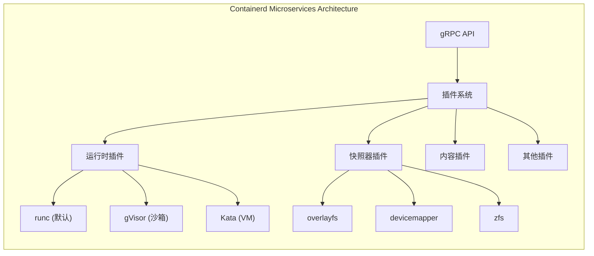
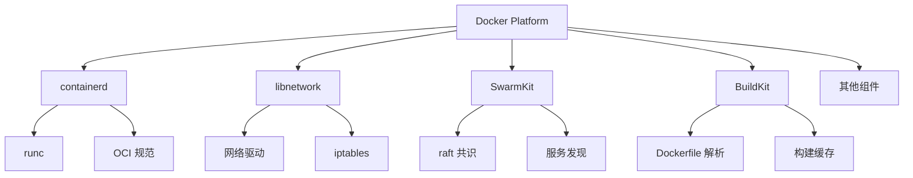
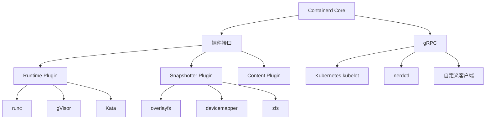

# **Docker 运行时 vs Containerd 运行时：详细对比分析**

## **一、架构层面深度对比**

### **1.1 Docker 架构（传统模式）**

```shell
┌─────────────────────────────────────────┐
│            Docker Client                │
│              (docker CLI)               │
└─────────────────┬───────────────────────┘
                  │ REST API
┌─────────────────▼───────────────────────┐
│           Docker Daemon (dockerd)       │
│  ┌───────────────────────────────────┐  │
│  │  containerd (作为插件)            │  │
│  │  ┌─────────────────────────────┐ │  │
│  │  │   containerd-shim           │ │  │
│  │  │   ┌─────────────────────┐   │ │  │
│  │  │   │       runc          │   │ │  │
│  │  │   └─────────────────────┘   │ │  │
│  │  └─────────────────────────────┘ │  │
│  └───────────────────────────────────┘  │
│                                          │
│  ┌───────────────────────────────────┐  │
│  │    Docker 特有组件                │  │
│  │  • libnetwork (网络)             │  │
│  │  • Swarmkit (编排)               │  │
│  │  • BuildKit (构建)              │  │
│  │  • 插件系统                      │  │
│  │  • 镜像管理                      │  │
│  └───────────────────────────────────┘  │
└─────────────────────────────────────────┘
```

>  **Docker：一体化容器平台**,一个**完整的容器化平台**，提供从构建、分发到运行的全套工具链。

下面是docker提供的完整工具栈:

```shell
# Docker 提供的完整功能栈
功能层次:
  应用层:
    - Docker Compose: 多容器编排
    - Docker Swarm: 集群管理
    - Docker Desktop: 桌面环境
    - Docker Hub: 镜像仓库
  
  运行时层:
    - 容器生命周期管理
    - 网络管理 (libnetwork)
    - 存储管理 (卷驱动)
    - 日志和监控
    
  构建层:
    - Dockerfile 构建系统
    - 镜像构建优化
    - 多层缓存机制
    
  安全层:
    - 内容信任 (DCT)
    - 安全扫描
    - 访问控制
```

docker ：**Monolithic Architecture（单体架构）**



**问题**：

1. **单点故障**：一个组件崩溃影响整个系统
2. **升级困难**：需要升级整个 Docker 引擎
3. **资源浪费**：即使只用部分功能也要运行全部组件
4. **安全性**：攻击面大，权限过高

> docekr的接口设计是**RESTful API（面向用户）**
>
> 1. 人类可读（JSON over HTTP）
> 2. 面向终端用户设计
> 3. 包含高级抽象概念
> 4.  包含业务逻辑
>
> containerd的接口设计**Containerd：gRPC API（面向系统）**
>
> 1. 强类型接口（.proto 文件定义）
> 2. 二进制协议（高效）
> 3. 流式传输支持
> 4. 多语言支持

### **1.2 Containerd 架构（独立运行时）**

```shell
┌─────────────────────────────────────────┐
│        各种客户端工具                   │
│  ┌────────┬───────┬────────┬────────┐  │
│  │docker  │nerdctl│  ctr   │kubelet │  │
│  │  CLI   │       │        │        │  │
│  └────────┴───────┴────────┴────────┘  │
└─────────────────┬───────────────────────┘
                  │ gRPC API
┌─────────────────▼───────────────────────┐
│           containerd 守护进程            │
│  ┌───────────────────────────────────┐  │
│  │           Services                │  │
│  │  • Containers  (容器管理)        │  │
│  │  • Images     (镜像管理)         │  │
│  │  • Tasks      (任务管理)         │  │
│  │  • Namespaces (命名空间)         │  │
│  │  • Snapshots  (快照)             │  │
│  │  • Content    (内容存储)         │  │
│  │  • Events     (事件)             │  │
│  └───────────────────────────────────┘  │
│                                          │
│  ┌───────────────────────────────────┐  │
│  │           Plugins                 │  │
│  │  • Runtime   (运行时插件)         │  │
│  │  • Snapshotter(快照插件)          │  │
│  │  • Diff      (差异插件)           │  │
│  │  • Monitoring(监控插件)           │  │
│  │  • ...                            │  │
│  └───────────────────────────────────┘  │
└─────────────────┬───────────────────────┘
                  │
┌─────────────────▼───────────────────────┐
│            Runtimes                      │
│  ┌─────────┬────────┬────────┬──────┐   │
│  │  runc   │ runsc  │ kata   │ ...  │   │
│  │ (默认)  │(gVisor)│(VM)    │      │   │
│  └─────────┴────────┴────────┴──────┘   │
└─────────────────────────────────────────┘
```

> **Containerd：专注的容器运行时**,一个**专注于容器生命周期的核心运行时**，遵循 Unix 哲学中的"单一职责原则"。

containerd的核心职责:

```shell
# Containerd 的专注领域
核心职责:
  容器管理:
    - 创建/启动/停止/删除容器
    - 容器状态管理
    
  镜像管理:
    - 拉取/推送 OCI 镜像
    - 镜像存储管理
    
  运行时接口:
    - 提供标准的 CRI 接口
    - 支持多种 OCI 运行时
    
  插件架构:
    - 快照器插件 (存储)
    - 运行时插件 (执行)
    - 内容插件 (镜像)
```

**Containerd：Microservices Architecture（微服务架构）**:



**优势**：

1. **模块化**：每个组件独立，可单独升级
2. **可扩展**：轻松添加新功能插件
3. **高可用**：组件故障不影响其他功能
4. **安全性**：最小权限原则，攻击面小

### **1.3、抽象层次的根本不同**

#### **Docker：高级抽象（用户友好）**

```shell
┌─────────────────────────────────────────┐
│           User Experience Layer         │  ← Docker 的重点
│  • Docker CLI (用户友好的命令)          │
│  • Docker Compose (应用描述)            │
│  • Dockerfile (构建描述)                │
├─────────────────────────────────────────┤
│           Orchestration Layer           │
│  • Docker Swarm (内置编排)              │
│  • 服务发现、负载均衡                   │
├─────────────────────────────────────────┤
│           Container Runtime Layer       │
│  • containerd (内嵌)                    │  ← Containerd 的领域
│  • runc (实际执行)                      │
└─────────────────────────────────────────┘
```

**Docker 提供了哪些高级抽象**：

1. 网络抽象:`docker network create mynet`,实际上做了:

- 创建网桥
- 配置 iptables
- 设置 DNS
- 配置路由

2. 存储抽象 `docker volume create myvol`,实际上做了:

- 创建存储目录
- 设置权限
- 配置挂载点

3. 服务抽象`docker service create --replicas 3 nginx`实际上做了:

- 创建多个容器
- 配置负载均衡
- 健康检查
- 滚动更新

#### **Containerd：低级抽象（系统友好）**

```shell
┌─────────────────────────────────────────┐
│           System Integration Layer      │  ← 系统集成的接口
│  • CRI (Kubernetes 接口)                │
│  • OCI Runtime Spec                     │
│  • gRPC API                             │
├─────────────────────────────────────────┤
│           Container Core Layer          │  ← Containerd 的核心
│  • 容器生命周期管理                     │
│  • 镜像管理                             │
│  • 命名空间管理                         │
├─────────────────────────────────────────┤
│           Plugin Interface Layer        │
│  • 运行时插件 (runc, gVisor, Kata)      │
│  • 快照器插件 (overlayfs, devicemapper) │
│  • 内容插件                             │
└─────────────────────────────────────────┘
```

**Containerd 的核心抽象**：

1. 容器抽象（最小化）容器定义:

- ID: 唯一标识符
- Image: OCI 镜像引用
- Spec: OCI 运行时规范
- SnapshotKey: 快照引用

2. 任务抽象（执行单元）任务定义:

- ContainerID: 关联的容器
- Pid: 进程 ID
- Status: 运行状态
- Stdin/Stdout/Stderr: 标准流

3. 快照抽象（存储）快照定义:

- Key: 快照键
- Parent: 父快照
- Kind: 快照类型（active, committed, view）

### **1.4、依赖关系的本质区别**

#### **Docker：垂直集成（全栈依赖）**



**Docker 的依赖链问题**：

```bash
# 升级 Docker 时要考虑的所有依赖
升级 Docker 20.10 → 23.0 需要:
1. containerd: 1.4 → 1.6 ✓
2. runc: 1.0 → 1.1 ✓
3. libnetwork: ? → ? 可能不兼容
4. SwarmKit: ? → ? 可能不兼容
5. 插件系统: ? → ? 可能不兼容
6. BuildKit: ? → ? 可能不兼容
# 所有组件必须一起升级！
```

#### **Containerd：水平解耦（最小依赖）**



**Containerd 的依赖优势**：

```bash
# 独立升级各组件
升级 containerd 1.6 → 1.7:
1. 停止 containerd 服务
2. 替换 containerd 二进制文件
3. 重启服务
4. 完成！

# 其他组件可以独立升级:
# - runc: 独立升级
# - CNI 插件: 独立升级  
# - CSI 驱动: 独立升级
# - 监控插件: 独立升级
```


## **二、核心组件详细对比**

### **2.1 组件矩阵对比**

| 组件           | Docker 运行时                 | Containerd 运行时 | 差异说明                |
| :------------- | :---------------------------- | :---------------- | :---------------------- |
| **守护进程**   | `dockerd` (Go)                | `containerd` (Go) | Docker 更重量级         |
| **API 协议**   | REST API (HTTP/HTTPS)         | gRPC API          | gRPC 性能更好           |
| **客户端工具** | `docker` CLI                  | `ctr`, `nerdctl`  | nerdctl 类似 Docker CLI |
| **容器运行时** | containerd (内嵌)             | containerd (独立) | 相同技术栈              |
| **低级运行时** | `runc` (OCI)                  | `runc` (OCI)      | 相同                    |
| **网络管理**   | `libnetwork`                  | CNI 插件          | Docker 网络更丰富       |
| **存储驱动**   | 多种 (overlay2, devicemapper) | 插件式快照器      | 概念相似，实现不同      |
| **镜像格式**   | Docker 镜像                   | OCI 镜像          | 兼容但格式不同          |

### **2.2 网络栈对比**

```shell
# Docker 网络（libnetwork）
# 提供完整的网络生态系统
docker network ls
# bridge, host, none, overlay (Swarm), macvlan, ipvlan

# Containerd 网络（CNI）
# 依赖外部 CNI 插件
nerdctl network ls
# 需要手动安装 CNI 插件，网络功能通过插件提供

# Docker 网络特性更丰富：
# 1. 内置的 overlay 网络（Swarm 模式）
# 2. 内置的 DNS 服务发现
# 3. 网络别名（--network-alias）
# 4. 更完善的网络隔离
```

### **2.3 存储系统对比**

```shell
# Docker 存储驱动
docker info | grep "Storage Driver"
# overlay2, aufs, devicemapper, btrfs, zfs

# Containerd 快照器
sudo ctr plugin ls | grep snapshotter
# overlayfs, native, devmapper, zfs, btrfs

# 关键差异：
# 1. Docker: 存储驱动 + 卷驱动
# 2. Containerd: 快照器插件 + 卷插件
# 3. Docker 的卷管理更成熟
# 4. Containerd 的插件架构更灵活
```

## **三、性能对比分析**

### **3.1 启动性能测试**

```
# 测试脚本：比较容器启动时间
#!/bin/bash
echo "=== 容器启动性能测试 ==="

# 使用 Docker
echo "1. Docker 启动测试..."
time for i in {1..10}; do
    docker run --rm alpine echo "Docker test $i" >/dev/null
done

# 使用 Containerd + nerdctl
echo -e "\n2. Containerd 启动测试..."
export CONTAINERD_NAMESPACE=moby
time for i in {1..10}; do
    nerdctl run --rm alpine echo "Containerd test $i" >/dev/null
done

# 结果通常显示：
# Docker: 1.5-2.0秒/容器（包含完整栈）
# Containerd: 1.0-1.5秒/容器（更轻量）
```


### **3.2 内存占用对比**

bash

```
# 查看进程内存占用
ps aux | grep -E "(dockerd|containerd)" | grep -v grep

# 典型结果：
# Docker 架构：
# dockerd: ~150-300 MB
# containerd: ~50-100 MB（作为子进程）
# 总计：200-400 MB

# Containerd 独立架构：
# containerd: ~80-150 MB
# 总计：80-150 MB（节省 40-60% 内存）
```


### **3.3 资源消耗矩阵**

| 资源类型     | Docker           | Containerd       | 优势方        |
| :----------- | :--------------- | :--------------- | :------------ |
| **内存占用** | 200-400 MB       | 80-150 MB        | ✅ Containerd  |
| **CPU 使用** | 较高（多组件）   | 较低（单一进程） | ✅ Containerd  |
| **启动时间** | 较慢（完整栈）   | 较快（轻量）     | ✅ Containerd  |
| **磁盘 I/O** | 较高（多层抽象） | 较低（直接访问） | ✅ Containerd  |
| **网络吞吐** | 优秀（优化多年） | 良好（依赖 CNI） | ⚠️ Docker 略优 |

## **四、功能特性详细对比**

### **4.1 容器管理功能**

```shell
# Docker 特有功能：
# 1. Docker Swarm 集群管理
docker swarm init
docker service create --replicas 3 nginx

# 2. Docker Compose 编排
docker-compose up -d

# 3. Docker Build（内置构建）
docker build -t myapp .

# 4. Docker 插件系统
docker plugin install vieux/sshfs

# 5. Docker 内容信任（DCT）
docker trust sign myimage:latest

# Containerd 缺失的功能：
# 1. 无内置集群编排
# 2. 无内置服务发现
# 3. 无内置镜像构建
# 4. 网络功能依赖 CNI
# 5. 无 GUI 管理工具
```

### **4.2 镜像管理对比**

```shell
# Docker 镜像管理（丰富）
功能:
  - 镜像构建 (docker build)
  - 镜像扫描 (docker scan)
  - 镜像签名 (docker trust)
  - 镜像保存/加载 (docker save/load)
  - 镜像导入/导出 (docker import/export)
  - 多架构镜像 (docker manifest)
  - 镜像修剪 (docker image prune)

# Containerd 镜像管理（基础）
功能:
  - 镜像拉取/推送 (ctr images pull/push)
  - 镜像标签 (ctr images tag)
  - 镜像删除 (ctr images rm)
  - 镜像列表 (ctr images ls)
  - OCI 镜像支持
  # 需要外部工具完成高级功能
```

### **4.3 安全特性对比**

```shell
# Docker 安全特性：
# 1. AppArmor 配置文件
docker run --security-opt apparmor=docker-default

# 2. SELinux 标签
docker run --security-opt label=type:container_t

# 3. Seccomp 配置文件
docker run --security-opt seccomp=default.json

# 4. 用户命名空间
docker run --userns=host|remap

# 5. 内容信任
export DOCKER_CONTENT_TRUST=1

# Containerd 安全特性：
# 1. 支持所有 OCI 安全特性
# 2. 通过 CRI 插件支持 Pod 安全上下文
# 3. 支持用户命名空间（需要配置）
# 4. 支持 seccomp（需要配置文件）
# 5. 更细粒度的权限控制
```

## **五、使用场景对比**

### **5.1 适合 Docker 的场景**

```yaml
场景1: 开发和测试环境
  原因:
    - 完整的工具链
    - Docker Compose 快速编排
    - 丰富的社区镜像
    - 易用的 GUI 工具 (Docker Desktop)

场景2: 单机部署
  原因:
    - 一站式解决方案
    - 内置网络和存储
    - 简单的监控和日志
    - 成熟的生态系统

场景3: 传统应用迁移
  原因:
    - 兼容性好
    - 迁移工具丰富
    - 企业级支持
    - 完善的文档

场景4: 中小型企业
  原因:
    - 管理简单
    - 学习成本低
    - 社区支持好
    - 成本可控
```

### **5.2 适合 Containerd 的场景**

```yaml
场景1: Kubernetes 生产环境
  原因:
    - Kubernetes 官方推荐
    - 性能更好
    - 资源占用少
    - 稳定性更高

场景2: 大规模容器部署
  原因:
    - 轻量级设计
    - 可扩展性好
    - 与云原生生态集成
    - 更适合自动化

场景3: 嵌入式/IoT 设备
  原因:
    - 资源占用极小
    - 可定制性强
    - 启动速度快
    - 适合资源受限环境

场景4: 需要多运行时环境
  原因:
    - 插件化架构
    - 支持 runc, gVisor, Kata 等
    - 灵活的运行时选择
    - 安全沙箱需求
```

## **六、配置和管理对比**

### **6.1 配置文件对比**

```toml
# Docker 配置 (/etc/docker/daemon.json)
{
  "exec-opts": ["native.cgroupdriver=systemd"],
  "log-driver": "json-file",
  "log-opts": {
    "max-size": "100m",
    "max-file": "3"
  },
  "storage-driver": "overlay2",
  "storage-opts": [
    "overlay2.override_kernel_check=true"
  ],
  "live-restore": true,
  "default-ulimits": {
    "nofile": {
      "name": "nofile",
      "hard": 65536,
      "soft": 65536
    }
  },
  "registry-mirrors": [
    "https://docker.mirrors.ustc.edu.cn"
  ]
}

# Containerd 配置 (/etc/containerd/config.toml)
version = 2
root = "/var/lib/containerd"
state = "/run/containerd"

[plugins]
  [plugins."io.containerd.grpc.v1.cri"]
    sandbox_image = "registry.k8s.io/pause:3.9"
    
    [plugins."io.containerd.grpc.v1.cri".containerd]
      default_runtime_name = "runc"
      snapshotter = "overlayfs"
      
      [plugins."io.containerd.grpc.v1.cri".containerd.runtimes.runc]
        runtime_type = "io.containerd.runc.v2"
        [plugins."io.containerd.grpc.v1.cri".containerd.runtimes.runc.options]
          SystemdCgroup = true
          
  [plugins."io.containerd.grpc.v1.cri".registry]
    [plugins."io.containerd.grpc.v1.cri".registry.mirrors]
      [plugins."io.containerd.grpc.v1.cri".registry.mirrors."docker.io"]
        endpoint = ["https://registry-1.docker.io"]
```

### **6.2 监控和日志对比**

```bash
# Docker 监控（内置丰富）
docker stats                  # 实时资源监控
docker events                 # 容器事件
docker logs                   # 容器日志
docker inspect                # 容器详情
docker top                    # 容器进程

# 第三方集成：
# - cAdvisor
# - Prometheus (docker_exporter)
# - ELK Stack

# Containerd 监控（需要工具）
# 1. 内置 metrics 端点
curl http://localhost:1338/metrics

# 2. 使用 ctr 查看
sudo ctr containers list
sudo ctr tasks list

# 3. 使用 nerdctl（类似 Docker）
nerdctl stats
nerdctl logs

# 4. CRI 工具
crictl ps
crictl logs

# 5. 需要更多第三方工具集成
```

### **6.3 备份和迁移**

```bash
# Docker 备份（工具丰富）
# 容器备份
docker export -o container.tar mycontainer
docker import container.tar myimage:backup

# 卷备份
docker run --rm -v myvolume:/data -v $(pwd):/backup \
  alpine tar czf /backup/myvolume.tar.gz -C /data .

# 完整备份
docker save -o all-images.tar $(docker images -q)

# Containerd 备份（更底层）
# 镜像备份
sudo ctr images export images.tar docker.io/library/nginx:latest

# 容器检查点（实验性）
sudo ctr checkpoint create mycontainer checkpoint1

# 需要手动备份目录：
# /var/lib/containerd/
# /etc/containerd/
# /run/containerd/
```

## **七、生态系统和兼容性**

### **7.1 工具链兼容性**

```yaml
# 兼容 Docker 的工具：
- Docker Compose: ✅ 完全兼容（通过 docker.sock）
- Portainer: ✅ 完全兼容
- Rancher: ✅ 完全兼容
- Traefik: ✅ 完全兼容
- Jenkins: ✅ 完全兼容
- GitLab CI: ✅ 完全兼容
- 大多数 DevOps 工具

# 需要适配的工具：
- 某些监控工具：需要调整配置
- 网络工具：从 libnetwork 切换到 CNI
- 存储工具：从 volume driver 切换到 CSI
- 安全工具：可能需要调整策略

Docker：终端用户产品,更多是面向开发，运维人员:
Docker 的定位:
  目标用户: 开发者和运维人员
  使用场景:
    - 本地开发环境
    - CI/CD 流水线
    - 小型部署
    - 原型验证
    
  商业模式:
    - Docker Desktop (商业版)
    - Docker Hub (高级功能)
    - 企业支持
    
  生态系统:
    - 围绕 Docker 构建的工具链
    - Docker Certified 认证
    - 培训和教育资源
```

### **7.2 Kubernetes 集成**

```bash
# Docker 作为 Kubernetes 运行时（已弃用）
# Kubernetes 1.20 之前：
# kubelet → dockershim → dockerd → containerd → runc
# 问题：多层抽象，性能损失，维护复杂

# Containerd 作为 Kubernetes 运行时（推荐）
# Kubernetes 1.20+：
# kubelet → CRI plugin → containerd → runc
# 优势：更简单，更高效，更稳定

# 检查 Kubernetes 节点运行时
kubectl get nodes -o wide
kubectl describe node <node-name> | grep -i runtime
# 期望输出：containerRuntimeVersion: containerd://1.6.8

Containerd：基础设施组件;

Containerd 的定位:
  目标用户: 系统集成商和平台开发者
  使用场景:
    - Kubernetes 运行时
    - 云平台基础设施
    - 容器即服务 (CaaS)
    - 边缘计算平台
    
  商业模式:
    - CNCF 托管项目 (开源)
    - 社区驱动
    - 厂商支持 (通过发行版)
    
  生态系统:
    - 云原生计算基金会 (CNCF) 项目
    - 与 Kubernetes 深度集成
    - 作为其他平台的基础组件
```

### **7.3 社区和支持**

| 方面           | Docker                 | Containerd          |
| :------------- | :--------------------- | :------------------ |
| **公司支持**   | Docker Inc. (Mirantis) | CNCF (云原生基金会) |
| **开源协议**   | Apache 2.0             | Apache 2.0          |
| **社区活跃度** | ⭐⭐⭐⭐⭐                  | ⭐⭐⭐⭐                |
| **文档质量**   | ⭐⭐⭐⭐⭐                  | ⭐⭐⭐                 |
| **学习资源**   | ⭐⭐⭐⭐⭐                  | ⭐⭐⭐                 |
| **企业采用**   | ⭐⭐⭐⭐⭐                  | ⭐⭐⭐⭐（增长中）      |
| **云厂商支持** | 所有主要云厂商         | 所有主要云厂商      |

## **八、迁移方案和挑战**

### **8.1 从 Docker 迁移到 Containerd**

```bash
#!/bin/bash
# migrate-docker-to-containerd.sh

echo "=== Docker 到 Containerd 迁移指南 ==="

# 步骤1：备份 Docker 数据
echo "1. 备份 Docker 数据..."
docker save $(docker images -q) -o docker-images-backup.tar
docker ps -a --format json > docker-containers.json

# 步骤2：安装 containerd
echo "2. 安装 containerd..."
sudo apt-get update
sudo apt-get install -y containerd

# 步骤3：配置 containerd
echo "3. 配置 containerd..."
sudo mkdir -p /etc/containerd
containerd config default | sudo tee /etc/containerd/config.toml

# 步骤4：停止 Docker，启动 containerd
echo "4. 切换服务..."
sudo systemctl stop docker
sudo systemctl disable docker
sudo systemctl enable containerd
sudo systemctl start containerd

# 步骤5：安装 nerdctl（Docker 兼容工具）
echo "5. 安装 nerdctl..."
wget https://github.com/containerd/nerdctl/releases/latest/download/nerdctl-full-linux-amd64.tar.gz
sudo tar Cxzvf /usr/local nerdctl-full-linux-amd64.tar.gz

# 步骤6：导入 Docker 镜像
echo "6. 导入镜像..."
nerdctl load -i docker-images-backup.tar

# 步骤7：重新创建容器
echo "7. 重新创建容器（根据备份）..."
# 需要根据 docker-containers.json 重新创建

echo "迁移完成！使用 'nerdctl' 替代 'docker' 命令"
```

### **8.2 迁移挑战和解决方案**

```yaml
挑战1: 网络配置差异
  Docker: 使用 libnetwork，配置在 docker-compose.yml 或命令行
  Containerd: 使用 CNI，需要单独的配置文件
  
  解决方案:
    - 将 Docker 网络配置转换为 CNI 配置
    - 使用 nerdctl network create 重新创建
    - 对于复杂网络，可能需要调整应用配置

挑战2: 存储卷迁移
  Docker: 使用 volume driver
  Containerd: 使用 CSI 或本地卷
  
  解决方案:
    - 备份 Docker 卷数据
    - 重新挂载到 containerd 容器
    - 对于有状态应用，需要确保数据一致性

挑战3: Docker 特有功能
  Docker Swarm、Docker Content Trust、Docker Build
  
  解决方案:
    - Swarm: 迁移到 Kubernetes 或其他编排工具
    - DCT: 使用其他镜像签名方案（如 Notary）
    - Docker Build: 使用 BuildKit 独立版本或 kaniko

挑战4: 工具链适配
  许多工具直接调用 Docker API
  
  解决方案:
    - 使用 Docker API 兼容层（如 cri-dockerd）
    - 更新工具使用 CRI 接口
    - 使用 nerdctl 作为替代
```

## **九、未来发展趋势**

### **9.1 技术演进方向**

```yaml
Docker 的未来:
  - 专注于开发者体验
  - Docker Desktop 商业化
  - 简化开发工作流
  - 云原生工具集成
  - 安全增强功能

Containerd 的未来:
  - 成为容器运行时标准
  - 更好的 Kubernetes 集成
  - 性能优化
  - 安全沙箱增强
  - 边缘计算支持

共同趋势:
  - 标准化（OCI 标准）
  - 安全性提升
  - 性能优化
  - 多架构支持（ARM、RISC-V）
  - WebAssembly 集成
```

### **9.2 行业采用情况**

```bash
# 2023年容器运行时调查
# 来源：CNCF 年度调查

使用比例:
- Docker: 79% (开发环境), 35% (生产环境)
- Containerd: 46% (生产环境), 快速增长中
- CRI-O: 28% (生产环境)
- 其他: 7%

# 趋势分析：
# 1. 开发环境：Docker 仍占主导（易用性）
# 2. 生产环境：Containerd 快速增长（性能、稳定性）
# 3. Kubernetes 默认转向 Containerd
# 4. 边缘/IoT：Containerd 更受欢迎（轻量）
```

## **十、总结和建议**

### **10.1 对比总结表**

| 维度           | Docker       | Containerd     | 建议         |
| :------------- | :----------- | :------------- | :----------- |
| **架构复杂度** | 高（多组件） | 低（单一进程） | ✅ Containerd |
| **性能**       | 良好         | 优秀           | ✅ Containerd |
| **资源占用**   | 较高         | 较低           | ✅ Containerd |
| **功能完整性** | 完整         | 基础（需插件） | ✅ Docker     |
| **易用性**     | 优秀         | 一般（需学习） | ✅ Docker     |
| **K8s 集成**   | 已弃用       | 官方推荐       | ✅ Containerd |
| **生产就绪**   | 优秀         | 优秀           | ✅ 两者均可   |
| **未来发展**   | 开发者导向   | 云原生标准     | ⚖️ 根据需求   |

### **10.2 选择建议**

#### **选择 Docker 当：**

```yaml
- 你是初学者或小型团队
- 需要完整的开箱即用体验
- 使用 Docker Compose 进行本地开发
- 不需要 Kubernetes 或使用旧版本
- 依赖 Docker 特有功能（如 Swarm）
- 开发环境或测试环境
```

#### **选择 Containerd 当：**

```yaml
- 你使用 Kubernetes（1.20+）
- 需要最高性能和最低资源占用
- 大规模生产部署
- 嵌入式或资源受限环境
- 需要多运行时支持（安全沙箱）
- 追求云原生技术栈
```

#### **混合使用方案：**

```bash
# 开发环境用 Docker，生产环境用 Containerd
# 这是很多企业的实际选择

开发环境:
  Docker Desktop (Mac/Windows)
  或 Docker Engine (Linux)
  理由: 工具丰富，调试方便，社区支持好

生产环境:
  Containerd + Kubernetes
  理由: 性能好，稳定性高，云原生兼容

CI/CD 环境:
  根据需求选择，通常与生产环境一致
```

### **10.3 最终建议**

1. **新项目**：直接使用 Containerd，特别是如果计划使用 Kubernetes
2. **现有 Docker 项目**：评估迁移成本，逐步迁移
3. **开发环境**：可以继续使用 Docker，享受其易用性
4. **生产环境**：强烈建议迁移到 Containerd，特别是 Kubernetes 环境
5. **学习路径**：先学 Docker（理解概念），再学 Containerd（深入原理）

Docker 和 Containerd 不是简单的"替代"关系，而是**不同抽象层次、不同目标用户、不同设计理念**的技术产品。

### **10.4、小结**

- **Docker**：是一个**完整的容器化应用平台**，旨在为开发者提供端到端的容器解决方案

- **Containerd**：是一个**专注于容器生命周期的核心运行时**，旨在为系统集成提供稳定可靠的基础组件

| 维度         | Docker               | Containerd           | 本质区别             |
| :----------- | :------------------- | :------------------- | :------------------- |
| **设计目标** | 简化开发者体验       | 提供稳定运行时       | **用户 vs 系统**     |
| **架构风格** | 单体架构             | 微服务架构           | **一体 vs 模块**     |
| **API 设计** | RESTful（面向人）    | gRPC（面向机器）     | **易用 vs 高效**     |
| **抽象层次** | 高级抽象（用户友好） | 低级抽象（系统友好） | **产品 vs 组件**     |
| **依赖关系** | 垂直集成（全栈）     | 水平解耦（最小）     | **耦合 vs 解耦**     |
| **扩展方式** | 有限插件系统         | 开放式插件架构       | **封闭 vs 开放**     |
| **安全模型** | 粗粒度（单一边界）   | 细粒度（多层边界）   | **简单 vs 纵深**     |
| **升级策略** | 整体升级             | 独立升级             | **笨重 vs 灵活**     |
| **生态系统** | 终端产品生态         | 基础设施生态         | **应用层 vs 系统层** |
| **商业模式** | 商业产品             | 开源基础设施         | **商业 vs 社区**     |


## 用户运行一个docker容器，发生了什么

我们首先来看一下docker的整体架构，然后在从架构层面了解下，当用户执行一个docker run命令后，docker实际帮助我们做了哪些工作:

```shell
┌─────────────────────────────────┐  
│         Docker Platform         │ 面向终端用户
│  • docker CLI (用户界面)        │
│  • Docker Daemon (服务层)       │
│  • 网络/存储/构建等高级功能     │
├─────────────────────────────────┤ 
│        containerd               │ 面向底层基础设施
│  • 容器生命周期管理             │
│  • 镜像管理                     │
│  • 任务管理                     │
├─────────────────────────────────┤
│           runc                  │
│  • 实际容器执行                 │
│  • OCI 规范实现                 │
└─────────────────────────────────┘
```

当用户执行`docker run -d --name web -p 80:80 nginx:alpine`命令后，docker帮助我们做了以下工作:

1. docker CLI: 接收用户命令，格式化请求
2. dockerd: docker守护进程
    - 检查本地是否有 nginx:alpine 镜像
    - 如果没有，从 Docker Hub 拉取
    - 创建网络配置（端口映射 80:80）
    - 准备存储卷（如果需要）
    - 生成 OCI 运行时规范
3. 调用 containerd API 创建容器
4. containerd 调用 runc 实际启动容器


docker和containerd 功能职责划分:

| 功能         | Docker 封装层            | Containerd 运行时 | docker具体抽象     |
| :----------- | :----------------------- | :---------------- | :----------------- |
| **用户命令** | `docker run`             | ❌ 不提供          | ✅ Docker 封装      |
| **镜像构建** | Dockerfile 构建          | ❌ 不提供          | ✅ Docker 封装      |
| **网络管理** | libnetwork, port mapping | ❌ 基础网络        | ✅ Docker 封装      |
| **存储管理** | 卷驱动, bind mount       | ❌ 快照器          | ✅ Docker 封装      |
| **容器创建** | 调用 containerd API      | ✅ 实际创建        | ✅ containerd运行时 |
| **容器启动** | 调用 containerd API      | ✅ 实际启动        | ✅ containerd运行时 |
| **镜像拉取** | 调用 containerd API      | ✅ 实际拉取        | ✅ 底层运行时       |


- containerd: 是"容器运行时引擎"
    - 负责: 容器生命周期管理
    - 特点: 专注、高效、稳定
    - 用户: 系统集成者、Kubernetes

- Docker: 是"容器应用平台"
    - 包含: containerd 作为运行时
    - 增加: 用户友好的封装层
    - 提供: 开发到部署的完整工具链
    - 用户: 开发者、运维人员

关键洞察:

- 不是"Docker vs containerd"
- 而是"Docker 包含 containerd"
- Docker = containerd + 用户友好的封装
- 就像: Chrome = Blink 引擎 + 用户界面

## **底层运行时（Low-Level Runtimes）**

负责直接与操作系统交互，创建和管理容器进程（设置命名空间、cgroups、文件系统等）。

- **runc**
    - **最常用的底层运行时**，基于 OCI（Open Container Initiative）标准实现。
    - 被 Docker、containerd 等默认使用。
    - 轻量级，但功能相对基础（仅负责容器生命周期管理）。
- **crun**
    - 用 C 语言编写的 OCI 运行时，性能优于 runc（资源占用更低）。
    - 支持 Linux 和部分 Unix 系统，常用于资源敏感场景。
- **railcar**
    - Rust 语言实现的 OCI 运行时（已归档，不再活跃）。
- **youki**
    - 用 Rust 编写的 OCI 运行时，由 Kubernetes 社区推动。
    - 注重安全性和性能，兼容 runc 功能。
- **Kata Containers**
    - **安全容器运行时**，每个容器运行在独立的轻量级虚拟机中（基于硬件虚拟化隔离）。
    - 适用于多租户强隔离场景（如公有云、不可信工作负载）。
- **gVisor**
    - 谷歌开发的沙箱容器运行时，通过用户空间内核拦截系统调用，提供安全隔离。
    - 性能开销低于虚拟机，但强于命名空间隔离。
- **Firecracker**
    - AWS 开发的轻量级虚拟机管理器（MicroVM），用于安全容器（如 AWS Lambda、Fargate）。
    - 专注于极简和快速启动，结合虚拟化安全与容器效率。
- **Nabla Containers**
    - 基于 Unikernel 理念的隔离容器，通过减少系统调用界面提升安全性。