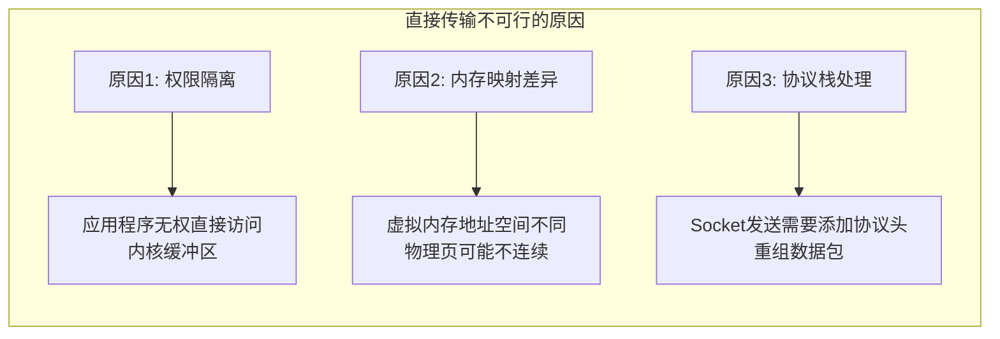
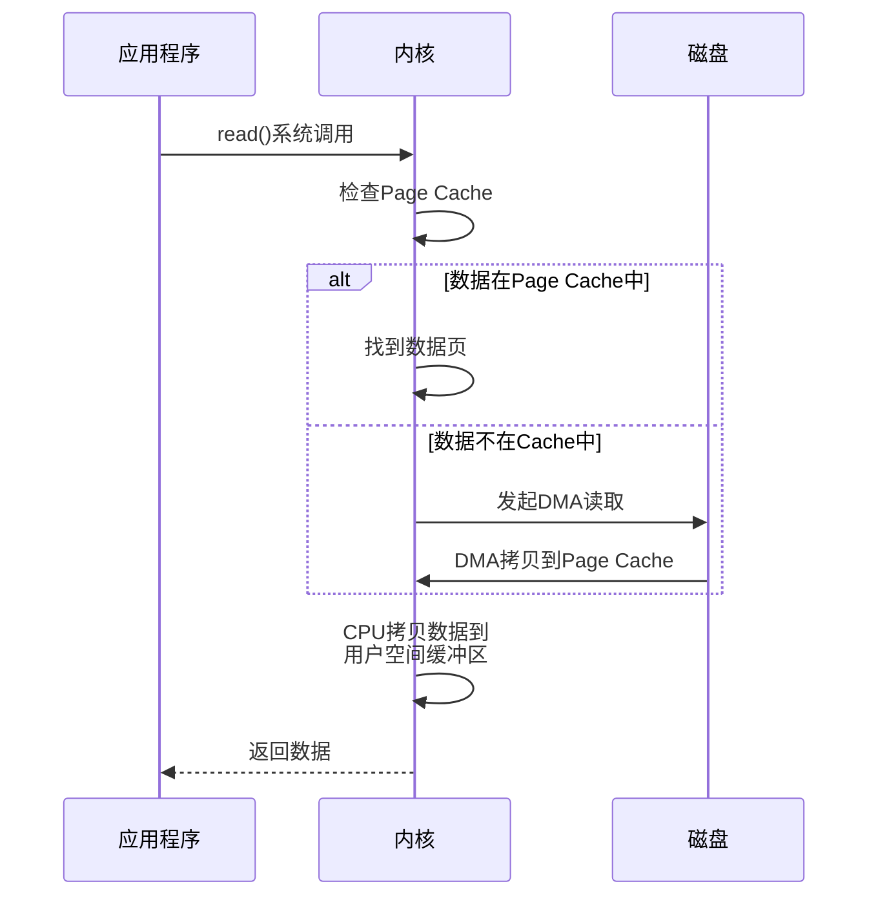
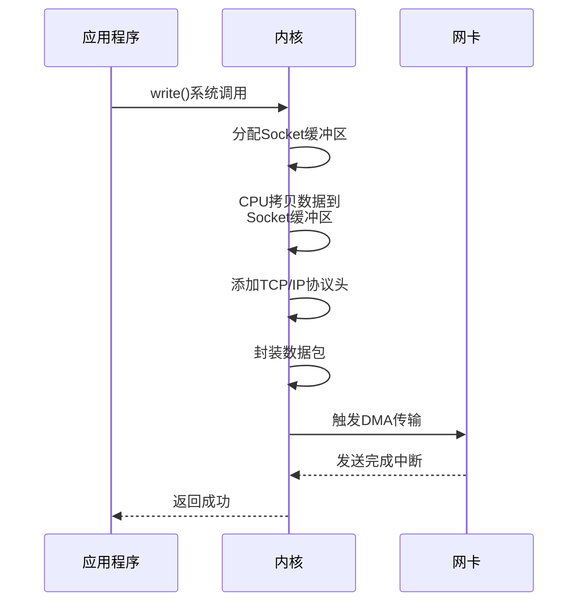
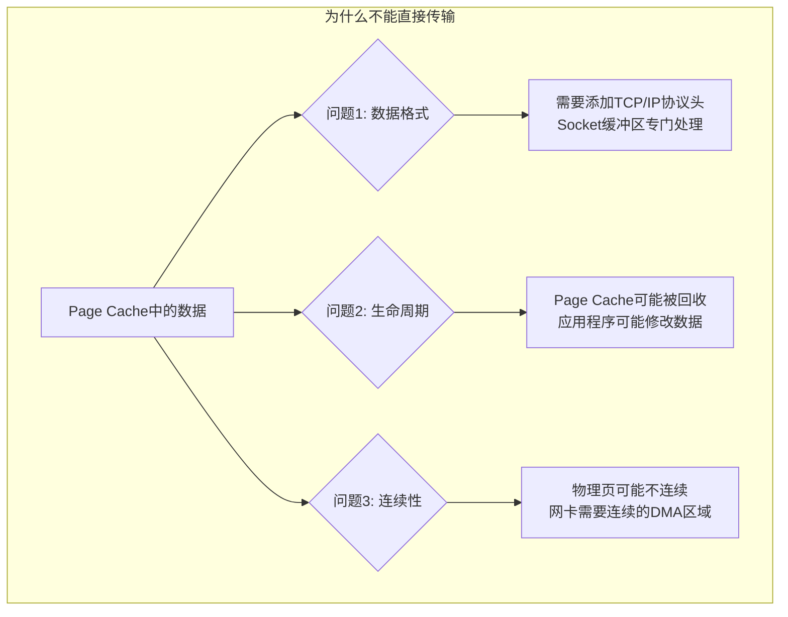
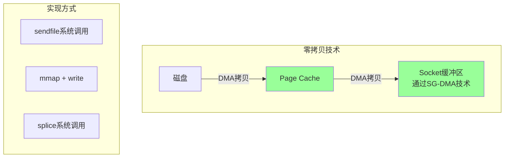
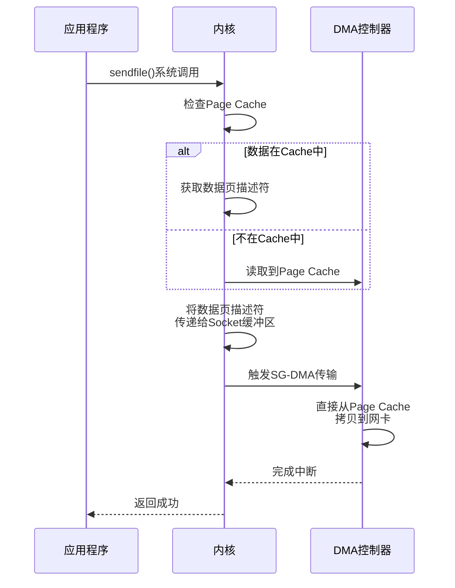

## 为什么数据要从OS Cache拷贝到App Buffer再拷贝回Socket Buffer？

这是一个非常经典的问题，涉及到**操作系统、硬件架构和网络协议栈**的设计权衡。我通过下面这张图来直观展示这个过程：

```text
┌─────────────────────────────────────────────────────────────────┐
│                        传统IO流程（两次拷贝）                      │
├─────────────────────────────────────────────────────────────────┤
│                                                                  │
│   磁盘数据 ────→ DMA拷贝 ────→ 内核Page Cache ────→ CPU拷贝1 ────→ 应用缓冲区 │
│   (Disk)         (硬件DMA)      (OS内核)            (CPU)        (App Buffer)│
│                                                                  │
│   应用缓冲区 ────→ CPU拷贝2 ────→ 内核Socket缓冲 ────→ DMA拷贝 ────→ 网卡发送  │
│   (App Buffer)    (CPU)          (Socket Buffer)   (硬件DMA)      (NIC)    │
│                                                                  │
├─────────────────────────────────────────────────────────────────┤
│                                                                  │
│                        问题说明                                    │
│   ┌─────────────────────────────────────────────────────────┐   │
│   │ 问题: 为什么要经过两次CPU拷贝?                             │   │
│   │ 原因: 内核空间和用户空间隔离（安全机制）                     │   │
│   │ 代价: 占用CPU资源，增加I/O延迟                             │   │
│   └─────────────────────────────────────────────────────────┘   │
└─────────────────────────────────────────────────────────────────┘
```

**两次拷贝的具体流程**

| 步骤           | 操作                     | 执行者    | 作用                     |
| :------------- | :----------------------- | :-------- | :----------------------- |
| **第一次拷贝** | 磁盘→Page Cache          | DMA控制器 | 硬件自动完成，不占用CPU  |
| **第二次拷贝** | Page Cache→App Buffer    | CPU       | 从内核空间拷贝到用户空间 |
| **第三次拷贝** | App Buffer→Socket Buffer | CPU       | 从用户空间拷贝回内核空间 |
| **第四次拷贝** | Socket Buffer→网卡       | DMA控制器 | 硬件自动发送             |


### 核心原因：用户空间与内核空间的隔离

这个问题的本质在于现代操作系统对**安全性**和**稳定性**的设计：

#### 1. **内核空间 vs 用户空间**

- **内核空间**：操作系统核心代码运行的地方，可以访问所有硬件资源
- **用户空间**：应用程序运行的地方，受保护模式限制，不能直接访问硬件

**内核空间和用户空间**

```shell
// 内存空间布局
0x00000000 ┌─────────────────┐
           │  用户空间 (3GB)  │  ← 应用程序运行在这里
           │  (APP Buffer)    │    不能直接访问硬件
0xC0000000 ├─────────────────┤
           │  内核空间 (1GB)  │  ← 操作系统内核在这里
           │  (Page Cache)    │    可以访问所有硬件
           │  (Socket Buffer) │
0xFFFFFFFF └─────────────────┘
```

这种隔离机制确保了：

- 应用程序不能随意读写内存任意位置
- 应用程序崩溃不会导致整个系统崩溃
- 恶意程序无法直接窃取其他程序的数据

#### 2. **为什么不能直接传输？**



### 详细流程拆解

以Web服务器发送文件为例：

#### 步骤1：从磁盘读取数据

```c
// 应用程序代码
char buffer[4096];
read(file_fd, buffer, 4096);  // 系统调用
```



#### 步骤2：从Socket发送数据

```c
// 应用程序代码
write(socket_fd, buffer, 4096);  // 系统调用
```



### 为什么不能直接使用Page Cache的数据？

你可能会问：既然数据已经在Page Cache里了，为什么不能直接让网卡从那里取数据？



### 优化方案：零拷贝技术

为了解决这个问题，现代操作系统提供了**零拷贝**技术：



#### sendfile零拷贝示例

```c
// 传统方式 - 两次CPU拷贝
read(file_fd, buffer, size);
write(socket_fd, buffer, size);

// 零拷贝方式 - 无CPU拷贝
sendfile(socket_fd, file_fd, NULL, size);
```



### 各种IO模型的对比

| IO模型       | CPU拷贝次数 | DMA拷贝次数 | 特点                   |
| ------------ | ----------- | ----------- | ---------------------- |
| 传统BIO      | 2次         | 2次         | 简单，但CPU占用高      |
| 传统NIO      | 2次         | 2次         | 线程复用，但拷贝不变   |
| mmap         | 1次         | 2次         | 共享内存，减少一次拷贝 |
| **sendfile** | **0次**     | **2次**     | **真正的零拷贝**       |
| 异步IO       | 0次         | 2次         | 非阻塞，回调通知       |


| IO模型       | CPU拷贝次数 | DMA次数 | 上下文切换 | 适用场景             |
| :----------- | :---------- | :------ | :--------- | :------------------- |
| **传统BIO**  | 2次         | 2次     | 多次       | 小文件、兼容性要求高 |
| **mmap**     | 1次         | 2次     | 多次       | 中等文件、随机读写   |
| **sendfile** | **0次**     | 2次     | 2次        | **大文件传输**       |
| **splice**   | 0次         | 2次     | 2次        | 管道数据传输         |
| **直接IO**   | 0次         | 1次     | 2次        | 数据库、绕过Cache    |


### 实际应用中的选择

```java
// Java NIO中的零拷贝
public class ZeroCopyExample {
    public static void transferFile(String from, String to) throws IOException {
        FileChannel source = new FileInputStream(from).getChannel();
        FileChannel destination = new FileOutputStream(to).getChannel();
        
        // 零拷贝传输
        source.transferTo(0, source.size(), destination);
    }
}
```

```nginx
# Nginx配置中启用sendfile
location /download {
    sendfile on;        # 启用零拷贝
    tcp_nopush on;      # 优化TCP包发送
}
```

### 总结

**为什么要有两次拷贝？**

1. **安全性**：隔离用户空间和内核空间
2. **稳定性**：保护操作系统不受应用程序影响
3. **协议处理**：Socket发送需要处理TCP/IP协议栈

**如何优化？**

- 使用**零拷贝技术**（sendfile、mmap）
- 使用**直接IO**绕过Page Cache（适合大文件）
- 使用**异步IO**减少阻塞

**一句话本质**：

> 这是操作系统安全隔离的代价，但通过零拷贝技术可以在保证安全的前提下，消除不必要的CPU拷贝开销。