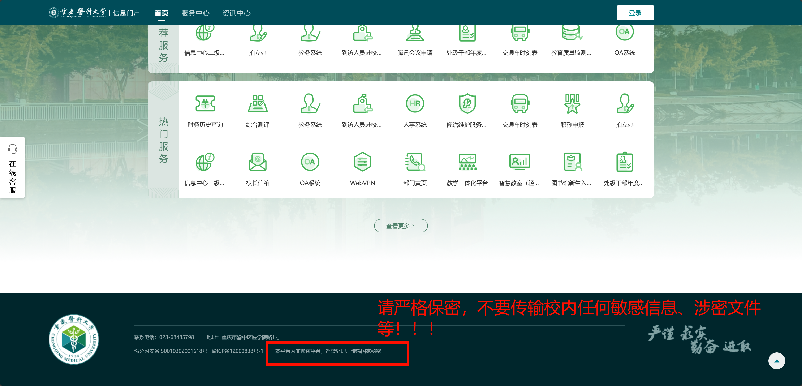

编写者：[::noto:red-heart::rand777](/friends/persons/)

:::tip 本文已完成并校对

:::

数据安全，人人有责。涉密单位、项目、个人等需严格按照法律法规执行。

参考：[中华人民共和国数据安全法](https://www.stats.gov.cn/gk/tjfg/xgfxfg/202503/t20250310_1958928.html#:~:text=%E7%AC%AC%E4%B8%80%E6%9D%A1%20%E4%B8%BA%E4%BA%86%E8%A7%84%E8%8C%83%E6%95%B0%E6%8D%AE%E5%A4%84%E7%90%86%E6%B4%BB%E5%8A%A8%EF%BC%8C%E4%BF%9D%E9%9A%9C%E6%95%B0%E6%8D%AE%E5%AE%89%E5%85%A8%EF%BC%8C%E4%BF%83%E8%BF%9B%E6%95%B0%E6%8D%AE%E5%BC%80%E5%8F%91%E5%88%A9%E7%94%A8%EF%BC%8C%E4%BF%9D%E6%8A%A4%E4%B8%AA%E4%BA%BA%E3%80%81%E7%BB%84%E7%BB%87%E7%9A%84%E5%90%88%E6%B3%95%E6%9D%83%E7%9B%8A%EF%BC%8C%E7%BB%B4%E6%8A%A4%E5%9B%BD%E5%AE%B6%E4%B8%BB%E6%9D%83%E3%80%81%E5%AE%89%E5%85%A8%E5%92%8C%E5%8F%91%E5%B1%95%E5%88%A9%E7%9B%8A%EF%BC%8C%E5%88%B6%E5%AE%9A%E6%9C%AC%E6%B3%95%E3%80%82%20%E7%AC%AC%E4%BA%8C%E6%9D%A1,%E5%9C%A8%E4%B8%AD%E5%8D%8E%E4%BA%BA%E6%B0%91%E5%85%B1%E5%92%8C%E5%9B%BD%E5%A2%83%E5%86%85%E5%BC%80%E5%B1%95%E6%95%B0%E6%8D%AE%E5%A4%84%E7%90%86%E6%B4%BB%E5%8A%A8%E5%8F%8A%E5%85%B6%E5%AE%89%E5%85%A8%E7%9B%91%E7%AE%A1%EF%BC%8C%E9%80%82%E7%94%A8%E6%9C%AC%E6%B3%95%E3%80%82%20%E5%9C%A8%E4%B8%AD%E5%8D%8E%E4%BA%BA%E6%B0%91%E5%85%B1%E5%92%8C%E5%9B%BD%E5%A2%83%E5%A4%96%E5%BC%80%E5%B1%95%E6%95%B0%E6%8D%AE%E5%A4%84%E7%90%86%E6%B4%BB%E5%8A%A8%EF%BC%8C%E6%8D%9F%E5%AE%B3%E4%B8%AD%E5%8D%8E%E4%BA%BA%E6%B0%91%E5%85%B1%E5%92%8C%E5%9B%BD%E5%9B%BD%E5%AE%B6%E5%AE%89%E5%85%A8%E3%80%81%E5%85%AC%E5%85%B1%E5%88%A9%E7%9B%8A%E6%88%96%E8%80%85%E5%85%AC%E6%B0%91%E3%80%81%E7%BB%84%E7%BB%87%E5%90%88%E6%B3%95%E6%9D%83%E7%9B%8A%E7%9A%84%EF%BC%8C%E4%BE%9D%E6%B3%95%E8%BF%BD%E7%A9%B6%E6%B3%95%E5%BE%8B%E8%B4%A3%E4%BB%BB%E3%80%82%20%E7%AC%AC%E4%B8%89%E6%9D%A1%20%E6%9C%AC%E6%B3%95%E6%89%80%E7%A7%B0%E6%95%B0%E6%8D%AE%EF%BC%8C%E6%98%AF%E6%8C%87%E4%BB%BB%E4%BD%95%E4%BB%A5%E7%94%B5%E5%AD%90%E6%88%96%E8%80%85%E5%85%B6%E4%BB%96%E6%96%B9%E5%BC%8F%E5%AF%B9%E4%BF%A1%E6%81%AF%E7%9A%84%E8%AE%B0%E5%BD%95%E3%80%82)

重庆医科大学等高校企业单位为非涉密平台，严禁传输国家秘密。

## 等保2.0

@[pdf height="600"](https://download.sangfor.com.cn/faaddaf7aeef495bbef0a78486fc7cd6.pdf)

## 网络安全规范

### 服务器管理规范

* 一律禁用 root 用户登录，使用普通用户登录，然后切换到root用户。
* 使用密钥登录，禁用密码登录。
* 修改 SSH 端口号，禁用22端口，至少为25000后的端口。
* 使用 fail2ban 防暴力破解。
* 使用 WireGuard VPN 异地组网。
* 使用 iptables 防火墙，只开放必要的端口。
* 禁用不必要的服务。
* 定期更新系统和软件包。
* 本地服务禁止外网访问，使用反向代理。
* 禁用不必要的端口。
* 禁用不必要的用户/组。
* 禁用不必要的文件和目录。
* 禁用不必要的权限，默认 470 。
* 禁用不必要的 SUID 和 SGID 程序。
* 启用 SELinux 强制访问控制。
* 配置系统日志监控和告警机制。
* 定期备份重要数据和配置文件。
* 使用强密码策略，定期更换密码。
### 防火墙配置
* 仅开放必要的入站端口（如 SSH、HTTP、HTTPS ）。
* 配置端口扫描防护。
* 启用 SYN flood 防护。
* 配置 IP 白名单机制。
* 设置连接数限制。
* 启用日志记录功能。
* 配置 WEB 反爬虫策略。
### 系统加固
* 禁用 USB 存储设备自动挂载。
* 配置文件系统访问控制。
* 限制系统资源使用。
* 配置定时任务安全策略。
* 实施最小权限原则。
