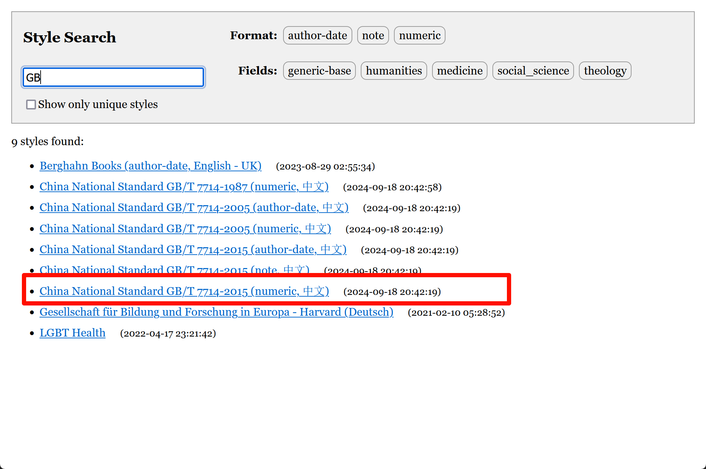

编写者：[::noto:red-heart::rand777](/friends/persons/)

:::tip 本文已完成并校对

:::

引用参考文献的工具很多，这里推荐使用::simple-icons:zotero::[Zotero](/campus-wiki/document-management/Zotero/)，目前，我国大多数学术期刊和学位论文都要求参考文献使用现行的国家标准进行文献描述或著录，即《信息与文献 参考文献著录规则》GB/T 7714-2015。

:::details 引用范例

[1] C/S分布式模式[EB/OL]. [2024-06-20]. 

[2] Dooy/chatgpt-web-midjourney-proxy: One UI is all done with chatgpt web, midjourney, gpts,tts, whisper,suno-v3 ; Simultaneous support Web / PWA / Linux / Win / MacOS platform[EB/OL]. [2024-06-19]. 

[3] TONY C, FERREYRA N E D, MUTAS M, 等. Prompting Techniques for Secure Code Generation: A Systematic Investigation[A/OL]. arXiv, 2024[2024-07-10]. http://arxiv.org/abs/2407.07064.

[4] 提示工程指南 | Prompt Engineering Guide[EB/OL]. [2024-06-20]. 

:::

@[pdf height="600px"](https://lib.tsinghua.edu.cn/wj/GBT7714-2015.pdf)

