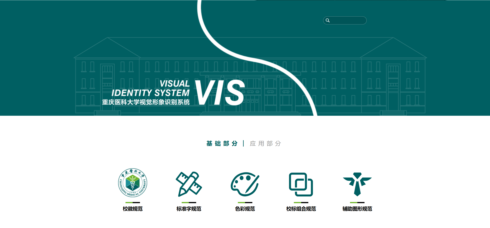

编写者：[::noto:red-heart::rand777](/friends/persons/)

:::tip 本文已完成并校对

:::

视觉识别系统 (简称 VI ，英文 Visual Identity 的缩写 )是运用系统的、统一的视觉符号系统。

视觉识别是静态的识别符号具体化、视觉化的传达形式，项目最多，层面最广，效果更直接。视觉识别系统属于CIS中的VI，用完整、体系的视觉传达体系，将企业理念、文化特质、服务内容、企业规范等抽象语意转换为具体符号的概念，塑造出独特的企业形象。

视觉识别系统分为基本要素系统和应用要素系统两方面。基本要素系统主要包括：企业名称、企业标志、标准字、标准色、象征图案、宣传口语、市场行销报告书等。应用系统主要包括：办公事务用品、生产设备、建筑环境、产品包装、广告媒体、交通工具、衣着制服、旗帜、招牌、标识牌、橱窗、陈列展示等。视觉识别（VI）在CIS系统大众所接受，具有主导的地位。

:::important 使用注意
同学们在项目中如果使用到了企业或组织的VIS（如重医校徽），需要按照VIS手册中说明严格执行，否则将面临法律风险。
:::

## PGuide Studio VIS

工作室的视觉形象识别系统由 [::noto:red-heart::rand777](/friends/persons/) [::noto:red-heart::qiqishiyi](/friends/persons/)  负责维护，包括基础的文字、图形、色彩等元素的设计，主要用于工作室的宣传和推广。除此之外，也有面向同学们的PPT模板、TeX简历模板等设计。

> **::fluent-mdl2:branch-merge::template** 分支模板使用[::icons8:copyright::MIT](https://mit-license.org/)协议，欢迎大家使用。
> 
> **::fluent-mdl2:branch-merge::main**分支使用[::icons8:copyright::CC BY-NC-SA 4.0](https://creativecommons.org/licenses/by-nc-sa/4.0/deed.en)协议，禁止商业使用。

<LinkCard icon="/icon/logo.svg" href="https://vi.pguide.studio/" title="项导工作室视觉形象识别系统" >PGuide Studio Visual Identity System</LinkCard>

### 相关仓库地址

<CardGrid>
<RepoCard repo="PGuideDev/PGuide-VIS">视觉形象识别系统仓库</RepoCard>
<LinkCard icon="catppuccin:latex" href="https://github.com/CQMUtug" title="CQMUtug" >CQMUtug用户组</LinkCard>
</CardGrid>

---

## 高校VIS

全国大学VIS汇总：[::carbon:map-identify::urongda](https://www.urongda.com/logos)

### CQMU VIS

<LinkCard icon="/icon/cqmu.svg" href="https://vi.cqmu.edu.cn/" title="重庆医科大学视觉形象识别系统" >CQMU Visual Identity System</LinkCard>

### CQU VIS

<LinkCard icon="/icon/cqu.svg" href="https://www.cqu.edu.cn/__local/F/67/13/91F381501973A4F9D10D3340792_2136FE11_3D39D20.pdf?e=.pdf" title="重庆大学视觉识别系统" >CQU Visual Identity System</LinkCard>

### THU VIS

<LinkCard icon="" href="https://vi.tsinghua.edu.cn/" title="清华大学视觉形象识别系统" >THU Visual Identity System</LinkCard>

## 知名企业VIS

### Tencent Cloud Brand VIS

<LinkCard icon="simple-icons:tencentqq" href="https://www.zcool.com.cn/work/ZNzA2MDcxMTI=.html?" title="腾讯云品牌VIS视觉识别手册" >TencentCloud VIS</LinkCard>

## MUA VIS

### MUA视觉识别规范手册
@[pdf height="600px"](https://cos.pguide.cloud/docs/MUA%E8%A7%86%E8%A7%89%E8%AF%86%E5%88%AB%E8%A7%84%E8%8C%83.pdf)