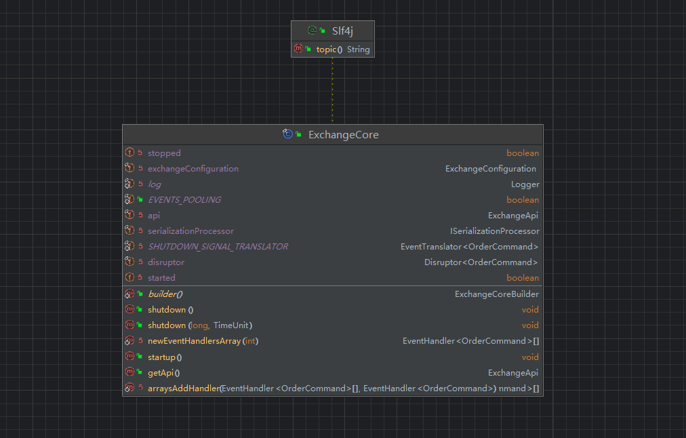
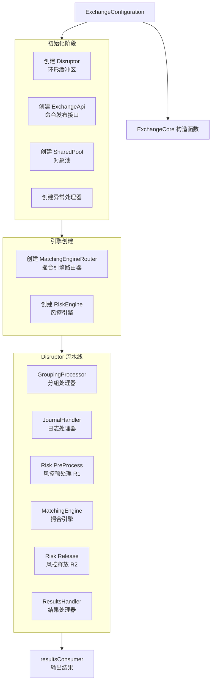
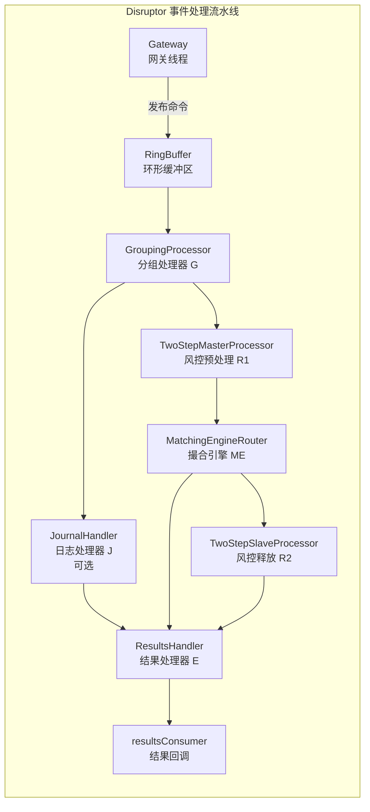

## ExchangeCore 交易核心源码分析

> 交易核心整体执行流程: 配置加载 → 核心组件创建 → 异步并行初始化引擎 → 构建Disruptor处理链 → 启动准备就绪

### 交易核心整体架构

```java
┌─────────────────────────────────────────────────────────────────┐
│                        ExchangeCore                              │
│  ┌─────────────────────────────────────────────────────────┐   │
│  │                    Disruptor Pipeline                     │   │
│  │                                                           │   │
│  │  ┌──────┐    ┌──────┐    ┌──────┐    ┌──────┐    ┌─────┐ │   │
│  │  │  G   │ → │R1/J  │ → │ ME   │ → │  R2  │ → │  E  │ │   │
│  │  │Group │   │并行  │   │匹配  │   │结算  │   │结果 │ │   │
│  │  └──────┘    └──────┘    └──────┘    └──────┘    └─────┘ │   │
│  │                                                           │   │
│  │  G: GroupingProcessor      ME: MatchingEngine           │   │
│  │  R1: Risk Pre-process      R2: Risk Release            │   │
│  │  J: Journaling              E: ResultsHandler          │   │
│  └─────────────────────────────────────────────────────────┘   │
│                                                                 │
│  ┌──────────────┐  ┌──────────────┐  ┌──────────────┐        │
│  │ MatchingEng  │  │  RiskEngine  │  │ Serialization│        │
│  │   (N个)      │  │   (M个)      │  │  Processor   │        │
│  └──────────────┘  └──────────────┘  └──────────────┘        │
└─────────────────────────────────────────────────────────────────┘
```

ExchangeCore类负责初始化并且构建交易核心，其核心属性和方法类图如下:



`disruptor`核心高性能环形缓冲区，其主要功能是：1、存储待处理的订单命令；2、提供无锁并发访问；另外`ExchangeApi`是api接口，向外部提供命令发布能力，主要用来1、提交订单命令；2、查询市场数据；3、批量操作接口；

`ExchangeConfiguration`:交易所初始化核心配置类，包括性能测试配置，序列化配置，匹配引擎配置；


除了以上核心配置，核心方法startup()负责启动交易核心，构造方法负责初始化交易核心引擎；

交易核心初始化构造方法: [核心构造方法](/project-docs/Opensource/exchange-core/ExchangeCore交易核心/#exchangecore-构造函数源码分析)

### Disruptor 处理器链详解

| 阶段 | 处理器            | 职责                     | 依赖   |
| :--- | :---------------- | :----------------------- | :----- |
| 1    | Grouping (G)      | 事件分组、批处理、预分配 | 无     |
| 2    | Risk Pre (R1)     | 资金冻结、风控校验       | G      |
| 2    | Journaling (J)    | 命令日志记录（并行）     | G      |
| 3    | Matching (ME)     | 订单匹配、生成成交       | R1     |
| 4    | Risk Release (R2) | 资金结算、手续费         | ME     |
| 5    | Results (E)       | 回调通知、清理           | ME + J |


### 并行化策略

```java
// 两个阶段可以并行执行：
// 阶段2：R1（风控）和 J（日志）并行执行
afterGrouping.handleEventsWith(jh);           // 日志线程
afterGrouping.handleEventsWith(r1Processor);  // 风控线程

// 这种设计充分利用多核 CPU
```


### 两阶段风控设计

```java
// R1（Master）和 R2（Slave）是主从关系
public class TwoStepMasterProcessor {
    private TwoStepSlaveProcessor slave;
    
    public void onEvent(OrderCommand cmd, ...) {
        // 预处理阶段：冻结资金
        boolean result = riskEngine.preProcessCommand(seq, cmd);
        if (result) {
            // 传递给 Slave 等待匹配完成
            slave.process(cmd);
        }
    }
}

public class TwoStepSlaveProcessor {
    public void onEvent(OrderCommand cmd, ...) {
        // 后处理阶段：资金结算
        riskEngine.handlerRiskRelease(seq, cmd);
    }
}
```

为什么需要两阶段？

R1：在匹配前锁定资金（防止超卖）

R2：在匹配后完成结算（实际划转）

中间可插入匹配引擎，实现原子性

### 分片设计

```java
// 匹配引擎：按交易品种分片
symbolForThisHandler(symbol) {
    return (symbol & shardMask) == shardId;
}
// 确保同一品种的订单始终在同一引擎处理（保证顺序）

// 风控引擎：按用户分片
uidForThisHandler(uid) {
    return (uid & shardMask) == shardId;
}
// 确保同一用户的资金操作在同一引擎处理（避免竞态）
```


### 初始化并行化

```java
// 使用 CompletableFuture 并行创建所有引擎
CompletableFuture.supplyAsync(() -> new MatchingEngineRouter(...), loaderExecutor)

// 启动时间对比：
// 串行：4个引擎 × 100ms = 400ms
// 并行：max(100ms) = 100ms（4核）
```

### 事件处理流程实例

```java
// 用户下单流程
1. 外部调用 → ExchangeApi.submitCommand(cmd)
2. Disruptor 发布事件 → RingBuffer
3. GroupingProcessor → 预分配事件链
4. RiskEngine.preProcessCommand → 冻结资金
5. Journaling → 记录到磁盘（异步）
6. MatchingEngine.processOrder → 订单匹配
7. RiskEngine.handlerRiskRelease → 资金结算
8. ResultsHandler → 回调用户
```

### 性能优化要点

| 优化技术   | 实现方式             | 效果            |
| :--------- | :------------------- | :-------------- |
| 无锁队列   | Disruptor RingBuffer | 纳秒级延迟      |
| 并行初始化 | CompletableFuture    | 启动时间减少75% |
| 分片设计   | 位运算取模           | 线性扩展        |
| 对象池     | SharedPool           | 减少GC 90%      |
| 两阶段处理 | Master-Slave         | 提高吞吐量      |
| 等待策略   | BusySpin             | 降低延迟        |

### 容错与恢复


```java
// 三种状态恢复机制：
1. Journaling：实时记录所有命令
2. Snapshot：定期保存状态快照
3. Replay：启动时回放日志恢复状态

// 恢复流程：
startup() → replayJournalFullAndThenEnableJouraling()
         → 从快照恢复
         → 回放快照后的日志
         → 进入正常运行模式
```

### 设计模式

| 模式   | 应用场景     | 示例                |
| :----- | :----------- | :------------------ |
| 建造者 | 复杂配置构建 | @Builder 注解       |
| 流水线 | 事件处理链   | Disruptor 处理器链  |
| 策略   | 等待策略选择 | WaitStrategy        |
| 工厂   | 对象创建     | OrderBookFactory    |
| 观察者 | 结果通知     | resultsConsumer     |
| 主从   | 两阶段处理   | Master-Slave 处理器 |
| 分片   | 水平扩展     | Hash 取模路由       |


## ExchangeCore 构造函数源码分析

这是 exchange-core 项目中最核心的类 `ExchangeCore` 的构造函数，负责**初始化整个交易引擎的所有组件**，并构建 Disruptor 事件处理流水线。


函数签名如下:

```java
@Builder
public ExchangeCore(final ObjLongConsumer<OrderCommand> resultsConsumer,
                    final ExchangeConfiguration exchangeConfiguration) {
```

### 一、整体架构图



### 二、参数说明

| 参数                    | 类型                            | 说明                                       |
| ----------------------- | ------------------------------- | ------------------------------------------ |
| `resultsConsumer`       | `ObjLongConsumer<OrderCommand>` | 结果消费者回调函数，接收处理完成的订单命令 |
| `exchangeConfiguration` | `ExchangeConfiguration`         | 交易所配置对象，包含性能、序列化等所有配置 |

### 三、初始化阶段

```java
log.debug("Building exchange core from configuration: {}", exchangeConfiguration);

this.exchangeConfiguration = exchangeConfiguration;

final PerformanceConfiguration perfCfg = exchangeConfiguration.getPerformanceCfg();

// 缓冲区大小
final int ringBufferSize = perfCfg.getRingBufferSize();
```

**配置获取**：从配置对象中提取性能配置（`PerformanceConfiguration`），包括环形缓冲区大小、等待策略、线程工厂等。

```java
this.disruptor = new Disruptor<>(
        OrderCommand::new,                          // 事件工厂
        ringBufferSize,                             // 缓冲区大小
        perfCfg.getThreadFactory(),                 // 线程工厂
        ProducerType.MULTI,                         // 多生产者模式（多个网关线程可同时写入）
        perfCfg.getWaitStrategy().getDisruptorWaitStrategyFactory().get());  // 等待策略
```

**Disruptor 创建**：

- **事件类型**：`OrderCommand`（订单命令）
- **生产者模式**：`MULTI` - 允许多个网关线程并发提交命令
- **等待策略**：由配置决定（如 `BusySpinWaitStrategy` 用于极致低延迟）
- **预分配事件**：通过`OrderCommand::new`工厂避免GC


```java
this.api = new ExchangeApi(disruptor.getRingBuffer(), perfCfg.getBinaryCommandsLz4CompressorFactory().get());
```

**API 创建**：封装了向 Disruptor 的 RingBuffer 发布命令的接口。

```java
// 创建共享对象池
final int poolInitialSize = (matchingEnginesNum + riskEnginesNum) * 8;
final int chainLength = EVENTS_POOLING ? 1024 : 1;
final SharedPool sharedPool = new SharedPool(poolInitialSize * 4, poolInitialSize, chainLength);
```

**对象池创建**：

- 用于复用 `MatcherTradeEvent` 等对象，减少 GC 压力
- `poolInitialSize`：初始大小基于引擎数量计算
- `chainLength`：事件链长度，启用对象池时为 1024

### 四、引擎创建阶段（并行）

```java
final ExecutorService loaderExecutor = Executors.newFixedThreadPool(matchingEnginesNum + riskEnginesNum, threadFactory);

// 并行创建匹配引擎路由器
final Map<Integer, CompletableFuture<MatchingEngineRouter>> matchingEngineFutures = 
    IntStream.range(0, matchingEnginesNum)  // 1. 生成分片ID流 [0, 1, 2, ..., N-1]
        .boxed()                            // 2. 将int转换为Integer对象
        .collect(Collectors.toMap(          // 3. 收集到Map中
            shardId -> shardId,             // Key: 分片ID (Integer)
            shardId -> CompletableFuture.supplyAsync( // Value: 异步任务
                () -> new MatchingEngineRouter(       // 任务内容：创建路由器实例
                    shardId,                // 当前分片ID
                    matchingEnginesNum,     // 总分片数（用于一致性哈希或路由策略）
                    serializationProcessor, // 序列化处理器
                    orderBookFactory,       // 订单簿工厂
                    sharedPool,             // 共享线程池
                    exchangeConfiguration  // 交易所配置
                ),
                loaderExecutor              // 执行这个任务的专用线程池
            )
        ));

// 并行创建风控引擎
final Map<Integer, CompletableFuture<RiskEngine>> riskEngineFutures = 
    IntStream.range(0, riskEnginesNum)   // 1. 生成分片ID: [0, 1, 2, ..., riskEnginesNum-1]
        .boxed()                         // 2. 转换为 Integer 对象流
        .collect(Collectors.toMap(       // 3. 收集到 Map 中
            shardId -> shardId,          // Key: 分片ID
            shardId -> CompletableFuture.supplyAsync( // Value: 异步任务
                () -> new RiskEngine(    // 任务内容：创建 RiskEngine 实例
                    shardId, 
                    riskEnginesNum,      // 总分片数（用于一致性哈希，决定订单由哪个引擎处理）
                    serializationProcessor, 
                    sharedPool,          // 共享线程池（RiskEngine 运行时使用的线程池）
                    exchangeConfiguration
                ),
                loaderExecutor           // 执行这个初始化任务的专用线程池
            )
        ));
```

**并行初始化**：

- 使用 `CompletableFuture.supplyAsync` 并行创建多个引擎实例
- `matchingEnginesNum` 和 `riskEnginesNum` 通常等于 CPU 核心数
- **分片设计**：每个引擎负责一部分交易对（symbol），实现水平扩展

#### 匹配引擎

为每个分片（shardId）异步地创建并初始化一个MatchingEngineRouter（撮合引擎路由器）实例，并将这些异步任务的结果（CompletableFuture）存入一个Map中，以便后续获取

分片设计的好处:

1. 并行初始化，缩短启动时间：如果有8个分片，在四核机器上，可以至少4个并发初始化，将总初始化耗时从“8个串行时间之和”降为“最长的一个初始化时间”。

2. 资源隔离：使用专用线程池loaderExecutor，确保初始化的CPU负载不会冲击运行时处理业务逻辑的sharedPool。

3. 非阻塞启动：Disruptor或其他核心组件可以立即开始工作，不一定要等所有撮合引擎完全初始化好（只要保证在使用前join即可）。

4. 清晰的错误处理：如果某个分片初始化失败，可以通过CompletableFuture的异常机制来处理，例如：

```java
CompletableFuture.allOf(matchingEngineFutures.values().toArray(new CompletableFuture[0]))
    .exceptionally(ex -> { 
        log.error("Failed to initialize matching engines", ex);
        System.exit(1); // 或者采取其他补救措施
        return null;
    });
```

串行初始化，耗时:

```java
// 如果不这样做，可能会写成串行初始化：
Map<Integer, MatchingEngineRouter> routers = new HashMap<>();
for (int i = 0; i < matchingEnginesNum; i++) {
    routers.put(i, new MatchingEngineRouter(i, matchingEnginesNum, ...)); // 逐个创建，总耗时=每个耗时的累加
}
```

#### 风控引擎

它的核心作用是：为每个分片（shardId）异步地创建并初始化一个 RiskEngine 实例。

与 MatchingEngineRouter 初始化的区别：

| 特性           | `MatchingEngineRouter`          | `RiskEngine`                    |
| :------------- | :------------------------------ | :------------------------------ |
| **数量**       | `matchingEnginesNum`            | `riskEnginesNum` (可能不同)     |
| **主要职责**   | 订单撮合 (匹配买卖盘)           | 风控检查 (余额、限额、黑名单等) |
| **运行时依赖** | `OrderBookFactory` (订单簿工厂) | 无                              |
| **分片策略**   | 通常按**交易对** (如 BTC/USDT)  | 通常按**用户ID**或**账户ID**    |


优势:

- **并发初始化，加速启动**：多个 `RiskEngine` 实例（其构造函数可能包含加载风控规则、预计算资源、建立外部服务连接等耗时操作）可以被并发初始化，充分利用多核 CPU，显著缩短系统启动时间。
- **资源隔离**：使用独立的 `loaderExecutor` 来执行初始化，可以避免初始化过程占用运行时线程池（`sharedPool`）的资源，确保业务流量进来时，`sharedPool` 是干净的。
- **容错性**：如果某个分片的 `RiskEngine` 初始化失败，可以通过 `CompletableFuture` 的异常处理机制 (`exceptionally` 等) 进行精细化的处理，比如：
  - 记录错误日志。
  - 尝试重新初始化。
  - 拒绝该分片对应的流量，或将其降级。
- **非阻塞启动**：理论上，系统可以让其他不依赖风控的组件先启动起来，待风控引擎初始化完成后再启用相关功能。这在模块化的大型系统中很有价值。


数据分片策略：

这两段代码 (`RiskEngine` 和 `MatchingEngineRouter`) 都采用了分片模式，这是构建高吞吐量交易系统的常见技术。通常的分片逻辑是：

- **风控 (`RiskEngine`)**：按`用户ID`哈希，将同一个用户的所有订单路由到同一个 `RiskEngine` 实例，这样可以方便地维护用户维度的状态（如“未成交订单总额”）。
- **撮合 (`MatchingEngineRouter`)**：按`交易对`哈希，将同一个交易对的所有订单路由到同一个 `MatchingEngineRouter` 实例，因为订单簿是交易对级别的，这样避免了跨实例的锁竞争。


### 五、Disruptor 流水线构建



#### 步骤1：分组处理器（G - Grouping Processor）

```java
final EventHandlerGroup<OrderCommand> afterGrouping =
                //disruptor.handleEventsWith： 注册处理器
                disruptor.handleEventsWith((rb, bs) -> new GroupingProcessor(rb, rb.newBarrier(bs), perfCfg, coreWaitStrategy, sharedPool));
```

**作用**：

- 按 `symbol`（交易对）对命令进行分组
- 确保同一个交易对的命令被顺序处理
- 不同交易对的命令可以并行处理

#### 步骤2：日志处理器（J - JournalHandler，可选）

```java
boolean enableJournaling = serializationCfg.isEnableJournaling();
final EventHandler<OrderCommand> jh = enableJournaling ? serializationProcessor::writeToJournal : null;

if (enableJournaling) {
    afterGrouping.handleEventsWith(jh);
}
```

**作用**：

- 将命令写入磁盘日志，支持事件溯源
- **与风控预处理并行执行**，不阻塞主流程

#### 步骤3：风控预处理（R1 - Risk PreProcess）

```java
riskEngines.forEach((idx, riskEngine) -> 
    afterGrouping.handleEventsWith( (rb, bs) -> {
        // 1. 创建处理器实例
        final TwoStepMasterProcessor r1 = new TwoStepMasterProcessor(
            rb,                       // RingBuffer引用
            rb.newBarrier(bs),        // 依赖屏障：依赖于afterGrouping
            riskEngine::preProcessCommand, // 业务逻辑：该风控引擎的预处理方法
            exceptionHandler,         // 统一异常处理器
            coreWaitStrategy,         // 等待策略
            "R1_" + idx              // 处理器名称
        );
        // 2. 保存引用
        procR1.add(r1);
        // 3. 返回处理器实例
        return r1;
    })
);
```

**作用**：

- 验证订单合法性（余额检查、订单参数校验）
- **两阶段处理的第一阶段**：准备工作
- 与日志处理器并行执行

关键步骤解析:

##### afterGrouping

这是一个 EventHandlerGroup 对象，代表 Disruptor 流水线中的上一个阶段（即代码注释中的“阶段1”）。

这个阶段可能负责了事件的分组、批处理或预分配事件链。

##### afterGrouping.handleEventsWith(...)

这是 Disruptor 的 DSL 方法，用于为当前组（afterGrouping）注册新的下游事件处理器。

关键特性：所有通过 handleEventsWith 注册的处理器（即多个 TwoStepMasterProcessor）之间是并行执行的。

##### (rb, bs) -> new TwoStepMasterProcessor(...)

这是一个工厂 Lambda 表达式，Disruptor 内部会用这个工厂来在线程池中创建真正的处理器实例。

- rb (RingBuffer)：Disruptor 的核心环形缓冲区。

- bs (SequenceBarrier)：依赖屏障，这里是关键。rb.newBarrier(bs) 创建的新屏障，表明这个 TwoStepMasterProcessor 依赖于 afterGrouping 组的所有处理器。这意味着：只有当 afterGrouping 阶段的所有处理器都处理完一个事件后，这个风控处理器才会开始处理该事件。

##### 整体执行流程

1. 事件产生：原始事件（如 OrderCommand）被发布到 Disruptor 的 RingBuffer。

2. 阶段1：预处理（afterGrouping）：事件首先被 GroupingProcessor 处理（可能进行分组、校验等）。

3. 阶段2：并行风控：当阶段1处理完毕后，事件会被同时分发给所有通过这个 forEach 循环创建的风控处理器。
   1. riskEngines（假设是一个列表）有几个元素，就会创建几个独立的 TwoStepMasterProcessor。
   2. 它们之间是并行的，互不影响，各自调用 riskEngine::preProcessCommand 执行风控逻辑。

4. 结果处理：每个 TwoStepMasterProcessor 处理完成后，可以继续调用 .then() 串联后续的处理器（例如日志记录或结果聚合），但这段代码中没有展示。


##### 架构意图

这种设计模式非常经典，用于实现可扩展的、并行的流水线处理。

责任分离：

- afterGrouping：负责通用的预处理（G）。
- riskEngines：负责特定业务（风控）。不同的风控规则（如反欺诈、防洗钱、限额检查）可以独立成一个个 riskEngine。
- 并行化：多个风控引擎并行执行，总耗时取决于最慢的那个引擎，而不是它们的和，大大提升了处理速度。
- 灵活性：可以动态调整 riskEngines 列表，增加或减少风控维度，而不用修改流水线主体代码。
- 依赖管理：通过 rb.newBarrier(bs) 明确了“先分组（G），后风控（R）”的严格顺序。

##### 对比：如果不使用 Disruptor

如果使用传统的线程池手动实现类似功能，代码会复杂得多，需要自己管理：

1. 任务队列。

2. 等待 afterGrouping 完成的通知机制。

3. 线程同步（CountDownLatch 或 CompletableFuture）。

4. 异常处理。

Disruptor 通过 SequenceBarrier 和 EventHandlerGroup 的 DSL 优雅地解决了这些底层并发问题，让开发者能专注于业务逻辑。

#### 步骤4：撮合引擎（ME - Matching Engine）

```java
disruptor.after(procR1.toArray(new TwoStepMasterProcessor[0])).handleEventsWith(matchingEngineHandlers);
```

**作用**：

- 执行实际的订单撮合逻辑
- **必须等待 R1 完成后才能执行**
- 将订单与订单簿中的对手单进行匹配

事件执行流程:

```java
[Ring Buffer事件发布]
        ↓
[阶段1: groupingProcessor]
        ↓
[阶段2: 多个风控引擎并行处理]  ← 这是 procR1
    R1_0  R1_1  R1_2  ... (并行执行)
        ↓
 [    依赖屏障 (after)    ]  ← 确保所有R1都完成
        ↓
[阶段3: 撮合引擎串行处理]  ← 这是 matchingEngineHandlers
    MatchingEngine (可以是一个或多个处理器)
```

1. 顺序性：对于一个 OrderCommand 事件，必须且只有在 R1_0， R1_1， R1_2 …… 所有风控处理器都执行完毕后，MatchingEngine 才会开始处理它。

2. 无锁：这种依赖关系是基于 Sequence（序列号）传递的，没有使用锁。下游处理器内部维护一个 SequenceBarrier，它会跟踪上游所有被依赖的 Sequence（进度）。当发现所有上游的序列号都已超过当前事件的位置时，自己才开始处理。


为什么需要这样做？

这是交易/匹配引擎系统的经典架构：

1. 责任分离：风控 (Risk) 和 撮合 (Matching) 是两个独立的、不同侧重的业务模块。

2. 数据一致性：同一个订单，必须先通过所有风控检查，才能进入撮合引擎。如果在风控失败后还去撮合，会导致数据错误。after 机制保证了这个业务上的“先、后”顺序。

3. 性能优化：
   1. 通过 forEach 循环让多个风控规则并行执行，大大缩短了总耗时。
   2. 使用 after 声明依赖，Disruptor 能在底层高效地协调这种多对一的依赖关系，比手动使用 CountDownLatch 或 CompletableFuture 效率更高。

#### 步骤5：风控释放（R2 - Risk Release）

```java
riskEngines.forEach((idx, riskEngine) -> afterMatchingEngine.handleEventsWith(
        (rb, bs) -> {
            final TwoStepSlaveProcessor r2 = new TwoStepSlaveProcessor(rb, rb.newBarrier(bs), riskEngine::handlerRiskRelease, exceptionHandler, "R2_" + idx);
            procR2.add(r2);
            return r2;
        }));
```

**作用**：

- **两阶段处理的第二阶段**：执行风控变更（扣减余额、释放冻结资金）
- **必须等待撮合引擎完成后执行**

#### 步骤6：结果处理器（E - Results Handler）

```java
final ResultsHandler resultsHandler = new ResultsHandler(resultsConsumer);

mainHandlerGroup.handleEventsWith((cmd, seq, eob) -> {
    resultsHandler.onEvent(cmd, seq, eob);
    api.processResult(seq, cmd);
});
```

**作用**：

- 调用用户提供的 `resultsConsumer` 回调
- 通知 API 层处理命令结果（唤醒等待的 CompletableFuture）

```java
IntStream.range(0, riskEnginesNum).forEach(i -> procR1.get(i).setSlaveProcessor(procR2.get(i)));
```

**链接 R1 和 R2**：将每个 R1 处理器与对应的 R2 处理器关联，形成完整的两阶段处理链路。

### 六、处理顺序总结

| 步骤 | 处理器            | 缩写 | 说明             | 依赖         |
| ---- | ----------------- | ---- | ---------------- | ------------ |
| 1    | GroupingProcessor | G    | 按交易对分组     | -            |
| 2    | JournalHandler    | J    | 写入日志（可选） | 与 R1 并行   |
| 2    | Risk PreProcess   | R1   | 风控预处理       | 与 J 并行    |
| 3    | MatchingEngine    | ME   | 订单撮合         | 等待 R1      |
| 4    | Risk Release      | R2   | 风控释放         | 等待 ME      |
| 5    | ResultsHandler    | E    | 结果处理         | 等待 ME 和 J |

### 七、关键设计特点

| 设计点         | 实现方式                                     | 目的                       |
| -------------- | -------------------------------------------- | -------------------------- |
| **并行初始化** | `CompletableFuture.supplyAsync` + 专用线程池 | 缩短启动时间               |
| **同步屏障**   | `CompletableFuture.join()`                   | 确保组件就绪后才构建依赖链 |
| **事件流水线** | Disruptor DSL (`handleEventsWith`, `after`)  | 声明式编排处理顺序         |
| **分片并行**   | 多个`RiskEngine`/`MatchingEngine`实例        | 水平扩展，减少锁竞争       |
| **两阶段风控** | Master（预占）+ Slave（释放）                | 保证原子性和一致性         |
| **依赖声明**   | `.after(procR1).handleEventsWith(me)`        | 显式表达业务顺序           |
| **配置驱动**   | 通过`enableJournaling`动态调整依赖           | 灵活权衡性能与可靠性       |
| **对象池**     | `SharedPool`预分配                           | 减少GC暂停                 |
| **异常处理**   | 统一异常处理器 + 优雅停机                    | 提高系统健壮性             |
| **线程隔离**   | `loaderExecutor` vs `sharedPool`             | 避免初始化影响运行时性能   |


> 构造函数通过Disruptor的无锁并发模型和异步并行初始化，构建了一个**超低延迟、高吞吐**的交易处理引擎，典型的**事件溯源 + CQRS**架构在金融交易系统中的应用。


## 事件处理器实现


`GroupingProcessor`高性能事件处理器的核心循环，属于Disruptor模式的消费者实现。它负责从RingBuffer中批量获取事件、进行分组处理、管理事件链对象池，并处理超时和定时任务。

其processEvents() 是一个永不退出的主循环，负责：


1. 批量消费RingBuffer中的OrderCommand事件

2. 动态分组：将连续的事件分配到同一个处理组（用于后续的风控/撮合批量处理）

3. 对象池管理：回收MatcherTradeEvent事件链，减少GC

4. 超时控制：防止单个分组时间过长

5. 定时触发：定期发布L2市场数据


### 核心数据结构

| 变量                  | 类型                | 作用                               |
| :-------------------- | :------------------ | :--------------------------------- |
| `nextSequence`        | `long`              | 下一个要处理的RingBuffer序号       |
| `groupCounter`        | `long`              | 分组ID，每切换一次自增             |
| `msgsInGroup`         | `long`              | 当前分组内已处理的消息数           |
| `groupLastNs`         | `long`              | 当前分组的截止时间（纳秒）         |
| `groupingEnabled`     | `boolean`           | 分组功能开关（可通过命令动态控制） |
| `tradeEventHead/Tail` | `MatcherTradeEvent` | 待归还的事件链的头/尾节点          |
| `tradeEventCounter`   | `int`               | 当前累积的待归还事件数             |


### 主循环流程

```java
┌─────────────────────────────────────────────────────────────┐
│                      while(true) 主循环                       │
└─────────────────────────┬───────────────────────────────────┘
                          ▼
┌─────────────────────────────────────────────────────────────┐
│ 1. 等待可用事件：waitSpinningHelper.tryWaitFor(nextSequence) │
└─────────────────────────┬───────────────────────────────────┘
                          ▼
              ┌───────────┴───────────┐
              │ 有可用事件？            │
              └───────────┬───────────┘
                    ┌─────┴─────┐
                   是│          │否
                    ▼          ▼
    ┌───────────────────┐  ┌─────────────────────────┐
    │ 2. 批量处理循环    │  │ 3. 超时与定时任务检查    │
    │ nextSeq <= avail  │  │   - 时间超时切换分组     │
    └─────────┬─────────┘  │   - 定时触发L2数据请求   │
              │            └───────────┬─────────────┘
              ▼                        │
    ┌───────────────────┐              │
    │ 4. 获取命令        │              │
    │ cmd = ringBuffer  │              │
    └─────────┬─────────┘              │
              ▼                        │
    ┌───────────────────┐              │
    │ 5. 处理控制命令    │              │
    │ GROUPING_CONTROL  │              │
    └─────────┬─────────┘              │
              ▼                        │
    ┌───────────────────┐              │
    │ 6. 特殊命令强制分组│              │
    │ RESET / PERSIST   │              │
    └─────────┬─────────┘              │
              ▼                        │
    ┌───────────────────┐              │
    │ 7. 分配分组ID      │              │
    │ cmd.eventsGroup   │              │
    └─────────┬─────────┘              │
              ▼                        │
    ┌───────────────────┐              │
    │ 8. 对象池管理      │              │
    │ 回收事件链        │              │
    └─────────┬─────────┘              │
              ▼                        │
    ┌───────────────────┐              │
    │ 9. 数量超限切换分组│              │
    │ msgsInGroup>=limit│              │
    └─────────┬─────────┘              │
              ▼                        │
              └──────────┬──────────────┘
                         ▼
    ┌─────────────────────────────────────────────────────────┐
    │ 10. 更新消费进度：sequence.set(availableSequence)        │
    │     通知等待线程，更新时间戳                              │
    └─────────────────────────────────────────────────────────┘
```


### 🎯 关键设计亮点

| 设计点           | 实现方式                                    | 优势                      |
| :--------------- | :------------------------------------------ | :------------------------ |
| **批量消费**     | `while (nextSequence <= availableSequence)` | 减少CAS操作，提升吞吐量   |
| **动态分组**     | `groupCounter` + `msgsInGroup`              | 支持数量/时间两种切换策略 |
| **对象池**       | `sharedPool.putChain()`                     | 零GC，避免STW             |
| **命令驱动配置** | `GROUPING_CONTROL`命令                      | 运行时动态调整行为        |
| **超时保护**     | `maxGroupDurationNs`                        | 防止分组无限堆积          |
| **定时任务**     | 时间戳比较                                  | 无事件时仍可触发L2行情    |
| **原子性保证**   | `PERSIST_STATE_RISK`不切换分组              | 保证状态持久化的完整性    |