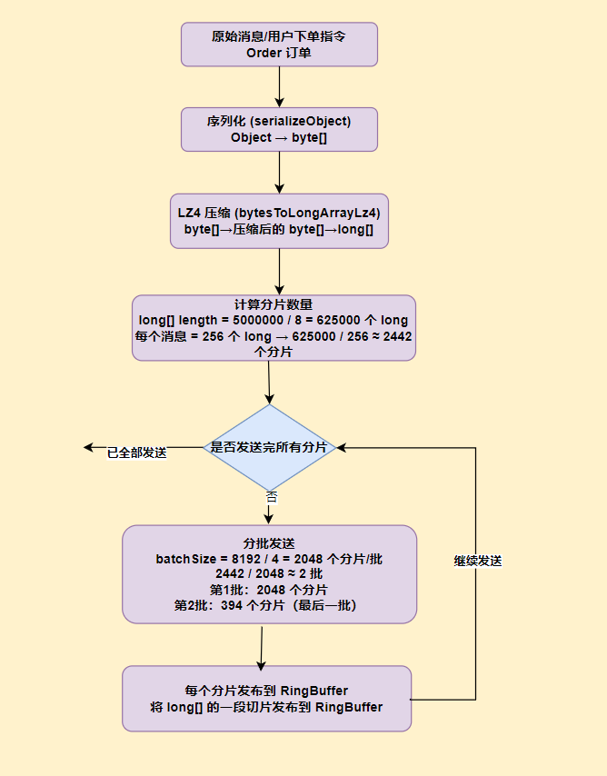

# 生产者传递数据到RingBuffer缓冲区


用户通过API提交的指令，不会直接将整个消息序列化后发送到RingBuffer缓冲区，为了防止单个消息过大沾满缓冲区，消息发送组件首先对消息进行序列化为字节数组，然后再进行压缩，最后转换为long数组后，分批次发送数据到缓冲区；下面看下发送数据源码:

```java
   /**
     * 发布二进制数据到 Disruptor RingBuffer
     *
     * 这个方法解决的核心问题：
     * 1. 大数据块无法一次性放入 RingBuffer（RingBuffer 容量有限）
     * 2. 需要保证数据的完整性和顺序性
     * 3. 需要高效利用 CPU 和内存
     *
     * 解决方案：分片（Fragmentation）+ 压缩
     *
     * @param cmdType 命令类型（如：BINARY_DATA_COMMAND）
     * @param data 要发送的二进制数据（实现了 WriteBytesMarshallable 接口）
     * @param dataTypeCode 数据类型代码（用于反序列化时识别类型）
     * @param transferId 传输ID（用于将多个分片组装回完整消息）
     * @param timestamp 时间戳
     * @param endSeqConsumer 最后一个分片发送完成后的回调（用于通知）
     */
    private void publishBinaryData(final OrderCommandType cmdType,
                                   final WriteBytesMarshallable data,
                                   final int dataTypeCode,
                                   final int transferId,
                                   final long timestamp,
                                   final LongConsumer endSeqConsumer) {
        // ==================== 第1步：序列化 + 压缩 ====================
        // 将对象序列化为字节数组，然后使用 LZ4 压缩，最后转换为 long 数组
        // 为什么用 long 数组？Disruptor 的 RingBuffer 存储的是 long 类型，
        // 这样可以直接将数据放入 RingBuffer，避免额外的内存复制
        final long[] longsArrayData = SerializationUtils.bytesToLongArrayLz4(
                lz4Compressor, // LZ4 压缩器
                BinaryCommandsProcessor.serializeObject(data, dataTypeCode), // 序列化后的字节数组
                LONGS_PER_MESSAGE);  // 每个消息包含的 long 数量（如 256）
        // ==================== 第2步：计算分片数量 ====================
        // 总消息数 = long 数组长度 / 每个消息的 long 数量
        // 例如：longsArrayData.length = 10000，LONGS_PER_MESSAGE = 256
        // 则 totalNumMessagesToClaim = 10000 / 256 ≈ 40 个消息分片
        final int totalNumMessagesToClaim = longsArrayData.length / LONGS_PER_MESSAGE;
        log.debug("消息总量是: 【{}】, 消息分片个数是: 【{}】", longsArrayData.length, totalNumMessagesToClaim);

        // ==================== 第3步：计算批次大小 ====================
        // 批次大小 = RingBuffer 容量的 1/4
        // 为什么要用 1/4？避免当前大消息填满整个 RingBuffer，导致其他消息无法发布（防止饥饿）
        // max fragment size is quarter of ring buffer
        final int batchSize = ringBuffer.getBufferSize() / 4;
        log.info("消息的每一个批次大小是: 【{}】",batchSize);

        int offset = 0;
        boolean isLastFragment = false;
        int fragmentSize = batchSize;
        // ==================== 第4步：循环分片发送 ====================
        do {
            // 计算当前分片大小
            if (offset + batchSize >= totalNumMessagesToClaim) {
                fragmentSize = totalNumMessagesToClaim - offset;// 最后一批，只发送剩余的部分
                isLastFragment = true;// 标记为最后一批
            }
            // 发送当前分片
            publishBinaryMessageFragment(cmdType, transferId, timestamp, endSeqConsumer, longsArrayData, fragmentSize, offset, isLastFragment);

            offset += batchSize;// 移动到下一个分片的起始位置

        } while (!isLastFragment); // 直到最后一批发送完成

    }
```

## 为什么进行这样设计？

### LZ4 压缩算法

LZ4 特点：
- 压缩/解压速度极快（比 GZIP 快 10-20 倍）
- 压缩率适中（约 50-60%）
- 适合低延迟场景
- 典型应用：数据库、消息队列、实时计算


其他压缩算法？
- ❌ GZIP：压缩率高但速度慢（不适合实时交易）
- ❌ Snappy：速度与 LZ4 相近，但 LZ4 解压更快
- ✅ LZ4：速度优先，适合高频交易

### 分片传输（Fragmentation）

1、为什么需要分片？

- RingBuffer 容量固定（如 8192 个槽位）
- 一条消息(大消息)可能需要 10000 个槽位 → 无法一次性放入

2、如何解决？

解决方案：拆分成多个小分片

原始消息: [数据块 10000 个槽位]
    ↓ 分片
分片1: [256 个槽位] + 分片2: [256 槽位] + ... + 分片40: [最后一个]


### 批量发送（Batching）


为什么不一个分片一个分片地发送？
1. 减少 RingBuffer 的发布次数（提高吞吐量）
2. 减少 CPU 缓存失效
3. 更好地利用批处理优化

示例：
不分批：40 次发布，每次 1 个分片
分批：8 次发布，每次 5 个分片 → 发布次数减少 80%


### 避免饥饿（Anti-Starvation）


为什么要限制批次大小为 RingBuffer 的 1/4？
- 场景：RingBuffer 容量 = 8192
- 大消息需要 8000 个槽位

如果不限制：一次性占满 8000 个槽位，其他消息无法发布 → 饥饿

限制为 1/4（2048 槽位）后：
1. 大消息只占 2048 槽位，留出 6144 槽位给其他消息
2. 其他消息仍然可以发布 → 公平调度


### 数据发送流程




交易系统为什么要这样设计数据发送流程？

| 问题                    | 解决方案     | 收益                |
| :---------------------- | :----------- | :------------------ |
| 对象序列化开销大        | LZ4 快速压缩 | 减少数据传输量 50%  |
| RingBuffer 容量限制     | 分片传输     | 支持任意大小消息    |
| 频繁发布开销大          | 批量发送     | 减少 80% 的发布次数 |
| 大数据块占满 RingBuffer | 限制批次大小 | 避免饥饿，保证公平  |


实际应用场景中，比如有30万档位数据:

1. 序列化：30万档位 → 约 10 MB
2. LZ4 压缩：10 MB → 约 5 MB
3. 分片：5 MB → 约 2442 个分片
4. 分批：2048 + 394 个分片
5. 发布：RingBuffer 中产生 2442 个事件

端到端的数据处理流程:

```text
// 发送端（当前方法）
publishBinaryData()
    ↓
序列化 + LZ4 压缩
    ↓
分片 + 批量
    ↓
RingBuffer

// 接收端（消费者）
BinaryCommandsProcessor (消费者)
    ↓
收集所有分片（通过 transferId 关联）
    ↓
LZ4 解压 + 反序列化
    ↓
恢复原始对象
```

### 为什么选择 5 作为 LONGS_PER_MESSAGE？


```java
 // ==================== 第1步：序列化 + 压缩 ====================
        // 将对象序列化为字节数组，然后使用 LZ4 压缩，最后转换为 long 数组
        // 为什么用 long 数组？Disruptor 的 RingBuffer 存储的是 long 类型，
        // 这样可以直接将数据放入 RingBuffer，避免额外的内存复制
        final long[] longsArrayData = SerializationUtils.bytesToLongArrayLz4(
                lz4Compressor, // LZ4 压缩器
                BinaryCommandsProcessor.serializeObject(data, dataTypeCode), // 序列化后的字节数组
                LONGS_PER_MESSAGE);  // 每个消息包含的 long 数量（如 256）
        // ==================== 第2步：计算分片数量 ====================
        // 总消息数 = long 数组长度 / 每个消息的 long 数量
        // 例如：longsArrayData.length = 10000，LONGS_PER_MESSAGE = 256
        // 则 totalNumMessagesToClaim = 10000 / 256 ≈ 40 个消息分片
        final int totalNumMessagesToClaim = longsArrayData.length / LONGS_PER_MESSAGE;
```

上面代码中，分片的个数也即发送到缓冲区事件的个数，算法如下:

```java
final int totalNumMessagesToClaim = longsArrayData.length / LONGS_PER_MESSAGE;
```

那为什么选择5个long大小作为分片的阈值? 也即意味着每个 Disruptor 事件携带 5 个 long = 40 字节的数据，为什么要这样设计?

1、CPU 缓存行对齐（最重要的原因）

CPU 缓存行大小：64 字节（主流 CPU）
1. 5 个 long = 5 × 8 = 40 字节
2. 40 字节 < 64 字节，可以完整放入一个缓存行

对比其他选择：
1. 4 个 long = 32 字节 → 浪费 32 字节缓存行空间
2. 8 个 long = 64 字节 → 完美对齐，但可能太大
3. 6 个 long = 48 字节 → 比 5 多 8 字节，收益不大

5 的优势：40 字节 + 24 字节元数据 ≈ 64 字节
事件对象 + 数据 ≈ 一个缓存行，最大化缓存利用率


关于cpu伪共享，请参考博文: [cpu 伪共享](https://www.cnblogs.com/crazymakercircle/p/16971596.html#autoid-h4-8-1-0)


2、内存占用与 GC 压力平衡

```java
// 假设传输 1MB 数据：
// 方案A：LONGS_PER_MESSAGE = 1
// 事件数 = 1MB / 8 = 131,072 个事件
// 内存占用 = 131,072 × (事件对象开销 ≈ 32字节) = 4.2 MB 额外开销
// GC 压力：极大

// 方案B：LONGS_PER_MESSAGE = 5（当前选择）
// 事件数 = 1MB / 40 = 25,600 个事件
// 内存占用 = 25,600 × 32 ≈ 0.8 MB 额外开销
// GC 压力：适中

// 方案C：LONGS_PER_MESSAGE = 64
// 事件数 = 1MB / 512 = 2,048 个事件
// 内存占用 = 2,048 × 32 ≈ 0.06 MB 额外开销
// 问题：延迟增加，批处理效果变差
```

3、网络 MTU 友好

```java
// 以太网 MTU = 1500 字节
// TCP 头部 = 20 字节
// IP 头部 = 20 字节
// 有效载荷 = 1460 字节

// LONGS_PER_MESSAGE = 5 → 40 字节
// 每个网络包可容纳 = 1460 / 40 = 36.5 ≈ 36 个消息
// 几乎没有浪费

// LONGS_PER_MESSAGE = 4 → 32 字节
// 每个包可容纳 = 1460 / 32 = 45.6 ≈ 45 个消息
// 也不错，但缓存效率较低
```

4、Disruptor RingBuffer 大小匹配

```java
// 典型 RingBuffer 大小：8192 或 16384
// LONGS_PER_MESSAGE = 5
// 单次最大传输 = 8192 × 5 × 8 = 327,680 字节 ≈ 320 KB

// 这是一个很好的批处理大小：
// - 不太小：避免过多事件
// - 不太大：避免占满 RingBuffer
// - 320KB 在 L3 缓存范围内（典型 L3 = 8-32MB）
```