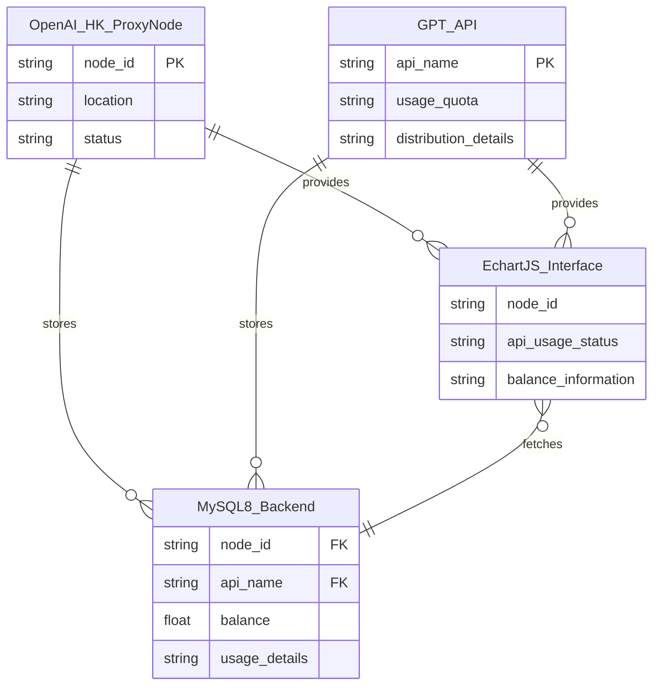

:::danger 这是一篇未完成的文档

:::
<RepoCard repo="DingGe3/Oh-My-Api"></RepoCard>

> 项目负责人：[::noto:red-heart::QingYe](/friends/persons/)

## 项目介绍

现行各生成式人工代理商不提供接口，每次需要登录后才能查看使用情况，每次余额不足了都不知道，较为不便，此项目是一个基于 EChart.js 的纯前端界面，用于展示 OpenAI-HK 代理节点的积分使用情况。计划后端采用 MySQL8 进行持久化存储。

## 项目UML



## 开发计划

1. API使用日期及月份分布（折线图）
2. 对IP、模型的简单分类，使用滑块组件或下拉框切换视图
3. 接入项导后端登录验证系统及MySQL持久化存储
4. 使用cookie和逆向技术，python自动获取openai-hk日志

## 项目配置

推荐IDE: VSCode，使用教程参考：[PGuide文档](/campus-wiki/common-software/IDE/VSCode/)
详见https://github.com/DingGe3/Oh-My-Api的README文件

### 安装依赖

参考[CQMU镜像站Wiki#PYPI](/public-service/cqmu-mirror/wiki/#pypi)加速安装！

操作步骤：使用pip进行环境管理

```python
pip install -r requirements.txt
```

## 分支说明

### main

纯HTML、CSS、JS实现。

### vue-component-dev

使用现代Vue3组合式语法和API开发oh-my-api


## OpenAI-HK使用日志字段

时间、模型、IP、prompt、completion、token、积分消耗、当前余额积分、请求ID、key、info


## 项目依赖技术架构

后端：node.js运行环境  
express架构定义路由  
jsonwebtoken实现身份认证  
cors跨域共享  
前端：vue架构开发  
echarts实现图表显示  
逻辑层：使用Python处理数据，统一由前端调用  

